# Table of Contents
 <p><div class="lev1 toc-item"><a href="#RNA-seq-Analysis-for-Angeles-and-Leighton,-2016." data-toc-modified-id="RNA-seq-Analysis-for-Angeles-and-Leighton,-2016.-1"><span class="toc-item-num">1&nbsp;&nbsp;</span>RNA-seq Analysis for Angeles and Leighton, 2016.</a></div><div class="lev1 toc-item"><a href="#Importing-Data-and-a-Brief-Reminder-of-Sleuth-Results" data-toc-modified-id="Importing-Data-and-a-Brief-Reminder-of-Sleuth-Results-2"><span class="toc-item-num">2&nbsp;&nbsp;</span>Importing Data and a Brief Reminder of Sleuth Results</a></div><div class="lev1 toc-item"><a href="#Run-TEA" data-toc-modified-id="Run-TEA-3"><span class="toc-item-num">3&nbsp;&nbsp;</span>Run TEA</a></div><div class="lev1 toc-item"><a href="#Fig-1b,-TEA" data-toc-modified-id="Fig-1b,-TEA-4"><span class="toc-item-num">4&nbsp;&nbsp;</span>Fig 1b, TEA</a></div><div class="lev1 toc-item"><a href="#PEA" data-toc-modified-id="PEA-5"><span class="toc-item-num">5&nbsp;&nbsp;</span>PEA</a></div><div class="lev1 toc-item"><a href="#GEA" data-toc-modified-id="GEA-6"><span class="toc-item-num">6&nbsp;&nbsp;</span>GEA</a></div><div class="lev1 toc-item"><a href="#Figure-out-aging-set-quality-via-a-hypergeometric-test" data-toc-modified-id="Figure-out-aging-set-quality-via-a-hypergeometric-test-7"><span class="toc-item-num">7&nbsp;&nbsp;</span>Figure out aging set quality via a hypergeometric test</a></div><div class="lev1 toc-item"><a href="#Volcano-Plots" data-toc-modified-id="Volcano-Plots-8"><span class="toc-item-num">8&nbsp;&nbsp;</span>Volcano Plots</a></div><div class="lev2 toc-item"><a href="#Fig-1a" data-toc-modified-id="Fig-1a-8.1"><span class="toc-item-num">8.1&nbsp;&nbsp;</span>Fig 1a</a></div><div class="lev1 toc-item"><a href="#Identifying-Transcription-Factors-Involved" data-toc-modified-id="Identifying-Transcription-Factors-Involved-9"><span class="toc-item-num">9&nbsp;&nbsp;</span>Identifying Transcription Factors Involved</a></div><div class="lev2 toc-item"><a href="#Get-the-number-and-identity-of-all-transcription-factors-that-are-differentially-expressed" data-toc-modified-id="Get-the-number-and-identity-of-all-transcription-factors-that-are-differentially-expressed-9.1"><span class="toc-item-num">9.1&nbsp;&nbsp;</span>Get the number and identity of all transcription factors that are differentially expressed</a></div><div class="lev2 toc-item"><a href="#TEA-for-TFs" data-toc-modified-id="TEA-for-TFs-9.2"><span class="toc-item-num">9.2&nbsp;&nbsp;</span>TEA for TFs</a></div><div class="lev1 toc-item"><a href="#Defining-the-Female-Transcriptome" data-toc-modified-id="Defining-the-Female-Transcriptome-10"><span class="toc-item-num">10&nbsp;&nbsp;</span>Defining the Female Transcriptome</a></div><div class="lev1 toc-item"><a href="#Interactive-Volcano-Plots" data-toc-modified-id="Interactive-Volcano-Plots-11"><span class="toc-item-num">11&nbsp;&nbsp;</span>Interactive Volcano Plots</a></div><div class="lev2 toc-item"><a href="#Interactive-Aging-Volcano-Plot,-Figure-2a" data-toc-modified-id="Interactive-Aging-Volcano-Plot,-Figure-2a-11.1"><span class="toc-item-num">11.1&nbsp;&nbsp;</span>Interactive Aging Volcano Plot, Figure 2a</a></div><div class="lev2 toc-item"><a href="#Interactive-Genotype-Volcano-Plot" data-toc-modified-id="Interactive-Genotype-Volcano-Plot-11.2"><span class="toc-item-num">11.2&nbsp;&nbsp;</span>Interactive Genotype Volcano Plot</a></div><div class="lev2 toc-item"><a href="#Interactive-Interaction-Volcano-Plot" data-toc-modified-id="Interactive-Interaction-Volcano-Plot-11.3"><span class="toc-item-num">11.3&nbsp;&nbsp;</span>Interactive Interaction Volcano Plot</a></div><div class="lev1 toc-item"><a href="#Interactive-Cross-Plots" data-toc-modified-id="Interactive-Cross-Plots-12"><span class="toc-item-num">12&nbsp;&nbsp;</span>Interactive Cross Plots</a></div><div class="lev2 toc-item"><a href="#Aging-vs.-Genotype,-Interactive-Figure-3a" data-toc-modified-id="Aging-vs.-Genotype,-Interactive-Figure-3a-12.1"><span class="toc-item-num">12.1&nbsp;&nbsp;</span>Aging vs. Genotype, Interactive Figure 3a</a></div><div class="lev2 toc-item"><a href="#Aging-vs.-Aging::Genotype,-Interactive-Figure-3b" data-toc-modified-id="Aging-vs.-Aging::Genotype,-Interactive-Figure-3b-12.2"><span class="toc-item-num">12.2&nbsp;&nbsp;</span>Aging vs. Aging::Genotype, Interactive Figure 3b</a></div><div class="lev2 toc-item"><a href="#Genotype-vs.-Aging::Genotype,-Interactive-Figure" data-toc-modified-id="Genotype-vs.-Aging::Genotype,-Interactive-Figure-12.3"><span class="toc-item-num">12.3&nbsp;&nbsp;</span>Genotype vs. Aging::Genotype, Interactive Figure</a></div><div class="lev1 toc-item"><a href="#Figure-3a,-3b" data-toc-modified-id="Figure-3a,-3b-13"><span class="toc-item-num">13&nbsp;&nbsp;</span>Figure 3a, 3b</a></div>

# RNA-seq Analysis for Angeles and Leighton, 2016.

We used Kallisto to map reads and estimate TPM counts and Sleuth to analyze the RNA-seq data.

However, because I like to make my own plots, and because I wanted to carry out extensive analysis (I mainly write in python), the results were transferred from R into this python pipeline.

This pipeline is built using Python > 3.5

Requirements:

pandas
numpy
matplotlib.pyplot

tissue_enrichment analysis (`pip install tissue_enrichment_analysis` to get it; publication forthcoming)

pyrnaseq_graphics (found in our [github repository](https://github.com/WormLabCaltech/Angeles_And_Leighton_2016), publication may be forthcoming)


```python
import pandas as pd
import numpy as np
import seaborn as sns
import matplotlib.pyplot as plt
import tissue_enrichment_analysis as tea
import pyrnaseq_graphics as rsq
import scipy.stats as stats
import matplotlib as mpl

from IPython.core.display import HTML


# bokeh
import bokeh.charts
import bokeh.charts.utils
import bokeh.io
import bokeh.models
import bokeh.palettes
import bokeh.plotting
from bokeh.plotting import figure
from bokeh.resources import CDN
from bokeh.embed import file_html

# Display graphics in this notebook
bokeh.io.output_notebook()

```


    <div class="bk-root">
        <a href="http://bokeh.pydata.org" target="_blank" class="bk-logo bk-logo-small bk-logo-notebook"></a>
        <span id="fb331317-52f9-48e7-bee3-49520bbb2471">Loading BokehJS ...</span>
    </div>


```python
%matplotlib inline

# This enables high res graphics inline (only use with static plots (non-Bokeh))
# SVG is preferred, but there is a bug in Jupyter with vertical lines
%config InlineBackend.figure_formats = {'png', 'retina'}

# from IPython.display import set_matplotlib_formats
# set_matplotlib_formats('png')
rc = {'lines.linewidth': 2,
      'axes.labelsize': 22,
      'axes.titlesize': 20,
      'legend.fontsize': 'x-large',
      'axes.facecolor': 'DFDFE5'}
sns.set_context('paper', rc=rc)
sns.set_style('dark', rc=rc)

import matplotlib.cm as cm
from matplotlib import rc
rc('text', usetex=True)
import matplotlib.patheffects as path_effects


mag = 2  # value of beta from regression
qval = .1  # qvalue from regression
qvalEn = 0.05  # q value for enrichment analysis (tissues)

```

# Importing Data and a Brief Reminder of Sleuth Results

First, I load all my data. Briefly, remember that Sleuth calculates log-linear models of the form

$$
log(y_i) = \beta_0 + \sum\limits_{k\epsilon K}\beta_k \cdot x_k + \sum\limits_{k\epsilon K}\sum\limits_{l\epsilon L} \beta_{k, l} \cdot x_k \cdot x_l + ...
$$

and these linear models can be extended to have interactions, etc..

For our specific model, we chose a linear model with interactions, of the form:

$$
log(y_i) = \beta_0 + \beta_{\mathrm{Old Adult}} \cdot x_{\mathrm{Old Adult}} + \beta_{\mathrm{fog-2}} \cdot x_{\mathrm{fog-2}} + \beta_{\mathrm{fog-2, Old Adult}} \cdot x_{\mathrm{fog-2}} \cdot x_{\mathrm{Old Adult}}
$$


```python
output_aging = '../output/raw_aging_plots/'
output_genotype = '../output/raw_genotype_plots/'
output_interaction = '../output/raw_interaction_plots/'
output_sperm = '../output/raw_sperm_plots/'

# gene_lists from sleuth
# tpm vals for PCA
path = '../input/sleuth_results/'
# pos beta means high old adults
dfBetaA = pd.read_csv(path + "si2_aging_analysis.csv", comment='#')
dfBetaA.dropna(inplace=True)
# pos beta means high in fog2
dfBetaG = pd.read_csv(path + "si3_genotype_analysis.csv", comment='#')
dfBetaG.dropna(inplace=True)
# pos beta means high in fog2-aged
dfBetaAG = pd.read_csv(path + "si4_interaction_analysis.csv", comment='#')
dfBetaAG.dropna(inplace=True)
# likelihood ratio test results
dfLRT = pd.read_csv(path + "lrt.csv")
dfLRT.dropna(inplace=True)

# sort by target_id
dfBetaA.sort_values('target_id', inplace=True)
dfBetaA.reset_index(inplace=True)
dfBetaG.sort_values('target_id', inplace=True)
dfBetaG.reset_index(inplace=True)
dfBetaAG.sort_values('target_id', inplace=True)
dfBetaAG.reset_index(inplace=True)
dfLRT.sort_values('target_id', inplace=True)
dfLRT.reset_index(inplace=True)

# gold standard datasets
path = '../input/gold_standards/'
dfDaf12 = pd.read_csv(path + 'daf12genes.csv')
dfDaf16 = pd.read_csv(path + 'daf16genes.csv')
dfLund = pd.read_csv(path + 'lund_data.csv', header=None, names=['gene'])
dfEckley = pd.read_csv(path + 'eckley_data.csv', header=None, names=['gene'])
dfMurphyUp = pd.read_csv(path + 'murphy_data_lifespan_extension.csv')
dfMurphyDown = pd.read_csv(path + 'murphy_data_lifespan_decrease.csv')
dfHalaschek = pd.read_csv(path + 'Halaschek-Wiener_data.csv')

# gpcrs
dfGPCR = pd.read_csv(path + 'all_gpcrs.csv')
dfICh = pd.read_csv(path + 'select_ion_transport_genes.csv')
dfAxon = pd.read_csv(path + 'axonogenesis_genes.csv')
dfNP = pd.read_csv(path + 'neuropeptides.csv')

# gpcr is going to go into a gold standard fxn so add an 'origin' colmn
dfGPCR['origin'] = 'gpcrs'
dfICh['origin'] = 'select ion transport genes'
dfAxon['origin'] = 'axonogenesis genes'
dfNP['origin'] = 'neuropeptide genes'
frames = [dfGPCR, dfICh, dfAxon, dfNP]
dfTargets = pd.concat(frames)

dfTargets.columns = ['gene', 'effect']

# place all the gold standards in a single dataframe:
dfDaf12['origin'] = 'daf-12'
dfDaf16['origin'] = 'daf-16'
dfEckley['origin'] = 'Eckley'
dfLund['origin'] = 'Lund'
dfMurphyUp['origin'] = 'MurphyExt'
dfMurphyDown['origin'] = 'MurphyDec'
dfHalaschek['origin'] = 'Halaschek'
frames = [dfDaf12, dfDaf16, dfEckley, dfLund,
          dfMurphyDown, dfMurphyUp, dfHalaschek]
dfGoldStandard = pd.concat(frames)

# from wormbase
dfLifespanGenes = pd.read_csv(path + 'lifespan gene list complete.csv')

tissue_df = tea.fetch_dictionary()
phenotype_df = pd.read_csv('../input/phenotype_ontology.csv')
go_df = pd.read_csv('../input/go_dictionary.csv')

tf = pd.read_csv('../input/tf_list.csv')
# go = pd.read_csv('../input/go.csv')
```


```python
# sterility = pd.read_csv('~/Downloads/sterility genes.txt', header=None)
# sperm = pd.read_csv('~/Downloads/sperm genes by phenotype.txt', header=None)

path = '../input/sleuth_results/'
df_TPM = pd.read_csv(path + 'tpm_table.csv')

xticksize = 15.5
xlabelsize = 23
ylabelsize_volcano = 23
volcano_legendsize = 10
```

# Run TEA

Run tissue enrichment analysis to identify tissues most impacted by aging and genotype. We will run the analysis three times:
Once for genes that are differentially affected by aging, once for genes that are differentially affected by genotype, and once for genes that have significant interaction terms.


```python
# TEA
teaA = tea.enrichment_analysis(dfBetaA[(dfBetaA.qval < qval)].ens_gene, tissue_df,
                                 show=False)
teaG = tea.enrichment_analysis(dfBetaG[(dfBetaG.qval < qval)].ens_gene, tissue_df,
                                 show=False)
teaAG = tea.enrichment_analysis(dfBetaAG[(dfBetaAG.qval < qval)].ens_gene, tissue_df,
                                 show=False)

# PEA
peaA = tea.enrichment_analysis(dfBetaA[(dfBetaA.qval < qval)].ens_gene, phenotype_df,
                                 show=False)
peaG = tea.enrichment_analysis(dfBetaG[(dfBetaG.qval < qval)].ens_gene, phenotype_df,
                                 show=False)
peaAG = tea.enrichment_analysis(dfBetaAG[(dfBetaAG.qval < qval)].ens_gene, phenotype_df,
                                 show=False)

# GEA
geaA = tea.enrichment_analysis(dfBetaA[(dfBetaA.qval < qval)].ens_gene, go_df,
                                 show=False)
geaG = tea.enrichment_analysis(dfBetaG[(dfBetaG.qval < qval)].ens_gene, go_df,
                                 show=False)
geaAG = tea.enrichment_analysis(dfBetaAG[(dfBetaAG.qval < qval)].ens_gene, go_df,
                                 show=False)
```

Make relevant plots using the inbuilt plotter in tea:

# Fig 1b, TEA


```python
def fix_fonts(n, ax):
    if type(n) != int:
        raise ValueError('n must be an integer')

    ax.xaxis.label.set_fontsize(n)
    ax.yaxis.label.set_fontsize(n)
    ax.title.set_fontsize(n)


fig, ax = plt.subplots()
tea.plot_enrichment_results(teaA, save=False)
plt.title('Enriched Tissues in Aging-Related Genes')
plt.ylabel('')
fix_fonts(15, ax)
plt.savefig(output_aging + 'tea_aging.svg', transparent=True)

fig, ax = plt.subplots()
tea.plot_enrichment_results(teaG, save=False)
plt.title('Enriched Tissues in Genotype-Related Genes')
plt.ylabel('')
fix_fonts(15, ax)
plt.savefig(output_genotype + 'tea_genotype.svg', transparent=True)

fig, ax = plt.subplots()
tea.plot_enrichment_results(teaAG, save=False)
plt.title('Enriched Tissues in Interacting Genes')
plt.ylabel('')
fix_fonts(15, ax)
plt.savefig(output_interaction + 'tea_interaction.svg', transparent=True)
```


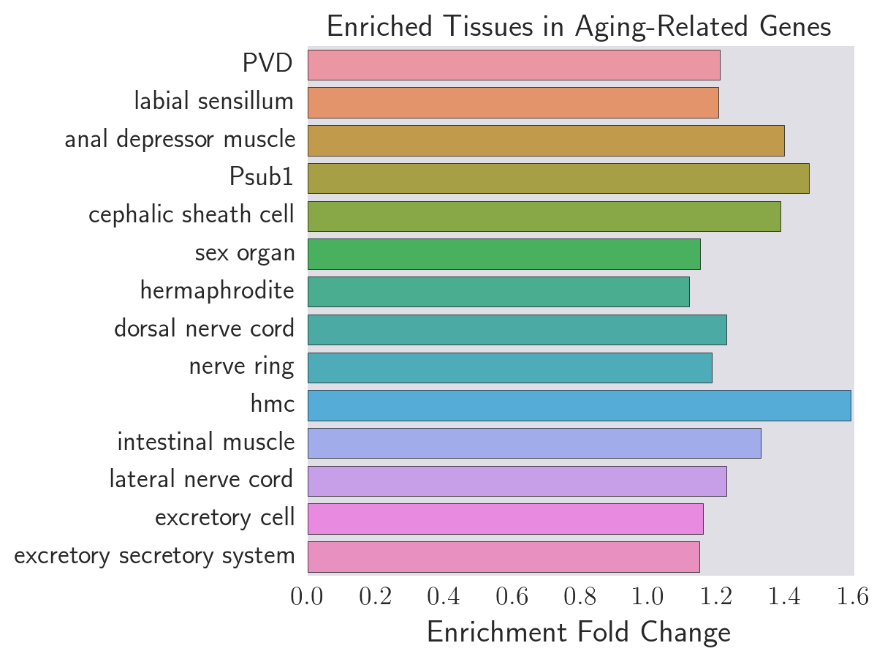


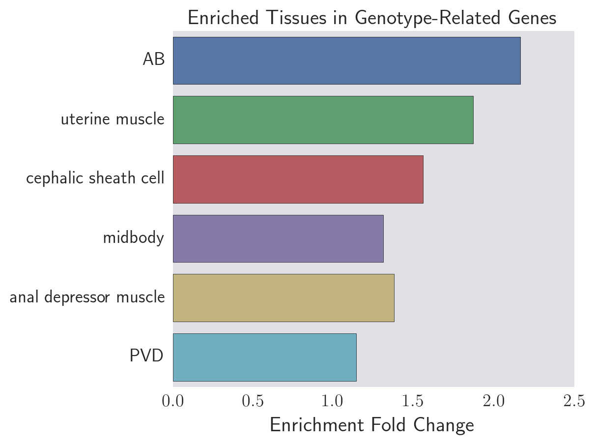


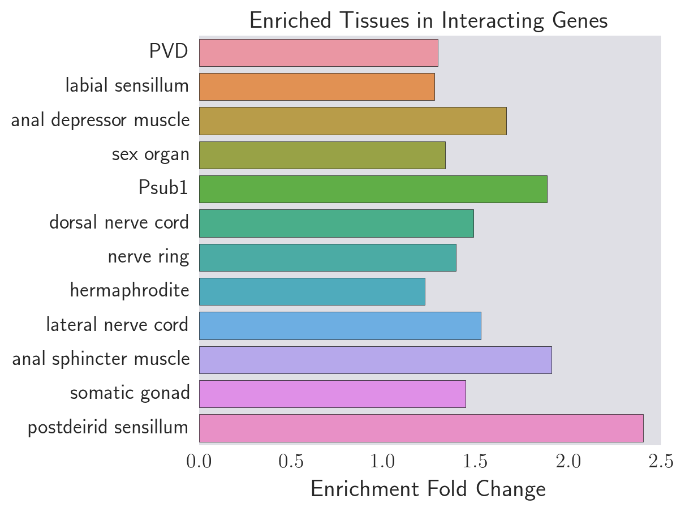


# PEA


```python
fig, ax = plt.subplots()
tea.plot_enrichment_results(peaA, save=False, analysis='phenotype')
plt.title('Enriched Phenotypes in Aging-Related Genes')
plt.ylabel('')
fix_fonts(15, ax)
plt.savefig(output_aging + 'pea_aging.svg', transparent=True)

fig, ax = plt.subplots()
tea.plot_enrichment_results(peaG, save=False, analysis='phenotype')
plt.title('Enriched Phenotypes in Genotype-Related Genes')
plt.ylabel('')
fix_fonts(15, ax)
plt.savefig(output_genotype + 'pea_genotype.svg', transparent=True)

fig, ax = plt.subplots()
tea.plot_enrichment_results(peaAG, save=False, analysis='phenotype')
plt.title('Enriched Phenotypes in Interacting Genes')
plt.ylabel('')
fix_fonts(15, ax)
plt.savefig(output_interaction + 'pea_interaction.svg', transparent=True)
```


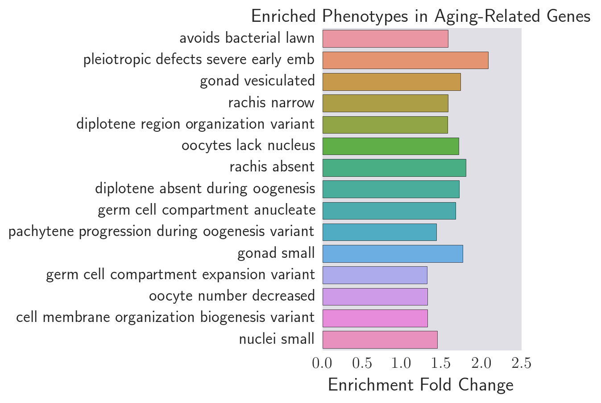


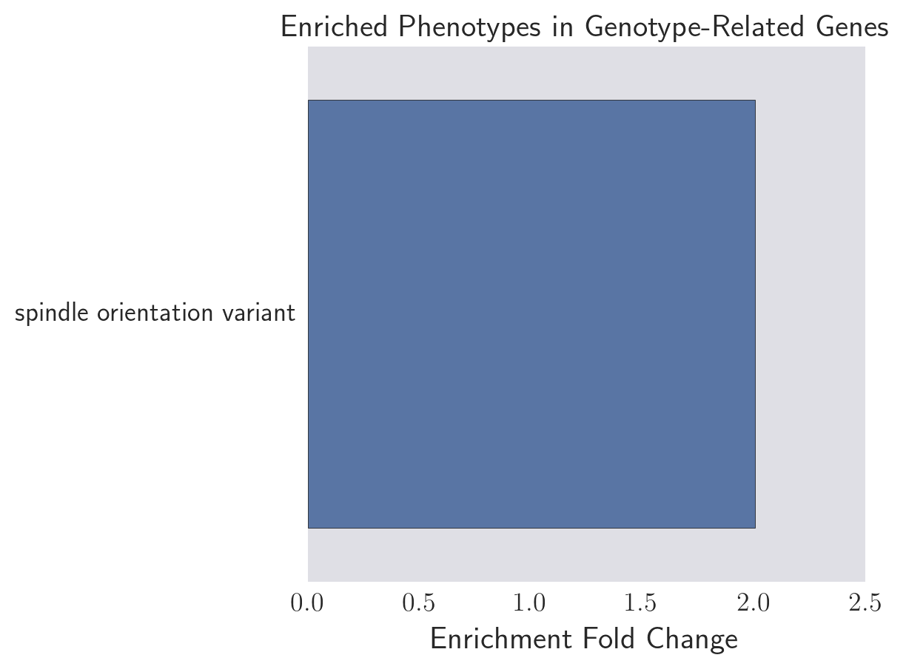


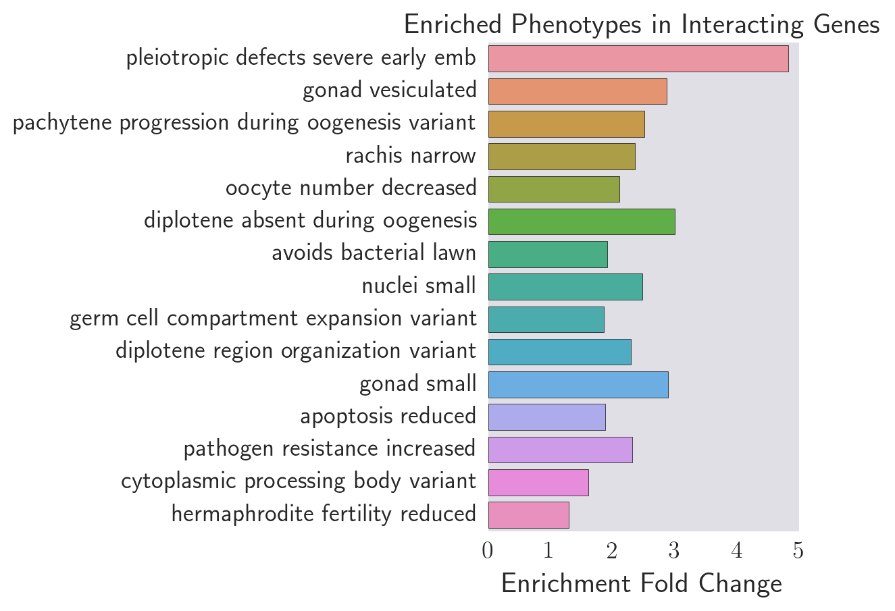


# GEA


```python
fig, ax = plt.subplots()
tea.plot_enrichment_results(geaA, save=False, analysis='go')
plt.title('Enriched Terms in Aging-Related Genes')
plt.ylabel('')
fix_fonts(15, ax)
plt.savefig(output_aging + 'gea_aging.svg', transparent=True)

fig, ax = plt.subplots()
tea.plot_enrichment_results(geaG, save=False, analysis='go')
plt.title('Enriched Terms in Genotype-Related Genes')
plt.ylabel('')
fix_fonts(15, ax)
plt.savefig(output_genotype + 'gea_genotype.svg', transparent=True)

fig, ax = plt.subplots()
tea.plot_enrichment_results(geaAG, save=False, analysis='go')
plt.title('Enriched Terms in Interacting Genes')
plt.ylabel('')
fix_fonts(15, ax)
plt.savefig(output_interaction + 'gea_interaction.svg', transparent=True)
```


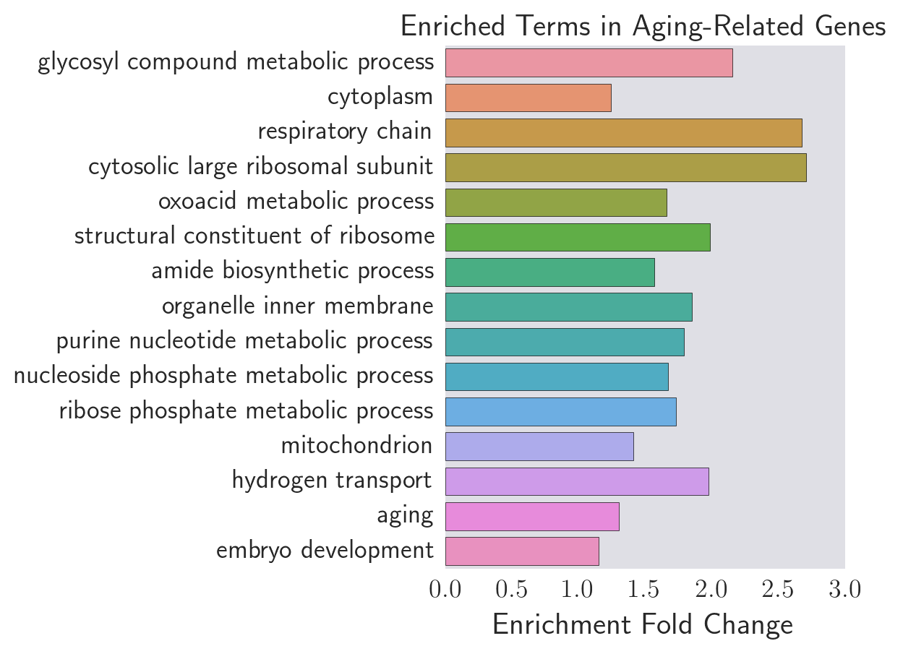


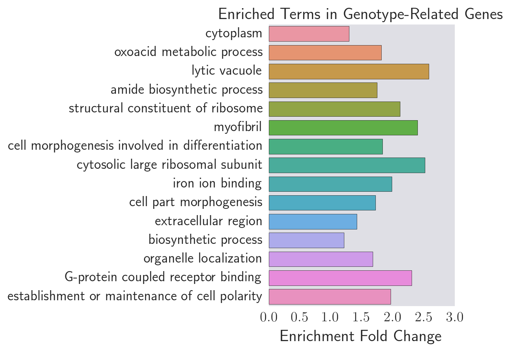


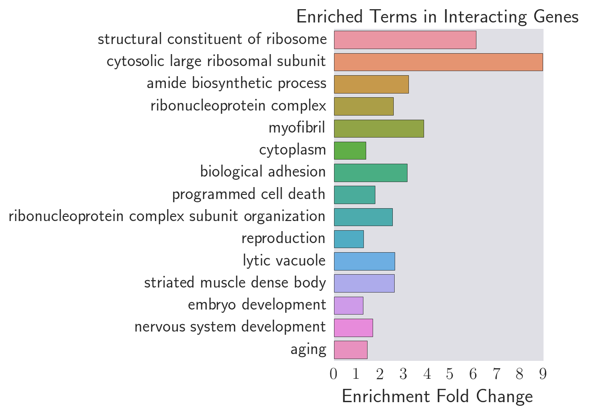


TEA suggests that the muscle is heavily impacted by aging, which makes sense. Interestingly, the pharynx is most overrepresented, but neither of us have noticed pumping differences between old and young animals. Stratifying results by effect sign shows that upregulated genes are responsible for the enrichment of these terms, and genes that are downregulated have no statistically significant enrichment.

Genotype TEA also yields sensible results. The terms 'uterine muscle', 'midbody', 'sex organ' and 'somatic gonad' all turn up, which reflect the nature of the genetic change caused by the fog-2 mutation, namely, loss of sperm. Interestingly, stratifying the analysis by effect sign (b > 0 or b < 0), shows that genes upregulated in fog-2 relative to N2 are mainly associated with germline/gonad/hypodermis, whereas downregulated genes are associated with muscles.

Interestingly, running TEA on Life-History genes also suggests that certain muscles experience significantly different stresses between worms of different genotype. Stratified analyses show that genes with significantly negative interaction terms are mainly neuronally associated, whereas genes with significantly positive interactions terms show excretory cell and pharynx.

# Figure out aging set quality via a hypergeometric test


```python
sig = (dfBetaA.qval < 0.1)
gold = (dfBetaA.ens_gene.isin(dfGoldStandard.gene))
found = dfBetaA[sig & gold].shape[0]
pval = stats.hypergeom.sf(found, dfBetaA.shape[0], dfGoldStandard.shape[0], dfBetaA[sig].shape[0])
s = 'There are {0} gold standard genes in the aging set. '
s += 'This number is enriched above background at a p-value of {1:.2g}'
print(s.format(found, pval))
```

    There are 512 gold standard genes in the aging set. This number is enriched above background at a p-value of 8.1e-39


# Volcano Plots

## Fig 1a


```python
rc('text', usetex=True)

# plot size
ms = 4

# funcs
def selector(df):
    """A function to separate tfs from everything else"""
    sig = (df.qval < 0.1)# & (dfBetaA.b.abs() > 0.5)
    not_tf = (~df.target_id.isin(tf.target_id))
    is_tf = (df.target_id.isin(tf.target_id))
    to_plot_not = df[sig & not_tf]
    to_plot_yes = df[sig & is_tf]
    return to_plot_not, to_plot_yes

def downsampler(df, threshold=10**-10, frac=0.30):
    """A function to downsample a dataframe"""
    if (frac < 0) or (frac > 1):
        raise ValueError('frac must be between 0 and 1')
    df = df[df.qval > threshold]
    select = np.int(np.floor(df.shape[0]*frac))
    downsampled = df.sample(select)
    return downsampled

# downsampling threshold
threshold = 10**-30

# figure out where the TFs are
to_plot_not, to_plot_yes = selector(dfBetaA)
# figure out what to downsample
to_plot_not_downsampled = downsampler(to_plot_not, threshold)

# plot everything not a TF and above a certain -logq value
plt.plot(to_plot_not[to_plot_not.qval < threshold].b,
         -to_plot_not[to_plot_not.qval < threshold].qval.apply(np.log10), 'o',
         color='#1a9641', alpha=.6, ms=ms,
         label='D.E. Isoforms, {0}'.format(to_plot_not.shape[0]),)

# plot tfs
plt.plot(to_plot_yes.b, -to_plot_yes.qval.apply(np.log10), 'o',
         color='#fc8d59', ms=ms, label='D.E. T.F. Isoforms, {0}'.format(to_plot_yes.shape[0]))

# plot the legend so that you don't get multiple labels
plt.legend(loc=(0.6,.7), frameon=True, fontsize=12).set_path_effects([path_effects.Normal()])

# plot downsampled points that are below the downsampling sig. threshold
# and set zorder to 0 so they are behind everything else
plt.plot(to_plot_not_downsampled.b, -to_plot_not_downsampled.qval.apply(np.log10), 'o',
         color='#1a9641', alpha=0.6, ms=ms, zorder=0)

plt.xticks([-8, -4, 0, 4, 8], fontsize=12)
plt.yticks([0, 50, 100], fontsize=12)
plt.xlabel(r'\beta_\mathrm{Genotype}').set_path_effects([path_effects.Normal()])
plt.ylabel(r'-\log_{10}{Q}').set_path_effects([path_effects.Normal()])
plt.title('Differentially Expressed Isoforms in Aging Worms',
          y=1.02).set_path_effects([path_effects.Normal()])

plt.savefig(output_aging + 'volcano_plot_aging.svg', transparent=False, bbox_inches='tight')
```


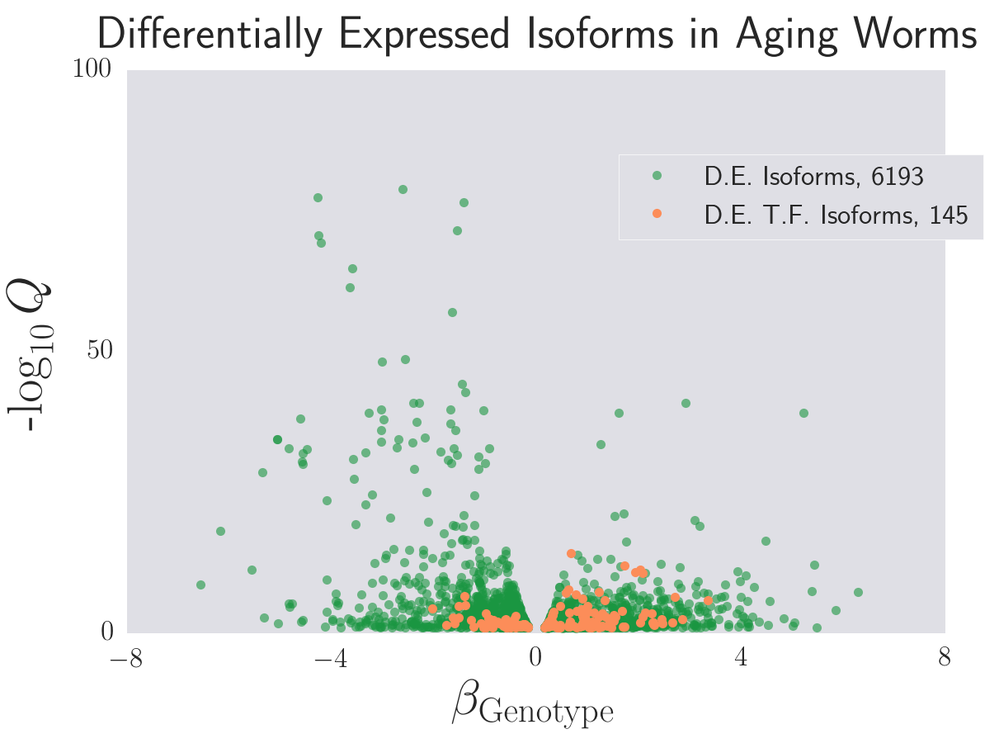


```python
to_plot_not, to_plot_yes = selector(dfBetaG)
threshold=10**-20

to_plot_not_downsampled = downsampler(to_plot_not, threshold, frac=0.60)

# plot everything not a TF and above a certain -logq value
plt.plot(to_plot_not[to_plot_not.qval < threshold].b,
         -to_plot_not[to_plot_not.qval < threshold].qval.apply(np.log10), 'o',
         color='#1a9641', alpha=0.6, ms=ms,
         label='D.E. Isoforms, {0}'.format(to_plot_not.shape[0]))

# plot tfs
plt.plot(to_plot_yes.b, -to_plot_yes.qval.apply(np.log10), 'o',
         color='#fc8d59', ms=ms, label='D.E. T.F. Isoforms, {0}'.format(to_plot_yes.shape[0]))

# plot the legend so that you don't get multiple labels
plt.legend(loc=(0.6,.85), frameon=True, fontsize=12).set_path_effects([path_effects.Normal()])

# plot downsampled points that are below the downsampling sig. threshold
# and set zorder to 0 so they are behind everything else
plt.plot(to_plot_not_downsampled.b, -to_plot_not_downsampled.qval.apply(np.log10), 'o',
         color='#1a9641', alpha=0.6, ms=ms, zorder=0)


plt.xticks([-8, -4, 0, 4, 8], fontsize=12)
plt.yticks([0, 15, 30], fontsize=12)
plt.xlabel(r'\beta_\mathrm{Genotype}').set_path_effects([path_effects.Normal()])
plt.ylabel(r'-\log_{10}{Q}').set_path_effects([path_effects.Normal()])
plt.title(r'Differentially Expressed Isoforms in \emph{fog-2} Worms',
          y=1.02).set_path_effects([path_effects.Normal()])

plt.savefig(output_genotype + 'volcano_plot_genotype.svg', transparent=False)
```


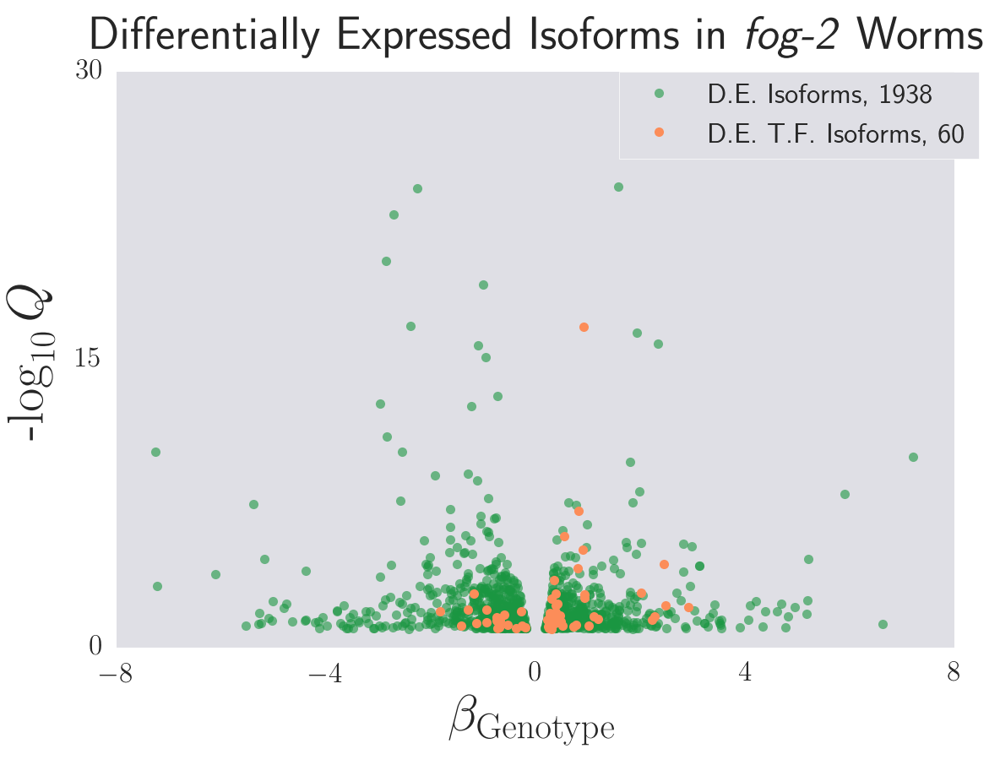


```python
title = r'Isoforms with Significant Interaction Coefficients'

# make temporary dataframes to plot
to_plot_not, to_plot_yes = selector(dfBetaAG)

# plot everything not a TF
plt.plot(to_plot_not.b, -to_plot_not.qval.apply(np.log10), 'o',
         color='#1a9641', alpha=0.6, ms=ms,
         label='D.E. Isoforms, {0}'.format(to_plot_not.shape[0]))

# plot TF
plt.plot(to_plot_yes.b, -to_plot_yes.qval.apply(np.log10), 'o',
         color='#fc8d59', ms=ms,
         label='D.E. T.F. Isoforms, {0}'.format(to_plot_yes.shape[0]))

#axes
plt.xticks([-12, -6, 0, 6, 12], fontsize=12)
plt.yticks([0, 6, 12], fontsize=12)
plt.xlabel(r'\beta_\mathrm{Genotype}').set_path_effects([path_effects.Normal()])
plt.ylabel(r'-\log_{10}{Q}').set_path_effects([path_effects.Normal()])
plt.title(title).set_path_effects([path_effects.Normal()])

plt.legend(loc=(0.6,.7), frameon=True, fontsize=12)
```


    <matplotlib.legend.Legend at 0x1203b5cf8>


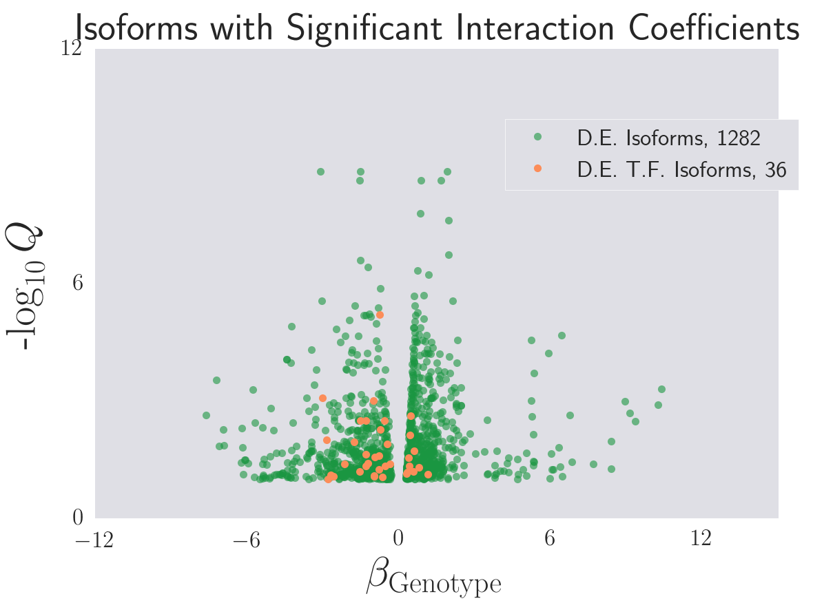


# Identifying Transcription Factors Involved

## Get the number and identity of all transcription factors that are differentially expressed


```python
# Aging Transcription Factors
ind1 = (dfBetaA.qval < qval)
ind2 = (dfBetaA.target_id.isin(tf.target_id))
inds = ind1 & ind2
x = dfBetaA[inds].sort_values('qval')
print(x.shape)
x.to_csv('../output/tf_aging.csv')
```

    (145, 15)


```python
# Genotype Transcription Factors
ind1 = (dfBetaG.qval < qval)
ind2 = (dfBetaG.target_id.isin(tf.target_id))
inds = ind1 & ind2
y = dfBetaG[inds].sort_values('qval')
print(y.shape)
y.to_csv('../output/tf_genotype.csv')
```

    (60, 15)


```python
# INteraction Transcription Factors
ind1 = (dfBetaAG.qval < qval)
ind2 = (dfBetaAG.target_id.isin(tf.target_id))
inds = ind1 & ind2
z = dfBetaAG[inds].sort_values('qval')
print(z.shape)
```

    (36, 15)


## TEA for TFs


```python
teaTFA = tea.enrichment_analysis(x.ens_gene, tissue_df, show=False)
teaTFG = tea.enrichment_analysis(y.ens_gene, tissue_df, show=False)
teaTFAG = tea.enrichment_analysis(z.ens_gene, tissue_df, show=False)
```


```python
l = len('WBbt:0005829')
teaTFA.Tissue = teaTFA.Tissue.map(lambda x: str(x)[:-l-1])
teaTFG.Tissue = teaTFG.Tissue.map(lambda x: str(x)[:-l-1])
teaTFAG.Tissue = teaTFAG.Tissue.map(lambda x: str(x)[:-l-1])
teaTFA[(teaTFA.Expected > 2)  &
     (teaTFA.Observed > 2)][['Tissue', 'Expected', 'Observed', 'Q value']]
```


<div>
<table border="1" class="dataframe">
  <thead>
    <tr style="text-align: right;">
      <th></th>
      <th>Tissue</th>
      <th>Expected</th>
      <th>Observed</th>
      <th>Q value</th>
    </tr>
  </thead>
  <tbody>
    <tr>
      <th>34</th>
      <td>head muscle</td>
      <td>4.398884</td>
      <td>13</td>
      <td>0.000664</td>
    </tr>
    <tr>
      <th>229</th>
      <td>HSN</td>
      <td>2.718412</td>
      <td>6</td>
      <td>0.042564</td>
    </tr>
  </tbody>
</table>
</div>


```python
teaTFG[(teaTFG.Expected > 2)  & (teaTFG.Observed > 2)][['Tissue', 'Expected', 'Observed', 'Q value']]
```


<div>
<table border="1" class="dataframe">
  <thead>
    <tr style="text-align: right;">
      <th></th>
      <th>Tissue</th>
      <th>Expected</th>
      <th>Observed</th>
      <th>Q value</th>
    </tr>
  </thead>
  <tbody>
    <tr>
      <th>30</th>
      <td>head muscle</td>
      <td>2.496513</td>
      <td>6</td>
      <td>0.030991</td>
    </tr>
  </tbody>
</table>
</div>


# Defining the Female Transcriptome


```python
# reindex the dataframes
dfBetaA.sort_values('target_id', inplace=True)
dfBetaA.reset_index(inplace=True)
dfBetaG.sort_values('target_id', inplace=True)
dfBetaG.reset_index(inplace=True)
dfBetaAG.sort_values('target_id', inplace=True)
dfBetaAG.reset_index(inplace=True)

ind1 = (dfBetaA.qval < 0.1)
ind2 = (dfBetaG.qval < 0.1)
intersect = dfBetaA[ind1 & ind2]
```


```python
# find the number of genes that are D.E. in both conditions:
intersect.ens_gene.unique().shape
```


    (1040,)


```python
# Number of genes that are D.E. in fog-2
dfBetaG[ind2].ens_gene.unique().shape
```


    (1881,)


```python
# number of genes that are D.E. in aging
dfBetaA[ind1].ens_gene.unique().shape
```


    (5592,)


```python
# find the female state genes by identifying genes
# that change in the same direction for the B_aging and
# B_genotype coeffs, and have a non-zero value
# for the B_interaction coeff.
ind3 = dfBetaA.b*dfBetaG.b > 0
ind4 = dfBetaAG.qval < 0.1
coexpressed = dfBetaA[(ind1) & (ind2) & (ind3)]
female_state = dfBetaA[(ind1) & (ind2) & (ind3) & (ind4)]
aging_set = dfBetaA[(ind1) & (~dfBetaA.ens_gene.isin(female_state.ens_gene))]
genotype_nonfemale_set = dfBetaG[(ind2) & (~dfBetaG.ens_gene.isin(female_state.ens_gene))]
```


```python
print(
"""
{0} genes are coexpressed between aging and genotype trajectories.
{1} genes are coexpressed and have statistically significant interaction coefficients
""".format(coexpressed.ens_gene.unique().shape[0],
female_state.ens_gene.unique().shape[0]))
```


    905 genes are coexpressed between aging and genotype trajectories.
    429 genes are coexpressed and have statistically significant interaction coefficients


```python
teaF = tea.enrichment_analysis(female_state.ens_gene.unique(), tissue_df=tissue_df, show=False)
peaF = tea.enrichment_analysis(female_state.ens_gene.unique(), tissue_df=phenotype_df, show=False)
geaF = tea.enrichment_analysis(female_state.ens_gene.unique(), tissue_df=go_df, show=False)
```


```python
fig, ax = plt.subplots()
tea.plot_enrichment_results(peaF, save=False, analysis='phenotype')
plt.title('Enriched Phenotypes in Female State Genes')
plt.ylabel('')
fix_fonts(15, ax)
plt.savefig(output_interaction + 'pea_female.svg', transparent=True)

fig, ax = plt.subplots()
tea.plot_enrichment_results(geaF, save=False, analysis='go')
plt.title('Enriched Terms in Female State Genes')
plt.ylabel('')
fix_fonts(15, ax)
plt.savefig(output_interaction + 'gea_female.svg', transparent=True)
```


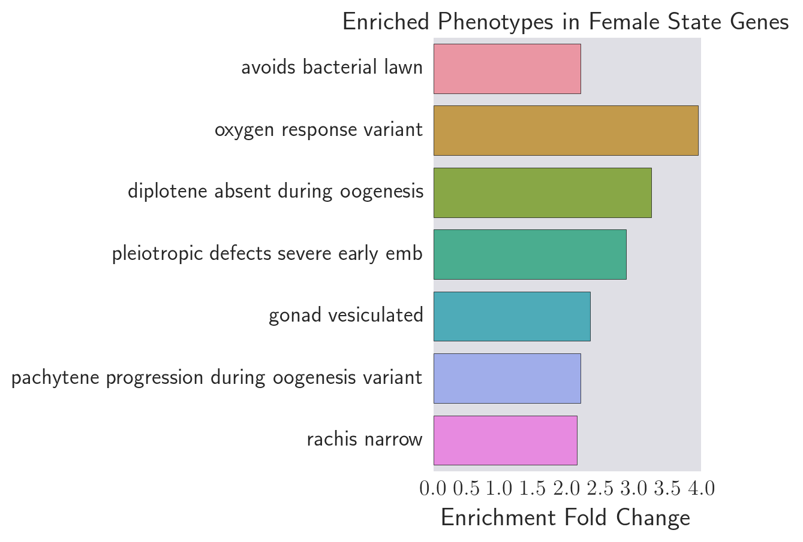


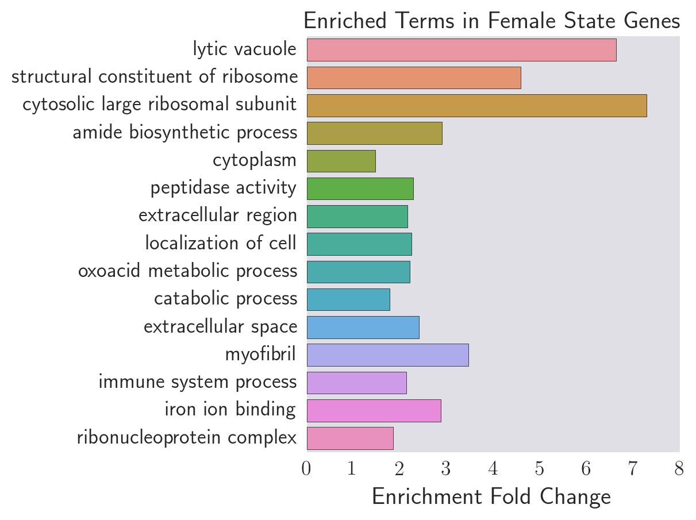


```python
melted_tissues = pd.melt(tissue_df, id_vars='wbid', var_name='term', value_name='expressed')
melted_tissues = melted_tissues[melted_tissues.expressed == 1]

melted_pheno = pd.melt(phenotype_df, id_vars='wbid', var_name='term', value_name='expressed')
melted_pheno = melted_pheno[melted_pheno.expressed == 1]

melted_go = pd.melt(go_df, id_vars='wbid', var_name='term', value_name='expressed')
melted_go = melted_go[melted_go.expressed == 1]
```


```python
# Make sure these terms are well-annotated:
ind = melted_tissues.wbid.isin(female_state.ens_gene.unique())
print(
"""
Female State Genes annotated with tissue information: {0}
""".format(melted_tissues[ind].wbid.unique().shape[0])
)

ind = melted_pheno.wbid.isin(female_state.ens_gene.unique())
print(
"""
Female State Genes annotated with phenotype information: {0}
""".format(melted_pheno[ind].wbid.unique().shape[0])
)

ind = melted_go.wbid.isin(female_state.ens_gene.unique())
print(
"""
Female State Genes annotated with GO information: {0}
""".format(melted_go[ind].wbid.unique().shape[0])
)
```


    Female State Genes annotated with tissue information: 324


    Female State Genes annotated with phenotype information: 227


    Female State Genes annotated with GO information: 328


```python
# save to file
female_state.to_csv('../output/female_state.csv', index=False)
```

# Interactive Volcano Plots


```python
def make_expression_axes(tooltips, title,
                          xlabel, ylabel):
    """A function to plot the bokeh single mutant comparisons."""
    # Make the hover tool
    hover = bokeh.models.HoverTool(tooltips=tooltips,
                                   names=['circles'])

    # Create figure
    p = bokeh.plotting.figure(title=title, plot_width=650,
                              plot_height=450)

    p.xgrid.grid_line_color = 'white'
    p.ygrid.grid_line_color = 'white'
    p.xaxis.axis_label = xlabel
    p.yaxis.axis_label = ylabel

    # Add the hover tool
    p.add_tools(hover)
    return p


def add_points(p, df1, x, y, se_x, color='blue', alpha=0.2, outline=False):
    # Define colors in a dictionary to access them with
    # the key from the pandas groupby funciton.
    df = df1.copy()
    transformed_q = -df[y].apply(np.log10)
    df['transformed_q'] = transformed_q

    source1 = bokeh.models.ColumnDataSource(df)

    # Specify data source
    p.circle(x=x, y='transformed_q', size=7,
             alpha=alpha, source=source1,
             color=color, name='circles')
    if outline:
        p.circle(x=x, y='transformed_q', size=7,
                 alpha=1,
                 source=source1, color='black',
                 fill_color=None, name='outlines')

    # prettify
    p.background_fill_color = "#DFDFE5"
    p.background_fill_alpha = 0.5

    return p

def selector(df):
    """A function to separate tfs from everything else"""
    sig = (df.qval < 0.1)# & (dfBetaA.b.abs() > 0.5)
    not_tf = (~df.target_id.isin(tf.target_id))
    is_tf = (df.target_id.isin(tf.target_id))
    to_plot_not = df[sig & not_tf]
    to_plot_yes = df[sig & is_tf]
    return to_plot_not, to_plot_yes
```

## Interactive Aging Volcano Plot, Figure 2a


```python
# What pops up on hover?
tooltips = [('ext_gene', '@ext_gene')]

p = make_expression_axes( tooltips, 'Aging Volcano Plot',
                         'Beta Coefficient (log-fold change)', '-log(Q)')

to_plot_not, to_plot_yes = selector(dfBetaA)

p = add_points(p, to_plot_not, 'b', 'qval', 'se_b', color='#1a9641')
p = add_points(p, to_plot_yes, 'b', 'qval', 'se_b', color='#fc8d59', alpha=0.6, outline=True)

html = file_html(p, CDN, "my plot")
HTML(html)
```


<!DOCTYPE html>
<html lang="en">
    <head>
        <meta charset="utf-8">
        <title>my plot</title>

<link rel="stylesheet" href="https://cdn.pydata.org/bokeh/release/bokeh-0.12.4.min.css" type="text/css" />

<script type="text/javascript" src="https://cdn.pydata.org/bokeh/release/bokeh-0.12.4.min.js"></script>
<script type="text/javascript">
    Bokeh.set_log_level("info");
</script>
        <style>
          html {
            width: 100%;
            height: 100%;
          }
          body {
            width: 90%;
            height: 100%;
            margin: auto;
          }
        </style>
    </head>
    <body>

        <div class="bk-root">
            <div class="bk-plotdiv" id="7d2d9371-1110-4fcb-8fd3-310e825854a4"></div>
        </div>

        <script type="text/javascript">
            (function() {
          var fn = function() {
            Bokeh.safely(function() {
              var docs_json = {"5524c828-5cd2-41a4-bcbc-313891e9cdfe":{"roots":{"references":[{"attributes":{"callback":null,"column_names":["transformed_q","smooth_sigma_sq","pval","index","level_0","var_obs","final_sigma_sq","mean_obs","b","ens_gene","target_id","qval","tech_var","se_b","ext_gene","sigma_sq","Unnamed: 0"],"data":{"Unnamed: 0":[113,4637,4638,6183,4502,2943,2962,4631,2074,6129,1423,1276,5659,4568,4302,1560,5648,1855,4499,1375,5918,1107,5791,4102,4907,5841,2988,4723,2352,3880,3985,691,2006,4403,4264,5546,6246,3385,3665,1749,515,5085,3277,6217,1459,2138,4843,1995,2129,1739,5667,2022,3972,1510,20,1539,5021,5496,1287,1618,153,4010,169,1305,3855,5469,3568,4042,5817,5950,3823,1891,1368,712,3251,529,70,4613,3200,1424,5671,2997,5612,3918,4250,1091,3120,1069,4094,5246,233,2176,1543,5418,6209,5638,2439,951,3224,2766,555,5712,3258,4860,5319,3746,4305,3760,2025,1548,2967,1438,3838,3801,3770,6199,1272,990,6083,5595,956,4870,2457,1176,2633,2793,4955,2190,5387,2188,741,6009,1849,3696,3610,5281,616,2776,1676,5039,5682,4225,2049,5209,5144,3638,3160,6037,370,5040,5637,3431,3517,1462,1380,3601,1643,6119,1954,4586,3631,2843,2212,3143,4918,1169,4435,955,1284,2396,5924,3201,6218,1011,3464,3811,3654,2245,3834,2950,1132,5541,6065,4285,880,3812,2111,2959,675,676,2467,2246,6243,881,3600,2919,3952,2068,5294,1524,4954,4620,862,3132,636,4318,5189,2395,6123,2186,3577,4972,2215,270,4268,3342,2241,984,2370,4377,2027,4072,6298,4311,1497,1338,6251,5207,6058,1469,3776,4956,3388,5054,5415,817,414,1504,5577,3389,6162,4674,4317,321,1279,6080,3276,5251,390,5634,2741,5392,3049,3365,1492,1514,436,3243,4725,3125,3403,2576,4059,3966,4981,2786,2677,4663,4181,275,1609,95,335,652,100,4518,1857,1332,5602,1484,5508,1670,3451,6155,4287,463,531,897,3347,813,750,5717,3750,6101,3302,1105,5955,4099,2239,5314,4239,1867,5219,5119,1742,5120,3963,4462,1586,1607,1049,4758,1498,2342,5629,431,614,5675,5075,5271,752,3429,2558,3364,1495,1213,4425,4214,124,3354,1475,5989,203,1138,1193,3771,6295,715,4336,4540,4280,3809,6025,6016,195,3990,3742,1624,3736,1409,5552,4041,4559,1113,5752,1870,421,1323,2651,4675,4940,1838,5561,5636,2696,6159,3840,3311,4515,5341,754,3227,812,454,3051,265,402,4071,3981,2470,3633,2584,759,5596,2837,2331,5366,1512,3843,695,6316,738,6141,4298,4825,1619,4061,4247,1654,4958,986,4966,3147,1589,1716,2458,4650,5527,1032,151,4184,3500,680,3416,3282,4881,1850,645,5033,3284,1046,425,3713,2590,3325,3805,4144,4591,196,5935,1187,1188,5422,2951,371,3836,4982,393,1899,315,442,1561,4885,4665,3533,75,1210,4609,1070,3297,5746,4272,86,5815,2941,1627,4026,829,2976,2597,565,3932,4367,1317,4295,2213,2381,4660,41,2561,3316,6116,2896,5076,2982,3745,566,1871,6096,3292,1098,679,475,1684,373,5097,1667,1711,458,1666,4627,1551,138,1227,4570,185,5498,4485,4538,2977,5555,3217,5934,4959,4617,5588,4803,4592,1659,1861,3309,136,4254,4672,2828,4688,4016,6324,557,848,1024,2320,3908,2030,5504,3327,1467,3522,3909,1942,1124,3312,3213,4289,4487,2416,5194,2720,4555,4739,5905,4284,4589,521,3608,626,2089,2546,585,2694,3028,2489,6066,3465,3538,4578,2334,5645,1970,4575,2044,1762,3640,243,1143,6091,6323,2877,541,1093,1616,5284,3514,2326,1648,403,546,4500,4372,241,4195,2550,3683,5515,4513,1748,1656,4274,3629,1811,4850,554,1050,666,3017,1446,385,1431,2849,2859,5490,5713,2905,5881,4694,874,2440,3934,419,6279,5655,1010,991,3020,5813,2785,2947,2533,2016,2931,2202,3707,1777,2050,5945,1294,3976,178,2148,5694,200,2787,3341,106,809,4931,5298,6289,2989,6134,5770,5849,2795,4461,2887,5853,5492,484,277,5509,5534,3596,449,4113,3404,2629,885,4991,6325,3004,2606,4632,3816,5063,2678,5231,729,730,948,2465,1729,1142,2689,960,3090,1115,2978,5324,4525,3447,1183,3204,5211,145,1926,4270,1216,6283,1068,6318,3166,1298,327,1542,1156,6182,2257,634,2316,3148,889,5000,4327,560,3108,5763,2428,1225,5804,4971,6084,263,5151,959,1204,5615,3950,3873,374,375,4106,4054,2132,256,193,2617,1415,5707,3731,1058,6312,2121,4360,5087,5399,838,4288,5269,6169,5300,3298,328,6214,3154,2356,5499,3191,2571,5524,3245,3398,1706,4339,1873,1938,1781,6122,966,1360,4053,1725,5692,1073,1427,5708,1750,5766,2232,444,2564,4331,1660,4614,4615,2052,5676,2963,1425,5767,5005,413,6060,2721,2644,3374,2382,6088,127,4774,1201,982,3018,1130,1596,6125,4598,3645,2750,2166,5289,3863,2479,1377,674,4173,2649,1915,1016,5133,1034,5825,424,298,123,5695,5014,4338,5423,6008,3489,3782,3402,639,532,288,2122,5818,4337,4236,5152,1782,1296,2521,2064,2128,2715,2327,4209,2270,5536,3916,654,5964,6234,4646,3375,1341,2051,271,3043,5669,1388,2924,6310,1266,5080,5909,4350,1544,244,1506,2152,2066,3545,6076,1558,1082,4628,1065,4001,3905,347,1180,6026,2482,376,439,240,1933,6212,1994,5320,5914,1872,2472,1567,5705,3541,2580,4750,3269,5388,5222,2902,4183,3804,254,4856,2740,5557,4685,651,3780,5058,3723,4920,5488,5516,494,5179,5180,3461,3850,2935,3756,5124,5755,4527,3280,5719,5287,6045,5794,5138,4459,480,4921,2513,2163,2137,3958,4267,5913,792,4480,5241,4044,5,84,2283,732,1865,5895,4942,3509,701,139,2087,3410,870,5042,6224,6164,1501,2853,4178,2134,2390,1048,5218,5965,6216,4682,5411,3262,437,26,4702,3761,5154,3679,4922,841,5785,3119,1085,6031,5407,3159,5653,2055,4729,3187,2021,6160,5857,3252,5544,1651,3991,6177,3337,1411,1101,4869,4763,5102,4993,4867,5688,1529,6208,917,5621,5448,5018,5037,4703,3692,1851,506,1681,5885,4453,1203,946,1649,5481,2013,4889,5034,333,1458,2954,1916,4645,4125,2637,131,4434,4232,1052,2335,3479,3564,5022,5888,669,4690,1805,2591,122,1763,2249,1060,3488,2767,2723,2520,3786,5390,4397,3492,3000,4073,3091,3890,6131,1843,2544,3205,4027,2749,4133,5272,604,3830,1887,5305,4827,4376,367,247,2925,5073,6267,5396,3680,2119,3352,5738,4511,2777,2778,4512,4460,5493,2835,600,339,3936,1237,2432,2539,6194,3470,126,4078,305,2801,1584,4727,5597,2047,1251,901,1006,5723,3233,3144,2423,2934,3740,4764,3439,1245,5741,5903,3507,1612,5953,6307,5419,569,29,111,2641,1939,4260,4666,5726,1832,2642,1940,5301,5426,4271,3852,2301,2363,5889,5099,927,3340,3894,751,2672,2164,5412,4943,4361,5322,4847,2986,2105,1019,2614,4561,4446,3569,5035,5592,2281,3265,1738,1983,1077,5462,1593,1879,3255,307,4984,5721,4986,551,4197,1174,1663,3368,1841,228,5473,4913,4294,2604,5049,2709,2221,4785,2507,5656,3263,4469,3987,1989,3499,822,5580,2742,2054,4551,3179,2422,3578,2595,5689,3518,2207,2446,1611,3322,5890,2517,580,1348,594,229,1900,4911,4450,2444,3534,1362,2306,4737,6308,379,2493,5178,2938,1931,5539,3363,621,3266,5078,3858,6207,3690,772,801,6335,6157,2,45,564,3806,5167,253,859,2490,2864,2009,2429,3366,5487,3408,1324,3112,1562,1563,2960,1039,5980,1572,1043,724,2248,5290,2990,5401,4116,864,5163,365,4667,3574,2094,2437,2353,2412,4047,1179,2605,6055,713,4308,1351,48,2975,3036,5374,5435,1241,961,962,3639,2414,4588,1599,5878,2598,2594,3846,19,1366,5570,5079,5528,2351,3333,1965,2618,553,916,2415,1044,2359,6197,2666,1436,6276,3307,5306,3319,2488,656,3346,1066,4240,2916,3421,5461,653,3270,3274,3490,1485,3602,1822,2292,1829,5095,2343,5098,5611,914,2991,1053,4135,443,3693,176,55,3029,2630,5581,5158,5657,926,1391,2757,4277,5583,2680,4731,2628,5279,1222,320,1393,4218,3249,4136,3591,4740,4263,2712,6262,3788,6109,3466,4345,5951,5844,5757,2760,2623,6211,3163,56,3511,324,528,4696,2610,79,4934,1392,2459,1581,655,5864,642,606,5920,1977,1395,1985,5722,4126,4190,4121,1760,5486,4105,3332,465,4552,133,1029,1859,988,5112,428,2136,2522,3151,6032,2897,5571,343,4657,1463,4844,272,1615,4036,3170,775,2722,3032,1089,4155,791,3430,1319,456,319,919,779,4983,6226,1943,2032,4244,1892,850,398,5184,1012,2123,5337,1682,1253,2368,3138,2425,5495,5642,6319,1824,5449,921,633,2511,3074,381,1281,523,4748,1133,88,297,2586,3435,1797,6287,694,2502,4654,5943,6240,2289,5001,6136,1675,3053,4313,1808,5380,4489,1694,1540,3295,1306,1804,5838,4990,613,6033,5556,5745,1541,5821,2238,1358,3437,538,3076,5258,3768,2695,1744,3579,3580,2798,3581,650,505,1450,1343,5404,1714,5317,2017,2018,1928,3397,2676,282,3841,5947,2310,274,3557,4761,734,4065,5475,226,3853,4762,1277,4826,3152,209,5025,5349,1967,5847,4882,2350,5234,3137,2080,718,1633,793,622,269,1370,932,3022,5013,598,5236,3956,2408,3448,4630,2993,3454,1766,1479,259,160,567,4324,2285,3862,941,5230,2541,2317,1271,860,118,92,904,1159,1160,4081,1003,1252,3180,5083,1025,3271,3930,6068,1311,2492,1518,4716,5991,5452,3369,2233,3585,1724,1834,4721,6128,5330,2812,2622,6268,5118,5439,3551,1655,4475,4807,4112,5525,4604,2077,2565,3485,4114,1220,399,1499,3598,5954,4007,4901,3313,5831,3128,1054,3861,1951,2206,2192,1288,4842,362,4175,2155,318,1256,182,1786,57,5421,2885,865,1226,4851,42,2072,3520,4619,2699,3715,1575,6232,3530,3531,3655,6284,2681,537,2323,6012,5768,1726,5479,1972,1001,1856,5532,3992,933,2260,4622,3687,583,3417,2355,3,663,6247,834,579,2256,6337,5749,5186,1568,5565,4457,2173,3197,2417,5195,4261,4495,3037,4384,206,5259,2369,5672,1057,5060,4048,3371,3088,3093,6054,6063,2861,4458,3502,1828,5309,1496,1971,4698,4484,3334,3739,1483,3795,1309,5307,5809,601,2566,4060,426,929,2952,3223,524,5347,811,1442,4915,4854,93,472,5428,3820,2711,4668,2298,5398,756,250,450,2912,3661,714,1347,832,6043,1109,4829,4307,5233,1402,1770,1679,30,1165,2092,43,31,369,121,5715,5393,6336,1557,3612,5560,3659,4230,1955,2773,5386,1559,5238,2567,4385,836,5803,3427,969,1471,3859,464,6305,4419,3067,3552,1515,1833,6110,3100,4819,6077,4643,3390,587,6331,5227,3605,1389,2530,2315,53,54,6191,364,2337,2403,2788,1435,5176,2253,3599,6102,6142,3203,1198,1397,1439,3290,4265,483,2243,510,4830,4728,2615,2512,3135,1090,3708,359,3891,4848,3381,975,115,3592,2012,5253,61,5382,5626,6190,2313,2818,6290,1297,4398,4939,1631,527,1088,5345,657,357,4820,14,3881,3460,3650,1035,5701,4862,2088,5646,3682,446,2876,884,2028,5433,3769,366,4902,3941,2273,1372,255,2599,5214,1993,719,2463,1795,6174,3473,3621,1721,5851,5153,4677,609,5208,610,5709,5229,3907,3688,2491,1102,539,4494,2010,3691,5894,4804,5389,4530,384,802,2344,5225,4097,5647,1248,2413,276,4483,1877,3933,3989,4139,3751,336,2592,2687,4661,3888,1008,4219,3737,5714,4705,2966,4759,2486,5540,2038,2498,692,6258,1190,2071,4464,1223,1336,1339,5805,3848,3636,2974,3979,1401,5362,2347,733,2464,4786,1329,996,3709,3077,5068,2838,4634,2216,3851,2020,4223,5016,1521,2404,5702,4606,2772,3469,588,5293,5756,670,2585,1405,5125,1206,358,6221,3701,5038,4008,502,6120,4335,5489,4347,2388,4580,5982,2154,6145,4273,3886,1408,4463,159,3210,1318,3445,4832,1472,3168,2923,5981,2448,340,4681,590,3586,6,2743,3965,5474,3440,1416,3146,1428,3405,998,3444,5644,4234,4127,4501,2476,4724,4437,6203,5772,4571,5044,1076,5350,4791,4821,6073,807,1373,3247,3130,3082,1313,1718,839,5156,3268,1168,4925,5904,3115,2855,782,1591,27,1902,2731,382,3426,4796,6301,2658,1234,5023,2744,678,4768,571,1999,940,3453,392,2427,824,1018,1196,461,2290,6204,5599,4952,1793,6294,137,3899,5172,4148,3045,350,2758,6105,5276,799,348,5747,2663,4092,2199,3104,338,2360,4801,3382,5551,5458,4074,3176,3827,2499,5429,3959,4115,3712,3904,266,5824,5055,3673,1767,4686,2195,400,6229,1490,3562,4808,2560,3920,5910,6201,3098,5764,295,4831,2503,5383,5384,1707,968,8,21,2456,2710,1149,5105,5011,1387,207,5332,9,179,543,4424,925,1333,2405,2214,3238,3239,3240,1700,257,2587,6067,2043,1903,4775,2056,2157,2673,4923,2895,5177,1122,534,2557,3773,5247,1944,1520,3842,2674,5373,3129,4720,5406,4765,4420,2724,2737,1061,1578,4673,3114,2874,3102,2545,3131,2196,3442,5522,2703,5239,2194,866,2899,4481,150,673,1144,5464,5529,2648,4432,1639,6166,4569,4868,5477,976,1181,1125,5199,1628,4866,1519,3089,1848,2535,3472,875,1772,5006,5743,2184,3699,1026,2682,1956,4612,1414,1813,1582,3787,4205,1963,1147,5610,584,3945,2400,4899,238,4498,805,3039,1087,749,2613,1120,2665,2825,1789,3828,1448,2555,5146,2276,4137,5348,915,81,1243,6281,1429,5744,4452,605,2001,6034,6137,2329,3253,5999,5148,3663,3900,2730,225,4822,1381,330,1315,5917,4600,248,5718,6320,1464,5352,5397,4191,4444,5936,2143,3516,1376,1632,3244,5266,1460,2755,1602,5897,4206,300,466,3923,796,65,1662,87,6074,2746,825,3406,3443,5593,2099,2100,5445,568,803,5192,3211,4798,743,2478,5686,2903,3537,146,1844,857,1161,5003,1290,1646,1042,3236,4542,1969,1816,1418,6092,2971,5820,4790,2817,5364,4623,704,4245,6103,2932,4937,3582,5562,5248,1895,1830,2816,1344,970,329,2198,821,1889,739,3078,218,3156,4521,2927,4655,5900,3279,6111,5084,3882,5650,753,341,5591,3542,2964,4497,5500,4557,5193,3198,2836,5280,3527,2612,5273,742,2939,3508,2832,5155,722,911,6292,4130,3802,1958,4034,2657,355,3003,853,5363,2514,1037,4364,2621,851,4096,891,3190,1454,4303,1894,3229,5375,4028,4291,3544,2579,4176,412,3983,2702,4306,4304,2436,5100,1195,3814,4170,3706,5160,5168,1047,1929,455,4713,5806,492,6082,1013,1482,1984,682,281,2469,105,995,3136,1300,5198,4924,4358,2933,913,5465,5683,1146,5773,4140,4141,4142,4098,2451,2039,3185,1552,3549,4633,6061,2792,827,5762,5338,3384,3293,1921,3449,503,6270,1962,3646,6225,4066,6252,1116,4929,2707,4871,2284,4886,6188,4849,5181,5453,1823,3641,5092,2690,2002,3133,5801,1350,816,2958,170,6139,599,2364,2142,326,5590,311,5677,5113,1214,1158,3339,1908,868,6299,5627,2299,13,4585,4792,1571,4087,5405,5413,1396,3849,1948,2318,2725,69,5896,2261,698,3913,6184,2267,3758,4861,1452,5110,3083,3903,184,945,4695,5678,518,2035,1502,5823,2509,6238,5440,5775,162,2031,4967,4605,3393,4029,5260,5799,2454,3055,1802,3044,3978,2647,1274,1244,4039,103,5816,5616,5997,5117,696,5792,4656,5886,3235,5206,1583,3662,5201,2462,4933,4231,5724,5789,5339,4134,5326,395,5966,3957,2113,3040,4543,2901,5121,4944,3784,2000,3800,5843,459,6296,3047,4359,2185,3825,251,5357,5870,352,2956,1621,2114,4684,3883,5009,4470,3116,152,6015,5787,2126,5693,908,4979,5778,391,3050,4823,6094,5202,59,284,4193,4845,5876,2287,3632,3747,4962,5048,5139,4043,6022,5067,1406,3474,4961,2626,2354,1509,4182,2061,1247,401,552,987,3875,3669,6087,3165,1715,6052,2091,1796,3777,2477,5922,6152,3349,3677,2230,4180,1882,1691,6293,725,356,5710,2385,1652,3487,4428,3305,1340,1753,1653,1862,5321,2096,4346,5696,2646,1922,63,4477,78,1745,6219,1966,5012,1613,2808,2308,4491,3008,728,4111,1686,1513,476,5381,417,4340,4100,637,1004,2848,511,3338,3105,2510,2430,2892,3495,1776,3695,4383,306,3642,5310,4300,3765,2556,4093,4482,1503,1925,3172,2168,2945,3649,2346,3974,4301,2863,3484,3497,5367,4249,2701,4679,2620,6112,595,5872,116,4549,2177,4893,18,4076,1320,6321,3960,3275,5780,2065,383,4407,4023,649,4640,2831,830,1769,4883,4438,4309,5871,5344,3906,3345,2957,1191,5455,1186,5424,999,3647,3171,5335,4011,3030,1671,353,3609,5427,3748,4749,477,6035,3064,5454,2799,6236,3059,4938,4365,2879,5071,1417,1413,4217,4664,5173,2844,2265,4157,4369,737,5288,2581,2223,902,2203,3563,3624,2589,903,1998,4238,1379,4162,5633,360,4188,3824,5623,1200,1746,2023,2936,4997,5589,5408,1184,164,410,3379,3674,5122,509,711,221,2643,3803,3317,6271,1269,485,6069,854,683,4722,686,363,1331,2577,1625,94,3220,5545,2183,5365,2693,3546,1980,2169,6018,3874,90,82,107,35,2697,3937,1759,3831,1295,6070,3724,5261,2852,1923,706,5342,5661,2573,5933,2600,1604,1342,2532,3360,777,3818,1907,415,3162,2802,2548,5395,2906,1280,2917,2827,6078,148,4159,5594,2098,72,3583,1888,2082,863,3716,201,6245,6328,4733,1334,112,3177,2779,2097,2149,2652,2928,2251,4985,3331,5132,2258,1636,5046,5297,1385,2411,3808,6227,2418,1610,1778,4567,4370,907,4595,2949,3604,4404,2505,171,261,3587,1945,4963,4418,4910,157,451,3422,5069,4583,1701,2634,2910,1807,2536,4386,2162,2636,3615,2007,1606,4152,5774,2929,3893,3094,549,2004,2921,5460,1250,5185,5975,3622,1516,5771,4980,993,4154,1163,314,6170,4362,4363,6124,1153,3330,1740,4995,1605,5131,1470,1449,3099,1221,5670,5081,985,5938,5927,5372,430,763,4558,879,1674,685,887,3257,2847,6233,2294,4565,764,4177,989,435,912,1099,4056,6266,3376,2037,4547,5518,4989,2435,2814,2538,4895,5249,672,4082,1732,1335,2019,4699,1040,4517,6079,4101,1155,1783,3073,1270,4165,5985,4707,1486,3199,1209,4436,3153,1151,963,5070,842,2224,3072,5819,5129,2733,4610,2410,4368,1765,3493,5315,3063,2024,744,3459,6090,3630,1228,1197,5643,1461,4015,224,264,85,68,62,5091,1361,4024,2312,1960,3496,5378,1500,6302,5197,1751,5877,4811,4132,1920,2424,3556,507,6332,4726,1809,1886,481,5436,5777,1990,3860,1930,2830,5379,4167,3524,4626,234,769,258,1535,4717,953,1172,3494,6180,2483,4537,2738,3242,44,4194,5237,2481,3772,3031,1357,2237,1801,4926,3660,2386,4430,2455,2378,1712,581,1588,3698,508,2271,4564,828,4314,6106,47,2401,5928,4708,783,5727,2748,2220,1355,5358,4535,5839,1261,3178,3832,3306,5793,478,4496,5733,4262,4022,1178,4281,4091,316,6173,5376,3835,5235,4020,1620,6028,2822,2823,3189,6255,108,3866,607,4572,4935,4536,2181,4221,2983,2473,2204,4375,2494,4492,1845,3515,197,2716,3749,4887,1953,1507,1233,4732,5939,3057,3320,1912,2979,978,578,5503,2391,1846,2543,3678,4421,4908,2671,3434,2484,2042,2655,406,5282,3380,708,4411,6023,1445,4161,1866,3399,1314,831,4891,5106,3387,1365,4224,900,1597,1110,882,5911,4781,5047,3627,3822,1259,5635,1917,935,1601,4310,285,2453,467,2250,2145,280,4069,5045,2650,5956,1384,5925,3634,325,3169,96,3876,1934,4107,3491,38,4752,1045,114,2076,1705,973,3216,6259,890,6192,4334,4004,4658,2069,1727,432,147,299,4771,346,2559,418,2332,3922,246,2946,872,1703,2922,4290,6263,5370,5852,2846,4429,3157,3700,4809,2274,3181,6003,5126,3911,5254,2515,798,1232,188,5403,1378,1658,5425,4348,667,4227,5485,1968,2627,3300,3182,2868,1346,296,5873,1327,1717,6300,1487,5400,2420,3588,1722,5072,3209,1918,416,2003,2362,5568,3667,3539,3938,906,7,5990,519,1818,2242,619,2063,5574,2900,6285,3535,5316,4573,1688,710,1635,1390,4805,1291,25,6274,1680,1961,1603,2161,3167,898,1981,4040,165,1072,6277,3407,2133,6085,5267,2524,5136,189,4014,2402,804,237,2147,2340,6333,2008,2151,3620,4624,482,4413,1637,1883,4932,4505,3359,4787,5304,4753,3589,3092,4734,268,3324,3357,5906,3202,2106,2909,2193,4128,4590,871,5684,6187,5333,3107,3625,3626,3590,662,2574,790,540,3754,3054,4203,1131,2399,6230,2981,4145,3024,2866,4269,618,1623,2719,2234,2882,4108,1301,167,770,4730,4894,3370,3997,5491,1986,1547,589,5915,573,612,6242,2328,4149,2930,1118,2015,5182,3259,2987,5127,2768,745,1382,4119,640,1000,368,1086,1517,3833,6099,1595,4255,4936,1207,6329,4594,2309,4969,6017,1881,1134,4977,3525,3335,1906,186,3998,2664,643,1574,3898,513,4354,2593,1337,3670,1038,73,2367,4187,2889,909,1094,1689,5547,16,5846,408,143,52,429,572,1709,934,705,5443,5617,3161,4222,3452,2704,2736,1238,4946,3573,1002,720,2116,4,3519,6050,3206,535,5188,972,4905,1154,6223,4211,3704,6241,869,6000,2686,3267,1325,486,5459,5385,3684,5957,5450,4524,810,5949,3917,4168,4158,2659,5228,2807,423,4032,2268,1710,1175,2011,668,3175,5467,4751,6205,1761,3720,815,2093,4408,1792,1412,2537,2107,5135,6280,5506,3418,3892,603,5416,3139,981,1774,4852,2153,5089,4948,3478,6097,5703,6235,1192,3617,3033,2635,5291,5732,3721,4241,1527,499,6334,2211,495,4124,2572,3315,2235,3763,3924,4597,1996,1264,758,4405,5328,6189,5263,2860,997,1693,5765,2726,5175,4693,6046,5530,1185,5101,4789,3419,2894,3321,1394,4447,191,602,2269,433,2291,1478,5242,396,858,4965,1756,3618,98,3553,4030,1913,1932,6126,5456,3943,3414,4857,3425,5869,2325,2891,2867,2227,322,5002,2549,4312,3864,3817,198,4380,3109,1443,4478,5142,2840,1600,6081,5224,922,3294,847,561,3140,4493,1488,2475,5625,1326,1831,3967,1249,4328,166,4391,2765,845,4576,5077,1033,120,2036,411,3186,4812,3048,487,5223,1992,5882,2191,1757,1549,3208,5056,1202,3685,2426,2158,1148,2345,4593,630,3821,4050,2668,4998,4746,3041,6029,2869,3411,2449,3528,4323,3221,2225,310,1278,2875,10,1493,1947,4146,5995,473,4473,4957,6127,5786,690,3790,3949,2460,3702,1587,4770,2231,2275,5470,6303,5582,3378,2379,3915,1673,1644,4616,1383,4747,1987,2244,4297,4988,2180,930,6309,617,3420,5666,349,1399,5811,2139,3288,2474,4930,2653,5983,3467,1657,5434,4390,4395,1173,3741,3666,5996,1634,1217,2631,66,6253,826,6038,5226,2893,544,3075,992,3946,3194,231,129,2553,1835,3308,3648,1538,3676,286,5243,1403,5978,37,5576,971,3071,1140,4426,2739,4625,1152,5220,3977,2683,1267,3019,387,5736,1661,5737,6019,5742,190,3060,4799,4509,2178,1328,1771,3730,4389,3540,3794,1212,2813,6179,1182,2140,1695,3355,3865,2336,6338,3222,5090,2450,1100,5268,2095,405,4639,1292,840,4454,496,5969,5828,504,80,4283,4651,2045,409,2086,6048,5758,727,4201,2948,6059,1522,2660,4439,3264,60,3343,4433,4204,1275,4835,5866,1258,40,1302,2506,1465,252,4471,4379,3241,1508,2961,3743,1825,641,5769,1421,2525,3428,279,2842,3005,389,1554,5665,5004,2980,1114,4033,2839,4783,2761,723,3413,5662,2365,6306,939,2500,5480,3999,4063,6291,5859,2226,5967,3150,577,4431,1905,4828,1787,5704,5622,6156,4129,4741,2277,4371,5958,1909,2170,1410,2603,1696,5628,1367,5784,928,4797,4876,3554,923,2348,697,5394,4189,6002,1952,6311,3571,4865,1957,6275,4490,2718,920,574,422,5620,5468,6036,516,51,2911,3658,397,140,2375,787,5961,4012,2218,2858,5302,4853,5748,5409,2759,3016,3476,2809,3877,3468,50,6062,1137,3975,4662,957,1282,4171,2796,4878,1260,660,547,3526,1304,856,5274,3548,1433,1798,5007,1678,6215,1014,789,5976,302,1189,2288,6001,4357,1441,3559,5835,4343,219,2026,3595,4539,5162,1640,1641,4641,468,2575,2005,5807,2485,4448,924,2607,2700,5174,4526,4815,1534,1788,2103,4399,2508,4975,1904,4160,2286,5331,4400,3207,4103,5699,1310,3686,3628,4468,4742,3505,1067,1235,2523,4326,761,109,1590,5613,4788,6322,236,1937,4257,3042,1129,267,2815,3993,5250,5797,1821,3291,6056,4974,3145,2182,677,3839,4229,5559,142,2747,3671,5064,2762,6269,337,110,1901,5812,5164,3084,117,5026,273,457,76,312,4941,4506,2774,278,1697,6248,11,4817,2189,4235,6117,3127,2845,2034,4603,6282,1935,2322,5517,5735,1730,168,15,3744,4992,1579,4226,1356,498,3607,1398,5554,1432,4394,4767,2461,6210,5826,4104,4531,665,293,6108,5283,592,5916,3046,6133,4987,2160,5086,4330,3506,3616,3953,5507,3575,2920,4186,6181,1592,5874,5944,5860,1814,3314,3942,5575,1936,2373,6313,5880,3070,2994,2915,158,4607,586,1211,1890,2805,2324,2790,2130,6200,2115,1884,681,4782,6057,5607,1979,785,5658,3925,6228,5558,4164,205,558,1702,3002,3394,2857,394,4185,5019,5240,3643,819,1150,3711,4258,2314,1614,6140,4960,5137,5632,4031,345,5697,5043,1537,4344,3668,4153,1532,5569,5907,2756,1083,2811,5171,208,4266,6039,559,4045,1031,1622,2529,2075,2969,892,323,5093,4321,4179,2303,4802,3971,1062,1283,2972,2992,4503,1708,2684,6086,4754,1229,3164,460,3058,3183,5664,4772,3113,3614,2955,4566,1860,4332,2174,2179,1687,806,4089,593,3436,5275,5822,5668,5639,493,1199,1420,5432,3215,2172,5523,6265,4275,1321,1491,5564,4278,3837,447,4504,1699,2675,2311,2880,6107,6020,4546,1426,2944,5402,4353,3395,2441,4122,4773,2753,3681,5483,938,4083,1005,2304,287,596,104,501,550,5754,6256,5959,3310,222,58,5587,3944,536,2150,4414,3774,5256,689,1255,4776,3566,1022,1747,5420,2278,5159,4601,6317,687,2588,210,3141,5061,4002,2433,1139,4581,2824,5203,149,434,1308,3184,3889,5278,4872,6027,5204,6150,1265,1863,2330,899,893,3373,6314,4833,4602,5128,2531,2208,3066,6113,6195,3984,5217,1028,1880,441,5200,1975,4388,5196,1111,3986,597,1254,5313,4349,2638,3079,4840,2734,2528,2568,2763,4441,1665,776,2771,4953,2708,693,4896,183,1145,5690,39,3854,6095,3124,4629,4507,49,3095,4816,5759,5052,5096,582,3501,4062,6138,556,2998,3142,2406,4919,5252,1869,1690,5994,2263,762,5832,5187,2118,3697,5410,4401,5149,5608,5970,5140,3995,846,5027,3955,1386,3424,6237,2125,5572,5827,1353,2888,407,700,3015,1071,5861,2078,1468,5264,2881,3318,4697,5533,965,1910,3246,635,1988,3766,4837,4035,5053,174,888,5550,2804,6040,3158,5979,5059,5074,2516,404,5776,2392,1075,1096,1523,1685,3584,5790,5986,4109,2067,380,128,5145,2685,4596,5567,2904,765,4366,6222,488,2692,1352,1704,5438,22,1941,260,3432,671,1790,2854,771,2965,3762,1104,262,3087,5232,4846,646,216,6288,3767,3644,4704,5901,3878,2999,3951,1215,2834,1194,1135,2389,6330,6185,4875,1451,4949,3757,855,4778,1123,4192,1784,1453,623,1964,5265,3303,1063,5685,6304,2770,3813,2431,6115,1576,716,4013,161,5720,1555,3606,420,187,659,1973,3462,1734,4738,3011,2167,3068,4813,1218,5451,5788,5368,6021,4510,448,2769,2914,3248,512,5942,6264,1051,628,1400,4855,1268,1564,3759,2120,4322,4021,2942,17,2820,3710,5323,3789,2377,2272,5356,5062,4916,520,1041,2527,3895,4282,1580,2040,5854,3383,3611,5796,983,778,5598,5921,2563,644,1893,3819,1669,3273,1437,294,194,658,2144,5147,4873,5216,2201,3021,331,5514,199,2083,3558,6135,2996,3921,1898,3912,4669,4356,542,699,313,702,5017,1743,249,5781,4644,3785,3409,4522,1273,3561,3857,2714,5531,3069,4449,4455,4488,4150,5687,5734,2376,3353,3791,5867,3261,5725,4169,4719,2366,6167,6098,5782,4212,3214,2670,6024,2117,2084,3603,2048,2639,3463,445,5351,1231,2870,4824,4890,1982,780,4793,1263,5840,1009,3225,3110,5295,980,3486,5114,3664,5107,4618,6053,304,2706,2806,3188,1758,130,2871,1650,707,3547,4253,6075,5270,2339,3441,5103,5845,1570,5169,5663,4550,2728,202,1511,2826,876,5065,1911,3035,2247,6244,2732,354,1126,23,4315,5111,1531,2341,5868,4745,5640,2679,4574,1577,2058,936,3593,3392,5960,5963,5548,1112,4608,1878,215,1741,2108,4352,5800,844,4443,5908,1974,974,5681,4123,5728,5377,2217,5050,2252,2421,3471,2062,141,135,1167,5716,3014,3219,5446,2705,4423,1991,230,2526,608,3344,977,5700,4649,661,4579,6148,5802,2219,1553,6044,4834,873,2908,843,849,3480,3481,4095,5134,5526,4863,3844,5360,2662,2601,3009,632,1219,3884,3689,102,1095,1978,2984,2445,440,5952,2480,3738,5183,5041,2371,2156,1852,4163,5471,1242,5441,6093,3356,3111,1036,2661,119,820,242,3450,33,2159,533,3935,227,289,77,2501,1752,3810,1735,1764,852,5537,1447,71,2833,1608,3237,3034,3725,4709,4544,5750,5679,2229,4172,5968,1285,2487,5355,2656,6149,1754,4342,3703,2782,6193,4442,4465,525,213,4519,64,3931,2279,6071,32,6072,1,703,2609,4077,4402,1371,5584,2554,5926,2800,6114,5213,4554,6049,4086,3651,4683,2619,3902,6254,1768,5538,3134,5649,6249,2374,5512,4210,6047,4945,5108,5641,2236,2578,5879,1810,4714,4533,1481,2884,5417,1847,5082,1480,2547,835,3733,5285,1108,5205,4479,4912,4777,3283,3726,4000,2667,2688,235,2384,3523,994,6118,1946,34,5919,3619,2434,6273,2542,3968,4621,4046,1976,5029,3994,4795,1494,2262,4769,5028,5691,3023,6143,2057,5573,2131,5519,4292,4110,3230,4276,2046,3400,3845,3232,1363,3504,4760,3386,1919,2053,3735,154,5123,530,2293,5984,4202,5020,4009,4198,4199,4084,3879,1299,823,3914,4415,1800,3012,3301,1473,3061,292,5472,3195,1349,5303,2540,5165,548,4215,125,5520,570,5606,4755,3304,3126,1121,2471,731,301,6104,5798,4207,2041,4467,2175,5987,2562,3065,3962,3613,1842,3351,1027,3193,3260,4374,2797,1505,4562,2973,740,1720,4516,1476,3412,1015,5311,1794,3250,24,4841,2713,2112,910,1799,1719,1106,5245,2302,5325,489,1997,3872,4553,5024,4075,1775,1731,388,631,2419,5862,3174,2645,361,5542,3503,895,4556,2280,5501,4711,3350,4800,2264,3570,5601,5850,2872,4836,6213,4994,886,6014,4735,4736,6172,3085,1127,1020,1374,5680,1477,377,4329,3101,1097,479,3727,99,4410,5312,2789,1440,6100,1773,1434,6186,1359,2783,5286,46,1803,163,91,2383,4970,290,4779,2850,6005,3652,6261,3722,1055,3996,5116,952,4532,4256,726,4545,3391,172,5157,5521,1084,4947,1526,3940,3927,2669,1286,5706,1293,3455,1677,4898,2407,89,688,5618,5088,4928,2321,3438,2398,3797,4466,4006,2569,4884,5962,3097,625,4700,3272,1876,332,5946,3281,2611,2171,4680,28,173,2691,6051,2570,2104,2305,757,3336,6176,3672,1322,214,6064,6202,6327,1927,4417,4251,5992,6089,5899,2856,2266,3026,5036,1457,5971,781,83,1645,4131,4242,4909,647,2081,629,3919,4396,3081,4416,2504,4248,4088,1959,2632,2442,1354,3456,2898,1868,239,2109,526,2608,1864,2452,212,5031,1407,964,4756,97,4874,3781,3783,1141,5513,5340,4246,1569,372,4914,1246,1736,5553,4355,6151,3885,5988,2361,563,4018,6206,2780,2085,4296,3778,4286,1345,3954,2654,6121,2821,4859,3982,1573,5299,1642,386,1728,4548,3752,4412,3657,4406,3734,627,3718,3555,1949,5463,5549,2059,5883,1262,894,1598,1817,5244,2102,1806,1257,1170,2073,5210,3477,4451,6165,2698,5941,4472,3728,1422,6220,5161,5221,4440,4648,2307,5318,4784,3433,1080,4676,2210,2205,3755,5586,1307,2937,223,74,2282,767,3623,4978,2995,1875,5150,3415,1157,5931,5170,5563,5343,4653,918,3234,1419,2014,2970,4534,4900,1079,6041,334,611,3694,1208,4382,2878,721,3597,3529,2781,5190,5371,4647,1819,2865,500,1664,4710,181,1021,1550,2851,3329,2141,6042,3867,5760,36,4691,4692,308,4174,4068,4316,3929,1713,378,755,5654,3947,5442,1136,4523,1858,6178,4156,4599,1078,1896,192,177,4208,5609,522,180,4917,4341,2616,4906,1466,4678,3512,2518,2602,5624,1017,2372,3572,5329,3961,1455,5892,1914,4611,1456,4563,4243,4252,5761,1885,1059,1840,1430,6278,1647,344,1474,3458,6286,1853,4743,2380,4279,5215,1723,3926,3482,5977,5619,5856,5346,4999,6147,4670,2438,4514,5833,2883,4584,3732,5030,1128,462,4080,438,624,3910,517,3829,2727,4025,4927,760,615,5212,1119,3106,4904,5336,5447,4964,3796,5614,954,3656,2624,4474,575,4058,2393,4259,5277,3285,2259,5369,3675,1103,1444,967,2394,4587,452,2810,6231,6257,5808,3896,497,5566,3536,5603,5296,5191,2985,3475,132,4635,4486,3973,5444,4051,3815,4052,4213,4228,5739,1629,5937,6146,3123,6175,12,3567,6297,3256,6132,144,4085,4067,5795,5015,5884,3367,3025,3856,4642,4378,5829,3565,2409,3446,1546,5130,1533,1638,3798,748,562,576,5902,3377,5855,2534,736,1117,3901,5010,5810,5511,4528,3401,5430,5887,4689,766,5359,6010,2751,2752,4864,4880,1668,4806,4810,5066,4888,3173,3228,4976,6326,746,5673,2841,4838,4814,797,2240,5711,774,6171,3296,794,3887,800,4718,5865,5630,5783,1056,5830,1239,6250,808,5032,2775,2596,303,3594,3254,3653,3121,5600,1316,3939,453,2333,3196,3086,4951,3826,4445,4422,2640,1489,3149,3423,5998,220,5255,1074,837,3027,2033,664,5143,2187,768,2913,1528,1683,5141,2466,3764,309,3964,1565,2447,3286,2165,5543,6239,6011,2060,3807,4151,2254,2862,3483,1779,2135,4671,1364,469,5605,3870,101,6130,861,2717,1162,3010,2124,5094,5674,950,3714,6158,545,4005,4120,1007,905,3969,5497,5863,747,3868,5166,6006,1630,67,4636,3289,4037,2443,4387,4138,5437,5730,5731,5948,958,5891,2197,6198,2754,1837,2357,3799,5837,3560,1369,814,4903,2907,942,5923,2496,943,5848,2497,944,1303,3192,1836,1556,878,4582,175,1566,204,4049,4143,5898,1585,3498,883,3948,3226,1545,470,3117,3056,490,2745,1536,4070,3980,4381,4780,3155,1023,1064,3062,6007,3637,5257,5836,2468,4200,1224,4057,5893,1791,2319,2729,638,5875,5932,3080,896,877,4892,2300,4216,2886,2803,6196,786,1672,2552,5940,4508,3007,6144,134,1289,2110,5457,2582,1081,3635,2625,2255,3871,1171,5292,4017,2890,1820,1205,947,5585,4757,5631,471,3729,3793,4659,5993,155,156,3118,4090,474,2940,3287,4325,6013,620,491,4237,6315,4818,5972,1826,5973,2519,5974,1827,788,427,5361,3775,5740,784,3779,4392,4147,3792,5334,4744,5476,931,1950,2968,5391,5502,5327,2387,1330,4839,709,979,4299,5779,2209,3231,4968,5578,1312,232,1177,1692,3323,4456,4973,1815,2222,217,5057,833,4520,4529,5505,4794,1594,2029,4652,4950,1780,3122,5353,245,1030,4687,5604,3897,3006,2358,3543,3096,3358,1854,4196,5431,717,3218,514,2101,1092,795,4220,291,5729,4055,4333,4117,5008,1164,2338,4897,4577,3103,3988,3038,4064,4166,2090,3550,5466,1525,2070,1733],"b":[-1.5805971490000001,-0.943477692,-0.943477692,-0.303203095,3.096991102,0.282210273,-0.238613651,-0.30141426600000004,0.510124695,0.300541431,-0.640725811,-0.916998632,0.1770245,0.223961808,0.66425818,2.75287209,2.689656143,0.7162043920000001,0.746062786,0.334810758,-0.455854659,-1.2095560459999999,-0.20723847199999998,0.199431141,0.355984168,5.471457125,-0.34462776700000003,-0.201823373,0.265882807,-0.299463861,-0.746433593,2.117941112,3.083920285,-0.18906594899999998,1.038476685,0.174419838,-2.249156332,-0.555536366,2.440568949,1.510359773,-1.231653857,-1.719249007,2.660562402,0.9402555020000001,-5.027870192,-1.9536740259999998,-0.9715472140000001,-1.950757436,-0.850157532,-1.080742815,2.453013984,0.803257847,-0.37667614899999996,0.689356561,5.213166936,4.394031309,0.50770485,1.5275197409999999,-0.460685235,1.6893842890000001,-0.677740584,-0.448010309,3.220513581,-0.39564900299999994,0.372300676,3.74766523,3.1935163330000003,1.355992221,-0.582922104,-2.761759525,-0.924633774,-1.692359028,0.6404868779999999,3.666153028,0.9717031290000001,2.9673711480000002,2.533303267,-0.317898893,2.5051385809999998,1.8652586830000002,-0.44038619799999995,1.6009506409999998,-0.355428294,-0.395823936,-0.310340195,2.971951321,3.52179561,0.6262997920000001,-2.0646520980000003,-1.4404810719999999,-2.0437570959999998,2.170599512,3.423284972,-0.233581545,0.6751867140000001,-0.826346525,1.504666677,-0.435515824,-0.372949697,0.8186720359999999,-0.527338839,0.20739253,0.287759965,1.946212015,-3.723196493,-0.24997672399999998,-3.8319669860000003,-0.6928925459999999,-3.273236672,1.199542463,3.907308149,1.7734964990000002,0.254360604,2.001534453,0.550469886,0.167293851,0.381638542,0.375420607,0.667180533,-3.4899571739999997,-0.96578795,-0.32250737,0.553867215,-0.41458082399999996,-0.415489616,-0.87667472,-0.604055835,-0.271722653,-0.7453962129999999,1.9347225430000001,-0.41081216600000003,-0.16955567,-0.501610264,0.270656816,-4.023433755,-0.198501597,-0.52349698,0.6121685060000001,0.312637118,0.854330969,1.364291217,1.200384921,-0.417205786,-0.42055840299999997,0.208714044,0.622361053,0.813339851,-0.17032952699999998,-1.636939185,0.259091477,3.9518373760000003,1.657819654,-4.763840201,2.1358740469999997,1.892919249,1.628566296,3.547658605,1.571040049,1.22761039,-0.18861313600000001,0.217002594,0.298135213,0.527027377,0.439755712,0.41588734299999996,-0.612757345,-0.437571859,0.522441815,0.6549270079999999,-0.645017529,0.51700455,-0.282291555,0.183735741,-0.365613022,-0.392186023,0.221559612,1.5686457969999998,0.32701675199999997,0.6960229440000001,-0.34354773,0.868895522,1.777068324,0.72558676,2.120560754,-0.496748276,0.34065490299999995,2.01485431,-0.748844967,3.263649095,3.263649095,2.111306805,0.738233687,0.810117462,1.081684148,-3.633131618,1.098790777,1.040154378,0.28640830300000003,1.5890507130000002,0.32409330399999997,1.931226001,0.772936565,0.632514602,-2.538564324,6.024129591,0.29538779800000003,1.258209805,3.3487729089999996,-0.197187599,-0.34045048200000005,-0.594517402,2.010655884,-0.702738115,-0.9240498709999999,-1.273794252,4.36632098,4.400400826,4.550223321,0.310749919,0.214653903,-1.089209699,4.174597093,0.242869762,-0.196697596,-1.189705141,0.9617877770000001,0.558666984,3.304415405,-0.6465797870000001,2.084701431,-0.28518195,0.214516633,1.1256128440000002,1.052994585,1.4826662430000002,1.6234998569999999,-0.93477747,-1.510960242,0.992725966,-0.46827453799999996,2.922440907,1.4550048740000001,-0.37304234299999994,4.806994437,3.919959457,1.9815110809999998,3.0105565710000004,1.469247762,1.57766246,-0.25275475199999997,-0.39972922200000005,1.415065801,2.668004075,-0.220766955,1.751587068,-0.422485779,-1.789048379,-1.252252154,-0.191167342,-0.9698456390000001,2.774474572,-0.6757310809999999,-1.171470673,0.251842232,0.191162075,0.38250365799999997,0.298190635,0.9272434270000001,0.197839353,-1.617159215,-1.551200336,-1.3473297480000002,-0.566519613,1.9922066880000002,-2.862558729,1.2669718840000002,1.1350236809999998,-1.326185109,1.85772414,-0.400241807,-1.0555404659999998,-0.400175158,0.306244991,0.66669748,-0.675112996,-0.578003164,0.594775873,-0.43000937200000006,0.38819618200000006,-1.826970353,2.253211372,-0.7003946809999999,-1.00024504,0.47052374399999997,-0.227788427,-0.580415705,-0.92678873,0.45005976700000005,-0.586103104,0.7469146729999999,0.234928975,-0.311459097,-0.742123372,-3.4402063289999996,-0.556860025,-3.4402063289999996,0.49278627399999997,0.196297773,-1.0129021740000002,-0.871154647,-2.829288301,-3.2460509539999998,-6.038288366000001,-1.68310007,-0.24621288100000002,-1.558875723,-0.996553896,-0.21635579800000002,-2.7172672280000003,0.541571158,-3.007567288,2.545432994,0.6830074079999999,-0.819603155,-1.308198699,2.883659587,-0.634368451,0.296545978,-0.747429525,2.638279964,-0.366921141,-1.400809576,-0.601320587,-0.37933230100000004,0.548722143,0.31311480199999997,0.17333424600000003,-1.392440485,-0.483428518,-0.752032169,-0.20484050899999998,-0.533641595,-0.5679934179999999,0.18732304100000002,-2.7944998130000003,0.638777171,-0.8652797259999999,1.066057106,-0.518646636,-0.49666114200000006,0.932906899,-1.107172793,0.865571525,0.973611887,1.438721369,1.546054773,-0.761859326,-0.79942653,-0.7134858270000001,0.622035928,1.404958881,0.333476306,1.250223771,-2.8433905239999997,0.338152522,0.38691047,-5.0588527260000005,0.34460436,0.20925531,0.73625583,-0.92585056,-1.814158604,-1.195518064,-0.476120483,3.0619878789999997,4.506543778999999,-1.029014713,-0.278915011,-0.310258115,-1.542190786,0.899257413,0.277600658,0.415105623,-1.284429709,-0.758604893,0.313664141,0.41886005,-1.57207109,0.578831655,-0.703810205,0.24118161600000002,1.866699942,0.17990519300000002,1.219001776,1.13436088,0.318355806,1.023310958,0.207976462,2.5663868290000003,-0.20199704699999999,-0.44830436799999995,1.271049013,-0.566059301,-0.427332606,1.653824655,2.730522948,-1.002374204,-0.70465505,0.406012876,-0.928805282,0.213919935,0.277482569,-1.8705082259999999,0.6857473409999999,3.014745233,4.039259367,2.933427698,3.9538328989999996,0.96461453,1.915600838,2.746864395,4.231147872,1.4768621709999998,-0.624562364,-0.735448008,1.234168282,-1.0065369640000001,-2.908062257,-2.912802319,2.840072293,1.727930213,1.727930213,-0.471290892,2.563823131,0.563931285,2.669084587,-0.476645919,-2.844489921,-0.8460537229999999,-0.915777046,1.879587694,-0.393462958,3.4197512939999997,-0.377040197,0.427731752,3.447057902,3.391582619,1.280518528,-1.089220072,-1.504081854,-0.176368377,-1.495050679,-4.933847516,-1.749734165,-0.7411966,-1.647195245,-2.355057037,-0.46136832200000005,-0.238390199,0.303109116,0.441388889,1.90496607,-2.678914137,-1.131951434,2.031874887,-1.385227583,0.420972564,-1.601978762,-1.87526807,0.535478107,0.235505422,-0.239270365,-0.455299715,-0.17451160899999998,2.4478046680000003,0.269685225,0.44714976700000003,0.710803437,0.613302249,-0.530536188,0.371910102,1.4605995440000001,1.809159805,-1.62087816,4.081503746,-0.225416864,-1.02521284,-4.097269654,-2.8379849060000004,-3.134267351,-0.951163889,-1.531477322,-2.536317597,-0.61781503,0.18861529999999999,-2.410674294,-0.165214386,0.6635229460000001,0.48837634399999996,1.0894393690000002,1.8132199969999998,-0.877320971,0.48769215299999996,0.9138922079999999,0.8137374690000001,0.977104518,2.170527645,2.039408407,0.363843814,-0.791965087,-1.075577755,-1.80662507,0.312095699,0.42420388700000006,0.26293244,-0.35262949200000004,0.251098527,0.775067202,-0.500375809,0.451804892,-0.407039095,-0.43022258,0.41372698700000005,-5.2796324310000005,0.170639756,1.295349099,-2.202000118,0.319566041,-1.3667385319999998,-0.793694542,-0.841862518,0.684206146,1.0953483,-1.788426861,-3.5999014160000002,2.198613662,2.640575515,-0.6007580579999999,-0.479917317,-0.8602724,-3.2657560780000003,1.956820715,-1.3995038309999999,-2.318700056,-0.356709569,-1.641572365,1.110060911,-0.35297542200000004,-0.521306892,0.445985047,-0.323290051,-3.010940515,-0.487553206,1.97798555,-3.4917315610000004,-0.597446673,-0.264102165,0.18831922,2.9511844419999997,4.521847506,-0.36589725700000003,-1.025694769,-0.620385165,-1.064416071,-1.038742096,0.242923527,0.764424546,0.429267962,0.8229991529999999,-0.625902265,0.35211322899999997,-0.505976774,-0.458764667,-0.851289217,-0.315803911,0.50216237,-0.466597356,-0.5545061379999999,0.244982325,-0.564265339,0.216626438,0.258734056,-1.234600693,-1.054539769,0.306829082,0.505085154,0.546598991,1.9682655390000001,-0.703714912,0.384600231,1.152079731,-1.8654623769999998,-2.793614912,-5.24306122,-4.278506558,-4.145057422,-1.63642629,-0.954446627,1.03993889,1.6660340740000001,2.188655985,0.242550685,0.267266039,0.276935023,0.637673122,0.555220858,-0.553622617,-0.374417506,1.5523464169999999,-1.203265302,-0.6580442320000001,0.500088683,-1.347074305,-0.508565605,0.353226156,0.76775312,-1.316864512,-1.393808806,-0.293337933,2.631626662,2.119715102,1.378946389,3.106450105,1.3786562409999998,-0.250908162,2.9693511289999996,-0.6788115290000001,-0.607952395,-0.5288386079999999,2.574006981,-2.499137497,-1.002370342,-1.054764361,-1.193590913,0.49363651399999997,1.324418727,2.9119289139999998,-0.5557616329999999,3.247867325,2.254705752,-0.745506263,0.22374874399999997,0.46956692299999997,-0.347499455,-0.304435327,-0.174056226,-0.19607937600000003,-0.656612985,-1.306867185,-0.192732583,-0.482644855,0.215929188,0.545460645,0.388126774,-0.6719318209999999,-0.297003024,-0.512204255,1.83117319,0.763297295,0.35116650200000005,2.319601272,1.479019386,-0.38338032899999996,-1.206433327,-0.34436211200000005,0.30333172,-0.47149104399999997,-0.47149104399999997,0.728434259,-1.086143471,4.089987312,-1.168275005,1.671946799,-2.151013929,-2.739392651,-5.082993002,-4.09505922,-2.761787108,-1.298842883,0.418498284,0.9600588,0.26301584699999997,-0.513326911,-3.460047235,-1.51226828,-0.503431666,0.503354434,1.3646130459999999,-3.8860974489999998,-3.4457546669999997,-0.8849208120000001,-1.525248032,-0.762730378,0.35544315,-0.6352992789999999,0.39481740000000004,1.6296813030000001,3.18122396,2.4268654780000003,2.642205352,3.50239006,0.261202048,1.8045577259999999,-0.565642209,-0.694802985,0.17467562,-2.010716734,-1.034718026,-0.428359321,-0.46924651799999995,3.329894258,-1.9691901440000001,-3.9220065139999996,2.160121492,2.160996242,0.748236006,3.1087552069999997,-0.962835945,1.9645889890000001,1.9645889890000001,0.570575174,2.793639559,0.7737750090000001,0.9252135159999999,-1.7043940380000002,2.215150081,3.6234915510000003,2.6808605119999998,2.619363436,0.488578697,2.14040474,-1.347848358,-0.409509141,0.210064206,0.667768872,-0.407311641,-0.36246564,4.1546524819999995,0.18842176100000002,-0.399754903,0.9960470090000001,-1.127114716,0.6136054879999999,-0.63793909,-0.83348097,-0.18515626899999998,-0.671222925,0.44520757899999996,0.183584219,0.453147555,1.200458733,0.78306018,0.234024442,-0.348085903,-0.307738637,0.949354554,-1.726797138,-0.6232937270000001,1.127121027,-1.0940469990000001,0.314261832,3.52164117,-0.502206988,-1.024487422,0.16723105300000002,2.4247262000000003,-0.445973183,-0.60921429,0.574125925,0.35719233100000003,-0.283116066,-1.246866756,1.199604275,1.199604275,-2.150913145,-0.73601409,2.563386707,1.068179867,1.016186395,2.90372678,-1.194138596,1.550030833,0.269501806,0.741720587,0.342709451,-0.26663987899999997,1.358820544,-6.190782812,0.240444813,0.370897638,0.37525045799999995,1.8996618669999998,-2.461678199,-1.096832936,-0.5089037270000001,0.759395438,1.378974189,-0.765486462,-0.7774810329999999,-0.735988625,0.23002706,1.018558077,-1.423671335,-0.435028609,1.051890657,0.82587761,-2.5793203080000002,-1.371644841,-0.883603703,-1.7996252680000002,-0.315565904,-1.910086985,-1.920765026,-1.28399628,0.19842559199999998,-0.613370678,-0.542660619,1.37402552,0.915031398,-0.218557478,-0.6723293840000001,0.489284736,1.297749177,-1.255101741,-0.542491999,-0.8567666979999999,-2.5643360719999997,-1.00412962,-0.6843417690000001,1.7359316340000002,1.156816991,2.947654748,2.879653747,-0.675690123,-1.401289495,1.697784495,2.092447117,-1.33641356,0.816220238,0.23315421600000003,-0.634740051,-1.0896002340000002,0.424820285,-0.696232891,0.381229408,-0.294055563,-0.578260596,2.324715012,2.421084893,2.261873551,1.920501836,2.514462364,2.23528667,1.000617389,3.5629809569999997,2.258664939,2.345011117,0.198828384,1.046758383,-1.551974643,-0.37693861799999995,-0.323814121,0.312107494,0.630040695,-0.154277272,-0.686867201,-0.922592897,-1.7840653690000001,-1.078074995,-0.22451469699999999,-0.637520812,2.801761112,-1.179588864,-0.483157895,-1.507122848,1.525093419,2.3712308859999998,1.446336492,2.076899315,0.886863162,1.820468321,0.399292104,0.962695133,1.8931756709999998,0.35778851899999997,1.569042355,1.743922895,0.550147531,1.198908562,-0.687624683,0.3089628,2.966626026,-0.217151951,0.832326958,1.457508796,-0.45372547799999996,-0.5573103779999999,0.8036444859999999,4.290382181,1.126531334,-2.450152613,1.296592893,-0.231661885,-0.196819892,0.22186448600000003,0.192082317,-0.521235902,0.17488977600000002,2.773185344,-2.673681655,-2.673681655,-0.5084040870000001,1.438412905,1.561189619,-1.07714551,-0.7040901970000001,0.589120498,2.253255519,-0.42531169399999996,0.78419861,0.79592751,0.7304132459999999,0.167207659,1.258119131,-0.21969178600000003,-0.626940093,-2.609507578,4.262716879,4.0259723130000005,0.5978350689999999,-0.260515982,0.713358845,-0.309596575,1.6091436890000002,1.236808649,-0.34235328200000004,-0.698066042,-4.262390511,-4.832189533999999,-0.39450676700000004,-0.834277797,5.917742747999999,0.5900307,0.8470213809999999,2.069933888,-2.965073325,-2.74731098,-1.6326912919999998,-0.6595828570000001,-4.93127015,1.168589157,-0.936051363,0.337238373,1.0001951470000001,1.060799452,0.6845915370000001,-1.3471866280000002,0.692702831,-0.8134059920000001,-0.998530475,-3.7645858839999997,0.418709978,-0.19196241100000003,-0.38728652,-0.262983542,-1.467224845,-1.6928168719999999,0.80254129,0.593411998,-0.22565316800000002,0.618813642,0.538492003,-0.5006281020000001,0.176377908,1.364639028,0.673482455,0.822057643,1.100066316,1.531405229,-0.513299206,-0.639928255,-0.727814126,-1.432747976,-0.451506636,-0.6955908679999999,-0.795158855,-4.60380802,0.16427789,2.152102974,1.955813157,-0.162045136,-3.871560299,2.570813745,0.432456588,0.24981559600000003,0.330350842,2.163641212,-2.526676122,0.882570662,1.539559179,-2.1663097159999998,-0.649712465,1.8547147480000001,0.163027721,-0.275288506,0.6087771470000001,1.3787757999999999,1.200974615,4.209270749,0.844653828,0.9199850270000001,-1.5308869059999999,2.251493405,1.6135347480000002,1.9559690159999998,3.1369560819999998,-1.508282197,0.71321303,1.101506475,-1.20406926,-1.069628693,-1.232816027,-0.886548204,0.23730388800000002,-0.302977351,2.063551598,-0.20764579600000002,0.300007024,5.770577185,0.260748225,0.8041986879999999,0.571583626,0.7165078159999999,0.83742152,0.313247103,0.51394082,-2.760598015,-0.426422499,-0.299168492,-1.6433965069999998,2.684610192,-2.215981494,-4.6604203889999996,-0.459533795,1.602933207,1.8142080319999998,1.949505378,2.175638739,-2.289566128,-2.318692204,2.481755874,0.231384389,0.337948646,1.52127906,-0.473819602,-0.301234277,0.44120214399999996,-1.4652825230000002,-0.6157295070000001,3.079031604,0.293849941,-4.774354194,-0.493027903,-0.41939550299999995,0.849148412,0.8130817709999999,-0.564831557,-0.8972575629999999,0.298999882,0.817995143,1.50397694,-2.670926175,-4.786037263,-3.628361152,-1.583271207,-2.7765972939999997,-2.124937203,-1.316841731,-0.993121296,-0.610004451,-0.892400773,-0.672671221,-0.835747417,-0.835747417,-0.672671221,0.446280351,-3.2593209260000005,1.064356239,1.8956347519999999,2.321407287,-0.441759698,2.8567162610000003,0.788917691,0.546074418,1.068346608,-1.034083688,5.038132812,1.235209747,2.80650733,-0.658271863,-2.497631719,-0.293947632,0.5581627570000001,3.938654407,4.890999694,1.195338837,2.267453555,1.584270464,-1.7021546930000002,1.209184157,1.837152022,1.2945479420000001,0.9417358579999999,1.213558462,0.312916594,-1.277771412,1.215736847,1.326192187,1.05347825,0.8144145629999999,-0.30654232800000003,-0.8066216429999999,0.439249162,-1.65033696,-2.1774438,-1.5378743069999998,-2.684804512,-1.8330846,-2.161782318,3.066449445,-0.758477622,-0.806969521,-4.053115017,-2.034932485,-0.290154749,-0.166181688,-0.231803332,-1.4374719219999998,0.7082636659999999,-0.7715469859999999,-0.274005777,-2.325499239,0.645493969,-0.32592935300000003,0.217033107,-1.641755719,-0.258509991,-0.37730331200000006,2.182483054,-0.49043423,0.256646918,1.608139321,0.25880948,0.659326898,-0.42632695600000003,-0.543715491,2.457719574,0.34432782100000003,0.19589295699999998,0.244705198,-1.056093595,-0.266360249,1.720734701,-2.958022362,1.001579162,0.395960391,0.67023007,-3.542461448,0.402696173,0.34036344799999996,2.101041504,0.9966629690000001,2.832554123,-2.735769054,3.624740052,1.749798045,0.9731427559999999,1.6666298919999998,1.234722155,-1.0534710840000001,1.058120226,-1.470930892,-0.272224281,0.213561295,0.8209054309999999,0.590884204,-0.524546593,2.6239334,-1.85178615,-3.895119334,-0.774637369,-1.668155496,-1.218514826,-0.491397495,1.038429688,2.631271959,1.7158981130000002,-2.621392696,-0.634362261,-0.31119698,0.313903058,1.3181191540000001,-0.280070422,-1.25548904,0.24459045399999998,0.279491831,1.7864798259999999,2.353555133,0.30758896,0.64480201,3.314602013,0.958756712,-0.289668926,-0.967247058,6.259908251000001,-0.336993785,3.779005394,-1.4193543030000002,-1.3904930030000002,2.439409001,-1.257421299,-0.708725933,-0.772600987,0.5595253689999999,-0.855969926,0.962231042,-0.576333616,-1.422746589,0.487268525,0.9933830029999999,-0.9316343709999999,-1.4955227480000002,1.178096875,-1.826993411,-0.8657953540000001,-0.241583393,-0.567001949,-0.329355041,0.218880887,1.279212093,-0.39927509200000005,3.9986165760000003,3.6240466039999997,3.209526458,-4.277077552,-1.140102311,-2.346188701,2.755052965,0.575161981,1.6517922919999999,-0.5163490239999999,-0.86636672,-0.408425541,3.816856287,3.0112387610000004,3.465947807,0.5759069370000001,0.821686334,5.53824253,2.61806593,2.674535267,2.674535267,-1.057361902,1.717796584,1.671180024,2.7421966419999997,1.3543698130000001,4.266758491,2.036650415,1.3868756080000002,2.1661418759999997,-0.372327415,1.595249961,-0.387365412,1.6120315530000002,-2.978634048,1.3380463059999999,-0.49578699299999995,-0.869598665,2.3110319980000003,0.327024825,-0.390903021,-1.6335973469999998,-0.9678296940000001,0.342891887,-1.176422018,-1.7394800069999998,-0.550300836,-3.475934608,-4.585490131999999,-4.566952348,2.253680287,0.196836867,1.953686895,-0.8602177790000001,-1.641956925,-1.641956925,-2.698151184,-0.308747706,-2.7600404989999996,-1.5855608380000001,-0.37847317399999997,1.488460963,-0.56783691,-0.468824037,-1.043295415,-0.952009267,-0.164033854,-1.166841571,0.20316928,0.40356707,-0.22073063199999998,0.407245222,-1.174789522,-0.711726533,-0.452340325,-0.34795096700000006,0.929526755,-0.588121417,1.402071064,-1.88374264,-0.361150811,-0.42229078200000003,0.733716316,2.081063055,1.095486736,-0.9460900879999999,-0.835735442,1.383128607,-1.834626435,-2.034029943,-3.351304538,-2.3913499259999997,-0.65389527,-0.715837322,0.821384016,4.6029592930000005,-0.657794175,-1.410465796,-0.7625892559999999,-0.784804968,-0.41222805100000004,-0.544673151,-0.6879404379999999,-1.043971402,2.004351892,1.455257045,2.012515461,-0.8449817009999999,-1.303224705,-0.637918147,-1.1978664829999999,1.7275333869999998,-1.670288904,-1.1310564920000001,4.013750408,1.051170133,-0.16648712400000001,0.247278418,-0.267679677,-0.7927617770000001,-0.8736002509999999,-0.513437978,2.502178045,-0.23216735800000002,0.25425076399999996,1.899990365,-0.9320303879999999,-1.003481939,-1.056977615,-0.578556238,-0.46406609600000004,0.259245425,-1.0718733,0.6003460420000001,-0.215070995,0.459724187,-0.856358869,0.549275415,0.485060001,0.239672793,0.713978958,0.773891953,0.361238299,-0.482800338,-0.316421946,-0.881440805,-1.045519906,-0.724801708,-0.279959681,-0.8673313890000001,-1.562300686,-3.936575542,-5.723338107000001,-1.149777681,-0.211203986,0.5261340729999999,-2.086583709,0.5521506079999999,0.348175405,-0.98469471,0.870999675,1.695694045,-0.488877742,-2.8857225260000003,-0.7464735659999999,-0.6755185290000001,1.6181433619999999,-1.153215222,-1.39956769,-1.364228669,-2.1690332530000003,-2.8194961739999997,-0.20544306399999998,-0.43296833700000004,0.173040097,-0.31063206,1.323308514,-3.2139527639999996,-1.667787085,-1.770015956,-1.515866931,2.641149192,0.38608966299999997,2.628660091,-1.133974934,-0.735713783,0.793957373,1.8610334730000002,1.5265827140000001,0.66389006,0.905137794,-0.5492886220000001,-0.19845677399999997,-0.35058479,0.913911226,-2.911880235,-0.62442694,0.699328947,-0.492446631,-2.646214867,1.5673209190000001,1.666862289,1.816454962,-0.722077242,0.996484411,-0.25536072600000004,1.4760101540000001,-2.375232186,-5.577307536,2.725510874,-4.605365603,-1.264075839,-0.475472416,1.5067533569999998,-1.3777680190000001,-0.883963866,3.0123743989999996,-0.496817238,-0.765390243,0.503247885,-0.8578971129999999,-0.733067293,0.17054566300000001,-0.328126971,-0.48874057200000004,0.53438713,1.244475735,-0.523304805,1.91148979,-1.068535945,0.15033603199999998,-0.420863463,0.268647249,-0.402993672,-0.7886313009999999,-0.712207045,-0.643610601,-0.659782509,-0.391793591,3.4012186019999997,-0.58088755,-0.965392221,-1.071777728,-0.9181142840000001,-0.541267383,-0.353777071,0.32295848899999996,-0.163347118,2.3941773619999998,-0.8334195390000001,0.25257243,1.122129471,-0.784903772,-1.10156456,4.940153676,4.399542905,0.74547016,0.804633121,-0.20800652100000003,-0.8529602829999999,0.909769827,-0.7655588809999999,-0.959593356,-1.246453974,-0.89882235,-4.835730746,3.8667519589999997,1.007555199,-0.258861238,-1.664275635,-0.8631447170000001,0.373313416,0.348078832,-0.548317218,1.123023308,2.388110041,-1.229863779,0.250183902,1.886560011,-0.602953034,0.403384288,-0.29445264,-0.38343729600000004,-4.528430045,-2.87574973,-2.87574973,4.713541185,-2.87574973,-1.336115596,-4.085788901,-1.701973344,-4.25510911,4.119207552,0.86231144,1.702405379,1.463634736,1.463634736,1.8209679840000002,1.053227153,-4.536325837,5.427851399,-1.3707140309999999,1.704897044,0.28980196199999997,-0.992105415,-0.6828510520000001,-0.630410011,1.004404102,1.057710488,0.8814099479999999,-0.9527396570000001,1.811822983,-1.692516422,2.538940245,-0.499922087,-0.258554041,-1.21935059,-2.288128975,-0.184169962,1.6891074190000002,1.965909944,0.348659796,1.955365955,0.433025634,1.301039619,-3.685846575,-3.43090837,0.36371610200000004,-2.998425024,-1.3858694280000001,-1.703555086,-1.934739372,1.993895809,0.620081919,1.7129325469999999,-1.66610815,-0.22460096300000001,0.500944634,2.542102771,-0.474069289,1.757818044,2.53083706,2.472567005,3.326839835,3.553263696,-4.6942390519999995,-2.1876881040000002,-2.2101477419999997,0.25091615100000003,0.271615867,-0.707419481,-0.393758823,-0.242361627,0.940596423,-0.312290497,1.805351664,1.926539554,-1.442286351,-1.4524515630000001,-0.6793741759999999,-1.247665467,-1.247665467,-0.9042302170000001,0.81206925,0.669357845,2.06150335,1.978728716,-0.872800873,1.0841805070000001,1.681967212,-0.413550798,-2.113104524,-0.42885261700000005,-0.46416939100000004,1.372374634,0.17096129899999998,0.169282013,-4.441546078,-0.997830155,-0.9183734090000001,-3.870067966,0.296925076,-0.6377013739999999,-0.21397576699999998,2.2813157509999997,1.138618428,0.917988855,-0.768461432,-1.45424034,0.85284529,-0.300610741,-0.3322764,0.764615444,2.023069898,0.21363765199999998,-0.261773601,0.672745432,1.5151859619999999,-0.504648157,1.145450406,0.735295747,-0.402083495,0.49159483,0.331051773,-0.566368659,-0.15641813599999999,0.229799975,0.674796438,-1.60808219,1.6601353280000002,-0.6886987240000001,-2.58775161,-4.029439889,-3.2732654510000003,-3.726639582,5.062842487,-1.7574822319999999,-0.943843938,1.152924736,3.189063713,4.856166643,-2.470337341,-2.452379102,-2.411627965,3.40542939,-5.360892338999999,1.496656327,-0.514685605,-1.497763097,0.43977813,0.204170255,-3.3530281769999997,0.8096917440000001,-1.108293301,-3.3540632969999997,-1.171183809,-0.369843232,-1.782584912,1.135081703,0.749551535,0.749551535,0.515420846,-0.177865568,0.972341432,4.455465387,-0.8463760140000001,1.703521675,1.7697469719999999,-0.980339816,0.831357545,1.263601039,-0.494285039,-0.726825693,2.3344838830000003,-0.334157465,0.374558784,-0.7941069690000001,1.3817057469999998,0.566823354,-1.102081055,0.759879511,-0.31190778399999997,-1.425425735,-0.949620018,-1.477728924,-3.054316928,-2.078695204,0.627353023,-0.5347479820000001,-0.228249502,3.8673417210000003,-0.641933166,2.811078158,-0.8786702759999999,2.079344442,2.431009701,0.333593932,-0.23335668899999998,-0.7676304690000001,0.790192837,-0.309482095,-1.329716839,-1.4651665719999998,-2.004868591,0.939648235,2.3682427980000003,-0.890690109,0.5350267910000001,1.1046613,1.019717171,-1.020009771,-0.7418195879999999,-0.478297872,0.960222025,0.274426599,-0.564882354,0.323964197,3.2842489230000003,1.8888195330000002,0.6679940679999999,-0.729287355,-1.95123247,-0.978696734,0.6950688079999999,1.084964364,3.150493875,2.3307075619999997,3.504944918,-0.331419368,-1.985695889,-2.9701778589999996,2.38878277,-1.407336472,4.169021314,1.1386717370000001,2.9309264689999996,1.8844269740000001,2.592244399,0.941718044,-1.4705427619999998,-1.271191733,3.172579111,3.3462169189999997,-2.273552897,-1.965332333,2.238457895,-0.44479979700000005,1.349382425,1.581906957,-0.433426835,0.34043555700000006,2.502587628,0.8714325740000001,0.917963005,1.70924194,0.292845788,-1.568064956,2.414684023,2.468619582,1.8656386109999998,1.293602049,0.188535381,0.273010952,-0.230372445,1.471312889,2.3623856169999997,1.050425349,-5.066599925,-3.901419597,-4.596312891,-4.564903586000001,-5.066599925,-6.80418786,-5.427649699,1.067030443,3.1494303880000003,-0.5383609460000001,-0.78444362,-3.426043928,0.46357976700000003,2.255834181,0.21143732,-0.7689338659999999,0.301161573,-0.323812486,2.259240126,-3.271408884,-1.057243193,2.062388165,-1.1692053709999999,1.087971089,0.761045457,-0.524991205,3.95407703,-0.479261146,-1.335292921,-1.949448808,-1.6068824080000002,0.794700909,-0.875973373,-1.069200377,-1.451325482,0.18898504600000002,-0.311452506,1.5056393330000002,1.696740366,-0.68148208,1.090302907,-1.515164439,0.213996068,1.048835652,-0.466671555,-1.69799231,1.179866743,0.40695328299999994,-2.392953983,-2.392953983,0.16911215300000002,-2.366567522,-2.071088258,-0.8449284640000001,1.117263364,-0.8350651929999999,2.09069144,1.7835365930000002,0.7859472359999999,0.254282409,0.281169982,2.362484828,2.435459453,1.7585335659999999,-0.881109157,-0.472728386,-0.782566395,-1.1216045479999999,0.98909149,-2.479884856,0.191192837,1.0203372309999998,-1.194677746,1.277025107,-0.312405499,-1.0696725409999999,0.9986589090000001,1.6455361640000001,1.539079409,1.9868582280000002,0.7223128790000001,-1.304509046,-0.882897624,-1.001988723,1.099151097,1.781491451,1.866558213,0.240015361,0.9973527320000001,-0.677534528,-0.553938443,-0.319688111,1.338402725,-0.576360168,1.924810125,-1.017619129,1.5965114880000002,5.588059082000001,2.6729712080000003,0.74509147,-0.5497143729999999,-0.780526768,-0.5910002329999999,2.918155365,0.981115805,3.271396922,4.116012577,2.6941797469999997,-0.385179736,-0.245951874,-0.276211268,-0.231720984,2.875991347,2.410168128,-0.921690432,2.573946287,1.168194489,0.16599019199999998,0.341489665,-1.9377610369999998,-0.784847238,0.487303812,-0.26640901,2.2316433669999998,5.336687272,1.9821563569999998,2.16061697,-0.9362042140000001,-3.567390304,-1.026579572,-0.32488755,1.82753745,-0.27975774,0.312329318,0.332963803,-1.089418141,0.86445487,1.458384932,1.197615548,2.9811780889999997,1.197615548,0.445511561,1.307031593,-3.066517942,0.345617292,-1.575414505,-1.9986229530000001,-1.7976751480000002,0.857992979,2.024509923,2.08483711,1.727788981,0.26113665399999997,0.895183787,-0.8932728590000001,-1.4781751980000002,-0.537597064,2.116775321,0.252900709,0.43738645200000004,-1.217403525,-2.267797844,-0.710504868,-2.940015672,-0.592352758,-0.883062482,-0.241049758,0.278255901,0.850783208,2.422107308,-3.0458785,2.034758545,1.630329214,1.092546179,2.608089754,-0.42888473899999996,-0.29635555,0.21479558899999998,0.189340755,-0.305209012,1.47978931,0.923652327,1.7144073119999999,1.3221658170000001,0.825989438,-0.254993013,-1.801294584,-0.150268964,2.168216066,2.264200824,-0.281889176,-0.34490442299999996,1.632138071,1.4758465969999999,1.3837055280000001,2.412258743,1.4697764309999999,0.974800854,0.20070859300000002,-0.7833633740000001,-0.728338315,-0.49929568799999996,-1.4790049980000002,-0.86530024,0.435947187,-2.719746072,-2.085666415,-0.383895875,-0.8786972340000001,0.207569616,-1.304649074,-1.237276084,-1.251995073,2.104253975,-1.6595689130000002,-0.7961920840000001,0.288144691,-0.92656304,-0.829991452,-0.6709473229999999,0.759913483,-3.9915454280000002,0.9013633320000001,0.9550696320000001,0.571042323,1.2745474079999999,-0.43040053899999997,-0.371375767,-0.362845664,0.191545193,0.467625502,-0.851866296,0.158608231,0.20989211100000002,-0.668017348,-0.33912089100000004,-0.46322309899999997,-0.596418521,-0.287785232,1.61051092,-0.39228847,2.138021495,1.8667218999999997,1.170511248,-1.5213861469999999,1.826432726,1.180026002,-0.376758747,-0.604468376,-1.076382111,2.42446441,2.252657858,-0.521300754,0.44575882899999997,0.7559696840000001,3.4149297219999997,0.591055371,0.27162447300000003,0.155528541,0.278628624,-0.503944493,0.590258967,-0.434571748,-0.375412012,-4.2240267760000005,-3.3030714310000002,-0.6939386040000001,-0.621536518,2.022436319,2.35436611,2.058902135,-0.336409536,-0.42616154100000003,0.641928014,0.5973410029999999,-0.926410744,1.7324939330000002,0.317933008,0.34411132299999997,4.057703794,1.0837387490000001,-4.391031479,1.999845845,-0.42190110399999997,0.22930978300000002,0.19461293899999998,0.43875301299999997,0.9543773720000001,-1.047615487,-0.39840093600000004,1.047705395,0.7251379729999999,-0.341658928,-1.111538615,1.878589431,-0.7554143409999999,-3.2172731210000003,-3.09854393,-0.503117636,3.53957747,0.36132457100000004,-0.346065632,0.578915315,1.217330492,1.9025332369999999,3.714600452,-1.590549774,2.8518283369999997,-1.594219602,-1.676957825,-2.514558896,-2.5548730969999998,1.000635861,0.181926203,1.465673812,-0.340213225,-2.268416383,-3.9920885839999998,-0.263016146,-0.553015978,0.337102571,-0.46961237899999997,-0.455504065,1.106340702,1.90476762,-0.611203814,-0.471527794,-0.48072090799999995,0.623906202,-1.408013898,0.745261498,0.317842298,0.341733036,-0.494954469,1.794566244,-0.54540131,0.20698340699999998,-4.754947049,1.354483434,1.5707518790000001,0.274358295,-0.55429154,-0.52141791,0.8309899009999999,-0.153806476,0.38135906399999997,0.8613290309999999,-0.5382519579999999,-2.640609892,4.491316171,-0.634479401,0.276937172,0.686866766,-1.628343436,-3.152634317,-1.7511549690000001,-0.668653691,0.165579885,0.207112563,2.192906914,-0.25076983199999997,0.88877797,0.33240031,0.172938363,0.307692091,0.229951293,-0.230387712,2.540614948,4.226726729,-1.075597779,-0.958393883,-0.43834403899999996,-0.33950979,0.233652135,-0.274173954,1.6492897830000002,1.8286318,-0.455550337,-1.6356603269999999,-0.9179067040000001,-0.9158671970000001,1.651488786,1.311127626,0.152226375,0.7704666259999999,-0.655640993,-2.2541400780000003,-0.37676525200000005,1.9554360469999998,-4.128757721,1.968221131,-2.2008748280000003,-1.3107008279999999,-3.647374632,1.612281412,1.5114931090000001,-3.028581315,-5.8301212389999995,1.3226368720000001,-1.706505462,2.801504107,-1.4845539369999998,-0.510871594,-1.6588694830000001,-1.365849792,-0.581062305,-0.197372385,-0.612439223,1.962279981,-0.27070850399999996,2.550143514,-2.465156044,-2.465156044,-2.465156044,-2.466015851,-1.845016578,-0.336020346,-0.327858512,-0.42031899,-1.135193132,0.184225238,-0.371145241,0.31268028600000003,0.247023246,-0.387505538,0.2704978,0.521093554,2.3716553609999997,-1.0952342240000001,-1.30854504,-2.7626599489999997,-0.393055681,-0.8671692540000001,-1.257226535,0.232902427,1.416645111,-0.18756856100000002,-0.334401603,0.271808327,2.1629958559999998,0.211948728,-0.195372077,-0.525307571,0.419266301,-0.362409085,3.399807528,2.006298402,0.268773463,1.808109526,-0.30930215899999997,-1.2729014920000001,1.5634847230000002,-2.602978022,1.354124651,1.917412701,1.409136458,2.116227019,-1.7485960390000002,-1.579875439,-1.4946296540000001,-1.4719318769999998,-2.520640077,-1.244411157,-0.521342035,-0.42018590100000003,-1.6147862919999998,1.204225292,-0.34800629200000005,3.280072053,-0.17113468,0.739908095,2.313172168,2.384893037,4.044065401,-2.181734952,3.6657946289999996,-1.50316696,-0.311255251,-0.365900383,-0.413851688,0.30981596100000003,0.339219596,4.514460982,1.687117164,-1.264564527,-1.079976315,-0.254924076,-2.1843080219999997,-0.370067534,0.238749944,-0.41197287200000005,-0.451919422,-0.38518857799999995,1.225507363,3.039569769,0.465635232,0.441906405,0.271370237,0.27598330600000004,0.296033502,-1.027011992,1.141690633,-2.702319422,-1.5253252919999998,1.9922681930000001,-1.285477242,-0.6831818690000001,-1.3817715769999999,-0.43375534299999996,-0.7476509240000001,-0.770633727,4.0372848,2.091960044,2.7771912339999996,-0.8438708090000001,3.9087120439999996,2.734291984,1.3659365959999998,2.0285959769999997,-0.8634844970000001,-0.175308506,1.1352249140000001,-1.04980138,-1.2607766000000002,-3.0264501580000003,-5.858163537,0.36250283,-0.8980286690000001,-0.36975628899999996,-1.085268457,-0.295397245,-0.476164236,-0.32749562,1.27454237,-0.23635241699999998,1.04638116,-1.693566062,1.371748552,-1.0660454129999999,-1.4253370280000002,-3.3385578419999997,4.372981092,-1.285128779,0.6377625889999999,-1.0339221790000002,-1.290576555,-1.331173076,-1.445032235,-0.6858677559999999,-0.972836501,1.4627919740000002,-0.592138729,1.643780865,-0.319294137,-0.8863465209999999,0.32397063600000003,1.1784955959999999,-0.20594467600000002,-0.44797549200000003,-0.621868514,-1.578364203,-1.530417451,-0.617616574,-0.43675006299999997,-0.321433515,-0.685673339,1.993288529,-0.36160181799999996,1.708452024,-1.550697096,-2.0745235909999997,-0.713358945,3.312251255,-1.530027908,1.379792735,2.5504403719999997,-0.377304811,0.27579630899999996,-0.45929485,-0.46604641399999996,1.101677638,0.563278156,-0.727838697,-0.727838697,-1.041936898,-0.8934028070000001,-0.462781806,0.208580422,1.523524195,-0.743938905,2.7252035539999997,0.7250740859999999,0.8859204209999999,-0.5033471389999999,0.251180062,-2.1551375090000002,3.845701951,2.623789131,-0.642242434,-0.17873317600000002,3.341611503,-1.8347227519999998,4.36965292,1.0206481440000001,1.6076205330000002,2.63496029,-0.888365428,0.915558542,-1.194259748,-0.8730690659999999,-0.484720693,-2.4015939840000002,-1.026505685,0.22415425600000002,-0.284130306,-1.618680422,-1.9095545269999998,-0.819896148,0.625665794,1.273007686,1.3114228270000001,-0.809460223,-0.34586913700000005,2.9428762589999997,-3.915467591,1.0567877909999999,0.34588270000000004,-2.2207677319999997,-6.114932948,-1.766125282,-1.18853274,-0.289341578,-2.3934173999999997,1.144339206,-1.706430691,0.32052361,-0.33767016,0.34414732299999995,0.309793225,0.193153243,-3.85050719,0.499254078,2.400394015,2.188710903,3.215729145,-1.341859656,-0.5653384889999999,-2.417192425,-2.846520547,-0.410756571,-0.936126543,-0.686468822,1.15744048,-0.605180417,-1.307317279,1.614526736,-0.5654873539999999,-0.7917406859999999,-0.619313467,-0.9162068640000001,-1.330403866,-0.6972065829999999,-3.06011511,-0.450776244,-0.347948318,-0.404721947,-0.718878957,1.859197653,1.000341186,0.32319822800000003,1.890513876,-1.639199275,0.7206156509999999,-0.9039297140000001,-0.669953311,1.680269389,-0.19406373899999999,0.39919593299999995,-1.425295802,-1.6288904240000002,-0.25292071,-0.39081101700000004,0.235164135,-0.768006447,-0.400677437,-0.32168928199999997,0.265840139,-0.41399732100000003,-5.069639424,-0.263916716,0.53820319,-0.383024911,-0.46349458600000004,1.064869482,-0.522661115,-1.930571819,3.7542650969999998,-0.876297034,0.241290294,0.290872848,-1.6302673559999998,-0.391960178,1.7152541890000002,-0.871335282,-0.792721107,-3.7162867810000004,-1.0980264990000002,-2.128739823,-0.5504219379999999,-0.378849434,2.0188788090000003,-0.18415451100000002,-0.31322126100000003,-0.470509293,-0.42736657299999997,0.459562706,-0.336556859,1.062802218,1.6580310759999999,2.353166481,2.8307564939999996,-1.3272152609999999,1.565334425,0.501389451,1.664206799,1.103733187,0.18666773399999997,-0.204118558,-0.468234869,1.04302933,0.47752052899999997,-0.41441407799999996,1.772001119,-2.993583058,-1.884124839,-1.884124839,-1.884124839,1.429627362,-0.678876013,-1.001483792,0.7666392890000001,5.85515337,5.046643752,4.069806292,-0.7006670359999999,2.277004469,2.202649596,0.41695125899999996,0.17222292,2.736181582,1.072508494,0.33381820100000004,3.015329721,3.691277054,0.25106097,2.455552499,0.375927236,-0.209322357,-0.51050657,0.449099721,-0.388414133,-0.6719408040000001,-0.257169267,-0.574733068,-0.302075233,0.740937304,1.7089342580000002,0.334110817,-0.240235917,-0.176878448,-2.238392571,-0.36200508299999995,-1.7047884569999998,-0.880266405,-1.305087321,2.344198675,0.751199306,0.9763713970000001,2.9656334980000003,1.8470865580000002,-0.634727296,1.27057107,-1.837022175,-1.13601284,-4.40683296,1.687449838,-0.264055368,-0.611481182,0.294061014,1.982161995,-2.7897893860000003,0.56671733,-1.003878402,-0.878355404,-1.035004118,-1.6369837,-0.283694432,-1.7540595509999999,-1.3992000530000002,-0.35432053799999996,-0.6425732,-0.824152062,-0.31360944,-2.4822165330000003,1.807540891,-0.496670479,-0.56989031,-1.0612077709999999,-0.427226345,2.5950858180000003,1.8908008490000001,0.598140801,-0.93734316,3.35152504,0.80129618,0.9040819929999999,1.384934069,-1.6263717659999999,0.501022773,-0.8660246420000001,-0.332473465,0.649931656,0.40993605,-1.5062711919999998,1.2396250770000001,0.680330148,-0.167555235,-2.798271063,2.203248341,-3.4646154410000003,0.920715814,1.377482034,-0.346622531,0.388522945,0.240802089,5.685928607999999,1.334340938,-0.5926506029999999,-0.65762857,0.42572858700000005,1.6348295290000001,0.17675851399999998,-0.172354531,-0.389143077,0.9755273520000001,1.81010891,-0.997253798,1.07602488,-0.287178807,-0.378149326,-1.173765737,-1.658266715,-6.747078165,-0.160370517,0.305712787,0.23040132300000002,1.9532461909999999,4.418175478,-1.9561623559999999,-0.8442994290000001,-0.280878351,-0.231621854,-0.267370049,-0.40680983,-0.269878036,-1.21840796,-1.767570584,-1.2725656570000001,2.0640749609999998,-0.686715541,-0.863615309,0.782501565,0.211931975,0.39595441,1.762453005,-1.755630526,0.992979402,-0.32225488399999996,-0.396223658,0.214523729,-0.663566266,0.280738585,-0.573738864,0.37644208100000004,0.5363249529999999,0.47699774,0.614986916,-0.604762199,-0.731192113,-1.121307923,2.423825288,0.854790615,1.69559696,-0.556964957,-0.421450712,-0.79537202,2.125384479,0.257802646,0.742227141,0.420233555,0.285529822,0.36420779299999995,0.321386654,0.319825016,-1.791181944,-1.444277272,0.170502333,0.968225957,-0.61417193,-0.16390615,-0.377450424,3.098812867,0.447300199,-0.508048724,-0.425306577,-0.53319819,0.756752465,0.583163519,-2.35747792,-2.090016465,1.9616593009999999,0.9112948359999999,-1.343457156,1.5756227969999999,-0.341969321,0.501384326,0.583898445,2.5671850330000003,1.204392289,1.53676406,1.108302776,1.47503663,-0.562000364,0.441909659,0.885368464,0.340047925,0.35148817,-1.184136537,0.266952649,3.1483336239999997,2.131013373,2.660818657,2.160749652,3.454314842,0.36795518200000005,-2.835278358,-0.24113226,-0.26156171100000003,2.6555166519999998,0.631774684,-0.47450914299999997,-0.571792922,0.401201831,-0.256656047,0.23958746,0.857902191,0.294648602,1.526904316,-0.514377327,-0.274388199,-0.377130599,1.71041071,0.5912015079999999,2.626226537,-0.924909601,0.23308829,-0.6118210999999999,-1.112099446,-0.41348018299999995,-0.34527394299999997,-0.325376,-0.401871154,1.000294293,-2.046778686,4.604229277,0.27049138300000003,-0.390126034,0.775935231,0.315899024,0.300181044,4.505091923,-1.523159245,-3.212623358,-1.5876808,0.382123414,1.8823398519999999,-0.379389876,-0.515292879,-0.39912468100000004,1.4824876519999999,0.661269807,-2.886808858,-2.8326349289999997,-2.891157345,0.329237582,0.45410430700000004,0.34941703799999996,-1.794338684,-0.461573974,0.484903676,-0.208538983,-0.36988638799999995,-0.616535446,1.58199663,-0.531797981,-0.6291486510000001,-0.5325958479999999,-4.895409955,4.837719701,-0.36054455,-0.375595657,0.9453747259999999,-2.585824754,2.12612203,1.2739565640000001,-2.190971512,-2.385499416,-0.525708695,0.515115185,-0.308122592,1.470654995,1.521098861,0.247572458,1.105965665,-0.42878186100000004,2.183847235,-0.307538226,1.509074595,0.219610867,0.323384147,-0.41691629399999997,-1.9266936019999998,-1.151474003,0.433545444,-0.42885905,-0.264682147,-0.40499048200000004,1.5436178230000002,-0.525419536,-1.943843675,1.3330982820000001,-1.25021078,-1.088904803,-1.394595235,1.244736833,2.348138792,1.617893506,-3.039611568,-1.444845076,3.790948678,1.269973194,0.38993094100000003,2.024489638,1.839705322,-1.114284586,-0.59620788,0.345149411,0.425735615,-1.3917725230000002,-0.938978207,-1.549167595,-0.71290737,1.823456916,-0.204952788,-0.666135038,-1.172509606,0.827506724,-0.190100231,-1.233149302,1.91857011,-1.48139067,-1.588929707,-0.380449794,-1.92219821,2.503285198,0.794539676,-0.312891911,-0.351283378,0.236124676,-0.259342892,0.254635496,3.398333796,-3.488217165,-1.93047966,2.936369273,-0.331028187,0.23133087100000002,-2.776952788,-0.17996372600000002,-0.296220082,-0.21446765,-0.46680022600000004,0.5255219210000001,0.36506784200000003,1.3493552569999998,2.2766435119999997,-3.55201951,0.225287928,-1.224614345,-1.289911117,-0.571977796,-0.208788387,-0.224404587,0.632418736,-1.28387673,-0.28962536899999997,0.22559691699999998,-0.407821107,1.043017921,0.7157493070000001,2.021012609,2.650318347,-0.434063284,-0.823988602,2.329545515,-0.97194561,-2.689878583,2.658953812,1.876604329,1.134206634,-0.210360451,0.41189022299999994,-1.13127477,-0.88143161,0.37463095799999996,-0.17120803699999998,-0.469682361,-0.750688811,-0.37389690700000006,0.758546045,1.390248104,-0.227333217,-0.16801375699999999,-0.403375954,4.479938177,-0.586585327,-0.511580704,3.11477944,-0.317394105,-1.4930854269999998,-4.522217058,-4.371093567,-3.67910139,0.311590529,-0.28799654399999997,0.150058709,-0.576574056,-6.769015496000001,-0.18655876600000001,-0.39744894399999997,0.605640587,-0.185024768,2.4869629580000003,0.520460177,-0.590007741,-0.495358375,1.760595287,1.6973401430000001,-0.7232186909999999,0.27157623399999997,-0.39259193299999995,0.23381869,0.33143291199999997,0.289062693,-0.382103679,0.280442631,0.647396674,3.2444083310000003,-3.8787135000000004,-4.108941025,-3.5345757160000004,1.256530249,2.0932800069999997,-0.921701771,-0.297686271,2.236576047,1.880321305,3.2308859689999996,4.145413181,-0.16962943,1.187504183,-0.41772046,0.411686145,0.41731179399999996,-3.084066083,-0.9980178740000001,0.36908671600000004,-1.054164205,-2.3499512000000005,-2.550227487,-0.30988915,0.22215043399999998,0.911593095,3.352077262,1.793597986,-1.5487354269999998,1.009490674,-1.752521913,-0.401399558,1.362386277,1.378413857,2.030094781,2.278860808,4.022234983,0.590230403,-1.299356057,0.658730715,0.7323832140000001,-0.275699878,-2.148541087,-0.894426895,0.9961327520000001,-0.7367440279999999,-2.37320152,-1.025647945,-2.24424561,-1.029862367,0.254097857,4.093677024,1.4952168019999998,-1.222047067,1.3666910230000002,-0.835747417,-2.334785389,-0.846357603,-0.6837565390000001,-0.283562657,0.317324928,-0.21853862100000002,-0.288484743,-0.397521461,-0.558639113,-2.746164942,-0.50495514,0.7618724729999999,-0.9995215040000001,2.641011521,-0.843706328,-0.6974261959999999,-0.749131707,1.51116541,-0.519012328,-0.33131087800000003,1.081393663,-1.0249410620000001,2.216503521,-0.237880993,0.7865258890000001,1.543048449,-1.084485339,-4.453269411,-4.437238484,0.22735256,-1.111294107,1.232320386,0.25923584,-0.39848875799999994,-1.3704710830000002,-0.9103693709999999,-0.776812046,-0.622397766,-0.188695455,0.524531949,0.432976387,0.261656746,-1.384570226,2.5834232630000002,-0.294877207,2.6006979930000003,0.310657566,0.216552527,-0.526204011,0.382754902,0.22304891300000002,-0.162706805,0.281620695,-1.413008544,0.300833006,-1.450263668,0.40660164,-0.583585282,-0.325429665,-0.817077845,1.164266239,0.575164574,3.2082270389999996,2.277385294,0.70077047,-0.6768427020000001,-0.9837503870000001,2.024140193,-1.367231761,-2.148266685,-2.984356865,-1.37645965,-1.37645965,0.254174358,-0.5070675720000001,-2.839407533,-0.299740048,-0.20084079,1.0123989709999999,0.292468765,1.161769842,-0.596249213,-2.538550965,-2.140575649,-4.129258142,-0.6431545,-0.491071226,-0.532573052,0.327426877,-0.20849629999999997,-1.807798597,-1.5734858840000001,2.235153065,1.730987939,-0.31422007399999996,-0.78329835,-3.37946757,0.269852806,0.288661953,-0.154051566,0.325302574,0.20049366899999999,3.6699927039999998,-0.506725906,-0.459037429,-2.248583643,0.8448460870000001,-0.729972672,-0.25333528,-0.44390690200000005,-0.6133650620000001,-0.439742089,-0.18790063,1.795093747,-0.500320639,-0.613743213,0.576165649,1.636661579,0.20259161,2.095392112,1.389377189,0.226660318,-0.333291044,-0.623266642,-1.154254801,0.198904558,1.13654984,2.601266527,1.678937533,3.338458193,2.334384397,1.206308048,0.411460936,3.228315542,2.53135961,2.293359183,2.044793353,1.8891623030000002,-1.689284854,-0.345553062,0.850776215,0.22755637399999998,0.7292448029999999,-0.775720712,-1.04273358,-0.42975657700000003,0.49455224799999997,0.534958942,0.939343693,-0.270678402,-0.270880627,-0.28070323399999997,0.584399413,0.328108629,0.975280349,0.35436893700000005,0.24305632,-1.376077945,2.7343674960000004,-1.038834655,-0.564776367,-0.17642988,0.44582902,-0.42332847,-0.344172542,-0.16384843,0.973899869,0.20599602,2.042374801,-1.049670687,-3.348000982,-3.152013737,-1.6273296309999998,1.4809740169999999,3.588167859,0.24425075699999999,-0.43158130899999997,-0.44954207700000004,0.738359255,-0.522423195,0.558036026,-0.973467121,0.9773397970000001,-0.748563395,-1.116656743,1.692333104,0.229945995,1.7232373330000001,-1.3968288,-3.489679104,-0.603625299,-1.03829643,-0.552612535,-1.7790995459999999,-0.587780651,-1.277497423,-0.87715628,0.174722446,-1.961877216,0.489959605,2.3696494219999997,-0.49811272700000003,-0.508377164,-3.5450751119999997,0.29939316,-0.7283401629999999,-2.966104347,-2.228930713,-3.186644279,-3.091313332,-0.47236149899999996,4.686785527,1.847075918,0.8953536790000001,-1.0943717929999999,-0.455738576,0.299547921,-0.41507522,-0.393378795,-1.552475749,4.085200576,-3.0765558260000003,-1.677297896,-0.884297432,-0.541815225,0.337789471,2.1186744159999997,-1.125748028,-0.178465674,-0.567520468,-0.8024792940000001,0.272104484,-0.548860291,0.638565442,-0.329393576,2.52290073,-1.3042121690000001,-3.996954652,-0.450864129,-0.288273218,2.222621846,1.52233714,1.377844852,0.9596040579999999,-1.7389302130000002,1.567865211,0.245353844,-0.363560683,-1.7874139080000002,-0.538816728,0.247045364,-0.443817134,-0.35685857600000004,-0.484050796,-0.305103487,1.007555199,-1.544469375,0.6528305329999999,-0.22052108,-0.326389878,-0.650133401,-1.334543947,1.199549978,-0.18747824100000002,0.384544994,0.20361442300000002,-0.361581789,0.55280028,-0.243907912,-0.529063979,0.695768941,2.12008811,0.248822706,0.49859876399999997,-1.95787029,-1.173927224,0.17346219699999998,-0.7338444390000001,-0.7338444390000001,2.021693991,1.4513178690000001,-3.6585492260000003,-0.48181236299999997,-1.22743325,-0.45974299700000004,1.47668338,-3.8915269639999996,-0.9602440790000001,-2.357173575,-0.36804289100000004,-1.884835512,-0.318003511,0.253596542,-1.302209074,0.18675433600000002,0.32803582,0.992989913,-2.21662346,-3.0844334,-1.923983079,-2.209740762,0.435988059,0.769888653,0.622003046,-0.594788172,-0.17126670300000002,-0.35112173799999996,0.303792093,2.991739634,1.543981998,-1.774085718,-1.33600083,-4.646365649,3.1724490380000003,3.138597612,-3.67998257,1.353458535,2.205077109,-0.177396487,-0.247963016,-0.24047556399999998,1.370433486,-2.939321138,-2.108660645,-3.0085026139999997,-3.1523135669999998,-1.147547439,-1.0718507259999999,-0.78799373,0.25006578,-0.337189697,-0.78817853,0.35510704,0.546793005,0.47266201,0.922436021,0.365676978,-0.76747221,4.037818233,0.333873286,1.194346392,-0.38936798100000003,-1.0658283990000001,-0.444102947,-1.465355278,-1.880097225,-0.550621344,0.40592725,2.8499168310000003,2.535813824,0.70072981,0.42797399799999997,0.67435574,0.978230005,0.768587613,0.642815901,1.324568025,-0.438847589,-3.305990272,2.097668683,0.581345284,-0.592869403,0.878019222,-0.325739543,-1.888489024,-1.562239905,1.173469955,1.724331881,1.236522715,-4.041019345,-2.078382767,-1.420087101,0.6876197390000001,-0.576641191,1.128936784,-6.038209274,-4.838263468,0.573892211,2.668635793,3.1868134130000003,1.513171906,1.977229343,-1.384274115,-1.4715299130000001,-0.826135787,-0.830191074,0.245190598,0.9481075929999999,-1.061548716,-0.874464742,0.652727959,-0.921394205,-0.8877063479999999,-1.1507188240000001,-1.03708713,-0.47858801100000004,-1.5646168980000001,0.597977506,-1.375187665,-1.336197872,-1.4909125069999998,-2.623447773,-0.700306346,-1.150379395,-1.43881841,-0.890615742,0.240842185,0.46163603700000005,1.565850331,0.401307718,0.247430994,-1.020021174,-1.1927988999999999,1.01407096,-0.248100412,0.42205413799999997,-1.65448037,1.902837264,3.1186232119999997,0.7904692190000001,-0.6183389739999999,-1.2826922459999999,0.680593604,0.996315485,-2.0385371290000003,0.55606107,1.285188281,-0.544973837,0.822745279,0.897185495,-2.9249035230000002,0.457394511,-0.274080596,0.319601082,-2.262821241,-0.71899317,-3.986744877,-4.531632916,3.372242825,-0.685258678,1.089835024,-1.161924061,-2.7755001839999998,-0.287972353,-0.38797538200000004,0.773410652,-0.6515988220000001,-0.21433168600000002,2.170334177,0.337270744,-2.555386331,-0.904315833,-1.70209189,-0.312959351,0.41838925899999996,-1.053087672,-2.232198614,1.910669594,0.262363248,-0.423203861,-3.600557275,0.18781885199999998,-1.51384868,-1.235424649,-1.42469924,-0.52649822,-0.38339347700000004,1.791319534,4.521994062,0.283900745,0.264925797,-0.544161329,0.99489585,2.316897739,1.8817173719999998,1.341474423,2.1481878130000003,0.20996639999999997,-0.501106881,-2.352761432,-0.178354862,-0.9589021679999999,0.668766183,-0.366709946,-0.45887653899999997,0.298504676,-0.9823149170000001,0.369388945,0.209772073,1.7494546919999998,1.0663677520000001,-0.166000921,1.979182234,-0.6142198870000001,0.167734307,0.480911362,0.551598381,0.230985142,-1.026889742,-0.937053362,-1.032721526,-1.07151518,-3.3698240530000003,-1.226614804,-1.4182480880000001,-0.941689453,0.289348806,2.794947441,2.91785627,1.875789163,-0.858026898,-0.5070004889999999,-0.852122658,0.997237003,0.19752820199999999,0.197678059,0.27582423300000003,0.18468604,0.5247348470000001,0.508863445,3.115534665,2.129250936,0.23831235399999998,-0.76455298,0.28415131899999996,-0.277703191,1.288429502,-3.4557614589999996,-0.9310378690000001,2.503821336,2.344837355,0.287260026,-0.30224332600000003,-0.5640707970000001,-0.619647044,1.44332364,0.260535416,-0.79693691,1.104811501,1.104811501,-0.221897218,-0.456258001,-0.849362154,-0.499059115,-0.722612925,-1.020999332,-0.956550612,-0.5645447029999999,-1.334129991,1.373353744,0.303791677,1.268822787,0.265399124,2.743789071,-3.8334602999999996,-2.561428185,-7.077415028,-0.957224231,0.30335883,0.268297677,0.304728234,-0.20696656300000002,-0.643633239,-4.444572336,-6.139308689,1.382951276,1.4209513280000001,0.8237145709999999,0.373273731,0.399140444,-1.074578966,-1.436612129,-2.257474585,-1.751121626,-1.340929312,-2.497459961,0.166291405,0.329577949,0.303838938,-0.727570012,-1.23477014,0.44503347600000004,0.7212960829999999,-0.315754734,-0.394751731,-0.371227574,-0.7827804159999999,-0.69226767,-0.451608441,-0.332604975,-0.64676468,-1.020287513,-0.851945563,-1.121605109,-1.200046067,-0.9692207140000001,-0.549618638,0.542020186,0.24165083899999998,-2.356344724,-1.346795009,3.519951769,0.749745476,-0.268033912,1.8646814109999998,0.825306468,-1.5331875659999998,-1.311591017,1.3670388919999998,-0.24552408899999997,0.8078813029999999,-0.36652071799999997,-2.002195699,1.867484015,0.265286126,6.288500303999999,1.10195769,-0.7204330390000001,-0.5459431570000001,2.522174534,1.629005905,-1.4088140130000002,-1.8400241240000001,0.5095919,-0.867830487,0.9217147729999999,0.363884341,0.37200671399999996,0.702081119,-4.784766701000001,0.803639463,0.859014947,-2.298140048,0.496110912,2.0499597069999997,2.7070192989999997,-1.961246461,-2.5863501909999997,-0.540281872,-1.088797287,-0.933234268,-0.413758791,-1.6781047269999998,0.48082938299999994,3.9258871230000003,1.103851225,2.48278386,3.102926935,-0.308366814,-1.222365439,0.213084916,-0.325968621,-0.553189804,-1.3675960109999998,-0.275253025,-1.560399074,-2.178560393,2.458992252,0.300578729,-0.485185274,-2.57317318,-0.410148454,0.761670546,2.916008493,-0.229896097,-0.308100891,0.219122061,-0.33895875200000003,-1.074059066,1.6149137930000002,0.384054569,0.237907175,-0.65685254,1.128436446,1.212680927,0.181251995,0.246847982,0.166973639,-0.8556535190000001,-1.508954612,-1.2575910590000001,1.45254088,3.272640075,3.2512625639999997,-0.494459735,-0.461422693,-0.593751514,3.1031841289999997,2.7929402289999996,2.634654904,3.1111995230000002,1.560984739,1.651021479,-0.9219877540000001,1.847511696,1.6152112809999999,1.349326927,-0.435685658,0.774063378,-4.088865043,-0.8094525640000001,-0.695425541,-0.7015820190000001,-0.47744095700000005,0.348460757,-0.635817923,-0.259533859,-1.853538811,-0.214282307,0.160985018,0.248381768,-0.22146577399999998,-0.5533449460000001,-0.6667225729999999,-0.426560806,2.116582561,0.492998834,0.46996501799999996,1.116357327,0.291116325,0.282321148,-4.255989397,0.286741609,-0.321936402,-0.41536140200000005,-0.330069983,-1.012636794,-0.39392626299999994,1.143348524,1.627320144,-3.039195191,0.222179023,-0.643220039,-0.475002459,-0.509903789,-6.5706278760000005,-0.503950899,-0.37560207700000003,-0.47797858600000004,-0.23316964,3.137363005,-1.459256967,-1.384502158,-3.05668261,-2.724109142,2.049668276,3.297688632,3.167615553,-0.398648834,-1.2173756390000001,-0.481234555,-0.592855124,-0.25365605,2.853244539,-1.594338522,-1.789030215,0.473430805,-4.604694071,0.9633978740000001,-3.6532673460000002,-2.221177366,-0.975328888,0.533180144,0.9596537620000001,0.24386581300000001,-0.28107013,-0.48471676799999996,0.58888487,-0.332552109,4.551607812,-0.605495905,-0.453716691,0.392322935,1.290849036,0.8541979590000001,1.475422969,3.688939866,1.275991557,1.039727839,-1.038710756,-1.039242571,1.15214353,-1.849504153,0.852716301,0.22789643199999998,-0.528091779,1.716602873,-0.8777845740000001,-0.251832638,-0.270347849,-0.252088637,0.208589196,0.30247920899999997,0.494524115,0.290667338,0.248928387,-0.335807476,-3.405376889,-1.0450514659999999,-0.871628124,0.257848558,-0.23384612800000001,-1.134882145,-0.401456107,0.7106182129999999,0.8557521140000001,1.581846915,-0.36743914899999996,0.20452511399999998,-0.24123178,0.591283605,1.855887174,-0.3277511,2.090891032,-4.003783645,1.746457639,-0.753553312,-1.121810483,-0.971492833,-0.541196609,-0.9676807820000001,-5.330476913,-2.085661855,-1.8444605859999998,0.333774397,0.23769922899999998,-0.8586553490000001,-0.644763395,-1.6205976530000001,-3.1641553069999997,0.266989456,-0.40935765799999996,-0.23910562600000002,-0.240521003,-0.942760816,-1.228302075,3.115031628,-1.042242609,-1.1690780090000001,0.232421037,-1.7305352040000002,0.457510264,-2.264530498,-0.309392932,-1.5204662880000002,-0.465844191,-1.05930188,1.085878532,0.8928522170000001,1.161656201,0.43084734399999997,2.099990099,1.751395413,-1.415811625,-2.232593248,-0.807252645,0.23939847399999997,5.3758397129999995,-0.37232951700000005,0.287603685,0.470201869,0.295692472,-0.292606678,1.005072468,-0.225834805,-0.8876563709999999,-3.327229149,-0.40309456,-0.449131954,-0.300872536,0.995352272,-0.30419233100000004,-0.564240472,0.40444319,-0.299131727,-2.575136521,-0.592333025,-2.0114122880000003,3.0735301689999996,0.540187121,-0.617061732,-0.688003853,1.061496842,-0.662501464,0.20677774699999998,-0.415685099,0.265928394,0.221778316,1.736658527,0.355337752,0.582279385,2.178660474,1.5333957280000001,2.305504707,0.690141188,0.85761523,1.3946583419999998,-3.335882564,3.1130547,-0.540118997,-0.32576142399999997,-0.39602459100000004,-0.249829943,0.349618669,2.54003802,-0.376630875,-2.453042211,1.525494699,0.578303972,-1.0243685,-0.933982365,1.367736686,2.40798141,4.09626925,-3.51274036,-1.440895466,1.168165627,0.20780294800000002,-1.829170189,-0.427296491,1.427772211,0.218392257,-0.580045487,-0.402262336,-0.262181818,-0.322932974,-0.483923613,0.9988829859999999,-1.110818644,-2.499708338,-0.269210752,2.5840823840000002,-0.5420786439999999,0.7617741379999999,0.6760639890000001,1.9298117069999998,-1.8482548619999999,-0.214741128,-1.153545632,1.6239350259999998,1.5812797230000002,1.8158022180000002,2.319813363,-0.329925078,2.428121991,2.301403961,-0.750452162,-1.057717565,-1.024789307,-0.557181729,-0.730459759,-0.244173986,-0.554218827,-0.360549478,-0.39008646,-1.883119891,1.0600769829999999,0.618832385,-1.837404257,-1.61312229,-0.176403385,-3.9275091719999997,-0.231220996,0.763724202,-0.264016621,0.244338177,-0.297160403,1.344857669,-0.27978755,-0.288058437,0.929378299,3.7388715880000003,-0.567594288,-1.185646078,-0.6917203940000001,0.5774223829999999,-0.6917203940000001,0.162545156,0.190163532,-1.932199225,0.266578335,0.273000485,-0.25147395100000003,1.839502042,1.645128173,-0.629162725,4.362420439,0.23872865699999998,-0.275539728,-0.7911486040000001,-0.873604844,4.603147108,-0.237989332,-0.428570833,-0.5202639720000001,-0.664343135,-0.985969337,-0.475801941,-0.8125852290000001,0.507695586,1.339220033,0.361065862,-0.384049929,0.726382732,-0.640720429,-1.0141354059999999,-0.7221888059999999,-0.269452366,-0.433915956,-0.884868227,0.505714027,0.560633445,0.993985502,1.6157730869999998,2.248773395,-2.550418011,2.0372190690000003,-0.6951298220000001,-0.731134005,1.4056657719999999,2.5783089869999998,1.311966156,0.9153435659999999,-1.551365879,-0.39460433799999994,1.359481287,1.215923633,-0.32675356,2.180877286,-1.397967199,-0.22763909899999998,-3.5669332000000002,-3.738267649,0.7448862190000001,0.730687095,-0.428576616,0.20048648,1.024182102,1.420346504,-4.494557073,-3.716608636,-3.684120652,-3.34921286,-3.58992024,0.19649743100000003,-0.327189454,-0.267490258,-0.35056777200000006,-0.38191738399999997,0.367235665,-0.394051686,-0.48909272,-2.652776649,2.731817431,0.538090858,0.234001522,-1.387916973,-0.34869178799999995,-0.378896567,-0.486624548,5.4819168320000005,0.1687857,-0.19190987899999998,-0.305945039,-0.35831439299999995,-0.433154584,-0.563559478,-0.21384493899999998,0.307577932,-0.40738057200000005,-0.25108639899999996,0.164762908,-0.430841359,-0.24481690899999997,-0.542374279,-0.730506633,1.5694875130000001,0.27338435899999997,0.20449585399999998,2.105167915,0.286899298,0.272163867,-0.241717863,-0.620973553,2.8099414030000003,2.532345436,2.422871901,-0.179999304,0.307148107,-1.574672724,-1.886319806,0.301630537,1.46475785,-0.259955221,-0.33081949,-0.33670599799999995,-0.9049381259999999,-0.342487709,-0.428141311,-0.8310889440000001,0.560128005,0.341842108,0.669344936,1.332382618,0.7413273690000001,-0.535331754,-0.683234273,-0.64905914,0.266445951,0.500780444,1.3503159740000001,-0.450199814,0.814642823,0.931317112,-1.870095581,-0.525503275,0.27840112300000003,0.256258889,1.287572745,1.41596457,-0.517970196,-0.23770319399999998,1.511999039,-1.709120552,-1.464045763,4.5564662,0.825846583,-1.3489781180000002,-0.647897563,-2.468169493,-4.568421011,-1.559629125,-1.4771449769999998,-1.538421192,-1.8248291840000002,-1.084312197,-0.551019584,-0.64553909,-0.480348741,-0.282244816,-0.679502363,0.650391712,1.18984412,-0.667742877,1.538631189,1.586209211,1.100960469,0.516858106,-1.265556381,1.75457328,0.41102004799999997,-1.6674636619999998,-0.199413237,-0.729856603,-0.538857157,-0.207194412,0.922211709,1.044733434,-0.410048842,-2.9915951539999996,3.430669015,2.785086352,-2.906814738,1.851736302,1.503020267,3.096850477,-0.676056467,-0.611970579,-0.303058797,-0.415494971,-1.1146840359999999,1.63545883,-0.604241294,0.151950815,-0.816297171,-0.6681541529999999,2.019853944,-0.632003419,-0.50239637,-0.315332373,0.168398712,-0.34243322,-0.996514467,0.8953414409999999,0.808523775,0.20119,-2.9470601569999997,-4.041007608999999,-0.7200698179999999,1.3105682909999998,0.563818052,1.490629595,1.490629595,1.062998869,-1.490960602,-2.634791721,-1.210337454,1.167914308,1.752543474,0.282513519,-0.983820073,-1.853742113,2.3543600319999998,3.306552018,-2.46202528,-2.622571984,-1.167039851,-0.595532369,0.370473279,0.37943091,-0.885386296,-0.812545616,-0.7646865690000001,-0.730307332,-0.990345602,1.259853575,3.584933095,-0.878798207,-0.206070246,1.0144579120000001,-0.5567380999999999,0.32640552899999997,1.1145768679999999,0.22970331300000002,-0.274549243,-3.1417041610000003,3.929663442,1.872098668,3.236487407,-0.42956843100000003,0.744666852,6.0448215439999995,2.103076122,1.5058421290000001,1.294285058,-0.243976921,-1.112909259,-0.686824227,0.521353985,0.877423575,1.262825183,-3.167445598,2.468361513,0.865686167,-0.527371617,1.582257781,0.503655643,0.7710651409999999,2.631212204,2.9231033460000004,-3.302506217,-4.581304313,2.099978689,0.7720067840000001,-0.462754314,0.620060746,-0.7247644520000001,0.385690408,0.640262181,0.49832472200000005,0.81537159,-0.323185029,-0.607507967,-1.6383096590000001,3.912658625,0.322172743,0.758708649,-1.086538223,-1.623869789,-1.08236579,-1.1004269759999998,-1.046723332,-3.209595311,-3.7418302960000003,1.009547456,-0.875776385,-0.268993848,-3.1590176910000003,-1.60796951,-0.197778313,-3.01656552,0.41609047200000004,4.792949955,-0.6933075870000001,-0.29007633,0.279016822,0.261285192,1.5080686630000002,1.6529257569999998,-0.19041596800000002,-0.684516838,-2.023708254,-0.724254065,-3.8288064310000003,-0.95114975,-2.52024307,-2.4117299340000002,0.229668332,0.254053282,0.462168401,0.819349929,1.297431297,2.013101428,-0.40692091799999996,-1.2386092229999999,0.517408912,0.5600385410000001,-0.5043722270000001,-0.232387841,1.66263553,-0.235403992,0.349783884,1.667642843,-1.240311445,2.796688718,-2.220971471,-1.87607244,-2.2046832690000002,0.590784265,1.547489715,0.34948480600000004,-0.289977555,-0.7633228759999999,-2.9880779289999997,-1.035896744,-0.22067636699999998,0.285432308,-0.287065169,0.960450021,-1.562774864,2.109032676,-0.729446897,2.389723805,-0.91812783,-0.996106589,1.7535143480000002,-0.6357548239999999,0.9368265640000001,-0.32044320000000004,0.40329380000000004,0.21138694600000002,0.17802011,0.89410763,-0.46006437299999997,0.988723977,-0.195052714,0.23143539600000002,2.738422476,2.6969000089999997,-0.661129062,1.541799561,2.569100807,1.8569422880000002,0.347971559,-0.282395472,2.511631069,-0.322246604,-0.413893645,-0.321609213,-0.275400217,1.560512935,-0.491487448,2.3162575530000002,-0.398557726,0.38352126200000003,-1.88803442,-1.181261342,1.059232004,0.6249883479999999,1.383660057,-0.235382124,-0.21045614699999998,-1.116937446,4.244949088,0.315010862,0.913041014,4.34089701,2.7986528219999998,1.9169164490000001,-1.022930238,-0.776320158,0.5128184610000001,-2.406078655,-1.566322872,-1.498645209,-0.210664922,0.7783052359999999,-0.318021076,1.084471372,1.357301715,-0.354003475,0.888462042,0.170817387,0.669867856,-1.998189631,0.628197625,-0.8375423479999999,0.336582215,-0.223138458,-2.7364188169999997,2.028614101,-0.9879535629999999,-0.7326484109999999,0.9500042740000001,-0.433312751,-0.39355139899999997,-0.287591769,0.976921948,-2.377045507,-0.529479406,-1.33692429,3.709169067,0.52625608,-1.077450513,-0.82725461,2.128095418,1.7594841540000001,0.311131752,2.432166972,1.401827968,1.9537735090000001,2.082213469,0.238682325,0.35725098899999996,2.68985883,1.061495461,0.366951596,-0.350588536,-0.42197954600000004,0.321038631,2.047073473,-1.6347825519999999,-1.30304309,-1.491897611,2.111349657,-0.354195845,-4.736132983,1.083209692,2.019287962,-0.381559329,1.1657514409999998,0.6893176609999999,-1.056254165,-0.516009203,-0.329785179,0.236004933,0.33139222100000004,0.21897523300000002,0.328601549,-0.28724911399999997,0.434108944,-0.749624055,1.175567795,0.443513902,0.672537525,1.260052011,0.176089225,0.204004438,0.524836736,-1.4204103730000002,2.986581967,-0.450231473,-0.319312822,-0.35614795200000005,-4.076012381,1.237314095,1.4589911580000001,1.349562185,1.383496054,1.091996918,0.384632418,0.835414468,-0.20684401600000002,1.49760611,1.062143895,0.306177301,0.264590773,-1.317504744,-1.26198194,-1.139914905,-0.637388442,0.5988358460000001,-0.991085766,1.498860501,0.176103337,0.922164511,1.315126241,0.259853728,0.211834468,0.8551032909999999,1.4355188419999998,2.0051763769999997,-0.358751896,-1.465643675,0.97613218,-1.145136915,0.39878338700000004,-0.529960401,5.809161415,-2.121135026,4.320587228,-1.9281124669999998,0.77353678,-0.323868193,-1.21585584,0.230181197,-1.8011195930000001,-2.240327711,0.8709313009999999,-1.7344093719999998,-1.645199546,-0.581036316,0.192020551,-0.21179537199999998,0.35798836700000003,-0.55982733,-0.367167305,-0.182074347,1.271263278,2.364260249,-1.38246446,-0.7787940109999999,2.263993195,0.247096175,1.085567572,1.152924482,3.3377719139999997,-1.135959909,5.02521365,2.8734691960000003,3.0916949860000003,2.846364514,2.528040445,1.251473827,1.204005017,-0.793353352,1.60230404,-1.6898544869999998,-1.519862095,0.37805988100000004,-2.444985274,2.405143071,3.3216075810000003,0.620989942,0.9128471220000001,-0.38193966,-0.847930085,3.714714252,-0.6992159920000001,-0.431328074,-0.56129621,-0.502180529,0.22235243300000002,2.506452832,-0.510802326,0.234088197,1.040670336,3.8617935410000004,-0.27534490699999997,2.221507737,-1.770029389,0.603685094,0.7262472959999999,0.20014332899999998,0.394581034,0.5086653560000001,3.151098384,1.988290655,2.105518079,-2.490436172,0.58890185,-4.848388236,-0.21533034,-1.0775847840000001,-0.349501116,-0.17885650600000003,-0.5453320979999999,3.256278413,0.274342927,0.559240457,-0.9299513090000001,0.600184385,1.770615187,-0.674785773,-0.45721890600000004,-1.381238014,-0.7417698859999999,2.433494196,-0.864330989,-0.822121145,-1.071067281,0.441998757,-1.687693284,-1.225955079,-0.19565970000000002,-0.933745809,0.266875271,0.20031819399999998,0.7372349990000001,-2.827633589,0.28382329999999995,-1.01428352,-1.393085099,-0.761273442,-0.36141838299999995,-0.208444517,0.46822181,-1.937314634,1.182556555,2.535332743,1.862767571,-0.474113554,-0.815657527,1.144889235,0.262379914,1.187150642,-0.789835508,1.6056054290000001,2.674521915,3.124561786,3.934646643,-0.518313409,-0.273411865,0.230218533,2.6664992709999997,4.228750788999999,0.362099529,-0.28496040100000003,-0.5221959039999999,-0.575387651,-2.041334698,0.601534138,0.9592645940000001,-1.579392525,-0.201015748,-0.49033995399999997,-0.74874378,-0.562430725,0.203043948,0.835942225,0.376094111,0.37883948700000003,1.90879719,-4.891548128,-0.529598904,-1.055907369,2.0118428859999997,-1.064691762,0.166161317,-1.507143836,-1.452987256,0.35188972700000004,-0.253351066,0.665975809,0.255753825,-0.580557078,-1.014886252,-0.291172218,0.349278353,-0.559799615,-0.34584410600000004,1.7433863180000002,-1.236809537,-0.964992574,1.963304972,-1.074503643,0.432754971,-1.188123457,0.285281891,1.921519804,-0.274020779,-0.24743896199999998,-2.727799811,-1.983075589,-1.874383919,-3.720473104,0.803298512,0.662503182,-1.719682119,0.699703252,0.83947386,2.840892685,-0.315275997,1.0802700159999998,1.429119649,1.054406047,-3.4889183339999996,-2.3017514390000002,-2.532064761,2.504855804,0.352121274,-0.185408464,-0.290481406,-0.7444216229999999,2.066151285,0.30504058100000003,-0.208308639,-1.400964994,-0.269184265,-1.5713661680000002,-0.60634528,0.35809894200000003,-3.2860979660000003,-1.0798548620000001,-2.58566223,3.3011726489999997,3.967569184,-0.34550441600000004,-0.7517032090000001,3.667566116,2.3712740759999997,0.350664652,-3.244138622,-5.830157377000001,-4.430076314,1.105486728,1.210160418,-0.998560494,-2.210603527,-1.4428734330000001,0.6589547579999999,4.0745103810000005,0.186842692,0.775222195,-0.530514274,0.769725203,1.310707029,0.652015592,-1.159668076,-0.858863658,-0.7757882009999999,-0.610414985,-0.9999625670000001,-0.9367034540000001,-0.644536174,-0.338631576,0.729839013,-0.48223533700000004,-1.441273146,-0.284581073,-0.638436236,-0.837734944,2.469127055,-1.187780772,-0.949055635,0.454984602,0.42148171100000004,2.715582486,4.908782759,1.451878711,-0.6795350309999999,-2.27355339,0.412541955,6.2485612260000005,-0.8856773379999999,-3.616023885,-1.632097062,1.073410161,-3.527117721,0.726174923,-0.676623429,0.36238167200000004,-4.10855211,-1.429980384,-0.41752249,-1.0593630379999999,1.012912247,3.0110080619999997,-0.796599394,-0.350441843,-0.316340788,-0.230865037,-0.2147768,-0.346469439,0.779492665,0.17978954100000002,-0.175559894,2.601877875,1.4375001269999998,0.828542965,0.248827767,2.566411986,0.37888447399999997,-0.464827105,-0.7883044140000001,-2.47062378,-0.445778437,-0.421467497,-0.40869993200000004,0.34569114700000003,-0.524932264,1.6500185619999999,0.38728090200000004,-0.464160555,-0.21445729300000002,-0.200613973,-0.470633001,-1.678172591,-0.250998963,1.5021468519999999,1.28057836,0.42713426200000004,1.797266763,-0.35861083200000005,0.296447053,-1.015120725,-1.302295926,-1.056424524,-1.149199133,0.560640868,-0.21806049600000002,-0.560716051,-0.579747626,-0.436902854,-0.212206478,-1.064894675,-0.26186787300000003,0.26283371,2.768335373,4.182733646,0.453408036,-0.890749303,-1.058653149,-1.401595334,-1.370048991,-0.640418305,-0.902232057,-0.557807425,-1.179522843,-1.240706796,-1.4319868219999998,-0.46329470700000003,-0.49897131899999997,-0.201697992,0.19204713199999998,-0.473751465,-0.287184363,2.641400459,-2.446874884,-0.534897339,-1.379737114,0.304954485,0.241318141,0.153679179,-0.444457758,-0.34264142799999997,0.538361846,0.728638621,0.38070380200000004,0.24333679,-1.188990833,-0.531036077,-0.621705136,-0.923037465,0.486574715,-0.381428748,2.631067513,0.17029614199999998,-0.188317823,-0.267443513,-0.6765320979999999,0.598696669,0.359363696,-0.31143293,-0.447031667,-0.525102626,2.480624652,-0.25953876800000003,0.215581952,-0.221679569,-0.20888338399999998,0.7420450940000001,0.298622124,1.562160061,-0.751195077,0.94033305,-0.228129389,-0.169623666,-0.38174834399999996,0.484165634,1.266301002,0.262910176,-0.930640675,-0.9084478709999999,2.92695843,0.41855218200000005,-0.22867723,-0.47369057,-0.455782721,-0.403634517,0.875576185,-0.446440182,0.22971717100000003,0.719585602,2.220085322,-0.512769007,-2.011566455,-0.21473531199999998,-0.54877177,-1.028099635,1.7540722919999998,1.875636104,-0.8763442140000001,-1.166979707,0.852767135,1.393897832,0.656123904,1.652330829,1.872420536,-0.9189277809999999,1.526927851,0.500326354,1.028544151,-0.80114105,-0.406619566,2.9114109160000003,1.4207199730000002,0.6818436529999999,-3.054782618,-1.189036838,2.214609978,2.222556273,-0.743231578,-1.959703407,2.12630557,0.318878735,-1.257891223,-0.878037394,0.266339722,1.448376682,0.23812071699999998,0.344700904,0.416760784,0.368236532,0.215167955,-0.313691367,-0.629161062,1.595926605,-0.6087723110000001,2.95070645,-0.5924896270000001,-0.402272384,-0.26128495,-0.38237784799999996,-0.539825804,0.910129739,2.546877167,0.738233687,0.810117462,-3.0682539269999998,-3.488217165,-2.8949753019999998,-4.6264015469999995,-0.8937041640000001,1.422471122,-0.64356721,-0.403727592,-0.313569267,-0.279148637,0.24172960300000002,0.42350667799999997,0.7883795570000001,-1.0260701779999999,-1.256505459,-1.5320947059999999,-1.523036355,2.047363298,0.503160329,2.160035487,1.04658114,0.600116753,-0.274073791,-0.377864662,-0.607425288,0.86543179,1.49288216,0.275391724,1.901017274,-4.792111493,0.832688457,0.19270666399999997,4.633733384,4.121090956000001,0.356990481,2.314535356,-0.821818554,-1.1123400270000001,-1.336497867,-0.260541327,-1.056771109,1.4314135609999998,-0.514513249,-0.745163508,-1.351770551,-1.69405773,-2.639767275,0.168965872,0.823718452,-0.598251816,0.869106825,-0.700075434,-0.597000622,0.43601355799999997,-1.800933404,-1.335956372,1.7722906880000002,0.314576647,0.418988054,0.35540827399999997,0.200470284,-0.42916290100000004,0.563361617,-0.226355568,0.243763885,-0.698968047,0.9078311170000001,0.21098170600000002,0.974703698,0.7344686909999999,0.33572020700000005,-0.570857628,-0.541150317,-0.5114117,-0.5114117,0.559397504,2.507292476,1.9279842230000002,0.335872195,0.24755848600000002,-0.29069000300000003,-0.29884337699999997,-0.329397982,-0.381609737,-0.45374658100000004,-0.390593171,-0.23575511600000001,-0.46622626,3.092810091,0.9169951279999999,-0.7865522659999999,-0.6980122209999999,-0.806723285,3.9723207819999997,0.562539685,-0.397710464,2.060391687,-0.256959168,0.190412996,-0.264483356,-1.046406487,2.320377381,2.153322146,0.338286605,-1.4409916680000001,-0.649599757,-1.066341279,-0.42212673700000003,1.15851164,-1.744901094,-1.5582175480000002,1.555044394,0.7659819659999999,1.1845067440000001,3.0922187310000004,-3.0345228489999996,-5.009229882,-1.6255216000000001,0.681381975,-0.80406313,-1.066602555,-1.2166552640000001,-0.77931316,0.382333495,0.5858631360000001,-0.44036725200000004,-0.5317066220000001,1.8834768519999998,0.64359687,-2.6219544480000003,-2.6992626239999997,-4.185921652,-4.283931296,-4.249045135,2.73516999,1.56825781,-0.342403744,0.19664064899999997,0.211584252,4.051664343000001,0.97553049,0.22997884300000002,-0.38427767,-0.742863345,-0.545976325,0.231268361,2.538486319,0.190705386,1.5487538840000001,-0.7998438259999999,1.255485669,3.072856933,0.8739095090000001,-0.290464728,0.21078515,0.627519438,1.046178793,-0.249824698,-4.613164765,2.8017864489999997,-0.983904408,-1.884724604,-2.706779902,-1.884724604,-2.617594256,-3.9231768739999997,2.700087359,-0.22648553899999999,0.431318785,0.36317924,0.283941591,-0.306212714,-0.832377458,0.272215528,0.580517165,0.523905452,-1.282141802,1.682623879,2.2122132999999997,-0.594525259,-0.630061524,-0.37576102200000006,-0.25383661,-1.053281704,-1.028139401,-0.362854086,-2.7715684589999996,-2.412927365,-0.494070049,1.738981118,-0.17981691,-3.483251446,-1.370641507,0.903466023,0.6291264839999999,3.8960175660000003,0.276809033,0.429520006,-0.188574947,1.61925206,5.000860465,0.685753926,1.1500325279999999,1.504191765,0.34337664,-0.306083673,0.37932402299999995,-0.9579060220000001,3.257736623,3.434405993,0.22805027600000002,0.38469370299999994,-0.8365408329999999,-1.3749657219999998,1.667979806,-0.304558035,-0.26411343,-0.579356141,-0.846290689,0.335535373,1.4222771669999998,-0.667105683,-1.68474733,-1.376416277,-1.094584251,2.150323875,-0.233932273,-2.374178848,-2.4271318109999998,-0.720307868,1.3987079340000002,-0.697491225,-0.242346162,1.890146081,3.99847046,0.38574936200000004,0.397570023,2.061563621,0.300242233,0.329727335,0.492111189,-0.49706714399999996,-0.332794568,-0.281763815,0.394390154,0.834033591,1.658318039,-0.24646421,6.505931107,-2.9686602989999997,2.530299834,0.947913605,3.7767662110000004,-2.344629745,0.243037986,0.300346163,-0.363614864,0.28416961,-2.108638836,3.1632222839999997,0.38941361700000005,-0.46025872700000003,-0.185110799,1.519910308,2.567450179,-0.673629432,-0.656375492,-1.4556664469999998,0.21114775,-1.955884606,2.398564585,-2.59808209,0.6818915940000001,-0.5516833210000001,0.7243699790000001,-0.6428773520000001,-0.6428773520000001,0.308048506,-0.922108028,-0.685637081,-0.44806299899999996,-0.383475335,-0.24305244399999998,-1.77951097,-3.832013745,-3.851832861,0.674133839,0.47736891299999995,1.631432674,1.60671006,3.07759827,-2.282446914,0.39177929799999994,-1.4253456480000002,0.176398067,-1.1055924129999999,-0.94046604,-1.750551309,-1.4327716209999999,-0.599913496,-0.7123982729999999,0.298696463,1.065703722,1.5114625640000001,2.095263375,-0.34422634700000004,-1.90161809,-2.1416340430000003,-0.820711698,-0.45316107899999997,-1.1500935829999999,1.019997381,-0.300206184,-0.800337815,0.60614254,-0.29858140000000005,-0.44238434200000004,0.22565022199999998,0.418664214,0.31458452600000003,0.233320207,2.453750474,0.323205936,-1.385190089,1.359752354,1.420734571,2.165732926,-0.661089277,0.246695899,1.60949964,0.605265916,0.23162537,2.173201746,0.25043936899999997,-0.439426979,2.327969953,-1.3575086969999999,2.219874623,-2.9926955860000004,-0.687615155,0.310452522,0.8293276390000001,2.494997744,-1.071001644,2.149395444,0.726621799,0.26495249,0.7913141570000001,1.931025244,-1.92676103,1.544146965,-0.534339135,-3.331136621,0.504903381,-0.61468574,-0.30139811699999997,-0.31926312100000004,1.175895836,0.985265897,-0.6105312860000001,-0.8191108220000001,0.634981758,3.715864648,-1.512073582,0.9470584259999999,-0.411796282,-2.564435063,1.4663186780000002,1.616704313,0.37679269,3.90645342,0.248832109,0.304271858,0.454478107,0.521510618,0.33992161600000004,1.683645738,-0.36706187,-0.6743657670000001,-0.558513886,0.510924779,-0.829348558,-0.684657215,-0.768120296,-0.768120296,0.645656947,0.36028890399999997,0.52436996,-0.40705554299999996,-0.41340544,0.75198276,3.7528025019999998,-1.123264585,0.257934938,-0.25237492,-1.398502979,-2.138727345,-0.313107578,-2.367213059,-0.73224347,-0.201228085,-0.294048976,0.32313659100000003,-0.691928312,-1.280277882,1.3499000019999998,-0.9111799890000001,-0.609442907,0.87704396,-0.521405015,-3.591056998,2.015197985,-2.432345505,-3.113405655,-0.68857716,0.220164556,-0.7651240290000001,-0.228205842,0.584096496,-0.596653391,0.501815162,1.157335333,0.614403574,1.7925074269999999,-0.768214515,0.9031174999999999,-1.0498783729999999,-0.661593845,2.135801636,3.1273904619999997,-0.279724016,0.24064660100000002,-3.1689139139999996,-1.6736685040000001,0.507611273,-0.366755183,0.254620175,0.38647257399999996,1.731133606,0.8163664620000001,1.220403396,-1.0630158859999999,-0.20030669899999998,1.8883418809999999,1.531240845,-3.257980727,0.95752881,-1.60860819,-1.5943839080000002,-2.1578419380000002,-0.539226026,0.269348767,-0.206594749,4.218055474,1.0302083640000002,0.79741784,-0.264641444,-0.558997717,0.20028817100000001,-0.5360003870000001,-0.22855140300000001,-0.531951953,0.234041026,2.357517843,0.36923441799999995,0.474044154,0.328208827,-1.64753611,1.1857265209999999,-0.238612378,-1.884209437,-3.74390555,-2.6213912109999997,-3.0447450710000004,-3.1717375289999996,-0.8445722040000001,-1.102987853,0.759156444,-0.278919597,0.9593911009999999,-1.3858455769999998,-0.75090801,0.17727709600000002,0.999789288,-0.37064164899999996,2.0735435719999997,-3.3234850989999996,-0.30096338100000003,-0.306185218,-0.3952448,0.208786155,-0.205157775,-0.162904802,0.46670015,2.7308017110000002,0.25180743899999997,-0.9931879840000001,0.299533791,-0.357427348,-0.602297187,0.178338932,-0.421491073,-1.6729078990000001,0.361504225,-0.85501996,-0.301204804,0.610476283,0.776307388,-1.260504718,1.493369767,-0.367220905,1.534430454,1.309969474,2.7055395260000004,-0.529286369,-0.963352205,-0.822611474,0.355800451,1.194212568,-0.274336924,-0.342914881,3.4190686219999997,-1.231620215,-1.298390167,-1.7574809130000002,-2.049450417,-2.471757201,-2.552757432,-2.7702211969999997,-0.587591458,6.195964011,0.767015007,-1.287712357,-1.14205636,0.254695639,1.51841474,-0.24497028899999998,0.32054342,0.973078192,1.73759568,0.291212879,0.37108641,6.0310837589999995,0.338504176,-0.6779947820000001,0.319547225,-0.35617358,-0.522481481,-0.297222753,-0.25635993100000004,-0.249220553,-0.780858545,3.0905988939999998,0.35158047600000003,-0.453633664,0.25568813100000004,0.182206125,-0.743155731,-0.300663942,-0.349976991,-0.364172366,-0.196499218,-0.448021103,-0.410846534,0.26874398899999996,0.242695773,0.569151418,-0.486036719,-0.260085634,-0.49078378799999994,0.837878615,-0.476397587,-0.930623627,-0.942257295,0.343214422,0.26252959,0.868454155,-0.477800359,-0.479936701,-0.46343515,-0.948488805,-0.22647324800000002,2.07550894,0.953306815,-0.859666151,1.929716222,0.793251542,-0.299677888,-0.339434122,-0.479688778,-0.43223305,-0.5446131820000001,-0.17328381899999998,-0.77776937,-0.7649076159999999,-0.38764386799999995,1.484904394,3.040868952,-0.6900334770000001,1.777156908,0.36347099899999996,3.037454838,0.296045342,-3.07227244,-0.508860921,0.539101014,0.667169213,-0.638159619,1.4380373380000002,-0.436587161,-0.430704019,-0.580266275,1.19002259,0.971474695,-3.300209527,0.243741185,-1.592380535,-0.8668816220000001,0.9471383309999999,-0.513478267,0.3235025,-0.6382578520000001,0.4845725,-0.250213319,6.328554283,6.583837715,2.8472776960000004,-0.45689044799999995,-0.39956006,-0.633552949,-0.30948770600000003,0.389650348,0.632235567,-0.47250200700000006,-0.774369291,-0.22129790300000002,0.21518816600000001,0.310037772,1.162613849,-0.718300465,-1.328751201,1.151463321,2.077107221,-0.36528382200000004,0.254283971,1.90899223,1.10237835,0.37194450100000004,-1.170261515,3.9271535889999996,6.380660395,-0.494938657,-0.472740108,-3.056195911,-0.25316626600000003,-0.545559183,-0.383087844,3.307471863,3.552801842,0.741421544,-0.721766475,-1.65247755,0.32838110800000003,0.903215949,0.483461407,0.536922283,-0.251737093,-1.427244536,-0.40255102299999995,1.268813155,1.435227496,0.289755193,-0.296285281,-0.645086092,-0.89110738,-0.672291693,-2.730033085,-0.775963618,-0.775963618,-0.521433229,0.37288295,-0.272342183,-0.5626033739999999,-0.883435248,3.183453681,-1.827564589,-0.431859644,0.9140178109999999,1.13067823,0.798838754,-2.242130263,0.226923911,-0.46155679,0.593723359,-0.8754637809999999,-0.9260096329999999,-2.246831715,-0.47008504,-1.301311625,-2.0712254519999997,-2.126318924,2.158258664,-2.7376113189999995,-2.718430642,0.48296329200000004,1.27000017,1.212814463,-1.614436037,-2.262587815,-1.004804779,-0.7262166590000001,2.410638097,0.8919953420000001,-0.7967099609999999,-0.40653816600000003,0.96791214,0.224685126,0.199485708,-0.463738415,-0.47716267,2.723572481,-0.811401752,-3.207816422,-0.47716267,0.45736083299999997,-0.201980117,0.19341893899999998,-0.381502781,0.6088909579999999,2.137995002,0.404548526,-0.35399484700000006,0.160006226,-0.6938069459999999,4.920186813,-0.896814124,-2.893389666,1.614413348,0.950698182,-0.5838405289999999,-0.260929812,-0.24002653,0.173365606,1.326324242,2.833387391,-1.132523301,0.227592548,0.259074912,0.8218481040000001,0.8983741670000001,-0.184593599,-0.6080761689999999,1.619952141,0.617121307,0.462230495,1.00805773,-1.24379394,-0.300416442,0.543004548,2.442263403,-0.40669221299999997,-1.126532828,-1.879973395,-0.818165791,-0.9142065779999999,-0.636743866,-0.5189833939999999,3.8025086010000004,2.171174274,-0.246741396,-0.20668650800000002,-0.521830451,-0.5866315329999999,1.8729332680000002,-1.006368407,0.23970675800000002,0.18909462100000002,0.267496332,0.321567296,-0.48192453700000004,-0.690981885,0.57482413,-1.892036668,1.034338336,2.089165419,2.320905764,-1.5404910980000002,-0.574704291,-1.7275801519999998,-0.40465133200000003,-0.583137601,-0.322991747,1.7566791659999998,-0.171040324,-0.23447999,1.21748516,-0.474717034,0.981452586,-1.366244182,-0.20319179699999998,2.011816678,-0.617396763,-1.775263291,-0.232283057,-0.519589289,1.375133164,1.055788687,-3.604600451,0.442166932,-0.286235162,-0.227216295,-0.197372595,-0.283384024,-0.562468806,5.770577185,0.669912986,1.57284759,1.510427846,-0.216224907,0.21879580399999998,1.028581763,-0.229205054,-0.253161588,-3.539972548,3.0470638119999998,2.9632986339999996,-0.25428175399999997,0.21726332199999998,-0.6329813639999999,-0.40591582299999995,-1.456591674,-0.22537343399999998,-1.3949293969999998,4.034584982,1.841197274,-2.154355519,-0.511669108,0.25833640199999997,1.527262967,0.228154807,0.548068531,-2.380943774,0.9699184740000001,-0.937484213,-0.300051754,1.8015237869999998,-0.597802933,0.869642267,4.277942618,-0.958408545,-0.383378926,1.562186822,2.366968655,2.966809215,-0.41517601600000004,-0.786809318,-0.508397974,-0.578298286,0.168631886,-0.954428973,-0.475137682,-0.463848792,0.419987331,-0.528713149,-0.381922651,-0.20045327,0.18140026399999998,0.44711668299999996,0.373373385,1.206795204,-0.19844023800000002,-0.443284241,0.456978669,-0.44727790000000006,-1.2375800270000001,-0.17715168899999997,1.129585859,1.129585859,3.108637251,0.224607786,-0.436778581,1.231574627,2.332932673,1.270782371,-1.3465542380000002,2.44623789,0.80004291,4.477842664,-3.607466423,2.379045456,0.566829123,1.922021978,0.236366508,0.532670297,1.31038923,2.149226202,-1.0705769840000001,3.37152819,0.811346281,0.924151347,2.446537362,1.769873518,3.613049228,1.582769394,2.6887523960000004,1.824365117,1.188322835,1.381066462,0.182251158,-1.222365439,0.301081657,-1.137790506,0.198824217,0.278648705,0.930707285,-1.38673954,0.224342805,2.071027436,1.959085481,2.574779524,2.034901187,-4.6208973460000005,-2.39684555,-1.12688404,-0.295761431,-0.34076952,3.143074281,-0.292407013,1.4858570830000002,-1.884181168,1.569721885,-0.301126412,5.759091741000001,0.952719917,1.105005868,0.510081993,-2.323633187,0.573441245,-1.6559770630000001,-0.484377393,0.5816627910000001,-0.407290906,-0.651140934,-1.753830231,0.8659905809999999,1.054545219,1.167890128,-1.74209773,-1.7488022930000002,1.300872468,-1.8879235730000001,-0.676832487,-1.526759785,1.228980659,3.20058043,0.891362455,2.154782668,1.87486855,2.117194004,3.219635602,3.114313749,-1.355757499,-0.280078598,0.367425375,-0.5316285270000001,-1.304992588,-1.770465758,0.706522031,-0.856930029,-0.627916044,0.610682972,-0.51343224,0.217658425,-0.630842036,2.092830777,1.430386053,0.8796420090000001,2.424887328,1.416366856,0.8336227970000001,0.275325249,-0.304291817,-0.890787345,-1.079572894,-2.403748114,0.45553959299999996,3.112558188,-0.540391184,0.426031115,-0.611587164,-1.222669031,0.456457801,-0.748862589,-0.20962034899999998,-0.527403211,-0.266002904,0.75280297,0.18721914899999997,-0.9576669609999999,-4.466881982,-0.731230652,-0.582836237,-0.446476799,-0.785732953,-0.233250767,0.297289293,-0.260185601,0.195191258,0.195191258,1.147475671,-1.21779427,-0.47916739799999997,-1.679570152,0.358036666,0.781295085,0.388754214,1.4319783380000002,1.5471919319999998,-0.76077987,1.035150319,2.8234529999999998,-1.158266134,0.181668403,0.268077178,2.011278335,1.058690337,1.0955978229999999,2.011278335,1.965909944,1.0955978229999999,2.011278335,-1.398404854,0.879185922,-0.9596976290000001,-1.295319345,2.106763574,-0.42351359999999993,-0.779878647,-0.508541372,-1.666700369,1.513080292,-0.307473153,-0.658728095,2.544756249,0.795566876,-0.3829577,3.2713692169999997,2.6127314669999997,-1.146441281,-1.1211995479999999,1.208302032,0.32777831,-1.929286708,-2.324410655,-2.162018741,3.2805224219999998,1.10895528,1.979430816,1.8678632380000002,1.59822094,3.380508037,-0.441154237,0.7973389470000001,0.595957021,3.4121508439999997,2.998873923,1.138729284,-1.005164766,1.4078007019999998,2.46837232,-0.9255315890000001,-0.178534954,-0.641054655,3.166717365,0.8319951320000001,1.6336867259999999,0.201215041,1.4379053240000002,-0.233792437,4.317932358,4.620441537,0.184474788,-0.293100935,0.24673761,-0.31156255899999996,2.268736331,0.17733022399999998,1.235005947,-1.8266544809999998,-0.278959749,0.657861257,-0.632378165,2.381461196,0.8336355990000001,-1.0802450140000002,-1.557346431,-0.973265067,-0.924962655,-0.40643184,-0.444400211,-4.275967425,0.275968675,0.277326462,0.357552539,1.5442986,-0.308345684,-1.34485999,1.317707556,-2.286908252,1.370343319,-0.865758996,2.8010181810000003,1.315144468,-0.181354635,-2.185656226,0.215956094,-0.77849086,-1.284056282,-3.063555065,-1.213352004,-1.213352004,-0.9465345009999999,0.71053063,2.9239094039999998,0.6910177359999999,-1.255896515,-1.191473573,-2.416910929,-2.540428491,-2.493461854,-0.232468355,3.6663468519999998,-3.2860189419999997,-2.824352764,-1.366494,-2.824352764,-0.870337885,-2.824352764,-1.366494,0.410650625,0.50795866,-0.17145536600000003,0.30632017699999997,-0.23942110100000003,-0.460198189,-0.514141835,-0.291308597,1.799083185,1.389244642,0.408099571,0.29000724899999997,-0.233876644,-0.39746360799999997,-0.48651626200000003,0.5676744260000001,-0.194489085,-1.8573935609999999,2.663541376,1.803220269,-0.356645185,-1.2461761679999999,-2.2918986759999997,-2.295755989,-0.267090532,-3.013805845,2.245876185,-0.23074382,-0.614884608,-3.474510514,0.56566686,-1.130698778,-2.08940745,2.905932978,1.208918925,4.9303099889999995,3.543109644,3.923400604,0.289446469,0.80032848,0.226694696,-0.408215999,0.190753883,0.30447832,-0.67103666,-0.650314119,3.586648538,-0.9476941090000001,-0.681694472,0.851359,0.7801065309999999,1.35287931,1.114366895,-0.645743026,-0.9319523890000001,0.217054755,-0.163598151,1.21738742,1.716880494,-1.3686471269999998,2.612914492,0.665765663,0.24075444699999998,0.34470664,0.264857086,0.183768189,1.8998797719999998,-0.8422414309999999,-1.125096068,1.573507814,-1.6852965690000001,-1.500204699,0.872663847,-1.03450917,1.925036037,-0.493745127,-0.674555267,3.0092307480000002,2.103002185,0.620898407,2.043395844,0.227213501,-0.293768038,-0.266202245,-0.305984368,2.773948438,2.299626729,0.196031347,-0.328144043,0.24095056899999998,0.19719189399999998,-0.998052976,-1.546883159,-0.5124864179999999],"ens_gene":["WBGene00007070","WBGene00007071","WBGene00007071","WBGene00004929","WBGene00043987","WBGene00003010","WBGene00007087","WBGene00007090","WBGene00007091","WBGene00007092","WBGene00007092","WBGene00000138","WBGene00007101","WBGene00007102","WBGene00007103","WBGene00007097","WBGene00000491","WBGene00000403","WBGene00000403","WBGene00007110","WBGene00007111","WBGene00007112","WBGene00007107","WBGene00007109","WBGene00015007","WBGene00015007","WBGene00004415","WBGene00015009","WBGene00006961","WBGene00015011","WBGene00044413","WBGene00044644","WBGene00044646","WBGene00002191","WBGene00000232","WBGene00000099","WBGene00015035","WBGene00015037","WBGene00003889","WBGene00015040","WBGene00015043","WBGene00015045","WBGene00015046","WBGene00003769","WBGene00015050","WBGene00015052","WBGene00015055","WBGene00000717","WBGene00015057","WBGene00015061","WBGene00015062","WBGene00015063","WBGene00015064","WBGene00015067","WBGene00015076","WBGene00015077","WBGene00002048","WBGene00015080","WBGene00004413","WBGene00050927","WBGene00007122","WBGene00007124","WBGene00006538","WBGene00007129","WBGene00015098","WBGene00006745","WBGene00006745","WBGene00001613","WBGene00015107","WBGene00044674","WBGene00015099","WBGene00015111","WBGene00007131","WBGene00007132","WBGene00007133","WBGene00045188","WBGene00007139","WBGene00000512","WBGene00002252","WBGene00002252","WBGene00015116","WBGene00023425","WBGene00002207","WBGene00015131","WBGene00015128","WBGene00015129","WBGene00001948","WBGene00015136","WBGene00005058","WBGene00015137","WBGene00015141","WBGene00007140","WBGene00007141","WBGene00195248","WBGene00006660","WBGene00007143","WBGene00007146","WBGene00004435","WBGene00004435","WBGene00015148","WBGene00000182","WBGene00015147","WBGene00002982","WBGene00006955","WBGene00002061","WBGene00002061","WBGene00002061","WBGene00002061","WBGene00002061","WBGene00006780","WBGene00006780","WBGene00006780","WBGene00015164","WBGene00015165","WBGene00015156","WBGene00015160","WBGene00015161","WBGene00015162","WBGene00015163","WBGene00001137","WBGene00007155","WBGene00007165","WBGene00007162","WBGene00004469","WBGene00004469","WBGene00044636","WBGene00007175","WBGene00015168","WBGene00015172","WBGene00000903","WBGene00004498","WBGene00015176","WBGene00001638","WBGene00015194","WBGene00015194","WBGene00015184","WBGene00015186","WBGene00015189","WBGene00002251","WBGene00007180","WBGene00007181","WBGene00194695","WBGene00007185","WBGene00007185","WBGene00000268","WBGene00004980","WBGene00004980","WBGene00007186","WBGene00003730","WBGene00015205","WBGene00006814","WBGene00006814","WBGene00006814","WBGene00015227","WBGene00015223","WBGene00015224","WBGene00015225","WBGene00015226","WBGene00001432","WBGene00001228","WBGene00015232","WBGene00015233","WBGene00001562","WBGene00007195","WBGene00007195","WBGene00004443","WBGene00004443","WBGene00007196","WBGene00007196","WBGene00007197","WBGene00007200","WBGene00003993","WBGene00001443","WBGene00015248","WBGene00015248","WBGene00015249","WBGene00015258","WBGene00023421","WBGene00007207","WBGene00015266","WBGene00015268","WBGene00007210","WBGene00007211","WBGene00007213","WBGene00007215","WBGene00007216","WBGene00007218","WBGene00015284","WBGene00001858","WBGene00001858","WBGene00005017","WBGene00015271","WBGene00015272","WBGene00006467","WBGene00007220","WBGene00015295","WBGene00003739","WBGene00015296","WBGene00015300","WBGene00015301","WBGene00015303","WBGene00007222","WBGene00000120","WBGene00006438","WBGene00006438","WBGene00006808","WBGene00006808","WBGene00007232","WBGene00007234","WBGene00007235","WBGene00007236","WBGene00007247","WBGene00004179","WBGene00004179","WBGene00014663","WBGene00000170","WBGene00000170","WBGene00000170","WBGene00007226","WBGene00007227","WBGene00007228","WBGene00000289","WBGene00000540","WBGene00001333","WBGene00001333","WBGene00002717","WBGene00002717","WBGene00002717","WBGene00007254","WBGene00003096","WBGene00015326","WBGene00015327","WBGene00015330","WBGene00000082","WBGene00219375","WBGene00015322","WBGene00015332","WBGene00015333","WBGene00007260","WBGene00007261","WBGene00007261","WBGene00015337","WBGene00015344","WBGene00015338","WBGene00015342","WBGene00015354","WBGene00015354","WBGene00015354","WBGene00015356","WBGene00015357","WBGene00006527","WBGene00006628","WBGene00006627","WBGene00003952","WBGene00001127","WBGene00007267","WBGene00015369","WBGene00015371","WBGene00003053","WBGene00015381","WBGene00015373","WBGene00015378","WBGene00007275","WBGene00000466","WBGene00007277","WBGene00007278","WBGene00004437","WBGene00007281","WBGene00001645","WBGene00007282","WBGene00007283","WBGene00015389","WBGene00015391","WBGene00001448","WBGene00015400","WBGene00015402","WBGene00015393","WBGene00015403","WBGene00015408","WBGene00007290","WBGene00007295","WBGene00015413","WBGene00015418","WBGene00015433","WBGene00015434","WBGene00015425","WBGene00007297","WBGene00004426","WBGene00007299","WBGene00006929","WBGene00000503","WBGene00007309","WBGene00004100","WBGene00007324","WBGene00007329","WBGene00007330","WBGene00007331","WBGene00007333","WBGene00007334","WBGene00007338","WBGene00015462","WBGene00015463","WBGene00015479","WBGene00003214","WBGene00003214","WBGene00003214","WBGene00015488","WBGene00006516","WBGene00015483","WBGene00007340","WBGene00014666","WBGene00014666","WBGene00014666","WBGene00007341","WBGene00000900","WBGene00000239","WBGene00015469","WBGene00004927","WBGene00015471","WBGene00015472","WBGene00000136","WBGene00206359","WBGene00005642","WBGene00001564","WBGene00001564","WBGene00007345","WBGene00007347","WBGene00007348","WBGene00007350","WBGene00007351","WBGene00007352","WBGene00007353","WBGene00014667","WBGene00015504","WBGene00006823","WBGene00015505","WBGene00004380","WBGene00015509","WBGene00015509","WBGene00015509","WBGene00015512","WBGene00015512","WBGene00015514","WBGene00015515","WBGene00007362","WBGene00007363","WBGene00007365","WBGene00007372","WBGene00004452","WBGene00004452","WBGene00003196","WBGene00007376","WBGene00003640","WBGene00015518","WBGene00001612","WBGene00015537","WBGene00015538","WBGene00015538","WBGene00015540","WBGene00015541","WBGene00015544","WBGene00015547","WBGene00077591","WBGene00003695","WBGene00002228","WBGene00015551","WBGene00015551","WBGene00015552","WBGene00015555","WBGene00007384","WBGene00003876","WBGene00014669","WBGene00014669","WBGene00007385","WBGene00206499","WBGene00219447","WBGene00007394","WBGene00003963","WBGene00005008","WBGene00003572","WBGene00043994","WBGene00007400","WBGene00006579","WBGene00003571","WBGene00007402","WBGene00007403","WBGene00007405","WBGene00003828","WBGene00015569","WBGene00015565","WBGene00007413","WBGene00007414","WBGene00006593","WBGene00015570","WBGene00006620","WBGene00003961","WBGene00003961","WBGene00006957","WBGene00015573","WBGene00000223","WBGene00000380","WBGene00015574","WBGene00015577","WBGene00000479","WBGene00015582","WBGene00015582","WBGene00015588","WBGene00015589","WBGene00001835","WBGene00003813","WBGene00007434","WBGene00007436","WBGene00007422","WBGene00006582","WBGene00015593","WBGene00015602","WBGene00015605","WBGene00015600","WBGene00077692","WBGene00007440","WBGene00015613","WBGene00044417","WBGene00015607","WBGene00015608","WBGene00015609","WBGene00015610","WBGene00007460","WBGene00007460","WBGene00007455","WBGene00007446","WBGene00044418","WBGene00044418","WBGene00015619","WBGene00007472","WBGene00086566","WBGene00003862","WBGene00002146","WBGene00015623","WBGene00002023","WBGene00002023","WBGene00006981","WBGene00004431","WBGene00000958","WBGene00015642","WBGene00015647","WBGene00007479","WBGene00007481","WBGene00004103","WBGene00015650","WBGene00015650","WBGene00003224","WBGene00000616","WBGene00000656","WBGene00000251","WBGene00007492","WBGene00007496","WBGene00007496","WBGene00004454","WBGene00003831","WBGene00007499","WBGene00007500","WBGene00006191","WBGene00002999","WBGene00050957","WBGene00015664","WBGene00015665","WBGene00007505","WBGene00007507","WBGene00007508","WBGene00002192","WBGene00007514","WBGene00045175","WBGene00015676","WBGene00015677","WBGene00000979","WBGene00004068","WBGene00015687","WBGene00015680","WBGene00015683","WBGene00015684","WBGene00015691","WBGene00015692","WBGene00015694","WBGene00015695","WBGene00015700","WBGene00015703","WBGene00007516","WBGene00007521","WBGene00007533","WBGene00007533","WBGene00003026","WBGene00015713","WBGene00015713","WBGene00001620","WBGene00004405","WBGene00007536","WBGene00006856","WBGene00000285","WBGene00007548","WBGene00007551","WBGene00005657","WBGene00015739","WBGene00015740","WBGene00015741","WBGene00007554","WBGene00000439","WBGene00015748","WBGene00015750","WBGene00007555","WBGene00007557","WBGene00007558","WBGene00007565","WBGene00184990","WBGene00007574","WBGene00007577","WBGene00007578","WBGene00007579","WBGene00007583","WBGene00015755","WBGene00015752","WBGene00004433","WBGene00004433","WBGene00007585","WBGene00007585","WBGene00007586","WBGene00007590","WBGene00015768","WBGene00015769","WBGene00015759","WBGene00015778","WBGene00015778","WBGene00015779","WBGene00001803","WBGene00015780","WBGene00015780","WBGene00015781","WBGene00006588","WBGene00007591","WBGene00007593","WBGene00007600","WBGene00007601","WBGene00015790","WBGene00015792","WBGene00007605","WBGene00007609","WBGene00015794","WBGene00015795","WBGene00006605","WBGene00000198","WBGene00004930","WBGene00004930","WBGene00004930","WBGene00015797","WBGene00007614","WBGene00007614","WBGene00003835","WBGene00003922","WBGene00007617","WBGene00015805","WBGene00015805","WBGene00002007","WBGene00015802","WBGene00004193","WBGene00015803","WBGene00015803","WBGene00185089","WBGene00015815","WBGene00015816","WBGene00015817","WBGene00015818","WBGene00015819","WBGene00045297","WBGene00015814","WBGene00015814","WBGene00015810","WBGene00015811","WBGene00004482","WBGene00015823","WBGene00006448","WBGene00007630","WBGene00007623","WBGene00007621","WBGene00194998","WBGene00015828","WBGene00015849","WBGene00015850","WBGene00015852","WBGene00015841","WBGene00195070","WBGene00015842","WBGene00002123","WBGene00002272","WBGene00015894","WBGene00015894","WBGene00015894","WBGene00015894","WBGene00015887","WBGene00015887","WBGene00015889","WBGene00006807","WBGene00004963","WBGene00007640","WBGene00007647","WBGene00044236","WBGene00007642","WBGene00219313","WBGene00015905","WBGene00015912","WBGene00001544","WBGene00015913","WBGene00015914","WBGene00007649","WBGene00003553","WBGene00007653","WBGene00000383","WBGene00000383","WBGene00003097","WBGene00003097","WBGene00015920","WBGene00007656","WBGene00007657","WBGene00007658","WBGene00007659","WBGene00007660","WBGene00015922","WBGene00015935","WBGene00015938","WBGene00006917","WBGene00015930","WBGene00023238","WBGene00015949","WBGene00001000","WBGene00015954","WBGene00015956","WBGene00002215","WBGene00015969","WBGene00000995","WBGene00007680","WBGene00007682","WBGene00007672","WBGene00007677","WBGene00015971","WBGene00015972","WBGene00004093","WBGene00015976","WBGene00003870","WBGene00007683","WBGene00007684","WBGene00007685","WBGene00007686","WBGene00007689","WBGene00015978","WBGene00004732","WBGene00004732","WBGene00015981","WBGene00003994","WBGene00015989","WBGene00015991","WBGene00044457","WBGene00016004","WBGene00016005","WBGene00016010","WBGene00016011","WBGene00004472","WBGene00016014","WBGene00016019","WBGene00016020","WBGene00016020","WBGene00000277","WBGene00007692","WBGene00007694","WBGene00016023","WBGene00016024","WBGene00016027","WBGene00016027","WBGene00016027","WBGene00016027","WBGene00016027","WBGene00006672","WBGene00016038","WBGene00044004","WBGene00016045","WBGene00016046","WBGene00016048","WBGene00016052","WBGene00007696","WBGene00007697","WBGene00003531","WBGene00000698","WBGene00000698","WBGene00016061","WBGene00016061","WBGene00016062","WBGene00016062","WBGene00006861","WBGene00007703","WBGene00016071","WBGene00016080","WBGene00235333","WBGene00235338","WBGene00023244","WBGene00016073","WBGene00016076","WBGene00002153","WBGene00002153","WBGene00007710","WBGene00016086","WBGene00219374","WBGene00000100","WBGene00016084","WBGene00002233","WBGene00000786","WBGene00000786","WBGene00016088","WBGene00016088","WBGene00007721","WBGene00016092","WBGene00016093","WBGene00016097","WBGene00016097","WBGene00023417","WBGene00023417","WBGene00023417","WBGene00001006","WBGene00016103","WBGene00045411","WBGene00194803","WBGene00007725","WBGene00255469","WBGene00007730","WBGene00007734","WBGene00016119","WBGene00016121","WBGene00016115","WBGene00016115","WBGene00016118","WBGene00016118","WBGene00003625","WBGene00016128","WBGene00016129","WBGene00016133","WBGene00016134","WBGene00000938","WBGene00007743","WBGene00001840","WBGene00016139","WBGene00016143","WBGene00016143","WBGene00006735","WBGene00004782","WBGene00001464","WBGene00016147","WBGene00016148","WBGene00004499","WBGene00004499","WBGene00001719","WBGene00016150","WBGene00004453","WBGene00007750","WBGene00007751","WBGene00016156","WBGene00016157","WBGene00004434","WBGene00004434","WBGene00001102","WBGene00000490","WBGene00007757","WBGene00007757","WBGene00005007","WBGene00007760","WBGene00007773","WBGene00001055","WBGene00044389","WBGene00044389","WBGene00007777","WBGene00007779","WBGene00016164","WBGene00016172","WBGene00016172","WBGene00016172","WBGene00016174","WBGene00001129","WBGene00007785","WBGene00007786","WBGene00007786","WBGene00007786","WBGene00007786","WBGene00007786","WBGene00077500","WBGene00007788","WBGene00016178","WBGene00016180","WBGene00004993","WBGene00004995","WBGene00001566","WBGene00006718","WBGene00016187","WBGene00016201","WBGene00016201","WBGene00016201","WBGene00016200","WBGene00016207","WBGene00016204","WBGene00002879","WBGene00002827","WBGene00001150","WBGene00005949","WBGene00007807","WBGene00007807","WBGene00007808","WBGene00016210","WBGene00007810","WBGene00007811","WBGene00007812","WBGene00016236","WBGene00016237","WBGene00004342","WBGene00000771","WBGene00016246","WBGene00004460","WBGene00016250","WBGene00016260","WBGene00016262","WBGene00016266","WBGene00016258","WBGene00016274","WBGene00016269","WBGene00016269","WBGene00016269","WBGene00016271","WBGene00001852","WBGene00007827","WBGene00044238","WBGene00001811","WBGene00007833","WBGene00007835","WBGene00016281","WBGene00006404","WBGene00007841","WBGene00007846","WBGene00007848","WBGene00007848","WBGene00007849","WBGene00007857","WBGene00004765","WBGene00007859","WBGene00016303","WBGene00016304","WBGene00016305","WBGene00016308","WBGene00235351","WBGene00016295","WBGene00016295","WBGene00016298","WBGene00016302","WBGene00007862","WBGene00007863","WBGene00016318","WBGene00016319","WBGene00016314","WBGene00004425","WBGene00004425","WBGene00016321","WBGene00004368","WBGene00004217","WBGene00016333","WBGene00016333","WBGene00007867","WBGene00007870","WBGene00007880","WBGene00007890","WBGene00007883","WBGene00016335","WBGene00016343","WBGene00006679","WBGene00194651","WBGene00007899","WBGene00007900","WBGene00007900","WBGene00007901","WBGene00007902","WBGene00016346","WBGene00023245","WBGene00016359","WBGene00016352","WBGene00016355","WBGene00016355","WBGene00007904","WBGene00016362","WBGene00016379","WBGene00016380","WBGene00016384","WBGene00002221","WBGene00016396","WBGene00016386","WBGene00016392","WBGene00016393","WBGene00016394","WBGene00003143","WBGene00003143","WBGene00077698","WBGene00007911","WBGene00007912","WBGene00007914","WBGene00007921","WBGene00007922","WBGene00007926","WBGene00007927","WBGene00007916","WBGene00007918","WBGene00007918","WBGene00004194","WBGene00007919","WBGene00007919","WBGene00007931","WBGene00007931","WBGene00007932","WBGene00007932","WBGene00016406","WBGene00016405","WBGene00016405","WBGene00016405","WBGene00016400","WBGene00003527","WBGene00016412","WBGene00000229","WBGene00007935","WBGene00044079","WBGene00044079","WBGene00007934","WBGene00016415","WBGene00016417","WBGene00001101","WBGene00001101","WBGene00001101","WBGene00007944","WBGene00007945","WBGene00000751","WBGene00000752","WBGene00007942","WBGene00003996","WBGene00016422","WBGene00016424","WBGene00000681","WBGene00016429","WBGene00016431","WBGene00007947","WBGene00016434","WBGene00016435","WBGene00007959","WBGene00002975","WBGene00007957","WBGene00016444","WBGene00016456","WBGene00016457","WBGene00016458","WBGene00007963","WBGene00007967","WBGene00007969","WBGene00007969","WBGene00007979","WBGene00000527","WBGene00003925","WBGene00003925","WBGene00016485","WBGene00003369","WBGene00003370","WBGene00007981","WBGene00007983","WBGene00006537","WBGene00001452","WBGene00016492","WBGene00016493","WBGene00016494","WBGene00007990","WBGene00007991","WBGene00007991","WBGene00007992","WBGene00016504","WBGene00016496","WBGene00016496","WBGene00003242","WBGene00016500","WBGene00007993","WBGene00016506","WBGene00016507","WBGene00003528","WBGene00008000","WBGene00008002","WBGene00045390","WBGene00006794","WBGene00000225","WBGene00007999","WBGene00008003","WBGene00008006","WBGene00008008","WBGene00008010","WBGene00189950","WBGene00016520","WBGene00016520","WBGene00016522","WBGene00016531","WBGene00008033","WBGene00004339","WBGene00001007","WBGene00001007","WBGene00008027","WBGene00016538","WBGene00016539","WBGene00016539","WBGene00016540","WBGene00016544","WBGene00016553","WBGene00016546","WBGene00016547","WBGene00016549","WBGene00008038","WBGene00001242","WBGene00008040","WBGene00008048","WBGene00044585","WBGene00016558","WBGene00044049","WBGene00008052","WBGene00008053","WBGene00195180","WBGene00001231","WBGene00000787","WBGene00008059","WBGene00002226","WBGene00077525","WBGene00016574","WBGene00016575","WBGene00016575","WBGene00016588","WBGene00016588","WBGene00016591","WBGene00004448","WBGene00004448","WBGene00016595","WBGene00016596","WBGene00006926","WBGene00006926","WBGene00006862","WBGene00000039","WBGene00002067","WBGene00077441","WBGene00008066","WBGene00008068","WBGene00008069","WBGene00008070","WBGene00016602","WBGene00016603","WBGene00003516","WBGene00016610","WBGene00016610","WBGene00016611","WBGene00006621","WBGene00003893","WBGene00005904","WBGene00016638","WBGene00016630","WBGene00016630","WBGene00016631","WBGene00016626","WBGene00016627","WBGene00016629","WBGene00004058","WBGene00008078","WBGene00008079","WBGene00043996","WBGene00016644","WBGene00016644","WBGene00016644","WBGene00000753","WBGene00043985","WBGene00008084","WBGene00008086","WBGene00008089","WBGene00004310","WBGene00004310","WBGene00016646","WBGene00016647","WBGene00016648","WBGene00016649","WBGene00016650","WBGene00016655","WBGene00008091","WBGene00002282","WBGene00006366","WBGene00006524","WBGene00008096","WBGene00008099","WBGene00008100","WBGene00008105","WBGene00000981","WBGene00045379","WBGene00016659","WBGene00004219","WBGene00003654","WBGene00016664","WBGene00001590","WBGene00235340","WBGene00016669","WBGene00016670","WBGene00016671","WBGene00000402","WBGene00016682","WBGene00016683","WBGene00016684","WBGene00016677","WBGene00016697","WBGene00016698","WBGene00016700","WBGene00016702","WBGene00016705","WBGene00044567","WBGene00006941","WBGene00006941","WBGene00006941","WBGene00008117","WBGene00008117","WBGene00008121","WBGene00016714","WBGene00016721","WBGene00016722","WBGene00004112","WBGene00004112","WBGene00004112","WBGene00016734","WBGene00002979","WBGene00004003","WBGene00008127","WBGene00008123","WBGene00006529","WBGene00003948","WBGene00008132","WBGene00008132","WBGene00008133","WBGene00004196","WBGene00008134","WBGene00016737","WBGene00008139","WBGene00006617","WBGene00008140","WBGene00000391","WBGene00008149","WBGene00006699","WBGene00006699","WBGene00006699","WBGene00008151","WBGene00008152","WBGene00008143","WBGene00008143","WBGene00000915","WBGene00000915","WBGene00008144","WBGene00006836","WBGene00008165","WBGene00016739","WBGene00008167","WBGene00008173","WBGene00008168","WBGene00008168","WBGene00000421","WBGene00008169","WBGene00008170","WBGene00008171","WBGene00016740","WBGene00016741","WBGene00016744","WBGene00016745","WBGene00008177","WBGene00194643","WBGene00003605","WBGene00004213","WBGene00005000","WBGene00016751","WBGene00001377","WBGene00016758","WBGene00016763","WBGene00004908","WBGene00008194","WBGene00008196","WBGene00016766","WBGene00016767","WBGene00016768","WBGene00235271","WBGene00008205","WBGene00008205","WBGene00008211","WBGene00045316","WBGene00008213","WBGene00008214","WBGene00016789","WBGene00077593","WBGene00016785","WBGene00016786","WBGene00002080","WBGene00004471","WBGene00016792","WBGene00016797","WBGene00008218","WBGene00008220","WBGene00000250","WBGene00086546","WBGene00006772","WBGene00016805","WBGene00016810","WBGene00004945","WBGene00000013","WBGene00016841","WBGene00001911","WBGene00008233","WBGene00000551","WBGene00016844","WBGene00016845","WBGene00016860","WBGene00008246","WBGene00003173","WBGene00008255","WBGene00008252","WBGene00008254","WBGene00016862","WBGene00016863","WBGene00003404","WBGene00016872","WBGene00016874","WBGene00016868","WBGene00004818","WBGene00016883","WBGene00016884","WBGene00016886","WBGene00000781","WBGene00003235","WBGene00004917","WBGene00004917","WBGene00004501","WBGene00000876","WBGene00016892","WBGene00008262","WBGene00008267","WBGene00008274","WBGene00008274","WBGene00000693","WBGene00000210","WBGene00016896","WBGene00002242","WBGene00016905","WBGene00006852","WBGene00004441","WBGene00004221","WBGene00004451","WBGene00044242","WBGene00008294","WBGene00008295","WBGene00016913","WBGene00008296","WBGene00138721","WBGene00008301","WBGene00008302","WBGene00008302","WBGene00016918","WBGene00001557","WBGene00016919","WBGene00006097","WBGene00001500","WBGene00044113","WBGene00235093","WBGene00016923","WBGene00016924","WBGene00008311","WBGene00008314","WBGene00000869","WBGene00016932","WBGene00005002","WBGene00002983","WBGene00004788","WBGene00004788","WBGene00008323","WBGene00008330","WBGene00008339","WBGene00008340","WBGene00044019","WBGene00008331","WBGene00008333","WBGene00008336","WBGene00001627","WBGene00016942","WBGene00016943","WBGene00016943","WBGene00016945","WBGene00000937","WBGene00016956","WBGene00016957","WBGene00008341","WBGene00008341","WBGene00008342","WBGene00002045","WBGene00003727","WBGene00003727","WBGene00016970","WBGene00016974","WBGene00016983","WBGene00016980","WBGene00002891","WBGene00002891","WBGene00016981","WBGene00016987","WBGene00016987","WBGene00000795","WBGene00003927","WBGene00016993","WBGene00008350","WBGene00016995","WBGene00004436","WBGene00004436","WBGene00004113","WBGene00017010","WBGene00044421","WBGene00017001","WBGene00004479","WBGene00017012","WBGene00003752","WBGene00003752","WBGene00006309","WBGene00017015","WBGene00017023","WBGene00000280","WBGene00008354","WBGene00008358","WBGene00008359","WBGene00008360","WBGene00004890","WBGene00001501","WBGene00017028","WBGene00008362","WBGene00008366","WBGene00001790","WBGene00008377","WBGene00008378","WBGene00003923","WBGene00003923","WBGene00008372","WBGene00008375","WBGene00017034","WBGene00017039","WBGene00008388","WBGene00044080","WBGene00044080","WBGene00044081","WBGene00044081","WBGene00008389","WBGene00008393","WBGene00008394","WBGene00008396","WBGene00003746","WBGene00001229","WBGene00017046","WBGene00044071","WBGene00004258","WBGene00004258","WBGene00004258","WBGene00008407","WBGene00008408","WBGene00008410","WBGene00044505","WBGene00017051","WBGene00017054","WBGene00000084","WBGene00008414","WBGene00008415","WBGene00004178","WBGene00008419","WBGene00000231","WBGene00000836","WBGene00008424","WBGene00008425","WBGene00008426","WBGene00008427","WBGene00008430","WBGene00008430","WBGene00008430","WBGene00008434","WBGene00004207","WBGene00001522","WBGene00017063","WBGene00017065","WBGene00017077","WBGene00017078","WBGene00235276","WBGene00017071","WBGene00017071","WBGene00017071","WBGene00008436","WBGene00006574","WBGene00006618","WBGene00077701","WBGene00017084","WBGene00017088","WBGene00017089","WBGene00008446","WBGene00008446","WBGene00045410","WBGene00008451","WBGene00004033","WBGene00004033","WBGene00008454","WBGene00023485","WBGene00017091","WBGene00017093","WBGene00017093","WBGene00017093","WBGene00017098","WBGene00008456","WBGene00004050","WBGene00008459","WBGene00006517","WBGene00077757","WBGene00017102","WBGene00017103","WBGene00017105","WBGene00189944","WBGene00004322","WBGene00006811","WBGene00003409","WBGene00003169","WBGene00008476","WBGene00017116","WBGene00017117","WBGene00001983","WBGene00017120","WBGene00017121","WBGene00017121","WBGene00004432","WBGene00008481","WBGene00017131","WBGene00017123","WBGene00017124","WBGene00017125","WBGene00000971","WBGene00017127","WBGene00017127","WBGene00017128","WBGene00017141","WBGene00017133","WBGene00017137","WBGene00006987","WBGene00004020","WBGene00004020","WBGene00001065","WBGene00008485","WBGene00008486","WBGene00001189","WBGene00008490","WBGene00008494","WBGene00008499","WBGene00017154","WBGene00017166","WBGene00017166","WBGene00017169","WBGene00000115","WBGene00000115","WBGene00017162","WBGene00017163","WBGene00008506","WBGene00008510","WBGene00008511","WBGene00006353","WBGene00002280","WBGene00002280","WBGene00004204","WBGene00000181","WBGene00008503","WBGene00008505","WBGene00008505","WBGene00001386","WBGene00001386","WBGene00008514","WBGene00008514","WBGene00000756","WBGene00001465","WBGene00008521","WBGene00000207","WBGene00000207","WBGene00000157","WBGene00017177","WBGene00003014","WBGene00008532","WBGene00017184","WBGene00008534","WBGene00008535","WBGene00008546","WBGene00008546","WBGene00008548","WBGene00008549","WBGene00008549","WBGene00008549","WBGene00008549","WBGene00002136","WBGene00008542","WBGene00006306","WBGene00006754","WBGene00006754","WBGene00006754","WBGene00006754","WBGene00000539","WBGene00017189","WBGene00001924","WBGene00017195","WBGene00017201","WBGene00008553","WBGene00008555","WBGene00008555","WBGene00004423","WBGene00017208","WBGene00017233","WBGene00045271","WBGene00008561","WBGene00008563","WBGene00014307","WBGene00014308","WBGene00014309","WBGene00014309","WBGene00008560","WBGene00008564","WBGene00008564","WBGene00008564","WBGene00008564","WBGene00008565","WBGene00008566","WBGene00008567","WBGene00008567","WBGene00008569","WBGene00006923","WBGene00006923","WBGene00008572","WBGene00008572","WBGene00008572","WBGene00008572","WBGene00008572","WBGene00008572","WBGene00008572","WBGene00000397","WBGene00002028","WBGene00006819","WBGene00000083","WBGene00000083","WBGene00006063","WBGene00006063","WBGene00017243","WBGene00017244","WBGene00017254","WBGene00017246","WBGene00008575","WBGene00000422","WBGene00006472","WBGene00004358","WBGene00004358","WBGene00017268","WBGene00017270","WBGene00001917","WBGene00008576","WBGene00008577","WBGene00008578","WBGene00008579","WBGene00008583","WBGene00008584","WBGene00000592","WBGene00008593","WBGene00008594","WBGene00008595","WBGene00008596","WBGene00008599","WBGene00045245","WBGene00008605","WBGene00008607","WBGene00001331","WBGene00008603","WBGene00017277","WBGene00003980","WBGene00008613","WBGene00008615","WBGene00044182","WBGene00044183","WBGene00008617","WBGene00008621","WBGene00017294","WBGene00000988","WBGene00017298","WBGene00004034","WBGene00017291","WBGene00006434","WBGene00006434","WBGene00017292","WBGene00017283","WBGene00008628","WBGene00014732","WBGene00003371","WBGene00003371","WBGene00017301","WBGene00017301","WBGene00017301","WBGene00017303","WBGene00017304","WBGene00017304","WBGene00017309","WBGene00045395","WBGene00017310","WBGene00017314","WBGene00017315","WBGene00007056","WBGene00008634","WBGene00004421","WBGene00004421","WBGene00006655","WBGene00008641","WBGene00008642","WBGene00002053","WBGene00002053","WBGene00002054","WBGene00044296","WBGene00002241","WBGene00008644","WBGene00001095","WBGene00008647","WBGene00008652","WBGene00017336","WBGene00017338","WBGene00017341","WBGene00017343","WBGene00017348","WBGene00004447","WBGene00017350","WBGene00017353","WBGene00017355","WBGene00017357","WBGene00003243","WBGene00003243","WBGene00008654","WBGene00004118","WBGene00017365","WBGene00006626","WBGene00006817","WBGene00004737","WBGene00017369","WBGene00004461","WBGene00008665","WBGene00008682","WBGene00008669","WBGene00077549","WBGene00008690","WBGene00008692","WBGene00008694","WBGene00008694","WBGene00008694","WBGene00003623","WBGene00006789","WBGene00006789","WBGene00000792","WBGene00008698","WBGene00017381","WBGene00008707","WBGene00008707","WBGene00001240","WBGene00000606","WBGene00000609","WBGene00000649","WBGene00001755","WBGene00001754","WBGene00017385","WBGene00004341","WBGene00000597","WBGene00017390","WBGene00017398","WBGene00017398","WBGene00017398","WBGene00017402","WBGene00044811","WBGene00044693","WBGene00004360","WBGene00004360","WBGene00006406","WBGene00004755","WBGene00008723","WBGene00017411","WBGene00017413","WBGene00008727","WBGene00008728","WBGene00004817","WBGene00006575","WBGene00006575","WBGene00004414","WBGene00004414","WBGene00004414","WBGene00004414","WBGene00008729","WBGene00008730","WBGene00002084","WBGene00017419","WBGene00017427","WBGene00001824","WBGene00002262","WBGene00000114","WBGene00000114","WBGene00000114","WBGene00008741","WBGene00008741","WBGene00001679","WBGene00001679","WBGene00001679","WBGene00008743","WBGene00008749","WBGene00008760","WBGene00044797","WBGene00045208","WBGene00005131","WBGene00008766","WBGene00008774","WBGene00008775","WBGene00008777","WBGene00044784","WBGene00045056","WBGene00017431","WBGene00017436","WBGene00017437","WBGene00017438","WBGene00017440","WBGene00008779","WBGene00008780","WBGene00008783","WBGene00008787","WBGene00003987","WBGene00017448","WBGene00017463","WBGene00017460","WBGene00017462","WBGene00023427","WBGene00077751","WBGene00206522","WBGene00017452","WBGene00017456","WBGene00008793","WBGene00008799","WBGene00008803","WBGene00008820","WBGene00006870","WBGene00006870","WBGene00006870","WBGene00008806","WBGene00045480","WBGene00000673","WBGene00008809","WBGene00008810","WBGene00017466","WBGene00017467","WBGene00017469","WBGene00044536","WBGene00017471","WBGene00017472","WBGene00008829","WBGene00008831","WBGene00000562","WBGene00000562","WBGene00000757","WBGene00001164","WBGene00004719","WBGene00008844","WBGene00008847","WBGene00008840","WBGene00017480","WBGene00001090","WBGene00001387","WBGene00045418","WBGene00045418","WBGene00001388","WBGene00008848","WBGene00008849","WBGene00008850","WBGene00001475","WBGene00008851","WBGene00001131","WBGene00008857","WBGene00008859","WBGene00008860","WBGene00008862","WBGene00008863","WBGene00001459","WBGene00017490","WBGene00017498","WBGene00017498","WBGene00017499","WBGene00017500","WBGene00017501","WBGene00017501","WBGene00044479","WBGene00017483","WBGene00017487","WBGene00008865","WBGene00000602","WBGene00000144","WBGene00008874","WBGene00008876","WBGene00008878","WBGene00008878","WBGene00008880","WBGene00001171","WBGene00003707","WBGene00017506","WBGene00017509","WBGene00017515","WBGene00003174","WBGene00017530","WBGene00017532","WBGene00008891","WBGene00017536","WBGene00017537","WBGene00045458","WBGene00023503","WBGene00008914","WBGene00000726","WBGene00008915","WBGene00008915","WBGene00008918","WBGene00008920","WBGene00000664","WBGene00008911","WBGene00185014","WBGene00001906","WBGene00008925","WBGene00003044","WBGene00003044","WBGene00008930","WBGene00017556","WBGene00000485","WBGene00008934","WBGene00008936","WBGene00008936","WBGene00004738","WBGene00017565","WBGene00017565","WBGene00017569","WBGene00017571","WBGene00017574","WBGene00017577","WBGene00003903","WBGene00003903","WBGene00008940","WBGene00017583","WBGene00017590","WBGene00194713","WBGene00017586","WBGene00194812","WBGene00008948","WBGene00008954","WBGene00017591","WBGene00017592","WBGene00017594","WBGene00017607","WBGene00017599","WBGene00008957","WBGene00008958","WBGene00008959","WBGene00006603","WBGene00017613","WBGene00017621","WBGene00017618","WBGene00017618","WBGene00003772","WBGene00017625","WBGene00006921","WBGene00017631","WBGene00002222","WBGene00008970","WBGene00008971","WBGene00008975","WBGene00000191","WBGene00008978","WBGene00008979","WBGene00017641","WBGene00000242","WBGene00017640","WBGene00017634","WBGene00017635","WBGene00017637","WBGene00050906","WBGene00008988","WBGene00044920","WBGene00003162","WBGene00017648","WBGene00008993","WBGene00017660","WBGene00017654","WBGene00004119","WBGene00006656","WBGene00009001","WBGene00004324","WBGene00009004","WBGene00009006","WBGene00009013","WBGene00219452","WBGene00009020","WBGene00017667","WBGene00017673","WBGene00006774","WBGene00017675","WBGene00017676","WBGene00000218","WBGene00000219","WBGene00004728","WBGene00017686","WBGene00009033","WBGene00009028","WBGene00009029","WBGene00009030","WBGene00017688","WBGene00017691","WBGene00044605","WBGene00009035","WBGene00009041","WBGene00001498","WBGene00001028","WBGene00017696","WBGene00017696","WBGene00006662","WBGene00006075","WBGene00017699","WBGene00017699","WBGene00017699","WBGene00002198","WBGene00001643","WBGene00009050","WBGene00009054","WBGene00004007","WBGene00009057","WBGene00009057","WBGene00017713","WBGene00001546","WBGene00017705","WBGene00017706","WBGene00017708","WBGene00001854","WBGene00017717","WBGene00017718","WBGene00017719","WBGene00009061","WBGene00009064","WBGene00009065","WBGene00044707","WBGene00044712","WBGene00017727","WBGene00017730","WBGene00009069","WBGene00044638","WBGene00009082","WBGene00009084","WBGene00001170","WBGene00009077","WBGene00003957","WBGene00000906","WBGene00001444","WBGene00001444","WBGene00009075","WBGene00017734","WBGene00017734","WBGene00017735","WBGene00017738","WBGene00009086","WBGene00009087","WBGene00009088","WBGene00009089","WBGene00017743","WBGene00017744","WBGene00004504","WBGene00044455","WBGene00004503","WBGene00017755","WBGene00017755","WBGene00017759","WBGene00000263","WBGene00005018","WBGene00005018","WBGene00017764","WBGene00009099","WBGene00009100","WBGene00009101","WBGene00009103","WBGene00017765","WBGene00017765","WBGene00017767","WBGene00017771","WBGene00017772","WBGene00017774","WBGene00017775","WBGene00017775","WBGene00017775","WBGene00006727","WBGene00017776","WBGene00017777","WBGene00017777","WBGene00000139","WBGene00009109","WBGene00009110","WBGene00003847","WBGene00009113","WBGene00017780","WBGene00017780","WBGene00017781","WBGene00017785","WBGene00009115","WBGene00000396","WBGene00000396","WBGene00017795","WBGene00003816","WBGene00017800","WBGene00004408","WBGene00009122","WBGene00009118","WBGene00009119","WBGene00009119","WBGene00009120","WBGene00006720","WBGene00003926","WBGene00006407","WBGene00009126","WBGene00001167","WBGene00001167","WBGene00001167","WBGene00009128","WBGene00001113","WBGene00001113","WBGene00044603","WBGene00009142","WBGene00009143","WBGene00009144","WBGene00017816","WBGene00017816","WBGene00009146","WBGene00009156","WBGene00009156","WBGene00002005","WBGene00017818","WBGene00045392","WBGene00045393","WBGene00001439","WBGene00006375","WBGene00006352","WBGene00009163","WBGene00009161","WBGene00009162","WBGene00000371","WBGene00000371","WBGene00000713","WBGene00000713","WBGene00017834","WBGene00017834","WBGene00017835","WBGene00009166","WBGene00009168","WBGene00004679","WBGene00004679","WBGene00004400","WBGene00017826","WBGene00017829","WBGene00017838","WBGene00006523","WBGene00009180","WBGene00009180","WBGene00009180","WBGene00009180","WBGene00009180","WBGene00009182","WBGene00194892","WBGene00009173","WBGene00006732","WBGene00017850","WBGene00017848","WBGene00017849","WBGene00017858","WBGene00017852","WBGene00000230","WBGene00000230","WBGene00001067","WBGene00000002","WBGene00005003","WBGene00005003","WBGene00006518","WBGene00009190","WBGene00077543","WBGene00017864","WBGene00017865","WBGene00017866","WBGene00000478","WBGene00000478","WBGene00009192","WBGene00004017","WBGene00017874","WBGene00017880","WBGene00017881","WBGene00017881","WBGene00017894","WBGene00017895","WBGene00206371","WBGene00017889","WBGene00017892","WBGene00017892","WBGene00009200","WBGene00009201","WBGene00017898","WBGene00004440","WBGene00004440","WBGene00009212","WBGene00009213","WBGene00004492","WBGene00004492","WBGene00004492","WBGene00009218","WBGene00017905","WBGene00009222","WBGene00006446","WBGene00006446","WBGene00009224","WBGene00017907","WBGene00000779","WBGene00009233","WBGene00009237","WBGene00017912","WBGene00017914","WBGene00017916","WBGene00017925","WBGene00017925","WBGene00017920","WBGene00006706","WBGene00009245","WBGene00009245","WBGene00017926","WBGene00017927","WBGene00000674","WBGene00009243","WBGene00002035","WBGene00003071","WBGene00009259","WBGene00009259","WBGene00009259","WBGene00017933","WBGene00009264","WBGene00009266","WBGene00001074","WBGene00017934","WBGene00017936","WBGene00009277","WBGene00009272","WBGene00009274","WBGene00006386","WBGene00006781","WBGene00003770","WBGene00017937","WBGene00017941","WBGene00001495","WBGene00009280","WBGene00000881","WBGene00009287","WBGene00001431","WBGene00009291","WBGene00006687","WBGene00009294","WBGene00017944","WBGene00006495","WBGene00017947","WBGene00017949","WBGene00206414","WBGene00004340","WBGene00004921","WBGene00017957","WBGene00017962","WBGene00009300","WBGene00000902","WBGene00017964","WBGene00017965","WBGene00009310","WBGene00017968","WBGene00017969","WBGene00017970","WBGene00017970","WBGene00000169","WBGene00000169","WBGene00017973","WBGene00000092","WBGene00009304","WBGene00000088","WBGene00017979","WBGene00000788","WBGene00000788","WBGene00009319","WBGene00003159","WBGene00017982","WBGene00017983","WBGene00017984","WBGene00017987","WBGene00043302","WBGene00043302","WBGene00043302","WBGene00009334","WBGene00009334","WBGene00009336","WBGene00009330","WBGene00001303","WBGene00005001","WBGene00017989","WBGene00017990","WBGene00017992","WBGene00017993","WBGene00043068","WBGene00009341","WBGene00009342","WBGene00009343","WBGene00009347","WBGene00009350","WBGene00006016","WBGene00009353","WBGene00006634","WBGene00009358","WBGene00018006","WBGene00001456","WBGene00017996","WBGene00017999","WBGene00018013","WBGene00009360","WBGene00018016","WBGene00018017","WBGene00044666","WBGene00000914","WBGene00001686","WBGene00005551","WBGene00045457","WBGene00001049","WBGene00009371","WBGene00009374","WBGene00000983","WBGene00009383","WBGene00003762","WBGene00009388","WBGene00018031","WBGene00009405","WBGene00003569","WBGene00009400","WBGene00009394","WBGene00009396","WBGene00009396","WBGene00009397","WBGene00018036","WBGene00003990","WBGene00018037","WBGene00018050","WBGene00004122","WBGene00018045","WBGene00018042","WBGene00001411","WBGene00009430","WBGene00009432","WBGene00009433","WBGene00009423","WBGene00000412","WBGene00009424","WBGene00018056","WBGene00000206","WBGene00009444","WBGene00009439","WBGene00004762","WBGene00009441","WBGene00009435","WBGene00018069","WBGene00006914","WBGene00006914","WBGene00018071","WBGene00018077","WBGene00009450","WBGene00009452","WBGene00004484","WBGene00004484","WBGene00009454","WBGene00009466","WBGene00000782","WBGene00002036","WBGene00002036","WBGene00009477","WBGene00009477","WBGene00009479","WBGene00009483","WBGene00009484","WBGene00009488","WBGene00009485","WBGene00009486","WBGene00009495","WBGene00001426","WBGene00009493","WBGene00000109","WBGene00018117","WBGene00018100","WBGene00018108","WBGene00018109","WBGene00206519","WBGene00219271","WBGene00018102","WBGene00018103","WBGene00018104","WBGene00018106","WBGene00018112","WBGene00018131","WBGene00001772","WBGene00001760","WBGene00001767","WBGene00002055","WBGene00018138","WBGene00018149","WBGene00018153","WBGene00004490","WBGene00194742","WBGene00018151","WBGene00004450","WBGene00004483","WBGene00009510","WBGene00018159","WBGene00009511","WBGene00009512","WBGene00194956","WBGene00009515","WBGene00009518","WBGene00000657","WBGene00004013","WBGene00001851","WBGene00086569","WBGene00002050","WBGene00009531","WBGene00009531","WBGene00194663","WBGene00018174","WBGene00009532","WBGene00001664","WBGene00002012","WBGene00002013","WBGene00018187","WBGene00018188","WBGene00009551","WBGene00009546","WBGene00009554","WBGene00004495","WBGene00023036","WBGene00018200","WBGene00018195","WBGene00018203","WBGene00018206","WBGene00003953","WBGene00018214","WBGene00018215","WBGene00018217","WBGene00018219","WBGene00018221","WBGene00018222","WBGene00194682","WBGene00001828","WBGene00000822","WBGene00004854","WBGene00009573","WBGene00009574","WBGene00018230","WBGene00004480","WBGene00004480","WBGene00009594","WBGene00002254","WBGene00002255","WBGene00002255","WBGene00006535","WBGene00018237","WBGene00004478","WBGene00044916","WBGene00009577","WBGene00004096","WBGene00009586","WBGene00009580","WBGene00009580","WBGene00009584","WBGene00009584","WBGene00000172","WBGene00009600","WBGene00077531","WBGene00018240","WBGene00006715","WBGene00018242","WBGene00018250","WBGene00001440","WBGene00018252","WBGene00044379","WBGene00018256","WBGene00018257","WBGene00018259","WBGene00018261","WBGene00018262","WBGene00018269","WBGene00018278","WBGene00018280","WBGene00018294","WBGene00018294","WBGene00001694","WBGene00018286","WBGene00018286","WBGene00007055","WBGene00009618","WBGene00009620","WBGene00009621","WBGene00004928","WBGene00018297","WBGene00000712","WBGene00018304","WBGene00018321","WBGene00001243","WBGene00001243","WBGene00001244","WBGene00018340","WBGene00018341","WBGene00018342","WBGene00003546","WBGene00023489","WBGene00018330","WBGene00006433","WBGene00009627","WBGene00006483","WBGene00003034","WBGene00018335","WBGene00018350","WBGene00018345","WBGene00018345","WBGene00018346","WBGene00001713","WBGene00004477","WBGene00004477","WBGene00004477","WBGene00004477","WBGene00009628","WBGene00009629","WBGene00006979","WBGene00009635","WBGene00009645","WBGene00018352","WBGene00018353","WBGene00018354","WBGene00006999","WBGene00006999","WBGene00006999","WBGene00006999","WBGene00009642","WBGene00018361","WBGene00018361","WBGene00002162","WBGene00000117","WBGene00018373","WBGene00009647","WBGene00009648","WBGene00023423","WBGene00018375","WBGene00003245","WBGene00009651","WBGene00044191","WBGene00009653","WBGene00009654","WBGene00004798","WBGene00018393","WBGene00018393","WBGene00018395","WBGene00002008","WBGene00001016","WBGene00009656","WBGene00009659","WBGene00009664","WBGene00009665","WBGene00009666","WBGene00018398","WBGene00018399","WBGene00018405","WBGene00009674","WBGene00009674","WBGene00004786","WBGene00009676","WBGene00009677","WBGene00001059","WBGene00018407","WBGene00000508","WBGene00000507","WBGene00000784","WBGene00002148","WBGene00004092","WBGene00018413","WBGene00009679","WBGene00009686","WBGene00009686","WBGene00009686","WBGene00018416","WBGene00018417","WBGene00018418","WBGene00018421","WBGene00018422","WBGene00009688","WBGene00009688","WBGene00018424","WBGene00018426","WBGene00009696","WBGene00009697","WBGene00009698","WBGene00009698","WBGene00006530","WBGene00009702","WBGene00004222","WBGene00044661","WBGene00004809","WBGene00009711","WBGene00009712","WBGene00009713","WBGene00009717","WBGene00009717","WBGene00018443","WBGene00018456","WBGene00018459","WBGene00018449","WBGene00018450","WBGene00018451","WBGene00018452","WBGene00018455","WBGene00009723","WBGene00009724","WBGene00006788","WBGene00006788","WBGene00006788","WBGene00009729","WBGene00018476","WBGene00000190","WBGene00018473","WBGene00004046","WBGene00018468","WBGene00003758","WBGene00018483","WBGene00001881","WBGene00018479","WBGene00018481","WBGene00009730","WBGene00009733","WBGene00009734","WBGene00009735","WBGene00000113","WBGene00009739","WBGene00009739","WBGene00009740","WBGene00009741","WBGene00003587","WBGene00077521","WBGene00014759","WBGene00003172","WBGene00009770","WBGene00009772","WBGene00009773","WBGene00003970","WBGene00002037","WBGene00044702","WBGene00009785","WBGene00003544","WBGene00009781","WBGene00018485","WBGene00001069","WBGene00018487","WBGene00018491","WBGene00018492","WBGene00018488","WBGene00018488","WBGene00018488","WBGene00018489","WBGene00006726","WBGene00006919","WBGene00018510","WBGene00009786","WBGene00009787","WBGene00009793","WBGene00009796","WBGene00009798","WBGene00004238","WBGene00004801","WBGene00018518","WBGene00018519","WBGene00018519","WBGene00018522","WBGene00018522","WBGene00018523","WBGene00004356","WBGene00000959","WBGene00009800","WBGene00009812","WBGene00009813","WBGene00009818","WBGene00018532","WBGene00009811","WBGene00009803","WBGene00009804","WBGene00009809","WBGene00018547","WBGene00018561","WBGene00206376","WBGene00018566","WBGene00018568","WBGene00018572","WBGene00018577","WBGene00018578","WBGene00194641","WBGene00009823","WBGene00004875","WBGene00018579","WBGene00004969","WBGene00009829","WBGene00009830","WBGene00004811","WBGene00009838","WBGene00006624","WBGene00018590","WBGene00018593","WBGene00018595","WBGene00018598","WBGene00018601","WBGene00009842","WBGene00018602","WBGene00018602","WBGene00018605","WBGene00018607","WBGene00018609","WBGene00018612","WBGene00001406","WBGene00006372","WBGene00009861","WBGene00009862","WBGene00009865","WBGene00009880","WBGene00009882","WBGene00009883","WBGene00009877","WBGene00009877","WBGene00004463","WBGene00003150","WBGene00003150","WBGene00000134","WBGene00009892","WBGene00009902","WBGene00009886","WBGene00018635","WBGene00003914","WBGene00003914","WBGene00000392","WBGene00000996","WBGene00018643","WBGene00018646","WBGene00018647","WBGene00018653","WBGene00018657","WBGene00018657","WBGene00044304","WBGene00009924","WBGene00009924","WBGene00009926","WBGene00000707","WBGene00009927","WBGene00004439","WBGene00004439","WBGene00018678","WBGene00018679","WBGene00018680","WBGene00018664","WBGene00018665","WBGene00018672","WBGene00004095","WBGene00004095","WBGene00001502","WBGene00009932","WBGene00044696","WBGene00018696","WBGene00018697","WBGene00002051","WBGene00018701","WBGene00018701","WBGene00006670","WBGene00018707","WBGene00003396","WBGene00009939","WBGene00009940","WBGene00003582","WBGene00004681","WBGene00004681","WBGene00004681","WBGene00018715","WBGene00018718","WBGene00009944","WBGene00002265","WBGene00002265","WBGene00002059","WBGene00009952","WBGene00003478","WBGene00009953","WBGene00004491","WBGene00004491","WBGene00004491","WBGene00004128","WBGene00018724","WBGene00006587","WBGene00006587","WBGene00018725","WBGene00018730","WBGene00018731","WBGene00018732","WBGene00018735","WBGene00018743","WBGene00006641","WBGene00009958","WBGene00009958","WBGene00009964","WBGene00009968","WBGene00009969","WBGene00009973","WBGene00009974","WBGene00006684","WBGene00009976","WBGene00009977","WBGene00018755","WBGene00018756","WBGene00018747","WBGene00018748","WBGene00018749","WBGene00018750","WBGene00018751","WBGene00018758","WBGene00000056","WBGene00018757","WBGene00009980","WBGene00009983","WBGene00018763","WBGene00018764","WBGene00018765","WBGene00044423","WBGene00009992","WBGene00009993","WBGene00009995","WBGene00009996","WBGene00009991","WBGene00010000","WBGene00004274","WBGene00004418","WBGene00003229","WBGene00018774","WBGene00018766","WBGene00018769","WBGene00018776","WBGene00010012","WBGene00010007","WBGene00000164","WBGene00004893","WBGene00018782","WBGene00018784","WBGene00018787","WBGene00010034","WBGene00006816","WBGene00010028","WBGene00010015","WBGene00010019","WBGene00001050","WBGene00003221","WBGene00001117","WBGene00003934","WBGene00003934","WBGene00003934","WBGene00010037","WBGene00010039","WBGene00002065","WBGene00010041","WBGene00004416","WBGene00010043","WBGene00010047","WBGene00018805","WBGene00018811","WBGene00018811","WBGene00018814","WBGene00010054","WBGene00010048","WBGene00010050","WBGene00001031","WBGene00010053","WBGene00018797","WBGene00023067","WBGene00023068","WBGene00001076","WBGene00006519","WBGene00000107","WBGene00000107","WBGene00010061","WBGene00004130","WBGene00004481","WBGene00004481","WBGene00018828","WBGene00010070","WBGene00010072","WBGene00003738","WBGene00003738","WBGene00010062","WBGene00006388","WBGene00010065","WBGene00003219","WBGene00045251","WBGene00018837","WBGene00002081","WBGene00003597","WBGene00000041","WBGene00018844","WBGene00018846","WBGene00044631","WBGene00010080","WBGene00010081","WBGene00018863","WBGene00000966","WBGene00000966","WBGene00018866","WBGene00004131","WBGene00018848","WBGene00018853","WBGene00018861","WBGene00018860","WBGene00001173","WBGene00001173","WBGene00010083","WBGene00010084","WBGene00010085","WBGene00077439","WBGene00077570","WBGene00000727","WBGene00000728","WBGene00018873","WBGene00010092","WBGene00005241","WBGene00006805","WBGene00010102","WBGene00010105","WBGene00018877","WBGene00004438","WBGene00018878","WBGene00010113","WBGene00018885","WBGene00018886","WBGene00010116","WBGene00010117","WBGene00004224","WBGene00018897","WBGene00001935","WBGene00018907","WBGene00018903","WBGene00004044","WBGene00010123","WBGene00010124","WBGene00010128","WBGene00010133","WBGene00010134","WBGene00010137","WBGene00010137","WBGene00004933","WBGene00010130","WBGene00000550","WBGene00010132","WBGene00018925","WBGene00018909","WBGene00000272","WBGene00018910","WBGene00018911","WBGene00018923","WBGene00010139","WBGene00010141","WBGene00000677","WBGene00018935","WBGene00001154","WBGene00018932","WBGene00000253","WBGene00004225","WBGene00018955","WBGene00018958","WBGene00018941","WBGene00010146","WBGene00018954","WBGene00018951","WBGene00018951","WBGene00018952","WBGene00018960","WBGene00018961","WBGene00000969","WBGene00006924","WBGene00006924","WBGene00018974","WBGene00018963","WBGene00018965","WBGene00018966","WBGene00018969","WBGene00000695","WBGene00014772","WBGene00010150","WBGene00044472","WBGene00219307","WBGene00018971","WBGene00044292","WBGene00044471","WBGene00018976","WBGene00004496","WBGene00002217","WBGene00018984","WBGene00018984","WBGene00018987","WBGene00018991","WBGene00004132","WBGene00003577","WBGene00004470","WBGene00002100","WBGene00010157","WBGene00010161","WBGene00004505","WBGene00044305","WBGene00001403","WBGene00001239","WBGene00001239","WBGene00001671","WBGene00003011","WBGene00010183","WBGene00000732","WBGene00000733","WBGene00045488","WBGene00002783","WBGene00000896","WBGene00003184","WBGene00019007","WBGene00019001","WBGene00019003","WBGene00006607","WBGene00019006","WBGene00004462","WBGene00018997","WBGene00000276","WBGene00002083","WBGene00002083","WBGene00004133","WBGene00003408","WBGene00003407","WBGene00010193","WBGene00010197","WBGene00010199","WBGene00004749","WBGene00019011","WBGene00019011","WBGene00002034","WBGene00019012","WBGene00019018","WBGene00001581","WBGene00019017","WBGene00010204","WBGene00010221","WBGene00195165","WBGene00010209","WBGene00000183","WBGene00003879","WBGene00019021","WBGene00002261","WBGene00001184","WBGene00006704","WBGene00001570","WBGene00010227","WBGene00001831","WBGene00004180","WBGene00001955","WBGene00001955","WBGene00010230","WBGene00019022","WBGene00003093","WBGene00003095","WBGene00003415","WBGene00010232","WBGene00010234","WBGene00003549","WBGene00010236","WBGene00010238","WBGene00010239","WBGene00019029","WBGene00002000","WBGene00019034","WBGene00019035","WBGene00019039","WBGene00019040","WBGene00010259","WBGene00010260","WBGene00010260","WBGene00010262","WBGene00019048","WBGene00019061","WBGene00010266","WBGene00010268","WBGene00010269","WBGene00010281","WBGene00010274","WBGene00003627","WBGene00010277","WBGene00044107","WBGene00010286","WBGene00010290","WBGene00010291","WBGene00019068","WBGene00019070","WBGene00019073","WBGene00010299","WBGene00010294","WBGene00010295","WBGene00010303","WBGene00010304","WBGene00185086","WBGene00019076","WBGene00019078","WBGene00019079","WBGene00019089","WBGene00019095","WBGene00019101","WBGene00019097","WBGene00010319","WBGene00010321","WBGene00010322","WBGene00010309","WBGene00010310","WBGene00010317","WBGene00010317","WBGene00000401","WBGene00077764","WBGene00206464","WBGene00010326","WBGene00010329","WBGene00019103","WBGene00019105","WBGene00006927","WBGene00006928","WBGene00000880","WBGene00019117","WBGene00019113","WBGene00006402","WBGene00235270","WBGene00010337","WBGene00010339","WBGene00010340","WBGene00010341","WBGene00006933","WBGene00019129","WBGene00019129","WBGene00019130","WBGene00045268","WBGene00019146","WBGene00010351","WBGene00001108","WBGene00010353","WBGene00010354","WBGene00010356","WBGene00010364","WBGene00019158","WBGene00019162","WBGene00019163","WBGene00019163","WBGene00019163","WBGene00019164","WBGene00019167","WBGene00006725","WBGene00006725","WBGene00006725","WBGene00019171","WBGene00010374","WBGene00010375","WBGene00019178","WBGene00019180","WBGene00019182","WBGene00003670","WBGene00019184","WBGene00019187","WBGene00003658","WBGene00003658","WBGene00010383","WBGene00010383","WBGene00001401","WBGene00010397","WBGene00010397","WBGene00001503","WBGene00019196","WBGene00019198","WBGene00019199","WBGene00019200","WBGene00019207","WBGene00000646","WBGene00019208","WBGene00019209","WBGene00019211","WBGene00010405","WBGene00010406","WBGene00019219","WBGene00019220","WBGene00000216","WBGene00019225","WBGene00019229","WBGene00019233","WBGene00019240","WBGene00001480","WBGene00010411","WBGene00000410","WBGene00019244","WBGene00003418","WBGene00010418","WBGene00019245","WBGene00001075","WBGene00010419","WBGene00010419","WBGene00045261","WBGene00003019","WBGene00004954","WBGene00019259","WBGene00019259","WBGene00019263","WBGene00010424","WBGene00010425","WBGene00010432","WBGene00014793","WBGene00019268","WBGene00003965","WBGene00019273","WBGene00006763","WBGene00010442","WBGene00044737","WBGene00010435","WBGene00004424","WBGene00004424","WBGene00004424","WBGene00003037","WBGene00010440","WBGene00004976","WBGene00019286","WBGene00019285","WBGene00019278","WBGene00019279","WBGene00010444","WBGene00010446","WBGene00010448","WBGene00194869","WBGene00005936","WBGene00010454","WBGene00010456","WBGene00000379","WBGene00010460","WBGene00003821","WBGene00010470","WBGene00010471","WBGene00010472","WBGene00010465","WBGene00010483","WBGene00010481","WBGene00001996","WBGene00004361","WBGene00006536","WBGene00006536","WBGene00010479","WBGene00010480","WBGene00010485","WBGene00001582","WBGene00001582","WBGene00044607","WBGene00019290","WBGene00001149","WBGene00019294","WBGene00019296","WBGene00002129","WBGene00004494","WBGene00010492","WBGene00010502","WBGene00003089","WBGene00019305","WBGene00010504","WBGene00019298","WBGene00000675","WBGene00000675","WBGene00001099","WBGene00010514","WBGene00019310","WBGene00001056","WBGene00019322","WBGene00019322","WBGene00019324","WBGene00004778","WBGene00006430","WBGene00019326","WBGene00001392","WBGene00019332","WBGene00019337","WBGene00019340","WBGene00019341","WBGene00206361","WBGene00019345","WBGene00019345","WBGene00002044","WBGene00000176","WBGene00019347","WBGene00001914","WBGene00019351","WBGene00006351","WBGene00001912","WBGene00019353","WBGene00010524","WBGene00002181","WBGene00010528","WBGene00019365","WBGene00010545","WBGene00010545","WBGene00010546","WBGene00010540","WBGene00019368","WBGene00019368","WBGene00019368","WBGene00044719","WBGene00019373","WBGene00005005","WBGene00004048","WBGene00010551","WBGene00010554","WBGene00010555","WBGene00019381","WBGene00010556","WBGene00010556","WBGene00001794","WBGene00010558","WBGene00003877","WBGene00003877","WBGene00019388","WBGene00000254","WBGene00000254","WBGene00004764","WBGene00002151","WBGene00010560","WBGene00010569","WBGene00010567","WBGene00004390","WBGene00003858","WBGene00003858","WBGene00019401","WBGene00010575","WBGene00002052","WBGene00003986","WBGene00003951","WBGene00010579","WBGene00010580","WBGene00010585","WBGene00019414","WBGene00019418","WBGene00000281","WBGene00019426","WBGene00019427","WBGene00010593","WBGene00010595","WBGene00019429","WBGene00019432","WBGene00019433","WBGene00019433","WBGene00019439","WBGene00019441","WBGene00001902","WBGene00019444","WBGene00010605","WBGene00000143","WBGene00010616","WBGene00000177","WBGene00010613","WBGene00010614","WBGene00002070","WBGene00010615","WBGene00010620","WBGene00000209","WBGene00010623","WBGene00010624","WBGene00001404","WBGene00000553","WBGene00006623","WBGene00000766","WBGene00019477","WBGene00019479","WBGene00019479","WBGene00010626","WBGene00010628","WBGene00010628","WBGene00010632","WBGene00019472","WBGene00019473","WBGene00019487","WBGene00004135","WBGene00003497","WBGene00000998","WBGene00019492","WBGene00019492","WBGene00006890","WBGene00006890","WBGene00006050","WBGene00003787","WBGene00003787","WBGene00006039","WBGene00010641","WBGene00006963","WBGene00010642","WBGene00006930","WBGene00006930","WBGene00006930","WBGene00019507","WBGene00019509","WBGene00019511","WBGene00019511","WBGene00003678","WBGene00003185","WBGene00003185","WBGene00000591","WBGene00019514","WBGene00000535","WBGene00019519","WBGene00010646","WBGene00001476","WBGene00001328","WBGene00001328","WBGene00001477","WBGene00219216","WBGene00019532","WBGene00003947","WBGene00019537","WBGene00019537","WBGene00019538","WBGene00019540","WBGene00194925","WBGene00010657","WBGene00010658","WBGene00010659","WBGene00010660","WBGene00010661","WBGene00010664","WBGene00010665","WBGene00010665","WBGene00003967","WBGene00007025","WBGene00010666","WBGene00010667","WBGene00010667","WBGene00014801","WBGene00003482","WBGene00002368","WBGene00001751","WBGene00010677","WBGene00001752","WBGene00000975","WBGene00010681","WBGene00010681","WBGene00000240","WBGene00002295","WBGene00010686","WBGene00010686","WBGene00002263","WBGene00002263","WBGene00002263","WBGene00002263","WBGene00002263","WBGene00004827","WBGene00164968","WBGene00010690","WBGene00010706","WBGene00010708","WBGene00010700","WBGene00001520","WBGene00194849","WBGene00010713","WBGene00019547","WBGene00019550","WBGene00004257","WBGene00010717","WBGene00019564","WBGene00019565","WBGene00019580","WBGene00019572","WBGene00004369","WBGene00019578","WBGene00010723","WBGene00010724","WBGene00006925","WBGene00044698","WBGene00019593","WBGene00235164","WBGene00019591","WBGene00019592","WBGene00010727","WBGene00010727","WBGene00010727","WBGene00019599","WBGene00019600","WBGene00019604","WBGene00019597","WBGene00019605","WBGene00004951","WBGene00001685","WBGene00001685","WBGene00001684","WBGene00001684","WBGene00003124","WBGene00003124","WBGene00019615","WBGene00019617","WBGene00206386","WBGene00206388","WBGene00019619","WBGene00019620","WBGene00019620","WBGene00019622","WBGene00045265","WBGene00010732","WBGene00003639","WBGene00010735","WBGene00010736","WBGene00010736","WBGene00010745","WBGene00010749","WBGene00010750","WBGene00001262","WBGene00010738","WBGene00010740","WBGene00010741","WBGene00010742","WBGene00010744","WBGene00010755","WBGene00010759","WBGene00006803","WBGene00003844","WBGene00044535","WBGene00005655","WBGene00019644","WBGene00019645","WBGene00019648","WBGene00019649","WBGene00010769","WBGene00010770","WBGene00010771","WBGene00002219","WBGene00004736","WBGene00010772","WBGene00006779","WBGene00006779","WBGene00004877","WBGene00019656","WBGene00019652","WBGene00019653","WBGene00019654","WBGene00019658","WBGene00004427","WBGene00019661","WBGene00019663","WBGene00010780","WBGene00010784","WBGene00019666","WBGene00019668","WBGene00019672","WBGene00023432","WBGene00019673","WBGene00003789","WBGene00010789","WBGene00010790","WBGene00010792","WBGene00019678","WBGene00019680","WBGene00019682","WBGene00000939","WBGene00010793","WBGene00010793","WBGene00010793","WBGene00010794","WBGene00010794","WBGene00006594","WBGene00006594","WBGene00019697","WBGene00019698","WBGene00019698","WBGene00045338","WBGene00010799","WBGene00019705","WBGene00019703","WBGene00019704","WBGene00019712","WBGene00019713","WBGene00019713","WBGene00000474","WBGene00000474","WBGene00001639","WBGene00004428","WBGene00004428","WBGene00010809","WBGene00010811","WBGene00010814","WBGene00010815","WBGene00004509","WBGene00010822","WBGene00019716","WBGene00019717","WBGene00019719","WBGene00019719","WBGene00010828","WBGene00019726","WBGene00019726","WBGene00019727","WBGene00019728","WBGene00019730","WBGene00019731","WBGene00019738","WBGene00000175","WBGene00000175","WBGene00019744","WBGene00006868","WBGene00000928","WBGene00000928","WBGene00077490","WBGene00000991","WBGene00001572","WBGene00010834","WBGene00010838","WBGene00010839","WBGene00044069","WBGene00010842","WBGene00010844","WBGene00006974","WBGene00006974","WBGene00019751","WBGene00019756","WBGene00019757","WBGene00000066","WBGene00001585","WBGene00010847","WBGene00010848","WBGene00010858","WBGene00010858","WBGene00001121","WBGene00002105","WBGene00019769","WBGene00010872","WBGene00010879","WBGene00001523","WBGene00010880","WBGene00010910","WBGene00000652","WBGene00019788","WBGene00019791","WBGene00003920","WBGene00003920","WBGene00044253","WBGene00010922","WBGene00010923","WBGene00019794","WBGene00019796","WBGene00010924","WBGene00050946","WBGene00010931","WBGene00010935","WBGene00001898","WBGene00001583","WBGene00010940","WBGene00002199","WBGene00002199","WBGene00000703","WBGene00010888","WBGene00010889","WBGene00010890","WBGene00010891","WBGene00000122","WBGene00000122","WBGene00000708","WBGene00000708","WBGene00010893","WBGene00010898","WBGene00010899","WBGene00019777","WBGene00019778","WBGene00002056","WBGene00002056","WBGene00019779","WBGene00019779","WBGene00002234","WBGene00010887","WBGene00010882","WBGene00019786","WBGene00019787","WBGene00010902","WBGene00010904","WBGene00003915","WBGene00003915","WBGene00010909","WBGene00010959","WBGene00010960","WBGene00010961","WBGene00000829","WBGene00010962","WBGene00010963","WBGene00010964","WBGene00010957","WBGene00010965","WBGene00010966","WBGene00010958","WBGene00019803","WBGene00019805","WBGene00019806","WBGene00019808","WBGene00000282","WBGene00000282","WBGene00000768","WBGene00010974","WBGene00006713","WBGene00006419","WBGene00019817","WBGene00235310","WBGene00019819","WBGene00019821","WBGene00019823","WBGene00010976","WBGene00019827","WBGene00019830","WBGene00044724","WBGene00019842","WBGene00019831","WBGene00019832","WBGene00010983","WBGene00010988","WBGene00219205","WBGene00014814","WBGene00001753","WBGene00001753","WBGene00003783","WBGene00010993","WBGene00019843","WBGene00001169","WBGene00001169","WBGene00001169","WBGene00019846","WBGene00019847","WBGene00019847","WBGene00011000","WBGene00019854","WBGene00019855","WBGene00019858","WBGene00011003","WBGene00011006","WBGene00011011","WBGene00002057","WBGene00019869","WBGene00011015","WBGene00011015","WBGene00011015","WBGene00006668","WBGene00011019","WBGene00011021","WBGene00019874","WBGene00004305","WBGene00019880","WBGene00006840","WBGene00019882","WBGene00011029","WBGene00000977","WBGene00019893","WBGene00019895","WBGene00003429","WBGene00019888","WBGene00019888","WBGene00019890","WBGene00003431","WBGene00019900","WBGene00019904","WBGene00000399","WBGene00011038","WBGene00002076","WBGene00003220","WBGene00011050","WBGene00019914","WBGene00011052","WBGene00011056","WBGene00001836","WBGene00011059","WBGene00011060","WBGene00011072","WBGene00011067","WBGene00011068","WBGene00003805","WBGene00001202","WBGene00011076","WBGene00001784","WBGene00011081","WBGene00045419","WBGene00045419","WBGene00011094","WBGene00004138","WBGene00011089","WBGene00019931","WBGene00019927","WBGene00019928","WBGene00019921","WBGene00019923","WBGene00011101","WBGene00011102","WBGene00011103","WBGene00011104","WBGene00011105","WBGene00011106","WBGene00011108","WBGene00019935","WBGene00019935","WBGene00019937","WBGene00002190","WBGene00002190","WBGene00011116","WBGene00011119","WBGene00011110","WBGene00011112","WBGene00011115","WBGene00000520","WBGene00019940","WBGene00019941","WBGene00011131","WBGene00011128","WBGene00011139","WBGene00011141","WBGene00019953","WBGene00019953","WBGene00019956","WBGene00019947","WBGene00019947","WBGene00011144","WBGene00011145","WBGene00011146","WBGene00019958","WBGene00019962","WBGene00019963","WBGene00019965","WBGene00019967","WBGene00019968","WBGene00000986","WBGene00019971","WBGene00019973","WBGene00011152","WBGene00011153","WBGene00006493","WBGene00006493","WBGene00011155","WBGene00011156","WBGene00006707","WBGene00000555","WBGene00019977","WBGene00019978","WBGene00011167","WBGene00011167","WBGene00011158","WBGene00011161","WBGene00011175","WBGene00019983","WBGene00044514","WBGene00019986","WBGene00019988","WBGene00019989","WBGene00000427","WBGene00011181","WBGene00011181","WBGene00004228","WBGene00011182","WBGene00011289","WBGene00011291","WBGene00011291","WBGene00011291","WBGene00011292","WBGene00003518","WBGene00011299","WBGene00011300","WBGene00001749","WBGene00003001","WBGene00011195","WBGene00000366","WBGene00006911","WBGene00006910","WBGene00007010","WBGene00006331","WBGene00006331","WBGene00006331","WBGene00006331","WBGene00006331","WBGene00006331","WBGene00011209","WBGene00011212","WBGene00019994","WBGene00011222","WBGene00001669","WBGene00011225","WBGene00011226","WBGene00011227","WBGene00011228","WBGene00020087","WBGene00020088","WBGene00004143","WBGene00006385","WBGene00020091","WBGene00000163","WBGene00000163","WBGene00011230","WBGene00011232","WBGene00011232","WBGene00011232","WBGene00011235","WBGene00011237","WBGene00011239","WBGene00011240","WBGene00000984","WBGene00011242","WBGene00011242","WBGene00011244","WBGene00004442","WBGene00001060","WBGene00001058","WBGene00020009","WBGene00020010","WBGene00004727","WBGene00000233","WBGene00020016","WBGene00004144","WBGene00003982","WBGene00003982","WBGene00014822","WBGene00004925","WBGene00001578","WBGene00020022","WBGene00020022","WBGene00020022","WBGene00020025","WBGene00020027","WBGene00020028","WBGene00020028","WBGene00020029","WBGene00020029","WBGene00020030","WBGene00020036","WBGene00020037","WBGene00020031","WBGene00002139","WBGene00002138","WBGene00020033","WBGene00002137","WBGene00000217","WBGene00011259","WBGene00020052","WBGene00003063","WBGene00000846","WBGene00004420","WBGene00006106","WBGene00020068","WBGene00005712","WBGene00006498","WBGene00006498","WBGene00006971","WBGene00001086","WBGene00011260","WBGene00011261","WBGene00014826","WBGene00014826","WBGene00000912","WBGene00000912","WBGene00000912","WBGene00020099","WBGene00020093","WBGene00020094","WBGene00020102","WBGene00020104","WBGene00020106","WBGene00020113","WBGene00020107","WBGene00020107","WBGene00004417","WBGene00004417","WBGene00004417","WBGene00020108","WBGene00020112","WBGene00020115","WBGene00004185","WBGene00011268","WBGene00000283","WBGene00011309","WBGene00020128","WBGene00004855","WBGene00004855","WBGene00011270","WBGene00011270","WBGene00003886","WBGene00020075","WBGene00011271","WBGene00011273","WBGene00011274","WBGene00011276","WBGene00206525","WBGene00011279","WBGene00011283","WBGene00011284","WBGene00011286","WBGene00020130","WBGene00020131","WBGene00001693","WBGene00020137","WBGene00006675","WBGene00004397","WBGene00000071","WBGene00004485","WBGene00004485","WBGene00001423","WBGene00011324","WBGene00003849","WBGene00020142","WBGene00020144","WBGene00003168","WBGene00001340","WBGene00020148","WBGene00020149","WBGene00000034","WBGene00011326","WBGene00011328","WBGene00011330","WBGene00011330","WBGene00011337","WBGene00044025","WBGene00011340","WBGene00011342","WBGene00011345","WBGene00003183","WBGene00006913","WBGene00006913","WBGene00011348","WBGene00011350","WBGene00011353","WBGene00020155","WBGene00044776","WBGene00011364","WBGene00002038","WBGene00011369","WBGene00020158","WBGene00020160","WBGene00020160","WBGene00011372","WBGene00011374","WBGene00011376","WBGene00000967","WBGene00011381","WBGene00011382","WBGene00011383","WBGene00011383","WBGene00020168","WBGene00020170","WBGene00206521","WBGene00020163","WBGene00020164","WBGene00020166","WBGene00002183","WBGene00002183","WBGene00002238","WBGene00011388","WBGene00020181","WBGene00020181","WBGene00020182","WBGene00003830","WBGene00011392","WBGene00005475","WBGene00000776","WBGene00020184","WBGene00020191","WBGene00020185","WBGene00020190","WBGene00020190","WBGene00001832","WBGene00011398","WBGene00004910","WBGene00020197","WBGene00020199","WBGene00006983","WBGene00020194","WBGene00003630","WBGene00020195","WBGene00011417","WBGene00011418","WBGene00011420","WBGene00001865","WBGene00011411","WBGene00011407","WBGene00011410","WBGene00001036","WBGene00011423","WBGene00020204","WBGene00020205","WBGene00020207","WBGene00020207","WBGene00003149","WBGene00001329","WBGene00000221","WBGene00000221","WBGene00011428","WBGene00000065","WBGene00000064","WBGene00000063","WBGene00000063","WBGene00011430","WBGene00003375","WBGene00003375","WBGene00001489","WBGene00020212","WBGene00006791","WBGene00011431","WBGene00011435","WBGene00011436","WBGene00011439","WBGene00011440","WBGene00011441","WBGene00002071","WBGene00020216","WBGene00020218","WBGene00011451","WBGene00011452","WBGene00011453","WBGene00006539","WBGene00000696","WBGene00011454","WBGene00011460","WBGene00006608","WBGene00000516","WBGene00044383","WBGene00020224","WBGene00044367","WBGene00020247","WBGene00020251","WBGene00004264","WBGene00011468","WBGene00000377","WBGene00011471","WBGene00020254","WBGene00001037","WBGene00020256","WBGene00020256","WBGene00011476","WBGene00003887","WBGene00004474","WBGene00011480","WBGene00011484","WBGene00011486","WBGene00011487","WBGene00005444","WBGene00005444","WBGene00005444","WBGene00020258","WBGene00020263","WBGene00011488","WBGene00011488","WBGene00004488","WBGene00004488","WBGene00011490","WBGene00002064","WBGene00002064","WBGene00002064","WBGene00000932","WBGene00011498","WBGene00000405","WBGene00001155","WBGene00001155","WBGene00011501","WBGene00011501","WBGene00011502","WBGene00011503","WBGene00011507","WBGene00011509","WBGene00011510","WBGene00011510","WBGene00011511","WBGene00020264","WBGene00020273","WBGene00020275","WBGene00000110","WBGene00001513","WBGene00020268","WBGene00020268","WBGene00020269","WBGene00020280","WBGene00020285","WBGene00020286","WBGene00020287","WBGene00011520","WBGene00011513","WBGene00011532","WBGene00020290","WBGene00020290","WBGene00011530","WBGene00011522","WBGene00011524","WBGene00004465","WBGene00011529","WBGene00000720","WBGene00000719","WBGene00011538","WBGene00011539","WBGene00011543","WBGene00006889","WBGene00003384","WBGene00011554","WBGene00004493","WBGene00004493","WBGene00020295","WBGene00001332","WBGene00001332","WBGene00001666","WBGene00020297","WBGene00020297","WBGene00011576","WBGene00011571","WBGene00011573","WBGene00011562","WBGene00044891","WBGene00011560","WBGene00003225","WBGene00020301","WBGene00020307","WBGene00020309","WBGene00020311","WBGene00045407","WBGene00020316","WBGene00020317","WBGene00020317","WBGene00020324","WBGene00001867","WBGene00020330","WBGene00000739","WBGene00000739","WBGene00005188","WBGene00004229","WBGene00004987","WBGene00020338","WBGene00004988","WBGene00004989","WBGene00004990","WBGene00004990","WBGene00020340","WBGene00000111","WBGene00020343","WBGene00004486","WBGene00020346","WBGene00020346","WBGene00001497","WBGene00001497","WBGene00011608","WBGene00020357","WBGene00020359","WBGene00020361","WBGene00020362","WBGene00020363","WBGene00011629","WBGene00003474","WBGene00002093","WBGene00011625","WBGene00020369","WBGene00020374","WBGene00011641","WBGene00002216","WBGene00020375","WBGene00020379","WBGene00020379","WBGene00020382","WBGene00011660","WBGene00011647","WBGene00011665","WBGene00011670","WBGene00014836","WBGene00014836","WBGene00000618","WBGene00011679","WBGene00020401","WBGene00020402","WBGene00020391","WBGene00020393","WBGene00011677","WBGene00011691","WBGene00011687","WBGene00011689","WBGene00014516","WBGene00000742","WBGene00020417","WBGene00001744","WBGene00020422","WBGene00006736","WBGene00001808","WBGene00020426","WBGene00000783","WBGene00004740","WBGene00020425","WBGene00004062","WBGene00004062","WBGene00044779","WBGene00011705","WBGene00011706","WBGene00011707","WBGene00011707","WBGene00011707","WBGene00000692","WBGene00001132","WBGene00001132","WBGene00011708","WBGene00020435","WBGene00000982","WBGene00003539","WBGene00003541","WBGene00001989","WBGene00001577","WBGene00011723","WBGene00011725","WBGene00020445","WBGene00020446","WBGene00020447","WBGene00020447","WBGene00020448","WBGene00050913","WBGene00050914","WBGene00020453","WBGene00020453","WBGene00020455","WBGene00003699","WBGene00003699","WBGene00011735","WBGene00001093","WBGene00020467","WBGene00003040","WBGene00011737","WBGene00011739","WBGene00000270","WBGene00000005","WBGene00006416","WBGene00003754","WBGene00003754","WBGene00004902","WBGene00020471","WBGene00020472","WBGene00020474","WBGene00020478","WBGene00020479","WBGene00020480","WBGene00000245","WBGene00001396","WBGene00011745","WBGene00000301","WBGene00011752","WBGene00011753","WBGene00011754","WBGene00020490","WBGene00020491","WBGene00011762","WBGene00020496","WBGene00004363","WBGene00020497","WBGene00011763","WBGene00006636","WBGene00006636","WBGene00001064","WBGene00001072","WBGene00011767","WBGene00011768","WBGene00020507","WBGene00004254","WBGene00004254","WBGene00004254","WBGene00011774","WBGene00011775","WBGene00020511","WBGene00006408","WBGene00001434","WBGene00000482","WBGene00011772","WBGene00020530","WBGene00020516","WBGene00020528","WBGene00020517","WBGene00020517","WBGene00000716","WBGene00000715","WBGene00020537","WBGene00004151","WBGene00001233","WBGene00011800","WBGene00011801","WBGene00011802","WBGene00011803","WBGene00011805","WBGene00011819","WBGene00011811","WBGene00011813","WBGene00011814","WBGene00011815","WBGene00011817","WBGene00006894","WBGene00020549","WBGene00020549","WBGene00003936","WBGene00003936","WBGene00003936","WBGene00011821","WBGene00000215","WBGene00000215","WBGene00007023","WBGene00020553","WBGene00003596","WBGene00011829","WBGene00011831","WBGene00011831","WBGene00004152","WBGene00004152","WBGene00011833","WBGene00011834","WBGene00011834","WBGene00020557","WBGene00020561","WBGene00020562","WBGene00020563","WBGene00011838","WBGene00003771","WBGene00011841","WBGene00020576","WBGene00020577","WBGene00020577","WBGene00020581","WBGene00020575","WBGene00002297","WBGene00002297","WBGene00020585","WBGene00044807","WBGene00045414","WBGene00020600","WBGene00020601","WBGene00003378","WBGene00011850","WBGene00011852","WBGene00020595","WBGene00020596","WBGene00005597","WBGene00020606","WBGene00011856","WBGene00020624","WBGene00020612","WBGene00011866","WBGene00003950","WBGene00020625","WBGene00020628","WBGene00020629","WBGene00020632","WBGene00020633","WBGene00020634","WBGene00011867","WBGene00004326","WBGene00011873","WBGene00194683","WBGene00000833","WBGene00004255","WBGene00011869","WBGene00011870","WBGene00011871","WBGene00020636","WBGene00020639","WBGene00011884","WBGene00011884","WBGene00011884","WBGene00011885","WBGene00011888","WBGene00000378","WBGene00006009","WBGene00044032","WBGene00000961","WBGene00011879","WBGene00001993","WBGene00011899","WBGene00043998","WBGene00011896","WBGene00006934","WBGene00003065","WBGene00011893","WBGene00005189","WBGene00020652","WBGene00003072","WBGene00004000","WBGene00004001","WBGene00004002","WBGene00020658","WBGene00020658","WBGene00006423","WBGene00044898","WBGene00020662","WBGene00020662","WBGene00000552","WBGene00044070","WBGene00011908","WBGene00002248","WBGene00044620","WBGene00020679","WBGene00020674","WBGene00011917","WBGene00002179","WBGene00011923","WBGene00020688","WBGene00020682","WBGene00020684","WBGene00004458","WBGene00020690","WBGene00020691","WBGene00003495","WBGene00003495","WBGene00020692","WBGene00020696","WBGene00020696","WBGene00004422","WBGene00020704","WBGene00002259","WBGene00011932","WBGene00002260","WBGene00004997","WBGene00011935","WBGene00011936","WBGene00011938","WBGene00000016","WBGene00000017","WBGene00020705","WBGene00020722","WBGene00020710","WBGene00020711","WBGene00020714","WBGene00011939","WBGene00011940","WBGene00044767","WBGene00044767","WBGene00011944","WBGene00001226","WBGene00001942","WBGene00006379","WBGene00020730","WBGene00020732","WBGene00020732","WBGene00020732","WBGene00044772","WBGene00011953","WBGene00011953","WBGene00020736","WBGene00020737","WBGene00020738","WBGene00020741","WBGene00004315","WBGene00077728","WBGene00001595","WBGene00001595","WBGene00011969","WBGene00011970","WBGene00011972","WBGene00011959","WBGene00004391","WBGene00011962","WBGene00011962","WBGene00011963","WBGene00011966","WBGene00004924","WBGene00020743","WBGene00004273","WBGene00004273","WBGene00003524","WBGene00020756","WBGene00020747","WBGene00004446","WBGene00004446","WBGene00004446","WBGene00004446","WBGene00011977","WBGene00011977","WBGene00011977","WBGene00011977","WBGene00011977","WBGene00011978","WBGene00011978","WBGene00020757","WBGene00020758","WBGene00020760","WBGene00011985","WBGene00011988","WBGene00023492","WBGene00023492","WBGene00011993","WBGene00020767","WBGene00020777","WBGene00020778","WBGene00195077","WBGene00011994","WBGene00011995","WBGene00011997","WBGene00020779","WBGene00012002","WBGene00012005","WBGene00012005","WBGene00012005","WBGene00020784","WBGene00020788","WBGene00004911","WBGene00012007","WBGene00012014","WBGene00012015","WBGene00004994","WBGene00012018","WBGene00044284","WBGene00000067","WBGene00020801","WBGene00020797","WBGene00012027","WBGene00012020","WBGene00020808","WBGene00020808","WBGene00020817","WBGene00219274","WBGene00020813","WBGene00000993","WBGene00012030","WBGene00006463","WBGene00020821","WBGene00001005","WBGene00001005","WBGene00020831","WBGene00020832","WBGene00020833","WBGene00001761","WBGene00012058","WBGene00045401","WBGene00012059","WBGene00012063","WBGene00044976","WBGene00012064","WBGene00003669","WBGene00044783","WBGene00235133","WBGene00012070","WBGene00044206","WBGene00044206","WBGene00020834","WBGene00020835","WBGene00020836","WBGene00020844","WBGene00000515","WBGene00020847","WBGene00020843","WBGene00194821","WBGene00003705","WBGene00020852","WBGene00003025","WBGene00012084","WBGene00012085","WBGene00044268","WBGene00012091","WBGene00006439","WBGene00006439","WBGene00006439","WBGene00012094","WBGene00004806","WBGene00012100","WBGene00004190","WBGene00012106","WBGene00012107","WBGene00020867","WBGene00020868","WBGene00020877","WBGene00020879","WBGene00044526","WBGene00020869","WBGene00012112","WBGene00003373","WBGene00012117","WBGene00020887","WBGene00012116","WBGene00045183","WBGene00012123","WBGene00012124","WBGene00012125","WBGene00012126","WBGene00012127","WBGene00004916","WBGene00004702","WBGene00004702","WBGene00020895","WBGene00020896","WBGene00006796","WBGene00006796","WBGene00020902","WBGene00000627","WBGene00020903","WBGene00012128","WBGene00012130","WBGene00012134","WBGene00012137","WBGene00012139","WBGene00012140","WBGene00012140","WBGene00012142","WBGene00003786","WBGene00003786","WBGene00004089","WBGene00012149","WBGene00000147","WBGene00012150","WBGene00012152","WBGene00006915","WBGene00012157","WBGene00012158","WBGene00012158","WBGene00012162","WBGene00020909","WBGene00020910","WBGene00006815","WBGene00002273","WBGene00020912","WBGene00020912","WBGene00012165","WBGene00012166","WBGene00020917","WBGene00000858","WBGene00003576","WBGene00020921","WBGene00020921","WBGene00012175","WBGene00012176","WBGene00004155","WBGene00004155","WBGene00012179","WBGene00012179","WBGene00012182","WBGene00012186","WBGene00012186","WBGene00002275","WBGene00012194","WBGene00012195","WBGene00001394","WBGene00001394","WBGene00004333","WBGene00044280","WBGene00012201","WBGene00044026","WBGene00004698","WBGene00000196","WBGene00000196","WBGene00012203","WBGene00012203","WBGene00012203","WBGene00001980","WBGene00001980","WBGene00020930","WBGene00020932","WBGene00002258","WBGene00007057","WBGene00002257","WBGene00006773","WBGene00020938","WBGene00020940","WBGene00020941","WBGene00004766","WBGene00004181","WBGene00012208","WBGene00012211","WBGene00012213","WBGene00020948","WBGene00020949","WBGene00020950","WBGene00020951","WBGene00175027","WBGene00012217","WBGene00012217","WBGene00020959","WBGene00020962","WBGene00020964","WBGene00001731","WBGene00020968","WBGene00020973","WBGene00005662","WBGene00004271","WBGene00003228","WBGene00044796","WBGene00020988","WBGene00020989","WBGene00021005","WBGene00021009","WBGene00020992","WBGene00002247","WBGene00002247","WBGene00020995","WBGene00020999","WBGene00021002","WBGene00021003","WBGene00021011","WBGene00000213","WBGene00000754","WBGene00000754","WBGene00012226","WBGene00021015","WBGene00000155","WBGene00044431","WBGene00012237","WBGene00012239","WBGene00006382","WBGene00021021","WBGene00001814","WBGene00021024","WBGene00000228","WBGene00000228","WBGene00012245","WBGene00012251","WBGene00012252","WBGene00012253","WBGene00012255","WBGene00012256","WBGene00012258","WBGene00012259","WBGene00012261","WBGene00012268","WBGene00012277","WBGene00000669","WBGene00000668","WBGene00000667","WBGene00012275","WBGene00003675","WBGene00006609","WBGene00001692","WBGene00001702","WBGene00021036","WBGene00021036","WBGene00021038","WBGene00021039","WBGene00021043","WBGene00012289","WBGene00012290","WBGene00021044","WBGene00021045","WBGene00021050","WBGene00021050","WBGene00021055","WBGene00012291","WBGene00004336","WBGene00004336","WBGene00004336","WBGene00021059","WBGene00004245","WBGene00021060","WBGene00021057","WBGene00012301","WBGene00006692","WBGene00001397","WBGene00006685","WBGene00001843","WBGene00003048","WBGene00004248","WBGene00006436","WBGene00006436","WBGene00006436","WBGene00012324","WBGene00012325","WBGene00012319","WBGene00001561","WBGene00001561","WBGene00001561","WBGene00021070","WBGene00021071","WBGene00000785","WBGene00001446","WBGene00044686","WBGene00021074","WBGene00012330","WBGene00012330","WBGene00002250","WBGene00012339","WBGene00021079","WBGene00021081","WBGene00001395","WBGene00012341","WBGene00021088","WBGene00004915","WBGene00012344","WBGene00021093","WBGene00021095","WBGene00012347","WBGene00012348","WBGene00001249","WBGene00021111","WBGene00021114","WBGene00012351","WBGene00014858","WBGene00012352","WBGene00004445","WBGene00004445","WBGene00004445","WBGene00012353","WBGene00012354","WBGene00012361","WBGene00012356","WBGene00012358","WBGene00021121","WBGene00021123","WBGene00012370","WBGene00012375","WBGene00002264","WBGene00002264","WBGene00021128","WBGene00012376","WBGene00001574","WBGene00001574","WBGene00001574","WBGene00021130","WBGene00021133","WBGene00185079","WBGene00021134","WBGene00021136","WBGene00004789","WBGene00003485","WBGene00022418","WBGene00013606","WBGene00013612","WBGene00014954","WBGene00014955","WBGene00022420","WBGene00044452","WBGene00022425","WBGene00013632","WBGene00013636","WBGene00013637","WBGene00013638","WBGene00013639","WBGene00013639","WBGene00013643","WBGene00013654","WBGene00013659","WBGene00001604","WBGene00001604","WBGene00013647","WBGene00013647","WBGene00013650","WBGene00004489","WBGene00004489","WBGene00013677","WBGene00013667","WBGene00013678","WBGene00013668","WBGene00077689","WBGene00001156","WBGene00006824","WBGene00002978","WBGene00013687","WBGene00013688","WBGene00013689","WBGene00013690","WBGene00013694","WBGene00013695","WBGene00013704","WBGene00013708","WBGene00000426","WBGene00013716","WBGene00004444","WBGene00004444","WBGene00004444","WBGene00013719","WBGene00022448","WBGene00022441","WBGene00000001","WBGene00003924","WBGene00022463","WBGene00045212","WBGene00006797","WBGene00022455","WBGene00022456","WBGene00022457","WBGene00013734","WBGene00004161","WBGene00013737","WBGene00006389","WBGene00013738","WBGene00004700","WBGene00007027","WBGene00013742","WBGene00013761","WBGene00013762","WBGene00013763","WBGene00013765","WBGene00013766","WBGene00013766","WBGene00013755","WBGene00013757","WBGene00013758","WBGene00003130","WBGene00013790","WBGene00013790","WBGene00004403","WBGene00013803","WBGene00013804","WBGene00013805","WBGene00013805","WBGene00013784","WBGene00013807","WBGene00000889","WBGene00006405","WBGene00000920","WBGene00001629","WBGene00003959","WBGene00022470","WBGene00022471","WBGene00022474","WBGene00022478","WBGene00022479","WBGene00022490","WBGene00022497","WBGene00022484","WBGene00022485","WBGene00012435","WBGene00012437","WBGene00077756","WBGene00012428","WBGene00004281","WBGene00012431","WBGene00012432","WBGene00021190","WBGene00021191","WBGene00003681","WBGene00012444","WBGene00012444","WBGene00012445","WBGene00021193","WBGene00012450","WBGene00012451","WBGene00012452","WBGene00014562","WBGene00050903","WBGene00001977","WBGene00012457","WBGene00012463","WBGene00012465","WBGene00012467","WBGene00012468","WBGene00012471","WBGene00012472","WBGene00012458","WBGene00012460","WBGene00006601","WBGene00012462","WBGene00021199","WBGene00021201","WBGene00021204","WBGene00012481","WBGene00012484","WBGene00001427","WBGene00003989","WBGene00001433","WBGene00012478","WBGene00000623","WBGene00021219","WBGene00021220","WBGene00021222","WBGene00021224","WBGene00021233","WBGene00021236","WBGene00012489","WBGene00001783","WBGene00021237","WBGene00021248","WBGene00021248","WBGene00002025","WBGene00021246","WBGene00021247","WBGene00004779","WBGene00021262","WBGene00003090","WBGene00003090","WBGene00003091","WBGene00003092","WBGene00000801","WBGene00021269","WBGene00021271","WBGene00000832","WBGene00000800","WBGene00004419","WBGene00021286","WBGene00021287","WBGene00194985","WBGene00021294","WBGene00189932","WBGene00005552","WBGene00021299","WBGene00003222","WBGene00086568","WBGene00012521","WBGene00012522","WBGene00012523","WBGene00012525","WBGene00194769","WBGene00012529","WBGene00012530","WBGene00012531","WBGene00021304","WBGene00021314","WBGene00021321","WBGene00021322","WBGene00021325","WBGene00021335","WBGene00004952","WBGene00021337","WBGene00021342","WBGene00194708","WBGene00012535","WBGene00012536","WBGene00003086","WBGene00012538","WBGene00012538","WBGene00021343","WBGene00021344","WBGene00012551","WBGene00012552","WBGene00006804","WBGene00012553","WBGene00001457","WBGene00012556","WBGene00012560","WBGene00012545","WBGene00012548","WBGene00003406","WBGene00003129","WBGene00021366","WBGene00021366","WBGene00021367","WBGene00021367","WBGene00021372","WBGene00021372","WBGene00006869","WBGene00006869","WBGene00021374","WBGene00006769","WBGene00021346","WBGene00021352","WBGene00021355","WBGene00004409","WBGene00004409","WBGene00021350","WBGene00021350","WBGene00004014","WBGene00044758","WBGene00045416","WBGene00012564","WBGene00012566","WBGene00012568","WBGene00012569","WBGene00012573","WBGene00014871","WBGene00003581","WBGene00021389","WBGene00000802","WBGene00021391","WBGene00003949","WBGene00021397","WBGene00021400","WBGene00000683","WBGene00000480","WBGene00021412","WBGene00012592","WBGene00012600","WBGene00012602","WBGene00044034","WBGene00012582","WBGene00012583","WBGene00012585","WBGene00003144","WBGene00000870","WBGene00000870","WBGene00012608","WBGene00012608","WBGene00003860","WBGene00021415","WBGene00006920","WBGene00006920","WBGene00006912","WBGene00021418","WBGene00021419","WBGene00021419","WBGene00021420","WBGene00021427","WBGene00012626","WBGene00012628","WBGene00012615","WBGene00012615","WBGene00012615","WBGene00012615","WBGene00012615","WBGene00012622","WBGene00012635","WBGene00012640","WBGene00012650","WBGene00012652","WBGene00000566","WBGene00001478","WBGene00012641","WBGene00012657","WBGene00012658","WBGene00012658","WBGene00012660","WBGene00194731","WBGene00012643","WBGene00012648","WBGene00012662","WBGene00021435","WBGene00206512","WBGene00006513","WBGene00021441","WBGene00021442","WBGene00000545","WBGene00004249","WBGene00000941","WBGene00012664","WBGene00006696","WBGene00006696","WBGene00000214","WBGene00000214","WBGene00000214","WBGene00000214","WBGene00012680","WBGene00012688","WBGene00012665","WBGene00012692","WBGene00012695","WBGene00012696","WBGene00012697","WBGene00012699","WBGene00012700","WBGene00012701","WBGene00012668","WBGene00012669","WBGene00012670","WBGene00012709","WBGene00000022","WBGene00012712","WBGene00012713","WBGene00012714","WBGene00012720","WBGene00001630","WBGene00001630","WBGene00001630","WBGene00001630","WBGene00001630","WBGene00006629","WBGene00012716","WBGene00000267","WBGene00021452","WBGene00021468","WBGene00021469","WBGene00021469","WBGene00021470","WBGene00002047","WBGene00003156","WBGene00021474","WBGene00021474","WBGene00021460","WBGene00021461","WBGene00021463","WBGene00021465","WBGene00021466","WBGene00021467","WBGene00012722","WBGene00012726","WBGene00021478","WBGene00003479","WBGene00021482","WBGene00044527","WBGene00044527","WBGene00021484","WBGene00021486","WBGene00021486","WBGene00021487","WBGene00021492","WBGene00003676","WBGene00044066","WBGene00021503","WBGene00012747","WBGene00012748","WBGene00077755","WBGene00012757","WBGene00003417","WBGene00000670","WBGene00000671","WBGene00000793","WBGene00021505","WBGene00021506","WBGene00021507","WBGene00001105","WBGene00001105","WBGene00021515","WBGene00000416","WBGene00021517","WBGene00003794","WBGene00021522","WBGene00021512","WBGene00004497","WBGene00012768","WBGene00012768","WBGene00012769","WBGene00012762","WBGene00001066","WBGene00001336","WBGene00001336","WBGene00012765","WBGene00003885","WBGene00044901","WBGene00021529","WBGene00021533","WBGene00021539","WBGene00004371","WBGene00004473","WBGene00006568","WBGene00012788","WBGene00012795","WBGene00012845","WBGene00014576","WBGene00012803","WBGene00012824","WBGene00045415","WBGene00012812","WBGene00012812","WBGene00012834","WBGene00012835","WBGene00003764","WBGene00012826","WBGene00012854","WBGene00021547","WBGene00000036","WBGene00021553","WBGene00012866","WBGene00012866","WBGene00012867","WBGene00012889","WBGene00012890","WBGene00004430","WBGene00004430","WBGene00021564","WBGene00001758","WBGene00003704","WBGene00003704","WBGene00021556","WBGene00021561","WBGene00021576","WBGene00021580","WBGene00000560","WBGene00021594","WBGene00021595","WBGene00021597","WBGene00012903","WBGene00012909","WBGene00012894","WBGene00012911","WBGene00012915","WBGene00001793","WBGene00012919","WBGene00012920","WBGene00077636","WBGene00012898","WBGene00012899","WBGene00044344","WBGene00021602","WBGene00021603","WBGene00021606","WBGene00021607","WBGene00003700","WBGene00012922","WBGene00012927","WBGene00012930","WBGene00012923","WBGene00012932","WBGene00012933","WBGene00004284","WBGene00004873","WBGene00012935","WBGene00000519","WBGene00012939","WBGene00001077","WBGene00185055","WBGene00003759","WBGene00012942","WBGene00021625","WBGene00044637","WBGene00021628","WBGene00021628","WBGene00021629","WBGene00021640","WBGene00021643","WBGene00004389","WBGene00021647","WBGene00021648","WBGene00021651","WBGene00044437","WBGene00045399","WBGene00021635","WBGene00021638","WBGene00021654","WBGene00012961","WBGene00077537","WBGene00012947","WBGene00000415","WBGene00001045","WBGene00001045","WBGene00012962","WBGene00012968","WBGene00012969","WBGene00012970","WBGene00004010","WBGene00004010","WBGene00012981","WBGene00012983","WBGene00004456","WBGene00012980","WBGene00012980","WBGene00012987","WBGene00012989","WBGene00001461","WBGene00012999","WBGene00001768","WBGene00013013","WBGene00013001","WBGene00013007","WBGene00013008","WBGene00013008","WBGene00013014","WBGene00013019","WBGene00021658","WBGene00002079","WBGene00021661","WBGene00000227","WBGene00021667","WBGene00021668","WBGene00021683","WBGene00189949","WBGene00021679","WBGene00021689","WBGene00001816","WBGene00001816","WBGene00021691","WBGene00021691","WBGene00021685","WBGene00021686","WBGene00021687","WBGene00004429","WBGene00004429","WBGene00021693","WBGene00021703","WBGene00013025","WBGene00013026","WBGene00000877","WBGene00013035","WBGene00013037","WBGene00013029","WBGene00045239","WBGene00194981","WBGene00004086","WBGene00013030","WBGene00001946","WBGene00021711","WBGene00021713","WBGene00021726","WBGene00021727","WBGene00021730","WBGene00021156","WBGene00021157","WBGene00021160","WBGene00021734","WBGene00021742","WBGene00021743","WBGene00021747","WBGene00021748","WBGene00000081","WBGene00021757","WBGene00001817","WBGene00003861","WBGene00006795","WBGene00013048","WBGene00013078","WBGene00013079","WBGene00013081","WBGene00013082","WBGene00013083","WBGene00044210","WBGene00013076","WBGene00013090","WBGene00044438","WBGene00021766","WBGene00021768","WBGene00013093","WBGene00013093","WBGene00013094","WBGene00013095","WBGene00001838","WBGene00013098","WBGene00013106","WBGene00013107","WBGene00013118","WBGene00004357","WBGene00013100","WBGene00013100","WBGene00013101","WBGene00013104","WBGene00021772","WBGene00021779","WBGene00021791","WBGene00044439","WBGene00013122","WBGene00013123","WBGene00013123","WBGene00013126","WBGene00013135","WBGene00013137","WBGene00014916","WBGene00006940","WBGene00194906","WBGene00013139","WBGene00013141","WBGene00013144","WBGene00013145","WBGene00013160","WBGene00013160","WBGene00000208","WBGene00001247","WBGene00013166","WBGene00013168","WBGene00013169","WBGene00001774","WBGene00001774","WBGene00001775","WBGene00001776","WBGene00001777","WBGene00014920","WBGene00021799","WBGene00021800","WBGene00021811","WBGene00021814","WBGene00021817","WBGene00013177","WBGene00013181","WBGene00021826","WBGene00001481","WBGene00006888","WBGene00006888","WBGene00006888","WBGene00021839","WBGene00021843","WBGene00021844","WBGene00006381","WBGene00013189","WBGene00013193","WBGene00003790","WBGene00013203","WBGene00004889","WBGene00021853","WBGene00000464","WBGene00000464","WBGene00021849","WBGene00021852","WBGene00021855","WBGene00044403","WBGene00021857","WBGene00021858","WBGene00013220","WBGene00013221","WBGene00013215","WBGene00013216","WBGene00013222","WBGene00021875","WBGene00021875","WBGene00021876","WBGene00021879","WBGene00021879","WBGene00021882","WBGene00002243","WBGene00021868","WBGene00006708","WBGene00021894","WBGene00021898","WBGene00043062","WBGene00021869","WBGene00021869","WBGene00044488","WBGene00044488","WBGene00044488","WBGene00044493","WBGene00189961","WBGene00021874","WBGene00002269","WBGene00002269","WBGene00021906","WBGene00021909","WBGene00021910","WBGene00021912","WBGene00021913","WBGene00021919","WBGene00013223","WBGene00013223","WBGene00013223","WBGene00013224","WBGene00021920","WBGene00021928","WBGene00021930","WBGene00021934","WBGene00021934","WBGene00021935","WBGene00021936","WBGene00044757","WBGene00021939","WBGene00021945","WBGene00021952","WBGene00013231","WBGene00013235","WBGene00013235","WBGene00013237","WBGene00003826","WBGene00003826","WBGene00000369","WBGene00013238","WBGene00013238","WBGene00013239","WBGene00003234","WBGene00003234","WBGene00013242","WBGene00013243","WBGene00006937","WBGene00013228","WBGene00013246","WBGene00013255","WBGene00013257","WBGene00013258","WBGene00013261","WBGene00013263","WBGene00013248","WBGene00013251","WBGene00013252","WBGene00013284","WBGene00021959","WBGene00202501","WBGene00013289","WBGene00013292","WBGene00013294","WBGene00013295","WBGene00013297","WBGene00001558","WBGene00013308","WBGene00013308","WBGene00013308","WBGene00000192","WBGene00013311","WBGene00013311","WBGene00004487","WBGene00013312","WBGene00013313","WBGene00013317","WBGene00013322","WBGene00013325","WBGene00013331","WBGene00013332","WBGene00013334","WBGene00044258","WBGene00013307","WBGene00013307","WBGene00021966","WBGene00021978","WBGene00003919","WBGene00013355","WBGene00013355","WBGene00013355","WBGene00013355","WBGene00021993","WBGene00195093","WBGene00021994","WBGene00022010","WBGene00022012","WBGene00077437","WBGene00000499","WBGene00013364","WBGene00013359","WBGene00013360","WBGene00022013","WBGene00202498","WBGene00005582","WBGene00004410","WBGene00014938","WBGene00014938","WBGene00003077","WBGene00013379","WBGene00013385","WBGene00013373","WBGene00044745","WBGene00013376","WBGene00003142","WBGene00007013","WBGene00013387","WBGene00013391","WBGene00013392","WBGene00013403","WBGene00013404","WBGene00013406","WBGene00013407","WBGene00013408","WBGene00013418","WBGene00022025","WBGene00022028","WBGene00022033","WBGene00022033","WBGene00022037","WBGene00004235","WBGene00007009","WBGene00022042","WBGene00022042","WBGene00022042","WBGene00001725","WBGene00001725","WBGene00013424","WBGene00013426","WBGene00044156","WBGene00013436","WBGene00013440","WBGene00013434","WBGene00013434","WBGene00022044","WBGene00022047","WBGene00004981","WBGene00013458","WBGene00003652","WBGene00022051","WBGene00022053","WBGene00003153","WBGene00003153","WBGene00003153","WBGene00022072","WBGene00013462","WBGene00013462","WBGene00013463","WBGene00000818","WBGene00013464","WBGene00001393","WBGene00014941","WBGene00044212","WBGene00022083","WBGene00022089","WBGene00022074","WBGene00022074","WBGene00022093","WBGene00022096","WBGene00022099","WBGene00022075","WBGene00022100","WBGene00022101","WBGene00004878","WBGene00022076","WBGene00022078","WBGene00013477","WBGene00000118","WBGene00000118","WBGene00013485","WBGene00013489","WBGene00013480","WBGene00013484","WBGene00006505","WBGene00012399","WBGene00012404","WBGene00012404","WBGene00050904","WBGene00014947","WBGene00013511","WBGene00045077","WBGene00077443","WBGene00004475","WBGene00022103","WBGene00004891","WBGene00022107","WBGene00004412","WBGene00004412","WBGene00004412","WBGene00004412","WBGene00004412","WBGene00004412","WBGene00022118","WBGene00000199","WBGene00004049","WBGene00022110","WBGene00001791","WBGene00022112","WBGene00022113","WBGene00022114","WBGene00022121","WBGene00022122","WBGene00045398","WBGene00022125","WBGene00004946","WBGene00004946","WBGene00004946","WBGene00022131","WBGene00022127","WBGene00004920","WBGene00004043","WBGene00022129","WBGene00022129","WBGene00022130","WBGene00044650","WBGene00022139","WBGene00006771","WBGene00006771","WBGene00006702","WBGene00022154","WBGene00022142","WBGene00003111","WBGene00003111","WBGene00003111","WBGene00004168","WBGene00022159","WBGene00022144","WBGene00022145","WBGene00022199","WBGene00022200","WBGene00022201","WBGene00022201","WBGene00003941","WBGene00022177","WBGene00022178","WBGene00022180","WBGene00044760","WBGene00022168","WBGene00022169","WBGene00022170","WBGene00022170","WBGene00022189","WBGene00022191","WBGene00022192","WBGene00022193","WBGene00006066","WBGene00022203","WBGene00022219","WBGene00022221","WBGene00022236","WBGene00022237","WBGene00022240","WBGene00022242","WBGene00022242","WBGene00022245","WBGene00022246","WBGene00219218","WBGene00022250","WBGene00022252","WBGene00003082","WBGene00022255","WBGene00022257","WBGene00022233","WBGene00043067","WBGene00022235","WBGene00022258","WBGene00022261","WBGene00022268","WBGene00013516","WBGene00013520","WBGene00013527","WBGene00013529","WBGene00013530","WBGene00013518","WBGene00000370","WBGene00022280","WBGene00001232","WBGene00022281","WBGene00000883","WBGene00000883","WBGene00000879","WBGene00004037","WBGene00013570","WBGene00004923","WBGene00022288","WBGene00003892","WBGene00013551","WBGene00013558","WBGene00004172","WBGene00004085","WBGene00013561","WBGene00006986","WBGene00006986","WBGene00023483","WBGene00022292","WBGene00004075","WBGene00004075","WBGene00004075","WBGene00013575","WBGene00013577","WBGene00022298","WBGene00022300","WBGene00022313","WBGene00000680","WBGene00022306","WBGene00002180","WBGene00022310","WBGene00006993","WBGene00000273","WBGene00012407","WBGene00012416","WBGene00012418","WBGene00006945","WBGene00013588","WBGene00013589","WBGene00004236","WBGene00004236","WBGene00206459","WBGene00001236","WBGene00022348","WBGene00022349","WBGene00022349","WBGene00022351","WBGene00022335","WBGene00022336","WBGene00022336","WBGene00013593","WBGene00003585","WBGene00000089","WBGene00006936","WBGene00013596","WBGene00013597","WBGene00013597","WBGene00004277","WBGene00005077","WBGene00022358","WBGene00022361","WBGene00022370","WBGene00022373","WBGene00050885","WBGene00022378","WBGene00022380","WBGene00022380","WBGene00022381","WBGene00022386","WBGene00022386","WBGene00022386","WBGene00045434","WBGene00022394","WBGene00022410","WBGene00021183","WBGene00021178","WBGene00006787","WBGene00013852","WBGene00013855","WBGene00022518","WBGene00022518","WBGene00022523","WBGene00013835","WBGene00004173","WBGene00003588","WBGene00013857","WBGene00022538","WBGene00022547","WBGene00022548","WBGene00022550","WBGene00001616","WBGene00022557","WBGene00044443","WBGene00006614","WBGene00022570","WBGene00022572","WBGene00022569","WBGene00001541","WBGene00013859","WBGene00013860","WBGene00022579","WBGene00022582","WBGene00043948","WBGene00022584","WBGene00003405","WBGene00013862","WBGene00022591","WBGene00022593","WBGene00004721","WBGene00002109","WBGene00002112","WBGene00002113","WBGene00002107","WBGene00013874","WBGene00013874","WBGene00013875","WBGene00022599","WBGene00022599","WBGene00006590","WBGene00001823","WBGene00194910","WBGene00195226","WBGene00003610","WBGene00013880","WBGene00006663","WBGene00013882","WBGene00013882","WBGene00050943","WBGene00013885","WBGene00022609","WBGene00022610","WBGene00004476","WBGene00013892","WBGene00001337","WBGene00013893","WBGene00013895","WBGene00013898","WBGene00013899","WBGene00022615","WBGene00045365","WBGene00195189","WBGene00001429","WBGene00013904","WBGene00013905","WBGene00013906","WBGene00013842","WBGene00013843","WBGene00013845","WBGene00013837","WBGene00014978","WBGene00000942","WBGene00003247","WBGene00003247","WBGene00006060","WBGene00023209","WBGene00000376","WBGene00022508","WBGene00022512","WBGene00022498","WBGene00022499","WBGene00022500","WBGene00022500","WBGene00004053","WBGene00006728","WBGene00014177","WBGene00014194","WBGene00022653","WBGene00014198","WBGene00014199","WBGene00022843","WBGene00022847","WBGene00022848","WBGene00003930","WBGene00014204","WBGene00014206","WBGene00014207","WBGene00014207","WBGene00006367","WBGene00004174","WBGene00014213","WBGene00014220","WBGene00014224","WBGene00003956","WBGene00003784","WBGene00022856","WBGene00001872","WBGene00022854","WBGene00022855","WBGene00014229","WBGene00044072","WBGene00014233","WBGene00000608","WBGene00022858","WBGene00022861","WBGene00022663","WBGene00022664","WBGene00022862","WBGene00000414","WBGene00022864","WBGene00022865","WBGene00022865","WBGene00023223","WBGene00022867","WBGene00022868","WBGene00022873","WBGene00002268","WBGene00002090","WBGene00014243","WBGene00022891","WBGene00006947","WBGene00044396","WBGene00022887","WBGene00006956","WBGene00014244","WBGene00001510","WBGene00014250","WBGene00001900","WBGene00001899","WBGene00001883","WBGene00001884","WBGene00001886","WBGene00001887","WBGene00001888","WBGene00014251","WBGene00003749","WBGene00044007","WBGene00014253","WBGene00014254","WBGene00000180","WBGene00014258","WBGene00000178","WBGene00014262","WBGene00022668","WBGene00000075","WBGene00022673","WBGene00022674","WBGene00022675","WBGene00022678","WBGene00022679","WBGene00022679","WBGene00022683","WBGene00044481","WBGene00013923","WBGene00013926","WBGene00013946","WBGene00013947","WBGene00013947","WBGene00022693","WBGene00005409","WBGene00013949","WBGene00013950","WBGene00013959","WBGene00013960","WBGene00044094","WBGene00004237","WBGene00001488","WBGene00013962","WBGene00013962","WBGene00013963","WBGene00013964","WBGene00001842","WBGene00001842","WBGene00013968","WBGene00022694","WBGene00003796","WBGene00006544","WBGene00013969","WBGene00013969","WBGene00022697","WBGene00022700","WBGene00002249","WBGene00022713","WBGene00086560","WBGene00022717","WBGene00022719","WBGene00022721","WBGene00022722","WBGene00006952","WBGene00001862","WBGene00022727","WBGene00013931","WBGene00022734","WBGene00022736","WBGene00022738","WBGene00007036","WBGene00022741","WBGene00000040","WBGene00000212","WBGene00003843","WBGene00022745","WBGene00022748","WBGene00022748","WBGene00001819","WBGene00022749","WBGene00000863","WBGene00013983","WBGene00000425","WBGene00013984","WBGene00013986","WBGene00001118","WBGene00004958","WBGene00001458","WBGene00000179","WBGene00022647","WBGene00022648","WBGene00006619","WBGene00013996","WBGene00013998","WBGene00014000","WBGene00000524","WBGene00022770","WBGene00014001","WBGene00014001","WBGene00014003","WBGene00001017","WBGene00014006","WBGene00022644","WBGene00022645","WBGene00022645","WBGene00022641","WBGene00022642","WBGene00022642","WBGene00022776","WBGene00006759","WBGene00006759","WBGene00022781","WBGene00022781","WBGene00022781","WBGene00022781","WBGene00022781","WBGene00022781","WBGene00014017","WBGene00014018","WBGene00014013","WBGene00000189","WBGene00014016","WBGene00014016","WBGene00014030","WBGene00006768","WBGene00006768","WBGene00006768","WBGene00014027","WBGene00014034","WBGene00000835","WBGene00004449","WBGene00004449","WBGene00022785","WBGene00000765","WBGene00014041","WBGene00014046","WBGene00014047","WBGene00014054","WBGene00014064","WBGene00014057","WBGene00014057","WBGene00004208","WBGene00022788","WBGene00022789","WBGene00022793","WBGene00022798","WBGene00022800","WBGene00022801","WBGene00006764","WBGene00022813","WBGene00002085","WBGene00022815","WBGene00022816","WBGene00022816","WBGene00022816","WBGene00022817","WBGene00002131","WBGene00014078","WBGene00014086","WBGene00001320","WBGene00001320","WBGene00022820","WBGene00022822","WBGene00022824","WBGene00045394","WBGene00000989","WBGene00014089","WBGene00014090","WBGene00014090","WBGene00014091","WBGene00014095","WBGene00014095","WBGene00006566","WBGene00014096","WBGene00022649","WBGene00002088","WBGene00014106","WBGene00014107","WBGene00014108","WBGene00006489","WBGene00003209","WBGene00014118","WBGene00014120","WBGene00014125","WBGene00044283","WBGene00003773","WBGene00014132","WBGene00014137","WBGene00014138","WBGene00001543","WBGene00014141","WBGene00014145","WBGene00002189","WBGene00002189","WBGene00002189","WBGene00014149","WBGene00014152","WBGene00014159","WBGene00014163","WBGene00003928","WBGene00006918","WBGene00006918","WBGene00001532","WBGene00014173","WBGene00022830","WBGene00003061","WBGene00022836","WBGene00022835","WBGene00004256","WBGene00008352","WBGene00007068"],"ext_gene":["ugt-49","AC3.5","AC3.5","soc-2","AC8.9","lin-24","B0001.2","B0001.5","eri-12","B0001.7","B0001.7","amx-2","B0024.11","B0024.13","crm-1","B0024.4","che-12","casy-1","casy-1","leo-1","B0035.12","B0035.13","pfd-4","B0035.6","ain-2","ain-2","rpl-4","B0041.5","xnp-1","B0041.8","B0205.12","B0205.13","B0205.14","kin-3","avr-14","air-2","otpl-1","B0212.3","osm-9","cyp-34A5","cyp-34A8","cyp-34A10","nlp-34","nlp-31","clec-51","clec-52","pitr-3","col-144","gad-3","cpna-2","trx-1","B0228.6","B0228.7","B0238.1","B0238.12","B0238.13","ida-1","B0244.5","rpl-2","B0250.12","B0250.5","B0250.7","tbb-4","B0272.3","snpc-3.1","unc-5","unc-5","glr-2","B0280.13","B0280.17","ggtb-1","B0281.4","B0284.1","B0284.2","B0284.3","B0284.5","mnp-1","ckb-2","lat-2","lat-2","B0286.3","try-9","sid-3","B0303.11","B0303.7","sdz-1","hlh-1","B0304.4","sra-32","B0310.1","ugt-46","cyp-29A4","pitr-4","emc-5","twk-5","B0334.3","B0334.6","rpl-23","rpl-23","hpo-28","arf-1.2","B0336.7","lgg-3","wrt-9","ife-3","ife-3","ife-3","ife-3","ife-3","unc-44","unc-44","unc-44","ykt-6","B0361.11","B0361.2","B0361.6","pho-5","B0361.8","B0361.9","eat-6","B0379.1","B0391.10","fbxa-153","rps-0","rps-0","B0393.9","B0395.3","pdi-6","B0410.3","daf-7","rps-29","vps-51","gly-13","B0432.13","B0432.13","djr-1.1","misc-1","B0432.8","lat-1","B0457.6","B0462.1","B0462.5","nlp-36","nlp-36","bre-3","spk-1","spk-1","B0464.6","nhx-2","moa-2","unc-82","unc-82","unc-82","B0507.10","B0507.6","B0507.7","B0507.8","B0507.9","fkb-7","eif-3.E","B0511.6","B0511.7","lin-66","B0513.2","B0513.2","rpl-29","rpl-29","B0513.4","B0513.4","B0513.5","vamp-8","pgl-2","fli-1","mai-2","mai-2","otub-4","B0554.5","rde-11","B0564.7","BE0003N10.1","BE0003N10.3","agmo-1","BE10.3","C01A2.1","oxa-1","C01A2.4","C01A2.6","C01B10.10","hil-7","hil-7","sqt-2","C01B4.7","C01B4.8","magu-2","C01B9.1","acl-12","nlp-1","C01F1.1","C01F1.5","C01F1.6","rga-6","C01F6.2","aly-1","nrfl-1","nrfl-1","unc-76","unc-76","C01G10.5","C01G10.7","C01G10.8","C01G10.9","C01G12.7","prg-2","prg-2","C01G6.10","aqp-2","aqp-2","aqp-2","C01G6.4","C01G6.5","acs-7","cam-1","cln-3.2","erm-1","erm-1","let-526","let-526","let-526","C01H6.4","lys-7","ivd-1","snpn-1","C02B10.5","adt-1","C02B8.12","C02B8.3","tyr-1","slc-17.3","olrn-1","lron-3","lron-3","gsto-2","nra-4","catp-2","C02E7.10","snet-1","snet-1","snet-1","tag-278","C02F12.8","tax-6","tsp-2","tsp-1","pbs-6","dyf-11","C03A3.2","ugt-51","C03A7.13","lmp-1","C03B1.13","C03B1.2","C03B1.7","C03D6.1","cel-1","asfl-1","lab-1","rpl-24.2","C03E10.3","gly-20","clec-223","clec-222","scav-1","sdha-1","flp-5","cyp-35A2","C03G6.17","C03G6.5","clec-10","C03H5.6","C04B4.2","C04C11.1","pdhb-1","pac-1","C04E12.2","C04E12.4","C04E6.11","C04F12.1","rpl-14","C04F12.5","vit-5","cht-1","C04G2.10","pqn-8","C05B5.8","C05C10.2","C05C10.3","pho-11","ufd-3","C05C10.7","C05C12.6","C05C8.5","hpo-9","wht-1","mel-32","mel-32","mel-32","C05D11.13","vps-16","C05D11.5","C05D12.2","C05D12.3","C05D12.3","C05D12.3","C05D12.4","daf-4","bas-1","C05D2.8","snx-1","lmp-2","C05D9.3","amt-4","C05E4.15","srp-1","icl-1","icl-1","C05E7.3","C05G5.1","C05G5.2","sucl-1","C05G5.5","cdc-48.1","C06A1.2","C06A1.4","C06A5.6","unc-94","C06A5.8","rnf-1","C06A6.4","C06A6.4","C06A6.4","mthf-1","mthf-1","C06A8.3","spdl-1","cyp-35C1","stdh-1","C06B3.6","C06B8.7","rpl-38","rpl-38","mel-11","C06C3.5","nhr-50","C06E1.1","glr-1","C06E4.8","sams-3","sams-3","sams-4","C06E7.4","C06E8.5","ain-1","C06G1.6","nhr-105","klp-18","C06G3.5","C06G3.5","C06G3.6","ufl-1","swt-3","pept-2","C06G8.3","C06G8.3","atp-5","C06H5.11","C06H5.14","C06H5.6","pdi-2","spr-3","ncx-7","C07A9.12","C07A9.2","tlk-1","ncx-6","ugt-60","set-3","C07A9.9","nuc-1","C07D10.5","C07D8.6","pro-2","C07E3.3","tol-1","C07F11.2","svh-1","pct-1","pct-1","wsp-1","C07G1.7","atf-7","cct-5","irg-1","ugt-64","cgh-1","C07H6.9","C07H6.9","C08A9.8","C08A9.9","hda-2","nrf-6","arp-6","C08B11.9","ugt-17","tmd-2","C08E3.1","fbxa-158","C08E3.13","fbxa-165","C08E8.10","C08E8.4","C08F1.10","C08F1.11","fbxb-13","math-3","math-4","C08F1.6","C08F11.13","C08F11.13","ugt-22","mboa-4","C08G5.7","C08G5.7","C08G9.1","chil-7","C08H9.16","old-1","ipp-5","C09B8.4","hsp-25","hsp-25","zig-4","rpl-19","dgk-1","C09E7.8","C09F5.1","C09F9.2","C09F9.4","pqn-11","pkg-2","pkg-2","mes-6","col-39","col-80","bli-1","C09G9.1","npax-4","npax-4","rpl-41","nuo-1","C09H10.5","nasp-1","str-144","lin-10","C10A4.10","C10A4.3","C10A4.4","C10C5.1","C10C5.3","C10C5.4","kin-4","catp-8","C10C6.9","mct-6","cpg-4","dhs-16","pnk-1","C10G11.7","egal-1","C10G8.4","C10G8.8","viln-1","ugt-25","ugt-27","ugt-26","asp-9","C11D2.7","gpx-5","C11E4.7","cbl-1","cbl-1","lin-41","C12D12.1","C12D12.1","glt-1","rop-1","daf-36","usp-14","cal-1","C13C4.4","C13C4.7","srr-6","ugt-7","C13E3.1","C13F10.1","pptr-2","ceh-16","C14A11.2","C14A11.5","dohh-1","C14A4.6","C14A4.7","clec-48","C14B1.12","C14B1.3","nrde-1","C14B1.7","C14B1.8","C14B4.2","C14B9.10","C14B9.2","rpl-21","rpl-21","C14C10.2","C14C10.2","ril-2","ttr-43","C14C11.4","C14C11.7","C14C6.5","got-2.2","got-2.2","C14F11.2","lite-1","C14F11.4","C14F11.4","C14F11.6","tnt-3","C14H10.1","C14H10.3","C15C6.1","C15C6.2","C15C7.4","C15C7.6","asp-10","C15C8.7","C15F1.1","C15F1.2","tra-2","art-1","sod-1","sod-1","sod-1","C15F1.8","gnrr-2","gnrr-2","nxf-2","pas-1","rrbs-1","C15H9.11","C15H9.11","hsp-3","flu-2","prx-3","C15H9.9","C15H9.9","C16A11.10","C16A11.2","C16A11.3","C16A11.4","C16A11.5","fbxc-44","fbxc-43","C16A3.10","C16A3.10","C16A3.5","C16A3.6","rps-13","C16B8.3","glod-4","har-1","C16C10.2","C16C2.4","C16C4.18","math-14","C16C8.11","C16C8.12","C16C8.14","skpo-2","C16C8.20","C16C8.4","inx-1","lec-9","acdh-2","acdh-2","acdh-2","acdh-2","C17C3.1","C17C3.1","C17C3.3","unc-75","spe-9","C17D12.7","C17E4.10","C17E4.11","C17E4.2","C17E4.20","C17E7.12","fbxc-50","gcy-19","C17F4.7","C17F4.8","C17G1.2","nas-37","cysl-1","cdc-14","cdc-14","lys-8","lys-8","C17G10.9","C17H1.3","C17H1.4","C17H1.5","C17H1.6","C17H1.7","C17H11.2","C17H12.10","anat-1","vha-8","C17H12.4","C17H12.7","C18A11.3","dim-1","C18B2.3","C18B2.5","klc-2","glb-6","die-1","maa-1","C18D11.6","fbxa-136","C18D4.8","swsn-2.2","C18E3.3","ppw-1","C18E3.9","ooc-5","C18E9.2","C18E9.4","C18E9.5","tomm-40","C18E9.9","C18F10.7","sax-7","sax-7","elt-7","pgl-3","C18H2.2","C18H2.4","C18H7.11","C18H9.6","ift-74","C23G10.1","C23G10.2","rps-3","C23G10.7","C23H3.3","sptl-1","sptl-1","cab-1","C23H4.3","C23H4.6","prmt-6","glb-7","C23H5.8","C23H5.8","C23H5.8","C23H5.8","C23H5.8","twk-18","cst-2","C24A8.6","spas-1","C24B5.4","C24B9.3","dod-3","tram-1","C24F3.2","nas-12","col-124","col-124","hpo-15","hpo-15","C24G6.8","C24G6.8","cal-5","gbf-1","C24H12.1","C24H12.11","C24H12.18","C24H12.19","C24H12.3","C24H12.4","C24H12.7","iars-2","iars-2","rsa-1","C25A11.1","C25A11.10","ajm-1","cht-3","kqt-1","cpr-6","cpr-6","clec-266","clec-266","C25D7.12","cyp-33B1","srsx-34","C25E10.8","C25E10.8","swm-1","swm-1","swm-1","dlg-1","dpyd-1","C25F9.11","C25F9.16","C25F9.5","C25G4.17","C25G4.2","C25G4.7","C25H3.10","C25H3.12","mdt-26","mdt-26","C25H3.9","C25H3.9","nhr-31","elpc-4","C26B2.7","C26B9.3","C26B9.5","dcp-66","C26C6.9","hel-1","ntl-9","eri-9","eri-9","ula-1","set-2","flp-21","cyp-32A1","C26F1.3","rps-30","rps-30","grl-10","hint-3","rpl-39","syg-2","C26G2.2","C27A12.6","C27A12.7","rpl-22","rpl-22","dsh-2","che-11","C27A7.6","C27A7.6","spr-2","C27B7.2","C27C12.3","dpf-2","C27D6.12","C27D6.12","C27D8.1","C27D8.3","C27D9.2","C27H5.2","C27H5.2","C27H5.2","C27H5.4","dyf-13","tofu-1","rmd-2","rmd-2","rmd-2","rmd-2","rmd-2","C27H6.9","C28A5.1","mesp-1","C28C12.4","spp-8","spp-10","acdh-13","ubc-23","C28G1.2","tdo-2","tdo-2","tdo-2","dpff-1","C29E4.10","gsto-1","let-754","let-653","ech-1","srx-58","C29F3.7","C29F3.7","best-7","C29F5.1","C29F7.1","C29F7.2","C29F7.3","cec-9","C29H12.6","rfs-1","cpb-2","daf-37","rpn-3","hsp-110","C30F12.1","C30F12.3","idhg-2","vha-16","C30G12.2","C30G4.4","C30G4.4","C30G4.4","irld-23","hil-1","C30H6.10","C30H6.12","haf-1","oac-6","oac-7","C31B8.4","tag-10","C31C9.7","C31E10.5","cytb-5.1","cytb-5.1","tbc-19","C31H5.6","sel-8","mrps-31","fbxc-32","fbxc-41","fbxc-57","C32B5.15","C32B5.18","fbxc-40","fbxc-40","fbxc-14","fbxc-7","C32C4.1","C32C4.3","C32D5.11","C32D5.12","C32D5.6","rpl-13","rpl-13","C32E8.3","ric-19","ptr-2","C32F10.8","C32F10.8","C32H11.4","C32H11.7","C33A12.1","C33A12.19","C33A12.4","gba-1","C33D12.2","twk-26","C33D9.13","C33D9.5","C33D9.6","C33D9.6","C33D9.8","C33D9.9","fbxa-120","C33E10.3","fbxb-88","tbck-1","lact-5","lact-5","C33G3.4","C33G8.4","C33H5.13","ntp-1","cdgs-1","klp-10","C34B2.11","tag-272","sdha-2","C34B2.8","C34B2.9","max-1","max-1","lurp-4","C34B7.1","C34B7.2","mys-4","C34C12.2","pph-6","C34C12.7","C34C12.8","C34C6.3","sphk-1","sphk-1","prx-5","C34C6.7","C34C6.7","C34D1.4","C34D1.4","zip-5","zip-5","C34D10.1","hecd-1","hecd-1","hecd-1","C34D4.4","nas-8","mrps-26","atp-2","C34E11.2","tag-241","tag-241","C34E7.4","ampd-1","C34F11.8","dsh-1","dsh-1","dsh-1","C34F6.10","C34F6.11","col-178","col-179","idh-2","pgp-2","noah-1","C34H4.1","col-107","C35A11.2","C35A11.4","C35A5.3","C35B1.4","C35B1.5","C35C5.10","lev-8","C35C5.8","C35D10.7","C35E7.4","C35E7.5","C35E7.6","cyp-25A1","cyp-25A4","acs-19","acs-19","imp-1","cle-1","pas-4","pas-4","C36C9.1","mlc-1","mlc-2","glb-11","C36E8.4","tbb-2","flp-9","C37A2.6","C37A2.7","C37A2.8","fipr-23","C37A5.7","C37A5.7","fipr-24","C37C3.12","C37C3.2","C37C3.2","mig-6","tag-253","idhb-1","C37H5.2","C37H5.3","nas-9","slc-17.2","C38C10.6","C38C3.10","unc-60","atgp-2","tag-297","enu-3.2","tag-325","C38D4.9","C38D9.2","C39B5.14","C39B5.2","C39B5.2","fbxa-38","C39D10.3","spin-2","rfc-3","dli-1","dli-1","scl-5","C39F7.1","madd-2","madd-2","C39F7.5","math-18","C40A11.10","C40A11.3","C40A11.4","C40A11.6","C40H1.2","elo-4","ttr-5","hpo-41","C40H5.8","C41A3.1","sfxn-5","ctns-1","cdc-48.2","C41D11.10","eif-3.H","cps-6","C41G6.13","klp-16","C41G7.8","C41H7.4","C41H7.5","C41H7.5","hpo-12","hpo-12","C42C1.13","rpl-34","rpl-34","C42D4.2","C42D4.3","vit-2","vit-2","pnk-4","acn-1","ifp-1","C43D7.10","fbxb-65","sdz-6","C43D7.7","C43D7.8","mus-81","met-1","nab-1","paqr-1","paqr-1","bicd-1","try-3","ost-1","srx-13","perm-4","C44B7.10","C44B7.10","C44B7.11","clhm-1","C44B7.5","C44B7.7","pmp-1","vesa-1","C44B9.2","fbxb-87","C44C1.5","C44C1.5","C44C1.5","col-180","C44C10.11","C44C10.3","C44C10.5","C44C10.9","ras-1","ras-1","fbxc-5","fbxc-4","fbxc-2","fbxc-1","C44E4.1","acbp-1","C44F1.1","let-4","sym-1","tap-1","C44H4.8","C44H9.4","C44H9.5","C45B11.2","dhs-18","C45B11.6","C45B2.2","ptr-4","nhr-64","C45E5.1","C45G3.3","C45G7.13","ilys-2","ilys-3","C45G7.4","cdh-10","C45G9.11","C45G9.12","C45G9.13","C45G9.6","cyp-33C2","C46A5.1","C46A5.4","C46A5.6","C46C11.2","C46C11.4","wnk-1","wnk-1","wnk-1","gsr-1","gsr-1","C46F11.6","C46F2.1","C46G7.1","C46G7.2","pqn-22","pqn-22","pqn-22","C46H11.10","lfe-2","pgp-9","ddo-1","ent-6","tba-2","pbs-2","gale-1","gale-1","efsc-1","prx-11","C47B2.9","miro-2","C47D12.5","tars-1","xpf-1","cdd-1","pyp-1","uba-1","uba-1","uba-1","C47E12.7","C47E12.9","C47E8.4","C47E8.4","daf-21","daf-21","gasr-8","unc-112","C47G2.4","pitr-1","C48B4.1","C48B4.10","C48B4.3","C48B4.3","ced-7","C48B4.6","C48B4.7","C48B4.8","C48B6.2","C48B6.3","bbs-9","C48B6.9","C48D1.1","C48D1.9","nhr-6","ptp-1","spp-15","C48E7.6","eya-1","C49A9.4","C49A9.9","snf-9","C49C3.4","C49C3.6","C49C8.2","C49C8.3","cyp-33E1","C49C8.8","sams-1","sams-1","C49F5.7","C49F5.9","C49F8.1","gem-1","djr-1.2","C49G7.12","C49G7.7","cyp-35A4","xpo-3","rps-2","C49H3.6","C50A2.3","nasp-2","C50B6.7","bir-2","cil-1","unc-36","C50D2.1","C50D2.7","sop-2","abf-2","magu-3","his-37","C50F4.8","clx-1","sucg-1","C50F7.5","cyp-33C9","C50H2.13","mec-9","C51E3.10","C51E3.6","C51E3.9","C52A10.1","C52A10.2","mpz-1","dop-4","C52B11.5","C52B9.8","skr-12","C52E2.4","C52E2.5","fbxb-96","cpr-1","mif-2","snr-4","snr-4","rpt-1","cyl-1","C53A3.2","ril-1","C53A5.9","C53B4.4","C53B4.4","col-119","asg-2","nep-4","kvs-1","ztf-3","unc-129","rpl-27","ptr-6","rpl-37","C54C8.12","clec-11","nlp-39","lam-2","cdr-2","C54D10.14","dct-3","C54D10.8","C54D10.8","C54E4.2","gcy-37","C54E4.4","str-31","ftn-1","C54F6.15","C54F6.18","C54F6.5","C54F6.6","rskn-2","C54G4.4","cyc-1","C54G6.3","spp-17","lgx-1","sft-4","sft-4","C55A1.6","C55A6.1","C55A6.10","C55A6.11","C55A6.12","ttll-5","C55A6.4","C55A6.7","gly-2","C55B7.3","acdh-1","acdh-1","sulp-1","dbr-1","C55C3.6","atic-1","ttr-44","ttr-44","frpr-5","icd-1","nhr-137","nhr-137","C56E6.2","lron-15","C56G2.15","C56G2.5","let-767","let-767","C56G2.7","CC8.2","CC8.2","crn-2","pas-6","CD4.8","CE7X_3.2","D1005.1","rpl-24.1","rpl-24.1","pqn-24","D1007.15","D1007.18","D1007.3","rps-10","acs-22","nlp-14","nlp-14","sul-2","D1014.2","D1022.4","cah-2","gcsh-1","nspc-18","nspc-17","nspc-19","smp-2","ftn-2","dex-1","cfim-2","tpra-1","gst-42","D1054.10","D1054.11","pas-2","pas-2","D1054.5","D1054.8","otpl-2","trk-1","D1086.1","D1086.10","D1086.10","D1086.11","D1086.11","D1086.2","D1086.6","D1086.7","D1086.9","nlp-8","eif-3.F","utx-1","dhhc-14","pyc-1","pyc-1","pyc-1","D2023.3","D2023.4","D2023.6","D2024.10","afmd-1","gstk-2","aex-1","D2030.4","mce-1","prg-1","wdr-23","atx-2","cul-1","D2045.7","D2045.8","D2045.9","atg-10","hgap-2","hgap-2","hgap-2","D2089.3","ptb-1","gbh-1","D2092.1","D2092.4","D2096.10","D2096.11","D2096.16","aagr-1","aagr-1","aagr-1","DH11.2","tin-13","trt-1","poml-3","E01A2.1","akir-1","poml-2","E01G4.3","E01G4.3","E01G4.7","E01G6.3","pkc-2","pkc-2","E02A10.4","ttr-49","ttr-40","E02C12.8","E02C12.8","E02C12.8","E02D9.1","E02H1.2","pme-2","mrpl-53","madd-3","E02H4.7","E02H9.4","klo-2","E02H9.7","E03A3.10","rcq-5","unc-79","mrp-3","mec-5","E03H4.8","fbxb-78","fbxb-80","hoe-1","tctn-1","cyc-2.1","cyc-2.1","rpl-20","E04D5.2","E04F6.15","maoc-1","E04F6.4","acdh-12","dhs-7","E04F6.8","E04F6.8","E04F6.9","EEED8.13","EEED8.2","pink-1","zmp-1","pho-1","pho-1","dpy-3","ugt-43","ugt-44","egl-21","F01D4.8","F01D5.3","cyp-37A1","ugt-57","aldo-2","aldo-2","F01F1.15","alh-9","alh-9","ddx-23","dnpp-1","tkt-1","lipl-7","F01G10.9","sur-7","let-2","let-2","swsn-4","ard-1","F01G4.4","F01G4.6","F01G4.6","far-2","far-2","F02A9.4","F02A9.4","col-183","flr-1","F02D8.4","asb-2","asb-2","aps-2","F02E8.4","lin-28","dpt-1","ncam-1","F02H6.1","F02H6.2","gfat-1","gfat-1","F07A11.5","din-1","din-1","din-1","din-1","inx-14","scav-6","sue-1","unc-15","unc-15","unc-15","unc-15","cln-3.1","F07B7.8","his-50","glo-4","grsp-4","F07C6.2","F07C6.4","F07C6.4","rpl-11.2","fbxb-35","lmd-4","F07G6.10","F07H5.10","F07H5.13","F07H5.3","F07H5.4","F07H5.5","F07H5.5","pho-13","acox-1","acox-1","acox-1","acox-1","F08A8.2","F08A8.3","F08A8.4","F08A8.4","fbxa-101","vhp-1","vhp-1","F08B12.4","F08B12.4","F08B12.4","F08B12.4","F08B12.4","F08B12.4","F08B12.4","cdh-5","hst-1","unc-87","adt-2","adt-2","sto-1","sto-1","F08C6.5","apy-1","fbxb-111","F08D12.2","scl-24","ced-8","tag-123","rhr-1","rhr-1","hmgr-1","numr-1","his-43","F08G2.4","F08G2.5","F08G2.7","F08G2.8","ugt-65","F08G5.6","coh-3","clec-227","clec-57","clec-56","clec-54","F09A5.2","ttr-34","mlt-9","F09B12.3","erd-2","F09B9.4","F09C12.2","pes-7","fbxb-69","F09C6.1","F09C6.12","F09C6.13","F09C6.3","F09C8.1","F09E10.1","dhs-25","toca-1","pkc-3","F09E5.14","prdx-2","prdx-2","F09E5.16","F09E5.3","ttr-21","F09F3.8","mlc-3","mlc-3","F09F7.4","F09F7.4","F09F7.4","F09F7.6","F09F7.7","F09F7.7","F09F9.4","F09F9.5","F09G2.1","lgc-39","ugt-36","crn-7","F10A3.4","rpl-10","rpl-10","tub-1","pch-2","F10B5.8","ifb-1","ifb-1","ifb-2","F10C1.9","kup-1","F10C2.3","dars-2","F10C2.7","F10D11.6","ugt-41","F10D7.1","F10D7.4","F10E7.1","F10E7.6","rpl-33","F10E7.9","F10E9.1","F10E9.3","F10E9.5","mig-10","mig-10","F10F2.2","pqn-29","F10G2.4","tsn-1","unc-85","scc-1","F10G7.5","rpn-5","ercc-1","lex-1","acs-14","F11A6.3","F11C1.1","scav-4","F11C1.5","F11C1.5","F11C1.5","nhr-25","unc-54","unc-54","crb-1","F11D11.3","ddr-2","F11E6.3","F11E6.3","elo-2","col-17","col-20","col-73","gst-7","gst-6","F11G11.5","rfl-1","col-8","F12A10.1","slc-17.6","slc-17.6","slc-17.6","F12E12.1","F12E12.11","fbxb-92","rib-1","rib-1","srgp-1","sec-24.1","F12F6.8","F13A2.2","F13A2.4","F13A7.12","sre-36","skr-11","tir-1","tir-1","rpl-3","rpl-3","rpl-3","rpl-3","F13B12.1","F13B12.2","ins-1","F13B9.1","acp-5","hbl-1","ldh-1","alh-8","alh-8","alh-8","F13D12.6","F13D12.6","gpb-1","gpb-1","gpb-1","F13D12.9","F13E6.5","F13E9.11","F13E9.13","F13E9.15","srd-53","F13G3.6","F13H10.3","mogs-1","F13H10.6","F13H10.8","F13H10.9","F13H6.3","F13H8.3","nmgp-1","F13H8.5","upb-1","F14B4.1","F14B4.2","F14B6.2","F14B6.6","pes-23","F14B8.6","F14D12.1","bath-30","F14D2.14","F14D2.15","irld-27","F14D2.19","bath-29","F14D2.8","F14D7.6","F14E5.1","lips-10","F14F11.2","vab-3","vab-3","vab-3","mboa-7","F14F3.5","col-98","cyp-13A11","cyp-13A12","F14F9.3","F14F9.4","F14F9.6","F14F9.8","F14H12.3","cst-1","cyp-35D1","F14H3.12","cng-1","cng-1","col-184","efn-3","sad-1","F15A4.10","fbxb-102","F15A4.5","nstp-2","drh-1","far-3","F15B9.10","F15B9.10","far-4","inft-2","try-10","F15B9.6","fmi-1","F15B9.8","dys-1","timm-23","F15D4.2","rmo-1","F15D4.5","F15D4.6","flp-16","pud-2.1","pud-4","pud-4","pud-1.1","pud-2.2","pud-3","pud-3","F15E6.10","lgc-22","F15E6.6","F15G9.1","col-13","apc-10","F15H10.7","F16A11.1","ppfr-1","ppfr-1","F16B12.4","egl-2","nhr-117","F16B4.4","F16B4.7","F16F9.4","mec-10","F16H11.1","ent-5","clec-42","F17A9.4","F17A9.5","F17B5.8","F17C11.13","F17C11.2","col-153","F17C11.4","F17C11.4","F17C11.7","eef-1G","col-89","F17C8.6","F17C8.9","his-32","F17H10.1","lir-1","lir-1","F18A11.3","F18A12.7","che-3","F18C12.3","F18E2.1","F18E2.1","scc-3","ddo-2","ddo-2","F18E9.3","jmjd-3.1","F18F11.1","F18F11.4","pab-2","pab-2","F18H3.4","F19B10.1","F19B10.11","F19B10.13","F19B10.4","F19B2.12","F19B6.1","F19C6.5","F19C7.1","F19C7.2","F19C7.4","F19F10.11","F19F10.3","glb-13","F19H6.3","F19H6.4","tps-2","F20A1.1","F20A1.10","F20A1.6","F20A1.6","nlr-1","cgt-2","vha-12","F20B6.7","klp-11","F20C5.5","F20C5.6","F20D1.3","arl-7","cutl-3","F20D1.9","csr-1","bbs-2","F20D6.11","F20D6.2","F20D6.5","F20D6.8","F20E11.17","F20G2.5","F20G2.7","mdh-2","ddo-3","F21A3.3","F21C10.11","F21C10.4","pqn-31","twk-1","tyr-3","rde-2","pfd-6","F21D5.1","mrps-33","F21D9.11","F21D9.6","ttr-37","F21F3.3","unc-38","F21F3.6","F21F3.7","asp-5","asp-6","sax-2","tpp-2","F21H7.12","F21H7.2","F21H7.3","clec-233","ttr-35","ilys-5","ttr-36","gfat-2","cut-3","fars-3","dnj-10","polk-1","polk-1","twk-7","str-7","flcn-1","flcn-1","flcn-1","kin-14","gly-18","F22D6.2","F22D6.9","pgp-13","cept-1","cept-1","F22E5.20","gcy-21","F22E5.6","F22E5.7","F22E5.9","hil-3","F22F4.4","F22F4.5","F22F7.1","F22G12.1","F22G12.4","F22G12.5","F22G12.7","F22G12.8","F22H10.3","F22H10.6","F23A7.4","F23A7.8","dlat-1","F23B12.7","egl-1","F23B2.10","pcp-2","daf-10","flp-1","flp-1","F23B2.7","F23C8.5","F23C8.5","did-2","F23C8.9","F23D12.2","F23D12.3","F23D12.4","jmjd-3.2","F23F1.2","fbxc-54","rpt-4","F23F12.13","rpt-3","zip-8","zip-8","sucl-2","F23H11.5","sqt-3","sqt-3","F25A2.1","F25B3.2","rgef-1","F25B3.4","rtfo-1","gcst-1","gcst-1","F25B4.4","F25B4.8","clec-1","nop-1","F25B5.3","F25B5.3","F25B5.3","ubq-1","F25B5.5","F25B5.6","F25B5.6","amx-3","degt-1","F25D1.5","blmp-1","F25D7.4","F25E2.2","F25E2.2","F25E2.3","F25E5.4","F25F2.1","cdh-4","cdh-4","F25F8.1","asns-1","F25G6.9","rla-0","tct-1","F25H2.4","ndk-1","ndk-1","F25H2.6","ubc-25","pas-5","lim-9","pyk-1","eef-2","eef-2","eef-2","mrpl-54","dur-1","dur-1","acbp-7","F26A3.4","F26A3.5","del-3","F26B1.2","F26B1.2","F26C11.1","clec-196","clec-196","hsp-1","F26D11.1","F26D11.12","F26D11.13","fkh-7","syp-1","sur-6","drsh-1","F26E4.6","F26E4.7","cco-1","cco-1","col-140","col-140","F26F12.3","F26F12.3","F26F12.4","F26F2.1","F26F2.3","rars-1","rars-1","rom-1","tag-340","F26F4.9","F26G1.2","tam-1","nurf-1","nurf-1","nurf-1","nurf-1","nurf-1","F26H11.4","dsb-2","prom-1","uev-3","F27B10.1","F27B3.6","F27B3.7","F27C1.11","F27C1.2","atp-3","atp-3","dpy-5","aat-1","spp-18","spp-18","tag-173","F27D4.6","F27D4.8","pcca-1","F27D9.7","stn-2","cfz-2","cfz-2","F27E5.1","phg-1","acdh-9","F28A12.3","asp-13","asp-13","F28B12.1","vrk-1","F28B12.6","F28B3.10","F28B4.3","F28B4.3","F28C1.1","F28C1.3","F28C10.3","rpl-26","rpl-26","F28D1.2","thn-1","rps-23","rps-23","rps-23","acs-20","F28F5.6","fbxa-95","atx-3","atx-3","F28F8.7","F28F9.3","cpn-3","F28H6.4","F28H7.3","fbxb-107","F29A7.4","F29A7.6","F29B9.11","F29B9.11","jmjd-1.2","ubc-9","rict-1","rict-1","F29C4.2","F29C4.4","col-99","F29C6.1","hum-1","lrp-1","hpo-34","hpo-34","hpo-34","F29G9.7","sac-1","F30A10.9","dpy-13","F30B5.4","F30B5.7","F30F8.10","gras-1","F30F8.5","taf-5","unc-45","nlp-32","F30H5.3","F31A9.2","frm-9","F31B9.3","cyn-5","psf-2","fkb-6","clec-264","twk-35","F31D4.9","F31D5.1","cpna-1","mth-2","F31D5.6","F31D5.7","rfc-4","snt-1","F31F4.1","fbxa-72","F31F6.1","daf-6","F31F7.1","F31F7.2","F32A11.5","skpo-3","F32A5.3","F32A5.4","F32A5.4","aqp-1","aqp-1","ift-81","ags-3","eva-1","aex-5","F32B5.6","cpz-1","cpz-1","mccc-1","mcm-7","hpo-18","F32D1.3","F32D1.5","F32D1.8","F32D8.11","F32D8.11","F32D8.11","F32D8.12","F32D8.12","F32D8.14","F32D8.5","emo-1","spp-16","nol-10","cec-4","F32E10.5","cec-5","F32E10.9","thoc-3","fasn-1","F32H2.6","F32H5.1","F32H5.4","srx-125","sdhd-1","tsp-8","F33C8.4","hpo-3","flp-13","F33D4.4","emc-6","phf-10","F33E2.4","lrr-1","F33G12.5","F33G12.7","daf-19","gpd-4","sri-39","F33H12.7","dog-1","F33H2.8","F34D10.4","dhs-20","F35B12.3","nlp-24","F35B12.9","F35B3.4","F35C11.6","ncx-4","F35C5.12","clec-63","clec-65","clec-65","clec-66","F35C8.5","pfn-2","chtl-1","clec-139","pqn-35","F35D11.4","mks-3","fem-1","F35E12.6","F35E12.8","F35E12.9","F35E8.10","cdr-1","F35E8.13","F35F10.6","asb-1","F35G12.11","mlcd-1","sel-5","wdr-48","F35G2.1","F35H10.3","vha-5","vha-5","F35H10.6","F35H12.5","ugt-58","F36A2.2","rps-15","rps-15","F36A2.7","F36D1.7","cpr-2","hum-2","hum-2","rbpl-1","rbpl-1","fcp-1","F36G3.2","F36G3.3","oac-20","F36G9.3","F36G9.7","hrg-6","fkb-1","hrg-4","alh-3","nlp-47","math-26","F36H5.10","fbxb-12","F36H5.13","F36H5.14","math-28","F36H5.4","fbxb-53","F36H5.8","F36H9.4","F37A4.1","gst-24","gst-12","gst-19","ifc-1","folt-2","F37C12.1","F37C12.10","rps-21","F37C12.21","F37C12.3","rpl-36","rps-14","F37D6.4","F37F2.2","F37H8.2","F37H8.3","F37H8.7","clec-170","clec-166","col-81","pha-4","hif-1","F38A6.5","ifa-1","F38B2.4","F38B2.4","F38B2.6","F38B6.4","ccch-1","gpa-2","hsp-12.3","hsp-12.6","F38E9.5","F38E9.6","F38H4.10","fbxb-3","F39B2.3","rps-26","F39E9.10","btb-17","btb-16","F39F10.3","ugt-61","pbs-7","F39H12.3","igcm-1","F40A3.2","F40A3.4","F40A3.6","F40A3.7","F40D4.17","hch-1","csq-1","slt-1","F40E10.5","F40E10.6","mage-1","rps-11","rps-11","cyld-1","lbp-2","lbp-3","lbp-3","tba-9","F40F4.6","rps-9","F40F8.11","F40F8.4","pqm-1","F40F9.10","xbx-6","xbx-6","drap-1","drap-1","aqp-4","F40G12.5","F40G9.15","cox-17","ubc-20","F40G9.6","F40H3.2","fkh-8","F40H3.6","F40H7.12","cutl-28","F41B4.1","F41B4.3","cyp-33C5","cyp-33C3","acs-11","F41C6.4","F41C6.7","atg-18","atg-18","grd-5","F41E6.5","F41E6.5","tag-196","F41E7.2","fip-5","fipr-21","soc-1","F41F3.3","col-139","agr-1","sand-1","elo-5","elo-5","elo-6","anmt-2","F42A10.5","F42A10.6","nas-28","F42A10.9","elks-1","sdhb-1","F42A8.3","dgk-4","lin-49","F42A9.6","ifo-1","F42C5.3","F42C5.3","F42C5.4","grl-4","rps-8","rps-8","rps-8","rps-8","tatn-1","sprr-2","zig-2","F42F12.3","F42G10.1","fbxc-20","fbxa-182","F42G2.5","zyx-1","zyx-1","zyx-1","zyx-1","F42G4.5","F42G8.10","F42G8.10","isp-1","alh-11","F43B10.1","F43C1.1","zhit-2","F43C1.7","F43C9.1","mig-13","F43D2.2","F43D2.6","F43D9.1","F43D9.3","sip-1","msra-1","msra-1","mtch-1","hsp-4","dna-2","F43G6.3","F43G6.7","idha-1","lmd-1","F43G9.3","sptl-2","F43H9.3","F44A2.5","nucb-1","nucb-1","sex-1","F44A6.4","F44A6.5","dpf-6","F44B9.2","cit-1.2","cit-1.1","cpr-4","gon-14","ppt-1","cyp-33C4","F44D12.2","ent-4","ent-4","ent-4","retr-1","F44E2.3","F44E2.4","F44E2.8","F44E2.9","F44E5.1","F44E5.1","F44E7.2","F44E7.4","F44F1.4","F44F1.5","F44F1.6","F44F1.6","tba-4","F44F4.3","ptr-8","fbxa-143","skr-3","F44G4.1","F44G4.2","F44G4.3","dep-1","dep-1","btb-7","fbxc-39","F45D11.14","F45D11.2","F45D11.3","F45D11.4","F45D11.5","fbxc-42","F45D3.3","F45D3.4","unc-53","unc-53","unc-53","F45E10.2","F45E12.6","arf-1.1","cima-1","plp-1","tag-80","nlp-20","F45F2.11","his-7","otpl-6","F45F2.9","myo-6","F45G2.7","F45G2.8","F45G2.9","alh-7","F45H10.2","F45H10.2","F45H10.3","drr-1","ned-8","maf-1","F46A8.1","mec-8","F46B6.5","ztf-7","lipl-2","pek-1","hum-4","F46C3.4","F46C5.10","nas-25","F46C5.6","F46C8.3","dpy-7","F46C8.8","mdh-1","hpo-26","acs-1","acs-1","acs-1","F46E10.2","ubl-5","vha-10","F46F11.7","F46F2.1","F46F2.3","pkn-1","F46G10.1","F46G10.4","ptr-24","sir-2.2","F46H5.2","F46H5.3","F46H5.3","F46H5.7","F46H5.7","lact-1","rhi-1","dgk-2","rrc-1","suca-1","haly-1","acbp-3","F47B7.1","F47B8.10","F47B8.2","F47B8.3","F47B8.8","clec-78","gadr-3","F47E1.17","F47E1.2","F47E1.4","lin-42","asna-2","F47G3.3","F47G3.4","gadr-6","smd-1","acs-16","spe-15","F47G9.1","cutl-18","skr-5","fbxa-187","try-6","nlp-37","F48B9.8","fbxa-145","F48C1.5","F48C1.9","igeg-2","F48D6.4","F48D6.4","F48E3.4","F48E3.8","F48E8.2","disl-2","fce-2","syx-2","fbxb-8","fbxb-67","F49B2.6","F49C12.11","vha-17","F49C12.14","F49C12.7","F49C12.7","rpn-7","mbk-2","mbk-2","amt-2","scl-11","F49E12.9","F49E2.2","nprl-2","pam-1","pam-1","cdd-2","dif-1","F49F1.1","mul-1","F49F1.7","F49H12.2","acl-4","acl-4","F52B10.3","cfp-1","cfp-1","noah-2","col-133","F52B11.5","rpl-25.2","rpl-25.2","F52C12.1","F52C12.2","F52C12.3","bath-11","bath-4","F52C9.1","pqe-1","pqe-1","ftt-2","F52D10.6","F52E1.14","pho-6","F52E1.9","ifa-3","pccb-1","pccb-1","twk-16","oac-31","mom-4","ztf-11","strl-1","dcap-2","rsd-2","rsd-2","rsd-2","F52H2.3","F52H2.6","mtcu-2","lec-2","lec-2","ife-1","F53A2.7","mtm-6","F53A2.9","rps-22","rps-22","rps-22","pqn-41","F53A9.1","tnt-2","tnt-2","F53A9.2","F53A9.7","F53A9.8","F53A9.9","F53B1.2","F53B3.5","tsp-15","madd-4","madd-4","fip-6","fig-1","F53B7.7","F53C11.3","F53C11.4","twk-32","swan-2","swan-1","bcmo-2","F53C3.13","F53C3.3","F53C3.4","F53C3.5","F53C3.6","F53C3.7","F53E10.1","acr-17","tag-304","F53F1.2","cut-2","F53F10.1","F53F10.2","F53F10.3","F53F10.8","F53F4.10","F53F4.11","F53F4.13","F53F4.14","F53F4.8","F53F8.3","rab-11.1","rpl-7","mex-3","F53G12.9","F53G2.1","mnat-1","F53H1.1","saeg-1","F53H4.2","apm-3","sms-2","cct-3","F54A3.5","cutl-20","F54B11.11","unc-84","F54B11.5","atad-3","F54B8.4","dom-3","mes-3","dyf-1","pat-10","pat-10","pat-10","F54C8.4","F54C8.6","iff-2","F54C9.3","rpl-5","F54C9.7","F54D1.6","F54D10.4","pmt-2","pmt-2","F54D11.4","F54D5.11","F54D5.2","F54D5.4","dnj-13","F54D5.9","F54D7.2","F54D7.6","F54D7.7","dpy-17","tag-174","alh-1","alh-1","F54E12.2","ketn-1","rps-12","rps-12","sdz-21","nep-17","F54F12.1","nid-1","nid-1","lipl-1","taf-7.1","F54F7.3","mes-1","F54F7.9","F54G2.1","ina-1","nhl-1","aco-2","F54H12.4","eef-1B.1","bus-18","F55A11.7","F55A11.8","F55A12.2","dhs-2","dhs-2","nath-10","pqn-44","F55A3.2","sec-22","cutl-21","F55A4.8","egl-4","egl-4","F55B11.1","F55B11.2","F55B11.3","F55B12.10","F55B12.11","col-154","col-155","F55C12.6","F55C5.2","srh-16","unc-73","F55C9.5","fbxb-62","aman-1","rpl-25.1","glit-1","F55D12.5","F55E10.6","npr-28","F55F3.2","nkb-3","ptr-10","F55F8.9","his-61","F55G1.15","F55G1.7","plk-3","F55G11.2","F55G11.4","F55G11.8","F55H12.2","F55H12.3","ztf-26","ztf-26","sod-4","vha-14","clu-1","F55H2.7","F56A11.5","slx-1","bro-1","F56A4.2","F56A4.3","eme-1","F56A8.3","F56A8.5","col-103","skr-18","ech-5","mrpl-2","bli-3","ptr-11","F56C11.3","F56C11.6","F56C3.4","glb-19","F56C9.11","F56C9.7","F56C9.7","F56C9.8","F56D1.2","mrps-16","dhs-5","vig-1","vig-1","fcho-1","ucr-1","F56D2.3","F56D2.5","F56D3.1","col-121","F56D5.4","F56D5.6","dct-8","F56D6.17","clec-67","F56D6.8","F56D6.9","daam-1","rps-27","klp-4","F56F10.1","F56F10.1","lgl-1","F56F11.4","ifet-1","ndg-4","rps-1","ins-17","oac-34","F56G4.6","rpt-5","rad-8","fbl-1","elo-1","elo-1","gpa-9","lin-25","fipr-13","col-159","col-160","F57B1.9","let-607","dad-1","mei-2","F57B10.14","ipgm-1","F57B10.5","tre-1","F57B10.9","rpn-6.1","F57B9.3","byn-1","inf-1","inf-1","abu-13","mrp-2","mrp-1","btb-20","F57C2.5","bet-2","sdn-1","F57C9.4","F57C9.4","htp-3","F57C9.6","abts-3","gfi-1","F57F4.4","F57F5.1","F57G12.1","F57G4.11","fbxa-191","arf-3","ora-1","F57H12.6","ldb-1","egl-15","ubc-7","gei-13","F58A4.2","hcp-3","pri-1","hlh-11","hlh-11","rpac-19","F58A6.1","lys-4","lys-6","mars-1","F58B3.6","ttr-50","nas-31","F58B4.3","F58B4.5","F58B4.6","F58B6.1","hrp-2","fbxb-25","fbxb-26","fbxb-18","fbxb-19","ric-7","ddx-17","ddx-17","F58E10.7","F58E2.4","F58F12.1","dct-18","arrd-10","F58G1.7","F58G11.3","F58G6.3","nhr-34","F58G6.7","F58G6.9","F58H1.3","F58H1.7","F58H10.1","faah-3","F58H7.5","fbxc-3","F59A1.13","fbxa-129","fbxa-193","cri-3","clpf-1","F59A3.12","mrpl-24","rpa-3","rpa-4","clec-206","F59A7.8","F59B1.10","F59B1.2","F59B10.3","F59B10.5","F59B10.6","rpn-6.2","F59B2.8","idh-1","idh-1","cdh-9","F59C6.16","F59C6.18","F59C6.5","F59D12.1","F59D6.1","asp-8","vit-3","vit-4","cyn-4","nhr-144","F59E11.7","fut-3","F59E12.16","F59F4.2","acl-1","slcf-1","glo-3","vps-35","F59G1.8","F59G1.8","F59H5.1","ttr-42","H02F09.3","cbd-1","dsl-6","H02I12.5","cyp-31A2","H03A11.1","H04D03.3","H05C05.2","eif-1.A","ubxn-6","ubxn-6","ubxn-6","H06H21.8","H06I04.1","ubl-1","ubl-1","ubl-1","fipr-29","rga-5","H09F14.1","scl-12","H10D18.5","H10E21.1","nhr-80","H10E21.4","H11E01.2","nhr-68","nhr-68","mpst-3","mpst-3","fbf-1","suox-1","suox-1","fum-1","H14A12.3","H14E04.1","H14E04.2","H14E04.3","fgt-1","col-70","lips-14","emc-1","H18N23.2","erfa-3","math-33","H20J04.4","pfd-2","asp-3","H22K11.2","H23L24.2","ugt-14","H24K24.3","fmo-5","H25K10.1","cdk-9","H25P19.1","msh-2","H27A22.1","sacy-1","dpy-14","H28O16.1","H28O16.1","H29C22.1","lin-33","spd-3","H34C03.2","H34C03.2","H35B03.1","H36L18.2","lpin-1","H39E23.2","H40L08.2","H41C03.1","pdk-1","H43E16.1","unc-26","bus-12","ttr-45","JC8.2","rpl-12","rpl-12","rpl-12","lin-54","ttr-51","spe-41","K01A12.2","cbn-1","K01A2.3","K01A2.4","magi-1","K01A6.4","K01A6.6","K01A6.8","srx-45","K01B6.3","K01C8.1","cct-4","clec-142","nst-1","cdr-4","cdr-6","cdr-7","K01D12.6","K01G12.3","K01G5.10","hpl-2","rib-2","tbb-1","tbb-1","K01G5.8","K01G5.9","ant-1.3","gfi-2","gfi-2","K02A11.4","K02A2.5","bcat-1","K02A6.3","mcu-1","inx-7","rps-25","meg-1","K02C4.3","ltd-1","snap-29","K02D3.1","K02D7.1","col-101","col-101","dsc-4","K02E11.5","K02E7.5","dpf-3","ahcy-1","ahcy-1","K02F2.5","ser-3","tag-51","K02F3.2","far-8","K02F3.9","K02F6.3","K02F6.6","K02F6.7","K02G10.15","tmem-135","tmem-135","hyl-2","aqp-8","mbl-1","his-40","lron-7","sur-5","his-38","K03B4.1","K03B8.6","kal-1","K03D3.2","K03E6.7","cbp-2","cbp-2","K03H1.11","K03H1.5","K03H6.2","K03H6.2","K03H6.2","clec-172","K04A8.1","spp-20","plx-2","smg-8","mlc-6","K04C1.5","K04C2.3","rack-1","rack-1","gta-1","ptp-4","pept-1","pept-1","K04F1.9","bli-4","bli-4","sel-7","irk-3","iftb-1","scbp-2","K04G2.9","rnp-7","ogt-1","ogt-1","nuo-4","flp-25","ifa-4","mct-4","pbs-5","K05C4.2","K05C4.3","K05C4.9","fbxb-51","fbxb-54","cah-3","cutl-16","atg-16.2","gsnl-1","haao-1","K06A5.1","knl-2","acdh-3","acdh-3","K06B9.2","K06B9.4","his-28","frpr-11","K06G5.1","apc-2","K07A1.10","aqp-9","K07A1.6","cri-1","ile-1","K07A1.9","K07A12.1","asg-1","K07A12.5","mrps-15","fbp-1","cmk-1","try-5","coq-6","K07C11.4","K07C11.7","K07C11.7","K07C5.3","ceeh-2","ceeh-2","K07C5.9","cyp-35B1","cyp-35A5","ephx-1","pqn-48","mup-4","dig-1","K07E3.4","K07E3.4","vem-1","vem-1","ssq-1","npp-1","npp-1","ssp-10","crml-1","xpa-1","mks-6","vit-6","vit-6","vit-6","K07H8.7","K07H8.9","K08A2.1","K08A2.1","nhr-88","mek-1","mek-1","coh-1","K08B4.2","cpi-1","K08B5.2","K08C7.1","fmo-1","epi-1","epi-1","fmo-2","K08D10.14","K08D10.9","pbs-1","K08D12.3","K08D12.3","K08D12.4","K08D12.6","K08D8.11","K08D8.3","K08D8.4","K08D8.5","K08D8.6","tyr-2","dbn-1","K08E3.5","K08E3.5","pdr-1","mdt-29","K08E4.2","K08E4.3","K08E4.3","K08E5.1","mua-3","let-99","gst-3","gtbp-1","gst-4","dhs-12","mak-1","mak-1","pah-1","let-19","K08F9.3","K08F9.3","lea-1","lea-1","lea-1","lea-1","lea-1","skr-21","K08H2.10","K08H2.3","cyp-14A2","phf-33","nipi-3","gas-1","K09A9.8","uso-1","K09C4.1","K09C4.5","pxn-2","K09C8.7","K09D9.1","cyp-35A3","oac-58","K09E2.3","rig-1","K09E3.7","cpg-7","K09E9.1","vit-1","K09F5.6","K09F6.10","K09F6.13","fbxc-25","K09F6.9","K09G1.1","K09G1.1","K09G1.1","K09H11.1","rga-3","K09H11.7","K09H9.5","K10B2.2","spc-1","gpd-3","gpd-3","gpd-2","gpd-2","mai-1","mai-1","K10B4.3","K10C2.1","K10C2.12","K10C2.14","asp-14","fah-1","fah-1","K10C2.7","K10C2.8","K10C3.5","nhr-49","frpr-15","istr-1","istr-1","dod-17","K10D11.5","K10D11.6","emb-8","K10D3.4","K10D3.6","lgc-49","K10D6.2","K10D6.4","vglu-2","cysl-2","unc-70","odc-1","K11D12.13","srr-4","cpt-4","swt-7","K11D12.8","K11D12.9","asah-1","K11D2.4","K11D2.5","klp-7","sca-1","K11D9.3","unc-43","unc-43","smf-2","K11G12.5","K11G9.1","K11G9.2","K11G9.3","K11H12.1","rpl-15","K11H12.5","K11H12.7","K11H3.3","twk-48","sago-1","fil-2","K12B6.8","K12B6.9","K12C11.1","npp-3","sulp-5","sodh-1","K12G11.6","K12H4.3","K12H4.5","K12H4.7","dcr-1","LLC1.2","LLC1.2","LLC1.2","dld-1","dld-1","tom-1","tom-1","M01B12.4","riok-1","riok-1","M01B2.13","chil-12","fbxb-45","fbxb-41","fbxb-40","M01E11.3","pqn-52","pqn-52","cey-3","cey-3","gly-14","rpl-16","rpl-16","M01F1.3","hmit-1.3","M01F1.8","M01F1.9","rrf-2","M01G12.9","M01G5.3","trx-3","M01H9.3","M01H9.3","M02B1.3","bris-1","bris-1","M02D8.1","M02D8.2","asns-2","M02D8.5","clec-265","aqp-7","aqp-7","M02H5.8","vab-1","dao-2","dao-2","M03A1.8","dhs-28","gei-15","mct-3","M03C11.1","chl-1","hat-1","ymel-1","prp-3","zen-4","zen-4","M03D4.4","M03E7.4","memb-2","act-4","gfl-1","M04B2.4","M04B2.6","M04C9.3","M04C9.3","dyf-5","ins-22","M04F3.3","M05B5.4","M05D6.6","gbh-2","M05D6.8","M106.2","col-76","M116.1","sdz-25","par-5","par-5","M117.6","M142.5","rle-1","M151.2","M151.4","M153.1","M162.12","M162.5","M163.1","his-24","gfi-3","M163.8","kin-15","kin-15","col-129","dlc-2","M18.3","ddb-1","M18.6","aly-3","aly-3","col-135","col-135","cutl-9","nphp-1","M28.8","M57.1","M57.2","ifc-2","ifc-2","M60.2","M60.2","kqt-2","M7.12","atg-7","M70.4","M70.5","M79.2","ugt-62","pan-1","pan-1","M88.7","nduo-1","atp-6","nduo-2","ctb-1","ctc-3","nduo-4","ctc-1","nduo-6","ctc-2","nduo-3","ndfl-4","PDB1.1","R01B10.3","R01B10.4","R01B10.6","cah-4","cah-4","cor-1","bbs-5","ubc-18","oac-39","R02C2.6","R02D1.2","R02D3.1","R02D3.3","fnta-1","R02D5.1","mop-25.1","hrg-1","R02E4.3","R02F11.4","R02F2.1","R02F2.2","mocs-1","metr-1","R03D7.15","R03D7.3","gst-5","gst-5","nos-1","R03E1.2","R03E9.2","eef-1A.2","eef-1A.2","eef-1A.2","gpx-7","R03G5.6","R03G5.6","R03G8.6","R03H10.1","R03H10.2","R03H10.6","R04B5.5","ugt-47","R04D3.3","ifd-1","R04E5.2","R04F11.2","R04F11.2","R04F11.2","twk-13","R05A10.2","R05A10.4","R05C11.2","ran-4","R05D3.6","unc-116","R05D3.9","R05D7.4","dhs-14","sgt-1","aagr-2","msp-31","btbd-10","btbd-10","R05F9.6","msp-33","vdac-1","twk-49","cdh-7","R05H5.3","imb-2","mes-2","agl-1","clec-150","arrd-11","R06B9.5","hda-3","R06C1.4","R06C1.6","tag-209","vps-11","set-14","npp-19","egl-36","scav-5","gst-36","R07B1.9","lsy-12","lsy-12","R07B7.10","pqn-53","kmo-1","R07C12.1","fbxc-24","clec-44","fbxc-34","fbxc-29","R07D5.2","R07E3.1","R07E3.2","cut-5","R07E3.4","acl-5","R07E3.7","R07E4.1","R07E4.1","R07E4.3","kin-2","kin-2","pdcd-2","R07E5.13","prdx-3","R07E5.4","R07E5.7","cku-80","npp-21","pgam-5","R07H5.11","R07H5.8","R08B4.3","R08B4.5","wapl-1","wapl-1","fbxb-75","htz-1","htz-1","R08D7.4","R08D7.5","pde-2","R08E3.2","cysl-3","R08E5.3","R08F11.1","cyp-33C8","R08F11.4","dhs-23","ergo-1","R09A1.3","R09A8.1","R09A8.2","tag-147","tag-147","R09B3.2","R09B3.3","ubc-12","cnc-1","fpn-1.2","hacd-1","chil-23","chil-23","chil-16","chil-18","R09E10.5","sti-1","R09E12.9","R09F10.1","R09F10.5","R09F10.8","ced-13","R09H10.3","R09H10.3","ptr-14","R09H10.5","R102.2","R102.4","R102.4","R102.4","R102.5","nac-2","ikke-1","R107.5","gst-1","lin-12","sao-1","cbp-1","vha-2","vha-1","alx-1","sup-26","sup-26","sup-26","sup-26","sup-26","sup-26","R10E8.3","R10E8.6","cdh-1","R10H10.3","gpa-7","R10H10.7","R11.1","R11.2","R11.3","R119.1","R119.2","pqn-59","taf-4","rnp-8","apb-3","apb-3","nud-2","pck-2","pck-2","pck-2","suro-1","R11A8.2","pges-2","R11A8.7","dhs-21","R11D1.1","R11D1.1","R11D1.3","rpl-28","dpf-7","dpf-5","R11F4.3","R11G1.1","sax-1","avr-15","lipl-3","pqn-60","pes-9","pes-9","R11H6.6","snt-5","ges-1","R12C12.1","R12C12.1","R12C12.1","R12C12.5","R12C12.7","R12C12.8","R12C12.8","R12C12.9","R12C12.9","R12E2.1","R12E2.11","mrps-6","R12E2.2","inx-17","inx-16","R12E2.7","inx-15","asp-4","miz-1","R13A5.10","lpd-7","cup-5","rpl-9","str-41","cra-1","srv-1","ten-1","ten-1","zak-1","dpy-27","R13G10.4","nphp-4","R13H4.2","R13H4.2","daf-16","daf-16","daf-16","R144.11","R144.3","wip-1","R148.3","R148.5","R151.1","R151.10","R151.2","R151.2","rpl-6","rpl-6","rpl-6","R151.4","pfd-5","mboa-6","pro-1","pde-12","cah-5","R186.8","R193.2","sma-1","sma-1","R31.2","R31.2","osm-6","math-35","flad-1","R53.4","R53.5","aakg-5","R74.10","asd-1","R90.1","ttr-27","ttr-29","igcm-2","gcy-28","grd-4","T01B10.5","twk-22","rol-6","acy-4","rps-16","rps-16","fib-1","T01C3.9","odr-2","aak-2","T01C8.3","mec-4","etr-1","T01D1.3","T01D1.4","abu-11","T01D3.1","T01D3.3","T01D3.6","T01D3.6","T01G1.2","T01G1.4","ugt-30","T01G5.7","dma-1","mei-1","vha-4","vha-4","T01H3.2","perm-1","T01H8.2","T02B11.3","T02B11.8","T02B5.3","hum-5","T02C12.4","T02C5.1","igcm-3","igcm-3","npr-26","T02D1.8","gla-3","dhs-3","npr-25","dop-5","T02E9.5","T02E9.5","mct-5","T02G5.14","T02G5.15","T02G5.3","T02G5.4","T02G5.7","kat-1","kat-1","kars-1","T02G6.5","T02H6.11","T02H6.11","ugt-53","num-1","sbt-1","srh-269","cpl-1","uba-5","clec-53","pgk-1","guk-1","guk-1","hcp-4","qdpr-1","snf-11","mans-3","T03G11.6","zig-6","T03G6.1","nhr-40","T03G6.3","T04A11.2","igdb-1","T04A11.5","him-6","sel-13","ppat-1","T04A8.8","dnj-18","T04B2.5","T04B8.2","arrd-1","T04B8.5","T04B8.5","mbk-1","epn-1","atf-5","atf-5","T04C12.3","act-3","act-2","act-1","act-1","T04C12.8","mlp-1","mlp-1","frm-2","T04D1.2","unc-57","T04D3.1","T04D3.8","T04F3.1","T04F3.4","sfxn-1.5","T04F8.2","ile-2","trap-2","T04G9.7","T04H1.5","ugt-55","ugt-56","tbb-6","col-122","lron-14","ttr-14","tre-2","cki-1","T05A7.11","T05A7.7","T05A8.8","T05B11.4","camt-1","qua-1","T05C12.4","cct-1","T05C12.8","T05C3.2","dnj-19","T05C3.6","T05C3.6","T05D4.3","osm-7","rps-5","enpl-1","T05E11.8","T05E12.3","T05E12.6","srh-237","srh-237","srh-237","T05E7.1","T05E8.3","nra-2","nra-2","rps-19","rps-19","T05F1.4","iff-1","iff-1","iff-1","dao-6","T05G5.1","cdk-1","ech-6","ech-6","rmd-1","rmd-1","vps-53","T05G5.9","T05H10.1","T05H10.4","pdha-1","pdha-1","gpcp-2","acl-8","T05H4.10","atp-4","alh-4","gad-1","hpo-19","hpo-19","erfa-1","T06A1.5","T06A10.2","T06A10.3","lsy-13","nhr-213","fbxa-197","chaf-1","T06D4.1","T06D4.1","T06D8.10","srap-1","T06D8.3","rpn-9","T06D8.9","col-147","col-146","T06E6.1","fbxa-135","acl-2","pfd-3","moc-1","T07A5.1","rps-24","rps-24","pqbp-1.2","eri-1","eri-1","gpa-4","T07A9.9","T07A9.9","T07C12.12","ttr-46","anmt-3","T07C4.10","T07C4.12","T07C4.3","mev-1","T07D1.2","T07D3.4","T07D3.6","T07D3.9","T07D4.5","brc-2","pdf-1","pdf-1","T07F12.4","him-8","T07H6.1","col-166","col-166","srg-31","ptr-15","spp-2","T08A9.6","spp-3","spp-4","spp-5","spp-5","T08B1.1","alh-5","acs-3","rps-17","T08B2.5","T08B2.5","fars-1","fars-1","T08D2.3","T08E11.1","math-40","fbxc-19","fbxb-10","fbxa-3","T08G11.1","mtl-2","ins-10","vps-39","T08H10.1","T09A12.5","T09A5.15","klp-3","pigv-1","T09B4.5","T09B4.5","T09B4.8","T09E11.11","noca-1","T09F5.1","fbxa-84","T09F5.12","T09F5.12","col-41","ucr-2.2","T10B11.5","T10B11.6","cct-7","T10B5.7","cyp-13A1","T10C6.10","T10C6.5","T10C6.7","hpo-42","col-169","nuo-2","gars-1","T10F2.2","ulp-1","gut-2","T10H10.2","cpr-3","scd-2","syx-18","pmp-5","pmp-5","T10H9.8","T11A5.6","T11B7.1","T11B7.2","T11B7.2","T11B7.2","col-118","alp-1","alp-1","T11B7.5","T11F8.4","dhs-19","nas-20","nas-22","hot-4","gem-4","T12A7.2","lips-5","T12B3.2","T12B3.3","T12B3.4","T12B3.4","fbxa-51","T12B5.14","T12B5.15","fbxa-55","fbxa-55","fbxa-59","nhr-109","nhr-109","hip-1","drp-1","T12F5.2","lin-59","sqst-1","T12G3.4","bre-5","aat-4","sams-5","nlp-16","nlp-16","snf-3","pho-14","lips-11","lips-13","T13C2.2","T13C2.3","ssup-72","bca-1","fat-4","sre-4","cav-1","fbxa-2","T13F3.6","T13F3.7","tmc-1","T13G4.4","T13H10.2","spat-3","ric-3","T14A8.2","T14B1.1","tsp-10","tsp-10","dpy-2","dpy-10","T14D7.1","oac-46","vha-15","pxf-1","pxf-1","pxf-1","ttr-54","T14G10.5","immt-1","tag-18","fkh-2","chd-3","T14G8.4","T15B12.1","T15B7.1","lgc-54","hpo-8","hpo-8","col-143","col-142","fbxb-37","pqn-68","eif-3.K","T16G1.6","T16G1.7","T16G1.9","T16G12.1","T16G12.4","hal-2","T16H12.1","T16H12.3","T16H12.4","bath-43","T16H12.9","ver-1","nmt-1","nmt-1","pat-12","pat-12","pat-12","cdf-2","asp-2","asp-2","mdt-27","T19A5.1","ngp-1","T19A6.4","T19B10.2","T19B10.2","pqn-70","pqn-70","T19B10.5","dvc-1","dvc-1","T19B4.3","T19C3.3","T19C3.4","T19C3.5","T19C4.1","nlp-33","scl-25","T19D12.1","T19D12.2","T19D12.2","T19D12.6","T19D7.7","ect-2","ect-2","clec-178","T19H5.6","T19H5.7","T20B12.1","T20B12.3","mml-1","T20B3.1","clec-26","T20B5.2","oga-1","srj-9","nhr-284","T20D3.2","T20D4.19","arrd-22","T20F10.5","pbs-4","mrrf-1","T20F5.6","T20F5.7","T20F7.5","aakg-2","acs-9","chc-1","rde-4","T20G5.12","T20G5.15","cts-1","epac-1","dod-6","T20G5.8","T20G5.9","T20H4.5","fbxa-71","enol-1","enol-1","enol-1","T21B10.3","cutl-15","cct-2","srx-118","ceh-99","dgn-1","pho-7","hpd-1","T21C12.3","T21C12.8","T21C9.11","vps-54","lpd-9","T21C9.6","srg-32","egg-4","lrp-2","pgp-6","pgp-7","pgp-8","T21F4.1","T21F4.1","asd-2","T21G5.6","T21H3.1","T21H3.1","cmd-1","set-18","pash-1","lam-3","bus-4","ogdh-1","T22B7.7","T22C1.6","jph-1","chhy-1","T22D1.11","T22D1.3","T22D1.5","rpn-1","T22E5.1","igdb-3","mup-2","mup-2","T22E5.6","T22F3.3","T22F3.3","rpl-11.1","T22F7.5","lbp-7","sptl-3","lbp-8","spp-12","scrm-1","pgrn-1","alh-13","abf-5","abf-6","T22H9.1","T23B12.8","T23B3.2","rmd-5","T23B3.6","prmt-3","T23B5.3","T23B7.3","T23B7.3","T23D8.3","eif-3.C","his-68","sys-1","T23E1.3","T23E7.2","T23E7.2","T23E7.2","T23E7.6","ppm-2","ppm-2","T23F2.3","T23F2.4","T23F2.5","dlhd-1","rbd-1","T23G11.11","gld-1","gld-1","T23G11.4","rlbp-1","T23G11.7","T23G4.3","rnr-1","T23G5.2","T23G5.2","T23G5.3","T23G7.3","snt-4","mam-8","rab-10","rab-10","nas-5","T24A6.20","T24A6.7","rpl-32","rpl-32","rpl-32","rpl-32","T24B8.3","T24B8.3","T24B8.3","T24B8.3","T24B8.3","T24B8.4","T24B8.4","ucr-2.3","T24C4.2","T24C4.4","T24D1.2","har-2","T24D3.2","T24D3.2","T24D5.5","lgc-40","T24E12.10","T24E12.11","T24E12.13","samp-1","rsf-1","T24F1.5","T24G10.2","T24H10.4","1-Jun","1-Jun","1-Jun","tat-4","nep-22","snf-12","T25B9.1","T25B9.8","T25B9.9","spp-9","T25C12.3","spp-21","act-5","T25D10.4","T25D3.3","fbxa-127","gyg-2","T25F10.6","T25F10.6","T25G12.11","T25G12.13","T25G12.6","dhs-30","T25G3.3","nduf-2.2","jhdm-1","dlc-1","dlc-1","T26C12.1","T26C12.2","T26C12.3","gst-13","T26F2.2","T26F2.3","T26G10.1","fbxb-1","T26H2.10","fbxb-115","nhr-79","T26H5.10","T26H5.14","T26H5.8","T26H5.9","T26H5.9","T27A1.2","T27A1.3","lgc-34","T27A10.2","ckc-1","cgr-1","T27A3.7","dmsr-16","nhr-115","nhr-228","lin-40","npr-15","T27D12.1","T27E7.10","T27E7.6","ant-1.1","ant-1.1","ant-1.1","T27E9.2","skp-1","sipa-1","pars-2","T27F6.7","T27F6.8","shc-2","eif-1","srt-63","T28A11.17","T28A11.22","T28A11.2","T28A8.6","mlh-1","T28B11.1","T28B4.4","del-4","T28C6.10","T28D6.3","T28D6.4","T28D6.5","T28D6.6","T28D6.7","snr-3","rsp-5","rsp-5","T28D9.3","T28D9.4","unc-62","unc-62","jmjc-1","col-50","acd-5","nra-1","slc-17.4","T28F3.8","asic-2","T28F4.4","T28F4.5","T28F4.5","T28H10.1","npa-1","npa-1","ppk-3","VF13D12L.3","aph-1","syx-17","cnc-10","vha-6","adbp-1","ucr-2.1","ucr-2.1","sek-6","W01A11.1","dgtr-1","unc-83","lec-10","W01A11.7","W01A11.7","cutl-6","nuo-6","W01B11.6","cwn-2","ndc-80","W01C8.5","W01C8.5","W01C9.1","W01C9.2","pqn-73","pqn-73","W01D2.1","W01D2.1","osta-3","mlt-11","mlt-11","lem-2","toe-4","bath-34","fat-2","fat-2","rec-8","W02A2.9","W02B12.1","W02B12.15","rsp-1","aars-1","aars-1","rga-1","rga-1","rga-1","hmr-1","hmr-1","hlh-30","dhod-1","lbp-6","ant-1.2","lbp-5","unc-37","clec-218","W02D7.4","W02D7.5","sel-9","pri-2","W02D9.2","ssp-37","W02D9.7","W02F12.3","W02F12.4","dlst-1","sna-1","W02F12.8","W02H3.1","W02H3.1","W02H5.4","W02H5.8","polq-1","grl-22","W03A5.4","W03B1.3","sars-2","rab-7","mex-1","W03D8.11","W03D8.7","W03D8.8","W03F11.1","afd-1","W03F8.2","lam-1","lam-1","W03F8.6","W03F9.1","W03F9.4","W03F9.9","W03G1.5","asm-3","col-181","col-181","W03G11.4","enu-3.3","app-1","W03G9.8","W04A8.2","W04A8.4","taf-1","mrpl-30","haf-4","W04C9.2","atn-1","atn-1","W04D2.6","clec-49","W04E12.7","clec-50","lpr-6","lpr-5","W04G3.5","sulp-7","lpr-3","W04G5.8","ccch-3","col-94","col-93","col-92","npr-14","nhr-85","tre-3","grd-3","grd-13","W05F2.4","W05F2.4","W05F2.6","W05F2.7","pck-1","W05H12.1","W05H12.2","W05H7.1","W05H7.2","W05H9.3","W05H9.3","W06A11.4","W06A7.2","ret-1","ret-1","ret-1","atat-2","puf-9","dct-11","W06B4.2","W06D11.3","twk-42","fat-5","twk-33","hgo-1","lit-1","pus-1","ttn-1","ttn-1","ttn-1","rhy-1","W07A12.8","W07A8.2","gei-4","gei-4","gei-4","W07B8.1","W07B8.3","cpr-5","flp-3","flp-28","W07E6.2","zip-3","zip-3","lap-2","W07G4.5","W08A12.2","W08A12.4","fat-3","catp-6","W08E12.7","snr-2","ola-1","W08F4.3","mlt-8","W08G11.3","pptr-1","elt-1","W09C3.3","W09C3.7","W09C5.1","W09C5.3","dkf-1","rpl-31","rpl-31","rpl-31","W09C5.7","W09C5.8","mrpl-12","W09D6.1","W09D6.5","W09G12.7","W09G12.9","W09G3.7","mecr-1","lec-1","lec-1","W10C8.5","nduf-7","gei-17","gei-17","gei-17","W10D9.2","tomm-22","W10D9.6","W10G11.1","W10G11.3","sgk-1","mua-6","igcm-4","cand-1","fbxa-207","Y102A5C.5","Y102A5C.6","Y102E9.2","Y102E9.5","plst-1","Y105C5A.1","Y105C5A.12","Y105C5A.13","Y105C5A.14","Y105C5A.15","Y105C5A.15","Y105C5A.24","Y105C5B.15","Y105C5B.20","gln-3","gln-3","Y105C5B.5","Y105C5B.5","Y105C5B.9","rps-20","rps-20","Y105E8A.19","Y105E8A.2","Y105E8A.20","Y105E8A.3","Y105E8A.34","ech-7","unc-95","lev-11","exoc-8","riok-2","bath-40","Y105E8B.5","Y106G6A.1","epg-8","Y106G6D.8","Y106G6E.4","ced-12","Y106G6H.1","rpl-30","rpl-30","rpl-30","Y106G6H.6","pinn-1","Y110A2AL.4","aap-1","pas-3","elpc-1","Y110A7A.21","unc-63","tyms-1","pfkb-1.1","Y110A7A.7","Y111B2A.10","pqn-80","tpst-1","taf-7.2","elpc-2","rsp-3","ssl-1","Y111B2A.24","Y113G7B.11","Y113G7B.12","Y113G7B.14","cdkr-3","prmt-1","prmt-1","fbxa-115","fbxa-113","fbxa-114","map-2","Y116A8C.10","Y116A8C.10","rom-4","snx-13","Y116A8C.27","bca-2","bca-2","Y116A8C.3","Y116A8C.30","cyn-13","itsn-1","daf-28","gly-4","pcp-4","mrpl-19","Y119C1B.5","zig-9","fbxa-35","fbxa-36","Y119D3B.13","Y119D3B.21","fbxa-77","fbxa-63","flh-1","hum-9","Y11D7A.19","Y11D7A.3","rab-28","Y11D7A.7","Y11D7A.8","Y14H12A.1","Y14H12B.1","nhr-91","Y15E3A.5","Y15E3A.5","Y16B4A.2","math-44","Y17D7B.2","Y17D7B.3","Y17D7B.4","Y17D7B.7","Y17D7C.4","hmg-12","acbp-6","Y17G7B.10","Y17G7B.12","arrd-8","Y17G7B.17","Y17G7B.20","Y17G7B.21","ash-2","dhps-1","tpi-1","Y17G7B.8","Y17G9B.2","Y17G9B.4","fbxb-77","Y18D10A.11","car-1","fkb-2","pfn-1","fkb-8","Y18D10A.8","col-46","Y19D10A.4","Y19D10A.5","irld-53","clec-209","Y19D10B.4","pud-1.2","Y19D2B.1","gst-35","crtc-1","Y22D7AL.10","Y22D7AL.10","hsp-60","Y22D7AL.7","Y22D7AL.9","ser-4","fbxa-74","lys-1","lys-1","lys-2","lys-3","cars-2","Y23H5A.2","spe-47","ctn-1","cars-1","rpl-7A","Y24D9A.8","Y24D9B.1","Y25C1A.14","Y25C1A.7","Y26G10.7","sri-40","Y27F2A.8","mes-4","Y2H9A.6","Y32B12B.1","Y32B12B.2","srbc-65","Y32B12C.1","Y32B12C.5","Y32F6A.4","Y32F6A.5","Y32F6B.1","nphp-2","Y32H12A.6","Y34B4A.5","Y34B4A.6","Y34B4A.9","spp-23","spd-1","Y34F4.2","Y35H6.3","Y36E3A.2","Y37A1A.2","Y37A1A.3","lst-4","Y37A1B.5","Y37A1B.5","cutl-23","Y37B11A.2","cec-7","enu-3.5","unc-71","cco-2","flp-14","mrps-10","Y37D8A.25","Y37D8A.3","Y37D8A.6","mrg-1","map-1","Y37E11AM.2","Y37E11AM.2","Y37E11AM.3","Y37E11AM.3","ugt-45","ugt-45","vab-2","vab-2","Y37E11B.1","unc-33","Y37E3.1","Y37E3.11","Y37E3.17","rla-1","rla-1","Y37E3.8","Y37E3.8","phb-1","Y37H2A.12","Y37H2A.14","fbxa-107","fbxa-211","fbxa-212","fbxc-46","Y37H2C.1","Y37H9A.5","ndx-4","Y38A10A.2","crt-1","smut-1","pbs-3","Y38C1AA.6","Y38C1AA.9","col-109","cgp-1","cyp-29A3","Y38E10A.14","Y38E10A.22","Y38E10A.24","Y38E10A.28","clec-8","clec-4","lips-15","max-2","cyd-1","cyd-1","Y38F1A.6","Y38F1A.6","oig-2","nsy-4","vha-11","vha-11","vha-3","Y38F2AL.6","eri-5","eri-5","trap-3","Y38F2AR.9","Y38H6C.14","Y38H6C.16","dct-16","dct-16","dct-16","dct-16","dct-16","Y38H6C.9","Y38H8A.1","Y38H8A.7","orc-1","Y39A1A.14","cnt-2","fmo-3","epg-6","Y39A1A.20","Y39A1A.21","Y39A1A.21","Y39A1A.24","Y39A1A.27","Y39A1A.3","Y39A1A.9","Y39A1C.1","Y39A3A.4","Y39A3B.7","rimb-1","Y39A3CL.3","Y39A3CL.4","clp-4","pvf-1","ddp-1","Y39B6A.1","twk-46","twk-46","asp-1","asp-1","asp-1","asp-1","Y39B6A.21","Y39B6A.29","pph-5","Y39B6A.33","Y39B6A.37","reps-1","mrps-35","Y39B6A.41","Y39B6A.42","Y39B6A.43","Y39B6A.5","Y39B6A.7","Y39B6A.8","sre-15","abt-4","ttm-1","Y39E4A.3","abce-1","Y39E4B.11","gly-5","gly-5","gly-5","gly-5","gly-5","tsp-3","Y39E4B.5","bre-2","Y39F10A.1","epg-2","Y39G10AR.11","Y39G10AR.11","tpxl-1","icp-1","mcm-4","dot-1.1","dot-1.1","zwl-1","nekl-1","zeel-1","Y39G10AR.7","Y39G10AR.8","Y39G10AR.9","Y39G8B.1","Y39G8B.5","Y39H10A.1","mtm-9","Y39H10A.6","Y39H10B.2","Y39H10B.2","Y40A1A.2","lbp-9","lbp-9","comt-3","comt-5","nhr-86","fbxb-66","Y40D12A.2","Y40H7A.10","Y40H7A.11","Y40H7A.147","Y41C4A.11","mrt-2","col-95","col-96","crh-1","Y41D4A.3","Y41D4A.4","Y41D4A.5","dsl-3","dsl-3","set-23","ced-2","Y41D4B.15","npp-8","nhr-274","Y41D4B.4","rps-28","eef-1B.2","eef-1B.2","Y41E3.11","Y41E3.1","dpy-4","qars-1","qars-1","Y41E3.7","osm-5","Y41G9A.10","Y41G9A.5","Y42G9A.3","Y42H9AR.4","rig-4","rps-4","thk-1","Y43D4A.2","Y43E12A.3","set-24","Y43F11A.6","Y43F4B.5","Y43F8B.14","Y43F8B.15","Y43F8B.1","Y43F8B.1","Y43F8C.13","ani-3","nlp-26","dyf-19","Y44A6D.3","Y44E3A.1","ace-2","tyr-5","Y45F10A.3","Y45F10A.3","seld-1","Y45F10D.10","lact-9","rpl-18","rpl-18","Y45G12B.3","gst-10","nhr-114","nhr-114","Y45G5AM.3","Y45G5AM.9","fbxc-51","clec-174","cnc-6","tig-3","Y46E12BL.2","spsb-1","vps-2","spds-1","tbc-17","acl-7","lgc-35","gsy-1","Y46G5A.34","Y46G5A.35","Y46G5A.43","Y46G5A.6","Y46G5A.7","mrpl-39","clec-205","clec-204","Y46H3C.6","Y46H3C.7","nhr-110","Y47D3A.1","Y47D3A.14","obr-1","fbxa-128","Y47D3A.21","mib-1","rab-35","smc-3","mcm-10","cku-70","Y47D3B.1","dpy-18","Y47D3B.12","nlp-21","Y47D3B.6","Y47D7A.13","rft-1","Y47D9A.1","Y47D9A.1","scpl-3","Y47G6A.14","Y47G6A.17","rnp-6","Y47G6A.22","mis-12","miro-3","Y47G6A.32","Y47G6A.33","Y47G6A.5","Y47G6A.9","Y47G7B.2","Y47H10A.5","Y47H10A.6","Y47H9C.1","ced-1","dnj-27","dnj-27","dmsr-5","Y48A6B.7","Y48A6B.8","Y48A6B.9","pha-1","pha-1","Y48B6A.10","men-1","rpl-43","efhd-1","efhd-1","Y48C3A.3","Y48C3A.5","flp-18","rpoa-1","gst-20","clec-145","Y48E1B.2","Y48E1B.8","clec-146","clec-146","Y48E1C.1","Y48G10A.2","Y48G1A.2","xpo-2","mbtr-1","atm-1","snpc-3.2","Y48G1BM.2","Y48G1C.10","Y48G1C.13","Y48G1C.6","Y48G8AL.10","haf-6","haf-6","Y48G8AL.13","Y48G8AL.13","herc-1","Y48G8AL.5","Y48G8AL.7","rpl-17","rpl-17","Y48G8AR.2","cpt-3","vha-13","Y49A3A.3","cyn-1","Y49E10.16","Y49E10.18","glrx-5","Y49E10.29","Y49E10.30","pph-4.2","Y49E10.4","his-72","wago-11","Y49F6A.5","bath-10","bath-23","Y49F6C.8","Y4C6B.2","Y4C6B.3","gba-4","Y50C1A.2","Y50D4B.3","Y50D4B.4","Y50D4C.2","Y50D4C.3","ads-1","taco-1","haf-7","oig-3","unc-61","Y50E8A.5","ttr-25","ttr-26","Y51A2D.14","grdn-1","Y51A2D.18","Y51A2D.21","Y51A2D.8","Y51B9A.8","Y51F10.11","hex-4","Y51F10.7","Y51H1A.2","Y51H1A.2","Y51H1A.3","ing-3","hda-10","Y51H4A.1","set-26","Y51H4A.13","Y51H4A.24","rho-1","zip-7","zip-7","Y51H4A.5","Y51H4A.8","math-45","Y51H7C.1","Y51H7C.13","Y51H7C.15","Y52B11A.2","Y52B11A.3","Y52B11A.3","mltn-2","rga-2","Y53C10A.6","fbxa-124","wee-1.3","Y53C12A.11","Y53C12A.3","Y53C12A.6","Y53C12B.2","cutl-2","Y53F4B.13","Y53F4B.13","asc-1","elo-9","Y53F4B.20","arp-1","Y53F4B.23","gst-26","gst-26","gst-27","gst-28","gst-29","Y53F4B.38","Y53G8AL.1","Y53G8AL.2","ral-1","Y53G8AR.7","Y53G8B.1","rsy-1","Y53H1B.2","txl-1","fog-1","vbh-1","vbh-1","vbh-1","nduf-5","Y54E10BR.4","Y54E10BR.5","tac-1","Y54E2A.4","Y54E2A.8","npp-4","Y54E5A.8","smp-1","Y54F10AM.11","ceh-44","ceh-44","Y54F10AM.5","Y54F10AM.8","Y54F10AR.2","fbxa-219","iffb-1","Y54F10BM.3","ctl-3","Y54G11A.14","Y54G11A.4","Y54G11A.7","dmsr-6","Y54G2A.10","Y54G2A.10","Y54G2A.11","clec-83","clec-83","Y54G2A.17","lad-2","atln-1","ubc-13","Y54G2A.32","Y54G2A.36","clec-80","Y54G2A.3","Y54G2A.3","Y54G2A.45","Y54G2A.45","Y54G2A.45","Y54G2A.50","Y54G2A.57","clec-81","lec-6","lec-6","Y55B1AR.2","Y55B1BL.1","stim-1","Y55B1BR.2","cec-8","cutl-25","efa-6","efa-6","efa-6","Y55D9A.2","mrps-25","Y55F3AM.11","Y55F3AM.13","cct-8","cct-8","mrpl-46","Y55F3BL.2","Y55F3BR.11","Y55F3BR.2","lem-4","vha-19","Y56A3A.11","Y56A3A.16","Y56A3A.16","Y56A3A.19","ntl-3","ntl-3","ccf-1","trap-4","trap-4","Y56A3A.22","mif-1","mif-1","Y56A3A.30","Y56A3A.31","wah-1","Y56A3A.7","Y57A10A.1","Y57A10A.10","Y57A10A.14","polg-1","sinh-1","Y57A10A.23","Y57A10A.3","Y57A10A.6","Y57A10A.7","daf-22","Y57E12AL.6","Y57E12B.10","tag-273","Y57G11A.4","Y57G11B.1","Y57G11B.2","Y57G11B.5","gdi-1","nuo-3","nuo-3","nuo-3","arl-8","sec-61","sec-61","rps-18","hhat-2","Y57G11C.18","Y57G11C.22","Y57G11C.32","Y57G11C.36","Y57G11C.42","Y57G11C.43","Y57G11C.45","Y57G11C.51","Y57G11C.9","Y57G11C.9","Y57G7A.2","Y58A7A.4","par-4","gck-3","gck-3","gck-3","gck-3","Y59E9AL.3","Y59E9AL.36","Y59E9AL.4","catp-7","Y59H11AR.4","Y59H11AR.6","chk-2","Y60A3A.16","Y60A3A.8","Y60A3A.9","Y60C6A.1","Y60C6A.2","sri-70","rla-2","mdt-9","mdt-9","lsm-3","Y62E10A.13","Y62E10A.19","Y62E10A.2","Y62E10A.20","Y62E10A.6","mau-8","mdt-8","Y62F5A.9","Y62H9A.3","Y62H9A.4","fbxb-100","fbxb-101","Y63D3A.7","Y63D3A.8","fbxb-93","Y65A5A.1","Y65B4A.1","Y65B4A.4","Y65B4BL.1","Y65B4BL.1","acs-13","ptr-21","wwp-1","icd-2","icd-2","icd-2","grl-16","grl-16","Y66A7A.4","Y66A7A.7","Y66C5A.1","Y66D12A.10","Y66D12A.14","Y66D12A.8","Y66D12A.8","dpm-1","Y66H1A.5","spl-1","Y67A10A.9","nhr-62","rep-1","Y67D2.3","mca-3","mca-3","mca-3","cpg-9","micu-1","micu-1","Y67H2A.5","csn-6","Y67H2A.7","fat-1","Y67H2A.9","Y68A4A.13","Y69A2AR.12","Y69A2AR.18","Y69A2AR.1","Y69A2AR.1","Y69A2AR.22","Y69A2AR.25","Y69A2AR.28","Y69A2AR.3","Y69A2AR.31","Y69A2AR.32","smf-3","daao-1","epg-9","Y69E1A.5","alh-12","alh-12","Y69H2.10","Y69H2.14","egas-3","Y69H2.9","lagr-1","Y6E2A.5","Y6G8.2","Y6G8.2","Y70C5A.3","Y71A12B.14","Y71A12B.15","Y71A12B.18","Y71A12B.19","rps-6","cdh-12","smr-1","Y71F9AL.1","rpl-1","rpl-1","rpl-1","rpl-1","rpl-1","rpl-1","dnc-5","arx-1","pme-1","Y71F9AL.4","gst-43","Y71F9AL.7","Y71F9AL.8","Y71F9AL.9","cogc-3","trap-1","Y71F9AM.8","Y71F9B.1","sop-3","sop-3","sop-3","Y71F9B.13","yop-1","snr-7","plk-2","lron-11","lron-11","Y71F9B.9","Y71G10AR.4","tub-2","tln-1","tln-1","ubc-3","drag-1","Y71G12B.2","mab-20","mab-20","mab-20","pqn-88","mppa-1","pghm-1","Y71G12B.5","pfk-1.1","fard-1","Y71H10B.1","Y71H10B.1","pbo-1","Y71H2AM.12","Y71H2AM.13","Y71H2AM.15","Y71H2AM.25","Y71H2AM.3","Y71H2AM.4","Y71H2AM.5","Y71H2AM.5","Y71H2AR.2","Y71H2B.1","Y71H2B.2","ppfr-4","sto-4","Y73B3A.1","Y73B3A.18","Y73B3A.20","Y73B6BL.12","Y73B6BL.14","shl-1","sfrp-1","sfrp-1","acp-6","acp-7","Y73B6BL.288","Y73B6BL.29","Y73B6BL.31","lsm-8","Y73B6BL.36","puf-11","Y73B6BL.4","dlc-5","sqd-1","Y73C8B.1","clec-210","Y73E7A.1","Y73F4A.3","best-21","Y73F8A.22","Y73F8A.24","ntl-11","Y73F8A.5","ccg-1","Y74C10AL.2","eif-3.I","abtm-1","cyn-7","cyn-7","cyn-3","plc-2","Y75B12B.8","snt-3","Y75B7B.1","osm-12","Y75B8A.16","Y75B8A.25","pqn-92","pph-4.1","Y75B8A.31","zip-1","zip-1","Y75B8A.39","Y75D11A.3","pod-1","pod-1","pod-1","acs-5","Y76A2B.5","Y76B12C.4","Y76B12C.6","Y77E11A.12","col-106","Y77E11A.1","jtr-1","Y77E11A.7","zyg-8","brp-1","Y7A5A.1","Y7A9A.1","Y7A9C.1","wars-1","nlp-42","Y80D3A.11","ptr-22","ptr-22","Y80D4G.1","elc-1","Y82E9BR.16","Y82E9BR.17","Y82E9BR.17","Y82E9BR.19","Y82E9BR.2","Y82E9BR.3","Y82E9BR.3","Y87G2A.1","ndx-8","aex-6","vars-2","Y87G2A.7","gpi-1","gpi-1","rab-18","src-1","Y92H12A.2","Y92H12A.5","Y92H12BR.4","mrpl-15","Y94H6A.12","Y94H6A.5","Y94H6A.8","Y94H6A.8","ubxn-2","Y95B8A.6","Y95B8A.6","Y95B8A.6","Y95D11A.3","Y97E10AL.3","Y97E10C.1","Y9C9A.16","Y9C9A.8","unc-52","hhat-1","ZC116.3","zfh-2","zfh-2","ZC132.4","mlt-4","pqn-94","nex-1","orc-5","ZC190.4","ZC196.3","ZC196.4","ZC196.6","glr-5","fbxb-15","ZC21.10","trp-1","sdz-35","ZC239.14","ZC239.6","gcy-15","ZC247.1","ZC247.2","ZC262.2","ZC262.5","ZC262.7","ZC266.1","mre-11","wdr-5.3","cuti-1","ZC328.3","san-1","ins-26","ins-29","ins-30","ins-24","ZC376.2","ZC376.2","ZC376.3","ZC395.10","ZC395.10","toc-1","hap-1","ZC404.15","ZC404.16","nhr-11","mppb-1","twk-8","ZC410.5","ZC410.5","ZC412.10","ZC412.4","ZC416.2","ZC416.6","rps-7","ZC434.4","ears-1","ZC434.7","ZC434.9","ZC443.3","ZC443.4","ZC449.5","ZC449.7","ZC449.8","fkb-4","ugt-6","ugt-4","ugt-5","fbxa-34","fbxa-49","fbxa-37","fbxa-30","ZC47.8","deb-1","mig-15","mig-15","sth-1","ZC513.7","ccr-4","ZC53.1","dot-1.5","hsd-2","set-30","lfi-1","lfi-1","pme-5","ubq-2","frg-1","ZK1037.6","ZK105.1","ZK1053.3","ZK1053.4","ZK1055.2","ZK1055.6","ZK1055.7","pat-3","ccdc-47","nit-1","ZK1058.9","ZK1058.9","sym-2","abu-14","ZK1073.1","ZK1098.3","mrps-23","pcp-1","nos-2","cth-2","him-14","cin-4","tcer-1","ZK1128.3","ham-3","ZK1128.7","col-19","ZK1193.2","dve-1","glrx-21","ZK121.2","ZK1236.1","cec-1","ZK1236.5","ufbp-1","ufbp-1","ZK1236.8","ZK1240.2","ZK1240.3","ZK1240.9","lec-5","ins-7","dcaf-1","ZK1290.10","wrt-1","ZK1290.14","ZK1290.5","wrt-10","ZK1307.1","fzr-1","ZK1307.9","his-26","his-25","his-9","his-10","his-12","his-13","his-14","gstk-1","nlp-11","ZK1320.13","ZK1320.3","cyp-13A10","arc-1","ZK1320.9","aqp-10","ZK1321.4","ZK154.6","adm-4","ZK177.8","ZK177.9","gbb-2","sar-1","ZK180.5","ZK180.5","ZK185.3","ZK185.5","ghi-1","nep-1","ZK228.3","ZK228.4","ZK228.4","ZK250.10","srh-198","ZK262.2","ZK262.3","ZK265.7","cutl-8","ZK265.9","ptr-23","frm-1","ZK287.1","ZK287.1","sulp-8","ZK287.3","her-1","her-1","ZK287.9","ZK328.4","npp-10","tbx-7","tep-1","tep-1","cyy-1","ZK353.4","lap-1","ZK355.3","ZK355.8","hipr-1","pdhk-2","ugtp-1","ZK370.8","wrt-6","him-3","prkl-1","clec-97","ZK418.5","ZK418.7","ZK418.9","sod-5","ZK430.5","aco-1","asm-2","2-Oct","ZK470.2","ZK484.1","ZK484.1","haf-9","ZK484.3","cya-1","ZK512.2","ced-11","ZK512.4","ZK512.7","dyf-2","spe-4","flp-15","aqp-11","slc-17.1","ZK54.3","try-1","ZK550.2","ZK550.4","ZK550.6","clc-3","acp-1","pyk-2","pyk-2","ZK593.3","dnc-1","ZK596.1","dod-19","ZK6.11","ZK6.11","ZK6.6","lipl-5","lipl-5","perm-3","unc-22","unc-22","pmt-1","pmt-1","pmt-1","pmt-1","pmt-1","pmt-1","ZK632.10","ZK632.11","ZK632.4","arl-5","ZK632.9","ZK632.9","glb-1","unc-32","unc-32","unc-32","tpk-1","ZK643.2","cuc-1","rpl-35","rpl-35","ZK652.6","coq-5","ZK666.1","clec-60","clec-61","ZK669.4","sdz-37","ZK673.1","ZK673.1","ptc-1","slc-17.7","lron-2","ZK686.3","fahd-1","ZK688.5","pcp-5","unc-27","ZK742.3","ins-2","asic-1","fbn-1","fbn-1","fbn-1","upp-1","inx-9","ZK792.5","ZK809.3","ent-1","ent-1","ZK813.1","ZK813.3","ZK813.5","ZK813.7","dhs-26","ZK822.1","ZK822.2","ZK822.2","ZK822.4","gdh-1","gdh-1","tgt-1","ZK829.7","ZK84.1","ins-5","ZK856.5","ZK856.6","ZK856.7","zhit-3","mel-26","ZK858.5","ZK858.7","ZK863.8","spp-22","nlt-1","ZK896.1","clec-187","clec-186","gcy-18","ZK899.2","ZK899.7","kin-1","kin-1","kin-1","fbxb-70","ZK930.2","arrd-4","rnh-1.2","pas-7","vha-9","vha-9","gcy-5","ZK970.7","ZK973.1","lpd-5","ZK973.11","ZK973.9","pxn-1","fbxa-6","cTel55X.1"],"final_sigma_sq":[0.037056841,0.029996356000000002,0.029996356000000002,0.023119702000000002,1.345031925,0.00932253,0.007120133000000001,0.017868454,0.019167634,0.01731735,0.012543283999999998,0.046753208,0.008128344000000001,0.009793523,0.06411792599999999,0.505752403,1.2129498890000001,0.040467748,0.054419657999999996,0.007150595,0.029813576,0.08089922,0.011506116,0.007040033,0.010993773,7.518412305,0.01533004,0.008347783000000001,0.007066726,0.011400408999999999,0.080372154,0.14235183699999998,0.748272982,0.006943268000000001,0.139258448,0.007730021,0.38580255799999996,0.043463733,0.883369278,0.136788592,0.049287568,0.475300273,0.9834203509999999,0.27118812,1.032479685,0.35002978700000004,0.198363807,0.301687262,0.065753852,0.074515249,0.8192200959999999,0.05107831400000001,0.018599935,0.029766117999999998,0.134285093,1.164818267,0.057258624,0.428449959,0.013300768999999999,0.150266064,0.008077839,0.028295422999999997,0.106464344,0.009404837,0.019792971,0.547041307,0.900292434,0.154095387,0.082807406,1.318526496,0.08664321800000001,0.189309167,0.02440032,0.451823863,0.11642215300000001,0.199485455,0.072426346,0.019498254,0.7852319390000001,0.148634861,0.051089090999999996,0.234779949,0.025616015,0.024637812999999998,0.01685169,0.290860204,0.523887921,0.020524959,0.653877135,0.166946266,0.090395956,0.395956108,0.682131466,0.012905924,0.039266601,0.07758222599999999,0.17723450699999999,0.009655937,0.018346599999999998,0.06688759799999999,0.0070198840000000005,0.010891271000000001,0.011022631000000001,0.680922567,2.5036846219999997,0.007359877,1.9921905080000002,0.041119928,0.661755045,0.063553106,0.490373002,0.19561864399999998,0.009736217,0.5442428260000001,0.036685743,0.008270925,0.008630109,0.007188038000000001,0.130867936,2.602606309,0.038615801,0.021264955,0.029705511,0.009939968,0.017832676999999998,0.07386316799999999,0.065220315,0.00696283,0.136735117,0.26349331600000003,0.007324688,0.00806716,0.020182495,0.009522342,1.350472686,0.009243441,0.009377433000000001,0.026040632,0.007206726,0.161388184,0.373330493,0.25862286,0.01453476,0.036209806000000004,0.008543366,0.049184415999999995,0.075767686,0.007492502,0.07297266200000001,0.014536136000000002,1.470655854,0.111662994,0.640701353,0.299816409,0.170257617,0.273387719,0.8611524340000001,0.5252257570000001,0.114237155,0.007159634000000001,0.007271095,0.010447834,0.01841238,0.01856726,0.032122169,0.022017064,0.035646388,0.013564845,0.022712747000000002,0.025862627000000003,0.063128298,0.010423666,0.010229081,0.00695567,0.020117707,0.007906905,0.277322666,0.009961781,0.047743028,0.014239481000000002,0.038635592,0.667359216,0.130011135,0.551589996,0.011271331,0.018818849,0.23686838699999999,0.066742473,0.232713485,0.232713485,0.31697633399999997,0.050245925999999996,0.181838757,0.050561111,0.405805574,0.151378507,0.147140681,0.007265055,0.443547171,0.007171792,0.686748858,0.101178448,0.017756215,0.040336032,0.143301454,0.009035422,0.187825701,1.044861158,0.011064276999999999,0.009522818,0.048685676,0.6687338820000001,0.043656352999999995,0.018103343,0.237643329,2.122223039,1.014121171,0.429389115,0.00947089,0.008951363,0.09996619300000001,2.614765287,0.017130394,0.006968674,0.02877609,0.05689906,0.095898482,1.100310508,0.11711769699999999,0.299580901,0.008978693000000001,0.010000285,0.014789816,0.19486964899999998,0.38535755299999996,0.096760221,0.025295012999999998,0.12443422,0.069559679,0.027842596,1.5310164259999999,0.31305799300000003,0.008646974,0.487923516,0.851084927,0.9378019559999999,0.420623856,0.306568109,0.07152254400000001,0.015808802,0.017777365,0.46089709700000003,0.8661601809999999,0.006989958,0.151272643,0.011714481,0.099787129,0.176768103,0.007565001,0.12489183,0.944899405,0.036453133,0.21532032399999998,0.008595291,0.008008751,0.017073029,0.009824161999999999,0.145859248,0.007074161999999999,0.062709847,0.174947447,0.024005112000000002,0.008487808000000001,0.130469039,0.12100248599999999,0.230602261,0.092716799,0.104403056,0.7232285509999999,0.01054722,0.19296020100000003,0.012007888999999999,0.011487881,0.11200613,0.074834242,0.010422963,0.012067643999999999,0.00879275,0.019955224,0.154591756,0.223354579,0.070808024,0.132236363,0.06397493900000001,0.007051246,0.018953313,0.159823346,0.030484187000000003,0.030857974,0.112976942,0.009860494000000001,0.007846347,0.125046459,1.8784854169999998,0.008234939,1.8784854169999998,0.038334314,0.00748433,0.064405773,0.049252542999999996,0.039128731,1.568616494,0.299489474,0.215998921,0.012159261999999999,0.035684371,0.038079006,0.009400703,0.789078455,0.066365502,0.383049784,0.790277518,0.048378055999999996,0.095821663,0.11066118300000001,0.320535615,0.068803308,0.015217801000000001,0.00881343,0.638401797,0.009254389,0.42805431,0.007329436999999999,0.007991383000000001,0.014864879,0.011404333000000001,0.009014161,0.022495886,0.009341855999999999,0.07511298599999999,0.00743621,0.022287731,0.095362695,0.009798732,0.156742698,0.071299478,0.122222304,0.08183863799999999,0.032451448,0.015836918999999998,0.051575317999999995,0.168494788,0.115543232,0.047654642000000004,0.40431234899999996,0.140447911,0.017386603,0.028288618999999997,0.037034142,0.056451312999999996,0.318364215,0.008783286999999999,0.368263106,1.203626137,0.013239441999999999,0.041073349,1.420301361,0.01582333,0.0075486880000000004,0.132451429,0.036403312,0.28047143199999996,0.050963201,0.007383585,1.147989333,0.40614313399999996,0.02614477,0.013074197,0.014913292,0.24246255,0.107744181,0.008277358,0.0069652659999999995,0.358553155,0.061600704000000006,0.008904957,0.040817117,0.172493728,0.051475575999999995,0.02080628,0.018168657,0.147157541,0.009526266,0.19836927,0.21250990600000003,0.007258383,0.121823856,0.007903765,0.375922123,0.007856970999999999,0.009107651,0.341163279,0.014465567,0.013306997,0.13848,0.47993838299999997,0.166591829,0.107659041,0.008473353000000001,0.014914732,0.00814859,0.011011533,0.036533911,0.057345357,0.7156783240000001,2.618879159,0.435879859,0.492627944,0.149445928,0.519394534,0.390474207,0.439730115,0.275764622,0.038466041,0.066601201,0.247012323,0.13194942699999998,0.558334415,0.155727384,1.265650288,0.157194917,0.157194917,0.049955893,0.7003220729999999,0.008856083,1.115893302,0.046312973,0.18556646100000002,0.025509699,0.019209373999999998,0.092191335,0.011067038000000001,0.907360947,0.022544731000000002,0.025569737999999998,0.131373416,0.46571805,0.248688155,0.06410379299999999,0.093426013,0.008244427,0.38835974,0.328289722,0.649179188,0.023991828,0.155205503,0.524322975,0.009933395,0.007239618000000001,0.009660584,0.007049031,0.527513673,0.054574658,0.07100013200000001,0.6415615960000001,0.146687119,0.013683913999999998,0.537311447,0.030218572000000003,0.026851529,0.007828094,0.016220723,0.025224233999999998,0.006975139,0.609635566,0.008349659,0.007230434,0.022910244,0.112743836,0.034817967000000005,0.007519118000000001,0.08416558,0.086861967,0.137631595,0.39542137899999996,0.011212595,0.077373875,0.879681328,0.248943993,0.129524903,0.066986803,0.11925914,0.034569686,0.021941575,0.007136399,0.10377493300000001,0.0070006569999999995,0.065977313,0.043941698,0.12304749699999999,0.8061409509999999,0.09029999300000001,0.059104937,0.152524818,0.041604915,0.14116127,0.891271602,0.6589578429999999,0.009409454,0.045633223,0.122712846,0.053966689000000005,0.017771321,0.036368648999999996,0.008089216,0.02112538,0.010483513,0.186913479,0.008848511,0.009306134,0.008850511,0.016378899,0.02080523,0.286933444,0.007094886,0.18651393300000002,0.246342542,0.014501897,0.319511908,0.04641104,0.016355058999999998,0.058404505999999995,0.134263167,0.05393943599999999,1.476980555,0.308246027,0.997098985,0.040761373999999996,0.031481435,0.129300165,2.013449642,0.605957857,0.301110514,0.156726214,0.018414728999999998,0.09519419,0.093303933,0.012105497,0.010060344,0.015085158000000001,0.007563586999999999,0.11568519,0.059820543,0.08118333400000001,1.023699462,0.016515077,0.006974138,0.009292027,0.155223855,3.970134717,0.011995253,0.083045874,0.052700464,0.025009351000000003,0.041926587,0.016231624,0.018973509,0.018695623999999997,0.010816626999999999,0.020178911,0.008748201,0.05559993,0.023181309,0.045304517999999995,0.007124661,0.0075744919999999995,0.007754383,0.061336206,0.01123118,0.00713013,0.008362919,0.0071992440000000005,0.18251193,0.229528454,0.017734273999999998,0.018527402,0.02038995,0.515744322,0.06848889400000001,0.011325337,0.19838192600000001,0.125048916,0.06364484,0.25966833899999997,0.7141017040000001,0.707214087,0.030567244,0.052934664000000006,0.10995057,0.241786833,0.681757947,0.015550345,0.008389208,0.020127821,0.073650124,0.013743964,0.03019878,0.023693191000000002,0.066874537,0.455498079,0.098388969,0.012390256,0.089536255,0.030351555,0.009714453,0.04778966900000001,0.18268831800000002,0.162375361,0.0073495259999999995,0.689046855,0.34989595,0.282908377,0.549290889,0.160662102,0.016857984,0.409962748,0.045725299000000004,0.006936517,0.02414437,1.1257232190000002,0.101288106,0.118985655,0.150896844,0.018007776,0.010281667,0.29041980300000003,0.09625468400000001,0.092727491,1.297429102,1.1601266829999999,0.12510306699999998,0.009944517,0.024299531,0.019783854,0.010665807,0.008161284,0.008627692,0.014105002,0.037950894,0.00947852,0.059708304000000004,0.00706814,0.008198134000000001,0.02299301,0.053088788,0.009884891,0.010966627,0.516884997,0.172477821,0.01478862,0.40964003299999996,0.20545886300000002,0.019733548,0.006974425,0.009199625,0.013466931000000001,0.009357981999999999,0.009357981999999999,0.016305423,0.12038239099999999,0.49294361600000003,0.07011980400000001,0.218925817,0.218040856,0.456697597,0.57601428,1.29820568,0.94277813,0.23844881399999998,0.02019729,0.048085067,0.008080661,0.05750645099999999,0.211981881,0.195102114,0.036868535,0.014455202,0.401472395,0.8324682929999999,3.341711357,0.10499576,0.073053337,0.010062528000000001,0.0075954690000000005,0.022052447000000003,0.04180804,0.230743703,0.323549349,0.43398775799999995,0.741188684,0.498966884,0.01538984,0.48793852200000004,0.011237019,0.054000948,0.007552608000000001,0.171249029,0.056926994,0.045454113,0.050231991,2.7207125889999997,0.093798663,3.105953325,0.2348388,0.278304517,0.112205789,1.60290282,0.135891085,0.111913029,0.111913029,0.042452431,0.555181137,0.036649516,0.01957687,0.057006312999999996,0.328443895,0.6905006440000001,0.11673761199999999,0.9003330890000001,0.01221771,0.49020870299999997,0.153027293,0.029784012000000002,0.010140196,0.086864828,0.007265384000000001,0.015383039,1.979531005,0.010262643,0.03513623,0.113909816,0.03354482,0.017121826,0.049720122,0.05813451099999999,0.008531348000000001,0.017627243,0.009232226999999999,0.008431073,0.025814901,0.167729715,0.041984485,0.010097094000000001,0.010022019,0.007093276,0.061176955,0.07474905700000001,0.019907402,0.074035305,0.203321935,0.007476460999999999,0.14876172,0.013899113000000001,0.049428312,0.007381563000000001,0.299506525,0.014581455,0.018968515,0.007488287,0.013348108999999999,0.014428946000000002,0.11569745599999999,0.25541987899999996,0.25541987899999996,0.305483717,0.115619764,0.606900836,0.038685048,0.046031508,1.8409510669999998,0.037907593999999996,0.5499808270000001,0.008232294,0.027505283,0.014244896000000002,0.007049422,0.145401951,0.299097683,0.011759128,0.007849959,0.007266091,0.386279802,0.348466295,0.08590404,0.01818012,0.105039961,0.244257124,0.048024277000000004,0.051343020999999996,0.095109662,0.008472313,0.092495106,0.108666431,0.00754288,0.0773561,0.067761282,0.41619209100000004,0.083401235,0.17340856300000002,0.159103569,0.026071117999999997,0.096727365,0.089958505,0.026196417000000003,0.010146659,0.074409732,0.050755599000000005,0.384585448,0.184465187,0.007180814000000001,0.059459729,0.032149802000000005,0.058149967000000004,0.05158208,0.007217979,0.068032257,0.763648082,0.072629046,0.06841802799999999,0.512078606,0.10572655800000001,0.340304657,0.574452289,0.037482707000000004,0.17511932600000002,0.21658217600000002,0.308148976,0.251365965,0.059303909,0.013231109,0.06547533700000001,0.020274326000000002,0.04678129599999999,0.031484437000000004,0.016562411000000003,0.01190255,0.020027118,0.301328606,0.11122829,0.550170487,0.7772806090000001,0.07856286700000001,0.263861271,0.22389548,0.593604499,0.555223238,0.7053681490000001,0.007445183,0.065364719,0.048957382,0.009870647,0.009779353000000001,0.008493221,0.054059385,0.007032030999999999,0.024820422999999998,0.03256556,0.647863364,0.054109162,0.008498316,0.060842543,0.18601590399999998,0.04457223,0.060503716,0.187386611,0.057642637000000004,0.162851995,0.038293181,0.107620906,0.187342183,0.088607546,0.036066052,0.236045153,0.271993474,0.012896268,0.136034125,0.13664511099999999,0.041877212999999996,0.140988884,0.079300583,0.012284165,0.650859715,0.010933165,0.07475604400000001,0.26011655100000003,0.008051692,0.007174415999999999,0.12182980800000001,0.36422387700000003,0.07513645299999999,0.6697099329999999,0.059491233,0.008529058,0.008625097,0.0077000309999999995,0.007953923,0.061722212,0.007665609,0.164964575,0.190272296,0.190272296,0.034976846,0.32055111399999997,0.12447211300000001,0.10750318199999999,0.08596799999999999,0.080232323,0.7006321659999999,0.023773036,0.031404101000000004,0.02611021,0.013679518,0.007571508,0.277314846,0.009219465999999999,0.013244168999999998,0.87949949,0.181364255,0.747733295,0.030151042000000003,0.010169864,0.09330619400000001,0.021290608,0.081599169,0.04885561,0.026438249,0.074161331,0.080367985,0.291757461,0.014358787,0.029220286,1.628881539,0.090850871,0.117639459,0.503555932,0.33785524100000003,0.12142552300000001,0.243439535,0.064174734,0.524889469,0.249235755,0.25255110399999997,0.009837916,0.060596914,0.13735935300000002,0.082276356,0.168312166,0.04462707900000001,0.027724099,0.122765548,2.45526651,0.05358062,0.007063283,0.025807984,0.009330128,0.069124982,0.023728525,0.114948212,0.051720623,0.012120253000000001,0.053483864000000006,0.057055827999999996,0.011736686999999999,0.008206751,0.228765649,0.016537569,0.041226036,0.29597434100000003,0.24013441,0.009308974,0.020338416,0.101832522,0.133446283,0.011156413,0.143843924,0.16210213099999998,0.728061678,0.0069749519999999995,0.215182944,0.539033392,0.008026796,0.455490756,0.283380041,0.009515507,0.013641114,0.021958591,0.8738598120000001,1.248479759,0.062565744,0.076853256,0.22621130899999997,0.09230984800000001,0.126913925,0.0069519280000000004,0.011496951000000002,0.033551007,0.422843312,0.22434637600000001,0.987858205,0.044221478,0.026128033999999998,0.144835516,0.48716682,0.434306212,0.163818355,0.34031256,0.141171577,0.105282548,0.106974095,0.206619628,0.19811346800000001,0.037114076,0.047334256,0.00700285,0.007769486999999999,0.780038972,0.007605555,0.009727745,0.507720131,0.013418676000000001,0.10512103699999999,0.016476216999999998,0.045178626,0.084201477,0.012147571999999999,0.02513353,0.534290241,0.007438778,0.016659901,0.207836675,0.600694014,0.08098707599999999,0.14155467300000002,0.019447267,0.09909832699999999,0.45888500000000004,0.305068313,0.37133410899999997,0.524126346,0.630699515,1.416210565,0.009668081,0.013114283999999999,0.06902093200000001,0.016629794,0.010409143000000001,0.02090312,0.159528505,0.029054492,0.893873473,0.01201573,2.8815138960000004,0.02559958,0.03029945,0.144185077,0.025443893,0.047519198,0.064463775,0.020325753000000002,0.119422104,0.328009683,0.18188342100000002,0.355173585,1.167021547,0.482433193,1.043483446,1.051402027,0.21547318399999998,0.079581584,0.046529390999999996,0.113567004,0.053469479,0.066231172,0.066231172,0.053469479,0.039319051,2.479945015,0.120959543,0.10401969900000001,0.142410805,0.031108366000000002,0.38157591399999996,0.056726381,0.029884175,0.298775763,0.050279945,0.382347699,0.20415946100000001,0.147811805,0.040160704,0.42312339299999996,0.017065868999999997,0.070702113,1.333279139,1.4321103519999998,0.059229524000000006,0.18770559399999998,0.543417915,0.28203584,0.160417834,0.34310068899999996,0.157940869,0.11498202800000001,0.23010472,0.013984105,0.045691632999999995,0.295672955,0.299744456,0.031124153999999998,0.043759192,0.012460626,0.009547534,0.044162467999999996,0.088953314,0.0380906,0.035824543,0.117966776,0.025214465,0.198731689,0.575463055,0.112624641,0.051363953,1.755320061,0.07357311400000001,0.01633312,0.006934897,0.008858285,0.039297309,0.026134743999999998,0.055086246,0.019659922,0.536288847,0.019188618,0.007093365999999999,0.00776754,0.096845779,0.007040831,0.011517128,0.707402031,0.0109369,0.012247956,0.485166535,0.008424141999999999,0.045680148,0.016880043,0.01355207,0.529749985,0.021353373,0.007427846,0.008808907,0.255891164,0.017434253,0.239192564,0.7466769879999999,0.035132804,0.012814335,0.024284748,0.17057872,0.01109548,0.009544074,0.440895451,0.023431425,0.21894159100000002,0.822896363,2.0758692919999997,0.073704405,0.17540888100000002,0.142449786,0.10531185400000001,0.117038319,0.059597287,0.043208157999999997,0.017460112,0.009878318,0.108703976,0.035597495,0.058912915,0.5648117460000001,0.323867543,0.440855536,0.062375012,0.622771996,0.191088381,0.043499210999999996,0.14919084,0.579070395,0.42272442600000004,0.28170459600000003,0.029785947000000004,0.011464838,0.008466152,0.202964618,0.010827233,0.164236225,0.00887244,0.008428945,0.109528736,0.63783367,0.008802651,0.023123512000000002,0.795826435,0.10782508,0.023378627000000003,0.098147829,1.3512416740000002,0.0071728669999999994,0.54464012,0.040519692999999996,0.129092593,1.09077095,0.175660663,0.047760887,0.049969625,0.018762255,0.063534199,0.071393357,0.08902929,0.055569265,0.02492087,0.233035453,0.09073091,0.150111628,0.273188348,0.488530255,0.024132563,0.007957415,0.030708837000000003,0.014037498999999998,0.008455779,0.260966422,0.006972914,0.556993076,2.4145725959999997,1.7029801580000001,0.073942199,0.012160951000000001,0.148974991,0.402034062,0.050727898,0.0561112,0.012690773999999998,0.069687587,0.019336657,1.212690315,0.793217685,1.683288717,0.073178438,0.096292419,0.35788450200000005,0.852272465,0.40774607700000004,0.40774607700000004,0.041054851,0.128007848,0.646024664,0.357171996,0.098329946,0.6815585259999999,0.27889595,0.433465518,0.428251471,0.033572104,0.30220858899999997,0.007110129000000001,0.436427771,0.256784238,0.20553114,0.017374495,0.015270181,0.369697575,0.008936438,0.014105981,0.35954137700000005,0.047775016,0.007177949,0.37963663299999995,0.103875416,0.051853023,0.605408984,0.203613556,0.936388523,0.437426969,0.009305381,0.38235825,0.042492215,0.137328944,0.137328944,1.006431552,0.008663812,0.765330539,0.074010587,0.039710755,0.192918229,0.032785979,0.033451177,0.008093757,0.041216737999999996,0.006958553,0.15769834300000002,0.009875941,0.015467264,0.00695232,0.013281385,0.113887979,0.018178266999999998,0.010202145,0.01185082,0.045427548,0.032184271,0.417099204,0.301989215,0.007601696,0.047199032,0.06046449,0.24856845800000002,0.135741861,0.08139515900000001,0.026010137000000003,0.212649173,0.169538295,0.6856438020000001,1.316516851,0.328573972,0.107607745,0.020614377,0.063257479,0.49884651700000004,0.059281285999999996,0.133099994,0.090949501,0.050427967000000004,0.016441038,0.013046841000000002,0.10078805,0.104646324,0.779636283,0.270048949,0.196774609,0.091501308,0.088849339,0.042995602,0.04420029599999999,0.383573351,0.051610107,0.012631411,2.071079904,0.10539736599999999,0.007132972,0.013710088,0.017774339,0.030728983999999997,0.012668134,0.029359383,0.720394515,0.013346228,0.00728334,0.555089121,0.084593283,0.112257071,0.052505478,0.008605077,0.013680026000000001,0.012525811999999999,0.046726964,0.035367868999999996,0.007063786,0.040603409,0.125889199,0.032067124,0.062768609,0.008495975,0.12688391300000001,0.06470583,0.021847067,0.053852461,0.025763527,0.07554660099999999,0.12439417400000001,0.052991566,0.017280248,0.087144525,0.023168045,0.123398441,0.165196236,0.044818257,0.009055115,0.016133823000000002,0.046017109,0.031221847999999996,0.007444394,0.08673173,0.038263827,0.056693350999999996,0.059770155,0.224488992,0.019178461,0.072936961,0.182572531,0.08229984,0.14032961300000002,0.314440296,0.448600482,0.47965135200000003,0.0073125690000000005,0.014018002,0.007505642,0.016313295,0.212610091,0.27868702100000003,0.259122827,0.046663851,0.11041509199999999,0.361668502,0.007538970999999999,0.669558749,0.036753305,0.044853089000000006,0.066709165,0.326930113,0.49554631600000004,0.049319814000000003,0.167997957,0.00697639,0.006969225999999999,0.008424475,0.147295973,0.19409845399999998,0.028069814,0.073007713,0.009573468,0.271602077,0.288975155,0.353169749,0.18365983,0.081912699,0.040539618,0.009214799000000001,0.11221968,0.17792176399999998,0.484407469,0.248522868,0.22442200699999998,0.3636428,0.039311538,0.147447295,0.140731191,0.146879636,0.562973316,0.008675255,0.017907731,0.035041996,0.038141293,0.019911744,0.00711507,0.007957123,0.010532798000000001,0.026846046000000002,0.18412,0.023762135,0.025364519,0.261487684,0.007068695,0.012700046999999999,0.00869048,0.007577406,0.023377756,0.0553395,0.054274669000000005,0.01287295,0.009097958,0.363812377,0.063569986,0.050294804000000005,0.014396639,0.015945848000000002,0.029796072000000003,0.018260061,0.008077344,0.007191616999999999,0.22644795,0.06552778,0.01291252,0.251617642,0.171356731,0.11678874800000001,4.062811484,3.731218657,0.026037684,0.069136435,0.007740714,0.054725064000000004,0.165879634,0.09563644199999999,0.061383731,0.104206206,0.089469605,1.1447155390000001,1.101736653,0.20927721,0.014337687,0.103277366,0.176825397,0.012241045,0.031559763,0.021169257,0.26439206,0.428501415,0.08904953,0.008927502,0.11836339300000001,0.043778362,0.036288874,0.01394523,0.015909853,1.1891086240000002,0.473124009,0.473124009,0.6246597429999999,0.473124009,0.068895243,0.400198173,0.178184846,0.10604757,2.119485889,0.052596162,0.143753818,0.189505027,0.189505027,0.272040574,0.161948533,0.860898433,0.395594569,0.276568494,0.103869264,0.008167214,0.023944475,0.063566478,0.064428424,0.028787397000000003,0.03602581,0.160381189,0.019734478,0.375557696,0.515202494,0.37605705700000003,0.048968695,0.008687253,0.022903889,0.039264707,0.00820885,0.23572947100000002,0.88731069,0.024675056,0.383064771,0.041395395,0.18837839,0.585619053,0.49887866700000005,0.009291421999999999,0.262859762,0.06525844,0.067413735,0.233765145,0.147564573,0.047870814000000005,0.37907661200000003,0.105067206,0.011557481000000001,0.040751766,0.45289867799999994,0.031830084,0.48396314799999995,0.694451453,0.747589788,0.714445865,0.7153947620000001,0.436276072,0.075132108,0.177730792,0.011339651999999999,0.00718463,0.074667358,0.007805072,0.01094058,0.081163825,0.009607594,0.17961839699999999,0.13080588199999998,0.033065937000000004,0.029073131000000002,0.017808044,0.045713349,0.045713349,0.146688512,0.032365991000000004,0.024615023,0.380633051,0.740356155,0.036988248,0.134344248,0.326496083,0.045555582000000004,0.204889317,0.018644119,0.013881058,0.301372614,0.008221491,0.007188196,2.226698447,0.09352705,0.116347455,0.9513928070000001,0.007070837,0.073925589,0.012993393999999998,1.146203905,0.135009249,0.094625431,0.15007193300000002,0.353886004,0.147014184,0.012974421000000002,0.008272004,0.09919041199999999,0.671275198,0.007981338000000001,0.016889128,0.069249552,0.06685492,0.0277218,0.157411576,0.08313794,0.009811084,0.007262758,0.007366276,0.027046569,0.006968601,0.008848301999999999,0.010201335,0.023432477,0.6298460370000001,0.057043225999999995,0.30935515,0.475089575,0.09581815199999999,0.28116373699999997,0.38197619899999996,0.126833526,0.18513843100000002,0.034383545,1.758604297,0.428180713,0.162227567,0.201180398,0.11158093599999999,0.736146935,0.307243246,0.344499854,0.032724249,0.10179242599999999,0.010268602,0.008685553,0.108094419,0.057526304,0.03789193,1.113665537,0.104567632,0.02049309,0.214173235,0.31471541199999997,0.024470955,0.024470955,0.03861161,0.009834545,0.091607551,0.520611876,0.063232203,0.651870232,0.7479241240000001,0.065415074,0.16909481399999998,0.078179025,0.012874115,0.030331752000000003,0.11675588699999999,0.019009453,0.00699871,0.055115465,0.286863074,0.029063278999999997,0.041107582000000004,0.075329279,0.00948907,0.007163686,0.025033597,0.089068856,0.017844498,0.152423682,0.034527208,0.022968277999999998,0.011882931000000001,2.402138262,0.026936142000000003,0.156432501,0.12824971400000001,0.30667282,0.6729382290000001,0.011002604,0.009122614,0.043415261,0.10344690699999999,0.011752481,0.271243263,0.043512882999999995,0.050243117000000004,0.077273773,0.674774552,0.043031825,0.057893344000000006,0.06509075,0.122745341,0.103623558,0.070203207,0.057903029,0.09748912900000001,0.008812416,0.055738615,0.01446602,0.705698405,0.76046784,0.026977843999999997,0.041895153,0.355471854,0.159674629,0.067333351,0.14736401400000002,0.38307189700000005,0.419716755,0.656614032,0.024973057000000003,0.848645752,0.339223738,0.5262463620000001,0.242668419,0.413292098,0.060801707999999996,0.9356618590000001,0.32307083600000003,0.206698267,0.029717667000000003,0.08367774900000001,0.09195386,0.988670195,1.141412424,0.07247336900000001,0.101133455,0.7702180670000001,0.029966529,0.165059612,0.36766614700000005,0.016265659,0.019342091000000002,0.277304822,0.014830011,0.021563223,0.244188724,0.013460405,0.082653122,0.37049755700000003,0.26356349,0.516542056,0.069458112,0.007558179,0.013321551000000001,0.01214768,0.140252855,0.302597344,0.072539662,0.22857534399999999,0.648953966,1.164974682,0.10925061800000001,0.22857534399999999,1.043259905,0.418727225,0.276738462,0.42550449799999995,0.08523728,0.032069005,1.044795269,0.030082195,0.605707409,0.007557503,0.035827005,0.008817504,0.024609517999999997,0.292938036,1.9321839,0.12338429,0.7460889820000001,0.055976005999999995,0.250224867,0.073451251,0.01317284,0.943420673,0.035696157,0.051093555,1.097105504,0.23713049100000003,0.071835094,0.098517076,0.075607718,0.071330564,0.009795058,0.012833125,0.332341341,0.38872226,0.090352544,0.136872364,0.076918371,0.013109381000000002,0.08878547,0.030943855,0.14607515199999999,0.12447552,0.016309661,0.057655125999999994,0.057655125999999994,0.00866917,0.159560049,0.28816137199999997,0.064671979,0.076165219,0.04216584,0.869210595,0.143916664,0.044479526,0.018091687,0.021981522000000003,0.582691514,0.299300397,0.155747054,0.046500203,0.009120134,0.098880452,0.042166714,0.09299563,0.160105001,0.007513843,0.174811457,0.129815798,0.148623527,0.012520366000000002,0.063522284,0.15599201699999998,0.072638794,0.17537926899999998,0.7139051790000001,0.066449697,0.07495159900000001,0.012392872,0.12351889099999999,0.09578710300000001,0.134646771,0.0348461,0.01438336,0.21128912800000002,0.11647712699999999,0.02975585,0.012113453,0.39062426200000006,0.019385295,0.47422306399999997,0.207362698,0.163972798,0.985946917,0.244576393,0.11650461699999999,0.012330053999999998,0.016657526000000002,0.067958508,0.044943909000000004,0.127801498,0.46369069399999996,1.478416867,0.21285378300000002,0.015280700000000001,0.013121333,0.006937281,0.013509821000000002,1.148758481,0.160510416,0.101215141,0.267618697,0.104104115,0.006935207,0.017833051000000003,0.093121693,0.138290503,0.039636896,0.006997589,0.19371639300000001,0.536001975,0.306024948,0.9150073740000001,0.07408433,0.548536141,0.11011965,0.008475805999999999,0.8352528909999999,0.011618122,0.012347001000000002,0.007287361,0.026762741,0.16849979999999998,0.322263062,0.035443877,1.53602481,0.035443877,0.048267608,0.286266549,0.161633687,0.017839694,0.19691086300000002,0.183840552,0.066974498,0.11639939,0.220070197,0.47689311799999995,0.6264148429999999,0.013818173999999999,0.20146844,0.07520894,0.057128062,0.013142838,0.430297515,0.013088628,0.031667323,0.306897348,0.226434529,0.052108463,0.19455835,0.069364073,0.063662963,0.009946538000000001,0.013488179,0.11034129300000001,0.7580048559999999,0.23718177699999998,0.33099886100000003,0.085872586,0.06727159,0.98847053,0.007507088,0.009348515,0.0073521030000000005,0.009245416999999999,0.018372636,0.20247383800000002,0.148441977,0.30083340000000003,0.33394755600000003,0.054523870999999995,0.0069432190000000005,0.110657522,0.00695435,0.262404723,0.38617898799999995,0.010527753999999999,0.007026075,0.128964518,0.083338555,0.36809535200000004,0.723155322,0.221766966,0.099230099,0.006934885,0.011395961999999999,0.016698375,0.023534744,0.087072292,0.07974836,0.021081382000000003,0.051312145,0.051943625,0.020739063999999998,0.085166862,0.009572675,0.074614652,0.06990576,0.08130303400000001,0.674434485,0.217865723,0.071254537,0.01910323,0.058029968,0.069133449,0.115934333,0.10013984599999999,0.647221141,0.12048424099999999,0.033304686,0.06873694,0.318555784,0.00741271,0.015473921000000002,0.008729245,0.008301811,0.009996206,0.017622919,0.007413741,0.007043911999999999,0.019091177,0.018320638,0.007164526,0.07755926099999999,0.015677799,0.019273505,0.026463614,0.43493766799999994,0.43633227,0.29002697,0.218672007,0.8970228690000001,0.20693923,0.019407286,0.018546502,0.196544396,0.081495142,0.302396889,0.017338418,0.026340724,0.1054892,0.662869856,0.040396201,0.008873566999999999,0.006947856,0.007581839,0.006935581999999999,0.039137722,0.007012264,0.017937629,0.080057118,0.064282851,0.074412315,0.09090125199999999,0.39830774700000005,0.22892109100000002,0.367500362,0.0070328000000000005,0.022758956,0.019934361,0.038857822,0.140364352,0.515080275,0.018340517,0.018586531,0.155244241,0.24907364699999998,2.8902887369999997,1.0026084290000001,0.044656289,0.010211639,0.00840417,0.009908821,0.168672378,0.192741597,0.028166423,0.252666971,0.019206372,0.006967183,0.068074643,0.296610726,0.068288687,0.522268768,0.122471711,0.011590323999999999,0.277533706,0.017097457,0.006942884,0.064473079,0.10956299300000001,0.390605162,0.5298513539999999,0.112341311,0.402449705,0.02075962,0.18409190399999997,0.020165581000000002,0.105309065,0.12050189900000001,0.00706154,0.471580304,0.012448174,0.20368782800000002,3.008439583,0.007915646,0.011076883000000001,0.022531091,0.00809294,0.015943849,0.05997915400000001,0.538316225,0.008718539,0.022254316,0.010688433,0.019017962,0.111361771,0.016956856,0.008740059,0.019660996,0.063738571,0.5030066679999999,0.023714147999999997,0.012557105,0.373961465,0.22576758100000002,0.468462021,0.012922378,0.033082873,0.007367482,0.016855099999999998,0.007022828,0.030271516000000002,0.031107875,0.007830269,1.0111917990000001,0.386274806,0.070945915,0.007231357,0.06297074,0.04579141900000001,0.022718323,0.02676987,0.057043606,0.007036145,0.010432509,0.7052142509999999,0.007843419,0.108972445,0.011580253,0.007414346,0.015357403,0.008442549,0.008311006999999999,0.922224798,0.24283464899999999,0.242705982,0.16837414899999997,0.027977352,0.009118895,0.010885424,0.007196251999999999,0.072826166,0.838296176,0.013701363999999999,0.291139071,0.02120879,0.078727564,0.35775019700000005,0.398078014,0.006990016,0.066985917,0.099356575,0.11324357,0.028090277,0.275069499,3.9109095480000002,0.735947729,0.253597537,0.082260246,0.059035763,0.019176697,0.13226975300000002,0.17235441899999998,0.86366156,0.304624462,0.180792807,0.143820108,0.040438874,0.02965351,0.012894993,0.034072728999999996,0.011872655,0.007671273,0.01862183,0.18510706899999999,0.007615696,0.485478921,0.604893895,0.604893895,0.604893895,0.19744564,0.016536103,0.009929766999999999,0.020579404,0.015792792,0.10580203699999999,0.007202824,0.012059567,0.008858935,0.006936065999999999,0.031060319,0.008693639,0.065167669,0.211611899,0.040404481,0.153058503,0.86227006,0.026362608,0.056462346,0.091154939,0.008538337,0.16597880199999998,0.008502955999999999,0.014163873,0.014875301,0.8085094890000001,0.008362216,0.00733778,0.02977402,0.018947302,0.006955024000000001,0.583738236,0.8120062859999999,0.008518966,0.23625058,0.012554313000000001,0.17640456,0.311789582,0.048418219000000005,0.251732426,0.701465806,0.21862037,0.5172014,0.22616018699999998,0.119593845,0.275170989,0.038168716,0.103909006,0.062791723,0.015332708,0.014005874,0.48691681700000006,0.091124935,0.016695791,0.638021096,0.008519038,0.112440996,0.619008701,0.27130908800000003,0.635345983,0.20699484199999998,0.659037009,0.385751157,0.007038187,0.025267623,0.010240408000000001,0.011236236,0.007543663000000001,1.00101393,0.28408101,0.060655709,0.063449591,0.013876226,0.798429617,0.012328718999999998,0.00882652,0.009075348,0.021589433999999998,0.006944134,0.27814274,0.36182744899999997,0.011871021,0.011150736000000001,0.011963109,0.011898846999999999,0.00737044,0.053522662,0.263991863,0.22179226,0.21758514399999998,0.383906034,0.261656035,0.010304653,0.212914059,0.008305299,0.063713054,0.028946543999999998,0.547813835,0.339327686,0.330857328,0.069778175,0.8566994179999999,0.504666629,0.22525935800000002,0.203051812,0.071959238,0.00713176,0.12231564,0.15218210699999998,0.295967083,0.38778503299999995,0.413931902,0.007793697,0.23801730699999998,0.009121049,0.269744759,0.014968663,0.008750232,0.008893583,0.34054142299999995,0.015668968999999998,0.093768923,0.38606671,0.378851573,0.205391534,0.30615191199999997,1.8945532180000002,0.662691075,0.022159255,0.076067199,0.037146815,0.039900255,0.088205619,0.471955074,0.09591514400000001,0.020110403,0.395959785,0.09972238900000001,0.173815921,0.020966439,0.16039763099999998,0.018641397,0.24409708100000002,0.011473968999999999,0.017397833,0.053567517,0.149524737,0.166902159,0.047954116,0.04206365,0.00694822,0.04956474599999999,0.25641563300000003,0.034914804,0.44331194700000004,0.051880011,0.11996769300000001,0.075042585,0.480820617,0.02651155,0.117331832,0.06771713900000001,0.024144258,0.008597699,0.009831949,0.030635657,0.010869003,0.084144864,0.048111512,0.048111512,0.21166188,0.029127371000000003,0.009828477,0.00786414,0.292429662,0.116675899,0.224503753,0.029274486000000002,0.07928700400000001,0.02623206,0.008663944,0.06860321900000001,1.172215017,0.23433893100000003,0.022169114,0.007149501,0.613336785,0.21154558899999998,0.480430106,0.127865615,0.41888099700000003,0.41025852,0.055730174,0.049694012,0.288611779,0.081933597,0.065728388,0.934394431,0.10818510699999999,0.008080788,0.008828909,0.10912248199999999,0.361457369,0.195371395,0.04910568,0.28247328,0.255725362,0.170498045,0.026748358,0.629179601,1.247825601,0.110181415,0.007487548,0.25238118,0.13842554699999998,0.301923218,0.059477367,0.006946004,0.246275054,0.133038102,0.054924908,0.013131384,0.011603631000000001,0.01459187,0.019969239,0.008256303000000001,0.600931908,0.072792526,0.913562957,0.260754789,0.270378301,0.074480269,0.008526839,0.44922544799999997,0.12154394800000001,0.021007237999999998,0.176005608,0.102434378,0.200308734,0.08634076199999999,0.21721085699999998,0.234081672,0.076211124,0.08282221,0.034082576,0.043812322,0.050319447999999996,0.042136229000000004,1.164891792,0.009752786,0.010575119,0.006983631999999999,0.020292161,0.832562875,0.146730544,0.016434106,0.25675589600000004,0.433308672,0.053646169,0.020984354,0.054650305999999996,0.10739305800000001,0.009043477,0.017397466,0.10651223300000001,0.10392471199999999,0.006986735,0.007090525,0.009780483000000001,0.02701463,0.02043957,0.006941737,0.011321801999999999,0.013469513,3.325406932,0.016385478999999998,0.043914703,0.017513694,0.019176701,0.025263743999999998,0.045248834,0.09294040199999999,0.788808328,0.080232215,0.010309905,0.01502083,0.282185361,0.016594657,0.155975648,0.10494150199999999,0.09778755800000001,1.18780923,0.12938892,0.097997616,0.016420762,0.011560215,0.10842632,0.007068857,0.025139299,0.007195841999999999,0.042461478,0.010394012,0.007023374000000001,0.08485178,0.100890243,0.115644651,0.623915812,0.026114792,0.102920024,0.032607557999999995,0.13599177099999998,0.067030801,0.007571599,0.007808326,0.025361432000000003,0.04501195400000001,0.048644995999999996,0.04220468,0.160111046,1.799417672,0.582008249,0.582008249,0.582008249,0.30827017,0.044070749000000006,0.088498311,0.079024315,0.5699802979999999,1.601817488,0.46040755299999997,0.05651167,0.432163487,0.189673918,0.04299904400000001,0.007373948000000001,0.63468455,0.062140772000000004,0.009204668000000001,0.443224409,0.318850028,0.017582132,0.266202029,0.021020032999999997,0.012721747,0.042188519,0.047824417,0.008255118,0.07057153,0.007489469,0.07017044900000001,0.008765244,0.103014411,0.737454953,0.022528215,0.008639843000000001,0.007804116999999999,0.40690207,0.020371861,0.079768535,0.07616091,0.14279360300000002,0.49409099799999995,0.139395854,0.053807232,0.256219205,0.306267772,0.00749344,0.331911483,0.10708972300000001,0.012349163,0.231615513,0.065500853,0.016975551000000002,0.009632197,0.021553317000000002,0.7487164590000001,0.470263957,0.013044838999999999,0.140357064,0.057056617999999996,0.042238708,0.138139872,0.014220111,0.074332398,0.012960406,0.02468004,0.060538337000000005,0.043659212,0.016982933999999998,0.252983839,0.368886738,0.016125882,0.052594919000000004,0.086082306,0.017167521,0.5762195179999999,0.038680286,0.09737939300000001,0.07525425200000001,0.432449454,0.09104645300000001,0.185154433,0.181304317,0.41912043600000004,0.042606791,0.044989095,0.024012283,0.052053521,0.026382149,0.043905172,0.067691711,0.092793018,0.007366954,0.184900615,0.411958771,0.296104492,0.18652287399999998,0.16106291,0.033997438,0.034709991,0.01523363,0.456966046,0.127022508,0.078191275,0.08735462199999999,0.026534099,0.225107129,0.007418949,0.0080023,0.015126473999999999,0.051047663,0.169511673,0.114324849,0.160507201,0.00929543,0.008503234,0.075835791,0.168973806,0.10047416199999999,0.007135563,0.018652763,0.007085919,0.6683925000000001,0.71873432,0.6218818660000001,0.031743967000000005,0.013485002,0.007320854,0.009684415,0.011287116000000002,0.009099501999999999,0.35125446299999996,0.25038553199999997,0.28617951399999997,0.63426526,0.011819112,0.028486248999999998,0.125485387,0.007452914000000001,0.031748965,0.09131923199999999,0.7900681190000001,0.14356557,0.009472573,0.018219193999999998,0.009001831,0.013306631000000001,0.017367509,0.06488268400000001,0.021445519,0.012922228999999999,0.016216018999999998,0.09438071,0.010656545,0.13718740000000001,0.164964781,1.047898779,0.061209719,0.333318359,0.006963973,0.01893102,0.146793275,0.096309104,0.008150286,0.033572633,0.015317843999999999,0.016633322,0.01049484,0.01651157,0.011809802,0.35189787,0.033950757000000005,0.008202217,0.26039644,0.034678229,0.006996417,0.00697765,0.661918433,0.049328163,0.00726533,0.020339303,0.052408032,0.169232816,0.07642049,0.061749045999999995,0.046467559000000005,0.6342868389999999,0.174622097,0.5124880829999999,0.18131967899999998,0.017162234,0.038655457000000004,0.067204076,0.734881048,0.158027016,0.38683667899999996,0.297395291,0.328783649,0.020450653,0.011080022,0.139795525,0.012276773000000001,0.011905293999999999,0.091464301,0.011196118,0.797233337,0.19748209100000003,0.15689611,0.128961703,0.41975440700000005,0.021462435,0.39295224700000003,0.016246247,0.009123513,0.405029042,0.10608658300000001,0.020349249,0.014575043000000001,0.023738457999999997,0.006944845,0.016308022,0.21915681899999997,0.008041777,0.28421507100000004,0.024994466,0.007205328,0.011968995,0.059943524000000005,0.09143057800000001,0.184019794,0.022752416,0.01198717,0.032006499,0.091133928,0.023902776,0.021795992,0.015124948999999999,0.009897817,0.066077705,0.22768444300000001,0.293023171,0.016868143999999998,0.013894621000000001,0.09494108,0.013470379,0.009115917,0.633333436,0.025382297999999998,1.132015733,0.03130498,0.011027845,0.400972734,0.012213982,0.060628802999999995,0.011730448000000001,0.196048444,0.042955413,0.560395165,0.83003483,0.147307887,0.0189769,0.009158714,0.008150222,0.107093163,0.053861757999999996,0.007218537,0.008073700999999999,0.024325028999999998,0.015250065,0.128756059,0.008436778,0.01304254,0.019223091,0.708739745,0.899986537,0.012321453999999999,0.016229253,0.11157673900000001,0.012939148000000001,0.531515957,0.034322174,0.10913471300000001,0.89661621,0.06008403,0.049145767,0.014591958,0.17562368399999997,0.066149641,0.011585666000000001,0.07623042599999999,0.015160119,0.39388744200000003,0.008973655,0.212546801,0.007426891,0.00964519,0.025324341,0.366584759,0.162035785,0.028221571,0.020302813,0.016354227,0.028226543,0.217559467,0.048549924,0.029169621,0.013134178,0.054899370999999995,0.046953278,0.031015711,0.25922395,0.397427185,0.194524256,0.050092899,0.264007863,0.7840356629999999,0.35700198899999996,0.023687175,0.408536908,0.870431347,0.026478545,0.010303227,0.021665708,0.023110451,0.073158926,0.177201374,0.041305539,0.016122742,0.19239098,0.008870068,0.075258853,0.208895114,0.039445636,0.008876305,0.20393981,0.533250743,0.23473191300000001,0.14368598900000001,0.03389233,0.136429645,0.55126929,0.030061202999999998,0.0072418330000000005,0.016886503,0.009430812,0.009547918,0.008154138,0.671173178,0.34385440100000003,0.42395115299999997,1.9584626630000002,0.01057882,0.010693451000000001,0.258773657,0.009108908,0.011155001999999999,0.011055384,0.024133481000000002,0.051922776,0.01626428,0.031389693999999996,0.820631969,0.777692575,0.011170126,0.099507995,0.073147368,0.054092241,0.008786133,0.011385592,0.043216235,0.15976020900000001,0.015416243999999999,0.009716624,0.007162414000000001,0.222809905,0.050537392,0.133697075,0.232191237,0.016783206000000002,0.079494937,0.850413784,0.088254351,0.328913197,0.617246257,0.661811556,0.071889133,0.008016674,0.026065205,0.018427475,0.038074048,0.021734512,0.007573855,0.013187243000000001,0.01687338,0.012517928000000001,0.063109499,0.324143253,0.012795335,0.007120765,0.009227848,0.159484283,0.007558058,0.026387492999999998,1.132114424,0.021817292999999998,0.06581293,0.8388354140000001,0.011103338,0.509579828,0.015846249,0.011639483999999999,0.00695913,0.020097116,0.392266005,0.009841137,0.00728178,0.014244593,0.006961428,0.19236557,0.007563701,0.019294113,0.020908953,0.17193030899999998,0.038539828,0.041461698,0.01789675,0.009150209,0.011157535,0.01196342,0.009968427,0.010997375,0.007274432,0.10201353699999999,0.270154151,0.20777527699999998,0.21779315600000002,0.19681490399999998,0.013472216,0.35150627100000004,0.12082109199999999,0.006947695,0.825096233,0.19611462300000002,0.164340029,1.284169092,0.00697933,0.137864557,0.013840983999999999,0.007061548000000001,0.032978482,0.280641778,0.080937354,0.020648338999999998,0.120254944,0.402980825,0.289146888,0.009339176,0.007019551,0.03662976,1.178545669,0.21902852399999997,0.069813353,0.11302505800000001,0.33826065200000005,0.010145268,0.348214614,0.2013902,0.186424769,0.420215709,0.451048612,0.007258379000000001,0.017760936,0.068525345,0.11785852699999999,0.006961411999999999,0.055400543,0.10291115199999999,0.070202895,0.014432142,0.23842376,0.03423693,0.08865110699999999,0.105483455,0.017099926,1.6295600630000002,0.115365312,0.022450186,0.197713125,0.066231172,0.352297226,0.058952019,0.047519452999999996,0.010010559,0.009260384,0.010345695,0.011353371000000001,0.028194851,0.024324457999999997,0.404135714,0.051988532999999996,0.117267516,0.06560981,0.5297086999999999,0.10926721199999999,0.125675482,0.032167912,0.127069241,0.0074855009999999994,0.019412211999999998,0.18022810399999997,0.048298509,0.950806018,0.0070518709999999995,0.081687709,0.315140474,0.103617866,0.375117661,0.474513258,0.007744191,0.08891925099999999,0.153306715,0.008674864000000001,0.027174378,0.034131191,0.026247771,0.076963663,0.077022128,0.007167418,0.017285307,0.017407003,0.008258893,0.15437857,0.627042666,0.01710073,0.46815019399999996,0.010858691,0.007151485,0.022561855,0.010186608,0.008729200999999999,0.007296181999999999,0.0070622390000000005,0.013671723,0.008569862,0.06684817900000001,0.012325147,0.039136694,0.024883359,0.023330337000000003,0.25765809300000003,0.079776717,0.6855125479999999,0.222244086,0.115018778,0.09162672300000001,0.045239423,0.5097383560000001,0.09087275,0.11525639,1.539332327,0.062686193,0.062686193,0.018900368,0.014033943,0.59472919,0.006938468000000001,0.008836466999999999,0.065201034,0.011029786000000001,0.07811431099999999,0.023804182000000004,0.666475736,0.248389201,3.25914923,0.078247619,0.006942846,0.02947726,0.029633965,0.01037641,0.104954321,0.10737585699999999,0.750866205,0.10781609,0.0071458,0.023621795,0.45290829,0.009074704,0.009621004,0.007183732,0.009818292,0.007982548,0.583493626,0.044778555,0.010236116,0.156907446,0.031858662999999995,0.02746462,0.011297303,0.051982562999999996,0.049054198,0.016291691,0.007081672,0.62582503,0.051072207,0.035911905,0.02680178,0.26097498199999997,0.008641849,0.462253698,0.07997855,0.009045273000000001,0.008189133000000001,0.017650588999999998,0.057916595,0.007625619,0.069992573,0.279975265,0.590454005,1.2511276279999999,0.195809717,0.094539475,0.014849600000000001,0.45806442,0.40968271799999995,1.431234841,0.672572547,0.16832397899999998,0.106352653,0.007145531,0.11962810199999999,0.006998145999999999,0.029504924,0.029896331,0.064791157,0.008316768,0.021874747000000003,0.034206367,0.026622517999999998,0.016085643,0.0077396209999999995,0.007095234000000001,0.022075327999999998,0.013933841,0.064160352,0.008235247,0.007577991,0.23374457899999998,0.410875975,0.046857672999999996,0.041594172,0.008915144,0.024848082999999997,0.010944023999999998,0.00694589,0.007075286,0.056539137999999996,0.007305437,0.070840531,0.02594473,0.136662851,0.10538031,0.028667516,0.35285902399999997,0.726142975,0.006972685,0.018782779,0.013198571999999999,0.07019672,0.059511065,0.019766679,0.033419973,0.226877668,0.041347805,0.253742594,0.495741786,0.009178996,0.17743308600000002,0.078891452,0.6137664070000001,0.011827903999999998,0.312977314,0.05254217,0.168784328,0.027043572999999998,0.054467395999999994,0.174162487,0.008166356,0.10024438599999999,0.036492937,0.344478326,0.028309826,0.060950765999999997,0.984916992,0.012803333,0.10775031300000001,0.183573326,0.130616782,0.141285276,0.472830696,0.040142172000000004,0.973301348,0.174394075,0.09745372,0.282588076,0.022029245,0.01721029,0.019818756,0.021006338,0.022343553,1.891201387,1.348321214,0.297061371,0.108435999,0.035274348999999997,0.006985099,0.29497241,0.08497843199999999,0.006988581999999999,0.044388042,0.063186561,0.01242198,0.030171798,0.016150118999999998,0.0074454130000000006,0.173356825,0.121883761,1.052620895,0.006946771,0.007952387,0.865243331,0.08773493800000001,0.260773502,0.258643126,0.028181605,0.240771872,0.016557451,0.025519139,0.13641830300000002,0.050424740999999995,0.007048703000000001,0.011826948,0.007401653,0.044376332000000004,0.017244538,0.20927721,0.11938298,0.009334398,0.007852247,0.014301481000000001,0.071027833,0.056654237,0.213514807,0.008256152,0.013165147,0.007156305999999999,0.007588404,0.051632458,0.010177466999999999,0.007151209,0.118354313,0.883328456,0.009866058,0.05758459,0.661280479,0.030996941,0.008542540999999999,0.061131240999999996,0.061131240999999996,0.367240789,0.650181727,0.18712221899999998,0.03192273,0.051123922999999995,0.04290232,0.204457809,0.37874309799999994,0.07494945900000001,0.43787616799999995,0.013920775,0.367107192,0.008831203000000001,0.01039596,0.161819634,0.006937474,0.008514676,0.12585727900000002,0.10073389099999999,0.95658076,0.020486332,0.927399777,0.015365218,0.017119413,0.013286503,0.07297195299999999,0.007821746,0.012505995,0.012382948000000001,0.656748055,0.307376047,0.148609577,0.057586767999999997,3.192322864,0.032391712,0.054317172999999996,1.485386264,0.10859531,0.822637972,0.00697734,0.006949654,0.007954926,0.157541689,0.782418581,0.353445651,0.260655565,0.598914551,0.186480112,0.039985535,0.121084262,0.018376457,0.007624102,0.0529388,0.008669372,0.043545636,0.013365048000000001,0.029334607000000002,0.023903114,0.101323502,1.737230703,0.007114362,0.199700937,0.007419696,0.08138232299999999,0.010568761999999999,0.08429479599999999,0.072836416,0.060193036,0.037833463,0.597708287,0.428665915,0.03027976,0.033026591,0.020160281999999998,0.047836755999999994,0.035311129,0.074745328,0.039010002,0.018971876000000002,0.292374998,0.29322472899999996,0.031256691,0.008390696,0.113464212,0.011111618,0.35869924299999995,0.6746344120000001,0.079362272,0.61383587,0.230903754,0.439263102,0.34461198299999996,0.026916605,0.066573697,0.026079515,0.22629306,2.593283961,0.221173043,0.061956983,0.369143303,0.141350359,0.180077338,0.294625629,0.08708258,0.038270217,0.086156111,0.031495919,0.018425733,0.160971221,0.157421094,0.137498901,0.035443179,0.05238937900000001,0.019187263,0.022996261,0.01360723,0.041181982,0.058518787,0.035906072000000004,0.05904029400000001,0.166145254,0.259801109,0.155751106,0.050939900999999996,0.022606459,0.13000494,0.090288392,0.010696441999999999,0.013070781,0.489093874,0.021355865,0.007025578,0.164605964,0.17497947600000002,0.135387022,0.013383693,0.016466035,0.358651039,0.857714236,1.661619503,0.099732345,0.092037299,0.17413904800000002,0.018093852,0.060160354000000006,0.081278205,0.073141811,0.10177041099999999,0.020525125,0.137809389,0.126481081,0.350109894,0.031926549,0.018003501,0.008701953,0.254668123,0.047852524,0.44064571399999997,0.35535026299999994,0.45815147100000003,0.011237655,0.245693861,0.076847122,0.408201142,0.02401807,0.010382651,0.12574439,0.040830106,0.006980944,0.226872598,0.025849325,0.6834339490000001,0.059735752,0.075817669,0.008022174,0.007418641,0.230206407,0.799978175,0.39232764,0.011426523000000001,0.008504791,0.060415239,0.010154894,0.07610161,0.097691844,0.09545847,0.01078876,0.010340241,0.184556558,0.55924439,0.013639146999999999,0.008311566999999999,0.043816482999999996,0.17626461300000001,0.26819299399999996,0.11004528300000001,0.115731037,0.20157043600000002,0.00923988,0.01107683,0.040070708999999996,0.00992498,0.017358667,0.035024863999999996,0.009807676,0.018772937,0.008730881,0.039460342,0.010850552,0.007561689,0.05466031,0.055681272999999996,0.008288709,0.5476672929999999,0.029143862000000003,0.007163249,0.043635600999999996,0.020189541000000002,0.009814396999999999,0.019644984,0.127929959,0.109144644,0.046557798,0.209226866,0.133564883,0.052647544000000004,0.278638351,0.007270778,0.7029228479999999,0.915282246,0.691452136,0.024453064,0.045731347,0.052062142,0.07161756700000001,0.008431756,0.007117348000000001,0.007986716999999999,0.007225992,0.020609607,0.034650354,0.9421839540000001,0.440797809,0.01086499,0.014167486000000002,0.010899178999999998,0.01059284,0.36712128299999996,0.91874517,0.06567896200000001,0.37309046100000004,0.3487511,0.014241169,0.017712935,0.013548261,0.101010454,0.369332221,0.016686685,0.081942917,0.185036113,0.185036113,0.006939435999999999,0.008432898000000001,0.068152062,0.010696613,0.011174574,0.131645601,0.09837298800000001,0.051785949000000005,0.091697366,0.180979423,0.027471767999999997,0.207078288,0.012083914,0.617352521,1.25904093,0.47700481299999997,0.929581952,0.058746179,0.010218656999999999,0.0069467719999999995,0.010485739,0.00728848,0.02150446,0.066750961,0.347413676,0.34670394200000004,0.32979156600000004,0.095880906,0.022360655,0.034283062,0.097481876,0.14530381,0.177653845,0.07676041900000001,0.057653170999999996,0.174468531,0.008293684,0.010503465,0.015476925,0.064364524,0.062383949,0.015118959,0.053826214000000004,0.013111818999999999,0.020064877,0.032610492000000005,0.072619905,0.021070252,0.013437941,0.019997143999999998,0.016833333,0.054582932,0.021035972000000003,0.06876352599999999,0.097878345,0.129092608,0.083455103,0.019710592,0.010407626,1.0540233509999999,0.10871267400000001,2.011547802,0.098557876,0.007079952,0.631014353,0.161446266,0.14719294900000002,0.09756146800000001,0.051689959,0.008788397,0.087582799,0.010577086999999999,0.072661766,0.473114276,0.007803631,0.155392463,0.07386968299999999,0.07584526400000001,0.01029671,1.121015249,0.254603543,0.109543363,0.059455600000000004,0.013596408,0.008821796,0.07361532,0.023173992999999997,0.00821569,0.023010887999999997,1.097083827,0.043664627000000004,0.134573165,0.035511441,0.06707833099999999,0.10160436800000001,0.10938152699999999,0.035291677,0.205996916,0.01059595,0.07597961,0.039785695,0.0070268169999999994,0.030826605,0.022217327999999998,1.0723233509999999,0.189516453,0.7550302240000001,0.937541317,0.010926011999999999,0.082850966,0.010158005,0.015467391,0.015067513000000001,0.07727036,0.006948443,0.010467484,0.306960852,0.357044619,0.008462065,0.008256554000000001,1.271887969,0.008670266999999999,0.106073191,0.30258186,0.016275883,0.017477757,0.0075186459999999995,0.035597827,0.055023750999999996,0.712287993,0.015878022,0.007758202,0.026560657999999997,0.038492862999999995,0.353480096,0.007997756,0.009349849,0.007597444,0.151623032,0.436200804,0.071203242,0.41981167,0.7524049759999999,0.7946231,0.040364538,0.020223516,0.080266685,1.017831889,0.153245731,1.119729644,0.88161021,0.157247939,0.126495401,0.065597554,0.113861319,0.25579200399999996,0.464765317,0.017932409,0.142392708,0.423395423,0.071353526,0.02062039,0.035951662999999995,0.036536093,0.009311376,0.026181605,0.007225201999999999,0.30214301,0.010548988,0.007845572,0.007640405,0.007123371,0.044832826,0.017015803,0.041500074,0.43064753100000003,0.007423005,0.014322268,0.249725035,0.007928501999999999,0.014259518999999998,1.1440099479999999,0.011701075,0.027314766,0.042338407,0.01646609,0.05263106,0.022971033999999998,0.164619003,0.24293406399999998,1.734094986,0.013485213000000001,0.060425476,0.029843032999999998,0.017042925,0.084664574,0.048876775,0.013559847,0.007758933000000001,0.009379359,0.920368368,0.287495043,0.188703502,1.239368472,0.811862188,0.642056337,0.739408253,0.386728334,0.006934936,0.228616808,0.056351192,0.09189378699999999,0.01558131,0.850839155,0.114580911,0.197910427,0.05734725,1.5850133780000002,0.192220334,1.33146266,0.28503865100000003,0.089636848,0.01487461,0.049369685,0.00849013,0.008886787,0.029131962999999997,0.046384547000000005,0.0070044719999999994,2.307402342,0.00729388,0.007042678,0.008961081999999999,0.041629444,0.065160353,0.08845380900000001,2.489501771,0.036884898,0.027504852000000003,0.20197184399999998,0.073226547,0.20284653800000002,0.048741715,0.095387561,0.008770887,0.021810136,0.188478144,0.18124351,0.015242535,0.011952933,0.009422203,0.009204762,0.013515796000000002,0.017805664,0.007307391,0.007468515,0.012795997,0.48947946600000003,0.027879328999999998,0.134707729,0.007149116,0.010267416,0.048913288,0.024661948,0.008162213,0.024200152000000003,0.274720287,0.009067865999999999,0.007982153,0.008487576,0.03773681,0.179658278,0.020874509,0.651802354,0.634199599,0.326028732,0.022142991,0.010413809,0.107912785,0.052210716,0.063808556,1.7987005,0.028239726,0.162240241,0.008762264,0.009403163,0.039208593,0.063085305,0.035051061,0.158850367,0.008164857,0.007646163,0.011159656,0.013468606000000001,0.042518991,0.022758242999999997,0.7148267309999999,0.030805528999999998,0.18913897300000002,0.010228029,0.277937095,0.006948458,0.9709345220000001,0.008397983000000001,0.53069761,0.020715001,0.08007257599999999,0.078275526,0.054461105,0.079569469,0.01068957,0.572994661,0.23515839,0.047610935,0.048080662,0.032943352,0.010013473,0.056643800999999994,0.021334684,0.013657011,0.012964396999999999,0.018685471000000002,0.017027485,0.108863252,0.014084038,0.039942842,0.113488412,0.015945365,0.028491886,0.012918307,0.111959611,0.008625027,0.007448959000000001,0.009662878,0.010446243000000001,0.036709209,0.022074786000000002,0.344080239,0.401237819,0.083071283,0.011721825,0.051647387,0.194111664,0.118482307,0.00840368,0.007210612,0.011362868,0.007771575,0.217254836,0.020046553999999998,0.022718385,0.940406651,0.176663215,0.34366985200000005,0.101351815,0.198586467,0.47356627,1.043462348,0.777166309,0.044791397999999996,0.007916914,0.011127671,0.009661901,0.007782529,0.663019985,0.010749761000000002,0.40707995399999997,0.328759359,0.014942228,0.092047146,0.040579571,0.41509249600000003,0.164292285,0.9001249990000001,1.7140502,0.056909900000000006,0.074586471,0.011312946,0.237260317,0.023838147,0.165826418,0.007201541999999999,0.023683721,0.023439391,0.009852941,0.007599887,0.053744491,0.19214926899999998,0.19286923399999997,0.351235991,0.011185357,0.5219014989999999,0.083508628,0.034525411,0.024979509,0.284554293,0.034534489,0.013908028000000001,0.061625164,0.598007745,0.474423026,0.169410912,0.115650788,0.013998826,0.191653021,0.685998291,0.066696881,0.023006497999999997,0.017453561,0.013313948,0.025047207000000002,0.008451361999999999,0.038758833,0.007335638,0.017499763999999998,0.07709013099999999,0.15075889,0.023252266,0.8057395159999999,0.02451147,0.007895392,0.7673255290000001,0.006951718000000001,0.01980863,0.011066536,0.006934893,0.018024336000000002,0.085550448,0.017802325,0.013620813,0.085433229,0.736740202,0.031778417999999996,0.038661684,0.118678066,0.015490606,0.118678066,0.0075304890000000005,0.009457662,0.065019972,0.009284022,0.013579288,0.012081986000000001,0.21522983399999998,0.163342804,0.020603647,0.369536595,0.010557482,0.008890265999999999,0.058981689000000004,0.034591027999999996,0.71561024,0.014903353000000001,0.010906541,0.023503753999999998,0.033622526,0.12852754,0.033210153,0.051070374,0.037229659,0.182102961,0.012199521999999999,0.014649058000000001,0.026893721000000002,0.019606065,0.08189154900000001,0.015112984,0.014176015,0.011159921000000001,0.036417526,0.05099203,0.010180743,0.221787464,0.499636166,0.170372728,0.08248619,0.488345863,0.09607343,0.029502621,0.052696438,0.386400103,0.35087514799999997,0.18078395100000003,0.09751445199999999,0.021420794,0.202597692,0.302981866,0.00743917,0.43140192299999996,0.286594408,0.007273069,0.09399085800000001,0.9212664559999999,0.089840211,0.053618907,0.011427622,0.007723469,0.220351821,0.122888817,0.166168867,0.626012751,0.95160257,0.5999345660000001,0.2473487,0.007502478000000001,0.010499865,0.008475801,0.00853338,0.017953297,0.00882235,0.010718096000000002,0.00952844,0.948670827,0.479139537,0.029745585,0.006947666999999999,0.039225155,0.007848795,0.016857441,0.006939012,0.33473658,0.007236805,0.008365796,0.011505828999999999,0.006970481999999999,0.021763675,0.020715961,0.009474146999999999,0.010552644,0.007015638,0.007973319,0.007117276,0.008565763,0.00863968,0.014690825,0.05108623599999999,0.327350413,0.01262556,0.007308725,0.998025383,0.021452175,0.007078598,0.016064957,0.030501525,0.17414154,1.125567279,0.310932301,0.006959243,0.0073340309999999995,0.6044824670000001,0.7040800629999999,0.02727089,0.326671726,0.012123156999999999,0.010332271,0.020421086,0.17219359,0.007590586999999999,0.017361751,0.037006767,0.023819833999999998,0.008105504,0.097386414,0.008079199,0.114121313,0.013454912,0.102106501,0.09160763599999999,0.010581823,0.011775016999999999,0.087032841,0.008250986,0.12143263900000001,0.154820769,0.796729804,0.022412016,0.02360295,0.009700722,0.121260109,0.059438280999999996,0.073413992,0.010775525,0.17682180399999997,0.091175312,0.075070544,0.452906223,0.146896541,0.46785009,0.103969003,0.21262496399999997,0.181704807,0.305927989,0.342571224,0.070571472,0.051122598,0.112422836,0.013731143999999999,0.073323328,0.03309132,0.007174956999999999,0.023506651,0.085330227,0.23027003100000001,0.10147529300000001,0.403572308,0.234437615,0.125944034,0.025823689,0.193508332,0.320362065,0.008196715,0.027775586,0.011135675,0.028036212999999997,0.044504380999999996,0.0088948,0.041619022,0.051926877999999996,0.028148672000000003,1.040435525,1.748944151,0.30186511,0.217317167,0.111869531,0.223845398,0.39129240000000004,0.021123648,0.078888594,0.011161388000000001,0.01157026,0.099669688,0.42057491799999996,0.025063312,0.006988373000000001,0.032191041000000004,0.019051875,0.760927067,0.009356032,0.010452414,0.009463033000000001,0.008125651999999999,0.019090221,0.05918837,0.121501705,0.14612030199999998,0.007571259,0.183728805,1.209661482,0.070119553,0.136680763,0.071239519,0.145471253,0.145471253,0.159410209,0.044148291,0.411235936,0.022646008999999998,0.31402073,0.203684342,0.014685883,0.047351973,0.295532927,0.300505139,1.969011847,0.454360892,1.0971568170000001,0.08232386,0.027568546,0.011335413,0.021107021,0.072959978,0.12402688699999999,0.047515582,0.08166501,0.083322681,0.386836752,0.68320476,0.066618259,0.00724344,0.142749939,0.018082826,0.01676521,0.09883340300000001,0.009923568,0.014756286,1.133406948,0.5514439520000001,0.084686877,0.666879431,0.033560208,0.024186732000000002,0.311423699,0.199657862,0.402233698,0.149164608,0.017904146,0.025619836,0.040436504,0.045589801,0.100835047,0.077212516,0.234796377,0.48927278,0.10745288800000001,0.058461732999999995,0.47971195200000005,0.017914333,0.073245237,1.248179811,1.3166828320000001,0.46474094299999996,0.607955547,0.138107287,0.058788535999999995,0.038724048,0.09765996199999999,0.008989539,0.015494695,0.045552851,0.033442667999999995,0.07514787,0.020272296999999998,0.009739732,0.040171961,0.7529662770000001,0.028514328,0.112289162,0.10185185199999999,0.04133879,0.209055712,0.025523687000000003,0.017220301,0.128633622,0.357596012,0.19020070600000002,0.069095205,0.008322679,0.210564698,0.195168817,0.011506181,0.052132104000000005,0.034472641,0.323602561,0.061968033,0.019915789,0.009761297,0.007479451999999999,0.156789691,0.41604737,0.009777168000000001,0.014632761000000001,0.043649053,0.027408212,2.6872126589999996,0.064464361,0.060467016,0.043755836,0.008285806,0.014642167,0.01519341,0.104467605,0.09916572800000001,0.080088214,0.016026198999999998,0.08519576,0.064743543,0.010925758999999998,0.00864272,0.010994356,0.245685874,0.015954523999999998,0.031308662,0.347896053,0.31101320600000004,0.178372237,0.108000852,0.221501035,0.622152818,0.012403105,0.46655301299999996,0.012180403999999999,0.017016465,0.110066687,0.6982415409999999,0.19824153,0.008955356,0.011908068,0.011943635,0.157112779,0.460644254,0.521857896,0.062762783,0.878464166,0.20365849600000002,0.071251617,0.602315101,0.098450742,0.18937427199999998,0.008236538,0.02147232,0.007593894,0.008044191,0.060403862,0.019989135,0.22482137,0.010801149,0.006965676999999999,0.75732655,0.8525437990000001,0.007996698,0.33669499700000005,0.246956258,0.192948571,0.009635376999999999,0.00932496,0.49347870200000005,0.010856863999999999,0.00710502,0.013492323,0.006942898,0.156917849,0.009992336999999999,1.016499367,0.042656871,0.020292513,0.26957398,0.062696947,0.22090802199999998,0.054368915999999996,0.410039329,0.012466621,0.007804167,0.02372325,0.55477083,0.007481751,0.10726063699999999,0.338129058,0.537667781,0.09253010199999999,0.18312921399999998,0.101333811,0.050178827999999995,0.505377807,0.11412621,0.129906479,0.007119109,0.075900639,0.009439215,0.08459156699999999,0.39365042,0.02715403,0.187559649,0.007557785,0.075894552,0.089834365,0.090499715,0.028913517000000003,0.007904605,0.009574595,0.74099418,0.562395831,0.068022004,0.061715744,0.204028338,0.021109193999999998,0.008037179,0.010003145,0.17309502100000002,0.106702999,0.030016325,0.460486644,0.377964271,0.031017182,0.051584411,0.043531362000000004,0.427257535,0.229783789,0.011997764,0.091702771,0.051734997000000005,0.6725661690000001,0.55657709,0.010362854,0.010483602,1.011371155,0.149523074,0.007151345999999999,0.007602385,0.02103973,0.012206035,0.56301791,0.183321113,0.155615555,0.053303935,0.9351764490000001,0.007472874,1.050516712,0.034707137,0.364690044,0.019215914,0.347919336,0.036758007999999995,0.122116746,0.036359572,0.013689033,0.010809023999999999,0.008411831,0.008846676999999999,0.009748153,0.007332438,0.009492862,0.021064878999999998,0.197787828,0.007288106,0.061372589000000005,0.290881125,0.007992891,0.009655333,0.067241008,0.059381496,0.36659101899999996,0.012291986000000001,0.02200548,0.016969891,0.370480259,0.034871578,0.031352548,0.031953495,0.100319991,0.074682555,0.035673542999999995,0.10759094599999999,0.007037981,0.070390223,0.20768253899999997,0.007068495,0.007799396,0.127115706,0.144683645,0.22792986399999998,0.10057531300000001,0.063053962,0.057243759000000005,0.20797226,0.007706296,0.046320710999999994,0.19875136899999998,0.0070288619999999994,0.007881189,0.123560293,0.22722773,0.249051208,0.022505128,0.105979936,0.136165536,0.059109405,0.015001711000000001,0.006942035,1.171933297,0.068924153,0.41711829100000003,0.12702350199999998,0.153619074,0.029761541000000002,0.314143652,0.007559812,0.042645822,0.050348119000000004,0.158764228,0.341227221,0.07906780599999999,0.031165805,0.007116178000000001,0.007212176999999999,0.028466351,0.011711392,0.0072552730000000005,0.0070400459999999995,0.18074872600000003,0.108343116,0.14710867,0.128325477,0.49322050100000003,0.014298646000000002,0.173567468,0.297239971,0.332408573,0.122620584,0.43251755700000005,1.068016417,1.144611503,1.4100007959999998,0.167117601,0.075660927,0.229165007,0.065630536,0.430809017,0.043024930999999995,0.06959095400000001,0.008672044,0.695113091,0.613958649,0.482237454,0.083029295,0.189485889,0.027350205,0.176506172,0.7198820029999999,0.027126106,0.009232937,0.014436669,0.011940415,0.007086935999999999,1.119653352,0.046995580999999995,0.010794436999999999,0.251180024,0.628909326,0.007178682,0.509567447,0.66190229,0.094320338,0.087739678,0.009292871,0.008088968,0.014927963999999998,0.165094102,0.672690433,0.240588372,1.163562459,0.07223476,0.40687157,0.007804875,0.040146742,0.0073433019999999995,0.0075995609999999995,0.040954687000000004,0.333553818,0.009472676999999999,0.025961533,0.047747958,0.035649722,0.22322516399999998,0.04866026,0.015893316,0.12441566,0.022462202,0.45101781399999996,0.168733555,0.079262836,0.043876923,0.039095696,0.055332425,0.085278713,0.009833703000000001,0.007933388000000001,0.011294002,0.011277831,0.063315667,0.011034526000000001,0.01595814,0.009869588,0.061558315999999995,0.10626319199999999,0.035953072,0.009611209,0.02814711,0.139567371,0.114374504,0.46375247700000005,0.956991519,0.007866919,0.084580902,0.15459126,0.007037722,0.265891638,0.146594692,0.158173219,0.5170237639999999,0.8220716490000001,0.207592749,0.010522661,0.009190934,0.009555478000000001,0.08538227699999999,1.621511724,0.033323525,0.015109941000000002,0.057627856,0.08827509,0.3623515,0.07788804099999999,0.147181652,0.114090452,0.008727697,0.029406005,0.020177826,0.023061341000000003,0.009747017,0.026511002000000002,0.017553291000000002,0.039827942000000005,0.188755893,1.681974684,0.008393727,0.046997582999999996,0.37400165700000004,0.059115102,0.007562836,0.205033955,0.135295239,0.02752435,0.007681731,0.008335203000000001,0.008190304,0.08141967900000001,0.052363964000000006,0.007134309,0.013595138,0.012434448,0.009963643000000001,0.34805531799999995,0.219449705,0.12864769199999998,0.665626546,0.020256623,0.008853792,0.278671792,0.009081536999999999,0.874588622,0.009459945,0.016432177,0.385387844,0.801096763,0.28708939,0.301332745,0.178726367,0.042018430999999995,0.12766601800000002,0.027208685,0.043616289,0.360422236,0.01531592,0.319700522,0.492890082,0.162941652,0.888127938,0.153445605,0.10757779699999999,0.41850445,0.011995841,0.0069503130000000005,0.021476747,0.060688375,0.18390595899999998,0.017942032,0.012609958000000001,0.031606842999999996,0.008096494000000001,0.08898371,0.016978007,0.02540285,0.075932528,0.085157707,0.16068369400000002,1.144005123,0.506600767,0.009098653,0.058137002,0.517794969,0.5263754939999999,0.019687018,0.5565394339999999,0.7979156140000001,2.2228399480000003,0.20348348,0.12028205,0.030185162999999997,0.102647987,0.555682799,0.049503589,0.9679570690000001,0.00723843,0.139845144,0.043472787,0.065686572,0.18358856199999998,0.02364955,0.129870753,0.041198292000000004,0.020414365,0.034989366,0.057986736,0.264350326,0.08943622400000001,0.007058747,0.09898416199999999,0.037801017,0.09740451900000001,0.016675673000000002,0.021536045,0.10451666300000001,0.489404897,0.08233963400000001,0.034941989,0.014395863,0.035612299,0.6708001339999999,0.596105497,0.460687797,0.140361566,0.511543368,0.023832227,1.87589868,0.015522358,0.420524109,0.09709819199999999,0.15667967300000002,0.228665415,0.116684926,0.029745783999999997,0.020016191000000003,0.059364096,0.028725564,0.007060623,0.09630446,0.152251256,0.593522169,0.135570847,0.014607776999999999,0.009495703000000001,0.006969466999999999,0.010062259,0.007115872,0.143510578,0.00861007,0.007529922,0.864443808,0.304658377,0.021403127999999997,0.007177293,0.645210807,0.018678134,0.007364184,0.17030391600000003,0.9666463909999999,0.010173046,0.006986324,0.010491376,0.016845763,0.016148639,0.180469018,0.022697109,0.018037328999999998,0.008486563,0.007012623000000001,0.020127588999999998,0.020870285,0.0074028390000000005,0.065419041,0.15422176,0.007944686999999999,0.23169650600000002,0.012144803000000001,0.020320138999999997,0.20099703600000002,0.365354002,0.026862824,0.070623471,0.03106537,0.00802357,0.05313569,0.022227252000000003,0.016096906,0.008642159,0.134589455,0.009550764,0.017811274,0.22926234,0.518606158,0.048386858,0.055559932,0.062299705999999996,0.074981167,0.156334377,0.061251377999999995,0.056716615,0.020845265,0.08925298599999999,0.036597564,0.037162796,0.008767081999999999,0.020922993,0.009385417,0.007891714000000001,0.021567107999999998,0.007710437,0.651693778,0.162461123,0.06577633299999999,0.038008009,0.007450170999999999,0.008079467,0.007007141999999999,0.024788098999999997,0.018881589,0.016127643,0.089738675,0.027842064,0.009256117,0.044811844,0.011681236000000001,0.009579057,0.031781976,0.022483111,0.01083511,0.137259212,0.007865376,0.0072731869999999995,0.011601788,0.058939875,0.063670827,0.007755323000000001,0.009278606,0.030679526000000002,0.017387046,1.055985001,0.008567444,0.008842005,0.009371149,0.008378338,0.09928012800000001,0.023720516,0.514002904,0.051687837,0.11982907300000001,0.008290852,0.006935415,0.019439581,0.056031494,0.217815465,0.013721157,0.068178854,0.039991872000000005,1.467764783,0.025771627000000002,0.008875113,0.013915872,0.020439466,0.042330475,0.06336573,0.015339559,0.007892983000000001,0.031261627,0.38597535200000005,0.019214611,0.10331582199999999,0.010972619,0.017542689,0.127491993,0.437491069,0.57160453,0.065372088,0.061235365,0.133403509,0.098333802,0.025823626000000002,0.113998585,0.31994832,0.073268703,0.40926338799999995,0.012493313999999998,0.128854477,0.13528246800000002,0.017676663999999998,0.664434992,0.044514914,0.047473932,0.233783672,0.13722941800000002,0.39522110899999996,0.510328142,0.032816176,0.05646349,0.36114790700000005,0.007568556,0.059178575,0.106517809,0.011866514,0.426651364,0.009255896999999999,0.011755496,0.025464518,0.012513581000000001,0.012175776999999999,0.00695489,0.091572716,0.592848194,0.050070342999999996,0.8874000259999999,0.007078371,0.01129987,0.008204766,0.006962131,0.059086093,0.06499018599999999,0.7027383290000001,0.050245925999999996,0.181838757,0.876236606,0.34385440100000003,0.330043592,0.133567896,0.111904436,0.30355783199999997,0.02717195,0.013523145,0.02237682,0.016443367,0.014609441,0.01926836,0.10308084,0.063472152,0.143344064,0.10233353199999999,0.361698203,0.5757436229999999,0.058118514,0.11239559699999999,0.220235848,0.018173044,0.009601557,0.012008696999999999,0.007218523,0.049586688,0.19818955100000002,0.009921339,0.795900367,0.491613129,0.10708374,0.010462121999999999,0.410344242,0.48097022700000003,0.02840651,0.786432008,0.148545761,0.296501931,0.17063583699999998,0.013672499,0.108619046,0.163616955,0.036143927,0.045459874000000004,0.031902892999999995,0.04815012,0.402348031,0.007562448,0.070201964,0.044079835,0.146322771,0.050300789000000005,0.061507764000000006,0.00937919,0.069903936,0.08753855599999999,0.095549551,0.013524933000000001,0.008685209000000001,0.030113757,0.008340092,0.007491782,0.057142223,0.014504099999999999,0.015382031000000001,0.042843121,0.05592470099999999,0.008314106,0.113357396,0.016299799,0.011033275,0.014260598999999999,0.012958962,0.037808944,0.037808944,0.044753242,0.394257387,0.900549189,0.022964402000000002,0.009752172,0.014982731000000001,0.010107946,0.01202087,0.018330786,0.008168899,0.009108393000000001,0.00939222,0.027372854,0.13145599800000002,0.041099215,0.047764793,0.055438404000000004,0.060412783,0.348821052,0.066622135,0.015785526,0.541574232,0.009057118000000001,0.008097934000000001,0.007054166999999999,0.09354203900000001,0.288026791,0.605627124,0.016051518,0.10571221900000001,0.10712757099999999,0.110115595,0.014865927,0.140433537,0.14882744,0.20950280699999999,0.036410153,0.014924031,0.028384079,0.373942855,0.077700377,0.865996733,0.085675045,0.069354619,0.014030018,0.022101992999999997,0.018262149,0.055537294,0.010660473,0.036893851,0.015128955,0.022364119,0.132182887,0.09258114099999999,0.034903294,0.088466479,0.39983003100000003,0.7689321859999999,0.500909129,0.43210766100000003,0.29384866800000004,0.022921785,0.007789641999999999,0.011792376,3.363204689,0.088696333,0.00839035,0.038824115,0.030866594,0.028942454,0.012517293999999998,0.5232447060000001,0.010472593,0.145032571,0.103079264,0.218311883,0.8940029359999999,0.225014302,0.01573288,0.008342865999999999,0.01304745,0.021678996000000002,0.012053742,0.242531338,0.7335881959999999,0.075281748,0.372653835,0.04523004,0.372653835,0.026289315,0.46141478,0.399055224,0.008782594,0.036462651,0.008244924,0.019704844,0.010016342,0.149326124,0.008535133,0.030522596000000003,0.062433235,0.263876838,0.635560817,0.664104641,0.054155709,0.07486069,0.015389638999999998,0.010748347,0.268527495,0.032685901,0.017789607,0.5278452029999999,0.771982493,0.033002418,0.20941778600000002,0.008116775,1.212106037,0.37496017200000004,0.18395842699999998,0.089209034,2.387296096,0.007094174,0.006982217,0.006937131,0.059204462,4.4591175860000005,0.0646491,0.07281681799999999,0.26294683399999996,0.010767606,0.007703079,0.019821202,0.036139819,1.049041128,0.40173062299999995,0.007638475,0.035156138999999996,0.035853993,0.16858374,0.43701640700000005,0.018885732,0.01482974,0.043119012000000005,0.09817777300000001,0.010645381,0.21952502,0.045719842999999996,0.063420357,0.157711398,0.12483273800000001,0.237483385,0.015410805,0.487350451,0.047364594,0.07213281,0.251946955,0.027434649,0.018235591000000002,0.088785385,0.525715928,0.024309617000000002,0.020686423,0.240429108,0.020101778,0.014235834,0.015803783000000002,0.016969517,0.007520727,0.010519329,0.030538733999999998,0.095935857,0.241999152,0.017828717,3.10589597,0.8835422409999999,0.45001018299999995,0.230242618,0.937383648,0.291684773,0.007942115,0.017077809,0.011978273000000001,0.011534407,0.344693944,0.421799026,0.009387543,0.029579362999999997,0.007204598,0.246076241,0.3788989,0.029754077,0.066643471,0.036406341,0.01025699,0.108281425,0.390551569,0.721460277,0.073793613,0.062626987,0.078729323,0.07108642700000001,0.07108642700000001,0.016021877,0.11363087300000001,0.025518483999999998,0.009300739,0.022869937000000003,0.010989748999999998,0.25219915600000004,0.64566672,0.556055756,0.028449725,0.01174131,0.064069675,0.47259340200000005,1.251513378,0.23990059600000002,0.033781045,0.038227769,0.0072253940000000004,0.036434517,0.067353879,0.048648785,0.353215424,0.013177545,0.113217321,0.017806705,0.132063299,0.21147892699999998,0.239511903,0.011920098,0.143531457,0.09290988800000001,0.16292685699999998,0.051472264000000004,0.09026882900000001,0.08606400199999999,0.016762976000000002,0.040735846,0.090749805,0.009407798,0.023742367,0.008504277,0.022034527999999998,0.007870947,0.007641146999999999,0.21003280800000002,0.013667846,0.20700945399999998,0.09941976,0.18419221600000002,0.200160864,0.077592354,0.007526417,0.05841614,0.026101222,0.010267078,0.22232179100000002,0.008670356,0.009665509000000001,0.7897104309999999,0.093776835,0.51998953,0.06948383799999999,0.063848951,0.010680793999999999,0.054604212,0.305971098,0.07367378200000001,0.330333625,0.02422717,0.015456728000000001,0.041529915,0.712661435,0.120890926,0.15831185,0.042889018,1.521894824,0.040213328,0.06008603,0.006984294,0.007947002,0.030425061,0.035329581,0.035168536,0.10837075199999999,0.050250218,0.47615730799999995,0.061918865999999996,0.229127547,0.024197605,0.287002821,0.431082367,0.233322715,0.028363708999999997,1.3331766390000002,0.00863341,0.017756987,0.01103471,0.03909828,0.02491045,0.60741419,0.015362675,0.09641389300000001,0.08293782599999999,0.034061062,0.02271025,0.031541857,0.097066352,0.097066352,0.088739329,0.014794935,0.014646173,0.00880837,0.010803277,0.122818026,0.938308307,0.033951496,0.012062824,0.008271436,0.107630768,0.147214697,0.014924743999999998,0.068888171,0.080318893,0.009257689,0.009878737,0.006941056,0.117148214,0.108670482,0.09993890400000001,0.203034367,0.021991907999999998,0.077676566,0.045637744,0.115713766,0.19647252399999998,0.096800388,0.11520118900000001,0.043724806,0.010626607,0.014309091999999999,0.01074787,0.038098699,0.08979344,0.011763906000000001,0.290669241,0.060624005999999994,0.171962185,0.074114985,0.120616057,0.052626944,0.074957425,0.729516158,0.235143057,0.014996387,0.008165553,0.18909440100000002,0.08409453,0.04330584,0.007262969,0.014415217,0.010113373,0.37048169700000005,0.114965489,0.135744095,0.058951062,0.009884714000000001,0.152189714,0.228573109,0.6773085109999999,0.152856175,0.260068038,0.034953434,0.171336092,0.074541042,0.011549458,0.009096614,0.7225840490000001,0.125534515,0.057477782000000005,0.00950741,0.055477976,0.0069767,0.029205477999999997,0.010988535,0.062719191,0.007151607,0.15586345599999998,0.028206457999999997,0.023150458,0.008665753,0.063744197,0.292322511,0.007582463,0.285161563,0.124141885,0.093223557,0.07245091099999999,0.129827204,0.07174072,0.274114386,0.055740932,0.007064865,0.067387474,0.07132477,0.070187791,0.009125135,0.160327516,0.008487096999999999,0.047842689,0.386352572,0.023820012999999998,0.029256045,0.012985802,0.008234043,0.0076918609999999995,0.0075076430000000005,0.059788231,0.389932879,0.007529971999999999,0.061696985,0.010436264,0.02750888,0.023089184,0.007973641,0.007729919,0.035568526,0.009311368,0.11181418800000001,0.017046325,0.07583924,0.019618921,0.118426635,0.073144232,0.021165291,0.333203733,0.161319958,1.215406114,0.029586626,0.156555696,0.048917029,0.01005064,0.121441891,0.007415788,0.007408126,1.1845891590000002,0.186479786,0.115222445,0.06203648,0.046335508,0.187204825,0.14737187699999998,0.332836471,0.033459794,0.764064173,0.128870009,0.110356976,0.060708572,0.012874671,0.031565138,0.011748298,0.015841794,0.154860845,0.132157904,0.014033508,0.014732361999999999,5.718755128,0.007769928000000001,0.012590478,0.020918986,0.007555256,0.020962911,0.019286888000000002,0.011958736000000001,0.017495396,0.088676757,1.4729628869999998,0.011029721000000001,0.0073980109999999995,0.010912442,0.008549324,0.025181177000000003,0.008007915,0.023228712999999998,0.021706521,0.007194626,0.008329273,0.021039402999999998,0.007948872,0.015015272,0.027250376,0.046956143,0.01115702,0.012371563,0.087184869,0.015773007,0.02378529,0.060468589,0.023617602,0.010648063999999999,0.146346234,0.032847702,0.040207602,0.031838465,0.035124928,0.007956583,0.510840725,0.075529869,0.082468127,0.7229481590000001,0.048264558,0.025480614,0.007046116,0.009571454,0.00960474,0.021291411,0.0071606840000000005,0.054114082,0.045867702,0.009283536,0.10379307800000001,0.775526006,0.067266064,0.310618203,0.018874375,1.087155326,0.009673749,1.6710554069999999,0.036332979,0.039808432000000005,0.024568816,0.102653389,0.411320257,0.020718538999999998,0.02812639,0.024171789,0.053050285,0.10682917800000001,1.7084157480000002,0.00846502,0.113013431,0.09366801300000001,0.073172557,0.023495182000000003,0.016258847,0.091356436,0.013885992,0.007686882,0.750593856,0.492050641,0.644143192,0.009273716999999999,0.016915317,0.039075362999999995,0.011587088999999998,0.012126594,0.079426108,0.025367235,0.031678379,0.013269129,0.010501255,0.014920231,0.251095843,0.10829166300000001,0.087860182,0.14737172,0.19110118199999998,0.011190149,0.00796436,0.63495635,0.181757065,0.007429641,0.166164144,0.18268289199999999,0.41671157700000006,0.022012649,0.012724355,1.444927153,0.007837410999999999,0.011717656000000002,0.021056491,1.074627417,0.86432764,0.110551173,0.10925060800000001,0.384163799,0.008434573,0.08418196300000001,0.0077128480000000004,0.019266665,0.01258277,0.035296056,0.008327095,0.09203218699999999,0.07299712,0.011141095,0.007947803,0.10076430900000001,0.114882855,0.09926956099999999,0.06414258099999999,0.09329463800000001,0.09329463800000001,0.006949505999999999,0.011540128,0.012457411000000002,0.060949515,0.125185061,0.72722695,0.073878786,0.006963703000000001,0.033929335,0.039116695,0.140004764,0.119423691,0.009953857,0.017180389,0.095220963,0.091006757,0.17053996300000002,0.273653815,0.01318368,0.030380597999999998,0.07151893200000001,0.055264328,0.60900588,0.263127491,0.10759102599999999,0.046359529000000003,0.23610551800000001,0.135423096,0.35006747200000005,0.072002265,0.18978665600000003,0.067822244,0.464462835,0.07507121900000001,0.119550128,0.008606699,0.080942075,0.007511579,0.009432563,0.033072568999999996,0.013456418999999999,0.9994014309999999,0.037868381,0.9536579,0.013456418999999999,0.028843607,0.007430034,0.006983936,0.036143465,0.028207365,0.24227975100000002,0.012637627,0.008331999,0.007742629,0.035960039,0.471728695,0.049021471,0.524392431,0.060902539000000006,0.06668226099999999,0.054231531,0.00697351,0.010554761999999999,0.0071182630000000005,0.107994415,0.41863872,0.049416355,0.014763793,0.016954168999999998,0.172519352,0.169147587,0.007528473000000001,0.09631274199999999,0.38588928899999997,0.035746198,0.017855473,0.028567841,0.157001434,0.017525762,0.042430616,1.06429427,0.009149220999999999,0.028764927000000003,0.03349841,0.014762923,0.030874613999999998,0.061060103,0.008997126999999999,1.003702719,0.352066295,0.010233200999999999,0.009171844,0.011647728000000001,0.010748931000000001,0.622728914,0.05288271,0.0074966880000000005,0.007721011999999999,0.015507568000000001,0.026337024,0.035513006,0.067716807,0.082215493,0.14810499900000001,0.137586306,0.225605534,0.647825491,0.087698086,0.052162435,0.26306509899999997,0.0261039,0.034395842999999995,0.014451598999999999,0.20729993800000002,0.007313116,0.008496261,0.0702607,0.014557666,0.043446107000000005,0.14563278,0.008176244000000001,0.106965647,0.041361044,0.83806718,0.011091548,0.023631936,0.22499828100000002,0.037941018,0.249345366,0.020227051,0.015357559,0.012801106000000001,0.008606757,0.010171348,0.042767915,0.507720131,0.079539507,0.34347539899999996,0.279230095,0.011295494,0.008181377,0.174868338,0.008966168,0.011296658000000001,0.784718617,1.337815239,0.460208102,0.017239348999999998,0.012797895,0.044653587,0.040194511,0.013762633,0.007613514,0.39186802600000004,1.241170485,0.36142005299999996,0.083207407,0.01304504,0.011329602,0.304832822,0.011598618,0.084834045,0.017256473999999997,0.099269798,0.12265331199999999,0.018711663,0.43013590799999996,0.080846052,0.09949061699999999,0.26971009999999995,0.048634403,0.009878421,0.045406569,0.38413347700000006,0.308630881,0.027791916,0.025188442999999998,0.009378042,0.012360201999999999,0.007850102,0.108999532,0.055559845,0.023549201000000002,0.007440827,0.007911894000000001,0.019526999,0.008464441999999999,0.008313468000000001,0.042436185999999994,0.021387975,0.168684262,0.009567198,0.04768669,0.039607854,0.008547927,0.134238562,0.008610179,0.065544739,0.065544739,1.336929584,0.010616075,0.013753215,0.069616531,0.885465574,0.295545053,0.363638261,0.605340963,0.083847108,2.557752538,1.3162656209999999,0.156869337,0.07460346,0.40780398799999995,0.012241793999999999,0.044290154000000005,0.064924835,0.28875253,0.245573663,0.360655199,0.16133872300000002,0.10174659300000001,0.15932584,0.36094641899999996,0.39779489,0.508030778,1.69801932,0.7172478870000001,0.391911771,0.086621272,0.008763111,0.082850966,0.022874044,0.051773667,0.007146915,0.007744986,0.082862168,0.038339131,0.007588831999999999,0.490823267,0.42417455,0.712410471,0.828714271,0.317240896,0.326978683,0.037447493,0.006962968000000001,0.011588939,0.153944713,0.017988737,0.257316815,0.48743137200000003,0.04184818,0.009820492,0.423723296,0.12154612699999999,0.17122696399999998,0.06555717400000001,0.095772419,0.070509447,0.147872705,0.011010252,0.023755099,0.006944021999999999,0.016067013999999998,0.068797526,0.070727931,0.043791769,0.155715309,0.157713105,0.17770476699999999,0.290036277,0.365344619,0.032753071,0.052482627999999996,0.200356885,0.47340009899999996,0.07227067599999999,0.437478026,0.250711252,0.342497471,0.060953895,0.066468489,0.133190331,0.012918445,0.022506587999999998,0.025842926000000002,0.168647643,0.34563476600000004,0.036263597,0.024110755,0.07718183599999999,0.018920708999999997,0.008748474000000001,0.010404683,0.059538115,0.064187362,0.43035672399999997,0.035687707,0.569519175,0.11145354,0.08902980699999999,0.006944406,0.012573978000000001,0.210089035,0.048363399,0.5000251929999999,0.056057404000000005,0.237639354,0.018664592,0.029902437,0.018239082,0.073139472,0.026516336,0.140323808,0.011651423999999999,0.011386617,0.011260356000000001,0.109919775,0.009725102,0.05938271,0.232142231,0.109270542,0.039751139,0.028803637000000003,0.056136677999999995,0.010093852,0.015076873000000001,0.016027153,0.010158791,0.010158791,0.290636542,0.064396791,0.057364980999999995,0.20111306399999998,0.013239093,0.06245223900000001,0.011364371000000002,0.179358038,0.290296643,0.153295424,0.16303437699999998,0.487227639,0.047446665,0.007195627,0.008637946,0.18545475,0.22086580600000003,0.11397200199999999,0.18545475,0.88731069,0.11397200199999999,0.18545475,0.12250459699999999,0.090188843,0.064908948,0.116069986,0.16127583199999998,0.033539058,0.011327811,0.017412094,0.053924066,0.19747623600000003,0.015976707,0.040026671,0.310403483,0.08080175099999999,0.006966611,1.0176921540000001,0.32771474899999997,0.07961777099999999,0.037437132000000005,0.156971215,0.013233393000000001,0.120919156,0.08174440599999999,0.074161005,0.8656915000000001,0.161537275,0.59276126,0.563626489,0.234069783,0.44351917399999996,0.01009759,0.081800842,0.068770193,1.123532687,0.711390757,0.056491519000000004,0.098316068,0.262395916,0.241166317,0.13860775,0.008719704,0.031594053999999996,0.8740817590000001,0.01683824,0.073264783,0.00800103,0.420155028,0.007087696,0.8428653,0.9411516459999999,0.0071254809999999995,0.008309835,0.010767485,0.011750552,0.417490199,0.007849127,0.058552282000000004,0.24429394699999998,0.008275131,0.11480150300000001,0.01869976,0.590595977,0.198702735,0.019710852,0.148763838,0.071920441,0.20145325,0.017129063,0.009604274,1.552805309,0.008307018000000001,0.007385644,0.020441107,0.122632894,0.021566593999999998,0.313010795,0.134789486,0.291773944,0.092068025,0.035842945,0.69131373,0.28291437,0.008450873000000001,0.153871784,0.00736794,0.100548338,0.131412361,1.7706875340000001,0.021255798,0.021255798,0.115773166,0.072915316,0.272805756,0.060443485,0.19992711300000002,0.265866738,1.4247351000000001,0.252897621,0.211463867,0.009112504,2.254274132,1.1257823,1.157166128,0.09481581,1.157166128,0.077646752,1.157166128,0.09481581,0.007413318,0.007933309,0.007198758,0.014590907,0.014950602,0.009335679,0.042352062,0.010183725,0.42166311700000003,0.15869939,0.033938118999999996,0.017322314,0.013296855,0.007887412,0.018749129,0.024397848,0.0091259,0.646571979,1.7073397369999999,0.214949367,0.008008504,0.250478035,0.14638020599999998,0.222892024,0.013636549,0.109715036,0.323275582,0.007257797,0.045191052,2.058561914,0.017407381,0.028642497000000003,0.213409933,0.5230537279999999,0.162877636,3.403607741,0.588363132,0.607836209,0.007866064,0.012906378999999999,0.011755498999999999,0.0075303919999999995,0.007156949,0.014765166000000001,0.117223434,0.092539175,0.7340577159999999,0.08056242,0.095901056,0.156129525,0.021849045,0.123508935,0.30534971699999996,0.009215143,0.04285095,0.009484562,0.006973826999999999,0.22148399800000002,0.23826384,0.172519048,0.863228085,0.058473122999999995,0.008116175,0.007155028000000001,0.012321681999999999,0.008257585999999999,0.132251264,0.08491337,0.042609403,0.173900168,0.150658201,0.101378854,0.117740229,0.025847577000000004,0.779718067,0.032949724,0.063231212,0.447292917,0.934995007,0.020823919,0.38148920000000003,0.010932964,0.007003181,0.008245529,0.01167431,0.763634787,0.942663622,0.006992761,0.009112105,0.008593011,0.009520065,0.066253546,0.166078831,0.018593778999999998],"index":[8,10,11,18,31,38,41,46,47,49,50,54,58,60,61,67,68,77,79,83,85,87,99,101,107,108,112,113,115,117,126,127,128,135,139,142,145,146,150,151,155,159,160,165,172,173,175,178,180,184,186,187,188,190,193,194,201,202,205,207,211,213,232,234,240,241,242,248,249,250,252,262,266,267,268,269,277,279,281,282,283,295,297,302,309,310,313,316,317,320,323,324,325,331,332,334,338,342,343,344,346,354,355,362,369,370,371,372,373,376,377,378,383,385,387,393,394,395,396,399,405,411,412,414,415,424,429,435,439,441,443,450,457,462,463,465,467,473,480,484,485,487,493,494,495,497,498,506,524,526,532,534,537,542,546,547,548,549,550,551,561,562,570,573,574,575,576,577,578,579,583,585,586,594,595,596,605,614,624,626,628,629,630,632,635,636,638,642,647,648,657,664,665,670,673,677,679,684,689,690,691,694,699,700,704,714,717,721,722,724,725,730,733,735,742,743,744,746,750,751,755,756,762,765,766,768,769,770,774,786,788,789,792,795,800,801,804,806,811,812,813,817,820,821,822,824,825,826,829,830,832,838,853,854,857,862,863,865,867,868,870,872,883,884,887,888,889,891,892,893,894,896,899,905,910,911,915,920,924,946,947,952,957,962,963,966,976,981,982,989,990,995,1024,1029,1032,1033,1034,1042,1043,1047,1053,1054,1064,1072,1073,1075,1078,1079,1082,1093,1094,1095,1096,1097,1102,1104,1108,1110,1112,1114,1122,1129,1130,1131,1132,1135,1136,1137,1139,1140,1144,1145,1148,1161,1162,1164,1166,1172,1174,1175,1177,1178,1180,1182,1189,1190,1191,1199,1202,1204,1208,1213,1219,1221,1225,1235,1236,1238,1244,1245,1250,1252,1255,1262,1263,1265,1266,1267,1271,1280,1281,1282,1283,1285,1295,1296,1298,1306,1309,1317,1318,1319,1322,1323,1324,1325,1328,1330,1339,1342,1345,1346,1351,1352,1353,1354,1355,1356,1360,1365,1368,1372,1375,1384,1390,1391,1397,1398,1400,1402,1404,1407,1410,1426,1428,1429,1430,1435,1437,1439,1440,1441,1442,1443,1445,1446,1453,1455,1463,1472,1479,1480,1481,1484,1487,1491,1497,1498,1500,1502,1508,1521,1535,1542,1553,1557,1560,1563,1574,1576,1580,1584,1585,1586,1591,1595,1596,1598,1599,1600,1601,1606,1609,1614,1616,1617,1637,1639,1640,1648,1655,1658,1665,1666,1667,1678,1682,1683,1688,1693,1695,1697,1699,1700,1703,1707,1709,1712,1731,1732,1736,1737,1739,1741,1751,1757,1764,1772,1778,1781,1782,1785,1786,1787,1799,1800,1803,1807,1811,1823,1824,1826,1832,1834,1837,1839,1840,1842,1844,1845,1851,1852,1854,1855,1856,1863,1868,1870,1874,1876,1877,1878,1879,1880,1881,1884,1889,1896,1899,1914,1915,1920,1922,1925,1929,1930,1931,1934,1938,1939,1940,1941,1942,1944,1945,1950,1952,1955,1957,1958,1963,1965,1966,1967,1968,1969,1972,1974,1976,1977,1978,1979,1980,1981,1989,1991,1995,1999,2002,2003,2005,2021,2024,2025,2028,2029,2031,2033,2034,2036,2046,2048,2054,2055,2056,2058,2061,2065,2066,2068,2071,2072,2073,2075,2077,2078,2085,2092,2093,2094,2095,2096,2103,2104,2109,2111,2112,2113,2118,2120,2121,2122,2123,2124,2127,2132,2136,2138,2141,2143,2148,2152,2173,2175,2179,2189,2191,2194,2199,2203,2207,2209,2211,2218,2222,2226,2228,2236,2237,2238,2240,2242,2244,2247,2251,2252,2256,2257,2258,2263,2265,2272,2274,2278,2283,2290,2291,2293,2299,2304,2307,2311,2314,2318,2319,2320,2321,2322,2338,2342,2343,2345,2349,2350,2351,2355,2357,2358,2363,2364,2370,2371,2374,2375,2382,2389,2392,2393,2395,2396,2398,2399,2403,2419,2420,2422,2424,2426,2428,2432,2433,2435,2436,2437,2439,2444,2457,2458,2461,2462,2463,2464,2466,2468,2469,2474,2477,2480,2486,2487,2494,2499,2501,2509,2511,2514,2515,2523,2524,2525,2530,2531,2538,2541,2544,2556,2562,2563,2564,2566,2568,2571,2572,2573,2574,2575,2578,2579,2580,2581,2596,2597,2606,2607,2611,2617,2621,2622,2628,2629,2639,2643,2649,2650,2654,2657,2660,2670,2671,2672,2676,2677,2683,2684,2685,2686,2687,2688,2690,2691,2703,2704,2705,2707,2709,2719,2721,2728,2730,2732,2742,2754,2768,2769,2772,2779,2780,2781,2782,2784,2785,2788,2790,2791,2811,2812,2813,2819,2821,2825,2827,2830,2833,2837,2841,2845,2853,2855,2857,2858,2859,2865,2866,2868,2877,2878,2879,2882,2888,2890,2892,2893,2894,2911,2913,2915,2920,2921,2922,2924,2926,2927,2928,2929,2931,2932,2935,2938,2939,2943,2959,2960,2961,2965,2966,2978,2981,2985,2987,2993,2995,2999,3007,3013,3014,3019,3024,3025,3026,3027,3028,3030,3031,3034,3036,3041,3042,3045,3053,3068,3069,3076,3078,3084,3085,3090,3092,3093,3094,3095,3102,3103,3104,3106,3108,3109,3115,3116,3122,3125,3127,3129,3130,3131,3134,3136,3137,3138,3139,3149,3154,3155,3157,3158,3161,3168,3172,3173,3175,3182,3183,3186,3187,3188,3189,3191,3192,3193,3194,3198,3203,3206,3211,3216,3221,3222,3224,3235,3236,3246,3251,3253,3269,3281,3282,3284,3287,3297,3301,3302,3306,3313,3316,3317,3331,3336,3337,3340,3342,3343,3352,3360,3361,3362,3368,3370,3371,3372,3374,3379,3381,3383,3392,3394,3405,3407,3414,3416,3420,3421,3425,3429,3430,3432,3436,3441,3443,3453,3454,3455,3457,3462,3472,3475,3476,3479,3480,3487,3488,3489,3491,3494,3496,3498,3499,3500,3509,3510,3511,3518,3519,3520,3523,3531,3533,3535,3542,3549,3558,3561,3565,3572,3573,3574,3581,3582,3589,3592,3593,3610,3611,3616,3617,3618,3619,3622,3626,3628,3629,3630,3631,3637,3640,3643,3654,3655,3656,3659,3672,3675,3676,3680,3681,3682,3690,3691,3695,3696,3698,3699,3703,3709,3710,3711,3713,3714,3716,3718,3720,3721,3722,3723,3725,3726,3727,3737,3743,3744,3747,3748,3750,3754,3756,3757,3762,3764,3765,3768,3772,3773,3775,3785,3788,3789,3790,3791,3792,3793,3794,3795,3799,3804,3805,3808,3811,3817,3819,3822,3825,3840,3852,3853,3860,3861,3869,3870,3871,3872,3877,3879,3882,3887,3888,3891,3895,3897,3900,3901,3902,3904,3905,3908,3917,3921,3924,3926,3939,3942,3944,3946,3947,3949,3952,3954,3955,3957,3958,3959,3968,3977,3979,3980,3984,3985,3986,3990,3991,3992,3996,3997,3999,4000,4004,4012,4013,4015,4019,4025,4038,4043,4049,4052,4058,4061,4066,4067,4068,4071,4074,4076,4080,4081,4082,4083,4087,4088,4093,4094,4099,4101,4110,4118,4121,4124,4129,4138,4142,4143,4150,4156,4163,4171,4184,4185,4189,4190,4191,4195,4196,4199,4201,4203,4206,4208,4209,4211,4217,4218,4228,4235,4247,4248,4250,4251,4252,4255,4257,4259,4261,4267,4268,4279,4285,4286,4287,4300,4301,4313,4323,4330,4336,4341,4344,4348,4349,4350,4355,4359,4363,4366,4367,4368,4379,4381,4382,4384,4388,4389,4390,4391,4392,4401,4403,4409,4414,4415,4418,4423,4424,4425,4426,4428,4430,4431,4433,4435,4438,4444,4445,4446,4448,4450,4451,4460,4462,4467,4468,4469,4501,4505,4507,4509,4513,4515,4520,4521,4522,4524,4533,4534,4536,4539,4542,4544,4546,4554,4555,4556,4557,4559,4561,4566,4570,4573,4574,4575,4576,4586,4592,4595,4599,4600,4601,4603,4604,4610,4621,4626,4628,4632,4633,4638,4639,4641,4642,4643,4647,4655,4657,4658,4659,4660,4666,4671,4672,4675,4677,4696,4701,4702,4707,4708,4709,4710,4712,4714,4717,4718,4723,4726,4738,4739,4740,4746,4751,4756,4757,4758,4759,4767,4770,4771,4773,4782,4783,4785,4787,4791,4794,4795,4798,4803,4804,4805,4823,4829,4835,4841,4843,4853,4856,4867,4870,4875,4877,4878,4880,4885,4886,4887,4891,4892,4893,4895,4900,4902,4906,4909,4913,4916,4917,4918,4923,4924,4927,4934,4935,4936,4938,4939,4942,4944,4945,4946,4948,4952,4959,4960,4961,4963,4965,4966,4967,4968,4974,4979,4987,4989,4991,4992,4994,4997,4999,5000,5005,5009,5016,5017,5025,5026,5033,5041,5042,5043,5046,5048,5053,5056,5059,5060,5063,5064,5065,5068,5072,5073,5080,5081,5082,5083,5090,5091,5094,5102,5103,5105,5106,5113,5122,5124,5125,5126,5141,5144,5150,5151,5153,5157,5158,5159,5162,5164,5165,5166,5167,5171,5173,5180,5181,5186,5189,5191,5195,5196,5197,5201,5210,5211,5213,5214,5217,5218,5219,5220,5224,5231,5232,5233,5235,5236,5237,5238,5239,5241,5245,5246,5256,5257,5258,5259,5260,5262,5263,5266,5271,5276,5277,5278,5282,5283,5284,5285,5289,5291,5297,5303,5305,5312,5313,5323,5326,5343,5344,5345,5347,5348,5356,5358,5360,5364,5365,5366,5367,5370,5379,5380,5382,5387,5388,5391,5392,5396,5397,5398,5399,5400,5402,5407,5408,5411,5412,5417,5418,5419,5420,5423,5436,5437,5441,5442,5445,5446,5448,5454,5455,5456,5459,5460,5461,5465,5466,5471,5478,5479,5480,5483,5484,5487,5489,5490,5491,5495,5496,5497,5500,5501,5509,5511,5518,5521,5526,5531,5532,5535,5536,5540,5542,5544,5545,5550,5553,5556,5562,5563,5564,5565,5567,5576,5586,5597,5609,5610,5612,5617,5618,5619,5621,5627,5628,5631,5633,5637,5644,5645,5648,5658,5659,5660,5661,5662,5663,5666,5669,5671,5678,5680,5681,5682,5684,5690,5695,5696,5700,5702,5705,5706,5707,5710,5711,5713,5715,5716,5720,5721,5722,5724,5725,5726,5729,5734,5746,5747,5752,5754,5755,5756,5758,5759,5760,5761,5763,5765,5775,5779,5781,5782,5795,5803,5812,5814,5819,5820,5822,5825,5837,5838,5840,5841,5844,5846,5849,5852,5856,5860,5863,5872,5875,5876,5877,5878,5881,5885,5888,5892,5899,5904,5905,5906,5907,5909,5910,5913,5914,5915,5917,5918,5920,5921,5922,5923,5928,5930,5936,5938,5939,5941,5942,5943,5946,5948,5952,5955,5957,5958,5959,5960,5964,5965,5969,5970,5971,5977,5986,5989,5990,5992,5993,5994,5995,5996,5997,5998,5999,6000,6001,6003,6005,6008,6012,6021,6026,6027,6030,6032,6033,6036,6039,6045,6048,6051,6065,6066,6068,6069,6072,6084,6085,6088,6096,6098,6100,6101,6102,6106,6110,6116,6119,6121,6126,6132,6142,6147,6159,6165,6167,6170,6174,6175,6177,6183,6184,6187,6189,6190,6193,6200,6201,6204,6206,6209,6210,6212,6217,6222,6231,6232,6233,6235,6242,6245,6254,6255,6256,6257,6263,6264,6266,6267,6269,6271,6273,6276,6288,6295,6296,6301,6303,6306,6307,6310,6312,6317,6318,6323,6324,6326,6331,6332,6338,6340,6348,6357,6364,6366,6369,6371,6373,6375,6384,6398,6401,6404,6405,6408,6410,6411,6412,6415,6418,6425,6430,6432,6434,6435,6436,6439,6441,6442,6445,6449,6454,6459,6460,6461,6462,6465,6472,6477,6478,6481,6483,6489,6499,6501,6503,6504,6521,6523,6524,6525,6526,6527,6534,6535,6536,6544,6546,6551,6552,6553,6556,6557,6560,6564,6570,6574,6578,6579,6581,6584,6585,6586,6588,6597,6598,6600,6603,6607,6608,6609,6610,6616,6617,6623,6626,6629,6631,6632,6636,6639,6652,6653,6658,6660,6661,6662,6665,6666,6667,6670,6674,6675,6678,6682,6683,6684,6687,6689,6690,6691,6698,6707,6708,6712,6714,6716,6717,6718,6728,6736,6737,6738,6739,6745,6747,6749,6750,6756,6757,6759,6760,6763,6764,6768,6770,6776,6777,6779,6784,6799,6800,6813,6824,6825,6826,6831,6832,6838,6841,6842,6844,6847,6852,6853,6856,6865,6866,6867,6876,6877,6881,6883,6884,6885,6886,6887,6889,6894,6895,6900,6901,6906,6907,6915,6918,6925,6928,6930,6931,6932,6933,6935,6937,6938,6943,6945,6947,6948,6949,6950,6954,6958,6959,6960,6962,6963,6975,6976,6979,6985,6987,6988,6991,6992,6993,6995,6998,6999,7000,7001,7002,7006,7007,7008,7027,7028,7030,7035,7036,7046,7047,7055,7056,7059,7060,7061,7062,7079,7085,7088,7089,7090,7096,7100,7107,7110,7115,7117,7118,7121,7122,7124,7131,7138,7139,7144,7145,7151,7153,7155,7156,7164,7165,7166,7177,7189,7192,7193,7194,7196,7198,7200,7201,7202,7207,7208,7209,7212,7218,7219,7220,7226,7231,7232,7235,7237,7238,7241,7243,7245,7246,7250,7255,7262,7264,7265,7270,7273,7275,7279,7285,7286,7287,7288,7289,7290,7294,7297,7299,7305,7315,7326,7327,7330,7338,7340,7342,7343,7346,7350,7353,7354,7355,7356,7358,7364,7365,7366,7367,7368,7371,7372,7374,7391,7392,7393,7394,7397,7398,7409,7413,7414,7421,7429,7430,7432,7438,7443,7448,7449,7452,7453,7454,7457,7458,7459,7466,7469,7490,7491,7497,7499,7500,7510,7513,7518,7522,7523,7524,7525,7529,7530,7531,7538,7542,7545,7551,7553,7561,7565,7569,7573,7574,7576,7584,7587,7589,7592,7597,7598,7608,7616,7617,7618,7620,7630,7636,7647,7650,7651,7653,7662,7667,7669,7673,7683,7684,7687,7690,7691,7692,7694,7696,7697,7698,7710,7711,7712,7722,7723,7724,7725,7726,7733,7734,7735,7737,7739,7743,7756,7757,7761,7766,7767,7768,7769,7770,7776,7777,7778,7781,7796,7799,7802,7803,7806,7807,7810,7813,7825,7831,7834,7837,7843,7844,7845,7846,7849,7855,7858,7859,7869,7871,7874,7875,7892,7897,7913,7914,7915,7918,7920,7932,7934,7935,7946,7949,7951,7952,7961,7962,7964,7965,7966,7968,7971,7974,7975,7982,7990,7994,7995,7996,7997,8004,8008,8010,8014,8018,8022,8023,8029,8030,8032,8034,8037,8040,8041,8044,8047,8049,8051,8054,8055,8056,8059,8066,8067,8072,8082,8084,8092,8093,8095,8099,8100,8101,8104,8107,8108,8113,8114,8115,8119,8134,8144,8145,8146,8151,8154,8155,8158,8159,8174,8177,8178,8179,8181,8186,8190,8192,8193,8195,8197,8198,8200,8201,8203,8207,8208,8217,8218,8226,8230,8231,8232,8236,8237,8238,8240,8242,8245,8246,8248,8263,8280,8283,8285,8289,8293,8295,8297,8300,8302,8304,8305,8314,8315,8317,8319,8325,8326,8329,8332,8337,8339,8347,8349,8356,8358,8359,8360,8362,8363,8366,8367,8368,8370,8376,8378,8379,8380,8396,8398,8399,8400,8404,8405,8406,8413,8414,8415,8416,8423,8424,8434,8435,8436,8437,8440,8443,8444,8446,8449,8450,8451,8452,8457,8458,8463,8474,8476,8477,8478,8479,8480,8481,8485,8487,8497,8498,8499,8503,8511,8512,8515,8516,8518,8524,8531,8535,8536,8538,8540,8547,8548,8549,8551,8553,8554,8555,8556,8559,8563,8573,8582,8589,8594,8595,8597,8600,8607,8611,8613,8614,8619,8621,8623,8624,8626,8627,8628,8629,8630,8639,8640,8642,8646,8651,8660,8663,8667,8668,8673,8678,8682,8683,8689,8690,8692,8693,8696,8702,8705,8706,8708,8711,8716,8717,8718,8720,8723,8732,8740,8741,8742,8745,8749,8750,8751,8752,8756,8760,8761,8764,8765,8767,8774,8784,8787,8789,8791,8792,8796,8798,8803,8804,8811,8813,8819,8823,8828,8832,8847,8848,8850,8853,8857,8858,8862,8863,8864,8882,8884,8887,8888,8899,8902,8927,8931,8932,8933,8934,8940,8941,8942,8948,8952,8954,8968,8970,8973,8976,8977,8978,8986,8987,8989,8992,8993,9013,9014,9016,9026,9027,9034,9038,9053,9058,9059,9062,9063,9064,9065,9069,9073,9075,9078,9080,9082,9084,9085,9091,9095,9099,9104,9105,9113,9114,9117,9120,9123,9124,9126,9129,9132,9133,9134,9135,9138,9139,9140,9141,9149,9151,9153,9154,9160,9164,9165,9169,9170,9176,9177,9178,9181,9183,9186,9187,9188,9189,9190,9192,9193,9198,9203,9206,9208,9209,9211,9217,9218,9219,9221,9222,9230,9232,9238,9240,9244,9248,9250,9254,9260,9266,9275,9281,9284,9286,9288,9291,9295,9297,9298,9303,9306,9308,9311,9312,9314,9315,9317,9326,9330,9335,9342,9344,9348,9354,9359,9363,9364,9369,9374,9382,9384,9389,9390,9391,9394,9395,9396,9398,9402,9403,9410,9416,9423,9424,9430,9435,9437,9449,9451,9452,9454,9456,9458,9460,9462,9464,9465,9466,9469,9471,9481,9487,9488,9492,9495,9496,9500,9503,9505,9510,9511,9516,9523,9528,9530,9531,9533,9537,9538,9549,9550,9559,9564,9572,9573,9591,9593,9594,9596,9597,9605,9606,9607,9613,9614,9616,9625,9627,9629,9636,9638,9642,9643,9644,9647,9648,9651,9653,9654,9657,9660,9661,9667,9673,9677,9679,9680,9685,9688,9694,9701,9705,9711,9714,9726,9727,9729,9732,9735,9738,9744,9749,9750,9751,9753,9754,9758,9766,9767,9769,9770,9772,9773,9777,9778,9780,9782,9785,9787,9788,9789,9790,9792,9794,9795,9797,9798,9801,9805,9808,9809,9811,9812,9815,9820,9823,9825,9828,9831,9833,9837,9839,9851,9853,9854,9857,9860,9862,9864,9865,9869,9871,9873,9875,9883,9885,9891,9892,9893,9898,9901,9903,9909,9913,9919,9925,9935,9936,9937,9938,9942,9944,9945,9946,9955,9956,9957,9964,9966,9968,9971,9978,9983,9984,9987,9988,9990,9993,9995,9998,9999,10001,10003,10007,10008,10010,10012,10013,10015,10016,10017,10029,10046,10047,10050,10051,10054,10058,10061,10064,10066,10070,10085,10086,10087,10095,10102,10105,10108,10110,10114,10120,10122,10124,10126,10129,10131,10133,10134,10143,10144,10149,10152,10154,10155,10166,10172,10173,10174,10177,10180,10181,10188,10191,10193,10196,10197,10207,10208,10211,10215,10220,10221,10223,10224,10226,10231,10234,10241,10244,10261,10263,10264,10265,10274,10280,10281,10282,10302,10303,10304,10306,10307,10310,10311,10319,10330,10339,10340,10341,10342,10344,10345,10350,10351,10352,10355,10364,10367,10374,10375,10376,10379,10380,10382,10386,10387,10393,10394,10398,10403,10404,10409,10410,10413,10414,10416,10438,10439,10440,10442,10444,10451,10462,10480,10481,10493,10494,10497,10503,10513,10518,10520,10524,10525,10527,10528,10531,10534,10543,10546,10552,10560,10564,10565,10566,10569,10576,10577,10601,10605,10607,10612,10614,10618,10620,10623,10625,10626,10627,10633,10637,10641,10646,10647,10652,10654,10655,10664,10665,10666,10667,10669,10670,10672,10673,10681,10682,10683,10684,10685,10688,10691,10693,10696,10700,10701,10702,10703,10707,10710,10711,10713,10716,10719,10720,10722,10736,10738,10739,10742,10749,10750,10758,10760,10761,10762,10763,10764,10775,10786,10792,10793,10794,10797,10798,10799,10805,10806,10812,10814,10815,10816,10819,10820,10821,10826,10827,10831,10832,10833,10835,10836,10840,10849,10855,10857,10870,10872,10873,10874,10881,10886,10887,10888,10891,10892,10898,10899,10904,10908,10909,10911,10919,10920,10923,10925,10929,10930,10932,10937,10940,10946,10949,10950,10954,10967,10971,10973,10974,10976,10983,10988,10991,10994,10996,10997,11006,11018,11022,11024,11025,11028,11032,11033,11035,11039,11040,11041,11053,11054,11060,11065,11067,11077,11081,11086,11092,11093,11094,11097,11099,11101,11104,11106,11110,11115,11117,11118,11135,11137,11138,11146,11148,11149,11153,11155,11156,11161,11162,11164,11166,11171,11172,11175,11176,11182,11184,11185,11193,11194,11195,11196,11209,11210,11211,11212,11213,11214,11215,11218,11221,11222,11226,11238,11242,11245,11246,11247,11251,11252,11258,11265,11272,11273,11275,11277,11278,11280,11282,11284,11289,11290,11291,11298,11302,11306,11308,11312,11316,11318,11319,11320,11325,11327,11336,11356,11359,11363,11364,11366,11370,11376,11378,11381,11382,11384,11385,11388,11389,11398,11404,11405,11407,11415,11417,11418,11422,11425,11434,11436,11439,11444,11446,11447,11451,11453,11454,11455,11459,11468,11470,11476,11480,11481,11483,11489,11490,11491,11492,11493,11498,11501,11502,11506,11512,11518,11528,11529,11530,11531,11532,11533,11534,11537,11538,11539,11540,11541,11542,11543,11544,11549,11552,11558,11559,11562,11567,11570,11571,11577,11582,11583,11584,11587,11588,11601,11607,11614,11616,11624,11629,11630,11631,11634,11635,11637,11641,11645,11647,11649,11652,11661,11662,11679,11681,11685,11686,11687,11691,11693,11696,11699,11713,11717,11720,11721,11722,11723,11724,11738,11750,11751,11753,11756,11758,11759,11760,11771,11773,11774,11776,11777,11780,11782,11795,11796,11798,11801,11802,11804,11807,11808,11823,11825,11826,11827,11828,11842,11843,11844,11845,11850,11854,11856,11857,11859,11861,11864,11866,11868,11884,11890,11891,11897,11898,11900,11902,11909,11910,11911,11918,11919,11926,11927,11928,11929,11932,11934,11938,11939,11943,11944,11947,11949,11951,11958,11961,11963,11966,11981,11982,11985,11996,11997,11999,12003,12009,12029,12040,12042,12043,12046,12056,12070,12072,12076,12077,12082,12091,12092,12097,12099,12105,12109,12110,12113,12115,12116,12117,12124,12125,12129,12131,12132,12133,12134,12136,12138,12144,12145,12147,12153,12154,12158,12161,12162,12163,12164,12165,12170,12174,12178,12180,12182,12185,12187,12195,12196,12197,12198,12199,12200,12201,12202,12203,12204,12205,12206,12207,12209,12218,12221,12222,12224,12225,12226,12232,12236,12242,12247,12249,12252,12253,12256,12260,12263,12268,12271,12276,12279,12280,12284,12294,12301,12302,12304,12307,12308,12309,12312,12315,12318,12319,12321,12325,12327,12328,12330,12331,12332,12333,12349,12351,12354,12356,12357,12362,12363,12365,12368,12371,12373,12375,12380,12394,12395,12397,12400,12405,12407,12409,12410,12411,12413,12416,12417,12427,12430,12442,12445,12457,12460,12461,12466,12470,12473,12475,12479,12480,12498,12500,12501,12503,12509,12516,12517,12519,12524,12525,12529,12539,12542,12547,12551,12552,12557,12559,12563,12564,12566,12567,12568,12569,12571,12572,12573,12574,12577,12579,12581,12585,12589,12592,12593,12594,12597,12599,12605,12614,12618,12619,12620,12624,12629,12634,12635,12644,12645,12646,12651,12656,12659,12660,12661,12662,12664,12665,12667,12669,12672,12674,12675,12680,12681,12682,12687,12689,12691,12695,12696,12698,12699,12704,12706,12707,12708,12712,12713,12714,12721,12722,12723,12724,12730,12732,12733,12734,12735,12740,12745,12748,12752,12753,12763,12767,12770,12777,12779,12789,12790,12792,12793,12794,12795,12808,12810,12817,12823,12824,12826,12827,12828,12829,12831,12832,12834,12837,12838,12839,12840,12841,12843,12846,12848,12850,12852,12856,12866,12873,12876,12878,12879,12881,12891,12894,12898,12899,12903,12908,12915,12918,12919,12920,12927,12928,12929,12941,12942,12943,12946,12949,12950,12951,12952,12953,12954,12956,12957,12959,12961,12962,12963,12965,12967,12971,12983,12985,12990,12998,13001,13005,13006,13008,13009,13014,13016,13018,13019,13021,13024,13033,13038,13040,13043,13048,13049,13059,13063,13066,13067,13068,13069,13076,13077,13078,13079,13086,13093,13102,13106,13108,13117,13118,13120,13121,13124,13125,13126,13129,13132,13141,13142,13145,13154,13161,13167,13168,13169,13171,13173,13176,13181,13190,13202,13207,13216,13217,13219,13222,13223,13225,13227,13230,13241,13246,13247,13248,13250,13252,13254,13255,13268,13270,13272,13274,13285,13288,13294,13295,13296,13298,13305,13310,13314,13316,13319,13322,13324,13326,13327,13335,13336,13338,13341,13343,13344,13345,13346,13349,13352,13353,13354,13355,13358,13359,13360,13361,13367,13370,13371,13377,13380,13383,13389,13390,13394,13395,13399,13402,13403,13404,13405,13411,13414,13415,13416,13417,13418,13420,13422,13423,13425,13426,13430,13439,13443,13444,13449,13452,13453,13454,13456,13457,13459,13460,13461,13463,13466,13468,13470,13471,13473,13481,13482,13487,13489,13490,13493,13501,13503,13505,13506,13507,13517,13519,13520,13525,13527,13528,13529,13531,13532,13543,13547,13551,13557,13563,13567,13570,13578,13580,13583,13587,13588,13589,13591,13592,13593,13598,13599,13602,13605,13612,13613,13614,13615,13616,13617,13619,13624,13628,13629,13631,13632,13633,13639,13641,13642,13643,13644,13647,13653,13654,13655,13656,13659,13661,13663,13666,13670,13672,13674,13677,13678,13680,13683,13685,13688,13689,13691,13696,13701,13702,13703,13709,13710,13716,13718,13719,13722,13723,13725,13730,13732,13738,13739,13740,13747,13748,13755,13758,13759,13767,13768,13775,13778,13779,13781,13783,13785,13787,13791,13792,13795,13797,13799,13805,13813,13821,13822,13825,13836,13841,13842,13843,13855,13864,13880,13882,13883,13888,13889,13895,13899,13900,13901,13902,13903,13904,13907,13909,13910,13914,13916,13923,13924,13933,13940,13942,13944,13945,13946,13949,13959,13960,13963,13964,13981,13988,13991,14000,14006,14007,14009,14014,14019,14030,14031,14032,14033,14037,14038,14049,14050,14059,14061,14068,14071,14078,14083,14084,14094,14099,14103,14104,14105,14113,14116,14119,14121,14122,14124,14125,14126,14129,14130,14131,14132,14133,14134,14135,14136,14140,14147,14150,14154,14157,14175,14184,14187,14189,14193,14194,14195,14196,14197,14201,14202,14206,14207,14208,14212,14213,14227,14234,14238,14240,14243,14255,14259,14260,14262,14264,14265,14266,14267,14268,14270,14274,14275,14276,14281,14285,14291,14294,14297,14298,14299,14302,14303,14305,14309,14323,14325,14326,14332,14333,14335,14336,14343,14344,14349,14358,14359,14360,14362,14366,14372,14374,14375,14376,14379,14381,14382,14386,14388,14389,14390,14391,14399,14405,14407,14410,14411,14413,14414,14416,14423,14425,14428,14430,14432,14434,14437,14446,14447,14449,14450,14458,14461,14469,14470,14473,14476,14487,14491,14494,14495,14498,14499,14500,14502,14503,14511,14516,14517,14518,14523,14527,14528,14530,14532,14536,14540,14551,14552,14553,14554,14574,14575,14576,14579,14580,14585,14586,14596,14597,14600,14601,14602,14615,14618,14624,14626,14627,14630,14631,14635,14636,14637,14638,14640,14641,14643,14644,14647,14649,14650,14651,14658,14660,14663,14664,14665,14668,14671,14672,14673,14675,14678,14680,14688,14689,14691,14694,14697,14701,14702,14703,14718,14719,14720,14722,14723,14724,14725,14730,14731,14733,14734,14736,14750,14751,14753,14755,14758,14769,14778,14779,14780,14788,14794,14798,14800,14804,14806,14807,14808,14809,14814,14815,14817,14823,14824,14827,14829,14830,14832,14835,14837,14839,14843,14844,14860,14863,14864,14866,14867,14869,14874,14875,14882,14884,14886,14889,14894,14895,14896,14898,14902,14905,14906,14915,14916,14917,14919,14924,14926,14928,14929,14930,14931,14936,14938,14939,14941,14943,14944,14950,14955,14957,14958,14959,14962,14969,14971,14974,14975,14977,14978,14980,14981,14982,14983,14984,14985,14987,15000,15001,15002,15010,15013,15019,15020,15023,15025,15028,15029,15030,15033,15034,15037,15039,15042,15048,15049,15050,15058,15063,15064,15065,15072,15073,15076,15077,15078,15080,15084,15086,15088,15096,15102,15103,15106,15107,15112,15113,15117,15122,15125,15130,15131,15141,15142,15143,15146,15162,15163,15164,15169,15170,15171,15176,15178,15179,15180,15181,15182,15183,15184,15185,15189,15190,15194,15200,15206,15210,15213,15221,15225,15226,15241,15242,15244,15251,15255,15279,15289,15293,15305,15307,15308,15315,15316,15318,15320,15322,15324,15331,15332,15336,15341,15345,15351,15367,15368,15371,15373,15374,15377,15378,15379,15382,15387,15391,15395,15401,15404,15405,15406,15409,15412,15416,15418,15419,15420,15422,15434,15435,15441,15443,15444,15445,15447,15450,15453,15454,15455,15456,15462,15463,15466,15467,15470,15471,15478,15479,15489,15490,15495,15499,15500,15503,15504,15505,15506,15511,15512,15521,15526,15527,15533,15538,15540,15543,15545,15552,15556,15557,15562,15566,15569,15570,15572,15573,15574,15582,15583,15592,15601,15604,15605,15606,15608,15610,15612,15613,15615,15620,15621,15626,15628,15631,15635,15636,15637,15638,15645,15646,15648,15649,15651,15654,15655,15660,15661,15667,15679,15688,15696,15697,15698,15703,15712,15716,15717,15718,15720,15725,15727,15730,15738,15740,15741,15745,15749,15750,15753,15764,15766,15769,15777,15779,15781,15786,15787,15794,15797,15798,15799,15801,15802,15804,15805,15806,15807,15812,15815,15818,15819,15826,15827,15831,15834,15835,15839,15840,15843,15844,15848,15852,15853,15855,15856,15869,15870,15875,15876,15879,15883,15884,15888,15889,15890,15897,15901,15902,15903,15904,15905,15917,15931,15940,15941,15945,15948,15949,15952,15955,15957,15961,15962,15963,15965,15968,15970,15972,15978,15979,15984,15985,15992,15994,15997,16000,16005,16007,16009,16015,16017,16020,16021,16035,16039,16041,16042,16045,16046,16047,16048,16052,16053,16056,16059,16064,16065,16074,16076,16084,16092,16093,16094,16099,16102,16106,16107,16113,16116,16119,16120,16121,16129,16131,16133,16140,16143,16148,16154,16155,16162,16163,16167,16174,16175,16180,16181,16182,16183,16187,16194,16197,16206,16207,16211,16212,16214,16224,16225,16228,16231,16234,16247,16248,16249,16250,16256,16264,16267,16269,16270,16279,16280,16294,16296,16298,16304,16319,16320,16321,16325,16352,16355,16366,16370,16374,16382,16383,16384,16388,16389,16395,16402,16404,16405,16406,16408,16416,16418,16439,16440,16441,16443,16444,16445,16460,16464,16465,16470,16477,16478,16484,16491,16494,16496,16498,16501,16502,16507,16515,16525,16530,16534,16540,16541,16545,16546,16547,16554,16562,16565,16566,16575,16578,16579,16580,16583,16584,16585,16592,16594,16598,16604,16605,16607,16608,16614,16615,16616,16619,16621,16622,16624,16627,16629,16632,16635,16642,16644,16646,16649,16655,16656,16662,16665,16667,16672,16676,16678,16679,16682,16689,16695,16712,16713,16714,16716,16717,16719,16720,16722,16726,16732,16733,16739,16743,16745,16748,16753,16757,16758,16759,16760,16762,16764,16768,16769,16773,16786,16788,16789,16798,16802,16809,16810,16812,16813,16818,16819,16822,16824,16828,16829,16835,16838,16841,16846,16856,16863,16864,16869,16873,16879,16891,16898,16900,16901,16902,16926,16928,16929,16937,16938,16942,16943,16945,16946,16947,16950,16958,16959,16961,16962,16973,16978,16979,16980,16981,16988,16989,16990,16991,16994,17005,17008,17011,17021,17028,17029,17030,17031,17033,17039,17042,17046,17048,17050,17051,17053,17058,17059,17060,17062,17063,17066,17085,17086,17097,17100,17101,17105,17113,17114,17116,17118,17119,17122,17124,17131,17132,17133,17135,17137,17138,17141,17142,17143,17145,17150,17151,17152,17159,17163,17165,17167,17168,17169,17171,17173,17180,17182,17186,17189,17191,17194,17197,17199,17201,17202,17203,17206,17208,17209,17214,17217,17223,17229,17231,17232,17234,17235,17236,17243,17247,17257,17258,17259,17260,17261,17262,17263,17267,17268,17271,17276,17277,17278,17282,17283,17286,17292,17295,17296,17300,17307,17309,17310,17312,17315,17316,17317,17318,17319,17320,17329,17330,17338,17339,17346,17348,17349,17350,17353,17354,17362,17363,17371,17374,17375,17377,17379,17381,17383,17385,17390,17392,17395,17399,17400,17402,17404,17405,17406,17408,17409,17418,17432,17436,17437,17438,17442,17446,17447,17448,17453,17460,17462,17467,17475,17476,17479,17482,17485,17491,17493,17498,17500,17504,17505,17509,17513,17515,17518,17519,17523,17536,17537,17541,17553,17563,17565,17571,17575,17581,17588,17591,17592,17600,17611,17612,17613,17615,17629,17630,17631,17634,17648,17651,17652,17662,17665,17666,17668,17690,17692,17694,17695,17718,17721,17725,17727,17730,17735,17738,17739,17747,17749,17750,17757,17762,17768,17773,17777,17779,17784,17785,17786,17788,17790,17791,17799,17800,17801,17803,17804,17806,17811,17814,17819,17822,17824,17825,17828,17830,17832,17840,17844,17845,17847,17848,17853,17857,17860,17862,17863,17864,17871,17873,17880,17882,17885,17887,17892,17893,17895,17903,17904,17909,17910,17912,17918,17922,17923,17933,17947,17948,17949,17955,17956,17960,17962,17968,17971,17974,17989,17991,17996,17999,18001,18008,18009,18019,18020,18021,18024,18034,18040,18044,18046,18050,18054,18055,18060,18064,18070,18078,18080,18081,18084,18087,18093,18095,18097,18098,18099,18103,18104,18113,18115,18117,18133,18136,18138,18146,18147,18148,18150,18152,18155,18156,18167,18168,18170,18178,18180,18185,18190,18200,18201,18204,18205,18218,18220,18225,18226,18228,18230,18233,18234,18238,18240,18244,18247,18253,18259,18265,18277,18278,18280,18282,18285,18287,18288,18291,18292,18293,18300,18306,18307,18308,18309,18312,18313,18318,18321,18322,18337,18338,18339,18342,18359,18361,18363,18365,18367,18369,18372,18375,18380,18386,18387,18392,18397,18398,18400,18402,18406,18407,18409,18410,18411,18415,18426,18427,18437,18440,18444,18449,18457,18473,18475,18480,18481,18482,18488,18496,18497,18508,18511,18514,18517,18523,18527,18538,18541,18543,18544,18546,18548,18555,18556,18557,18566,18568,18573,18576,18580,18582,18583,18584,18586,18587,18593,18602,18607,18611,18612,18616,18617,18618,18619,18624,18625,18626,18630,18632,18644,18663,18664,18665,18667,18670,18671,18672,18681,18682,18683,18685,18686,18691,18693,18695,18717,18718,18719,18721,18725,18727,18736,18745,18747,18754,18755,18758,18759,18760,18762,18763,18764,18765,18772,18773,18774,18775,18777,18787,18788,18789,18791,18792,18800,18801,18810,18818,18819,18827,18832,18836,18839,18841,18842,18843,18844,18846,18853,18855,18856,18857,18859,18860,18864,18865,18866,18868,18876,18880,18891,18892,18893,18900,18905,18907,18910,18917,18938,18946,18947,18949,18950,18960,18961,18962,18967,18970,18971,18984,18990,18999,19000,19002,19003,19017,19018,19020,19021,19024,19030,19037,19040,19041,19045,19046,19052,19053,19057,19058,19063,19064,19071,19072,19073,19077,19082,19086,19091,19092,19101,19106,19107,19110,19111,19113,19114,19115,19119,19123,19125,19126,19130,19146,19147,19149,19154,19169,19176,19177,19179,19182,19200,19201,19204,19223,19235,19236,19238,19239,19241,19242,19243,19245,19247,19254,19255,19256,19263,19264,19265,19270,19275,19276,19279,19280,19282,19285,19288,19289,19291,19293,19295,19308,19311,19321,19322,19324,19329,19342,19343,19345,19346,19347,19357,19358,19363,19367,19368,19369,19370,19371,19372,19377,19378,19380,19382,19383,19385,19386,19387,19388,19392,19393,19398,19400,19402,19404,19405,19411,19413,19423,19424,19426,19427,19430,19434,19438,19440,19446,19448,19452,19453,19454,19455,19456,19459,19469,19470,19477,19478,19481,19482,19483,19488,19489,19492,19506,19507,19508,19509,19510,19516,19518,19523,19524,19532,19535,19540,19542,19562,19564,19567,19569,19570,19572,19573,19576,19577,19583,19584,19588,19589,19590,19591,19598,19605,19609,19612,19628,19630,19637,19639,19640,19659,19660,19661,19664,19666,19686,19687,19690,19691,19692,19695,19697,19702,19705,19716,19718,19725,19726,19729,19732,19733,19741,19745,19747,19748,19750,19752,19757,19758,19773,19778,19779,19785,19793,19795,19797,19809,19812,19813,19815,19816,19817,19825,19826,19828,19855,19857,19858,19859,19861,19862,19867,19868,19872,19877,19886,19887,19890,19891,19893,19902,19903,19907,19911,19920,19923,19928,19934,19937,19938,19941,19954,19956,19957,19961,19966,19977,19984,19985,19996,20001,20004,20007,20008,20019,20020,20021,20022,20029,20035,20038,20039,20041,20042,20048,20051,20052,20057,20060,20070,20071,20072,20073,20077,20082,20083,20085,20087,20088,20099,20101,20103,20105,20106,20108,20109,20120,20122,20123,20133,20134,20138,20141,20144,20145,20151,20153,20157,20158,20161,20164,20170,20173,20175,20178,20180,20183,20186,20192,20196,20197,20205,20206,20207,20208,20211,20212,20214,20216,20217,20218,20220,20224,20233,20243,20245,20251,20255,20267,20268,20269,20279,20280,20281,20282,20289,20290,20293,20303,20304,20306,20307,20310,20314,20316,20318,20321,20323,20324,20325,20332,20333,20334,20353,20357,20359,20364,20366,20368,20377,20378,20385,20387,20390,20399,20400,20403,20405,20406,20408,20409,20412,20414,20415,20416,20418,20419,20421,20429,20434,20440,20441,20442,20444,20450,20451,20452,20456,20461,20462,20465,20466,20467,20469,20470,20471,20473,20474,20479,20481,20482,20483,20485,20489,20490,20496,20497,20504,20507,20508,20512,20513,20514,20521,20522,20523,20531,20532,20533,20534,20536,20543,20544,20545,20550,20551,20552,20553,20556,20557,20558,20560,20561,20568,20569,20570,20574,20576,20579,20581,20583,20590,20592,20593,20603,20604,20606,20610,20612,20613,20614,20619,20626,20629,20638,20640,20643,20647,20648,20651,20653,20657,20658,20669,20671,20672,20675,20683,20686,20687,20688,20693,20696,20703,20714,20715,20717,20724,20729,20741,20743,20744,20747,20750,20753,20754,20757,20762,20770,20772,20773,20774,20776,20777,20778,20787,20792,20793,20796,20799,20800,20802,20803,20805,20808,20809,20818,20823,20824,20825,20831,20842,20843,20846,20848,20850,20855,20859,20860,20862,20864,20870,20872,20873,20879,20882,20883,20884,20890,20898,20899,20903,20911,20913,20915,20924,20930,20936,20946,20949,20950,20951,20952,20959,20961,20972,20973,20974,20981,20983,20985,20986,20988,20989,20990,20991,20993,21001,21002,21004,21005,21011,21013,21027,21028,21029,21032,21037,21038,21043,21053,21058,21063,21066,21070,21071,21072,21078,21081,21089,21090,21092,21099,21103,21110,21111,21114,21124,21125,21126,21127,21129,21130,21132,21138,21139,21140,21141],"level_0":[8,10,11,18,31,38,41,46,47,49,50,54,58,60,61,67,68,77,79,83,85,87,99,101,107,108,112,113,115,117,126,127,128,135,139,142,145,146,150,151,155,159,160,165,172,173,175,178,180,184,186,187,188,190,193,194,201,202,205,207,211,213,232,234,240,241,242,248,249,250,252,262,266,267,268,269,277,279,281,282,283,295,297,302,309,310,313,316,317,320,323,324,325,331,332,334,338,342,343,344,346,354,355,362,369,370,371,372,373,376,377,378,383,385,387,393,394,395,396,399,405,411,412,414,415,424,429,435,439,441,443,450,457,462,463,465,467,473,480,484,485,487,493,494,495,497,498,506,524,526,532,534,537,542,546,547,548,549,550,551,561,562,570,573,574,575,576,577,578,579,583,585,586,594,595,596,605,614,624,626,628,629,630,632,635,636,638,642,647,648,657,664,665,670,673,677,679,684,689,690,691,694,699,700,704,714,717,721,722,724,725,730,733,735,742,743,744,746,750,751,755,756,762,765,766,768,769,770,774,786,788,789,792,795,800,801,804,806,811,812,813,817,820,821,822,824,825,826,829,830,832,838,853,854,857,862,863,865,867,868,870,872,883,884,887,888,889,891,892,893,894,896,899,905,910,911,915,920,924,946,947,952,957,962,963,966,976,981,982,989,990,995,1024,1029,1032,1033,1034,1042,1043,1047,1053,1054,1064,1072,1073,1075,1078,1079,1082,1093,1094,1095,1096,1097,1102,1104,1108,1110,1112,1114,1122,1129,1130,1131,1132,1135,1136,1137,1139,1140,1144,1145,1148,1161,1162,1164,1166,1172,1174,1175,1177,1178,1180,1182,1189,1190,1191,1199,1202,1204,1208,1213,1219,1221,1225,1235,1236,1238,1244,1245,1250,1252,1255,1262,1263,1265,1266,1267,1271,1280,1281,1282,1283,1285,1295,1296,1298,1306,1309,1317,1318,1319,1322,1323,1324,1325,1328,1330,1339,1342,1345,1346,1351,1352,1353,1354,1355,1356,1360,1365,1368,1372,1375,1384,1390,1391,1397,1398,1400,1402,1404,1407,1410,1426,1428,1429,1430,1435,1437,1439,1440,1441,1442,1443,1445,1446,1453,1455,1463,1472,1479,1480,1481,1484,1487,1491,1497,1498,1500,1502,1508,1521,1535,1542,1553,1557,1560,1563,1574,1576,1580,1584,1585,1586,1591,1595,1596,1598,1599,1600,1601,1606,1609,1614,1616,1617,1637,1639,1640,1648,1655,1658,1665,1666,1667,1678,1682,1683,1688,1693,1695,1697,1699,1700,1703,1707,1709,1712,1731,1732,1736,1737,1739,1741,1751,1757,1764,1772,1778,1781,1782,1785,1786,1787,1799,1800,1803,1807,1811,1823,1824,1826,1832,1834,1837,1839,1840,1842,1844,1845,1851,1852,1854,1855,1856,1863,1868,1870,1874,1876,1877,1878,1879,1880,1881,1884,1889,1896,1899,1914,1915,1920,1922,1925,1929,1930,1931,1934,1938,1939,1940,1941,1942,1944,1945,1950,1952,1955,1957,1958,1963,1965,1966,1967,1968,1969,1972,1974,1976,1977,1978,1979,1980,1981,1989,1991,1995,1999,2002,2003,2005,2021,2024,2025,2028,2029,2031,2033,2034,2036,2046,2048,2054,2055,2056,2058,2061,2065,2066,2068,2071,2072,2073,2075,2077,2078,2085,2092,2093,2094,2095,2096,2103,2104,2109,2111,2112,2113,2118,2120,2121,2122,2123,2124,2127,2132,2136,2138,2141,2143,2148,2152,2173,2175,2179,2189,2191,2194,2199,2203,2207,2209,2211,2218,2222,2226,2228,2236,2237,2238,2240,2242,2244,2247,2251,2252,2256,2257,2258,2263,2265,2272,2274,2278,2283,2290,2291,2293,2299,2304,2307,2311,2314,2318,2319,2320,2321,2322,2338,2342,2343,2345,2349,2350,2351,2355,2357,2358,2363,2364,2370,2371,2374,2375,2382,2389,2392,2393,2395,2396,2398,2399,2403,2419,2420,2422,2424,2426,2428,2432,2433,2435,2436,2437,2439,2444,2457,2458,2461,2462,2463,2464,2466,2468,2469,2474,2477,2480,2486,2487,2494,2499,2501,2509,2511,2514,2515,2523,2524,2525,2530,2531,2538,2541,2544,2556,2562,2563,2564,2566,2568,2571,2572,2573,2574,2575,2578,2579,2580,2581,2596,2597,2606,2607,2611,2617,2621,2622,2628,2629,2639,2643,2649,2650,2654,2657,2660,2670,2671,2672,2676,2677,2683,2684,2685,2686,2687,2688,2690,2691,2703,2704,2705,2707,2709,2719,2721,2728,2730,2732,2742,2754,2768,2769,2772,2779,2780,2781,2782,2784,2785,2788,2790,2791,2811,2812,2813,2819,2821,2825,2827,2830,2833,2837,2841,2845,2853,2855,2857,2858,2859,2865,2866,2868,2877,2878,2879,2882,2888,2890,2892,2893,2894,2911,2913,2915,2920,2921,2922,2924,2926,2927,2928,2929,2931,2932,2935,2938,2939,2943,2959,2960,2961,2965,2966,2978,2981,2985,2987,2993,2995,2999,3007,3013,3014,3019,3024,3025,3026,3027,3028,3030,3031,3034,3036,3041,3042,3045,3053,3068,3069,3076,3078,3084,3085,3090,3092,3093,3094,3095,3102,3103,3104,3106,3108,3109,3115,3116,3122,3125,3127,3129,3130,3131,3134,3136,3137,3138,3139,3149,3154,3155,3157,3158,3161,3168,3172,3173,3175,3182,3183,3186,3187,3188,3189,3191,3192,3193,3194,3198,3203,3206,3211,3216,3221,3222,3224,3235,3236,3246,3251,3253,3269,3281,3282,3284,3287,3297,3301,3302,3306,3313,3316,3317,3331,3336,3337,3340,3342,3343,3352,3360,3361,3362,3368,3370,3371,3372,3374,3379,3381,3383,3392,3394,3405,3407,3414,3416,3420,3421,3425,3429,3430,3432,3436,3441,3443,3453,3454,3455,3457,3462,3472,3475,3476,3479,3480,3487,3488,3489,3491,3494,3496,3498,3499,3500,3509,3510,3511,3518,3519,3520,3523,3531,3533,3535,3542,3549,3558,3561,3565,3572,3573,3574,3581,3582,3589,3592,3593,3610,3611,3616,3617,3618,3619,3622,3626,3628,3629,3630,3631,3637,3640,3643,3654,3655,3656,3659,3672,3675,3676,3680,3681,3682,3690,3691,3695,3696,3698,3699,3703,3709,3710,3711,3713,3714,3716,3718,3720,3721,3722,3723,3725,3726,3727,3737,3743,3744,3747,3748,3750,3754,3756,3757,3762,3764,3765,3768,3772,3773,3775,3785,3788,3789,3790,3791,3792,3793,3794,3795,3799,3804,3805,3808,3811,3817,3819,3822,3825,3840,3852,3853,3860,3861,3869,3870,3871,3872,3877,3879,3882,3887,3888,3891,3895,3897,3900,3901,3902,3904,3905,3908,3917,3921,3924,3926,3939,3942,3944,3946,3947,3949,3952,3954,3955,3957,3958,3959,3968,3977,3979,3980,3984,3985,3986,3990,3991,3992,3996,3997,3999,4000,4004,4012,4013,4015,4019,4025,4038,4043,4049,4052,4058,4061,4066,4067,4068,4071,4074,4076,4080,4081,4082,4083,4087,4088,4093,4094,4099,4101,4110,4118,4121,4124,4129,4138,4142,4143,4150,4156,4163,4171,4184,4185,4189,4190,4191,4195,4196,4199,4201,4203,4206,4208,4209,4211,4217,4218,4228,4235,4247,4248,4250,4251,4252,4255,4257,4259,4261,4267,4268,4279,4285,4286,4287,4300,4301,4313,4323,4330,4336,4341,4344,4348,4349,4350,4355,4359,4363,4366,4367,4368,4379,4381,4382,4384,4388,4389,4390,4391,4392,4401,4403,4409,4414,4415,4418,4423,4424,4425,4426,4428,4430,4431,4433,4435,4438,4444,4445,4446,4448,4450,4451,4460,4462,4467,4468,4469,4501,4505,4507,4509,4513,4515,4520,4521,4522,4524,4533,4534,4536,4539,4542,4544,4546,4554,4555,4556,4557,4559,4561,4566,4570,4573,4574,4575,4576,4586,4592,4595,4599,4600,4601,4603,4604,4610,4621,4626,4628,4632,4633,4638,4639,4641,4642,4643,4647,4655,4657,4658,4659,4660,4666,4671,4672,4675,4677,4696,4701,4702,4707,4708,4709,4710,4712,4714,4717,4718,4723,4726,4738,4739,4740,4746,4751,4756,4757,4758,4759,4767,4770,4771,4773,4782,4783,4785,4787,4791,4794,4795,4798,4803,4804,4805,4823,4829,4835,4841,4843,4853,4856,4867,4870,4875,4877,4878,4880,4885,4886,4887,4891,4892,4893,4895,4900,4902,4906,4909,4913,4916,4917,4918,4923,4924,4927,4934,4935,4936,4938,4939,4942,4944,4945,4946,4948,4952,4959,4960,4961,4963,4965,4966,4967,4968,4974,4979,4987,4989,4991,4992,4994,4997,4999,5000,5005,5009,5016,5017,5025,5026,5033,5041,5042,5043,5046,5048,5053,5056,5059,5060,5063,5064,5065,5068,5072,5073,5080,5081,5082,5083,5090,5091,5094,5102,5103,5105,5106,5113,5122,5124,5125,5126,5141,5144,5150,5151,5153,5157,5158,5159,5162,5164,5165,5166,5167,5171,5173,5180,5181,5186,5189,5191,5195,5196,5197,5201,5210,5211,5213,5214,5217,5218,5219,5220,5224,5231,5232,5233,5235,5236,5237,5238,5239,5241,5245,5246,5256,5257,5258,5259,5260,5262,5263,5266,5271,5276,5277,5278,5282,5283,5284,5285,5289,5291,5297,5303,5305,5312,5313,5323,5326,5343,5344,5345,5347,5348,5356,5358,5360,5364,5365,5366,5367,5370,5379,5380,5382,5387,5388,5391,5392,5396,5397,5398,5399,5400,5402,5407,5408,5411,5412,5417,5418,5419,5420,5423,5436,5437,5441,5442,5445,5446,5448,5454,5455,5456,5459,5460,5461,5465,5466,5471,5478,5479,5480,5483,5484,5487,5489,5490,5491,5495,5496,5497,5500,5501,5509,5511,5518,5521,5526,5531,5532,5535,5536,5540,5542,5544,5545,5550,5553,5556,5562,5563,5564,5565,5567,5576,5586,5597,5609,5610,5612,5617,5618,5619,5621,5627,5628,5631,5633,5637,5644,5645,5648,5658,5659,5660,5661,5662,5663,5666,5669,5671,5678,5680,5681,5682,5684,5690,5695,5696,5700,5702,5705,5706,5707,5710,5711,5713,5715,5716,5720,5721,5722,5724,5725,5726,5729,5734,5746,5747,5752,5754,5755,5756,5758,5759,5760,5761,5763,5765,5775,5779,5781,5782,5795,5803,5812,5814,5819,5820,5822,5825,5837,5838,5840,5841,5844,5846,5849,5852,5856,5860,5863,5872,5875,5876,5877,5878,5881,5885,5888,5892,5899,5904,5905,5906,5907,5909,5910,5913,5914,5915,5917,5918,5920,5921,5922,5923,5928,5930,5936,5938,5939,5941,5942,5943,5946,5948,5952,5955,5957,5958,5959,5960,5964,5965,5969,5970,5971,5977,5986,5989,5990,5992,5993,5994,5995,5996,5997,5998,5999,6000,6001,6003,6005,6008,6012,6021,6026,6027,6030,6032,6033,6036,6039,6045,6048,6051,6065,6066,6068,6069,6072,6084,6085,6088,6096,6098,6100,6101,6102,6106,6110,6116,6119,6121,6126,6132,6142,6147,6159,6165,6167,6170,6174,6175,6177,6183,6184,6187,6189,6190,6193,6200,6201,6204,6206,6209,6210,6212,6217,6222,6231,6232,6233,6235,6242,6245,6254,6255,6256,6257,6263,6264,6266,6267,6269,6271,6273,6276,6288,6295,6296,6301,6303,6306,6307,6310,6312,6317,6318,6323,6324,6326,6331,6332,6338,6340,6348,6357,6364,6366,6369,6371,6373,6375,6384,6398,6401,6404,6405,6408,6410,6411,6412,6415,6418,6425,6430,6432,6434,6435,6436,6439,6441,6442,6445,6449,6454,6459,6460,6461,6462,6465,6472,6477,6478,6481,6483,6489,6499,6501,6503,6504,6521,6523,6524,6525,6526,6527,6534,6535,6536,6544,6546,6551,6552,6553,6556,6557,6560,6564,6570,6574,6578,6579,6581,6584,6585,6586,6588,6597,6598,6600,6603,6607,6608,6609,6610,6616,6617,6623,6626,6629,6631,6632,6636,6639,6652,6653,6658,6660,6661,6662,6665,6666,6667,6670,6674,6675,6678,6682,6683,6684,6687,6689,6690,6691,6698,6707,6708,6712,6714,6716,6717,6718,6728,6736,6737,6738,6739,6745,6747,6749,6750,6756,6757,6759,6760,6763,6764,6768,6770,6776,6777,6779,6784,6799,6800,6813,6824,6825,6826,6831,6832,6838,6841,6842,6844,6847,6852,6853,6856,6865,6866,6867,6876,6877,6881,6883,6884,6885,6886,6887,6889,6894,6895,6900,6901,6906,6907,6915,6918,6925,6928,6930,6931,6932,6933,6935,6937,6938,6943,6945,6947,6948,6949,6950,6954,6958,6959,6960,6962,6963,6975,6976,6979,6985,6987,6988,6991,6992,6993,6995,6998,6999,7000,7001,7002,7006,7007,7008,7027,7028,7030,7035,7036,7046,7047,7055,7056,7059,7060,7061,7062,7079,7085,7088,7089,7090,7096,7100,7107,7110,7115,7117,7118,7121,7122,7124,7131,7138,7139,7144,7145,7151,7153,7155,7156,7164,7165,7166,7177,7189,7192,7193,7194,7196,7198,7200,7201,7202,7207,7208,7209,7212,7218,7219,7220,7226,7231,7232,7235,7237,7238,7241,7243,7245,7246,7250,7255,7262,7264,7265,7270,7273,7275,7279,7285,7286,7287,7288,7289,7290,7294,7297,7299,7305,7315,7326,7327,7330,7338,7340,7342,7343,7346,7350,7353,7354,7355,7356,7358,7364,7365,7366,7367,7368,7371,7372,7374,7391,7392,7393,7394,7397,7398,7409,7413,7414,7421,7429,7430,7432,7438,7443,7448,7449,7452,7453,7454,7457,7458,7459,7466,7469,7490,7491,7497,7499,7500,7510,7513,7518,7522,7523,7524,7525,7529,7530,7531,7538,7542,7545,7551,7553,7561,7565,7569,7573,7574,7576,7584,7587,7589,7592,7597,7598,7608,7616,7617,7618,7620,7630,7636,7647,7650,7651,7653,7662,7667,7669,7673,7683,7684,7687,7690,7691,7692,7694,7696,7697,7698,7710,7711,7712,7722,7723,7724,7725,7726,7733,7734,7735,7737,7739,7743,7756,7757,7761,7766,7767,7768,7769,7770,7776,7777,7778,7781,7796,7799,7802,7803,7806,7807,7810,7813,7825,7831,7834,7837,7843,7844,7845,7846,7849,7855,7858,7859,7869,7871,7874,7875,7892,7897,7913,7914,7915,7918,7920,7932,7934,7935,7946,7949,7951,7952,7961,7962,7964,7965,7966,7968,7971,7974,7975,7982,7990,7994,7995,7996,7997,8004,8008,8010,8014,8018,8022,8023,8029,8030,8032,8034,8037,8040,8041,8044,8047,8049,8051,8054,8055,8056,8059,8066,8067,8072,8082,8084,8092,8093,8095,8099,8100,8101,8104,8107,8108,8113,8114,8115,8119,8134,8144,8145,8146,8151,8154,8155,8158,8159,8174,8177,8178,8179,8181,8186,8190,8192,8193,8195,8197,8198,8200,8201,8203,8207,8208,8217,8218,8226,8230,8231,8232,8236,8237,8238,8240,8242,8245,8246,8248,8263,8280,8283,8285,8289,8293,8295,8297,8300,8302,8304,8305,8314,8315,8317,8319,8325,8326,8329,8332,8337,8339,8347,8349,8356,8358,8359,8360,8362,8363,8366,8367,8368,8370,8376,8378,8379,8380,8396,8398,8399,8400,8404,8405,8406,8413,8414,8415,8416,8423,8424,8434,8435,8436,8437,8440,8443,8444,8446,8449,8450,8451,8452,8457,8458,8463,8474,8476,8477,8478,8479,8480,8481,8485,8487,8497,8498,8499,8503,8511,8512,8515,8516,8518,8524,8531,8535,8536,8538,8540,8547,8548,8549,8551,8553,8554,8555,8556,8559,8563,8573,8582,8589,8594,8595,8597,8600,8607,8611,8613,8614,8619,8621,8623,8624,8626,8627,8628,8629,8630,8639,8640,8642,8646,8651,8660,8663,8667,8668,8673,8678,8682,8683,8689,8690,8692,8693,8696,8702,8705,8706,8708,8711,8716,8717,8718,8720,8723,8732,8740,8741,8742,8745,8749,8750,8751,8752,8756,8760,8761,8764,8765,8767,8774,8784,8787,8789,8791,8792,8796,8798,8803,8804,8811,8813,8819,8823,8828,8832,8847,8848,8850,8853,8857,8858,8862,8863,8864,8882,8884,8887,8888,8899,8902,8927,8931,8932,8933,8934,8940,8941,8942,8948,8952,8954,8968,8970,8973,8976,8977,8978,8986,8987,8989,8992,8993,9013,9014,9016,9026,9027,9034,9038,9053,9058,9059,9062,9063,9064,9065,9069,9073,9075,9078,9080,9082,9084,9085,9091,9095,9099,9104,9105,9113,9114,9117,9120,9123,9124,9126,9129,9132,9133,9134,9135,9138,9139,9140,9141,9149,9151,9153,9154,9160,9164,9165,9169,9170,9176,9177,9178,9181,9183,9186,9187,9188,9189,9190,9192,9193,9198,9203,9206,9208,9209,9211,9217,9218,9219,9221,9222,9230,9232,9238,9240,9244,9248,9250,9254,9260,9266,9275,9281,9284,9286,9288,9291,9295,9297,9298,9303,9306,9308,9311,9312,9314,9315,9317,9326,9330,9335,9342,9344,9348,9354,9359,9363,9364,9369,9374,9382,9384,9389,9390,9391,9394,9395,9396,9398,9402,9403,9410,9416,9423,9424,9430,9435,9437,9449,9451,9452,9454,9456,9458,9460,9462,9464,9465,9466,9469,9471,9481,9487,9488,9492,9495,9496,9500,9503,9505,9510,9511,9516,9523,9528,9530,9531,9533,9537,9538,9549,9550,9559,9564,9572,9573,9591,9593,9594,9596,9597,9605,9606,9607,9613,9614,9616,9625,9627,9629,9636,9638,9642,9643,9644,9647,9648,9651,9653,9654,9657,9660,9661,9667,9673,9677,9679,9680,9685,9688,9694,9701,9705,9711,9714,9726,9727,9729,9732,9735,9738,9744,9749,9750,9751,9753,9754,9758,9766,9767,9769,9770,9772,9773,9777,9778,9780,9782,9785,9787,9788,9789,9790,9792,9794,9795,9797,9798,9801,9805,9808,9809,9811,9812,9815,9820,9823,9825,9828,9831,9833,9837,9839,9851,9853,9854,9857,9860,9862,9864,9865,9869,9871,9873,9875,9883,9885,9891,9892,9893,9898,9901,9903,9909,9913,9919,9925,9935,9936,9937,9938,9942,9944,9945,9946,9955,9956,9957,9964,9966,9968,9971,9978,9983,9984,9987,9988,9990,9993,9995,9998,9999,10001,10003,10007,10008,10010,10012,10013,10015,10016,10017,10029,10046,10047,10050,10051,10054,10058,10061,10064,10066,10070,10085,10086,10087,10095,10102,10105,10108,10110,10114,10120,10122,10124,10126,10129,10131,10133,10134,10143,10144,10149,10152,10154,10155,10166,10172,10173,10174,10177,10180,10181,10188,10191,10193,10196,10197,10207,10208,10211,10215,10220,10221,10223,10224,10226,10231,10234,10241,10244,10261,10263,10264,10265,10274,10280,10281,10282,10302,10303,10304,10306,10307,10310,10311,10319,10330,10339,10340,10341,10342,10344,10345,10350,10351,10352,10355,10364,10367,10374,10375,10376,10379,10380,10382,10386,10387,10393,10394,10398,10403,10404,10409,10410,10413,10414,10416,10438,10439,10440,10442,10444,10451,10462,10480,10481,10493,10494,10497,10503,10513,10518,10520,10524,10525,10527,10528,10531,10534,10543,10546,10552,10560,10564,10565,10566,10569,10576,10577,10601,10605,10607,10612,10614,10618,10620,10623,10625,10626,10627,10633,10637,10641,10646,10647,10652,10654,10655,10664,10665,10666,10667,10669,10670,10672,10673,10681,10682,10683,10684,10685,10688,10691,10693,10696,10700,10701,10702,10703,10707,10710,10711,10713,10716,10719,10720,10722,10736,10738,10739,10742,10749,10750,10758,10760,10761,10762,10763,10764,10775,10786,10792,10793,10794,10797,10798,10799,10805,10806,10812,10814,10815,10816,10819,10820,10821,10826,10827,10831,10832,10833,10835,10836,10840,10849,10855,10857,10870,10872,10873,10874,10881,10886,10887,10888,10891,10892,10898,10899,10904,10908,10909,10911,10919,10920,10923,10925,10929,10930,10932,10937,10940,10946,10949,10950,10954,10967,10971,10973,10974,10976,10983,10988,10991,10994,10996,10997,11006,11018,11022,11024,11025,11028,11032,11033,11035,11039,11040,11041,11053,11054,11060,11065,11067,11077,11081,11086,11092,11093,11094,11097,11099,11101,11104,11106,11110,11115,11117,11118,11135,11137,11138,11146,11148,11149,11153,11155,11156,11161,11162,11164,11166,11171,11172,11175,11176,11182,11184,11185,11193,11194,11195,11196,11209,11210,11211,11212,11213,11214,11215,11218,11221,11222,11226,11238,11242,11245,11246,11247,11251,11252,11258,11265,11272,11273,11275,11277,11278,11280,11282,11284,11289,11290,11291,11298,11302,11306,11308,11312,11316,11318,11319,11320,11325,11327,11336,11356,11359,11363,11364,11366,11370,11376,11378,11381,11382,11384,11385,11388,11389,11398,11404,11405,11407,11415,11417,11418,11422,11425,11434,11436,11439,11444,11446,11447,11451,11453,11454,11455,11459,11468,11470,11476,11480,11481,11483,11489,11490,11491,11492,11493,11498,11501,11502,11506,11512,11518,11528,11529,11530,11531,11532,11533,11534,11537,11538,11539,11540,11541,11542,11543,11544,11549,11552,11558,11559,11562,11567,11570,11571,11577,11582,11583,11584,11587,11588,11601,11607,11614,11616,11624,11629,11630,11631,11634,11635,11637,11641,11645,11647,11649,11652,11661,11662,11679,11681,11685,11686,11687,11691,11693,11696,11699,11713,11717,11720,11721,11722,11723,11724,11738,11750,11751,11753,11756,11758,11759,11760,11771,11773,11774,11776,11777,11780,11782,11795,11796,11798,11801,11802,11804,11807,11808,11823,11825,11826,11827,11828,11842,11843,11844,11845,11850,11854,11856,11857,11859,11861,11864,11866,11868,11884,11890,11891,11897,11898,11900,11902,11909,11910,11911,11918,11919,11926,11927,11928,11929,11932,11934,11938,11939,11943,11944,11947,11949,11951,11958,11961,11963,11966,11981,11982,11985,11996,11997,11999,12003,12009,12029,12040,12042,12043,12046,12056,12070,12072,12076,12077,12082,12091,12092,12097,12099,12105,12109,12110,12113,12115,12116,12117,12124,12125,12129,12131,12132,12133,12134,12136,12138,12144,12145,12147,12153,12154,12158,12161,12162,12163,12164,12165,12170,12174,12178,12180,12182,12185,12187,12195,12196,12197,12198,12199,12200,12201,12202,12203,12204,12205,12206,12207,12209,12218,12221,12222,12224,12225,12226,12232,12236,12242,12247,12249,12252,12253,12256,12260,12263,12268,12271,12276,12279,12280,12284,12294,12301,12302,12304,12307,12308,12309,12312,12315,12318,12319,12321,12325,12327,12328,12330,12331,12332,12333,12349,12351,12354,12356,12357,12362,12363,12365,12368,12371,12373,12375,12380,12394,12395,12397,12400,12405,12407,12409,12410,12411,12413,12416,12417,12427,12430,12442,12445,12457,12460,12461,12466,12470,12473,12475,12479,12480,12498,12500,12501,12503,12509,12516,12517,12519,12524,12525,12529,12539,12542,12547,12551,12552,12557,12559,12563,12564,12566,12567,12568,12569,12571,12572,12573,12574,12577,12579,12581,12585,12589,12592,12593,12594,12597,12599,12605,12614,12618,12619,12620,12624,12629,12634,12635,12644,12645,12646,12651,12656,12659,12660,12661,12662,12664,12665,12667,12669,12672,12674,12675,12680,12681,12682,12687,12689,12691,12695,12696,12698,12699,12704,12706,12707,12708,12712,12713,12714,12721,12722,12723,12724,12730,12732,12733,12734,12735,12740,12745,12748,12752,12753,12763,12767,12770,12777,12779,12789,12790,12792,12793,12794,12795,12808,12810,12817,12823,12824,12826,12827,12828,12829,12831,12832,12834,12837,12838,12839,12840,12841,12843,12846,12848,12850,12852,12856,12866,12873,12876,12878,12879,12881,12891,12894,12898,12899,12903,12908,12915,12918,12919,12920,12927,12928,12929,12941,12942,12943,12946,12949,12950,12951,12952,12953,12954,12956,12957,12959,12961,12962,12963,12965,12967,12971,12983,12985,12990,12998,13001,13005,13006,13008,13009,13014,13016,13018,13019,13021,13024,13033,13038,13040,13043,13048,13049,13059,13063,13066,13067,13068,13069,13076,13077,13078,13079,13086,13093,13102,13106,13108,13117,13118,13120,13121,13124,13125,13126,13129,13132,13141,13142,13145,13154,13161,13167,13168,13169,13171,13173,13176,13181,13190,13202,13207,13216,13217,13219,13222,13223,13225,13227,13230,13241,13246,13247,13248,13250,13252,13254,13255,13268,13270,13272,13274,13285,13288,13294,13295,13296,13298,13305,13310,13314,13316,13319,13322,13324,13326,13327,13335,13336,13338,13341,13343,13344,13345,13346,13349,13352,13353,13354,13355,13358,13359,13360,13361,13367,13370,13371,13377,13380,13383,13389,13390,13394,13395,13399,13402,13403,13404,13405,13411,13414,13415,13416,13417,13418,13420,13422,13423,13425,13426,13430,13439,13443,13444,13449,13452,13453,13454,13456,13457,13459,13460,13461,13463,13466,13468,13470,13471,13473,13481,13482,13487,13489,13490,13493,13501,13503,13505,13506,13507,13517,13519,13520,13525,13527,13528,13529,13531,13532,13543,13547,13551,13557,13563,13567,13570,13578,13580,13583,13587,13588,13589,13591,13592,13593,13598,13599,13602,13605,13612,13613,13614,13615,13616,13617,13619,13624,13628,13629,13631,13632,13633,13639,13641,13642,13643,13644,13647,13653,13654,13655,13656,13659,13661,13663,13666,13670,13672,13674,13677,13678,13680,13683,13685,13688,13689,13691,13696,13701,13702,13703,13709,13710,13716,13718,13719,13722,13723,13725,13730,13732,13738,13739,13740,13747,13748,13755,13758,13759,13767,13768,13775,13778,13779,13781,13783,13785,13787,13791,13792,13795,13797,13799,13805,13813,13821,13822,13825,13836,13841,13842,13843,13855,13864,13880,13882,13883,13888,13889,13895,13899,13900,13901,13902,13903,13904,13907,13909,13910,13914,13916,13923,13924,13933,13940,13942,13944,13945,13946,13949,13959,13960,13963,13964,13981,13988,13991,14000,14006,14007,14009,14014,14019,14030,14031,14032,14033,14037,14038,14049,14050,14059,14061,14068,14071,14078,14083,14084,14094,14099,14103,14104,14105,14113,14116,14119,14121,14122,14124,14125,14126,14129,14130,14131,14132,14133,14134,14135,14136,14140,14147,14150,14154,14157,14175,14184,14187,14189,14193,14194,14195,14196,14197,14201,14202,14206,14207,14208,14212,14213,14227,14234,14238,14240,14243,14255,14259,14260,14262,14264,14265,14266,14267,14268,14270,14274,14275,14276,14281,14285,14291,14294,14297,14298,14299,14302,14303,14305,14309,14323,14325,14326,14332,14333,14335,14336,14343,14344,14349,14358,14359,14360,14362,14366,14372,14374,14375,14376,14379,14381,14382,14386,14388,14389,14390,14391,14399,14405,14407,14410,14411,14413,14414,14416,14423,14425,14428,14430,14432,14434,14437,14446,14447,14449,14450,14458,14461,14469,14470,14473,14476,14487,14491,14494,14495,14498,14499,14500,14502,14503,14511,14516,14517,14518,14523,14527,14528,14530,14532,14536,14540,14551,14552,14553,14554,14574,14575,14576,14579,14580,14585,14586,14596,14597,14600,14601,14602,14615,14618,14624,14626,14627,14630,14631,14635,14636,14637,14638,14640,14641,14643,14644,14647,14649,14650,14651,14658,14660,14663,14664,14665,14668,14671,14672,14673,14675,14678,14680,14688,14689,14691,14694,14697,14701,14702,14703,14718,14719,14720,14722,14723,14724,14725,14730,14731,14733,14734,14736,14750,14751,14753,14755,14758,14769,14778,14779,14780,14788,14794,14798,14800,14804,14806,14807,14808,14809,14814,14815,14817,14823,14824,14827,14829,14830,14832,14835,14837,14839,14843,14844,14860,14863,14864,14866,14867,14869,14874,14875,14882,14884,14886,14889,14894,14895,14896,14898,14902,14905,14906,14915,14916,14917,14919,14924,14926,14928,14929,14930,14931,14936,14938,14939,14941,14943,14944,14950,14955,14957,14958,14959,14962,14969,14971,14974,14975,14977,14978,14980,14981,14982,14983,14984,14985,14987,15000,15001,15002,15010,15013,15019,15020,15023,15025,15028,15029,15030,15033,15034,15037,15039,15042,15048,15049,15050,15058,15063,15064,15065,15072,15073,15076,15077,15078,15080,15084,15086,15088,15096,15102,15103,15106,15107,15112,15113,15117,15122,15125,15130,15131,15141,15142,15143,15146,15162,15163,15164,15169,15170,15171,15176,15178,15179,15180,15181,15182,15183,15184,15185,15189,15190,15194,15200,15206,15210,15213,15221,15225,15226,15241,15242,15244,15251,15255,15279,15289,15293,15305,15307,15308,15315,15316,15318,15320,15322,15324,15331,15332,15336,15341,15345,15351,15367,15368,15371,15373,15374,15377,15378,15379,15382,15387,15391,15395,15401,15404,15405,15406,15409,15412,15416,15418,15419,15420,15422,15434,15435,15441,15443,15444,15445,15447,15450,15453,15454,15455,15456,15462,15463,15466,15467,15470,15471,15478,15479,15489,15490,15495,15499,15500,15503,15504,15505,15506,15511,15512,15521,15526,15527,15533,15538,15540,15543,15545,15552,15556,15557,15562,15566,15569,15570,15572,15573,15574,15582,15583,15592,15601,15604,15605,15606,15608,15610,15612,15613,15615,15620,15621,15626,15628,15631,15635,15636,15637,15638,15645,15646,15648,15649,15651,15654,15655,15660,15661,15667,15679,15688,15696,15697,15698,15703,15712,15716,15717,15718,15720,15725,15727,15730,15738,15740,15741,15745,15749,15750,15753,15764,15766,15769,15777,15779,15781,15786,15787,15794,15797,15798,15799,15801,15802,15804,15805,15806,15807,15812,15815,15818,15819,15826,15827,15831,15834,15835,15839,15840,15843,15844,15848,15852,15853,15855,15856,15869,15870,15875,15876,15879,15883,15884,15888,15889,15890,15897,15901,15902,15903,15904,15905,15917,15931,15940,15941,15945,15948,15949,15952,15955,15957,15961,15962,15963,15965,15968,15970,15972,15978,15979,15984,15985,15992,15994,15997,16000,16005,16007,16009,16015,16017,16020,16021,16035,16039,16041,16042,16045,16046,16047,16048,16052,16053,16056,16059,16064,16065,16074,16076,16084,16092,16093,16094,16099,16102,16106,16107,16113,16116,16119,16120,16121,16129,16131,16133,16140,16143,16148,16154,16155,16162,16163,16167,16174,16175,16180,16181,16182,16183,16187,16194,16197,16206,16207,16211,16212,16214,16224,16225,16228,16231,16234,16247,16248,16249,16250,16256,16264,16267,16269,16270,16279,16280,16294,16296,16298,16304,16319,16320,16321,16325,16352,16355,16366,16370,16374,16382,16383,16384,16388,16389,16395,16402,16404,16405,16406,16408,16416,16418,16439,16440,16441,16443,16444,16445,16460,16464,16465,16470,16477,16478,16484,16491,16494,16496,16498,16501,16502,16507,16515,16525,16530,16534,16540,16541,16545,16546,16547,16554,16562,16565,16566,16575,16578,16579,16580,16583,16584,16585,16592,16594,16598,16604,16605,16607,16608,16614,16615,16616,16619,16621,16622,16624,16627,16629,16632,16635,16642,16644,16646,16649,16655,16656,16662,16665,16667,16672,16676,16678,16679,16682,16689,16695,16712,16713,16714,16716,16717,16719,16720,16722,16726,16732,16733,16739,16743,16745,16748,16753,16757,16758,16759,16760,16762,16764,16768,16769,16773,16786,16788,16789,16798,16802,16809,16810,16812,16813,16818,16819,16822,16824,16828,16829,16835,16838,16841,16846,16856,16863,16864,16869,16873,16879,16891,16898,16900,16901,16902,16926,16928,16929,16937,16938,16942,16943,16945,16946,16947,16950,16958,16959,16961,16962,16973,16978,16979,16980,16981,16988,16989,16990,16991,16994,17005,17008,17011,17021,17028,17029,17030,17031,17033,17039,17042,17046,17048,17050,17051,17053,17058,17059,17060,17062,17063,17066,17085,17086,17097,17100,17101,17105,17113,17114,17116,17118,17119,17122,17124,17131,17132,17133,17135,17137,17138,17141,17142,17143,17145,17150,17151,17152,17159,17163,17165,17167,17168,17169,17171,17173,17180,17182,17186,17189,17191,17194,17197,17199,17201,17202,17203,17206,17208,17209,17214,17217,17223,17229,17231,17232,17234,17235,17236,17243,17247,17257,17258,17259,17260,17261,17262,17263,17267,17268,17271,17276,17277,17278,17282,17283,17286,17292,17295,17296,17300,17307,17309,17310,17312,17315,17316,17317,17318,17319,17320,17329,17330,17338,17339,17346,17348,17349,17350,17353,17354,17362,17363,17371,17374,17375,17377,17379,17381,17383,17385,17390,17392,17395,17399,17400,17402,17404,17405,17406,17408,17409,17418,17432,17436,17437,17438,17442,17446,17447,17448,17453,17460,17462,17467,17475,17476,17479,17482,17485,17491,17493,17498,17500,17504,17505,17509,17513,17515,17518,17519,17523,17536,17537,17541,17553,17563,17565,17571,17575,17581,17588,17591,17592,17600,17611,17612,17613,17615,17629,17630,17631,17634,17648,17651,17652,17662,17665,17666,17668,17690,17692,17694,17695,17718,17721,17725,17727,17730,17735,17738,17739,17747,17749,17750,17757,17762,17768,17773,17777,17779,17784,17785,17786,17788,17790,17791,17799,17800,17801,17803,17804,17806,17811,17814,17819,17822,17824,17825,17828,17830,17832,17840,17844,17845,17847,17848,17853,17857,17860,17862,17863,17864,17871,17873,17880,17882,17885,17887,17892,17893,17895,17903,17904,17909,17910,17912,17918,17922,17923,17933,17947,17948,17949,17955,17956,17960,17962,17968,17971,17974,17989,17991,17996,17999,18001,18008,18009,18019,18020,18021,18024,18034,18040,18044,18046,18050,18054,18055,18060,18064,18070,18078,18080,18081,18084,18087,18093,18095,18097,18098,18099,18103,18104,18113,18115,18117,18133,18136,18138,18146,18147,18148,18150,18152,18155,18156,18167,18168,18170,18178,18180,18185,18190,18200,18201,18204,18205,18218,18220,18225,18226,18228,18230,18233,18234,18238,18240,18244,18247,18253,18259,18265,18277,18278,18280,18282,18285,18287,18288,18291,18292,18293,18300,18306,18307,18308,18309,18312,18313,18318,18321,18322,18337,18338,18339,18342,18359,18361,18363,18365,18367,18369,18372,18375,18380,18386,18387,18392,18397,18398,18400,18402,18406,18407,18409,18410,18411,18415,18426,18427,18437,18440,18444,18449,18457,18473,18475,18480,18481,18482,18488,18496,18497,18508,18511,18514,18517,18523,18527,18538,18541,18543,18544,18546,18548,18555,18556,18557,18566,18568,18573,18576,18580,18582,18583,18584,18586,18587,18593,18602,18607,18611,18612,18616,18617,18618,18619,18624,18625,18626,18630,18632,18644,18663,18664,18665,18667,18670,18671,18672,18681,18682,18683,18685,18686,18691,18693,18695,18717,18718,18719,18721,18725,18727,18736,18745,18747,18754,18755,18758,18759,18760,18762,18763,18764,18765,18772,18773,18774,18775,18777,18787,18788,18789,18791,18792,18800,18801,18810,18818,18819,18827,18832,18836,18839,18841,18842,18843,18844,18846,18853,18855,18856,18857,18859,18860,18864,18865,18866,18868,18876,18880,18891,18892,18893,18900,18905,18907,18910,18917,18938,18946,18947,18949,18950,18960,18961,18962,18967,18970,18971,18984,18990,18999,19000,19002,19003,19017,19018,19020,19021,19024,19030,19037,19040,19041,19045,19046,19052,19053,19057,19058,19063,19064,19071,19072,19073,19077,19082,19086,19091,19092,19101,19106,19107,19110,19111,19113,19114,19115,19119,19123,19125,19126,19130,19146,19147,19149,19154,19169,19176,19177,19179,19182,19200,19201,19204,19223,19235,19236,19238,19239,19241,19242,19243,19245,19247,19254,19255,19256,19263,19264,19265,19270,19275,19276,19279,19280,19282,19285,19288,19289,19291,19293,19295,19308,19311,19321,19322,19324,19329,19342,19343,19345,19346,19347,19357,19358,19363,19367,19368,19369,19370,19371,19372,19377,19378,19380,19382,19383,19385,19386,19387,19388,19392,19393,19398,19400,19402,19404,19405,19411,19413,19423,19424,19426,19427,19430,19434,19438,19440,19446,19448,19452,19453,19454,19455,19456,19459,19469,19470,19477,19478,19481,19482,19483,19488,19489,19492,19506,19507,19508,19509,19510,19516,19518,19523,19524,19532,19535,19540,19542,19562,19564,19567,19569,19570,19572,19573,19576,19577,19583,19584,19588,19589,19590,19591,19598,19605,19609,19612,19628,19630,19637,19639,19640,19659,19660,19661,19664,19666,19686,19687,19690,19691,19692,19695,19697,19702,19705,19716,19718,19725,19726,19729,19732,19733,19741,19745,19747,19748,19750,19752,19757,19758,19773,19778,19779,19785,19793,19795,19797,19809,19812,19813,19815,19816,19817,19825,19826,19828,19855,19857,19858,19859,19861,19862,19867,19868,19872,19877,19886,19887,19890,19891,19893,19902,19903,19907,19911,19920,19923,19928,19934,19937,19938,19941,19954,19956,19957,19961,19966,19977,19984,19985,19996,20001,20004,20007,20008,20019,20020,20021,20022,20029,20035,20038,20039,20041,20042,20048,20051,20052,20057,20060,20070,20071,20072,20073,20077,20082,20083,20085,20087,20088,20099,20101,20103,20105,20106,20108,20109,20120,20122,20123,20133,20134,20138,20141,20144,20145,20151,20153,20157,20158,20161,20164,20170,20173,20175,20178,20180,20183,20186,20192,20196,20197,20205,20206,20207,20208,20211,20212,20214,20216,20217,20218,20220,20224,20233,20243,20245,20251,20255,20267,20268,20269,20279,20280,20281,20282,20289,20290,20293,20303,20304,20306,20307,20310,20314,20316,20318,20321,20323,20324,20325,20332,20333,20334,20353,20357,20359,20364,20366,20368,20377,20378,20385,20387,20390,20399,20400,20403,20405,20406,20408,20409,20412,20414,20415,20416,20418,20419,20421,20429,20434,20440,20441,20442,20444,20450,20451,20452,20456,20461,20462,20465,20466,20467,20469,20470,20471,20473,20474,20479,20481,20482,20483,20485,20489,20490,20496,20497,20504,20507,20508,20512,20513,20514,20521,20522,20523,20531,20532,20533,20534,20536,20543,20544,20545,20550,20551,20552,20553,20556,20557,20558,20560,20561,20568,20569,20570,20574,20576,20579,20581,20583,20590,20592,20593,20603,20604,20606,20610,20612,20613,20614,20619,20626,20629,20638,20640,20643,20647,20648,20651,20653,20657,20658,20669,20671,20672,20675,20683,20686,20687,20688,20693,20696,20703,20714,20715,20717,20724,20729,20741,20743,20744,20747,20750,20753,20754,20757,20762,20770,20772,20773,20774,20776,20777,20778,20787,20792,20793,20796,20799,20800,20802,20803,20805,20808,20809,20818,20823,20824,20825,20831,20842,20843,20846,20848,20850,20855,20859,20860,20862,20864,20870,20872,20873,20879,20882,20883,20884,20890,20898,20899,20903,20911,20913,20915,20924,20930,20936,20946,20949,20950,20951,20952,20959,20961,20972,20973,20974,20981,20983,20985,20986,20988,20989,20990,20991,20993,21001,21002,21004,21005,21011,21013,21027,21028,21029,21032,21037,21038,21043,21053,21058,21063,21066,21070,21071,21072,21078,21081,21089,21090,21092,21099,21103,21110,21111,21114,21124,21125,21126,21127,21129,21130,21132,21138,21139,21140,21141],"mean_obs":[6.00684834,5.828397407000001,5.828397407000001,6.1748487679999995,4.538653296000001,7.620529049,8.542649807,6.8564449110000005,7.32718921,7.383674677999999,7.057353045,5.182976254,7.972991199,7.51235187,6.170200498,4.364623253,1.358983885,6.358772749,4.934812869,8.512396309,7.741089685,6.174942662,7.6603944,8.637397484,7.279340391,4.120338628,11.15606536,7.895601417999999,8.602663059,7.213961032,4.330925397,3.775153951,2.426582462,9.012155966,3.5452402810000003,8.140531871,2.568568667,6.475025001000001,2.534236847,3.5697155589999996,5.865972799,1.99291003,4.740390839,5.87288374,3.612676127,5.1270757410000005,4.727346941,5.195002754,6.330385669,5.208413483999999,1.322573866,5.038884404,6.48169973,5.838688851000001,4.781397082,2.429857179,6.077448167999999,2.214446579,10.92866572,3.4426660030000003,7.992058717999999,5.9061106720000005,3.923938215,7.60074577,6.390321394,1.922544883,1.205676065,3.4092805,4.538621132,1.5505920180000001,4.222912523,3.144136884,6.102593101,3.1975703510000004,4.149979762,3.0774246819999997,6.0757319789999995,6.412043212,2.827841588,3.4572319819999997,6.60932996,2.870781242,6.8974764639999995,6.089684137000001,6.625470288,2.601333983,1.873224323,6.887734158,2.20069603,3.304869108,5.899889292,3.835644728,2.039394369,7.013435179,5.453683353,7.565728795,3.228302093,10.32603236,7.36969677,4.60337431,8.666717119,7.296974996,7.274468443,1.940603748,3.739847178,8.347257946000001,3.488168439,6.269998584,1.5859230290000002,5.4731488829999995,1.954510156,5.802313507999999,7.5249048610000004,2.080757122,5.552160791,7.921785837000001,7.806364368,8.478096602,6.059905112,7.127071036,5.478236596,6.289044968,5.841409126,10.38857538,9.363356461,5.109727947,7.102600597,8.778527163,5.568790657999999,3.190786352,9.487364037999999,7.99615946,7.209084213,7.573183962000001,4.1467596769999995,7.639932376,7.607287635,6.016146257999999,8.912047129,4.920532563,2.290680529,4.650674302,6.837728996,5.570687743,7.8327352789999996,5.193048577,4.415666828,8.264838094,5.546905991,6.837592146,2.16796625,3.855228835,1.625718559,4.779952562,3.383741717,2.678995736,3.995911623,1.870089044,4.197869108,8.503850757999999,8.631961727,7.836148172000001,6.496676504,6.484302573,5.736276497,9.007779488999999,7.639051445,7.974208900000001,6.198845025,6.025237804,4.69421756,7.383410893,8.299813356,8.799245717,6.366993376,8.06096475,2.661061396,7.476355747,5.256898058,7.093192881,5.477487484,2.144523523,3.639899608,1.80988315,7.233999497,7.314727978,2.859589115,5.227811934,2.881958385,2.881958385,2.4939158740000003,5.0658145260000005,3.195526275,5.239133792,2.187626942,7.030972601,3.470760962,8.415034596,2.078009734,8.492631688,2.504821064,3.9977249230000003,6.676674289,5.413647087,3.506368239,7.6929760279999995,3.1541722269999997,1.020402594,7.267505569,8.695342343,5.117338542,1.5730066180000002,7.293181864,7.831736144,2.85546232,5.378732791,5.176663093,3.0518097060000002,7.585156911,9.347016546,5.12546216,4.465584343,6.6018364,8.763532157,6.554738877,7.588626078,8.473823521,0.9558072670000001,4.753370758,9.412445034,8.837138085,7.680264697999999,6.812629555,3.107235113,2.251473172,4.062608431,6.05568826,3.7012134469999998,4.5431347230000005,5.927509224,1.329557423,2.5094284559999998,7.801334134,2.495702363,1.275345838,2.9091092819999997,2.1433922290000003,2.939887901,5.623529106,6.7170637179999995,7.276188201,3.768061177,3.7955991,8.717778927000001,3.433781717,7.167537124,5.800530217,3.231671355,8.224248858,5.82124432,1.145627336,5.5611994629999995,3.6122522139999997,7.816847592,8.019041507999999,7.582560158,7.505703124,3.4825086780000003,8.593643053,6.549281685,6.275591407,6.124399722000001,7.850088400000001,4.169054184,7.417708253,2.893485142,4.4255532760000005,4.931532881,1.7676851969999998,7.591104951,3.77427449,8.711973618,7.200715442000001,4.004771771000001,4.433796957,7.383546287000001,7.721117335,9.800917334,6.378589007,12.64943565,7.817716132,4.516149805,3.616351476,6.00074656,8.622315697000001,8.758980775,7.814150923,6.8643507470000005,5.790455491,3.8384407030000003,7.497874187000001,8.087209688,4.987346218,5.072720857,7.934370542999999,5.072720857,5.488909045,8.269588838999999,4.662516561,5.098463391,5.458872411000001,2.305484287,2.564761094,3.039136428,7.106491008,5.591297583999999,7.210933343,7.60172983,3.779450275,5.2228449480000005,4.717095757,1.367042963,5.784768715,9.26952392,8.863634226,2.479997814,4.559837662,6.7716365739999995,7.753235685,2.492059425,10.22986678,2.821483087,8.778546337,8.02600066,7.5486596960000005,7.213361099,7.698574313,6.368770969,7.615847088,4.428346553,8.298371825,6.224503921,8.8991961,7.511218523999999,6.74529931,7.4054390329999995,7.336644226000001,6.178689735,5.722429177,9.404734608,7.2058651639999995,3.293017615,3.806299183,5.152113955,2.192176047,3.533652944,7.866957966,5.906429847999999,5.910889188,4.874742332,2.640110679,7.823832541,3.435369971,3.064407907,9.084422287999999,7.447294776000001,3.622426743,6.715748969,8.233150626,5.806021202,6.31773221,3.3726071510000004,5.996877544,9.527118724,0.902703321,2.186600947,6.010857552999999,9.619269481,6.800663908,4.50945694,3.906676832,7.919558368,8.772103049,2.94298703,4.733289435,7.727891832999999,5.740371591000001,7.603036102999999,6.10244509,8.775036315,8.282329704,5.7261229789999994,8.092232218,3.19434728,2.9970285110000003,8.420169823,4.630329296,8.062302072,2.282122582,8.446402962999999,9.377748347,3.840165472,6.844631457999999,10.92944409,3.552893394,1.980964265,3.3076026169999997,3.9078179939999997,7.854666207,7.129773535,7.965492395,7.27633745,5.558057163,4.849079146,1.48941907,1.5588481580000002,2.238487802,1.9488680630000002,3.797916832,5.9197007610000005,4.912517163,2.8284722060000003,3.019316916,5.595304081,4.610038596,5.053044445,4.8637984880000005,2.834512943,7.549230849,0.78014032,3.383056007,3.383056007,5.075289926,1.516154002,7.7413334460000005,1.602826885,5.198199572,3.809643807,6.043461197,6.433881662999999,4.132927523,10.60340141,1.1959718559999999,7.033412317000001,6.040342143999999,5.131925413,3.440948896,2.798127136,7.0539456320000005,4.113593915,7.931031497,3.46431475,7.888873127999999,1.609540899,6.382825866,3.3998078,1.8722038730000001,10.19529163,9.423838168,7.541713641,9.23356372,2.31933258,5.579819877,4.512060233,1.669018506,3.474903598,6.925739677,5.816490679,5.818527186,7.894183207999999,8.780481038,6.90171471,7.354043646,8.748396629,2.553712976,7.894973502999999,9.416448696,6.187132022,8.266224744,6.861634242,8.249621177,5.935924486,4.286227684,5.801473221,2.219625241,7.243325748999999,6.063279903,2.539829975,5.4170621070000005,3.645113035,4.615467365,5.568163224,5.635614239,6.921339787999999,8.526200148,4.967849617,9.160604309,4.624699373,5.281817086,3.7169913,3.678565269,4.163027532,4.7999371580000005,3.422838578,5.366668774,3.526764674,1.7678207469999998,1.591137781,7.599648156000001,5.221894869,3.72083169,6.342853484,7.289639143,6.456161687000001,7.987717422999999,7.074115333,7.371929777999999,5.703101531000001,8.169816483,7.87293646,10.12173793,6.82946314,6.319504151,2.618354191,8.569728126000001,3.163114872,2.810077981,6.841002144,6.250257844,8.212799585,7.7101469389999995,4.819283041,3.59533763,4.949367833,4.133878678,3.4929145260000003,1.533608184,6.339234141,6.233272304,3.647531042,1.96736778,1.925881323,2.558013919,6.364686981,6.49648841,4.616343076000001,4.115494518,7.113616175,8.371222322000001,7.181977501,8.225015446,6.587520324,4.780464595,4.316569273,3.790628196,6.654456718,8.75065485,8.383729328,3.3996519610000004,2.417053112,9.85127055,7.110776982999999,4.987546041,7.184707747999999,5.354855925,6.679274484,6.452142404,6.474092313,7.31016077,6.362664226000001,7.771760585,4.899618714,7.993576285,7.2468347710000005,8.537997687999999,8.219127548,9.729624442999999,6.729953776,7.5598267,8.532455865,7.890550567000001,8.468352289,3.1908064560000002,4.3142676810000005,6.551637413,6.487481176,6.347893616,1.892484251,4.5668607880000005,7.2255411579999995,3.73350504,6.977503091,4.681294016,2.743706457,1.4921379,2.065043276,5.80316027,6.603787323,3.877453283,2.833632725,1.549252591,7.641838233,7.88185623,6.366276588,4.4573031830000005,6.919285155,6.146244782,7.458839695,4.790904388,9.620173407000001,4.038339938,7.076582588,5.963276215,5.8126492270000005,7.529713295,5.1475275069999995,7.511757962999999,7.172947972,8.354238048,1.5361526369999998,3.162830108,4.008207651,1.81501762,4.720713155,6.624933099999999,2.906872165,5.2186719319999995,8.892734942,6.116668327,0.92723586,3.9961523960000003,6.922054381000001,4.936728884,6.529306693,7.411141559,2.603230855,4.070225347,5.435114603,4.609996271,1.467566088,3.6936808880000003,7.811592479,6.108115162000001,6.4013657870000005,7.337671385,7.960831226,7.80708771,7.578320747,5.5035023679999995,8.532161121,6.581819475,8.600928635,7.94747085,6.949266842999999,4.975483165,9.255202634,7.283959749,1.8897681990000001,4.686199906000001,6.812745967000001,2.1760235690000003,3.03989428,6.3946576539999995,8.750004403,7.650856007000001,6.949410887000001,7.611957822999999,7.611957822999999,7.261820966,5.125260892,4.440379296000001,4.74490755,2.959292473,6.246416405,5.096076124,1.756619295,2.869850155,2.844610978,4.389152069,6.361368289,5.1375273319999994,7.990979348,5.078194033,6.542161178,7.360235377,7.494736183,6.991391722,2.200875813,8.004191929,2.153450441,7.569575763,5.71086751,7.4553821970000005,8.207954439,6.5901830189999995,6.434927159,4.02609544,3.533637352,2.104846215,1.446223842,2.383127927,8.124299675,2.691738965,7.69316669,5.193297464,8.381966096000001,3.2722548060000003,4.861029574,6.320422017,9.232156289,2.373348778,9.695527712,2.655073855,6.573661702000001,6.718829832000001,3.8482660089999996,2.989145273,4.175230263,6.0635204389999995,6.0635204389999995,5.3356334169999995,1.8019058630000002,5.553566501000001,7.395538425,6.521719735,3.497340419,1.5335561119999999,3.791625996,1.20562004,7.098817603,1.954922274,5.222379983,5.83788659,8.473998053999999,4.219219184,8.414782629,6.756154999,2.975456438,7.414910855,5.612984647999999,3.8266587710000004,6.751579723,6.602558281,5.083027275,6.280419475,7.836457524,6.5604414,7.642716186,7.86820966,7.007101071,3.2988546060000004,5.352734016,7.607412553,9.671766547999999,8.571526913,4.744356903,4.4354688630000005,9.269011735,4.791310698,4.743966302,8.274199792000001,3.456091617,9.834052107,5.092646557,8.332923108,2.564689927,6.83309389,6.4525333929999995,8.267283796000001,6.962616715,6.848301416,6.530730227,2.76447243,2.76447243,2.5891293490000002,5.395906902999999,1.692392556,5.475616242,5.207983494,4.241156087,5.505154619,1.8134745680000002,7.935304157000001,5.943663533,6.866927207000001,8.624717144,3.4867339360000003,2.566397563,7.161178669,8.085616981,9.444508222,3.39857586,6.97031921,6.857181077999999,6.515351334,4.4229627019999995,3.376793599,5.810118036,6.137703929,5.178430745,7.854996348999999,4.128147824,4.1489780519999995,8.236350644,4.3855972560000005,4.692163642,2.18528724,5.970495011000001,6.137078557000001,4.443928488,6.346061175,4.179636014,5.79352109,6.868886679,7.438180743999999,4.442157924,5.049278416,2.816299753,3.17721314,9.374270611,9.503203303,5.764195127000001,4.826383983,5.743355869,8.452528781,7.8509074089999995,2.30103374,4.478042314,4.56845028,1.901253695,6.536713136,2.405525402,1.759957666,5.52141489,4.824281836,2.972941657,2.870596535,5.830423204,5.09365223,6.975798067,7.316882443,6.355956302999999,5.182008304,5.763398473,7.186277383999999,7.1411186739999994,6.373439692000001,2.5571090659999998,3.8608333239999997,2.8339093660000003,1.3875300990000001,4.363387372,3.961749668,2.93084681,1.719634079,1.801812645,1.511984061,8.292895187000001,4.749880424,5.108269546,10.37368453,9.226905786,7.848381052000001,4.94571956,9.210135407000001,7.501006076,7.246667457,4.614393668,4.944208111,7.846777537,4.843359578,4.3410105869999995,5.9995403089999995,4.76214812,3.157158368,4.8406498419999995,4.647743852,5.490471476000001,3.908329464,3.157460922,4.190464712,5.5763097010000005,3.594600486,4.085204494,7.014576723999999,4.67557934,3.5711549239999996,5.356666455,4.236726099,4.350066866000001,7.585514578,2.0617705,7.64157046,4.435331628,2.7415363910000004,8.002143262,8.490249793,4.092985291000001,2.321252081,4.427889122,1.833913546,4.940926891,7.837168564,7.807865337999999,8.154976547999999,8.041268761,4.730134392,8.171948751,3.320253697,3.137665148,3.137665148,5.619328267,5.165572096,4.874639806,3.909909663,4.23421719,4.3334117580000004,1.8728359509999999,6.137402831,6.329689795,6.653149268,6.926213734,8.220733415,2.661096774,7.645893882,10.92156596,1.234654838,3.198864054,1.435376592,5.821520297,7.433484599,5.871935532999999,6.2873735139999996,4.309254515,5.111661796,6.165310099999999,4.447084424,8.585663914,6.167803631,6.8553653070000005,6.899696297,3.849723076,4.898523482,4.096939363,1.9218887530000002,4.177713658,5.180838435,6.927915542,7.54996532,1.870876397,2.795354081,4.252373704,7.502732386,4.7596699739999995,7.170095296,5.4752854310000005,6.460285184,5.257377261,8.614112176,6.840680448,4.092777077,7.219629491,8.606927931,7.081175595,7.618685536,7.8191863,8.562607142000001,3.813676299,5.018374433,10.76956581,5.065701308,4.857338509,9.722151328999999,7.944382377,4.594762984,6.652503952000001,5.380633577999999,5.017813102,2.842291147,7.623826765,7.616592982,7.724762461,4.571329573,7.252375463,5.634373301,5.955193658,1.46826611,9.109999991,2.9811642760000003,1.838189946,9.846961663,2.045295678,2.633967535,7.640683563,8.158194165,6.244823278999999,2.6666870119999997,1.977182733,5.346525809,4.3950119160000005,2.917815498,4.131060982,3.6735354910000004,8.811519141,7.351306696,5.676902117999999,4.362919304,2.9282985989999997,1.371621714,5.271814727,6.011706007999999,3.491991852,2.7560472810000003,3.133607702,3.329266243,2.830923945,3.7866227180000003,3.940083173,6.709086084,3.0327332069999997,3.086209878,5.535594754,5.1630347919999995,8.694398194,9.736662472999999,1.3831543240000002,8.202651607,7.526773918,3.2671605,8.871362148,4.209266761,6.6578361720000006,5.237867068,4.264161607,7.108034764,6.063186356,1.8490545809999999,9.561913432999999,6.650262596,4.900350685,1.7050346159999998,12.56095462,3.5229852989999997,6.530622331,4.0278989560000005,3.775094158,2.541699014,2.297315221,3.742675953,1.645078368,1.471661158,7.540035002000001,8.315269058,4.5550041530000005,6.6445212510000005,7.973728928,6.312936085,3.363763578,8.084031584,1.339051565,10.75422982,2.970698464,9.038386277999999,6.3948135210000006,3.4980629289999996,8.894745801000001,5.1567242339999995,5.798705264,6.352361375,3.75929075,2.451290824,4.972109506000001,2.352437804,3.312019018,3.005977788,2.112930483,2.00382471,2.9794541010000004,5.176871973,5.190703633,3.8309752510000004,4.963743177,4.97440331,4.97440331,4.963743177,7.743121394,5.56530068,4.280164108,3.957557051,5.43088297,5.779589812,2.263663003,4.866796538,5.833403439,3.398430251,5.064706227,2.2611651000000004,3.047960788,3.5487329919999997,5.420184095,4.631462774,6.6072801839999995,4.51841156,4.519176681,5.566584868,4.796525792,3.154988325,1.862980348,2.63992731,3.555161954,5.011182065,3.3768475660000004,3.813255841,2.896217628,7.422137149,5.219849851,2.5807985430000002,5.390380447999999,5.778907039,6.950808437,7.067684967999999,7.567374257000001,5.273921468999999,4.784824788,6.009295836000001,6.633712486,3.776710956,6.058915275,3.0822434380000003,1.9592153319999999,4.553453408999999,6.144382746000001,3.2372996019999998,4.458852004,6.67034282,8.924505352999999,7.740723458,5.452528421,6.011365765,5.184483013,6.4000604139999995,1.8968446330000002,6.435472597,9.287363558,8.122882383,4.061323296,8.636298405,9.764030724,5.838944055,7.289059858,7.476289181,1.9676379069999999,7.870452577999999,5.718181712000001,11.30206408,8.399875319,1.859545325,7.084395901000001,8.303524045,8.332784056,5.904090926,6.576414506,2.974659162,1.4371210559999998,7.834078755,7.02432175,7.506367502000001,3.277275796,7.262340176,8.444272659,2.085394476,6.156822952000001,2.959201125,1.317035048,2.411100176,4.45621299,7.089820473,4.194124625,5.183827958,3.78795986,4.786508109,5.308205958,7.348862965,7.919912841,3.893881996,5.5947218,5.181623622,1.78076422,6.447215715,3.05478619,5.9018335770000006,1.660639878,4.121888971000001,5.297707334,3.452243663,4.379866807,4.183095455,3.912478637,5.8377998810000005,10.66938386,7.856956516,4.665243717,10.56143331,6.251673218,7.73681199,7.868897723,3.882988795,2.306979101,7.756269505,6.174626581,6.187192937000001,3.9055934469999998,7.384649122999999,5.618021454,4.787790811,8.491654265,7.008948602,5.498457297000001,3.6497690680000003,1.8327236009999999,3.23970846,5.2432409369999995,5.074840218,6.468807968999999,4.684050055,4.541307312,4.183582852,5.284748314,7.136741207000001,5.7093146610000005,4.156117779,3.44403607,3.095141593,9.099985953,6.117321796000001,8.302643444,5.796960612,9.167471899,7.860267298999999,6.821144866,9.105359248,1.797900391,3.2780358,2.748823687,9.175009507,7.342065279,3.4541773680000003,2.199150223,5.0501734,4.884628726,10.18871399,4.5403367139999995,7.3052669670000006,3.1947980119999997,1.3624538659999998,3.910975853,6.655677412,5.94922891,2.3430099859999998,3.510299098,2.181740825,2.181740825,5.386960915,3.66153881,1.8398848330000002,2.3454806219999997,6.81455353,2.017556924,3.201496614,3.6709080519999997,2.261927849,6.750313865,2.553465016,9.305647611,2.097939421,7.891346571000001,3.039447156,7.340702372999999,6.766709105,2.302781906,7.88297096,6.881193845,2.337284569,5.148024742,8.487064271,3.9665559210000003,3.9595681910000002,5.014176217,2.74925563,7.280217968,2.972524154,2.095122413,7.624702841,2.261130988,6.680696446000001,6.567889646,6.567889646,3.258881147,10.0669134,1.4066637690000001,4.450086457,6.8737316239999995,3.12005952,5.708464806,5.68099254,8.518650653,5.380976965,8.790528168,4.491433327,7.494563402000001,6.748332796000001,9.048645559,6.970111727000001,3.826933269,8.612532908,10.44290297,8.040301173,6.419799478,5.733656967999999,2.153767364,2.554372415,9.624068771000001,5.244942063,4.763192612,2.798734133,3.5802609739999998,4.3128393769999995,6.017699112000001,2.996196854,4.533849133,3.506725068,3.2114029680000002,3.898588095,5.951501392000001,8.177072662,4.690972017,1.933442441,5.313375713,5.526930867999999,9.406595312,9.747550452,8.663978232,7.158113144,4.5743936739999995,5.072539756,1.6448774519999998,2.6944259269999997,5.806281007999999,8.166513504,7.6320104220000005,5.31589603,6.820759215,3.879021929,6.638040619,7.046474601,3.289925592,4.064236478,8.52960725,6.9229213529999996,6.548351444,9.082157062,7.041981951,8.065747606,1.481321035,6.962827172000001,8.401234036,1.802109621,4.257473839,3.8476101889999996,4.993636315,7.813887674,7.49013198,9.474693223,5.183881035,7.156553552,8.606302109,5.403698951,4.358033436,5.738601499,4.703302173,7.847513913999999,3.6738664460000003,6.04457161,6.2518017210000005,4.952018476,6.030327943,4.41992965,5.3191945789999995,4.978494994,6.589256036,4.214569668,7.01409808,3.7129776960000003,3.318442415,6.310444544,7.687821402000001,6.921547147,5.2084850519999994,6.296327872999999,8.293374876,4.221436391,7.105525413,4.867748314,4.781826117,3.082501007,6.436252313,4.471741632,3.4311721360000003,5.196942412,3.534799643,2.503932876,2.238785238,2.744086868,8.37994446,6.945769829,8.257277693999999,6.672083351,3.984771087,3.6712570589999998,2.746352897,5.186058315,4.542227963999999,2.329974542,8.238514408,1.571488733,5.634982701,5.249365242,6.240972179,2.455394757,1.941604537,6.318881192,3.296804017,8.745611831,8.762187359,9.991064068,3.469346458,4.983186038,7.252011508,4.470299607,7.561428922999999,3.792846685,8.050023995,5.794280484,7.484683989,4.303759299,5.406070072,7.647058724,3.8480883319999997,5.584266294,1.969563709,2.798965403,2.927871697,6.196715618,6.185649045,3.467969998,3.667066988,6.715137336000001,1.847107094,7.792966379,9.737410863,5.6167331439999995,8.185843026,6.3817177460000005,8.547920136,8.039950059,9.766948614,5.975796955,3.778456662,6.138017327000001,6.051036239,7.600664396,9.258545039,8.334792462000001,7.788496177000001,9.641118785,8.990814958,10.75785834,8.294007274,8.654883002,7.676706905,4.684647753,4.683157897,5.653351978,7.87225603,7.207450013,5.837346146000001,7.675076154,7.992248517999999,8.474960695,5.024688537,4.635386055,7.574662582,2.78336581,8.253965953,5.292468254,3.567035017,3.794150648,6.827421838999999,5.3443219730000004,8.135455337,5.385536787,3.313119005,6.8218177110000005,7.245785346,7.48416961,6.063703965,2.621589449,3.0566269569999998,3.016494383,6.857498377000001,5.662458759,3.2312569719999997,7.095774545,7.373239961,8.573896662000001,2.955701967,2.120521913,4.827821262,7.721759875,5.166433996,6.973268295,5.567600781,9.021523151,8.38367104,3.003343933,4.602089233,4.602089233,1.656916583,4.602089233,5.973496582,3.007772082,6.125276786000001,3.9296092160000002,3.636344013,7.000337088999999,3.996819455,7.138626369,7.138626369,6.608640382000001,7.302986855,1.261145734,2.219084505,6.2156023529999995,3.959654017,7.958664173,8.292092914,5.003690602,5.693083454,6.241474504,5.577885713,3.3568082130000003,7.5536207,2.283322272,3.00209786,4.834453206,5.107892797,7.7894416689999995,7.126125993,5.453754571,7.943632147000001,5.080370684,2.6737172030000003,6.087672675,5.277212097,5.374384551,3.4134593189999998,1.73628734,5.639974867,7.62811372,2.72833946,4.641838916,5.800719087999999,4.689322726,3.466904496,6.1851376789999994,2.271788059,6.534528767,7.190356422000001,5.83982399,2.052320801,6.319837529,1.970692396,1.8110114590000002,1.435613448,1.491543905,1.48990763,3.815013664,4.887172428,6.812722846000001,7.223317408,8.481104777,4.659595048,9.752966932,7.288426161,4.316913187,8.045270617,4.291933506,3.8075399080000003,8.003757477,7.495611985,8.147092752999999,6.189032525,6.189032525,6.864666379,6.936831774,6.750757397,2.266721702,1.447610408,5.540451,3.594505433,2.457048702,5.2246157360000005,3.295768106,9.954267211,9.927961717999999,2.556926563,7.939129557,8.477957728,4.353048497,7.5726743789999995,6.413012636,3.624496857,8.597645296,4.451783323,7.003159417999999,1.191562719,4.614358704,7.269721345,3.444388523,2.3569420709999997,3.471914635,7.0053785060000004,9.938855535,4.026549246,1.56833609,8.030059556,6.871211366,6.266918672,4.636030796,7.24410283,3.381248738,4.282448726,9.857812037,8.416796037000001,8.34298886,5.965941442,9.095106511000001,7.743492681,7.427148492000001,6.156762626,1.717409644,4.857699144,3.61896657,1.993455491,4.076834992,2.643809861,2.2623668180000003,8.153625327,8.612130787,5.643099511,2.339494583,2.1214445580000003,8.182647688,5.676065619,7.091707018999999,2.363433742,7.673001778,2.390304764,8.387150056,5.199969722,7.541124804,7.789940205,8.10213074,6.078297664,5.505752535,4.517497034,3.949947049,6.340760949,4.389118302,2.767923624,6.09873877,6.09873877,7.636278771000001,8.98769861,4.142155468,1.880935924,4.691606341,1.666317715,1.4350617,4.6380817069999996,6.038661686,5.5804729570000005,10.87392399,5.813523174,3.7914028639999997,9.060065137999999,9.157170244,4.913965247,2.618661425,7.007677607000001,5.385010717999999,5.09326791,7.58090963,9.358695619,8.102742336,4.182938742,6.542609691,7.6860664970000006,8.357657916,6.183714615,7.342128387000001,3.2875589999999995,5.971359796000001,3.389442278,3.658903679,2.905871013,2.053227794,7.277845261,7.67037088,5.3007317469999995,4.796153888,7.162121912999999,2.688883573,6.8796943839999996,5.065906057,4.387132133,1.9738632369999998,7.651000203,4.8335813110000005,4.6458754419999995,3.720458228,3.963086082,5.6123746379999995,4.833308977,4.263957075,7.753520657,4.8955373269999996,6.844586139,1.506729095,1.514005866,6.533549811,5.356008501,2.351396824,3.428636975,6.082789501000001,3.468727313,2.258825953,2.342618672,2.8376437410000004,6.071699869,1.278899921,7.800415816,2.835144725,3.0833060710000004,2.681007466,5.528540295,1.157835006,2.4701825040000003,4.351193479,5.840863128,4.273142481,4.136674579,2.415712725,2.680611182,8.969340756,3.998370667,2.871175575,5.8353909779999995,3.3195102210000003,2.309603045,7.509094265,6.7303637279999995,8.021042145,7.7126910760000005,7.383171343,2.821156812,8.286508608,4.290849963,5.819675936,4.400721784,1.89058414,5.507402762999999,8.22795578,6.965592914,7.108020464,5.842154259,2.551858701,4.479878931,6.601501535,4.839027257,3.964592221,6.326885937,6.601501535,2.954775541,5.305986315,3.667764678,3.145893185,5.002240393,5.738521971,2.859981402,5.824577494,1.6948133440000002,8.228324602,7.346682325,8.177764575,6.256494807,3.41522011,1.4578687719999999,6.751366484,3.343094005,4.888577474,2.7903613089999997,4.461307961,6.982431301,1.147573774,5.718948809,5.038394977,1.822790586,2.858191759,4.49447733,4.036448609,6.078118334,4.505064796,7.882472402,10.86851088,2.434965247,2.240730718,4.995039004,3.5688760860000004,7.077044391,7.213445277999999,4.187557782,5.806129203999999,3.621619733,3.7007468789999995,7.6036262720000005,5.401010551000001,5.401010551000001,8.827107381,6.448959291,3.674157086,4.809450121,5.396050397000001,5.346096148,1.24924012,7.047785711,7.177518536,6.605731206000001,6.243394382000001,1.742449175,3.6524500810000005,3.395219416,5.191713215,7.671006257,4.031097599,7.843142062999999,5.718946719,3.5516750939999997,8.252606344,3.245907106,3.641991062,3.7928459489999997,7.151382057999999,7.774785585,5.360181746,5.704186877000001,3.241759006,2.653645992,4.879317132,4.43149842,8.519243845,3.7116033980000003,4.702206825,3.591406042,5.624545191,8.415169335,3.4685854239999996,3.7948108560000002,6.607682972999999,9.131979414,2.234700596,6.420515919,1.995701324,3.8993294639999996,4.112556543,3.0118492669999997,2.8191552000000004,3.7944743460000003,9.595675084,7.272999588999999,4.820037652,5.246152414,3.6637919389999998,2.878663817,3.808188999,2.9949760160000003,6.7657219070000005,7.872045797,8.973773711,6.944687376,1.7294793869999998,3.978164327,5.5795935420000005,4.346807092,4.237726326000001,8.912766947,6.5435454879999995,8.676261156,9.726865347,7.0293986639999995,9.155167001,3.1147978910000003,1.8451225980000001,2.537788803,1.185556048,5.79135367,8.274428772,5.9535708529999996,10.00791879,1.637307193,8.374617188,7.421276927999999,8.398251193,5.979912902000001,4.7691374369999995,2.4733010859999998,5.60078843,4.159974977,5.60078843,5.131370937,2.621268993,3.3466809680000003,6.5430023639999995,3.093962677,5.0142920460000004,4.601360341,3.795762958,3.053244965,1.98879431,1.6534648840000001,6.911363932,6.49526294,4.426477534,4.855273302,8.87242573,4.167596575,7.609109664,7.641375008,2.534234037,2.9165667839999996,7.082450247000001,4.560992419,7.0937440810000005,6.711880513,8.947310047,8.827907888,3.8723475780000003,1.528607778,4.929441488999999,2.440000982,4.2358209030000005,4.594503358,3.193144458,8.256451265,7.614239296,8.352491422,7.6394426520000005,6.499861838999999,3.0585048880000003,3.458968327,4.628509158,2.690144469,4.93167225,9.011915089,3.868230413,9.055383772,4.8214057189999995,3.88525836,8.111811487999999,8.657365678,4.974256594,4.795065457,2.308158578,1.47660459,2.9429486939999996,4.025967936,8.933215563,7.214641296,6.638610066,6.1509134,5.019437727,7.817375785,7.44301668,5.031390356,5.011309203,6.936234548,8.189878674,7.561610344,4.438112779,4.535581689,4.3144605810000005,2.434925708,3.907833762,4.5066699969999995,9.502814901,6.428974505,6.073486508999999,5.022162417,4.012708679,1.6132587109999998,6.768427317,7.156847856000001,4.561316201,2.487719568,8.379721166,11.01457776,10.08652425,7.911153006,8.033555901,10.10343725,8.312320921,9.226707592,8.557770971,6.602730452,9.359473636,4.5922233310000005,11.07728137,6.428984722,5.994799419,4.298666829,2.098209009,2.6049253830000003,7.295846436000001,2.294193775,3.03076885,8.775695392000001,6.485957507999999,3.7447410519999997,4.311081562,2.552686702,11.34170386,6.000964897,3.9372456330000003,1.5838507640000001,5.411406177000001,7.736501255,9.03228481,8.21519198,8.953559845,5.4585338189999995,8.678716488,6.5350118429999995,8.903075979,4.6655290130000004,7.172592972,6.815940092999999,2.210645095,2.9027429610000004,2.31016146,8.647564695,6.196092888,6.3800888979999995,5.469086992,3.534462778,5.5816639939999995,8.905729557999999,8.115955654,3.3994788760000003,7.04204825,3.576462269,5.108246609,5.256340413999999,7.425082027,7.876951416,7.487551562,3.29166783,3.1212269619999997,6.054652946,2.977377694,7.64809273,9.091592896,4.5761865980000005,2.576837929,4.96817314,4.357846345,3.723606891,7.993511292999999,2.660107074,6.604613125,8.848581855,4.660870457,3.8825383560000004,4.383673666,1.85931012,6.34814782,2.197874854,6.97423848,3.179799353,6.3636053210000005,7.073280017999999,3.746530438,8.609109552,2.0025765890000002,7.0692524279999995,6.890859773,6.254968873999999,8.084144067,7.265413572999999,6.209734647,9.815258186,6.7048883329999995,6.420307586,5.784508852,9.305480138,9.609397337999999,9.469743738,6.448669977000001,5.054335958,6.732822122999999,7.7741014779999995,6.399981334,6.538876373,1.923230655,8.301894707999999,7.055637835,5.743483544,2.92030157,2.078512196,7.011493261,5.696155934,8.342187552,6.6251791970000005,9.19657557,8.278631322,7.345522835,8.094342168999999,1.061246074,2.248535098,6.204439351,8.441561071,7.414071692,7.188444723,6.198512528999999,5.9795601860000005,4.857688271000001,8.642817012,7.381706857999999,2.736879514,8.08850314,3.8903258860000003,7.790116304,8.311940514,6.758545045,7.864510398999999,8.00157458,1.532154299,2.828174303,2.828843247,3.2939356269999998,5.921107482,9.26246438,7.297997154,9.387833595,4.734696614,1.294091074,7.405008175,2.600134417,6.2927145929999995,4.360397496,2.653498877,2.9204960819999997,8.717668698999999,4.601095967,4.024117026,4.65425915,5.9157650539999995,2.671297841,3.056044071,1.4549780780000001,2.773490727,5.8454178379999995,5.519474599,7.038110822,3.616001975,5.467832617000001,4.485371692,2.543517598,3.202895822,3.5014852260000002,5.409817697,5.843746917000001,8.54822987,7.785917978,8.571750165,9.689536401,8.513174076,3.172778675,9.661310588,1.966846245,1.696466215,1.696466215,1.696466215,4.332186985,6.652631177000001,7.516875047,6.334834105,8.345123579,5.656622508,8.465284102,7.63308464,7.740543541,8.898152304,5.781669432999999,7.787571592000001,8.626368711,3.296437412,6.196112181,3.41821075,1.2591734909999999,5.999864799,4.874422763,4.1493484380000005,7.949781679,3.312348983,7.84531963,6.87522589,7.861189832000001,1.33884962,7.890784285,8.362271275,5.838334499,6.975472742999999,9.057540215,1.9948873480000002,4.334878263,7.977510231,2.862889231,8.019646194,6.000248106,4.368914627,5.126304848999999,4.290414154,1.5141430669999998,4.581634921,1.8890158819999998,2.918101659,9.210132523,7.548368892999999,5.495203739,4.869395299,6.382908065,7.6524812120000005,6.891591587000001,1.963208892,4.149826462,6.638832415,1.630877091,7.840287849,7.513024462000001,1.668095846,2.688578845,2.912597695,3.0304273630000003,1.590989894,2.250211529,9.218843671,6.785541837999999,7.419333096,7.415186225,8.235918739,5.616175772999999,2.630871376,6.412922624,6.023298607999999,6.9052091110000005,1.3543594540000001,7.08444288,7.74956562,9.933528317,6.772883137000001,8.842508638,3.799020048,2.32943012,8.38026696,7.253297186,8.589375692,7.1416297570000005,8.340227945,4.962109879,2.722935122,3.503886838,3.4055391260000003,3.9716864110000003,2.920235303,8.033941397000001,2.994616602,7.9099616610000005,4.6795980880000005,5.875886692000001,1.9790130890000002,2.409098159,3.345376943,4.5383596960000006,1.267202406,3.4542097839999997,2.92315526,3.054879225,4.628887526000001,8.530820108,5.141566895,3.425821743,2.579554901,3.99255327,5.573100761,8.110839831,4.185542052,9.350328831,3.176324549,7.930470846,10.09272127,10.13391228,2.404661169,6.729781032999999,4.108268192,4.989230200000001,2.272522364,3.256371469,4.129968389,5.005325242,2.4951521740000002,6.232387202000001,4.409922435,6.213318165,5.429914494,4.197050986,2.001599236,6.2957382729999996,6.658499196,2.217945027,4.6430239360000005,4.7220662739999995,6.308711887,3.356674581,7.025841037,3.75373069,7.202804812,9.604920126,5.252367098,4.486741366,5.170740731,5.141954725,5.3498348380000005,8.825104526,5.088143232,3.9875394230000003,6.068790548,2.213872153,5.01332171,4.0325503110000005,4.42972019,4.911377527,7.570241301,3.7843922389999998,4.584301835,7.052725509,7.816118085,10.36527016,7.201280421,7.30087712,8.924417779,6.128062532,6.128062532,3.002104947,8.417919604,10.36451151,8.079398392,4.0014414380000005,6.599466331,2.9274104519999997,5.860893777999999,4.350310727,6.682944626,7.796302881,4.564301619,2.180686214,3.2051621239999997,6.231780128,8.513443078,3.569808684,3.8005764760000003,2.8057481,4.278596751,2.803249386,2.1741624269999997,4.895785417,5.0838860530000005,2.611049945,4.303393642,7.959847309,2.014614245,3.9859086830000003,7.990930893,7.748897342999999,6.110734696000001,4.836750297,6.06150774,7.469672446000001,3.280308158,4.651265131000001,6.210531483,5.980624832,2.769723977,5.769419245,3.92815307,8.267713528,7.059296612000001,3.5534308230000002,7.959873533,5.367917476000001,8.834148821,5.793928739,3.607990255,4.919646262,6.987179127,7.183572019,7.824025077000001,8.80719181,8.012353481,3.9293111960000005,6.172834549,2.197774182,2.738453032,2.6928949760000003,5.4813927289999995,10.02434446,2.0623463859999998,6.530076074,9.517027609,6.316731249,3.979822033,3.0721831280000003,6.12262165,4.63721222,2.874546573,5.779791535,4.287915257,6.517998855,5.286454195,5.063420057,6.034605067999999,4.064278596,7.521259607,7.354583187999999,9.128547468999999,6.402500672,1.302584893,3.4745062489999996,6.908809412999999,3.514671425,3.6039344160000004,5.236237168,6.307520122000001,5.748492311000001,3.9113896039999996,7.690864276,11.34670626,6.289694216,3.9588807260000003,8.724045185,9.284167114,8.407509658,6.283563727000001,6.344455225,8.854580722,7.226091531000001,6.949125901,3.4835329460000004,6.665755164,5.282784042,6.569823805,6.436387484,6.0563220829999995,5.235393869,4.251009161,1.369342346,4.8375412639999995,7.6382963870000005,6.790336536,8.520586257,7.175667185,4.226289846,3.97043771,4.047252925,1.147129317,3.646575473,4.044133464,9.298471921,7.18995266,4.113864632,8.600052774,6.0628814470000005,8.471287164,6.287720846,7.823569504,9.197399786,4.4738910810000005,4.502012528,4.396597033,2.193540901,6.669814698,3.9729621269999997,6.512724061,3.577733733,4.600057458999999,8.22068457,8.104193917,6.051197832000001,5.243747814,5.1186998180000005,5.344676248,4.2596926580000005,4.917575091000001,1.796027052,1.796027052,1.796027052,3.424889178,5.277199031,6.249500105,8.635113591,3.137496248,1.9810798219999999,2.032080878,4.8729949999999995,2.110036,4.27712213,5.315771325,9.520812832999999,2.23223635,4.719328979,8.498669797,2.078906184,3.104910152,6.564163596,2.712453888,6.59095605,7.0354644120000005,5.345266983999999,6.650252274,7.927287163,4.5212071830000005,8.266596998999999,5.697129585,7.766881781,3.971632915,1.4524542580000002,6.209907949,7.803457193,9.624835425,5.962407702,7.73357828,4.34168302,4.4081323260000005,4.974467249,1.945221266,4.064583099,4.953398626999999,2.760537968,2.536798306,9.594404827,2.436575355,7.042289255,7.081823155,5.394590188,4.6360294710000005,6.614927893,8.573812361,6.270419544,1.433755083,6.888856101,6.997169434,6.277966787,4.857315917,6.49036672,3.5562547889999996,6.869459155,6.518002222000001,9.251645098,7.780405138,6.065961924,5.291951547,7.136457632999999,2.7765430139999996,2.8193351389999997,8.404516781,6.1779762389999995,4.730512105,6.598711551,1.756181318,5.928974477000001,5.364813358999999,4.425596228,4.034632795,4.153302812,3.1724520939999996,5.094063527,4.458372678,5.330011943,5.244555367,6.124000324,5.603168195,5.998883286,7.734882519,4.7385641430000005,5.9636883439999995,8.34253782,3.1742032289999997,4.357710335,2.578974344,3.1630536989999998,3.560024039,5.658708849,5.629988893999999,6.992834567,4.347839206000001,3.67233893,7.740285149,7.479093781,8.675520141,2.924011342,8.309056938,8.021617755,6.780272875,5.039869069,3.2853108489999996,4.237095642,3.355784532,8.856035172999999,7.845232417,4.770612135,5.895221975,4.007867763,9.331750975,6.477497142000001,8.57986812,1.573635353,4.1314880380000005,3.78171666,5.752311386000001,6.947417926,9.484668487,7.53638711,7.231515909,7.676308763,5.20623124,2.8840687010000003,3.319335562,1.8708937019999998,7.152722562999999,5.89718799,3.689397582,8.288217962000001,5.75209857,5.811525342,2.817515363,3.677115565,9.70232051,8.396348674,7.701836854,6.967269053,6.581969235,4.650904275,6.277340766,7.011510791,7.1600693689999995,6.040057132,8.331770652000001,3.56572504,7.436241601,2.531643694,4.743497602,2.431313759,8.775478276,6.4554750279999995,3.4739325080000003,4.069403476000001,7.964867606,5.676017099,7.846334968,8.452934704,7.369770261,6.691266517000001,7.154028554,2.891650598,5.660603803,7.946005542000001,7.085801926,7.6003083920000005,8.705755771,9.115963952000001,3.625836565,5.095958756,9.443926681,8.66445639,5.486303512999999,6.851818442000001,5.20739434,7.965930825,5.192842853999999,3.0912336860000003,5.007286302,6.479341173,3.199178078,6.599156203,6.023123625,4.7042950910000005,2.274755067,3.3761331119999998,3.950516835,3.1592830239999996,2.4483573240000003,7.50386035,7.264893644,3.539992404,7.091137633,7.140740076,5.202710452,7.245966462,2.404077935,3.090274033,3.385553985,3.780419686,2.145943238,6.442107336,2.227361012,6.677984503999999,8.035263137000001,2.707176467,4.350442265,8.622683147,6.833729287000001,6.139353187,8.839237533,8.583611409,5.523565116,8.006007137000001,2.780686747,7.062272075,8.906367423999999,10.74729805,5.772788212999999,4.144963935,3.1802995810000003,7.699211562,7.129530845,6.139313012000001,7.805793407,6.130115107000001,6.255013898,9.450682066,7.489893014,4.622326905,2.9095983089999997,2.592061196,6.624066106,8.295397601,4.0902063239999995,6.94903037,7.67208745,1.639950821,8.009916513,2.266245391,8.747160465,8.617368572,2.202412991,8.270873932,7.28953777,10.71117004,3.0995527839999997,6.718839901,2.316649817,6.216581766,7.840145191,7.292338468,7.66117211,7.964891187999999,7.10455624,9.052374161,8.452065207,7.993645054,7.618032629,9.90461345,5.783158616000001,7.866368627000001,9.14627173,6.623475945,1.620018159,4.779198763,9.848411472,8.239130266,3.856338885,7.0095183279999995,1.855454194,5.645573047,6.916626565,5.507626955,4.773368757,6.513525411,6.832053773999999,3.2399777289999996,4.620630067,7.186205168,5.026590926,9.890149077,2.224425175,10.15610957,2.9968081310000003,8.304115686,7.545169336,6.053140926,2.3132502440000002,6.814113241,8.161582341,7.123172884,6.668491809,5.909344988,2.9672313619999997,5.484708555,5.865671842,6.986858446,5.579815848,5.1760903119999995,7.882903359,3.207944443,2.213377603,3.1094952260000004,5.27864684,2.722858915,2.461762766,2.3460708880000003,6.806765071,2.179350246,2.686889616,5.994052321,7.828743917000001,6.26325493,6.928830417,5.472811214,4.85610283,5.377698709,6.986827295,3.123547653,7.760416602,4.425506776000001,3.018815866,5.446954112999999,9.249884705,3.049329629,6.9462270010000005,3.1829124139999996,5.127878125,5.740207187999999,3.57332007,1.810598081,5.858079714,8.433153028,8.872160894,7.594585696,7.567286041,7.963451115,1.568523251,7.529915721,4.504140897,4.587211591,7.353888092999999,7.332566355,8.056813484,7.673887692,7.584595225,7.268985735,6.126895309,5.011968528,6.676395155,5.767463338,1.320443829,1.386875609,7.250154725,7.136125917,4.467459459,4.944721723,7.760939307999999,7.216230705,5.307914127,8.680082626,10.95735336,8.536511899,9.357515103999999,3.3483956580000003,5.056340059,3.601165888,2.8847995369999997,6.63132714,5.881181369,6.018720373,4.196250973,4.109951572,6.054422047,6.336769867,4.493349992,9.625862673,6.355311536,6.495467838,5.4988077870000005,6.258894262,8.219470364,10.01718403,6.623619522,10.82591982,4.69469063,2.466054804,7.026596861,9.316785545,7.643805324,3.3641256580000003,8.22802222,7.455068027,1.022035955,6.253672972,4.628595208999999,5.439669339,7.2610461939999995,1.9072677219999998,8.529839489,8.147778802000001,9.069969081,7.509851156,3.571506888,7.502037952999999,8.402396695,6.866958047000001,8.782351781000001,3.5303359260000002,8.224953853999999,8.906081174,8.475934995,3.267172436,5.880008447000001,5.89612058,6.538343596,7.663330986,7.252193551,7.132765269,7.474959137000001,7.278730222999999,8.407908543,3.985794786,2.693936698,7.6850511820000005,8.130546867,8.748822611,6.948827623,2.544611298,3.7427849589999997,9.031645954,4.644289644,4.0744562680000005,3.32515392,1.6695871009999999,9.119582968,3.558983505,6.9089412470000005,8.609098977999999,5.7004750060000005,2.646139626,4.320910421000001,6.3301277229999995,5.264408539,6.521436296,3.460757573,8.208924502999999,8.667230486000001,7.242841415,1.211825658,3.816815823,5.378456451,3.837830248,3.742650212,9.081799752,2.376988327,3.47446438,3.163725093,2.144589083,2.4429786019999997,8.420172911,6.632065892999999,4.566044149,3.778017003,9.076421741,6.862084165,3.973087127,4.529141173999999,6.847980589,4.029451657,5.649013453999999,4.550039646,3.93732444,6.604404867,2.9361563239999997,3.808500343,6.535076364,3.0887853119999997,4.97440331,2.362523707,4.804136509,5.156715517,8.61728364,7.635742096,7.39855046,7.221193137999999,5.910835585,6.106747017999999,2.84539407,5.009889922,3.7851730789999998,7.971260181,1.8596411290000001,4.679987786,3.6872738910000002,5.7343466560000005,3.671824328,8.26890573,7.208829856,3.206893009,5.7431801160000004,2.7607766739999997,8.621497799,4.307700947,2.50115884,3.963165693,10.66530475,10.71799169,8.133812721,4.185375551,4.391197954,7.793081525,6.294654978,7.6981242,6.911068834,4.392936581,4.391839491,8.496632925,6.588832748,6.578680434,7.925969525,6.706514552000001,3.0758398839999996,11.32133047,2.121342294,8.852656808999999,8.511547397000001,6.207882468999999,7.996409159,7.777233087000001,9.466974586000001,8.608232982,6.927054963,7.824589375,6.411393697,7.084901522000001,9.134842068,9.270678845,6.369794605,2.9800921430000002,4.6467361160000005,1.54248756,2.940225476,3.81279906,4.763027191,5.56973118,1.906885299,4.153850104,5.621545724,2.535099662,4.705393693,4.705393693,7.477392399,6.888666045,1.739604635,8.983589234,7.74678708,4.643219108,7.273266392999999,4.371580245,7.700683132999999,1.577171405,4.380665003,3.462316342,5.962422042,9.010051962,6.195976065,7.1063797520000005,7.3925614920000005,9.353271411,5.959175556,1.4302167890000002,3.905713791,8.517005408,6.145958758,2.7632019580000002,7.68272283,7.550622755,8.48190102,7.506973717999999,8.029569204,5.394502127000001,9.950082455,10.02998101,5.373797913,5.747433494,5.9456237089999995,9.037252074,6.729861466,5.105047753,6.673982347999999,8.70245299,1.6546237819999998,5.99831524,5.582351931,6.86037381,3.743331185,7.802859396000001,2.027155968,9.112218251,8.339475797,9.908991861,6.63678809,8.241079675,8.192231503,9.641047611,2.6491212109999998,1.726177544,0.794668088,3.10110471,4.0963698719999995,6.806821525,2.038360521,2.17589503,1.4900792969999999,1.565958479,3.294317668,3.925455569,9.341512106,3.756845634,9.156165152,6.500303037,6.92241988,4.653123575,7.906057968,6.250065135,5.650248297,5.9868702670000005,6.692212907,9.722675343999999,8.569339681,6.3731945670000005,6.899136007,4.668539101,7.934262041,8.217250124,4.175571594,2.172307258,7.55694578,5.367063984,7.7251157589999995,6.07837231,10.58209209,8.834635707,8.896423267000001,4.872200509,8.385056547000001,4.603562851,7.317645636,8.349052656,8.35234025,6.70616224,2.360547013,1.4715204290000001,8.753987593,10.43113225,8.329847635,4.529274589,4.788849769,6.392237338999999,5.682272792000001,5.8234472770000005,5.772431484,2.7727703989999997,1.941119576,7.6560435170000005,3.2268703619999997,4.9785249469999995,2.888246614,7.151491145,5.579990722000001,4.992488559,3.2908179360000003,8.037458417,7.500781344,3.947288238,7.958977247000001,4.011193113,5.559650612,3.042064225,6.275903003,6.002578478999999,2.283795844,7.0256383929999995,5.832184656,5.029007206,3.8379323239999996,3.5255718839999997,2.241377986,5.655049992,3.2398356639999997,3.945937784,5.9973985579999995,2.637475273,7.795872416,7.772445508,9.90428848,9.726204312,8.099900482999999,2.83032836,3.19538826,5.573927921,3.897441495,7.773983061,8.727301308,2.58376584,4.25092545,8.720431432,5.265876725,5.44288219,8.12534556,8.179681858,7.06380244,8.292755207,3.25659779,6.524105512,5.263094796,9.027899518,8.041902598,1.5318965569999998,4.204798477,2.738362752,4.2025515989999995,6.245271098,4.441842787,7.055819293,6.042970225,5.071494734,5.699023746,8.625669061,7.151625056,8.319970484,5.266293792,7.27342563,3.016494383,3.7985402560000003,7.617651122000001,8.084609764,6.86116796,4.511471907,5.789038199,2.9910402510000003,8.447296409,6.983310542999999,8.506976355,8.612314272999999,5.0211756130000005,7.431950456,8.511810197,3.772047007,3.0933952189999996,7.496680456,5.814088572,6.147117292999999,5.784416493999999,7.832990432000001,4.864901732,4.864901732,2.3110363119999997,5.39159995,4.5870232810000005,5.744714535,5.037420227,7.218095712,5.851896702,4.840729002,7.333351206000001,2.093858135,6.90051018,4.564750037,7.897847026,7.574368613,3.934844239,8.883310075,7.841649447000001,3.685246633,12.65291633,1.566077039,6.341226634,1.516237419,6.7578159520000005,6.602761693,6.969534702000001,6.900029124,8.098152308,7.061998355,7.077512196,2.5978176669999997,9.469946407,4.393757628,4.842230043,2.6310603269999997,5.724933667,4.937907642,5.463955085,3.895324195,2.420015008,9.115287643,9.039170927999999,8.040855046,3.3801649869999997,7.639142473,2.358486472,4.7106840860000005,2.605553159,5.0686639289999995,5.488106566,6.405671759,8.946337276,9.665659216,4.980131946,7.7947000829999995,7.704618159,7.121671064,5.8581611239999996,6.130096176,3.9956451889999998,2.3510872430000003,8.701585297000001,3.076050607,9.550126377,6.605836898,7.35577828,7.884407894,4.473794563999999,6.562713672999999,7.392534222,1.711162179,2.52302184,10.480911,6.6780883620000004,7.929396252999999,9.296623455,8.11803307,5.520232579,5.4633459470000005,6.4522702270000005,3.415408932,2.591200755,7.489920176,7.881366752999999,3.8322725139999996,7.2596855389999995,3.708731498,4.042548589,4.753329775,2.18691159,4.8532649789999995,6.014741539,2.389900617,5.972320728,4.610680764,6.014168979,5.480573231,2.796777819,10.10553644,4.724061648999999,4.463495781000001,4.444313621,3.865242893,5.146767842,6.13367718,5.491344086000001,4.231059986,6.227049417000001,8.891324478,6.712996809,3.38116942,4.3079320569999995,8.093887622,7.926888561,8.252809924,8.412190722,6.934041895,5.399533586,5.376795195,5.619489811,7.257465932000001,4.279091548,2.743063227,5.954628862000001,6.885370486,6.205202875,3.639965877,4.826829196,7.9233367470000005,6.994163507000001,1.95772231,6.401627856,8.658103938,3.3230643260000003,4.111222856,3.583859605,8.76496593,6.658722833,4.045741254,1.265736,2.8834853480000002,5.045367879,6.150692575,6.571272372999999,7.399681458,7.447474955,7.0339142279999995,5.366274833,5.441377223,6.338556785,3.559531133,3.678318084,6.789967814,6.401782474,6.529653977000001,8.809392357,7.24440391,5.145395777,2.086092296,2.351821073,2.141648488,7.2393301160000005,2.813403987,4.713039175,2.1803646430000003,6.123678125,10.47861855,3.686505054,5.588967861,8.735819409,2.914119917,7.130844831,1.5462282630000002,4.782756522,4.414705763,8.013712894,8.309249671,2.895658666,7.338311165,2.229325841,7.6510295,7.844743815,7.227031696,8.772736468,7.244202788,5.200698195,6.077778265,9.148078235,7.3996174539999995,3.176580922,2.353529519,6.930578156,7.907825746,5.61149183,3.784354939,2.70308979,3.8762137360000004,4.293875205,3.064193622,7.640815487999999,7.265422347,6.058184591,10.17197901,6.582706299,5.61741528,10.14274272,8.195607939,7.77674765,6.404821637,7.304130572999999,8.226045681,6.196681241,5.077725743,7.915644905,4.070676645,7.633587812999999,8.500482925,7.274834263,6.361914412999999,7.577946392,6.820901742,3.6623887410000004,7.705763519,5.189721469,3.978412605,6.389931809,4.9891967919999995,5.829999138,8.789929719,4.9973216019999995,3.0251735089999996,4.1618905,7.903385096,5.402658945,6.249238534,4.499028283,7.867989049,8.545539414,8.027882952999999,8.445927997,6.33276913,6.849342681,2.7508554380000003,2.085667263,7.301583186,9.930693371,7.295595627000001,7.351258485,2.931793463,1.180495015,4.631780443,2.291476274,2.375077463,7.061196729,6.724592689,7.168957007,5.934848716,2.304005797,8.015151018,5.731105213999999,4.368461517,4.368461517,8.990440447000001,9.993853298,4.574437395,7.331983836,7.904640508,3.622553848,4.03857606,5.016301761999999,4.6961393010000005,4.390832328,6.686522002999999,7.687723599,7.116494652999999,1.6713913519999999,2.32577942,1.9885062269999998,4.1523898919999995,4.809810535,7.423676655,8.830919971,7.3715050170000005,8.3974239,6.27355037,4.606548646,2.379846861,3.0280372460000002,2.444547921,5.752297096,6.220056067000001,5.647150894,6.164048342,6.791673938,6.190770647999999,4.396760559,4.840352094,3.248419086,7.913936022000001,7.783657712,6.747438494,6.013013957,6.726662397999999,6.780986105,4.952819258,6.98942822,9.642186954,10.13940137,7.368079262,10.27301982,10.799374400000001,8.685380953,11.29794178,7.567207334,9.983310567,6.550861216,5.8035624189999995,4.287263215,5.072557413,6.396338639,7.386508225,3.288732228,7.198681584,3.057981395,4.035846781,8.586787841,1.669001945,3.3481896769999997,3.470284644,6.68996867,5.019348174,7.760297986,5.085458173,7.3542135260000006,5.687621916,2.095894341,8.106319877999999,3.398221341,4.452901045,4.414175585,8.997586034,0.9324822559999999,3.741329566,5.74335754,4.79035838,7.856057472000001,7.750888307,4.458002864,8.923374883,7.941192479,7.339193871,3.327040677,5.291756974,3.592159323,5.598118339,6.028285041,3.991627173,4.392290033,5.606814302999999,5.168480864,8.49178796,4.411598683999999,5.434201799999999,8.656266968999999,5.791821646,6.22881634,0.988011532,3.440043045,1.423391225,1.155341874,8.029535741,4.287416672,9.059275222,6.748321004,6.785879665,5.8869542820000005,9.034582492,8.362807884,2.533975693,2.345922849,7.858259294,9.150497781,2.1871873109999997,10.06886789,3.929259879,2.5519226390000003,8.943391342,8.773895847,8.249887439,8.122417424,7.639667983,3.7146766810000003,6.7108102160000005,8.127232927,6.6820168010000005,5.482893562,4.229046511,8.023438168,7.613917413999999,8.206912547,3.4307074789999996,4.078574966000001,6.392141443,2.14577506,4.736051814,4.785957967,5.412585282,6.733734407,5.255861992,3.183438105,3.416592287,0.933918542,2.818569693,3.889869067,3.6781595360000003,7.097094386,3.827268492,2.762639151,5.879053381,6.535437063,3.5149798789999998,2.135296177,4.504580501,6.332032956,6.160393461,6.905527615,7.623241701,7.144559902,8.446574417999999,4.481569377,7.8873608729999996,8.087551559,8.184658264,8.539317582,5.250082611,8.760625867,5.370527556,2.114365714,8.306528156,6.859059686,3.795998772,9.806778129,6.865436021,2.362324635,7.169457322,8.418653017,5.425517898,6.658718039,4.989711302,6.501043889,5.475349005,3.2649336210000004,3.27661021,9.354730936000001,4.939822381,5.835243359,6.609219822000001,4.256259815,6.920808105,8.671736451000001,9.731752198999999,7.606826419,1.7060060259999998,4.177168453999999,8.053267291000001,1.439165791,1.333732475,1.623118804,1.449190982,2.2470850540000002,8.921925772,3.085918051,6.427802882999999,4.137623929,8.244048292999999,1.275703501,5.153746224,4.844476473,5.30028304,5.888673749,4.14805007,4.674665643,2.626654404,4.173721235,8.448947259,5.094584833,7.985980015,7.732865092999999,8.703870866,5.651544764,8.691620309,3.636471536,9.465292161,8.633769832,7.828290867000001,5.36576658,5.69670762,6.563706917,1.996725575,7.072708766,6.1202889560000004,4.147413898,4.465852886,5.303645745,6.599954366,4.083384252,7.76527239,6.254123367,3.1497484769999997,3.1997148589999997,6.76930751,7.13419794,10.27127054,7.649568738999999,9.029028484,6.545785912,8.383650982,8.278893057000001,9.381930656,6.708675457000001,9.294989378,3.590782602,8.513812392,8.195662991,7.092744069,6.088380237999999,7.960491043999999,6.11358601,3.3892416830000003,9.759221281,8.02972908,8.56486002,5.511680001,3.2109396410000004,6.314851034,1.856582902,3.123494785,3.05689805,8.34926356,7.385313356,3.904419944,5.002885072,6.994706967000001,4.882606603,5.908725396,5.328975978,7.76773275,7.601144249,5.455865848999999,4.695299722,5.803166595,3.3693308180000003,7.959524677999999,8.181732838,7.251849651000001,9.216542184,5.33320826,6.196135257999999,1.490886885,5.792740212000001,9.153305253,7.4218030729999995,2.658285055,9.034642145,2.640615232,9.982228988,1.90531062,8.498447072000001,4.821613955,6.268203825,6.74885203,4.3452448,7.701367163,2.088802248,2.86874545,5.153600625,5.137676096,5.70193061,7.465542335,4.869177308,6.284508354,6.92864464,7.316835825,8.271007551,6.610526319,3.891771049,6.883464474,5.492697515,3.843750085,9.881939993,9.518648854,7.291525266,3.85141907,7.8078863389999995,8.290605823,7.5411996189999995,7.379065682999999,5.551250661,6.2738821620000005,5.50694662,5.771054705,8.088177293,7.68182331,5.020700978,3.112200542,4.32113984,7.877111543,9.40007879,7.831234755,8.121010881,2.969008445,7.8797347779999996,6.198508811,2.4661224809999998,3.442142161,2.3933006519999998,6.373168585,3.768273031,3.405449663,3.2606987960000002,1.387711746,5.2515498119999995,9.80189336,9.085528429,7.54141848,8.115956012,1.5835719590000001,7.322238124,2.183758122,2.448449281,6.7978766120000005,4.881006744,5.712482766,2.159714486,3.325529558,1.2059068240000002,2.637928557,7.294382929,4.438668065,7.227472186,3.0137890310000004,6.133739491,3.313532481,8.466380345,7.750896251,7.409644662000001,7.4994967589999995,8.205626478,4.955315173,5.774601827000001,3.120383238,4.540033757,7.272587128,1.877894439,7.820975722999999,5.889850117000001,6.610280026,2.628785419,5.637027662,8.446955836,7.530066312000001,1.710546237,2.704747302,3.2860723,3.804970487,7.569523244,3.1284465060000004,1.541615011,4.607807588,6.270808395,8.403082099999999,8.257634857000001,8.24053432,9.465956145,5.767520318,8.363749966,7.657588091,5.0447418189999995,3.43830639,6.167146534,1.434317817,9.925527651,8.065881132000001,3.6796540230000003,8.812249208999999,6.38918229,7.267130106000001,8.924799064,7.664075577999999,4.241246875,6.5460592239999995,6.932566378,4.243225658,1.8947351140000002,5.750844848,5.6190543889999995,3.7681647239999996,6.746172972,3.7681647239999996,8.243234722,7.588259042000001,4.893556589,8.98262087,6.9370840529999995,7.116752418,2.980887824,4.828773825,6.785490437999999,2.303321012,7.357901974,8.420183237,5.8158057460000006,6.551140939,1.489536358,8.803726517000001,10.57550826,8.809910452999999,9.841098622999999,4.524362903,5.6909026439999995,5.039139429,5.531141224,3.193671702,7.1011975629999995,6.8264155660000005,5.973447141,6.404033837999999,4.3041294610000005,6.78155355,6.873978285,7.286865595,7.8417617470000005,8.21274143,7.558380675,2.9428315769999998,1.9314975369999998,6.008822392999999,9.765150646,1.959604651,5.37958563,6.634761309,4.987671571,2.248134316,2.367542094,3.202958414,5.20795488,6.27893513,3.8094345069999997,2.5502720009999997,9.56215291,2.1608096519999997,2.619835129,9.449810764,4.104831435,1.177092357,4.170434071,5.4973909160000005,10.663389800000001,9.714989492,2.951061883,6.422788325,5.337706159,1.6542548190000002,1.136840655,1.70659035,3.538017995,8.264889771,7.368813482,8.325341285,10.02642655,7.881670654,7.750733082000001,7.3280345229999995,9.767704462000001,1.5347279919999999,4.834480758,6.79412023,8.82728838,8.230991047,8.086129772,7.806085576,8.871284377,2.426033217,8.43716958,9.033541301,7.5670427170000005,9.099654467999999,6.257051741000001,6.325533999999999,7.5843947410000006,7.358814197999999,8.673332769,8.033317986,8.545614393,7.825844274,7.8035057629999995,8.746836428,5.038629997,2.453795322,7.524677089,8.382693798,2.9254520619999997,6.276911999,8.588378064,7.705978891,5.806045713,3.250819107,5.567608583999999,2.517929276,9.070295395,8.364861637999999,3.303532901,2.2405741040000002,7.728125938,3.318422876,7.111268575,7.401178402,6.345734527,3.265213937,8.210537200000001,10.03323932,5.539735771,6.219678384,7.9815488320000005,4.053229181,7.991538506,6.974687174,6.950738664,8.185818355,6.101018392,7.915996547000001,7.158929296,7.4020858039999995,7.928732115,5.879447829,5.062521026000001,1.3569936919999999,6.667255533,7.044160053,7.532758665,3.737653075,4.790829817,4.462060106,7.317553932999999,3.379313123,4.803318871,6.340133809,2.3886944469999998,3.4729887369999997,6.051634466,3.958263355,7.2865178,4.650312088,8.806992982999999,6.935951127,6.255214959,5.037462753,4.706141445,9.566829438,5.923067789,5.695806855,8.489760815,6.152517109,5.068895826,2.8953090610000003,3.993472235,2.194436984,3.4416756960000003,3.6842804910000004,8.779688711,7.688525976,2.4806726969999997,7.947980652,7.47495025,7.255749073,5.918320285,5.261736764,9.02205784,6.773390282,5.502096365,5.91301029,3.882004385,5.520380127999999,2.554886055,2.968644621,4.909182792,2.931130172,2.23258951,7.321199013999999,4.35748364,7.25156893,9.436147314,7.25242797,2.143535672,6.06690419,8.720837121,5.733371605,6.715639213999999,1.990410157,7.61242724,8.228084375,7.586998174,8.520075315,6.443056415,4.797651665,6.133164031000001,3.480104438,8.220867671,6.012807969,1.849146016,4.530943542,3.57079709,5.407153967999999,3.486092487,3.486092487,3.364732458,5.274427814,2.171227063,6.202832592999999,3.3879550569999997,3.050923607,6.822793504,6.835633613,2.5813910719999997,2.641329791,4.742406021,3.988312182,3.106212305,4.476379247,7.539221326,7.223975076,6.299399661,4.471272291,3.7058254180000003,6.059891166,4.308099105,4.279258135,5.048290683,1.5466414019999999,4.609640494,9.426878667,7.382671908,6.523219011,7.662645467999999,7.306242955,7.484421799,6.815899203,3.7443515310000004,1.810208667,4.255880197,3.513066788,6.139992956,7.664262063,3.163762395,3.07632516,2.198537487,3.452478466,6.922925297999999,6.037745502999999,8.680682522,5.223416187,7.94048527,4.388275827,5.57492701,1.9572725309999999,3.910585342,4.817691759,1.981544739,6.961555606,4.465474049,1.35710544,3.475414706,2.685549351,1.690257071,3.55657738,5.221660727,6.541450558999999,5.788883447999999,8.000679384,6.745794954,5.224711484,6.96241813,5.5404783129999995,7.891049529,7.5241304829999995,6.213668341,1.4267697940000001,7.379088302,3.847199973,3.988096498,6.873646053,3.017839589,7.618072177,6.826857692000001,8.995465252,5.967150908,3.39695129,4.5533596880000005,7.904053997999999,3.7337172869999997,5.612561733,7.19797655,5.592673896,5.639513513,2.497945203,4.723776581,6.381426219,7.519392032000001,8.272443416,3.3864451630000003,2.156880937,8.174864629,6.828022043,5.2923166880000005,5.948347541,1.568629492,5.088140247,4.763125326,8.338075482999999,7.9166438470000005,8.659906014,8.492763418,3.951333028,6.86021946,6.233770974,6.697513584,4.607598198,5.29906575,7.2909825889999995,7.802599946,7.279241638999999,3.452228649,6.722011922999999,5.790994939,2.3781244409999998,5.82437287,3.2201216219999997,4.587390085,2.9444691819999997,1.661863544,7.07495081,2.0157636919999997,8.321718178,7.878458405,3.8759337769999997,1.828689154,3.085387191,7.714241819,7.66635725,7.135470263999999,5.798357403,2.0314483169999997,1.877997149,6.89825825,1.2361149999999999,3.051084987,7.975613072000001,1.701720331,4.037427618,3.143698333,8.953618678,6.275615415,8.675889542,8.005064539,4.764808735,6.376156493,2.925619972,9.784328601,8.771044586,1.419642844,2.779327397,9.834885917000001,2.418779711,6.785430086,4.839934334,7.547378383,8.094648726,2.2076706219999997,9.503598756,8.558612379,7.543706052,8.848510126,3.385372031,9.354707271,1.0547218329999999,5.3281902610000005,6.354683336,3.587213355,7.560234314,2.947866653,4.936344363,2.174821684,7.864690256,8.106076932999999,6.140212039,1.802814699,9.26164255,7.216266416,2.413496254,2.654317605,4.12759814,6.084311284,5.354335289,5.06800243,1.91744827,8.843010172,7.587610734,9.315074252999999,4.995131193,7.592601417000001,6.247375943,2.225168575,9.255596668999999,8.569171522000001,8.22817073,5.631938159,4.170528479,4.15982117,5.877404943999999,9.122280988,9.58670104,1.44654765,1.78603379,7.812162777999999,5.440409934,3.048777748,9.470353057,9.851082984,10.40194849,3.2585317560000004,4.750884319,6.9742176360000006,3.035597246,4.101025472,5.7835386810000005,6.505146034,6.395312801,3.583749239,3.60680789,7.883314907000001,4.140646505,6.70006737,1.565970156,1.7988188180000002,8.619905623,7.371912827999999,1.4817330569999998,3.449274533,8.511679619,9.210871803,6.338162991,7.100344442000001,1.7846747619999999,6.0054450379999995,4.5458057069999995,4.968837889,4.977589631,8.487938364,1.559393595,5.6301031560000006,2.3196677880000003,6.996168783,4.486483282,6.161232499,3.7277043639999996,8.350276184,9.983431361000001,7.31152105,7.874451998,7.743944412,7.52227752,9.492769229,8.100052205,6.506045025,3.08830433,8.397700322,5.148818973,2.601243946,8.025393214,7.542890962,5.180220001,4.850100766000001,2.3132290980000003,9.503428758,8.298616597999999,8.879702531,3.1250439560000003,5.623527633999999,5.769059665,5.743410363,4.810513589,6.464312656000001,6.141946627,3.912536531,8.640244893,5.923682896,4.120889315,8.600494916,8.108243399,3.6713129230000003,3.493406186,2.908234733,4.006406427,4.696089299,4.85197184,3.024441113,8.679757471,5.197931138,3.7658511189999997,8.653260245,8.071993209,4.840531801,5.144330212,2.7962879189999996,7.388199605,5.892313706,3.5759800389999996,4.799814647,6.7921663720000005,8.85298057,4.038940029,7.840701964,2.153710939,8.208143106,4.497037308,5.942796101,2.5051101000000005,9.631619745,6.962438792,8.01195735,3.37004026,2.40216145,4.354251712,7.154002432,8.546759874,8.457369065,7.058231132,8.27458718,8.42258224,8.637380165,3.2032073810000004,3.898677572,5.563935002000001,3.658079522,4.820237517,8.060856496,3.2550439439999996,2.5741876919999997,2.434713617,4.526955211000001,2.1090269740000003,3.0899509519999997,0.906395638,6.143996644,3.879869484,4.417722888999999,2.953516848,4.632934101,2.113903753,5.665541567000001,5.700993672999999,7.793912357000001,2.1917097180000003,2.892678222,1.975086045,7.879661538,3.1429468480000002,7.279483358999999,3.233567566,1.482198537,10.05809906,10.224437199999999,9.827612415,7.887697349,8.578702948,4.213181657,5.174636972,7.314140179,5.602077681,1.648575486,8.486406415,1.907297593,1.585649125,4.09974393,5.660548115,7.627758986,8.127591851,8.354307775,3.319240551,1.5657426559999998,2.839906277,3.219334504,4.486169878,2.184389893,8.105756,5.420705118,8.358479888,8.205797921,5.390668223,2.430435438,7.584738614,6.020178095,5.148943261,5.592662689,2.9346449710000004,5.118188946,6.709432218,5.676075722999999,6.213894132,2.057443996,6.854034963999999,8.829700249,6.137586184,5.460116646,8.967439886000001,7.4277875810000005,7.503641426000001,8.049795441,7.230435449,7.232975678,4.68951306,7.27247157,7.7139651229999995,7.717886602,4.7343920189999995,3.926672192,8.233464153,7.552839871000001,5.9130839129999995,6.883587167999999,3.8208319239999997,2.023172368,2.255212119,8.078186151,6.525439389,3.924233393,8.640607411,4.251175702,5.533850941,3.374921759,4.583968006,1.6334456030000002,3.0267619619999997,9.273070238999999,8.08382617,7.56554937,4.244086522,2.337307946,8.864082341,7.112959152999999,4.8410677369999995,10.05407776,2.5407171230000003,5.3222793919999996,4.511253191000001,5.720347679,7.777667872,5.854922247,6.362740812999999,6.178257106,7.60643165,5.992429767000001,6.566546944,8.692503755,4.08290086,4.082620376,7.880371517,7.995543862999999,2.569801132,5.797650664,8.225422969,5.6944641339999995,4.805465862,5.942745309,8.163945363,7.899825397000001,7.95028889,5.060030909,7.350020421,9.330505052000001,6.935357174,8.987453685,7.475964164,2.377556304,2.956262223,3.654581264,1.578741195,6.486801007,8.241311596000001,2.654973691,7.680950976,1.258938082,7.587722766000001,7.8555378010000005,2.251376031,1.350237091,2.617673623,3.2361556830000002,9.601959769,6.946831532999999,3.665273711,7.966493783,5.293494549,2.3342519530000003,8.612040424,5.365759395,2.0080526880000003,3.3362170410000003,6.057550016,7.540397865,9.256945062,3.1800718260000003,7.1283533210000005,8.817236273999999,7.10415733,4.757242801,5.478815313999999,8.335810116000001,7.049110072,5.932654668,7.98495421,5.903085227,6.849229601,7.160848876,5.57745185,4.247886069,8.16500597,1.514156499,2.312375586,7.676527687,4.8267466919999995,3.912723456,1.867400975,7.551924744,6.189689903,7.040753377000001,4.268056232,3.0521783389999997,3.749117207,6.136680951000001,6.436218195,3.067456366,5.303995554,1.1156502000000001,8.435867332,3.5395088919999997,7.8635887,4.631599253,3.1832952810000004,6.144383692999999,3.641402264,7.121094362999999,6.346200176,5.6188293410000005,4.830957543999999,6.510745179,7.548904348,8.612637199999998,4.029574114,7.479504296,6.424243876,6.815461771,6.271525242999999,3.950653095,7.962269855,4.461173164,7.05371353,6.85162691,5.926386429,1.5692078580000002,1.714464101,5.606893798,5.316155912,2.939749398,6.36617128,2.515717895,6.743240495,2.14368462,4.272236426,3.387367329,7.25623092,3.792269477,5.839600965,7.512968806,4.792851082,5.886074709,9.248532976,6.412306387,6.150829377000001,3.471418126,8.412915307,7.845095013,10.1101511,9.097213997999999,9.229387249,8.547080415,4.436837516000001,7.812381393,8.243551557,4.0692778910000005,2.5433785419999997,6.874582506,8.487653935,1.617087365,6.475481185,9.514348217,5.375122752,1.117335698,7.842229743,9.133955257,7.370430156,6.664452304,6.901706314,4.774633852,6.260607301,6.526907466,7.850481741,9.180669446,6.366292968,7.128096097999999,8.319215638,4.637986711,3.4081975769999997,8.045089679,2.887497153,7.216717575,6.3527531360000005,3.421562887,4.627897948999999,5.974969505,6.95198483,5.781450672999999,8.942170797000001,4.974032188,6.228207352,6.6912107270000005,7.802766975,3.591992566,7.566631987999999,6.545326814,2.900858056,3.5457403469999997,5.127358736000001,4.900797936,4.71525139,5.454789527000001,7.422929562,4.898839026,7.867907947999999,6.8524140970000005,6.049532499,6.514105879,5.53371667,10.09766485,7.019594572000001,8.056749029,8.067459176,6.269537617,8.149929359,1.60478255,6.730797814,4.953722143,8.665123863,8.289873447,8.573234531,8.687120243999999,7.215175584,6.622864027,6.688479063,6.605772846,5.927534555,7.636795657,5.250825586,8.964572599,8.530925751,5.750693452999999,6.212629862000001,7.306867522,4.260503597,8.078859198,9.03604999,8.140425474,4.8044705819999995,4.6806476230000005,8.128579984,7.631256052,5.798242126,6.580341611000001,3.364752447,7.825329306,7.745244085,7.608793985,8.800338637000001,7.452086837,7.638323891000001,1.896642388,5.019415587,4.863558875,7.914908446,8.908280167000001,8.932412176,4.886955469,2.96573999,6.921731792999999,6.239197309,5.426489006000001,2.090256255,7.315982097999999,7.736075141000001,6.901026325,6.344462364,5.340081675,4.935131113,6.7602111670000005,8.066914286,6.873268202999999,2.249493493,6.433480669,3.967397063,7.282937135,7.020868601,5.83348052,2.094941919,1.766067378,6.226143497000001,8.21472867,3.917128806,4.039155185,6.08851184,3.82554352,2.482283167,5.796340527999999,2.177158378,7.535714329,3.652342008,4.17475239,6.556371467000001,1.580947197,5.261362258,5.158267127,5.690125685,3.565305477,2.220250828,1.905463586,5.707209304,5.194760461,2.331759442,9.636358486,4.7979197760000005,5.960091061,7.146108051000001,2.125854173,7.636850106,9.028326346,8.006778525,7.061051275,7.1043152439999995,9.057113771000001,5.670353303,2.340432756,5.071545184,2.3655682430000002,8.588645746000001,10.64254059,9.263819266,9.078396736,4.800453900000001,5.319906575,1.511909467,5.0658145260000005,3.195526275,1.4593597680000001,7.529915721,2.443597299,6.65285884,3.85761268,2.547899255,6.247978504,8.065873644,7.734975549,10.01209569,6.83032462,6.429376508,3.970698213,4.685598539,8.329997243,6.721500923,7.425830225,3.78408957,4.827264054,3.845840397,2.951729177,6.515922656,8.707005517,10.753189599999999,8.452076862,5.087419953,5.19704121,7.484894326,1.358281075,2.34921666,3.9155555769999997,8.629854482999999,2.173904701,1.978322555,6.46797021,1.3730702909999999,3.45803369,4.284528709,5.717895566,7.595955772000001,6.365375587999999,3.3308585839999996,5.573262618999999,5.22797373,7.400351325,6.913571813,5.501473732999999,8.370769594,4.94858545,5.5718470689999995,3.478243633,5.064027473,4.735708255,7.606866867999999,6.33801825,4.278545616000001,4.080916944,7.115290353,8.720055291,6.791122187999999,9.169011615,9.438309805,4.854868784,6.840782400000001,6.756248866,5.321424376,6.205858438,7.906962302,3.833622011,6.67326941,7.272681265,6.865325972999999,7.007190581000001,5.508922186,5.508922186,5.252901861000001,3.076109143,2.79682332,7.1323262860000005,7.521394442999999,7.2606298129999995,9.019029147000001,9.453852619,8.807976294,9.901525862,9.26637288,9.129006373,5.950057687999999,5.247022614,5.385320083,5.148371742,4.904386591000001,4.764570794,2.374828534,4.609550062,6.719172632,1.832409201,10.17867373,7.984408879,8.618510482000001,4.678554796,2.6135908,1.694976367,6.996928012000001,3.934190222,6.68116567,5.568120563,6.805240071,3.533792208,4.260512063,3.247134714,6.067172964,7.486344752999999,5.901958448999999,2.288652873,7.3435798310000004,5.091964182,5.147984202,4.547636431,7.988864233999999,6.23592049,8.031756685,4.901465765,7.338659043,5.54409975,8.787243618,8.592833004,3.616911465,4.12679683,5.6222616,8.628671938,2.205935868,1.4008665619999998,1.928368743,2.110195168,2.5885411080000003,6.186451577000001,8.851190737000001,7.568778534,3.32162913,5.519571365,7.881480667000001,5.470359834,5.790080284,5.876074612999999,7.060588111,1.8747345869999998,7.374015922000001,3.49015964,3.970720387,3.75728201,1.21437283,4.690032648,6.834574549,7.89724942,7.130660732999999,6.509993647999999,7.335217192000001,7.235001445,1.458939243,4.42506183,3.570685024,7.203918906,3.570685024,9.172703033,2.029391448,2.208330445,7.761943147999999,8.140251366000001,7.930856899,6.396759997,7.871488115,3.45103359,7.83528342,5.805120007999999,5.675670834,2.723483111,1.6356311190000001,1.5815594880000001,6.264548222999999,5.90936053,8.148578509,8.537798545,2.701523668,5.712631667,6.547100565,2.4580165640000002,3.144305645,6.498006346,3.015641395,7.977312802,2.212530181,2.28529193,6.904835387,6.917990359,3.152639298,8.904037565,8.733169961,8.972369887000001,4.797211306,4.14103169,6.5263417420000005,4.474195224,4.490335945,7.3189895510000005,9.385518017999999,7.780492047999999,5.573423255,1.6243765140000002,2.268545584,8.185641891,6.570713755,5.724744203999999,3.292341289,2.096279101,8.331633414,9.257312645,5.311428826,4.0431672469999995,7.341458361,4.554718356,5.218862765,7.012892996000001,3.378753235,3.696719323,5.627592742,6.753571264,8.706759057000001,5.534336883,4.488282395,3.560816015,6.962741974,8.456021935,4.18755916,1.8689423109999999,6.107561383999999,6.671838384,2.840742427,7.582725769,7.075990578,6.717518197,9.015204108999999,9.153215585,8.806273825,6.355842478,6.447089556,2.832524694,8.736385693999999,3.213884316,1.567322114,2.0601975759999998,5.529691613,1.155550839,2.9501258939999997,8.046157662999999,8.956322424,10.74867792,7.841991031,2.38960529,2.745703807,7.655994577,5.847086349,8.463772273,2.811442286,2.272367897,5.839228906000001,6.44682876,6.115993574,8.053544414,4.08237141,2.234930503,3.896978018,4.454423961,4.706898461000001,4.360365628,4.510228603,4.510228603,6.7890313639999995,3.8301698969999998,6.043004325,10.24148951,8.049566371000001,7.280022935,6.256062807,3.250760868,3.588813641,5.898891567000001,7.163709599999999,5.907255172999999,1.9999363669999999,3.943607612,2.843521318,8.05068906,5.492957642,8.446417236,5.561924166,4.592611858,6.09691119,2.359294724,8.973404114,3.835393963,6.545700695,3.618164812,3.126796437,5.09348956,7.1387009489999995,4.528863047,4.1216456919999995,3.336334779,5.364248778,4.16352843,4.886278428,6.633061045,5.505888771,4.155815498,7.600041688999999,6.139132552,7.844905201,6.766035656000001,8.076432417000001,8.18428051,3.0119165889999997,7.053160458,3.030337652,4.023193273,3.179103825,3.073122917,4.381206753,8.245514183,4.818959391,6.013066466000001,7.414030935,2.939782543,7.794409925,7.540610445,3.2685310469999997,4.108145531,1.882406389,6.114823881,6.123384979,7.334900792999999,4.929255435,6.196382014,4.456827892,4.226418529,7.700950381,6.749308795,5.369428778,1.494626744,5.390361638,3.377196395,5.360242355,1.0065534109999998,5.418220925,4.856675877,8.728923752,9.680324073,5.809409249,6.457247335,5.61170093,3.898309675,5.41365826,1.990693824,5.653177925,5.254209029,7.3009041329999995,4.19289435,6.192673704,5.880355886,5.902911412000001,2.189587431,7.8344866479999995,7.272999942999999,7.4806478610000005,7.231971393999999,6.075037847000001,1.6913527030000002,7.061739234,5.548336547999999,4.285911488,5.974239909,6.198993951,5.76093953,6.263772509,6.263772509,5.387402676000001,6.887928767000001,6.826699838,10.10966115,8.899312857,3.719623279,4.66354775,8.787621425,7.119317927000001,8.169870434,6.626940503999999,5.176136539,6.799560051,4.653544548,4.331872044,7.993396685,7.493965299999999,9.00043777,3.786622843,3.894326356,4.01562649,3.0549885,6.242747877999999,4.969580528,5.2217364989999995,5.4504399139999995,3.096800753,4.758375735,4.509749033,5.289595185,7.721981379,7.680117359,7.322583561,5.497868917000001,4.171189475,7.16050163,2.602156118,7.131515082999999,6.2461623820000005,4.9311749339999995,5.733400627999999,5.617692298,4.431384455,1.46580475,2.868827869,6.792676349,7.959270236,7.218917735,4.265991679,6.2534807,8.416633974,8.148237008999999,7.783147697,2.3001594659999998,8.516766455,4.115000649,4.804162817,7.492687898,3.4257554289999996,2.90466808,2.877294172,3.4199627039999996,4.633512533,7.336248857999999,4.186475548,5.738069348,7.191542741,7.67705355,1.477579081,3.6888483560000003,4.845317876,7.57664364,4.903217084,9.113886831,5.864036347000001,7.280229036000001,4.7045558210000005,8.511430523,3.394235961,8.152164281000001,6.173056858,7.7957683289999995,4.6788246319999995,2.5950571080000002,8.214858712,2.626114232,3.70452148,4.1167471739999995,5.535462472000001,3.64186883,4.496449195,2.675663556,4.895469247,8.604961401,5.150328083,4.505187028,4.52946757,7.669725446,7.564388352999999,7.996504582999999,5.14572919,2.248286336,7.639897737999999,9.008346132,7.852412577999999,7.934686602,8.15896595,8.256134442999999,6.508813072000001,2.236889052,8.243523748,4.730788769,7.380984099,6.5143413070000005,6.679575633,8.033186939,8.140580596,6.84142768,7.623243419,3.85328543,8.937040578,4.893419013,7.796885952,3.771178653,4.467523147,6.295566327,2.431741579,3.349207757,2.197073271,7.085108052000001,5.979211348,5.109613893,7.995192929,3.735534757,8.311035416000001,8.315861209,2.574316065,6.281781427,3.810270752,6.443886543,5.197417957,4.751273331,3.468655783,2.433113356,5.680639157000001,3.582053422,5.084182545,8.751056703,5.8922914760000005,7.255257749,6.374744077999999,7.162715999,6.714079722999999,6.024562167000001,3.6171731830000002,8.27680733,7.42882845,2.45642695,8.121774136,7.051510212,6.311875835,8.229551234,9.056549469,8.000560096000001,7.133404858,7.102512266000001,4.189333305,2.579829108,7.701493062000001,8.761002000000001,7.293289286,7.830896615,6.060670152,8.01937468,8.242872261,7.56389467,8.472341445,8.338973644,8.061848677999999,8.04335563,6.790868167,5.955998183999999,5.175991869,7.25227703,7.078962372,4.21390011,6.720308267999999,6.136712502000001,4.76308344,7.405761759,7.340960295,5.890612501000001,5.705899425,5.4184344620000005,5.74829151,7.298899672,8.040172635,1.904229315,6.562942975,4.2940664260000005,1.4769578859999999,5.131473648,8.88917,9.229679062,7.561889473,7.554306992999999,6.287321209,8.502869217999999,8.212131983999999,9.435332387999999,10.23719287,3.960717256,3.491874446,4.594630502,2.5191905340000003,6.4599389789999995,2.419516498,7.538767523,1.7967838090000001,5.996050095,6.745104232,6.467034626,3.976724115,5.097674704,6.430918833,7.225436661,6.115152221000001,4.976675288,3.9189941619999997,2.045078691,7.857316906,3.8379777319999997,6.36886042,4.466948081,6.153172517000001,6.932286202999999,4.146142058,6.904177198999999,8.161408778,3.2220473339999995,2.944671446,1.6191254130000001,9.502658307999999,6.620046731,5.460882685,7.1859962710000005,8.042199618,4.347814181,7.297698871000001,5.7551067520000005,6.971494794,7.368549077000001,6.799994977000001,2.7859819010000004,8.128368813,7.719058772,3.46865721,3.132122647,7.246925844,8.036978402999999,2.2120671780000003,3.196100272,8.30241444,3.310911486,3.1896106630000003,3.17887521,8.395581612,7.157826354,6.871082386,9.767462033,8.366289421,6.899780089,1.2815973859999998,1.256220613,3.869613527,3.886651805,2.2553077480000003,7.867079689,4.264495383,8.148765179,6.4295056520000005,7.052461775,5.606640705,7.9025599920000005,4.13543767,4.470515378,7.25486562,8.043797891,7.157729614,6.676199269,6.500810624,5.585368822,4.115639323,4.115639323,8.820203714,7.2638156,7.068089326,9.525402357,4.6980885269999995,4.371025892,4.452718961,8.776193898999999,5.661473964,5.45932569,3.938498656,3.7592718919999997,7.478023097,7.406047,4.401638092,4.151710696,5.022224341,5.505674854,7.101221605,5.8113683179999995,6.496543956,4.909542192,1.688134096,8.151792882999999,3.9087303639999997,5.196585047,2.8636654110000004,3.583493199,4.568078161,4.490994013,4.112852758,4.581909507,2.021288869,4.429161257,3.757770561,10.04942201,4.320826996,8.253892208,7.594171906000001,9.286990161,8.844165318,1.075857523,5.506651677000001,1.134158407,8.844165318,6.914361115,8.302171582,9.129166114,5.573280691,5.910246803,5.034531099,7.045712514,9.086119246,8.134550127,8.928813059,3.042608998,5.106136242,5.492009317000001,4.751577832,5.846741015,4.940498559,9.106728447,7.803799242999999,8.544586984,5.534451739,2.715964748,5.093041722,8.052258639,7.189937867,6.986909402,6.444258146,8.244362309,4.069348542,2.249769079,5.588863623,6.541712974,5.893389554,3.5649515289999996,7.139013126,5.336428676000001,1.931957538,7.914364227,6.237097428999999,5.679056211,6.8152512839999995,6.0896734839999995,4.747426551,7.703084629,1.070507996,2.363337198,7.420770356,7.657848688,8.456077898,7.3223898279999995,1.660724981,5.2965124910000005,8.262419244,8.144838554,6.838115782999999,8.503242118,5.598056535,4.584309381000001,5.405992447,3.462008973,3.5617484889999997,2.92121074,2.232896933,8.343819012,5.004404808,3.557047878,6.012930508999999,5.695392267000001,7.801415867999999,3.028555634,9.47918517,7.847423859,4.527892929,9.587528393,5.299620135,3.484598984,7.955377065,4.031862118,5.37565115,2.015380011,7.262988722,7.332170173,2.924623832,8.410845922,2.794799775,6.359273641000001,6.758530434,10.86426278,7.813380525,8.593029916,5.324154631,3.2671605,4.34578148,2.394003623,2.652463461,7.230201659,7.953515222,6.090242765,7.711340599,7.230019143,3.601809926,1.893691791,2.125615871,6.5926809870000005,9.314948908,6.637501577,6.61800886,6.9172866420000005,8.198497717,2.230773709,3.918666095,2.8636679060000003,9.306886028,6.997146055,7.224877745,2.5426635440000003,7.80311809,9.542160407999999,6.591246132999999,4.025386697,3.7215162489999996,8.622359507999999,2.1158304709999998,4.322524433,5.423638148999999,2.696003068,5.119054456000001,7.494032912000001,5.229845922,5.427438157,3.064042802,6.97985231,6.220903597,9.783778895,10.09419743,8.085553891,3.8899676430000003,4.900800502,8.994752962,8.295547065,8.058845319,7.721747528,7.857501064,7.907179083,5.551813899,7.827894764,3.437682231,7.562863186,5.151024525,5.730062547,7.831327272,3.5955903030000003,7.812348775,4.634981006,4.634981006,3.480622735,7.346913979,7.269641707000001,4.541890135,3.90026924,2.581339748,6.294228726,1.695557605,5.116692209,2.145028784,2.005568841,3.385778111,4.438333268,4.042534074,9.034115417,5.269364907,4.649883678999999,2.61043941,2.81402129,2.333451209,3.349056441,4.008573822,3.3654240489999996,2.33245098,2.276260486,4.280309506,4.072165692,1.975492721,6.340316976,4.223278726,7.767490929,4.287416672,6.189269325,5.016691282,8.515928807,8.133437511,4.287222468,5.488726147,8.211468273,2.06536368,2.13303002,1.4950609240000001,1.30831844,3.9989311639999996,2.455209816,5.52366716,9.080663495,8.664408399,3.540024467,6.530853679,2.75515615,1.961909889,5.357731547,7.506497254,2.134342012,6.966988566,5.873416897999999,4.634684087,4.077529193999999,4.522539018,6.38149354,10.46552309,7.786466334,8.843036644,6.878092046,4.559966387,6.674797846000001,5.287191536,4.293721877,3.378739046,3.22491426,2.6048852069999997,4.436662068,5.709833989,4.994351459,3.071877265,1.99783814,4.4854267530000005,2.094978645,2.787913727,2.397545282,4.750223243,4.6131407,3.606409937,8.311722755,7.856322942,6.026248047,3.291855717,2.386220517,5.568587266000001,6.118529787000001,7.145633772,7.451374877,10.09220393,7.605084248,4.788114675,7.295343215,2.115198064,6.815375975,1.7705606530000002,5.810751089,6.672124863,8.84124373,8.441983131,5.399399267000001,5.929698124,5.5986543189999995,4.88619869,2.855483453,6.476556988,5.832587439,6.510596565,6.964324363999999,7.306340035,7.576480025,7.176614156,7.21607341,8.65495153,3.87785657,7.527357744,4.79234361,7.9385862970000005,5.951987687999999,5.435495899,5.882467274,4.883885752,7.448945196,6.784987912,6.697428397,7.435722983,7.435722983,2.602296949,4.662736417,4.910632207,3.067083823,7.012635845,4.711351093,7.219494817,3.8065181619999997,2.603761858,4.660890857,5.9060884620000005,4.611551489,5.854878177000001,8.471473864,7.804022982999999,3.1703833660000003,3.088080435,3.825877389,3.1703833660000003,2.6737172030000003,3.825877389,3.1703833660000003,6.551334187,4.164814804,4.650268245,7.485896733,3.349563682,5.677391264,8.187794562999999,6.7619148870000005,6.079591541,3.0903117860000004,6.701941337,5.425188675,2.520053513,4.374314763,8.768665824,1.053260115,2.4524105990000002,4.344379906,5.523164249,3.38492552,6.975539035,5.537956868999999,4.30670682,4.447090898,1.703007405,3.347456776,1.72138207,1.783346677,2.874610782,2.223583669,7.448179636,6.053607401,5.6223510160000005,2.56175439,1.496826622,4.873578118,4.7928517919999996,2.7305607689999998,2.8368768560000004,4.269451753,7.779981577,7.7971416289999995,1.242314183,6.626619014,6.8086417820000005,8.022125945,2.144767125,8.577834487999999,3.60590022,3.625994419,8.537161937999999,7.908415312000001,7.319011552,7.97585865,2.152612017,8.085983638,4.815177804,4.854841594,7.920328625,4.764715612,7.43959654,2.223634547,4.450700855,8.065672188999999,5.731856936000001,4.65295276,5.785171023999999,7.639266514,7.573252234,1.877792661,7.909375294,8.330267156,8.024512065,4.487326565,6.2695704889999995,5.278183669,3.589947015,2.597407945,4.134872049,6.132557041,2.860312742,2.636028819,7.886228537999999,5.498897102999999,8.341883961,7.618533286,3.625012364,2.374637819,6.353815003999999,6.353815003999999,5.3399543330000006,7.200829868,5.487654405,7.90255507,5.951105237999999,6.658912527000001,1.136190485,7.507459964,8.583430825,7.672963625,1.842688105,2.868789548,4.023112665,6.1175641789999995,4.023112665,8.156255242,4.023112665,6.1175641789999995,8.312587056,8.102428783999999,8.468770315,7.031551351,7.9032121360000005,8.772128065,6.737313337000001,7.430689362000001,2.140350055,4.992167703,5.661117103,7.230111715,7.049879832,9.789308063,7.9292634070000005,6.1027282529999995,7.669529853999999,1.614493746,3.0512570360000004,2.982542322,8.513063316,2.789086698,3.477716398,3.76532813,10.05769857,3.880541085,2.469393338,8.420622879,5.588298821,2.34093139,6.578649016,8.623228813999999,3.606138342,3.243386886,3.33672655,2.8223976439999996,2.4742381680000003,1.690498511,8.078558935,7.013381444,8.37299375,8.243288854,8.647116775,6.815032362999999,8.773749861,9.05750664,1.458150024,8.586684738999999,6.96517147,4.886897862,6.251677518999999,5.682023357,5.340132372,9.915791638,9.087727921,7.581961286,8.751364039,3.8092572610000004,2.898969616,4.104994498,1.257797761,7.097206998,7.977537525,8.508183017999999,7.0853466,7.926425488,4.2509890960000005,4.252029864,6.51590973,3.252593702,5.02308811,6.6721058410000005,3.779445941,6.682856581,1.38366262,5.701666525,4.691631214,2.067654484,2.377435043,6.318246618,3.737527163,7.414516917,8.693828418999999,7.9306447129999995,7.173306495,1.409402469,5.523530778,9.14633273,7.673066209,7.8175385639999995,7.573710741,5.6835586760000005,3.3115728939999998,6.52657146],"pval":[3.76e-22,0.007495051,0.007495051,0.027369411,0.006625511,0.00060697,0.0006307519999999999,0.007439738,5.379999999999999e-05,0.026139122,2.34e-06,9.48e-07,0.018385305,0.007053058,0.005203783,4.75e-06,0.018204296000000002,2.24e-05,0.006609052,1.81e-06,0.022305556,2.8e-07,0.020578449,0.004058735,0.009793045,0.02121201,0.000656016,0.008181149,0.00013251700000000002,0.0030422690000000002,0.0035147240000000003,2.53e-09,4e-05,0.0058717430000000004,0.0049887429999999995,0.016918596,0.028555008,0.0014148960000000001,0.002247555,1.36e-05,5.99e-11,0.011521623,0.001174292,0.02792326,2.98e-06,6.47e-05,0.009288809,3.75e-05,6.330000000000001e-05,1.32e-05,0.018474029,4.31e-05,0.003454455,3.66e-06,5.73e-43,4.29e-06,0.010921864,0.016363756,1.01e-06,6.62e-06,1.6000000000000002e-19,0.00359963,4.58e-19,1.19e-06,0.002949326,0.016034976,0.001881651,0.003735945,0.020890211000000002,0.022912099,0.002823103,2.56e-05,1.72e-06,3.4299999999999995e-09,0.001132292,7.71e-11,6.840000000000002e-29,0.0073510369999999995,0.001030095,2.35e-06,0.018550251,0.000665971,0.017776526,0.003201075,0.004940082,2.3e-07,0.0008756110000000001,1.8800000000000002e-07,0.004030515,0.013557366999999999,4.08e-16,7.48e-05,4.45e-06,0.015423922,0.027741982000000002,0.018116392,0.000173793,6.03e-08,0.00107061,0.000395687,1.32e-10,0.019085205,0.00114295,0.009426674,0.014232322,0.002530979,0.005230533,0.002604112,4.36e-05,4.53e-06,0.000635226,2.54e-06,0.002878874,0.00275202,0.0026271309999999996,0.027600378,9.27e-07,9e-08,0.025346253,0.017531095,6.29e-08,0.009497094000000001,0.000179593,5e-07,0.000288778,0.000421765,0.010260294,8.03e-05,0.015026741000000001,7.99e-05,4.99e-09,0.023954847,2.2100000000000002e-05,0.002343221,0.001986821,0.013831313999999999,6.89e-10,0.000403286,9.38e-06,0.011083242,0.018690018,0.0047338829999999995,4.85e-05,0.013048466000000002,0.0121303,0.0021108679999999997,0.000965866,0.024627955,7.140000000000002e-13,0.011088768,0.018102316,0.0015305370000000002,0.00173043,3.02e-06,1.85e-06,0.001960982,7.63e-06,0.025946924,3.2e-05,0.007159942,0.002083045,0.000460126,8.66e-05,0.000918153,0.009877908000000001,4.81e-07,0.006129303000000001,6.21e-08,1e-06,0.000152537,0.02245913,0.0010310830000000001,0.027926724,1.13e-07,0.001631041,0.002795987,0.002173893,9.91e-05,0.002871113,0.000618207,3.46e-07,0.01685687,0.025117037000000002,0.005107111,2.69e-08,0.002796126,6.0599999999999996e-05,0.0006280519999999999,1.94e-09,1.94e-09,0.000184214,9.91e-05,0.028487317999999998,2.7e-08,0.001958049,0.000568096,0.0033582779999999997,5.2300000000000004e-05,0.013983691999999999,3.91e-06,0.010231084,0.007390466,2.15e-08,0.000901764,1.01e-09,0.005288755,0.012701177,0.000152392,0.026030833,7.890000000000001e-05,0.0019090539999999999,0.010410981,8.809999999999999e-05,4.6799999999999995e-15,0.005001612,0.0013183029999999998,9.84e-05,8.64e-08,0.000140802,0.00568813,4.429999999999999e-05,0.0039308170000000005,0.029297913,0.005268681999999999,3.3e-06,1.47e-06,0.02861243,0.012983772,0.024962084,3.11e-06,0.002643424,0.01026537,0.0014168829999999999,0.011230299,0.015383899,1.35e-08,5.54e-12,3.44e-06,0.017270834,0.001417498,0.026678011,0.007770829,0.005284063,9.04e-14,9.65e-07,0.025296002999999997,0.00117137,0.013567203,2.61e-12,0.018041769,0.000376385,0.015075871999999999,0.0007464510000000001,0.001377137,3.23e-06,3.69e-06,9.630000000000002e-12,0.001108398,0.008194752,0.000890713,0.00146614,0.000252079,0.003858429,0.003421124,0.010462524,0.000414651,0.000326279,0.0077036069999999995,0.0044593770000000005,6.0700000000000004e-15,6.4e-06,2.86e-24,1.76e-13,1.3300000000000002e-09,1.1000000000000001e-23,0.006719531,2.26e-05,1.45e-06,0.017594148,3.19e-06,0.016486891,8.98e-06,0.001576625,0.026583908,0.00511604,1.75e-11,7.88e-11,3.46e-08,0.001327289,1.26e-08,5.53e-09,0.019231899,0.002540115,0.025553777000000003,0.0012262739999999999,2.74e-07,0.0229795,0.004038625,9.83e-05,0.014137216999999999,0.004863475,2.34e-05,0.013153622,0.011840172,1.34e-05,0.011840172,0.003403355,0.00632974,5.65e-06,6.26e-06,1.58e-07,0.008527837,3.34e-06,0.00013057799999999998,0.018016952,8.59e-12,6.130000000000001e-10,0.018638294,0.011457213999999999,0.01370539,5.8099999999999996e-09,0.00152525,0.00023769999999999998,0.0013741889999999998,3.26e-06,6.67e-07,0.005988249,0.004678273,2.08e-21,0.0013410310000000001,3.15e-06,0.023548324,1.84e-17,3.5799999999999995e-07,5.529999999999999e-07,0.00262844,0.029288006000000002,3.5600000000000005e-09,0.0054275040000000005,0.00682594,0.005080295,0.0027915929999999998,0.024392692,0.02413883,8.69e-18,0.0035326840000000003,0.002512356,6.84e-06,0.002492635,2.11e-06,0.017005963,0.003734622,0.007011621,2.91e-07,0.019830828999999998,2.37e-05,6.06e-12,1.37e-06,0.000296714,0.007782404000000001,0.010063927,2.0600000000000003e-05,0.01708878,0.01809844,0.000340707,0.026651777999999997,0.00288724,0.001244765,0.006693965,0.014569576,6.07e-09,0.001074492,1.26e-08,1.4499999999999998e-11,0.000752657,3.64e-15,3.69e-12,0.003928952,0.003483273,0.000186141,0.002098671,0.00025534099999999997,6.31e-09,0.017548499,0.000455057,0.000127823,0.014793698000000001,3.68e-06,0.0028922590000000003,2.65e-09,0.029610125,4.74e-09,0.026419783,0.005170231,0.009120376999999999,6.63e-06,0.0038728820000000002,0.004933914,8.14e-06,0.010299665,8.74e-08,0.010364944000000001,0.0009301960000000001,5.79e-06,1.15e-05,0.000180018,0.007571786,0.016649885,1.36e-07,1.1199999999999999e-19,0.004496412,0.001699078,1.98e-09,0.001507345,0.001184425,0.009600489,2.2100000000000002e-05,1.16e-09,0.011032471,0.001190392,1.5199999999999998e-07,7.19e-12,0.0023917929999999997,0.000260612,0.0012780110000000001,0.002772911,0.004247288,0.007207307,9.18e-18,0.022645552000000003,5.38e-07,5.38e-07,0.015464543999999998,0.000618335,9.23e-13,0.0028721090000000003,0.010478074,2.8700000000000005e-12,2.62e-05,6.2e-14,1.13e-11,4.76e-06,0.009634825999999999,0.007724435,0.0017782070000000002,3.32e-28,6.490000000000001e-07,0.007325172,1.8899999999999999e-07,0.001218822,0.019768116000000002,0.005039610999999999,8.17e-26,0.020862852,0.000606064,6.92e-06,0.003670872,1.53e-08,0.000645407,0.00026473,1.67e-10,0.003251157,0.005604053,1.33e-06,0.005136453,8.71e-05,0.000145671,0.007666487,8.72e-36,0.000241178,0.001255562,0.025837466,0.0005250459999999999,0.011459106,0.000650615,0.002526659,1.68e-10,2.3800000000000003e-05,0.025479605,0.00120605,2.51e-07,1.95e-09,2.29e-11,9.79e-06,9.5e-13,0.011659814,8.76e-06,1.1400000000000001e-05,1.51e-11,8.68e-06,0.0074145719999999995,4.58e-06,2.4800000000000002e-20,7.39e-07,0.007063705,2.35e-18,0.016375637,0.006448848,0.0068173,0.000646166,0.017042008,0.001056773,0.022641291,0.010320273,0.007367146999999999,0.017386008999999997,0.008954996,0.0072083780000000005,8.26e-06,2.2899999999999998e-05,0.00124198,1.14e-20,0.0049547409999999995,0.007763559000000001,0.000447315,0.007871788000000001,0.0036267779999999998,0.029724455,1.4699999999999998e-10,1.84e-08,1.25e-07,0.00012392799999999998,0.003168277,4.51e-05,0.016444702,0.0012880839999999999,3.1e-06,0.0017406260000000001,0.003169413,3.09e-05,3.32e-07,0.001244795,0.0010517810000000001,0.005117374,0.006484159000000001,0.000159882,0.012732795,0.000361172,0.00698297,0.008308156,0.022169086,0.005096038,0.007185746,6.66e-11,0.001976652,8.319999999999999e-10,5.68e-05,0.000231065,3.1800000000000004e-10,0.00034016900000000003,0.000708474,0.000198816,0.025120222,0.001630288,0.001796934,0.00711037,0.000128828,0.018180737,3.41e-05,0.007105261999999999,4.7799999999999996e-05,1.4499999999999998e-05,0.00212427,7.3e-16,3.82e-07,0.025431588999999998,0.029706881,0.000506949,9e-11,2.3800000000000001e-07,6.57e-06,0.013865635,0.0017192129999999998,0.000126697,7.85e-06,3.8900000000000006e-12,1.01e-10,0.006609258000000001,0.0056633659999999995,6.72e-16,0.004559338,0.000232825,0.0023218970000000003,0.016573326,0.0066871990000000004,1.36e-05,8.19e-06,0.005047305,0.002073931,1.77e-05,0.009360016,1.28e-10,1.59e-07,1.62e-09,0.000690466,2.66e-06,2.05e-12,2.4e-06,0.00047216099999999997,0.0004885569999999999,0.016294308,0.019113223999999998,0.000550941,0.02186131,0.007905932,2.44e-08,0.000174124,0.0032687890000000002,5.79e-12,0.029011377,0.018306218,1.12e-07,9.03e-08,0.0006931289999999999,0.020843341,0.00041316599999999997,0.000615554,0.00022151200000000002,4.210000000000001e-05,0.000589177,8.540000000000002e-05,0.002381389,1.55e-05,4.8599999999999995e-05,0.022824105,1.08e-06,0.003459887,9.4e-19,6.68e-05,0.018846057,1.3100000000000001e-17,0.000415844,0.001315736,1.63e-22,1.2099999999999999e-08,0.00993611,0.014001719,0.02913779,0.000656162,0.026253419,0.020288288999999998,0.021366352,0.00042367,0.006321151,0.000517988,0.021393004,0.016328902,2.78e-11,6.4e-15,0.016493036000000003,0.016790853999999997,0.0019529389999999999,1.3699999999999999e-11,0.004115705999999999,0.001466059,0.00028591900000000004,2.7200000000000002e-08,0.010614681,0.029740517,0.000675244,0.00026790900000000004,0.007460217,0.002802158,0.011345909,0.000327629,0.013313594,4.23e-09,4.23e-09,5.92e-08,0.00018220900000000002,1.23e-05,3.75e-07,0.00033557300000000003,6.37e-08,0.000824247,3e-07,0.000646723,0.014308248,0.006757798000000001,0.001563296,5.24e-07,0.0010379089999999998,0.013063598999999999,6.63e-20,2.8600000000000004e-05,0.005026757,6.75e-07,0.029072014,1.87e-07,0.029631988999999997,0.000972558,1.14e-06,1.3800000000000002e-13,4.4e-06,4.24e-07,0.027348074,0.000101705,9.42e-10,0.000122416,0.0009355969999999999,2.8999999999999998e-08,0.010675852,0.005320374,1.51e-10,0.000863363,0.020176946,0.000164358,7.3e-07,0.020702643,0.010408619000000001,0.025344113999999997,3.5e-15,0.0122131,6.34e-08,6.14e-07,0.017840821,0.0033538229999999997,0.003020033,9.779999999999999e-13,9.779999999999999e-13,0.004087841,0.003818771,6.36e-05,2.08e-15,7.76e-18,0.00027692,2.23e-06,0.019057092,0.0024635079999999997,1.72e-07,0.029581737,6.17e-05,0.005581281,0.011534341000000002,0.015200263,1.6399999999999998e-08,0.00511553,0.01367659,0.026871592000000003,0.014016098000000001,0.001218881,1.4e-13,0.027837762999999998,0.00094656,0.000133679,0.016378965,0.001013359,0.000248763,0.016642545,0.001115464,0.001436394,1.09e-05,0.005440685,2.4100000000000003e-05,3.0299999999999998e-05,1.56e-05,0.026011445,6.82e-08,1.64e-06,0.00381388,1.18e-05,0.018814513999999997,1.92e-07,2.37e-06,0.019076884,1.3699999999999998e-05,0.020224425,9.449999999999999e-05,1.19e-11,0.0002458,0.005373401999999999,8.26e-06,0.0073538380000000006,0.0073538380000000006,4.88e-05,0.01863602,0.000630895,2.35e-06,0.02024903,0.010749565,5.4500000000000004e-12,0.024995287999999997,0.000361166,0.000294517,0.001398138,0.000146267,0.025397398999999998,3.53e-21,0.008689271,5.75e-07,8.39e-08,0.0006923189999999999,3.43e-07,5.97e-06,0.026052292999999997,0.007241554,0.002129009,0.000380422,7.240000000000001e-05,0.013914868,0.0029856559999999997,0.00019071599999999998,1.82e-06,1.92e-09,0.004418692,0.000296057,2.7699999999999996e-05,1.1599999999999999e-07,0.011952155,1.37e-07,0.020985606,6.75e-12,1.79e-14,1.83e-21,0.018888247,0.01085953,0.005438884000000001,0.015478811,0.023940937000000002,0.001684879,0.00265325,0.0014647570000000001,1.0400000000000001e-09,7.900000000000001e-11,1.29e-14,6.18e-05,0.020883929,0.005434191999999999,0.004837190999999999,0.012220261000000001,1.57e-05,1.12e-06,0.000214523,5.18e-05,6.32e-05,0.000357724,0.000126725,0.00464716,0.00010698299999999999,0.016806658000000002,0.003188535,1.36e-09,0.02309289,0.028281725,0.007547713,0.001397559,1.49e-06,4.88e-05,4.82e-15,0.000733657,0.018499676,1.89e-06,0.000578733,0.029549409,9.070000000000001e-07,0.011497489,0.022209311000000002,0.005499679,4.46e-06,8.53e-16,3.51e-06,6.9e-05,5.19e-05,0.0018143389999999999,0.025248582000000002,4.71e-06,2.1e-07,0.0074132090000000005,1.8100000000000002e-07,0.003567044,0.003153103,2.48e-13,5.22e-07,0.024401935,0.000192615,1.03e-12,1.05e-11,6.2199999999999995e-16,2.9600000000000005e-05,0.027787725,3.75e-05,0.014271948000000001,0.022246111000000002,2.3899999999999998e-05,0.000186595,4.8e-06,0.019034034,0.001806279,0.000254085,0.008379761999999999,0.0011622260000000001,0.015035413000000001,0.013165191000000001,0.000535211,0.004491654,0.002759352,1.89e-15,0.009411799,0.000375845,0.017053025,0.007863626,1.32e-09,0.002649424,0.011270496999999999,0.002433798,0.009887528000000001,0.016274548,0.016572372,3.53e-11,0.012619267,0.012619267,0.001623753,0.002928763,0.000594055,0.002574935,0.011880243,0.019967338,0.00676219,0.001182942,0.019239225,0.013877502,0.024722616,0.020601493000000002,0.012078711,0.006310658,2.5999999999999997e-11,0.009886275,0.000210226,7.190000000000001e-05,6.459999999999998e-05,0.003370263,0.004999959,0.022226887999999997,1.01e-08,0.00638831,0.013419447,0.003746785,5.149999999999999e-75,3.1899999999999996e-26,0.000110075,4.3e-09,2.3199999999999998e-05,0.022047926000000002,0.010090088,0.001709064,2.9e-09,2.92e-20,5.67e-05,0.001487949,2.4e-08,0.011116323000000001,0.028007395,0.026788207999999997,3.38e-06,0.000479196,0.0044450620000000005,6.409999999999999e-05,0.000151355,1.56e-07,0.013150122,0.023090443999999998,0.027908271000000002,0.007832415,0.015352669,0.001150021,1.0100000000000001e-11,7.14e-41,0.008004045,0.002605521,0.012254086,0.00229929,0.009883876,1.65e-08,0.020501375,0.0008751869999999999,2.17e-07,0.024570972000000003,0.015303573000000001,0.000958237,0.018284246,4.98e-05,0.008233147,0.001000527,4.270000000000001e-05,0.026664889,0.021429492999999997,0.00113394,0.016903413,7.86e-06,0.0035349559999999997,0.027233316,0.00130942,2.14e-06,2.62e-07,0.009488016,0.008601351,0.011692068,0.010619238999999999,0.009480608,0.018734189,4.03e-06,0.027730187000000003,4.35e-08,0.017904168,0.015763751,0.010895189,0.011050797,0.008013325,0.002334568,2.2100000000000002e-05,4.85e-11,9.71e-06,0.021892562999999997,0.006245621999999999,5.95e-07,5.84e-08,7.85e-06,0.016190916,4.16e-05,0.009655226999999999,0.011036799,1.47e-13,2.97e-06,0.000620272,2.78e-05,0.00753531,0.00417382,0.000290245,4.8700000000000005e-21,0.006125096,0.004767446,1.59e-07,0.000129191,0.001664575,0.0018754820000000001,0.01093603,0.021934721,1.6800000000000002e-09,0.007896426,1.7100000000000002e-05,0.000261005,1.4800000000000002e-21,1.4499999999999998e-05,9.940000000000002e-05,1.7699999999999998e-07,0.0016814820000000002,0.00039583,0.000361641,0.000214413,0.002665754,0.015048104,0.005851617,0.0016875879999999998,0.000668767,0.003933464,0.000826142,0.003077317,0.026154382,2.1600000000000003e-05,0.00022984900000000001,0.001037458,0.003671645,0.00038025099999999996,0.004211693,0.013709997,4.91e-10,0.002855129,2.52e-05,0.014069102,0.00912467,0.005683361,6.63e-13,1.0699999999999998e-15,0.000578796,0.01145158,0.028852867,0.015139623,0.0023001370000000003,6.159999999999999e-05,0.001335494,0.01964083,0.006683074000000001,0.00040387,0.00040387,0.006683074000000001,0.00631727,0.016346525,0.000454199,4.5e-10,2.1e-13,0.003285401,7.85e-07,0.000168546,0.00022763099999999998,0.02756155,0.001637795,3.3e-21,0.00395535,2.65e-14,0.000428017,5.54e-06,0.008213264,0.017566604,4.8e-05,8.61e-07,3.69e-08,1.0699999999999999e-07,0.019293145,0.001086628,0.0009181710000000001,0.000163122,0.0005929069999999999,0.0025111020000000003,0.008606389,0.0015459179999999999,8.35e-07,0.019671065,0.022152182000000003,0.001706992,6.5e-06,0.022936326,0.029412174,0.01543313,1.76e-10,1.97e-38,2.66e-22,0.000291167,3.06e-05,0.004971697,0.00772388,0.019333636,1.95e-05,0.000291437,3.06e-05,0.014050999,0.01550896,0.005034872,0.0029410509999999996,0.000116141,0.00013634700000000001,0.021943054,0.011665119,4.7800000000000005e-08,0.0013119779999999999,0.0030946999999999997,5.6399999999999995e-09,0.000321913,7.190000000000001e-05,0.015362451000000001,0.010087221,0.005585931999999999,0.01429387,0.009324551,0.000653633,5.9699999999999994e-05,1.2199999999999998e-07,0.000274428,0.007025759,0.00620441,0.00188168,0.011040976000000001,0.017489249,0.000109666,0.00115458,1.31e-05,3.63e-05,2.0199999999999998e-07,0.015908731000000002,5.92e-06,2.47e-05,0.001140572,3.26e-14,0.01056196,0.01927391,0.01057998,1.2399999999999999e-10,0.004563203,4.9e-07,8.49e-06,0.001381568,2.09e-05,3.13e-16,0.016081576,0.009853968000000001,0.005134250999999999,0.000266635,0.011189651,0.00035420199999999997,8.93e-05,0.008810739,0.000206238,0.018308506999999998,0.001150423,0.006355473,0.0035255390000000003,3.7e-05,0.001698334,1.4299999999999999e-08,0.01732901,0.00037634,4.93e-05,0.006948686,0.000992691,0.000162454,0.00191469,0.000264255,0.018755011000000002,0.001730304,8.6e-05,0.000176185,6.47e-06,0.001268118,0.02195351,0.000212119,2.52e-10,1.53e-06,4e-10,3.35e-16,2.64e-05,0.009845602,0.006223082,0.00017537599999999998,0.001785125,1.66e-06,0.000117726,0.008296198000000001,0.029449606,1.45e-12,0.00019978400000000002,0.012608158000000001,0.000602152,2.9100000000000003e-05,0.016838991,0.001370365,8.05e-10,0.0011549330000000001,0.011491303000000001,0.0029604490000000004,0.027715603,0.002330637,7.54e-09,1.14e-08,0.029937118999999998,0.026639496000000002,2.8899999999999994e-82,7.779999999999999e-35,1.67e-10,0.002772959,0.012433072,1.8600000000000002e-15,2.09e-08,0.000198662,0.000493732,4.02e-05,0.000165063,0.00137829,0.016264449,0.001478728,1.38e-06,0.000864968,4.76e-06,4.76e-06,0.000627892,1.45e-07,0.02338581,5.06e-06,1.5e-07,4.0600000000000005e-09,9.92e-05,0.013937721,0.00065719,0.015214505,0.004125107,2.2200000000000004e-08,0.012412111000000002,6.480000000000001e-13,0.007725228000000001,0.001905137,5.870000000000001e-05,0.00017289400000000002,0.000132655,0.000157379,0.0037691129999999997,5.14e-07,0.000266584,0.024905062000000002,3.4399999999999997e-09,0.0052514680000000005,1.57e-06,6.55e-34,0.0006437880000000001,0.000714058,0.014899803999999999,0.015637193,7.979999999999999e-07,6.39e-08,6.39e-08,0.002115705,0.000157818,0.00718068,6e-06,0.021796305,0.000265045,0.000263741,0.002898402,2.26e-43,1.71e-06,0.017235014,0.011493979,0.016653045,0.000131636,0.001306758,3.3600000000000004e-05,0.000276849,1.28e-10,4.34e-08,0.000159157,1.5e-07,0.000135353,0.027595521,0.00031049,2.49e-06,0.028960116,0.001235899,0.014081758,0.001258037,0.000197955,1.3800000000000002e-09,0.00132444,1.8399999999999998e-07,0.004871104,0.0005669119999999999,0.001512308,0.015901276000000002,1.35e-09,0.001162726,0.001167401,0.001685412,3.2e-06,0.001963654,1.89e-05,0.00011416,1.93e-05,0.011650506000000001,0.000130772,0.01165776,0.017752197,4.3e-08,0.0006573839999999999,1.59e-07,0.0042233620000000005,1.18e-11,0.002335015,7.790000000000001e-19,1.52e-32,0.0007094339999999999,0.000286044,0.017329936,0.012321398999999999,0.018360524,4.7800000000000005e-08,1.94e-06,0.00038340199999999997,0.005056626,0.017340616,0.000328004,0.008238212,0.000284967,0.013819471000000002,7.179999999999999e-07,8.57e-14,1.96e-06,0.004702594,0.001124906,0.00422352,0.001944566,0.008306328,0.004987354,0.00035648300000000005,0.028769574,0.002674966,0.025745859,0.001630135,0.0054656769999999995,0.022918566,0.021246847000000003,0.019973294,0.00039099400000000003,0.000281285,0.027767492999999997,0.000967608,2.4399999999999998e-32,0.001712561,1.17e-13,7.65e-11,0.007917297,0.000271555,1.1099999999999998e-27,0.009987787,1.95e-06,0.000180116,5.45e-06,1.3699999999999998e-09,0.021564125,1.07e-09,4.99e-10,0.02238709,3.47e-05,1.96e-06,3.65e-05,0.019283979,0.004181584,0.004520516,0.004142733,1.4400000000000001e-05,0.016252475,0.00408191,0.001303743,1.9e-11,0.006958403,5.600000000000001e-21,1.32e-07,2.2800000000000002e-05,8.849999999999999e-08,0.01179915,8.37e-12,6.45e-05,0.000214619,0.0009413189999999999,0.024579222999999997,0.000525484,0.017239232,2.3e-13,0.007650088,3.06e-06,0.009292432,5.0899999999999995e-15,6.55e-06,0.0037184220000000003,0.000976659,7.82e-09,0.000361106,0.0007121539999999999,2.25e-07,0.004335829,9.87e-09,0.001528139,1.34e-06,1.48e-11,7.61e-14,4.43e-08,8.29e-09,0.010525016000000002,0.028050142,3.09e-05,4.54e-05,0.004913455,2.56e-05,1.85e-08,3.34e-12,0.012636412,1.14e-07,6.19e-05,0.014551025,9.74e-06,8.68e-07,0.000138427,0.000913427,0.000163611,0.016353956,0.018152373,0.029640227999999998,1.9e-05,0.015763545,4.5e-08,9.32e-10,0.000209703,0.000790773,1.56e-12,9.7e-07,6.92e-11,0.008354162,3.5e-07,4.670000000000001e-25,1.63e-14,0.00025792,0.0015407420000000001,1.63e-05,0.029097917999999997,2.62e-09,0.00020222599999999998,0.007601831,0.022796119,0.028437639,0.00011291799999999999,0.01068118,0.026282436,9.33e-06,0.0007544219999999999,0.005282106,1.75e-05,0.014955441000000002,0.006504243000000001,1.0300000000000001e-05,4.32e-06,0.001211068,1.21e-06,1.7e-05,0.021188244,0.010594862,6.1e-10,0.02460183,0.017045437,0.019762399,4.35e-06,0.020922131,9.81e-05,1.62e-06,0.001543205,8.640000000000001e-11,0.000792796,0.013626599999999999,0.0026224029999999997,0.000340205,1.3500000000000001e-05,0.00191646,0.00191646,0.00042573199999999996,0.00191646,1.2800000000000001e-09,4.73e-11,2.76e-06,1.5e-06,0.015260828,1.15e-05,0.014220277,4.210000000000001e-05,4.210000000000001e-05,2.8699999999999996e-05,0.0014320829999999998,0.00032608400000000003,8.91e-15,0.0028893129999999997,0.022849984,0.00011873600000000001,5.74e-15,0.001862876,0.008571704,4.3700000000000004e-09,0.003888349,0.016128141999999998,2.61e-16,0.002944818,0.008571466,9.54e-07,0.009119553,0.0009423360000000001,2.98e-17,0.010949859,0.014627397,3.39e-05,0.021351091000000003,0.009599769000000001,0.00013154,0.013339206999999999,0.000909018,5.479999999999999e-05,3.74e-09,7.14e-06,1.02e-08,8.23e-10,4.53e-15,1.74e-06,5.16e-08,0.0006955310000000001,0.010844451000000001,4.36e-10,0.013351176999999999,0.003366149,0.000155792,0.001569154,0.007434914,0.000664184,0.0015864000000000002,1.47e-05,3.17e-06,3.03e-15,2.16e-19,1.71e-10,0.005312828,0.00011125700000000001,0.0029818170000000003,5.6600000000000004e-08,0.013285031000000001,0.000228619,0.000123074,9.2e-07,2.09e-08,6.94e-22,1.5700000000000001e-24,3.83e-08,4.49e-07,4.49e-07,0.003965082,1.04e-07,8.65e-07,0.000994609,0.011514033,1.28e-07,0.0011632230000000001,0.003242746,0.025176248,1.26e-06,0.000199555,3.81e-06,0.008118371999999999,0.023563791,0.015776918,0.00138362,9.570000000000001e-05,0.001926647,1.18e-05,1.9699999999999998e-05,0.008162582,0.026133177,0.014382681999999999,0.00043828300000000003,0.00027995,0.028854435,0.011835303,0.015676721,0.0018455960000000001,8.18e-06,0.006373849,0.008978556,0.004114481,0.016643287,0.007301351,5.4600000000000006e-05,0.000245752,0.0016772470000000002,0.004122054,7.1e-07,3.48e-12,3.35e-06,0.001954736,0.022946884,0.003590827,0.009754948000000001,0.001244987,0.021071193,0.000895757,1.6100000000000003e-07,0.002968161,3.17e-05,8.58e-05,8.170000000000001e-05,1.03e-06,0.00925394,6.08e-13,0.004428602,7.049999999999999e-05,6.88e-14,8.709999999999999e-07,1.45e-18,1.6e-05,5.29e-32,0.015455918,0.000515954,2.23e-08,7.31e-07,0.009358903,1.54e-35,5.31e-05,0.001736189,0.007372582,0.000342939,0.002393811,5.11e-06,0.02824073,0.0017712329999999999,0.0017712329999999999,0.002175606,0.029080843999999998,0.000329896,8.329999999999999e-11,0.000124869,0.023999942000000003,0.020265723,1.1900000000000001e-05,0.016175316000000002,3.43e-05,1.0099999999999999e-07,2.24e-05,0.016721739,0.0035408759999999997,5.2699999999999995e-08,0.000103101,0.007404531,0.002323907,2.76e-10,0.001507128,0.000133287,3.51e-81,1.57e-09,0.02857642,1.59e-08,2.46e-10,0.000101418,0.029962469,0.019796493999999998,0.012667461000000001,4.8e-06,0.017153239,0.006289714,7.4e-05,0.0010269189999999998,0.000160202,0.012763076000000002,0.004976988,0.006548063000000001,0.000722337,0.00575949,2.03e-17,0.013619698000000001,0.000139722,0.018554188,1.69e-07,0.011277118999999999,0.0037691659999999996,0.001391558,0.0008226560000000001,0.0008381860000000001,0.024858919,0.025071896,0.000489771,0.006307288,0.0017018220000000002,1.92e-05,0.014111298999999999,3.28e-06,3.4200000000000005e-05,0.007926186,0.0064189930000000004,0.001307487,0.0025082389999999998,3.18e-06,0.002722141,1.23e-06,0.014082527,0.020750412,4.5e-10,0.000248242,0.003860515,7.72e-12,4.8099999999999994e-08,0.000618198,0.001068294,7.090000000000001e-11,0.014605509,1.2099999999999999e-08,2.59e-06,0.009864557,0.009406405999999999,1.84e-24,2.1800000000000002e-11,0.015539356,0.002811514,0.000354826,0.007735075,0.000115852,0.01518625,6.15e-09,1.2e-15,1.3699999999999999e-11,0.000557226,0.002208669,3.4799999999999996e-09,1.53e-06,1.57e-08,0.024708132,2.86e-07,0.009130657,0.005247013000000001,0.013327097,2.05e-06,1.4999999999999999e-05,9.57e-06,4.15e-38,4.61e-07,5.85e-05,1.8399999999999997e-35,4.15e-38,6.74e-13,1.3699999999999998e-21,0.019139482,0.015104224,0.029954712999999997,4.7e-06,0.002001482,0.017084129,0.002198962,0.004758651,3.2e-05,0.000401383,0.015010811,4.74e-06,0.013375267,0.000248168,0.005758330999999999,1.63e-08,0.020689389,0.001520004,7.12e-08,3.13e-06,0.002960385,1.75e-11,0.029393862000000003,0.005950731999999999,0.000779066,0.00184551,3.73e-06,1.9600000000000002e-05,0.025747012000000003,0.000843633,0.009104123,0.025244485,0.007521536999999999,0.00142079,3.4099999999999996e-10,0.02982092,0.013255444,0.00197329,1.9e-06,0.000220308,0.00012236200000000002,1.49e-32,1.49e-32,0.027504913,6.4e-13,0.000129411,0.000154826,0.00041647300000000005,2.47e-06,0.01254711,0.00010125100000000001,0.001956221,0.025552228,0.026416237000000002,0.001033461,5.65e-07,1.98e-06,2.55e-06,0.001201571,0.0049959390000000005,2.7600000000000004e-11,9.88e-05,5.3700000000000006e-11,0.009138416,0.008228999,0.000276241,0.000209975,0.0009064580000000001,2.25e-07,0.002382576,4.84e-13,0.003080947,0.009327226,0.0014074270000000002,7.74e-08,5.62e-22,0.001945231,4.1200000000000005e-05,0.013572579,1.15e-30,0.01496135,0.017983416999999998,0.02748165,0.00012028299999999999,0.00044095800000000003,0.029157832999999998,1.13e-06,0.005852285,0.010059621999999999,7.01e-06,7.59e-11,2.22e-07,0.014591363999999999,1.4800000000000003e-09,4.4499999999999997e-13,0.009102078000000001,7.2e-45,0.0030470659999999998,0.0016145810000000001,0.002163126,1.3800000000000002e-07,0.018983583999999998,0.009432757,5.67e-05,0.0181847,0.002303085,1.2999999999999999e-11,0.000505219,2.71e-08,4.44e-05,0.015581663,0.002622052,6.59e-13,0.009759575999999999,0.003309856,0.000107766,1.76e-06,2e-15,0.00026496099999999997,0.013110867,3.74e-05,3.74e-09,0.000181902,1.62e-05,0.027112445,0.0016513620000000002,0.002047243,1.17e-05,0.021378973,0.012232966000000001,0.007794884,5.46e-10,0.013045832,5.46e-10,0.019078916,0.013274811999999999,0.003161528,0.0023267039999999998,0.000198813,2.67e-07,8.790000000000001e-11,0.006539542,4.11e-05,0.002333262,0.022027099999999997,0.008955107,0.015035368,0.0067912269999999995,1.97e-12,1.14e-08,0.000130826,0.013231206,0.0040349190000000005,0.018200633,8.45e-07,0.00015759200000000002,6.35e-15,0.006404071,2.4299999999999998e-05,0.0032608579999999997,0.00353034,0.004231729,0.0025457170000000003,1.9699999999999997e-13,0.000261872,0.00033487800000000004,0.007680385,0.003071521,1.08e-07,0.004702887,0.002505485,0.019118176,0.008032952,0.00063495,0.008536165,0.00019706,0.016840967,4.71e-05,0.000201702,2.58e-09,0.028675586,5.41e-07,5.27e-05,0.0063365769999999995,7.21e-07,1.46e-06,1.48e-06,0.020700989,0.0029099959999999998,0.002109284,0.0006432569999999999,0.003480492,2.03e-06,0.014748714,0.000131324,4.36e-09,0.000181965,0.008818834000000001,1.43e-06,9.619999999999999e-08,0.002384607,0.00079318,0.011426666,0.000455715,0.0074800069999999995,8.82e-05,0.002933636,4.22e-05,0.004723693,0.010866743,3.84e-06,0.000154917,0.018988249,0.007304941,0.00040081599999999997,0.001634534,3.46e-10,0.013972587,0.019968998999999998,1.6899999999999997e-09,0.000257753,2.08e-06,0.011879744,6.28e-07,4.820000000000001e-13,0.027956752999999997,0.002361246,0.011054287,0.003591862,4.39e-11,0.025947997,0.005418986999999999,0.016284935,0.005477033,0.000150736,0.007118593,0.023416847999999997,7e-05,0.026441986,0.00504513,0.00306633,2.11e-06,0.006329906,2.0600000000000003e-19,0.001043331,1.33e-06,0.001556064,0.009153867,3.13e-06,0.000974295,0.000574657,0.02338902,0.00017643900000000002,2.1500000000000002e-13,0.007824398,3.63e-10,0.001927035,1.2599999999999998e-73,0.000378145,0.0034126890000000004,0.016086753,0.001548771,2.23e-06,0.000928557,2.38e-06,0.0014683979999999999,9.96e-08,0.001552891,0.018169606,0.0048072359999999995,0.004180868,0.006621815,0.000188719,0.008182206,0.006136703,0.027690259,0.020321014,0.0070729619999999995,0.011146607,2e-07,0.01462358,0.008875827,0.009105366,0.025225112,1.16e-08,1.79e-06,0.0011183739999999999,0.0008972019999999999,0.00080584,1.28e-06,1.1599999999999999e-05,1.6399999999999998e-08,0.012278282,0.001158052,4.8e-07,0.00990485,0.02215686,0.000868983,0.000483546,8.440000000000001e-09,5.85e-06,9.76e-40,2.65e-05,0.00036856,1.5800000000000001e-12,0.0015189079999999998,0.00890804,0.029335923,0.000302179,7.67e-07,0.010936709,0.000378054,1.94e-09,0.008645094,1.94e-10,3.86e-05,5.6100000000000006e-08,0.001580669,2.83e-12,0.000164093,1.47e-08,1.2099999999999998e-07,5.64e-07,1.57e-11,0.000113071,0.027694935,0.017581628000000002,0.01019349,1.62e-05,0.029275897000000002,1.82e-20,0.0031186490000000002,0.012522976000000002,0.004278232,0.000736472,2.77e-13,0.000388997,0.025608528999999998,0.013747755,1.1299999999999999e-08,2.51e-13,0.019772695,0.00030517099999999997,0.004019285,8.41e-05,0.0008494560000000001,2.08e-13,0.000135285,0.008946834,0.001408978,0.016995374,0.015871396,0.003944286,0.000983267,0.0028389559999999997,0.00020181599999999998,0.015542287,0.003374655,0.004123149,0.002390699,0.00314115,3.7299999999999995e-15,0.020972518,0.011232111999999999,0.002286652,1.4800000000000002e-05,0.007862108000000001,8.32e-05,3.48e-12,0.028177741,3.21e-06,0.0018744520000000002,0.00897681,0.00023956099999999998,0.003207099,0.022219819,0.02764533,0.0008417,0.020191808999999998,1.62e-14,0.009140447,0.000202258,0.01497564,0.014973296,1.11e-05,7.08e-08,1.2899999999999998e-65,6.3700000000000006e-43,0.000179397,0.00035428099999999996,4.06e-07,0.011727655,0.010835441000000001,1.89e-06,2.1899999999999996e-17,0.01440959,3.43e-61,1e-18,9.37e-11,0.005973931,4.66e-08,1.45e-06,0.000154926,8.72e-05,0.0010961039999999999,0.0010961039999999999,0.0010961039999999999,1.06e-05,2.3e-15,0.000258714,0.02512436,4.7799999999999996e-05,2.6600000000000003e-05,0.00869949,4.98e-05,7.070000000000001e-05,0.000322316,0.009888234000000001,0.000524315,0.012549268999999998,3.2200000000000005e-07,8.12e-11,0.000236727,0.00263214,0.013552436000000001,3.12e-05,3.83e-06,0.002889284,0.00032280000000000004,0.014896543,0.0008959160000000001,0.008131876,0.015299496000000001,0.008615074,0.005955228000000001,0.000362434,0.000373164,1.7699999999999998e-07,5.15e-06,0.007765055999999999,0.0008668539999999999,0.0005011680000000001,0.000847968,0.000230367,0.00090112,8.35e-05,0.001551036,0.01660704,0.000346312,0.013401047,8.32e-05,2.2400000000000002e-08,0.000530816,0.006388207,1.0599999999999999e-19,1.9100000000000002e-09,3.86e-07,0.015927226000000003,0.016655621000000002,0.000295726,0.006093353,7.53e-06,0.026802894,0.007058408,0.009485661,0.016134318999999998,7.98e-08,5.22e-07,3.34e-07,0.0128185,6.94e-06,0.00946395,3.82e-06,0.00082264,2.1899999999999997e-05,0.000224258,0.001647974,2.49e-08,1.52e-05,0.010779011000000002,0.019709406999999998,7.85e-05,0.002356764,1.28e-07,0.00032989699999999995,3.2e-05,0.007335777,2.21e-06,1.7800000000000002e-05,5.45e-06,0.002672764,0.004621269,3.32e-05,3.94e-07,0.017745405,2.79e-10,0.0033380959999999996,0.000153723,0.009748057,5.73e-16,0.006594719000000001,1.1499999999999999e-08,0.0007254560000000001,2.21e-07,5.51e-09,0.000273523,3.19e-07,0.000308485,0.000443194,1.6100000000000002e-05,0.002848618,2.73e-06,0.000235398,0.01214276,0.000108875,0.004227695,0.014608733,4.3e-08,4.35e-27,8.2e-07,0.029046185,2.38e-06,0.019714148,0.006230531,4.959999999999999e-10,3.8900000000000004e-05,0.024604078999999997,0.026292786000000002,0.000127263,0.0011341769999999999,0.023770722,0.012186933,0.002224663,0.003121094,0.00036726300000000005,2.41e-16,0.00910635,1.87e-06,1.42e-13,1.3e-06,0.022295896000000003,0.0072622469999999995,1.1699999999999999e-15,0.019231972,0.029660276,3.06e-06,0.014651436,0.015155036,0.00452146,0.0061777509999999996,0.022669582,6.59e-05,0.001728094,1.82e-06,7.12e-06,0.001109695,0.013641633,2.99e-06,0.00038321599999999997,6.1e-06,0.022069254,0.004621367,2.12e-14,1.9e-11,0.003223423,1.04e-08,5.5e-30,8.39e-06,2.02e-25,0.025224431000000002,0.000379208,1.48e-08,0.0014774410000000001,0.0015506570000000002,0.017504664,5.920000000000001e-05,5.920000000000001e-05,0.015750295,1.73e-10,1.14e-08,0.012719397,0.001044313,0.00893044,5.02e-09,0.000190557,0.018717843999999997,0.000538238,0.001786946,6.95e-20,2.1600000000000003e-05,2.04e-08,4.49e-07,0.010698143,1.05e-06,7.68e-06,1.48e-07,0.001092548,0.006850934,3.4e-05,1.82e-05,2.25e-06,0.0254313,0.0006394430000000001,0.020911423000000002,0.008864718,0.000440096,0.014769492,0.007405757,3.17e-09,0.004925814000000001,0.025552597000000003,0.00058967,0.010044029,0.0019144210000000001,0.017104276,0.013550736,2.57e-05,1.9399999999999997e-05,0.00043987599999999996,1.5e-06,7.16e-08,1.4e-13,8.37e-05,1.42e-08,2.55e-05,4.770000000000001e-09,0.00079695,1.1899999999999999e-16,0.000953113,0.0067292969999999995,0.00057995,0.007608295,0.022084526,0.001178713,0.02573922,0.011518252,0.003051753,0.018215189,5.84e-09,2.18e-13,0.017412234,0.001808014,0.000631806,0.006560495,0.016389515,0.006999747,0.012717947,0.001029226,0.000454333,0.013825042,0.001765235,0.000272858,0.013728323,4.99e-09,0.0006020509999999999,0.001706784,0.00045141,0.012263257,3.87e-09,4.18e-08,0.029220813999999998,0.0042038859999999996,0.0027577770000000003,3.2200000000000003e-05,0.0036922559999999997,0.000301811,3.41e-13,0.00067406,1.97e-08,0.014761738,0.000210906,1.44e-07,0.005598545999999999,0.00027974,1.93e-08,0.004033437,3.07e-08,0.001012685,2.88e-06,0.005205256,2.57e-05,0.001078212,0.014923378000000001,0.003670595,0.005124206,0.0018129429999999998,0.000253831,0.004436557,5.24e-12,0.003488405,0.000345256,0.005245064,0.005215666,0.000172066,0.011675225,5.629999999999999e-07,0.0027979420000000003,0.0043973070000000005,0.002377072,0.012342158,0.012478758000000001,1.55e-07,2.8800000000000002e-05,1.4699999999999998e-11,0.008105886999999999,0.02070692,3.33e-11,0.025315302999999997,1.14e-07,3.18e-06,3.64e-05,2.07e-09,8.790000000000001e-15,0.00018585900000000002,1.4e-22,9.54e-08,0.000908387,1.15e-06,0.012807381000000001,0.009892816,0.005569755,0.000591509,4.27e-08,0.015926715,0.018695124,3.92e-07,0.020319494,0.004243382,0.004243382,0.004243382,0.00403593,0.000176989,4.71e-05,0.000997372,4.58e-06,0.0018339779999999998,0.007462895,0.02500368,0.00042156800000000004,1.49e-08,0.020168087,0.014556891,0.0014104220000000002,0.001206523,2.8100000000000002e-05,0.001568982,4.61e-11,0.028877918,3.289999999999999e-05,0.002128846,0.028025886,0.003889766,0.028619617000000003,3.05e-07,0.009919754,0.000353224,0.009498441,0.000111078,0.009638137,0.027454028999999998,0.009350576999999999,0.012622068,0.015789415,1.89e-05,0.00212383,0.011604483,0.000336263,3.8900000000000004e-05,0.0009019589999999999,0.020682568999999998,1.55e-06,1.32e-08,0.000625097,5.18e-19,0.026376167000000002,4.48e-10,0.000136763,6.57e-05,1.35e-13,0.017398742,3.96e-14,0.018632983,0.01179715,6.709999999999999e-07,4.3299999999999997e-07,0.0013113329999999998,2.7300000000000003e-05,2.3500000000000002e-08,0.029310548999999998,0.017996026000000002,0.000115841,8.029999999999999e-47,0.007152156,0.008878983,5.05e-06,0.003991473,0.015288925,0.015370376000000002,1.97e-06,0.002913716,3.14e-05,0.000123136,0.00036372900000000003,2.94e-29,0.022049004,0.000103874,2.6899999999999996e-09,0.003180202,0.027376644,0.000106011,0.00259038,0.009425267,2.83e-06,0.011767152,0.00080889,0.0031388690000000003,2.0600000000000002e-18,5.7300000000000004e-08,0.007908566,0.018640864,6.35e-11,4.6399999999999996e-05,3.42e-06,0.02093777,0.00020920000000000002,0.028402562000000003,0.015687453,0.020331113,2.37e-19,4.51e-05,0.010374048,0.00729995,0.00142285,0.003668919,0.013613206000000001,0.020636101,0.00017884900000000002,0.0007616130000000001,1.6899999999999997e-05,0.0007342989999999999,0.0034789359999999997,0.00029513200000000003,9.31e-07,8.28e-07,0.003725568,4.15e-23,0.020873643,0.017830778000000002,0.023754715,0.011824852,2.67e-09,0.02057923,0.007635377,0.02189301,0.001091472,0.012971815,5.47e-06,0.002208748,0.012907126000000001,0.00018145599999999998,0.009960202,0.0047628440000000005,0.019294506,0.020529849,0.014558521999999999,0.004213048,0.014316543999999999,3.04e-12,0.023101816,0.003368993,6.07e-05,0.000728282,0.006874615,0.000533364,0.011844603,0.010091948,0.002658813,3.86e-05,0.002740712,0.021237329,1.51e-11,0.029281777999999998,0.000738453,0.0055780709999999996,7.87e-05,0.0028345659999999997,1.41e-15,0.014736978999999999,0.021673816000000002,2.85e-13,0.000623993,6.67e-06,6.08e-05,0.00785516,0.0030517920000000002,0.010793252,0.006361449,0.000869049,1.45e-19,0.024120314,0.020504981000000002,6.21e-05,0.018830003999999997,4.1699999999999996e-08,0.010457741999999999,0.020392511999999998,2.6899999999999996e-12,0.0007479569999999999,0.009101688,0.025448829,0.012909432,8.32e-31,1.02e-14,0.004544856,0.009312496,0.021776371,0.000111955,0.002092885,0.002531588,0.010349594,0.011186283,0.012079478999999999,0.003740907,0.024315801,0.011407597,2.1e-06,0.001652359,0.01034528,0.000283452,0.00013264,3.62e-06,0.004461583,5.15e-05,8.4e-07,3.66e-12,1.2399999999999999e-10,8.789999999999999e-08,0.00302413,0.002264311,0.02537919,0.000971438,1.15e-05,0.024838285,5.8299999999999994e-05,1.63e-05,0.002643657,0.00018959,0.022412033999999997,0.026524931,0.001328199,0.0022921720000000003,9.13e-05,0.004456627,2.5e-05,1.0199999999999999e-05,0.029225701,4.0600000000000005e-09,4.07e-13,0.019078565,0.000149362,7.93e-06,0.0016787529999999998,0.006029995,0.001230655,1.49e-06,1.4000000000000001e-05,7.96e-06,2.3e-05,0.014275673000000001,5.91e-05,0.00546785,0.018890547,0.00029470900000000004,2.8199999999999998e-05,2.99e-30,0.006378175,9.960000000000002e-28,1.36e-05,0.027924217,3.3600000000000004e-05,0.010838779,6.51e-06,0.00043338,0.00011831700000000001,0.006509806,0.000680095,4.120000000000001e-09,0.0040981640000000005,9.93e-06,3.68e-06,2.36e-11,0.014953698999999999,5.740000000000001e-12,0.005446278000000001,0.004046531,1.0400000000000001e-09,1.05e-07,0.000471501,5.36e-11,0.001309141,0.000849499,0.000209139,0.00016617599999999998,0.0005229459999999999,0.0016890120000000002,1.5399999999999998e-05,0.00234093,0.005742619,3.03e-14,0.0021236379999999997,0.014112577,0.005179432,0.002614446,0.00023628,0.004020177,0.006400763,3.42e-06,2.8499999999999998e-05,0.000977998,7.269999999999999e-05,0.00060775,0.0021577470000000002,0.000131221,0.0034581729999999997,0.005194705,0.0004930080000000001,0.001672174,0.001696021,0.014794188,0.00493749,0.000344817,0.007817514,0.000278677,0.025738076000000002,4.23e-10,0.021684062,6.04e-22,0.006923861999999999,7.55e-05,0.009678692,1.48e-43,0.003953118,1.34e-06,0.029693256,0.0033805959999999996,0.0011678069999999999,0.020433942,5.18e-05,1.68e-12,0.00589115,0.003649554,1.27e-09,0.0075117940000000005,0.00045081699999999995,1.55e-08,1.49e-05,0.009599765,0.006149384,0.00525593,0.021674363999999998,0.014585663,0.00315563,0.0013205089999999999,0.000624668,5.47e-07,0.015832271000000002,5.33e-07,0.015478041000000001,1e-07,0.002151136,0.000977367,0.014456493999999999,0.0036055220000000003,0.000710436,9e-06,3.37e-13,0.001978404,0.015510548,0.002534968,0.008359277,2.4399999999999998e-11,0.024599285,0.000775788,0.015818538,0.00042589699999999995,0.028333471000000002,0.0007664239999999999,0.010052021,0.0055967,0.000511121,0.01143972,2.23e-06,2.19e-06,0.004696446,0.007713426999999999,0.012526246000000001,0.00046470800000000004,0.00010542,0.004344955,0.005623765,4.5e-09,0.013905859,0.000254537,9.05e-05,3.71e-08,8.540000000000002e-05,0.0018739479999999998,0.002049288,0.000259658,3.71e-08,3.79e-05,0.004851708,1.85e-06,0.004366075,0.018035392,4.91e-13,0.004510959,0.002825855,0.017936665,5.74e-07,1.3500000000000001e-05,4.3200000000000007e-05,0.000597045,0.010649454,0.017395614,0.015344479,5.29e-07,3.07e-19,5.009999999999999e-12,0.001405587,0.002286359,0.011842915,5.3e-11,3.4100000000000004e-09,1.55e-16,0.000291545,0.00275789,0.001255898,0.028885651000000002,9.140000000000001e-07,2.78e-11,0.025179612999999997,1.97e-08,2.07e-09,0.008169655999999999,2.35e-09,6.159999999999999e-13,1.45e-06,0.000253013,6.85e-06,2.08e-24,0.001063577,0.016914115,7.77e-05,0.014777135,0.00033724199999999997,0.001821353,3.5600000000000005e-05,7.26e-05,0.024188245,0.003020923,5.77e-25,8.449999999999999e-27,1.8300000000000002e-22,3.63e-37,0.00034073199999999995,0.003286544,1.42e-05,0.002854845,1.1e-06,0.025181027999999998,0.002435498,0.013620785,0.000476925,2.8199999999999998e-05,3.2799999999999994e-09,0.014570143999999998,0.018395597,0.00024948900000000004,0.022616083,0.000265758,6.15e-06,1.49e-06,0.000220865,0.0013524129999999998,7.91e-09,0.0028077040000000003,2.72e-05,5.690000000000001e-12,0.0009667230000000001,0.00042800199999999997,0.00023197299999999998,0.015132091,0.000551661,9.679999999999999e-07,0.00056704,0.00044497300000000004,0.025247347000000003,8.19e-20,0.004353356,0.017504706999999998,5.91e-05,2.55e-28,0.001914986,2.5300000000000002e-05,5.5299999999999996e-05,2.2000000000000002e-08,0.002396362,1.57e-17,0.02853204,0.029784061,0.008265179000000001,1.45e-06,3.29e-22,0.000985897,0.00040387,5.91e-05,6.809999999999999e-05,0.000296768,0.0005826890000000001,0.000100061,0.01056574,0.001299019,0.01194134,0.00010208799999999999,7.21e-06,0.011175856000000001,0.013990723,1.88e-06,0.000156322,0.002782388,0.028054606,0.000161036,6.4e-06,1.55e-05,0.0070472569999999995,0.005644469,4.1399999999999994e-08,0.0072220059999999996,0.000615845,0.0019654029999999997,0.005878687,0.00020553400000000003,5.47e-19,3.1399999999999997e-15,0.001927014,3.12e-05,0.010349363,0.005944454,0.009836505,1.8e-19,1.3699999999999999e-11,0.001512643,0.011425827,0.007140948,1.0800000000000002e-05,0.000288622,0.000555786,1.74e-05,0.000224684,0.005765396999999999,7.140000000000001e-05,0.000289136,0.002014888,4e-05,6.2e-06,0.004321421,0.020316625,0.000586237,0.0030873709999999998,0.000837941,1.11e-10,3.929999999999999e-05,0.000571317,0.015895341,8.47e-07,0.012655818000000001,0.023257696,0.0020466670000000003,3.76e-06,0.020301775,0.01045855,9.5e-08,0.004326371,4.56e-07,5.91e-14,0.026875692000000003,0.005586254000000001,0.005586254000000001,0.026040023,4.1299999999999995e-07,0.001297783,1.3300000000000001e-05,0.010632796000000002,6.16e-06,0.011910236000000001,3.11e-06,2.74e-06,0.000843332,7.13e-07,0.018513643,0.011498636999999999,8.72e-08,0.022736332999999997,0.022559799,0.014868288,8.470000000000001e-12,6.709999999999999e-09,0.0070087859999999995,2.6800000000000002e-08,9.18e-06,2.26e-09,2.8e-08,0.001142052,0.000470828,0.028260831,0.000114849,0.0070410180000000004,6.8700000000000005e-09,0.0044377570000000005,8.86e-08,9.41e-12,4.1900000000000005e-08,2.55e-07,0.003830842,0.028816671000000002,0.0013982,4.7e-05,0.006905565,0.01657846,0.010587181000000001,0.000171958,0.00043892800000000005,0.000226173,0.009703449,0.013555758999999999,1.84e-09,0.003967507,1.27e-05,1.45e-06,4.210000000000001e-05,0.00795845,1.45e-07,0.006708691,0.025282786,0.004046861,4.2200000000000005e-07,1.58e-05,0.000789048,9.179999999999999e-07,0.00438203,0.023472411000000002,0.00805646,3.2e-06,0.001029755,6.47e-07,0.006134883000000001,0.000944933,4.06e-07,6.4e-08,0.011423552,1.6799999999999998e-08,9.05e-05,0.000787697,0.020890628,0.011886529,0.00036980300000000004,0.007324225,0.00015602700000000002,0.00561246,1.4599999999999999e-05,0.0016867689999999999,0.014157484,0.000774618,4.34e-05,5.16e-09,0.001613263,0.025412463,0.002076646,7.39e-07,5.65e-07,0.018164151,2.99e-06,0.0036194390000000003,1.94e-16,3.61e-15,5.32e-26,1.42e-29,2.84e-30,0.011584138999999999,1.64e-06,0.003651428,0.00011955200000000001,3.229999999999999e-05,0.0016896910000000001,0.014929256,3.36e-06,0.029333247000000003,0.012791057,1.39e-05,0.021792059,0.009027288,0.004208109,2.8000000000000003e-05,0.000163082,0.0018543910000000002,4.85e-11,0.02981855,0.008207372,1.75e-05,2.52e-05,2.5999999999999997e-11,0.015639014,0.020383688,3.7e-05,0.002963853,2.8800000000000002e-05,0.000450074,0.014942465,0.004391793,0.001750455,0.007409771,4.09e-16,7.37e-09,2.43e-15,4.13e-06,0.008117185,6.09e-08,4.839999999999999e-07,0.0016871289999999999,0.027313776,0.00019617,0.006813245999999999,0.00037560800000000004,0.001107851,3.9e-35,0.004553616,0.013359281,0.00019213900000000003,0.00263105,0.000710705,1.62e-06,9.66e-05,1.6800000000000002e-05,0.009903671,0.002203027,0.000150228,0.006072285,0.00017909599999999998,0.000143579,1.1400000000000001e-05,2.56e-10,5.73e-06,0.0023489920000000003,5.21e-11,0.00010729399999999999,0.007036029,1.5e-08,0.005281284,0.02562398,3.0599999999999997e-34,0.00015377700000000002,0.022553989,0.008070299,8.52e-09,0.019342037,0.000379965,8.87e-05,1.61e-06,0.014737908999999999,0.00680977,0.021188244,8.92e-07,0.000987298,0.0028628340000000003,0.001233723,0.020574128,2.52e-11,0.00655706,0.019539453000000002,0.004976055,0.0036453220000000003,5.070000000000001e-07,0.005085030999999999,0.004015614,6.43e-14,0.027062773999999998,0.014921702,0.0028704359999999996,0.013343343999999998,0.0036406990000000003,6.64e-06,0.024454893999999998,0.00044287300000000004,0.00044287300000000004,0.001011738,0.028630337999999998,2.2800000000000004e-22,0.002999317,5.06e-10,0.007072057,0.010024640999999999,0.0068116140000000006,7.609999999999999e-05,0.004713568,0.000650751,0.000187195,8.56e-05,0.005678837,0.00020039099999999999,0.006519237,2.17e-05,0.001723466,1.1900000000000001e-17,0.000357783,0.002536712,0.009647844000000001,3.19e-05,3.58e-06,7.529999999999999e-07,0.008240156,0.022745716000000003,0.0007644139999999999,0.00126393,2.75e-05,0.0006494890000000001,8.23e-08,2.21e-10,0.016416086,0.000151551,2.17e-05,0.000229687,0.002297951,0.0059551790000000005,0.009827381999999999,0.000319846,0.001538906,0.000196145,4.77e-05,0.000297086,4.39e-12,0.013859113999999999,0.001405663,3.32e-09,0.005923956,0.024336994,2.63e-06,0.0043604559999999995,2.34e-05,0.001440225,1.29e-06,1.56e-08,0.009667100999999999,0.01172848,0.00141586,1.69e-06,0.00472693,3.64e-08,5.98e-06,2.87e-07,2.7e-08,0.022220532,0.008761759000000001,0.011182636999999999,0.002069097,0.002815158,8.8e-07,0.018071383,2.7899999999999997e-05,5.42e-08,6.07e-06,0.0052576509999999995,1.07e-14,0.000178525,1.94e-11,9.96e-05,6.63e-05,8.07e-15,0.003913964,0.011166878,0.00029628,0.022983958,1.87e-06,0.022519947000000002,0.0021055,1.3e-13,0.000975803,4.12e-24,0.003024053,2.99e-05,0.004091506,0.001685036,2.29e-36,0.008399222,1.51e-07,4.9099999999999995e-22,5.45e-05,1.09e-05,7.45e-08,0.001055887,0.02867417,2.92e-08,0.027523158,0.005397108,0.00358484,0.007654661,5.2600000000000005e-05,1.22e-05,8.900000000000001e-12,7.62e-20,1.81e-14,0.008657956,2.47e-13,0.000237811,5.7600000000000005e-12,0.00012806299999999998,0.0032160690000000002,9.24e-16,0.000613112,2.41e-08,1.0800000000000002e-05,0.000574085,0.0051211979999999995,0.028783352,0.014821495,0.021386349,0.00046955,0.006053305,0.0009536319999999999,0.0023581789999999997,0.009014035,0.00010818899999999999,0.000995399,0.023832548999999998,0.011878798000000001,0.003171375,0.013576226,0.000210967,1.1100000000000002e-08,7.520000000000001e-07,3.34e-18,0.01522828,1.83e-06,8.23e-06,0.015492767,0.00549312,1.65e-09,0.004738837,0.0162345,3.39e-05,0.000284648,0.001220729,0.000995978,0.000496509,1.53e-06,1.62e-14,0.021721217,1.41e-06,1.1599999999999999e-05,0.029311046,3.2e-06,0.015198366999999999,0.000161877,0.00192539,1.18e-05,0.011441433999999999,0.00104252,2.7899999999999997e-05,5.71e-12,3.8900000000000004e-05,0.000136286,0.01719885,0.002250364,0.001796516,0.0032941570000000002,4.0199999999999996e-08,5.209999999999999e-69,0.023557417999999997,6.39e-11,1.84e-05,9.85e-05,7.54e-10,5.18e-05,0.017246034,0.00053167,0.029090388,0.001786164,0.014179423,0.0070857559999999995,1e-05,3.37e-09,7.2e-06,1.92e-06,0.008964624000000001,1.07e-06,3.52e-41,0.028938866,9.6e-06,3.229999999999999e-05,6.11e-06,7.11e-05,0.000973158,3.54e-08,3.570000000000001e-05,0.003731825,3.3200000000000004e-19,1.92e-07,0.028961407,0.0014781570000000001,6.39e-05,0.025344222000000003,0.013643414,0.00021548900000000002,0.01205749,3.6999999999999996e-18,0.003615512,0.000154184,1.14e-08,5.02e-16,6.670000000000001e-05,0.000129875,0.029865769,4e-05,6.850000000000001e-05,0.002039294,0.007407169,2.5999999999999997e-11,0.0059394009999999995,7.21e-06,2.5e-05,0.009957929,0.006658034,0.00135053,0.008819562,0.014059361999999999,0.00845046,0.001925808,0.00082756,0.008264479,4.2399999999999995e-15,0.0012720119999999999,0.0013424,0.022165716000000002,0.00103153,6.01e-05,0.000555436,8.18e-05,0.0041907409999999996,0.007184249,2.41e-08,0.018706808000000002,0.02744809,0.014430143000000001,0.000856749,0.002067129,0.002067129,0.0019327110000000002,1.56e-09,0.000249828,9.66e-09,8.8e-11,0.002570839,0.0007551789999999999,0.00460593,3.45e-07,0.00015329700000000002,0.028205046,0.000650104,0.004269856,0.00069759,0.000496102,0.005011649,7.02e-10,6.78e-06,0.000360132,9.609999999999999e-05,0.000511415,0.004092795,1.15e-06,3.9e-19,7.38e-09,0.008232354,0.009680066,0.0013886060000000001,0.003553233,0.016316372,3.6700000000000004e-05,4.52e-06,3.56e-10,0.022246849,1.97e-10,5.96e-10,0.02847497,0.000127186,0.0042956240000000005,0.000588031,3.08e-07,4.1700000000000004e-05,0.01262644,0.001143937,0.0006551630000000001,0.011873567,0.000398411,5.34e-09,1.87e-06,0.004134093,1.0400000000000001e-09,1.0099999999999999e-07,6.68e-13,2.2e-07,3.81e-06,0.0028653090000000003,0.025527748,5.96e-06,0.004955323,0.010030671,6.27e-07,0.029797552,0.007211288000000001,0.000118302,0.01039985,0.024139032,2.49e-05,3.5e-07,0.010454086999999999,0.001753878,0.001307003,2.71e-05,3.08e-18,0.0035591790000000004,0.00030695900000000004,1.1199999999999999e-09,5.1e-06,0.003106244,5.8200000000000003e-11,0.005527479,0.00026327,1.46e-06,0.002267459,1.44e-07,2.97e-28,0.000138208,0.004506525999999999,0.000518773,4.18e-08,2.41e-07,1e-05,0.01693243,8.709999999999999e-45,0.021343549,4.9e-12,4.2800000000000006e-20,2.8000000000000002e-33,8.41e-12,1.95e-10,1.12e-05,5.31e-08,3.2299999999999994e-09,0.015738475,0.017834641000000002,0.000965665,0.004720605,0.001579672,0.000349311,0.00037122800000000003,7.88e-07,0.010095716999999999,0.001903583,1.0199999999999999e-07,3.74e-09,6.11e-05,4.819999999999999e-76,0.001731001,0.024776392,0.0010369910000000001,8.2e-11,0.012695138,7.41e-08,0.009779669,4.15e-07,0.027999603999999997,0.004662123,0.002376127,0.028447282999999997,2.4e-08,0.023786385,0.000334737,0.0011547719999999999,1.38e-06,2.79e-11,0.01587105,0.014982466000000002,0.002321315,0.023001583,0.015759583,0.006751815,1.2099999999999999e-08,0.022895484,0.003189579,0.004394529,0.004349535,0.000302301,0.013258023,0.00043260099999999996,6.519999999999999e-12,0.003683418,0.00010620700000000001,1.13e-05,4.9e-07,4.11e-05,1.66e-09,0.0009827,0.015989552,0.008384525,0.027701409,1.4499999999999998e-05,0.002416754,1.31e-08,5.8599999999999995e-05,0.005914789,1.6100000000000002e-05,2.17e-06,0.000225358,6.0299999999999995e-05,0.012025308,0.029009128999999998,0.016469347,0.001507422,0.003083248,4.669999999999999e-10,0.015403967,0.0009137389999999999,8.32e-08,1.52e-05,0.009357006,6.91e-05,0.011549076,0.01013887,0.0016615220000000001,0.025489457000000004,0.018985858,0.028295132,5.5e-07,0.002019585,0.000711987,0.000288737,0.013944227,0.019510975,0.002417958,0.004877472,4.02e-06,4.1799999999999994e-11,0.029918579,8.66e-05,3.5799999999999995e-11,0.004170293,0.000248794,0.00124643,9.640000000000001e-05,0.00261035,0.003223442,0.007224532,3.76e-05,8.98e-07,6.28e-09,0.005887741,0.014351168000000001,0.027476506,0.013623049,0.000488742,9.630000000000001e-08,1.0300000000000001e-05,0.020219448,0.000363783,0.012542366000000001,0.007903720999999999,0.024735379,0.01665745,5.3e-07,0.011674406000000002,0.008852371,0.001508309,0.000523728,0.001263793,1.96e-06,0.00620397,5.86e-18,4.63e-10,0.000106397,9.18e-12,0.000113543,3.15e-06,0.013449538,3.0600000000000003e-12,2.0499999999999998e-08,0.01036048,1.4099999999999999e-05,0.0020292920000000002,6.809999999999999e-24,0.001850858,0.003681399,2.75e-05,2.9299999999999997e-05,0.026086192,0.015845606,0.003335476,0.001500308,0.009416184000000001,0.001518456,0.021643783,0.000126317,0.0005200819999999999,0.000496052,9.109999999999999e-05,1.02e-13,0.01069125,0.000232097,0.00526824,0.002990423,0.00280335,1.21e-17,0.005698246999999999,0.00086427,2.6e-06,0.006379742,0.012096972,0.000457812,6.04e-06,0.025303727999999998,0.013208868,4.51e-08,0.001208195,1.8e-08,1.51e-10,0.000916314,0.006522024,3.2e-06,0.00018796400000000002,0.017966572,1.39e-06,1.9399999999999997e-05,0.003426592,8.45e-07,0.005319463000000001,3.58e-19,0.005823426,0.000394176,1.77e-08,0.007107143000000001,0.011459753,1.37e-07,1.2200000000000001e-21,4.6500000000000005e-05,5.18e-12,0.000997393,0.009049876,0.000745663,2.8e-11,0.013182556000000002,3.73e-05,0.021864102000000003,8.09e-05,1.4099999999999999e-05,4.55e-06,0.001039351,0.01125127,5.88e-07,0.00232112,0.000164019,7.09e-05,3.97e-07,0.000130753,0.007209358000000001,9.130000000000001e-10,0.0028120840000000003,0.0038007709999999997,0.000314851,0.010651337,0.008339186,0.0007284710000000001,0.02453449,0.0004964780000000001,0.001489536,0.000176737,0.0017647960000000001,0.005308699,0.00106578,9.08e-05,3.62e-14,9.6e-07,0.000504804,7.84e-53,3.24e-06,3.13e-05,0.004269355,0.023702556,2.1899999999999997e-11,0.0063676209999999995,0.010275895,0.026085576,0.020499093,2.51e-09,0.002694732,0.003351259,0.00018041900000000002,0.002370818,5.71e-06,0.008653916,9.18e-05,0.000108395,0.016049939,0.029337022,0.017328441,0.00140194,0.00014429799999999998,0.003186951,9.17e-06,7.66e-06,0.007354153,1.87e-06,0.008348155999999999,3.6700000000000004e-05,9.88e-05,0.005163644,0.010584042,7.6e-05,5.0999999999999993e-08,0.029506472000000002,6.900000000000001e-10,0.001511196,0.018463593,2.67e-13,2e-06,0.020824412,6.48e-05,0.001195689,0.000187406,0.009924534,0.000296625,0.023433501000000002,0.001629187,8.2e-06,0.015579744,0.0057841130000000004,0.005837468,4.85e-07,0.00251044,0.0022485120000000003,0.023734078,7.18e-06,6.85e-07,0.000286271,5.5899999999999995e-30,0.028607617999999998,1.48e-08,0.024662054,0.013229918,0.000523122,9.45e-11,0.000792434,9.429999999999999e-08,0.003344517,0.0010199669999999999,3.64e-16,3.81e-21,0.00023407400000000002,1.9699999999999998e-05,0.001240284,0.002151552,4.18e-06,0.002288924,1.14e-14,0.013457255,2.05e-06,0.023363595,1.9799999999999998e-36,0.017264788,7.18e-08,0.0007829089999999999,3.64e-07,0.005987681999999999,0.000375693,0.007406535,4.11e-07,0.013157691000000001,0.003471959,0.00033003300000000003,9.12e-07,0.0006928230000000001,2.33e-12,0.019614345,8.27e-06,0.019614345,0.024231219,0.019693815,4.69e-18,0.00076809,0.008932337,0.006661988000000001,7.54e-05,1.41e-06,1.51e-05,0.002461268,0.005779273000000001,0.0018031470000000002,0.00271243,6.51e-07,0.00043843699999999996,0.02727548,5.24e-07,6.48e-05,1.0300000000000001e-05,0.001340926,0.002996903,0.000129251,0.029968437,0.001066795,0.011580565,0.000176718,2.58e-07,0.013657706,5.870000000000001e-05,4.13e-12,0.007498033,1.08e-06,1.6399999999999998e-08,0.006253974,3.59e-11,0.023160282999999997,0.0210485,4.63e-11,1.62e-27,0.00509454,0.007586174,4.79e-05,4.92e-12,5.65e-05,0.024769858,0.020043303999999998,4.11e-09,0.0045869990000000005,0.000615634,0.024974858,3.86e-06,0.00030240599999999996,0.00615099,0.001150526,1.09e-30,0.001318531,0.006122254000000001,0.004606773,9.33e-07,0.009164947,0.021599569,8.78e-07,3.08e-36,1.17e-06,0.00020601599999999997,3.06e-06,1.59e-15,0.0063617890000000005,0.005692408,0.00110639,3.59e-06,0.000630457,0.002515163,1.9e-05,1.0499999999999999e-09,0.020265258,2.28e-06,0.000215818,0.00152235,7.33e-15,0.00045973300000000004,0.000675264,2.4300000000000003e-12,4.61e-06,0.018417907,0.010723988,0.000649435,2.94e-07,0.003683993,0.000455884,0.008787742,0.000391752,4.01e-09,0.001497881,0.018393463,0.000137793,0.02939918,5.5599999999999995e-08,0.000201637,0.016175633000000002,0.0035594890000000003,0.0038844829999999998,0.029212412000000004,0.021473554,9.1e-05,0.023109422,0.0009361419999999999,2.0899999999999998e-10,0.00608376,2.7000000000000002e-05,0.009125198000000001,1.6e-05,0.018981509,0.01791955,0.026621295,0.004190268,0.008312133000000001,0.00010902600000000001,0.005644975,0.02299881,2.7300000000000003e-05,7.26e-05,2.12e-06,0.000266279,1.04e-05,0.018006597,1.72e-06,0.020488133000000002,4.8e-08,0.008911576,0.009534945,0.001852046,4.51e-08,0.000131346,2.6800000000000003e-09,0.015105103,0.004513123,0.023828435,3.19e-05,0.029557831,0.00188239,0.00945589,3.21e-05,0.02893733,0.00650493,0.000359655,4.4900000000000005e-08,1.9800000000000001e-10,6.089999999999999e-12,0.017860513999999997,0.016029354,0.02461851,6.11e-11,2.08e-33,0.0005569619999999999,0.002184933,3.2499999999999997e-12,3.549999999999999e-20,0.00014298299999999998,9.2e-09,0.023032635,0.003604965,8.840000000000001e-05,0.000487768,0.014051077,0.00940097,0.019782163000000002,0.015342861000000001,0.000389807,0.0006891369999999999,0.0016578539999999998,0.000433244,0.003023477,0.001630811,1.36e-33,0.025048189,3.55e-07,0.00345817,0.007690626,6.28e-08,9.81e-07,0.004399403,0.00042355699999999997,0.009565975,8.86e-07,1.51e-09,1.0399999999999999e-10,0.001755141,1.19e-06,2.0299999999999996e-08,0.013737483,0.0018300979999999998,2.43e-06,1.65e-05,0.010778787,9.51e-06,0.027880827,1.14e-07,9.4e-09,0.023282431,2.37e-14,5.41e-07,0.000112367,0.023798576000000002,0.005562458,2.56e-06,0.0018656620000000001,0.021144557,0.005460195,1.2199999999999999e-16,4.4e-05,0.0019517279999999998,0.006817620999999999,0.012394603999999998,7.59e-06,7.59e-06,0.007510981999999999,1.96e-11,0.000250383,3.96e-05,0.02069971,0.000196235,0.006202565,4.58e-08,0.000267928,0.000344336,0.012534583,0.006760173,0.009078506,4.12e-06,1.6e-05,5.94e-05,0.00585332,0.000207347,0.010440877,2.6700000000000002e-05,0.004352379,0.000111444,0.014383518,0.0058526540000000005,0.00103771,0.004066425,0.018905195,1.25e-06,0.002321855,0.002069085,0.00635102,0.008310477,0.00170484,1.8600000000000002e-07,7.74e-07,0.000215108,0.005316555,6.57e-09,2.29e-22,5.85e-06,0.017779578,0.008823356999999999,0.029694181,4.96e-16,3.0299999999999998e-05,0.004968739000000001,0.0007332489999999999,3.42e-07,3.98e-15,0.000438995,0.0035400109999999996,0.013550855,0.020630341,1.88e-05,0.0012017969999999999,0.024940337000000003,0.010430803,0.0009249289999999999,7.74e-05,1.94e-09,0.002884774,0.00474479,0.017075147,4.21e-20,0.00037931900000000003,0.002277983,0.011374888,0.000391804,0.028858366,1.9899999999999999e-13,2.63e-22,2.64e-05,0.020839583999999998,0.012410778999999999,0.00080953,6.54e-22,0.010958898,5.18e-15,1.48e-11,6.889999999999999e-28,4.32e-14,0.010082964,0.00665586,0.000401424,7.21e-15,1.05e-05,0.028580334,2.6499999999999998e-52,0.009093181,8.01e-05,0.004832217,0.025896151,0.00089386,0.00046734900000000004,4.6200000000000005e-05,0.007297258,0.02905613,2.98e-05,0.000124438,0.016571623,0.019587596000000002,1.25e-05,4.28e-19,7.009999999999999e-45,0.002515823,0.01061559,5.31e-06,0.00473378,1.62e-06,3.84e-11,0.001975083,1.99e-06,0.017025906,2.42e-06,0.005829356999999999,0.008619982,0.000181179,0.027756569,0.021011802000000003,0.004076719,0.006791954,1.61e-09,1.57e-14,0.025710545,0.013858991999999999,3.8e-10,0.022254632000000003,0.0007368569999999999,0.026180736,0.010581133000000001,7.11e-05,0.011530763000000001,0.005355264,0.00170493,0.002017151,0.003358046,0.016479032,0.001904684,0.000571081,0.004502821,0.027337827000000002,5.89e-06,0.021730809,0.022802786000000002,0.021483578,1.7899999999999998e-05,0.001245591,0.003324063,0.017250292,3.02e-05,0.000142328,0.02958614,0.021852049,0.000782516,0.0006640369999999999,0.0005663980000000001,1.86e-19,0.007306076,3.1800000000000004e-10,6.5e-07,2.55e-05,0.00042939300000000003,0.000126202,0.00042021,6.35e-05,0.027640175,6.0899999999999996e-05,2.51e-05,1.99e-09,0.008764006,0.024941937999999997,0.017697375,3.5499999999999996e-05,8.809999999999999e-09,0.018361894,0.003228365,0.028156825,0.017064493,0.004374575,1.9899999999999997e-17,1.5e-10,1.0800000000000002e-05,0.000670612,0.0014225289999999999,0.000486414,2.9e-12,0.004496179,0.010896731000000002,0.013416093,0.002123945,1.4099999999999999e-08,4.06e-07,0.002387433,0.004967378,0.00012032799999999999,6.53e-06,0.026396801,0.010330118000000001,0.012063368,0.018026393999999998,0.003680705,2.34e-13,0.018889725,0.011133778,4.17e-06,0.005462314,0.0022513679999999997,0.004321882,4.1e-06,0.017212513000000002,0.022171389,0.000383241,2.1399999999999998e-07,0.00043698099999999997,0.012508782,2.53e-17,0.004996385,0.024659884,1.51e-10,0.003751011,1.34e-07,6.71e-06,0.000219924,5.42e-05,0.000636388,3.11e-08,1.09e-13,0.011622997,0.005299003,0.00445229,0.000116695,0.008950366999999999,0.003442077,1.7699999999999998e-07,9.88e-07,0.00063982,0.000657217,0.006635259,1.11e-05,0.000333695,0.025341648999999997,0.008458828,7.41e-07,0.0009704889999999999,1.52e-11,0.0007655460000000001,0.000996256,0.018403658,0.008667618,0.000865447,0.002007531,0.000623015,0.007044956,2.2899999999999998e-05,0.005390629,7.42e-05,7.59e-05,9.97e-06,1.1499999999999999e-08,0.003998720999999999,3.9899999999999997e-10,0.001542525,0.013735728000000001,0.020933427,0.018494213,0.018113589,3.48e-11,5.69e-07,2.27e-06,0.015548506,0.001054047,7.390000000000001e-05,0.016630096,0.028806988,0.005054089,1.35e-06,3.22e-06,0.017126046000000002,0.005061820999999999,0.002876482,1.31e-11,0.006640925,1.06e-05,0.000323669,0.00011936600000000001,0.0005109930000000001,0.025655181000000003,0.024238943,0.006901338000000001,2.35e-06,0.000606938,0.015213373999999998,0.00552074,0.001424671,0.000174852,0.004142494,0.008682556,0.000382181,0.002300618,0.016225721999999998,5.52e-08,0.003973854000000001,1.0699999999999999e-07,0.000116676,1.24e-14,4.31e-10,6.520000000000001e-23,4.35e-11,1.18e-10,0.019948152,0.02864194,0.023004922,0.0012434219999999999,1.57e-16,5.21e-31,0.017380643,0.003336972,8.26e-11,6.840000000000001e-05,0.0059404390000000005,0.0026358209999999996,0.01357997,2.46e-09,8.7e-07,0.008702396999999999,0.0018777929999999998,1.23e-07,1.3500000000000001e-05,0.015432413,0.000109135,0.012336308,0.007269451999999999,0.02960974,2.38e-09,0.000258822,4.379999999999999e-17,0.00091604,0.01133052,0.00356871,0.000170155,3.6299999999999995e-07,0.007118305,0.00044299,0.012918936,9e-20,9.369999999999999e-12,1.21e-06,0.000996315,0.0030749329999999997,0.013789365,0.009507419,0.024430362,0.012942256000000001,0.026483633,8.98e-07,2.3e-05,0.000127561,3.55e-08,3.16e-08,0.001391864,0.029578227999999998,0.0091535,0.00727858,0.011873036000000002,0.00022077700000000002,8.6e-05,0.0007768089999999999,0.025758602999999998,0.027558131,0.003507412,0.013147151000000001,1.31e-07,2.48e-05,1.0900000000000001e-11,0.012888206999999999,3.47e-05,0.005771851999999999,0.012766932,2.87e-07,0.003524595,4.31e-10,8.68e-07,0.014117943999999999,0.005497686999999999,0.00029014,0.000796721,0.009230799,0.000370541,0.000219024,0.000248351,0.00039255599999999996,0.006157683000000001,8.5e-06,7.82e-09,0.00040036,0.010227051,0.000353371,2.6100000000000003e-09,0.009709431,1.8499999999999998e-18,3.89e-07,0.018779913,2.5499999999999995e-36,0.0029465040000000004,0.025463615,0.000881869,0.007424767,0.006658366999999999,1.19e-33,0.000839448,0.00908173,0.020052577,0.011218761,0.011654498999999999,2.69e-10,0.0017005260000000002,0.003872519,0.026292721,1.38e-10,0.000666873,0.00091654,0.000155362,0.009877033,0.013564763999999998,2.36e-05,1e-05,0.023691407,0.000104144,6.679999999999999e-09,0.021077337999999998,0.012685616,6.13e-05,0.002342605,0.015339407,0.005857785999999999,0.012188283999999999,0.0177375,0.02322658,0.012080098999999999,0.003546648,1.78e-08,0.01096009,0.0033641440000000003,1.88e-06,0.001517766,0.028375235,6.2e-05,0.017239315,0.02102935,1.59e-06,0.0005179630000000001,4.469999999999999e-12,2.7899999999999997e-09,0.000688657,1.9e-07,0.02148841,5.47e-05,3.11e-06,0.013625865,0.000510895,0.001255349,0.007922586,0.016724772,6.81e-08,2.7300000000000003e-05,0.001117529,9.52e-10,3.6700000000000004e-05,0.002617071,0.009201978000000001,0.003706513,0.011221315,7.059999999999999e-19,2.8599999999999998e-08,0.016988577,0.00042916300000000004,0.024676538999999997,0.000954251,0.02336296,0.011272583000000001,0.011449493,0.00021118,3.97e-12,0.020351892,0.00015189200000000002,1.93e-07,2.4399999999999996e-07,3.87e-06,9.8e-06,0.001921306,0.020563312,0.023542532999999997,0.004094234,5.21e-05,1.47e-12,3.72e-21,0.012137503999999999,0.000334445,0.007222241,0.017193043,0.000542195,6.890000000000001e-09,0.005599046999999999,0.027968236,2.8399999999999997e-11,0.000336674,1.58e-06,1.09e-05,0.015671766,6.84e-43,3.07e-05,3.0399999999999997e-15,0.00153046,1.7699999999999999e-09,1.6100000000000002e-05,0.00047914,7.490000000000001e-09,0.000631842,0.002607161,2.69e-07,3.1399999999999997e-15,0.000821129,0.013322074,0.009314506,1.23e-09,8.2e-17,0.029113436,0.002618876,0.002122122,0.008019456999999999,0.022090566000000002,0.003031795,0.000667475,0.00335466,6.74e-07,0.00045364699999999995,5.560000000000001e-07,3.5200000000000003e-07,0.000151041,0.029809804,0.027387772999999997,0.009522435,2.82e-06,0.010147747,0.002582054,2.02e-08,0.008747125,3.29e-07,0.004543263,1.58e-05,2.86e-06,8.22e-10,3.35e-05,0.013630163999999998,0.001229089,1.7699999999999998e-07,0.018706297,0.029363765,0.000399891,0.002795208,0.000166935,0.025775542000000002,5.11e-06,3.59e-09,0.0036089190000000004,2.16e-19,0.019243045,4.61e-06,0.001973908,5.93e-12,3.12e-18,1.5e-09,3.4399999999999996e-05,0.001623683,1.27e-05,0.008299537,0.000683852,7.240000000000001e-05,0.0007813439999999999,0.009066654,6.909999999999999e-07,0.015765469,0.020514771,0.014810441,0.024306703,0.0066680490000000005,1.31e-11,0.00039958800000000004,0.000562254,0.0011244439999999998,5.36e-11,0.022777899,0.028802126,1.59e-07,8.73e-10,2.01e-06,0.00940468,9.13e-07,4.76e-06,0.002594332,6.159999999999999e-05,0.005300231,0.003643289,0.000606315,1.1999999999999999e-43,0.00044171,0.002384449,0.01429676,0.00267736,0.000143347,0.00010743,0.014723733000000001,0.011339058999999999,0.00986615,6.420000000000001e-11,1.47e-07,0.00021836799999999998,0.0030939970000000002,0.005087222,5.35e-06,4.72e-05,0.021409574,0.0014092310000000002,0.001994213,0.020622651999999998,8.630000000000001e-08,8.09e-09,0.017573649,0.022396124,0.00024359599999999998,1.15e-09,2.56e-05,0.00280787,8.9e-06,0.001166745,2.51e-06,1.6e-14,8.34e-18,1.49e-09,6.61e-05,0.012162801,0.009506915999999999,0.013120737,8.43e-05,0.000693716,1.4099999999999998e-13,0.016544619,1.3e-17,5.5299999999999996e-05,0.0018638670000000002,0.026258833999999998,0.0006656110000000001,0.003208898,2.61e-05,0.0031765079999999998,0.00773511,0.00554582,9.32e-11,2.7300000000000003e-09,5.36e-14,3.02e-09,0.010879358,1.34e-05,1.19e-15,0.020455203,0.007525426,0.002659108,0.001485206,0.0067420909999999995,9.279999999999999e-07,0.0018718110000000001,0.002955208,0.000357451,0.01669183,0.000781408,0.00620375,0.006264646,0.0064966369999999996,0.00430261,0.018723858,0.019538999999999997,0.00014321899999999999,0.001335576,0.0026956470000000002,0.021605078,0.001147625,0.019305786000000002,0.004395931,0.008129439,0.00013785,0.026805837000000002,0.025490827999999997,0.020462388999999997,0.004667724,0.0010524310000000002,0.00031831599999999997,0.024364563,6.11e-05,5.59e-05,0.001964832,4.83e-05,0.000290066,0.001627429,1.2999999999999999e-11,0.014628328999999999,7.49e-07,0.0004968969999999999,0.009112086,0.009663843,3.6e-05,8.29e-09,0.00888142,8.96e-07,0.021195101,1.0900000000000001e-07,0.0010721510000000001,0.000864541,0.013980658,8.3e-08,0.001677492,0.011797681,0.0022452460000000002,0.011736198,0.007369588000000001,0.024851886,2.52e-14,0.000352427,0.000430837,0.00100458,1.42e-05,4.1100000000000006e-21,0.0004987230000000001,7.85e-06,3.2799999999999994e-09,0.0018232279999999999,0.004952526,0.025232787000000003,0.013693355,0.00012966600000000002,0.0015496779999999999,0.011711692,0.021281993,4.95e-06,0.012490838,0.01839391,0.006933335,0.00036641800000000003,1.64e-17,3.66e-06,0.00044431300000000005,2.58e-08,0.011397379,2.7300000000000003e-05,0.000713522,9.91e-05,0.028487317999999998,0.000368604,3.37e-13,3.37e-07,7.059999999999999e-42,0.005279443000000001,0.011768487,4.09e-06,0.000130132,0.021607305,0.008327189,0.018118276000000003,0.000327547,0.007101785,5.11e-06,5.07e-05,5.51e-08,0.001947259,0.001421856,0.02300075,0.023078412000000003,0.016945402,2.91e-07,0.00731537,2.45e-05,7.37e-17,1.3300000000000001e-05,6.0299999999999995e-05,0.005512178,0.020646573999999997,1.72e-08,0.006168618000000001,0.022201857999999998,3.4399999999999996e-05,7.55e-08,0.018680707,0.004157303,0.019366568,0.014921354,8.82e-05,0.011210296000000002,0.000101023,0.000162006,0.0016457079999999998,5.15e-05,3.93e-20,9.75e-21,4.7600000000000003e-07,0.019143963,0.000687479,0.001062484,0.015750736,0.00035183800000000004,0.005969975,3.71e-05,3.42e-16,0.000217199,5.28e-10,0.0013187589999999999,8.210000000000001e-08,0.018943847,0.007564906,1.55e-09,0.00711215,0.026459947,0.020682447,8.85e-05,4.59e-06,0.024714077,0.009161563000000001,2.41e-08,0.0005543190000000001,1.69e-08,1.84e-08,0.0016708670000000001,0.0016708670000000001,0.004029917,0.011989486,0.01664225,0.009446921,0.0028927590000000004,0.014743463,0.000304155,0.000265582,0.0006803380000000001,9.21e-10,6.970000000000001e-07,0.003054432,0.002326086,3.7799999999999994e-23,2.4199999999999997e-07,3.53e-05,0.000651884,0.00017601900000000002,1.05e-11,0.022931246000000002,0.00019118799999999999,0.002507297,0.012628598000000001,0.011092332,0.00014157299999999998,7.06e-05,2.2100000000000002e-05,0.004370265,0.01606749,8.19e-07,0.015689009,0.025425668,0.001341119,0.000864556,1.42e-07,0.000303434,1.18e-21,1.42e-08,7.02e-16,0.0015683129999999998,1.4999999999999998e-37,7.099999999999999e-05,7.98e-11,0.003269611,2.88e-16,1.33e-14,9.11e-28,0.000201859,1.39e-05,0.0027923859999999996,1.28e-05,1.4599999999999999e-05,1.96e-08,0.016804878,2.67e-06,1.74e-28,0.00045201199999999995,6.27e-06,0.001092855,0.0007123260000000001,0.002437518,0.008072359,0.006887636,0.01979607,0.018647957,9.120000000000001e-05,0.004405778,0.023108237,1.01e-06,0.00019741799999999999,0.014703001,0.000299908,0.026477777,1.4000000000000001e-05,0.005457568,0.002374757,0.000408134,0.027519223,0.006159474,0.006342901,7.1e-11,6.96e-17,0.006722721,4.31e-30,0.003248625,0.00010921100000000001,0.02521566,4.32e-38,0.02521566,5.089999999999999e-84,3.08e-09,0.000270495,0.003952245,0.005861916,1.75e-06,0.017339424,0.000234762,0.022536958,0.00042733,0.025765615,0.013096493,0.006979882,0.024768957,0.0039886340000000004,0.00216689,0.007850605,0.0002783,0.003134384,0.028617237,1.4800000000000002e-05,0.016830519,0.0009043310000000001,0.018207158,0.02858447,0.000142852,0.016531239,0.004646676,0.024733422999999997,0.010090964000000001,0.011738838,0.018109646,9.65e-05,0.000253378,0.021840532000000003,1.76e-05,0.008110818,0.006802442,3.18e-06,0.0005138419999999999,0.015412977,2.18e-05,0.011506232,3.17e-06,0.000231025,1.62e-08,0.00247172,0.013864935,2.81e-07,0.012956863999999998,0.006381601,0.009849482,0.008733389,0.0011865180000000001,0.002438666,0.00356214,0.000313928,0.000335187,4.49e-16,0.000148436,0.001741441,9.51e-08,0.025902444,3.13e-05,1.63e-37,0.02233588,0.002029452,0.000171559,0.028880905,0.000229594,0.0034306009999999997,0.0073949540000000005,0.003760694,3.47e-05,0.011001179,0.0035396579999999998,0.008891921,3.25e-06,0.00010404799999999999,0.008644842,0.010960862,0.018797491,0.0006954330000000001,0.026423939,5e-05,0.01724014,6.36e-05,0.016600333999999998,0.0051235809999999994,0.004096731,0.001079049,0.0050530209999999996,4.79e-05,0.0014411139999999998,0.002893663,0.00108585,1.66e-06,0.001703755,0.008535102,0.001414981,2.7899999999999997e-05,4.92e-05,0.002480589,1.65e-19,0.011855093,7.77e-11,0.000114454,0.023453919,0.004586906,0.010893433999999999,0.0035963059999999996,0.004569752,0.004569752,0.003979201,0.003033428,1.14e-06,1.4299999999999999e-08,0.00318282,0.005939437,1.67e-05,0.000683991,0.001221687,3.13e-06,0.000773896,1.56e-14,0.016065808,0.001021283,1.54e-06,0.014056269,0.00022809099999999998,0.012408707,1.1e-10,0.004677383,2.6899999999999995e-21,0.016598994,1.8599999999999998e-10,0.017677595,0.008465006,0.001229401,0.000891889,3.2e-07,0.00018606799999999998,4.23e-09,2.27e-14,0.025601794,0.020627241,0.004621048,4.72e-05,0.006349372,7.44e-05,0.02353884,0.000241718,0.0007765539999999999,0.003398678,0.00200206,2.14e-05,0.001331909,1.3e-07,0.001018936,0.0011437589999999998,0.005668855,0.000425349,3.45e-06,0.007024399000000001,0.000641601,4.91e-09,1.17e-05,0.006693511,3.14e-06,0.001490959,1.15e-07,0.014112747,1.62e-05,0.0011310139999999998,9.44e-42,0.009242034,0.000356417,6.0599999999999996e-05,4.18e-08,1.66e-05,1.1599999999999999e-05,2.74e-07,0.013529528,0.000116145,0.014312396000000002,3.09e-11,3.76e-05,0.00301837,0.00696164,0.010946572,0.003947274000000001,1.53e-05,1.26e-05,2.37e-12,9.130000000000001e-10,0.000161378,0.021493195,0.000981582,0.000294426,5.97e-13,0.016857205,0.001703029,3.34e-08,0.0069932959999999995,0.00010923399999999999,0.016388985,0.008085715,0.001328974,0.008943000999999999,0.00010528700000000001,0.001881646,0.017587706,0.021364748,0.000499302,0.009179007,0.02780796,0.010622423,2.75e-08,0.024095852999999997,0.008274069,0.008274069,0.026955352000000002,0.000810455,3.39e-07,1.2199999999999998e-07,1.8e-06,0.01865836,3.15e-06,1.1e-12,0.005344165,0.000845377,2.4899999999999997e-07,2.51e-11,0.002444849,8.99e-24,0.005916884,0.014110111000000002,0.000417121,2.55e-06,0.025528568999999997,1.52e-05,2.44e-06,0.02741857,1.63e-06,0.00040868400000000003,0.013869538999999998,2.16e-34,1.6899999999999997e-05,2.64e-19,1.05e-24,0.000147059,0.010404571999999999,1.43e-14,0.008755721,0.000474621,0.023903972000000002,0.002167484,0.028683415,0.002422414,1.6399999999999999e-07,0.003549833,0.011805443,6.049999999999999e-08,0.006791487,0.004958161,4.0999999999999995e-09,0.006887649,0.001420845,6.22e-19,0.012276061999999999,0.016602198000000002,2.1399999999999998e-07,0.010128363,4e-06,0.0032969279999999998,0.003234199,0.000317183,1.01e-06,0.019036261999999998,1.08e-06,0.001589221,9.41e-06,0.009735822,0.000155489,4.990000000000001e-25,2.39e-09,0.017842053,0.011543518000000001,0.009913597,0.00012426,0.001544593,0.000153062,0.0027254270000000003,0.006344542,0.0035890220000000003,0.00024849999999999997,0.009604374,0.02306028,0.000841112,8.269999999999999e-10,0.00796801,0.001163674,2.4299999999999998e-05,1.4599999999999998e-13,0.022843195,0.00118294,0.00027156099999999997,7.290000000000001e-05,0.007820450999999999,1.0599999999999999e-39,6.400000000000001e-19,0.00033623699999999997,0.024801063999999998,0.000248464,5.96e-05,0.000117093,6.18e-09,0.00130728,0.027187912,0.002283206,1.36e-06,7.070000000000001e-17,0.025108455,0.027673936,0.029774352,2.8699999999999996e-05,0.005942734,0.0049429090000000005,0.023576188999999997,0.025401833,0.022074088999999998,0.000483875,0.000105551,0.0007012769999999999,0.011044647,2.94e-06,0.023224127,8.409999999999999e-09,1.2999999999999998e-26,7.67e-06,0.004204532,0.004892428,0.009834355999999999,1.23e-09,5.5100000000000004e-05,8.98e-10,0.003203918,0.005837253000000001,0.000804039,0.005939523,0.000202727,0.004934658,0.003996855,3.2200000000000003e-05,0.000287033,0.00017502400000000002,1.61e-06,0.0016021639999999999,0.000530364,2.35e-05,5.940000000000001e-16,6.0299999999999995e-05,7.379999999999999e-11,0.000269449,2.3100000000000002e-05,0.000177779,6.75e-17,0.011014524,2.1e-06,6.71e-08,0.008470595,6.73e-24,0.009511138,0.0026518009999999996,0.002656569,3.6700000000000004e-07,0.016533493,0.014558608999999998,0.004926807,4.82e-06,9.31e-13,0.009853696,8.38e-07,1.28e-05,0.01700843,0.005527832,0.026505478,0.003058252,0.023541547000000003,0.000135353,1.5800000000000002e-10,0.003632895,0.027697347,0.000403804,5.610000000000001e-05,0.005148719,0.002643225,0.005110091,1.51e-06,0.0033626290000000002,0.000296658,0.025973416000000003,0.00044251699999999996,0.009420763,0.00348409,5.06e-06,0.014007025,7.6e-06,2.1899999999999998e-12,1.23e-05,0.006908289000000001,0.002552838,0.00592501,0.0021811210000000003,0.005888177,0.002472733,8.530000000000001e-10,0.002398944,0.001853112,3.14e-05,0.015908600000000002,0.016951015,5.08e-05,0.021868332,8.93e-07,3.26e-08,5.98e-06,1.84e-05,0.013509023,5.94e-05,1.74e-05,8.76e-07,4.81e-07,5.36e-05,0.013052972,0.001660644,0.006227008000000001,0.026793801000000003,0.000342589,0.022773725,0.006364354,0.002446335,2.3e-06,0.027941962999999997,0.012375027,0.013162436000000001,0.0061527000000000005,0.007552403,0.00011803100000000001,0.014218915,0.008808365,0.001531419,2.07e-07,0.007784491,8.65e-05,8.58e-05,0.002571979,0.017362152,1.2e-06,0.000597036,1.6599999999999999e-16,3.21e-28,0.000109924,7.1400000000000006e-09,0.002047457,0.010453421,0.0006642880000000001,2.42e-05,0.012186128999999999,0.001502109,4.24e-07,0.022570434,0.012503314,0.017111111000000002,0.014580367,0.007593361,4.4000000000000004e-08,0.00108988,2.26e-06,4.16e-05,0.00063654,0.006804979,0.009752075,2.05e-07,0.024687697999999998,1.6100000000000002e-13,5.94e-10,0.0023386279999999997,6.45e-07,0.005740574,0.0005068469999999999,3.85e-09,0.001953494,0.001767656,0.000406383,0.01270755,0.014865059,0.007547865,1.85e-05,0.0004946519999999999,4.3200000000000003e-11,8.49e-06,0.008076518000000001,1.3599999999999999e-18,1.23e-07,4.57e-06,0.00047575,0.00129473,6.500000000000001e-05,0.02469727,0.0030021,0.020062648,1.62e-36,0.007896286,0.007896286,3.46e-14,0.004427062,0.0039100870000000005,0.0052813999999999995,0.003236443,1.1400000000000001e-05,1.43e-12,6.13e-09,0.018295366,0.003346746,0.015717328,3.51e-07,0.006748884,2.27e-05,0.027251627999999996,0.004338767,0.007249226,2.0399999999999997e-07,2.58e-05,7.14e-18,8.99e-19,0.004639798,0.017737838,6.65e-11,1.3299999999999999e-18,0.009868128,0.005450699,0.00027664,0.009778824,3.08e-06,0.007796433,0.0017123729999999999,0.00021324099999999997,0.000265714,0.017951056,1.1699999999999999e-07,0.00014195,0.0018869610000000002,0.014352535,0.00339268,2.88e-06,0.02198637,2.7699999999999996e-05,0.007329375,2.88e-06,0.00703352,0.004908963,0.0049440709999999995,0.020079002,2.51e-05,1.75e-07,2.07e-05,2.38e-06,0.028980607000000002,7.73e-06,2.3100000000000003e-13,3.13e-06,0.0016077670000000002,0.029091022999999997,2.23e-05,0.008305473,0.000145234,0.005065727,0.013114248,1.18e-05,0.0032282409999999997,0.001671015,0.023342357999999997,0.017837891,0.021415862999999997,0.014594176,0.010648033999999999,0.026454252999999997,0.007745632,0.000173212,0.006689721,0.02108344,0.000511824,0.007148625,0.002463734,0.011000552,3.4e-07,1.65e-11,0.003963800000000001,1.0100000000000001e-11,8.24e-10,0.003169225,6.32e-11,0.002850878,0.000366246,0.003665602,0.009906916,6.43e-09,6.610000000000001e-10,0.013078656000000001,3.11e-07,0.00085329,0.009768894,0.014477621999999999,0.015748109,0.010358223,0.0027238690000000003,0.017803733000000002,6.19e-08,0.002176744,0.000281186,0.006369414,2.03e-10,0.0038536779999999997,0.00015196399999999998,0.004968188,0.013783006,0.0011914000000000002,0.000102602,0.014812811,0.002287119,2.68e-07,2.62e-06,6.88e-08,0.00015227,0.007162758000000001,1.3800000000000002e-11,0.00043382800000000003,0.02820316,0.028637664,0.020707963,0.00310002,3.6899999999999997e-11,0.017164737,0.00178577,0.017620047,0.013984111,0.012710602,0.000652178,0.001655171,4.8700000000000005e-21,0.007482501999999999,0.006466574,0.003454097,0.015739753000000002,0.003800985,0.002797449,0.003800108,0.004671829000000001,0.0047407429999999995,0.019656857,6.94e-06,0.022708482000000002,0.026447718,0.0008797480000000001,0.027112313,2.45e-48,0.001878501,0.029290174,0.00114088,0.026160654,6.27e-20,0.003983201,0.003897711,0.020608385,0.01086167,0.021877106,0.001379185,0.000700001,0.0029530259999999997,0.007514226999999999,0.005687069,0.021050536,0.001876597,0.000155944,0.0015623470000000002,4.48e-06,0.011895261,4.11e-06,7.43e-06,0.002729108,5.479999999999999e-09,1.55e-10,2.0799999999999998e-10,0.022119882999999996,0.001399604,0.021412116000000002,0.000222158,4.4700000000000005e-09,3.06e-07,0.0031270309999999997,0.010817348000000001,0.020814593,0.016521599999999997,0.0067778759999999995,0.0014617270000000001,0.015539991000000001,0.021910761,0.007888161,6.959999999999999e-09,0.014732601000000001,0.023957257000000003,0.000381215,0.000381215,0.009449255,0.009582435,8.77e-06,0.008966619,0.009017064,0.011397315,0.009652148000000001,0.0009808969999999999,0.001074686,0.010449103000000001,0.029760644,5.35e-09,0.018565693,0.00045882599999999996,0.009221104,0.009069794,1.05e-08,9.83e-05,0.019073708999999998,7.74e-09,0.026950948,0.001215599,1.02e-08,0.003070469,1.1299999999999999e-08,0.008119686,0.021564121000000002,0.018013774,0.020471438999999998,1.6399999999999999e-07,0.02104573,7.88e-07,0.028595022999999997,1.1699999999999999e-08,0.011025528,0.000402988,0.00026461599999999996,2.37e-14,0.0019501179999999998,0.001138511,0.002168505,0.00087724,0.017580041,1.3e-06,0.003293356,1.4499999999999998e-11,0.000128611,0.001024094,0.0008180689999999999,0.010180402,0.002836999,0.006180771999999999,0.005967778000000001,0.000290722,3.2e-06,0.000935367,0.0015126970000000001,0.023757438,1.32e-16,0.013573921999999999,1.93e-07,1.63e-08,0.000704193,4.5600000000000004e-05,1.6e-09,0.012122532,7.950000000000001e-05,7.16e-09,0.0005589459999999999,4.02e-06,9.78e-06,0.012089378000000001,0.00018359599999999998,0.002609798,3.49e-14,0.003403012,4.76e-06,0.000176197,0.001194111,7.209999999999999e-05,0.016879935,0.028403971,0.02399084,5.1e-05,0.0027791029999999998,0.004318886,0.00010122600000000001,0.000491435,0.001669731,1.55e-05,6.440000000000001e-05,0.00775714,1.68e-06,1.98e-11,0.017671408,0.003008672,1.24e-23,0.026143327999999997,2.12e-08,0.00035924199999999996,4.52e-07,0.00068187,6.2e-05,0.011629208,0.018589223999999998,5.9500000000000003e-08,0.002392857,0.026636516000000002,1e-10,0.0035860379999999997,0.004134496,1.08e-07,3.86e-08,0.00343216,0.016368053,0.021508244,5.43e-09,0.0030051970000000003,0.01240979,0.023923492999999997,6.95e-06,1.13e-29,0.0074892909999999995,0.001197013,0.003720385,0.00017523299999999998,0.005767955,0.0042284409999999995,0.015633263,0.019479285,0.019479285,0.02288788,6.29e-08,0.02196218,8.35e-05,0.027594407999999997,0.00038209800000000004,2.0399999999999998e-05,0.000134362,0.0027357609999999997,0.021167235,0.001868093,1.73e-06,1.29e-08,0.009766083,0.000551678,5.6900000000000007e-08,0.022424698,0.00020151400000000002,5.6900000000000007e-08,0.021351091000000003,0.00020151400000000002,5.6900000000000007e-08,1.18e-06,0.001016281,1.9699999999999998e-05,4.69e-06,2.62e-08,0.007118514,7.34e-19,4.79e-06,1.9e-17,0.00377211,0.0042440609999999995,0.022069067,5.55e-06,0.0016959870000000001,2.7e-08,0.003346128,0.001072996,4.46e-06,2.03e-11,0.000869509,0.0007623080000000001,3.16e-11,0.000378024,4.14e-06,0.003924413,0.003481498,0.005727831,0.008755309000000001,0.0009470619999999999,1.23e-07,1.8100000000000002e-07,0.000773935,0.02392735,0.002108909,0.01358207,0.021147127,0.000185688,0.00458196,7.27e-07,0.0038511170000000003,0.022021178,1.6100000000000002e-05,0.000123333,0.000366803,1.0400000000000001e-09,0.02175922,0.022574015,0.0008019189999999999,3.3599999999999996e-08,2.6e-08,0.009669117,0.000116026,0.004678598,0.000516436,0.00042866199999999996,0.027575046000000002,8.99e-09,9.1e-06,0.000233537,0.022765187000000003,0.006660278,0.000678158,0.026411654,9.229999999999999e-21,1.04e-06,6.05e-05,0.015848776999999998,0.000254543,2.0899999999999998e-07,0.002107093,0.000281086,0.000101165,0.00300889,4.83e-07,0.013956755,0.00362763,0.000518728,1.86e-05,6.26e-07,5.8499999999999994e-08,0.017355972,0.008477382,0.018016436,2.12e-11,0.002459985,0.0027000120000000003,0.007659187,0.02368208,1.65e-19,1.65e-19,0.0008730610000000001,0.004007987,2.2300000000000003e-11,0.0006036,0.00119477,0.005314625999999999,0.024024866000000002,7.81e-10,3.3e-11,0.004845704,0.029587897000000002,0.009092308,0.023237768,1.9e-05,0.023237768,0.000213257,0.023237768,1.9e-05,9.25e-09,7.82e-12,0.01474218,0.0026352759999999998,0.019660059,8.759999999999999e-09,0.00264482,0.00582245,0.0042694329999999996,0.0026954559999999997,0.014443868,0.008310786,0.016130892,5.12e-08,3.15e-05,0.000635402,0.015062245,0.01638946,0.014323462,0.000150219,1.44e-06,0.009220367,3.3399999999999996e-09,8.24e-08,0.005172844,0.020418217,8.63e-05,0.001079221,0.010381875,0.017306691000000003,1.26e-06,3.69e-16,5.02e-07,1.0199999999999999e-05,0.001270509,0.006284405,0.010416215,1.8e-05,9e-05,1.1399999999999998e-16,0.011263177,1.58e-08,0.006721311999999999,0.006780918,0.016448159,0.008883398,5.92e-06,4.45e-05,0.0075878890000000004,0.010170706,1.56e-05,0.0008776910000000001,0.014679218999999999,9.14e-16,1.33e-07,0.007867136,0.017638223,0.0031038259999999996,0.000677212,0.00013453600000000001,0.0018091910000000001,0.00084071,0.0013441220000000001,2.24e-05,0.004559413,0.015534615,3.69e-09,0.001060898,5.86e-11,5.93e-05,2.37e-07,1.04e-08,0.004703657,1.53e-14,0.019387115,0.003820243,0.0053926619999999995,0.004126312,0.010777232,4.5700000000000003e-07,0.000129439,0.009715986,0.007106325,0.000848525,0.0035282390000000003,0.000723893,0.003885801,0.004387229,5.739999999999999e-05,0.0018380739999999999,0.015965898,3.91e-06,5.27e-05,1.27e-05],"qval":[7.04e-20,0.034167283,0.034167283,0.093590726,0.031115768,0.004359093,0.004501858,0.033966396,0.000548666,0.090171024,3.48e-05,1.57e-05,0.068678535,0.032645098,0.025574982000000003,6.43e-05,0.06814550400000001,0.000255379,0.031053233,2.78e-05,0.07969016,5.35e-06,0.07510904,0.020919999999999998,0.042195711,0.076782318,0.0046414279999999995,0.036620743,0.001191243,0.016578013,0.01864788,7.730000000000001e-08,0.000421644,0.028195834,0.02473663,0.064498714,0.09666002900000001,0.008835484000000001,0.012965908,0.00016448099999999999,2.46e-09,0.047905935999999996,0.007576459000000001,0.09494367599999999,4.3200000000000007e-05,0.0006398269999999999,0.04055199,0.000397874,0.000628315,0.000160491,0.068924721,0.00045056199999999995,0.018383474,5.12e-05,6.049999999999999e-40,5.9e-05,0.045991033,0.062951036,1.67e-05,8.65e-05,2.21e-17,0.018979298000000002,5.729999999999999e-17,1.93e-05,0.016175773,0.061990767999999995,0.011144079,0.019542076999999998,0.07590489,0.081416892,0.015613098999999998,0.000285697,2.6600000000000003e-05,1.0199999999999999e-07,0.007363901999999999,3.08e-09,2.0700000000000002e-26,0.033684761,0.006806028,3.48e-05,0.06916028,0.004698237,0.066971961,0.017274202,0.024576035,4.46e-06,0.005933671,3.71e-06,0.020810056,0.054598744000000005,3.69e-14,0.000726337,6.1e-05,0.060189735,0.09446750300000001,0.06790900700000001,0.001506565,1.34e-06,0.00702106,0.003024588,5.05e-09,0.070643993,0.007417246,0.041001475,0.056573412000000003,0.01428486,0.02568854,0.014643284,0.000455125,6.19e-05,0.004526385999999999,3.74e-05,0.015859313,0.015308063,0.014733533,0.094136924,1.5399999999999998e-05,1.92e-06,0.088053866,0.066248425,1.39e-06,0.041228809,0.00154544,8.98e-06,0.00231713,0.0031927590000000003,0.043780707,0.000775235,0.058977237,0.000772255,1.42e-07,0.084280911,0.000252193,0.013400793000000001,0.011636386,0.055375017,2.37e-08,0.0030715670000000003,0.000118282,0.046503867000000004,0.069546471,0.023683977000000002,0.000500459,0.052962895999999995,0.04985827,0.012267749,0.006460392,0.086252917,4.08e-11,0.04651782,0.067897335,0.009428949,0.010399794,4.3700000000000005e-05,2.84e-05,0.011513756000000002,9.81e-05,0.08964354699999999,0.00034610800000000003,0.033009738999999996,0.012129388999999999,0.003421895,0.0008278439999999999,0.006174581,0.042457534000000005,8.7e-06,0.029220261,1.38e-06,1.65e-05,0.001346028,0.080157559,0.006810433,0.09494367599999999,2.36e-06,0.009943803000000001,0.015504457,0.012578715,0.0009328060000000001,0.015828931,0.004428680999999999,6.46e-06,0.064311057,0.08755634300000001,0.025199449,6.45e-07,0.015504457,0.000606962,0.004486119,6.06e-08,6.06e-08,0.001578774,0.0009328060000000001,0.09646178300000001,6.47e-07,0.011499731000000001,0.004114856,0.017962075,0.000535087,0.055828184,5.42e-05,0.043664879000000004,0.033821778,5.27e-07,0.0060868580000000005,3.35e-08,0.025890286000000002,0.051751972,0.0013453120000000002,0.08988566,0.000762685,0.011284071000000001,0.044271795999999995,0.0008410269999999999,3.66e-13,0.024777201000000002,0.008338075,0.000928408,1.86e-06,0.00125611,0.027470107,0.00046167,0.020409938,0.098355951,0.025833892,4.6700000000000003e-05,2.3199999999999998e-05,0.096754806,0.052720548,0.087120065,4.48e-05,0.014794823,0.043793526,0.008842134,0.046979337999999995,0.060066811,3.48e-07,2.83e-10,4.84e-05,0.06547557,0.008843361999999999,0.091537355,0.035151612,0.0258793,5.95e-12,1.6e-05,0.087966017,0.007559916,0.054617549,1.41e-10,0.067706271,0.0029022279999999998,0.059115202,0.005176195,0.008652843,4.5799999999999995e-05,5.16e-05,4.669999999999999e-10,0.00722629,0.036669132,0.006026349,0.009106521,0.002068983,0.020098243999999998,0.01823823,0.044410591,0.0031467929999999997,0.00257696,0.034929737,0.022550731,4.67e-13,8.41e-05,6.37e-22,1.1099999999999999e-11,4.3099999999999996e-08,2.34e-21,0.031445561000000004,0.000257099,2.3e-05,0.066403617,4.55e-05,0.063286555,0.000113638,0.009659399,0.09131820800000001,0.025225848,7.979999999999999e-10,3.14e-09,8.159999999999999e-07,0.008381978,3.29e-07,1.56e-07,0.071112555,0.014321505,0.08852752800000001,0.007851943,5.23e-06,0.081587836,0.02083158,0.000928083,0.056248244,0.024257714,0.000265383,0.053287417000000004,0.048893096,0.000162748,0.048893096,0.018152657,0.029987273,7.53e-05,8.240000000000001e-05,3.18e-06,0.037894926,4.71e-05,0.00117883,0.067649158,4.21e-10,2.11e-08,0.06941243,0.047723767,0.054974967,1.6300000000000002e-07,0.009404598,0.001964692,0.008636882,4.61e-05,1.1599999999999999e-05,0.028605861,0.023462901,3.5500000000000004e-19,0.008449129,4.5e-05,0.083132778,1.92e-15,6.65e-06,9.79e-06,0.01473697,0.098345586,1.05e-07,0.02646534,0.031788731,0.02509642,0.015495578999999999,0.085599118,0.084821599,9.42e-16,0.018719685,0.014195282,8.9e-05,0.01410647,3.17e-05,0.064759451,0.019539995,0.032517374,5.53e-06,0.072893467,0.000267689,3.04e-10,2.18e-05,0.0023641929999999997,0.035196442,0.043073198,0.00023722,0.06497178099999999,0.067894842,0.0026711540000000002,0.091491887,0.015897111999999998,0.007945292,0.031339794,0.057666894,1.7e-07,0.007039058000000001,3.2799999999999997e-07,6.75e-10,0.005215809,2.9e-13,1.94e-10,0.020405266000000002,0.018499278,0.001592707,0.012213651,0.002089272,1.7600000000000001e-07,0.066302343,0.0033913520000000003,0.001159396,0.058280886,5.14e-05,0.015910929,8.060000000000001e-08,0.09910509099999999,1.36e-07,0.09093120800000001,0.025433736000000002,0.039956927,8.65e-05,0.020158626000000002,0.024560609,0.00010406,0.043922109,1.87e-06,0.044129282,0.00624949,7.7e-05,0.000141378,0.0015484670000000002,0.034428017000000005,0.063686884,2.79e-06,1.57e-17,0.02271628,0.01026389,6.15e-08,0.009324585,0.007630194,0.041569351000000004,0.000252193,3.79e-08,0.046346024000000006,0.0076639659999999995,3.06e-06,3.58e-10,0.013619629,0.002127457,0.008126612,0.015404273999999999,0.021669981,0.033186903999999996,9.91e-16,0.080673108,9.58e-06,9.58e-06,0.060303736,0.004428680999999999,5.26e-11,0.01583029,0.044467667999999995,1.54e-10,0.000291415,4.16e-12,5.38e-10,6.43e-05,0.041700947,0.034997747999999995,0.010641558,9.35e-26,1.13e-05,0.033595688,3.73e-06,0.007814068,0.07273882200000001,0.024942062999999997,2.0100000000000003e-23,0.07585611099999999,0.004357024,8.99e-05,0.019267704,3.89e-07,0.004585299,0.0021552529999999998,6.26e-09,0.017481995,0.027132239,2.13e-05,0.025285218999999998,0.0008317289999999999,0.001293542,0.034783807,4.5e-33,0.001991107,0.008002849,0.089320069,0.0038332320000000002,0.047723767,0.004612413,0.014264658000000001,6.28e-09,0.000269241,0.08837193,0.0077459059999999995,4.83e-06,6.070000000000001e-08,1.02e-09,0.000122894,5.379999999999999e-11,0.048356894000000004,0.00011107700000000001,0.000141008,6.950000000000001e-10,0.00011011,0.033873445,6.24e-05,3.790000000000001e-18,1.27e-05,0.03268007,2.69e-16,0.062973827,0.03040089,0.031756985,0.004589144,0.06486393900000001,0.006945397,0.080671522,0.04400111599999999,0.033736968,0.065782461,0.039412538,0.033186903999999996,0.000105214,0.00026069099999999996,0.007935683,1.7700000000000002e-18,0.024622889,0.035133013,0.003344262,0.035501963,0.019093599,0.099377634,5.579999999999999e-09,4.5799999999999995e-07,2.58e-06,0.0011294039999999999,0.017138338,0.000469494,0.063170482,0.008184543,4.47e-05,0.010449195,0.017138338,0.000336647,6.24e-06,0.007945292,0.006921196,0.025226542,0.030553728,0.001399168,0.05183085900000001,0.002805388,0.03241294,0.037045411,0.079358335,0.025150684,0.033099832999999995,2.7e-09,0.011583248,2.81e-08,0.000574679,0.001918101,1.1499999999999999e-08,0.002669001,0.004946914,0.001687503,0.08755634300000001,0.009943803000000001,0.010735399999999999,0.032838478,0.0011670139999999999,0.068094833,0.00036549099999999996,0.032830747,0.000494865,0.000173899,0.012325311,6.35e-14,7.07e-06,0.088248825,0.099334584,0.0037242620000000003,3.5200000000000003e-09,4.6e-06,8.590000000000001e-05,0.055470411,0.010344143,0.001151415,0.000100606,2.0400000000000002e-10,3.91e-09,0.031053233,0.027388047000000002,5.89e-14,0.022974181,0.0019304370000000001,0.013318468,0.063514562,0.031328928,0.000164018,0.00010462,0.024968452999999998,0.012082978000000001,0.00020626799999999998,0.04078706,4.9e-09,3.2e-06,5.1500000000000005e-08,0.004838754000000001,3.9e-05,1.13e-10,3.54e-05,0.0035040009999999996,0.0036129990000000004,0.062752379,0.07073532,0.004009829,0.078591078,0.035610378,5.9e-07,0.001508816,0.017567825,2.92e-10,0.097673176,0.068440022,2.34e-06,1.93e-06,0.00485259,0.075811243,0.00313665,0.004415312,0.001848965,0.000441045,0.004250078,0.0008200010000000001,0.013582331999999999,0.000183875,0.000501176,0.081172424,1.77e-05,0.01839849,1.1200000000000002e-16,0.000657745,0.069979308,1.3900000000000001e-15,0.003154713,0.00832643,3.259999999999999e-20,3.15e-07,0.042603765999999994,0.055877377,0.097958386,0.0046414279999999995,0.090491692,0.07434233900000001,0.077222015,0.003203739,0.029959221,0.00379218,0.077278707,0.062862704,1.21e-09,4.889999999999999e-13,0.063298648,0.064150529,0.011482476,6.45e-10,0.021156911,0.009106521,0.002299423,6.5e-07,0.044961022999999996,0.09941561300000001,0.004751114,0.002172919,0.034052541,0.015525686,0.047380318,0.002585691,0.053811759,1.2199999999999998e-07,1.2199999999999998e-07,1.32e-06,0.0015628620000000001,0.000150675,6.94e-06,0.0026385320000000003,1.4e-06,0.005639824,5.69e-06,0.0045915570000000005,0.056821803,0.031575716000000004,0.009588848,9.37e-06,0.006842691,0.053003967,9.660000000000001e-18,0.000313605,0.024890099,1.17e-05,0.09783058800000001,3.7e-06,0.099162574,0.006494883000000001,1.86e-05,8.93e-12,6.0299999999999995e-05,7.75e-06,0.09353289,0.0009527489999999999,3.14e-08,0.001117545,0.006281779,6.909999999999999e-07,0.045143907000000004,0.025990911000000002,5.71e-09,0.005873260999999999,0.074024147,0.00143123,1.26e-05,0.075383688,0.044270656,0.088053866,2.8199999999999996e-13,0.050130376,1.4e-06,1.0800000000000002e-05,0.067135528,0.017951806,0.016486588,5.520000000000001e-11,5.520000000000001e-11,0.021049494,0.019916199,0.000630967,1.7199999999999997e-13,8.5e-16,0.002236411,3.3299999999999996e-05,0.070601734,0.013957861,3.45e-06,0.09906206,0.000615317,0.027065374,0.04793996,0.05951466,4.1299999999999995e-07,0.025225848,0.054880269,0.09209607,0.055913650999999995,0.007814068,9.02e-12,0.09471738199999999,0.006345313000000001,0.001199648,0.062975169,0.006714334000000001,0.002045201,0.063678796,0.007267873,0.008937515,0.000135669,0.02651127,0.00027155,0.00033105900000000003,0.00018528900000000002,0.089833385,1.49e-06,2.55e-05,0.019895598,0.000145022,0.06988672900000001,3.79e-06,3.5100000000000006e-05,0.070633081,0.00016575400000000003,0.074159734,0.000895563,5.65e-10,0.0020261,0.02623178,0.000105214,0.033684761,0.033684761,0.000502939,0.06941243,0.004501858,3.48e-05,0.074237079,0.045410201,2.79e-10,0.087207156,0.002805388,0.002354244,0.008756557,0.001298288,0.088202565,5.88e-19,0.038482876,1.01e-05,1.81e-06,0.004850135,6.43e-06,7.91e-05,0.08993039,0.033298865,0.012346036000000001,0.002924823,0.000706603,0.055625271,0.016341113,0.001626586,2.8000000000000003e-05,6.01e-08,0.022387828,0.002362979,0.000305632,2.42e-06,0.049231328,2.81e-06,0.07617144599999999,3.37e-10,1.27e-12,3.1399999999999998e-19,0.070107571,0.04579228,0.026508603,0.060337113,0.084251538,0.010207581,0.014832803,0.009103277,3.44e-08,3.14e-09,9.470000000000001e-13,0.000615746,0.07590489,0.02649184,0.024143704,0.050150033,0.000185928,1.83e-05,0.001799147,0.000530703,0.0006283069999999999,0.0027851990000000004,0.001151415,0.023338455,0.000996447,0.064176121,0.01721532,4.38e-08,0.081852972,0.095919235,0.034341405,0.008756557,2.35e-05,0.000502899,3.76e-13,0.005097504,0.068996056,2.8800000000000002e-05,0.004183757,0.09901159300000001,1.51e-05,0.047847999,0.079467161,0.026730969,6.11e-05,7.39e-14,4.93e-05,0.0006782569999999999,0.000531516,0.010821033999999998,0.087830005,6.39e-05,4.11e-06,0.033873445,3.59e-06,0.018849792,0.017071971000000002,1.51e-11,9.34e-06,0.085617342,0.001640801,5.7600000000000007e-11,5.06e-10,5.48e-14,0.000323251,0.09457757,0.00039762099999999997,0.056720263,0.079520732,0.00026991200000000003,0.0015959429999999998,6.48e-05,0.070536923,0.010785131000000002,0.002082217,0.037299644,0.007516963000000001,0.058989374000000004,0.053303644000000004,0.003899367,0.022703092999999997,0.015336746000000002,1.5699999999999999e-13,0.040978925,0.0029001770000000003,0.06488251099999999,0.035480291000000004,4.29e-08,0.014819253000000001,0.04711133,0.013821593,0.042467382000000005,0.06269912,0.063514562,1.51e-09,0.051507559,0.051507559,0.009916528,0.016083853999999998,0.00427942,0.014494633,0.048982834,0.073350338,0.031582279,0.007622961,0.071126935,0.055496883,0.086469856,0.07517731700000001,0.049690572,0.029922906000000003,1.14e-09,0.042467382000000005,0.001768727,0.0007027569999999999,0.0006392230000000001,0.018003404,0.024774813,0.079476253,2.69e-07,0.030142387000000003,0.054136112,0.019589086999999998,2.18e-71,8.019999999999999e-24,0.00101941,1.24e-07,0.00026268,0.07906752,0.043149455999999996,0.010297729,8.75e-08,4.44e-18,0.000573919,0.009225718,5.839999999999999e-07,0.046614918,0.095141443,0.091885639,4.77e-05,0.00354998,0.02249448,0.000635299,0.0013389539999999998,3.15e-06,0.053283446,0.081852972,0.09492673199999999,0.03536966,0.059989185,0.007452689,4.880000000000001e-10,5.81e-38,0.035990967,0.014647307,0.050269330999999993,0.013213886000000001,0.042467382000000005,4.16e-07,0.074915413,0.005932697,4.23e-06,0.086138959,0.059841584,0.006413425,0.068385604,0.000512298,0.036801994,0.006637638,0.000446968,0.09150718199999999,0.077357653,0.007371628000000001,0.06446408099999999,0.000100665,0.018727027,0.093215801,0.008293909,3.21e-05,5.04e-06,0.041200476,0.038181473,0.048452645999999995,0.044967470999999995,0.041185226,0.0696373,5.5799999999999994e-05,0.09444255,1e-06,0.06734528,0.061150123,0.045894338,0.046386142000000005,0.036025033,0.013368327,0.000252193,2.02e-09,0.00012207,0.078641505,0.029654432,1.05e-05,1.3e-06,0.000100606,0.062456584,0.00043655699999999996,0.041755054,0.046354995,9.33e-12,4.31e-05,0.004439541,0.000306637,0.034299043,0.021393229,0.002325372,7.790000000000001e-19,0.029206787,0.023818078,3.2e-06,0.001169798,0.010116159,0.011126068000000001,0.046035204,0.078764573,5.3e-08,0.035582725,0.000200477,0.0021298420000000003,2.5600000000000002e-19,0.000173947,0.0009344310000000001,3.53e-06,0.010192539,0.003024588,0.002807993,0.001798946,0.01488696,0.059028212000000004,0.028126531,0.010211985,0.00471325,0.020418665,0.0056509609999999995,0.016725891,0.09019443699999999,0.000247397,0.00191026,0.006842691,0.019267704,0.0029245720000000003,0.021545566000000002,0.054983015999999996,1.72e-08,0.015757244,0.000282596,0.056072202,0.039961486000000004,0.02745962,3.820000000000001e-11,9.14e-14,0.004183757,0.047717924,0.09732851,0.059321172,0.013214334,0.000614153,0.008421739000000001,0.072371221,0.031316542999999995,0.00307159,0.00307159,0.031316542999999995,0.029947542999999997,0.06291909400000001,0.003387155,1.58e-08,1.31e-11,0.017648182,1.34e-05,0.00146528,0.001895553,0.09406519,0.009979225,5.53e-19,0.0205071,1.83e-12,0.0032296770000000002,7.4e-05,0.036736418,0.066358888,0.00049532,1.4599999999999999e-05,8.65e-07,2.25e-06,0.071268996,0.007106275,0.006174581,0.001422812,0.004272611,0.014191987,0.038195819,0.009504315,1.42e-05,0.072444752,0.079343316,0.010288182,8.53e-05,0.081461907,0.09859863699999999,0.060203445,6.559999999999999e-09,1.44e-35,5.0599999999999995e-20,0.002330993,0.00033345699999999995,0.024675257000000003,0.034997747999999995,0.071388588,0.00022538900000000002,0.002332246,0.00033345699999999995,0.056032049,0.060427402000000005,0.024924442999999998,0.016142951000000003,0.001066752,0.001219966,0.078781117,0.04836941,1.09e-06,0.008305135,0.01679878,1.59e-07,0.002547237,0.0007027569999999999,0.060016314,0.043149455999999996,0.027070861,0.05678604,0.040674432999999996,0.004628183,0.0005993,2.53e-06,0.002219671,0.032561512,0.029485244,0.011144079,0.046363327,0.066125748,0.0010165089999999999,0.007474363,0.00015931299999999998,0.000387514,3.96e-06,0.061570253,7.859999999999999e-05,0.00027816,0.007408359000000001,2.25e-12,0.04480568099999999,0.071230254,0.044860013,4.7499999999999995e-09,0.022987802,8.82e-06,0.000107862,0.008672952,0.00023973900000000002,2.9e-14,0.062125482999999995,0.042397730999999994,0.02528027,0.0021640970000000002,0.046857355999999996,0.002764049,0.0008501260000000001,0.038931131,0.001739325,0.068440022,0.007452689,0.03006797,0.018695879,0.00039274599999999997,0.010262324,3.6799999999999996e-07,0.065640781,0.0029022279999999998,0.000507274,0.03228215,0.006602222,0.001418154,0.011308876,0.002153041,0.069702443,0.010399794,0.0008236280000000001,0.001522404,8.499999999999999e-05,0.008070989,0.07880527400000001,0.001781818,9.19e-09,2.4100000000000003e-05,1.42e-08,3.09e-14,0.000293372,0.042387614000000004,0.029567332999999998,0.0015171779999999999,0.010679936000000001,2.57e-05,0.001079389,0.037029029,0.098708467,8.07e-11,0.0016943589999999999,0.051482095,0.0043318459999999994,0.000319155,0.064272305,0.008615408,2.74e-08,0.007474363,0.04784573,0.016219948,0.094408086,0.013354108,2.07e-07,3.01e-07,0.09991484,0.09146457699999999,3.059999999999999e-78,3.6499999999999997e-32,6.25e-09,0.015404273999999999,0.050875255999999994,1.55e-13,5.13e-07,0.001687503,0.003644895,0.000423396,0.001436775,0.00865751,0.062671634,0.009173927,2.2100000000000002e-05,0.005876612,6.43e-05,6.43e-05,0.004486119,2.94e-06,0.08268083,6.8e-05,3.03e-06,1.1800000000000001e-07,0.000932938,0.055706094000000005,0.0046454140000000005,0.059548368,0.02118978,5.429999999999999e-07,0.050799314000000005,3.75e-11,0.034997747999999995,0.011267221000000001,0.000592361,0.0014999979999999998,0.001191472,0.001379547,0.019686631,9.22e-06,0.0021640970000000002,0.086964117,1.0199999999999999e-07,0.025773393,2.46e-05,2.89e-31,0.004575328,0.00497277,0.058620499000000006,0.06081583,1.36e-05,1.4e-06,1.4e-06,0.012292481999999999,0.0013822489999999999,0.033090915,7.94e-05,0.078400694,0.002156154,0.002149683,0.015929536,2.5099999999999993e-40,2.64e-05,0.065406114,0.047847451,0.063686884,0.001183828,0.008286628,0.000361416,0.002236411,4.9e-09,1e-06,0.0013933939999999998,3.04e-06,0.001212099,0.094135545,0.00246237,3.6700000000000004e-05,0.09755154199999999,0.007901603,0.056104555,0.008014064,0.0016822170000000002,4.45e-08,0.008368989,3.64e-06,0.024290037999999996,0.004110021,0.009343545,0.06156394,4.38e-08,0.007517893,0.007538901,0.010207581,4.55e-05,0.011526245,0.00021900400000000002,0.001053087,0.00022271599999999997,0.048346741,0.001179554,0.048356894000000004,0.06689265700000001,9.940000000000001e-07,0.0046454140000000005,3.2e-06,0.021590399,5.62e-10,0.013368327,9.36e-17,5.8599999999999994e-30,0.004951989,0.002299556,0.065640781,0.050506271,0.068615327,1.09e-06,2.95e-05,0.00294025,0.024997019,0.065657707,0.00258768,0.036816851,0.002292643,0.055348562999999996,1.24e-05,5.66e-12,2.97e-05,0.023566212000000003,0.007320374,0.021590399,0.011449165,0.037045411,0.024735543999999998,0.002778153,0.09713751400000001,0.01493052,0.08906562,0.009943803000000001,0.026596271,0.08142618900000001,0.076868942,0.07335337,0.002995213,0.0022656,0.094523925,0.0064679509999999996,9.2e-30,0.010309988,7.67e-12,3.07e-09,0.035646383999999996,0.002199013,2.97e-25,0.042799309,2.95e-05,0.001548678,7.28e-05,4.42e-08,0.077737474,3.53e-08,1.74e-08,0.07995443099999999,0.000371465,2.97e-05,0.00038869,0.07125501,0.021422641,0.022810122999999998,0.021249346000000002,0.000172689,0.062636908,0.021024075,0.008272823,8.609999999999999e-10,0.03232019,8.91e-19,2.72e-06,0.000259666,1.89e-06,0.048781664,4.14e-10,0.0006381690000000001,0.001799244,0.006316185,0.08615359800000001,0.0038351120000000003,0.065406114,1.4199999999999998e-11,0.034731763,4.4200000000000004e-05,0.040559433,3.96e-13,8.57e-05,0.019479336,0.00651404,2.1300000000000001e-07,0.002805388,0.0049639770000000005,4.36e-06,0.022063161,2.64e-07,0.00941966,2.15e-05,6.859999999999999e-10,5.04e-12,1.02e-06,2.25e-07,0.044657920999999996,0.095255906,0.000336647,0.00047288699999999996,0.02447813,0.000286483,4.6e-07,1.78e-10,0.051537741,2.37e-06,0.000616846,0.057642821,0.000122438,1.4599999999999999e-05,0.00123596,0.006154424,0.0014264820000000002,0.062924786,0.068024746,0.09917445,0.000220393,0.061150123,1.03e-06,3.11e-08,0.00176573,0.005438946,8.65e-11,1.6e-05,2.8000000000000003e-09,0.037201358,6.53e-06,1.1200000000000001e-22,1.16e-12,0.0021087429999999997,0.009483525,0.000191802,0.097855459,7.98e-08,0.001708488,0.034534919,0.081100174,0.09635528800000001,0.001042997,0.045157407000000004,0.09056218,0.00011779299999999999,0.005224612,0.025875711000000003,0.000204114,0.058762848,0.030631121,0.000128742,5.93e-05,0.007771049,1.95e-05,0.000199029,0.07672256200000001,0.044891218,2.1e-08,0.086197855,0.06486531400000001,0.072730445,5.9699999999999994e-05,0.075993234,0.000927179,2.5300000000000002e-05,0.009493158,3.4000000000000003e-09,0.0054493119999999996,0.054731612,0.014710923,0.002669001,0.000164,0.011308876,0.011308876,0.003217029,0.011308876,4.18e-08,1.98e-09,4.03e-05,2.36e-05,0.059707566,0.000141343,0.056536162,0.000441045,0.000441045,0.00031507599999999996,0.008913314,0.00257638,6.68e-13,0.015900245,0.08123713099999999,0.001086772,4.4299999999999993e-13,0.011073038,0.038057864,1.26e-07,0.020224195,0.062281856,2.44e-14,0.016159431000000002,0.038057864,1.58e-05,0.039956927,0.006321006,3.01e-15,0.046072210999999995,0.057799807,0.00036396199999999996,0.077193247,0.041569351000000004,0.001183465,0.053884383,0.006126673000000001,0.000557314,1.1e-07,9.25e-05,2.7100000000000003e-07,2.7900000000000002e-08,3.5600000000000005e-13,2.68e-05,1.17e-06,0.004864578,0.045737925,1.54e-08,0.053912133,0.017990517,0.001367907,0.009616413,0.033951706,0.004689495,0.009710841999999999,0.00017623400000000002,4.5299999999999997e-05,2.47e-13,2.8399999999999997e-17,6.38e-09,0.025978056,0.001029455,0.016324331,1.27e-06,0.05370658,0.001902276,0.001123069,1.53e-05,5.14e-07,1.24e-19,3.61e-22,8.96e-07,8.17e-06,8.17e-06,0.02054245,2.2e-06,1.4599999999999999e-05,0.006612899999999999,0.047893212000000004,2.64e-06,0.00751881,0.017445645,0.087710458,2.0300000000000002e-05,0.0016930970000000002,5.31e-05,0.036387138,0.083159611,0.061183303,0.008683251999999999,0.00090606,0.011352273000000001,0.000144587,0.00022680099999999997,0.036556124,0.09016543099999999,0.057045717999999995,0.00329537,0.00225743,0.09732851,0.048892892,0.060940045,0.010985766999999999,0.000104445,0.030107752,0.039482862,0.021155757999999997,0.063678796,0.033522794,0.000555637,0.0020261,0.010174188,0.021184393,1.23e-05,1.8399999999999998e-10,4.73e-05,0.011486656000000001,0.081485717,0.018947057,0.042083018,0.007945292,0.076403403,0.006053804,3.22e-06,0.016253773,0.00034385300000000003,0.000822612,0.000787572,1.7e-05,0.040408108,3.55e-11,0.022427287999999997,0.0006920539999999999,4.58e-12,1.47e-05,1.6899999999999999e-16,0.000189565,1.9600000000000002e-29,0.060281216,0.003781217,5.46e-07,1.26e-05,0.04078706,7.78e-33,0.000541924,0.010425515,0.033747239,0.002686462,0.013623778999999999,6.86e-05,0.095810935,0.010605831000000001,0.010605831000000001,0.012585178999999998,0.097844729,0.002600675,3.2799999999999994e-09,0.001136503,0.084402989,0.074272523,0.000145726,0.062409017000000004,0.000367656,2.13e-06,0.000255633,0.063909568,0.018744303,1.2e-06,0.0009645410000000001,0.033861575,0.013326383,1e-08,0.009324585,0.001196636,2.4799999999999998e-77,5.019999999999999e-08,0.096713306,4.03e-07,8.98e-09,0.000950476,0.09996788300000001,0.072792568,0.051644453,6.48e-05,0.065169979,0.029836982,0.0007203530000000001,0.006791411,0.00140139,0.051944122,0.024689925,0.03079993,0.005028768,0.027770331000000002,2.08e-15,0.054731612,0.001246995,0.069162763,3.39e-06,0.047120972000000004,0.019686631,0.008725048000000001,0.005630756999999999,0.005727783,0.086817331,0.087431154,0.0036194440000000003,0.029913633999999998,0.010274595,0.000221657,0.056172029000000005,4.6299999999999994e-05,0.000366551,0.035671212,0.030266899,0.008286628,0.014183389,4.54e-05,0.015165804,1.98e-05,0.056104555,0.07552521200000001,1.58e-08,0.002044372,0.020104157,3.83e-10,1.09e-06,0.004428680999999999,0.007008049000000001,2.8600000000000005e-09,0.05775281,3.16e-07,3.79e-05,0.042432751,0.040963881,4.18e-22,9.77e-10,0.060506458,0.015560295,0.002767274,0.035027507,0.001065448,0.059481825,1.72e-07,1.02e-13,6.45e-10,0.004045823,0.012752471000000001,1.0300000000000001e-07,2.4e-05,4e-07,0.086447798,5.45e-06,0.039977112,0.025757508,0.053845749000000005,3.0799999999999996e-05,0.000178806,0.00012046399999999999,2.83e-35,8.37e-06,0.0005913930000000001,9.07e-33,2.83e-35,3.86e-11,2.39e-19,0.07080771,0.059207859,0.09995778,6.39e-05,0.011715761000000002,0.064965781,0.012706384,0.023785381,0.00034610800000000003,0.0030595929999999998,0.058925655,6.43e-05,0.053988786,0.002044372,0.027770331000000002,4.1200000000000004e-07,0.075380966,0.009377719,1.55e-06,4.49e-05,0.016219948,7.979999999999999e-10,0.098568506,0.028471672000000003,0.005370651999999999,0.010985766999999999,5.21e-05,0.000226645,0.08906562,0.005753849,0.039920289,0.087830005,0.0342511,0.008859015,1.23e-08,0.09957418,0.053617724000000005,0.011573166999999999,2.8899999999999998e-05,0.001841099,0.0011175389999999999,5.83e-30,5.83e-30,0.093932542,3.7200000000000005e-11,0.00117054,0.001361992,0.00315835,3.64e-05,0.051251535,0.000949338,0.011492187,0.08852752800000001,0.09093120800000001,0.006821874,9.98e-06,2.99e-05,3.74e-05,0.0077209340000000005,0.024762907,1.21e-09,0.0009304760000000001,2.22e-09,0.040002800000000005,0.036799011,0.002233488,0.0017673189999999998,0.006113316999999999,4.36e-06,0.013585436999999999,2.8500000000000002e-11,0.016741318999999998,0.040677709,0.008801313,1.68e-06,1.0300000000000001e-19,0.011449892,0.00043319,0.054622672000000004,3.9700000000000003e-28,0.058775145,0.067583255,0.09386825800000001,0.001099435,0.0033084340000000003,0.098010186,1.84e-05,0.028126531,0.043063490999999995,9.09e-05,3.05e-09,4.32e-06,0.057718469,4.7599999999999996e-08,2.63e-11,0.039920289,1.01e-41,0.016599876,0.00986621,0.012530132,2.81e-06,0.070383688,0.041019493,0.0005746109999999999,0.068097611,0.013224912,6.16e-10,0.003714132,6.490000000000001e-07,0.00046337,0.06062626,0.014710923,3.81e-11,0.042094392,0.017756988,0.0010024230000000001,2.7000000000000002e-05,1.66e-13,0.002156154,0.053165144000000004,0.00039681,1.1e-07,0.0015613970000000002,0.000191123,0.09283213400000001,0.010053194,0.011948493999999999,0.000144268,0.077254422,0.050192432,0.035237276,1.89e-08,0.052962373,1.89e-08,0.070633081,0.05367552900000001,0.017108827,0.013335188000000001,0.001687503,5.13e-06,3.45e-09,0.030766698999999998,0.000432039,0.013365526,0.079015774,0.039412538,0.058989374000000004,0.031686293,1.09e-10,3.01e-07,0.001179554,0.053529925,0.020822625,0.068145207,1.4300000000000002e-05,0.001380844,4.859999999999999e-13,0.030203273,0.000274221,0.017529701,0.018711953,0.02161668,0.014349263999999999,1.24e-11,0.002136093,0.0026350270000000003,0.034839386,0.016702975,2.27e-06,0.023566212000000003,0.014175401,0.070741265,0.036097917,0.004526212,0.037915992999999995,0.0016759589999999999,0.064272305,0.000488395,0.001706477,7.87e-08,0.096851105,9.62e-06,0.000538427,0.030012152,1.25e-05,2.3100000000000002e-05,2.34e-05,0.075383688,0.015989099,0.012261919,0.004573095,0.018494102,3.06e-05,0.058155923,0.001182731,1.26e-07,0.0015613970000000002,0.038953834,2.27e-05,2.04e-06,0.013589691000000001,0.005450179,0.047651675,0.003395057,0.034128137999999995,0.000841033,0.016106431,0.000442049,0.023649784,0.045804534,5.3400000000000004e-05,0.001361992,0.070383688,0.033529922999999996,0.0030571609999999996,0.009962222,1.24e-08,0.05581379400000001,0.073350338,5.34e-08,0.002108188,3.14e-05,0.048982834,1.1e-05,2.8500000000000002e-11,0.095015213,0.013489279,0.046391582,0.01894779,1.85e-09,0.08964354699999999,0.026429905,0.062727708,0.02663927,0.001334598,0.032847755,0.082765365,0.0006874639999999999,0.090978504,0.024963536,0.01668333,3.16e-05,0.029987273,2.7399999999999996e-17,0.006872005,2.14e-05,0.009550032,0.040045564,4.49e-05,0.0065023730000000005,0.004156677,0.08268083,0.0015238720000000001,1.33e-11,0.035341007,1.3e-08,0.011352273000000001,4.4199999999999994e-70,0.002912609,0.018197849,0.062134128,0.009519086,3.3299999999999996e-05,0.006240461,3.52e-05,0.00911787,2.11e-06,0.009533324000000001,0.068065199,0.024005527000000002,0.021422641,0.031105319,0.0016115079999999998,0.036620743,0.029242353,0.09437494099999999,0.074410667,0.032708584,0.046723375,3.93e-06,0.057799807,0.039169613,0.039920289,0.087806149,3.05e-07,2.75e-05,0.00728235,0.006060559,0.00552819,2.0600000000000003e-05,0.000143082,4.1299999999999995e-07,0.05033929,0.007492254,8.69e-06,0.042512839000000004,0.079346629,0.00589676,0.0035809490000000004,2.28e-07,7.780000000000001e-05,7.64e-37,0.000295082,0.002852636,8.73e-11,0.009373694,0.039270783999999996,0.098409114,0.0024036689999999998,1.31e-05,0.046035204,0.002912609,6.06e-08,0.03832737,7.170000000000001e-09,0.000408185,1.26e-06,0.009678564,1.52e-10,0.001429506,3.7799999999999997e-07,2.5e-06,9.97e-06,7.190000000000001e-10,0.001043952,0.09437494099999999,0.066380065,0.043522003,0.00019057599999999997,0.098344501,2.81e-18,0.016911414,0.051193598,0.02180681,0.005113706,1.6699999999999998e-11,0.002982075,0.08868814400000001,0.055092642000000004,2.98e-07,1.53e-11,0.072743011,0.002422917,0.02076682,0.0008085239999999999,0.005784526,1.2999999999999999e-11,0.001212099,0.039400731,0.008807381999999999,0.064733054,0.061470769,0.02046982,0.006545721,0.015684358,0.001706477,0.060506458,0.018022313,0.021184872,0.013617067,0.017011613000000002,2.97e-13,0.07613701,0.046979337999999995,0.013158248,0.000177087,0.035480291000000004,0.0008015110000000001,1.8399999999999998e-10,0.09564327800000001,4.5600000000000004e-05,0.01112308,0.039482862,0.001978531,0.017297883,0.07947186,0.09425983,0.005744374,0.074065825,1.16e-12,0.040003408,0.001708488,0.058809427000000004,0.058809427000000004,0.000137171,1.55e-06,3.3999999999999994e-62,6.409999999999999e-40,0.0015443739999999998,0.002764049,7.46e-06,0.048565462000000004,0.045718165,2.8800000000000002e-05,2.23e-15,0.057138403,8.069999999999999e-58,1.18e-16,3.65e-09,0.028550369,1.06e-06,2.3e-05,0.001361992,0.000832261,0.007152754,0.007152754,0.007152754,0.000132087,1.8899999999999998e-13,0.002114411,0.08755634300000001,0.000494718,0.000295174,0.038520067000000005,0.000512298,0.000693099,0.002549464,0.042467382000000005,0.003829221,0.051251535,6.07e-06,3.21e-09,0.001957421,0.014749888999999999,0.054598744000000005,0.00033934300000000003,5.3299999999999995e-05,0.015900245,0.00255234,0.058618577000000005,0.006053804,0.036426327,0.059836709,0.038226338,0.028480295,0.00281312,0.002882644,3.53e-06,6.9e-05,0.035133013,0.005885646,0.0036869190000000003,0.005779684,0.0019138129999999999,0.006085081,0.0008038839999999999,0.009524701,0.063586135,0.002708871,0.054082523,0.000801378,5.46e-07,0.00387135,0.030142387000000003,1.5e-17,6e-08,7.13e-06,0.061619277,0.063686884,0.002361232,0.029068538999999997,9.71e-05,0.09190138,0.03266271,0.041198711,0.062283714000000004,1.73e-06,9.35e-06,6.28e-06,0.052129552999999995,9.01e-05,0.041121311,5.31e-05,0.005630756999999999,0.000250403,0.00187041,0.010035457,6.01e-07,0.000180785,0.04550731400000001,0.07256068,0.000760189,0.013470956000000001,2.65e-06,0.002600675,0.00034610800000000003,0.033629732999999995,3.3100000000000005e-05,0.000207342,7.28e-05,0.014922166,0.023225472999999996,0.000357835,7.26e-06,0.066878985,1.01e-08,0.017890331000000002,0.00135415,0.042070457,5.09e-14,0.030998697999999998,3.01e-07,0.005047156,4.3e-06,1.56e-07,0.002213202,6.02e-06,0.002447391,0.003316975,0.000189785,0.015733628,3.9899999999999994e-05,0.001947949,0.049890084,0.001011401,0.021605105,0.057754759,9.940000000000001e-07,1.13e-24,1.4000000000000001e-05,0.097774796,3.52e-05,0.072565499,0.029589422,1.73e-08,0.000410447,0.086197855,0.090568324,0.001155315,0.007371628000000001,0.083778027,0.050038230999999996,0.012840856999999999,0.016920331,0.0028443390000000004,2.26e-14,0.039920289,2.8600000000000004e-05,9.04e-12,2.09e-05,0.079669111,0.033379499,1e-13,0.071112555,0.099225826,4.4200000000000004e-05,0.057880287999999995,0.059370562,0.022810122999999998,0.029391584,0.08074511,0.0006506680000000001,0.010391663,2.7899999999999997e-05,9.23e-05,0.007232514000000001,0.054767935,4.3200000000000007e-05,0.002940078,8.05e-05,0.079113297,0.023225472999999996,1.4999999999999999e-12,8.609999999999999e-10,0.017368306,2.77e-07,1.7899999999999997e-27,0.00010672700000000001,4.92e-23,0.087806149,0.002919525,3.79e-07,0.009171324,0.009524701,0.066160533,0.0005964809999999999,0.0005964809999999999,0.061137838,6.45e-09,3.01e-07,0.05178629,0.006876337,0.039353125,1.43e-07,0.0016258870000000001,0.069601015,0.003920072,0.010681761000000001,1.0099999999999999e-17,0.00024807599999999996,5.04e-07,8.17e-06,0.04521104,1.7199999999999998e-05,9.87e-05,3.01e-06,0.007138161,0.031891081,0.000364776,0.000211941,3.3600000000000004e-05,0.088248825,0.004550568,0.07596739,0.039128754,0.003303141,0.05821614,0.033861575,9.519999999999999e-08,0.024533085,0.08852752800000001,0.004252181,0.043014158,0.011308876,0.06501900599999999,0.054598744000000005,0.00028697900000000003,0.000224272,0.0033026659999999997,2.37e-05,1.56e-06,9.02e-12,0.000804805,3.6700000000000004e-07,0.000285528,1.37e-07,0.00547253,1.16e-14,0.006385194,0.031470366,0.004189234,0.034556857999999996,0.079141209,0.007600346,0.08906562,0.047901337,0.016617058,0.068163492,1.6399999999999999e-07,1.35e-11,0.065846337,0.010792443999999998,0.004505573,0.030844685,0.06298137200000001,0.032476554,0.05178629,0.006804544,0.003387155,0.055360389,0.010578899,0.002208668,0.055046069,1.42e-07,0.0043318459999999994,0.010288182,0.0033701129999999997,0.050297194,1.13e-07,9.709999999999999e-07,0.098190665,0.021519347,0.015332653,0.000347231,0.019351851,0.002401652,2.03e-11,0.004745802,4.879999999999999e-07,0.058196425999999996,0.001773546,2.93e-06,0.02711421,0.002256594,4.78e-07,0.02082006,7.27e-07,0.006711978,4.18e-05,0.025576277999999997,0.000286931,0.007059966,0.058680487,0.019267704,0.025242566,0.010815762,0.002080945,0.022462193,2.69e-10,0.018517536,0.0027016109999999996,0.025753922999999998,0.025621473999999998,0.001493429,0.04839233,9.96e-06,0.01550639,0.022295506,0.013561368999999998,0.050571754000000003,0.051052319000000006,3.13e-06,0.000315152,6.809999999999999e-10,0.036363836000000004,0.075383688,1.4300000000000002e-09,0.088004186,2.37e-06,4.5299999999999997e-05,0.000388017,6.41e-08,6.609999999999999e-13,0.0015915789999999999,2.83e-20,2.03e-06,0.006124369,1.87e-05,0.052094355999999994,0.042478432999999996,0.027021875,0.004263986,9.9e-07,0.061619277,0.06955323,7.24e-06,0.074410667,0.021658744,0.021658744,0.021658744,0.020822761999999998,0.0015267579999999998,0.000488535,0.00661892,6.24e-05,0.010925838,0.034057412999999995,0.087222044,0.003192414,3.82e-07,0.074004489,0.057642821,0.008812222,0.007746591,0.000309538,0.009616413,1.94e-09,0.09737212599999999,0.000354349,0.012346036000000001,0.095188964,0.02022659,0.096754806,5.78e-06,0.042550894000000006,0.002758853,0.041228809,0.001028249,0.041706741,0.093804224,0.040771136,0.051509049,0.061220538,0.00021972099999999998,0.012325311,0.048184128,0.0026419940000000004,0.000410447,0.0060868580000000005,0.075369107,2.4299999999999998e-05,3.42e-07,0.004468028,6.44e-17,0.090840738,1.58e-08,0.001223176,0.0006484080000000001,8.759999999999999e-12,0.065807085,2.6899999999999996e-12,0.06941243,0.048781664,1.17e-05,7.91e-06,0.008303538000000001,0.000302095,5.72e-07,0.09836879999999999,0.067618619,0.001065448,1.31e-43,0.032981031,0.039175362000000005,6.8e-05,0.020648815,0.059806427999999995,0.060025093,2.98e-05,0.016005379,0.000340495,0.001123155,0.002821522,9.02e-27,0.07906752,0.000971344,8.150000000000001e-08,0.017183496,0.09360032199999999,0.000988705,0.014573817,0.041001475,4.13e-05,0.048683453,0.005547308000000001,0.017003616000000003,2.36e-16,1.28e-06,0.035614655,0.06941243,2.59e-09,0.000482447,4.8100000000000004e-05,0.076023917,0.001762195,0.096256638,0.060965396,0.074434758,3.09e-17,0.00046997,0.04415915,0.033522794,0.008863673,0.019267704,0.054731612,0.075238675,0.0015409170000000002,0.005270959,0.00019785,0.005100288,0.018490483000000002,0.002357381,1.55e-05,1.4099999999999999e-05,0.019502275,8.519999999999999e-21,0.075882296,0.067135528,0.083745166,0.048859264000000006,8.119999999999999e-08,0.07510904,0.034672417000000004,0.078641505,0.007133539,0.052682115999999994,7.31e-05,0.012752471000000001,0.052469073,0.0015582979999999998,0.042689751,0.023800712,0.071268996,0.074980584,0.057642821,0.021547285,0.05683339900000001,1.6299999999999998e-10,0.081870393,0.018001165,0.000606996,0.005064798,0.031994273999999996,0.003887254,0.048893096,0.043149455999999996,0.014853771000000002,0.00040837400000000003,0.015249175,0.076847656,6.950000000000001e-10,0.098345586,0.005124096,0.027056012999999997,0.000761462,0.015668296,1.1900000000000002e-13,0.058145849000000006,0.078055029,1.71e-11,0.004463155999999999,8.7e-05,0.000608326,0.035457226,0.016617058,0.045558339,0.03008439,0.00589676,2.0100000000000002e-17,0.08478400800000001,0.07491564099999999,0.000617503,0.069931982,9.709999999999999e-07,0.044402634,0.074620783,1.4500000000000002e-10,0.005184934,0.039920289,0.088294156,0.052469073,2.9799999999999997e-28,7.6e-13,0.022917219,0.040638617,0.078355651,0.001035011,0.012183333999999999,0.01428486,0.044090563,0.046852534,0.049690572,0.019563197,0.085371801,0.047600322,3.15e-05,0.010056372,0.044089952,0.002282188,0.001191472,5.08e-05,0.022556494,0.0005279169999999999,1.42e-05,1.93e-10,4.7499999999999995e-09,1.88e-06,0.016491923999999998,0.01304833,0.088153805,0.00648945,0.000141343,0.086773937,0.000589903,0.000191743,0.014794823,0.0016182920000000001,0.080016488,0.091160047,0.008385223,0.013180146,0.000865655,0.022542219,0.000280503,0.00012692,0.09819148300000001,1.1800000000000001e-07,2.4199999999999998e-11,0.070633081,0.0013240939999999998,0.00010153799999999999,0.010178916999999999,0.028792274,0.007872839,2.35e-05,0.00016888799999999999,0.00010181799999999999,0.00026069099999999996,0.056724406,0.000595824,0.026600726,0.070107571,0.002354884,0.000309706,1e-27,0.030121457,2.7e-25,0.000164,0.09494367599999999,0.000361826,0.045723127,8.540000000000002e-05,0.003261998,0.001083403,0.030647255,0.004780335,1.2e-07,0.021076987000000002,0.000124515,5.15e-05,1.0499999999999999e-09,0.058762848,2.9100000000000003e-10,0.02653241,0.020863882,3.43e-08,2.22e-06,0.0035003290000000004,2.22e-09,0.008293909,0.005784526,0.001762195,0.001445864,0.0038231479999999997,0.010217678000000001,0.00018377200000000002,0.013394932,0.027701617999999997,2.1e-12,0.012325311,0.056172029000000005,0.025467144,0.014681868,0.001954485,0.02076682,0.030194409,4.8100000000000004e-05,0.000312997,0.006518859,0.0007079139999999999,0.004363209,0.012502398999999999,0.001182609,0.018393998,0.025536305,0.003640817,0.010147754,0.010251281,0.058280886,0.024568923,0.0026991709999999998,0.035325003,0.00224888,0.08906562,1.5e-08,0.07807665700000001,1.1000000000000002e-19,0.032180966,0.000732463,0.041819703,1.74e-40,0.02050056,2.15e-05,0.099307824,0.018049481000000003,0.007539221,0.07474651,0.000530703,9.249999999999999e-11,0.028263352000000002,0.019180346,4.1399999999999994e-08,0.034221476,0.003366879,3.96e-07,0.00017795299999999998,0.041569351000000004,0.029296175,0.025789307999999997,0.078055029,0.057706714000000006,0.01708128,0.008346643,0.0044664729999999995,9.7e-06,0.061364199999999994,9.5e-06,0.060337113,2.12e-06,0.01246992,0.006516703,0.057292157999999996,0.019000884,0.004957341,0.00011392200000000001,2.01e-11,0.011590298999999998,0.060427402000000005,0.014300115,0.037216295,1.0800000000000002e-09,0.086197855,0.005353292,0.061322215,0.0032171290000000004,0.096063915,0.005297321,0.043039667999999996,0.02711421,0.003750999,0.047694448,3.3299999999999996e-05,3.28e-05,0.023546822999999998,0.034966762,0.051197065,0.0034547540000000004,0.000984056,0.022098962000000003,0.027215211,1.29e-07,0.055599768,0.0020843570000000002,0.000860823,8.690000000000001e-07,0.0008200010000000001,0.01112308,0.011955876,0.0021204870000000003,8.690000000000001e-07,0.000401008,0.024204733,2.84e-05,0.022179705,0.067694354,2.89e-11,0.02277345,0.015624229,0.067443518,1.01e-05,0.000164,0.00045112900000000004,0.004298036,0.045049254000000004,0.065807027,0.059968266,9.45e-06,3.95e-17,2.58e-10,0.008792882,0.013158248,0.048893096,2.2e-09,1.0099999999999999e-07,1.49e-14,0.002332246,0.015332653,0.008002849,0.09737212599999999,1.52e-05,1.21e-09,0.087710458,4.879999999999999e-07,6.41e-08,0.03658006,7.24e-08,3.59e-11,2.3e-05,0.002075849,8.909999999999998e-05,4.68e-22,0.0069836080000000005,0.064493261,0.000752937,0.058235407999999995,0.002647723,0.010859806000000001,0.000379835,0.0007079139999999999,0.084980401,0.016487188,1.3599999999999998e-22,2.18e-24,3.6200000000000004e-20,2.1899999999999996e-34,0.0026711540000000002,0.017649833,0.000171089,0.015757244,1.8e-05,0.087710458,0.013827535,0.054731612,0.003535632,0.000310295,9.810000000000001e-08,0.057666894,0.068680575,0.002050118,0.080595289,0.00215946,8.109999999999999e-05,2.35e-05,0.001844295,0.008510138,2.15e-07,0.015545116000000001,0.000301272,2.9000000000000003e-10,0.00646408,0.0032296770000000002,0.001924886,0.05930265,0.004012425,1.6e-05,0.004110021,0.0033279359999999997,0.087830005,1.17e-17,0.022125721,0.066160533,0.000595825,7.49e-26,0.011308876,0.00028289900000000003,0.0005617209999999999,5.389999999999999e-07,0.013632273,1.65e-15,0.096597747,0.09951397099999999,0.03691396,2.3e-05,6.21e-20,0.006561163,0.00307159,0.000595824,0.000670085,0.0023641929999999997,0.00420758,0.000939846,0.044812727000000004,0.008245318,0.049196368,0.000955914,9.32e-05,0.046827414000000005,0.055844037,2.8699999999999996e-05,0.0013708470000000001,0.015448536,0.095255906,0.0014081,8.41e-05,0.000184207,0.03262539,0.027305352999999997,9.65e-07,0.033224507,0.004415328,0.011530113,0.028222772,0.0017347760000000002,6.770000000000001e-17,2.5300000000000003e-13,0.011352273000000001,0.000339545,0.044090563,0.028448074,0.042357072,2.42e-17,6.45e-10,0.009343545,0.047651675,0.032943718999999996,0.000133793,0.00231713,0.004038140999999999,0.00020338099999999998,0.001873225,0.027792475,0.000698324,0.0023191220000000003,0.011784446,0.000421644,8.159999999999999e-05,0.02200278,0.074410667,0.004231756,0.016767605,0.005727783,4.28e-09,0.00041438099999999996,0.004135349,0.061552233,1.4300000000000002e-05,0.051606936,0.082299158,0.011948493999999999,5.25e-05,0.074378864,0.044402634,2.02e-06,0.022020331,8.29e-06,3.9800000000000004e-12,0.09209607,0.027070861,0.027070861,0.089902711,7.57e-06,0.008239951,0.00016151299999999998,0.045006849,8.109999999999999e-05,0.049077784000000006,4.48e-05,4e-05,0.00575365,1.23e-05,0.069035972,0.047847999,1.87e-06,0.08095558900000001,0.08044895,0.058518281,4.17e-10,1.8600000000000002e-07,0.032511356,6.45e-07,0.00011598700000000001,6.98e-08,6.67e-07,0.007413695,0.003496564,0.095863751,0.001058526,0.032610789,1.9e-07,0.022462892,1.89e-06,4.58e-10,9.72e-07,4.9e-06,0.019969305,0.097234421,0.008756557,0.000487533,0.032110044,0.06352272099999999,0.044867664,0.0014931010000000002,0.0032972179999999998,0.001884149,0.04191216,0.054598744000000005,5.79e-08,0.020549974,0.000154592,2.3e-05,0.000441045,0.03580879,2.96e-06,0.031401782999999996,0.087934519,0.020863882,7.73e-06,0.00018711900000000002,0.005428845,1.53e-05,0.022244721000000002,0.08292016599999999,0.036188173,4.55e-05,0.006805914000000001,1.13e-05,0.02924027,0.006336414,7.47e-06,1.4e-06,0.047651675,4.2200000000000005e-07,0.000860823,0.005421311999999999,0.07590489,0.04899919900000001,0.0028608640000000003,0.033595688,0.001368831,0.027166722999999997,0.00017476599999999997,0.010211985,0.056318287,0.005346961999999999,0.00045386,1.47e-07,0.009861005,0.088225896,0.012095463,1.27e-05,9.98e-06,0.06805682,4.3200000000000007e-05,0.019059975,1.83e-14,2.89e-13,1.32e-23,4.43e-27,9.69e-28,0.048109103,2.55e-05,0.019185422,0.0010932939999999999,0.000348331,0.010218861999999999,0.058692682999999995,4.73e-05,0.098409114,0.052037966,0.000167653,0.078398759,0.039672408,0.021532443999999998,0.000308115,0.001422812,0.011025702,2.02e-09,0.09957418,0.036717831,0.000204623,0.00028245,1.14e-09,0.06081583,0.07460140400000001,0.00039274599999999997,0.01623439,0.000315152,0.003362515,0.058733694,0.02228358,0.010502234,0.033866145,3.69e-14,2.03e-07,1.9899999999999999e-13,5.6899999999999994e-05,0.036387138,1.35e-06,8.73e-06,0.010211985,0.093445821,0.00166962,0.031750598,0.002900065,0.00722495,1.8799999999999998e-32,0.022955912999999998,0.053934558,0.001637406,0.014747693999999999,0.004957585,2.52e-05,0.000913462,0.00019732099999999998,0.042512839000000004,0.012726392,0.001330655,0.02898111,0.0015424170000000001,0.0012765769999999999,0.000141256,9.32e-09,7.63e-05,0.013430158999999999,2.17e-09,0.0009989060000000001,0.032594819,3.82e-07,0.025875711000000003,0.08872712199999999,1.38e-31,0.00135415,0.08044895,0.036242635,2.3e-07,0.071407141,0.002923437,0.0008448510000000001,2.52e-05,0.058145849000000006,0.031748394,0.07672256200000001,1.4999999999999999e-05,0.006568421,0.015795641000000003,0.007890082,0.07510904,1.11e-09,0.030835392000000003,0.072047898,0.024689925,0.019162865,9.09e-06,0.02511395,0.020753392,4.3e-12,0.09269208300000001,0.058680487,0.015828931,0.053890798,0.019148301,8.669999999999999e-05,0.08577469,0.00331662,0.00331662,0.006707802,0.096775578,4.4299999999999996e-20,0.016403143999999998,1.76e-08,0.032708584,0.042948529000000006,0.031749992000000005,0.00073801,0.023610275,0.004612413,0.0016004320000000002,0.000821201,0.027444035,0.001698821,0.030684822999999996,0.000248137,0.010366781,1.28e-15,0.0027851990000000004,0.014306133,0.041740203,0.00034561300000000004,5.02e-05,1.29e-05,0.036817752999999995,0.080975361,0.005286883,0.008046751999999999,0.000304156,0.0046081,1.78e-06,8.07e-09,0.063072016,0.001340131,0.000248735,0.0019096629999999998,0.01320978,0.028480295,0.042335032,0.002531827,0.009474985,0.00166962,0.000493849,0.002365833,2.29e-10,0.055465312,0.008792882,9.92e-08,0.02839358,0.085432022,3.85e-05,0.022156482999999998,0.000264644,0.008958715,2.07e-05,3.97e-07,0.041789312,0.048565462000000004,0.008838361999999999,2.62e-05,0.02366039,8.55e-07,7.92e-05,5.46e-06,6.47e-07,0.07947186,0.038747097,0.046846541,0.012058138000000001,0.01557323,1.4800000000000002e-05,0.067805368,0.000307524,1.23e-06,8.01e-05,0.025791766,7.959999999999999e-13,0.001538747,8.77e-10,0.0009359360000000001,0.000653344,6.089999999999999e-13,0.020337413999999998,0.046799069000000006,0.002363866,0.081589965,2.8600000000000004e-05,0.080361054,0.012250023999999998,8.470000000000001e-12,0.006510381,9.07e-22,0.016491923999999998,0.000326186,0.021063235,0.010207581,1.27e-33,0.03737053,3.06e-06,9.109999999999999e-20,0.00055484,0.000135485,1.62e-06,0.006941736,0.096851105,6.93e-07,0.093964496,0.026329271,0.01892964,0.034745062,0.000537134,0.000149776,4.36e-10,1.1e-17,1.28e-12,0.038368299,1.51e-11,0.001964845,2.9100000000000003e-10,0.001161079,0.017337416,7.95e-14,0.00440021,5.839999999999999e-07,0.000134455,0.004153960999999999,0.02523951,0.097168515,0.058355843,0.077267869,0.0034882959999999997,0.028897046000000003,0.006386645,0.013475398999999999,0.039630637,0.001005909,0.00661592,0.08393996,0.048982834,0.017144563999999998,0.054622672000000004,0.001773546,2.93e-07,1.29e-05,3.75e-16,0.059591249000000006,2.8100000000000002e-05,0.00010492,0.06038038,0.026711368,5.24e-08,0.023703155,0.062583927,0.000364575,0.0022909429999999997,0.007821175999999999,0.00661592,0.003659003,2.4e-05,1.16e-12,0.07819712200000001,2.24e-05,0.000142957,0.09836879999999999,4.55e-05,0.05951466,0.001414283,0.011352273000000001,0.000144378,0.047694448,0.006868809,0.000307684,2.9000000000000003e-10,0.000410447,0.001219941,0.06530806,0.012975033,0.010735399999999999,0.017681737,9.39e-07,1.5699999999999998e-65,0.083151001,2.6e-09,0.000213823,0.0009289789999999999,2.58e-08,0.0005304999999999999,0.065416737,0.003876244,0.097847835,0.010680107,0.056394948,0.032760584,0.00012564,1e-07,9.31e-05,2.9199999999999998e-05,0.039446213,1.74e-05,2.9799999999999995e-38,0.097506685,0.000120805,0.000348416,8.06e-05,0.0006958110000000001,0.006496834,8.340000000000001e-07,0.000381217,0.019530194,4.25e-17,3.78e-06,0.09755154199999999,0.009173079,0.0006331469999999999,0.088053866,0.054767935,0.001805105,0.049636195999999994,4.1399999999999997e-16,0.019044037,0.001357164,3.01e-07,4.47e-14,0.0006568219999999999,0.0011734789999999998,0.099708189,0.000421644,0.000673495,0.011910714,0.033861575,1.14e-09,0.028441736000000002,9.32e-05,0.000280547,0.04268866599999999,0.03123538,0.008500819,0.038953834,0.056043947999999996,0.03759059,0.011352273000000001,0.005658829000000001,0.03691396,3.34e-13,0.008090901999999999,0.008454683000000001,0.079358335,0.006811258000000001,0.000603848,0.004036982,0.000788222,0.021459151,0.033099832999999995,5.839999999999999e-07,0.06957221599999999,0.093799089,0.05720917,0.005830136999999999,0.012053313000000001,0.012053313000000001,0.011382534,4.9900000000000003e-08,0.002052107,2.59e-07,3.45e-09,0.01447929,0.005228147,0.023168647999999997,6.45e-06,0.0013510470000000002,0.095705231,0.004610921,0.021769367999999997,0.004877361,0.003658556,0.024821106000000003,2.4e-08,8.83e-05,0.0028003940000000003,0.0009093980000000001,0.003751857,0.021064742999999997,1.87e-05,4.94e-17,2.03e-07,0.036801994,0.041819703,0.00871196,0.018795598,0.062825905,0.00039040699999999995,6.18e-05,1.28e-08,0.079520732,7.26e-09,2.06e-08,0.096450865,0.00115511,0.021890185,0.004243257,5.82e-06,0.00043779800000000004,0.051515810999999995,0.007419096,0.004637469,0.048982834,0.0030432109999999997,1.5199999999999998e-07,2.8600000000000004e-05,0.021217389,3.44e-08,2.13e-06,3.84e-11,4.28e-06,5.31e-05,0.015805175,0.088483696,7.900000000000001e-05,0.024622889,0.042965657000000004,1.1e-05,0.09954331699999999,0.033188562000000005,0.001083403,0.044251164,0.084821599,0.000279637,6.53e-06,0.044401517,0.010519785,0.008286628,0.000300111,3.5e-16,0.018819276,0.002436203,3.67e-08,6.850000000000001e-05,0.016848464,2.4e-09,0.02683696,0.002146673,2.3100000000000002e-05,0.01306291,2.93e-06,8.6e-26,0.001234534,0.022756505,0.003795303,9.709999999999999e-07,4.66e-06,0.00012564,0.064539818,1.1499999999999998e-41,0.07719238,2.54e-10,6.32e-18,1.14e-30,4.15e-10,7.2e-09,0.00013872,1.2e-06,9.7e-08,0.06112887400000001,0.067135528,0.006460392,0.023639922999999997,0.009675264,0.0027313209999999997,0.002868742,1.3500000000000001e-05,0.043156840999999994,0.011264332,2.15e-06,1.1e-07,0.000609911,2.549999999999999e-72,0.010400274000000001,0.086586324,0.006842691,3.24e-09,0.051737337,1.61e-06,0.042146665,7.61e-06,0.095130265,0.023408044,0.013559636000000002,0.096372521,5.839999999999999e-07,0.083819256,0.0026348979999999997,0.007474363,2.2100000000000002e-05,1.21e-09,0.061470769,0.058825308,0.013318468,0.081609576,0.061150123,0.031554737,3.15e-07,0.081371526,0.017216559,0.022292113,0.022116935,0.0024036689999999998,0.053617899999999996,0.003258457,3.2599999999999996e-10,0.019313332,0.000990097,0.000139574,8.83e-06,0.00043239099999999996,5.26e-08,0.00654401,0.061837771,0.037312988,0.09437494099999999,0.000173881,0.013735869,3.39e-07,0.000592283,0.028370324,0.00019047099999999997,3.2500000000000004e-05,0.001878099,0.000604543,0.049513355,0.097673176,0.063242172,0.009324585,0.016749513,1.6399999999999998e-08,0.060134060999999996,0.006154567,1.79e-06,0.00018124900000000003,0.04078706,0.0006787160000000001,0.047982339000000006,0.043323792,0.010100507,0.08838185900000001,0.070383688,0.09594931599999999,9.76e-06,0.011805386999999999,0.0049639770000000005,0.00231713,0.055721564,0.071967995,0.01373902,0.024316056000000003,5.56e-05,1.7699999999999999e-09,0.09986872699999999,0.000827842,1.5299999999999999e-09,0.021380337000000003,0.002045201,0.007949704,0.0009116269999999999,0.014662762,0.017368306,0.033227819,0.000398356,1.4999999999999999e-05,1.75e-07,0.0282555,0.0569442,0.093865854,0.054731612,0.0036131059999999996,2.04e-06,0.00012846100000000002,0.074154342,0.002821522,0.05124313900000001,0.035608007000000004,0.086485879,0.063686884,9.45e-06,0.04839233,0.039082412999999996,0.009327338000000001,0.0038262559999999997,0.008046751999999999,2.97e-05,0.029485244,6.49e-16,1.62e-08,0.0009914330000000001,4.48e-10,0.001047856,4.51e-05,0.054247155,1.6299999999999998e-10,5.06e-07,0.044119158,0.00016967299999999999,0.011856509,1.47e-21,0.011013987,0.019309308,0.000304156,0.000320975,0.090018012,0.061404627,0.01788536,0.009291448,0.040989578,0.009373641,0.077971462,0.001148697,0.003803563,0.003658556,0.0008650369999999999,6.67e-12,0.045190943,0.001925158,0.025833892,0.016362968000000002,0.015528223999999998,1.29e-15,0.027506403,0.005875699,3.8e-05,0.030122126000000003,0.049740623,0.00340828,7.979999999999999e-05,0.087978413,0.053460010999999995,1.03e-06,0.007754965999999999,4.5e-07,5.71e-09,0.0061675409999999995,0.030691111,4.55e-05,0.001605708,0.06753195099999999,2.22e-05,0.000224474,0.018262775,1.4300000000000002e-05,0.025990911000000002,4.57e-17,0.028033858,0.003014125,4.44e-07,0.032830747,0.047723767,2.81e-06,2.15e-19,0.000482487,2.67e-10,0.00661892,0.03976341,0.005172423,1.22e-09,0.053363735,0.00039591400000000003,0.078591078,0.000780687,0.00016967299999999999,6.21e-05,0.006850059,0.047050157,1.0300000000000001e-05,0.013318468,0.001429456,0.000694524,7.31e-06,0.001179554,0.033186903999999996,3.06e-08,0.015560295,0.019833225,0.002495088,0.045049254000000004,0.037150317,0.005064798,0.086039595,0.003659003,0.009232854,0.001525203,0.010578899,0.025963873999999998,0.006995901,0.00086252,2.4700000000000006e-12,1.59e-05,0.003712374,1.6600000000000001e-49,4.59e-05,0.000340178,0.021769367999999997,0.083593519,9.79e-10,0.030098505,0.043829582,0.090018012,0.074915413,7.690000000000001e-08,0.015030078,0.017942684,0.001550653,0.013540304,7.6e-05,0.038358437,0.0008699339999999999,0.001007382,0.062037271,0.098409114,0.065640781,0.008774781,0.0012824310000000001,0.017211166,0.000115945,9.85e-05,0.033684761,2.8600000000000004e-05,0.037182444,0.00039040699999999995,0.0009304760000000001,0.025407244,0.044863352,0.000737452,1.16e-06,0.098883396,2.37e-08,0.009342459000000001,0.068897943,1.62e-11,3.0299999999999998e-05,0.075768463,0.000640132,0.0076887,0.001601585,0.042562765,0.0023641929999999997,0.082810382,0.009943803000000001,0.00010462,0.06062626,0.027857292000000002,0.028075883,8.74e-06,0.014191987,0.012967892,0.08369073,9.279999999999999e-05,1.1900000000000001e-05,0.002300501,1.7899999999999997e-27,0.096754806,3.79e-07,0.086343733,0.053529925,0.0038231479999999997,3.6700000000000004e-09,0.005448593000000001,2.01e-06,0.017920201,0.006751773000000001,3.33e-14,6.25e-19,0.001938512,0.00022680099999999997,0.007927245999999999,0.01246992,5.7499999999999995e-05,0.01316505,8.41e-13,0.054267925,3.0799999999999996e-05,0.082618579,1.13e-33,0.065464386,1.56e-06,0.0053901159999999995,6.76e-06,0.028605861,0.002900065,0.033861575,7.54e-06,0.05329369,0.018458039,0.002600776,1.52e-05,0.004852055,1.27e-10,0.07228623099999999,0.000105214,0.07228623099999999,0.08511723800000001,0.072515904,5.22e-16,0.005307101999999999,0.039353284,0.031238502999999997,0.000732463,2.24e-05,0.000180132,0.013951367,0.027840322,0.010769476000000002,0.015115687,1.13e-05,0.00329537,0.093329903,9.36e-06,0.000640386,0.000129049,0.008449129,0.016394186,0.001169845,0.09997201900000001,0.007000384,0.04810371099999999,0.001525203,4.96e-06,0.054814899,0.000592361,2.16e-10,0.034173511000000004,1.76e-05,4.14e-07,0.029687421000000002,1.5299999999999999e-09,0.082036835,0.076341591,1.94e-09,4.28e-25,0.025149163,0.034486018,0.000495222,2.54e-10,0.000572616,0.0865778,0.073597704,1.2e-07,0.023080182999999997,0.004415312,0.08715026099999999,5.36e-05,0.0024036689999999998,0.029297225,0.007452689,3.85e-28,0.008338075,0.029199825,0.023168647999999997,1.55e-05,0.040077452,0.077851975,1.4800000000000002e-05,1.6299999999999998e-33,1.9e-05,0.001738146,4.4200000000000004e-05,1.3300000000000001e-13,0.03008439,0.027484491,0.007217648,5.03e-05,0.004501771,0.014207278,0.000220393,3.46e-08,0.074272523,3.39e-05,0.001807142,0.009389456,5.560000000000001e-13,0.0034201759999999996,0.004751114,1.32e-10,6.27e-05,0.068739595,0.045311205,0.0046081,5.58e-06,0.019313332,0.0033951240000000002,0.03884575,0.002999247,1.1699999999999999e-07,0.00927914,0.068680575,0.001231849,0.098570705,1.25e-06,0.001706477,0.062409017000000004,0.018819276,0.020214035,0.09817803800000001,0.077490247,0.0008647269999999999,0.081870393,0.0062834430000000005,7.659999999999999e-09,0.029029323,0.000299381,0.039961486000000004,0.000189565,0.070383688,0.067391151,0.091431779,0.021459151,0.037045411,0.001012354,0.027305352999999997,0.081609576,0.000302095,0.0007079139999999999,3.18e-05,0.002162867,0.000129493,0.067646318,2.6600000000000003e-05,0.07489290900000001,1.09e-06,0.039278185,0.041344822,0.011017951000000002,1.03e-06,0.001182731,8.14e-08,0.059207859,0.022778934,0.083939455,0.000345562,0.09902412099999999,0.011145163000000001,0.041094735,0.000346267,0.097506685,0.030631121,0.002797717,1.03e-06,7.28e-09,3.05e-10,0.067193034,0.061980363,0.086234122,2.5e-09,8.62e-31,0.0040452940000000005,0.012628769,1.73e-10,5.36e-18,0.001272883,2.47e-07,0.08169418,0.019000884,0.000842254,0.003608428,0.056032049,0.040957081,0.07276518400000001,0.059968266,0.002987205,0.004831045,0.010084006999999999,0.003261998,0.016491923999999998,0.009943803000000001,5.76e-31,0.08736289400000001,6.61e-06,0.018393998,0.034878357,1.39e-06,1.62e-05,0.022300784,0.003203739,0.041462365,1.49e-05,4.83e-08,4.04e-09,0.010524373,1.93e-05,5.02e-07,0.055061913,0.010905798000000001,3.5799999999999996e-05,0.000193672,0.04550731400000001,0.000119876,0.094848645,2.37e-06,2.52e-07,0.082372896,1.65e-12,9.61e-06,0.00103836,0.083848242,0.026992666000000002,3.76e-05,0.011083366,0.076613042,0.026581835,1.18e-14,0.00045884800000000004,0.011478548,0.031756985,0.050766970999999994,9.779999999999999e-05,9.779999999999999e-05,0.034221476,8.859999999999999e-10,0.002055866,0.00041796199999999997,0.075383688,0.00166962,0.029485244,1.05e-06,0.002172919,0.002696402,0.051221239,0.031579835,0.039864352,5.68e-05,0.000189565,0.000597555,0.028126531,0.0017479779999999999,0.044372152000000005,0.000296586,0.022125721,0.001030735,0.057045717999999995,0.028126531,0.006842691,0.020954529,0.07013731299999999,2.02e-05,0.013318468,0.012058138000000001,0.030053629,0.037045411,0.01028161,3.69e-06,1.3300000000000001e-05,0.001802631,0.025984262999999997,1.83e-07,4.4299999999999996e-20,7.77e-05,0.066971961,0.038962455,0.099307824,4.44e-14,0.000330905,0.024666364,0.005096346,6.41e-06,3.15e-13,0.0032972179999999998,0.018744303,0.054598744000000005,0.075230647,0.000218597,0.0077209340000000005,0.087064125,0.044338253,0.006218051,0.000749688,6.06e-08,0.015887675,0.023721707999999998,0.064943305,6.2700000000000005e-18,0.002919525,0.013119967,0.047491952999999996,0.002999247,0.09732851,1.25e-11,5.0500000000000003e-20,0.00029350700000000003,0.07581062,0.050799314000000005,0.0055498990000000005,1.1800000000000002e-19,0.04609099,4.01e-13,6.859999999999999e-10,1.92e-25,2.9300000000000002e-12,0.043145946,0.03123538,0.0030595929999999998,5.479999999999999e-13,0.000130644,0.096713306,5.08e-49,0.039903929,0.000773514,0.024124571,0.08950831,0.0060437730000000005,0.0034731659999999998,0.000480345,0.033518558999999996,0.09779270400000001,0.000326186,0.001133074,0.063514562,0.07221282400000001,0.00015255799999999999,5.3799999999999994e-17,1.01e-41,0.014207278,0.044961022999999996,7.120000000000001e-05,0.023683977000000002,2.52e-05,1.6300000000000002e-09,0.011577263999999999,3.01e-05,0.06481432,3.5799999999999996e-05,0.028049636,0.038232071,0.0015565470000000001,0.094501954,0.07625343799999999,0.021002455,0.031686293,5.12e-08,1.13e-12,0.08899771699999999,0.055465312,1.3600000000000001e-08,0.07953510700000001,0.0051146970000000005,0.09025588,0.044860013,0.000695753,0.04793451,0.02614927,0.01028161,0.01179442,0.017962075,0.063267873,0.011267221000000001,0.00413506,0.022743227,0.09351297300000001,7.82e-05,0.078218334,0.081110245,0.07751319,0.00020836099999999998,0.007946748,0.017828683999999997,0.065421153,0.00032929,0.00126812,0.09906206,0.078574467,0.005389165,0.004689495,0.004108184,2.5e-17,0.033529922999999996,1.1499999999999999e-08,1.13e-05,0.000285528,0.003236599,0.001148144,0.003184412,0.000630219,0.09425745599999999,0.00060887,0.00028204,6.19e-08,0.038748931,0.087064125,0.066733655,0.000378885,2.37e-07,0.068615327,0.017385972,0.09558762800000001,0.064914462,0.022212209,2.05e-15,5.6700000000000005e-09,0.000134455,0.0047231040000000005,0.008863673,0.003599665,1.56e-10,0.02271628,0.045894338,0.054132911,0.012325311,3.6299999999999995e-07,7.46e-06,0.013602128,0.024666364,0.001099435,8.55e-05,0.090896997,0.044034211,0.049650729000000005,0.067672593,0.019309308,1.43e-11,0.070107571,0.046678855,5.73e-05,0.026586027999999998,0.012977283000000001,0.02200278,5.660000000000001e-05,0.065348208,0.079358335,0.002940078,4.18e-06,0.003286759,0.051145462,2.58e-15,0.024762907,0.086343733,5.71e-09,0.019606336999999998,2.76e-06,8.75e-05,0.00183861,0.000552183,0.004531435,7.38e-07,7.15e-12,0.048251527999999995,0.025931765,0.022525666,0.001070868,0.039408083999999996,0.018326826,3.53e-06,1.63e-05,0.004551724,0.0046454140000000005,0.031154626,0.000137505,0.002628655,0.088053866,0.037619899,1.28e-05,0.006485159,6.990000000000001e-10,0.005292979000000001,0.00661592,0.068698541,0.03840307,0.0058779769999999995,0.011744668,0.004457664,0.032621879,0.000259843,0.026309806,0.000721866,0.000736133,0.000124976,3.01e-07,0.020676196,1.42e-08,0.009491738000000001,0.055061913,0.076021203,0.068987851,0.06790900700000001,1.49e-09,1e-05,3.39e-05,0.060519524000000005,0.006931796,0.0007198110000000001,0.063662888,0.097217262,0.024990317999999997,2.1600000000000003e-05,4.57e-05,0.06507836,0.025016851,0.015850261,6.169999999999999e-10,0.031174306000000002,0.00013207600000000001,0.002558254,0.001092065,0.003750999,0.088820614,0.085130228,0.032097443999999996,3.4899999999999995e-05,0.004359093,0.059548368,0.02681484,0.008872403000000001,0.0015145,0.021249346000000002,0.038461192000000005,0.002934082,0.013214334,0.062568018,1.24e-06,0.02057781,2.24e-06,0.001070868,9.13e-13,1.53e-08,1.33e-20,1.84e-09,4.53e-09,0.073299232,0.096783848,0.081609576,0.007942501,1.49e-14,1.9e-28,0.065773926,0.017888845,3.2600000000000003e-09,0.0006721639999999999,0.028441736000000002,0.014762691000000001,0.054625394,7.54e-08,1.47e-05,0.038524868999999996,0.011133535,2.54e-06,0.000164,0.060203445,0.001012921,0.050557579000000005,0.03340535,0.09910509099999999,7.34e-08,0.002114478,4.41e-15,0.0061675409999999995,0.04733475400000001,0.018853883000000002,0.00147866,6.74e-06,0.032847755,0.00331662,0.052497608,1.28e-17,4.5600000000000003e-10,1.9600000000000002e-05,0.00661592,0.01671723,0.055238453,0.041250845,0.085702863,0.052582269,0.09104771699999999,1.4999999999999999e-05,0.000261481,0.001157518,8.340000000000001e-07,7.48e-07,0.008725048000000001,0.09906206,0.040045564,0.033440028999999996,0.048982834,0.001844282,0.0008236280000000001,0.005356837,0.089091141,0.09406519,0.018613756000000002,0.05328162,2.69e-06,0.000279085,5.2e-10,0.052402955,0.00037127199999999996,0.027810908999999998,0.051949817,5.46e-06,0.018695563000000002,1.53e-08,1.4599999999999999e-05,0.056182137,0.026727427999999998,0.002325372,0.00547253,0.040323714,0.002865523,0.001831816,0.002044372,0.0030039159999999997,0.029315897,0.000107988,2.1300000000000001e-07,0.003054789,0.043656479000000005,0.00275898,7.96e-08,0.041929434,2.14e-16,7.18e-06,0.069782722,1.38e-33,0.016164485,0.08833096,0.0059684230000000005,0.033912692,0.03123538,5.13e-31,0.0057345569999999995,0.039870227,0.073618966,0.04695136,0.048353821,9.769999999999999e-09,0.010269702,0.020158626000000002,0.090568324,5.23e-09,0.004703031,0.0061675409999999995,0.001365259,0.042457534000000005,0.054617549,0.000266787,0.00012564,0.083568136,0.000973012,1.85e-07,0.076412578,0.051708496,0.0006123519999999999,0.013400793000000001,0.059968266,0.028141599,0.050038230999999996,0.066862382,0.08224240599999999,0.049690572,0.018770157,4.46e-07,0.04609099,0.017984349,2.8699999999999996e-05,0.009372118,0.09619009,0.000617279,0.065406114,0.076304026,2.48e-05,0.00379218,2.3199999999999997e-10,8.42e-08,0.0048292790000000006,3.74e-06,0.077517394,0.0005561769999999999,4.48e-05,0.054731612,0.003750999,0.008002849,0.035662598999999996,0.063909606,1.49e-06,0.000302133,0.007279086,3.17e-08,0.00039040699999999995,0.014692707,0.040222747,0.01942176,0.046952752,8.569999999999999e-17,6.8e-07,0.064718826,0.003236018,0.086380141,0.006388766,0.082618579,0.04711133,0.047717924,0.0017746329999999999,2.0799999999999998e-10,0.074497932,0.0013425779999999999,3.8e-06,4.71e-06,5.3700000000000004e-05,0.00012291,0.011334312,0.07508983,0.083126213,0.021067022999999997,0.000532781,8.2e-11,6.15e-19,0.049878180999999994,0.0026335840000000004,0.033224507,0.06529773900000001,0.003947533,1.9e-07,0.02711421,0.09503896199999999,1.23e-09,0.002644241,2.47e-05,0.000135267,0.060931985999999994,6.569999999999999e-40,0.00033401800000000005,2.47e-13,0.009428949,5.5800000000000003e-08,0.00019011,0.00354998,2.05e-07,0.004505573,0.014652635,5.16e-06,2.5300000000000003e-13,0.00562395,0.053835743,0.040639002,4.0199999999999996e-08,8.03e-15,0.097892075,0.014698938,0.012325311,0.036044936,0.079149439,0.016529458,0.004705711,0.017951806,1.17e-05,0.003384422,9.85e-06,6.54e-06,0.001336734,0.099568512,0.09362323300000001,0.041299047,4.11e-05,0.043352964,0.014530843,5e-07,0.038706669,6.2e-06,0.022914647000000003,0.00018711900000000002,4.16e-05,2.7900000000000002e-08,0.00036025300000000005,0.054735528,0.0078672,3.53e-06,0.06957221599999999,0.09848319800000001,0.0030523079999999997,0.015504457,0.0014518789999999999,0.089120571,6.86e-05,1.06e-07,0.019014047,2.8399999999999997e-17,0.07112862,6.27e-05,0.011573583,2.98e-10,3.52e-16,4.8e-08,0.00036872,0.009916528,0.000154914,0.037036112999999996,0.004801338,0.000706603,0.005383289,0.039828852000000005,1.2e-05,0.061150123,0.074938458,0.058332514,0.085354031,0.03125999,6.169999999999999e-10,0.0030510990000000003,0.004079523,0.00731962,2.22e-09,0.081048994,0.097216372,3.2e-06,2.94e-08,3.04e-05,0.040963881,1.52e-05,6.43e-05,0.01459217,0.000614582,0.025931765,0.019156942,0.004357349,1.4899999999999998e-40,0.0033117259999999996,0.013589691000000001,0.056786849,0.01493994,0.001275045,0.000999729,0.058122459,0.047361067,0.042432751,2.6100000000000003e-09,2.98e-06,0.00182705,0.01679878,0.025118901000000003,7.159999999999999e-05,0.000488978,0.077321325,0.008807381999999999,0.011676445,0.07522856,1.86e-06,2.2e-07,0.06637364400000001,0.079973187,0.002009499,3.76e-08,0.000286483,0.015545116000000001,0.000112709,0.007536964,3.7e-05,1.15e-12,9.09e-16,4.8e-08,0.000651849,0.049962717000000004,0.041250845,0.053184765,0.000809444,0.004855094,9.04e-12,0.063439043,1.3800000000000001e-15,0.0005617209999999999,0.01107581,0.090495602,0.004697270999999999,0.017303171000000003,0.00029082,0.017167921000000003,0.035027507,0.026918106,3.64e-09,8.25e-08,3.6200000000000003e-12,9.1e-08,0.04584857,0.000162865,1.01e-13,0.074811339,0.034261431,0.014853771000000002,0.009211414,0.031523227,1.5399999999999998e-05,0.011113645,0.016199627,0.0027846679999999997,0.063806792,0.005383289,0.029485244,0.029731402999999997,0.030605703999999997,0.021920501000000002,0.06961113599999999,0.072047898,0.001274442,0.008421739000000001,0.015030078,0.07785331599999999,0.007440733000000001,0.071298207,0.022293873999999998,0.036423126,0.001231849,0.09190138,0.08838185900000001,0.074824679,0.023430602000000002,0.006923316,0.0025206539999999998,0.085514601,0.000609911,0.0005672569999999999,0.011529959,0.000498952,0.002325372,0.009936107,6.16e-10,0.057799807,1.29e-05,0.0036605879999999998,0.039937155,0.041783769,0.000384511,2.25e-07,0.039177937999999995,1.4999999999999999e-05,0.076734249,2.28e-06,0.007028988000000001,0.005875699,0.055828184,1.79e-06,0.010174188,0.048781664,0.012956124,0.048587905,0.033740841,0.08680710800000001,1.75e-12,0.002753648,0.0032463279999999997,0.006662431999999999,0.000170748,6.679999999999999e-19,0.0036727590000000003,0.000100606,9.810000000000001e-08,0.010867922,0.024620566,0.087818406,0.054937115,0.001172096,0.009521895,0.048524458,0.07698292,6.659999999999999e-05,0.051091853,0.068680575,0.032217914,0.002839875,1.7100000000000002e-15,5.12e-05,0.003324171,6.24e-07,0.04756707,0.000302133,0.004970673,0.0009328060000000001,0.09646178300000001,0.002852636,2.01e-11,6.33e-06,6.49e-39,0.025875711000000003,0.048683453,5.6399999999999995e-05,0.001175302,0.07785331599999999,0.037104691,0.06790900700000001,0.002585691,0.032827514,6.86e-05,0.000521294,1.24e-06,0.011458641,0.008862704,0.081609576,0.08182908900000001,0.064577619,5.53e-06,0.033565295,0.00027595,7.25e-15,0.00016163200000000001,0.000604543,0.026779407,0.075263882,4.3e-07,0.029354735,0.079453942,0.00036872,1.64e-06,0.069524059,0.021318907999999998,0.071485221,0.058680487,0.000841033,0.046934512000000005,0.000948462,0.001414828,0.010024549,0.0005279169999999999,5.89e-18,1.53e-18,8.62e-06,0.070811897,0.004822619,0.006978597,0.061137838,0.00275006,0.028537909,0.000394415,3.14e-14,0.001817988,1.84e-08,0.008338075,1.78e-06,0.070268377,0.034404133999999996,4.96e-08,0.032839527,0.090995878,0.075369107,0.0008428810000000001,6.24e-05,0.086454289,0.040070939,5.839999999999999e-07,0.0040302490000000005,4.24e-07,4.5799999999999995e-07,0.010143633,0.010143633,0.020810056,0.049375478,0.063678796,0.041072639,0.015910929,0.058146063,0.002415759,0.00215946,0.004780455,3.08e-08,1.21e-05,0.016627153999999998,0.013335188000000001,7.829999999999999e-21,4.68e-06,0.000377208,0.004618895,0.0015221170000000001,5.06e-10,0.081457549,0.001629952,0.014181856000000001,0.051515810999999995,0.046523540999999995,0.0012624560000000001,0.000692691,0.000252193,0.022195657999999997,0.062082409000000005,1.39e-05,0.060965396,0.088248825,0.008449129,0.005875699,2.9e-06,0.002410934,2.0899999999999998e-19,3.66e-07,6.13e-14,0.009616413,9.640000000000001e-35,0.000695318,3.17e-09,0.017567825,2.68e-14,9.7e-13,2.5000000000000003e-25,0.001706477,0.000167892,0.015495911999999999,0.000155382,0.000174682,4.86e-07,0.064176121,3.9e-05,5.17e-26,0.0033734190000000003,8.25e-05,0.007138161,0.0049639770000000005,0.013835288999999999,0.036244191,0.032040827,0.072792568,0.069426617,0.0008652169999999999,0.022327747000000002,0.081870393,1.66e-05,0.001678335,0.058051455,0.0023874070000000002,0.091042386,0.000169024,0.026575162000000003,0.013559141,0.0031017909999999996,0.093964496,0.029317818,0.030035375,2.8600000000000005e-09,6.909999999999999e-15,0.03144657,1.4199999999999998e-27,0.017472827,0.001012955,0.08780215699999999,2.86e-35,0.08780215699999999,1.0799999999999998e-79,9.25e-08,0.002192056,0.02050056,0.028155042999999998,2.7000000000000002e-05,0.065657707,0.0019434489999999999,0.08040818599999999,0.0032267990000000002,0.08910081800000001,0.053117044,0.032405719,0.0865778,0.02063918,0.012548493,0.035444235,0.002246696,0.016983669,0.096754806,0.000177498,0.064255626,0.006100916,0.06814550400000001,0.096713306,0.001272249,0.063407881,0.023338455,0.086485879,0.043149455999999996,0.04858932,0.06790900700000001,0.0009126280000000001,0.002078034,0.078546415,0.000205767,0.036378239,0.031728223,4.5299999999999997e-05,0.00376705,0.060158127,0.00024986400000000003,0.047870183,4.5299999999999997e-05,0.001918101,4.1e-07,0.01399935,0.055470411,5.36e-06,0.052631505,0.030124177000000002,0.042395682000000004,0.038653977,0.007641349,0.01383809,0.01882858,0.002488709,0.002636477,4.04e-14,0.001316439,0.010451117,2.02e-06,0.089515425,0.000339651,1.02e-34,0.079785015,0.011856509,0.001490253,0.09737212599999999,0.001909638,0.018279537,0.033834996,0.019652088,0.00037127199999999996,0.046242133,0.018744303,0.039207902999999995,4.6e-05,0.00097254,0.03832737,0.04609099,0.069835766,0.004864578,0.09093120800000001,0.000514305,0.065406114,0.000630593,0.06357911200000001,0.025242566,0.02107474,0.007062199,0.024990317999999997,0.000495222,0.008961608000000001,0.015911762,0.0071033780000000005,2.58e-05,0.010280389000000001,0.037915992999999995,0.008835484000000001,0.000307944,0.000506274,0.01404206,2.2399999999999998e-17,0.048926845,3.1e-09,0.001055346,0.082868685,0.023080182999999997,0.045894338,0.018966498999999998,0.023009827000000004,0.023009827000000004,0.020600455,0.016534098,1.86e-05,3.6799999999999996e-07,0.017193248,0.028441736000000002,0.000196457,0.004801338,0.00782494,4.49e-05,0.005343995,1.13e-12,0.062082409000000005,0.006758366,2.4100000000000003e-05,0.056042180999999996,0.001898634,0.050799314000000005,4.26e-09,0.023462901,4.55e-19,0.06357911200000001,6.890000000000001e-09,0.066670959,0.037639459,0.0078672,0.006032379,6.03e-06,0.001592707,1.2199999999999998e-07,1.6e-12,0.08867934699999999,0.075230647,0.023225472999999996,0.000489127,0.030052557,0.0007230919999999999,0.083126213,0.001994783,0.005356832,0.018136863,0.0117159,0.000246126,0.008403627,2.68e-06,0.006747057,0.007419096,0.02740465,0.0032152829999999998,4.84e-05,0.032561512,0.004562856,1.4e-07,0.00014390600000000001,0.031339794,4.5e-05,0.009238963000000001,2.39e-06,0.056172029000000005,0.00019057599999999997,0.007357857,8.32e-39,0.040364456,0.002778153,0.000606962,9.709999999999999e-07,0.00019466,0.000143082,5.23e-06,0.054538570999999994,0.001066752,0.056827605,1.3300000000000002e-09,0.000398499,0.016481766999999998,0.032328125,0.046067549000000006,0.0204803,0.000181799,0.000153648,1.29e-10,3.06e-08,0.001410508,0.077521431,0.00653862,0.002354244,3.4900000000000004e-11,0.064311057,0.010278946,7.88e-07,0.032453745,0.001012955,0.06298137200000001,0.036288742,0.008387611,0.039392058,0.000983255,0.011144079,0.06639115799999999,0.077222015,0.003675745,0.040130632,0.094631207,0.044971945,6.559999999999999e-07,0.084712107,0.036938056000000004,0.036938056000000004,0.092339115,0.005554442,6.36e-06,2.53e-06,2.7699999999999996e-05,0.069453116,4.5e-05,6.15e-11,0.026101104,0.005763885,4.81e-06,1.11e-09,0.01386945,1.92e-21,0.028370655,0.056172029000000005,0.0031621320000000002,3.74e-05,0.088483696,0.00018104,3.59e-05,0.09371335800000001,2.54e-05,0.003104854,0.055475532,9.95e-32,0.00019863400000000002,3.42e-17,2.43e-22,0.001304768,0.044262347,1.04e-12,0.038728494,0.003521018,0.08416347699999999,0.012548498,0.096862074,0.013760637,3.28e-06,0.018782313999999998,0.048788600999999994,1.34e-06,0.031686293,0.024631202,1.1900000000000001e-07,0.032040827,0.008859015,7.640000000000001e-17,0.05033929,0.06357911200000001,4.18e-06,0.043287645,5.550000000000001e-05,0.017692118,0.017412951,0.0025126289999999997,1.66e-05,0.070536923,1.76e-05,0.009725299,0.00011857899999999999,0.042026232000000004,0.001365809,1.19e-22,7.34e-08,0.067135528,0.047968672999999996,0.042533114000000004,0.001131941,0.009498933000000001,0.001349535,0.015176114,0.030036418999999998,0.018942258,0.002044372,0.041577657999999997,0.08177851400000001,0.00574221,2.8e-08,0.035844177000000005,0.0075194269999999995,0.000273448,9.269999999999999e-12,0.081226651,0.007622961,0.002199013,0.0007098489999999999,0.035330725,7.99e-37,7.82e-17,0.0026419940000000004,0.08665822,0.002044372,0.000598826,0.0010740539999999999,1.73e-07,0.008286628,0.093075459,0.013146466,2.17e-05,6.99e-15,0.087544207,0.094342151,0.099497255,0.00031485,0.028446278999999998,0.024584311,0.08318948,0.088203475,0.079117219,0.0035821309999999997,0.0009848489999999999,0.004899904,0.046369533,4.270000000000001e-05,0.08224240599999999,2.28e-07,3.3e-24,9.86e-05,0.021519347,0.024384866,0.04235644400000001,4.0199999999999996e-08,0.000559777,3.02e-08,0.017285131999999998,0.028075883,0.005517623,0.028441736000000002,0.001711765,0.024560609,0.020671603,0.000347231,0.0023057489999999997,0.001515366,2.51e-05,0.009801664,0.0038693890000000004,0.00026601799999999997,5.25e-14,0.000604543,2.97e-09,0.00218442,0.000261943,0.0015329439999999998,6.73e-15,0.046289026,3.15e-05,1.47e-06,0.037656391000000004,1.47e-21,0.041258512000000004,0.014828623,0.014847434,6.79e-06,0.063407881,0.057642821,0.024533085,6.49e-05,5.289999999999999e-11,0.042397730999999994,1.42e-05,0.00015545,0.064759451,0.02683696,0.091108002,0.016643661,0.083126213,0.001212099,5.94e-09,0.019116551000000002,0.09437494099999999,0.00307159,0.000568448,0.025339702000000002,0.014794823,0.02520827,2.37e-05,0.017980798,0.0023641929999999997,0.089716702,0.003316603,0.040992632,0.018499278,6.8e-05,0.055888005,9.779999999999999e-05,1.2e-10,0.000150307,0.032115646,0.014385567,0.02839358,0.012610186,0.0282555,0.014001336000000001,2.88e-08,0.013641978,0.011021197,0.00034095800000000004,0.061570253,0.064587367,0.000521634,0.078592921,1.4999999999999999e-05,7.709999999999999e-07,7.92e-05,0.00021365099999999998,0.054466297999999996,0.00059735,0.000203222,1.47e-05,8.7e-06,0.000546229,0.052971015999999996,0.010098072,0.029579339,0.091889918,0.002684713,0.081047781,0.030089791,0.013874158000000001,3.4200000000000005e-05,0.094980211,0.050696609000000004,0.053302699,0.02929877,0.034354658999999996,0.0010817189999999999,0.056536162,0.038928776,0.009431633,4.05e-06,0.03519835,0.000827415,0.000822495,0.014481853000000001,0.065715713,1.95e-05,0.004298036,1.57e-14,9.17e-26,0.001018459,1.97e-07,0.011948493999999999,0.044401517,0.004689495,0.000272395,0.050038230999999996,0.009299878000000001,7.76e-06,0.080464148,0.051132992,0.06503329599999999,0.057696557999999995,0.034503855,1.01e-06,0.0071253359999999995,3.37e-05,0.00043698699999999995,0.004531435,0.031733056,0.042079208,4.02e-06,0.08640489900000001,1.02e-11,2.06e-08,0.013385383,1.13e-05,0.027698072,0.0037242620000000003,1.13e-07,0.011482547,0.010590406,0.003089595,0.051767962,0.058516467,0.034341405,0.000215507,0.003650408,1.8299999999999999e-09,0.000107862,0.036255162,1.5900000000000002e-16,2.54e-06,6.23e-05,0.0035281590000000003,0.008223034,0.0006423830000000001,0.08642409599999999,0.016414121,0.073643155,9.539999999999999e-34,0.035582725,0.035582725,2.37e-12,0.022424862,0.020322264,0.025875711000000003,0.017418366,0.000141256,8.02e-11,1.72e-07,0.068415091,0.017923063,0.061064216,6.54e-06,0.03154801,0.00025843,0.09326338099999999,0.022072799999999997,0.033326893999999996,4e-06,0.000288137,7.860000000000001e-16,1.07e-16,0.023312557,0.066862382,2.7e-09,1.56e-16,0.042432751,0.026547829,0.002235855,0.042146665,4.44e-05,0.035237276,0.010309988,0.0017899489999999999,0.00215946,0.06748562799999999,2.42e-06,0.001265281,0.011169098,0.0569442,0.018109423,4.18e-05,0.07889644,0.00030549,0.03360767,4.18e-05,0.032590337000000004,0.024461512999999997,0.024584311,0.07369038900000001,0.00028204900000000004,3.48e-06,0.000237458,3.53e-05,0.097600663,9.92e-05,1.4199999999999998e-11,4.49e-05,0.009830252,0.097847835,0.000254112,0.037045411,0.0012902010000000002,0.025030304,0.053168655,0.000144575,0.017385972,0.010143633,0.08257110299999999,0.067135528,0.077321652,0.057718794000000004,0.045049254000000004,0.090991098,0.035067646,0.001502144,0.031333801,0.076421595,0.00375355,0.032971942000000004,0.013957861,0.046242133,6.36e-06,7.530000000000001e-10,0.02054084,4.900000000000001e-10,2.7900000000000002e-08,0.017138338,2.58e-09,0.015741997,0.002839579,0.01925511,0.042513076,1.7899999999999997e-07,2.27e-08,0.053054877,5.87e-06,0.005808473000000001,0.042117398,0.057365134000000005,0.061137838,0.044118433,0.015171432,0.067051001,1.37e-06,0.012588318000000001,0.0022656,0.030100252,7.48e-09,0.02007844,0.001342659,0.024666364,0.055223441,0.0076681169999999995,0.0009602969999999999,0.058332514,0.013158248,5.13e-06,3.84e-05,1.5e-06,0.0013447939999999999,0.033015522,6.46e-10,0.0032642079999999998,0.095705231,0.096783848,0.075383688,0.016823337,1.57e-09,0.065201947,0.010680107,0.06648949700000001,0.055828184,0.05177042,0.004619430999999999,0.010070586999999999,7.790000000000001e-19,0.034132154,0.030477657999999998,0.018383474,0.06112887400000001,0.019833225,0.01550639,0.019833225,0.023445639,0.023707079,0.072416836,9.01e-05,0.08087004099999999,0.090983422,0.005955973000000001,0.09283213400000001,4.3200000000000006e-45,0.01113461,0.098345586,0.007408359000000001,0.090201356,9.2e-18,0.020616111,0.020262923999999998,0.075189488,0.04579228,0.07861109200000001,0.008660563000000001,0.004892604,0.016191866,0.034225183,0.027470107,0.076341591,0.01112956,0.001368672,0.009585813,6.13e-05,0.049025632,5.67e-05,9.58e-05,0.015192608,1.55e-07,5.84e-09,7.640000000000001e-09,0.079241052,0.008762754000000001,0.077321325,0.001853628,1.28e-07,5.79e-06,0.016948169,0.045650935,0.075745773,0.063385265,0.03164855,0.009087121,0.060506458,0.078691901,0.035568219,1.92e-07,0.058145849000000006,0.084280911,0.002928792,0.002928792,0.041074342,0.041516684,0.000111178,0.039446781,0.039635715,0.04756707,0.041750277,0.006536119,0.007039058000000001,0.044398188,0.099467167,1.5199999999999998e-07,0.069193451,0.00341463,0.040289688,0.039834369,2.79e-07,0.000928083,0.070633081,2.1100000000000002e-07,0.092338987,0.007797757,2.72e-07,0.016701551999999998,2.9899999999999996e-07,0.036387138,0.077737474,0.067649158,0.074844827,3.28e-06,0.076341591,1.3500000000000001e-05,0.096733531,3.07e-07,0.046326062,0.003070406,0.002155156,1.65e-12,0.01147227,0.007397521999999999,0.012550974,0.005942805,0.066380065,2.1e-05,0.017681737,6.75e-10,0.001165548,0.006774849,0.005604805,0.043474904,0.015677643,0.029399337999999997,0.028533858,0.002328307,4.55e-05,0.006281779,0.009343545,0.083745166,1.27e-14,0.054622672000000004,3.79e-06,4.1299999999999995e-07,0.004918651,0.000474661,5.0999999999999993e-08,0.049836027000000005,0.000768867,1.97e-07,0.004056916,5.56e-05,0.00012286,0.049719067,0.0015741129999999998,0.014662762,2.39e-12,0.018152657,6.440000000000001e-05,0.001522404,0.00768323,0.0007045889999999999,0.064386158,0.096256638,0.08438501699999999,0.000523655,0.015434352,0.02199812,0.000949338,0.0036304690000000003,0.010143633,0.000184207,0.000637558,0.035112229,2.6000000000000002e-05,8.91e-10,0.066659516,0.016435794,2.6e-21,0.090171024,5.22e-07,0.002795528,8.22e-06,0.004789624,0.000617089,0.048267832999999996,0.069268939,1.32e-06,0.013622018999999999,0.09146457699999999,3.8900000000000004e-09,0.018931237,0.021217389,2.26e-06,9.03e-07,0.018283235,0.06295611,0.077562479,1.54e-07,0.016426806999999998,0.050799314000000005,0.084217741,9.02e-05,3.5700000000000005e-27,0.034155755,0.0076948780000000005,0.019484789,0.0015165579999999999,0.027798469,0.021605105,0.06081583,0.071863638,0.071863638,0.081358179,1.39e-06,0.078823014,0.0008038839999999999,0.094135545,0.002934082,0.000234889,0.001205269,0.015225636,0.07667275,0.011094689,2.68e-05,3.36e-07,0.042113868,0.004012425,1.27e-06,0.080048182,0.0017062879999999998,1.27e-06,0.077193247,0.0017062879999999998,1.27e-06,1.91e-05,0.006731585,0.000227113,6.38e-05,6.31e-07,0.032847755,8.87e-17,6.47e-05,1.97e-15,0.019697141,0.021658744,0.079113297,7.41e-05,0.010251281,6.47e-07,0.017923063,0.007032345,6.11e-05,9.11e-10,0.005897989,0.005274046,1.36e-09,0.002912609,5.6999999999999996e-05,0.0203867,0.018494803,0.027642893999999998,0.038728494,0.006346669,2.54e-06,3.59e-06,0.005343995,0.084217741,0.012261919,0.054625394,0.076613042,0.0015907579999999998,0.023065804,1.26e-05,0.020070044,0.079007936,0.00019011,0.001124463,0.0028418159999999996,3.43e-08,0.078307264,0.080464148,0.005504861999999999,7.93e-07,6.27e-07,0.041789482,0.001066583,0.023462901,0.0037834390000000004,0.003233391,0.094096061,2.4199999999999997e-07,0.00011504799999999999,0.0019348229999999998,0.081031034,0.031237412000000003,0.004768306,0.09093120800000001,1.46e-18,1.7e-05,0.0006064180000000001,0.061405663,0.0020843570000000002,4.09e-06,0.012255918999999999,0.0022656,0.000949338,0.016435794,8.72e-06,0.055761085999999994,0.019093599,0.003795303,0.000215507,1.1e-05,1.31e-06,0.065704085,0.03767864,0.067649158,9.53e-10,0.013947831,0.015050448000000001,0.034758144,0.083549176,2.2399999999999998e-17,2.2399999999999998e-17,0.00592018,0.02071904,9.94e-10,0.004340791,0.007685127,0.025980842,0.08447659099999999,2.66e-08,1.4199999999999999e-09,0.024180487,0.09906206,0.039903929,0.08224240599999999,0.000220393,0.08224240599999999,0.0017899489999999999,0.08224240599999999,0.000220393,2.48e-07,3.87e-10,0.058146063,0.014762691000000001,0.072416836,2.3600000000000002e-07,0.014797413,0.028033858,0.021769367999999997,0.015030078,0.057252849,0.037045411,0.062281856,1.16e-06,0.000341228,0.004526385999999999,0.05907272400000001,0.06298137200000001,0.056850189,0.001330655,2.2800000000000002e-05,0.040289688,9.970000000000001e-08,1.78e-06,0.025440671,0.07470191400000001,0.00082648,0.007062199,0.04418357,0.065599744,2.0300000000000002e-05,3.36e-14,9.02e-06,0.000127211,0.008083769000000001,0.029818487999999997,0.044285147000000004,0.000210025,0.00085607,1.11e-14,0.047090638,4.01e-07,0.03144657,0.031655762999999996,0.06317228400000001,0.039178492,7.859999999999999e-05,0.00046371,0.034486402,0.043442271,0.00018502700000000002,0.005943953,0.057979212999999995,7.89e-14,2.72e-06,0.035488554,0.06654620900000001,0.016839668999999998,0.004763241,0.001206318,0.010796425,0.005741323,0.008463001999999999,0.00025498700000000003,0.022974181,0.060506458,1.0900000000000001e-07,0.006970346999999999,2.41e-09,0.000597199,4.59e-06,2.77e-07,0.023566212000000003,1.1100000000000001e-12,0.071548573,0.019918965,0.02631365,0.02119082,0.04550731400000001,8.3e-06,0.00117054,0.041949173,0.032830747,0.00578162,0.018705508,0.005037945,0.020215917,0.022265766,0.000580294,0.010947155,0.06175759,5.429999999999999e-05,0.000537826,0.000154642],"se_b":[0.16332833300000002,0.352832694,0.352832694,0.137431756,1.140653168,0.082313514,0.069810205,0.112615425,0.126319026,0.135127116,0.135711207,0.18705874600000003,0.075081472,0.083123418,0.237732542,0.6016253770000001,1.1389915879999999,0.168937682,0.274699149,0.070130861,0.199487928,0.23549230699999998,0.089495481,0.06940210599999999,0.137815311,2.374569096,0.101143038,0.076318133,0.069571257,0.101052974,0.255740095,0.355379561,0.7508318740000001,0.06862999,0.369859524,0.073025698,1.0272109459999998,0.174062297,0.798770559,0.347199565,0.18821051,0.680495353,0.819882839,0.427707149,1.076110761,0.489032336,0.37349421899999996,0.473242869,0.21252465399999998,0.248061225,1.041187287,0.196383146,0.12881748,0.148897683,0.379373323,0.955903845,0.19947629600000003,0.636281038,0.094232291,0.37495699,0.074988632,0.153888282,0.360962131,0.081456286,0.125228506,1.556262813,1.027414755,0.46764198100000004,0.25235129,1.214015103,0.3096179,0.401998439,0.133891643,0.620356473,0.298488803,0.45608316,0.22711857800000002,0.11859648199999999,0.7632555109999999,0.395086609,0.18704437,0.470422556,0.149954538,0.134280535,0.110405396,0.5744857170000001,1.058322231,0.120180976,0.7179491840000001,0.5834783689999999,0.25119359199999997,0.548044437,0.745947255,0.09643088,0.30677534300000003,0.34966817,0.40077977200000003,0.08038258599999999,0.114007186,0.231071146,0.082084403,0.088483232,0.08846673699999999,0.74964456,1.518837835,0.082784359,1.372243974,0.230122401,0.800776803,0.261601522,1.1437887359999999,0.37695897100000003,0.08534491599999999,0.668479549,0.182983665,0.075941859,0.077781599,0.070227281,0.298370034,1.46922322,0.178503097,0.124346345,0.147851053,0.082479512,0.11461264,0.24862611399999998,0.235322169,0.068903835,0.30652868699999997,0.490467759,0.070253727,0.07509598599999999,0.11823070599999999,0.088947446,1.3011577090000002,0.08063877400000001,0.084866295,0.173030417,0.07055549400000001,0.33634239899999996,0.580140479,0.42497433,0.102690766,0.16941306399999997,0.08320833700000001,0.20244826300000002,0.246445314,0.07579671,0.22809059,0.102008979,1.672014481,0.5231645460000001,1.5205474319999999,0.457417914,0.39695154200000005,0.5260093000000001,0.792698893,0.705449643,0.295197523,0.07013434,0.070498205,0.08510961800000001,0.134263092,0.13267732699999998,0.161192007,0.121729671,0.159652154,0.09652286300000001,0.133910284,0.170328514,0.226506827,0.086014542,0.083580292,0.068923941,0.124491732,0.074117049,0.511728657,0.084007716,0.233469906,0.100349914,0.170489316,0.7436008470000001,0.323980814,0.7572892940000001,0.089331332,0.11395788400000001,0.5024142420000001,0.219011665,0.543670402,0.543670402,0.564560456,0.189641993,0.369830637,0.19454129899999997,1.173294059,0.318822222,0.354652243,0.070806599,0.6465648039999999,0.070205863,0.752058552,0.28854722,0.112954665,0.764741277,0.9862388470000001,0.105915558,0.504891517,0.8842487520000001,0.088593718,0.086236848,0.191530951,0.784838673,0.17921497600000003,0.117934046,0.45380337200000004,1.3593923630000002,1.1299033920000001,0.850011808,0.08163118700000001,0.07762583599999999,0.26669955100000003,1.4476726530000001,0.11143602699999999,0.070497636,0.255794988,0.19971134699999998,0.255240621,1.3301653070000001,0.288395613,0.447041285,0.09485761300000001,0.083574877,0.35272515600000004,0.41530877200000005,0.611859617,0.285817068,0.13565037300000002,0.325465305,0.41695570299999996,0.146745569,1.3186737720000001,0.546610403,0.13374593099999998,0.644869722,0.800217403,0.885848022,0.927534821,0.5951931220000001,0.225464157,0.10688390199999999,0.112406282,0.582199523,0.7912409420000001,0.069002602,0.37625312200000005,0.09128994300000001,0.26263651600000004,0.383954391,0.07230400299999999,0.291862953,0.8721188209999999,0.184618982,0.40542193600000004,0.08603743,0.074668141,0.10834020400000001,0.082980808,0.347960968,0.069571238,0.207262466,0.34374619700000003,0.132555753,0.076908429,0.328528907,0.28534874,0.467442518,0.267838904,0.27526585800000003,0.782512503,0.08592685300000001,0.440183604,0.09011977,0.09690693199999999,0.300642752,0.24114321,0.08594335199999999,0.091462381,0.077952992,0.12093289199999999,0.321035846,0.386456733,0.29918544399999997,0.331369206,0.21072063800000002,0.07046389,0.11290677199999999,0.407599083,0.156535505,0.150487894,0.30439625,0.08342826,0.073641888,0.299293655,1.366857693,0.127916132,1.366857693,0.16825861600000003,0.071898883,0.223149006,0.192843798,0.539600189,1.2340408390000002,1.298913926,0.439984159,0.10409506199999999,0.228294348,0.161072522,0.09196113199999999,1.074683235,0.219713797,0.516582205,0.803017265,0.185844217,0.256124521,0.281113826,0.580116509,0.2308117,0.1048462,0.078670269,0.82264978,0.07872162099999999,0.6186175110000001,0.070716517,0.074524255,0.109588362,0.104088852,0.079526148,0.23586764,0.173863797,0.277993095,0.073107771,0.178487335,0.252342035,0.083073313,0.325315195,0.218974525,0.286341126,0.23697106899999998,0.171496853,0.104726625,0.390897173,0.38181683899999996,0.32102294,0.189826099,0.6176006789999999,0.36575126399999996,0.110764086,0.165514158,0.197196192,0.233727963,0.5459065879999999,0.078316702,0.524248559,1.202992452,0.094397895,0.17455286899999997,1.6978893309999998,0.10674090300000001,0.077167645,0.301385383,0.159224853,0.554744684,0.210054568,0.07050626,0.90869811,0.572861173,0.148092907,0.096717527,0.106197477,0.412668384,0.292355711,0.075912664,0.071466075,0.5408103470000001,0.21637916199999999,0.08188346099999999,0.171847747,0.339629745,0.19430644,0.118248876,0.110874496,0.318757484,0.081038921,0.435944472,0.43503628899999996,0.07066114700000001,0.354291054,0.073978302,0.575235442,0.078732777,0.08377652,0.49584295899999997,0.17097201399999998,0.09424925599999999,0.37695371299999997,0.729009833,0.375337981,0.29429918899999996,0.077039928,0.10232929699999999,0.075295867,0.088416996,0.311776782,0.216101455,0.9297295520000001,1.5596221419999998,0.691415652,0.649631513,0.379520177,0.59102099,0.523155939,0.617344676,0.486337036,0.171038007,0.22833814800000002,0.41250987200000006,0.352036113,1.08222646,0.339339089,1.2459943690000002,0.344750127,0.344750127,0.19464267600000001,0.748902262,0.078964868,0.895334153,0.186216023,0.407293426,0.201229093,0.122040549,0.276837011,0.08599786400000001,1.321047279,0.14153780400000002,0.13687529199999998,0.313005223,0.681568642,0.47750465,0.20906649800000002,0.465021026,0.075671191,0.533091649,0.46965357799999996,0.75731077,0.216162502,0.36634624200000004,0.8106514359999999,0.081532431,0.069872725,0.083098873,0.069090055,0.647301229,0.9670850329999999,0.234072107,0.726097652,0.353005415,0.11083079800000001,0.60079862,0.15016996400000002,0.14584920099999998,0.073003481,0.107361314,0.131299504,0.069021183,0.7179183790000001,0.08929588699999999,0.069999085,0.168211849,0.27452452,0.163874947,0.07211809400000001,0.243351913,0.270572425,0.36656543799999997,0.571829664,0.089370415,0.23060409899999998,0.933628045,0.420629122,0.704681755,0.355226425,0.334150515,0.27450788600000003,0.12478815800000001,0.070017628,0.275857173,0.06882687700000001,0.243580372,0.180503107,0.319347192,0.7600049740000001,0.26788760699999997,0.21395319899999998,0.356305835,0.303658777,0.410817183,0.830421099,0.7589736090000001,0.081611427,0.18704519100000003,0.333093175,0.193795585,0.11106760199999999,0.15934435800000002,0.07489949,0.132691181,0.08632014199999999,0.356558834,0.07807900799999999,0.080297058,0.077003465,0.11208902400000001,0.140202655,1.294095936,0.07113269700000001,0.40245461200000004,0.472138234,0.10205694900000001,0.463173945,0.190496348,0.16492400599999998,0.21193271100000002,0.334325148,0.638826332,1.322405509,0.582384047,1.059979693,0.16842386899999998,0.177901645,0.325949263,1.4276789540000001,0.69864009,0.52062721,0.35518320600000003,0.115301253,0.2674134,0.27573625399999996,0.09585518800000001,0.082882542,0.12448583199999999,0.095470594,0.809280364,0.217701521,0.627845687,1.118466817,0.221964605,0.06897980299999999,0.07973153200000001,0.712071366,1.67981641,0.08999101400000001,0.23653864100000002,0.201929577,0.131973037,0.20457818100000003,0.108701163,0.351624985,0.123457254,0.126950561,0.12113105699999999,0.078121324,0.205620962,0.146341769,0.222106818,0.070661816,0.07234453,0.072167614,0.204169066,0.088548018,0.069873637,0.076367717,0.07029961400000001,0.405367288,0.440117947,0.11313620199999999,0.11608848,0.122554709,0.701949423,0.228520733,0.089598336,0.443343424,0.290155631,0.532921666,0.869253602,1.2608551190000001,0.882845731,0.23273993699999998,0.202361522,0.297459217,0.477790805,0.9110836390000001,0.10350749,0.077363417,0.120786275,0.24008226,0.099547162,0.147480447,0.127298289,0.225475517,0.5511142410000001,0.278907292,0.094235212,0.25201740699999997,0.149918401,0.152858143,0.217399697,0.38452339399999996,0.37740598299999994,0.071623555,0.765776149,0.5395592779999999,0.453896556,0.718733805,0.33937897,0.110223114,0.608931141,0.23218199399999997,0.068757085,0.13262997699999998,1.0959927329999999,0.292551546,0.283972154,0.32832874,0.122264656,0.086620041,0.513729899,1.185050488,0.254747538,0.95321688,1.014517046,0.32120416399999996,0.09722087900000001,0.133214898,0.12725935,0.087701229,0.07564453,0.08164939,0.098622482,0.167638173,0.080378304,0.201837409,0.069715357,0.080683256,0.13527565800000002,0.21121168199999998,0.081870106,0.09214595199999999,0.716664145,0.35117877700000005,0.10330133400000001,0.6364657779999999,0.55278654,0.128278898,0.476500692,0.09585814699999999,0.122544963,0.080255539,0.080255539,0.13436579099999998,0.290219864,0.9355346990000001,0.229914323,0.466220973,0.397730642,0.819068685,0.9921434029999999,1.200466721,1.127522315,0.479534435,0.132324371,0.191352075,0.080186683,0.206817303,0.378827298,0.361389425,0.179456435,0.101312678,0.6252497779999999,0.7456092740000001,1.58427322,0.268292204,0.313479343,0.103098052,0.077412594,0.125605374,0.17893270100000003,0.419319854,0.519904637,0.63179264,0.798439942,0.631391093,0.102306453,0.6474985529999999,0.088323819,0.20854693600000002,0.075192652,0.533586173,0.20890123600000002,0.18516729199999998,0.183159878,1.489141396,0.250166073,1.565092383,0.399363993,0.433355661,0.315857289,1.059815828,0.324658163,0.275402461,0.275402461,0.198716495,0.9657361190000001,0.193494688,0.11657766,0.19811432699999998,0.609229681,0.7658214959999999,1.143510685,0.8651079209999999,0.09347547099999999,0.983801912,0.336448081,0.14776162,0.08315819599999999,0.275076838,0.07213438400000001,0.129467398,1.68501486,0.085128593,0.162710304,0.30795183600000003,0.152392589,0.278966726,0.19296712600000002,0.21821269699999998,0.077136882,0.204218289,0.12152420400000001,0.076668773,0.13901687199999999,0.37664567,0.17806656399999998,0.08419012599999999,0.082416851,0.073783036,0.219761633,0.775725718,0.115514815,0.23512623,0.378149606,0.071738434,1.49909007,0.09645646,0.217091249,0.07134354,0.5576256039999999,0.19205117300000002,0.15604118,0.084656045,0.09741794699999999,0.101703031,0.279676498,0.44754989,0.44754989,0.529619295,0.312833693,0.749972868,0.226260872,0.43769042700000005,1.138387717,0.173233859,0.691522526,0.075555338,0.20489091899999998,0.10726312,0.070217851,0.60789072,0.65541419,0.091631416,0.074189438,0.070029303,0.5599423000000001,0.48288238299999997,0.242267635,0.228676441,0.282773348,0.448940436,0.21542938399999997,0.195927663,0.299248835,0.077470771,0.272998174,0.298328697,0.072447632,0.369523475,0.228223305,0.615333892,0.258831769,0.351535624,0.341568152,0.136712581,0.278324218,0.25058236300000003,0.13495205400000002,0.08451809099999999,0.240803183,0.195214218,0.567549758,0.405226175,0.069586595,0.223715075,0.153786867,0.212626722,0.19302015399999997,0.070391786,0.213879682,1.110065522,0.361184522,0.24287415,0.692787762,0.267840914,0.605356674,0.778017617,0.166948182,0.350288091,0.47564242700000003,0.5459405279999999,0.472143256,0.21068185600000003,0.097516923,0.215242584,0.17978115,0.186989452,0.31742809899999996,0.14269384599999999,0.092031711,0.12016716,0.57239584,0.309144784,0.6698508120000001,0.815339673,0.527694554,0.649530154,0.45982601100000003,0.7255343759999999,0.893740853,1.02546918,0.071618658,0.228114498,0.192878699,0.081265315,0.08136877299999999,0.077125789,0.20199749,0.06894833,0.150062319,0.177767841,0.666270648,0.20660146899999998,0.077044008,0.21593279399999998,0.382747912,0.235061143,0.214666128,0.40421588299999994,0.21398551600000001,0.348750454,0.17889328399999999,0.497236819,0.40307009999999993,0.44160738200000005,0.16295343699999998,0.42110082,0.44809286200000004,0.095754826,0.343091639,0.743720356,0.176308784,0.32774016,0.260822253,0.09512425699999999,1.220068102,0.087587081,0.240384245,0.51295523,0.151577941,0.07011569599999999,0.309484188,1.206353405,0.47222881,0.9218482370000001,0.21378500399999997,0.077073368,0.077665548,0.073187506,0.07445807,0.216937603,0.072990563,0.41875528700000003,1.071900726,1.071900726,0.161315889,0.483481034,0.454585525,0.357334055,0.27988048,0.253171618,0.8319710109999999,0.13114916199999999,0.33500406,0.323492712,0.325248311,0.072221408,0.5012753560000001,0.08043819599999999,0.09402961800000001,1.011522579,1.150096266,1.014127342,0.149634071,0.08885934699999999,0.25413237899999996,0.135403846,0.280859225,0.45351614799999995,0.138467816,0.240817964,0.232589606,0.456135874,0.102012534,0.142075125,1.3983594540000002,0.257706957,0.329231012,0.6599245739999999,0.499407593,0.29791421,0.405502221,0.207610302,0.8837214809999999,0.46025191200000004,0.426023437,0.152280263,0.21528251199999998,0.303769143,0.240653482,0.337040596,0.182827365,0.155069124,0.40268560200000003,1.6569955109999999,0.190446213,0.072187762,0.159774884,0.08089326200000001,0.215604391,0.126446308,0.302628891,0.197093822,0.090090395,0.20298451,0.20872870100000002,0.08868738699999999,0.076121975,0.41006616700000004,0.129917342,0.365670693,0.45361423700000003,0.46370951299999996,0.21751708100000003,0.157754447,0.275441361,0.43543562799999996,0.110332664,0.31383973800000003,0.345671544,1.414382164,0.068769993,0.481568459,0.670504068,0.073384782,1.204627305,0.542438865,0.083995283,0.096307004,0.125727946,0.858143615,0.988920166,0.34020669299999995,0.654914647,0.4699557,0.29517861300000003,0.338693091,0.06885797,0.11402226800000001,0.23910721,0.54259261,0.452940244,1.38281002,0.199082332,0.139909253,0.346069707,0.9822297990000001,0.590044267,0.391764809,0.5783826710000001,0.337483171,0.296605666,0.268751311,0.46526196200000003,0.420859895,0.166823316,0.18972730899999998,0.069334559,0.072294489,0.772226099,0.072483875,0.082786727,0.61310508,0.095128578,0.284940301,0.109051841,0.18717567699999998,0.266325994,0.10074608199999999,0.201962312,1.204714106,0.070759781,0.11261895400000001,0.382225735,0.7352652890000001,0.23236772,1.074799993,0.118069526,0.306944192,0.5775176870000001,0.550264967,0.610003285,0.618567668,0.771903456,1.020786519,0.083957141,0.107615719,0.44716236299999995,0.164323907,0.09008513900000001,0.149059451,0.658876198,0.144944489,0.835847042,0.08958384300000001,1.643452673,0.138747279,0.146546725,0.3445138,0.130680216,0.18935527100000002,0.21298324300000002,0.12176769999999999,0.313726933,0.543833197,0.37163767799999997,0.596848037,1.054339078,0.626143359,1.270468436,0.874811917,0.431968795,0.247860128,0.190136713,0.382489264,0.24801341600000001,0.236250877,0.236250877,0.24801341600000001,0.163422237,1.3574365380000002,0.303546058,0.303993902,0.316168624,0.150274216,0.578404665,0.209705802,0.14814037800000002,0.48484708,0.328375362,0.532976091,0.428639118,0.36856914399999996,0.18689341,0.549754612,0.111210065,0.23505262899999999,0.9688293370000001,0.993898315,0.217127376,0.42670097799999995,0.677091358,0.52100179,0.364819777,0.487283488,0.376887586,0.311626642,0.461902207,0.098838983,0.25934468,0.521202029,0.579693221,0.33582589,0.180603225,0.13477388,0.370363716,0.181354121,0.258649625,0.167967655,0.158332463,0.7410376009999999,0.439696271,0.76962927,1.151109592,0.324269498,0.188976845,1.11878141,0.488107554,0.118143255,0.06866244099999999,0.082645398,0.483373458,0.18376739399999997,0.20225610000000002,0.119582569,0.9220428909999999,0.118240733,0.101429873,0.073367321,0.281751046,0.071868301,0.09504298,0.9004683590000001,0.190620907,0.09261399099999999,0.65643909,0.09954517199999999,0.193446082,0.106206664,0.10276936,0.675510362,0.12773599900000002,0.071577943,0.078726419,0.415555954,0.112092329,0.444847276,0.910197285,0.229799207,0.09588427,0.128950851,1.4692897059999999,0.088909981,0.080705762,0.64581072,0.131358327,1.107822245,1.169036943,1.4179779609999998,0.271945617,0.343096533,0.331320716,0.277308406,0.32936674899999996,0.24865814600000002,0.180081981,0.11309415099999999,0.082746444,0.29333893899999997,0.16207575800000001,0.206781457,0.734574134,0.47264083,1.4870774219999998,0.20872678100000003,0.707049558,0.37482441899999996,0.18007463699999998,0.35589944,0.637780459,0.546731085,0.462349112,0.26657778,0.087509709,0.07733483,0.48832005100000003,0.08506082300000001,0.33291362,0.07881991599999999,0.076614377,0.760086134,0.751214935,0.078326752,0.171904924,0.7348968029999999,0.29746426800000003,0.12642831599999999,0.261126796,0.989613865,0.07010874,0.604255852,0.173941961,0.330849432,0.945065875,0.459619173,0.18888902,0.247324773,0.116775429,0.222282814,0.364513025,0.264687059,0.20096578199999998,0.131011197,0.398205431,0.271562585,0.357779024,0.492885377,0.57078893,0.140917152,0.074338326,0.22434266600000002,0.110826223,0.09943307400000001,0.42017082299999997,0.069098589,0.70051189,1.669358785,1.447845708,0.222615833,0.092598765,0.36721102299999997,0.92085379,0.230100853,0.207764032,0.09212674,0.232849694,0.117224405,0.929546312,0.79932245,1.0833933040000001,0.239668963,0.258487352,1.147168012,0.785941256,0.584570382,0.584570382,0.309236085,0.326625851,0.73715339,0.601059673,0.257830842,0.725431295,0.5232166460000001,0.56403092,0.635820962,0.153395864,0.55613989,0.06924585,0.644759491,0.414274641,0.502298144,0.159692502,0.216423148,0.6153484770000001,0.085575515,0.10343738699999999,0.563918943,0.19275969899999998,0.09405177699999999,0.5245158679999999,0.294368191,0.197156369,0.7239120859999999,0.377745115,1.338315711,0.665956818,0.080842959,0.8082186790000001,0.17428356,0.30364178399999997,0.30364178399999997,0.8778784959999999,0.081713156,1.026668363,0.35030535100000004,0.164991216,0.408103141,0.15563427,0.157412638,0.075553704,0.19893332800000002,0.068873881,0.461692978,0.08485611900000001,0.105552505,0.068667359,0.09818680800000001,0.323094852,0.110697634,0.08259923799999999,0.092139996,0.176963675,0.154099297,0.6364403270000001,0.522335079,0.076699661,0.19335401600000002,0.22712418899999998,0.84762448,0.339645345,0.25421510399999997,0.13796224199999998,0.43079654100000003,0.351785675,0.7224563740000001,0.972246518,0.7538194340000001,0.27119377100000003,0.118104665,0.25289932600000004,1.417722711,0.209441507,0.302843089,0.24634020899999998,0.183458815,0.106840764,0.12746175,0.272715515,0.272933731,0.7946404509999999,0.613839135,0.367379055,0.248030747,0.24863961699999998,0.222972045,0.176599925,0.56753197,0.18845619,0.09521573800000001,1.185428463,0.289768417,0.069963392,0.098800579,0.113506984,0.145209435,0.18355848100000002,0.144579397,0.892549888,0.097573706,0.07078022,0.719108311,0.256857067,0.40760102299999995,0.21325685100000003,0.077540708,0.09753443,0.091712123,0.329071381,0.20984031,0.069409742,0.174180324,0.304987461,0.153842909,0.22182998,0.07981608700000001,0.32016651100000004,0.24564411,0.130024856,0.212239576,0.137361607,0.378813038,0.294837467,0.199562538,0.127222265,0.262845243,0.131956022,1.255276583,0.771381786,0.176692373,0.079532255,0.144501641,0.191370917,0.214323228,0.07316065,0.262908707,0.19156573600000001,0.27985711,0.212744331,0.473203886,0.120023104,0.295795452,0.390858162,0.24240320399999998,0.33899021100000004,0.583004858,0.7573100540000001,0.99300667,0.071655758,0.09980708699999999,0.072004156,0.10816778099999999,0.411584736,0.47871676799999996,0.61796705,0.188355117,0.28732183699999997,0.623613158,0.072181772,1.043908241,0.16597904900000002,0.184121051,0.214516029,0.562670305,0.679099204,0.191465265,0.380060028,0.074936478,0.074408216,0.075127165,0.351355149,0.372139655,0.138520104,0.24105557,0.149354538,0.45843762,0.43939602899999997,0.492446891,0.35084162,0.253126339,0.17381572899999997,0.08057357799999999,0.305378757,0.35190807700000004,0.745940437,0.49801527100000004,0.79919285,0.494149144,0.21645989,0.361636494,0.337863694,0.3142811,0.7156835290000001,0.08831634,0.10993127800000001,0.201795158,0.161762832,0.183024243,0.06979951200000001,0.07418891400000001,0.099348373,0.14022365,0.37530354899999996,0.138828059,0.796149222,0.452291251,0.069124303,0.098423088,0.111271294,0.073673264,0.128848376,0.19212327699999998,0.19177883399999998,0.093332166,0.079995001,0.521463297,0.22024918300000002,0.18950948,0.103658145,0.119593014,0.14811938,0.111710905,0.074926772,0.07485579099999999,0.40211950399999996,0.224265429,0.094622598,0.492846334,0.358207985,0.28530452,1.935069067,1.979980835,0.16819786899999997,0.238834601,0.074572847,0.198584996,0.37385911899999996,0.281329798,0.21757195399999998,0.27122988600000003,0.277734853,0.996086294,0.898978388,0.43719058,0.101284443,0.268961737,0.384029833,0.156477898,0.149336949,0.119362024,0.486286379,0.613100117,0.256475905,0.079011254,0.29073115899999996,0.179701795,0.16351479900000002,0.097862252,0.10702797900000001,1.040749115,0.92679954,0.92679954,1.337707357,0.92679954,0.220140846,0.621022393,0.36307613299999997,0.8844063329999999,1.697851548,0.196537073,0.694391588,0.35736208,0.35736208,0.435295035,0.33036145100000003,1.262318833,0.7000118809999999,0.46008307600000004,0.7490978840000001,0.075298262,0.12703878300000002,0.21947697800000002,0.239820014,0.171118159,0.3663599,0.36633787700000003,0.11632704699999999,0.609335607,0.643863266,0.518057926,0.191721765,0.078179138,0.144344535,0.899317508,0.075433889,0.407424556,0.8541055409999999,0.13462173800000002,0.511399571,0.174989383,0.392201941,0.913687466,0.581988561,0.081017967,0.523464166,0.225692568,0.217311752,0.40459450700000005,0.366152359,0.18284303699999999,0.6723521790000001,0.26698086600000004,0.090774934,0.170845004,0.67222058,0.14994692699999998,0.656708646,0.74349963,0.782855318,0.767820725,0.762575648,0.594996947,0.24294296399999998,0.346129859,0.090017091,0.070282468,0.238219966,0.07252681700000001,0.09788293099999999,0.255243569,0.08132732200000001,0.36783645,0.343752111,0.1500101,0.142080955,0.12355845,0.247206067,0.247206067,0.313867866,0.15266808199999998,0.136044516,0.626207104,0.783128174,0.165251214,0.333825335,0.571371279,0.18472912100000002,0.436007122,0.115296016,0.100441494,0.5184432529999999,0.075507342,0.070124073,1.388831006,0.255771161,0.296124096,0.88328625,0.06956282700000001,0.241072342,0.09620230699999999,0.932077217,0.323849299,0.25266817199999997,0.351623029,0.577763358,0.352946854,0.096534753,0.074492523,0.280294298,0.774271286,0.074457697,0.109323111,0.250764511,0.375503232,0.137632071,0.36454606100000003,0.256319652,0.081086845,0.070664017,0.07122442400000001,0.182875089,0.068775847,0.078913886,0.261104034,0.498109927,0.719699451,0.20735361300000002,0.493847314,1.356249689,0.786713241,0.9488549479999999,1.28514845,0.35975268899999996,0.362664352,0.160158009,1.1205815540000001,1.2218416,0.329815947,0.49858729700000004,0.274263085,0.7893833370000001,0.45530072299999996,0.618065826,0.148224678,0.267798072,0.088791205,0.078567581,0.269491456,0.20034387399999998,0.35386101600000003,1.2517361470000001,0.32710074699999997,0.121801155,0.390905016,0.517374652,0.239769805,0.239769805,0.16815515600000003,0.08150039999999999,0.270800673,0.686031588,0.22061924100000002,0.7547290329999999,0.762364712,0.22384844,0.34568807100000004,0.305002522,0.09282244,0.171456931,0.9756409090000001,0.114578452,0.068829878,0.20449935100000002,0.515931279,0.18612599300000002,0.174604261,0.239459783,0.081644728,0.074697156,0.15730944,0.6749836570000001,0.540416219,0.32841533100000003,0.161390482,0.24636109399999997,0.097953476,1.5512903319999998,0.14036538699999998,1.179437122,0.321588345,0.52469864,0.740473822,0.08837635,0.093705779,0.273322116,0.290619467,0.09153681699999999,0.481577529,0.17253121600000002,0.8126285259999999,0.246713558,1.005892836,0.170299531,0.211139858,0.381330436,0.31902087100000004,0.304930433,0.22211052899999997,0.21318435600000002,0.428614448,0.078715958,0.206813325,0.103243454,0.76835103,0.7695591490000001,0.14357606,0.175997945,0.734872671,0.359079228,0.21624055399999997,0.35898088799999994,0.676255119,0.777553451,0.7225021970000001,0.134989382,0.858681101,0.47631608799999997,0.651948554,0.48707889,0.609178426,0.208618671,0.856119347,0.575943677,0.39765752600000004,0.385631435,0.25807524,0.27040127199999997,1.229423916,1.2885333429999999,0.222736162,0.293622253,0.9251513379999999,0.148880577,0.37781039899999996,0.593938175,0.112439941,0.140217727,0.43054110700000003,0.108874834,0.13577929800000002,0.49519953200000005,0.09568132900000001,0.26545520300000003,0.502316758,0.43667201899999997,0.830673239,0.25203309,0.072315493,0.09780205300000001,0.093083283,0.30982506,0.545693201,0.23729024199999998,0.392568704,0.773823887,1.143726009,0.367311426,0.392568704,0.9470500279999999,0.5686677210000001,0.455450333,1.296131028,0.24801389,0.17136622199999998,1.108747647,0.19438185800000002,0.736729933,0.07489987099999999,0.184893687,0.085093775,0.133140115,0.493712004,1.322519898,0.288537595,0.7469080029999999,0.20704088399999998,0.470249243,0.240014057,0.09743460400000001,0.8480882909999999,0.161268471,0.198541985,0.894996522,0.584218074,0.236509172,0.281298993,0.23114456600000002,0.339981119,0.084746411,0.093303242,0.577289295,0.758271982,0.254966921,0.341745543,0.241316798,0.09850399300000001,0.42345860799999996,0.150820263,0.356448373,0.31935648,0.10594032099999999,0.201413929,0.201413929,0.076720031,0.329075008,0.541096534,0.223337123,0.316557267,0.17726660100000002,0.837492094,0.45877888299999997,0.253793383,0.113877331,0.126651018,0.719994175,0.486834179,0.36976025100000004,0.18729719399999997,0.145971087,0.278761676,0.16843872699999998,0.254028168,0.37802029299999995,0.073342981,0.386121831,0.328513421,0.344517815,0.094153131,0.20659968199999998,0.32873667100000004,0.227610024,0.520039381,0.7642287040000001,0.226208878,0.24278461699999998,0.091622741,0.323381837,0.26805189,0.7217246820000001,0.162138706,0.098637263,0.421542627,0.30732660100000003,0.144046675,0.090968464,0.613567364,0.118402324,0.6984211140000001,0.395380279,0.35531179399999996,0.858588611,0.5160646879999999,0.305069598,0.09091215,0.10778896,0.226593477,0.20762678199999998,0.331128095,1.03746511,1.342088861,0.51140637,0.164196012,0.09474416199999999,0.068607769,0.09811054400000001,0.9435419079999999,0.35607914799999996,0.265007854,0.463020184,0.286107288,0.068631554,0.113493621,0.269593244,0.303706033,0.165896768,0.06879677599999999,0.466896669,0.6720059079999999,0.543451381,0.8709553990000001,0.227071231,0.605136005,0.274273196,0.07535631,0.826979285,0.088905715,0.101297358,0.07597918099999999,0.47340812600000004,0.345043311,0.548094468,0.19299877399999998,1.20086979,0.19299877399999998,0.19006584,0.527814122,1.038941213,0.11350274,0.42343937299999995,0.388442186,0.277144994,0.31550523399999997,0.493618975,0.6848630990000001,0.7545258709999999,0.099908305,0.36815718799999997,0.32999701600000003,0.210073147,0.094177176,0.553420006,0.102079622,0.15211226,0.515518893,0.460494691,0.188024456,0.37708065,0.217270202,0.209217142,0.08193360200000001,0.09538009900000001,0.297440182,0.802592657,0.41436524,0.557412912,0.454547385,0.40983699100000004,0.880966166,0.080735423,0.104841151,0.071061348,0.080803708,0.115143594,0.43316464,0.35118625600000003,0.46052097299999994,0.553170084,0.202961587,0.068604133,0.302406605,0.068681264,0.432686323,0.560010412,0.103262298,0.069598202,0.33886952,0.306598319,0.5981279270000001,0.810274343,0.47806980000000004,0.285640249,0.068694194,0.164891479,0.298683992,0.130570272,0.251963726,0.23118923600000002,0.166455684,0.564164102,0.391026551,0.126380811,0.26189398199999997,0.082063678,0.372169807,0.462588035,0.3193032,0.707405579,0.40527608200000004,0.28180836,0.113133009,0.20056863,0.219397278,0.286025369,0.283273589,1.127699824,0.28617681,0.152163725,0.23232298899999998,0.547737787,0.07143635599999999,0.101623412,0.07646724099999999,0.076140025,0.093852559,0.117818378,0.072163774,0.069030335,0.262897728,0.11645856199999999,0.070288922,0.26781384,0.103482227,0.6703573429999999,0.141235405,0.564143638,0.693627677,0.516425317,0.38262706799999996,0.8228441740000001,0.42081595,0.127239989,0.127448812,0.394252645,0.269080172,0.6870846740000001,0.10781935599999999,0.14088372,0.290059915,0.73247131,0.179224663,0.07888487799999999,0.068604846,0.074289828,0.068663026,0.221939007,0.06932072,0.121051719,0.232712819,0.929164105,0.23700965300000001,0.25822669800000003,0.63892239,0.49762457,0.62177617,0.07129716,0.133976936,0.120495084,0.18875638399999997,0.39219070899999997,0.614430441,0.111003047,0.126731058,1.086790671,0.40981520299999996,1.6023403999999999,0.908340857,0.18182513399999997,0.08513800099999999,0.076677566,0.08438276300000001,0.390886859,0.400342174,0.152756847,0.468156622,0.12710804,0.071532366,0.34107582399999997,0.5656828939999999,0.225444267,0.664308748,0.7067213609999999,0.089108163,1.4135445340000001,0.111210479,0.068743765,0.224461167,0.532127245,0.571360062,1.06444403,0.276167932,0.6293075020000001,0.120847618,0.399157455,0.706013641,0.361493396,0.315553825,0.06955526599999999,0.672653666,0.094152579,0.458872,1.568776546,0.073985942,0.09213149400000001,0.128381931,0.073765799,0.11067344300000001,0.203718315,0.602879379,0.087488588,0.12511646199999998,0.08486116,0.117882567,0.281424499,0.11054820300000001,0.082327999,0.155221666,0.208462161,0.698493426,0.126479675,0.094957347,0.512800677,0.45824684200000004,0.6290419279999999,0.09603412900000001,0.164203942,0.07137603599999999,0.23425070399999998,0.068906706,0.154785689,0.150831404,0.073550429,1.133000928,1.243831927,0.22056235,0.070423924,0.205885719,0.221745752,0.8260248790000001,0.669893661,0.20942512100000002,0.069372944,0.085872565,0.7607436009999999,0.076099903,0.29778218300000003,0.08943347,0.07147719599999999,0.10496512,0.08016197900000001,0.075864215,0.860182619,0.537500236,0.465933565,0.378005994,0.143708463,0.078378912,0.087907395,0.069676419,0.23707794699999998,0.833164481,0.097825731,0.526031271,0.35129321700000005,0.24933980600000002,0.560366675,0.573398882,0.069122079,0.230768136,0.282267531,0.293602066,0.144534145,0.526195325,1.697004795,0.808960734,0.500762032,0.24320662899999998,0.21319364899999999,0.11739468,0.40345307700000005,0.8478699209999999,1.150774903,0.524806985,0.669753219,0.587909946,0.174995655,0.208784279,0.10051325300000001,0.154594009,0.089714852,0.07179243099999999,0.11208624800000001,0.40728031299999995,0.071558489,0.649911084,0.7551123209999999,0.7551123209999999,0.7551123209999999,0.5599312989999999,0.23283152,0.09197277,0.146399049,0.103371165,0.270216236,0.07021734,0.09149385,0.078683774,0.068681076,0.15021263,0.077997841,0.208745486,0.46411152899999997,0.168537911,0.355949755,0.918522437,0.15920195,0.208227954,0.272102489,0.078174113,0.393919539,0.077033863,0.100683236,0.10270309400000001,0.891879491,0.080682042,0.07103828400000001,0.14730890900000002,0.117825384,0.069401268,0.7457943440000001,0.753647318,0.08070026599999999,0.519552125,0.092698605,0.34560108,0.47097072799999995,0.661646156,0.42784871799999996,0.8004915640000001,0.39384009299999995,0.85575702,0.444357632,0.282496029,0.431387445,0.539730676,0.277536107,0.207217263,0.102709803,0.17430912699999998,0.674451093,0.332749449,0.12688386599999998,0.73245837,0.077283463,0.274642628,0.8917271529999999,0.9912838540000001,0.753418145,0.43478045,0.7183551420000001,0.60397928,0.06923504400000001,0.141011665,0.089554933,0.092618885,0.07991561700000001,1.223432672,0.536055721,0.226859476,0.249620559,0.099978749,0.936733782,0.093715079,0.07850646900000001,0.078008201,0.12586123800000001,0.092623281,0.45707351399999996,0.642206604,0.108511996,0.09719285,0.09036445900000001,0.097440988,0.071330448,0.20249066899999998,0.481545569,0.428275003,0.519745099,0.526362027,0.49735242700000004,0.08439742199999999,0.508631527,0.075997459,0.221213314,0.148751604,0.6923984409999999,0.574846097,0.543264581,0.23388436,1.112664358,0.63387057,0.45781209700000003,0.43254825,0.234792799,0.06990061,0.29334652899999997,0.36697963100000003,0.516302051,0.552473764,0.543501474,0.07352347599999999,0.41140019299999997,0.07836596400000001,0.465432023,0.107990677,0.07654983900000001,0.079604025,0.567077524,0.106375939,0.27308569899999996,0.520306935,0.606749611,0.42528099399999997,0.466028605,1.1295883420000001,1.2274845859999999,0.156725211,0.244537537,0.21688549699999998,0.17452295,0.275054884,0.632319294,0.255484838,0.121494984,0.624856733,0.272298056,0.352236127,0.13081096,0.36495398100000004,0.11410285,0.430391474,0.090367926,0.112262094,0.19846613,0.330716247,0.34084730799999996,0.18938733800000002,0.177068203,0.068803784,0.19307233899999998,0.44071415700000005,0.157961711,0.603201886,0.202895369,0.309001148,0.242178863,0.578725441,0.13449555300000002,0.30971815199999997,0.24478012100000002,0.16859407399999998,0.077598471,0.081096393,0.146597957,0.34807783700000006,0.237076665,0.181243801,0.181243801,0.43150621899999997,0.139960789,0.081075494,0.083715774,0.46472880200000005,0.284521099,0.466135085,0.194326435,0.376810527,0.145435392,0.080415401,0.23609253100000002,0.90544595,0.46783346200000003,0.127250119,0.07002534,0.6844780140000001,0.410094248,0.83154155,0.31255091100000004,0.594533205,0.635685149,0.207278518,0.19359853600000002,0.534395204,0.255708944,0.209873964,0.9176098690000001,0.292052906,0.09194252300000001,0.106096936,0.273308795,0.679110733,0.36718158799999995,0.182074273,0.494504458,0.42260378,0.33947339200000004,0.140087124,0.699290321,0.9166377459999999,0.300657187,0.071900411,0.41224056,0.826793695,0.44897905200000005,0.209597943,0.06872529,0.40878726299999996,0.34120148200000006,0.20599731,0.097010389,0.12460374699999999,0.10001893099999999,0.116071953,0.084386525,1.186969463,0.223868316,0.9500604640000001,0.738811287,1.361896205,0.230505304,0.077049269,1.016530225,0.912322678,0.12018932199999999,0.34437087200000005,0.286013888,0.42918137100000003,0.24289107699999998,0.39827930100000003,0.46046072,0.22970693399999997,0.253184666,0.17015078,0.37179275,0.227517816,0.203226407,0.975486816,0.12849779,0.138930528,0.06871645400000001,0.13111336199999998,0.8526494840000001,0.349471105,0.107965881,0.45472068299999996,0.564594178,0.199409897,0.124217476,0.197049819,0.299268178,0.079593942,0.10772827,0.270941286,0.5879596779999999,0.069610433,0.069557368,0.08178101,0.138688099,0.121898403,0.068747515,0.09514511699999999,0.098370944,1.550689409,0.108418831,0.18525735399999999,0.136837608,0.148590305,0.29107814,0.183690921,0.279839122,1.285239824,0.24486196600000001,0.086434885,0.10412849199999999,0.433945371,0.155428023,0.34281162600000004,0.291503546,0.278327632,1.223039767,0.43882312799999995,0.852072479,0.10491274199999999,0.090568556,0.299037644,0.069554548,0.13540101,0.070953033,0.19108234600000001,0.08665356099999999,0.072238762,0.25738996,0.27669674,0.303413108,0.75739291,0.135739436,0.293394764,0.151136372,0.342113961,0.443430014,0.072364361,0.07363344,0.136293939,0.190363216,0.198092753,0.176229802,0.34932704,1.290117615,0.658905066,0.658905066,0.658905066,0.49720294600000003,0.181044189,0.24609488100000002,0.232931362,1.27752166,1.619653565,1.521166884,0.312609958,0.645738877,0.389002864,0.17947235600000003,0.070490162,0.857062897,0.33129379600000003,0.079705418,0.953731597,0.560722577,0.114894207,0.591339301,0.122386395,0.095279751,0.17683153,0.205191412,0.07585805799999999,0.26058215100000004,0.071980344,0.221598966,0.078156093,0.286236593,0.7750265479999999,0.128555419,0.096315576,0.07327960900000001,0.523358635,0.11782690300000001,0.675444943,0.24549825600000003,0.31721525,0.706201572,0.324670335,0.203225071,0.521795134,0.540007294,0.071251085,0.57216745,0.294565989,0.297857329,1.1040879259999998,0.227997898,0.111032948,0.08085771,0.12498378,0.787148627,0.561374771,0.112137952,0.312395259,0.2093748,0.185349905,0.751156534,0.11991987400000001,0.455036705,0.09737206699999999,0.13173357,0.24556823,0.180631216,0.10893623699999999,1.023399562,0.7458290129999999,0.104419753,0.191450547,0.254897257,0.11126276,0.727915632,0.16838773,0.261251316,0.24149865,0.563341419,0.271647868,0.40980912799999997,0.357272805,0.5398602889999999,0.192980812,0.184949819,0.131983604,0.19402480600000002,0.13878258300000001,0.172063128,0.228418968,0.256153352,0.07122020700000001,0.428178987,0.540955789,0.7460233190000001,0.398732807,0.371525289,0.15815374599999998,0.16080536,0.10378592699999999,0.632142754,0.327089691,0.231223636,0.245123867,0.133458271,0.562704381,0.071640143,0.074464812,0.103850185,0.289785142,0.420678117,0.295356416,0.368260962,0.079341346,0.07708395700000001,0.238149033,0.571715711,0.6815027509999999,0.069416587,0.129041002,0.101899092,0.775920265,0.7424853159999999,0.844769659,0.316479911,0.122535566,0.070923011,0.10761340900000001,0.08949281,0.088177395,0.49004439200000005,0.472167383,0.493776867,0.73125414,0.293494325,0.37280705700000005,0.320280104,0.074056691,0.161665425,0.252650908,0.772810873,0.338681629,0.08035841,0.11727087300000001,0.079369225,0.191593037,0.111548483,0.223013629,0.125286246,0.130317463,0.159242592,0.266951707,0.08963067400000001,0.335459687,0.332250263,0.8745205229999999,0.216493241,0.568014196,0.06975466,0.172812181,0.346410934,0.29109574,0.075359623,0.16479887599999998,0.104807079,0.107413397,0.122940485,0.126067489,0.11721451,0.5379229839999999,0.159610809,0.07560383700000001,0.41788327200000003,0.153362164,0.069780572,0.068833256,1.210325003,0.192881078,0.07264933900000001,0.126152494,0.20443063399999997,0.33866432700000004,0.234554703,0.204292282,0.270136246,0.691299828,0.350448969,0.58557676,0.40786445200000004,0.11114719599999999,0.16604659,0.22773617399999999,1.0119677,0.479873139,0.53006097,0.492119174,0.5830279629999999,0.118465659,0.140444726,0.345298141,0.09367783800000001,0.09197636599999999,0.255649619,0.093880492,0.7776010459999999,0.43262145700000004,0.382876545,0.33581140200000004,0.645651261,0.124088071,0.928631654,0.107861085,0.07929306400000001,0.605242856,0.281550994,0.118053973,0.132650818,0.133449492,0.068762545,0.104929824,0.38671439,0.0917961,0.500705285,0.131466426,0.09648337,0.089471636,0.387502691,0.27114003600000003,0.44650316,0.127519747,0.09944072300000001,0.161339804,0.248960706,0.131603415,0.125730374,0.100683285,0.08350395299999999,0.23028001899999997,0.45827697799999995,1.0874448209999998,0.110393345,0.097133355,0.27930471,0.134557735,0.082925064,1.075738004,0.133268989,1.177786699,0.14548191800000002,0.087824,0.856251447,0.09147917800000001,0.202245835,0.08851768,0.42129584700000006,0.171776812,1.060963063,0.833745815,0.491756944,0.114696738,0.102768532,0.07549278,0.26853906899999996,0.18967506399999998,0.070418697,0.075030758,0.12867800199999999,0.10100793,0.297533268,0.152096741,0.09589841800000001,0.165712846,1.4673867390000002,1.304771802,0.095747896,0.10828079199999999,0.301067002,0.598243423,0.698651627,0.461223073,0.28840587,0.77643535,0.214191613,0.18425549300000002,0.10237409300000001,0.39999427299999996,0.528788327,0.09080189699999999,0.238165008,0.102453084,0.662418111,0.077516017,0.440203161,0.071590111,0.08456353400000001,0.142595321,0.6894085120000001,0.33045345,0.13793936,0.136628594,0.108592964,0.144069152,0.43128998399999996,0.19753717699999998,0.534852447,0.597764092,0.200181987,0.474291225,0.144835125,0.460930976,0.593203822,0.625369031,0.21963697699999998,0.501355265,0.784380805,0.584121794,0.133044623,0.623566775,0.7935637109999999,0.275322008,0.08445978800000001,0.125336633,0.146453704,0.229240425,0.351248331,0.441560072,0.126053839,0.421090265,0.07913473,0.243140912,0.42011658399999996,0.36040817,0.07782997700000001,0.417711361,0.5974090329999999,0.433070186,0.317202682,0.157682448,0.38335543200000005,1.033989749,0.149160465,0.10196796400000001,0.10654759300000001,0.096546249,0.089098034,0.075213117,0.765422378,0.479233264,0.624052876,1.213258714,0.109643355,0.08771826099999999,0.41589121799999995,0.080067933,0.08812685599999999,0.088877303,0.132482207,0.239675642,0.108501171,0.524217988,0.821738937,1.022205195,0.08908281400000001,0.25884802100000004,0.27241798300000003,0.202316107,0.07836334,0.089871054,0.18067478399999998,0.33108660100000004,0.101552832,0.081473879,0.069536636,0.424045136,0.195685479,0.516267613,0.48150576799999995,0.11048556300000001,0.264989431,0.755611258,0.26610117899999997,0.48870127399999996,0.645384562,0.666237875,0.23783037199999998,0.073799662,0.17416882,0.156520637,0.31036019600000003,0.125459425,0.07233359,0.093938583,0.17252773,0.091420637,0.22096021300000002,0.5443423620000001,0.09558894400000001,0.069308461,0.080426216,0.499639524,0.08494664,0.16019429599999999,1.021148843,0.126110646,0.227528728,0.765129683,0.5296846279999999,1.015569048,0.104088711,0.08927713400000001,0.068675384,0.117444776,1.016682679,0.083335911,0.070789873,0.101070638,0.069953272,0.416461185,0.07231731,0.122449405,0.135373769,0.391382481,0.166484026,0.22095525800000002,0.113698282,0.099358622,0.09591399199999999,0.09245318400000001,0.092710255,0.092418065,0.07068515,0.28720518899999997,1.0940138179999999,0.37587215399999996,0.38339543200000004,0.36249318799999997,0.098643406,0.584358418,0.313548489,0.068587775,0.749786611,0.38587569200000005,1.443252679,1.367562524,0.068756282,0.33992864100000003,0.09975751599999999,0.069576292,0.17082703300000002,1.308161446,0.272475258,0.161890187,0.289083282,0.519763545,0.529963353,0.083892775,0.069321945,0.15797694699999998,1.121830464,0.42745957100000004,0.224873536,0.305902891,0.497566381,0.10903502300000001,0.560836921,0.399039363,0.41446735100000004,0.661131762,1.145327236,0.263778689,0.142620465,0.231023877,0.308250966,0.068645525,0.19467793600000002,0.288235667,0.23647369199999999,0.182731215,0.424117095,0.33781426700000006,0.263358934,0.47027989200000003,0.116936803,1.5500242180000001,0.310340892,0.126099787,0.414837585,0.236250877,0.581307196,0.212503205,0.188981955,0.082441865,0.081565231,0.08547541300000001,0.089697489,0.158131079,0.143772608,0.611967126,0.19902443,0.310019131,0.209712541,0.69853144,0.282099631,0.317513875,0.198529495,0.33487798399999996,0.120099299,0.12295351,0.390712154,0.186867612,0.8250739570000001,0.069463665,0.25409417,0.560197492,0.292147547,0.500241967,0.562717315,0.073309826,0.266864361,0.480636806,0.094239146,0.154361804,0.151852383,0.134647139,0.244877537,0.24606553899999997,0.070141828,0.11917853,0.11943175699999999,0.075791548,0.322284589,0.7002072109999999,0.10680729300000001,0.654832729,0.08570233099999999,0.070126454,0.12811294,0.084688841,0.078161483,0.070118686,0.08191641200000001,0.47754486799999996,0.09007116800000001,0.224818063,0.098889028,0.16940665800000002,0.134959708,0.165928906,0.466956009,0.253468603,1.040491829,0.49251600100000004,0.301962077,0.264361955,0.184362468,0.709395826,0.271065722,0.28605138199999997,1.3483630119999999,0.496714649,0.496714649,0.11420413199999999,0.10015293300000001,0.88277149,0.068822831,0.078621093,0.223938323,0.11629934800000001,0.24913944100000002,0.12715592,0.7604626309999999,0.431749845,1.753265105,0.254496105,0.09176242300000001,0.233806553,0.143557392,0.085604674,0.264673121,0.27138688,0.8289315690000001,0.31127464,0.070841108,0.131035032,0.60850811,0.082955801,0.082549695,0.070226249,0.084343721,0.07439749799999999,0.633402854,0.178095835,0.08582171300000001,0.329936638,0.154099122,0.14162737,0.08760576,0.20306947,0.19197519600000001,0.10803918,0.069557679,0.7492276999999999,0.195740754,0.16335961,0.163892977,0.443800442,0.078334974,0.84874073,0.23113142399999997,0.078681454,0.076340777,0.12936957,0.281822839,0.07495007,0.216144138,0.959533871,0.750512614,1.16141061,0.461458451,0.279405478,0.12258234800000001,0.65771554,0.88842533,1.0122271379999999,0.7717091159999999,0.40559268600000004,0.514669936,0.06943542700000001,0.310447468,0.06882239700000001,0.143950932,0.143458596,0.412234307,0.076167835,0.126334841,0.159352347,0.406650158,0.10760442,0.07607412599999999,0.10467239199999999,0.15455089,0.118467734,0.22498858,0.112839453,0.09907553599999999,0.409338837,0.6688213820000001,0.17782463399999998,0.179095198,0.078936915,0.144794531,0.08550840300000001,0.068795841,0.06936103,0.20847176399999998,0.070799841,0.24829223600000003,0.13341624300000002,0.317479415,0.279116574,0.14232873099999999,0.586625289,0.7485376970000001,0.084027275,0.112185229,0.10814939800000001,0.235149023,0.21462766600000002,0.120067218,0.44675383799999996,0.39257936200000004,0.172254608,0.486778537,0.64815044,0.08034100400000001,0.411341248,0.370486663,1.121141409,0.091798844,0.477928705,0.20905229600000003,0.414272532,0.139514473,0.19159566100000003,0.36287622,0.075337074,0.47552683799999995,0.164888383,0.566494441,0.141959578,0.208884593,1.244515942,0.09566504599999999,0.271987521,0.364565242,0.38548062299999997,0.402502374,0.671326231,0.17844111399999998,0.865326472,0.367024956,0.285107476,0.495863065,0.12238210699999999,0.110704345,0.116703852,0.120609121,0.125525721,1.439959714,1.243532611,0.449782222,0.293996755,0.160043925,0.070429194,0.5434089520000001,0.26158578,0.069194878,0.185379235,0.21169731100000003,0.099168779,0.146487287,0.167958697,0.075067961,0.39898448200000003,0.287526157,1.313860913,0.06867852299999999,0.074422355,0.824679472,0.26887677600000004,0.493965074,0.42995641,0.14252188300000002,0.41424340600000004,0.107568575,0.13723857,0.310431317,0.23037457,0.069519318,0.113231206,0.074394642,0.198482653,0.112750461,0.43719058,0.314293212,0.198180463,0.073948381,0.101019265,0.280749103,0.200012572,0.441247765,0.080287855,0.136917953,0.07003492900000001,0.07197423900000001,0.197316114,0.084780545,0.070551018,0.314740533,0.8709324690000001,0.083461626,0.201497068,0.6733343740000001,0.260587432,0.077097521,0.20888664199999998,0.20888664199999998,0.615012204,0.663144517,0.376066322,0.162346207,0.19742586,0.170690404,0.573474135,1.438154788,0.242714507,0.834107316,0.10794536800000001,0.504547085,0.080955162,0.09169107900000001,0.350195201,0.06864822799999999,0.077237162,0.316828037,0.259150453,0.864129169,0.637306798,0.8537745259999999,0.10482285599999999,0.166116749,0.125730135,0.22512222,0.075193524,0.104333804,0.09422696400000001,0.7134755509999999,0.452772832,0.330864573,0.210516906,1.9363640130000002,0.837386272,0.7391086290000001,0.998935008,0.44393873100000003,0.8017765040000001,0.068709203,0.068904034,0.07592578700000001,0.36800732799999997,0.722788894,0.58285267,0.43450335,1.280962532,0.35934009899999997,0.181211355,0.286338982,0.111053128,0.071774932,0.276472848,0.083947239,0.171598575,0.09761875699999999,0.163126771,0.14132362199999998,0.304527073,1.265219208,0.069743456,0.422766009,0.070698663,0.235435272,0.086536295,0.26355116300000003,0.8222322390000001,0.210063592,0.160006692,0.925258391,0.848884064,0.142521329,0.18102641,0.160940104,0.179924256,0.169892407,0.23033318600000002,0.171345975,0.11710052900000001,0.492639664,0.539029899,0.14572804,0.076336928,0.304337953,0.128373659,0.521893818,0.687091123,0.24618727,0.755794684,0.40213000000000004,0.5456493720000001,0.630307286,0.140203681,0.231890147,0.138131242,0.393218114,1.922524392,0.38417975299999996,0.21774750899999998,0.508235133,0.330238008,0.374962258,0.44957541100000004,0.257299269,0.449295234,0.37758659200000005,0.149682336,0.111247151,0.34076099600000004,0.364473251,0.327891357,0.161409302,0.210682623,0.13010092,0.126197402,0.135324554,0.182300293,0.213728313,0.162713145,0.199724543,0.34886268299999995,0.506029835,0.32644182899999996,0.204424432,0.206175516,0.32701142699999997,0.258631405,0.086036275,0.21113582399999997,0.642607988,0.174398704,0.070744057,0.371608671,0.361031831,0.333469648,0.095002251,0.10901700800000001,0.5026029470000001,0.842031201,1.239652093,0.267899426,0.250513626,0.346158185,0.11912313,0.201380322,0.23433255,0.229123625,0.269356407,0.122214087,0.339886032,0.323124101,0.48517587700000003,0.161951382,0.114029176,0.077099363,0.62355822,0.22232374300000002,1.211165286,1.301208858,0.7014544,0.089256332,0.474830651,0.240869289,0.632982594,0.13214119300000002,0.083299487,0.318588363,0.17274149100000002,0.069105681,0.495282822,0.133365564,0.7793679729999999,0.215833983,0.247160044,0.076071559,0.109674915,0.442022694,0.730662887,0.612009706,0.089273641,0.07708954400000001,0.20507199899999998,0.082948908,0.23167265199999998,0.288405119,0.36584821799999995,0.08555028,0.09472302,0.752206455,1.305323376,0.130094862,0.084812606,0.221863472,0.369466997,0.524629747,0.318270184,0.29892689,0.45112658,0.080342228,0.102703559,0.175056154,0.081652414,0.21665144600000003,0.160896289,0.081087568,0.115512875,0.09050603900000001,0.17820725399999998,0.089363333,0.072335614,0.195303893,0.204785146,0.07600735,0.622592281,0.153631045,0.075011476,0.194975874,0.149075406,0.092009189,0.11819983,0.322023176,0.272901197,0.18770067399999998,0.415458085,0.30759437300000003,0.37061948299999997,0.43358542299999997,0.070448779,0.7020060690000001,0.945989375,0.700454075,0.12869086400000002,0.184289543,0.18989860600000003,0.236596329,0.076641918,0.07285035,0.08606005900000001,0.070518569,0.213676604,0.193225509,1.0045440140000002,0.636850375,0.09023328,0.097423754,0.088184941,0.08659937,0.5632439029999999,1.0530134690000001,0.232049943,0.7252216709999999,0.595258313,0.100320061,0.112434152,0.101088401,0.263531278,0.654543141,0.106498626,0.239049149,0.35865680299999997,0.35865680299999997,0.071570923,0.07556781,0.23191182800000001,0.086997012,0.111406584,0.338653785,0.283950715,0.199248133,0.261752887,0.36277726899999996,0.138438095,0.372110569,0.092877914,0.8092520590000001,1.100666886,0.912747302,1.147898015,0.212694789,0.085029304,0.068789638,0.08769902,0.072090684,0.132327524,0.497167029,1.061790732,0.523371646,0.549254785,0.25765163399999996,0.128038655,0.16618659,0.260355315,0.313266342,0.359920662,0.765977514,0.210711631,0.403375321,0.075908585,0.08601026099999999,0.10640126300000001,0.21168285899999997,0.241229172,0.10860509300000001,0.289196854,0.097080557,0.115841595,0.14755378,0.221053599,0.11861819900000001,0.09473086800000001,0.11598138699999999,0.10597401599999999,0.19157909399999998,0.118559725,0.21645124100000002,0.259656421,0.32504222899999996,0.246099197,0.11971178800000001,0.085999072,0.9151670120000001,0.270294606,1.620028835,0.27903463300000003,0.069626097,0.727753518,0.36600431200000005,0.363667681,0.257468641,0.5339086,0.078466661,0.251328979,0.087330434,0.229910557,0.640690541,0.073499596,1.0322776359999999,0.241619497,0.243634527,0.08337343700000001,0.9090326759999999,0.446426145,0.29251975,0.602740818,0.09688023,0.07873086900000001,0.241834038,0.128112884,0.10717964699999999,0.128041069,0.92649153,0.181968634,0.35969564299999995,0.163670494,0.215526898,0.296735405,0.29485411699999997,0.163170221,0.37860104200000005,0.084878864,0.247884451,0.17152970899999997,0.06990087099999999,0.694889128,0.202964372,1.189538896,0.390673865,0.78578201,0.8677852140000001,0.08662632199999999,0.247531097,0.082830762,0.104986009,0.103914115,0.23198617800000002,0.068664456,0.084554806,0.69538582,1.095382257,0.091631655,0.07467872,1.032486995,0.076222946,0.294818462,0.576082959,0.10462701599999999,0.108888925,0.072110804,0.154700644,0.192466603,0.7143859359999999,0.10707386699999999,0.073206215,0.136064785,0.169500913,0.502797501,0.074503371,0.08104776,0.073446391,0.354390611,0.557047514,0.220678645,0.63843063,1.109801832,1.141451026,0.173395319,0.12770046,0.23972892199999998,0.8817485620000001,0.406666984,0.9072273829999999,0.802692363,0.35550487399999997,0.328234986,0.224817055,0.306505075,0.490136235,0.560083315,0.165271591,0.351608979,0.942913569,0.266831321,0.12232613099999999,0.17459884,0.17345920899999998,0.080802939,0.13423189900000002,0.070358194,0.462036154,0.08532381900000001,0.073732613,0.103563821,0.069791449,0.186984195,0.107022115,0.176065483,0.638328105,0.091976515,0.108645869,0.42957847200000004,0.07315738599999999,0.111782428,1.655346318,0.091177141,0.144113869,0.177065348,0.150499041,0.2022086,0.12759419,0.337776985,0.448891081,1.2360999590000001,0.095126295,0.21204424300000002,0.16873878,0.110598331,0.9959087409999999,0.232110651,0.09568401,0.072198292,0.081385997,0.856384551,0.45205712299999995,0.355040452,1.015425733,0.9248107940000001,0.763004195,0.800077377,0.644774324,0.06862539299999999,0.442044118,0.196554542,0.268907473,0.10281746300000001,0.818286775,0.298929094,0.405577883,0.203867236,1.291620241,0.385898531,1.375396751,0.98916365,0.407374465,0.106312331,0.38053771,0.093160215,0.088579586,0.139755595,0.182652217,0.06989441,1.6631120869999998,0.070119007,0.072812406,0.101231059,0.189307648,0.22131406399999998,0.316572866,1.492507756,0.182939226,0.185421182,0.405182934,0.239330033,0.37335598799999997,0.183493701,0.273905618,0.078470111,0.125943782,0.410807428,0.394523005,0.104388645,0.09211170099999999,0.079407399,0.080332831,0.09538521800000001,0.215332384,0.075822359,0.071733274,0.096416623,0.870247969,0.140486474,0.34146255600000003,0.070043829,0.083811085,0.38227986399999997,0.134332888,0.083091527,0.309532702,0.474837141,0.07817041200000001,0.074983615,0.09613498,0.168730944,0.41014304,0.146531101,0.8437518359999999,0.731985999,0.539539958,0.133846531,0.175176957,0.293056522,0.198946483,0.207759348,1.4272966809999998,0.881399769,0.38220162700000004,0.078144768,0.081219506,0.17435959899999998,0.23134480600000001,0.181091239,1.147446881,0.075336625,0.07267514,0.08882801300000001,0.09512934199999999,0.17892098899999997,0.128534351,0.764847798,0.15103998800000001,0.35520670299999996,0.08904460199999999,0.513174665,0.068729151,0.9135595440000001,0.075029992,0.663171241,0.118183101,0.24394927,0.23685218800000002,0.272239894,0.45828382799999995,0.086254182,0.6894854159999999,0.464706225,0.356332694,0.44031887399999997,0.211044462,0.089094559,0.87785241,0.124626365,0.099371043,0.130511415,0.11577920400000001,0.110919085,0.297478985,0.100431085,0.254879603,1.047380625,0.10748791199999999,0.143621096,0.107929376,0.304150913,0.077718427,0.074495829,0.082545051,0.086002022,0.16832715899999998,0.127249417,0.48309382100000003,1.075585113,0.238818318,0.09219851300000001,0.252180051,0.413612462,0.29776211399999997,0.08924046,0.069735844,0.08862590599999999,0.07560104599999999,0.463731648,0.116912053,0.128342136,0.829829411,0.392040991,0.595585519,0.286629914,0.393595039,0.586073695,1.0443393859999999,0.819077959,0.18314671800000001,0.07343969,0.088507614,0.093207372,0.073345651,0.962991138,0.091254105,0.6300129289999999,0.54547338,0.22624108699999998,0.258903814,0.17144781399999998,0.6283669129999999,0.390382336,1.291170058,1.4908577019999998,0.19711441300000002,0.245768254,0.08991311199999999,0.45789288100000003,0.131885436,0.382225857,0.084699125,0.160311966,0.177498005,0.08321568,0.072407859,0.20008299100000002,0.36194359600000003,0.402941494,0.49673352200000004,0.089081274,0.845776225,0.239708594,0.16972020100000001,0.136151754,0.5320070960000001,0.162487362,0.09810674900000001,0.20367142100000002,0.722823344,0.6382511710000001,0.5234928179999999,0.358242249,0.098325891,0.45493202899999996,0.784348465,0.228450901,0.12977942,0.108584938,0.1514458,0.171125876,0.075608528,0.18061709899999998,0.078342866,0.127900009,0.243838098,0.42893201299999995,0.13031031199999998,0.810344428,0.127972718,0.07408732700000001,0.7291156990000001,0.068841025,0.150142235,0.096060005,0.06870003400000001,0.110963956,0.265577135,0.11284156699999999,0.098564619,0.258843041,0.761533647,0.167313309,0.169065191,0.296412071,0.129519613,0.296412071,0.072131907,0.081540682,0.223100055,0.079243392,0.10441254400000001,0.09268248400000001,0.46469974299999994,0.341036322,0.145390686,1.440663737,0.08649436199999999,0.088289263,0.263841295,0.17557928,1.309275786,0.10780687,0.085415522,0.130243417,0.150650872,0.30743582,0.160307636,0.21228069300000002,0.233906418,0.409260594,0.143014844,0.10240879,0.141002066,0.259806755,0.25239835899999996,0.10417120699999999,0.10077222699999999,0.088975795,0.156729309,0.18496142100000001,0.084688772,0.437728616,0.7003440320000001,0.34162834299999995,0.234649214,0.727319935,0.260352776,0.179837095,0.203488122,0.640256932,0.5844017220000001,0.393605375,0.263856714,0.139205403,0.396971539,0.542389288,0.070742231,0.603580986,0.5102774210000001,0.070024064,0.30973235600000004,1.163874824,0.271741164,0.257891082,0.087372053,0.076937395,0.445812795,0.288850869,0.35755681799999994,0.764637735,0.9926169429999999,0.717717864,0.450437566,0.072015939,0.118332848,0.08200255099999999,0.07565299,0.111731811,0.121540392,0.092157364,0.080156568,1.142748555,0.577942819,0.145440054,0.07380846,0.178428005,0.09953569999999999,0.111458839,0.069447494,1.196435431,0.07160712400000001,0.075212574,0.089717814,0.069883839,0.149156655,0.160767942,0.081613879,0.08674971199999999,0.069238799,0.079079997,0.069885839,0.113019522,0.112399704,0.099840311,0.196533515,0.652612981,0.093792721,0.07082369200000001,0.9654040420000001,0.124763069,0.069548326,0.10640766300000001,0.18765934199999998,0.44219932100000003,0.9231246190000001,0.577202506,0.06903593400000001,0.071193962,0.671246346,0.796831287,0.136051853,0.5115322370000001,0.09850068699999999,0.085492482,0.121654599,0.39804542200000004,0.081640102,0.10790957699999999,0.175288778,0.15362505,0.077533692,0.282963392,0.27849576600000003,0.319911838,0.098070802,0.261232321,0.250384121,0.08559174900000001,0.091555136,0.353123419,0.075665946,0.335264755,0.327943005,0.827518302,0.126340062,0.12794371400000001,0.082446424,0.496152221,0.34050826700000003,0.237129008,0.087352979,0.423761258,0.312436806,0.23008441300000002,0.662507806,0.348679565,0.560149517,0.288295711,0.377336729,0.37930255700000004,0.45183713200000003,0.482117266,0.220834057,0.19833122,0.28512398699999997,0.095916115,0.28401650300000003,0.165022528,0.071991591,0.19484580699999998,0.26482233,0.45814023600000003,0.286529083,0.634700859,0.447211288,0.324397278,0.164315037,0.359639425,0.591693624,0.13046851199999998,0.138045422,0.088997594,0.143349673,0.18430199,0.077736035,0.170440853,0.21340858,0.143977495,0.84869068,1.324002045,0.566606092,0.48099158299999994,0.28663255600000004,0.48038036799999995,0.637514674,0.120523135,0.248359085,0.097243225,0.088137572,0.258744314,0.64140926,0.136461138,0.069101245,0.153920528,0.116380024,0.890286639,0.082842876,0.10025289800000001,0.081645614,0.074500656,0.12350986300000001,0.21187865399999997,0.287814901,0.35070969399999996,0.072408246,0.35588536600000004,0.989092483,0.23246947199999998,0.484386718,0.225463553,0.333000521,0.333000521,0.397635974,0.22223632100000001,0.719521307,0.294515102,0.504843781,0.470631304,0.103224812,0.17995758,0.50864311,0.657745947,1.324355276,0.909021981,1.005169779,0.253415151,0.138045689,0.092271416,0.137680135,0.23865545800000001,0.31729212100000004,0.1820745,0.25612015,0.256285926,0.514742805,1.300809713,0.267918263,0.071727443,0.432163255,0.11485827,0.107171404,0.36186002700000003,0.084168597,0.104027903,1.001388659,0.7538696909999999,0.378834647,0.874589559,0.154121818,0.128355941,0.621368477,0.46406020200000003,0.635329014,0.49422384700000005,0.112217364,0.137182988,0.164663299,0.185597741,0.25983605,0.247685743,0.403204785,0.702144909,0.296825297,0.21360121199999998,0.683574577,0.11772157800000001,0.23809673,1.1734300420000001,1.141297427,0.997007372,1.15911783,0.349835106,0.259083835,0.163872495,0.259974209,0.07892923,0.10852077800000001,0.20982765399999997,0.196891117,0.229970833,0.14788262,0.082659556,0.16865464,0.9310148429999999,0.139415718,0.303453842,0.324386668,0.168790041,0.42545712799999996,0.140676976,0.15508004,0.293201158,0.495542445,0.392366428,0.322737245,0.076005303,0.40600402799999996,0.364875051,0.090341614,0.198210456,0.159511424,1.21520545,0.24602729,0.13020954,0.083991505,0.074678416,0.370167989,0.616081695,0.087237761,0.163970109,0.527390052,0.302266647,1.64033926,0.217705287,0.282235081,0.171571329,0.076013078,0.099429701,0.101531707,0.290075147,0.270502223,0.304555804,0.131521337,0.260521132,0.216838583,0.118788751,0.18292724,0.08846908099999999,0.44409071200000005,0.106967299,0.15156776,0.580622523,0.458207639,0.463572715,0.289116998,0.841078335,0.895885823,0.094340959,0.6769440240000001,0.10353617400000001,0.13041372099999998,0.29861205,0.752163501,0.41006313899999997,0.079241768,0.09097931199999999,0.09297068900000001,0.32747375300000003,0.651664048,0.6793019379999999,0.21174139600000003,0.841273174,0.41607128600000004,0.21987974899999999,0.764045089,0.279241211,0.407426374,0.074697418,0.124927245,0.071996723,0.074756617,0.21429536,0.120939511,0.454463038,0.085067025,0.068902011,0.804468995,0.782341746,0.07328831599999999,0.5747490470000001,0.408463219,0.37319763200000006,0.082649725,0.08019576,0.655136044,0.091364229,0.103487638,0.146029625,0.068690887,0.370350389,0.0819383,0.883688246,0.177744987,0.161694395,0.456575842,0.205361767,0.44916238299999994,0.212211995,0.630341929,0.09867967300000001,0.07384926,0.13148854599999998,0.662678266,0.071592883,0.268437247,1.360765553,0.802336424,0.274535794,0.36005046700000004,0.304918392,0.20740647199999998,0.7831444909999999,0.276114793,0.295812485,0.069360299,0.277061582,0.082700461,0.24054111600000003,0.611308028,0.138035728,0.35392872299999995,0.072224918,0.230646598,0.272685936,0.267580017,0.329939592,0.073124741,0.080311135,0.895747906,0.710881608,0.21448882100000002,0.307559367,0.415317156,0.12201306199999999,0.075877369,0.081779344,0.39116675700000003,0.280767239,0.18861029199999998,0.595064137,0.579149468,0.18156932,0.204343697,0.183730968,0.575945843,0.435864225,0.09109106,0.43941807,0.18869213399999998,0.7742658929999999,0.7467755890000001,0.083918925,0.092720995,1.029042209,0.362876563,0.07027145,0.071637178,0.12359735699999999,0.094233786,0.754093109,0.37201526100000004,0.36320422399999996,0.667171063,0.8018235420000001,0.07155191,1.435650725,0.160575018,0.60009258,0.11591974099999999,0.494508314,0.2626079,0.317101303,0.16704106300000002,0.09638918199999999,0.087580773,0.078251509,0.078691245,0.082931601,0.072590858,0.09826398300000001,0.131349728,0.408429655,0.070912581,0.21238729899999997,0.511363717,0.076256071,0.086605053,0.222079046,0.214413607,0.597139144,0.095240252,0.131983195,0.108724609,1.028459741,0.51667014,0.667389084,0.48137343200000005,0.286313752,0.234525542,0.161339747,0.298035218,0.069395875,0.221285719,0.391309264,0.069518048,0.073587772,0.342438148,0.36316794399999996,0.5108537439999999,0.28286629399999996,0.221662329,0.20996194899999998,0.437177425,0.072552335,0.332315549,0.41231625,0.06924214,0.073884523,0.32583969100000004,0.404133371,0.657779467,0.149243758,0.269733815,0.338907742,0.215448356,0.103499282,0.068719348,0.930579685,0.21523541,0.65547067,0.29930254300000003,0.332372098,0.147994501,0.534829345,0.07129161,0.218284562,0.193467572,0.366159829,0.590968166,0.253272809,0.14591743199999999,0.069798979,0.070427155,0.145041076,0.093864901,0.074644429,0.06940054,0.408909732,0.44699884100000004,0.31771911,0.321540781,0.5851123970000001,0.098744651,0.40442242799999994,0.53001394,0.559166677,0.310934891,0.598073529,0.866776987,1.220886324,0.9768015259999999,0.672414665,0.245994779,0.447376234,0.22583019699999998,0.6445319829999999,0.18569133899999998,0.22298811600000001,0.077896187,0.7428032240000001,0.812508261,1.348764371,0.239464158,0.405657036,0.15367614300000002,0.382114791,0.756133305,0.16517479999999998,0.112585344,0.101830537,0.090770178,0.069564855,1.152025076,0.195989999,0.087221946,0.41363813,1.045430661,0.07011465900000001,0.660980306,0.79379498,0.273963995,0.24876861399999997,0.080710825,0.074763055,0.120637761,0.463757635,0.799523828,0.508553147,0.9021788000000001,0.236487268,0.9447895040000001,0.07379773099999999,0.17262655,0.071044525,0.072876287,0.196422135,0.8985445609999999,0.081797413,0.21481273899999997,0.26120595,0.16238761599999998,0.48325255,0.190346553,0.166913026,0.310245128,0.128506428,0.687457633,0.336570094,0.230114447,0.17987533100000003,0.17091924600000002,0.19252795600000003,0.241595211,0.083264013,0.074194098,0.08975833300000001,0.089656075,0.221676053,1.056203759,0.104598119,0.08389250699999999,0.417160191,0.291791683,0.155424523,0.08220037200000001,0.18562283300000001,0.30674828,0.37683958700000003,0.877774776,0.838381798,0.073866191,0.23969845899999997,0.345369755,0.06936975599999999,0.460117215,0.319954484,0.37976015399999996,0.605603629,1.3812677740000001,1.013894055,0.08938310099999999,0.11853477300000001,0.09236542199999999,0.665362864,1.3896816159999998,0.149364664,0.10340997099999999,0.208324583,0.24267180600000002,0.8993903959999999,0.239674533,0.328977254,0.280442953,0.079016595,0.167217774,0.15711889999999998,0.17735216899999998,0.09262703800000001,0.20872917600000002,0.157918989,0.164180511,0.39767437899999997,1.40914394,0.07651682900000001,0.17765574,0.5927548429999999,0.20438176600000002,0.07226632200000001,0.373541746,0.311563735,0.142639983,0.072907237,0.20644033399999998,0.09631638,0.242636495,0.18808112899999999,0.069412232,0.107169069,0.09151121400000001,0.083790196,0.5793008279999999,0.474881793,0.332513442,0.7742562540000001,0.12108453699999999,0.07797393799999999,0.497756986,0.081012186,0.855366339,0.082944133,0.10912670099999999,1.0764231579999999,0.784235948,0.5058720489999999,0.5362286860000001,0.346279743,0.17489727300000002,0.330342137,0.135549853,0.181763824,0.6424971939999999,0.10163195400000001,0.466456434,0.631093374,0.36728539600000004,0.8622995379999999,0.325246356,0.26822151,0.998698082,0.098164691,0.06901695099999999,0.12192021300000001,0.21521328,0.356624692,0.110107742,0.094783474,0.210530309,0.075079707,0.32728216,0.137853688,0.148190858,0.239360816,0.25905252,0.327747804,1.041758977,0.659336966,0.080105044,0.215254809,0.6345787420000001,0.693849135,0.11647594800000001,0.63069733,0.739370289,1.324160933,0.446653836,0.46539444,0.164326725,0.265432316,0.66127791,0.21897591,1.32608476,0.07047344700000001,0.33870142,0.178955993,0.226216666,0.44684920100000003,0.13122715599999998,0.330697712,0.17157272199999998,0.15231135699999998,0.161086912,0.460259001,0.42462662700000003,0.248596012,0.072299803,0.283900793,0.16002203,0.25691059,0.108544885,0.12504074699999998,0.295210882,0.571903025,0.253750405,0.154555789,0.10967417800000001,0.170857208,0.840206365,0.940096776,0.617470544,0.311918189,0.642218455,0.138001331,1.6598997130000002,0.397240088,0.7929647590000001,0.27652483699999997,0.368810591,0.39170044600000004,0.31022657800000003,0.147675065,0.117119075,0.59704942,0.164231251,0.06907250200000001,0.255758668,0.32139432,0.6897873290000001,0.301783921,0.103193361,0.079719224,0.068723731,0.082304764,0.069797905,0.322864855,0.077602617,0.072039899,1.1552367590000001,0.5298595770000001,0.122423481,0.07028326900000001,0.744060442,0.116315589,0.070852963,0.34618187799999994,1.130107744,0.085039679,0.06874214099999999,0.08600367199999999,0.133112637,0.10691990800000001,0.360635349,0.128574354,0.11585173800000001,0.07691612,0.068998758,0.137259865,0.121129175,0.071431907,0.49451245299999996,0.5227449270000001,0.142257603,0.47267623799999997,0.09258849699999999,0.121539328,0.40090510100000004,0.504670896,0.161688195,0.218612337,0.151657333,0.07371287900000001,0.20015149100000001,0.127402715,0.107368849,0.092236309,0.33353487,0.084716924,0.113543789,0.517110139,0.7253390209999999,0.190950389,0.39006674700000005,0.288547787,0.230240582,0.325504236,0.214328328,0.203096702,0.17179758,0.25058520100000004,0.16156076800000002,0.166610281,0.07664046599999999,0.125058534,0.08044155900000001,0.074056082,0.190992215,0.073038876,0.77870312,0.330882558,0.22318315100000002,0.161486521,0.07563555799999999,0.077566619,0.069151273,0.130593597,0.116268507,0.12802861699999998,0.246986117,0.142938022,0.08773661,0.183556606,0.089292945,0.082642838,0.155644468,0.19107211300000002,0.087623571,0.328648143,0.073470273,0.070461032,0.08901069199999999,0.212909392,0.220976581,0.073244003,0.100143969,0.15039625,0.147101767,1.0364323979999999,0.077259829,0.07877115900000001,0.081094425,0.07675016400000001,0.259903507,0.127020078,0.668995052,0.197550743,0.29310085,0.076031257,0.073838024,0.117403685,0.206946133,0.444587926,0.09933711199999999,0.24413481,0.410257903,1.310256418,0.180584811,0.080830015,0.144588802,0.126609139,0.179287038,0.218422151,0.110794926,0.074210104,0.17708270399999998,0.612603902,0.162734973,0.297169855,0.087953932,0.110904896,0.295225315,0.67262016,0.724846808,0.212114384,0.20251418899999998,0.325908415,0.283700435,0.284715333,0.311076662,0.572452399,0.275849984,0.6212680939999999,0.09333762599999999,0.32734445100000004,0.318148085,0.133068553,1.155331614,0.5301856739999999,0.303892893,0.40084829200000005,0.33275019899999997,0.629072584,0.675704917,0.171220488,0.207820158,0.610754348,0.071350315,0.212595082,0.281637831,0.09477926099999999,0.647226586,0.096592527,0.090068629,0.131668982,0.146084204,0.093431691,0.068684957,0.251869405,0.676930864,0.225468773,0.828115212,0.069564424,0.086889853,0.074392255,0.068680304,0.213346856,0.21696027899999998,0.752549881,0.189641993,0.369830637,0.86148236,0.479233264,0.567477375,0.341219019,0.320384966,0.564694216,0.13969371,0.10551636,0.136500578,0.10579793800000001,0.10228944300000001,0.117887029,0.29285654,0.225012548,0.310080888,0.281940397,0.491593746,0.641771016,0.221322872,0.95066373,0.438286955,0.11700079,0.102184896,0.089557165,0.072824835,0.198723505,0.37212947700000004,0.099223412,0.8213917270000001,0.8499162809999999,0.304047252,0.08426557800000001,1.11871199,0.7663621079999999,0.151791862,0.8075916040000001,0.351444989,0.45694784299999996,0.340857866,0.102734108,0.271794825,0.379493584,0.16345784300000002,0.184044295,0.14709079,0.18140035699999998,0.524195599,0.072123933,0.24266093600000002,0.18275958399999997,0.359932143,0.195891063,0.21713646,0.10571104699999999,0.220768379,0.36125247899999996,0.285366606,0.097942024,0.078135149,0.15145449,0.075057313,0.071066902,0.209307749,0.10198981800000001,0.10535529699999999,0.178297407,0.19808988100000002,0.09394322,0.374027826,0.13163662,0.097224701,0.101199759,0.09617839199999999,0.16270189599999998,0.16270189599999998,0.194518215,0.9979457709999999,0.8051660690000001,0.129408451,0.08310372099999999,0.119202666,0.082742327,0.090326541,0.11232463300000001,0.074109971,0.07871319,0.079587681,0.153107414,0.312100316,0.177592346,0.19015664399999999,0.20475242300000002,0.215059766,0.584233524,0.24731604699999998,0.106613796,0.681693745,0.10302785699999999,0.074972343,0.06950205599999999,0.263304176,0.546873383,0.75551966,0.140520715,0.292248432,0.268866189,0.47713724,0.131625341,0.34777039299999996,0.331553782,0.43135829700000006,0.162660974,0.135065684,0.14677489400000002,0.978012723,0.236948817,1.26084857,0.250044973,0.231669343,0.098317103,0.138460099,0.11140078199999999,0.20967998399999999,0.087989006,0.195959582,0.100901215,0.12265351699999999,0.335394984,0.26918048699999997,0.5584723770000001,0.243816846,1.19335501,0.948394987,1.301207755,0.808076585,0.517407469,0.12925636,0.07276980200000001,0.090801257,1.7222841759999998,0.24931315199999998,0.080763883,0.16916307,0.151913485,0.146677253,0.09479714800000001,0.7021354940000001,0.085936946,0.35656684,0.287847456,0.41314373299999996,0.86932366,0.396497566,0.10604119199999999,0.077224609,0.096268484,0.125326097,0.09217684300000001,0.40475623899999996,0.951959855,0.254294132,0.842115695,0.209777897,0.842115695,0.134778852,0.661863028,0.741368467,0.078587647,0.15653541699999998,0.075973668,0.119331756,0.08324765,0.364886716,0.07727679700000001,0.260353547,0.21115559899999997,0.475254123,0.749502674,0.768380611,0.19388690600000003,0.23700527300000002,0.103381464,0.08592276199999999,0.48123193799999997,0.237390115,0.151797063,0.8351333409999999,1.0218301779999999,0.225688274,0.457244279,0.075018397,1.2305878829999999,0.610383645,0.35117473299999996,0.24966333300000002,1.6485018530000002,0.070991463,0.11739300300000001,0.082234745,0.377170626,1.888955111,0.253385688,0.24683424699999998,0.43305601299999996,0.141743159,0.072098958,0.150112214,0.205579505,0.8846713140000001,0.608027011,0.07534413200000001,0.156332288,0.162884035,0.553316654,0.6115413470000001,0.11799684699999999,0.100717543,0.17869772399999997,0.279225558,0.11512467,0.39469032200000004,0.186006289,0.207363199,0.362819105,0.34958292399999996,0.40299955600000004,0.105012026,0.570157322,0.18961561300000002,0.315287423,0.453259454,0.185622066,0.110908077,0.513067658,1.366408164,0.144016159,0.13720822300000002,0.497936861,0.118081879,0.11305525300000001,0.18810283,0.106793093,0.08575073400000001,0.10730634800000001,0.15503098099999998,0.35497998799999997,0.48898126,0.111023724,1.604241691,1.246526568,0.632701775,0.39571550899999997,1.3492500630000002,0.816768907,0.074344883,0.107127446,0.089435982,0.089185179,0.707878641,0.968150594,0.081282785,0.146694414,0.070380727,0.47622540399999996,0.612821293,0.165935445,0.21693348699999998,0.161124777,0.083907707,0.30067610300000003,0.621758677,1.1465708620000001,0.240551779,0.216677888,0.248791149,0.22669296,0.22669296,0.10696849800000001,0.31106794,0.140927941,0.079027791,0.130013396,0.088347165,0.413393091,1.128418022,1.191128427,0.144588954,0.14199099099999998,0.212356376,0.6673999429999999,0.9369789009999999,0.474873776,0.159530807,0.386725091,0.07055067200000001,0.17135655100000002,0.332502125,0.18477305,0.598116689,0.09413799099999999,0.30029820100000004,0.113446114,0.32973816,0.454906233,0.40990995399999997,0.09210766199999999,0.323691185,0.280531475,0.367669545,0.19577203,0.406059522,0.25067568100000004,0.109999027,0.20201339899999998,0.267662955,0.081337845,0.131622084,0.077035534,0.135493255,0.074031869,0.072707751,0.46481971,0.09838106099999999,0.425878649,0.491533924,0.40317849,0.466524916,0.24523978100000002,0.07227299400000001,0.27512406300000003,0.138094737,0.085416404,0.466228862,0.078842843,0.082882733,0.948495857,0.314813219,0.6818363140000001,0.22107364899999998,0.264165723,0.086951407,0.20679230699999998,0.455029575,0.248676741,0.49024231100000004,0.141348245,0.10728915900000001,0.20531629399999998,0.788390555,0.290070693,0.374655284,0.180163253,1.234360654,0.19843712600000002,0.213258914,0.06968957099999999,0.07310312599999999,0.167722664,0.16089018800000002,0.161821303,0.356257992,0.19266665300000002,1.026437868,0.209974395,0.39629067100000004,0.131243164,0.464333495,0.543652165,0.41784933399999996,0.156988064,1.474985244,0.077526281,0.11639082699999999,0.117191749,0.16777981100000003,0.143173985,0.731550465,0.105443291,0.25884240399999997,0.25387168,0.199979906,0.149254591,0.303536969,0.290880121,0.290880121,0.29186670600000003,0.107574644,0.10281099,0.076942442,0.08657740900000001,0.319681518,0.805138186,0.157812835,0.09259842800000001,0.075618101,0.271124238,0.32052880100000003,0.103332935,0.23549247,0.266042787,0.08198507099999999,0.083323414,0.068692077,0.309822012,0.29594701,0.286390949,0.41313865,0.127120046,0.248144261,0.21189945300000002,0.293640141,0.468450559,0.27077643,0.303397062,0.181396196,0.08593177800000001,0.099449791,0.087053366,0.167138497,0.26416148100000003,0.163656614,0.528992516,0.202581691,0.342311465,0.263482447,0.35867783799999997,0.193797857,0.244410225,0.7601422170000001,0.531855313,0.103516063,0.075428755,0.35653600700000004,0.668369189,0.211910774,0.070714409,0.09901944800000001,0.08381249,0.589100444,0.27724616,0.33892129200000004,0.217387656,0.08542518800000001,0.387204606,0.48489552799999996,0.735367573,0.37040679200000004,0.425317491,0.154298605,0.36151222299999997,0.227629125,0.106638993,0.08011185900000001,1.099148877,0.325379762,0.210620075,0.08829855800000001,0.204804415,0.068775748,0.14629626699999998,0.088252069,0.234089015,0.070095271,0.38398573700000005,0.13915403099999998,0.14596584599999998,0.077746051,0.22290637100000002,0.520958708,0.073578529,0.517495126,0.9438446640000001,0.9855873629999999,0.23090918600000002,0.35698193,0.235542158,0.491420843,0.207202516,0.069479338,0.24905444699999998,0.238454362,0.233609204,0.080259125,0.327726251,0.07672145799999999,0.248452347,1.483877551,0.136684865,0.140899241,0.09447532900000001,0.075896723,0.072990896,0.07195549,0.208792301,1.192963582,0.072160893,0.25614373100000004,0.08838205699999999,0.140648382,0.128840108,0.07857284099999999,0.073175675,0.156675951,0.080800035,0.298707938,0.107036718,0.236472085,0.127764089,0.312556507,0.243756525,0.124588755,0.556601214,0.39087224600000003,0.983438635,0.142450011,0.34267526600000003,0.28578678,0.08558004400000001,0.329280766,0.073106207,0.071476129,1.083522439,0.355452855,0.30704125600000004,0.21722554600000002,0.510878107,0.379528783,0.7007240459999999,0.654485545,0.156746888,0.741914422,0.301708614,0.27145844399999997,0.211542166,0.096742662,0.150626671,0.09446955900000001,0.10665372099999999,0.323829086,0.341673577,0.12149457300000001,0.151886851,2.144933845,0.074027681,0.094953198,0.12381128699999999,0.072301908,0.119722091,0.12454204199999999,0.09239697699999999,0.112326051,0.263641342,1.3647861209999999,0.09212094800000001,0.070910657,0.087913835,0.082762781,0.210074315,0.07462824900000001,0.125099953,0.12113059,0.07017802299999999,0.09314312599999999,0.140101915,0.074275577,0.10899792900000001,0.161997423,0.18719673899999997,0.08902629199999999,0.107573423,0.34100539399999996,0.10642694800000001,0.132528734,0.215497368,0.127058423,0.08701656099999999,0.315583145,0.155920063,0.17427247399999998,0.153117761,0.154610865,0.074600721,0.666762395,0.22900346800000002,0.356559155,0.808167209,0.19577176899999998,0.130712613,0.06907618900000001,0.086793411,0.095479773,0.127128896,0.070153676,0.193704741,0.178034268,0.078826802,0.294995445,0.752775843,0.277979176,0.56506664,0.13286789,1.37161564,0.082676547,1.349139195,0.18650566,0.17792691100000002,0.141201047,0.290323254,0.574923846,0.176089802,0.157218186,0.217210126,0.309082285,0.39624779200000004,1.259908729,0.07692241,0.306628818,0.325738977,0.241267603,0.130734029,0.10730686,0.268294223,0.09981142300000001,0.07288565,0.7676053490000001,0.5976787029999999,0.73619239,0.078943253,0.12959010199999998,0.24743732300000001,0.09092125300000001,0.09227866400000001,0.252217464,0.148853481,0.15310870099999999,0.097033732,0.086157582,0.13003241,0.47596656,0.269063116,0.242737948,0.352535428,0.439299276,0.08913131699999999,0.074448969,0.705403824,0.42653473399999997,0.071602077,0.520983445,0.5323171560000001,1.030478245,0.162622869,0.09498073,1.106418198,0.072809365,0.09261967,0.12368792,1.057807301,1.0047791190000002,0.29753719300000003,0.29633423,0.618522517,0.07669333099999999,0.259273914,0.073334042,0.12058988699999999,0.09503622199999999,0.16217404,0.076102135,0.27680661,0.41076317,0.090065934,0.07418812400000001,0.287202083,0.300286617,0.28913605600000003,0.216314675,0.292103,0.292103,0.068791408,0.13101948900000002,0.094388709,0.20169696399999998,0.300045262,0.725505753,0.258102673,0.074290763,0.387363723,0.385377043,0.330725379,0.440191589,0.083767051,0.108949491,0.268909296,0.306919615,0.34486031799999994,0.432444034,0.111729572,0.151093844,0.234116784,0.751075365,0.9102560359999999,0.419340105,0.308788871,0.187164876,0.45697984,0.333534743,0.624889673,0.484950308,0.37763815100000003,0.231570151,0.651032773,0.24460889100000002,0.336643776,0.076721992,0.254396012,0.07230484,0.081478711,0.158287643,0.10197362800000001,1.189019735,0.19356121699999998,1.19627856,0.10197362800000001,0.16969124100000002,0.071803721,0.068816312,0.16409651,0.144510066,0.409215052,0.095018246,0.075034011,0.073271303,0.15512545,0.671289008,0.192352705,0.917227815,0.739792738,0.224178028,0.221202608,0.068682356,0.08563738300000001,0.06988712400000001,0.30270410600000003,0.962060105,0.36030699,0.100358994,0.10936202,0.357236496,0.367840007,0.07227507700000001,0.273972661,0.608327333,0.164338383,0.170444772,0.43705330200000003,0.35797875100000004,0.11168561099999999,0.179341988,0.960507094,0.079742623,0.167278225,0.652535547,0.12024011300000001,0.14888668300000002,0.215784752,0.079403742,1.274565768,0.609318522,0.084919519,0.080140203,0.08989198,0.094997519,0.7547219340000001,0.19668072399999997,0.07187817099999999,0.073181747,0.109396992,0.133170619,0.187984803,0.23053515100000002,0.24257510300000001,0.34951288799999997,0.337468307,0.575203859,0.8507307890000001,0.242264675,0.198866687,0.456086175,0.144050724,0.236771617,0.09966017,0.452244734,0.07018698799999999,0.07687440200000001,0.23663472,0.10103703800000001,0.181945603,0.360739927,0.07555899,0.297614851,0.175466526,0.80897913,0.106140995,0.22461276,0.46494240700000006,0.159580359,1.5125298390000002,0.14155115,0.120595866,0.092451866,0.079209592,0.083129863,0.17878827100000003,0.61310508,0.250474967,0.577587201,0.51653751,0.089538021,0.07559743299999999,0.34410386600000004,0.07919201099999999,0.089493343,1.2534684870000001,1.3061639859999998,0.659159555,0.111610116,0.09788515699999999,0.190290065,0.18368088,0.09970308800000001,0.07249536200000001,0.6400053689999999,1.240165738,0.82794402,0.235716066,0.177694408,0.089503616,0.659701144,0.089573709,0.239070783,0.744284018,0.286147211,0.315376667,0.112246438,0.651475287,0.259117042,0.27970889,1.131309701,0.303020895,0.083567116,0.621089471,0.513933275,0.662070552,0.138543971,0.134914875,0.079435876,0.090994627,0.073692989,0.298750801,0.206524336,0.125622989,0.071597883,0.10326995900000001,0.129247712,0.078654019,0.07848304,0.18651742300000002,0.137900054,0.379235789,0.082015561,0.193412475,0.172002135,0.077224831,0.50743653,0.078461595,0.317946209,0.317946209,1.197768374,0.086702939,0.098253051,0.47126744200000004,0.8933625140000001,0.502230928,0.520297204,0.742195237,0.244645905,1.7487461619999998,1.6599320819999999,0.407662174,0.24077985600000001,0.548567796,0.09077939900000001,0.204134216,0.228994497,0.551824441,0.456713795,0.583905281,0.36675535,0.285655573,0.42717799799999995,0.597810383,0.632783323,0.597936637,1.170061065,0.7712925279999999,0.512740037,0.263751284,0.078993617,0.247531097,0.137541443,0.199494917,0.078219089,0.078756167,0.255150308,0.181778998,0.072421776,0.636484594,0.638944476,0.77385824,0.857036296,0.954924198,0.815547302,0.16686434,0.07724039,0.10377221,0.939182155,0.113792954,0.497796425,0.688151163,0.570902083,0.083105346,1.236539003,0.28789353100000004,0.34833652200000004,0.225597242,0.280913288,0.232318059,0.318064295,0.085777724,0.17168620399999998,0.09990221199999999,0.107913947,0.699139005,0.21947089600000003,0.182222804,0.338441271,0.377855832,0.39547881700000004,0.518374057,0.5047140489999999,0.22483801899999997,0.201449685,0.41962283899999997,0.699588102,0.237639221,0.664998297,0.472367689,0.88611011,1.469038845,1.379677934,0.33468041,0.093635118,0.12874591400000002,0.136748561,0.37441879100000003,0.563225066,0.163491199,0.214438713,0.235840407,0.127522976,0.076542807,0.09174484699999999,0.212630207,0.208862351,0.643137202,0.157034909,0.679554983,0.280707175,0.245416524,0.068743714,0.12059755800000001,0.37846777200000004,0.199174835,0.791599499,0.20549389,0.48132678700000003,0.18554512399999998,0.148561248,0.115111688,0.22242659,0.155994096,0.311947612,0.091181234,0.09041055199999999,0.089647608,0.301088401,0.08290064700000001,0.213048648,0.394846121,0.27343222899999997,0.179910448,0.153907333,0.209401426,0.08449005300000001,0.103925609,0.10763183400000001,0.08354969400000001,0.08354969400000001,0.5043181870000001,0.225083168,0.209150125,0.426933547,0.162521962,0.21994994399999998,0.091248781,0.375028123,0.5164249,0.33005803300000003,0.332798757,0.590384593,0.20366817399999998,0.070305017,0.0776063,0.37052351200000005,0.463708144,0.294744413,0.37052351200000005,0.8541055409999999,0.294744413,0.37052351200000005,0.287793153,0.267556648,0.224858002,0.282938377,0.378562526,0.157366959,0.087927205,0.11118909099999999,0.19609364899999998,0.522361344,0.10752961,0.28775759999999995,0.5601842020000001,0.253456183,0.06888129700000001,1.114982085,0.798840975,0.249848017,0.167240261,0.36289010299999996,0.097375423,0.290607685,0.653848389,0.469571389,1.137421645,0.37956091799999997,0.71641456,0.7125268379999999,0.48345991,0.639142902,0.08453897699999999,0.23716546300000002,0.263897031,1.109840956,1.215038512,0.49395128299999996,0.268923694,0.496571296,0.49825115600000003,0.320241377,0.077962781,0.148632451,0.8247938509999999,0.233517333,0.267655157,0.08769278900000001,0.630503121,0.06974441,0.78202047,0.8300785159999999,0.071296173,0.07604372200000001,0.08723673900000001,0.089733605,0.64420183,0.080484665,0.214826477,0.41163405200000003,0.07581109700000001,0.288871077,0.233060092,0.70078829,0.375493805,0.115602494,0.318822968,0.242662292,0.383423368,0.111118451,0.085611605,1.390690929,0.07597975,0.071332836,0.120516766,0.30684300600000003,0.125426653,0.46233420399999997,0.379644944,0.534117968,0.274997905,0.159636059,1.177354171,0.49959129999999996,0.076673638,0.326346921,0.07131452,0.259499058,0.481508634,1.354208267,0.134308752,0.134308752,0.284370254,0.246923588,0.43704484600000004,0.20146340399999998,0.387607325,0.42746234200000005,1.0709785729999999,0.41316038200000005,0.375942114,0.082519984,1.685239916,1.2597043079999999,1.244480856,0.319587295,1.244480856,0.235050357,1.244480856,0.319587295,0.071493807,0.07424364,0.07030745099999999,0.101856843,0.10263368699999999,0.079991689,0.171023691,0.105637828,0.629592329,0.46300591399999996,0.166841553,0.109885535,0.097207991,0.072968828,0.11687934,0.166179369,0.08000772099999999,0.7738735729999999,1.087582641,0.475694887,0.07399211900000001,0.478603909,0.387554765,0.42816653200000004,0.09552360300000001,1.299853937,0.57204376,0.070585092,0.23992278,1.4598007169999998,0.116735849,0.13876496300000002,0.415756151,0.6584476029999999,0.375142494,1.8042818409999999,1.3831103580000002,0.914973513,0.073910642,0.09655458,0.089446175,0.072218747,0.070379909,0.112460846,0.279736563,0.248542651,0.7919119309999999,0.232119811,0.255327983,0.33127184600000004,0.18056497,0.406629701,0.45667071,0.080338068,0.176663447,0.081669552,0.068937814,0.411660089,0.5051665870000001,0.35847196600000003,0.8375023620000001,0.199388851,0.075085851,0.081300183,0.09337072800000001,0.075947637,0.322154349,0.257262651,0.171840092,0.39186794399999997,0.326128617,0.262106925,0.308726389,0.13461066,0.823367803,0.170690404,0.242419776,1.04911907,0.8247584370000001,0.12310683,0.533868833,0.087870505,0.109133605,0.079785825,0.104878144,0.820605925,0.7964663820000001,0.06880977099999999,0.081558767,0.077346231,0.081832748,0.21621976399999998,0.38255898200000005,0.117391014],"sigma_sq":[0.037056841,-0.008666321999999999,-0.008666321999999999,0.001279493,1.345031925,0.008434805,0.004220585,0.017868454,0.019167634,0.01731735,-0.00037007800000000003,0.022640537000000002,0.006802567,0.0037659290000000003,0.06411792599999999,0.505752403,1.2129498890000001,0.040467748,0.0063832030000000005,0.0037865209999999997,0.029813576,0.08089922,0.011506116,0.006336751,0.009677482,7.518412305,0.010156686,0.002218382,0.002978899,0.00364375,0.025190497000000003,0.14235183699999998,0.748272982,0.0048319159999999995,-0.026084072000000003,0.0042223420000000005,0.38580255799999996,0.043463733,0.883369278,0.00278227,0.049287568,0.283474745,0.9834203509999999,0.27118812,1.032479685,0.35002978700000004,0.198363807,0.301687262,0.065753852,0.074515249,0.23471619100000002,0.038850237,0.015723033,0.027212456,0.134285093,1.164818267,0.057258624,0.428449959,0.008628738,0.019400837,0.002133351,0.019786259,0.103075994,0.006854870999999999,0.012473575,0.547041307,0.282173086,-0.082390537,0.082807406,1.318526496,0.055498895,0.038276726000000004,0.017334254,0.451823863,0.11642215300000001,0.058740477,0.072426346,0.009495942,0.7852319390000001,0.050419134000000004,0.051089090999999996,0.167119279,0.025616015,0.021658344,0.007692639,0.161572724,-0.050299843,0.020524959,0.653877135,-0.214101215,0.090395956,0.395956108,0.682131466,0.003923449,-0.061445355,0.07758222599999999,0.008563784,0.008483041,0.018346599999999998,0.016664457,0.00557011,0.006556929,0.00617669,0.680922567,2.5036846219999997,0.00165435,1.9921905080000002,0.041119928,0.380324127,0.063553106,0.172409609,0.19561864399999998,0.0058753009999999994,0.5442428260000001,0.029781321,0.000342929,0.0017354870000000002,0.003757337,0.130867936,2.602606309,0.00862485,0.012415664,0.018880288000000002,0.007714220999999999,0.017832676999999998,0.07386316799999999,0.065220315,0.004483539,0.136735117,0.26349331600000003,0.006236279,0.0030229690000000004,0.020182495,0.006538884,1.350472686,0.0016115220000000002,0.001644914,0.011699238,0.007206726,0.161388184,0.14234617,0.25862286,0.0091078,0.022156653,0.007182351,0.049184415999999995,0.06406851200000001,0.004600433,0.07297266200000001,0.00534091,1.470655854,-0.04973052,0.34290938299999996,0.299816409,0.170257617,-0.06588981,0.8611524340000001,-0.13695428099999998,0.114237155,0.004496155999999999,0.007271095,0.010447834,0.0031503440000000002,0.002741088,0.000319578,0.022017064,0.035646388,0.013564845,0.016313533999999998,0.019008172,0.059455312999999996,0.00606249,0.010229081,0.005895170999999999,0.008127002,0.004060742,0.004064524,0.007865754,0.047743028,0.014239481000000002,0.014918468,0.667359216,0.031258157,-0.21240311899999997,0.009823398,0.018818849,0.083583216,0.066742473,-0.01465345,-0.01465345,0.07743032,0.028653993,-0.00826588,0.050561111,-0.123614772,0.151378507,0.019665722,0.004744804,0.09681078800000001,0.0054285259999999995,0.686748858,0.013010883999999999,0.017756215,-0.47026647,-1.255601846,0.006389076,-0.05063151,0.123661398,0.005734854,0.009522818,0.016451765,0.34343573899999996,0.043656352999999995,0.018103343,0.039038539,2.122223039,1.014121171,0.429389115,0.00421927,0.008951363,0.09996619300000001,2.614765287,0.0024286579999999998,0.005895946,0.02877609,0.05689906,0.095898482,0.279140044,0.11711769699999999,0.299580901,0.008978693000000001,0.010000285,-0.079545597,0.15138491099999998,-0.142340256,0.046151292000000003,0.025295012999999998,0.034281003,-0.10799948,0.012975806999999999,1.5310164259999999,-0.06432320400000001,0.008073459,0.487923516,0.055970465999999996,0.9378019559999999,0.103296364,0.306568109,0.07152254400000001,0.004517161,0.017777365,0.46089709700000003,0.8661601809999999,0.003820848,0.022528546,0.003581843,0.099787129,0.10511917900000001,0.00745944,0.12489183,0.552942442,0.00945754,0.21532032399999998,0.00173156,0.0027497,0.017073029,0.002616718,-0.000467425,0.007000394,0.062709847,0.174947447,0.017633311999999998,0.00641851,0.130469039,0.12100248599999999,0.182063057,0.092716799,0.104403056,0.7232285509999999,0.01054722,0.19296020100000003,0.012007888999999999,0.008928410999999999,0.11200613,0.040184881,0.007614681,0.012067643999999999,0.00879275,0.00933859,0.154591756,0.223354579,0.067946313,0.06813943900000001,0.06397493900000001,0.005060755,0.018953313,0.159823346,0.030484187000000003,0.01228187,0.075435319,0.008882230999999999,0.005358580999999999,0.125046459,1.8784854169999998,-0.0042932529999999995,1.8784854169999998,0.01077978,0.002148086,0.048188170999999995,0.04618719,-0.04310799,1.568616494,-0.215896237,0.215998921,0.005755669000000001,-0.023135075,0.038079006,0.001959031,0.789078455,0.066365502,0.383049784,0.317452617,0.048378055999999996,0.095821663,0.11066118300000001,0.023997993999999998,0.033373747999999995,0.003649067,0.00788595,0.638401797,0.006559764,0.42805431,0.007329436999999999,0.006456381999999999,0.014864879,0.011076163,0.0028325240000000003,0.022495886,-0.013608449,0.003979792,0.004886687,0.015203372,0.095362695,0.0017183,0.156742698,0.071299478,0.122222304,0.08183863799999999,0.005252572,0.015836918999999998,0.051575317999999995,0.078508593,0.008647283,0.014145633000000001,0.020305448,0.120712278,0.017386603,0.009902381,0.037034142,0.047732767,0.318364215,0.008783286999999999,0.368263106,1.203626137,0.013239441999999999,0.041073349,1.420301361,0.007328627,0.0014224889999999999,0.132451429,0.036403312,0.28047143199999996,0.050963201,0.003987567,0.061027186,0.166068821,0.005745634,0.013074197,0.002957042,0.24246255,0.055508663,0.003854718,0.005419533000000001,0.358553155,0.061324299000000006,0.00646569,0.040817117,0.172493728,0.051475575999999995,0.02080628,0.018168657,0.147157541,0.009526266,0.19836927,0.122162255,0.004906225,0.121823856,0.0062875959999999995,0.24875925,0.007856970999999999,0.009107651,0.341163279,0.001722089,0.0122795,0.012807126,0.208820945,-0.003547131,0.045855283,0.0049995,0.014914732,0.005141426,0.003290423,-0.074347177,0.018694147,0.38631464,2.618879159,0.435879859,0.38749061799999995,0.149445928,0.519394534,0.390474207,0.439730115,0.275764622,0.038466041,0.065711603,0.247012323,0.13194942699999998,0.558334415,0.155727384,0.001338102,0.054144689,0.054144689,0.02783486,0.257152979,0.00243763,1.115893302,0.017830008999999997,0.18556646100000002,-0.022731571000000002,0.010918458999999998,0.012142001999999999,0.008291867,-0.05612984099999999,0.022544731000000002,0.014898931,0.131373416,0.46571805,0.07881855,0.06410379299999999,-0.070417233,0.0032895240000000003,0.38835974,0.328289722,0.210950035,0.023991828,0.153436979,-0.301446985,0.009933395,0.00700441,0.002681481,0.0032064240000000003,0.527513673,0.054574658,0.045571615999999995,0.6415615960000001,0.011193711,0.011787925,0.537311447,0.017826619,0.026851529,0.007828094,0.016220723,0.025224233999999998,0.0050251029999999995,0.609635566,0.006536951,0.0028063959999999996,-0.013326144,0.112743836,0.034817967000000005,0.002492874,0.08416558,0.086861967,0.137631595,0.38363748200000003,0.0047054259999999995,0.077373875,0.879681328,0.248943993,-0.289603735,0.066986803,0.11925914,-0.040590727,0.021941575,0.004877874,0.10377493300000001,0.002021662,0.023245766,0.029831847,0.023516704,0.8061409509999999,0.052580334000000006,0.035984003,0.035204069,0.012873303999999999,-0.078464508,0.891271602,0.573720785,0.0006866660000000001,0.033338093,0.021479308,0.053966689000000005,0.017771321,0.036368648999999996,0.00409128,0.02112538,0.004045704000000001,0.186913479,0.008848511,0.009306134,0.006023496,0.016378899,0.005614573,-0.749103408,0.003434141,0.033690651,0.174141847,0.005265606999999999,0.319511908,0.04641104,0.016355058999999998,0.012534871999999999,0.022016352000000003,-0.132422705,1.476980555,0.308246027,0.997098985,0.040761373999999996,0.031481435,0.054554887,2.013449642,0.605957857,-0.013827011,0.156726214,0.013057595,0.09519419,0.051111747,0.008099958,0.010060344,0.015085158000000001,0.0061546330000000005,0.11568519,-0.001024173,-0.175966603,1.023699462,-0.011836205,0.0041114490000000005,0.009292027,-0.39980542799999996,3.970134717,0.011995253,0.083045874,0.034430345,0.025009351000000003,0.017948511,0.01256705,-0.078309978,0.013669226000000001,0.004255775,0.001086078,0.0031355190000000002,0.018421728999999998,0.023181309,0.045304517999999995,0.004805175,0.003750549,0.005730306,0.061336206,0.01123118,0.006748982,0.003376715,0.002429338,-0.027932377,0.229528454,0.011961305,0.015900873,0.008362851,0.078158425,0.031990804,0.008234484,0.19838192600000001,0.125048916,-0.124471636,-0.611137396,-1.430094847,0.707214087,0.028729567999999997,0.052934664000000006,0.053611723,0.228295917,-0.10113851800000001,0.015550345,0.0063383369999999994,0.012365633999999999,0.072367098,0.00874249,0.03019878,0.023693191000000002,0.066874537,0.455498079,0.028938883,0.008645676,0.089536255,0.016348499,-0.00041483800000000006,0.031796561,0.18268831800000002,0.162375361,0.006832876,0.47048411700000003,0.34989595,0.282908377,0.25239652100000004,0.160662102,0.00782555,0.409962748,0.032090158,0.006366826999999999,0.00260496,-0.407591811,0.054183115999999996,0.118985655,0.150896844,0.015020226000000001,0.0007872830000000001,0.146891691,-0.222167273,0.092727491,1.297429102,1.1601266829999999,0.078529528,0.009944517,0.005980836,0.019783854,0.0051489809999999995,0.007004076999999999,0.00037003,0.014105002,0.031683728,0.00947852,0.059708304000000004,0.001495339,0.002604053,0.02299301,0.040722529,0.009884891,0.0034333590000000004,-0.053066092999999995,0.172477821,0.012574948999999998,-0.087388745,-0.056834139000000006,0.01496171,-0.250328653,0.001726058,0.007856941,0.002824374,0.002824374,0.016305423,0.12038239099999999,0.49294361600000003,0.07011980400000001,0.152749774,0.218040856,0.456697597,-0.7048209059999999,1.29820568,0.94277813,0.23844881399999998,0.013246668999999999,0.034300771,0.001033138,0.05750645099999999,0.211981881,0.195102114,0.036868535,0.014455202,0.016810555,0.8324682929999999,3.341711357,0.10499576,0.073053337,0.007727436,0.003911582,0.022052447000000003,0.04180804,0.230743703,0.323549349,0.24398567899999998,0.6389392429999999,0.498966884,0.01538984,0.48793852200000004,0.011237019,0.054000948,0.007552608000000001,-0.209576178,0.009931836999999999,0.045454113,0.050231991,2.7207125889999997,0.093798663,3.105953325,0.2348388,0.278304517,0.045790513,1.60290282,0.135891085,0.111913029,0.111913029,0.00022595700000000002,-0.157749983,0.018290484,0.01957687,0.057006312999999996,0.328443895,0.51536244,-0.22708815100000002,0.049975849,0.009733539,-0.08220095599999999,0.153027293,0.002282708,0.010140196,0.04924221,0.004806055,-0.002499885,1.979531005,0.004492395,0.014671064,0.015825183,0.03354482,0.0060950530000000004,0.048466234000000004,0.05813451099999999,0.006640315999999999,0.002519861,0.00197367,0.000942013,0.025814901,0.071700608,0.037659415,0.010097094000000001,0.010022019,0.007063338000000001,0.042967039000000005,-0.7275038159999999,0.019907402,0.074035305,0.203321935,0.003025582,-1.068605766,0.013899113000000001,0.031911259,0.002521537,0.081053391,-0.027298472999999997,0.013450261000000002,0.000601051,0.003486131,0.008840763,0.11569745599999999,0.057513892000000004,0.057513892000000004,0.305483717,0.115619764,0.35768447600000003,0.020852665,-0.209352851,1.8409510669999998,0.012683908,0.549763113,0.004461996,0.008021415,0.010682697,0.002827935,-0.20248820399999998,-0.17559329699999998,0.004927313,0.006637578000000001,0.005327344,0.386279802,0.348466295,0.08590404,0.003809929,0.105039961,0.244257124,0.048024277000000004,0.051343020999999996,0.095109662,0.000826334,0.030716431000000002,0.108666431,0.00617311,0.030865552999999997,0.067761282,0.41619209100000004,0.083401235,0.17340856300000002,0.159103569,0.026071117999999997,0.096727365,0.089958505,0.026196417000000003,0.007822023,0.019833469,0.002589932,0.384585448,0.063071923,0.003773341,0.059459729,0.032149802000000005,0.027388358999999998,0.05158208,0.005961103000000001,0.068032257,0.763648082,-0.054259199,0.028432437,-0.082071121,0.10572655800000001,0.23342849999999998,-0.136035902,0.005406378000000001,0.17511932600000002,0.074488924,0.308148976,0.251365965,0.059303909,0.003229215,0.06547533700000001,0.019238006999999998,0.031649735,-0.039798647,0.016562411000000003,0.00844091,0.015392206,0.11260097599999999,0.073911806,0.550170487,0.51697635,-0.171246772,0.263861271,0.191901083,0.316879393,0.418361894,0.7053681490000001,0.005163267,0.065364719,0.029150341,0.00666087,0.009779353000000001,0.006492095,0.021417633999999998,0.005219045,0.024820422999999998,0.03256556,0.647863364,0.013961993999999998,0.007492812,0.060842543,0.18601590399999998,0.04457223,0.029013583,0.127696324,0.014817516000000001,0.162851995,0.02908458,0.03471615,0.046107608,-0.030221235,0.01202269,0.236045153,0.271993474,0.0044031009999999995,0.136034125,0.11937202599999999,0.035941781,0.140988884,0.059047314000000004,0.012284165,0.650859715,0.010933165,0.021854232,-0.07995994099999999,0.0035675840000000004,0.004359535,0.12182980800000001,0.08295606900000001,-0.08932596,0.6697099329999999,0.059491233,0.0028885359999999997,0.006684941999999999,0.001145977,0.006834465,0.023166146000000002,0.005501685,-0.060531704000000006,-0.20190050199999998,-0.20190050199999998,0.015415113999999999,0.32055111399999997,0.12447211300000001,-0.00033906800000000004,0.081343862,0.004954272,0.7006321659999999,0.0074883630000000005,0.031404101000000004,0.02611021,0.006858011,0.003987289000000001,-0.011850013000000001,0.004579212,0.010751954,-0.045419262,-0.146710344,0.334318407,0.028152657999999997,0.007884841,0.09330619400000001,0.007589424,0.008248099,-0.077752809,0.026438249,0.06034002,0.080367985,0.291757461,0.003625655,0.029220286,1.628881539,0.090850871,0.117639459,0.228217898,0.33785524100000003,0.12142552300000001,0.243439535,0.064174734,0.321800578,0.048874325999999996,0.25255110399999997,-0.003473708,0.049411144000000004,0.13735935300000002,0.082276356,0.168312166,0.009690833000000001,0.027724099,0.122765548,2.45526651,0.05358062,0.0054096840000000005,0.025807984,0.002975968,0.069124982,0.023728525,0.006666864000000001,0.003737072,0.001963587,0.053483864000000006,0.012798944,0.011736686999999999,0.00380036,0.228765649,0.00555502,0.020696594,0.29597434100000003,0.09323452199999999,-0.025931371,0.020338416,0.101832522,0.133446283,0.001032842,0.143843924,0.16210213099999998,-2.1589612469999997,0.002211791,-0.00992907,0.255843145,0.0014710279999999999,-1.256506463,0.16314189099999998,0.009515507,0.013641114,0.010647541000000002,0.8738598120000001,1.248479759,0.062565744,-0.046050827,0.076626419,0.012279915,0.091416426,0.0031059020000000002,0.011496951000000002,0.019850481,0.422843312,0.096425409,0.987858205,0.005250731999999999,0.025239444,0.109490978,0.48716682,0.434306212,0.150051408,0.34031256,0.141171577,0.076756589,0.106974095,0.024340112,-0.016394248,0.034368371,0.023411658,0.00455056,0.00595578,0.319859369,0.005083513,0.008027888,0.507720131,0.013418676000000001,0.10512103699999999,0.003038607,0.02569374,0.07321543400000001,0.004024529000000001,0.016102588,0.305853837,0.005695446999999999,0.016659901,0.207836675,0.382513993,0.08098707599999999,-0.05063947,0.019447267,0.094100924,0.45888500000000004,0.024305748999999998,0.08192004,0.524126346,-0.025619608999999998,1.416210565,0.0036544859999999998,0.013114283999999999,-0.128989024,0.014854258,0.010409143000000001,0.00533912,-0.371391456,0.029054492,0.893873473,0.010750565,2.8815138960000004,0.02559958,0.03029945,0.05951141099999999,0.025443893,0.021146149,0.064463775,0.006678836999999999,0.076498192,-0.053293335,0.18188342100000002,-0.12626590199999999,1.167021547,0.482433193,1.043483446,1.051402027,0.08491519,0.079581584,0.019184562,-0.028996611000000002,0.01113393,0.066231172,0.066231172,0.01113393,0.039319051,2.479945015,0.120959543,0.058269611,0.142410805,0.002413298,0.37624216299999996,0.03174761,0.016697605,0.298775763,-0.054364431,0.086527348,0.17328049,0.147811805,0.012314225,0.42312339299999996,0.009030383000000001,0.017545586000000002,1.333279139,1.4321103519999998,0.012925286000000001,0.09692662199999999,0.543417915,0.144359186,0.160417834,0.34310068899999996,0.07645046,0.05554445400000001,0.083741824,0.013984105,0.04199854099999999,0.29292059,0.299744456,-0.02530546,0.043759192,0.006302517,-0.076536403,0.006533578000000001,0.088953314,0.0380906,0.035824543,-0.584370744,-0.10293613,-0.549178108,0.575463055,0.112624641,0.051363953,1.755320061,-0.20032292699999998,-0.000124864,0.001627116,0.006165736,-0.154095879,-0.0017321220000000002,0.055086246,0.008803525,0.536288847,0.004159606,0.005177936,0.0052180690000000005,0.055229529000000006,0.000550047,0.011517128,0.707402031,-0.002848457,0.012247956,0.482645795,-0.002706167,0.045680148,0.008031618,0.01355207,0.12720625800000002,0.021353373,0.003946657,0.008808907,0.255891164,0.013625073,0.239192564,0.43976016799999995,0.035132804,0.004902623,0.024284748,-1.346643733,0.008495397,0.009544074,0.11832776,0.021546423,0.082978095,-0.146895655,2.0758692919999997,0.068012194,0.17540888100000002,0.142449786,0.10531185400000001,0.032682398,0.053227740999999995,0.02363879,0.017460112,0.009878318,0.013949196,0.027653266,0.058912915,0.454939663,0.323867543,0.440855536,0.062375012,-0.020038142,0.191088381,0.017102798,0.11954761900000001,0.579070395,0.42272442600000004,0.28170459600000003,-0.02590803,0.004979150999999999,0.006881096,0.202964618,0.002108947,0.164236225,0.001915142,0.005305842,-0.251007975,0.63783367,0.006691172,0.016520905,0.795826435,0.091969734,0.023378627000000003,0.098147829,1.3512416740000002,0.00532011,0.54464012,0.040519692999999996,0.049279419000000005,1.09077095,0.094140591,0.047760887,-0.007999886999999999,0.017657322,0.036591329,0.071393357,0.004421444,0.055569265,0.02492087,0.233035453,0.082834989,0.074244043,0.273188348,0.488530255,0.01850034,0.007957415,0.007180135,0.014037498999999998,-0.00045127300000000003,0.260966422,0.004324187,0.231324156,2.4145725959999997,1.7029801580000001,0.073942199,0.012160951000000001,0.10529381800000001,-0.49669352299999997,-0.008033277,0.045959504000000005,0.012690773999999998,0.031442849,0.019336657,1.212690315,0.45531372200000003,1.683288717,0.073178438,0.096292419,-0.254928671,0.852272465,0.227041905,0.227041905,-0.026035673,0.053757822999999996,0.646024664,0.336913929,0.098329946,0.6815585259999999,0.27889595,0.433465518,0.428251471,0.033572104,0.10300907,0.003220471,-0.096727903,0.256784238,-0.069891032,0.017374495,-0.00998406,0.255289722,0.008936438,0.001625353,0.11245334400000001,0.017702978,0.006700715,0.37963663299999995,0.09733660699999999,0.009092064,0.605408984,0.203613556,0.936388523,-0.068572673,0.002805,0.26497809,0.042492215,0.137328944,0.137328944,1.006431552,0.001352393,0.583573864,0.066193214,0.039710755,0.060950092000000004,0.017686174,0.007108532,0.008093757,-0.008998072,0.002524811,0.15769834300000002,0.006226292,0.001611764,0.0019694129999999997,0.010067362,0.060073485,0.018178266999999998,0.006308372,0.01185082,0.045427548,-0.0011054230000000001,-0.004255572,-0.040987058,0.007601696,0.047199032,0.024410594,0.027284452,0.029247546,0.019049233,0.014189796000000001,0.059910714000000004,0.169538295,0.6856438020000001,1.316516851,0.328573972,0.107607745,0.020614377,0.06302727799999999,-1.572898898,0.059281285999999996,0.133099994,0.090949501,0.050427967000000004,0.016441038,0.013046841000000002,0.10078805,0.104646324,0.779636283,-0.22827698600000002,0.196774609,0.091501308,0.088849339,-0.00033345900000000003,0.04420029599999999,0.383573351,0.051610107,0.0076258440000000005,2.071079904,0.10539736599999999,0.0055459559999999995,0.0046407390000000005,0.0044334909999999995,0.030728983999999997,0.008357625,0.029359383,-0.014364925,0.012866192,0.0014020410000000001,0.243017051,0.013214058,0.017891505,0.01934104,0.008208987,0.013680026000000001,0.012525811999999999,-0.019087489,0.035367868999999996,0.0017167179999999999,0.004752201,0.125889199,0.029255801,0.005346539,0.005646075,0.059674369000000005,0.06470583,0.014367462,0.02245673,0.01718177,-0.05832446,0.12439417400000001,0.028984052000000003,0.014717831,0.040852476,0.023168045,-0.859813064,-0.46409216299999995,0.044818257,0.00685148,0.016133823000000002,0.039782659,0.031221847999999996,0.001479488,0.068939887,0.038263827,-0.01651084,0.017336066,0.224488992,0.003520122,9.77e-05,0.182572531,0.08229984,0.064697342,0.192730857,0.448600482,0.47965135200000003,0.00516351,0.014018002,0.0032642770000000003,0.009730482,0.212610091,0.27868702100000003,0.058986036,0.027991437999999997,0.11041509199999999,0.180594653,0.004006646,-0.671522518,0.036753305,0.04098982,0.066709165,-0.004576094,0.128456454,0.049319814000000003,0.070714202,0.006845041,0.0024007720000000002,0.0076047630000000005,0.06442448099999999,0.19409845399999998,0.028069814,0.054088385999999995,0.005638293000000001,0.271602077,0.288975155,0.353169749,0.18365983,0.04006266,0.034953139,0.001582713,0.016257526,0.17792176399999998,-0.10565209099999999,0.157885681,-0.097613188,0.3636428,0.039311538,0.018518175,0.140731191,0.146879636,0.562973316,0.004031712,0.017907731,0.012042576000000001,0.038141293,-0.000626596,0.00586039,0.007208318000000001,0.010532798000000001,0.025120497999999998,0.18412,0.007519098,-0.5406526110000001,0.261487684,0.005400268000000001,0.012700046999999999,0.00041104,0.0065971269999999995,0.023377756,0.0553395,0.054274669000000005,0.01287295,0.003527738,0.363812377,0.023639404,0.050294804000000005,0.014396639,0.015945848000000002,0.028094234,0.018260061,0.006863425,0.003351104,0.22644795,0.020598327,0.01291252,0.003466351,0.171356731,0.11678874800000001,4.062811484,3.731218657,0.026037684,0.069136435,0.003263701,0.054725064000000004,0.104426166,0.09563644199999999,0.061383731,0.104206206,0.089469605,1.1447155390000001,1.101736653,0.101482562,0.012194348999999998,0.103277366,0.105295091,0.010305576,0.031559763,0.021169257,0.26439206,0.34165544600000003,0.08904953,0.006139316,0.11836339300000001,0.043778362,0.016009583,0.01394523,0.015909853,1.1891086240000002,0.473124009,0.473124009,-1.9896413030000002,0.473124009,0.068895243,0.400198173,0.178184846,-0.029038424,2.119485889,0.052596162,0.143753818,0.189505027,0.189505027,0.272040574,0.161948533,-1.3293296909999999,-0.137263624,0.276568494,-0.194440411,0.004352308,0.023944475,0.063566478,0.064428424,0.028787397000000003,-0.14290386800000002,0.139308605,0.019734478,0.191521037,0.515202494,0.37605705700000003,0.02437702,0.005115956,0.022903889,-0.5993509770000001,0.005297919,0.23572947100000002,0.88731069,0.01507051,0.383064771,0.019745857,0.18837839,0.501658367,0.49887866700000005,0.007001638,0.209869345,0.024197108,0.067413735,0.233765145,0.054268654000000006,0.047870814000000005,0.06817566900000001,0.105067206,0.006417194,0.040751766,0.068948284,0.031830084,0.24859195,0.694451453,0.338470031,0.36876450899999996,0.233031547,0.436276072,0.075132108,0.177730792,0.007422389000000001,0.004720891,0.074667358,0.0077318280000000005,0.005309197,0.081092783,0.009607594,0.17961839699999999,0.13080588199999998,0.033065937000000004,0.029073131000000002,0.017808044,0.045713349,0.045713349,0.146688512,0.032365991000000004,0.024615023,0.151573339,0.575008286,0.017097584,0.058206053,0.19824969,0.01327312,0.204889317,0.018644119,0.013881058,0.025882281,0.0029217440000000004,0.0063176790000000005,2.226698447,0.09352705,0.116347455,0.9513928070000001,0.006116723,0.066471818,0.002013216,1.146203905,0.135009249,0.094625431,0.07461350900000001,0.013843791999999999,0.087649459,0.010964504,0.00494627,0.007736513,0.190038942,0.002262289,0.016889128,0.069249552,0.06685492,0.0277218,0.115669903,0.021738164,0.009811084,0.004442369,0.004718091,-0.006132268000000001,0.002601326,0.003968958,-0.008830227,-0.1785069,0.6298460370000001,0.041159202,0.30935515,-0.281824185,-0.738623685,-0.022210639,-1.9716154719999999,0.126833526,0.18513843100000002,0.028584306,1.758604297,-0.45462872600000004,0.162227567,0.201180398,0.11158093599999999,0.736146935,0.307243246,0.28704349100000004,0.032724249,0.10179242599999999,0.010268602,0.004196344,0.108094419,0.057526304,-0.089966515,1.113665537,0.082884032,0.019723173,0.214173235,0.31471541199999997,-0.006896095,-0.006896095,0.03861161,0.009834545,0.052529644,0.326427807,0.045955459000000004,0.651870232,0.467605348,0.051629395999999994,0.16909481399999998,0.078179025,0.010044647,0.00330169,-0.424945114,0.019009453,0.002849047,0.026530077000000003,0.019973263,0.029063278999999997,0.02320992,0.075329279,0.008255624,0.00631996,0.025033597,-0.077179201,-0.283639867,0.152423682,0.034527208,-0.001613813,0.011882931000000001,2.402138262,0.007765811,-0.695793357,0.084370489,0.30667282,0.6729382290000001,0.00098937,0.005829416,0.015575756000000001,0.10344690699999999,0.006741672,0.026628395,0.043512882999999995,-0.669769905,0.053674419,0.674774552,0.043031825,0.008982539,-0.041606836,-0.0013399010000000001,-0.00306289,0.070203207,0.042827717,0.09748912900000001,0.008643143,0.035913504,0.006150585,0.34200957200000004,0.76046784,0.026977843999999997,0.008235091,0.061454465,0.159674629,0.067333351,0.04950957,0.166444605,0.419716755,0.656614032,0.005539538,0.368118513,0.339223738,0.5262463620000001,0.242668419,0.413292098,0.060801707999999996,0.035585782,0.136182724,0.206698267,-0.117535685,0.062193352,0.08903897,0.988670195,1.141412424,0.07247336900000001,0.09046870900000001,0.7702180670000001,0.029966529,0.115364124,-0.080779057,0.016265659,0.019342091000000002,0.277304822,0.014830011,0.021563223,0.163488368,0.013460405,0.047961527999999996,0.37049755700000003,0.26356349,0.08476671300000001,0.069458112,0.001535753,0.011005235,0.009147993,0.140252855,0.159332378,0.005839871999999999,0.22857534399999999,0.648953966,1.164974682,0.10925061800000001,0.22857534399999999,1.043259905,0.418727225,0.276738462,0.42550449799999995,0.08523728,0.025195725,1.044795269,0.00083008,0.5292572720000001,0.007535798000000001,0.035827005,0.008817504,0.024609517999999997,0.292938036,1.9321839,0.12338429,0.7460889820000001,0.011431997,0.018427298999999998,0.014624671,0.009271826,0.674284839,0.035696157,0.043446279000000004,1.097105504,-0.212700849,0.061313230999999996,0.07404917400000001,0.075607718,0.018234939,0.009795058,0.004547563,0.013908523999999998,0.10880071300000001,0.090352544,-0.0051311759999999994,0.076918371,0.013109381000000002,-0.10807665400000001,0.030943855,0.14607515199999999,0.10591422800000001,0.016309661,0.057655125999999994,0.057655125999999994,0.00866917,0.159560049,0.28816137199999997,0.064671979,0.076165219,0.023940583999999997,0.274558586,0.143916664,0.044479526,0.018091687,0.008963856999999999,0.039113865,0.299300397,0.007834749,0.011364926000000001,-0.0037518070000000002,0.034432412,0.042166714,0.09299563,0.160105001,0.00489524,0.033828199999999996,0.01307184,0.148623527,0.012520366000000002,0.063522284,0.15599201699999998,0.072638794,-0.099453689,0.7139051790000001,0.066449697,0.04558884,0.012392872,0.101773536,0.09578710300000001,-0.553463864,0.027979106,0.01438336,0.21128912800000002,0.008361893,0.02975585,0.012113453,0.022214092999999997,0.018464113,-0.129103786,0.207362698,0.163972798,0.985946917,0.205204069,0.046180215,0.012330053999999998,0.016657526000000002,0.067958508,0.036688592,0.037695641,0.46369069399999996,1.478416867,0.18542855600000002,0.010147203,0.013121333,0.004001487,0.007957076,1.148758481,0.160510416,0.101215141,0.267618697,0.104104115,0.004823176,0.015309007,0.093121693,0.138290503,0.039636896,0.006767252,-0.053797937000000004,0.231481712,0.271603423,0.030380792,0.07408433,0.548536141,0.11011965,0.004406159000000001,0.8352528909999999,0.011618122,0.012347001000000002,0.005566258,-0.272475295,0.16849979999999998,0.173442122,0.008755086,1.53602481,0.008755086,0.020511816000000002,0.039645993,-0.111116925,0.006000582,0.08041377200000001,0.183840552,0.022356802000000002,0.03982339,0.220070197,-0.024419935,0.44418757600000003,0.007084109,0.20146844,0.059092822,0.048007559000000005,0.013142838,0.430297515,0.013088628,0.031667323,0.011519931,0.030719401,0.052108463,0.19455835,0.069364073,0.063662963,0.009946538000000001,0.013488179,0.017219189,0.7580048559999999,0.23718177699999998,0.032663409,-0.138948386,-0.041784239,0.98847053,0.005461663,0.000884345,0.0023690670000000003,0.002671415,0.007959593000000001,0.158486874,0.005989703000000001,0.30083340000000003,0.33394755600000003,0.027659486,0.003979595,0.088481462,0.002015003,0.262404723,0.38617898799999995,0.010527753999999999,0.003246517,0.128964518,0.083338555,0.212042492,0.00466279,0.049418912,0.072820027,0.005562399,-0.012536557,-0.080811747,0.0064032659999999995,0.087072292,0.07974836,0.021081382000000003,-0.14017828,-0.039723037999999995,0.020739063999999998,0.085166862,0.005956281999999999,0.063128818,-0.052269399999999994,-0.01429415,0.674434485,0.217865723,0.031056509,0.01910323,0.058029968,0.069133449,0.115934333,0.049572490999999996,-0.136897292,0.12048424099999999,0.033304686,0.023768842000000002,0.005035322,0.00741271,0.015473921000000002,0.006965430999999999,0.002042202,0.009996206,0.017622919,0.006584886,0.004767975,0.019091177,0.018320638,0.003295485,0.07755926099999999,0.015677799,-0.062208142,0.010938598999999999,0.43493766799999994,0.367908981,-0.01739161,0.218672007,0.8970228690000001,0.026099998,0.019407286,0.015276586000000002,0.196544396,0.068772772,-0.30390680800000003,0.008994371999999999,0.011199742,0.037362493999999996,0.641469902,0.010456966,0.007233055,0.0063794080000000005,0.005019667,0.002602874,0.03302471,0.004316843,0.004305451,0.080057118,0.061789527000000004,0.074412315,0.09090125199999999,-0.058338574000000004,0.087619006,0.169679965,0.004648096,0.008578628,0.008978165,0.010210806,0.043857,0.515080275,0.018340517,0.018586531,-0.263481177,0.24907364699999998,2.8902887369999997,1.0026084290000001,0.012081095,0.003578045,0.005379646,0.00574389,-0.025215001,0.008474899999999999,0.028166423,0.252666971,0.019206372,0.002198091,0.034584671000000004,0.17900312,0.068288687,0.522268768,-0.455819539,0.011590323999999999,0.180224527,0.01528875,0.002852346,0.032682298,-0.21023745300000002,0.390605162,0.199894364,0.112341311,0.155480914,0.02075962,0.010587948,-0.499464555,0.105309065,0.019369789,0.0051073329999999995,-0.074796558,0.006005113,0.20368782800000002,3.008439583,0.007915646,0.010975773999999999,0.012019884,0.00809294,0.00967684,0.05997915400000001,0.538316225,0.008718539,0.022254316,0.010688433,0.018176602,0.111361771,0.016956856,0.005999796999999999,0.002083863,0.063738571,-0.162432125,0.023714147999999997,0.002350558,0.373961465,0.053242316,0.468462021,0.008691253000000001,0.006879166,0.0038201629999999997,0.015553986,0.004819344000000001,0.030271516000000002,0.031107875,0.004954065,-0.236936177,-0.8018131059999999,0.070945915,0.004463929,0.06297074,0.04579141900000001,-0.41044875299999994,-0.437465992,0.018485717,0.002245305,0.002814663,0.7052142509999999,0.002904776,-0.001785533,0.011580253,0.005715111,0.009388825,0.002044906,0.008311006999999999,0.922224798,0.085656963,0.09108408300000001,0.078384303,0.016985779,0.009118895,0.005802775,0.004884885,0.072826166,-0.031597287,0.013701363999999999,0.080849378,-0.114304097,0.036443215,0.35775019700000005,0.398078014,0.004958291,0.017180469,0.055793918,0.11324357,0.018747938000000002,0.26561594,3.9109095480000002,0.22992063100000001,0.031757206,0.082260246,0.059035763,0.019176697,0.021799664,0.17235441899999998,0.86366156,0.008340041,-0.147513492,-0.32074899,0.02107493,0.017395551000000002,0.012894993,0.034072728999999996,0.011872655,0.002631027,0.01862183,0.034611286,0.0034069029999999998,0.23094398600000002,0.20742465300000001,0.20742465300000001,0.20742465300000001,0.19744564,-0.019565909,0.009929766999999999,0.007602930999999999,0.015792792,0.10580203699999999,0.006141804,0.012059567,0.003126965,0.001716963,0.02515864,0.0029782640000000004,0.065167669,0.211611899,0.040404481,0.100969651,0.676775232,-0.0020677020000000003,0.033070784,0.070797606,0.008538337,0.011338421000000001,0.0022861039999999997,0.005234686,0.014875301,0.212215603,0.005727466,0.004451489,0.023409782999999997,0.018947302,0.005968013,0.583738236,0.8120062859999999,0.008518966,-0.08707759,0.012554313000000001,0.17640456,0.311789582,-0.37788354,0.251732426,0.454786691,0.21862037,-0.085542793,0.049075505,0.119593845,0.275170989,-0.104585864,0.103909006,0.062791723,0.015332708,-0.005038501,0.438455397,0.030046637,0.0011314419999999999,0.18426214300000002,0.00495588,0.112440996,0.520380065,-0.10267332400000001,0.635345983,0.062516245,0.451849988,0.012198851,0.0049438170000000005,0.025267623,0.002891105,0.011236236,0.0023265070000000002,1.00101393,0.088492951,0.060655709,0.063449591,0.010848855,0.6924029140000001,0.0041341220000000005,0.004091565,0.009075348,0.021589433999999998,0.004367809,0.27814274,0.14674732699999998,0.011871021,0.003670736,0.011963109,0.011563695,0.0055896140000000006,0.047024744,0.018261762,0.22179226,0.21758514399999998,0.383906034,0.261656035,0.010304653,0.09719487800000001,0.006446044000000001,0.063257829,0.019166929,0.547813835,0.175326011,0.330857328,0.042978953,-0.467954298,0.504666629,0.11658473800000001,0.031912737000000004,0.071959238,0.0020515629999999997,0.12231564,0.140222991,0.19201459199999998,0.38778503299999995,0.413931902,0.004139493,0.23801730699999998,0.009121049,0.269744759,0.014968663,0.006972904,0.0064836930000000004,0.271358036,0.00231469,0.014991563000000001,0.38606671,-0.024166921,0.205391534,0.30615191199999997,1.8945532180000002,0.662691075,0.014158445,0.017271379,0.037146815,0.013209249,0.061116892,0.43969988,0.09591514400000001,0.020110403,-0.141528916,0.09972238900000001,0.173815921,0.011386778,0.117832933,0.018641397,0.24409708100000002,0.000778576,0.017397833,0.053567517,0.149524737,0.166902159,0.028934718999999998,0.0051145109999999995,0.00638116,0.008758275,0.25641563300000003,0.034914804,0.44331194700000004,0.032222266,0.11996769300000001,0.033139646,0.480820617,0.02651155,0.007732424,0.033765914,0.024144258,0.003213846,0.009122716999999999,0.030635657,-0.042422985999999996,0.084144864,0.048111512,0.048111512,0.10070131199999999,0.029127371000000003,0.00789913,0.006890955,0.292429662,0.116675899,0.189083418,-0.001967592,-0.032056074,0.02623206,0.006290131,0.032603463,1.172215017,0.23433893100000003,0.01895694,0.005887009,0.613336785,0.21154558899999998,0.480430106,0.127865615,0.41888099700000003,0.010947978,0.038760186,0.020918515,0.06058121,0.059433942000000003,0.065728388,0.934394431,0.10818510699999999,0.002403441,0.008636039,0.10912248199999999,0.361457369,0.195371395,0.04910568,0.28247328,0.255725362,0.170498045,0.01714537,0.629179601,1.247825601,0.110181415,0.004704104000000001,0.25238118,-0.365661976,0.301923218,0.059477367,0.00297494,0.246275054,0.08913156300000001,0.050893365,0.005066137,0.00949914,0.01459187,0.019969239,0.008256303000000001,0.600931908,0.072792526,0.913562957,-0.024193107999999998,-0.039555262,0.074480269,0.004328271,-0.115103724,0.12154394800000001,0.021007237999999998,0.176005608,0.09632845300000001,-0.010645485,0.08634076199999999,0.21721085699999998,0.183912627,0.076211124,0.068969614,0.034082576,0.0045130529999999995,0.0027183529999999997,0.042136229000000004,1.164891792,-0.00131378,-0.008265065,0.002218111,0.020292161,0.22338826899999997,0.053088763,0.016434106,0.25675589600000004,0.433308672,0.053646169,0.015054037,0.054650305999999996,0.035675104,0.007688365,0.010073565,0.10651223300000001,-0.149287096,0.00226635,0.004021497,0.009780483000000001,0.02701463,0.010296642,0.0037875409999999997,0.0076622059999999995,0.008278705,3.325406932,0.0059647,0.009537361,-0.0034841140000000004,-0.001327131,-0.007905455,0.034137205,0.09294040199999999,-1.246835224,0.080232215,0.010309905,0.008636517,0.282185361,0.016594657,0.155975648,0.10494150199999999,0.045057441,1.18780923,0.114472996,-0.343996872,0.016420762,0.002860402,0.10842632,0.004132697,0.016184531000000002,0.005929258000000001,0.042461478,0.010394012,0.0039496309999999995,0.08485178,0.100890243,0.115644651,0.623915812,0.026114792,0.045823036,0.032607557999999995,-0.0014568779999999998,-0.172745875,0.004480422,0.0018189529999999999,0.017711896,0.031860504,0.01077502,0.018654035,0.160111046,1.799417672,0.582008249,0.582008249,0.582008249,0.30827017,0.013508393999999998,0.088498311,0.079024315,0.5699802979999999,1.601817488,0.085215999,0.0012856710000000002,0.319412761,0.189673918,0.004182249,0.002455198,0.63468455,-0.013815000000000001,0.009204668000000001,-0.014208917,0.318850028,0.010086982,-0.197149453,0.021020032999999997,0.008487685,0.00037007699999999996,0.047824417,0.006501345,0.013353287,0.002830948,0.07017044900000001,0.003966962,0.09427043199999999,0.384027544,0.010571436000000002,0.0061511859999999995,0.007804116999999999,0.40690207,0.020371861,-0.29427871899999997,0.029778211000000002,0.14279360300000002,0.061303457,0.139395854,0.020288421,0.253767956,0.095397787,0.004338351,0.152200545,0.10708972300000001,-0.013404665,0.231615513,0.048705009,0.014013526,0.009632197,0.016717729,0.27875720600000004,0.470263957,0.001483589,0.140357064,0.020548767,0.042238708,-0.286969949,0.004294882,0.074332398,0.012960406,0.02468004,0.060538337000000005,0.03695399,0.016982933999999998,0.104694404,0.368886738,0.016125882,0.052594919000000004,0.086082306,0.013099028,0.284401031,0.038680286,0.09737939300000001,0.034940703,0.432449454,0.09104645300000001,0.10024890300000001,0.181304317,0.41912043600000004,0.0029858740000000003,0.017329983,0.005983744,0.052053521,0.001043033,0.043905172,0.067691711,0.092793018,0.0034227640000000004,0.125558432,0.411958771,0.005814356,0.11032069900000001,0.16106291,0.009266756,0.016165449,0.01523363,0.456966046,0.014291492,0.078191275,0.08735462199999999,0.026534099,0.134087447,0.004693229,0.007676400999999999,0.006284636999999999,0.015294831000000002,0.010163229000000001,0.114324849,0.11983610199999999,0.00929543,0.00280389,0.075835791,0.168973806,0.065764977,0.00253603,-0.001496602,0.003852289,0.198443074,0.71873432,0.6218818660000001,-0.093211129,-0.006334483,0.005856264,0.005662647,0.011032977,0.007626023000000001,0.35125446299999996,0.25038553199999997,0.28617951399999997,0.63426526,-0.015366876000000002,-0.099895901,0.056437497999999996,0.0027245790000000004,0.008633697,0.09131923199999999,0.7900681190000001,0.14356557,0.009472573,0.018219193999999998,0.003237007,0.006207689000000001,0.011284916,0.017656867,0.005656868000000001,-0.004679432,0.016216018999999998,0.09438071,0.010656545,0.045190847,0.164964781,1.047898779,0.036160222,0.269760079,0.004062667,-0.002026047,0.084842985,0.049768882,0.003243181,0.023130882999999998,0.015317843999999999,0.016633322,0.005275289,0.01651157,0.00042057,0.35189787,0.015685051999999998,0.0075743519999999995,0.26039644,0.034678229,0.0069163390000000005,0.003312218,0.661918433,0.018429027,0.00585838,0.020339303,0.052408032,0.169232816,0.07642049,0.061749045999999995,0.015565173,0.6342868389999999,0.174622097,0.5124880829999999,0.113480871,0.0070616540000000005,0.038655457000000004,0.067204076,0.734881048,0.043083462999999995,0.38683667899999996,0.297395291,0.28931807600000004,0.020450653,-0.0024522420000000003,0.006227557,0.009064253000000001,0.005599852,0.091464301,0.001969256,0.797233337,0.105773823,0.050050505999999995,0.128961703,0.036727466,0.021462435,-0.243385648,0.011070357,0.009123513,0.405029042,0.10608658300000001,0.020349249,0.0035727909999999996,0.005493533,0.001840037,0.016308022,0.21915681899999997,0.005631471999999999,0.28421507100000004,0.024994466,0.007205328,0.0065796069999999995,0.059943524000000005,0.003533089,0.057362905,0.022752416,0.011705771,0.032006499,0.091133928,0.012791287,0.008688208000000001,0.015124948999999999,0.003201554,0.04240648,0.0037909740000000003,-0.959679855,0.006730024,0.013894621000000001,0.045402555,0.005685206,0.002320266,-0.392523224,0.025382297999999998,1.132015733,0.03130498,0.011027845,0.141605888,0.012213982,0.060628802999999995,0.011258408000000001,-0.02043157,0.042955413,0.560395165,0.83003483,0.147307887,0.0189769,0.008267336,0.005044493,0.107093163,0.053861757999999996,0.007074114,0.002643083,0.024325028999999998,0.015250065,0.128756059,-0.001890266,0.01304254,0.019223091,0.708739745,0.899986537,0.012321453999999999,0.016229253,0.052869991,-0.34632090299999996,0.41342660299999995,-0.10377346800000001,0.10913471300000001,0.89661621,0.018744412,0.049145767,0.003993388,-0.000779877,-0.098345799,0.00353447,0.07623042599999999,0.015160119,0.166867116,0.00375475,-0.004344594,0.001554655,0.00505499,0.004859041,-0.15906802,0.162035785,0.028221571,0.020302813,0.0036777240000000003,0.011912833000000001,0.078597825,0.048549924,-0.193603109,-0.235276067,0.054899370999999995,-0.200689234,0.031015711,0.25922395,0.32651573300000003,-0.279279504,0.050092899,0.18319102,0.7840356629999999,-0.09964730599999999,0.023687175,-0.034928169,0.870431347,-0.059114615,0.010303227,0.008214548,0.023110451,0.073158926,0.177201374,-0.18771550399999998,0.016122742,0.021127362,0.008870068,0.003250716,0.036232742000000005,0.029679606,0.008876305,0.111644416,0.533250743,0.23473191300000001,0.14368598900000001,0.03389233,0.046577477,0.060277164,0.030061202999999998,-0.000289848,0.016886503,-0.000629628,0.0077866590000000005,0.008107811999999999,0.192868462,0.34385440100000003,0.42395115299999997,1.9584626630000002,0.004224368,0.003085079,0.258773657,0.0021266979999999998,0.011155001999999999,0.005457927,0.024133481000000002,0.01027433,0.008546296,-0.312237325,0.083455297,0.28114732800000003,0.006654813000000001,0.099507995,0.018970843,0.031826065,0.003377116,0.002847523,0.027258181,0.15976020900000001,0.015416243999999999,0.009716624,0.005097465,0.222809905,0.038791144,-0.18418757300000002,0.22953715800000002,0.015922322,0.079494937,0.850413784,0.014052367,0.328913197,0.617246257,0.661811556,0.057915775999999995,0.008016674,0.026065205,0.012810437,-0.067567536,0.007060889,0.002327578,0.013187243000000001,0.0016400470000000002,0.0072048680000000006,0.027108259,-0.022831226,0.009464553,0.003545423,0.003616582,0.07043599,0.003278665,0.026387492999999998,1.132114424,0.0013735120000000001,0.046292239000000006,0.8388354140000001,5.8599999999999995e-05,-0.769925917,0.015846249,0.011639483999999999,0.005666203000000001,0.020097116,0.392266005,0.004904091,0.001514746,0.004402171,0.003704688,0.19236557,0.005752772,0.019294113,0.020908953,-0.024480511,0.038539828,0.041461698,0.008118877,0.001350259,0.008586181,0.005792744,0.003703997,0.007035388,0.0032323459999999997,0.053480829,0.026159373,0.20777527699999998,0.21779315600000002,0.19681490399999998,0.012335365,0.35150627100000004,0.026628841,0.001855399,0.825096233,0.19611462300000002,-0.54458197,1.284169092,0.0063753640000000006,0.011216645,0.001290088,0.004861439,0.014160134,0.06726154,0.058707275,0.00484372,0.120254944,0.402980825,0.289146888,0.009339176,0.00493602,0.03662976,1.178545669,0.21902852399999997,0.069813353,0.042151642999999996,0.33826065200000005,0.010145268,0.261362738,0.2013902,0.086629096,0.31073606800000003,0.451048612,-0.008163884,0.017760936,0.057518587,0.023714887999999996,0.006926865999999999,0.055400543,0.10203868599999999,0.012616779,-0.011396213999999998,0.23842376,-0.099999572,0.08865110699999999,0.005662908,0.006513288000000001,1.6295600630000002,-0.012449815,0.022450186,0.02515655,0.066231172,0.015546433,0.0036950409999999996,0.018221326,0.010010559,0.006642089,0.0026765440000000003,0.006869501,0.004366131,0.004378982,0.404135714,0.014293793999999999,0.019596686000000002,0.06560981,0.26953026199999996,0.10926721199999999,0.062172477000000004,0.01600429,-0.00522046,-0.002028346,0.019412211999999998,0.076836273,0.048298509,0.950806018,0.004657584,0.008965974,-0.041573376,0.07157138,0.375117661,0.474513258,0.003146253,0.055959337000000005,0.153306715,0.004649184000000001,0.027174378,0.034131191,0.026247771,0.075200425,0.055745246,0.0070364930000000004,0.004476778,0.009021303,0.004381207,0.15437857,0.627042666,0.010836903,0.46815019399999996,0.010858691,0.002756702,0.005666116999999999,0.010186608,0.005791571999999999,0.005205186,0.003340877,-0.077330502,0.0068378,0.06684817900000001,0.007617636,0.039136694,0.024883359,0.023330337000000003,0.25765809300000003,0.079776717,0.14857617,0.032987853,0.021119147,0.09162672300000001,0.045239423,0.09315415199999999,0.07707441599999999,0.11525639,1.539332327,-0.073114126,-0.073114126,0.018900368,0.001690272,0.59472919,0.004282453,0.005248966,0.0054107140000000005,0.008588729,0.034616615,0.023804182000000004,0.472016295,0.248389201,3.25914923,0.078247619,0.003585135,0.02947726,0.029633965,0.007151755,0.104954321,0.10737585699999999,0.513233266,0.014512005,0.0015219810000000002,0.012184687,0.45290829,0.002230533,0.0035943190000000003,0.004167711,0.0068385469999999995,0.0034725999999999997,0.583493626,0.044778555,0.010236116,0.156907446,0.020440373,0.015008651000000001,0.011297303,0.051982562999999996,0.046157342999999997,0.015442589,0.007081672,0.487632446,0.051072207,0.027463215,0.02680178,0.26097498199999997,0.008438033000000001,-0.105716066,0.07997855,0.009045273000000001,0.006480721,0.017650588999999998,0.057916595,0.003438389,0.069992573,0.1177261,-0.025017165,0.49326287399999996,0.14433257300000002,0.020356211000000003,0.005622193,0.402148832,0.069118979,1.431234841,0.194530588,0.002773303,-0.12081461199999999,0.00706722,0.031017067000000002,0.0060504719999999994,0.029504924,0.029896331,-0.075562394,0.0036774840000000004,0.016111838,0.010331699,-0.18122895600000002,0.006796944,0.006716641,-0.001973153,0.022075327999999998,0.00675367,0.049609170999999994,0.0038742679999999997,-0.0025150660000000003,0.23374457899999998,0.10417473,0.046857672999999996,0.006172096,0.0037356670000000002,-0.000514535,0.008205516999999999,0.006909923,0.007075286,0.029665842,0.001465261,0.070840531,0.02594473,0.136662851,0.10538031,0.028667516,0.245407392,0.076750661,-0.002272363,0.018782779,0.013198571999999999,0.018868067,0.034111015,0.014315681,-0.10311672,0.226877668,0.041347805,0.094631489,0.44786392700000005,0.0049424,0.108989984,0.078891452,0.6137664070000001,0.004585123,0.312977314,0.03087792,0.07411237400000001,0.027043572999999998,0.054467395999999994,0.174162487,0.004203462,-0.18942345800000002,0.008866286999999999,0.344478326,0.028309826,0.060950765999999997,0.984916992,0.010547445,0.10775031300000001,0.183573326,0.130616782,0.043038249,0.472830696,0.040142172000000004,0.973301348,0.174394075,0.09745372,0.008679786,0.022029245,0.01721029,0.019818756,0.021006338,0.022343553,1.891201387,1.348321214,0.297061371,0.07602510000000001,0.035274348999999997,0.002022884,-0.001217209,0.052095562000000005,0.004794715,0.030761054,0.063186561,0.01242198,0.030171798,0.016150118999999998,0.004280217,-0.01724949,0.121883761,1.052620895,0.003544475,0.0060758259999999994,0.865243331,0.08265904,0.22840871399999998,0.258643126,0.028181605,0.240771872,0.016557451,0.023035282,0.13641830300000002,0.050424740999999995,0.005882907,0.006270088,0.004196155,0.007968923000000001,0.017244538,0.101482562,0.11938298,-0.0044608420000000005,0.003460012,0.013019178000000001,0.002180771,0.056654237,0.066864427,0.008256152,0.003673215,0.001239316,0.007588404,0.014670553999999999,0.007761992,0.005713748,0.069170045,0.883328456,0.00120242,0.05758459,0.661280479,0.00021204200000000001,0.006576021,0.061131240999999996,0.061131240999999996,-0.011741847,0.650181727,0.18712221899999998,0.005297997,0.021584716,0.04290232,0.204457809,0.37874309799999994,0.07494945900000001,-0.382962849,0.009354197,0.367107192,0.008831203000000001,0.01039596,0.161819634,0.005276498,0.007252771999999999,0.058667304,0.10073389099999999,0.95658076,-0.192746907,0.927399777,0.003166857,0.015029204,0.011619536000000001,0.07297195299999999,0.005265153000000001,0.004889329,0.00098335,0.656748055,0.307376047,0.148609577,0.017397101,3.192322864,-0.885644986,-0.592190248,1.485386264,-0.108513384,0.822637972,0.0015436129999999999,0.004256235,0.006091963000000001,-0.013007247,0.782418581,0.250952948,0.260655565,0.598914551,0.186480112,0.039985535,0.121084262,0.018376457,0.005183772,0.011022181,0.00240857,0.043545636,0.013365048000000001,0.002426764,0.009047676,0.09562325599999999,1.737230703,0.007114362,0.14300870699999998,0.006810068000000001,0.08138232299999999,0.004576457,0.08429479599999999,-0.474338386,0.060193036,0.037833463,0.252563659,0.428665915,0.03027976,0.033026591,0.020160281999999998,0.047836755999999994,0.035311129,0.074745328,0.035654007,0.008617231,0.292374998,0.076014006,0.031256691,0.007844482,0.07286777700000001,-0.005025969,0.35869924299999995,0.6746344120000001,0.079362272,0.61383587,0.230903754,0.439263102,0.134048368,0.016361482,0.027956354,0.005220710999999999,0.22629306,2.593283961,0.221173043,0.056995530999999995,0.369143303,0.141350359,0.180077338,0.294625629,0.08708258,-0.01242432,-0.022179871,0.031495919,0.018425733,0.160971221,0.121989565,0.137498901,0.035443179,0.05238937900000001,0.019187263,0.022996261,0.007216974,0.041181982,0.058518787,0.035906072000000004,0.05904029400000001,0.166145254,0.008118729,0.155751106,0.050939900999999996,-0.013165254,0.055538582,0.090288392,0.010696441999999999,-0.016028116000000002,0.30262890000000003,0.021355865,0.006308743,0.14435348,0.17497947600000002,0.06680957900000001,0.013383693,0.016465141000000003,0.358651039,0.339014325,1.661619503,0.099732345,0.092037299,0.17413904800000002,0.018093852,0.060160354000000006,0.081278205,0.073141811,0.10177041099999999,0.010478417,0.057478539,0.068195153,0.350109894,0.031926549,0.010690752,0.008701953,0.254668123,0.033232132000000005,0.437133053,0.100173686,0.45815147100000003,0.002374499,0.001338791,0.076847122,0.386536082,0.0040106790000000005,0.007379276,0.020747933,0.040830106,0.0029620109999999996,-0.078488673,0.025849325,0.198940306,0.035685694,0.05903445,0.001524615,0.000877805,-0.002100743,0.799978175,-0.051288151,0.011426523000000001,0.007218112,0.060415239,0.010154894,0.07610161,0.097691844,0.09545847,0.01078876,0.0060176809999999996,-0.498946434,0.55924439,0.0078098690000000005,0.007375259,0.043816482999999996,0.17626461300000001,0.11252885,0.073886159,0.115731037,0.115138265,0.008318248,0.007794115,0.040070708999999996,0.00992498,-0.036176066,0.008271138,0.009807676,0.018772937,0.00157076,0.039460342,0.005702932,0.005042141,0.05466031,0.055681272999999996,0.002518406,0.5476672929999999,0.029143862000000003,0.004627062,0.043635600999999996,-0.003671339,0.009814396999999999,0.019644984,0.010716771000000002,0.109144644,0.016438705,0.209226866,0.133564883,-0.013732925,0.278638351,0.007270778,0.7029228479999999,0.915282246,0.691452136,0.024453064,0.045731347,0.052062142,0.020710119,0.007577184,0.006673196,0.006498295,0.006360838000000001,0.016916318,0.034650354,0.9421839540000001,0.15712833199999998,0.007254111999999999,0.014167486000000002,0.00582964,0.005368036,0.36712128299999996,-0.591784659,0.025067672000000003,0.31999457,0.012755858,0.014241169,0.017712935,0.013548261,0.101010454,-0.148897101,0.016686685,0.081942917,0.185036113,0.185036113,0.003142484,0.0027744659999999997,0.005006134000000001,0.008398993,0.011174574,0.017007067,0.076073747,0.035077389,0.091697366,0.180979423,0.027471767999999997,0.207078288,0.002398203,0.221756875,1.25904093,0.326021173,0.929581952,0.034800155,0.008497830999999999,0.004285058,0.0027291679999999997,0.001983689,0.0027574609999999997,-0.160269023,-0.368484026,0.34670394200000004,0.069319125,0.095880906,0.004067914000000001,0.010127091999999999,0.097481876,0.14530381,0.177653845,-0.37773458600000004,0.033386112999999995,0.015632208999999998,0.000524565,0.010503465,0.008381143,0.064364524,0.062383949,0.008049686,-0.00066669,0.011482512,0.020064877,0.032610492000000005,0.072619905,0.021070252,0.013437941,0.019997143999999998,0.013763942,0.054582932,0.021035972000000003,0.06876352599999999,0.097878345,0.129092608,0.083455103,0.009821169,0.005305655,1.0540233509999999,0.10871267400000001,2.011547802,0.027694543,0.00601134,0.631014353,0.052070482,0.075254908,0.09756146800000001,-0.099872701,0.001782943,0.087582799,0.010046850999999999,0.072661766,0.473114276,0.00678245,-0.45595790799999997,0.026114217000000002,0.038451813,0.01029671,0.305152307,0.254603543,0.109543363,-0.418343146,0.013596408,0.007623009,0.046114442,0.023173992999999997,0.005856873,0.023010887999999997,1.097083827,0.006823292,-0.032606794,0.02646172,0.06707833099999999,0.098226527,0.10938152699999999,0.022753065,0.205996916,0.01059595,0.075052395,0.028786511,0.004675355,-0.560592691,0.008851311,0.306774076,0.189516453,0.249642563,0.366851104,0.010926011999999999,0.028543753999999998,0.010158005,0.014763671,0.005845687,0.07727036,0.0034292479999999998,0.010467484,0.160562636,0.007689977,0.0062119359999999995,0.008256554000000001,1.271887969,0.002985087,0.030767613,-0.044661414,0.016275883,0.017477757,0.005480015,0.035597827,0.055023750999999996,0.712287993,0.006433998000000001,0.0022406870000000003,0.026560657999999997,0.032381137000000004,0.353480096,0.006807016999999999,0.003686371,0.006010818,0.017787041,0.436200804,0.071203242,0.01447062,0.7524049759999999,0.7946231,0.021002833999999998,0.020223516,0.080266685,1.017831889,0.06362649299999999,0.484337852,0.88161021,0.157247939,0.081197541,0.065597554,0.095527709,0.18147206899999999,0.464765317,0.009394233,0.12431093300000001,-0.70617396,0.052409844000000004,0.020199421999999998,0.035951662999999995,0.036536093,0.007930696,0.026181605,0.0034764329999999997,0.30214301,0.010548988,0.005319565,-0.000100399,0.004703184,0.004111235,0.017015803,0.024387555,0.120793143,0.003991347,0.011111816000000002,0.249725035,0.0028229329999999997,0.000614609,1.1440099479999999,0.008172132,0.027314766,0.042338407,0.004648350999999999,0.02885798,0.022971033999999998,0.164619003,0.24293406399999998,1.734094986,0.013485213000000001,0.060425476,0.002493406,0.006223146999999999,-0.19846035,0.048876775,0.013559847,0.007203229,0.002378425,0.920368368,0.287495043,0.188703502,1.239368472,-0.06722797,0.37306236200000004,0.344841104,0.023431393999999998,0.0031894109999999996,0.228616808,0.056351192,0.04084955,0.01558131,0.316277884,0.114580911,0.197910427,0.05734725,1.5850133780000002,0.192220334,1.33146266,0.11158119400000001,-0.01079195,0.01487461,-0.08619430900000001,0.00849013,0.005328057,0.029131962999999997,0.046384547000000005,0.004835264000000001,2.307402342,0.001469588,0.0015609379999999998,0.008961081999999999,0.017441945,0.065160353,0.08845380900000001,2.489501771,0.036884898,0.027504852000000003,0.20197184399999998,0.070666177,0.20284653800000002,0.048741715,0.026068912000000003,0.0039236209999999995,0.021414008999999998,0.029875602,0.039065872,0.001332525,0.004819220999999999,0.007708355,0.002383346,0.013515796000000002,0.004249949,0.0029975320000000002,0.004874472,0.012795997,0.48947946600000003,0.027879328999999998,-0.010835694,0.005645093,0.010267416,0.048913288,0.023153228999999997,0.006203546,-0.060191329,0.274720287,0.009067865999999999,0.005799388000000001,0.008487576,0.037172152,0.13632514,0.017275534,0.651802354,0.634199599,0.326028732,0.022142991,-0.000996757,0.054607384,0.026980155,0.063808556,1.7987005,-0.8944058909999999,0.162240241,0.0026148670000000003,0.009368381,0.016015393,0.046715087999999995,0.035051061,-0.409956242,0.004628025,0.0026362720000000003,0.0037672779999999998,0.013468606000000001,0.01954895,0.011939119,0.517376438,0.010752556000000002,0.18913897300000002,0.007021215999999999,0.24975888300000001,0.006547371,0.9709345220000001,0.007264356,0.53069761,0.020715001,0.08007257599999999,0.078275526,0.054461105,-0.177651426,0.01068957,0.572994661,0.002300837,-0.031035232000000003,-0.131314015,0.011596498,0.007264561,-0.71094896,0.008532297,0.012547736,0.012964396999999999,0.018685471000000002,0.0048634509999999995,0.001639025,0.004797995,0.039942842,0.113488412,0.015945365,0.028491886,0.012918307,0.02446286,0.004498753,0.004479932,0.009148783,0.0034091890000000004,0.031405582,0.022074786000000002,0.344080239,0.401237819,0.083071283,0.011721825,0.04573307099999999,0.080466658,0.118482307,0.0015988460000000001,0.0037639220000000003,0.011362868,0.0060121969999999995,-0.00472464,0.020046553999999998,0.007123473000000001,0.940406651,0.176663215,-0.059109185,0.101351815,0.198586467,0.47356627,1.043462348,0.184826856,0.016359329,0.006540746,0.011127671,0.004022035,0.005980163,-0.352609709,0.00819244,0.15072466,0.271973172,-0.028638605,0.092047146,0.040579571,-0.06928923599999999,0.040010847999999995,0.259805807,1.7140502,0.056909900000000006,0.031420189,0.003514906,0.237260317,0.012918063,0.076022905,0.001709228,0.023683721,0.023439391,0.0006471140000000001,0.004819045,0.037870953,0.19214926899999998,0.046200158,0.351235991,0.011185357,0.001940536,0.083508628,0.034525411,0.024979509,0.253690428,0.027963558,0.013908028000000001,0.061625164,0.372134805,0.474423026,-0.07452021,0.010777673,0.013998826,0.075776639,0.210780833,0.037948681,0.023006497999999997,0.017453561,0.013313948,0.025047207000000002,0.008451361999999999,0.038758833,-0.0006622269999999999,0.017499763999999998,0.07709013099999999,0.077887125,0.011305359,0.8057395159999999,0.02451147,0.004519967,0.7673255290000001,0.004550286,0.012831693,0.010475513,0.00649158,0.018024336000000002,0.044863318,0.004445961,0.008029126,0.006518337,0.736740202,0.006984433000000001,0.038661684,0.024965908,0.002538768,0.024965908,0.00492625,0.006023089000000001,0.065019972,0.009284022,0.005778945,0.007355644000000001,0.066280352,0.163342804,0.020603647,-0.001361252,0.009651626,0.008890265999999999,0.058981689000000004,0.034591027999999996,-1.372098606,0.014903353000000001,0.005272491,0.023503753999999998,0.033622526,0.12852754,0.029543137999999997,0.050349516,-0.021546765,0.041988555,-0.0030651759999999998,0.01075504,0.018352805,-0.027326667000000002,0.031823564,0.011013266,0.007089987,0.011159921000000001,0.036417526,0.05099203,0.010180743,-0.025232893,-0.06221671,0.170372728,0.08248619,0.188082862,0.09607343,0.029502621,0.050632435999999996,-0.11932759400000001,0.108407629,0.09805318,0.09751445199999999,0.018314742,0.202597692,-0.018901841000000003,0.004807901,0.43140192299999996,0.040819536000000003,0.004932097,0.012284369,-0.575216008,0.025364215,0.053618907,0.009064358,0.004551075999999999,0.152723948,0.122888817,0.166168867,0.360703903,-0.347171154,0.1697285,0.2473487,0.007502478000000001,0.002302858,0.008475801,0.007467393,0.017953297,-0.001669686,0.010422054,0.00952844,0.948670827,0.479139537,0.029745585,0.006063034,0.039225155,0.0060573369999999994,0.016857441,0.005283336,0.120491414,0.0031159779999999997,0.008365796,0.011505828999999999,0.0037949529999999998,-0.002044499,0.01694678,0.006377949,0.0024392479999999998,0.005053455,0.001724302,0.0041936690000000006,0.003822731,0.00019345099999999997,0.014690825,0.048914458,-0.21544792899999998,0.01262556,0.002792683,0.998025383,0.011738941999999999,0.004589112,0.016064957,0.016749955,0.021632217000000002,1.125567279,-0.029897563999999998,0.0031500540000000002,0.007092187,0.6044824670000001,0.7040800629999999,0.02727089,0.326671726,0.008574505,0.009565436,0.002766701,0.159448898,0.006207514,0.017361751,0.017107615,0.023819833999999998,0.004259523,0.006899771999999999,-0.060541532,0.114121313,0.008231184,0.102106501,0.09160763599999999,0.010581823,0.002939147,0.087032841,0.001409291,0.12143263900000001,0.154820769,0.155122958,0.022412016,0.02360295,0.006858049000000001,0.113892762,-0.058128082000000005,0.021233062999999996,0.006667646,0.17682180399999997,0.091175312,0.075070544,0.452906223,0.062948829,0.46785009,0.053076635999999996,0.21262496399999997,0.181704807,0.305927989,0.342571224,0.070571472,0.021402411,0.112422836,0.013731143999999999,0.073323328,0.028403177999999998,0.005418033,-0.008821649,0.085330227,0.078243436,0.099420266,-0.160553871,0.234437615,0.000645927,0.025823689,0.193508332,-0.017028294,-0.005143916,0.027775586,0.0103944,0.021202192999999998,0.012280555,0.0088948,0.041619022,0.051926877999999996,0.011757008999999999,1.040435525,1.748944151,0.158857285,-0.005427699,0.111869531,0.17688049600000003,0.33136799,0.021123648,0.077310504,0.0043412170000000005,0.01157026,0.099669688,0.393814116,0.015835165,0.005874065,0.018723699,0.019051875,0.760927067,0.009129505999999999,0.010452414,0.004112515,0.008125651999999999,0.013756206000000002,0.036856612999999996,0.121501705,0.054542492000000005,0.00496631,0.183728805,1.209661482,0.039001495,-0.067369068,0.071239519,-0.017120705,-0.017120705,-0.013341562,0.037125637,0.15041848300000002,-0.053807559000000005,0.31402073,0.116764052,0.011761921000000002,0.047351973,0.09317469,0.300505139,1.969011847,0.454360892,1.0971568170000001,0.08232386,0.027568546,0.002135464,0.011534915,0.068850651,0.12095512800000001,0.047515582,0.020201518,0.0190356,0.386836752,-0.573532745,0.0030163990000000003,0.0055231030000000006,0.142749939,0.014053436,0.01676521,0.09883340300000001,0.004733741,0.002042944,1.133406948,0.44560029700000003,0.00961892,0.666879431,0.033560208,0.024186732000000002,0.311423699,0.051427908,0.104708884,-0.10584753,0.017904146,0.022509891,0.040436504,0.003269533,0.100835047,0.020189823,0.234796377,-0.109998739,0.08624190699999999,0.004717304,0.061086629,0.017914333,0.036084226000000004,1.248179811,1.3166828320000001,0.46474094299999996,-1.11266449,0.09459151,0.058788535999999995,0.038724048,0.09765996199999999,0.008989539,0.011522201000000001,0.037279061,0.033442667999999995,0.07514787,0.020272296999999998,0.005079915999999999,0.040171961,-0.035739147,0.028514328,0.04827928099999999,0.017792079,0.04133879,0.200932055,0.025523687000000003,0.017220301,0.128633622,0.357596012,0.19020070600000002,0.024676929,0.002895295,0.210564698,0.195168817,0.004511858,0.052132104000000005,0.020195535,0.323602561,0.001385797,0.006735572,0.00130901,0.001983401,-0.010667642,0.13915622,0.009777168000000001,-0.014992075,-0.12777299,-0.062121009000000005,2.6872126589999996,0.064464361,-0.033844197,0.043755836,0.002241847,0.014642167,0.01519341,0.049185325,0.09916572800000001,0.080088214,0.011499057,0.08519576,0.064743543,0.002726633,0.0030069809999999997,0.007858964,0.245685874,0.015954523999999998,0.031308662,0.188537843,0.31101320600000004,0.169487785,0.108000852,-0.175560553,0.29748313600000004,0.011196723,-0.024159262999999997,0.012180403999999999,0.017016465,0.056637884000000006,0.6982415409999999,0.036480618,0.005850503000000001,0.011908068,0.011649897,0.157112779,0.237707935,0.373771431,0.062762783,-0.0066121719999999995,0.14460463699999998,0.071251617,-0.18115178199999998,0.072878602,0.029227172000000003,0.008236538,0.00866409,0.007593894,0.005071806,0.014850416000000002,0.009709389,0.013122321000000001,0.010801149,0.001762932,0.40278672299999996,0.8525437990000001,0.007122163000000001,0.004094273,0.246956258,0.192948571,0.006055705,0.00932496,0.49347870200000005,0.010856863999999999,0.006656721,0.013492323,0.004669843,0.034735702,0.009992336999999999,-0.067957604,0.002433551,0.000659693,0.26957398,0.062696947,0.039731447,0.018632997,-0.095551015,0.012466621,0.001524825,0.020467601000000002,0.10495909199999999,0.007481751,0.10726063699999999,0.322505211,0.537667781,0.045647957999999995,0.18312921399999998,0.101333811,0.031151245,0.499576187,0.11412621,0.129906479,0.002778045,0.075900639,0.00403248,0.08459156699999999,0.096727174,0.02715403,0.187559649,0.0023043779999999997,0.075894552,0.029628676,0.056239733,0.00710824,0.007904605,0.009574595,-0.169258367,0.48763563299999996,0.068022004,0.061715744,-0.015778846000000003,0.021109193999999998,0.0030199309999999996,0.005665684,0.0043378209999999995,0.106702999,0.030016325,0.460486644,0.377964271,0.02696667,0.051584411,0.043531362000000004,0.427257535,0.229783789,0.011997764,-0.17392849100000002,0.051734997000000005,0.15296568800000002,-0.08479594,0.010362854,0.006835971999999999,1.011371155,0.028308892999999998,0.0014548789999999999,0.007602385,0.02103973,0.005476481,0.044542013,0.183321113,0.155615555,-0.142562366,0.9351764490000001,0.007472874,1.050516712,0.015311996000000001,0.254240009,0.019215914,0.347919336,0.036758007999999995,0.030684396,0.036359572,0.013689033,0.007083464,0.006321851999999999,0.003669182,0.005227595,0.003436991,0.009492862,0.021064878999999998,-0.025223442999999998,0.00394176,0.061372589000000005,0.068056397,0.004942022,0.005279221,0.067241008,0.059381496,0.110523328,0.012291986000000001,0.02200548,0.016969891,0.370480259,-0.19175078199999998,-0.49170696,-0.157147497,0.100319991,0.074682555,0.035673542999999995,0.10759094599999999,0.007000841999999999,0.070390223,0.20768253899999997,0.0032882090000000003,0.0027731609999999997,0.099079666,0.03623361,-0.091098814,0.027237989,0.020531535,0.033956736,0.084296342,0.007706296,-0.095457405,0.19875136899999998,0.0018497610000000001,0.004126633,0.123560293,0.22722773,0.143756517,0.022505128,0.105979936,0.028526431,0.057801713,0.008247246,0.005664281,1.171933297,0.068924153,0.27884640899999996,0.12702350199999998,0.153619074,0.029761541000000002,0.137419123,0.0043886129999999995,0.042645822,0.050348119000000004,0.018222711000000003,0.301295305,0.060083764000000005,0.031165805,0.002863137,0.0044433020000000005,0.028466351,0.011711392,0.0044841640000000006,0.005841481,0.169830536,-0.094263061,0.14710867,0.062168267,0.49322050100000003,0.014298646000000002,0.15000205,0.23877826600000002,0.080225827,0.122620584,0.073031355,1.068016417,0.865115738,1.4100007959999998,0.167117601,0.043543305,0.229165007,0.049782814,0.16761351,0.043024930999999995,0.06959095400000001,0.0033573879999999998,0.695113091,0.613958649,-0.27129855199999997,0.083029295,0.0268947,0.027350205,0.05454661400000001,0.122880752,0.027126106,0.003118111,0.014436669,0.011940415,0.001354548,1.119653352,0.009214706,0.00607802,0.251180024,0.262090709,0.0042862379999999995,0.42185698,0.121175139,0.00182041,0.087739678,0.0058525090000000005,0.008088968,0.014927963999999998,0.145362496,-0.096719893,-0.070255345,1.163562459,0.046440176,0.255364911,0.003733759,0.023597778,0.006715616999999999,0.0053287890000000004,0.007773385,0.125198501,0.00649385,-0.006130199,0.034382827000000005,0.018666461999999998,0.02002234,0.046492759,0.002898651,0.12441566,0.019727577,0.135948617,0.168733555,0.079262836,0.043876923,0.004506594,0.055332425,0.085278713,0.0050715890000000005,0.0019588279999999997,0.007391701999999999,0.00310887,0.06006209,-1.40375571,0.01595814,0.009869588,-0.120056614,0.09028351,0.035953072,0.006298413,0.022482301,0.139567371,-0.034111768,0.079692709,0.956991519,0.006871255,0.084580902,0.15459126,0.004503015,0.265891638,0.146594692,0.10350493300000001,0.5170237639999999,0.8220716490000001,-0.108015383,0.010522661,0.009190934,0.001155426,-0.333805323,1.621511724,0.033323525,0.015109941000000002,0.004075344,0.08827509,0.3623515,0.07788804099999999,0.147181652,0.114090452,0.003887733,0.013899551999999999,0.0036847359999999997,-0.003619455,0.009747017,0.024410109,-0.00045973300000000004,0.039827942000000005,0.188755893,1.681974684,0.006259835,0.046997582999999996,0.37400165700000004,0.059115102,0.001849169,0.205033955,0.135295239,0.017415902,0.005483989,-0.013420836,-0.002697517,0.08141967900000001,0.052363964000000006,0.005061563,0.00028448,0.012434448,0.007978294,0.173018234,-0.055866514000000006,0.10752281,0.208075211,0.020256623,0.008853792,0.267467218,0.004824682,0.874588622,0.002450969,0.016432177,0.186832798,0.459058691,-0.04311697900000001,0.301332745,0.178726367,0.042018430999999995,0.096806614,0.027208685,0.017270728,0.264961072,0.01531592,0.319700522,0.492890082,0.048286569,0.888127938,0.153445605,0.10757779699999999,0.41850445,0.008558362,0.003189998,0.021476747,-0.001701616,0.18390595899999998,0.017942032,0.006272186999999999,0.031606842999999996,0.002773174,0.08898371,0.016978007,0.02540285,0.075932528,0.021934227,0.16068369400000002,1.144005123,0.506600767,0.006899001,0.024144311,0.517794969,0.338322844,0.019687018,0.5565394339999999,0.7979156140000001,2.2228399480000003,0.005986624,0.041861944,0.030185162999999997,0.102647987,0.555682799,0.049503589,-0.018498908999999997,0.005584537,0.102314061,0.043472787,0.026693529,-0.024453224,0.006454123000000001,0.000884018,0.041198292000000004,0.015848578999999998,0.00127358,-0.208875859,0.264350326,0.08943622400000001,0.0042795590000000005,0.044839887,0.037801017,0.09740451900000001,0.016675673000000002,0.019372345,0.096780335,0.489404897,0.08233963400000001,0.034941989,0.000762742,0.035612299,0.6600841470000001,0.472386751,0.460687797,0.140361566,0.511543368,0.023832227,1.87589868,-0.151372857,0.047739409000000003,0.09709819199999999,0.064280386,0.228665415,0.053814521,0.027836586,0.020016191000000003,-0.275714739,0.021536000000000003,0.0025338929999999997,0.09630446,0.152251256,0.593522169,0.135570847,0.014607776999999999,0.009495703000000001,0.005103943,0.010062259,0.001036153,0.143510578,0.006615451,0.0072374119999999995,0.864443808,0.1074559,0.021403127999999997,0.000500961,0.069191562,0.00468247,0.006092782,0.17030391600000003,0.9396538790000001,0.010173046,0.004449178,0.008526138,0.016845763,0.016148639,0.180469018,0.022697109,0.003444214,0.004603755,0.004659518,0.008284088,0.020870285,0.002276153,-0.256566425,-0.057854842999999996,0.006610166999999999,0.169196013,0.012144803000000001,0.0061316669999999995,0.20099703600000002,0.365354002,0.025414704,0.070623471,0.027236404,0.00802357,0.00491433,0.004888497,0.005741252,0.000456756,-0.007786908,0.007955802,0.006853486,-0.054821848,0.518606158,0.029901176,-0.047035059000000004,0.022242541,0.074981167,0.156334377,0.061251377999999995,0.056716615,0.020845265,0.08925298599999999,0.036597564,0.031893409,0.006084901,0.020922993,0.009385417,0.0012013710000000001,0.017194519,0.004990214000000001,0.195170407,0.162461123,0.06577633299999999,0.038008009,0.003350203,0.008079467,0.00245285,0.024788098999999997,0.018881589,0.013132503,0.089738675,0.015434406999999999,0.007013276999999999,0.035257765,0.011681236000000001,0.009579057,0.025980437000000002,0.009734099,0.008151364,0.137259212,0.004933703,0.0072731869999999995,0.011601788,0.046719953,0.029510031000000003,0.006908691,0.0068098609999999995,0.008543110999999999,0.009057861,1.055985001,0.00615368,0.002468611,0.009122774,0.008378338,0.09928012800000001,0.023720516,0.49516362399999997,0.048110067,0.11982907300000001,0.00519679,0.0062111119999999995,0.019439581,0.051671614000000005,0.058487127,0.0014414270000000001,0.068178854,-0.023855032,1.467764783,0.025771627000000002,0.008127039,0.00011786799999999999,-0.0006758280000000001,-0.000522027,0.06336573,0.009507373000000001,0.000165562,0.031261627,0.24529808399999997,0.017768539,0.038798115,0.002453055,0.017542689,0.127491993,0.03265052,0.315915289,0.065372088,0.061235365,0.133403509,0.030611066,0.025823626000000002,0.020933435,-0.023313781000000002,0.073268703,-0.106632405,0.012493313999999998,-0.012008726,0.13528246800000002,0.00774447,0.13215955199999999,-0.09591691,-0.007264879,0.233783672,0.012088878,0.199248704,0.38841946299999996,0.03084581,0.05646349,-0.021916455,0.00375143,0.023530526,0.106517809,0.003847713,-0.121496059,0.002592407,0.011755496,0.025464518,-0.005535511999999999,0.008185248000000001,0.002854285,0.091572716,0.592848194,0.030652745,0.8874000259999999,0.006018325,0.007253174,0.008204766,0.004757679,0.058798287000000005,0.06499018599999999,0.461765811,0.028653993,-0.00826588,0.876236606,0.34385440100000003,0.302492769,0.133567896,0.111904436,-0.005297629,0.02717195,0.013523145,0.02237682,0.016443367,0.0030954290000000002,0.007782139,0.06733837599999999,0.011263927,0.143344064,0.10233353199999999,0.361698203,0.5757436229999999,0.013914311,-0.037303212,0.031290646,0.002614857,0.009601557,0.009138713,0.003425315,0.034471016,0.19818955100000002,0.009099886,0.55309865,0.491613129,0.087746375,0.010462121999999999,0.005056289,-0.19269171699999998,0.02840651,0.24101782600000002,0.068005441,0.296501931,0.17063583699999998,0.013672499,0.108619046,0.027947713,0.016428472,0.036133011,0.031902892999999995,0.04815012,0.402348031,0.007562448,0.070201964,0.044079835,0.07960043900000001,0.03887634,0.015011573,0.00200319,0.069903936,0.08753855599999999,0.035693511000000004,0.013524933000000001,0.008685209000000001,0.030113757,0.008340092,0.007491782,0.054884126,0.002460754,0.008144183000000001,0.031869327,0.05592470099999999,0.003528235,0.00489139,0.00363911,0.0067948309999999994,0.008007728,0.01118812,0.018016863,0.018016863,0.028593200000000003,0.394257387,0.900549189,0.022964402000000002,0.007188742,0.014982731000000001,0.010107946,0.01202087,0.018330786,0.0068034359999999995,0.009108393000000001,0.00939222,0.0116361,0.13145599800000002,0.030670645,0.002321867,0.009112815,0.001096626,0.30167748899999997,0.01577077,0.007127458000000001,0.168255916,0.008817069,0.002557864,0.003938001,0.09354203900000001,0.26380353100000004,0.351307555,0.016051518,0.055563412,0.10712757099999999,0.110115595,0.006500045,0.110095237,0.14882744,0.20950280699999999,0.036410153,0.014924031,0.025017085,-0.31509211600000003,0.077700377,0.865996733,0.085675045,0.02652996,0.014030018,0.014598638999999998,0.018262149,0.008719333000000001,0.005190001,0.018280209,0.015128955,0.022364119,0.021540188999999998,0.015404922,-0.336513141,0.088466479,-0.48023781200000004,-0.555307295,-0.349798482,0.408350311,0.06350557700000001,0.0067986109999999995,0.007789641999999999,0.011792376,3.363204689,0.088696333,0.0036689759999999996,0.008281644,0.006859269,0.009116423,0.004733721,0.135457075,0.001035638,0.072904505,0.022058148,0.218311883,0.8781304040000001,0.225014302,0.01573288,0.0017239389999999999,0.01304745,0.021678996000000002,0.012053742,0.242531338,0.386534262,0.016760575,0.372653835,0.04523004,0.372653835,0.026289315,0.072365384,0.124911335,0.007768081,0.036462651,0.0028281879999999997,0.009429648,0.010016342,0.09474521400000001,0.004883869,0.016053411,0.062433235,0.082276898,0.34736526700000003,0.136726855,0.054155709,0.07486069,0.015389638999999998,0.010748347,0.148609931,0.016712247,0.000663288,0.5278452029999999,0.771982493,0.033002418,0.099886937,0.007486321,1.212106037,0.033399549,0.18395842699999998,0.089209034,2.387296096,0.007094174,0.002170942,0.001112603,0.022804806,4.4591175860000005,0.0646491,0.033697549,0.26294683399999996,0.004542305,0.007703079,0.019821202,0.002780151,1.049041128,0.40173062299999995,0.004389622,0.035156138999999996,0.035853993,0.122090005,0.29356149,0.018885732,0.01482974,0.043096050999999996,0.09817777300000001,0.0016871420000000002,0.21952502,0.042209549000000006,0.063420357,0.051338804,0.056033328,0.237483385,0.00038660800000000004,0.487350451,0.047364594,0.029312585,0.251946955,0.027434649,0.018235591000000002,-0.129304985,-1.3453772130000001,0.0018719770000000001,0.020686423,0.126155324,0.020101778,0.014235834,-0.005524777,0.016969517,0.007520727,0.010519329,0.030538733999999998,0.095935857,0.241825336,0.017828717,3.10589597,0.8835422409999999,0.424032618,0.230242618,0.6253995,0.291684773,0.004162353,0.017077809,0.006396228,0.011534407,-0.254032981,0.421799026,0.009387543,0.01580652,0.002523242,0.175211968,0.317239496,0.023706176000000002,0.066643471,0.036406341,0.01025699,0.108281425,0.11758203699999999,0.721460277,0.021786222999999997,0.050088935999999994,0.05479877,0.032822462999999996,0.032822462999999996,0.016021877,0.033011077,0.00645028,0.006614096999999999,0.022869937000000003,0.0031149629999999997,0.25219915600000004,0.64566672,0.556055756,0.010516918,0.001007595,0.064069675,0.097297786,1.251513378,0.09769417300000001,0.033781045,0.00918304,0.003541942,0.02274833,0.033545452999999996,0.048648785,0.000731452,0.013177545,0.07624624,0.006551639000000001,0.049155635,0.21147892699999998,0.239511903,0.007259591,0.143531457,0.086269085,0.045567449,0.051472264000000004,-0.111536414,0.08606400199999999,0.009482374,0.040735846,0.048129736,0.0054597890000000005,0.021793498999999997,0.002352606,0.022034527999999998,0.0035011490000000003,0.00291123,0.18572190800000002,0.013667846,0.048038866,-0.138259038,0.10823062300000001,0.140842035,0.047814835,0.006137868,0.057906057000000004,0.009366115,0.004483868,0.049697575,0.002862661,0.0052651619999999994,0.7897104309999999,0.009855236,0.32734204100000003,0.06948383799999999,0.063848951,0.005983281,0.019195079,0.305971098,0.012603268,0.330333625,0.02422717,0.002355316,0.01303055,0.29455017,0.120890926,0.15831185,0.042889018,1.521894824,0.005083993,0.06008603,0.0032572290000000004,0.007947002,0.023036327000000002,0.035329581,0.00642958,-0.009114926,0.050250218,-0.453470245,0.061918865999999996,0.229127547,0.024197605,0.287002821,0.431082367,0.233322715,0.010223659,1.3331766390000002,0.00863341,0.017756987,0.01103471,0.03909828,-0.00131823,0.110770906,0.015362675,0.09641389300000001,-0.0021920629999999997,0.034061062,0.011058905,-0.045167324,0.097066352,0.097066352,0.088739329,0.014794935,0.012483255,0.0070587309999999995,0.010803277,0.007131942,0.938308307,0.033951496,0.011990049,0.008271436,0.107630768,0.147214697,0.00145807,0.068888171,0.050490859000000006,0.009257689,0.008293346,0.002073703,-0.000105984,0.014350604,0.086978335,0.05395936,0.020134456999999998,0.077676566,0.01635481,0.115713766,-0.081451324,0.096800388,0.11520118900000001,0.020770146,0.010626607,0.014309091999999999,0.007205409,0.009665316,0.025441376,-0.010460535,0.153734863,0.060624005999999994,0.171962185,0.074114985,0.120616057,0.052626944,0.049360608,0.552557202,0.159436394,0.005327865,0.001114769,0.18909440100000002,-0.356898159,0.04330584,0.00252494,0.014415217,0.010113373,0.198129136,0.114965489,0.135744095,0.039122797,0.00777214,0.09926201,0.027563666,0.6773085109999999,0.11289024199999999,0.260068038,0.034953434,0.171336092,0.074541042,0.010905263,0.002852747,0.085777857,0.009462113000000001,0.00720262,0.00364901,0.01953345,0.005708838000000001,0.011093898999999999,0.008393315,0.004095835999999999,0.001076427,0.114847419,0.028206457999999997,0.0013775999999999999,0.003773508,0.031911493,0.167912741,0.005855914,0.129030721,-0.023387977,-1.206259468,0.07245091099999999,0.002292945,0.043042172000000004,-0.010640298999999999,0.03878717,0.005427929000000001,0.067387474,0.032601467,0.008465514,0.0073609769999999995,0.160327516,0.008487096999999999,0.047143014000000004,-0.198862425,0.023820012999999998,0.029256045,0.012985802,0.000972465,0.004855768,0.000563475,0.059788231,-0.059773797000000004,0.00749079,0.054831693,0.00584213,0.02750888,0.023089184,0.002584558,0.004899843,0.035568526,0.004705857,0.051453563,0.017046325,0.07583924,0.019618921,0.043864445,0.046795518,0.010344212,0.200503265,0.021766092,1.215406114,0.029586626,0.156555696,-0.021862621000000002,0.01005064,0.041594155,0.007241536999999999,0.0040568159999999995,1.1845891590000002,0.186479786,0.06843692700000001,0.06203648,-0.23266340800000002,0.187204825,-0.193198825,0.247586941,0.006947976,0.764064173,0.128870009,0.110356976,0.060708572,0.012874671,0.031565138,0.010712497,0.004319488,0.154860845,0.041635072999999995,0.014033508,0.014732361999999999,5.718755128,0.003574025,0.009998412,0.01291232,0.006606056999999999,0.020962911,0.019286888000000002,0.0052321270000000005,0.017495396,0.057667159,1.4729628869999998,0.011029721000000001,0.0073980109999999995,0.005615895,0.006535384,0.01111091,0.0073688980000000005,0.023228712999999998,0.021706521,0.0031391640000000003,0.008329273,0.021039402999999998,0.004771723,-0.001078792,0.005709715,0.011791998,0.006966524,0.003536417,-0.009896430999999999,0.0031942240000000003,0.020065996000000003,0.022980712,0.023617602,0.009257467,0.146346234,0.012098508999999999,0.011199021000000002,0.010067263,0.035124928,0.00519081,0.084812093,0.075529869,0.030295733,0.050616624000000006,0.038821747999999996,0.025480614,0.001464187,0.001333912,0.009355106,0.007450135,0.003989333,0.054114082,0.045867702,0.007280686,0.013474773,0.775526006,-0.0046973909999999995,0.071267513,0.006740643,1.087155326,0.00089458,1.6710554069999999,0.036332979,0.039808432000000005,0.024568816,0.009878831999999999,0.411320257,0.020718538999999998,0.02812639,-0.013942336999999999,0.017402183,-0.091577301,1.7084157480000002,0.006974780999999999,0.027362529,0.09366801300000001,0.028303615,0.017045073,0.016258847,0.033716975,0.0048033320000000004,0.002978674,0.750593856,0.492050641,0.18555777699999998,0.009273716999999999,0.009934378,-0.025187984,0.007647229,0.012126594,0.033640546,0.025367235,0.013930876000000002,0.005563861999999999,0.00164045,0.006107304,0.046678024000000005,0.10829166300000001,0.087860182,0.078827759,0.17538678300000002,0.008146274,0.0072114530000000005,0.63495635,-0.025356847999999998,0.0052139890000000005,-0.016706641,0.119345176,0.41671157700000006,0.022012649,0.012724355,1.444927153,0.007453693000000001,0.011717656000000002,0.021056491,1.074627417,0.08773752900000001,0.023828156,0.051711075,0.218473876,0.005396384000000001,0.025989587999999997,0.006898285,0.005164753,0.00763112,0.03511845,0.0038991259999999997,0.081482973,-0.006548669,0.001969215,0.004824105,0.10076430900000001,0.114882855,0.09926956099999999,0.06414258099999999,0.02653514,0.02653514,0.0061601930000000004,0.011540128,0.005424646,0.060949515,0.125185061,0.72722695,0.03475824,0.004964612,-0.071248953,-0.008708842,0.140004764,-0.054894919,0.006020075,0.017180389,0.095220963,-0.018192483,0.17053996300000002,0.273653815,0.01318368,0.024610685,0.07151893200000001,-0.45987821700000003,-0.07218404,0.263127491,0.066394075,0.026942415,0.101524271,0.053952155,0.35006747200000005,-0.050436351,0.18978665600000003,0.016196618,0.146168719,0.000443551,0.10315855,0.0062269859999999995,0.075922662,0.00241542,0.004107777,0.033072568999999996,0.013456418999999999,-0.578407101,0.00943536,0.643835158,0.013456418999999999,0.028843607,0.004474736,0.005550709,0.008908626,0.009358274,0.24227975100000002,0.0028060690000000004,0.008331999,0.005479185,0.035960039,0.471728695,0.046040889,0.524392431,-0.609367835,0.06668226099999999,0.02895219,0.00343408,0.010554761999999999,0.005424714000000001,0.107994415,0.41863872,-0.10544430699999999,0.014763793,0.016954168999999998,0.172519352,0.169147587,0.00507862,0.033160871,0.05221214,0.01809611,0.014875065,-0.183043481,0.157001434,0.017525762,0.020891132,1.06429427,0.009149220999999999,0.028764927000000003,-0.526915626,0.004398325,0.030874613999999998,0.017729008,0.004062289,0.664396678,-0.0279272,0.009424858000000001,0.002064943,0.011647728000000001,0.008991979,0.42109070200000004,0.05288271,0.001684016,0.002298285,0.015507568000000001,0.026337024,0.016250455,0.0025595979999999997,0.082215493,0.017971917,0.068184661,0.15906367400000002,0.647825491,0.087698086,0.009313074000000001,0.26306509899999997,0.0067583930000000006,0.034395842999999995,0.014451598999999999,0.140530201,0.005230708,0.006433625,0.042869559,0.014557666,0.027132092000000003,0.09862027,0.0022094000000000003,0.106965647,0.02560471,0.83806718,0.001400009,0.023631936,0.17185208600000001,0.037941018,-0.092944604,0.014662438,0.005736732,0.005765243000000001,0.004669048,0.010171348,0.022089159,0.507720131,0.029877231,0.080559347,0.064324915,0.0041627209999999994,0.0022991170000000003,0.174868338,0.004307255,0.0041577590000000005,0.784718617,1.337815239,0.460208102,0.00630697,0.012797895,0.044653587,0.040194511,0.011519347,0.004608587,0.089618512,1.241170485,0.36142005299999996,0.083207407,-0.023571686,0.007402272,0.069745152,0.011598618,0.084834045,-0.438244925,0.097143182,0.055348814,0.018711663,0.163154409,0.008148704,0.09949061699999999,0.213061615,-0.060739045,0.003993577,-0.44626968,0.38413347700000006,0.308630881,0.027791916,0.025188442999999998,0.009378042,0.012360201999999999,0.001910403,0.078714963,0.034050792,0.023549201000000002,0.0014464979999999998,7.49e-06,0.019526999,0.004650917,0.001378336,0.042436185999999994,0.021387975,0.168684262,0.007622158,0.02441543,0.039607854,0.0041073279999999995,-0.09119153099999999,0.008411155,-0.007978226,-0.007978226,1.336929584,0.008592431,0.013753215,-0.054093431,0.885465574,0.208662999,0.363638261,0.4843281,0.083847108,2.557752538,1.3162656209999999,0.095830709,0.055722392,0.40780398799999995,0.012241793999999999,0.026442828999999998,0.053976683,0.001121368,-0.00471376,0.359981635,0.01586644,0.10174659300000001,0.017828308,-0.016740102,0.39779489,0.508030778,1.69801932,0.7172478870000001,0.391911771,0.013593775,0.0057602880000000006,0.028543753999999998,0.004548511,0.042518364,0.005758487,0.003446855,0.054108964,0.020128864,0.006171454,0.490823267,0.10330178300000001,0.703915051,0.257883523,0.317240896,-0.367229386,0.037447493,0.006385389,0.011588939,0.153944713,0.004555834,0.023833449,-0.054881387999999996,-0.281923924,0.0058176,-0.42777603399999997,0.12154612699999999,0.17122696399999998,0.025697486000000002,0.09391045699999999,0.051677701,0.147872705,0.011010252,0.023755099,0.004597047,0.016067013999999998,-0.278086249,0.070727931,0.016079027,0.155715309,0.041490151,0.043590775,0.074161582,0.365344619,0.017634404,0.029514596,0.05015106,0.11387093300000001,0.066583747,0.226044755,0.112090626,-0.187676178,-2.3989139809999998,-0.670398435,0.045181673,0.012918445,0.022506587999999998,0.008669358,0.01695508,0.06274015599999999,0.023064589,0.009648706,0.07718183599999999,0.018920708999999997,0.007934373,0.010404683,0.0036780759999999997,0.064187362,-0.005217004,0.035687707,0.298145848,0.11145354,0.08902980699999999,0.003217385,0.012573978000000001,0.210089035,0.048363399,0.5000251929999999,0.038744759,0.080226508,-0.00537165,0.017803803,0.013831321,0.073139472,0.026516336,0.140323808,0.004691288,0.010597456000000002,0.011260356000000001,0.076618345,0.007888448000000001,0.006744549,0.232142231,0.109270542,0.01431076,0.010905327,0.037840121000000004,0.007035979,0.005254806,0.006735375,0.001535049,0.001535049,0.047159925,0.059884331,0.057364980999999995,0.144212261,0.013239093,0.044555359,0.008456847,0.179358038,0.056477585999999996,0.153295424,0.16303437699999998,0.487227639,0.047446665,0.006703901999999999,0.006789051999999999,0.12785152,0.22086580600000003,0.05442154900000001,0.12785152,0.88731069,0.05442154900000001,0.12785152,0.12250459699999999,0.011478153,0.012910211999999999,0.116069986,0.081282117,0.010130238,0.011327811,0.017412094,0.053924066,0.174137073,0.005331272,0.015971113999999998,-0.026327127000000002,0.08080175099999999,0.001189942,0.665745259,0.144713172,0.070510716,0.03358541,0.134441954,0.003511894,0.120919156,-0.310329975,0.052355411,0.8656915000000001,0.111031498,0.528771725,0.25913727,0.073611437,0.44351917399999996,0.005098847,0.081800842,0.068770193,1.123532687,0.685002662,-0.034839746,0.098316068,0.048006343,0.221311565,0.13860775,0.002527818,0.031594053999999996,-0.020684041,0.009789616999999999,0.073264783,0.001111499,0.10600101099999999,0.005429543,0.8428653,0.9411516459999999,0.005166578,0.000819141,0.008902176999999999,0.011750552,-0.027796777,0.005990045,0.017773266,0.24429394699999998,0.003498989,0.11480150300000001,0.01869976,0.590595977,0.198702735,0.019710852,0.148763838,0.071920441,0.20145325,0.017129063,0.009604274,1.552805309,0.00586856,0.0042483090000000005,0.020441107,0.122632894,0.014987898999999999,0.313010795,0.076845463,0.131067726,0.019899583999999998,0.035842945,0.69131373,0.047392767,0.008450873000000001,0.153871784,0.004616799,0.100548338,-0.140998438,1.7706875340000001,0.021255798,0.021255798,0.115773166,0.072915316,0.272805756,0.060443485,0.19992711300000002,0.265866738,1.4247351000000001,0.252897621,0.211463867,0.0033878520000000002,2.254274132,1.1257823,1.157166128,0.09481581,1.157166128,0.077646752,1.157166128,0.09481581,0.005946506,0.007933309,0.002431283,0.014590907,0.014950602,0.009335679,0.042352062,0.003250395,0.223655753,0.15869939,0.02534829,0.017322314,0.013296855,0.004253975,0.018749129,0.008882509,0.007986185,0.026214319,1.7073397369999999,0.193048797,0.008008504,0.19665469,0.016274654,0.222892024,0.013636549,-1.192465726,-0.060129243,0.001486171,0.045191052,2.058561914,0.007865897,0.028642497000000003,0.213409933,0.5230537279999999,0.060074527999999995,3.403607741,0.588363132,-0.522804904,0.005944398,0.010240626999999999,0.011755498999999999,0.003651727,0.007156949,0.008740123,0.117223434,0.092539175,-0.029861665,0.08056242,0.095901056,0.156129525,0.015295827,0.123508935,0.30534971699999996,0.009215143,0.04285095,0.006397994000000001,0.00294732,0.22148399800000002,0.23826384,0.172519048,0.015165383999999999,0.058473122999999995,0.005915274,0.005844783,0.00820315,0.006765451,0.132251264,0.00907899,0.042609403,0.167191695,0.150658201,0.101378854,0.026807585,0.025847577000000004,0.042978774000000004,0.001900754,0.031417178,-0.531500434,0.934995007,0.020599661000000002,0.38148920000000003,0.010932964,0.00675835,0.004544144,0.0027328390000000004,0.35390454600000004,0.942663622,0.003733117,0.008502586,0.006483084,0.0022426539999999997,0.066253546,0.12921939,0.018593778999999998],"smooth_sigma_sq":[0.026224002000000003,0.029996356000000002,0.029996356000000002,0.023119702000000002,0.069764711,0.00932253,0.007120133000000001,0.014348103000000001,0.010722704,0.010422298,0.012543283999999998,0.046753208,0.008128344000000001,0.009793523,0.023199591000000002,0.078494946,0.795447914,0.020234178000000002,0.054419657999999996,0.007150595,0.008856963,0.023118091,0.009161782,0.007040033,0.010993773,0.092993484,0.01533004,0.008347783000000001,0.007066726,0.011400408999999999,0.080372154,0.118095981,0.334588773,0.006943268000000001,0.139258448,0.007730021,0.298578722,0.018683878,0.306896658,0.136788592,0.029163027,0.475300273,0.061328365,0.029011967000000003,0.132588024,0.048395277,0.061829827999999996,0.046405187,0.020644551,0.046019162999999995,0.8192200959999999,0.05107831400000001,0.018599935,0.029766117999999998,0.059786027,0.33370893100000004,0.02486535,0.39708324799999994,0.013300768999999999,0.150266064,0.008077839,0.028295422999999997,0.106464344,0.009404837,0.019792971,0.503287291,0.900292434,0.154095387,0.069766185,0.6810169640000001,0.08664321800000001,0.189309167,0.02440032,0.181548017,0.091115315,0.199485455,0.024897452,0.019498254,0.24289867199999998,0.148634861,0.017041623,0.234779949,0.013949642,0.024637812999999998,0.01685169,0.290860204,0.523887921,0.0140429,0.401530875,0.166946266,0.028428352999999996,0.113197514,0.45767982,0.012905924,0.039266601,0.009554696,0.17723450699999999,0.009655937,0.010495226000000002,0.06688759799999999,0.0070198840000000005,0.010891271000000001,0.011022631000000001,0.495949782,0.121072173,0.007359877,0.145247124,0.021559897999999997,0.661755045,0.0387503,0.490373002,0.030586552000000003,0.009736217,0.442558744,0.036685743,0.008270925,0.008630109,0.007188038000000001,0.025195682999999996,0.0120053,0.038615801,0.021264955,0.029705511,0.009939968,0.007168744,0.048913607000000005,0.012188825,0.00696283,0.036258386000000004,0.182514803,0.007324688,0.00806716,0.011432416,0.009522342,0.09131759099999999,0.009243441,0.009377433000000001,0.026040632,0.0069352369999999995,0.054895242999999996,0.373330493,0.064892178,0.01453476,0.036209806000000004,0.008543366,0.046461616,0.075767686,0.007492502,0.036821334,0.014536136000000002,0.41232452,0.111662994,0.640701353,0.059839507,0.157112817,0.273387719,0.10130490699999999,0.5252257570000001,0.088155809,0.007159634000000001,0.007044008,0.008532344,0.01841238,0.01856726,0.032122169,0.006942401999999999,0.009246997,0.008125077,0.022712747000000002,0.025862627000000003,0.063128298,0.010423666,0.007433861999999999,0.00695567,0.020117707,0.007906905,0.277322666,0.009961781,0.044640578,0.012260911000000001,0.038635592,0.420238055,0.130011135,0.551589996,0.011271331,0.010791172,0.23686838699999999,0.045464483,0.232713485,0.232713485,0.31697633399999997,0.050245925999999996,0.181838757,0.045142693,0.405805574,0.01275893,0.147140681,0.007265055,0.443547171,0.007171792,0.31421645800000003,0.101178448,0.016261111,0.040336032,0.143301454,0.009035422,0.187825701,1.044861158,0.011064276999999999,0.0070023030000000005,0.048685676,0.6687338820000001,0.010913061000000002,0.008546602,0.237643329,0.041277519,0.046936612999999995,0.203542471,0.00947089,0.007151261999999999,0.048443307000000005,0.073239795,0.017130394,0.006968674,0.017696517,0.009456099,0.007192921,1.100310508,0.060834652,0.00722552,0.006945315,0.009084186999999999,0.014789816,0.19486964899999998,0.38535755299999996,0.096760221,0.025275805,0.12443422,0.069559679,0.027842596,0.8146076409999999,0.31305799300000003,0.008646974,0.316522478,0.851084927,0.227772428,0.420623856,0.222303305,0.034871542,0.015808802,0.011012418000000001,0.118686716,0.116412764,0.006989958,0.151272643,0.011714481,0.030627247000000003,0.176768103,0.007565001,0.030157262999999997,0.944899405,0.036453133,0.132628661,0.008595291,0.008008751,0.009481996,0.009824161999999999,0.145859248,0.007074161999999999,0.01776299,0.021472692999999998,0.024005112000000002,0.008487808000000001,0.089925707,0.010248568000000001,0.230602261,0.075256461,0.05452850099999999,0.570852816,0.009445562,0.11816903699999999,0.006993030999999999,0.011487881,0.10068858800000001,0.074834242,0.010422963,0.008929873,0.007914606999999999,0.019955224,0.046883472,0.008592426,0.070808024,0.132236363,0.026345066,0.007051246,0.006970559,0.008604205,0.014270173999999998,0.030857974,0.112976942,0.009860494000000001,0.007846347,0.052706874,0.050034387,0.008234939,0.050034387,0.038334314,0.00748433,0.064405773,0.049252542999999996,0.039128731,0.368891368,0.299489474,0.20558138399999998,0.012159261999999999,0.035684371,0.011420251999999999,0.009400703,0.11773987,0.045606102,0.06222775,0.790277518,0.030988822000000003,0.007077843,0.006940175,0.320535615,0.068803308,0.015217801000000001,0.00881343,0.317448684,0.009254389,0.244125592,0.006962823000000001,0.007991383000000001,0.009629695,0.011404333000000001,0.009014161,0.020092662,0.009341855999999999,0.07511298599999999,0.00743621,0.022287731,0.006935986999999999,0.009798732,0.015500058999999998,0.010310574,0.010671358999999998,0.023053947,0.032451448,0.0072161759999999995,0.01145367,0.168494788,0.115543232,0.047654642000000004,0.40431234899999996,0.140447911,0.00843495,0.028288618999999997,0.028193712000000003,0.056451312999999996,0.281994587,0.008572337,0.15109204099999998,0.20153648899999999,0.0069643840000000005,0.010101913,0.131657674,0.01582333,0.0075486880000000004,0.030502082000000003,0.020831571,0.158453084,0.026422127000000004,0.007383585,1.147989333,0.40614313399999996,0.02614477,0.0075373359999999995,0.014913292,0.07112283,0.107744181,0.008277358,0.0069652659999999995,0.221760257,0.061600704000000006,0.008904957,0.032025263,0.009395222,0.024403027999999997,0.006964141,0.007462736,0.032363372,0.007835008000000001,0.18200667199999998,0.21250990600000003,0.007258383,0.06573994799999999,0.007903765,0.375922123,0.007225411,0.007184726,0.112841127,0.014465567,0.013306997,0.13848,0.47993838299999997,0.166591829,0.107659041,0.008473353000000001,0.011985385,0.00814859,0.011011533,0.036533911,0.057345357,0.7156783240000001,0.6764670429999999,0.389428595,0.492627944,0.11622375900000001,0.028007045,0.05516415400000001,0.242777341,0.20881274100000002,0.035582734,0.066601201,0.050639124,0.05683057,0.241618306,0.009627165,1.265650288,0.157194917,0.157194917,0.049955893,0.7003220729999999,0.008856083,0.652730048,0.046312973,0.11527301400000001,0.025509699,0.019209373999999998,0.092191335,0.011067038000000001,0.907360947,0.01273871,0.025569737999999998,0.048251145,0.150459917,0.248688155,0.012570767,0.093426013,0.008244427,0.147850135,0.008367966999999999,0.649179188,0.019896381,0.155205503,0.524322975,0.009119939,0.007239618000000001,0.009660584,0.007049031,0.364788757,0.035976457,0.07100013200000001,0.618544569,0.146687119,0.013683913999999998,0.030264592000000003,0.030218572000000003,0.008352023,0.006962109,0.013909336999999999,0.010577991,0.006975139,0.30214862600000003,0.008349659,0.007230434,0.022910244,0.00749011,0.014296888999999998,0.007519118000000001,0.02766639,0.082919573,0.030605722000000002,0.39542137899999996,0.011212595,0.025131761000000002,0.30552518300000003,0.040244402,0.129524903,0.0663692,0.036274461,0.034569686,0.013724807,0.007136399,0.053336006,0.0070006569999999995,0.065977313,0.043941698,0.12304749699999999,0.12645876,0.09029999300000001,0.059104937,0.152524818,0.041604915,0.14116127,0.5707898779999999,0.6589578429999999,0.009409454,0.045633223,0.122712846,0.020462748,0.01093354,0.018922287,0.008089216,0.012409693999999999,0.010483513,0.032915112,0.007669885,0.008416489000000001,0.008850511,0.014618161000000001,0.02080523,0.286933444,0.007094886,0.18651393300000002,0.246342542,0.014501897,0.021871672999999998,0.0075863269999999995,0.008970625999999999,0.058404505999999995,0.134263167,0.05393943599999999,0.092130999,0.144736416,0.69047146,0.020515272,0.022144892000000003,0.129300165,0.485273103,0.501923475,0.301110514,0.020150277,0.018414728999999998,0.06633188400000001,0.093303933,0.012105497,0.007324904,0.011614542,0.007563586999999999,0.017301003,0.059820543,0.08118333400000001,0.11681936300000001,0.016515077,0.006974138,0.007307281999999999,0.155223855,0.33716293700000005,0.008037653,0.012126861999999999,0.052700464,0.011595873999999999,0.041926587,0.016231624,0.018973509,0.018695623999999997,0.010816626999999999,0.020178911,0.008748201,0.05559993,0.00807388,0.011190715,0.007124661,0.0075744919999999995,0.007754383,0.015667078,0.009580484,0.00713013,0.008362919,0.0071992440000000005,0.18251193,0.081313991,0.017734273999999998,0.018527402,0.02038995,0.515744322,0.06848889400000001,0.011325337,0.121616382,0.013216093,0.06364484,0.25966833899999997,0.7141017040000001,0.44824252600000003,0.030567244,0.017107247,0.10995057,0.241786833,0.681757947,0.00923576,0.008389208,0.020127821,0.073650124,0.013743964,0.023616758999999998,0.010045781,0.059435542,0.007538965999999999,0.098388969,0.012390256,0.02710105,0.030351555,0.009714453,0.04778966900000001,0.009796252,0.011676797,0.0073495259999999995,0.689046855,0.18655555699999998,0.100450651,0.549290889,0.062086944000000005,0.016857984,0.22817538,0.045725299000000004,0.006936517,0.02414437,1.1257232190000002,0.101288106,0.013718154,0.054356184,0.018007776,0.010281667,0.29041980300000003,0.09625468400000001,0.039761318999999996,0.066603014,0.72847505,0.12510306699999998,0.008612689,0.024299531,0.019642201,0.010665807,0.008161284,0.008627692,0.009500191,0.037950894,0.007130423,0.017369306,0.00706814,0.008198134000000001,0.013468236000000001,0.053088788,0.007065971999999999,0.010966627,0.516884997,0.063448078,0.01478862,0.40964003299999996,0.20545886300000002,0.019733548,0.006974425,0.009199625,0.013466931000000001,0.009357981999999999,0.009357981999999999,0.011098631000000001,0.04844930000000001,0.074499727,0.061155972,0.218925817,0.021933063,0.049324617,0.57601428,0.23495295300000002,0.239693687,0.077165635,0.02019729,0.048085067,0.008080661,0.049867289,0.017849987,0.010545114,0.009875134,0.013094777,0.401472395,0.008046428000000001,0.417206421,0.00953797,0.032728245,0.010062528000000001,0.0075954690000000005,0.017269171,0.01919573,0.099221393,0.14044952,0.43398775799999995,0.741188684,0.346496725,0.007764492,0.27062727,0.009034696,0.046454427,0.00730974,0.171249029,0.056926994,0.020791603999999998,0.00704797,0.349237184,0.0076833809999999995,0.278649539,0.017467402,0.015789307,0.112205789,0.213833837,0.089543632,0.025127212000000003,0.025127212000000003,0.042452431,0.555181137,0.036649516,0.010361122,0.01810134,0.144262284,0.6905006440000001,0.11673761199999999,0.9003330890000001,0.01221771,0.49020870299999997,0.045619374000000004,0.029784012000000002,0.007192721,0.086864828,0.007265384000000001,0.015383039,0.216153235,0.010262643,0.03513623,0.113909816,0.015432243,0.017121826,0.049720122,0.021397812000000002,0.008531348000000001,0.017627243,0.009232226999999999,0.008431073,0.012959725,0.167729715,0.041984485,0.009376911,0.007636004,0.007093276,0.061176955,0.07474905700000001,0.007077409000000001,0.05942062099999999,0.061191845,0.007476460999999999,0.14876172,0.007994638,0.049428312,0.007381563000000001,0.299506525,0.014581455,0.018968515,0.007488287,0.013348108999999999,0.014428946000000002,0.017990256,0.25541987899999996,0.25541987899999996,0.29371055,0.040813319,0.606900836,0.038685048,0.046031508,0.085555829,0.037907593999999996,0.5499808270000001,0.008232294,0.027505283,0.014244896000000002,0.007049422,0.145401951,0.299097683,0.011759128,0.007849959,0.007266091,0.155350658,0.013279545,0.014340823999999999,0.01818012,0.07538990200000001,0.157947374,0.030408967999999998,0.023767694,0.04688521,0.008472313,0.092495106,0.091178194,0.00754288,0.0773561,0.063210008,0.406575776,0.026953736000000002,0.023778791,0.074320311,0.020416371000000003,0.089271992,0.03078762,0.01422571,0.010146659,0.074409732,0.050755599000000005,0.245130545,0.184465187,0.007180814000000001,0.0073476259999999995,0.031465852,0.058149967000000004,0.031954781,0.007217979,0.008485216,0.37022009200000006,0.072629046,0.06841802799999999,0.512078606,0.017916747,0.340304657,0.574452289,0.037482707000000004,0.05822518,0.21658217600000002,0.234814259,0.029950917,0.049397885999999995,0.013231109,0.010779236000000001,0.020274326000000002,0.04678129599999999,0.031484437000000004,0.011585173999999998,0.01190255,0.020027118,0.301328606,0.11122829,0.241733854,0.7772806090000001,0.07856286700000001,0.103719159,0.22389548,0.593604499,0.555223238,0.702695795,0.007445183,0.060966901,0.048957382,0.009870647,0.007044058000000001,0.008493221,0.054059385,0.007032030999999999,0.009845926,0.011191756,0.06641499299999999,0.054109162,0.008498316,0.057546872,0.079806161,0.026369067000000003,0.060503716,0.187386611,0.057642637000000004,0.06501333599999999,0.038293181,0.107620906,0.187342183,0.088607546,0.036066052,0.13433498300000002,0.09526822900000001,0.012896268,0.063875099,0.13664511099999999,0.041877212999999996,0.08581877199999999,0.079300583,0.009469363,0.44943562200000003,0.009236838,0.07475604400000001,0.26011655100000003,0.008051692,0.007174415999999999,0.0947598,0.36422387700000003,0.07513645299999999,0.540911869,0.054217387,0.008529058,0.008625097,0.0077000309999999995,0.007953923,0.061722212,0.007665609,0.164964575,0.190272296,0.190272296,0.034976846,0.047260042,0.056454852,0.10750318199999999,0.08596799999999999,0.080232323,0.524053455,0.023773036,0.020654771000000002,0.016530133,0.013679518,0.007571508,0.277314846,0.009219465999999999,0.013244168999999998,0.87949949,0.181364255,0.747733295,0.030151042000000003,0.010169864,0.029032652000000003,0.021290608,0.081599169,0.04885561,0.023284012000000003,0.074161331,0.007080913,0.02324092,0.014358787,0.013928511999999999,0.11209195,0.055637108,0.09450245300000001,0.503555932,0.08939042300000001,0.046815259000000005,0.013663756,0.009623913000000001,0.524889469,0.249235755,0.084893123,0.009837916,0.060596914,0.011696628999999998,0.038693794,0.018869992,0.04462707900000001,0.007057588,0.014505123,0.09477337,0.011363498,0.007063283,0.012354226999999999,0.009330128,0.008587584,0.007101341,0.114948212,0.051720623,0.012120253000000001,0.0502494,0.057055827999999996,0.007738514,0.008206751,0.067260307,0.016537569,0.041226036,0.051738307000000004,0.24013441,0.009308974,0.009338771,0.008916443000000001,0.068289932,0.011156413,0.034600607,0.027266932,0.728061678,0.0069749519999999995,0.215182944,0.539033392,0.008026796,0.455490756,0.283380041,0.009240412,0.007693438,0.021958591,0.276082019,0.48141613,0.04215409,0.076853256,0.22621130899999997,0.09230984800000001,0.126913925,0.0069519280000000004,0.010592582,0.033551007,0.078588615,0.22434637600000001,0.787354552,0.044221478,0.026128033999999998,0.144835516,0.257134732,0.19087872399999997,0.163818355,0.242306228,0.11714822400000001,0.105282548,0.01589716,0.206619628,0.19811346800000001,0.037114076,0.047334256,0.00700285,0.007769486999999999,0.780038972,0.007605555,0.009727745,0.171931912,0.006939001,0.087464505,0.016476216999999998,0.045178626,0.084201477,0.012147571999999999,0.02513353,0.534290241,0.007438778,0.016563418,0.055575097999999996,0.600694014,0.04362223,0.14155467300000002,0.017991583000000002,0.09909832699999999,0.118100947,0.305068313,0.37133410899999997,0.12083039699999999,0.630699515,0.726060115,0.009668081,0.0074090630000000005,0.06902093200000001,0.016629794,0.008126364,0.02090312,0.159528505,0.007853563000000001,0.808377454,0.01201573,0.216965541,0.0069494430000000005,0.019731418,0.144185077,0.0069363409999999995,0.047519198,0.030668938,0.020325753000000002,0.119422104,0.328009683,0.053197904000000004,0.355173585,0.166021321,0.211017287,0.43114944299999997,0.471102144,0.21547318399999998,0.046930537,0.046529390999999996,0.113567004,0.053469479,0.05312369,0.05312369,0.053469479,0.008849639,0.036347849,0.083270188,0.10401969900000001,0.039874366,0.031108366000000002,0.38157591399999996,0.056726381,0.029884175,0.155367826,0.050279945,0.382347699,0.20415946100000001,0.13890248,0.040160704,0.065692305,0.017065868999999997,0.070702113,0.070666338,0.036314916,0.059229524000000006,0.18770559399999998,0.528271769,0.28203584,0.138250334,0.051947647,0.157940869,0.11498202800000001,0.23010472,0.010226357,0.045691632999999995,0.295672955,0.040962459,0.031124153999999998,0.01345428,0.012460626,0.009547534,0.044162467999999996,0.059659365,0.026175603999999998,0.016755381,0.117966776,0.025214465,0.198731689,0.48850047700000004,0.069090969,0.023649567000000003,0.175991825,0.07357311400000001,0.01633312,0.006934897,0.008858285,0.039297309,0.026134743999999998,0.046709508,0.019659922,0.513918355,0.019188618,0.007093365999999999,0.00776754,0.096845779,0.007040831,0.007829695,0.029760427000000002,0.0109369,0.009962097,0.485166535,0.008424141999999999,0.03255294,0.016880043,0.007285169,0.529749985,0.012329085,0.007427846,0.007381776,0.028338516,0.017434253,0.216289129,0.7466769879999999,0.008539022,0.012814335,0.009821091,0.17057872,0.01109548,0.00722802,0.440895451,0.023431425,0.21894159100000002,0.822896363,0.338781519,0.073704405,0.012286958999999998,0.08838399599999999,0.046728503,0.117038319,0.059597287,0.043208157999999997,0.010605641,0.008276333,0.108703976,0.035597495,0.046792462,0.5648117460000001,0.019036635,0.203066665,0.028386749,0.622771996,0.092894336,0.043499210999999996,0.14919084,0.07766468,0.089059228,0.10731210199999999,0.029785947000000004,0.011464838,0.008466152,0.064294479,0.010827233,0.021849113,0.00887244,0.008428945,0.109528736,0.368446207,0.008802651,0.023123512000000002,0.022909212,0.10782508,0.010417248,0.035009644,0.059550037,0.0071728669999999994,0.012943993,0.038083249,0.129092593,0.541435735,0.175660663,0.045026305,0.049969625,0.018762255,0.063534199,0.069643177,0.08902929,0.043859892000000004,0.011934364,0.03276555,0.09073091,0.150111628,0.196728657,0.006970621999999999,0.024132563,0.00742927,0.030708837000000003,0.007004639,0.008455779,0.014702682,0.006972914,0.556993076,0.170477495,0.25861460399999997,0.007009145,0.010642114,0.148974991,0.402034062,0.050727898,0.0561112,0.009094935,0.069687587,0.010844131000000002,0.18194245899999997,0.793217685,0.10742383300000001,0.016501031,0.027389984,0.35788450200000005,0.142885711,0.40774607700000004,0.40774607700000004,0.041054851,0.128007848,0.538290694,0.357171996,0.014770075,0.465873589,0.18099091399999997,0.127152506,0.382111859,0.015445887,0.30220858899999997,0.007110129000000001,0.436427771,0.008360527,0.20553114,0.010649453,0.015270181,0.369697575,0.00838582,0.014105981,0.35954137700000005,0.047775016,0.007177949,0.10337578900000001,0.103875416,0.051853023,0.258525863,0.010988600000000001,0.21665347399999998,0.437426969,0.009305381,0.38235825,0.01621552,0.017537058,0.017537058,0.173047767,0.008663812,0.765330539,0.074010587,0.014178416999999999,0.192918229,0.032785979,0.033451177,0.007144101,0.041216737999999996,0.006958553,0.07198114900000001,0.009875941,0.015467264,0.00695232,0.013281385,0.113887979,0.007058829,0.010202145,0.007956271,0.019394803000000002,0.032184271,0.417099204,0.301989215,0.0075460169999999995,0.044978150999999994,0.06046449,0.24856845800000002,0.135741861,0.08139515900000001,0.026010137000000003,0.212649173,0.069985508,0.143263649,0.17959315399999998,0.10834983599999999,0.027343039,0.007655389,0.063257479,0.49884651700000004,0.043065205999999995,0.037339095,0.007218416,0.007793156999999999,0.007021675,0.011780793999999999,0.068153999,0.050039924000000006,0.630802517,0.270048949,0.03049617,0.007676537,0.009275536,0.042995602,0.014706615,0.10983084300000001,0.016704995,0.012631411,0.168901964,0.09665194199999999,0.007132972,0.013710088,0.017774339,0.006963527,0.012668134,0.007895704,0.720394515,0.013346228,0.00728334,0.555089121,0.084593283,0.112257071,0.052505478,0.008605077,0.009896695,0.007306838,0.046726964,0.011791851,0.007063786,0.040603409,0.07885817099999999,0.032067124,0.062768609,0.008495975,0.12688391300000001,0.025488361,0.021847067,0.053852461,0.025763527,0.07554660099999999,0.04290459,0.052991566,0.017280248,0.087144525,0.012900315,0.123398441,0.165196236,0.020940433,0.009055115,0.013722876,0.046017109,0.021153696,0.007444394,0.08673173,0.012166586,0.056693350999999996,0.059770155,0.198691483,0.019178461,0.072936961,0.151570003,0.046349222,0.14032961300000002,0.314440296,0.38933485100000004,0.25958985,0.0073125690000000005,0.013499974,0.007505642,0.016313295,0.10208553599999999,0.12712078300000001,0.259122827,0.046663851,0.069601092,0.361668502,0.007538970999999999,0.669558749,0.03458542,0.044853089000000006,0.022020467999999998,0.326930113,0.49554631600000004,0.020814485,0.167997957,0.00697639,0.006969225999999999,0.008424475,0.147295973,0.052840492999999995,0.011158656999999999,0.073007713,0.009573468,0.116637691,0.007932841,0.030770212,0.009922331,0.081912699,0.040539618,0.009214799000000001,0.11221968,0.035863144,0.484407469,0.248522868,0.22442200699999998,0.022748489,0.022935405,0.147447295,0.12750229800000001,0.015830093,0.535137367,0.008675255,0.007771101999999999,0.035041996,0.00763808,0.019911744,0.00711507,0.007957123,0.007836254,0.026846046000000002,0.117822114,0.023762135,0.025364519,0.009405179,0.007068695,0.007378701999999999,0.00869048,0.007577406,0.006939491999999999,0.01204032,0.007443354,0.007027756,0.009097958,0.06351024,0.063569986,0.034129627,0.008418583,0.011443193,0.029796072000000003,0.009104288,0.008077344,0.007191616999999999,0.051522091,0.06552778,0.009515954,0.251617642,0.00751145,0.043644836,0.13705631699999998,0.11653106699999999,0.014638847,0.042214374000000006,0.007740714,0.041093355,0.165879634,0.014695823,0.011197246000000001,0.009924758,0.025123741,0.286193329,0.20277298800000002,0.20927721,0.014337687,0.033905102,0.176825397,0.012241045,0.010476652,0.007091167,0.21954670899999998,0.428501415,0.058098610999999994,0.008927502,0.047234850999999994,0.013253438999999999,0.036288874,0.006945279,0.007307363000000001,0.21145544100000002,0.066943028,0.066943028,0.6246597429999999,0.066943028,0.026892717000000003,0.21071934,0.023989373999999997,0.10604757,0.130344071,0.013017592,0.101241574,0.01192064,0.01192064,0.017049777,0.010857026,0.860898433,0.395594569,0.02243399,0.103869264,0.008167214,0.007446505,0.05218512,0.033157274,0.022012384,0.03602581,0.160381189,0.009607765,0.375557696,0.211663061,0.057862349,0.048968695,0.008687253,0.01201228,0.039264707,0.00820885,0.049800967,0.274539772,0.024675056,0.044070384000000004,0.041395395,0.153609028,0.585619053,0.034461171,0.009291421999999999,0.262859762,0.06525844,0.030622935,0.063323263,0.147564573,0.022944088999999997,0.37907661200000003,0.017943562,0.011557481000000001,0.029740813999999997,0.45289867799999994,0.020800278999999998,0.48396314799999995,0.55108394,0.747589788,0.714445865,0.7153947620000001,0.114840731,0.056024067999999996,0.014788858,0.011339651999999999,0.00718463,0.064525296,0.007805072,0.01094058,0.081163825,0.007944251,0.082590764,0.115442904,0.008047543,0.009871043000000001,0.00771632,0.022878051,0.022878051,0.014267074,0.013581601,0.015441105,0.380633051,0.740356155,0.036988248,0.134344248,0.326496083,0.045555582000000004,0.168133687,0.008315998,0.008241413000000001,0.301372614,0.008221491,0.007188196,0.079134677,0.009524546,0.019485273,0.13146122400000002,0.007070837,0.073925589,0.012993393999999998,0.9105902159999999,0.066416485,0.011050972,0.15007193300000002,0.353886004,0.147014184,0.012974421000000002,0.008272004,0.09919041199999999,0.671275198,0.007981338000000001,0.014202992,0.021608132999999998,0.065500798,0.011207739,0.157411576,0.08313794,0.008054254,0.007262758,0.007366276,0.027046569,0.006968601,0.008848301999999999,0.010201335,0.023432477,0.5946792989999999,0.057043225999999995,0.131986871,0.475089575,0.09581815199999999,0.28116373699999997,0.38197619899999996,0.0077028090000000006,0.007059146,0.034383545,0.35890087299999995,0.428180713,0.00764436,0.033571447000000004,0.012272373999999999,0.35203889899999996,0.009112356,0.344499854,0.007302537,0.046261965,0.009663212,0.008685553,0.007812896,0.024849477000000002,0.03789193,0.070744908,0.104567632,0.02049309,0.07716744099999999,0.254720879,0.024470955,0.024470955,0.00925821,0.006939035,0.091607551,0.520611876,0.063232203,0.619904139,0.7479241240000001,0.065415074,0.025602147999999998,0.035959801,0.012874115,0.030331752000000003,0.11675588699999999,0.0069558269999999995,0.00699871,0.055115465,0.286863074,0.012954812,0.041107582000000004,0.049409512,0.00948907,0.007163686,0.00781154,0.089068856,0.017844498,0.009061845,0.007344504,0.022968277999999998,0.010641774,0.16921435899999998,0.026936142000000003,0.156432501,0.12824971400000001,0.22835594899999997,0.452565116,0.011002604,0.009122614,0.043415261,0.05924312599999999,0.011752481,0.271243263,0.014120497,0.050243117000000004,0.077273773,0.48271711100000003,0.00919905,0.057893344000000006,0.06509075,0.122745341,0.103623558,0.035151579,0.057903029,0.08421343699999999,0.008812416,0.055738615,0.01446602,0.705698405,0.701543907,0.017955588,0.041895153,0.355471854,0.151859626,0.024765733999999998,0.14736401400000002,0.38307189700000005,0.357997489,0.24101987600000002,0.024973057000000003,0.848645752,0.008650064,0.24149742100000002,0.19856586699999998,0.27294998600000003,0.037297244,0.9356618590000001,0.32307083600000003,0.079237864,0.029717667000000003,0.08367774900000001,0.09195386,0.337526676,0.27303615600000003,0.006936823000000001,0.101133455,0.23470671899999998,0.029839734,0.165059612,0.36766614700000005,0.00980851,0.015662592,0.008003739000000001,0.00896113,0.010424908,0.244188724,0.007455755,0.082653122,0.030192639,0.076550758,0.516542056,0.037848714,0.007558179,0.013321551000000001,0.01214768,0.029688928,0.302597344,0.072539662,0.01713437,0.057700072000000005,0.10351593099999999,0.020696025,0.01713437,0.21970721,0.043269609,0.127438673,0.189048668,0.05223121,0.032069005,0.23679486,0.030082195,0.605707409,0.007557503,0.010617317,0.007654015,0.021772501,0.153404707,0.734225109,0.015434541000000001,0.162080455,0.055976005999999995,0.250224867,0.073451251,0.01317284,0.943420673,0.032534594,0.051093555,0.545828526,0.23713049100000003,0.071835094,0.098517076,0.024852827,0.071330564,0.008387335,0.012833125,0.332341341,0.38872226,0.05246067,0.136872364,0.012386625,0.011403783,0.08878547,0.030499625,0.131734358,0.12447552,0.009392748000000001,0.040675783,0.040675783,0.006947711999999999,0.019014251,0.126857564,0.058759227000000004,0.040809449,0.04216584,0.869210595,0.01262073,0.011645186,0.017084209,0.021981522000000003,0.582691514,0.128844488,0.155747054,0.046500203,0.009120134,0.098880452,0.008509903000000001,0.032534644,0.138603543,0.007513843,0.174811457,0.129815798,0.116637752,0.011828683999999999,0.008737684,0.041781425,0.032888951,0.17537926899999998,0.278966942,0.056293638,0.07495159900000001,0.007143491,0.12351889099999999,0.06281183,0.134646771,0.0348461,0.007264879,0.147379612,0.11647712699999999,0.017061101999999998,0.0069853319999999995,0.39062426200000006,0.019385295,0.47422306399999997,0.108294166,0.09349271099999999,0.210043941,0.244576393,0.11650461699999999,0.007495638000000001,0.011031376,0.058377392,0.044943909000000004,0.127801498,0.23332061399999998,0.115390458,0.21285378300000002,0.015280700000000001,0.00841923,0.006937281,0.013509821000000002,0.588870572,0.102551509,0.03598223,0.079482275,0.08575934199999999,0.006935207,0.017833051000000003,0.007013793000000001,0.007748504,0.012772003999999998,0.006997589,0.19371639300000001,0.536001975,0.306024948,0.9150073740000001,0.030837347999999997,0.007476071999999999,0.027300357,0.008475805999999999,0.634695661,0.007320078000000001,0.010230664,0.007287361,0.026762741,0.060241855,0.322263062,0.035443877,0.090490125,0.035443877,0.048267608,0.286266549,0.161633687,0.017839694,0.19691086300000002,0.051849365999999994,0.066974498,0.11639939,0.203312893,0.47689311799999995,0.6264148429999999,0.013818173999999999,0.018430033999999998,0.07520894,0.057128062,0.006938850999999999,0.090016099,0.009369833000000001,0.009237625,0.306897348,0.226434529,0.012344263000000001,0.068751466,0.012256663999999999,0.015866154,0.00693526,0.0069475119999999994,0.11034129300000001,0.693279552,0.054598022999999996,0.33099886100000003,0.085872586,0.06727159,0.182178146,0.007507088,0.009348515,0.0073521030000000005,0.009245416999999999,0.018372636,0.20247383800000002,0.148441977,0.065816554,0.27097107,0.054523870999999995,0.0069432190000000005,0.110657522,0.00695435,0.058328275,0.109356316,0.007791569,0.007026075,0.053128434,0.059282958,0.36809535200000004,0.723155322,0.221766966,0.099230099,0.006934885,0.011395961999999999,0.016698375,0.023534744,0.05168714,0.008593548000000001,0.010122869,0.051312145,0.051943625,0.013587082,0.007630194,0.009572675,0.074614652,0.06990576,0.08130303400000001,0.332351905,0.10765786599999999,0.071254537,0.007347055999999999,0.019273639,0.024939525,0.051601432999999995,0.10013984599999999,0.647221141,0.015251893999999998,0.011789761999999999,0.06873694,0.318555784,0.007312882,0.014016781,0.008729245,0.008301811,0.007972735,0.008786878,0.007413741,0.007043911999999999,0.007105800000000001,0.017119784,0.007164526,0.06737080000000001,0.014577311,0.019273505,0.026463614,0.082204128,0.43633227,0.29002697,0.010897738999999998,0.372271959,0.20693923,0.006963891,0.018546502,0.120654264,0.081495142,0.302396889,0.017338418,0.026340724,0.1054892,0.662869856,0.040396201,0.008873566999999999,0.006947856,0.007581839,0.006935581999999999,0.039137722,0.007012264,0.017937629,0.0069357180000000004,0.064282851,0.01167926,0.014755866999999999,0.39830774700000005,0.22892109100000002,0.367500362,0.0070328000000000005,0.022758956,0.019934361,0.038857822,0.140364352,0.035929437,0.006935555,0.00778253,0.155244241,0.01266759,0.136117726,0.048958071,0.044656289,0.010211639,0.00840417,0.009908821,0.168672378,0.192741597,0.025295519,0.21582612699999998,0.009210661,0.006967183,0.068074643,0.296610726,0.053325505,0.078868522,0.122471711,0.008074049,0.277533706,0.017097457,0.006942884,0.064473079,0.10956299300000001,0.077459471,0.5298513539999999,0.020386289,0.402449705,0.013244869,0.18409190399999997,0.020165581000000002,0.012416288000000001,0.12050189900000001,0.00706154,0.471580304,0.012448174,0.014012888000000001,0.021796707000000002,0.007853307,0.011076883000000001,0.022531091,0.007948804,0.015943849,0.019388059,0.030994812000000004,0.007109971,0.007519690999999999,0.007299986,0.019017962,0.05059923400000001,0.015635718,0.008740059,0.019660996,0.017890219,0.5030066679999999,0.007430483000000001,0.012557105,0.031951768,0.22576758100000002,0.44336623299999994,0.012922378,0.033082873,0.007367482,0.016855099999999998,0.007022828,0.007468956,0.010623535,0.007830269,1.0111917990000001,0.386274806,0.022619188999999998,0.007231357,0.010266873000000001,0.01157044,0.022718323,0.02676987,0.057043606,0.007036145,0.010432509,0.26108113,0.007843419,0.108972445,0.008684953,0.007414346,0.015357403,0.008442549,0.008053156,0.691286768,0.24283464899999999,0.242705982,0.16837414899999997,0.027977352,0.007071925,0.010885424,0.007196251999999999,0.061546613,0.838296176,0.010312764,0.291139071,0.02120879,0.078727564,0.278999665,0.22573290199999999,0.006990016,0.066985917,0.099356575,0.064744395,0.028090277,0.275069499,0.202865934,0.735947729,0.253597537,0.02961639,0.037533287,0.012699928999999999,0.13226975300000002,0.038891052,0.07227333799999999,0.304624462,0.180792807,0.143820108,0.040438874,0.02965351,0.007114774,0.008699298000000001,0.007093075999999999,0.007671273,0.0071497819999999995,0.18510706899999999,0.007615696,0.485478921,0.604893895,0.604893895,0.604893895,0.080301179,0.016536103,0.009772793,0.020579404,0.00736307,0.034048882,0.007202824,0.009271168,0.008858935,0.006936065999999999,0.031060319,0.008693639,0.007048176,0.168045975,0.022758631,0.153058503,0.86227006,0.026362608,0.056462346,0.091154939,0.008191710999999999,0.16597880199999998,0.008502955999999999,0.014163873,0.008452896,0.8085094890000001,0.008362216,0.00733778,0.02977402,0.013233978,0.006955024000000001,0.474536936,0.080149938,0.008116248000000001,0.23625058,0.008007234,0.026354981,0.078259812,0.048418219000000005,0.082678214,0.701465806,0.067834323,0.5172014,0.22616018699999998,0.007032029,0.009630984,0.038168716,0.056636247,0.019895243,0.00919315,0.014005874,0.48691681700000006,0.091124935,0.016695791,0.638021096,0.008519038,0.009790435,0.619008701,0.27130908800000003,0.227145572,0.20699484199999998,0.659037009,0.385751157,0.007038187,0.015071058,0.010240408000000001,0.010261256,0.007543663000000001,0.035055998,0.28408101,0.019486477,0.025900487000000003,0.013876226,0.798429617,0.012328718999999998,0.00882652,0.008256992,0.015204581000000002,0.006944134,0.11613392300000001,0.36182744899999997,0.007312117,0.011150736000000001,0.007077752,0.011898846999999999,0.00737044,0.053522662,0.263991863,0.14356471199999998,0.154532575,0.103010611,0.225779397,0.00797179,0.212914059,0.008305299,0.063713054,0.028946543999999998,0.48070029,0.339327686,0.16179591599999998,0.069778175,0.8566994179999999,0.148971376,0.22525935800000002,0.203051812,0.065800619,0.00713176,0.047965575999999996,0.15218210699999998,0.295967083,0.101539559,0.036148066,0.007793697,0.088909037,0.007154749,0.18459362399999998,0.008246024,0.008750232,0.008893583,0.34054142299999995,0.015668968999999998,0.093768923,0.052646473,0.378851573,0.17338748899999998,0.092379288,0.052133214000000004,0.31666218100000004,0.022159255,0.076067199,0.022471725,0.039900255,0.088205619,0.471955074,0.021162672,0.016468603000000002,0.395959785,0.065209148,0.062034383,0.020966439,0.16039763099999998,0.012801642,0.119891157,0.011473968999999999,0.007511783,0.044768330999999995,0.072207159,0.047109122,0.047954116,0.04206365,0.00694822,0.04956474599999999,0.101890959,0.025027768,0.397268028,0.051880011,0.098781665,0.075042585,0.055202504000000006,0.009535083,0.117331832,0.06771713900000001,0.012580635,0.008597699,0.009831949,0.011484115,0.010869003,0.006934898,0.023939468,0.023939468,0.21166188,0.007261297,0.009828477,0.00786414,0.10091978199999999,0.017158547,0.224503753,0.029274486000000002,0.07928700400000001,0.016190088000000002,0.008663944,0.06860321900000001,0.40809476100000003,0.18047241,0.022169114,0.007149501,0.13677930300000002,0.116007321,0.24718969300000002,0.08336101900000001,0.247679957,0.41025852,0.055730174,0.049694012,0.288611779,0.081933597,0.008163974000000001,0.466989046,0.10200553,0.008080788,0.008828909,0.024251888,0.057780785,0.025165305,0.009993666,0.17017521100000002,0.06486778900000001,0.022517872,0.026748358,0.254357032,0.031344185,0.10615441199999999,0.007487548,0.012527658,0.13842554699999998,0.008163901999999999,0.041570976,0.006946004,0.030778273999999998,0.133038102,0.054924908,0.013131384,0.011603631000000001,0.008571708,0.006953205,0.008025616,0.106069427,0.023154277,0.402482532,0.260754789,0.270378301,0.038532465,0.008526839,0.44922544799999997,0.017998305,0.007368217,0.020846474,0.102434378,0.200308734,0.024037055,0.06545139700000001,0.234081672,0.031103702999999996,0.08282221,0.018147343,0.043812322,0.050319447999999996,0.025680567,0.096649143,0.009752786,0.010575119,0.006983631999999999,0.019626817,0.832562875,0.146730544,0.013842227,0.142425128,0.133429239,0.045224887000000005,0.020984354,0.03183374,0.10739305800000001,0.009043477,0.017397466,0.021255002000000002,0.10392471199999999,0.006986735,0.007090525,0.007274961,0.021349245,0.02043957,0.006941737,0.011321801999999999,0.013469513,0.145748219,0.016385478999999998,0.043914703,0.017513694,0.019176701,0.025263743999999998,0.045248834,0.08497349900000001,0.788808328,0.057752730999999995,0.009250046999999999,0.01502083,0.007142113,0.011657965,0.08644100699999999,0.10309936199999999,0.09778755800000001,0.943758135,0.12938892,0.097997616,0.007103447,0.011560215,0.093408614,0.007068857,0.025139299,0.007195841999999999,0.021285272999999997,0.008573198,0.007023374000000001,0.072831694,0.071475465,0.076769093,0.40386544399999996,0.01633914,0.102920024,0.018212685,0.13599177099999998,0.067030801,0.007571599,0.007808326,0.025361432000000003,0.04501195400000001,0.048644995999999996,0.04220468,0.084463121,0.054994297000000004,0.557842535,0.557842535,0.557842535,0.152289132,0.044070749000000006,0.021883764,0.007041694,0.19029749999999998,0.47989329799999997,0.46040755299999997,0.05651167,0.432163487,0.083446551,0.04299904400000001,0.007373948000000001,0.391404287,0.062140772000000004,0.007165207,0.443224409,0.195225617,0.017582132,0.266202029,0.017259938,0.012721747,0.042188519,0.016563537,0.008255118,0.07057153,0.007489469,0.03305932,0.008765244,0.103014411,0.737454953,0.022528215,0.008639843000000001,0.00754741,0.027118827,0.00888419,0.079768535,0.07616091,0.053121623,0.49409099799999995,0.096628905,0.053807232,0.256219205,0.306267772,0.00749344,0.331911483,0.012665616000000001,0.012349163,0.040848833,0.065500853,0.016975551000000002,0.007091241999999999,0.021553317000000002,0.7487164590000001,0.014032117,0.013044838999999999,0.021435806,0.057056617999999996,0.018491261999999998,0.138139872,0.014220111,0.018147301,0.007063105,0.008718244,0.025081087999999998,0.043659212,0.011936431,0.252983839,0.24454151600000001,0.007278944,0.023066142999999997,0.061707649,0.017167521,0.5762195179999999,0.027811838999999998,0.041655367,0.07525425200000001,0.09864022900000001,0.09090701300000001,0.185154433,0.049385447,0.073596934,0.042606791,0.044989095,0.024012283,0.035383724,0.026382149,0.008879446,0.061398268,0.027092619,0.007366954,0.184900615,0.078876048,0.296104492,0.18652287399999998,0.137759759,0.033997438,0.034709991,0.013082277,0.079424713,0.127022508,0.008859868,0.009948776,0.007014258000000001,0.225107129,0.007418949,0.0080023,0.015126473999999999,0.051047663,0.169511673,0.085796811,0.160507201,0.006941473,0.008503234,0.06018679,0.028528453999999998,0.10047416199999999,0.007135563,0.018652763,0.007085919,0.6683925000000001,0.09228272,0.117552534,0.031743967000000005,0.013485002,0.007320854,0.009684415,0.011287116000000002,0.009099501999999999,0.046081834,0.23232545899999998,0.165081949,0.52488208,0.011819112,0.028486248999999998,0.125485387,0.007452914000000001,0.031748965,0.030377036,0.244894473,0.12658974,0.007697241,0.007289938,0.009001831,0.013306631000000001,0.017367509,0.06488268400000001,0.021445519,0.012922228999999999,0.011766958000000001,0.025575231,0.007383331,0.13718740000000001,0.010156229000000001,0.307534702,0.061209719,0.333318359,0.006963973,0.01893102,0.146793275,0.096309104,0.008150286,0.033572633,0.008499723,0.00721749,0.01049484,0.016096278999999998,0.011809802,0.230936931,0.033950757000000005,0.008202217,0.012318138999999999,0.009406676,0.006996417,0.00697765,0.131334286,0.049328163,0.00726533,0.007021360999999999,0.038402953,0.01439396,0.046048425,0.008147399999999999,0.046467559000000005,0.197333313,0.05207101,0.018629572,0.18131967899999998,0.017162234,0.025903906,0.062729465,0.37816817399999997,0.158027016,0.104526497,0.18707484600000002,0.328783649,0.009832689,0.011080022,0.139795525,0.012276773000000001,0.011905293999999999,0.046183062999999996,0.011196118,0.340701304,0.19748209100000003,0.15689611,0.117659696,0.41975440700000005,0.019102486000000002,0.39295224700000003,0.016246247,0.007968552,0.267322189,0.07927968,0.007050966,0.014575043000000001,0.023738457999999997,0.006944845,0.0070826759999999996,0.037426692000000004,0.008041777,0.25215317600000003,0.012503803999999999,0.006935519,0.011968995,0.031265917000000004,0.09143057800000001,0.184019794,0.009011749,0.01198717,0.02373917,0.008632018,0.023902776,0.021795992,0.007274223000000001,0.009897817,0.066077705,0.22768444300000001,0.293023171,0.016868143999999998,0.007441072,0.09494108,0.013470379,0.009115917,0.633333436,0.008031804,0.380779718,0.0069756919999999995,0.00705505,0.400972734,0.0074821309999999995,0.010934128000000001,0.011730448000000001,0.196048444,0.015789196000000002,0.36557979,0.022417836,0.008519495,0.010917925,0.009158714,0.008150222,0.012173946000000001,0.00695343,0.007218537,0.008073700999999999,0.009332823,0.008177244,0.031025949,0.008436778,0.006992728,0.016875064,0.643676083,0.059867439,0.008030441999999999,0.00753786,0.11157673900000001,0.012939148000000001,0.531515957,0.034322174,0.013768808,0.037842845,0.06008403,0.018202748,0.014591958,0.17562368399999997,0.066149641,0.011585666000000001,0.051462415,0.008138436,0.39388744200000003,0.008973655,0.212546801,0.007426891,0.00964519,0.025324341,0.366584759,0.014774589,0.007686529,0.012034149,0.016354227,0.028226543,0.217559467,0.038444996,0.029169621,0.013134178,0.03597656,0.046953278,0.008386026,0.180079867,0.397427185,0.194524256,0.044030268,0.264007863,0.32526231899999997,0.35700198899999996,0.014850182,0.408536908,0.271674288,0.026478545,0.008556316,0.021665708,0.013655293,0.038759234,0.057099035,0.041305539,0.013134449,0.19239098,0.008787978,0.075258853,0.208895114,0.039445636,0.007061698000000001,0.20393981,0.013495818,0.18364361699999998,0.048371408,0.032029149,0.136429645,0.55126929,0.029336400000000002,0.0072418330000000005,0.006938888000000001,0.009430812,0.009547918,0.008154138,0.671173178,0.009713539,0.071374378,0.06758962,0.01057882,0.010693451000000001,0.007916693,0.009108908,0.00947329,0.011055384,0.023960363999999998,0.051922776,0.01626428,0.031389693999999996,0.820631969,0.777692575,0.011170126,0.011938851,0.073147368,0.054092241,0.008786133,0.011385592,0.043216235,0.0070114190000000005,0.013533402,0.00712612,0.007162414000000001,0.1614207,0.050537392,0.133697075,0.232191237,0.016783206000000002,0.028831512000000004,0.025990102999999997,0.088254351,0.09366040199999999,0.025299917999999998,0.020551152,0.071889133,0.007549279,0.020283535,0.018427475,0.038074048,0.021734512,0.007573855,0.008504469,0.01687338,0.012517928000000001,0.063109499,0.324143253,0.012795335,0.007120765,0.009227848,0.159484283,0.007558058,0.010064051999999999,1.0434943220000001,0.021817292999999998,0.06581293,0.039639769,0.011103338,0.509579828,0.00713274,0.007714895,0.00695913,0.009805024,0.136610055,0.009841137,0.00728178,0.014244593,0.006961428,0.140790839,0.007563701,0.006935535,0.007190502,0.17193030899999998,0.02885696,0.028509156,0.01789675,0.009150209,0.011157535,0.01196342,0.009968427,0.010997375,0.007274432,0.10201353699999999,0.270154151,0.009065745,0.007751129,0.006974949,0.013472216,0.304357855,0.12082109199999999,0.006947695,0.065156557,0.095975025,0.164340029,0.618258716,0.00697933,0.137864557,0.013840983999999999,0.007061548000000001,0.032978482,0.280641778,0.080937354,0.020648338999999998,0.044429280999999994,0.018104842,0.148243562,0.007593633000000001,0.007019551,0.011215623999999999,0.895840643,0.114696083,0.041285006,0.11302505800000001,0.120832595,0.006963393000000001,0.348214614,0.14673512,0.186424769,0.420215709,0.330207727,0.007258379000000001,0.016774584,0.068525345,0.11785852699999999,0.006961411999999999,0.01429246,0.10291115199999999,0.070202895,0.014432142,0.09899250300000001,0.03423693,0.069245515,0.105483455,0.017099926,0.222959016,0.115365312,0.017936837,0.197713125,0.05312369,0.352297226,0.058952019,0.047519452999999996,0.007055116,0.009260384,0.010345695,0.011353371000000001,0.028194851,0.024324457999999997,0.239545105,0.051988532999999996,0.117267516,0.008132998,0.5297086999999999,0.06369737,0.125675482,0.032167912,0.127069241,0.0074855009999999994,0.011434091,0.18022810399999997,0.031958928,0.256170635,0.0070518709999999995,0.081687709,0.315140474,0.103617866,0.011439488000000001,0.011774848999999999,0.007744191,0.08891925099999999,0.077056348,0.008674864000000001,0.021179177999999996,0.009015865999999999,0.01382095,0.076963663,0.077022128,0.007167418,0.017285307,0.017407003,0.008258893,0.015925745,0.199734004,0.01710073,0.42821624700000005,0.006942095,0.007151485,0.022561855,0.008066512,0.008729200999999999,0.007296181999999999,0.0070622390000000005,0.013671723,0.008569862,0.019506959,0.012325147,0.006986773000000001,0.007078823000000001,0.020078262,0.215364852,0.065055074,0.6855125479999999,0.222244086,0.115018778,0.0604707,0.036234297,0.5097383560000001,0.09087275,0.034921236,0.30668467,0.062686193,0.062686193,0.009956853,0.014033943,0.584041166,0.006938468000000001,0.008836466999999999,0.065201034,0.011029786000000001,0.07811431099999999,0.009006186,0.666475736,0.077621583,0.14807099099999999,0.027118534,0.006942846,0.02276092,0.012160106,0.01037641,0.007157871,0.027185086,0.750866205,0.10781609,0.0071458,0.023621795,0.25567770300000003,0.009074704,0.009621004,0.007183732,0.009818292,0.007982548,0.040851208,0.008303969,0.008544583,0.041411309,0.031858662999999995,0.02746462,0.006949141,0.015668088,0.049054198,0.016291691,0.006998254000000001,0.62582503,0.026393465,0.035911905,0.014309307,0.120774478,0.008641849,0.462253698,0.006975945,0.0073715790000000005,0.008189133000000001,0.016719563,0.007534353000000001,0.007625619,0.007577274,0.279975265,0.590454005,1.2511276279999999,0.195809717,0.094539475,0.014849600000000001,0.45806442,0.40968271799999995,0.715295152,0.672572547,0.16832397899999998,0.106352653,0.007145531,0.11962810199999999,0.006998145999999999,0.018367135,0.013714753,0.064791157,0.008316768,0.021874747000000003,0.034206367,0.026622517999999998,0.016085643,0.0077396209999999995,0.007095234000000001,0.020030551,0.013933841,0.064160352,0.008235247,0.007577991,0.08952256,0.410875975,0.009593127,0.041594172,0.008915144,0.024848082999999997,0.010944023999999998,0.00694589,0.006936202,0.056539137999999996,0.007305437,0.066879471,0.010775018,0.0073572030000000005,0.007352327,0.015929666000000002,0.35285902399999997,0.726142975,0.006972685,0.010144088,0.00738629,0.07019672,0.059511065,0.019766679,0.033419973,0.030107632000000002,0.031274197000000004,0.253742594,0.495741786,0.009178996,0.17743308600000002,0.05299059999999999,0.23155925300000002,0.011827903999999998,0.035972099,0.05254217,0.168784328,0.007963189,0.00984697,0.10475981300000001,0.008166356,0.10024438599999999,0.036492937,0.20510847100000001,0.021467849,0.026308658999999998,0.37541394100000003,0.012803333,0.029911455,0.05138671,0.113017011,0.141285276,0.388518669,0.03408769,0.175643193,0.10485757300000001,0.026411737,0.282588076,0.008665401,0.008745817,0.008176364,0.007747099,0.007817850999999999,0.242420584,0.181858405,0.036126916,0.108435999,0.00874047,0.006985099,0.29497241,0.08497843199999999,0.006988581999999999,0.044388042,0.039554109,0.0077622459999999996,0.007650215,0.012491568,0.0074454130000000006,0.173356825,0.018071884,0.044466199000000005,0.006946771,0.007952387,0.6914314029999999,0.08773493800000001,0.260773502,0.087871209,0.021951411,0.074425665,0.012555641000000001,0.025519139,0.050071887,0.033013533,0.007048703000000001,0.011826948,0.007401653,0.044376332000000004,0.011028838000000001,0.20927721,0.11617298300000001,0.009334398,0.007852247,0.014301481000000001,0.071027833,0.030890544,0.213514807,0.007224321,0.013165147,0.007156305999999999,0.007059001,0.051632458,0.010177466999999999,0.007151209,0.118354313,0.196998628,0.009866058,0.030318947000000002,0.023601405,0.030996941,0.008542540999999999,0.056792204000000006,0.056792204000000006,0.367240789,0.04092953,0.06759786200000001,0.03192273,0.051123922999999995,0.011373454,0.029472837,0.057639837,0.010689193,0.43787616799999995,0.013920775,0.068583167,0.008341086,0.009517223,0.10566443800000001,0.006937474,0.008514676,0.12585727900000002,0.04701704599999999,0.672507796,0.020486332,0.7002746679999999,0.015365218,0.017119413,0.013286503,0.013925347,0.007821746,0.012505995,0.012382948000000001,0.291678445,0.007300265,0.076919954,0.057586767999999997,0.28403818,0.032391712,0.054317172999999996,0.038993844,0.10859531,0.336360627,0.00697734,0.006949654,0.007954926,0.157541689,0.009246629000000001,0.353445651,0.062478374,0.28988157800000003,0.05015855599999999,0.038355449,0.019583936,0.006935219,0.007624102,0.0529388,0.008669372,0.008991355,0.012045303,0.029334607000000002,0.023903114,0.101323502,0.35556060799999994,0.006998741,0.199700937,0.007419696,0.017082957,0.010568761999999999,0.008381461,0.072836416,0.017599695,0.010376551,0.597708287,0.30966611,0.010394463,0.016245068999999997,0.008249089,0.007101748000000001,0.007778018,0.037513524,0.039010002,0.018971876000000002,0.153382818,0.29322472899999996,0.009897689,0.008390696,0.113464212,0.011111618,0.123771065,0.098104516,0.060836202,0.40604090000000004,0.057198409000000006,0.026068248999999998,0.34461198299999996,0.026916605,0.066573697,0.026079515,0.038554096,0.24895445,0.00879411,0.061956983,0.073342953,0.074300882,0.110887637,0.047812060999999996,0.023839257000000003,0.038270217,0.086156111,0.022246138,0.006936647,0.015853784,0.157421094,0.081674533,0.007831289,0.008256259,0.007513485,0.00726878,0.01360723,0.040715566,0.041330028,0.034972792999999995,0.011125164,0.08333233599999999,0.259801109,0.02727856,0.014065653999999999,0.022606459,0.13000494,0.058134053,0.008266456,0.013070781,0.489093874,0.019638647,0.007025578,0.164605964,0.09357852800000001,0.135387022,0.006968091,0.016466035,0.097889294,0.857714236,0.232432654,0.050876798,0.023538615,0.017496211,0.010339914,0.010101033,0.012734558,0.041615624,0.039594226,0.020525125,0.137809389,0.126481081,0.015024685,0.01963655,0.018003501,0.00695255,0.011205858999999999,0.047852524,0.44064571399999997,0.35535026299999994,0.42121922799999995,0.011237655,0.245693861,0.06238616,0.408201142,0.02401807,0.010382651,0.12574439,0.035743549,0.006980944,0.226872598,0.01197751,0.6834339490000001,0.059735752,0.075817669,0.008022174,0.007418641,0.230206407,0.010662351,0.39232764,0.009198934,0.008504791,0.011315769,0.006965021,0.011207115,0.046240984000000006,0.024859181,0.006993699,0.010340241,0.184556558,0.35486106,0.013639146999999999,0.008311566999999999,0.035173800000000005,0.117334906,0.26819299399999996,0.11004528300000001,0.08247911599999999,0.20157043600000002,0.00923988,0.01107683,0.02522834,0.009032135,0.017358667,0.035024863999999996,0.008925197,0.007619081999999999,0.008730881,0.019595417,0.010850552,0.007561689,0.022749067,0.049881567,0.008288709,0.096224815,0.009269124,0.007163249,0.011020456000000001,0.020189541000000002,0.009501800999999999,0.014705161000000001,0.127929959,0.00898705,0.046557798,0.102533957,0.019798324,0.052647544000000004,0.029960425,0.006958758000000001,0.052387832999999995,0.20785241899999998,0.090370771,0.008324655,0.040631401,0.02188794,0.07161756700000001,0.008431756,0.007117348000000001,0.007986716999999999,0.007225992,0.020609607,0.014418577,0.258197468,0.440797809,0.01086499,0.008249044,0.010899178999999998,0.01059284,0.22372821399999998,0.91874517,0.06567896200000001,0.37309046100000004,0.3487511,0.012512415,0.015725865,0.011704565,0.027688856,0.369332221,0.008018541,0.032244851,0.078284587,0.078284587,0.006939435999999999,0.008432898000000001,0.068152062,0.010696613,0.008320946999999999,0.131645601,0.09837298800000001,0.051785949000000005,0.063051977,0.077075861,0.016149699,0.00905549,0.012083914,0.617352521,0.362895175,0.47700481299999997,0.090964194,0.058746179,0.010218656999999999,0.0069467719999999995,0.010485739,0.00728848,0.02150446,0.066750961,0.347413676,0.207384519,0.32979156600000004,0.031744303,0.022360655,0.034283062,0.023305855,0.015006853,0.022848657999999997,0.07676041900000001,0.057653170999999996,0.174468531,0.008293684,0.008707051,0.015476925,0.026102257,0.015703143,0.015118959,0.053826214000000004,0.013111818999999999,0.007579402,0.008913197,0.010503723999999999,0.009429459,0.012327908,0.007008187,0.016833333,0.00954826,0.008401211,0.017743731999999998,0.030558078,0.082859818,0.050039384000000006,0.019710592,0.010407626,0.16905941600000002,0.011501464,0.20255718399999997,0.098557876,0.007079952,0.618552897,0.161446266,0.14719294900000002,0.016110875,0.051689959,0.008788397,0.049646243,0.010577086999999999,0.033289812,0.43715293299999997,0.007803631,0.155392463,0.07386968299999999,0.07584526400000001,0.006940569000000001,1.121015249,0.1209454,0.031954741,0.059455600000000004,0.008468976,0.008821796,0.07361532,0.006934912,0.00821569,0.010657587,0.164100405,0.043664627000000004,0.134573165,0.035511441,0.025803252000000002,0.10160436800000001,0.07699811,0.035291677,0.047175065999999995,0.00717272,0.07597961,0.039785695,0.0070268169999999994,0.030826605,0.022217327999999998,1.0723233509999999,0.150562316,0.7550302240000001,0.937541317,0.007982631,0.082850966,0.006955574,0.015467391,0.015067513000000001,0.028706557999999997,0.006948443,0.007337002,0.306960852,0.357044619,0.008462065,0.006995011999999999,0.40595018,0.008670266999999999,0.106073191,0.30258186,0.006935106999999999,0.006964576,0.0075186459999999995,0.007768542,0.009244508,0.123249734,0.015878022,0.007758202,0.016200579,0.038492862999999995,0.086276265,0.007997756,0.009349849,0.007597444,0.151623032,0.09570356599999999,0.019767994,0.41981167,0.061494578,0.059617566,0.040364538,0.015625757,0.044669771,0.183568028,0.153245731,1.119729644,0.24468991399999998,0.10900698699999999,0.126495401,0.012230913000000001,0.113861319,0.25579200399999996,0.028877696,0.017932409,0.142392708,0.423395423,0.071353526,0.02062039,0.02336927,0.013873213999999998,0.009311376,0.01187767,0.007225201999999999,0.07245754,0.008372529,0.007845572,0.007640405,0.007123371,0.044832826,0.006969871999999999,0.041500074,0.43064753100000003,0.007423005,0.014322268,0.11638014599999999,0.007928501999999999,0.014259518999999998,0.352353762,0.011701075,0.007260346,0.040017858999999996,0.01646609,0.05263106,0.0183579,0.038692113,0.172231307,0.17066742,0.007159428000000001,0.054253868,0.029843032999999998,0.017042925,0.084664574,0.013729761000000002,0.007016652,0.007758933000000001,0.009379359,0.600219698,0.08942403800000001,0.007925105,0.745440718,0.811862188,0.642056337,0.739408253,0.386728334,0.006934936,0.198158885,0.019289038999999997,0.09189378699999999,0.007529034,0.850839155,0.047606656,0.057507455,0.043427710999999994,0.028669434,0.091236481,0.06391202,0.28503865100000003,0.089636848,0.007222312,0.049369685,0.008093789,0.008886787,0.006997461999999999,0.034174297,0.0070044719999999994,0.130332111,0.00729388,0.007042678,0.008557789,0.041629444,0.033069526,0.017587662,0.473828407,0.012420801,0.024079037,0.09127646,0.073226547,0.04333445599999999,0.017152747,0.095387561,0.008770887,0.021810136,0.188478144,0.18124351,0.015242535,0.011952933,0.009422203,0.009204762,0.006947046,0.017805664,0.007307391,0.007468515,0.007189473,0.015901721,0.007100252,0.134707729,0.007149116,0.007618975,0.012264371999999999,0.024661948,0.008162213,0.024200152000000003,0.156456374,0.007818944,0.007982153,0.007099285,0.03773681,0.179658278,0.020874509,0.531028152,0.19239896,0.20272977600000003,0.007356889,0.010413809,0.107912785,0.052210716,0.013066085,0.056180574000000004,0.028239726,0.042635268,0.008762264,0.009403163,0.039208593,0.063085305,0.0305671,0.158850367,0.008164857,0.007646163,0.011159656,0.007036542,0.042518991,0.022758242999999997,0.7148267309999999,0.030805528999999998,0.006996555,0.010228029,0.277937095,0.006948458,0.281881112,0.008397983000000001,0.510391639,0.007165449,0.058320803,0.021587988,0.015461658,0.079569469,0.009003603,0.439677236,0.23515839,0.047610935,0.048080662,0.032943352,0.010013473,0.056643800999999994,0.021334684,0.013657011,0.010779493000000001,0.007481903000000001,0.017027485,0.108863252,0.014084038,0.038234611,0.112559466,0.00811673,0.007370666999999999,0.010922622,0.111959611,0.008625027,0.007448959000000001,0.009662878,0.010446243000000001,0.036709209,0.021499292000000003,0.037860657,0.031306171,0.007844156,0.009078171,0.051647387,0.194111664,0.080924371,0.00840368,0.007210612,0.008548227,0.007771575,0.217254836,0.008395668,0.022718385,0.32412564,0.150325168,0.34366985200000005,0.020030915,0.11866902,0.15454304900000002,0.17280215100000001,0.777166309,0.044791397999999996,0.007916914,0.006964808,0.009661901,0.007782529,0.663019985,0.010749761000000002,0.40707995399999997,0.328759359,0.014942228,0.056235531,0.032689473,0.41509249600000003,0.164292285,0.9001249990000001,0.282485904,0.010906146,0.074586471,0.011312946,0.209723405,0.023838147,0.165826418,0.007201541999999999,0.008821767,0.01028924,0.009852941,0.007599887,0.053744491,0.031223846,0.19286923399999997,0.06970145700000001,0.011033836000000002,0.5219014989999999,0.008581702,0.028644061000000002,0.017030395,0.284554293,0.034534489,0.007224736,0.009712859,0.598007745,0.267839448,0.169410912,0.115650788,0.009538198000000001,0.191653021,0.685998291,0.066696881,0.021547241,0.007280861,0.007505016999999999,0.007535333000000001,0.007294788000000001,0.031388368,0.007335638,0.009172876,0.050896225999999996,0.15075889,0.023252266,0.748375115,0.008234634000000001,0.007895392,0.126360503,0.006951718000000001,0.01980863,0.011066536,0.006934893,0.009147281,0.085550448,0.017802325,0.013620813,0.085433229,0.514800931,0.031778417999999996,0.034983718,0.118678066,0.015490606,0.118678066,0.0075304890000000005,0.009457662,0.05580606,0.00693834,0.013579288,0.012081986000000001,0.21522983399999998,0.058064604000000006,0.015071596999999999,0.369536595,0.010557482,0.007258365,0.030280082000000003,0.017740323,0.71561024,0.006954261,0.010906541,0.006952398,0.008012123000000001,0.07042456,0.033210153,0.051070374,0.037229659,0.182102961,0.012199521999999999,0.014649058000000001,0.026893721000000002,0.019606065,0.08189154900000001,0.015112984,0.014176015,0.010949658999999999,0.008514316999999999,0.007586437,0.009586825,0.221787464,0.499636166,0.026184959,0.007832209,0.488345863,0.041254417,0.016743159,0.052696438,0.386400103,0.35087514799999997,0.18078395100000003,0.046032329000000004,0.021420794,0.115289901,0.302981866,0.00743917,0.414724039,0.286594408,0.007273069,0.09399085800000001,0.9212664559999999,0.089840211,0.038111252000000005,0.011427622,0.007723469,0.220351821,0.019355189,0.042395583,0.626012751,0.95160257,0.5999345660000001,0.139998286,0.007492413000000001,0.010499865,0.007393266,0.00853338,0.008389772,0.00882235,0.010718096000000002,0.007837957,0.689844138,0.057861369,0.014981327,0.006947666999999999,0.007552624,0.007848795,0.008631040999999999,0.006939012,0.33473658,0.007236805,0.006948175,0.009548975999999999,0.006970481999999999,0.021763675,0.020715961,0.009474146999999999,0.010552644,0.007015638,0.007973319,0.007117276,0.008565763,0.00863968,0.006975838000000001,0.05108623599999999,0.327350413,0.009737251,0.007308725,0.22485118,0.021452175,0.007078598,0.008986240999999999,0.030501525,0.17414154,0.036288674,0.310932301,0.006959243,0.0073340309999999995,0.16711989300000002,0.38877153799999997,0.008904099,0.165198738,0.012123156999999999,0.010332271,0.020421086,0.17219359,0.007590586999999999,0.008554895,0.037006767,0.022366862,0.008105504,0.097386414,0.008079199,0.013240908000000001,0.013454912,0.0076381290000000004,0.02442915,0.008287687,0.011775016999999999,0.010327643000000001,0.008250986,0.02886913,0.050347077999999997,0.796729804,0.016368339,0.012650306000000002,0.009700722,0.121260109,0.059438280999999996,0.073413992,0.010775525,0.157644064,0.058981754000000004,0.020502197,0.344946855,0.146896541,0.025353092,0.103969003,0.010951685,0.064907137,0.006953265,0.013589684,0.021792801,0.051122598,0.062656763,0.007446854,0.027936022,0.03309132,0.007174956999999999,0.023506651,0.050151451,0.23027003100000001,0.10147529300000001,0.403572308,0.150377825,0.125944034,0.0069624,0.009052417,0.320362065,0.008196715,0.009968469,0.011135675,0.028036212999999997,0.044504380999999996,0.006945399999999999,0.015199206000000002,0.037987758999999996,0.028148672000000003,0.10960361800000001,0.037509677000000005,0.30186511,0.217317167,0.055276443,0.223845398,0.39129240000000004,0.010755458,0.078888594,0.011161388000000001,0.007255243000000001,0.01115609,0.42057491799999996,0.025063312,0.006988373000000001,0.032191041000000004,0.015824543,0.476267118,0.009356032,0.007557943,0.009463033000000001,0.007142636999999999,0.019090221,0.05918837,0.023848395,0.14612030199999998,0.007571259,0.026106314,0.534250501,0.070119553,0.136680763,0.04051047,0.145471253,0.145471253,0.159410209,0.044148291,0.411235936,0.022646008999999998,0.156609609,0.203684342,0.014685883,0.014555846,0.295532927,0.281720487,0.061251372000000005,0.101836715,0.195026165,0.072710128,0.009671719,0.011335413,0.021107021,0.072959978,0.12402688699999999,0.025195947000000003,0.08166501,0.083322681,0.050786187999999996,0.68320476,0.066618259,0.00724344,0.010427499,0.018082826,0.009152908000000001,0.010838627,0.009923568,0.014756286,0.12068746300000001,0.5514439520000001,0.084686877,0.142593935,0.023727129,0.009146548000000001,0.18641932,0.199657862,0.402233698,0.149164608,0.013710051000000001,0.025619836,0.00701105,0.045589801,0.008217677,0.077212516,0.036101377999999996,0.48927278,0.10745288800000001,0.058461732999999995,0.47971195200000005,0.013357596999999999,0.073245237,0.796657774,0.146631288,0.27196441,0.607955547,0.138107287,0.045639908,0.017858685,0.030894101,0.008055464,0.015494695,0.045552851,0.013349883,0.036987541,0.008361419,0.009739732,0.022465934,0.7529662770000001,0.010446125,0.112289162,0.10185185199999999,0.01417925,0.209055712,0.009332659,0.014644571,0.00694022,0.027021881,0.155542351,0.069095205,0.008322679,0.12159812099999999,0.035146871,0.011506181,0.035649438,0.034472641,0.31595365,0.061968033,0.019915789,0.009761297,0.007479451999999999,0.156789691,0.41604737,0.007659783000000001,0.014632761000000001,0.043649053,0.027408212,0.671115274,0.049564837,0.060467016,0.007373701999999999,0.008285806,0.007024371,0.007171647,0.104467605,0.014310828000000001,0.022136805,0.016026198999999998,0.066705872,0.043461495,0.010925758999999998,0.00864272,0.010994356,0.149192518,0.015754244,0.030845585,0.347896053,0.030086798999999997,0.178372237,0.067581809,0.221501035,0.622152818,0.012403105,0.46655301299999996,0.007398915,0.008399563,0.110066687,0.543215655,0.19824153,0.008955356,0.009138321,0.011943635,0.03067689,0.460644254,0.521857896,0.013942196,0.878464166,0.20365849600000002,0.008121316,0.602315101,0.098450742,0.18937427199999998,0.006935586,0.02147232,0.007014026,0.008044191,0.060403862,0.019989135,0.22482137,0.007875881,0.006965676999999999,0.75732655,0.25242536,0.007996698,0.33669499700000005,0.015072231,0.057667955,0.009635376999999999,0.007829581,0.399268567,0.007348208,0.00710502,0.009651702,0.006942898,0.156917849,0.007159403000000001,1.016499367,0.042656871,0.020292513,0.1350574,0.009578698,0.22090802199999998,0.054368915999999996,0.410039329,0.00844199,0.007804167,0.02372325,0.55477083,0.007071245,0.011385359,0.338129058,0.2788176,0.09253010199999999,0.024737435,0.041940789,0.050178827999999995,0.505377807,0.006944026999999999,0.009460423,0.007119109,0.052457725999999996,0.009439215,0.021917707,0.39365042,0.007066291999999999,0.0070953859999999995,0.007557785,0.034661332999999996,0.089834365,0.090499715,0.028913517000000003,0.0069806040000000005,0.007480204,0.74099418,0.562395831,0.008610796,0.039620018,0.204028338,0.007300826,0.008037179,0.010003145,0.17309502100000002,0.060928825,0.013245053,0.206154568,0.094237235,0.031017182,0.018306818,0.019724596,0.135397886,0.133151976,0.008384776,0.091702771,0.015997635,0.6725661690000001,0.55657709,0.0070530919999999995,0.010483602,0.7201538259999999,0.149523074,0.007151345999999999,0.007032545,0.020530856,0.012206035,0.56301791,0.026251794,0.069437903,0.053303935,0.053020773,0.007176976999999999,0.67616751,0.034707137,0.364690044,0.013053465,0.072219622,0.023354693,0.122116746,0.007355385,0.008401572,0.010809023999999999,0.008411831,0.008846676999999999,0.009748153,0.007332438,0.007817514,0.018295635,0.197787828,0.007288106,0.047751619,0.290881125,0.007992891,0.009655333,0.046833219,0.057309451,0.36659101899999996,0.007347958000000001,0.007435811,0.0069378980000000005,0.192165265,0.034871578,0.031352548,0.031953495,0.058720735,0.018819039,0.023692572000000002,0.107307801,0.007037981,0.027923066,0.092958254,0.007068495,0.007799396,0.127115706,0.144683645,0.22792986399999998,0.10057531300000001,0.063053962,0.057243759000000005,0.20797226,0.00701162,0.046320710999999994,0.11887151,0.0070288619999999994,0.007881189,0.057646813,0.04788396599999999,0.249051208,0.010398886999999999,0.028590989,0.136165536,0.059109405,0.015001711000000001,0.006942035,0.09834835800000001,0.008517710999999999,0.41711829100000003,0.007595111999999999,0.07171260900000001,0.027523295,0.314143652,0.007559812,0.013349699,0.00802662,0.158764228,0.341227221,0.07906780599999999,0.011809988,0.007116178000000001,0.007212176999999999,0.01253622,0.0074758030000000005,0.0072552730000000005,0.0070400459999999995,0.18074872600000003,0.108343116,0.03638289,0.128325477,0.058370213,0.007907159,0.173567468,0.297239971,0.332408573,0.070304173,0.43251755700000005,0.19753220600000002,1.144611503,0.023656376,0.109766216,0.075660927,0.219925471,0.065630536,0.430809017,0.033829316,0.032965961,0.008672044,0.40446516,0.23074940300000002,0.482237454,0.008395890999999999,0.189485889,0.01099293,0.176506172,0.7198820029999999,0.008634886,0.009232937,0.007978803000000001,0.008371513,0.007086935999999999,0.08722817699999999,0.046995580999999995,0.010794436999999999,0.035411281,0.628909326,0.007178682,0.509567447,0.66190229,0.094320338,0.033952128,0.009292871,0.0077574340000000006,0.007349423000000001,0.165094102,0.672690433,0.240588372,0.178482107,0.07223476,0.40687157,0.007804875,0.040146742,0.0073433019999999995,0.0075995609999999995,0.040954687000000004,0.333553818,0.009472676999999999,0.025961533,0.047747958,0.035649722,0.22322516399999998,0.04866026,0.015893316,0.033571199999999995,0.022462202,0.45101781399999996,0.014371967,0.006947069,0.023769783,0.039095696,0.0069366409999999995,0.010198152,0.009833703000000001,0.007933388000000001,0.011294002,0.011277831,0.063315667,0.011034526000000001,0.008956385,0.008941823,0.061558315999999995,0.10626319199999999,0.007548116999999999,0.009611209,0.02814711,0.014082853999999999,0.114374504,0.46375247700000005,0.384193523,0.007866919,0.018055428999999998,0.106442606,0.007037722,0.084963686,0.037159312,0.158173219,0.067731791,0.636690688,0.207592749,0.007080863000000001,0.00785403,0.009555478000000001,0.08538227699999999,0.35953459600000004,0.006940103,0.012110434,0.057627856,0.008621786999999999,0.305308238,0.042819562,0.071038135,0.032501157,0.008727697,0.029406005,0.020177826,0.023061341000000003,0.009381008,0.026511002000000002,0.017553291000000002,0.007003954000000001,0.095419276,0.09543768400000001,0.008393727,0.008068759,0.298284544,0.030693051000000002,0.007562836,0.033123826,0.058903712999999996,0.02752435,0.007681731,0.008335203000000001,0.008190304,0.050423672999999995,0.010599451999999999,0.007134309,0.013595138,0.006939,0.009963643000000001,0.34805531799999995,0.219449705,0.12864769199999998,0.665626546,0.018535927,0.007533936999999999,0.278671792,0.009081536999999999,0.86243392,0.009459945,0.00847061,0.385387844,0.801096763,0.28708939,0.17614931399999997,0.007506586,0.013490326,0.12766601800000002,0.008145874,0.043616289,0.360422236,0.007059217,0.041629638999999996,0.469486034,0.162941652,0.025240396000000002,0.009666459,0.007067388000000001,0.184052622,0.011995841,0.0069503130000000005,0.012176978,0.060688375,0.038600514,0.007377149,0.012609958000000001,0.02773473,0.008096494000000001,0.028359996000000002,0.014419702,0.011761455,0.036036886000000004,0.085157707,0.007679584000000001,0.70145816,0.36684379,0.009098653,0.058137002,0.107293913,0.5263754939999999,0.00961525,0.022866928999999998,0.012678209,0.083974019,0.20348348,0.12028205,0.02378585,0.019178905,0.201054188,0.043324762,0.9679570690000001,0.00723843,0.139845144,0.008445417,0.065686572,0.18358856199999998,0.02364955,0.129870753,0.012049592,0.020414365,0.034989366,0.057986736,0.018237237,0.009628611,0.007058747,0.09898416199999999,0.009946829,0.019335948000000002,0.014760766000000002,0.021536045,0.10451666300000001,0.008157356999999999,0.073457932,0.012572643,0.014395863,0.027866186,0.6708001339999999,0.596105497,0.035289672,0.042988427999999995,0.22232760699999998,0.020129307,0.311483815,0.015522358,0.420524109,0.08373046099999999,0.15667967300000002,0.011132722,0.116684926,0.029745783999999997,0.009790690999999999,0.059364096,0.028725564,0.007060623,0.019494728,0.023536217,0.147068607,0.007267829,0.008503672,0.008810069,0.006969466999999999,0.007045898,0.007115872,0.074679434,0.00861007,0.007529922,0.09631742199999999,0.304658377,0.014170132,0.007177293,0.645210807,0.018678134,0.007364184,0.041375373,0.9666463909999999,0.00851282,0.006986324,0.010491376,0.016400377,0.013909416,0.060036945999999994,0.021707447,0.018037328999999998,0.008486563,0.007012623000000001,0.020127588999999998,0.011997737,0.0074028390000000005,0.065419041,0.15422176,0.007944686999999999,0.23169650600000002,0.01138242,0.020320138999999997,0.152671684,0.065842307,0.026862824,0.013443646,0.03106537,0.006935067,0.05313569,0.022227252000000003,0.016096906,0.008642159,0.134589455,0.009550764,0.017811274,0.22926234,0.13920741,0.048386858,0.055559932,0.062299705999999996,0.039237197,0.010222392,0.055626394,0.008432007,0.014388046000000002,0.025393267999999997,0.018195553,0.037162796,0.008767081999999999,0.012853968,0.007916845,0.007891714000000001,0.021567107999999998,0.007710437,0.651693778,0.015657843,0.053796635999999995,0.007020923,0.007450170999999999,0.007091755,0.007007141999999999,0.011392473,0.016882241,0.016127643,0.017083716000000002,0.027842064,0.009256117,0.044811844,0.006936384,0.007131654,0.031781976,0.022483111,0.01083511,0.084415591,0.007865376,0.006948825,0.007730245,0.058939875,0.063670827,0.007755323000000001,0.009278606,0.030679526000000002,0.017387046,0.159407769,0.008567444,0.008842005,0.009371149,0.006955322,0.01007854,0.009249936,0.514002904,0.051687837,0.056838907,0.008290852,0.006935415,0.006934878,0.056031494,0.217815465,0.013721157,0.022049065,0.039991872000000005,0.43915850100000003,0.010784218,0.008875113,0.013915872,0.020439466,0.042330475,0.05440911,0.015339559,0.007892983000000001,0.014182931000000001,0.38597535200000005,0.019214611,0.10331582199999999,0.010972619,0.012843266,0.029882451,0.437491069,0.57160453,0.022260929,0.007582706999999999,0.106967188,0.098333802,0.024659511000000002,0.113998585,0.31994832,0.030723029,0.40926338799999995,0.009687434,0.128854477,0.089573142,0.017676663999999998,0.664434992,0.044514914,0.047473932,0.033229006,0.13722941800000002,0.39522110899999996,0.510328142,0.032816176,0.046412181,0.36114790700000005,0.007568556,0.059178575,0.027166302000000003,0.011866514,0.426651364,0.009255896999999999,0.006946875,0.008039805,0.012513581000000001,0.012175776999999999,0.00695489,0.033711252000000004,0.35862933399999997,0.050070342999999996,0.351433767,0.007078371,0.01129987,0.0070730509999999995,0.006962131,0.059086093,0.042884958,0.7027383290000001,0.050245925999999996,0.181838757,0.7333381390000001,0.009713539,0.330043592,0.016533479,0.111477855,0.30355783199999997,0.021908071,0.00789541,0.008879106999999999,0.008488689,0.014609441,0.01926836,0.10308084,0.063472152,0.00738606,0.015759869,0.010207906,0.117356774,0.058118514,0.11239559699999999,0.220235848,0.018173044,0.0069957280000000005,0.012008696999999999,0.007218523,0.049586688,0.046346372000000004,0.009921339,0.795900367,0.356097381,0.10708374,0.007045569000000001,0.410344242,0.48097022700000003,0.01877283,0.786432008,0.148545761,0.083017689,0.032559786,0.009425021,0.020140544,0.163616955,0.036143927,0.045459874000000004,0.010336492,0.013797433000000001,0.038004089,0.00732555,0.053965136,0.036180136,0.146322771,0.050300789000000005,0.061507764000000006,0.00937919,0.020532964,0.083363984,0.095549551,0.012092934,0.0069887759999999995,0.015012616999999999,0.007005548,0.007258031,0.057142223,0.014504099999999999,0.015382031000000001,0.042843121,0.022595536,0.008314106,0.113357396,0.016299799,0.011033275,0.014260598999999999,0.012958962,0.037808944,0.037808944,0.044753242,0.199691752,0.248945465,0.011966638,0.009752172,0.011105868999999999,0.0069447219999999995,0.007278439,0.00695297,0.008168899,0.007075186,0.006983858000000001,0.027372854,0.044919299,0.041099215,0.047764793,0.055438404000000004,0.060412783,0.348821052,0.066622135,0.015785526,0.541574232,0.009057118000000001,0.008097934000000001,0.007054166999999999,0.063755067,0.288026791,0.605627124,0.013046918999999999,0.10571221900000001,0.016210209,0.036275554,0.014865927,0.140433537,0.084415095,0.17464378100000003,0.025058244,0.009914502,0.028384079,0.373942855,0.010633968,0.049448965,0.047776211,0.069354619,0.008086203,0.022101992999999997,0.007977156,0.055537294,0.010660473,0.036893851,0.006959688,0.00707484,0.132182887,0.09258114099999999,0.034903294,0.00704645,0.39983003100000003,0.7689321859999999,0.500909129,0.43210766100000003,0.29384866800000004,0.022921785,0.006942374,0.009541431,0.164788951,0.037530764,0.00839035,0.038824115,0.030866594,0.028942454,0.012517293999999998,0.5232447060000001,0.010472593,0.145032571,0.103079264,0.119591307,0.8940029359999999,0.063294936,0.014566518,0.008342865999999999,0.011978862,0.018246566999999998,0.010679081000000002,0.01126498,0.7335881959999999,0.075281748,0.136691931,0.011466569,0.136691931,0.0070077509999999996,0.46141478,0.399055224,0.008782594,0.00773061,0.008244924,0.019704844,0.008420948000000001,0.149326124,0.008535133,0.030522596000000003,0.033581096,0.263876838,0.635560817,0.664104641,0.02164536,0.028226212999999997,0.007713236,0.007124856999999999,0.268527495,0.032685901,0.017789607,0.326242375,0.18928412,0.018395781,0.20941778600000002,0.008116775,0.397700056,0.37496017200000004,0.013879762,0.013756055,0.18805152100000003,0.006935657,0.006982217,0.006937131,0.059204462,0.091678455,0.018044301999999998,0.07281681799999999,0.072033914,0.010767606,0.007193582,0.008717944,0.036139819,0.64140047,0.380071975,0.007638475,0.017502952,0.032396228,0.16858374,0.43701640700000005,0.007383542,0.007067688000000001,0.043119012000000005,0.098062773,0.010645381,0.069033832,0.045719842999999996,0.012910514,0.157711398,0.12483273800000001,0.034769861,0.015410805,0.006995864,0.037146703999999996,0.07213281,0.13768006300000002,0.013346988999999998,0.007213785,0.088785385,0.525715928,0.024309617000000002,0.016316083999999998,0.240429108,0.009481287,0.012394915,0.015803783000000002,0.006943899,0.006996505,0.0069534819999999995,0.020275952,0.019038256,0.241999152,0.006980674,0.17924479899999998,0.671828175,0.45001018299999995,0.037267319,0.937383648,0.22051459899999998,0.007942115,0.006935755,0.011978273000000001,0.008513583,0.344693944,0.259256513,0.00917919,0.029579362999999997,0.007204598,0.246076241,0.3788989,0.029754077,0.019041608999999998,0.024156568,0.007924446,0.095454026,0.390551569,0.10847085,0.073793613,0.062626987,0.078729323,0.07108642700000001,0.07108642700000001,0.015034483000000001,0.11363087300000001,0.025518483999999998,0.009300739,0.007933935999999999,0.010989748999999998,0.02177935,0.174149467,0.13490048,0.028449725,0.01174131,0.028271032,0.47259340200000005,0.10502649,0.23990059600000002,0.007931252,0.038227769,0.0072253940000000004,0.036434517,0.067353879,0.024504529,0.353215424,0.006937240999999999,0.113217321,0.017806705,0.132063299,0.191901257,0.049402807,0.011920098,0.070215768,0.09290988800000001,0.16292685699999998,0.041670724,0.09026882900000001,0.056054674000000006,0.016762976000000002,0.037888362,0.090749805,0.009407798,0.023742367,0.008504277,0.015277356,0.007870947,0.007641146999999999,0.21003280800000002,0.012577116000000001,0.20700945399999998,0.09941976,0.18419221600000002,0.200160864,0.077592354,0.007526417,0.05841614,0.026101222,0.010267078,0.22232179100000002,0.008670356,0.009665509000000001,0.17174791600000003,0.093776835,0.51998953,0.024177732,0.024023336,0.010680793999999999,0.054604212,0.022754095,0.07367378200000001,0.086433311,0.009005177,0.015456728000000001,0.041529915,0.712661435,0.040962967,0.157898832,0.041779774,1.05651957,0.040213328,0.057078993,0.006984294,0.0076528690000000005,0.030425061,0.018908495,0.035168536,0.10837075199999999,0.040335732,0.47615730799999995,0.034133927,0.044716371,0.01086885,0.08845908400000001,0.022816532,0.02884942,0.028363708999999997,0.40516135799999997,0.008537704,0.011031373999999998,0.00994141,0.011284217,0.02491045,0.60741419,0.012508068999999998,0.036784395,0.08293782599999999,0.026877627,0.02271025,0.031541857,0.021657561000000002,0.021657561000000002,0.04104291,0.014041028999999998,0.014646173,0.00880837,0.006935978000000001,0.122818026,0.064363659,0.0069595559999999996,0.012062824,0.007669776999999999,0.016834477,0.046951933,0.014924743999999998,0.064773817,0.080318893,0.008074348,0.009878737,0.006941056,0.117148214,0.108670482,0.09993890400000001,0.203034367,0.021991907999999998,0.053279848,0.045637744,0.03935286,0.19647252399999998,0.060645661,0.07110904700000001,0.043724806,0.008926685,0.009084756,0.01074787,0.038098699,0.08979344,0.011763906000000001,0.290669241,0.011972588000000001,0.021937131000000002,0.054540393,0.032190353,0.035017908,0.074957425,0.729516158,0.235143057,0.014996387,0.008165553,0.011368115,0.08409453,0.02182035,0.007262969,0.007713944,0.008708803000000001,0.37048169700000005,0.007146046999999999,0.09333564,0.058951062,0.009884714000000001,0.152189714,0.228573109,0.23357350100000002,0.152856175,0.065606274,0.010673498,0.08885179300000001,0.032079716,0.011549458,0.009096614,0.7225840490000001,0.125534515,0.057477782000000005,0.00950741,0.055477976,0.0069767,0.029205477999999997,0.010988535,0.062719191,0.007151607,0.15586345599999998,0.00770582,0.023150458,0.008665753,0.063744197,0.292322511,0.007582463,0.285161563,0.124141885,0.093223557,0.037117507,0.129827204,0.07174072,0.274114386,0.055740932,0.007064865,0.047707185,0.07132477,0.070187791,0.009125135,0.00956054,0.008066264,0.047842689,0.386352572,0.009243580999999999,0.006942512,0.008480459000000001,0.008234043,0.0076918609999999995,0.0075076430000000005,0.018261229,0.389932879,0.007529971999999999,0.061696985,0.010436264,0.018192635,0.016228212,0.007973641,0.007729919,0.014497631,0.009311368,0.11181418800000001,0.006934939,0.055810748,0.008661971999999999,0.118426635,0.073144232,0.021165291,0.333203733,0.161319958,0.402711166,0.012323539,0.026776922,0.048917029,0.008069671,0.121441891,0.007415788,0.007408126,0.29720946,0.021376756,0.115222445,0.019079505,0.046335508,0.060914079,0.14737187699999998,0.332836471,0.033459794,0.135564969,0.049685,0.006973961999999999,0.028591468,0.011138688,0.020008867,0.011748298,0.015841794,0.025875811000000002,0.132157904,0.007472039000000001,0.010192972,0.326659173,0.007769928000000001,0.012590478,0.020918986,0.007555256,0.006954713,0.008055771,0.011958736000000001,0.012189496999999999,0.088676757,0.295902205,0.009003128,0.006969715,0.010912442,0.008549324,0.025181177000000003,0.008007915,0.007531138000000001,0.009562694,0.007194626,0.00737234,0.007904829,0.007948872,0.015015272,0.027250376,0.046956143,0.01115702,0.012371563,0.087184869,0.015773007,0.02378529,0.060468589,0.010308934,0.010648063999999999,0.028627628,0.032847702,0.040207602,0.031838465,0.010880269,0.007956583,0.510840725,0.017596916,0.082468127,0.7229481590000001,0.048264558,0.006936854,0.007046116,0.009571454,0.00960474,0.021291411,0.0071606840000000005,0.007587583,0.007254196,0.009283536,0.10379307800000001,0.14484813300000002,0.067266064,0.310618203,0.018874375,0.336495521,0.009673749,0.55749923,0.026438637999999997,0.01550217,0.018784644,0.102653389,0.049276345,0.019248131,0.011326009,0.024171789,0.053050285,0.10682917800000001,0.455571058,0.00846502,0.113013431,0.020091403,0.073172557,0.023495182000000003,0.013623393999999999,0.091356436,0.013885992,0.007686882,0.17810373100000002,0.221465684,0.644143192,0.007346826,0.016915317,0.039075362999999995,0.011587088999999998,0.007951668,0.079426108,0.010887128999999999,0.031678379,0.013269129,0.010501255,0.014920231,0.251095843,0.007755774,0.008937482,0.14737172,0.19110118199999998,0.011190149,0.00796436,0.397849225,0.181757065,0.007429641,0.166164144,0.18268289199999999,0.184225201,0.007290979,0.011782825,0.014204251000000001,0.007837410999999999,0.007331973,0.013927715,0.846798998,0.86432764,0.110551173,0.10925060800000001,0.384163799,0.008434573,0.08418196300000001,0.0077128480000000004,0.019266665,0.01258277,0.035296056,0.008327095,0.09203218699999999,0.07299712,0.011141095,0.007947803,0.011783511000000002,0.016266503,0.018360807,0.035835078,0.09329463800000001,0.09329463800000001,0.006949505999999999,0.011086541,0.012457411000000002,0.007380951,0.062974693,0.078144535,0.073878786,0.006963703000000001,0.033929335,0.039116695,0.10539789,0.119423691,0.009953857,0.010307485,0.07650238599999999,0.091006757,0.051599487,0.037893965,0.012199338,0.030380597999999998,0.018414035,0.055264328,0.60900588,0.007706586,0.10759102599999999,0.046359529000000003,0.23610551800000001,0.135423096,0.06843460900000001,0.072002265,0.093473661,0.067822244,0.464462835,0.07507121900000001,0.119550128,0.008606699,0.080942075,0.007511579,0.009432563,0.007093033,0.006943784000000001,0.9994014309999999,0.037868381,0.9536579,0.006943784000000001,0.013790028000000001,0.007430034,0.006983936,0.036143465,0.028207365,0.051214027999999995,0.012637627,0.006965035,0.007742629,0.006934868,0.20502060100000002,0.049021471,0.038252714,0.060902539000000006,0.029587022999999997,0.054231531,0.00697351,0.008638696,0.0071182630000000005,0.037143723999999996,0.26545955,0.049416355,0.007927507,0.011560316000000001,0.013133734,0.019074711,0.007528473000000001,0.09631274199999999,0.38588928899999997,0.035746198,0.017855473,0.028567841,0.13726487699999998,0.011917829,0.042430616,0.499449288,0.008292436,0.022082962999999997,0.03349841,0.014762923,0.02463801,0.061060103,0.008997126999999999,1.003702719,0.352066295,0.010233200999999999,0.009171844,0.007213718,0.010748931000000001,0.622728914,0.0435324,0.0074966880000000005,0.007721011999999999,0.014530872,0.007160285,0.035513006,0.067716807,0.040541705,0.14810499900000001,0.137586306,0.225605534,0.39119503,0.007365027,0.052162435,0.13805978,0.0261039,0.033101355,0.008646699,0.20729993800000002,0.007313116,0.008496261,0.0702607,0.0074816169999999994,0.043446107000000005,0.14563278,0.008176244000000001,0.098828451,0.041361044,0.466698513,0.011091548,0.010695602,0.22499828100000002,0.00727055,0.249345366,0.020227051,0.015357559,0.012801106000000001,0.008606757,0.007074675,0.042767915,0.171931912,0.079539507,0.34347539899999996,0.279230095,0.011295494,0.008181377,0.024627482000000003,0.008966168,0.011296658000000001,0.133634707,0.5152379979999999,0.426733869,0.017239348999999998,0.007118988000000001,0.016711263,0.016939276,0.013762633,0.007613514,0.39186802600000004,0.106853436,0.23610505199999998,0.007111295,0.01304504,0.011329602,0.304832822,0.008640980999999999,0.007407024,0.017256473999999997,0.099269798,0.12265331199999999,0.007051213000000001,0.43013590799999996,0.080846052,0.040068179,0.26971009999999995,0.048634403,0.009878421,0.045406569,0.039966479,0.20159433300000001,0.013195446999999999,0.022346735,0.007874613,0.008755253000000001,0.007850102,0.108999532,0.055559845,0.006940105,0.007440827,0.007911894000000001,0.008927547,0.008464441999999999,0.008313468000000001,0.036694686000000004,0.008559079,0.150829622,0.009567198,0.04768669,0.032269628,0.008547927,0.134238562,0.008610179,0.065544739,0.065544739,0.146063973,0.010616075,0.01105145,0.069616531,0.10822364400000001,0.295545053,0.021185678,0.605340963,0.048705001,0.420065865,0.47043478299999997,0.156869337,0.07460346,0.098105495,0.006948322,0.044290154000000005,0.064924835,0.28875253,0.245573663,0.360655199,0.16133872300000002,0.10042532800000001,0.15932584,0.36094641899999996,0.377708107,0.083261767,0.09612632800000001,0.482078038,0.020499536000000002,0.086621272,0.008763111,0.082850966,0.022874044,0.051773667,0.007146915,0.007744986,0.082862168,0.038339131,0.007588831999999999,0.448125896,0.42417455,0.712410471,0.828714271,0.101094418,0.326978683,0.037424035,0.006962968000000001,0.0070213919999999996,0.139792236,0.017988737,0.257316815,0.48743137200000003,0.04184818,0.009820492,0.423723296,0.013309126000000001,0.029000342000000002,0.06555717400000001,0.095772419,0.070509447,0.019914855,0.010315701,0.00869742,0.006944021999999999,0.01413603,0.068797526,0.016282422,0.043791769,0.082487928,0.157713105,0.17770476699999999,0.290036277,0.074688354,0.032753071,0.052482627999999996,0.200356885,0.47340009899999996,0.07227067599999999,0.437478026,0.250711252,0.342497471,0.060953895,0.066468489,0.133190331,0.007414693000000001,0.008468142,0.025842926000000002,0.168647643,0.34563476600000004,0.036263597,0.024110755,0.011869929,0.010082006,0.008748474000000001,0.009386641999999999,0.059538115,0.010900628,0.43035672399999997,0.014761645,0.569519175,0.030394601,0.016312823,0.006944406,0.007230836,0.040719185,0.027796661,0.035497873,0.056057404000000005,0.237639354,0.018664592,0.029902437,0.018239082,0.013332861000000001,0.01083808,0.009508115,0.011651423999999999,0.011386617,0.007027709,0.109919775,0.009725102,0.05938271,0.008223022,0.027333003999999998,0.039751139,0.028803637000000003,0.056136677999999995,0.010093852,0.015076873000000001,0.016027153,0.010158791,0.010158791,0.290636542,0.064396791,0.055227600999999994,0.20111306399999998,0.012912692,0.06245223900000001,0.011364371000000002,0.11552551800000001,0.290296643,0.064472245,0.028295897,0.06653643,0.029406977999999997,0.007195627,0.008637946,0.18545475,0.19782261199999998,0.11397200199999999,0.18545475,0.274539772,0.11397200199999999,0.18545475,0.017737968,0.090188843,0.064908948,0.009916613000000001,0.16127583199999998,0.033539058,0.007634261,0.015321335,0.024825322,0.19747623600000003,0.015976707,0.040026671,0.310403483,0.077965488,0.006966611,1.0176921540000001,0.32771474899999997,0.07961777099999999,0.037437132000000005,0.156971215,0.013233393000000001,0.037052845,0.08174440599999999,0.074161005,0.601685051,0.161537275,0.59276126,0.563626489,0.234069783,0.39415592200000005,0.01009759,0.025315445,0.034901054,0.300210717,0.711390757,0.056491519000000004,0.05936407,0.262395916,0.241166317,0.083892643,0.008719704,0.008661108,0.8740817590000001,0.01683824,0.014830832,0.00800103,0.420155028,0.007087696,0.133239478,0.131319339,0.0071254809999999995,0.008309835,0.010767485,0.00812066,0.417490199,0.007849127,0.058552282000000004,0.057143175,0.008275131,0.060407353,0.010139683,0.394139684,0.073979794,0.00789588,0.032226996,0.064798196,0.030979551,0.009246128000000001,0.009522046999999999,0.521944709,0.008307018000000001,0.007385644,0.007995081999999999,0.072178911,0.021566593999999998,0.044043215999999996,0.134789486,0.291773944,0.092068025,0.023859209,0.23673277399999998,0.28291437,0.00837595,0.038071703,0.00736794,0.009330755999999999,0.131412361,0.348874655,0.020304934,0.020304934,0.042333964,0.011487118000000001,0.038367359,0.00832711,0.027351217,0.016463858,0.9521003859999999,0.009816047,0.0070828309999999995,0.009112504,0.5370645479999999,0.235150186,0.099425275,0.024128185,0.099425275,0.007697407,0.099425275,0.024128185,0.007413318,0.007812235,0.007198758,0.012754128,0.008325166,0.0069652559999999995,0.015586745,0.010183725,0.42166311700000003,0.052552432,0.033938118999999996,0.011296068000000001,0.012603705,0.007887412,0.008249468000000001,0.024397848,0.0091259,0.646571979,0.203630945,0.214949367,0.007149898000000001,0.250478035,0.14638020599999998,0.11891529099999999,0.008633578000000001,0.109715036,0.323275582,0.007257797,0.035760554,0.358485099,0.017407381,0.0070505509999999995,0.133216515,0.17515620899999998,0.162877636,0.24394872399999998,0.322020753,0.607836209,0.007866064,0.012906378999999999,0.007322382,0.0075303919999999995,0.0070331130000000006,0.014765166000000001,0.006964631,0.006955013,0.7340577159999999,0.00708004,0.013325307,0.056033466,0.021849045,0.033426051,0.042329085999999995,0.008207729,0.006965659,0.009484562,0.006973826999999999,0.115304205,0.22960476100000002,0.093980317,0.863228085,0.012230049,0.008116175,0.007155028000000001,0.012321681999999999,0.008257585999999999,0.084974681,0.08491337,0.018173204,0.173900168,0.051572345,0.016313038999999998,0.117740229,0.016191083999999998,0.779718067,0.032949724,0.063231212,0.447292917,0.34808932,0.020823919,0.121270905,0.010264629,0.007003181,0.008245529,0.01167431,0.763634787,0.037427587000000005,0.006992761,0.009112105,0.008593011,0.009520065,0.033388652000000005,0.166078831,0.018041471],"target_id":["AC3.2","AC3.5a.2","AC3.5b","AC7.2a.1","AC8.9","B0001.1a","B0001.2","B0001.5","B0001.6.1","B0001.7a","B0001.7b","B0019.1","B0024.11","B0024.13","B0024.14b","B0024.4","B0024.8b","B0034.3a","B0034.3c","B0035.11","B0035.12.2","B0035.13","B0035.4","B0035.6","B0041.2b","B0041.2c.1","B0041.4","B0041.5","B0041.7","B0041.8.2","B0205.12","B0205.13","B0205.14","B0205.7","B0207.12b","B0207.4","B0212.1c","B0212.3","B0212.5","B0213.10","B0213.14","B0213.16","B0213.17","B0213.6","B0218.6a","B0218.8","B0222.3","B0222.6","B0222.9","B0228.4d","B0228.5b","B0228.6","B0228.7.1","B0238.1","B0238.12","B0238.13","B0244.2","B0244.5","B0250.1","B0250.12","B0250.5","B0250.7c","B0272.1","B0272.3","B0273.3","B0273.4a","B0273.4b","B0280.12a","B0280.13","B0280.17","B0280.1b","B0281.4","B0284.1","B0284.2","B0284.3","B0284.5","B0285.7","B0285.9","B0286.2a","B0286.2b","B0286.3","B0286.6","B0302.1a.1","B0303.11","B0303.7b","B0303.8","B0304.1c","B0304.4","B0304.5","B0310.1b","B0310.5","B0331.1","B0331.2","B0334.15","B0334.2b.1","B0334.3a.1","B0334.6","B0336.10.2","B0336.10.3","B0336.11a","B0336.2.1","B0336.7a","B0336.8","B0344.2","B0348.6a.2","B0348.6b.1","B0348.6b.2","B0348.6c.1","B0348.6c.2","B0350.2d","B0350.2e.1","B0350.2f.1","B0361.10.1","B0361.11","B0361.2b","B0361.6","B0361.7","B0361.8","B0361.9","B0365.3.2","B0379.1a","B0391.10","B0391.5","B0393.1.1","B0393.1.2","B0393.9a","B0395.3.2","B0403.4","B0410.3","B0412.2","B0412.4","B0414.8a","B0416.6","B0432.13.1","B0432.13.2","B0432.2","B0432.4.1","B0432.8.2","B0457.1a","B0457.6","B0462.1","B0462.5","B0464.3.1","B0464.3.2","B0464.4.1","B0464.5a.1","B0464.5a.2","B0464.6.1","B0495.4","B0495.6","B0496.3a","B0496.3c","B0496.3g","B0507.10","B0507.6","B0507.7","B0507.8","B0507.9","B0511.1","B0511.10","B0511.6","B0511.7","B0513.1b","B0513.2a.2","B0513.2b.2","B0513.3a","B0513.3b","B0513.4a","B0513.4b","B0513.5a","B0513.9b","B0523.3","B0523.5","B0546.1.1","B0546.1.2","B0546.2a","B0554.5","B0564.11.2","B0564.7b","BE0003N10.1","BE0003N10.3","BE10.2","BE10.3","C01A2.1b","C01A2.3","C01A2.4","C01A2.6","C01B10.10","C01B10.5c.1","C01B10.5c.2","C01B12.1","C01B4.7","C01B4.8","C01B7.4","C01B9.1b","C01C10.3","C01C4.1","C01F1.1","C01F1.5","C01F1.6","C01F4.2a","C01F6.2","C01F6.5","C01F6.6a","C01F6.6f","C01G10.11a.1","C01G10.11b.2","C01G10.5","C01G10.7","C01G10.8.2","C01G10.9","C01G12.7","C01G5.2a","C01G5.2c","C01G6.10","C01G6.1a.1","C01G6.1a.3","C01G6.1b.2","C01G6.4","C01G6.5","C01G6.7","C01G6.8a","C01G8.2","C01G8.5a","C01G8.5b","C01G8.9b","C01G8.9c","C01G8.9d","C01H6.4","C02A12.4","C02B10.1.2","C02B10.2","C02B10.5a.1","C02B4.1","C02B8.12","C02B8.3","C02C2.1","C02C2.4","C02C6.2b","C02C6.3a","C02C6.3b","C02D5.3","C02E11.1b","C02E7.1","C02E7.10","C02F12.3.1","C02F12.3.2","C02F12.3.3","C02F12.7","C02F12.8","C02F4.2a","C02F5.11","C02F5.8","C02F5.9","C02H7.1","C03A3.2","C03A7.11","C03A7.13","C03B1.12","C03B1.13","C03B1.2","C03B1.7a","C03D6.1","C03D6.3a","C03D6.5","C03D6.6","C03D6.8","C03E10.3","C03E10.4","C03E10.5","C03E10.6","C03F11.3","C03G5.1","C03G5.7.2","C03G6.15","C03G6.17","C03G6.5","C03H5.1.1","C03H5.6","C04B4.2","C04C11.1a","C04C3.3","C04D8.1e","C04E12.2","C04E12.4","C04E6.11","C04F12.1","C04F12.4.2","C04F12.5","C04F6.1","C04F6.3","C04G2.10a","C05B5.3","C05B5.8","C05C10.2b.2","C05C10.3","C05C10.4.1","C05C10.6c","C05C10.7","C05C12.6","C05C8.5","C05C8.6","C05D10.3","C05D11.11a.3","C05D11.11b.1","C05D11.11b.3","C05D11.13","C05D11.2","C05D11.5","C05D12.2","C05D12.3a.1","C05D12.3a.2","C05D12.3c.1","C05D12.4","C05D2.1a","C05D2.4a","C05D2.8","C05D9.1.2","C05D9.2.2","C05D9.3","C05E11.5","C05E4.15","C05E4.3","C05E4.9a","C05E4.9b","C05E7.3","C05G5.1","C05G5.2","C05G5.4","C05G5.5a","C06A1.1","C06A1.2a","C06A1.4","C06A5.6","C06A5.7a","C06A5.8a","C06A5.9","C06A6.4a.2","C06A6.4b.2","C06A6.4c","C06A8.1a","C06A8.1b","C06A8.3","C06A8.5","C06B3.3","C06B3.4","C06B3.6.1","C06B8.7","C06B8.8.4","C06B8.8.6","C06C3.1a","C06C3.5","C06C6.5a","C06E1.1","C06E1.4","C06E4.8","C06E7.1a","C06E7.1c","C06E7.3b","C06E7.4a","C06E8.5","C06G1.4","C06G1.6","C06G3.1b.2","C06G3.2","C06G3.5a","C06G3.5b","C06G3.6","C06G3.9.1","C06G8.1","C06G8.2","C06G8.3a","C06G8.3b","C06H2.1","C06H5.11","C06H5.14","C06H5.6a","C07A12.4a.1","C07A12.5a","C07A9.11","C07A9.12","C07A9.2.2","C07A9.3c","C07A9.4","C07A9.6","C07A9.7a","C07A9.9","C07B5.5","C07D10.5.1","C07D8.6","C07E3.2","C07E3.3a","C07F11.1","C07F11.2","C07G1.1","C07G1.3a","C07G1.3b","C07G1.4a","C07G1.7","C07G2.2b","C07G2.3a.2","C07G3.2","C07G3.9.1","C07H6.5","C07H6.9a","C07H6.9b","C08A9.8","C08A9.9.1","C08B11.2","C08B11.4","C08B11.6","C08B11.9","C08B6.1a","C08D8.2b","C08E3.1","C08E3.10a","C08E3.13","C08E3.8","C08E8.10","C08E8.4","C08F1.10","C08F1.11","C08F1.3","C08F1.4a","C08F1.5a","C08F1.6","C08F11.13b","C08F11.13c.2","C08F11.8.2","C08F8.4c","C08G5.7b","C08G5.7c","C08G9.1","C08H9.13","C08H9.16","C08H9.5","C09B8.1","C09B8.4","C09B8.6a","C09B8.6c","C09C7.1","C09D4.5.2","C09E10.2c","C09E7.8a","C09F5.1","C09F9.2","C09F9.4","C09G1.1","C09G4.2b.1","C09G4.2b.3","C09G4.5","C09G5.4","C09G5.5","C09G5.6","C09G9.1c","C09G9.7a","C09G9.7b","C09H10.2","C09H10.3","C09H10.5c","C09H10.6","C09H5.5","C09H6.2a","C10A4.10","C10A4.3","C10A4.4","C10C5.1l","C10C5.3","C10C5.4","C10C6.1b","C10C6.6","C10C6.9","C10E2.6","C10F3.1","C10F3.2","C10G11.5c.1","C10G11.7.1","C10G6.1a.1","C10G8.4","C10G8.8a","C10H11.1","C10H11.3","C10H11.5","C10H11.6a","C11D2.2","C11D2.7","C11E4.1","C11E4.7a","C12C8.2a","C12C8.2b","C12C8.3b.2","C12D12.1a","C12D12.1c","C12D12.2b","C12D8.11","C12D8.5","C13B4.2","C13C12.1a","C13C4.4","C13C4.7","C13D9.1","C13D9.9","C13E3.1","C13F10.1a","C13G3.3c","C13G5.1.1","C14A11.2","C14A11.5","C14A4.1","C14A4.6","C14A4.7a","C14A6.1","C14B1.12","C14B1.3","C14B1.6","C14B1.7b","C14B1.8","C14B4.2","C14B9.10","C14B9.2","C14B9.7.1","C14B9.7.2","C14C10.2a","C14C10.2b","C14C10.3a","C14C10.7","C14C11.4","C14C11.7","C14C6.5","C14F11.1a.1","C14F11.1a.2","C14F11.2","C14F11.3","C14F11.4a","C14F11.4b","C14F11.6.2","C14F5.3a.2","C14H10.1","C14H10.3a","C15C6.1","C15C6.2b","C15C7.4","C15C7.6","C15C8.3a","C15C8.7","C15F1.1","C15F1.2","C15F1.3c","C15F1.6","C15F1.7a","C15F1.7b.1","C15F1.7b.2","C15F1.8","C15H11.2a","C15H11.2b","C15H11.6.1","C15H11.7","C15H11.9","C15H9.11.1","C15H9.11.2","C15H9.6a.3","C15H9.7","C15H9.8a","C15H9.9.1","C15H9.9.3","C16A11.10","C16A11.2a.2","C16A11.3b","C16A11.4b","C16A11.5","C16A11.6","C16A11.9","C16A3.10a.1","C16A3.10a.2","C16A3.5.1","C16A3.6","C16A3.9","C16B8.3","C16C10.10","C16C10.11","C16C10.2","C16C2.4","C16C4.18","C16C4.4b","C16C8.11","C16C8.12","C16C8.14","C16C8.2","C16C8.20","C16C8.4","C16E9.4a","C16H3.2","C17C3.12a.1","C17C3.12a.2","C17C3.12b","C17C3.12c.2","C17C3.1b","C17C3.1e","C17C3.3","C17D12.2","C17D12.6b","C17D12.7","C17E4.10a.2","C17E4.11","C17E4.2","C17E4.20","C17E7.12","C17F4.5","C17F4.6","C17F4.7","C17F4.8","C17G1.2","C17G1.6b","C17G1.7","C17G10.4b.2","C17G10.4e","C17G10.5.1","C17G10.5.2","C17G10.9b","C17H1.3","C17H1.4","C17H1.5","C17H1.6","C17H1.7","C17H11.2","C17H12.10","C17H12.13a","C17H12.14","C17H12.4","C17H12.7","C18A11.3","C18A11.7b","C18B2.3","C18B2.5a","C18C4.10b.1","C18C4.9","C18D1.1.2","C18D11.2","C18D11.6","C18D4.2a","C18D4.8","C18E3.2.1","C18E3.3","C18E3.7b","C18E3.9a","C18E9.11a","C18E9.2a","C18E9.4","C18E9.5","C18E9.6","C18E9.9","C18F10.7a","C18F3.2a","C18F3.2e","C18G1.2a","C18G1.4a","C18H2.2","C18H2.4","C18H7.11","C18H9.6","C18H9.8","C23G10.1a","C23G10.2a","C23G10.3.2","C23G10.7c","C23H3.3b","C23H3.4a.1","C23H3.4b.1","C23H4.1.1","C23H4.3","C23H4.6a","C23H5.1","C23H5.2","C23H5.8a","C23H5.8b.1","C23H5.8b.2","C23H5.8c","C23H5.8d","C24A3.6.1","C24A8.4","C24A8.6","C24B5.2a","C24B5.4","C24B9.3a","C24B9.9","C24F3.1a","C24F3.2","C24F3.3","C24F3.6.1","C24F3.6.2","C24G6.6.1","C24G6.6.2","C24G6.8.1","C24G6.8.4","C24H10.5","C24H11.7b","C24H12.1","C24H12.11","C24H12.18","C24H12.19","C24H12.3","C24H12.4a","C24H12.7","C25A1.7a","C25A1.7b","C25A1.9a","C25A11.1.1","C25A11.10","C25A11.4b","C25A8.4","C25B8.1a","C25B8.3a","C25B8.3b","C25B8.4a","C25B8.4c","C25D7.12","C25E10.2","C25E10.3a","C25E10.8.1","C25E10.8.2","C25E10.9a","C25E10.9b.1","C25E10.9b.3","C25F6.2a","C25F6.3","C25F9.11.1","C25F9.16","C25F9.5.2","C25G4.17","C25G4.2.2","C25G4.7g","C25H3.10a","C25H3.12","C25H3.6a","C25H3.6c","C25H3.9a","C25H3.9b","C26B2.3c.2","C26B2.6","C26B2.7a","C26B9.3","C26B9.5","C26C6.5a","C26C6.9","C26D10.2b","C26E6.3","C26E6.7b.1","C26E6.7b.2","C26E6.8","C26E6.9b","C26F1.10","C26F1.2","C26F1.3.1","C26F1.4.1","C26F1.4.2","C26F1.5","C26F1.7b","C26F1.9","C26G2.1","C26G2.2","C27A12.6","C27A12.7a.1","C27A2.2a","C27A2.2b","C27A2.6","C27A7.4","C27A7.6a","C27A7.6b","C27B7.1b","C27B7.2","C27C12.3","C27C12.7","C27D6.12a","C27D6.12b","C27D8.1","C27D8.3b","C27D9.2","C27H5.2a","C27H5.2c","C27H5.2d","C27H5.4b","C27H5.7b","C27H6.3","C27H6.4a","C27H6.4b","C27H6.4c.1","C27H6.4c.2","C27H6.4c.5","C27H6.9","C28A5.1","C28C12.2","C28C12.4","C28C12.5","C28C12.7b","C28C12.9.2","C28G1.1","C28G1.2","C28H8.11a.1","C28H8.11b.1","C28H8.11c.1","C28H8.9a","C29E4.10","C29E4.7","C29E4.8.1","C29E6.1a.1","C29F3.1","C29F3.6","C29F3.7a","C29F3.7b","C29F4.2","C29F5.1","C29F7.1","C29F7.2","C29F7.3","C29H12.5","C29H12.6","C30A5.2","C30B5.3","C30B5.5","C30C11.2","C30C11.4.2","C30F12.1","C30F12.3","C30F12.7","C30F8.2.2","C30G12.2","C30G4.4l.1","C30G4.4p.1","C30G4.4s.2","C30G4.6","C30G7.1","C30H6.10","C30H6.12a","C30H6.6","C31A11.5","C31A11.7","C31B8.4","C31C9.1a","C31C9.7","C31E10.5","C31E10.7.1","C31E10.7.2","C31E10.8","C31H5.6b","C32A3.1a","C32A3.2","C32B5.10","C32B5.11","C32B5.12","C32B5.15","C32B5.18","C32B5.1a","C32B5.1b","C32B5.5","C32B5.9","C32C4.1c","C32C4.3c","C32D5.11","C32D5.12","C32D5.6","C32E8.2a","C32E8.2b","C32E8.3","C32E8.7","C32E8.8","C32F10.8a.4","C32F10.8b.4","C32H11.4","C32H11.7b","C33A12.1","C33A12.19a","C33A12.4","C33C12.3a","C33D12.2","C33D12.3","C33D9.13","C33D9.5","C33D9.6a","C33D9.6b","C33D9.8","C33D9.9","C33E10.2","C33E10.3","C33F10.13","C33F10.2","C33F10.7a","C33F10.7b","C33G3.4","C33G8.4","C33H5.13b","C33H5.14a","C33H5.18b","C33H5.4","C34B2.11","C34B2.1a","C34B2.7.1","C34B2.8","C34B2.9","C34B4.1a","C34B4.1b","C34B4.7c","C34B7.1","C34B7.2","C34B7.4","C34C12.2","C34C12.3","C34C12.7","C34C12.8","C34C6.3","C34C6.5b.2","C34C6.5d.1","C34C6.6a","C34C6.7a","C34C6.7b","C34D1.4a","C34D1.4c.1","C34D1.5a","C34D1.5b","C34D10.1","C34D4.14b","C34D4.14g","C34D4.14h","C34D4.4","C34D4.9","C34E10.11","C34E10.6.1","C34E11.2b","C34E11.3a","C34E11.3c","C34E7.4","C34F11.3a","C34F11.8","C34F11.9a","C34F11.9b","C34F11.9c","C34F6.10","C34F6.11","C34F6.2","C34F6.3","C34F6.8.1","C34G6.4","C34G6.6b","C34H4.1a","C34H4.4b","C35A11.2","C35A11.4","C35A5.3","C35B1.4.2","C35B1.5","C35C5.10a.2","C35C5.5","C35C5.8a","C35D10.7a","C35E7.4","C35E7.5a","C35E7.6","C36A4.1","C36A4.6","C36A4.9a.2","C36A4.9b","C36B1.12a.2","C36B1.1c","C36B1.4.1","C36B1.4.2","C36C9.1","C36E6.3","C36E6.5","C36E8.2","C36E8.4","C36E8.5.2","C36H8.3","C37A2.6","C37A2.7","C37A2.8a","C37A5.4","C37A5.7.1","C37A5.7.2","C37A5.8","C37C3.12","C37C3.2a.1","C37C3.2a.3","C37C3.6a.1","C37C3.8b","C37E2.1.1","C37H5.2","C37H5.3b","C37H5.9c.2","C38C10.2","C38C10.6","C38C3.10","C38C3.5a.2","C38C6.2c.2","C38C6.6","C38D4.1a","C38D4.5","C38D4.9","C38D9.2.2","C39B5.14.2","C39B5.2a","C39B5.2b","C39B5.4","C39D10.3a","C39E9.10","C39E9.13","C39E9.14a.1","C39E9.14b.2","C39E9.2","C39F7.1","C39F7.2a","C39F7.2b","C39F7.5","C40A11.1","C40A11.10.2","C40A11.3","C40A11.4","C40A11.6","C40H1.2","C40H1.4","C40H1.5","C40H5.6","C40H5.8","C41A3.1","C41C4.10","C41C4.7a","C41C4.8.1","C41D11.10","C41D11.2","C41D11.8","C41G6.13","C41G7.2","C41G7.8","C41H7.4","C41H7.5a","C41H7.5b","C42C1.10b","C42C1.10c","C42C1.13a.1","C42C1.14.1","C42C1.14.2","C42D4.2","C42D4.3","C42D8.2a","C42D8.2b","C42D8.3","C42D8.5a","C43C3.1","C43D7.10","C43D7.2","C43D7.5","C43D7.7","C43D7.8","C43E11.2a","C43E11.3b","C43E11.6a.1","C43G2.1a","C43G2.1b","C43G2.2a","C43G2.5a","C44B12.2a","C44B12.4","C44B12.5","C44B7.10.1","C44B7.10.2","C44B7.11","C44B7.4","C44B7.5","C44B7.7","C44B7.8","C44B9.1","C44B9.2","C44B9.6","C44C1.5a.1","C44C1.5a.2","C44C1.5b.1","C44C10.1","C44C10.11.1","C44C10.3","C44C10.5","C44C10.9b","C44C11.1a","C44C11.1b","C44C8.1","C44C8.2","C44C8.3","C44C8.4","C44E4.1b","C44E4.6.2","C44F1.1","C44H4.2","C44H4.3","C44H4.5","C44H4.8","C44H9.4","C44H9.5","C45B11.2","C45B11.3.2","C45B11.6","C45B2.2","C45B2.7","C45E1.1a","C45E5.1","C45G3.3","C45G7.13","C45G7.2","C45G7.3","C45G7.4","C45G7.5","C45G9.11","C45G9.12","C45G9.13","C45G9.6b","C45H4.17","C46A5.1","C46A5.4","C46A5.6","C46C11.2b","C46C11.4","C46C2.1c","C46C2.1f","C46C2.1v","C46F11.2a","C46F11.2b.1","C46F11.6","C46F2.1","C46G7.1","C46G7.2","C46G7.4a","C46G7.4b","C46G7.4q","C46H11.10a","C46H11.4a","C47A10.1","C47A10.5a","C47A4.2a","C47B2.3.2","C47B2.4","C47B2.6a","C47B2.6b","C47B2.7a","C47B2.8","C47B2.9","C47C12.4","C47D12.5","C47D12.6b.3","C47D12.8","C47D2.2","C47E12.4d.1","C47E12.5a.1","C47E12.5b.2","C47E12.5c","C47E12.7","C47E12.9","C47E8.4a.1","C47E8.4c","C47E8.5.1","C47E8.5.3","C47E8.6","C47E8.7.1","C47G2.4","C48A7.2b","C48B4.1","C48B4.10","C48B4.3.1","C48B4.3.2","C48B4.4a","C48B4.6","C48B4.7","C48B4.8a","C48B6.2","C48B6.3","C48B6.8","C48B6.9","C48D1.1b","C48D1.9c","C48D5.1a","C48D5.2a","C48E7.10","C48E7.6","C49A1.4b","C49A9.4.2","C49A9.9a.1","C49C3.1","C49C3.4a","C49C3.6","C49C8.2","C49C8.3","C49C8.4","C49C8.8","C49F5.1.1","C49F5.1.3","C49F5.7","C49F5.9","C49F8.1","C49F8.2","C49G7.11","C49G7.12","C49G7.7","C49G7.8","C49H3.10b","C49H3.11.1","C49H3.6a","C50A2.3b","C50B6.2","C50B6.7","C50B8.2","C50C3.7","C50C3.9c","C50D2.1","C50D2.7","C50E10.4c","C50F2.10","C50F2.8","C50F4.7","C50F4.8","C50F7.2","C50F7.4","C50F7.5","C50H11.15","C50H2.13","C50H2.3a","C51E3.10a","C51E3.6","C51E3.9a","C52A10.1","C52A10.2","C52A11.4d","C52B11.3","C52B11.5","C52B9.8","C52D10.6.1","C52E2.4","C52E2.5","C52E2.7","C52E4.1","C52E4.2a","C52E4.3.1","C52E4.3.3","C52E4.4.2","C52E4.6a.1","C53A3.2","C53A5.1.2","C53A5.9","C53B4.4f","C53B4.4g","C53B4.5","C53B7.4","C53B7.7","C53C9.3c","C53D5.4f","C53D6.2","C53H9.1","C54A12.1","C54C6.1.1","C54C8.12","C54C8.7","C54C8.9","C54D1.5.1","C54D10.1","C54D10.14a","C54D10.7","C54D10.8a","C54D10.8b","C54E4.2c.1","C54E4.3","C54E4.4","C54F6.10","C54F6.14","C54F6.15","C54F6.18","C54F6.5","C54F6.6","C54G4.1a","C54G4.4","C54G4.8","C54G6.3","C54G6.5","C54G7.3b","C54H2.5.1","C54H2.5.2","C55A1.6","C55A6.1.1","C55A6.10a","C55A6.11","C55A6.12a","C55A6.2b","C55A6.4","C55A6.7","C55B7.2","C55B7.3","C55B7.4a","C55B7.4b.3","C55B7.6","C55B7.8","C55C3.6b","C55F2.1b","C56A3.2a","C56A3.2b","C56A3.3c","C56C10.8.2","C56E10.4a","C56E10.4c","C56E6.2","C56E6.6","C56G2.15","C56G2.5","C56G2.6a.1","C56G2.6a.2","C56G2.7","CC8.2a","CC8.2b","CD4.2","CD4.6","CD4.8","CE7X_3.2","D1005.1","D1007.12.1","D1007.12.2","D1007.14","D1007.15","D1007.18","D1007.3","D1007.6.2","D1009.1b","D1009.4a","D1009.4b","D1014.1","D1014.2","D1022.4","D1022.8","D1025.2","D1025.7","D1025.8","D1025.9","D1037.2","D1037.3","D1044.2c","D1046.1e.3","D1046.5a","D1053.1","D1054.10","D1054.11","D1054.2.1","D1054.2.2","D1054.5","D1054.8","D1065.1","D1073.1b","D1086.1","D1086.10b","D1086.10c","D1086.11a","D1086.11b","D1086.2b","D1086.6","D1086.7","D1086.9","D2005.2","D2013.7","D2021.1","D2021.2a","D2023.2a.1","D2023.2a.2","D2023.2b","D2023.3a","D2023.4","D2023.6","D2024.10","D2024.2","D2024.7.1","D2030.10a","D2030.4","D2030.5","D2030.6","D2030.9b.2","D2045.1a","D2045.6","D2045.7","D2045.8","D2045.9","D2085.2","D2085.5b.1","D2085.5e","D2085.5g.1","D2089.3","D2089.4a","D2089.5","D2092.1b","D2092.4","D2096.10","D2096.11","D2096.16","D2096.3.1","D2096.3.2","D2096.3.3","DH11.2","DY3.1","DY3.4b.2","E01A2.10","E01A2.1b","E01A2.6.1","E01A2.7","E01G4.3a","E01G4.3c","E01G4.7","E01G6.3","E01H11.1b","E01H11.1d","E02A10.4","E02C12.13","E02C12.4","E02C12.8b","E02C12.8c","E02C12.8d","E02D9.1b","E02H1.2","E02H1.4","E02H1.8","E02H4.3a","E02H4.7","E02H9.4.2","E02H9.5","E02H9.7.1","E03A3.10","E03A3.2","E03A3.6b","E03G2.2","E03G2.3","E03H4.8","E04A4.1","E04A4.2","E04A4.4c","E04A4.6","E04A4.7.1","E04A4.7.2","E04A4.8","E04D5.2","E04F6.15","E04F6.3","E04F6.4","E04F6.5a.2","E04F6.7","E04F6.8.1","E04F6.8.2","E04F6.9","EEED8.13","EEED8.2","EEED8.9","EGAP1.3","EGAP2.3.1","EGAP2.3.2","EGAP7.1","F01D4.1a","F01D4.2","F01D4.4.1","F01D4.8","F01D5.3","F01D5.9","F01E11.1","F01F1.12a.1","F01F1.12a.2","F01F1.15.2","F01F1.6.1","F01F1.6.2","F01F1.7","F01F1.9","F01G10.1.2","F01G10.7","F01G10.9","F01G12.2b","F01G12.5a.1","F01G12.5b.2","F01G4.1","F01G4.2a","F01G4.4a","F01G4.6a.2","F01G4.6a.3","F02A9.3.1","F02A9.3.3","F02A9.4a","F02A9.4b","F02D10.1","F02D10.5","F02D8.4","F02E8.1.2","F02E8.1.3","F02E8.3","F02E8.4","F02E9.2a","F02E9.9a","F02G3.1a","F02H6.1","F02H6.2","F07A11.2a.3","F07A11.2b.2","F07A11.5","F07A11.6a","F07A11.6c","F07A11.6f","F07A11.6g","F07A5.1a","F07A5.3","F07A5.5","F07A5.7a.1","F07A5.7a.2","F07A5.7a.3","F07A5.7b.3","F07B10.1a","F07B7.8b","F07B7.9","F07C3.4","F07C4.7","F07C6.2","F07C6.4c.2","F07C6.4e","F07D10.1","F07E5.2","F07G11.9","F07G6.10","F07H5.10","F07H5.13","F07H5.3b","F07H5.4","F07H5.5a","F07H5.5b","F07H5.9a","F08A8.1a.2","F08A8.1b.1","F08A8.1b.3","F08A8.1c.2","F08A8.2","F08A8.3","F08A8.4.1","F08A8.4.2","F08A8.7.1","F08B1.1a.3","F08B1.1b.2","F08B12.4a","F08B12.4b","F08B12.4c.1","F08B12.4c.2","F08B12.4d","F08B12.4h","F08B12.4i","F08B4.2a","F08B4.6","F08B6.4b","F08C6.1b","F08C6.1c.1","F08C6.4a","F08C6.4b","F08C6.5","F08C6.6","F08D12.11","F08D12.2","F08E10.7","F08F1.5","F08F1.7","F08F3.3.1","F08F3.3.2","F08F8.2","F08F8.5","F08G2.2","F08G2.4","F08G2.5","F08G2.7","F08G2.8","F08G5.5a","F08G5.6","F08H9.1","F08H9.5","F08H9.6","F08H9.7","F08H9.8","F09A5.2","F09A5.9","F09B12.1b.1","F09B12.3","F09B9.3","F09B9.4","F09C12.2","F09C3.1","F09C3.5","F09C6.1","F09C6.12","F09C6.13","F09C6.3","F09C8.1","F09E10.1","F09E10.3","F09E10.8a","F09E5.1","F09E5.14","F09E5.15a","F09E5.15b","F09E5.16","F09E5.3","F09F3.6","F09F3.8","F09F7.2a.1","F09F7.2a.2","F09F7.4a.1","F09F7.4a.2","F09F7.4b.3","F09F7.6","F09F7.7a","F09F7.7b","F09F9.4","F09F9.5","F09G2.1","F09G2.5","F09G2.6","F09G8.2","F10A3.4","F10B5.1.1","F10B5.1.2","F10B5.4","F10B5.5","F10B5.8","F10C1.2a.2","F10C1.2b","F10C1.7a","F10C1.9a","F10C2.2","F10C2.3","F10C2.6","F10C2.7","F10D11.6a","F10D2.11","F10D7.1","F10D7.4","F10E7.1","F10E7.6","F10E7.7.1","F10E7.9","F10E9.1","F10E9.3","F10E9.5","F10E9.6b","F10E9.6c","F10F2.2","F10F2.9","F10G2.4","F10G7.2","F10G7.3","F10G7.4","F10G7.5a","F10G7.8.1","F10G8.7.2","F11A10.1b","F11A3.1.1","F11A6.3","F11C1.1","F11C1.3","F11C1.5c.2","F11C1.5e.2","F11C1.5e.3","F11C1.6b.1","F11C3.3.2","F11C3.3.3","F11C7.4","F11D11.3","F11D5.3a","F11E6.3.1","F11E6.3.2","F11E6.5","F11G11.10","F11G11.11","F11G11.12","F11G11.2","F11G11.3","F11G11.5.1","F11H8.1.1","F11H8.3","F12A10.1","F12B6.2a","F12B6.2e","F12B6.2f","F12E12.1","F12E12.11","F12E12.9","F12F6.3a.2","F12F6.3b.1","F12F6.5c","F12F6.6","F12F6.8","F13A2.2","F13A2.4","F13A7.12","F13A7.13","F13A7.9","F13B10.1b","F13B10.1d","F13B10.2a.2","F13B10.2b","F13B10.2c","F13B10.2d.2","F13B12.1","F13B12.2","F13B12.5","F13B9.1a","F13D11.1","F13D11.2b","F13D12.2","F13D12.4a.1","F13D12.4a.2","F13D12.4b","F13D12.6.1","F13D12.6.2","F13D12.7a.1","F13D12.7a.2","F13D12.7b","F13D12.9.1","F13E6.5","F13E9.11b","F13E9.13","F13E9.15","F13G3.2","F13G3.6","F13H10.3c.2","F13H10.4a","F13H10.6b","F13H10.8a","F13H10.9","F13H6.3","F13H8.3.2","F13H8.4","F13H8.5b","F13H8.7","F14B4.1","F14B4.2b","F14B6.2","F14B6.6a","F14B8.3","F14B8.6","F14D12.1b","F14D2.12","F14D2.14","F14D2.15","F14D2.17","F14D2.19","F14D2.4a","F14D2.8","F14D7.6b","F14E5.1","F14E5.5","F14F11.2","F14F3.1a","F14F3.1b","F14F3.1c","F14F3.3","F14F3.5","F14F7.1","F14F7.2","F14F7.3","F14F9.3","F14F9.4","F14F9.6","F14F9.8","F14H12.3","F14H12.4a","F14H3.10","F14H3.12","F14H8.6a","F14H8.6c","F15A2.1b.1","F15A2.5","F15A2.6a","F15A4.10","F15A4.13","F15A4.5","F15B10.1a","F15B10.2b","F15B9.1","F15B9.10a","F15B9.10b","F15B9.2","F15B9.4","F15B9.5a","F15B9.6","F15B9.7","F15B9.8.1","F15D3.1e","F15D3.7","F15D4.2","F15D4.3","F15D4.5","F15D4.6.1","F15D4.8","F15E11.1","F15E11.12a","F15E11.12b","F15E11.13","F15E11.14","F15E11.15a","F15E11.15b","F15E6.10","F15E6.2b","F15E6.6","F15G9.1a","F15H10.2","F15H10.3d","F15H10.7","F16A11.1b","F16A11.3a","F16A11.3b","F16B12.4","F16B3.1","F16B4.12b","F16B4.4","F16B4.7","F16F9.4","F16F9.5","F16H11.1","F16H11.3","F16H6.1","F17A9.4","F17A9.5","F17B5.8","F17C11.13b","F17C11.2","F17C11.3","F17C11.4a","F17C11.4b","F17C11.7a","F17C11.9a","F17C8.2","F17C8.6","F17C8.9","F17E9.10","F17H10.1.1","F18A1.3c","F18A1.3n","F18A11.3","F18A12.7","F18C12.1","F18C12.3","F18E2.1a","F18E2.1b","F18E2.3","F18E3.7a","F18E3.7b","F18E9.3","F18E9.5b","F18F11.1","F18F11.4","F18H3.3a.1","F18H3.3a.2","F18H3.4","F19B10.1","F19B10.11","F19B10.13","F19B10.4","F19B2.12","F19B6.1d","F19C6.5","F19C7.1","F19C7.2","F19C7.4","F19F10.11a","F19F10.3","F19H6.2","F19H6.3","F19H6.4","F19H8.1a","F20A1.1","F20A1.10","F20A1.6a","F20A1.6c","F20B10.1","F20B4.6","F20B6.2","F20B6.7","F20C5.2b","F20C5.5.2","F20C5.6","F20D1.3","F20D1.5","F20D1.8","F20D1.9","F20D12.1b","F20D12.3","F20D6.11","F20D6.2","F20D6.5","F20D6.8","F20E11.17","F20G2.5","F20G2.7","F20H11.3","F20H11.5","F21A3.3","F21C10.11a","F21C10.4","F21C10.8a","F21C3.1b.1","F21C3.2","F21C3.4a","F21C3.5","F21D5.1","F21D5.8","F21D9.11b","F21D9.6","F21E9.3","F21F3.3","F21F3.5","F21F3.6","F21F3.7","F21F8.3.2","F21F8.7","F21H11.2b","F21H12.6","F21H7.12","F21H7.2.2","F21H7.3","F21H7.4","F22A3.2","F22A3.6a","F22A3.7","F22B3.4","F22B5.3","F22B5.9","F22B7.5b","F22B7.6a","F22B7.6b","F22B7.7","F22B8.5","F22D3.2c","F22D3.2h","F22D3.2i","F22D6.1","F22D6.11","F22D6.2.2","F22D6.9","F22E10.2","F22E10.5a","F22E10.5b","F22E5.20","F22E5.3","F22E5.6","F22E5.7","F22E5.9","F22F1.1","F22F4.4b","F22F4.5","F22F7.1a","F22G12.1","F22G12.4a","F22G12.5b.2","F22G12.7","F22G12.8","F22H10.3.2","F22H10.6","F23A7.4.1","F23A7.8","F23B12.5","F23B12.7.1","F23B12.9","F23B2.10","F23B2.12","F23B2.4","F23B2.5a","F23B2.5b","F23B2.7b","F23C8.5a.1","F23C8.5a.2","F23C8.6","F23C8.9","F23D12.2","F23D12.3","F23D12.4","F23D12.5","F23F1.2","F23F1.3","F23F1.8b","F23F12.13","F23F12.6","F23F12.9a","F23F12.9b","F23H11.3.1","F23H11.5.1","F23H12.4a","F23H12.4b","F25A2.1","F25B3.2","F25B3.3b","F25B3.4","F25B3.6","F25B4.1.1","F25B4.1.2","F25B4.4","F25B4.8a","F25B4.9","F25B5.2a.2","F25B5.3c.1","F25B5.3c.2","F25B5.3e","F25B5.4c.1","F25B5.5","F25B5.6a","F25B5.6b","F25C8.2a","F25D1.4","F25D1.5","F25D7.3a","F25D7.4","F25E2.2a","F25E2.2b","F25E2.3","F25E5.4","F25F2.1b","F25F2.2a","F25F2.2b","F25F8.1","F25G6.6","F25G6.9","F25H2.10","F25H2.11","F25H2.4","F25H2.5.1","F25H2.5.3","F25H2.6.1","F25H2.8","F25H2.9.1","F25H5.1f","F25H5.3a","F25H5.4a.1","F25H5.4a.2","F25H5.4b.3","F25H5.6.1","F25H8.5q","F25H8.5r","F26A1.15","F26A3.4","F26A3.5","F26A3.6","F26B1.2a","F26B1.2b","F26C11.1","F26D10.12a","F26D10.12b","F26D10.3.2","F26D11.1.1","F26D11.12","F26D11.13","F26D12.1f","F26D2.2","F26E4.1","F26E4.10a","F26E4.6","F26E4.7a","F26E4.9.1","F26E4.9.3","F26F12.1a","F26F12.1b","F26F12.3a","F26F12.3b","F26F12.4","F26F2.1","F26F2.3","F26F4.10a.2","F26F4.10c","F26F4.3","F26F4.4.1","F26F4.9b","F26G1.2b","F26G5.9","F26H11.2b","F26H11.2e","F26H11.2f","F26H11.2h","F26H11.2j","F26H11.4","F26H11.6","F26H9.1","F26H9.7","F27B10.1","F27B3.6","F27B3.7","F27C1.11","F27C1.2a","F27C1.7a.1","F27C1.7b","F27C1.8","F27C8.1","F27C8.4a","F27C8.4b","F27D4.5","F27D4.6a.3","F27D4.8","F27D9.5","F27D9.7","F27D9.8b","F27E11.3a","F27E11.3b","F27E5.1","F27E5.4","F28A10.6","F28A12.3","F28A12.4.1","F28A12.4.2","F28B12.1","F28B12.3.1","F28B12.6","F28B3.10","F28B4.3.1","F28B4.3.2","F28C1.1","F28C1.3c","F28C10.3","F28C6.7a.1","F28C6.7a.3","F28D1.2","F28D1.3","F28D1.7a.1","F28D1.7a.2","F28D1.7b","F28D1.9","F28F5.6","F28F8.4","F28F8.6.1","F28F8.6.2","F28F8.7","F28F9.3","F28H1.2","F28H6.4","F28H7.3","F29A7.2","F29A7.4","F29A7.6","F29B9.11.1","F29B9.11.2","F29B9.2a","F29B9.6","F29C12.3b","F29C12.3c","F29C4.2","F29C4.4.1","F29C4.8c","F29C6.1a","F29D10.4","F29D11.1","F29G6.3a.1","F29G6.3a.2","F29G6.3d.7","F29G9.7","F30A10.6","F30A10.9","F30B5.1","F30B5.4a","F30B5.7","F30F8.10a","F30F8.3","F30F8.5b","F30F8.8.1","F30H5.1","F30H5.2","F30H5.3","F31A9.2","F31B12.3f","F31B9.3","F31C3.1","F31C3.5","F31D4.3","F31D4.4","F31D4.7","F31D4.9","F31D5.1","F31D5.3a","F31D5.4","F31D5.6","F31D5.7","F31E3.3","F31E8.2a","F31F4.1","F31F4.15","F31F6.1","F31F6.5","F31F7.1b.1","F31F7.2","F32A11.5","F32A5.2b","F32A5.3","F32A5.4a.1","F32A5.4a.2","F32A5.5a","F32A5.5b.2","F32A6.2","F32A6.4c","F32A7.3a","F32A7.6","F32B5.6c","F32B5.8a","F32B5.8b.2","F32B6.2","F32D1.10","F32D1.2.1","F32D1.3","F32D1.5","F32D1.8","F32D8.11.1","F32D8.11.4","F32D8.11.5","F32D8.12a.2","F32D8.12c.1","F32D8.14a","F32D8.5b","F32D8.6","F32D8.9","F32E10.1","F32E10.2","F32E10.5","F32E10.6.1","F32E10.9","F32H2.4","F32H2.5","F32H2.6","F32H5.1","F32H5.4","F32H5.6c","F33A8.5.2","F33C8.3","F33C8.4","F33D11.9a","F33D4.3","F33D4.4.2","F33D4.7","F33E11.6b","F33E2.4.1","F33G12.4.2","F33G12.5","F33G12.7","F33H1.1a","F33H1.2","F33H12.2","F33H12.7","F33H2.1.1","F33H2.8a","F34D10.4","F35B12.2","F35B12.3","F35B12.7.2","F35B12.9","F35B3.4","F35C11.6","F35C12.2b","F35C5.12","F35C5.6","F35C5.8.1","F35C5.8.2","F35C5.9","F35C8.5","F35C8.6","F35C8.7a.1","F35D11.10","F35D11.2a","F35D11.4.1","F35D2.4","F35D6.1a","F35E12.6.1","F35E12.8b","F35E12.9d","F35E8.10","F35E8.11","F35E8.13","F35F10.6.1","F35G12.10.1","F35G12.11.1","F35G12.1a","F35G12.3b","F35G12.4a","F35G2.1b.1","F35H10.3","F35H10.4.1","F35H10.4.2","F35H10.6","F35H12.5b","F35H8.6","F36A2.2","F36A2.6.1","F36A2.6.2","F36A2.7.2","F36D1.7","F36D3.9","F36D4.3a","F36D4.3f","F36F2.3a","F36F2.3b","F36F2.6","F36G3.2","F36G3.3","F36G9.12","F36G9.3a","F36G9.7","F36H1.10a","F36H1.1a.1","F36H1.5b","F36H1.6","F36H12.1","F36H5.1","F36H5.10.3","F36H5.11","F36H5.13","F36H5.14","F36H5.3b","F36H5.4","F36H5.5b","F36H5.8","F36H9.4","F37A4.1.1","F37B1.1","F37B1.2","F37B1.8","F37B4.2","F37B4.7","F37C12.1","F37C12.10","F37C12.11","F37C12.21","F37C12.3.2","F37C12.4","F37C12.9.2","F37D6.4","F37F2.2.2","F37H8.2","F37H8.3a","F37H8.7","F38A1.1","F38A1.5","F38A3.1","F38A6.1b","F38A6.3d","F38A6.5","F38B2.1c.1","F38B2.4a","F38B2.4b","F38B2.6","F38B6.4","F38B7.1b","F38E1.5","F38E11.1","F38E11.2","F38E9.5.1","F38E9.6","F38H4.10","F38H4.2","F39B2.3","F39B2.6.2","F39E9.10","F39E9.11","F39E9.2","F39F10.3","F39G3.1","F39H11.5","F39H12.3","F39H12.4","F40A3.2","F40A3.4","F40A3.6","F40A3.7","F40D4.17","F40E10.1","F40E10.3","F40E10.4","F40E10.5","F40E10.6.2","F40E3.2","F40F11.1.1","F40F11.1.2","F40F12.5c","F40F4.2.1","F40F4.4a","F40F4.4b","F40F4.5","F40F4.6","F40F8.10","F40F8.11b.2","F40F8.4","F40F8.7.1","F40F9.10","F40F9.1b.1","F40F9.1b.3","F40F9.7a","F40F9.7b.2","F40F9.9","F40G12.5","F40G9.15","F40G9.2","F40G9.3","F40G9.6","F40H3.2","F40H3.4b","F40H3.6","F40H7.12","F41A4.1","F41B4.1","F41B4.3","F41B5.3","F41B5.4","F41C3.3.2","F41C6.4b","F41C6.7","F41E6.13a","F41E6.13b","F41E6.2","F41E6.5a","F41E6.5b","F41E6.6.2","F41E7.2.1","F41E7.4","F41E7.5","F41F3.2","F41F3.3","F41F3.4","F41G3.12","F41H10.11","F41H10.7b.1","F41H10.7b.2","F41H10.8","F42A10.3","F42A10.5","F42A10.6","F42A10.8","F42A10.9","F42A6.9","F42A8.2.2","F42A8.3","F42A9.1a","F42A9.2.1","F42A9.6c","F42C5.10","F42C5.3a","F42C5.3b","F42C5.4b","F42C5.7","F42C5.8a","F42C5.8b.2","F42C5.8b.3","F42C5.8b.5","F42D1.2","F42D1.3","F42F12.2","F42F12.3","F42G10.1.1","F42G2.3","F42G2.4","F42G2.5","F42G4.3a.1","F42G4.3a.2","F42G4.3b","F42G4.3d","F42G4.5b","F42G8.10.1","F42G8.10.2","F42G8.12","F42G9.5a","F43B10.1","F43C1.1","F43C1.3","F43C1.7","F43C9.1","F43C9.4a","F43D2.2","F43D2.6","F43D9.1","F43D9.3b","F43D9.4","F43E2.5.1","F43E2.5.2","F43E2.7a","F43E2.8a.1","F43G6.1b","F43G6.3","F43G6.7","F43G9.1","F43G9.2a","F43G9.3","F43H9.2a","F43H9.3","F44A2.5b","F44A6.1a","F44A6.1b","F44A6.2.1","F44A6.4","F44A6.5","F44B9.1b","F44B9.2","F44B9.3a","F44B9.4c.1","F44C4.3","F44C4.4b","F44C4.5","F44C8.1","F44D12.2","F44D12.9a.2","F44D12.9b","F44D12.9c","F44E2.2c","F44E2.3","F44E2.4","F44E2.8","F44E2.9","F44E5.1.1","F44E5.1.2","F44E7.2","F44E7.4b","F44F1.4","F44F1.5","F44F1.6a","F44F1.6b","F44F4.11","F44F4.3","F44F4.4","F44G3.14","F44G3.6.2","F44G4.1","F44G4.2","F44G4.3","F44G4.8a","F44G4.8b","F45C12.12","F45D11.10","F45D11.14","F45D11.2","F45D11.3","F45D11.4","F45D11.5","F45D11.9","F45D3.3","F45D3.4a.2","F45E10.1a","F45E10.1b","F45E10.1d","F45E10.2a","F45E12.6","F45E4.1","F45E4.11","F45E4.2","F45E4.3d","F45E4.8.1","F45F2.11b","F45F2.4","F45F2.6","F45F2.9b","F45G2.2a","F45G2.7","F45G2.8","F45G2.9","F45H10.1a.2","F45H10.2.1","F45H10.2.2","F45H10.3","F45H10.4","F45H11.2","F45H11.6","F46A8.1","F46A9.6.1","F46B6.5c","F46B6.7.2","F46B6.8","F46C3.1","F46C3.3b","F46C3.4","F46C5.10","F46C5.3","F46C5.6","F46C8.3","F46C8.6","F46C8.8","F46E10.10a","F46E10.11","F46E10.1a","F46E10.1b.1","F46E10.1c.1","F46E10.2","F46F11.4","F46F11.5","F46F11.7","F46F2.1","F46F2.3","F46F6.2a","F46G10.1a.2","F46G10.4","F46G10.5a","F46G10.7c","F46H5.2a","F46H5.3a.2","F46H5.3a.3","F46H5.7a.1","F46H5.7a.2","F46H5.8","F46H6.1","F46H6.2b.1","F47A4.3a","F47B10.1","F47B10.2","F47B10.7","F47B7.1","F47B8.10","F47B8.2","F47B8.3","F47B8.8","F47C12.2","F47D12.5","F47E1.17","F47E1.2","F47E1.4","F47F6.1a","F47G3.2","F47G3.3","F47G3.4","F47G4.2","F47G4.7.1","F47G6.2","F47G6.4a","F47G9.1","F47G9.3","F47H4.10","F47H4.7a","F48A9.3","F48B9.4","F48B9.8","F48C1.2","F48C1.5","F48C1.9","F48C5.1","F48D6.4a","F48D6.4b","F48E3.4","F48E3.8a","F48E8.2","F48E8.6","F48F5.5","F48F7.2.1","F49B2.1","F49B2.2","F49B2.6","F49C12.11","F49C12.13","F49C12.14","F49C12.7c.1","F49C12.7c.2","F49C12.8","F49E11.1k","F49E11.1n.1","F49E11.3","F49E11.6","F49E12.9c","F49E2.2a","F49E8.1a","F49E8.3a","F49E8.3b","F49E8.4","F49E8.5.1","F49F1.1","F49F1.6","F49F1.7a","F49H12.2","F49H12.6a.1","F49H12.6b","F52B10.3","F52B11.1a.2","F52B11.1g","F52B11.3","F52B11.4","F52B11.5","F52B5.6.2","F52B5.6.4","F52C12.1a","F52C12.2.2","F52C12.3","F52C6.7","F52C6.8","F52C9.1.1","F52C9.8e","F52C9.8f","F52D10.3a.2","F52D10.6","F52E1.14","F52E1.8","F52E1.9","F52E10.5","F52E4.1a.1","F52E4.1a.2","F52E4.4","F52F10.3","F52F12.3","F52F12.6a","F52F12.7b","F52G2.1a","F52G2.2a","F52G2.2c","F52G2.2d","F52H2.3","F52H2.6","F52H3.2","F52H3.7a.1","F52H3.7b","F53A2.6b.1","F53A2.7.1","F53A2.8b.1","F53A2.9","F53A3.3a.1","F53A3.3a.2","F53A3.3b","F53A3.4d","F53A9.1","F53A9.10a","F53A9.10b.3","F53A9.2","F53A9.7","F53A9.8","F53A9.9","F53B1.2","F53B3.5","F53B6.1","F53B6.2b","F53B6.2c","F53B6.9","F53B7.5b","F53B7.7.2","F53C11.3","F53C11.4a.1","F53C11.6","F53C11.7.2","F53C11.8","F53C3.12","F53C3.13b.2","F53C3.3","F53C3.4","F53C3.5","F53C3.6a","F53C3.7","F53E10.1","F53E10.2a","F53E2.1","F53F1.2","F53F1.5","F53F10.1","F53F10.2a.1","F53F10.3.1","F53F10.8.2","F53F4.10","F53F4.11","F53F4.13","F53F4.14.1","F53F4.8","F53F8.3","F53G12.1.2","F53G12.10.2","F53G12.5b","F53G12.9a","F53G2.1","F53G2.7.1","F53H1.1e","F53H10.2a","F53H4.2.1","F53H8.1","F53H8.4","F54A3.3","F54A3.5","F54A5.2a","F54B11.11","F54B11.3b","F54B11.5","F54B3.3","F54B8.4b","F54C1.2.1","F54C1.3b","F54C1.5a","F54C1.7.1","F54C1.7.2","F54C1.7.7","F54C8.4a","F54C8.6d","F54C9.1.1","F54C9.3","F54C9.5","F54C9.7","F54D1.6","F54D10.4.2","F54D11.1.1","F54D11.1.2","F54D11.4","F54D5.11.2","F54D5.2","F54D5.4","F54D5.8","F54D5.9","F54D7.2","F54D7.6","F54D7.7","F54D8.1","F54D8.2.2","F54D8.3a.1","F54D8.3a.2","F54E12.2.2","F54E2.3i","F54E7.2.2","F54E7.2.3","F54E7.5","F54F11.2a","F54F12.1","F54F3.1a","F54F3.1c","F54F3.3","F54F7.1","F54F7.3","F54F7.5","F54F7.9","F54G2.1c","F54G8.3","F54G8.4","F54H12.1a","F54H12.4","F54H12.6","F55A11.5","F55A11.7","F55A11.8a","F55A12.2c","F55A12.4b","F55A12.4c","F55A12.8","F55A12.9c","F55A3.2","F55A4.1","F55A4.10","F55A4.8a","F55A8.2c.1","F55A8.2g.3","F55B11.1","F55B11.2.1","F55B11.3","F55B12.10","F55B12.11","F55C10.2","F55C10.3","F55C12.6","F55C5.2","F55C5.9","F55C7.7b","F55C9.5","F55C9.8","F55D10.1.1","F55D10.2","F55D10.3","F55D12.5b","F55E10.6","F55E10.7","F55F3.2b","F55F3.3a","F55F8.1.1","F55F8.9b","F55G1.10","F55G1.15","F55G1.7b","F55G1.8.1","F55G11.2","F55G11.4","F55G11.8","F55H12.2","F55H12.3","F55H12.6a","F55H12.6c","F55H2.1a","F55H2.2.2","F55H2.6","F55H2.7.1","F56A11.5a","F56A3.2","F56A3.5","F56A4.2","F56A4.3","F56A6.4b","F56A8.3a.2","F56A8.5","F56B3.1","F56B3.12","F56B3.5","F56B3.8a","F56C11.1","F56C11.2a","F56C11.3","F56C11.6a","F56C3.4","F56C4.3c","F56C9.11","F56C9.7.1","F56C9.7.2","F56C9.8","F56D1.2","F56D1.3","F56D1.5","F56D12.5a.1","F56D12.5a.2","F56D12.6a","F56D2.1","F56D2.3","F56D2.5","F56D3.1.1","F56D5.1","F56D5.4","F56D5.6a","F56D6.10","F56D6.17","F56D6.2","F56D6.8","F56D6.9","F56E10.2","F56E10.4.2","F56E3.3a","F56F10.1.1","F56F10.1.2","F56F10.4","F56F11.4a","F56F3.1","F56F3.2b","F56F3.5","F56F3.6","F56G4.1","F56G4.6","F56H1.4","F56H1.6","F56H11.1c","F56H11.4a","F56H11.4b.4","F56H9.4a","F56H9.5","F57A8.8","F57B1.3","F57B1.4.2","F57B1.9a","F57B10.1.1","F57B10.10","F57B10.12","F57B10.14","F57B10.3b.3","F57B10.5","F57B10.7","F57B10.9","F57B9.10b","F57B9.3","F57B9.5","F57B9.6a.1","F57B9.6a.2","F57B9.9","F57C12.4","F57C12.5b","F57C2.1","F57C2.5a.1","F57C7.1a.1","F57C7.3a","F57C9.4b","F57C9.4c","F57C9.5","F57C9.6","F57F10.1c","F57F4.3","F57F4.4","F57F5.1","F57G12.1","F57G4.11","F57G4.4","F57H12.1","F57H12.3","F57H12.6","F58A3.1a.1","F58A3.2d","F58A4.10","F58A4.11","F58A4.2","F58A4.3","F58A4.4b","F58A4.7a","F58A4.7d","F58A4.9.2","F58A6.1","F58B3.1","F58B3.3","F58B3.5c","F58B3.6","F58B3.9","F58B4.1b","F58B4.3a","F58B4.5","F58B4.6","F58B6.1","F58D5.1a.2","F58E1.2","F58E1.3","F58E1.8","F58E1.9","F58E10.1c","F58E10.3a.3","F58E10.3b","F58E10.7","F58E2.4","F58F12.1","F58G1.4","F58G1.6","F58G1.7","F58G11.3b","F58G6.3","F58G6.5b","F58G6.7","F58G6.9b.1","F58H1.3a","F58H1.7b","F58H10.1","F58H7.2","F58H7.5","F58H7.8","F59A1.13","F59A1.8","F59A1.9","F59A2.3","F59A2.4a","F59A3.12","F59A3.3","F59A3.5.2","F59A3.6","F59A7.1","F59A7.8","F59B1.10","F59B1.2","F59B10.3","F59B10.5","F59B10.6","F59B2.5b","F59B2.8","F59B8.2a.1","F59B8.2c","F59C12.1","F59C6.16","F59C6.18","F59C6.5","F59D12.1","F59D6.1","F59D6.3","F59D8.1","F59D8.2","F59E10.2","F59E11.12","F59E11.7a","F59E12.13.2","F59E12.16a","F59F4.2","F59F4.4","F59F5.1","F59F5.2a","F59G1.3","F59G1.8a","F59G1.8b","F59H5.1","H01M10.3","H02F09.3","H02I12.1","H02I12.4","H02I12.5","H02I12.8","H03A11.1","H04D03.3","H05C05.2a","H06H21.3","H06H21.6.1","H06H21.6.3","H06H21.6.4","H06H21.8b","H06I04.1a","H06I04.4a.1","H06I04.4a.2","H06I04.4b","H06I04.7","H08M01.2b","H09F14.1a","H10D18.2","H10D18.5","H10E21.1b","H10E21.3a","H10E21.4","H11E01.2","H12C20.3a.1","H12C20.3b.1","H12D21.7a","H12D21.7b","H12I13.4","H13N06.4a","H13N06.4b","H14A12.2b.1","H14A12.3","H14E04.1","H14E04.2a","H14E04.3","H17B01.1a","H17B01.2","H17B01.3","H17B01.4b","H18N23.2b","H19N07.1a.2","H19N07.2j","H20J04.4b","H20J04.5","H22K11.1","H22K11.2","H23L24.2","H23N18.2","H24K24.3a.1","H24K24.5","H25K10.1","H25P06.2b","H25P19.1","H26D21.2","H27A22.1b","H27M09.1","H27M09.4","H28O16.1a","H28O16.1d.1","H29C22.1","H32C10.2a","H34C03.1","H34C03.2a","H34C03.2b","H35B03.1","H36L18.2","H37A05.1","H39E23.2","H40L08.2c","H41C03.1","H42K12.1b","H43E16.1","JC8.10a","JC8.12b","JC8.14","JC8.2","JC8.3a","JC8.3b","JC8.3c.7","JC8.6a","JC8.8","K01A11.4b","K01A12.2","K01A2.11b","K01A2.3","K01A2.4","K01A6.2d","K01A6.4","K01A6.6a","K01A6.8","K01B6.2","K01B6.3","K01C8.1.2","K01C8.10.2","K01C8.8","K01C8.9","K01D12.11","K01D12.12","K01D12.13a","K01D12.6","K01G12.3","K01G5.10","K01G5.2c","K01G5.6","K01G5.7.1","K01G5.7.2","K01G5.8a","K01G5.9.3","K01H12.2","K02A11.1a.1","K02A11.1b.1","K02A11.4","K02A2.5","K02A4.1","K02A6.3a","K02B2.3","K02B2.4b","K02B2.5","K02B9.1","K02C4.3","K02C4.4","K02D10.5","K02D3.1","K02D7.1a.1","K02D7.3a","K02D7.3b","K02D7.4","K02E11.5","K02E7.5","K02F2.1b","K02F2.2.1","K02F2.2.2","K02F2.5","K02F2.6","K02F3.1","K02F3.2b","K02F3.3","K02F3.9","K02F6.3","K02F6.6","K02F6.7","K02G10.15","K02G10.3.1","K02G10.3.2","K02G10.6","K02G10.7b","K02H8.1c","K03A1.1","K03A1.2a","K03A1.5","K03A1.6","K03B4.1","K03B8.6.1","K03D10.1","K03D3.2","K03E6.7","K03H1.10.1","K03H1.10.2","K03H1.11","K03H1.5","K03H6.2a","K03H6.2b","K03H6.2c","K03H6.7","K04A8.1.1","K04A8.8","K04B12.1","K04B12.3c","K04C1.4","K04C1.5","K04C2.3a.1","K04D7.1.2","K04D7.1.3","K04D7.3a","K04D7.4a","K04E7.2.1","K04E7.2.2","K04F1.9","K04F10.4a.1","K04F10.4d.1","K04G11.2","K04G11.5","K04G2.1.1","K04G2.11.1","K04G2.9","K04G7.10.2","K04G7.3a","K04G7.3b","K04G7.4a.2","K04H4.7","K05B2.3","K05B2.5a.2","K05C4.1","K05C4.2","K05C4.3","K05C4.9","K05F6.3","K05F6.7","K05G3.3","K06A1.3","K06A1.5","K06A4.3","K06A4.5","K06A5.1.1","K06A5.4","K06A5.6.1","K06A5.6.2","K06B9.2","K06B9.4","K06C4.2","K06C4.8","K06G5.1a.1","K06H7.6","K07A1.10","K07A1.16a","K07A1.6","K07A1.7","K07A1.8.1","K07A1.9b","K07A12.1","K07A12.3","K07A12.5","K07A12.7","K07A3.1a.1","K07A9.2","K07B1.1.3","K07B1.2","K07C11.4","K07C11.7a","K07C11.7b.1","K07C5.3","K07C5.5a","K07C5.5b","K07C5.9","K07C6.4","K07C6.5","K07D4.7b","K07D4.8","K07D8.1","K07E12.1a.1","K07E3.4a","K07E3.4b","K07E3.8a","K07E3.8b.1","K07F5.11","K07F5.13a","K07F5.13b","K07F5.9","K07G5.1","K07G5.2","K07G5.3","K07H8.6a","K07H8.6b","K07H8.6c","K07H8.7","K07H8.9","K08A2.1.1","K08A2.1.2","K08A2.5a.1","K08A8.1a","K08A8.1b","K08A8.3","K08B4.2","K08B4.6","K08B5.2","K08C7.1","K08C7.2.1","K08C7.3d.1","K08C7.3d.2","K08C7.5","K08D10.14.1","K08D10.9","K08D12.1","K08D12.3a","K08D12.3b.2","K08D12.4","K08D12.6","K08D8.11","K08D8.3","K08D8.4f","K08D8.5","K08D8.6a","K08E3.1","K08E3.4","K08E3.5c","K08E3.5e","K08E3.7a.1","K08E3.8","K08E4.2a","K08E4.3a","K08E4.3b","K08E5.1b","K08E5.3a","K08E7.3","K08F4.11","K08F4.2","K08F4.7","K08F4.9","K08F8.1a.3","K08F8.1e.3","K08F8.4b","K08F8.6","K08F9.3a","K08F9.3c","K08H10.1a.1","K08H10.1a.2","K08H10.1c","K08H10.1e","K08H10.1m","K08H2.1","K08H2.10","K08H2.3","K09A11.3","K09A11.5","K09A9.1","K09A9.5","K09A9.8","K09B11.9b","K09C4.1a","K09C4.5","K09C8.5","K09C8.7","K09D9.1","K09D9.2","K09E10.2b","K09E2.3","K09E2.4a","K09E3.7","K09E4.6","K09E9.1.3","K09F5.2","K09F5.6","K09F6.10","K09F6.13","K09F6.8","K09F6.9","K09G1.1a","K09G1.1b","K09G1.1c","K09H11.1","K09H11.3","K09H11.7","K09H9.5","K10B2.2a","K10B3.10a","K10B3.7.1","K10B3.7.2","K10B3.8.1","K10B3.8.2","K10B3.9.1","K10B3.9.2","K10B4.3","K10C2.1","K10C2.12","K10C2.14","K10C2.3","K10C2.4.1","K10C2.4.2","K10C2.7","K10C2.8","K10C3.5a","K10C3.6a.3","K10C8.2","K10C8.3a.1","K10C8.3c.1","K10D11.1","K10D11.5","K10D11.6","K10D2.6.2","K10D3.4","K10D3.6","K10D6.1","K10D6.2c","K10D6.4a.1","K10G9.1","K10H10.2.1","K11C4.3c","K11C4.4","K11D12.13","K11D12.3a","K11D12.4","K11D12.5","K11D12.8","K11D12.9","K11D2.2.2","K11D2.4a","K11D2.5","K11D9.1b","K11D9.2b.1","K11D9.3.1","K11E8.1d.1","K11E8.1d.3","K11G12.3","K11G12.5","K11G9.1","K11G9.2","K11G9.3","K11H12.1","K11H12.2","K11H12.5","K11H12.7","K11H3.3","K11H3.7","K12B6.1","K12B6.3","K12B6.8.1","K12B6.9","K12C11.1a","K12D12.2.1","K12G11.2","K12G11.3","K12G11.6","K12H4.3","K12H4.5","K12H4.7a","K12H4.8","LLC1.2a","LLC1.2b.2","LLC1.2c.2","LLC1.3a","LLC1.3b","M01A10.2b","M01A10.2d","M01B12.4c","M01B12.5a.1","M01B12.5b.1","M01B2.13","M01B2.6","M01D1.10","M01D1.8","M01D1.9","M01E11.3","M01E11.4b","M01E11.4c","M01E11.5.1","M01E11.5.2","M01F1.1","M01F1.2.1","M01F1.2.2","M01F1.3.1","M01F1.5.1","M01F1.8a","M01F1.9","M01G12.12","M01G12.9","M01G5.3","M01H9.1","M01H9.3a","M01H9.3c","M02B1.3b","M02B7.5a","M02B7.5b","M02D8.1","M02D8.2","M02D8.4a","M02D8.5","M02F4.7","M02F4.8.1","M02F4.8.2","M02H5.8","M03A1.1a","M03A1.7.1","M03A1.7.2","M03A1.8","M03A8.1","M03A8.4","M03B6.2","M03C11.1","M03C11.2","M03C11.4.2","M03C11.5.1","M03C11.7","M03D4.1a","M03D4.1c","M03D4.4a","M03E7.4","M03E7.5.2","M03F4.2b.3","M04B2.3","M04B2.4","M04B2.6","M04C9.3a","M04C9.3b","M04C9.5b","M04D8.2","M04F3.3","M05B5.4","M05D6.6.2","M05D6.7","M05D6.8b","M106.2","M110.1","M116.1","M116.4","M117.2a.1","M117.2a.2","M117.6","M142.5","M142.6a","M151.2","M151.4","M153.1","M162.12","M162.5","M163.1","M163.3","M163.4","M163.8.1","M176.6a","M176.6b","M18.1a","M18.2","M18.3","M18.5","M18.6a","M18.7a.1","M18.7b","M199.5a","M199.5b","M28.1","M28.7","M28.8","M57.1","M57.2b","M6.1a","M6.1d","M60.2.1","M60.2.2","M60.5","M7.12","M7.5","M70.4a","M70.5","M79.2","M88.1.1","M88.6b","M88.6c","M88.7","MTCE.11","MTCE.12","MTCE.16","MTCE.21","MTCE.23","MTCE.25","MTCE.26","MTCE.3","MTCE.31","MTCE.34","MTCE.4","PDB1.1c","R01B10.3","R01B10.4","R01B10.6","R01E6.3a","R01E6.3b","R01H10.3c","R01H10.6","R01H2.6","R02C2.3","R02C2.6","R02D1.2","R02D3.1a","R02D3.3b","R02D3.5","R02D5.1","R02E12.2b","R02E12.6.1","R02E4.3","R02F11.4","R02F2.1b.2","R02F2.2","R03A10.3","R03D7.1","R03D7.15","R03D7.3","R03D7.6a","R03D7.6c","R03D7.7","R03E1.2","R03E9.2","R03G5.1a.1","R03G5.1a.2","R03G5.1b.1","R03G5.5a","R03G5.6a","R03G5.6b","R03G8.6","R03H10.1","R03H10.2","R03H10.6","R04B5.5","R04B5.9","R04D3.3","R04E5.10a","R04E5.2","R04F11.2.1","R04F11.2.2","R04F11.2.4","R04F11.4b","R05A10.2","R05A10.4","R05C11.2","R05D11.3","R05D3.6","R05D3.7","R05D3.9","R05D7.4","R05D8.8","R05F9.10","R05F9.12","R05F9.13","R05F9.1a","R05F9.1c","R05F9.6","R05F9.8","R05G6.7","R05G9.2a","R05H10.6","R05H5.3.1","R06A4.4a","R06A4.7","R06A4.8","R06B10.3","R06B9.1","R06B9.5","R06C1.1.2","R06C1.4","R06C1.6","R06F6.11","R06F6.2","R06F6.4","R06F6.5b","R07A4.1","R07B1.3","R07B1.4","R07B1.9","R07B5.9j.1","R07B5.9j.2","R07B7.10","R07B7.3b","R07B7.5","R07C12.1","R07C3.11","R07C3.12","R07C3.5","R07C3.7","R07D5.2","R07E3.1a","R07E3.2","R07E3.3b","R07E3.4","R07E3.5a","R07E3.7","R07E4.1a","R07E4.1b","R07E4.3","R07E4.6a","R07E4.6c","R07E5.10a","R07E5.13","R07E5.2","R07E5.4","R07E5.7","R07E5.8.2","R07G3.3a","R07G3.5","R07H5.11a","R07H5.8","R08B4.3","R08B4.5","R08C7.10a","R08C7.10e","R08C7.13","R08C7.3.1","R08C7.3.2","R08D7.4b.2","R08D7.5","R08D7.6a","R08E3.2","R08E5.2a","R08E5.3","R08F11.1","R08F11.3","R08F11.4","R08H2.1.1","R09A1.1","R09A1.3","R09A8.1a","R09A8.2","R09A8.3.2","R09A8.3.3","R09B3.2","R09B3.3","R09B3.4","R09B5.2","R09B5.4","R09B5.6","R09D1.11a","R09D1.11b","R09D1.2","R09D1.5","R09E10.5","R09E12.3","R09E12.9","R09F10.1","R09F10.5","R09F10.8","R09F10.9","R09H10.3a","R09H10.3b.1","R09H10.4","R09H10.5.1","R102.2","R102.4c.1","R102.4c.4","R102.4e.1","R102.5a","R107.1a","R107.4c","R107.5b","R107.7.3","R107.8","R10D12.14d","R10E11.1a","R10E11.2","R10E11.8.2","R10E12.1a","R10E4.2d","R10E4.2e","R10E4.2i.1","R10E4.2k","R10E4.2n.1","R10E4.2r","R10E8.3","R10E8.6","R10F2.1","R10H10.3","R10H10.5","R10H10.7","R11.1","R11.2","R11.3","R119.1","R119.2","R119.4","R119.6","R119.7a","R11A5.1a","R11A5.1b","R11A5.2","R11A5.4a.1","R11A5.4c.2","R11A5.4d.2","R11A5.7","R11A8.2","R11A8.5","R11A8.7h","R11D1.11","R11D1.1b","R11D1.1d","R11D1.3","R11D1.8.2","R11E3.7a","R11E3.8a.2","R11F4.3","R11G1.1","R11G1.4b.1","R11G10.1a","R11G11.14","R11G11.7","R11H6.1.1","R11H6.1.2","R11H6.6","R12A1.2","R12A1.4","R12C12.1a.1","R12C12.1a.2","R12C12.1b","R12C12.5","R12C12.7","R12C12.8a","R12C12.8b","R12C12.9a.2","R12C12.9b","R12E2.1","R12E2.11","R12E2.12","R12E2.2","R12E2.4a","R12E2.5","R12E2.7.2","R12E2.9","R12H7.2","R13.4b.2","R13A5.10","R13A5.12","R13A5.1b.2","R13A5.8","R13D7.1","R13F6.10","R13F6.3","R13F6.4c","R13F6.4d","R13F6.6c","R13G10.1","R13G10.4","R13H4.1","R13H4.2b","R13H4.2e","R13H8.1b.1","R13H8.1e","R13H8.1h","R144.11","R144.3b","R144.4a","R148.3b","R148.5a","R151.1","R151.10.2","R151.2a","R151.2b.1","R151.3.1","R151.3.2","R151.3.3","R151.4a","R151.9","R155.1a","R166.4","R17.2","R173.1","R186.8.2","R193.2","R31.1c","R31.1d","R31.2c","R31.2d","R31.3","R52.3","R53.1a.1","R53.4","R53.5","R53.7a.1","R74.10","R74.5a","R90.1","R90.2","R90.4","SSSD1.1","T01A4.1b","T01B10.1","T01B10.5","T01B4.2b","T01B7.7","T01C2.1","T01C3.6.1","T01C3.6.2","T01C3.7.2","T01C3.9","T01C4.2a","T01C8.1c","T01C8.3","T01C8.7.1","T01D1.2f.1","T01D1.3","T01D1.4","T01D1.6","T01D3.1b","T01D3.3b.2","T01D3.6a","T01D3.6b","T01G1.2","T01G1.4","T01G5.2","T01G5.7","T01G9.3","T01G9.5b","T01H3.1.1","T01H3.1.2","T01H3.2","T01H3.4","T01H8.2","T02B11.3a","T02B11.8","T02B5.3","T02C12.1","T02C12.4","T02C5.1a","T02C5.3a","T02C5.3b","T02D1.6","T02D1.8","T02E1.3a","T02E1.5a","T02E9.1","T02E9.3","T02E9.5.1","T02E9.5.2","T02G5.12","T02G5.14","T02G5.15","T02G5.3","T02G5.4","T02G5.7","T02G5.8.1","T02G5.8.2","T02G5.9a","T02G6.5b","T02H6.11.1","T02H6.11.2","T03D3.1","T03D8.1b","T03D8.3","T03E6.5","T03E6.7a","T03F1.1.1","T03F1.10","T03F1.3","T03F1.8a","T03F1.8b","T03F1.9","T03F6.1","T03F7.1","T03G11.4","T03G11.6","T03G11.8","T03G6.1","T03G6.2b","T03G6.3","T04A11.2","T04A11.3","T04A11.5","T04A11.6","T04A8.10","T04A8.5","T04A8.8","T04A8.9.1","T04B2.5.1","T04B8.2","T04B8.3","T04B8.5a","T04B8.5c.2","T04C10.1","T04C10.2b","T04C10.4.1","T04C10.4.2","T04C12.3.1","T04C12.4.2","T04C12.5.2","T04C12.6.3","T04C12.6.4","T04C12.8.1","T04C9.4a.2","T04C9.4b","T04C9.6a.4","T04D1.2","T04D1.3a","T04D3.1","T04D3.8","T04F3.1b","T04F3.4","T04F8.1","T04F8.2","T04G9.3","T04G9.5","T04G9.7","T04H1.5","T04H1.7","T04H1.8","T04H1.9","T05A1.2","T05A1.3a","T05A10.3","T05A12.2b","T05A6.1","T05A7.11","T05A7.7","T05A8.8","T05B11.4","T05C1.4b","T05C12.10","T05C12.4","T05C12.7","T05C12.8","T05C3.2","T05C3.5","T05C3.6a","T05C3.6b","T05D4.3","T05D4.4a","T05E11.1","T05E11.3a.1","T05E11.8","T05E12.3","T05E12.6a","T05E12.7a","T05E12.7b","T05E12.7c","T05E7.1","T05E8.3","T05F1.1a","T05F1.1b","T05F1.3.1","T05F1.3.2","T05F1.4.1","T05G5.10a","T05G5.10b.2","T05G5.10c.2","T05G5.12","T05G5.1a","T05G5.3.1","T05G5.6.1","T05G5.6.2","T05G5.7a","T05G5.7b.2","T05G5.8b.1","T05G5.9a","T05H10.1","T05H10.4a","T05H10.6a.1","T05H10.6a.3","T05H10.7a","T05H4.1","T05H4.10","T05H4.12.1","T05H4.13b.2","T05H4.14","T05H4.5.1","T05H4.5.2","T05H4.6b.1","T06A1.5","T06A10.2","T06A10.3","T06A10.4","T06C12.13b","T06C12.4","T06D10.2","T06D4.1a","T06D4.1b.1","T06D8.10","T06D8.1a","T06D8.3","T06D8.8.1","T06D8.9.1","T06E4.4","T06E4.6","T06E6.1","T06E6.5","T06E8.1a","T06G6.9","T06H11.4","T07A5.1","T07A9.11.1","T07A9.11.2","T07A9.1b","T07A9.5a","T07A9.5b","T07A9.7","T07A9.9a.1","T07A9.9a.3","T07C12.12","T07C12.7","T07C12.9","T07C4.10","T07C4.12","T07C4.3a.1","T07C4.7.2","T07D1.2.1","T07D3.4","T07D3.6","T07D3.9a.1","T07D4.5","T07E3.5","T07E3.6a","T07E3.6b.1","T07F12.4","T07G12.12a","T07H6.1a","T07H6.3a","T07H6.3b.1","T07H8.5","T07H8.6","T08A9.12","T08A9.6","T08A9.7","T08A9.8","T08A9.9.1","T08A9.9.2","T08B1.1","T08B1.3","T08B1.6","T08B2.10","T08B2.5b","T08B2.5d","T08B2.9b.1","T08B2.9b.2","T08D2.3","T08E11.1","T08E11.3","T08E11.5","T08E11.6","T08E11.7","T08G11.1b","T08G5.10","T08G5.12","T08G5.5c","T08H10.1","T09A12.5","T09A5.15","T09A5.2a","T09B4.1.2","T09B4.5a","T09B4.5b","T09B4.8","T09E11.11","T09E8.1e","T09F5.1","T09F5.11","T09F5.12a","T09F5.12b","T10B10.1","T10B10.2","T10B11.5","T10B11.6.2","T10B5.5a","T10B5.7","T10B9.8","T10C6.10b","T10C6.5","T10C6.7","T10C6.8","T10E10.5","T10E9.7b","T10F2.1b","T10F2.2","T10F2.3","T10G3.6b","T10H10.2","T10H4.12","T10H9.2","T10H9.3","T10H9.5a","T10H9.5c","T10H9.8","T11A5.6c","T11B7.1","T11B7.2a","T11B7.2b","T11B7.2c","T11B7.3a","T11B7.4a","T11B7.4b","T11B7.5","T11F8.4","T11F9.11","T11F9.3","T11F9.6","T12A2.16b","T12A7.1.2","T12A7.2b.1","T12A7.4a","T12B3.2","T12B3.3","T12B3.4a","T12B3.4b.1","T12B5.1","T12B5.14","T12B5.15","T12B5.6a","T12B5.6b","T12B5.8","T12C9.5b","T12C9.5c","T12D8.8.1","T12E12.4a.1","T12F5.2","T12F5.4","T12G3.1a.1","T12G3.4","T12G3.8a","T13A10.10a","T13A10.11b","T13A10.5a","T13A10.5b","T13B5.1","T13B5.3","T13B5.5","T13B5.7","T13C2.2","T13C2.3b","T13C2.4","T13C5.5","T13F2.1a.1","T13F2.5","T13F2.8a","T13F3.5","T13F3.6","T13F3.7","T13G4.3","T13G4.4.2","T13H10.2","T13H2.5b","T14A8.1","T14A8.2c","T14B1.1.1","T14B4.4a.1","T14B4.4a.2","T14B4.6","T14B4.7a","T14D7.1","T14D7.2","T14F9.1.1","T14G10.2c.1","T14G10.2c.2","T14G10.2g","T14G10.4","T14G10.5d","T14G11.3","T14G12.3","T14G12.4a","T14G8.1","T14G8.4","T15B12.1b","T15B7.1","T15B7.16","T15B7.2.1","T15B7.2.2","T15B7.3","T15B7.4","T16A1.8","T16G1.10a","T16G1.11","T16G1.6","T16G1.7","T16G1.9","T16G12.1","T16G12.4","T16H12.11.2","T16H12.1a","T16H12.3a","T16H12.4.2","T16H12.5b","T16H12.9","T17A3.1","T17E9.2a","T17E9.2b","T17H7.4b.1","T17H7.4c.1","T17H7.4k.1","T18D3.3","T18H9.2a","T18H9.2b","T18H9.6","T19A5.1","T19A6.2a","T19A6.4","T19B10.2.1","T19B10.2.2","T19B10.4b","T19B10.4c","T19B10.5","T19B10.6.2","T19B10.6.3","T19B4.3","T19C3.3","T19C3.4","T19C3.5","T19C4.1","T19C4.7","T19C9.5","T19D12.1","T19D12.2a.2","T19D12.2c.3","T19D12.6","T19D7.7","T19E10.1a","T19E10.1b","T19E7.1","T19H5.6","T19H5.7","T20B12.1","T20B12.3","T20B12.6a","T20B3.1","T20B3.12","T20B5.2","T20B5.3a","T20C4.1","T20C7.2","T20D3.2.2","T20D4.19","T20D4.6","T20F10.5","T20F5.2","T20F5.3.1","T20F5.6","T20F5.7","T20F7.5","T20F7.6","T20F7.7","T20G5.1","T20G5.11","T20G5.12","T20G5.15","T20G5.2","T20G5.5","T20G5.7","T20G5.8","T20G5.9","T20H4.5","T20H9.3","T21B10.2a.2","T21B10.2a.3","T21B10.2b.2","T21B10.3","T21B10.6","T21B10.7","T21B4.12","T21B4.17","T21B6.1.1","T21B6.2","T21C12.2","T21C12.3","T21C12.8a","T21C9.11","T21C9.2a","T21C9.5a","T21C9.6","T21C9.7","T21E3.1","T21E3.3","T21E8.1b.1","T21E8.2","T21E8.3","T21F4.1a","T21F4.1b","T21G5.5d","T21G5.6.1","T21H3.1a.1","T21H3.1b","T21H3.3","T22A3.4a","T22A3.5a","T22A3.8","T22B11.2","T22B11.5a","T22B7.7","T22C1.6","T22C1.7","T22C8.2","T22D1.11","T22D1.3d","T22D1.5","T22D1.9.1","T22E5.1b","T22E5.3","T22E5.5.1","T22E5.5.2","T22E5.6","T22F3.3a","T22F3.3b.1","T22F3.4","T22F7.5","T22G5.2","T22G5.5a.1","T22G5.6","T22G5.7","T22H2.5a","T22H2.6a","T22H6.2a","T22H6.5","T22H6.7","T22H9.1","T23B12.8b","T23B3.2","T23B3.3","T23B3.6","T23B5.1a","T23B5.3c","T23B7.3a","T23B7.3b","T23D8.3.1","T23D8.4","T23D8.6","T23D8.9a","T23E1.3b","T23E7.2b","T23E7.2d","T23E7.2f","T23E7.6","T23F11.1.1","T23F11.1.2","T23F2.3","T23F2.4","T23F2.5","T23F4.3","T23F6.4b","T23G11.11","T23G11.3.2","T23G11.3.3","T23G11.4","T23G11.5a","T23G11.7b","T23G4.3","T23G5.1.1","T23G5.2a.1","T23G5.2b","T23G5.3","T23G7.3","T23H2.2","T23H2.4","T23H2.5.1","T23H2.5.2","T23H4.3","T24A6.20","T24A6.7","T24B8.1a.2","T24B8.1a.3","T24B8.1b.2","T24B8.1b.3","T24B8.3a.1","T24B8.3a.2","T24B8.3c.2","T24B8.3c.4","T24B8.3c.5","T24B8.4a","T24B8.4d","T24C4.1","T24C4.2","T24C4.4","T24D1.2","T24D1.5.1","T24D3.2.1","T24D3.2.2","T24D5.5","T24D8.1","T24E12.10","T24E12.11","T24E12.13","T24F1.2","T24F1.3a","T24F1.5","T24G10.2","T24H10.4","T24H10.7c","T24H10.7d","T24H10.7e","T24H7.5c.2","T25B6.2","T25B6.7","T25B9.1","T25B9.8","T25B9.9","T25C12.2","T25C12.3","T25C12.4","T25C8.2.2","T25D10.4","T25D3.3","T25E12.12","T25E12.5","T25F10.6a.1","T25F10.6a.2","T25G12.11","T25G12.13","T25G12.6","T25G12.7","T25G3.3","T26A5.3","T26A5.5b","T26A5.9.1","T26A5.9.3","T26C12.1","T26C12.2","T26C12.3a","T26C5.1","T26F2.2","T26F2.3.1","T26G10.1","T26H2.1","T26H2.10","T26H2.2","T26H2.9a","T26H5.10","T26H5.14","T26H5.8.1","T26H5.9a","T26H5.9b","T27A1.2","T27A1.3","T27A1.4","T27A10.2","T27A10.3a","T27A10.7","T27A3.7","T27B2.1","T27B7.4a","T27B7.6b","T27C4.4b","T27D1.3","T27D12.1a.1","T27E7.10","T27E7.6","T27E9.1a.2","T27E9.1d.15","T27E9.1d.2","T27E9.2","T27F2.1","T27F2.2f","T27F6.5d","T27F6.7","T27F6.8","T27F7.2c","T27F7.3","T28A11.15","T28A11.17","T28A11.22","T28A11.2b","T28A8.6","T28A8.7","T28B11.1a.2","T28B4.4.1","T28B8.5","T28C6.10","T28D6.3","T28D6.4","T28D6.5e.2","T28D6.6a","T28D6.7","T28D9.10a","T28D9.2a","T28D9.2b","T28D9.3a","T28D9.4b","T28F12.2a","T28F12.2f","T28F2.4a","T28F2.6","T28F2.7","T28F3.1a","T28F3.4a","T28F3.8","T28F4.2","T28F4.4","T28F4.5.1","T28F4.5.2","T28H10.1","VC5.3a","VC5.3b","VF11C1L.1","VF13D12L.3","VF36H2L.1","VF39H2L.1","VK10D6R.1","VW02B12L.1.2","VW02B12L.4","VW06B3R.1a","VW06B3R.1b","VZC374L.1","W01A11.1","W01A11.2","W01A11.3c","W01A11.4","W01A11.7.1","W01A11.7.2","W01A8.3","W01A8.4","W01B11.6a","W01B6.1","W01B6.9","W01C8.5a","W01C8.5b","W01C9.1","W01C9.2","W01C9.3a","W01C9.3b","W01D2.1.2","W01D2.1.3","W01D2.5a.2","W01F3.3a","W01F3.3g","W01G7.5","W02A11.3","W02A11.5","W02A2.1a","W02A2.1b.2","W02A2.6c","W02A2.9","W02B12.1","W02B12.15a","W02B12.3b","W02B12.6a","W02B12.6b","W02B12.8a","W02B12.8b.1","W02B12.8b.3","W02B9.1a","W02B9.1b","W02C12.3c","W02D3.2","W02D3.5","W02D3.6","W02D3.7","W02D3.9.2","W02D7.2","W02D7.4","W02D7.5","W02D7.7","W02D9.1b.2","W02D9.2a","W02D9.5","W02D9.7","W02F12.3","W02F12.4d","W02F12.5","W02F12.6","W02F12.8","W02H3.1a","W02H3.1b","W02H5.4","W02H5.8","W03A3.2","W03A5.3","W03A5.4.1","W03B1.3.1","W03B1.4a","W03C9.3.1","W03C9.7b.3","W03D8.11","W03D8.7","W03D8.8","W03F11.1a","W03F11.6b","W03F8.2","W03F8.5a","W03F8.5b","W03F8.6b","W03F9.1","W03F9.4","W03F9.9","W03G1.5","W03G1.7a","W03G11.1a","W03G11.1b","W03G11.4.2","W03G9.3","W03G9.4.1","W03G9.8","W04A8.2","W04A8.4","W04A8.7","W04B5.4","W04C9.1a","W04C9.2","W04D2.1a","W04D2.1b","W04D2.6b","W04E12.6","W04E12.7","W04E12.8","W04G3.1b.1","W04G3.2","W04G3.5a","W04G3.6d","W04G3.8","W04G5.8","W05B10.2.2","W05B2.1","W05B2.5","W05B2.6","W05B5.2","W05B5.3a","W05E10.4b","W05E7.1","W05E7.3","W05F2.4b","W05F2.4d","W05F2.6","W05F2.7","W05G11.6a.2","W05H12.1","W05H12.2","W05H7.1","W05H7.2","W05H9.3.1","W05H9.3.2","W06A11.4","W06A7.2a","W06A7.3b","W06A7.3g.1","W06A7.3g.2","W06B11.1","W06B11.2","W06B11.3","W06B4.2","W06D11.3","W06D12.2","W06D12.3","W06D12.5","W06D4.1","W06F12.1c","W06H3.2b","W06H8.8c","W06H8.8d","W06H8.8f.2","W07A12.7","W07A12.8","W07A8.2d","W07B3.2a.1","W07B3.2b.1","W07B3.2e.2","W07B8.1","W07B8.3","W07B8.5","W07E11.2","W07E11.4","W07E6.2","W07G1.3.1","W07G1.3.2","W07G4.4","W07G4.5","W08A12.2","W08A12.4","W08D2.4a","W08D2.5a","W08E12.7.1","W08E3.1","W08E3.3a","W08F4.3","W08F4.6","W08G11.3a","W08G11.4","W09C2.1f","W09C3.3","W09C3.7","W09C5.1","W09C5.3","W09C5.5","W09C5.6a","W09C5.6b.1","W09C5.6b.5","W09C5.7a","W09C5.8","W09D10.3","W09D6.1c","W09D6.5","W09G12.7","W09G12.9","W09G3.7a","W09H1.5","W09H1.6a","W09H1.6b","W10C8.5.1","W10D5.2.1","W10D5.3c.2","W10D5.3c.3","W10D5.3f.2","W10D9.2","W10D9.5","W10D9.6","W10G11.1","W10G11.3","W10G6.2a","W10G6.3","Y102A11A.8","Y102A5A.1","Y102A5C.3","Y102A5C.5","Y102A5C.6","Y102E9.2b","Y102E9.5","Y104H12BR.1a","Y105C5A.1","Y105C5A.12","Y105C5A.13a","Y105C5A.14","Y105C5A.15a","Y105C5A.15d","Y105C5A.24","Y105C5B.15a","Y105C5B.20","Y105C5B.28a","Y105C5B.28b","Y105C5B.5a","Y105C5B.5b","Y105C5B.9","Y105E8A.16.1","Y105E8A.16.2","Y105E8A.19","Y105E8A.2","Y105E8A.20b","Y105E8A.3","Y105E8A.34","Y105E8A.4","Y105E8A.6","Y105E8B.1a","Y105E8B.2a.1","Y105E8B.3.1","Y105E8B.4","Y105E8B.5","Y106G6A.1","Y106G6A.2a","Y106G6D.8.1","Y106G6E.4","Y106G6E.5b","Y106G6H.1","Y106G6H.3a","Y106G6H.3b","Y106G6H.3c.1","Y106G6H.6a.1","Y110A2AL.13","Y110A2AL.4b","Y110A7A.10","Y110A7A.14.1","Y110A7A.16","Y110A7A.21","Y110A7A.3","Y110A7A.4","Y110A7A.6b.1","Y110A7A.7","Y111B2A.10b","Y111B2A.14b.1","Y111B2A.15","Y111B2A.16","Y111B2A.17","Y111B2A.18.2","Y111B2A.22c","Y111B2A.24","Y113G7B.11","Y113G7B.12","Y113G7B.14","Y113G7B.16","Y113G7B.17.1","Y113G7B.17.2","Y113G7B.3","Y113G7B.6","Y113G7B.7","Y116A8A.9b.2","Y116A8C.10b.1","Y116A8C.10b.2","Y116A8C.16c","Y116A8C.26a","Y116A8C.27b.1","Y116A8C.28c","Y116A8C.28e.2","Y116A8C.3","Y116A8C.30a","Y116A8C.34a.2","Y116A8C.36c.2","Y116F11B.1","Y116F11B.12b.3","Y116F11B.3","Y119C1B.4","Y119C1B.5","Y119C1B.9","Y119D3A.3","Y119D3A.4","Y119D3B.13","Y119D3B.21","Y119D3B.6","Y119D3B.7","Y11D7A.12b","Y11D7A.14","Y11D7A.19","Y11D7A.3a","Y11D7A.4","Y11D7A.7","Y11D7A.8","Y14H12A.1","Y14H12B.1b","Y15E3A.1a.3","Y15E3A.5.1","Y15E3A.5.2","Y16B4A.2","Y16E11A.1","Y17D7B.2","Y17D7B.3","Y17D7B.4.1","Y17D7B.7","Y17D7C.4","Y17G7A.1.1","Y17G7B.1","Y17G7B.10b.3","Y17G7B.12.1","Y17G7B.14","Y17G7B.17.1","Y17G7B.20c.1","Y17G7B.21a","Y17G7B.2a","Y17G7B.4","Y17G7B.7","Y17G7B.8","Y17G9B.2","Y17G9B.4b","Y17G9B.7b","Y18D10A.11","Y18D10A.17","Y18D10A.19","Y18D10A.20","Y18D10A.25","Y18D10A.8","Y18H1A.13","Y19D10A.4","Y19D10A.5","Y19D10A.7","Y19D10A.9","Y19D10B.4","Y19D10B.7","Y19D2B.1","Y1H11.2","Y20F4.2","Y22D7AL.10.1","Y22D7AL.10.2","Y22D7AL.5a.2","Y22D7AL.7","Y22D7AL.9","Y22D7AR.13","Y22D7AR.9","Y22F5A.4.1","Y22F5A.4.2","Y22F5A.5","Y22F5A.6","Y23H5A.1a","Y23H5A.2b","Y23H5A.4b","Y23H5A.5c","Y23H5A.7c.1","Y24D9A.4a","Y24D9A.8a.2","Y24D9B.1","Y25C1A.14","Y25C1A.7c.3","Y26G10.7","Y27F2A.3a","Y27F2A.8","Y2H9A.1","Y2H9A.6b","Y32B12B.1a","Y32B12B.2b","Y32B12B.3","Y32B12C.1","Y32B12C.5","Y32F6A.4","Y32F6A.5b.1","Y32F6B.1","Y32G9A.6","Y32H12A.6","Y34B4A.5","Y34B4A.6","Y34B4A.9","Y34D9A.11","Y34D9A.4","Y34F4.2a","Y35H6.3","Y36E3A.2","Y37A1A.2","Y37A1A.3","Y37A1B.2g.2","Y37A1B.5a","Y37A1B.5b","Y37B11A.1","Y37B11A.2","Y37D8A.11a","Y37D8A.12a","Y37D8A.13","Y37D8A.14","Y37D8A.15","Y37D8A.18","Y37D8A.25","Y37D8A.3","Y37D8A.6","Y37D8A.9a","Y37E11AL.7b","Y37E11AM.2a.1","Y37E11AM.2b.1","Y37E11AM.3a","Y37E11AM.3c","Y37E11AR.5a","Y37E11AR.5b","Y37E11AR.6a","Y37E11AR.6b","Y37E11B.1b","Y37E11C.1a","Y37E3.1","Y37E3.11a","Y37E3.17a","Y37E3.7.1","Y37E3.7.2","Y37E3.8a","Y37E3.8b.1","Y37E3.9","Y37H2A.12b","Y37H2A.14","Y37H2A.4","Y37H2A.6","Y37H2A.8","Y37H2A.9","Y37H2C.1","Y37H9A.5.3","Y37H9A.6","Y38A10A.2","Y38A10A.5.2","Y38A10A.6","Y38A8.2","Y38C1AA.6","Y38C1AA.9","Y38C1BA.3.1","Y38C9A.2.2","Y38C9B.1","Y38E10A.14","Y38E10A.22c","Y38E10A.24.1","Y38E10A.28","Y38E10A.4","Y38E10A.5","Y38E10A.7","Y38F1A.10a","Y38F1A.5.1","Y38F1A.5.2","Y38F1A.6.1","Y38F1A.6.4","Y38F1A.9","Y38F2AL.1","Y38F2AL.3a","Y38F2AL.3b","Y38F2AL.4","Y38F2AL.6","Y38F2AR.1a","Y38F2AR.1b","Y38F2AR.2","Y38F2AR.9","Y38H6C.14","Y38H6C.16","Y38H6C.1a.1","Y38H6C.1a.2","Y38H6C.1b.1","Y38H6C.1b.2","Y38H6C.1b.7","Y38H6C.9a","Y38H8A.1","Y38H8A.7","Y39A1A.12","Y39A1A.14","Y39A1A.15c","Y39A1A.19","Y39A1A.1b","Y39A1A.20","Y39A1A.21a","Y39A1A.21b","Y39A1A.24","Y39A1A.27","Y39A1A.3","Y39A1A.9","Y39A1C.1","Y39A3A.4","Y39A3B.7","Y39A3CL.2","Y39A3CL.3","Y39A3CL.4c","Y39A3CL.5a","Y39A3CL.6","Y39A3CR.4","Y39B6A.1","Y39B6A.19a","Y39B6A.19b","Y39B6A.20.1","Y39B6A.20.2","Y39B6A.20.3","Y39B6A.20.4","Y39B6A.21","Y39B6A.29a","Y39B6A.2a","Y39B6A.33","Y39B6A.37","Y39B6A.38","Y39B6A.39a","Y39B6A.41","Y39B6A.42","Y39B6A.43c","Y39B6A.5a","Y39B6A.7","Y39B6A.8","Y39C12A.7","Y39D8C.1","Y39E4A.2b","Y39E4A.3a","Y39E4B.1.1","Y39E4B.11","Y39E4B.12a.1","Y39E4B.12a.2","Y39E4B.12b.1","Y39E4B.12b.2","Y39E4B.12c.1","Y39E4B.4","Y39E4B.5","Y39E4B.9d","Y39F10A.1","Y39G10AR.10","Y39G10AR.11.2","Y39G10AR.11.3","Y39G10AR.12a","Y39G10AR.13b.1","Y39G10AR.14a.1","Y39G10AR.18b.1","Y39G10AR.18c.1","Y39G10AR.2d","Y39G10AR.3b","Y39G10AR.5","Y39G10AR.7a","Y39G10AR.8","Y39G10AR.9b","Y39G8B.1b","Y39G8B.5","Y39H10A.1","Y39H10A.3a","Y39H10A.6","Y39H10B.2a","Y39H10B.2b","Y40A1A.2","Y40B10A.1a","Y40B10A.1b","Y40B10A.2","Y40B10A.7","Y40B10A.8.1","Y40B1B.3","Y40D12A.2","Y40H7A.10","Y40H7A.11","Y40H7A.147","Y41C4A.11","Y41C4A.14","Y41C4A.16","Y41C4A.19","Y41C4A.4d","Y41D4A.3","Y41D4A.4b","Y41D4A.5","Y41D4B.10a","Y41D4B.10b.2","Y41D4B.12a","Y41D4B.13b","Y41D4B.15","Y41D4B.19c","Y41D4B.21a","Y41D4B.4a","Y41D4B.5","Y41E3.10a.1","Y41E3.10a.2","Y41E3.11d","Y41E3.1c","Y41E3.2","Y41E3.4a","Y41E3.4c","Y41E3.7b","Y41G9A.1","Y41G9A.10","Y41G9A.5a","Y42G9A.3b","Y42H9AR.4","Y42H9B.2","Y43B11AR.4","Y43C5A.5a","Y43D4A.2","Y43E12A.3c","Y43F11A.5","Y43F11A.6","Y43F4B.5a","Y43F8B.14","Y43F8B.15","Y43F8B.1b","Y43F8B.1e","Y43F8C.13","Y43F8C.14","Y43F8C.2","Y43F8C.4","Y44A6D.3a","Y44E3A.1a","Y44E3A.2","Y44E3B.2","Y45F10A.3a","Y45F10A.3b","Y45F10A.4","Y45F10D.10a","Y45F10D.11a","Y45F10D.12.2","Y45F10D.12.3","Y45G12B.3","Y45G12C.2","Y45G5AM.1a.1","Y45G5AM.1b.1","Y45G5AM.3","Y45G5AM.9a","Y46B2A.1","Y46C8AL.2","Y46E12A.1","Y46E12BL.1","Y46E12BL.2a","Y46E12BL.4f","Y46G5A.12","Y46G5A.19a.1","Y46G5A.1c","Y46G5A.21","Y46G5A.26a","Y46G5A.31","Y46G5A.34","Y46G5A.35","Y46G5A.43","Y46G5A.6","Y46G5A.7","Y46H3A.7","Y46H3B.1","Y46H3B.2","Y46H3C.6","Y46H3C.7","Y46H3D.5a.2","Y47D3A.1","Y47D3A.14","Y47D3A.17c","Y47D3A.2","Y47D3A.21","Y47D3A.22","Y47D3A.25","Y47D3A.26c","Y47D3A.28","Y47D3A.4","Y47D3B.1","Y47D3B.10","Y47D3B.12","Y47D3B.2a","Y47D3B.6","Y47D7A.13","Y47D7A.16","Y47D9A.1a","Y47D9A.1b","Y47D9A.2a","Y47G6A.14","Y47G6A.17","Y47G6A.20b","Y47G6A.22","Y47G6A.24b","Y47G6A.27","Y47G6A.32","Y47G6A.33","Y47G6A.5a","Y47G6A.9","Y47G7B.2","Y47H10A.5","Y47H10A.6","Y47H9C.1","Y47H9C.4a","Y47H9C.5a","Y47H9C.5b","Y48A6B.1","Y48A6B.7","Y48A6B.8","Y48A6B.9a","Y48A6C.5a","Y48A6C.5b","Y48B6A.10","Y48B6A.12.1","Y48B6A.2.2","Y48B6A.6a.1","Y48B6A.6c","Y48C3A.3","Y48C3A.5c","Y48D7A.2.1","Y48E1A.1b","Y48E1B.10","Y48E1B.16","Y48E1B.2a","Y48E1B.8","Y48E1B.9a.2","Y48E1B.9b","Y48E1C.1c","Y48G10A.2b","Y48G1A.2","Y48G1A.5b","Y48G1A.6b","Y48G1BL.2b","Y48G1BM.1","Y48G1BM.2","Y48G1C.10a","Y48G1C.13","Y48G1C.6","Y48G8AL.10d","Y48G8AL.11a","Y48G8AL.11b.2","Y48G8AL.13a.2","Y48G8AL.13b.2","Y48G8AL.1e","Y48G8AL.5d","Y48G8AL.7","Y48G8AL.8a","Y48G8AL.8b","Y48G8AR.2","Y48G9A.10","Y49A3A.2.1","Y49A3A.3","Y49A3A.5","Y49E10.16a","Y49E10.18","Y49E10.2","Y49E10.29","Y49E10.30","Y49E10.3a","Y49E10.4","Y49E10.6b","Y49F6A.1","Y49F6A.5","Y49F6C.4","Y49F6C.5","Y49F6C.8","Y4C6B.2a","Y4C6B.3a","Y4C6B.6","Y50C1A.2","Y50D4B.3","Y50D4B.4","Y50D4C.2","Y50D4C.3","Y50D7A.7","Y50D7A.9","Y50E8A.16","Y50E8A.3","Y50E8A.4b","Y50E8A.5","Y51A2D.10a","Y51A2D.11.1","Y51A2D.14.1","Y51A2D.15a","Y51A2D.18","Y51A2D.21","Y51A2D.8","Y51B9A.8","Y51F10.11","Y51F10.5","Y51F10.7","Y51H1A.2c","Y51H1A.2e.1","Y51H1A.3a.1","Y51H1A.4","Y51H1A.5","Y51H4A.1","Y51H4A.12","Y51H4A.13","Y51H4A.24","Y51H4A.3b","Y51H4A.4a","Y51H4A.4b","Y51H4A.5","Y51H4A.8","Y51H7BM.1","Y51H7C.1","Y51H7C.13","Y51H7C.15","Y52B11A.2b","Y52B11A.3a.2","Y52B11A.3b.2","Y52B11A.7","Y53C10A.4","Y53C10A.6a","Y53C10A.7","Y53C12A.1","Y53C12A.11","Y53C12A.3","Y53C12A.6a","Y53C12B.2","Y53C12B.6","Y53F4B.13a","Y53F4B.13b","Y53F4B.15","Y53F4B.2","Y53F4B.20","Y53F4B.22a","Y53F4B.23","Y53F4B.29.1","Y53F4B.29.2","Y53F4B.30","Y53F4B.31","Y53F4B.32","Y53F4B.38","Y53G8AL.1","Y53G8AL.2","Y53G8AR.3b","Y53G8AR.7a","Y53G8B.1","Y53H1A.1a","Y53H1B.2","Y54E10A.3","Y54E10A.4b","Y54E10A.9a.2","Y54E10A.9b.1","Y54E10A.9b.2","Y54E10BL.5","Y54E10BR.4","Y54E10BR.5","Y54E2A.3","Y54E2A.4c","Y54E2A.8b","Y54E5A.4","Y54E5A.8a","Y54E5B.1a","Y54F10AM.11","Y54F10AM.4a","Y54F10AM.4c","Y54F10AM.5","Y54F10AM.8","Y54F10AR.2","Y54F10BM.15","Y54F10BM.2","Y54F10BM.3","Y54G11A.13a","Y54G11A.14a","Y54G11A.4","Y54G11A.7","Y54G11B.1","Y54G2A.10a","Y54G2A.10b","Y54G2A.11a","Y54G2A.14.1","Y54G2A.14.2","Y54G2A.17a.2","Y54G2A.25a","Y54G2A.2a","Y54G2A.31","Y54G2A.32.1","Y54G2A.36","Y54G2A.39","Y54G2A.3a","Y54G2A.3b","Y54G2A.45a","Y54G2A.45b","Y54G2A.45c","Y54G2A.50","Y54G2A.57","Y54G2A.9","Y55B1AR.1.1","Y55B1AR.1.2","Y55B1AR.2a","Y55B1BL.1","Y55B1BM.1c","Y55B1BR.2","Y55B1BR.3","Y55D5A.6","Y55D9A.1a","Y55D9A.1b","Y55D9A.1d","Y55D9A.2a","Y55F3AM.1","Y55F3AM.11","Y55F3AM.13","Y55F3AR.3a","Y55F3AR.3b","Y55F3BL.1","Y55F3BL.2b","Y55F3BR.11","Y55F3BR.2b","Y55F3BR.8b","Y55H10A.1","Y56A3A.11","Y56A3A.16a","Y56A3A.16b","Y56A3A.19","Y56A3A.1a.1","Y56A3A.1a.2","Y56A3A.20","Y56A3A.21.1","Y56A3A.21.2","Y56A3A.22","Y56A3A.3.1","Y56A3A.3.2","Y56A3A.30","Y56A3A.31","Y56A3A.32b","Y56A3A.7b","Y57A10A.1","Y57A10A.10","Y57A10A.14","Y57A10A.15","Y57A10A.20","Y57A10A.23","Y57A10A.3","Y57A10A.6","Y57A10A.7","Y57A10C.6","Y57E12AL.6.1","Y57E12B.10","Y57G11A.1b","Y57G11A.4.2","Y57G11B.1","Y57G11B.2a","Y57G11B.5","Y57G11C.10a","Y57G11C.12a.2","Y57G11C.12b.5","Y57G11C.12c","Y57G11C.13","Y57G11C.15a","Y57G11C.15b.2","Y57G11C.16","Y57G11C.17a","Y57G11C.18","Y57G11C.22a","Y57G11C.32","Y57G11C.36.1","Y57G11C.42b","Y57G11C.43","Y57G11C.45a","Y57G11C.51.2","Y57G11C.9b","Y57G11C.9d","Y57G7A.2","Y58A7A.4","Y59A8B.14c","Y59A8B.23a.1","Y59A8B.23a.2","Y59A8B.23c.1","Y59A8B.23c.2","Y59E9AL.3","Y59E9AL.36","Y59E9AL.4","Y59H11AR.2a.2","Y59H11AR.4","Y59H11AR.6","Y60A3A.12","Y60A3A.16","Y60A3A.8","Y60A3A.9","Y60C6A.1","Y60C6A.2","Y61B8B.1","Y62E10A.1","Y62E10A.11a.1","Y62E10A.11a.2","Y62E10A.12a.1","Y62E10A.13h","Y62E10A.19","Y62E10A.2.4","Y62E10A.20","Y62E10A.6","Y62E10A.8a","Y62F5A.1b","Y62F5A.9","Y62H9A.3","Y62H9A.4.1","Y63D3A.2","Y63D3A.3","Y63D3A.7","Y63D3A.8","Y63D3A.9","Y65A5A.1a","Y65B4A.1","Y65B4A.4","Y65B4BL.1a","Y65B4BL.1b","Y65B4BL.5c","Y65B4BR.3","Y65B4BR.4a","Y65B4BR.5a","Y65B4BR.5b","Y65B4BR.5d","Y65B4BR.6a","Y65B4BR.6b","Y66A7A.4","Y66A7A.7","Y66C5A.1","Y66D12A.10","Y66D12A.14","Y66D12A.8a","Y66D12A.8c","Y66H1A.2a","Y66H1A.5","Y66H1B.4","Y67A10A.9","Y67A6A.2a","Y67D2.1a.1","Y67D2.3","Y67D8C.10b.1","Y67D8C.10b.2","Y67D8C.10c.2","Y67D8C.8","Y67H2A.4b","Y67H2A.4c","Y67H2A.5","Y67H2A.6a","Y67H2A.7a","Y67H2A.8","Y67H2A.9","Y68A4A.13","Y69A2AR.12","Y69A2AR.18c","Y69A2AR.1a","Y69A2AR.1b","Y69A2AR.22","Y69A2AR.25","Y69A2AR.28","Y69A2AR.3","Y69A2AR.31","Y69A2AR.32a","Y69A2AR.4","Y69A2AR.5","Y69A2AR.7a","Y69E1A.5","Y69F12A.2a.1","Y69F12A.2a.2","Y69H2.10c","Y69H2.14","Y69H2.2","Y69H2.9","Y6B3B.10","Y6E2A.5","Y6G8.2a","Y6G8.2c","Y70C5A.3","Y71A12B.14","Y71A12B.15","Y71A12B.18","Y71A12B.19","Y71A12B.1a","Y71D11A.1","Y71D11A.2a.1","Y71F9AL.1","Y71F9AL.13a.1","Y71F9AL.13a.2","Y71F9AL.13b.1","Y71F9AL.13b.3","Y71F9AL.13b.4","Y71F9AL.13b.5","Y71F9AL.14.2","Y71F9AL.16","Y71F9AL.18","Y71F9AL.4","Y71F9AL.5","Y71F9AL.7","Y71F9AL.8","Y71F9AL.9","Y71F9AM.4a","Y71F9AM.6","Y71F9AM.8","Y71F9B.1","Y71F9B.10b","Y71F9B.10d","Y71F9B.10f","Y71F9B.13a","Y71F9B.3","Y71F9B.4.2","Y71F9B.7","Y71F9B.8a","Y71F9B.8e","Y71F9B.9a","Y71G10AR.4","Y71G12A.3a","Y71G12B.11a","Y71G12B.11d","Y71G12B.15a.1","Y71G12B.16","Y71G12B.2","Y71G12B.20b","Y71G12B.20c","Y71G12B.20d","Y71G12B.21","Y71G12B.24a","Y71G12B.4","Y71G12B.5b","Y71H10A.1a","Y71H10A.2.1","Y71H10B.1a.1","Y71H10B.1b","Y71H2AL.1","Y71H2AM.12","Y71H2AM.13","Y71H2AM.15b","Y71H2AM.25","Y71H2AM.3","Y71H2AM.4","Y71H2AM.5.1","Y71H2AM.5.2","Y71H2AR.2","Y71H2B.1","Y71H2B.2","Y71H2B.3","Y71H9A.3.1","Y73B3A.1","Y73B3A.18b","Y73B3A.20","Y73B6BL.12","Y73B6BL.14","Y73B6BL.19","Y73B6BL.21a","Y73B6BL.21c","Y73B6BL.24","Y73B6BL.25","Y73B6BL.288","Y73B6BL.29a","Y73B6BL.31b","Y73B6BL.32","Y73B6BL.36","Y73B6BL.38","Y73B6BL.4","Y73B6BL.43","Y73B6BL.6b.1","Y73C8B.1","Y73C8C.2","Y73E7A.1a","Y73F4A.3","Y73F8A.11","Y73F8A.22","Y73F8A.24c","Y73F8A.25a","Y73F8A.5","Y73F8A.6","Y74C10AL.2.1","Y74C10AR.1b","Y74C10AR.3a","Y75B12B.2.1","Y75B12B.2.2","Y75B12B.5","Y75B12B.6","Y75B12B.8","Y75B7AL.3","Y75B7B.1","Y75B8A.12","Y75B8A.16","Y75B8A.25","Y75B8A.27","Y75B8A.30","Y75B8A.31","Y75B8A.35a.1","Y75B8A.35c","Y75B8A.39","Y75D11A.3","Y76A2B.1a","Y76A2B.1c","Y76A2B.1d","Y76A2B.3","Y76A2B.5.2","Y76B12C.4b","Y76B12C.6a","Y77E11A.12b","Y77E11A.15","Y77E11A.1a.1","Y77E11A.4","Y77E11A.7i","Y79H2A.11","Y79H2A.1a","Y7A5A.1.2","Y7A9A.1","Y7A9C.1","Y80D3A.1","Y80D3A.10","Y80D3A.11","Y80D3A.7a","Y80D3A.7b","Y80D4G.1.1","Y82E9BR.15","Y82E9BR.16b","Y82E9BR.17a","Y82E9BR.17b.1","Y82E9BR.19","Y82E9BR.2","Y82E9BR.3.2","Y82E9BR.3.3","Y87G2A.1","Y87G2A.14","Y87G2A.4","Y87G2A.5","Y87G2A.7","Y87G2A.8a.1","Y87G2A.8b","Y92C3B.3b","Y92H12A.1a","Y92H12A.2b","Y92H12A.5b","Y92H12BR.4","Y92H12BR.8","Y94H6A.12a","Y94H6A.5b","Y94H6A.8.1","Y94H6A.8.2","Y94H6A.9d","Y95B8A.6a.1","Y95B8A.6b.2","Y95B8A.6d","Y95D11A.3","Y97E10AL.3","Y97E10C.1.1","Y9C9A.16b","Y9C9A.8","ZC101.2l","ZC101.3","ZC116.3","ZC123.3b","ZC123.3c","ZC132.4","ZC15.7","ZC15.8","ZC155.1.1","ZC168.3b","ZC190.4","ZC196.3","ZC196.4","ZC196.6","ZC196.7","ZC204.7","ZC21.10.1","ZC21.2a","ZC239.12","ZC239.14","ZC239.6.3","ZC239.7","ZC247.1","ZC247.2","ZC262.2a","ZC262.5","ZC262.7","ZC266.1","ZC302.1.2","ZC302.2a","ZC328.1","ZC328.3a","ZC328.4","ZC334.1","ZC334.10","ZC334.2","ZC334.3","ZC376.2a","ZC376.2c","ZC376.3","ZC395.10.1","ZC395.10.2","ZC395.3b","ZC395.7","ZC404.15","ZC404.16","ZC410.1a","ZC410.2","ZC410.4b","ZC410.5a","ZC410.5c.2","ZC412.10","ZC412.4","ZC416.2","ZC416.6a","ZC434.2","ZC434.4.1","ZC434.5.2","ZC434.7a","ZC434.9b","ZC443.3","ZC443.4","ZC449.5","ZC449.7","ZC449.8","ZC455.10","ZC455.4","ZC455.5a","ZC455.6a","ZC47.10","ZC47.12","ZC47.14","ZC47.4","ZC47.8","ZC477.9f","ZC504.4b","ZC504.4d","ZC513.12","ZC513.7","ZC518.3e","ZC53.1","ZC53.6","ZC8.1","ZC8.3","ZC8.4a","ZC8.4d","ZK1005.1b","ZK1010.1","ZK1010.3.1","ZK1037.6","ZK105.1","ZK1053.3","ZK1053.4","ZK1055.2","ZK1055.6b","ZK1055.7","ZK1058.2","ZK1058.4.2","ZK1058.6","ZK1058.9a","ZK1058.9b","ZK1067.6","ZK1067.7","ZK1073.1.1","ZK1098.3","ZK1098.7","ZK112.1","ZK1127.1.1","ZK1127.10.1","ZK1127.11","ZK1127.7","ZK1127.9a","ZK1128.3","ZK1128.5","ZK1128.7","ZK1193.1","ZK1193.2","ZK1193.5a","ZK121.1b","ZK121.2","ZK1236.1","ZK1236.2","ZK1236.5","ZK1236.7a","ZK1236.7b","ZK1236.8","ZK1240.2","ZK1240.3","ZK1240.9","ZK1248.16.2","ZK1251.2a","ZK1251.9b","ZK1290.10","ZK1290.12","ZK1290.14","ZK1290.5","ZK1290.8","ZK1307.1a","ZK1307.6","ZK1307.9","ZK131.1","ZK131.2","ZK131.3","ZK131.4","ZK131.6","ZK131.7","ZK131.8","ZK1320.1","ZK1320.10","ZK1320.13","ZK1320.3.2","ZK1320.4","ZK1320.6","ZK1320.9","ZK1321.3","ZK1321.4a","ZK154.6b","ZK154.7","ZK177.8a","ZK177.9","ZK180.1","ZK180.4","ZK180.5a","ZK180.5c","ZK185.3","ZK185.5","ZK20.1","ZK20.6","ZK228.3","ZK228.4a","ZK228.4b","ZK250.10","ZK262.13","ZK262.2","ZK262.3","ZK265.7","ZK265.8b","ZK265.9","ZK270.1","ZK270.2e","ZK287.1a.1","ZK287.1b","ZK287.2c","ZK287.3","ZK287.8a","ZK287.8b","ZK287.9","ZK328.4","ZK328.5c","ZK328.8.1","ZK337.1a.2","ZK337.1b.2","ZK353.1b","ZK353.4","ZK353.6","ZK355.3","ZK355.8","ZK370.3a.1","ZK370.5","ZK370.7","ZK370.8","ZK377.1","ZK381.1a.1","ZK381.5a","ZK39.6","ZK418.5","ZK418.7","ZK418.9b.1","ZK430.3","ZK430.5","ZK455.1","ZK455.4","ZK455.8a","ZK470.2a","ZK484.1b.3","ZK484.1b.5","ZK484.2a.1","ZK484.3","ZK507.6","ZK512.2a","ZK512.3","ZK512.4","ZK512.7","ZK520.3a","ZK524.1","ZK525.1","ZK525.2","ZK54.1b","ZK54.3","ZK546.15","ZK550.2","ZK550.4","ZK550.6","ZK563.4a","ZK563.6.2","ZK593.1b","ZK593.1c","ZK593.3","ZK593.5c","ZK596.1","ZK6.10","ZK6.11a","ZK6.11b","ZK6.6b","ZK6.7a","ZK6.7b","ZK616.6a","ZK617.1f.2","ZK617.1g.2","ZK622.3a.2","ZK622.3c.14","ZK622.3c.3","ZK622.3d.1","ZK622.3d.2","ZK622.3d.7","ZK632.10","ZK632.11","ZK632.4","ZK632.8","ZK632.9.1","ZK632.9.2","ZK637.13.1","ZK637.8a","ZK637.8b","ZK637.8e","ZK637.9b","ZK643.2","ZK652.11","ZK652.4.2","ZK652.4.3","ZK652.6b","ZK652.9","ZK666.1","ZK666.6","ZK666.7","ZK669.4","ZK673.10","ZK673.1a","ZK673.1b","ZK675.1.1","ZK682.2.2","ZK682.5","ZK686.3.1","ZK688.3.2","ZK688.5c","ZK688.6a.1","ZK721.2","ZK742.3","ZK75.2","ZK770.1","ZK783.1e","ZK783.1g","ZK783.1j","ZK783.2","ZK792.3","ZK792.5","ZK809.3","ZK809.4a","ZK809.4c","ZK813.1.2","ZK813.3","ZK813.5","ZK813.7.2","ZK816.5","ZK822.1","ZK822.2.1","ZK822.2.2","ZK822.4","ZK829.4.1","ZK829.4.2","ZK829.6","ZK829.7","ZK84.1","ZK84.3","ZK856.5","ZK856.6","ZK856.7.1","ZK856.9","ZK858.4b","ZK858.5","ZK858.7","ZK863.8","ZK867.3","ZK892.2","ZK896.1","ZK896.6","ZK896.7","ZK896.8","ZK899.2","ZK899.7","ZK909.2a","ZK909.2b","ZK909.2f","ZK909.5","ZK930.2","ZK938.2","ZK938.7","ZK945.2.2","ZK970.4.1","ZK970.4.2","ZK970.6","ZK970.7","ZK973.1","ZK973.10.1","ZK973.11","ZK973.9","ZK994.3","cTel54X.1","cTel55X.1a"],"tech_var":[0.002957375,0.156740009,0.156740009,0.00521153,0.606602548,0.000840742,0.000190065,0.0011548980000000001,0.004767111,0.010071656,0.015083013000000001,0.005733253000000001,0.000327497,0.000570731,0.020657216000000003,0.037177238,0.7330028670000001,0.002342163,0.058769775,0.000226911,0.029879574,0.00228572,0.000508046,0.000184945,0.017495817,0.9394552820000001,1.4800000000000002e-05,0.000388903,0.000193513,0.003917147,0.01773234,0.047090112,0.09734977199999999,0.000121845,0.06593565400000001,0.000269108,1.196940932,0.001982792,0.073682332,0.044032714,0.0038472259999999996,0.219310616,0.024891454,0.003211987,0.704541871,0.008699152,0.010883091000000001,0.034250957,0.001996241,0.017786308,0.8068863540000001,0.006771196,0.006290979,0.003489662,0.081601084,0.205809975,0.002427564,0.17883038,1.88e-05,0.060623052000000004,0.00035710300000000005,0.007226982,0.08897614599999999,0.0005478519999999999,0.003730297,3.0858896060000003,0.683079185,0.17393814600000002,0.012714353999999999,0.8922225090000001,0.057151648,0.05309495,0.002490138,0.125439367,0.017221196,0.112532318,0.004947926,0.0015994339999999998,0.088606523,0.085505281,0.0013893039999999998,0.097166122,0.00811353,0.00240908,0.001432337,0.204190555,1.156180997,0.001140242,0.119299412,0.343724245,0.004251375,0.054572949,0.152524495,0.001042448,0.101900066,0.105819518,0.06370213200000001,3.6099999999999997e-05,0.0011498580000000001,0.013203214,0.003086889,0.000852652,0.000716915,0.16202788199999998,0.9566179309999999,0.002919998,0.83238978,0.038314552,0.300110187,0.039099928,1.472006006,0.017528454,0.001189415,0.126054535,0.013538788999999999,0.000379824,0.00044485699999999995,0.000209768,0.0026690790000000004,0.635318998,0.009179233,0.001928065,0.00308439,0.000264337,0.0018714089999999999,0.018859248999999998,0.017844468999999998,0.000158778,0.004204637,0.09734461800000001,7.87e-05,0.00039195,0.000785255,0.00234513,1.18904439,0.000510477,0.0014259989999999998,0.018868656,0.000260391,0.00830113,0.13151397,0.012281911999999999,0.00128333,0.006841373,0.001842075,0.012293533,0.015335253,0.00112521,0.0050653140000000004,0.001072612,2.7227927839999997,0.29888871899999997,2.827395385,0.014030313,0.06609817400000001,0.14164095599999998,0.081404867,0.22126304,0.016475211,0.000218605,0.0001839,0.000417636,0.008627487,0.00783765,0.006852126,0.000210105,0.002586828,0.000410149,0.0041852,0.017655076999999998,0.013829715,0.000674087,0.000249417,0.000170095,0.00312958,0.000333101,0.115476661,0.000624164,0.034019267,0.0008656769999999999,0.004964318,0.162054113,0.027434217,0.308640617,0.000698799,0.00066075,0.141761719,0.005206690999999999,0.210652774,0.210652774,0.161116428,0.003700202,0.023323293,0.006208365,1.659122849,0.001092907,0.041526639,0.00025530700000000003,0.18352189800000002,0.00022150299999999998,0.16163924,0.023710798999999998,0.001381919,0.8369077979999999,1.31569914,0.007791736,0.194547466,0.12798262400000002,0.000708993,0.001632373,0.006340480999999999,0.255223732,0.004520658,0.002759315,0.07126292099999999,0.649698355,0.900901343,0.654390995,0.000524586,8.73e-05,0.006726783,0.52886888,0.0014965879999999999,0.00048620099999999996,0.069370523,0.0029278729999999997,0.00182318,1.553699109,0.007640347,0.00018796400000000002,0.004518257,0.000476855,0.171832738,0.063852415,0.176200733,0.025776873999999998,0.002306523,0.034457277,0.191218408,0.0044587970000000005,1.077334349,0.135116405,0.018184987,0.135861921,0.109436912,0.239288122,0.8698574090000001,0.22481417,0.004728585,0.001327451,0.001175393,0.047537330999999995,0.072933162,0.000152081,0.061076975,0.000786299,0.00367978,0.044363359000000005,0.000276802,0.0028841459999999998,0.195987453,0.01467312,0.031230096000000002,0.002508368,0.000354246,0.0005333709999999999,0.00050456,0.035756005,0.00018607400000000002,0.001726747,0.002294725,0.002351429,0.000384551,0.031427825,0.001133369,0.0971515,0.014889719,0.009253883000000001,0.195260175,0.000527916,0.097682206,0.00017447,0.002598549,0.023572966,0.012390828999999999,0.0006564260000000001,0.00048040699999999997,0.000322253,0.001981922,4.27e-06,0.000668631,0.063459871,0.032471963,0.0026298420000000003,0.00039649300000000004,0.000168596,0.089382172,0.006270859,0.0031119359999999996,0.026008673,0.000579918,0.000288345,0.009318579,0.923964514,0.016308866,0.923964514,0.004132128,0.00026984400000000004,0.010287446,0.006530553000000001,0.397623815,0.715668693,2.231276608,0.07438016900000001,0.00409441,0.042493092999999996,0.00083753,0.003284572,0.9433376290000001,0.006045727,0.017235977,0.176977574,0.003429053,0.0025779929999999998,0.007876292,0.18426713100000003,0.011107753,0.001271287,0.00047008699999999995,0.376727194,4.13e-05,0.145977128,0.000171801,0.000339414,0.003149535,0.0048474,0.000472451,0.06095443,0.036001074,0.040807254,0.000580909,0.025498862,0.000152058,0.0005530309999999999,0.002002266,0.000625286,0.000764557,0.002394293,0.011665307,0.00061458,0.177625582,0.05018136,0.03904036,0.00639628,0.167833548,0.06021307,0.001016421,0.012803785,0.021295365,0.025491827999999998,0.12865679,0.000416972,0.043991721,0.9671601240000001,0.000127002,0.004629707,2.9039409110000003,0.001267101,0.00138358,0.0037982940000000002,0.0016255179999999998,0.181141065,0.015221181,7.31e-05,0.09060905,0.08611175199999999,0.006752494,0.000957223,0.0020035639999999998,0.012980243,0.020463612,0.00036674099999999996,0.000695834,0.080160593,0.008629208000000001,0.001152395,0.003480355,0.000528818,0.005156913,0.000167915,0.000271073,0.00525196,0.000324694,0.086702104,0.071374953,0.000231114,0.066459371,0.000305418,0.120421598,0.001441304,0.001420107,0.027627082,0.029381577000000002,1.74e-05,0.074661153,0.317244621,0.044726071,0.022258977000000003,0.00042937300000000004,0.000792195,0.000355612,0.000714815,0.109273232,0.012704401,0.580917235,1.029752681,0.281203547,0.14040370900000002,0.066607419,0.004564182,0.020063997,0.13194155800000001,0.079020948,0.0054149590000000004,0.011606264,0.008234269,0.053944711,1.19848675,0.016999142,1.063102662,0.021084058,0.021084058,0.006872764,0.140959825,0.000497092,0.086541565,0.005701638,0.063265442,0.035230023,0.00313147,0.022766761,2.64e-05,1.7103879240000002,0.007504694,0.002532531,0.015584988000000001,0.23108567100000002,0.093327881,0.001459408,0.23094082,0.00034476699999999995,0.037920319,0.002572003,0.211100216,0.046097513,0.04610885,0.46141065,3.79e-05,8.37e-05,0.00069755,0.00011112299999999999,0.10098464900000001,1.348305532,0.011184495,0.149265104,0.040232115,0.004741285,0.004127025,0.003607955,0.005056455,0.00016616900000000003,0.001068954,0.000635105,0.000170747,0.16347463199999998,0.0036109740000000003,0.000119374,0.019532595,0.00030173200000000003,0.00546453,0.000282411,0.004664651,0.022952188999999998,0.063923736,0.09506236800000001,0.000768012,0.002393501,0.42781066100000004,0.016449294,0.61533966,0.122291916,0.04822571,0.078462183,0.001416551,0.000217303,0.010370836999999999,0.00010505100000000001,0.023019783999999998,0.00493036,0.029926447000000002,0.060270388,0.017345661999999998,0.00955902,0.037905954,0.096708065,0.111994867,0.14312720199999998,0.205103565,0.000581184,0.006845633,0.043713748,0.0023684039999999997,0.000732698,0.001717287,0.000325685,0.005285044,0.000693237,0.0037878240000000004,0.000295987,0.00036529199999999997,4.3799999999999994e-05,0.002467025,0.008679947,2.225092993,0.000494905,0.056440638,0.08802922699999999,0.001121534,0.002283247,0.008022247,0.024444832000000003,0.008968705,0.03339679,0.558209188,1.14615394,0.20051074100000002,0.68823644,0.0017885260000000001,0.015992057,0.030064217999999997,1.04395115,0.126189106,0.10546852400000001,0.032506451,0.00152684,0.0120707,0.02074179,0.001676829,0.00024393,0.008159925,0.006108364,0.866716872,0.011270385,0.510101977,0.8527525690000001,0.057387350999999996,0.000163181,0.00024364900000000002,0.60534459,0.262540039,0.000152321,0.000879919,0.008462866999999999,0.001115973,0.020851762,0.00149229,0.166486687,0.004166916,0.01335804,0.0018301889999999999,0.00040621,0.00782004,0.008942561,0.02869264,0.00036497699999999994,0.000276104,5.79e-05,0.001191305,0.000529947,0.000193358,0.00038512400000000003,0.00021381,0.063972028,0.061027255999999995,0.0014654260000000001,0.001687401,0.002139535,0.223355165,0.009843694,0.0007164560000000001,0.09644816099999999,0.001236519,0.362363414,0.873734399,1.670531744,0.461910791,0.050684573,0.008490614,0.022772409,0.10063924699999999,0.563352147,0.000520356,0.00058844,0.001756166,0.012809113,0.001120492,0.002426944,0.000614091,0.009384276,9.23e-05,0.018294948000000002,0.0009301569999999999,0.005732905,0.0033617359999999997,0.025333965,0.023104273999999998,0.039099043,0.051277552000000004,0.000345374,0.190572811,0.086790373,0.026124748,0.22557653600000002,0.012105026000000001,0.001365719,0.146232954,0.035137418999999996,0.000154788,0.002241696,0.676076888,0.027091505,0.001974621,0.010802798,0.004415194,0.00097288,0.105457812,2.010262306,0.004616971,0.065504527,0.38374057200000006,0.029655105,0.004233332,0.0023197820000000003,0.0045085590000000005,0.0008714510000000001,0.000421859,0.001372242,0.000484589,0.004202942,0.000212488,0.001399205,0.000222207,0.0015665479999999999,0.004456246,0.013826773,0.00016918,0.001769687,0.253526247,0.01251198,0.001218128,0.197992996,0.252900575,0.004949665,0.333604939,0.004583551,0.009058970999999999,0.000303445,0.000303445,0.010775825,0.005958964000000001,0.819894143,0.009171089,0.107117176,0.019243639,0.5496126689999999,0.9005085190000001,0.863474843,0.964181727,0.10648109800000001,0.006067319,0.006838358,0.001564195,0.006653644,0.0032833009999999998,0.0008013610000000001,0.011438383,0.000941187,0.18493353199999998,0.0014314920000000001,0.42317109799999997,0.0029753,0.074350611,0.005881285,0.001393595,0.001612618,0.006217327,0.033000007000000005,0.081901898,0.164755152,0.21507082800000002,0.099015185,0.000310075,0.140943042,0.00046462699999999995,0.011236788999999999,0.000928294,0.255822278,0.008532595,0.005976276,8.93e-05,0.605600555,7.59e-05,0.568317925,0.004398599,0.0033911759999999997,0.037442951,0.081911564,0.022213299,0.001856744,0.001856744,0.016779936999999998,0.843788242,0.019510776,0.000808657,0.0018676160000000001,0.228297311,0.18922320199999998,1.8446874180000001,0.222284482,0.000888786,0.9615905999999999,0.016768674,0.002966233,0.000232732,0.026636072,0.00053967,0.009759671999999999,2.279381613,0.000607673,0.004575735,0.028341684,0.001290431,0.099611825,0.006134345,0.013290661,0.00039380000000000003,0.044930421,0.012919972,0.00038607800000000004,0.003173635,0.045063226,0.005577067,0.0005348719999999999,0.000166787,0.0010726289999999999,0.011265807,0.827876527,0.00010810700000000001,0.008891211,0.011173752,0.000243143,3.222144839,5.67e-05,0.021264602999999997,0.000253288,0.166912946,0.040744025,0.01755476,0.003261682,0.0008872760000000001,0.001086314,0.001630959,0.045031477,0.045031477,0.115261179,0.031177615,0.236788117,0.038105925,0.24132785699999998,0.102938825,0.0071073609999999995,0.167324279,0.00033062,0.03546515,0.00301317,0.00034639800000000004,0.408894741,0.34525395799999997,0.000835346,0.00040615,9.01e-05,0.08402326800000001,0.001296799,0.002136371,0.060259252,0.014901188000000001,0.058064149,0.021590452000000003,0.006238453000000001,0.039215136,0.000530267,0.019296898,0.024833586,0.00033010900000000003,0.127465298,0.010367533,0.151761606,0.017089592,0.011957378999999999,0.015899635,0.0019643770000000002,0.01946919,0.004228776,0.001121668,0.000568303,0.012569528,0.006407286999999999,0.098583645,0.061847192,8.26e-05,0.015612923,0.0033257990000000004,0.009665217,0.00430309,0.000214527,0.000584521,1.084720114,0.123052342,0.020063751,0.20785371800000002,0.001881574,0.209380397,0.333514829,0.0043248359999999994,0.008933295,0.12277140199999999,0.138927614,0.08301291599999999,0.007276358,0.001033216,0.004018718,0.028207566,0.005666287,0.119656459,0.01397989,0.0008022039999999999,0.0016331020000000002,0.19012689100000002,0.032127457000000005,0.122879678,0.21988756399999998,0.339129446,0.36897286100000004,0.09326446099999999,0.195995697,0.642935829,0.8720124090000001,0.000248665,0.012689617,0.006845906999999999,3.54e-05,0.000151963,0.00042936,0.007145094,9.88e-05,0.008957627,0.014836548,0.018011501,0.009917089,0.000405353,0.009097914,0.033728043,0.038308381,0.008618604,0.057699109000000005,0.011042065,0.019588324,0.00971103,0.263245775,0.056356076,0.203918073,0.003764682,0.029943697999999998,0.029187345,0.000857212,0.040533684,0.6930348409999999,0.004749968,0.020131534,0.022741788,0.001288771,1.581989544,0.00057408,0.011920833999999998,0.13456805,0.026412116,0.0001999,0.021840885,1.818708931,0.259363621,0.604996324,0.009064808,0.000381398,0.000422809,0.000334586,0.000362083,0.008870673,0.000325825,0.09806941,1.533184452,1.533184452,0.0040573779999999995,0.030079751000000002,0.185499887,0.08402825800000001,0.031531624,0.015911479,0.337631479,0.002027118,0.13693748,0.13086109099999998,0.145000178,0.00025239,0.09960062800000001,0.00048598900000000004,1.82e-05,0.655267401,1.802717876,0.794948104,0.0034344909999999996,0.001674111,0.003568705,0.006210694,0.036723688,0.259659735,0.002321755,0.012828606999999999,0.0007789019999999999,0.020332443000000002,0.001251048,0.001057725,1.304232204,0.008768442,0.04495013,0.149694734,0.036256673999999996,0.011703792,0.003208543,0.000478323,0.646556015,0.068511979,0.019692849,0.024946002000000002,0.008922926,0.0010541860000000001,0.004594792,0.00208238,0.00551169,0.008345551,0.12046799300000001,1.663184676,0.00082402,0.000753326,0.012484036,0.000485452,0.0006028990000000001,0.000254478,0.022428156,0.006548339,5.42e-05,0.008320203,0.008295677,6.15e-05,0.00048508199999999996,0.023465744,0.008780205,0.159346548,0.012674474,0.082405358,0.061661547000000004,0.016991283,0.011969393,0.150959995,0.007103531999999999,0.003899148,0.017131094,2.272653682,0.000119015,0.132679328,0.135330165,5.12e-05,1.72119966,0.157979843,0.001067304,0.000271444,0.0017526829999999999,0.230755884,0.218464882,0.111045147,0.566516536,0.10507623099999999,0.038385772,0.04515559,0.000160202,0.008004666,0.05220738,0.018766799,0.083385921,1.880387121,0.015229184,0.003233865,0.034810846,0.9599962479999999,0.08792214400000001,0.06640114400000001,0.161477211,0.029670758,0.026679834,0.0013668060000000001,0.118083412,0.067571109,0.004630952,0.006660421999999999,0.000208072,7.03e-05,0.11446075,0.000275313,0.000552718,0.056126628,0.00015549299999999998,0.016665425,0.001362239,0.007373475,0.022192826000000002,0.003077088,0.036049633,1.642713874,7.159999999999999e-05,0.002364642,0.011308094,0.210228553,5.06e-06,1.591237865,0.001463353,0.042223778,0.041405017999999995,0.149118988,0.186821903,0.049812592999999995,0.263052904,0.146797111,0.000905122,0.004257431,0.230910337,0.023873726,0.001763856,0.01242496,0.49164826100000003,0.002458865,0.154086944,2.22e-05,1.1698911379999999,0.003276631,0.0019144639999999998,0.033849561,0.000172085,0.00626393,0.0035790179999999998,0.001915306,0.028214779,0.115622136,0.025288425,0.179167784,0.500424788,0.105650066,1.3776516230000002,0.096541809,0.064422375,0.012570381,0.007698564000000001,0.10588005199999999,0.038796502000000004,0.017490544,0.017490544,0.038796502000000004,0.00074119,0.284005916,0.017250771,0.03459874,0.007533093,0.002765144,0.12025202,0.009238404,0.0030341820000000003,0.053839273,0.11146562300000001,0.04374757,0.071437779,0.055953015999999994,0.012233016000000001,0.030221807000000003,0.001485649,0.012172495,0.074666288,0.049640439,0.011486922,0.08540499300000001,0.144261146,0.125128459,0.03922237,0.013067108000000001,0.055125509,0.030684718,0.08992575400000001,0.000669612,0.055197860999999994,0.11180437800000001,0.20432189,0.13804438900000002,0.005167095,0.014785373000000001,0.19620638899999998,0.005171508,0.011396128,0.004229099,0.0017792110000000002,0.7057383140000001,0.26478475100000004,0.689762132,1.4121168819999999,0.04510142,0.002204419,0.12218770400000001,0.283800362,0.004603623,0.000136899,0.001387108,0.311177541,0.024520939,0.006275049,0.0017900639999999998,0.7389557929999999,0.001782688,0.008338662,0.000306605,0.022229699,0.000706748,0.002032624,0.508862866,0.043567595,0.000618071,0.16120188300000002,0.00643972,0.010451933,3.97e-05,0.002290242,0.15472138900000001,0.003121355,0.000257257,0.000487866,0.003138963,0.001412782,0.057641084,0.49601165700000005,0.044078709,0.000976355,0.000657735,3.0676396410000004,0.0007619969999999999,0.00022605599999999998,0.18471177800000002,0.00245109,1.6219635980000002,1.227074697,0.940122956,0.037227223,0.001163966,0.022210339,0.010038074000000001,0.045685364000000006,0.033149024,0.005436122,0.001725319,0.000392143,0.020367623999999997,0.0038053320000000002,0.0052249409999999994,0.244586992,0.011216488,2.876243353,0.0029752909999999997,0.12710662,0.019651637,0.0051411009999999995,0.040805777,0.031075475,0.025647892000000002,0.038945456,0.07680962200000001,2.2100000000000002e-05,0.000504862,0.15472009,2.58e-05,0.002010993,0.00044642900000000003,0.000375699,0.7570676609999999,0.20865214699999998,0.000399969,0.021203442000000003,0.014283532,0.024902406000000002,0.000597551,0.004132976,0.11776173,0.00019998599999999998,0.003047582,0.004864015,0.035099426,0.248953311,0.141214014,0.005757706,0.041784689,0.0016924960000000001,0.010580275,0.12791126,0.01605957,0.005011604,0.00082503,0.004815895,0.019888446,0.041897117000000005,0.091215645,0.00016974900000000002,0.005653903,0.000331865,0.04478561,0.0043861790000000005,0.006374625,0.0038488579999999997,0.000189008,0.17908228699999998,1.765565535,1.441405633,0.000394515,0.0007008460000000001,0.053290912999999995,0.8699234929999999,0.028691706,0.00863764,4.02e-05,0.011640883000000001,0.001275684,0.083394204,0.165156885,0.07732285900000001,0.012983379,0.003931147,1.616107171,0.07428302099999999,0.10483772,0.10483772,0.102385583,0.032018822,0.169068017,0.18473710100000001,0.001385169,0.10781731900000001,0.13173753800000002,0.043730801,0.178150972,0.0017233329999999999,0.161728776,8.240000000000001e-05,0.18714443100000003,0.000650979,0.172923998,0.020878048,0.054988287000000004,0.19828304800000002,0.002048315,0.001942959,0.11746548400000001,0.007959436,0.006090656,0.033038712000000005,0.026103532000000002,0.006452927,0.18066407899999998,0.010423502,1.7502448919999998,0.227820756,0.000497996,0.597467899,0.0030699240000000004,0.0009685560000000001,0.0009685560000000001,0.149574428,0.0013517470000000001,0.8157413509999999,0.110060172,0.001122397,0.056904030999999994,0.00354706,0.0037169309999999997,0.000468786,0.018144965,0.000156864,0.162042266,0.0009249000000000001,0.001244733,0.00012048899999999999,0.001179589,0.042697445,0.000202682,3.18e-05,0.000883848,0.001546665,0.0034356190000000004,0.190485231,0.107261687,0.001222561,0.008879632,0.016913606,0.82913243,0.03729658,0.01554282,0.002540233,0.065729317,0.016091447,0.097271016,0.101378085,0.523791636,0.0027113470000000002,0.000308691,0.032679624,2.5160600090000003,0.0065173309999999995,0.004470911,7.57e-05,5.7700000000000007e-05,0.000681385,0.011322906,0.010772579,0.0070929090000000005,0.167543886,0.295148775,0.005676445,0.000777569,0.0038831490000000002,0.031579197,0.002581004,0.099565454,0.0016634970000000001,0.0009676439999999999,0.036781058,0.020551237,0.000209342,0.0009322439999999999,0.0015514139999999999,0.000899686,0.03787244,0.00199542,0.474573439,0.0009347139999999999,0.00023141900000000001,0.220586024,0.014370046000000001,0.13695082,0.015712248999999998,0.000413765,0.0005894219999999999,9.09e-05,0.11570499699999999,0.030681565,0.000162783,0.004904769000000001,0.013636828,0.003434337,0.011044201000000002,0.001059937,0.026875978999999998,0.025805712999999997,0.003512628,0.013715996000000001,0.00253879,0.139702375,0.005999524,0.006746244,0.00699801,0.016486908,0.002950543,2.24018051,0.7273485540000001,0.002012035,0.000432954,0.015187263000000001,0.008917133,0.037679821,0.0005843280000000001,0.016949752,0.01678232,0.060786652000000004,0.008120071,0.111393885,0.002429857,0.058305462999999995,0.046582622000000004,0.00583913,0.032041932,0.195401701,0.411677296,0.999442017,0.000389252,0.00092418,0.000271256,0.001237108,0.041492901,0.065067595,0.313702085,0.006552624,0.013415663999999999,0.22167155300000002,0.000276342,0.965057873,0.004570262,0.005997753000000001,0.002316525,0.147966695,0.196217278,0.005668608,0.04867048,0.0014468229999999999,0.0013356479999999998,4.1700000000000004e-05,0.037879689,0.013633431000000001,0.000711915,0.014153968999999999,0.023886698999999997,0.043645500999999996,0.00062815,0.010586162,0.0009749339999999999,0.014196716000000002,0.004778244,0.0005233530000000001,0.027664598,0.007837178,0.350233235,0.123505948,0.7336418090000001,0.002632265,0.030970788,0.048724135999999994,0.030496622999999997,0.001279279,0.205331053,0.003024409,0.000219597,0.026039932999999998,0.001109527,0.030335066,0.000192888,0.000298869,0.00427235,0.0026479620000000002,0.027159131,0.00514771,0.9254158579999999,0.04536338,9.86e-05,0.001830609,0.009881471,0.000564218,0.0015251,2.75e-05,0.000894013,0.00019339,0.0005008430000000001,0.044073577,0.009194568,0.003575961,0.001720878,0.005507886,0.003112955,0.00045892800000000005,0.00034368800000000003,0.001213467,0.016102193,0.009914694,0.000517634,0.11272862199999999,0.021112711,0.005309256,1.5539269580000001,2.149267502,0.0163981,0.016426515,0.00060095,0.004428936,0.043776327000000004,0.023083241,0.009622602,0.0061422709999999995,0.026235368,0.343566319,0.110506559,0.077426195,0.00105012,0.005233258,0.044392972,0.024486954,0.001892523,0.000201682,0.090319604,0.135336216,0.009620305,0.000436666,0.008423517,0.00466074,0.00381676,0.000420301,0.001272629,0.435629456,0.815312072,0.815312072,2.059531718,0.815312072,0.003797745,0.178305047,0.019551572,1.067214272,2.204563931,0.00534407,0.579515699,0.0020564579999999997,0.0020564579999999997,0.012182077,0.0017594999999999998,1.5292748219999999,0.339430381,0.040946161,0.737852197,0.00033752900000000004,0.000263804,0.008688738,0.021842035,0.015134739,0.165303555,0.040923972,0.000563495,0.181377127,0.106637364,0.026518964,0.006167158000000001,0.000480713,0.008349128,1.173893263,0.000326558,0.013262683,0.206933722,0.002509462,0.009229511,0.004536531,0.042355154000000006,0.666618124,0.009187361,0.000554445,0.148162338,0.011147263000000001,0.003422862,0.011779926999999999,0.053536752,0.00227655,0.299009567,0.001850968,0.000802651,0.003030258,0.224922084,0.0018960370000000002,0.162936221,0.134736097,0.171703885,0.16987713399999999,0.15688766699999998,0.094755979,0.013399817,0.0019780270000000003,0.0008149639999999999,0.00022480799999999998,0.01045577,8.51e-05,0.003431022,0.016560093999999997,0.00031360599999999997,0.023337083999999998,0.046442388,0.0006886080000000001,0.001207366,0.005091992,0.04595291,0.04595291,0.001081044,0.002595324,0.003147142,0.207569955,0.17957845,0.003973697,0.032814784,0.163201625,0.00563169,0.080263998,0.001295638,0.001251683,0.10180249599999999,0.000330547,0.000187882,0.666578896,0.004601281,0.015186766,0.21889909300000002,0.00018764400000000002,0.013248221999999999,0.0008889319999999999,0.156948004,0.022308303999999998,0.001136378,0.035386199,0.146829743,0.039843038,0.001004017,5.17e-05,0.018656928,0.22796883899999998,0.000334585,0.001038185,0.025074707999999998,0.144649096,0.00069208,0.04192917,0.015411707,5.15e-05,0.000227347,0.000243102,0.023118378999999998,0.00012657399999999998,0.0004927999999999999,0.09206164,0.34873777200000006,0.147104914,0.007450056,0.056472604,2.284030254,0.832558433,1.0693248309999999,2.09543361,0.06729947,0.012149718,0.004092337,0.124950231,1.8111646280000002,0.000940271,0.17170354100000002,0.0012494239999999998,0.19854214399999998,0.003704877,0.228508194,0.000231583,0.005781284,0.001557215,0.0005737440000000001,0.000844048,0.002680198,0.149934498,1.236599537,0.055924717,0.001760192,0.015036862,0.08679938400000001,0.061763384000000005,0.061763384000000005,0.003802625,0.000128928,0.018391956,0.185347134,0.009777071,0.202553638,0.12387580699999999,0.009747111999999999,0.010155549,0.061360782,4.99e-05,0.013764466999999999,1.311056888,0.00068288,0.000107618,0.0076145119999999995,0.112414554,0.022901049,0.00462239,0.010682202,0.000509722,0.001205812,0.012085793000000001,0.59433555,0.42023003600000003,0.009361263,0.004543123,0.068072405,0.002509394,1.20761428,0.0026175210000000003,1.930175386,0.026878881,0.106290174,0.149513993,0.000712965,0.004048545,0.068642207,0.023242605,0.000816003,0.076632111,0.001137648,0.9403045640000001,0.014027597,0.8429560420000001,0.000471071,0.008976716,0.15302860199999999,0.029916134,0.035850295,0.003796424,0.010268325,0.178076388,0.00048188699999999996,0.008419012,0.001522796,0.179846554,0.127864086,0.003943283,0.004567763,0.45458491,0.033732208,0.002806615,0.045936903,0.302909582,0.48716729799999997,0.12640010599999998,0.002360143,0.25735409800000003,0.001091786,0.111309014,0.113200349,0.143355434,0.004480917,0.163748645,0.17449584199999998,0.030498996,0.193349739,0.016226495,0.017721411,1.2785545520000001,1.349064842,0.0019437279999999998,0.028187587000000004,0.513639431,0.00328161,0.049051434000000005,0.161477686,0.002698452,0.010149425,0.000743646,0.0029505829999999997,0.006090804,0.123645141,0.00027197,0.023046576000000003,0.007985632,0.022460188,0.518484988,0.025822906,0.000286116,0.001026311,0.0008490660000000001,0.003734496,0.144074261,0.011920326,0.002589937,0.249251147,0.797189093,0.093125907,0.002589937,0.302095728,0.06634724,0.034414047,2.094428963,0.007029055,0.011980567,0.799186748,0.026594265,0.208449081,0.000857483,0.015451508000000001,0.002043921,0.0019799179999999998,0.072689278,0.69140442,0.001496626,0.090718365,0.008322886,0.081476659,0.01295887,0.0010674130000000001,0.135459951,0.0033151229999999997,0.008034824,0.104422659,0.274835647,0.012069789,0.020176608999999998,0.004533998,0.102050178,0.000977873,0.00022511700000000002,0.167553053,0.473742338,0.007159652,0.038312661,0.010432325,0.001445174,0.18019032,0.003176273,0.044508012,0.028507322,0.000525367,0.00319623,0.00319623,0.000159774,0.0028754920000000003,0.151016816,0.010147226,0.074147535,0.004969332,0.182878917,0.171800431,0.052137095,0.001360383,0.002079198,0.194895903,0.05621088,0.049336911,0.006120155,0.022841202999999997,0.017681656,0.000390693,0.003799835,0.054244010999999995,0.000554946,0.048823646,0.032065803,0.029415261,0.000776853,0.000502859,0.006109681,0.005070691,0.23028216699999998,0.162163088,0.010305988,0.013464956,0.000199218,0.033344828,0.011990621000000002,0.646683004,0.00458734,0.000210604,0.055258152000000005,0.025197333,0.0013683170000000002,0.00029943900000000003,0.174073103,0.001643371,0.257465014,0.02712565,0.025396909,0.119814688,0.15490775099999998,0.023096572000000003,6.75e-05,0.0007701639999999999,0.009058398,0.019719412,0.036667225,1.150810088,1.2233869,0.17945093,0.025159796,0.000343351,0.000123258,0.000928698,0.18664851699999999,0.029678122999999997,0.004128603,0.053962839000000005,0.018681956,0.000130228,0.0014881520000000002,0.015899083,6.55e-05,0.001645711,0.00010190600000000001,0.133272355,0.141385936,0.136984157,0.222837586,0.0032576859999999997,0.000748235,0.00271903,4.210000000000001e-05,0.190589215,0.000238217,0.0030447309999999997,0.001371893,0.309410139,0.010082529,0.128348256,0.020428913,0.62710757,0.020428913,0.0059199280000000005,0.131615072,1.457464579,0.001484614,0.072040491,0.042490445999999994,0.048239524000000006,0.032915939,0.14541934199999998,0.22666307800000002,0.227549091,0.00115433,0.001841132,0.088138105,0.009068029,0.000161173,0.02911304,0.002541746,0.0030398870000000002,0.091742245,0.091648511,0.0009213310000000001,0.018726375,0.0014454379999999998,0.001994756,0.000123135,0.000157866,0.0223647,0.208227603,0.020366052,0.135064871,0.22404740199999998,0.184677948,0.175681549,0.002270224,0.007138986,0.00022246900000000001,0.000548442,0.001514435,0.07897357,0.036555702999999995,0.01728595,0.125048156,0.007266238,0.000116571,0.02651711,0.00012132299999999999,0.018421458,0.08423850599999999,0.005466899,0.00023979,0.04328430900000001,0.05766523900000001,0.16854017300000002,0.261661445,0.121059135,0.023155428,0.000143454,0.029387837000000003,0.117119815,0.00203815,0.008156287,0.000424334,0.02047986,0.426109556,0.17740902,0.0032191000000000003,0.017715825,0.000528996,0.133150897,0.251075775,0.071628766,0.076199495,0.028507331,0.04786939,9.54e-05,0.002311695,0.0030693,0.006781435,0.020226044,1.2603392,0.00236151,0.0014260129999999998,0.012224017,0.131469241,0.000242019,1.7100000000000002e-05,4.16e-05,0.000394144,0.0032162479999999997,0.0031988359999999996,0.000397674,0.00010386899999999999,0.084581647,0.002023257,0.000246272,0.030027118,0.000385058,0.654794945,0.003457545,0.042449399000000006,0.285346762,0.11001569300000001,0.0009332030000000001,0.118585933,0.05868986599999999,0.004877737,0.005818298,0.036608326000000004,0.027111066,0.405731135,9.91e-05,0.00343161,0.020712931,0.141901474,0.0077860180000000005,0.00046066900000000003,0.000112082,0.0006966289999999999,0.000136334,0.034747662,0.00019578,0.004042649000000001,0.001175766,1.230736048,0.009848048,0.009120289,0.214024983,0.142524228,0.21240804600000002,0.000592127,0.004165773,0.001844237,0.014585636,0.09035597599999999,0.051206874000000006,0.000141998,0.00550461,1.6164267030000001,0.0028491040000000003,0.9609534009999999,0.235016239,0.00493428,0.00066108,0.000415004,0.000771855,0.060516427000000005,0.047669187,0.006835558,0.076088963,0.005028309,0.000708136,0.10642443300000001,0.18338497899999998,0.007948989,0.1396904,0.6267109120000001,0.000320073,2.719628518,0.001454199,0.000145674,0.011101143999999999,0.315176115,0.099073319,1.169710287,0.002061779,0.191592192,0.0011466010000000001,0.054898105999999995,0.7275173109999999,0.090707149,0.028859426,0.000195363,0.207114128,0.000848888,0.112157441,0.683150192,0.000295234,0.001655435,0.00219179,6.91e-05,0.002429068,0.002272575,0.006879093,0.002762841,0.001226877,0.00011369200000000001,0.0018264870000000001,0.007437851999999999,0.001374502,0.00142679,0.016479652,0.0014461379999999998,0.22883293,0.000281514,0.000968242,0.020485336,0.089217672,0.1250786,0.000911453,0.007361529,0.000274326,0.06545498799999999,9.940000000000002e-05,0.0056663980000000004,0.0030172940000000002,0.00028423,0.914344855,1.934401987,0.00202571,0.00020793599999999998,0.000612654,0.027965349,1.000757328,0.6463664060000001,0.008744716,0.00018276299999999998,0.0006286369999999999,0.162881989,0.0008433739999999999,0.024038898,0.00041726599999999996,0.000249138,0.001169112,0.001196365,0.000322062,0.18764641,0.19052510600000003,0.082935148,0.045958647000000005,0.003000832,9.6e-05,0.000706142,8.6e-05,0.011482763,0.202948402,0.000653446,0.123924276,0.16390159699999998,0.014527944,0.11326601900000001,0.095101403,0.000176777,0.012894982,0.020155864,0.016059689,0.003244902,0.140252781,0.408828365,0.245678475,0.122546381,0.006463951,0.009141535,0.001495569,0.111891826,0.905970686,1.122762757,0.108509094,0.492061255,0.374637049,0.005496345,0.035732803,0.002259378,0.001776233,0.000200477,5.9999999999999995e-05,0.000223161,0.06370881,6.52e-05,0.148097704,0.250398031,0.250398031,0.250398031,0.272838949,0.064779672,0.002758719,0.011569619,0.00023560400000000002,0.003723184,0.000192888,0.00049712,0.00042777,0.00013957,0.002785432,0.000431856,0.000194348,0.111487369,0.00220306,0.036991839,0.40325514,0.011655283,0.008575975,0.019904708,0.000628451,0.066780104,0.000398368,0.001041798,0.0009465869999999999,0.38466405200000003,0.0014021720000000001,0.00023187599999999997,0.002775852,0.0018769289999999998,0.00026978,0.250575569,0.039970135,0.001249834,0.168651036,0.000335234,0.002755599,0.020930558000000002,0.608245235,0.022849362999999998,0.25971431,0.014044658,0.581278717,0.070020371,0.00011216399999999999,0.003971702,0.39879508700000005,0.011630429,0.001616768,0.000491247,0.031569634,0.19540959800000002,0.074958358,0.007453481999999999,0.166721799,0.00044006300000000003,0.000701863,0.573757273,1.20265643,0.21611237,0.076556217,0.11501415599999999,0.16143529999999998,0.00015205,0.004558812,0.001789721,0.001631151,0.0020360960000000003,1.244167325,0.146952594,0.016542124,0.030016045,0.001117399,0.517775652,0.000845055,0.00041837900000000003,5.2600000000000005e-05,0.002172143,0.005924474,0.035231555,0.256816534,0.0057912580000000005,0.0030189390000000004,0.000285494,0.002343272,0.000261609,0.007981045,0.08383734,0.053336957000000004,0.187617308,0.031679442,0.109383121,0.000379734,0.175144986,0.000358122,0.009689942,0.004244016,0.17130956600000002,0.15634436699999998,0.11184727900000001,0.012274666000000002,1.000333544,0.09802122099999999,0.08912851599999999,0.077595172,0.01073225,0.000197383,0.006762639,0.049828968,0.103884629,0.070055858,0.029158876,0.00031485599999999997,0.015857871000000003,9.08e-05,0.055195693,0.002524316,3.96e-05,0.000611619,0.141823955,0.001304792,0.018094775,0.020012249,0.17336606300000001,0.065904353,0.019622079,0.019401517,1.597386538,0.014684933,0.013630712,0.033412162999999995,0.005787135,0.025277165,0.12778646,0.00199361,0.002031144,0.18970911899999998,0.011496959,0.012289513,0.004700822,0.039389481000000004,0.0008877939999999999,0.03375815,0.0007755739999999999,0.001506334,0.00551569,0.014535117,0.007363171999999999,0.00584723,0.004966072,0.000152721,0.006350646,0.034927818,0.002513049,0.102466827,0.009869785,0.023254871,0.012933317,0.021564087000000003,0.00062203,0.026556167999999998,0.022158822999999998,0.018491685,0.000434585,3.3e-05,0.001600785,0.17086826800000002,0.000163154,0.001162461,0.001162461,0.067634545,0.000256163,3.14e-05,0.0026483559999999997,0.031529627000000005,0.004752485,0.10141912300000001,0.027369658999999998,0.133692256,0.00549512,0.001036011,0.015006306,0.057533535,0.09396329099999999,0.002119775,0.000205821,0.089428442,0.040720348999999996,0.5567619189999999,0.018666493,0.111323601,0.19588489399999998,0.008716402,0.006526578000000001,0.139755572,0.016146999,0.00034223300000000006,0.328617376,0.019757243,0.004599354,0.008055931,0.002924064,0.330329713,0.006862083000000001,0.000620881,0.084328709,0.01216557,0.002365231,0.002688245,0.10433082800000001,0.012511534,0.025410702,0.000266955,0.002532239,0.886956176,0.000450066,0.00641958,0.000138745,0.004385486,0.041589575,0.00872743,0.000985139,0.01168551,0.000413809,0.000239809,0.0024253260000000002,1.512412853,0.002383008,0.440359372,0.558008387,2.511763607,0.005218774,0.000378045,1.1007751000000001,1.126955056,0.000660972,0.001881338,0.020271538000000002,0.07598624,0.0021533520000000003,0.020728745,0.08395444,0.0029367890000000004,0.013331502,0.009344356,0.163532451,0.027327087000000003,0.01981523,0.262469999,0.015014737,0.018377418,9.93e-05,0.00549391,0.257953838,0.036464536,0.001050841,0.05340045400000001,0.044841208,0.006000291,0.002160619,0.0035926409999999997,0.026949106,0.000459317,1.06e-05,0.003601538,0.414620163,0.00028168299999999997,0.000166817,0.000251717,0.001836953,0.001849261,0.000147594,0.002257088,0.0010457510000000001,0.281549534,0.001246485,0.007565728000000001,0.010573102,0.013941917,0.101825981,0.005364698,0.0245245,1.68895378,0.009703858000000001,0.000896579,0.001243285,0.000277516,0.019642148,0.020304068,0.022519973999999998,0.018411847,1.055930179,0.159459687,0.9910436490000001,8.93e-05,0.00074378,0.025708948,0.00018789599999999998,0.002360852,0.00035565699999999995,0.012307216000000001,0.000869247,0.0008042839999999999,0.014522607,0.013951386000000001,0.022444619,0.236550218,0.001522999,0.026200708,0.0016557470000000002,0.039571172,0.227914465,0.000283303,0.000324499,0.002502625,0.009345278,0.010216112,0.004380734,0.022933025,0.697187517,0.069225581,0.069225581,0.069225581,0.062545985,0.005094748,0.002345725,0.002361214,1.87811209,2.333099017,3.0105154819999997,0.090075809,0.193304559,0.037310924,0.005316445,7.929999999999999e-05,0.467150664,0.10249259699999999,0.000324763,0.92118153,0.152764684,0.002218886,0.258321225,0.001447612,0.0008956,0.004715566,0.015330856,0.00037655,0.031283056000000004,0.000282286,0.0034887029999999997,0.000397318,0.01988267,0.163544272,0.002261528,0.005275192,0.000250734,0.003954320999999999,0.00045290699999999995,0.604570271,0.01424318,0.008144669,0.253989991,0.018720386000000002,0.008143412,0.152186037,0.131144045,0.000121636,0.159151904,0.02306396,0.120729319,1.5968997090000001,0.012473709,0.0015169220000000002,0.000174757,0.001878101,0.180687982,0.002448494,0.005817541999999999,0.006029133000000001,0.008700092,0.009293173,0.7082143359999999,0.007351053000000001,0.236255207,0.001261573,0.00135056,0.029917296,0.0052822419999999995,0.000817722,1.318036157,0.465504636,0.000229345,0.00238505,0.011376611000000002,0.0014015820000000002,0.21857223399999998,0.003851355,0.004998982,0.012228145,0.043580877999999997,0.019642393,0.06676085,0.010161469000000001,0.018053261,0.013255599,0.006320559,0.002117225,0.004414918,0.0025087589999999997,0.000503408,0.010571127,0.005628791,0.000241522,0.090105252,0.026990977000000003,0.538721696,0.051958903,0.04598365,0.003521473,0.004077555,0.0009236489999999999,0.142440646,0.033458992,0.00200528,0.002773943,0.00018256599999999997,0.249847202,0.000279516,0.000315213,0.001050817,0.07491548,0.095943445,0.01652827,0.042917002999999995,0.00014714399999999999,0.00040967099999999996,0.009236652,0.321314476,0.596194837,9.240000000000001e-05,0.0063246069999999995,0.008489219000000001,0.234685886,0.108192346,0.44857179999999997,0.11849533400000001,0.009037445,0.000224256,0.0076865530000000005,0.000726328,0.002563378,0.008960796,0.084027525,0.079543878,0.167833665,0.11738926699999999,0.179991403,0.02838363,0.000773676,0.0074546000000000005,0.00442949,0.105786849,0.028492298,0.000213638,0.002409493,0.00044738,0.041755207,0.001297087,0.009719934,0.002099446,0.012551732,0.021821286000000002,0.012514111000000001,0.001393942,0.031612402000000005,0.000620575,0.09928044,0.009094266,0.15064183,0.000334596,0.025865055,0.033207528,0.030795991,0.00036832300000000004,0.007165372,0.001158942,0.000673135,0.012176705,0.007327947,0.00879906,0.082143834,0.004262659,0.00037169300000000003,0.001543203,0.000601701,0.000307576,0.000129376,1.535411485,0.006476501999999999,0.000651559,0.003532374,0.010279794,0.002807473,0.0061033730000000005,0.000853958,0.062992827,0.082556339,0.009599623,0.00186213,0.068210437,0.001368315,0.002701748,0.010591571999999999,0.801236892,0.187390329,0.034610269,0.06587663099999999,0.181098759,0.0006005159999999999,0.018507059,0.039050684,0.000886533,0.0007841839999999999,0.0065707909999999994,0.002024202,0.10976174300000001,0.083259897,0.062995564,0.040192242999999996,0.205543919,0.0016343389999999998,0.900582876,0.001204774,0.000307572,0.14444933,0.012819859,0.000555862,0.011819317,0.002974692,0.000147586,0.00020738,0.00516521,0.004598009,0.09184360300000001,0.000930666,0.006758233000000001,3.8799999999999994e-05,0.165293979,0.018844801,0.115027814,0.0016395129999999998,0.0028455159999999998,0.0070393,0.001838222,0.002076413,0.0019161979999999998,8.070000000000001e-05,0.000561549,0.013465625,0.087342241,1.4807811869999998,0.001411891,0.000257712,0.022075602000000003,0.013688298,0.001198932,1.102484945,0.001258637,0.94875653,0.000442503,0.000541738,0.698777077,0.000338678,0.0007262639999999999,2.26e-05,0.070186842,0.0013054969999999999,1.1280687679999999,0.212663296,0.21542945100000002,0.000756113,0.0066833430000000004,0.000398517,0.001076685,0.000103186,0.000219652,0.00037072099999999996,0.000512014,5.379999999999999e-05,0.004033009000000001,0.02626335,0.0007522189999999999,0.02196803,2.521096018,1.653657647,0.001430035,0.0013578420000000002,0.024385271,0.523903641,0.20065518699999998,0.28476791100000004,0.015632206000000003,0.007661569,0.00873304,0.001779363,0.001128724,0.064369443,0.353276001,0.0007818110000000001,0.008853431,0.000584833,0.26430918800000003,3.9399999999999995e-05,0.078121433,0.000260825,0.001081297,0.005175798,0.346341385,0.001763439,0.00031932900000000003,0.007698246,0.00133442,0.0029073379999999998,0.061457107999999996,0.00998148,0.39993108899999996,0.522848687,0.00520987,0.290474972,0.000450109,0.059462097,0.13040897699999998,0.392105382,0.022267703,0.113027789,0.138844208,0.154795417,0.002864133,0.174716375,0.07418369799999999,0.087224767,0.000396957,0.0018981999999999998,0.009062581,0.005667831999999999,0.007861711,0.251157407,0.007711614,0.07358453599999999,0.00052339,0.013417401,0.055851801,0.155395437,0.000209953,0.057784362,0.002095585,0.046592765999999994,0.007240323000000001,0.003403302,0.084012435,1.052432912,0.003312063,0.008354366,0.000142081,0.004550955,0.002359772,0.000331381,0.20763394699999999,0.00064238,0.160211836,0.249532397,0.007453678,0.0008482889999999999,0.0006746,0.000507403,0.000494512,0.0007933780000000001,0.0021938220000000002,0.034243844,0.001394476,0.380817054,0.19225035199999999,0.789662615,0.000733496,0.000995452,0.038169968,0.007305469,0.000425086,0.000729618,0.005748830999999999,0.004667297,5.3200000000000006e-05,0.000240366,9.059999999999999e-05,0.046911510999999996,0.0069018180000000005,0.266101297,0.11558047,0.001527384,0.025834161,0.006008775,0.017960405,0.029330205,0.007535593,0.003997803,0.012955796,0.00015291100000000001,0.019436961000000003,0.01832059,0.10641113,0.001875589,0.000274368,4.94e-05,0.027775346,1.87e-05,0.010125624,0.120319657,0.000910534,8.47e-05,0.00047471599999999997,0.21497519899999998,0.00326584,0.012105825,0.432003016,0.0020385489999999997,0.011841053,0.039299732000000004,0.40974537,1.0374909079999999,0.00040544,0.00031612599999999996,0.00011533299999999999,0.0005927969999999999,1.1581994979999999,0.000576174,0.00023502900000000002,0.001078317,0.000378762,0.067794308,0.000280989,0.0031966720000000002,0.006580133,0.057840061,0.0030355679999999998,0.031770141,0.0014941989999999999,0.005657995,0.0026417059999999997,0.000857967,0.00292436,0.0018142739999999998,0.00022015400000000002,0.021716693999999998,1.525145201,0.004144538,0.00269493,0.000287063,0.001123566,0.16070587,0.02664789,0.000108729,0.01817371,0.027235451,2.960127413,1.5211717930000002,0.000111809,0.035462664,0.0010863589999999998,0.000199742,0.010794331,2.286287776,0.030426795,0.01866431,0.0050987720000000005,0.00225039,0.132144845,0.001217821,0.00018874700000000001,0.0008053139999999999,0.7092097140000001,0.055054004000000004,0.0060388080000000005,0.027339811000000002,0.033097804,0.007687686,0.123592464,0.037458421,0.071250008,0.23542710100000003,1.5166131040000002,0.09711041699999999,0.01274996,0.011532701999999999,0.02466946,0.0001069,0.001448705,0.021708547,0.013676816000000001,0.035653903,0.031389206,0.136940789,0.015385785,0.22626131,0.003411398,1.9743025509999999,0.029101892,0.001401549,0.060422208,0.017490544,0.15457985800000001,0.0087844,0.006051816,0.000184433,0.000718946,0.000613374,0.000715088,0.009313307,0.006681387,0.157619932,0.007427553000000001,0.026900276,0.000359215,0.20221055899999998,0.010103091,0.025547109,0.026953029,0.041145655,0.014150261,0.0032641370000000003,0.048755876,0.0040807479999999995,0.070314533,0.00018593,0.015158062,0.155591371,0.024407417,0.000245377,0.000462907,0.000317305,0.01790563,0.193210894,0.004646661,0.008566971999999999,0.000457528,0.0009470069999999999,0.012983848999999999,0.013800246,0.00021239599999999998,0.004019976,0.0039889140000000005,0.000357645,0.001422464,0.108392541,1.1e-05,0.17505866,0.000158643,0.000225095,0.002057533,0.000571692,0.000434625,7.879999999999999e-05,0.003003209,0.328401928,0.0035993609999999997,0.008966563,0.002343413,0.00391123,0.002437825,0.017968266,0.06941377900000001,0.016592781,0.938422322,0.141613931,0.021752865,0.013204142,0.005744857,0.24512530100000002,0.019342189,0.0074816990000000005,1.1877918920000001,0.307401971,0.307401971,0.0006635069999999999,0.0010119719999999999,0.574199065,0.000166405,0.000435447,0.010021525,0.009258521,0.01499138,0.00044876,0.20097938399999998,0.031222693,1.351758561,0.018904781000000002,0.0056876669999999995,0.05252099599999999,0.001279123,0.00061583,0.000123471,0.0031004009999999996,0.279825113,0.037521762,0.000381894,0.002133475,0.10251489,0.001247794,0.000600674,0.000213857,0.000852503,0.000319934,0.018305138000000002,0.002798635,0.000811933,0.006379831999999999,0.003761146,0.0026228479999999997,0.00021485099999999998,0.009873251,0.006227516,0.001217005,0.000175734,0.21618818899999998,0.006399457,0.004117638,0.013489582,0.034463267,0.000562703,0.618287543,0.000154053,0.00024088400000000002,0.000552738,0.00745414,0.061219574000000006,0.0008006510000000001,8.49e-05,1.10108261,0.25444977,0.7721842790000001,0.12360613599999999,0.022561657000000002,0.0076900480000000005,0.190820178,0.7742666340000001,0.105670827,0.22072989199999998,0.078434162,0.29097506100000003,8.640000000000001e-05,0.024938343999999998,0.000106637,0.001577882,0.000974222,0.190114528,0.000385541,0.002065991,0.003883389,0.22142400899999998,0.001282423,0.000941288,0.00933923,0.013753638,0.007118065,0.01176944,0.010863867,0.007145952,0.017592846000000002,0.260107087,0.000574728,0.006518463,0.000431411,0.006600101,2.35e-05,0.000153411,0.000141143,0.008651576,0.000213489,0.021633021000000002,0.000755111,0.014526917,0.011478783000000001,0.001718685,0.16333482,0.11432005099999999,0.00361819,9.549999999999999e-05,0.0043458659999999994,0.012745873999999999,0.009586487,0.001857526,0.265963514,0.004300164,0.00315967,0.10168742199999999,0.13440670300000002,0.0005030190000000001,0.076369348,0.126999099,1.271670682,0.000812637,0.029646457,0.013012124,0.088648268,0.002152859,0.00059595,0.02335624,0.000347156,0.23894427399999998,0.0042893309999999995,0.136895602,0.001918956,0.004498394,1.338312903,0.0009243680000000001,0.003215504,0.015788398000000002,0.092276184,0.101726965,0.203187667,0.007619675,0.149883505,0.027666903,0.024475689,0.08623219300000001,0.000436825,0.001172888,0.0006109280000000001,0.000813502,0.001291507,1.219024581,0.971238818,0.006394701,0.021215137999999998,0.003146738,0.000455308,0.14796752400000002,0.017662248000000002,0.000193315,0.007160149,0.004037067,0.00232969,0.00201599,0.026165067,0.001007385,0.065426101,0.002123175,1.5367248519999999,0.000128338,0.00035564300000000005,0.154901016,0.020707143,0.105228739,0.018650646,0.002287126,0.016624528,0.000799047,0.002732498,0.008133101,0.029183922999999997,0.00020069999999999997,0.0074050109999999995,0.0009001910000000001,0.014716713999999999,0.0018244620000000002,0.077426195,0.028787355,0.049578845999999996,0.00035029699999999996,0.001005857,0.047202255,0.003353306,0.078534578,0.0014130579999999998,0.014954641000000001,0.00020103099999999998,0.00018203299999999998,0.006768015,0.000604144,0.00031496,0.030238092,0.254456592,0.000582707,0.0033170129999999997,0.018788291000000002,0.070861773,0.000373501,0.004319203,0.004319203,0.200119228,0.009459248,0.025016597999999998,0.007611705999999999,0.007341533000000001,0.000800501,0.288851066,2.723690693,0.013416039,0.605726353,0.003557528,0.014744449,0.000999404,0.002214921,0.022135382999999998,0.000131394,0.000433693,0.024712729,4.55e-06,0.163498073,0.588753601,0.165996633,0.001116528,0.024272749,0.010425597,0.0030480679999999997,0.000659353,0.0038223190000000002,0.000935133,0.10682298800000001,0.000128809,0.015597472,0.008889283000000001,2.431935524,1.019431942,0.765105175,0.011420461000000002,0.187027085,0.141630373,0.000104092,0.000171995,0.0006921610000000001,0.0456024,0.001217098,0.156130202,0.022534177000000002,1.86238296,0.007207848,0.009270798,0.001900756,0.000122739,0.000103359,0.061717054,0.001901336,0.00062347,0.000929085,0.010580908,0.006055435,0.037781605,0.663938763,0.000181863,0.068395711,7.780000000000001e-05,0.0017623279999999999,0.0006640330000000001,0.019894026999999998,0.941262365,0.005997033000000001,0.000569749,0.6864463479999999,0.652240315,0.00018873299999999998,0.01612925,0.018692293999999998,0.00072235,0.007984016,0.004834737,0.005029163,0.001596925,0.07166576,0.142605119,0.000598302,0.00035029300000000006,0.025468172999999997,0.013608077,0.049860492,0.033506904,0.011549986000000002,0.243002537,0.011659052,0.007336754,0.25131892899999997,0.0025690039999999997,0.014085863,0.002540845,0.005637667,2.950866093,0.000218081,0.009163983,0.018311122,0.022235353,0.030817705,0.008551447,0.012221791000000001,0.26452909399999996,0.12770134,0.0021112839999999997,0.00013816,0.013205864,0.041840032,0.023770212000000002,0.003636265,0.014191371999999999,0.006202111999999999,0.000892415,0.013861873,0.008668113,0.010000901,0.0038072790000000002,0.000794545,0.016412503000000002,0.124298182,0.004095296,0.011744122,0.041156057,0.030399771000000003,0.010046913000000001,0.000406919,0.053796723,0.130323664,0.024266497,0.000481504,0.042533543,0.020536498,0.031415988,0.00015444799999999998,0.0013610270000000001,0.020263545,0.205810579,0.643486463,0.007922809,0.0020983160000000002,0.005599186,0.0031916279999999997,0.0006706969999999999,0.001089411,0.005604642,0.0070589,0.0018793,0.035474383,0.030132696,0.002983553,0.0074158259999999995,0.0015004789999999999,0.000214514,0.32856915800000003,0.026289246000000002,1.759736311,2.184366475,0.279905942,0.0007123839999999999,0.092502359,0.010179899000000001,0.192799305,0.0021738729999999998,2.56e-05,0.026503427000000003,0.003929328,0.00018244900000000003,0.141085013,0.000830235,0.22768770800000002,0.01014071,0.015814461999999998,0.0006581489999999999,0.01062424,0.062869686,0.000824208,0.169506181,0.000528151,0.000409405,0.002666548,0.000165888,0.004406716,0.027074425,0.105308908,0.00018951599999999998,0.003118435,0.664165267,1.996559285,0.011747863,0.0024782,0.030018617,0.02849418,0.144661564,0.041898582000000004,0.018304892,0.103702351,0.00044243099999999997,0.0047452020000000004,0.005896276,7.57e-05,0.053048106,0.00380656,5.5100000000000004e-05,0.0012418989999999999,0.003556133,0.008176395999999999,0.001128156,0.00028697200000000003,0.002555107,0.00722416,0.00037696699999999997,0.033764429,0.006259885,0.001276833,0.013387786,0.013145674,0.0028841390000000004,0.0013118160000000002,0.02761843,0.002567951,0.006289517,0.049681264,0.008356564,0.153390658,0.003356127,0.00017376799999999998,0.036295934,0.42706159899999996,0.044501730999999996,0.000388944,0.005212606,0.0020300789999999997,0.012349168,0.00037921900000000003,0.000843412,0.0031227840000000004,0.000233311,0.04787693,0.021353792000000003,0.57147906,0.167569792,0.001348077,6.96e-05,0.000765697,0.0006563360000000001,0.10874425800000001,0.744510879,0.015091802,0.415829247,0.18274759,0.000855003,0.001249223,0.001780036,0.003162647,0.273307864,0.00032625,0.0037738259999999997,0.00791594,0.00791594,0.000744159,0.000132843,0.012522581999999999,0.000656107,0.007442565999999999,0.040383978,0.022569025,0.007763778000000001,0.011074495,0.016431597,0.0012758910000000001,0.000621125,0.0008555460000000001,0.36498082200000004,0.558160459,0.7726566429999999,1.0469228259999999,0.009112430999999999,0.000626316,0.000151249,0.001050938,0.00050712,0.0047614,0.304011622,1.343685662,0.064172879,0.12272966199999999,0.00369564,0.002230191,0.007143912,0.004195459,0.001899892,0.01666048,0.8033219090000001,0.008945916,0.06959894400000001,0.000349486,0.0005931830000000001,0.0015049179999999998,0.002849925,0.024903321000000003,0.00257364,0.071626017,0.001025132,6.4e-05,4.77e-05,0.000677135,3.52e-05,2.3e-05,0.00018037900000000002,1.24e-05,0.000470892,4.8599999999999995e-05,0.001513183,0.003253841,0.029386067999999998,0.007392119,0.0017857770000000001,0.0006861339999999999,0.202272638,0.000876088,1.925192337,0.018232613999999998,0.000191738,0.163423423,0.039492469,0.051188324,0.001873683,0.375897631,0.000447129,0.007166584,0.00086282,0.006626531,0.142612278,0.000299655,1.443003214,0.013700289,0.01319141,0.000129985,0.11849536,0.044340912,0.018808343999999998,0.485489141,0.00048226,0.000476029,0.014110233,0.001445374,0.009015525,0.001580886,0.190496005,0.0060042490000000006,0.059498268,0.004670605,0.002599435,0.030473483,0.021026898,0.004645105,0.009011207,0.000210682,0.016190441,0.004347967,0.000302381,0.693479745,0.039574477000000004,1.050180827,0.03942265,0.171149826,0.192035449,0.00033016800000000004,0.009056501,0.00013339799999999999,0.001065702,0.001129702,0.00345602,0.00012376799999999998,0.000256788,0.41838130700000004,1.4427488130000001,0.004132475,0.00010881299999999999,0.327156124,4.46e-05,0.024303698,0.195225504,0.000144336,0.00030744,0.000281306,0.000300607,0.0005413390000000001,0.053232905,0.001319197,0.00028052299999999997,0.00120978,0.004602976,0.025727895,0.00032837199999999995,0.00050326,0.000494114,0.036766026,0.029252095,0.001845355,0.191578835,1.095085183,1.1597425670000001,0.004734367,0.004237595,0.0059382490000000005,0.148388901,0.09482132300000001,0.11486264300000001,0.084862334,0.032327634,0.035111908,0.010216509,0.027056722999999998,0.10455829,0.005774662,0.023039639,0.043050603,0.910233576,0.035444905,0.0018251329999999998,0.00977547,0.008596053000000001,0.00048229699999999997,0.000845699,0.000200211,0.018073101,0.00037124300000000005,0.000309175,0.008447791999999999,0.000182899,0.007611808,0.000164797,0.004998508,0.180546624,0.005266514,0.003383619,0.027081461,9.95e-05,0.004483448,2.9662471989999997,0.0007688310000000001,0.003838445,0.004689799000000001,0.017508852,0.008701417,0.0014493820000000001,0.006520934,0.059320740999999996,0.557819678,8.83e-05,0.007018666,0.012866131000000001,0.0013050610000000002,1.4030867569999999,0.031936256,0.00017329799999999998,5.9999999999999995e-05,0.000556162,0.17972338,0.019038421,0.000377082,0.307265658,0.471050319,0.231206765,0.220777461,0.23687255899999998,0.000129231,0.064487696,0.00159934,0.016573057,0.000275836,0.153550714,0.019456994,0.048829700999999996,0.004995525,0.917410893,0.03115618,1.506111674,1.1826284390000001,0.159294084,0.002078858,0.16784373800000002,0.004528109000000001,0.0028827279999999998,0.00016547599999999999,0.003658202,0.000323371,1.841510379,8.109999999999999e-05,0.000909792,0.006410509,0.012126635,0.00830952,0.061873761,0.8518673309999999,0.013315243000000001,0.02406667,0.044287970999999995,0.01269175,0.006245503,0.001763192,0.017148871,0.00046545,0.001982619,0.064665971,0.052229093,0.001102949,0.000773916,3.6099999999999997e-05,0.000475283,0.000131714,0.051746389000000004,0.001316154,0.000249979,0.001148251,0.646517826,0.001725345,0.040187286,0.00021009099999999998,0.000269031,0.17029355399999999,0.002406039,0.0021940889999999998,0.119515588,0.063485179,9.81e-05,0.00045166,0.005375326,0.004968387,0.07266769099999999,0.011332536,0.416073388,0.169505656,0.110626318,0.00472935,0.035616641,0.020910401999999998,0.007158839,0.000937364,1.257063221,1.137058603,0.056876884,0.00039764300000000004,0.00049175,0.006393311,0.017195323000000002,0.014139995,1.8161011519999999,0.000348554,0.000276351,0.000675968,0.00010578200000000001,0.00550009,0.002023376,0.162661501,0.003414088,0.00011873,0.0016653829999999999,0.117085261,0.000137086,0.280952037,4.6299999999999994e-05,0.128996532,0.000235867,0.009194294,0.0058729130000000004,0.056710735,0.23546663199999998,0.000470106,0.14009054599999998,0.08876942300000001,0.142848549,0.242740404,0.033866295,0.001893288,1.099293479,0.0019629120000000003,0.001154896,0.012585447,0.001421765,0.00142708,0.023877368,0.0010455660000000002,0.057502576,1.5320208469999999,0.001385111,0.002448643,0.0045548179999999995,0.026802055,0.000435204,0.0008754839999999999,0.00055765,0.000648279,0.00579184,0.002213835,0.0059892209999999994,1.3340871840000001,0.002480001,0.001029024,0.04374478,0.062501239,0.014511108,0.00354211,8.4e-05,0.00041895800000000004,0.000801702,0.105315726,0.00045608800000000006,0.00198917,0.09251862699999999,0.053880992999999995,0.188413313,0.021883247,0.033789116,0.041657294,0.592504782,0.229166746,0.005522681999999999,0.000173168,0.000622725,0.00336952,0.000286848,0.7280079140000001,0.0017412060000000001,0.188294481,0.117552454,0.061835315999999994,0.008499632,0.003511958,0.17717497100000001,0.064305268,1.600555177,1.619934829,0.0013712379999999999,0.016016581000000002,0.000813606,0.07723852,0.002252505,0.053318490999999996,0.003559371,0.014866168999999999,0.023818921,0.000534333,0.00026446,0.006305314,0.004355481,0.050673537000000005,0.018880297,0.0007178530000000001,0.551104636,0.0026816870000000003,0.00868201,0.002826442,0.13999303300000002,0.005068725,0.0005293730000000001,0.0005979080000000001,0.185702635,0.136623809,0.241656184,0.076855475,0.000503146,0.118791705,0.23680548,0.01158784,0.0022575489999999998,0.000232472,0.021089797999999996,0.018878891000000002,0.00012361299999999998,0.010174972,0.001870769,0.007037855,0.012095396000000001,0.12521511800000001,0.0022189,0.179247623,5.41e-05,0.00033800599999999996,0.030089025,0.00015691200000000002,0.014005406000000001,0.0027747509999999998,0.000144649,0.00044516300000000005,0.020246373999999998,0.0012975039999999999,0.000951664,0.01506635,0.13316004,0.010212198,0.004212875,0.013112107,0.009672389,0.013112107,0.000274029,0.0005156630000000001,0.00964048,0.000135251,0.002773682,0.0008030789999999999,0.10868894300000001,0.011115856,0.01110403,2.743731411,0.0006644289999999999,0.002802225,0.04543665400000001,0.011651097,1.855694385,0.002530129,3.72e-05,0.001941268,0.00042100199999999996,0.013247635,0.005337654,0.016524265,0.044838659,0.06913838900000001,0.018480347,0.001082283,0.002928653,0.08164326,0.013665848999999999,0.001164477,0.001056548,0.0007151169999999999,0.00042858800000000004,0.000324061,0.000577539,0.065622048,0.23608647800000002,0.004692159,0.000104191,0.30514557,0.005601921,0.019009451,0.009414686,0.228493305,0.16141291,0.051603837,0.006916096,0.007646422,0.033781913,0.13829734400000002,6.75e-05,0.115063087,0.103980161,8.2e-05,0.04991034,1.110640454,0.020924678999999998,0.046142808,2.3199999999999998e-05,0.001155575,0.077771752,0.002263419,0.02560145,0.250993546,0.526330023,0.17274383199999999,0.056992300999999995,0.000276965,0.010504129,0.0016108270000000002,5.17e-05,0.000772699,0.013335751000000002,0.002021374,0.00010917299999999999,1.010140563,0.021887315,0.0019836289999999998,0.001223867,0.008529674000000001,0.0070122380000000005,0.001777168,0.00029542,1.81245003,0.000454566,0.00011960100000000001,0.0005681,0.000355144,0.011607886999999999,0.018053536000000002,0.000517091,0.000735625,0.000175379,0.00140715,0.00020877,0.010594355,0.01031086,0.000261307,0.006851898,0.311505142,0.0005700519999999999,0.00021526799999999999,0.399982065,0.001896561,0.00017685599999999998,0.000918929,0.022322518,0.11916881900000001,0.152671315,0.18881179899999997,0.000189698,0.000268839,0.07137502,0.248330088,0.00049427,0.065826118,0.00243042,0.000631176,0.001778676,0.065466647,0.002407072,0.00010496399999999999,0.009082467,0.01158115,0.0009117060000000001,0.022716008,0.108260639,0.039394063,0.000971912,0.000256987,0.002430676,0.00040709800000000005,0.000798498,0.10001138300000001,0.000337018,0.047171045,0.006499153000000001,0.23045000699999998,0.001530701,0.000951441,0.000495398,0.247990431,0.114480539,0.010931258000000001,0.00067029,0.092538602,0.055249825,0.0043377120000000005,0.205468667,0.035469617,0.002801133,0.020702623,0.000949547,0.034100837,0.000307201,0.006084363000000001,0.002580049,0.007880311999999999,0.009520696,6.87e-05,0.047674733,0.007757332,0.0005992269999999999,0.033440681,0.019866072,0.08456868199999999,0.021673081,0.20069546300000002,0.065559288,0.031906357,0.014675458,0.000502442,0.204789953,0.017336334,0.000809222,0.0007451830000000001,0.00278748,0.006446454,0.000169536,0.001956105,0.016387955,0.0029456070000000003,0.039978281000000004,0.8805279709999999,0.179698584,0.12971218699999998,0.011367802,0.12230254800000001,0.21834504,0.000665091,0.013634759,0.0030229790000000003,8.209999999999999e-05,0.000753242,0.196533839,0.002869151,0.00017409999999999998,0.003346252,0.00126459,0.42798838200000006,0.0009383810000000001,0.004623551,0.000535976,0.000199869,0.003791808,0.008150476,0.002754421,0.038375632,0.000293172,0.006252786,0.257794429,0.01094353,0.21526497600000002,0.005011202,0.020862767,0.020862767,0.077761342,0.029935182,0.36533043,0.107462709,0.068280135,0.128556394,0.00129716,0.001225123,0.09254379300000001,0.348439457,0.6618635,0.7851205520000001,0.41839260899999997,0.014004998999999999,0.001016372,0.001435608,0.007326708,0.012474664,0.026984547999999997,0.0022111039999999998,0.016731287,0.015201033000000001,0.010603481000000001,1.854954103,0.041052034,0.0004738,0.13739768,0.0017058079999999998,0.000463354,0.097580616,0.0007029610000000001,0.0014764210000000001,0.37076192,0.301035315,0.130586657,0.480480914,0.002070095,0.000526139,0.267724478,0.12336994400000001,0.20323073600000002,0.217221208,0.0009849589999999999,0.002608922,0.00023449900000000002,0.006079981,0.00043711199999999997,0.014809825,0.009064771,0.250238429,0.024704997000000003,0.009976484,0.221199352,0.002873222,0.011789842,0.8172272829999999,0.637156892,1.026294607,1.40737567,0.045469615,0.041898115,0.001557244,0.003719922,0.000355196,0.002170444,0.020488616,0.0247065,0.004182005999999999,0.012531607,0.000509171,0.00249462,0.5472166820000001,0.000640785,0.025837189,0.055988214,0.0013963270000000002,0.06246494,0.00416133,0.018854427,0.00031675599999999996,0.01074746,0.040726415,0.08714379,0.000342531,0.036694208,0.004531887,0.0007362289999999999,0.006798974,0.0036931999999999993,1.891483869,0.028826108,0.005515997,0.0008205619999999999,0.0008858469999999999,0.048746819000000004,0.153287612,0.0016384729999999999,0.025696534,0.37356134700000004,0.109639477,1.3488566709999998,0.006629026999999999,0.059017945,0.000399245,0.000381176,0.000187231,0.000269622,0.021747781,0.010591451000000002,0.059043143,0.009920594,0.01661113,0.005784913,0.010240392,0.041550842000000004,0.0007458110000000001,0.050138967,0.001208481,0.0031505170000000002,0.157787719,0.003918154,0.143977257,0.017382106,0.839618113,0.581764293,0.00094722,0.220826805,0.003899205,0.008495141999999999,0.023687048,0.150383357,0.053986137999999996,0.000463531,0.000507785,0.001021688,0.00374581,0.17635479399999998,0.170318788,0.0044888459999999995,0.183146664,0.056014475999999994,0.001269039,0.273332247,0.018512738,0.059620102,0.000133018,0.001937905,0.000181398,0.000338637,0.00847989,0.0019504129999999998,0.084983609,5.3400000000000004e-05,0.000155554,0.213428996,0.065544111,6.01e-05,0.158809702,0.0033070440000000003,0.015966139,0.000611089,0.00032208,0.150326151,0.001664269,0.008959517,0.018494654,0.000134759,0.048821267,7.85e-05,0.15485800800000002,0.00473305,0.018925102,0.043118269,0.000563237,0.081712247,0.01318198,0.185957092,0.002139895,0.00037640300000000003,0.002210606,0.10394289599999999,0.000206561,0.000827197,2.439395276,0.427947825,0.020524751,0.011325294,0.038129027999999995,0.014347338999999999,0.414595134,0.00023285799999999999,0.00135106,9.719999999999999e-05,0.039244041,0.000819835,0.002198476,0.166895837,0.0014267639999999999,0.000338663,0.000266873,0.0039022279999999998,0.021702064,0.016898883,0.134376685,0.000116237,0.000100222,0.462552287,0.19563316100000003,0.000986177,0.080173402,0.054704172,0.0012215869999999999,0.000598883,2.8600000000000004e-05,0.056422127,0.011542365,0.023344438999999998,0.07066534599999999,0.125156887,0.018433945,0.011050108999999999,0.007104241,0.07031288599999999,0.055182645,0.000448608,0.19792959,0.001672085,0.22666534100000002,0.27993358100000004,0.000200725,0.002412172,0.577020646,0.047996026,0.00025576900000000004,9.54e-05,0.00187473,0.001113975,0.289966716,0.024271917999999996,0.042260407,0.614371906,0.02920504,0.00020664,2.041122794,0.003969367,0.175476613,0.000940165,0.018888373,0.066686356,0.028713109,0.005494503,0.00024727799999999997,0.000696563,0.0007731169999999999,0.000441792,0.000568322,0.000571711,0.004990854,0.004814247,0.052434347,0.000254785,0.006289958000000001,0.101358151,0.000729591,0.00159532,0.006737646,0.009578296,0.16827171600000002,0.0013140729999999998,0.004123865,0.00076167,1.2161138999999999,0.365550471,0.636759737,0.315627077,0.022643356,0.00782079,0.0033722279999999997,0.02564654,0.0001857,0.0030608320000000003,0.022001872000000002,0.00018064400000000001,0.000323345,0.048780122,0.053152788,0.163527457,0.019444698,0.010647321000000001,0.008882271,0.07871389200000001,0.00018946599999999998,0.119329725,0.056255665999999996,0.000162848,0.000307196,0.035696963,0.017757942,0.399959533,0.010905421,0.0031545609999999997,0.036122151,0.010517586,0.001066441,0.000141489,0.12703452699999998,0.000565269,0.227344408,0.0073495159999999995,0.012087743,0.0030920170000000003,0.11491999,6.39e-05,0.028826402999999997,0.005796433,0.042345302,0.182637839,0.017152868,0.00077204,0.00019166799999999998,0.00022779900000000002,0.00308902,0.001504537,0.001102413,0.00018460599999999997,0.070062028,0.19136883,0.004309479000000001,0.026757233,0.020314274,0.00032711299999999997,0.071768782,0.124132193,0.13659248599999999,0.022400176,0.10402036099999999,0.058937102000000005,1.091233622,0.021211035,0.511094623,0.01510922,0.07105323599999999,0.010868381000000002,0.192323198,0.008696979,0.004994595,0.00042968,0.132521853,0.376295861,2.246510537,0.002985329,0.057350557999999996,0.008074331,0.042511398,0.137724359,0.013797966000000002,0.009780253000000001,0.001117518,0.000418423,0.000171968,0.8710893129999999,0.010622538999999999,0.000617065,0.00546473,1.010478576,0.000195416,0.145775,0.283263416,0.018264068,0.005089057,0.000478485,0.000295303,0.00690224,0.157512614,0.286167094,0.147351084,0.057327422,0.011654582,0.93206924,0.00036428199999999995,0.0045531470000000004,0.000227685,0.00036686900000000003,0.016917795,0.8775196759999999,0.000563548,0.043255235999999996,0.05459486400000001,0.0039048840000000004,0.127074377,0.005687455,0.025896621,0.019962399,0.002308651,0.257879181,0.0011855869999999999,0.000166152,0.0046557790000000005,0.004724387,0.000268096,0.002273656,0.000565641,0.000323758,0.000790835,0.0007794869999999999,0.010394742,1.662315044,0.00045301,0.0006873410000000001,0.199475622,0.021450387,0.000282101,0.000524142,0.023536644,0.00157439,0.09863760699999999,0.6919803590000001,0.097334539,0.000317402,0.001602124,0.024329142,0.000180523,0.051670139000000004,0.0069616159999999995,0.058153442,0.03310987,2.039779347,1.334378983,0.0014613470000000002,0.011884805,0.003241579,0.578679335,1.275310768,0.00014117899999999998,0.000930493,0.007470841999999999,5.93e-05,0.8510031259999999,0.008277782,0.015157398999999998,0.0038819220000000003,0.000637737,0.01253667,0.016851698000000002,0.024119347000000003,0.003122636,0.038840802,0.019854319,0.0006049180000000001,0.048461475,1.29655528,0.00038851099999999997,0.00034476,0.153035798,0.003542757,0.00027079599999999996,0.004266199,0.010312702,0.0029948970000000003,0.000291466,0.055591215,0.005724964,0.0068890240000000005,0.000697802,9.279999999999999e-05,0.0036326759999999996,0.000127006,0.0005675519999999999,0.155328857,0.118819371,0.037200092000000004,0.233582574,0.001735574,0.00026611,0.092971234,0.000762925,0.22288873899999997,0.0008596480000000001,0.001430778,1.352642379,0.121442269,0.096770405,0.12997906,0.001138124,0.003865153,0.036022873,0.000351959,0.005940843,0.25878172899999996,0.000177662,0.006671885,0.10452818800000001,0.03940619,0.227212802,0.005232183,0.00033637099999999997,1.0775923379999999,0.002458618,0.000194697,0.0008200610000000001,0.008786759,0.006865797,0.00024354,0.000865902,0.034877673,0.00035895,0.071686708,0.011527451999999999,0.007537945999999999,0.010007873,0.015504605,0.00044424,0.483887526,0.145487085,0.000526574,0.011364948,0.08624030199999999,0.195764438,0.000662952,0.040129249,0.022087021000000002,0.40726331600000004,0.09576599400000001,0.20460592800000002,0.010319746,0.003033485,0.10024991300000001,0.022422085,1.669794115,0.00021133,0.032232834,0.0045650840000000005,0.011074398000000001,0.11592275,0.0021813,0.034170712,0.002957506,0.01438376,0.003934124000000001,0.25977078600000003,0.006111332,0.003263742,0.0007821460000000001,0.021915327999999998,0.0006095580000000001,0.001600058,0.000997315,0.0019167379999999999,0.026207533999999998,0.001204708,0.014244268000000001,0.0008892489999999999,0.003646775,0.008175979,0.388119969,0.7295674259999999,0.11121701199999999,0.005577869,0.10712344800000001,0.004734324,2.257001905,0.221177173,0.522665556,0.017600786,0.047352205,0.001478444,0.027675868,0.002966103,0.000559125,0.475337919,0.011732291,9.590000000000001e-05,0.001814285,0.002690207,0.120187671,0.001039456,0.001365528,3.7e-05,0.00011496,9.89e-05,0.00019175,0.012851993999999999,0.00042317900000000004,0.000254698,1.137414145,0.11646838,0.001078135,0.000232314,0.18522810399999998,0.00161584,0.00016602900000000002,0.009458924,0.949068877,0.0006745739999999999,0.000101899,0.000603571,0.009732698,0.0009991610000000001,0.014617765,0.002099937,0.002095108,0.00038757099999999997,0.00012862,0.008132816,0.00113813,0.000250937,0.301394808,0.255671628,0.022411151,0.103437734,0.000714142,0.001837573,0.040090314,0.016685068,0.012351784,0.001063559,0.0034345490000000003,0.00012681299999999998,0.006955239,0.002119926,0.0011951989999999999,0.004119145,0.032278808,0.001214672,0.001527015,0.171842004,0.270568885,0.006306219,0.17266816899999998,0.062590032,0.004534922,0.002595134,0.00765357,0.005155791,0.023426347,0.004936429,0.002555258,0.004475683,4.36e-05,0.002536463,0.00032085,0.000334741,0.033149931,0.00029157900000000004,0.257874046,0.001763777,0.008939745,0.001108835,0.0011309360000000001,0.000945404,0.00016570599999999998,0.000793932,0.001395959,0.008459346999999999,0.001764538,0.002804853,0.002290452,0.0057276969999999995,0.00027860900000000003,0.0006657010000000001,0.004555825,0.032279717,0.000681725,0.024755191,0.00023144599999999998,0.000173948,0.000282567,0.009055739,0.009575146999999999,0.000291703,0.005764615,0.0032490220000000003,0.015071349,0.555303172,0.00038617699999999997,0.000465339,0.00049331,0.00045754300000000003,0.002044621,0.000480634,0.157328667,0.006851606999999999,0.009033089000000001,0.000380276,0.0012426660000000001,0.001235857,0.008208559,0.078672171,0.001080636,0.021223854,0.212475448,1.1073930379999999,0.023144684,0.000925123,0.01744301,0.003605345,0.005885288000000001,0.008196624,0.003073715,0.00036772599999999997,0.015775799,0.17694995800000002,0.020509396000000003,0.029149061,0.000631223,0.000907155,0.0032449859999999996,0.24113575,0.21649981199999999,0.00211668,0.000282629,0.025920934,0.022395103,0.095770606,0.031154449,0.17160430399999999,0.040871118,0.16969768,0.000574554,0.031877107,0.016544839,0.008884195,1.3377517159999999,0.37713036,0.091052403,0.007235358000000001,0.028854624,0.19837736600000003,0.174537561,0.011158507,0.008320338,0.19838340399999999,6.77e-05,0.008616429,0.012461993000000001,0.001608149,0.201702016,0.0047392779999999995,0.000413041,0.000540563,0.019497311,0.0009184439999999999,0.000121545,0.00358458,0.094504898,0.026183908,0.141262181,0.000180443,2.49e-05,9.65e-05,0.000113345,0.009189229,0.0056174580000000005,0.146758656,0.003700202,0.023323293,0.236991178,0.00064238,0.153002266,0.041077733,0.042065354000000006,0.17476150399999998,0.002099549,0.003177408,0.005571792,0.000346438,0.001085254,0.001577667,0.025566589,0.012473818000000001,0.0008811719999999999,0.016902049,0.0007984139999999999,0.042061432,0.015357207,1.243246695,0.067907334,0.002360733,0.006061073,2.2e-05,0.0007366610000000001,0.009649859,0.009530971,0.00484659,0.216126187,0.5919233979999999,0.031583357,0.00018890900000000002,1.4669305330000002,0.399996093,0.006154644,0.19187429,0.036724609,0.016700066,0.003640289,0.002158946,0.002189594,0.052406115999999996,0.003933772,0.005348579,0.000550658,0.001209014,0.009823506999999999,0.000240344,0.018124531,0.006021763,0.04800395,0.007259174,0.009214599,0.0073830480000000006,0.00320408,0.108216474,0.026601597999999997,0.000864027,0.000472443,0.004293936,0.00011030799999999999,8.4e-05,0.008572378,0.001098784,0.001267576,0.004841827,0.0029347009999999996,0.004923887,0.096487826,0.009692501,0.003145689,0.001101488,0.0009164630000000001,0.001898916,0.001898916,0.012002762,1.099586258,0.071889409,0.002155419,0.000607171,0.006331183000000001,0.000161493,0.00021745599999999999,0.000594449,6.95e-05,0.000185257,0.00010907899999999999,0.007789966,0.014653913000000001,0.006209347,0.0064745309999999995,0.007446928,0.008963271,0.163172164,0.025125705,0.001264226,0.155485312,0.0068649919999999994,0.000333344,0.000191637,0.010451594,0.160578954,0.250587811,0.013567589,0.022401499999999998,0.001305971,0.23137432300000002,0.011121918,0.040982832000000004,0.016064426,0.069602163,0.003277736,0.012440076999999999,0.003930225,1.060820475,0.0065167359999999995,1.518611943,0.008108687,0.011151408,0.000469361,0.006654805,0.00035305199999999997,0.01041125,0.0009526239999999999,0.020706386,0.000142628,0.000201708,0.036551805,0.016106061,0.4329338,0.0007035030000000001,1.736314238,0.5802473920000001,2.038803302,0.54737399,0.107717065,0.002139025,0.000153524,0.000574926,1.086189483,0.0045392390000000005,0.001393857,0.004100101,0.0037499670000000003,0.0033288709999999997,0.000962455,0.216246673,0.000605145,0.045677297,0.021204973,0.037719734,0.239582503,0.010801178,0.001134222,0.000602594,0.0008539810000000001,0.00188095,0.000691113,0.003210082,0.625753152,0.021716511,0.6910844309999999,0.020780108999999998,0.6910844309999999,0.000958693,0.19567922100000001,0.425385581,0.000481433,0.00029235400000000004,0.000413073,0.001655258,0.000378915,0.050387349000000005,0.000422423,0.071153358,0.004446795,0.074922885,0.207070571,0.221508504,0.002232489,0.009396559,0.000641952,0.000325734,0.078848772,0.051845199,0.016773915,0.518326344,0.794222874,0.043400377999999996,0.10419071,0.000324865,1.059413768,0.183892119,0.001027113,0.004288635,1.689041443,0.000465507,0.013689459,0.0032066990000000004,0.154182059,0.8931095290000001,0.03165736,0.018573901,0.018359432,0.019369078999999997,9.429999999999999e-05,0.013979313,0.02725458,0.124923873,0.152814645,0.000876632,0.001503537,0.00394282,0.29065524,0.123957821,0.001999152,0.000386295,0.004780303,0.018772595,0.009235153000000001,0.014145655,0.006177666,0.001078888,0.039745156000000004,0.058479592999999996,0.0061295790000000005,0.001130483,0.000268607,0.006566527,0.076976429,0.056219244,0.024248679,0.000215312,0.306072247,2.274890978,0.006801364,0.0075527219999999996,0.131482569,0.000813217,0.004936401,0.037270229,0.00013763,0.003509055,0.006752649,0.005513174,0.09308033,0.11665485699999999,0.0006606839999999999,0.754491134,1.4472004840000001,0.150457122,0.004643527,1.793329949,0.708982399,0.00034862699999999995,0.000136625,1.99e-05,0.00039658699999999995,0.40694431200000003,0.9841743340000001,0.000522794,0.002699514,0.000225572,0.094109712,0.184426005,0.011547781000000002,0.003946736,0.002535449,0.000303765,0.027327753,0.18932421,1.250476834,0.013004123999999999,0.0077969730000000004,0.014116231000000002,0.0059981209999999995,0.0059981209999999995,0.001141512,0.031514022,0.004272543,6.73e-05,0.002485288,0.000718083,0.004141615,1.264324129,1.572124637,0.002909224,0.018500851999999998,0.00357317,0.195540624,0.065380812,0.09835705900000001,0.004394073,0.186106675,0.000240702,0.0076100840000000005,0.098482616,0.002562835,0.183399936,0.000115397,0.022051194,0.0014983260000000001,0.031027582,0.098930595,0.012527353,0.000805634,0.013632518,0.025136975,0.039844485,0.006017766999999999,0.157057673,0.008193443,0.001386703,0.020478273999999998,0.016715381,0.00051597,0.002244193,0.00039743300000000004,0.005503105,0.000350129,0.000288479,0.114053236,0.0008504039999999999,0.065049482,0.26298863899999997,0.059637126,0.126307382,0.012621472,0.000308661,0.055123735,0.002504013,0.000676865,0.10373223699999999,0.000653935,0.000638812,0.5597561560000001,0.05488421,0.177361608,0.003826499,0.040826343,0.0006600260000000001,0.009540375,0.004606774,0.019086401,0.030172661,0.00574182,0.0018097170000000002,0.021702255,0.219678066,0.005320585,0.052238023,0.005799178,0.763574511,0.018852612,0.008133017,0.000300661,6.91e-05,0.011771277,0.003498897,0.004110665,0.082008884,0.005430440999999999,1.104204737,0.0042150040000000005,0.006441896,0.001639547,0.036405571,0.012254147,0.028574385,0.008604169,1.930195565,0.00038207599999999997,0.00256325,0.009566149,0.003126818,0.005837735,0.19533493300000002,0.0013147570000000002,0.0040851920000000005,0.013738418999999998,0.025926882000000002,0.01070515,0.10666018099999999,0.029850516,0.029850516,0.039039931,0.002563521,0.001208977,7.18e-05,0.000440195,0.030476383,0.034062941,0.00340584,0.00079888,0.00030571,0.002631761,0.006893371,0.0010917989999999999,0.014296884,0.025849254,0.000824639,0.00053545,0.000136846,0.026836305,0.022706467999999997,0.02309076,0.052990949,0.002247351,0.014686795,0.021714322999999997,0.013623033,0.132696365,0.013179423999999999,0.022873476,0.005632064,0.000449799,0.000526299,0.0006195630000000001,0.003804217,0.014878492,0.028411325,0.129080382,0.000935006,0.0038035240000000004,0.030019515,0.07235862900000001,0.0037094709999999998,0.014647112,0.13720812699999999,0.189162055,0.001076975,0.00036869199999999995,0.0015824860000000001,0.5859815279999999,0.024053424,0.000237822,0.000292059,0.000423427,0.150077303,0.00033266,0.036557368,0.011935026999999999,0.00106148,0.072701396,0.1241124,0.13383969099999998,0.052945612,0.011274413999999998,0.000758656,0.024700539,0.003181486,0.005508354,0.000530251,1.08960833,0.033273469,0.009063442,0.0021875429999999997,0.007439296,0.000118455,0.002898418,0.000694107,0.019477308999999998,0.00021841299999999998,0.065304113,0.000839308,0.008808584,0.000400919,0.010786678000000001,0.11477445300000001,0.000538237,0.116540245,1.2121222409999999,1.3638501180000002,0.007527666999999999,0.061326942999999995,0.011479442,0.08812728199999999,0.008658391999999999,0.000176203,0.025654702999999997,0.013965954,0.011672098999999998,0.000537155,0.000779227,0.000342177,0.044750164,2.9164863089999997,0.004204115,0.00052285,0.00040258,0.000406426,0.000299646,0.00025874599999999997,0.005603106,1.744810283,0.00028082,0.036717432,0.001280818,0.002164071,0.001810476,0.001286896,0.0003021,0.001252505,0.0004816,0.02202546,0.000138963,0.00803933,0.004866573,0.02811072,0.015981633000000002,0.002118246,0.131503634,0.06785171,0.23532120899999998,0.0008513819999999999,0.019583811,0.073594096,0.0009352760000000001,0.041196843999999996,0.000600988,0.000255129,0.576442155,0.0030403120000000003,0.026189054,0.008743927,0.345159152,0.02885832,0.589149406,0.309690521,0.003394586,0.061591340999999994,0.007672123,0.000177555,0.00641656,0.001164043,0.002467453,0.001638449,0.00122073,0.00243707,0.042953345999999996,0.008107889,0.019872061,1.182356673,0.000450218,0.000933687,0.002074866,0.000286093,0.000537157,0.003979192,0.000847066,0.001430316,0.015583379,1.320998848,0.0016996829999999998,0.000144471,0.000680822,0.0017251929999999999,0.04101565,0.000346148,0.000246284,0.000302409,0.00019280599999999998,0.00468419,0.008403416,0.00032642,0.002805551,0.012114372,0.005607786,0.0007315010000000001,0.004986499,0.08724215,0.0012170360000000001,0.002560508,0.009190084,0.000598162,0.0007097589999999999,0.003042848,0.0036188970000000003,0.00534874,0.003329108,0.000731852,0.000391319,0.156017412,0.003134014,0.108233519,0.256753197,0.009225321,0.00014806700000000002,0.000111164,0.001728191,0.004069840999999999,0.0029512229999999998,0.000221623,0.002168208,0.001676599,3.7e-05,0.026740391000000002,0.074481199,0.04864257,0.168332258,0.007606439,1.734838869,0.000579368,1.059209445,0.015843563,0.007678546,0.005337788,0.023777998999999998,0.084485887,0.025792889,0.008949947,0.046598569000000006,0.090247503,0.12868929099999998,0.67263926,0.000410565,0.028018417,0.065490809,0.014142527,0.0021418979999999997,0.0010132960000000001,0.016616249,0.001057488,0.000281595,0.133233102,0.043779108,0.168825662,7.43e-05,0.008275075,0.05276248099999999,0.000812923,0.0006464330000000001,0.015994366,0.007868803,0.0034850320000000003,0.000854189,0.000633439,0.010442411,0.08872040699999999,0.000300777,0.000522385,0.039050122,0.09837459900000001,0.000726439,0.000349614,0.111435483,0.091140754,0.000260645,0.24097148100000002,0.24235943899999998,1.176116543,0.017656647,0.000807654,0.391314689,0.000114395,0.001149948,0.0018915610000000002,0.603807012,0.650043976,0.022241399,0.022470356,0.189691356,0.000388228,0.016652481,0.000353974,0.002546216,0.000965055,0.0041545720000000005,0.000360207,0.022900662000000002,0.180092453,0.001026714,0.000308013,0.022963246,0.020375223,0.026129927999999997,0.006045477,0.034691606,0.034691606,0.000148881,0.014209032,0.0009064310000000001,7.3e-05,0.009855678,0.062310947,0.026046699,0.001314974,0.191146645,0.183656503,0.024064151000000002,0.17122926100000002,0.000571521,0.000624599,0.013247351999999999,0.050292718,0.007852995,0.006857949,0.005541565,0.003863427,0.01069707,0.790906978,0.633843198,0.000641694,0.035434825,0.006186507,0.077140344,0.031445041,0.235663183,0.280762937,0.024129203999999998,0.012614858,0.17130267300000002,0.014679045,0.05044342,0.000222697,0.016133921000000002,0.000330405,0.000525607,0.004509898,0.002141512,1.121250463,0.018330536,1.19296569,0.002141512,0.01434907,0.000303627,0.000119591,0.0042480320000000005,0.0031173729999999997,0.008905686999999999,0.000905074,0.000113155,0.000310397,0.000135819,0.204214704,0.006477873,0.7375678659999999,0.7600374040000001,0.008701422,0.019164359,0.000102389,0.00044588,0.00020805200000000002,0.029450248999999998,0.969700748,0.145315335,0.00034409800000000004,0.000985908,0.018907518999999998,0.03381182,0.000307057,0.016278786,0.169203927,0.004764458,0.025721657999999998,0.257955542,0.035221745,0.001184752,0.005814707,0.319566548,0.00038910699999999997,0.01320808,0.6052055510000001,0.006923604,0.002376252,0.008784486,0.00046030400000000003,1.433074125,0.204837296,0.000583786,0.000461834,0.000473124,0.0027878620000000003,0.231678881,0.005142251,0.000253019,0.00031234,0.002443985,0.000264597,0.017494423999999998,0.012002877,0.006048528,0.035133889,0.033240982,0.270683685,0.437788823,0.000340174,0.0071595040000000006,0.0489568,0.005022016,0.049695355,0.000446625,0.09948801199999999,7.62e-05,0.00036825,0.013733285,0.0007550580000000001,0.006210197,0.049567162000000005,0.000387498,0.025896252,0.004821709,0.14360366900000002,0.0058073180000000005,0.052044402000000003,0.09925888199999999,0.000257819,3.182274405,0.009828041,0.006457485,1.99e-05,0.0008044819999999999,0.000194513,0.005179953,0.056126628,0.014567056,0.156935063,0.120986403,0.000730092,0.000391081,0.002742869,0.000440894,0.0007169289999999999,1.5720562569999998,1.221281298,0.191528877,0.0014458770000000001,0.001574361,0.009661877,0.010413488,0.001148425,0.000269852,0.222542283,1.065846103,0.666816897,0.000135688,0.034317914,0.0006867430000000001,0.34797557799999995,0.000436556,0.0008982139999999999,0.813681575,0.023550541,0.026540352000000003,0.000187231,0.206494166,0.01986641,0.017864978,1.650082361,0.08909809099999999,0.000596773,0.533221628,0.012057638999999998,0.34887524299999995,0.000999732,0.0021145929999999997,8.7e-05,5.98e-05,0.000295883,0.02487853,0.008418607,0.000122502,0.000248558,0.008085133000000001,0.005530457,0.00081524,0.000925913,0.009746938,0.007136661999999999,0.047045413,0.000522631,0.008425889,0.004769248,0.000397585,0.251999187,0.000624154,0.086089949,0.086089949,0.8150440320000001,0.0006600239999999999,0.000727278,0.26352297199999997,0.31167929899999997,0.082808804,0.04242551,0.22093969100000002,0.005930321,2.029417172,2.816796154,0.092413335,0.012358949,0.043585951,0.000119555,0.018216013,0.013732883999999999,0.16801279100000002,0.067307573,0.150762868,0.040425507,0.020652067,0.114395723,0.175119462,0.20282721,0.028261555,0.355545025,0.17509035899999997,0.002441747,0.017725837,0.000596877,0.009056501,0.0055024290000000005,0.007923666,0.002030424,0.001558815,0.014790351,0.011226275,0.000278538,0.11684569,0.188200515,0.185874392,0.273052547,1.05057944,0.670697419,0.004318069,0.001986149,0.0045640690000000005,1.169149968,0.0014345179999999999,0.11438510699999999,0.222896664,0.44704560200000004,0.000539256,1.869819765,0.0027779009999999997,0.010780535,0.010783998999999999,0.022595993999999998,0.010448074,0.0038746379999999997,2.65e-05,0.02045913,0.008026656,0.001401116,0.664395496,0.001523281,0.006015955999999999,0.016098432,0.056449439000000004,0.056900475,0.11303121699999999,0.016759788,0.043075130999999996,0.008390335,0.063768105,0.260735171,0.012437923,0.22585607800000002,0.08398559900000001,0.83528922,3.176158799,2.7887983139999997,0.034826134,0.00023285799999999999,0.002356678,0.0022073270000000002,0.041636504,0.130198946,0.003830462,0.044865187,0.006249211,0.005472455,3.97e-05,0.002220992,0.008279293,0.00124786,0.190081467,0.001302237,0.123173289,0.006741237,0.001314099,0.000144141,0.009241679000000001,0.004767747,0.011142524,0.439919458,0.007284204,0.109873859,0.032975897000000004,0.003203229,0.0016369689999999998,0.00107091,0.009984901,0.005643161,0.000819602,0.000874485,0.0007946839999999999,0.026061563,0.0005836740000000001,0.008701879000000001,0.0017129579999999999,0.002877234,0.008800515,0.006727564,0.009636758,0.000614002,0.001123925,0.001349765,0.00031203599999999996,0.00031203599999999996,0.090868709,0.011596858,0.008250681,0.072295316,0.026380989,0.010114728,0.001125139,0.031611102,0.109745372,0.010112035,0.003098142,0.035603313,0.014774423,0.000218567,0.00039616099999999996,0.020476759,0.10167205800000001,0.016339401,0.020476759,0.206933722,0.016339401,0.020476759,0.0017327520000000002,0.017190997,0.010932734,0.004011202,0.053688547,0.0036074809999999996,0.00026897900000000003,0.0011324269999999999,0.0037550120000000003,0.211815825,0.001367219,0.084179984,0.16030602800000002,0.015558303999999998,0.00015033899999999998,0.84708542,0.629505606,0.014018276000000001,0.004516825,0.040562626000000004,0.000989566,0.005760084,0.5595321679999999,0.25658492899999996,1.074900497,0.054562461,0.177113472,0.197915255,0.11653044300000001,0.16923629999999998,0.000622668,0.0025703429999999997,0.035692271,0.724087735,1.503087123,0.309490285,0.010163862,0.107478663,0.131215005,0.015224059,0.00039758800000000004,0.001543354,0.146345587,0.064957278,0.034194141000000004,0.003534008,0.176146251,0.00020872799999999998,0.074468724,0.092393868,0.000499235,0.000364136,0.000647889,0.000327628,0.20500379800000001,0.001867545,0.010673341000000001,0.009869942,0.00034585199999999995,0.010368246,0.06277575,0.146060363,0.012790662,0.00033505199999999996,0.003708289,0.016407041,0.019066969,0.0013919020000000002,0.001389746,1.348226581,0.000352366,0.00024691599999999996,0.001345329,0.018596051000000002,0.0020311739999999997,0.00761858,0.08140594,0.136149061,0.021367746,0.002382562,1.387930536,0.09147283,0.000367397,0.005881686,0.000260701,0.000461304,0.21636348600000002,0.98013251,0.005802464,0.005802464,0.005526496999999999,0.018541572,0.01370654,0.000437769,0.025432043999999997,0.008219343,0.295757554,0.0031546309999999998,0.000534843,0.001101818,2.005776228,1.254500114,1.165932773,0.058388249,1.165932773,0.0052262540000000005,1.165932773,0.058388249,0.000253729,0.00033486800000000005,0.000215949,0.000971318,0.0008499089999999999,0.000262326,0.0015215920000000002,0.0065553009999999995,0.172916635,0.162862325,0.007816036,0.000789933,0.000877235,9.93e-05,0.001742042,0.017025526000000003,0.00047595300000000004,0.251748481,0.066914263,0.124479072,0.000203747,0.093114517,0.078917838,0.052097845,5.0600000000000003e-05,2.424715349,0.167575514,0.000215585,0.041153358,1.137965285,0.003033507,0.00024107599999999998,0.045869833,0.127276141,0.0482202,1.4795417,2.2811282619999997,0.647928584,0.00032811099999999996,0.0010778019999999999,0.000245429,0.00029292900000000004,0.00027304900000000003,0.004205996,0.00015538299999999999,0.000120998,0.20662904399999998,0.000256989,0.001887512,0.008482029,0.027056517999999998,0.124512635,0.0074724890000000006,0.00046616400000000003,0.00396401,0.000520312,0.000154806,0.032712045,0.144526081,0.020234178000000002,0.188887224,0.001160748,0.000340652,0.002759552,0.000755457,0.00039448,0.023423872000000002,0.014362738,0.0016841229999999998,0.05644056,0.008881611,0.001671207,0.025227746000000002,0.0013324670000000002,0.237183742,0.010753097,0.024919808999999998,1.203683317,0.08534471199999999,0.001909018,0.046034697,0.000648875,0.010862035,0.0013031380000000001,0.004824828,0.246456339,0.008874425,0.000109416,0.0008656439999999999,0.00038064800000000003,0.000524833,0.003872934,0.053448231,0.002077196],"transformed_q":[19.152427340857887,1.466389555149798,1.466389555149798,1.0287671838107237,1.5070194752822466,2.360603865335157,2.3466082078670474,1.468950531444584,3.260691951540551,1.0449329983628484,4.458420756053419,4.804100347590766,1.163178977462808,1.4861820233132983,1.5921846632777152,4.191789027075778,1.1665627921022592,3.5928148179539243,1.5078931780649438,4.555955204081924,1.0985953012077845,5.2716462179787715,1.1243077888834194,1.6794383198047633,1.3747316908320837,1.114738780999374,2.3333483821373577,1.4362728485234926,2.9239996383538736,1.7804675241384955,1.7293705341842573,7.111820506081675,3.3750540753094413,1.5498150549596108,1.6066594668772511,1.1904489444077013,1.0147530788998271,2.053769655237931,1.8871970642720697,3.7838842622837867,8.60906489289662,1.3196106700443015,2.1205337226097476,1.0225339574121677,4.364516253185088,3.193937437112811,1.3919878288803675,3.4002544399072967,3.201822572085004,3.79454931690353,1.1616249831968812,3.3462454390796204,1.735572414796215,4.29073003902417,39.21824462534753,4.229147988357856,1.337326835671418,1.2009971182109092,4.777283528852417,4.062983892535186,16.65560772631489,1.721719855152379,16.24184537803261,4.714442690992226,1.7911349563091525,1.2076729831661552,1.9529558178742525,1.709029279834145,1.119730244768449,1.0892854803527474,1.8065108864942285,3.544094319961276,4.575118363368933,6.991399828238083,2.1328919997908407,8.511449283499555,25.68402965454308,1.4725665297050805,2.167106268548984,4.458420756053419,1.1601432571244197,2.3280650792578386,1.17410698433976,1.762602006182502,1.6094881831469527,5.350665141287858,2.2266765373662674,5.430626090384954,1.6817267510974425,1.262817347774078,13.43297363384094,3.138861832079078,4.214670164989233,1.2204775687584641,1.024717563924552,1.168072619961373,2.822012126166297,5.872895201635193,2.1535973155912225,2.5193337752305505,8.296708621881338,1.1509247611737479,2.1297573169608546,1.3872005195524992,1.2473876277279214,1.8451240116008327,1.590260578020996,1.8343615145932355,3.341869308058,4.208309350979882,2.3442484131471035,4.42712839779952,1.7997156295512788,1.8150797591143752,1.831693099835911,1.0262399967204303,4.812479279163537,5.716698771296451,1.0552515716034767,1.178824442250624,5.856985199745905,1.3847992107285674,2.810947851276663,5.0467236633326955,2.6350495999178998,2.4958338622060197,1.3587172294350698,3.1105666281609383,1.2293155773888522,3.1122392711581015,6.847711655616943,1.0742707787101793,3.5982669720990343,1.8728695012371295,1.9341818808514513,1.256686127441469,7.6252516539898965,2.512640006988425,3.9270813407098326,1.3325109321222146,1.1577249025390954,1.625545369342188,3.3006314962128696,1.276028275788275,1.3022627948753358,1.9112351183294372,2.1897411293312574,1.0642262085377978,10.38933983691012,1.3323806461395182,1.168147271632725,2.0255367133006703,1.9829752631578859,4.359518563029578,4.546681659952962,1.9387829783702382,4.008330992620052,1.047480967709813,3.4607883622323055,1.4813579095172467,1.9161610755235126,2.4657333208090093,3.082051494522148,2.2093925077949192,1.3720452339404765,5.060480747381382,1.5343159091972887,5.860120913598763,4.782516055786093,2.870945905848287,1.0960555166386523,2.166825275233684,1.0225339574121677,5.627087997029894,2.002447488234113,1.8095434391030898,1.9003637227153514,3.0302086691046677,1.800548414037052,2.3537256010268592,5.189767482004916,1.191714352406115,1.057712386072672,1.5986089552055862,6.1904402853647325,1.8095434391030898,3.216838497898232,2.34812921038794,7.217527375833714,7.217527375833714,2.801680034385407,3.0302086691046677,1.015644714838927,6.189095719331299,1.9393123184796057,2.385645358386013,1.7456434945620132,3.271575600131795,1.2531464988127663,4.266000713461613,1.3598677389798035,1.4708035654168117,6.278189384787454,2.2156068297626432,7.474955192963154,1.5868631520550553,1.2860730968391398,2.8711769839405226,1.0463095883515532,3.1176547949529523,1.9475341899031293,1.3538728593839697,3.0751900615590597,12.436518914605589,1.6059477560274655,2.0789342027645725,3.0322611259273584,5.730487055782084,2.900972326919533,1.5611396489369531,3.335668345630285,1.6901583145538353,1.0071993580804512,1.5878101603464965,4.330683119433888,4.634512015109101,1.0143274535189628,1.2780200841473703,1.059881809226446,4.348721986001856,1.8298902262169756,1.3585900865344114,2.0534429077721934,1.3280931072896318,1.2213654245178795,6.458420756053419,9.54821356447571,4.315154638355588,1.1839207121195738,2.0533825969248602,1.0384016407999213,1.4540547540964415,1.5870474749217596,11.22548303427145,4.795880017344075,1.055685071938305,2.1214830300198453,1.2626677930219699,9.85078088734462,1.169371104807208,2.5372684722386403,1.2283008220672895,2.2859893710895958,2.0628411761939276,4.339134521996131,4.287350298372789,9.330683119433887,2.1410846136408797,1.4356993701613465,2.2199457209226603,2.0406475065698486,2.6842430777424453,1.6968418855857135,1.7390173117604844,1.3525134473547866,2.5021318245842448,2.5888923225876668,1.4568046843273903,1.6468393755545037,12.330683119433887,4.075204004202088,21.19586056766465,10.954677021213342,7.3655227298392685,20.630784142589857,1.5024406528981928,3.5898996125649436,4.638272163982407,1.1778082640000787,4.341988603342887,1.198688544477305,3.9444764183546566,2.015049894195625,1.0394426195574882,1.5981542254664554,9.09799710864927,8.503070351926786,6.088309841246139,2.0766534833842,6.482804102050026,6.806875401645539,1.148053717331224,1.8440113410469463,1.0529216626407432,2.1050228617561015,5.281498311132726,1.088374585754273,1.6812777891373039,3.0324131823693885,1.2498910311368512,1.6151501286122243,3.5761269007732372,1.2733753307974516,1.3107524615468704,3.7884843397447217,1.3107524615468704,1.7410597983973028,1.5230630265679406,4.123205023799299,4.084072788302884,5.497572880015567,1.4214189366736822,4.326979092871104,2.9285488203376615,1.1697376045095136,9.37571790416433,7.675717544702307,1.158562751489902,1.3212652833012641,1.2598350226624373,6.787812395596042,2.026659763655657,2.7067055232451476,2.063643013839669,4.336299074610352,4.935542010773082,1.5435449759905526,1.6296182918623805,18.449771646944907,2.0731880590965273,4.346787486224656,1.0802277066878982,14.71669877129645,5.1771783546968955,5.009217308196862,1.8315918005712823,1.0072451275480188,6.978810700930062,1.577322522259324,1.4977268086910052,1.6003882261338653,1.8097921914926514,1.0675307102025953,1.0714935447703084,15.025949097207123,1.7277014634992383,1.8478559754644783,4.050609993355088,1.8505816504073362,4.498940737782249,1.188696841646292,1.7090755517468612,1.487884533906939,5.257274868695302,1.1373113931222045,3.572369474675801,9.517126416391246,4.661543506395395,2.6263170728780687,1.4535012370294522,1.3657928825398635,3.624848698429721,1.1872752282343095,1.1681632180026476,2.5733010728838233,1.0386174150848781,1.7986817660182175,2.0998901372661174,1.5039038625246497,1.2390734395200413,6.769551078621726,2.152485456308874,6.484126156288321,9.170696227168975,2.282678320605281,12.537602002101044,9.712198270069774,1.6902577394558063,1.7328452211502166,2.7978641111963585,1.9131544939471345,2.680005016022917,6.7544873321858505,1.1784711241745376,2.4696271309757267,2.9357682023100153,1.23447385460304,4.289036881004725,1.7983044622267714,7.09366495819491,1.003904035359151,6.866461091629782,1.0412870393729665,1.5945898409642425,1.3984079198019526,4.062983892535186,1.6955390724722332,1.6097608687173361,3.9827161784399823,1.3573168146173444,5.728158393463501,1.3552731386297332,2.2041554225316147,4.113509274827518,3.849618166366243,2.8100980456321,1.4630879912587071,1.1959499992649196,5.554395796726403,16.804100347590765,1.643662786858384,1.9886880110221576,7.211124884224583,2.030370487800308,2.1174644198356307,1.3812267558478624,3.5982669720990343,7.421360790031928,1.3339875178070053,2.115546430605548,5.51427857351842,9.446116973356126,1.8658347224854417,2.672139209081892,2.090090474870219,1.8123587650668525,1.6641414694646202,1.4790332609517947,15.003926345514724,1.0932712111709746,5.018634490921456,5.018634490921456,1.2196557811612883,2.3537256010268592,10.279014255846262,1.8005111290892468,1.3519556454844497,9.812479279163536,3.535488097557218,11.380906669373257,9.269217724333611,4.191789027075778,1.3798540823834506,1.4559599002965604,1.9729947835758765,25.029188389127484,4.94692155651658,1.4737164606452673,5.428291168191312,2.107122813754148,1.1382337365923092,1.6030676281444691,22.69680394257951,1.1200094265229537,2.360810047812959,4.046240308266771,1.7151700341530194,6.410050398674292,2.3386323394233584,2.666501741719213,8.20342566678957,1.7574090083118643,1.5665143660164207,4.671620396561262,1.5971332805095997,3.0800181556521125,2.8882194656160785,1.4586228872956033,32.346787486224656,2.7009054008159206,2.0967553774188543,1.0490509501067833,2.416434894998013,1.3212652833012641,2.3360718124808537,1.8457386362391732,8.202040356262804,3.5698588050798015,1.0536856601225464,2.110927777673846,5.316052869248487,7.2168113089247425,8.991399828238082,3.910469319965462,10.269217724333611,1.3155416019796051,3.954375858315369,3.850756247221956,9.158015195409886,3.9581732373624563,1.470140632454659,4.204815410317576,17.421360790031926,4.896196279044043,1.4857170218892801,15.570247719997592,1.2008399132648908,1.5171137020349623,1.498160736094372,2.338268314625191,1.1879966814104919,2.158302924875021,1.0932797493051327,1.3565363083661903,1.4718939507936646,1.1818898830770308,1.4043655975143883,1.4790332609517947,3.9779264681840703,3.583873961995487,2.100415688900809,17.752026733638193,1.608660992706497,1.4542846036049921,2.4756997059049715,1.4497476329590337,1.7191122026423837,1.0027113472259863,8.25336580106242,6.339134521996131,5.58838029403677,2.947150678459551,1.7660312963233311,3.32836995352256,1.1994858093626897,2.087005565258659,4.349692476868063,1.9809171660624343,1.7660312963233311,3.4728252513557,5.204815410317576,2.0998901372661174,2.159818851884346,1.5981422775539595,1.5149357919336797,2.8541301360496356,1.2854115934782662,2.5520070650296423,1.4892815747108288,1.4312655825783747,1.100407452596543,1.5994501993402135,1.4801741973832372,8.568636235841012,1.9361696452121453,7.55129368009492,3.240574672625748,2.7171285282457505,7.939302159646388,2.5736512634944706,2.305665639595409,2.772755446418545,1.057712386072672,2.002447488234113,1.96918176915448,1.483616979796177,2.9329239339406823,1.166885840873156,3.4371233128195566,1.4837192356292586,3.305513261170426,3.7597029153850428,1.909202113520929,13.197226274708024,5.150580586203101,1.0542910683697537,1.002899522647977,2.428959774212768,8.453457336521868,5.337242168318426,4.066006836168758,1.2559386162669948,1.9853054842914637,2.9387681170948894,3.9973761177971117,9.6903698325741,8.407823242604133,1.5078931780649438,1.5624389355212684,13.229884705212898,1.638759961705529,2.7143443670514897,1.8755457284248174,1.197126692484166,1.5040544653688452,3.7851084881004273,3.980385284308583,1.6026083649124283,1.9178260152533373,3.6855681423679743,1.3894775982326373,8.309803919971486,5.494850021680094,7.288192770958809,2.315266456659357,4.4089353929735005,9.94692155651658,4.450996737974212,2.4554357785614855,2.442132158635283,1.2023698050343716,1.1503636774221866,2.3968741475643296,1.104626754155247,1.4484234163161178,6.229147988357856,2.821363719175366,1.7552820033862448,9.534617148551582,1.0102246902698684,1.1646898595272397,5.6307841425898575,5.714442690992226,2.3140264010934577,1.1202663826162536,2.5035339389206506,2.3550386023716188,2.7330713097444144,3.3555170970295567,2.37160309944175,3.086185617989189,1.867025658053799,3.7354773142644135,3.300009734400011,1.090591484781872,4.752026733638194,1.7352178189240344,15.950781977329818,3.18194244461917,1.1550303564125206,14.856985199745905,2.50104014456115,2.079541164695329,19.48678239993206,6.501689446210399,1.3705520093308823,1.252763988763345,1.0089583790910999,2.3333483821373577,1.0433912913382268,1.1287637790109017,1.112258870259708,2.4943428719501113,1.5234694833557423,2.4211110565788476,1.1119401529934798,1.201606942010419,8.91721462968355,12.31069114087638,1.1986055660080817,1.1927997579822145,1.9399644536460248,9.190440285364732,1.674547740870539,2.0406475065698486,2.638381128918823,6.187086643357144,1.3471638158064208,1.0025454052679188,2.3232045488321194,2.662956462592816,1.467850475495562,1.808949201493889,1.324402028771933,2.587423376212437,1.2691228114935926,6.913640169325252,6.913640169325252,5.87942606879415,2.8060793682920333,3.821958799860051,5.158640529545145,2.57863763435055,5.853871964321762,2.2487344486800365,5.244887733604929,2.338040019942908,1.24548498989278,1.5006467927497191,2.0182335656442785,5.028260409112222,2.1647730712889257,1.2756916250834331,17.015022873584506,3.5036170217047586,1.603973375988104,4.931814138253839,1.009525336187271,5.431798275933005,1.0036522086136983,2.1874286679800297,4.730487055782084,11.049148541111453,4.219682687859849,5.110698297493689,1.0290356465199437,3.0210214983886052,7.503070351926785,2.9517349801797326,2.201917346633599,6.1605219526258015,1.3454008574178933,1.5851784979003278,8.243363891754152,2.2311206992521972,1.1306265884010405,2.844290569102291,4.8996294548824375,1.1227226193556479,1.353884042623155,1.0552515716034767,12.549750891680638,1.2998990379739639,5.853871964321762,4.966576244513051,1.1730475911429203,1.745891853694027,1.7828692149495853,10.2580609222708,10.2580609222708,1.6767583395266072,1.7007935429624486,3.1999933540564607,12.76447155309245,15.070581074285707,2.6504483802894367,4.47755576649368,1.1511846324130153,1.8551811309301212,5.462180904926726,1.0040926450863454,3.210901086042798,1.5675859672792198,1.3193023326675408,1.2253760431304113,6.384049948343599,1.5981542254664554,1.26058376856717,1.0357589019826285,1.2524821486394768,2.107122813754148,11.044793462458058,1.0235703144077544,2.1975469502721734,2.9209461656883686,1.2008306583567416,2.172997058865623,2.6892640035973803,1.1960051565690593,2.138592670230417,2.048783216305631,3.8675193761204114,1.5765694672581951,3.5661501928713535,3.4800946011153706,3.7321503625542953,1.046562235417219,5.826813731587726,4.5934598195660445,1.701243002775591,3.8385661098074206,1.1556052859032588,5.421360790031928,4.454692883534176,1.1509918495025444,3.7805359823381726,1.129831836610854,3.047903857509005,9.247951552180561,2.6933391234493698,1.5811722386529132,3.9779264681840703,1.4725665297050805,1.4725665297050805,3.298484686057189,1.158562751489902,2.3466082078670474,4.458420756053419,1.1293791246008666,1.3428465757692014,9.554395796726402,1.0594478764917514,2.5520070650296423,2.6281485277449197,2.057666620981147,2.886628957045025,1.0545187850592412,18.23062267392386,1.4147324786234161,4.995678626217358,5.7423214251308154,2.3142461729566866,5.191789027075778,4.101823516502323,1.0460935231829966,1.4775705692755896,1.908472461000972,2.533900410761016,3.1508245230281475,1.254727860172488,1.7867183668184914,2.788722969985528,4.552841968657781,7.221125527997261,1.6499880383267618,2.626540137963334,3.514801176615137,5.616184634019569,1.3077584491085532,5.55129368009492,1.1182077999027416,9.47237009912866,11.896196279044043,18.503070351926784,1.1542350795229814,1.3392077323891516,1.5766131589277022,1.2194154737129823,1.0744221623994545,1.9910771651435437,1.828776771263965,2.04080224209346,7.46344155742847,8.503070351926786,12.023650020996726,3.2105984007370445,1.119730244768449,1.5768878765802659,1.6171961019536185,1.2997287768666301,3.73065520232167,4.73754891026957,2.7449333510064884,3.275148457349391,3.2018281017603645,2.5551437694258556,2.9387681170948894,1.6319278975273055,3.0015457960298977,1.192626536526995,1.7640849001772823,7.3585258894959,1.086965547165082,1.0180942935935646,1.4641819406467165,2.057666620981147,4.628932137728264,3.29851922796013,12.424812155072338,2.292642424759779,1.1611757339930557,4.540607512240769,2.37843354799925,1.0043139520573687,4.82102305270683,1.3201362196724935,1.0998123020712898,1.5729852977445744,4.213958789757446,13.131355561605174,4.30715308072277,3.168605715375897,3.274483657561903,1.96573123839408,1.0563570925242873,4.1944991418416,5.386158178123931,1.470140632454659,5.444905551421681,1.724693437699601,1.7677163356510177,10.821023052706831,5.029653123769907,1.0674382590134035,2.784944087955177,10.239577516576787,9.2958494831602,13.261219441515632,3.490460122924567,1.0242118485902942,3.4005306867916296,1.2462617640876144,1.0995196308479467,3.568777806744219,2.7969826237794804,4.188424994129407,1.1515834892853043,1.9671745754356493,2.681474012101346,1.428295313220089,2.1239575874332153,1.2292262125745073,1.2732431002605535,2.40900588802974,1.6439149718233232,1.8142667749471644,12.804100347590767,1.3874394386310573,2.5375754959708616,1.1878723509617901,1.450012826856772,7.367542707815276,1.829173687460225,1.326874635020786,1.8594418997085762,1.3719445112720676,1.2027385545732079,1.197126692484166,8.821023052706831,1.2881290313259808,1.2881290313259808,2.003640357521233,1.7936098778274046,2.3686150879654293,1.838792776382985,1.3099560915070152,1.13459788057739,1.5005565341943299,2.1178763021279248,1.147965905505253,1.2557314084793916,1.0631352642631593,1.1239131778625269,1.3037260039585554,1.5239962317140208,8.943095148663527,1.3719445112720676,2.7523391945312268,3.153194819792051,3.1943476069835244,1.7446453727495324,1.6059896148800075,1.0997626163959366,6.570247719997592,1.5208223585283474,1.2665129380294704,1.7079858049497272,70.66154350639539,23.095825631715837,2.9916511104731125,6.906578314837765,3.5805729923844436,1.102001882894747,1.3650246752138337,1.987258541461321,7.057991946977687,17.35261702988538,3.241149397384829,2.0349998244855723,6.2335871528876,1.3314750754070728,1.0216302659686196,1.0367523601091941,4.321481620959886,2.4497740936812735,1.6479240418734238,3.197021828270631,2.8732343429949587,5.501689446210399,1.2734076958049199,1.086965547165082,1.0226114701304307,1.4513691149331578,1.2219270382526948,2.1276870014588636,9.311580177997289,37.23582386760967,1.443806484630162,1.8342422157568492,1.298696894460441,1.8789694442951068,1.3719445112720676,6.380906669373258,1.1254288219237987,2.2267478317718217,5.373659632624958,1.0648003810443671,1.2229969192653423,2.1929099796307057,1.1650353129200466,3.2904773395963494,1.4341286498119115,2.1779864366049404,3.3497235684136824,1.0385448187142794,1.1114967150446422,2.1324365890286012,1.1906822042583947,3.9971215021280266,1.727531163360364,1.0305104641968457,2.08124073398462,4.493494967595128,5.297569463554475,1.3850977664188262,1.4181473210069955,1.3146825011349665,1.3471015367511503,1.385258546524206,1.157158075834904,4.253365801062421,1.0248322952487763,6.0,1.1716928370870547,1.2136026650681282,1.3382408902150833,1.3336117468558129,1.443395612687149,1.8739229397933996,3.5982669720990343,8.694648630553376,3.913391055427052,1.1043481837956948,1.5279103900129816,4.978810700930062,5.886056647693163,3.9973761177971117,1.2044217727558375,3.3599590436667337,1.3792909503248056,1.3339034614319762,11.0301183562535,4.3655227298392685,2.3526619288654897,3.5133754426769337,1.4647179973221673,1.6697236599798766,2.6335075612152994,18.108462542327434,1.5345162165601696,1.6230932868361103,5.494850021680094,2.931889125483986,1.9949843532817695,1.953658290077869,1.3369099279794667,1.1036690770563786,7.275724130399211,1.4487607957926674,3.6979354452186106,2.6716526130275877,18.59176003468815,3.759583056969171,3.029452762156317,5.452225294612178,1.9917176181193779,2.5193337752305505,2.551603979186521,2.7449818729268243,1.8271939785418159,1.2289403716203118,1.5508838284626179,1.99088983178612,2.3266795238005282,1.68997265608292,2.2478776899668764,1.7766107377708136,1.0448202479869668,3.606605571042166,2.7189075181551146,2.1647730712889257,1.7151700341530194,2.533937682278848,1.6666420925504095,1.2597714413526366,7.764471553092451,1.8025197399085509,3.5488339896573895,1.251252388476657,1.398358370556145,1.5613054770426364,10.41793663708829,13.03905380426617,2.37843354799925,1.321318458860799,1.0117599251783176,1.2267902772642776,1.8789547203426114,3.21172342237955,2.0745982220247776,1.1404341001791258,1.50422618527589,2.51263675498849,2.51263675498849,1.50422618527589,1.5236388028343877,1.2012175396030016,2.470164929099553,7.801342913045578,10.882728704344236,1.7533000261420908,4.872895201635193,2.8340793781523965,2.7222640681166026,1.0265710629471732,2.0009031852950634,18.2572748686953,1.6880957507991525,11.73754891026957,2.4908409092887047,4.130768280269024,1.4349031920333002,1.1781009002171496,3.305114135748058,4.835647144215563,6.062983892535186,5.647817481888637,1.1470993592713936,2.1483579901099032,2.2093925077949192,2.846852480630054,2.3693066457374083,1.8479567953301934,1.4179841733345,2.02207917837143,4.847711655616943,1.1399930699580578,1.1004896529870505,1.9876613615955363,4.069050968832477,1.0890454274211117,1.0061290885828278,1.2203786565547556,8.18309616062434,34.84163750790475,19.2958494831602,2.6324590306690148,3.4769601613478494,1.607738315331047,1.4559599002965604,1.146371207898149,3.6470672833026647,2.632225643103453,3.4769601613478494,1.2515634958061654,1.2187660772941298,1.6033745383213962,1.79201707148088,2.9719365342308723,2.9136522727827474,1.1035778658282578,1.3154292100129725,5.962573502059376,2.080653303696808,1.7747222574709862,6.798602875679548,2.593930645533535,3.153194819792051,1.2217306809974282,1.3650246752138337,1.5674979310930919,1.2457584159813175,1.390678492396944,2.3345894772226834,3.222355722303515,5.5968794788241825,2.6537113919786792,1.4872954367677722,1.530395273942979,1.9529558178742525,1.3338254069211761,1.179629402284771,2.9928887718385018,2.126425814023352,3.7977487841617834,3.411712602801762,5.402304814074488,1.2106290618335926,4.104577453960593,3.555705322324798,2.130277980437718,11.647817481888637,1.3486669174631771,1.1473355070017492,1.348140604898672,8.323306390375134,1.6385025522151166,5.054531414868181,3.9671315311931283,2.0618330571831627,3.620261310534345,13.537602002101044,1.2067302217850606,1.3726573849296066,1.5972182919844338,2.6647232770124996,1.3292222207968056,2.5584542622236763,3.070516701286506,1.4097029792789058,2.7596192607120833,1.1646898595272397,2.1276870014588636,1.521895891738466,1.7282541113669185,3.405888229424269,1.9887542780073875,6.434152181326483,1.1828262603128423,2.5372684722386403,3.2947573965942807,1.4910375488557304,2.180309876589468,2.8482766057406135,1.9465805578734443,2.6669476999005175,1.1567520000536993,1.9829752631578859,3.084268897558145,2.8174700836440225,4.070581074285707,2.093073244593232,1.103444716616388,2.7491366581175147,8.036684488613888,4.617982957425132,7.847711655616943,13.510041520575164,3.5325813384333418,1.3727610291925216,1.5291878474596743,2.818963463456641,1.9714313498290095,4.590066876668706,2.9668220121218734,1.4314576761620328,1.0056455928859476,10.09312646527793,2.7709945661419204,1.288343788332787,2.3633269912293207,3.4959983473632694,1.1919761246915876,2.064724150838947,7.562249437179612,2.126425814023352,1.3201568148398033,1.7899505424398603,1.0249908070283231,1.8743851157755644,6.684029654543083,6.521433504406157,1.0003700027503306,1.0387470697811874,77.51427857351842,31.437707135543526,8.204119982655925,1.8123587650668525,1.2934933924279983,12.809668301829708,6.289882634888183,2.772755446418545,2.438314978066834,3.3732532492597658,2.842611237369774,2.0626069981391932,1.2029289820523446,2.037444720016475,4.655607726314889,2.2308729823877997,4.191789027075778,4.191789027075778,2.34812921038794,5.531652669587842,1.082595172313125,4.167491087293763,5.518557371497695,6.928117992693875,3.030147217081553,1.254097292334264,2.332975575555493,1.225130136419772,1.6738735522690076,6.265200170411153,1.2941421524410057,10.425968732272281,1.4559599002965604,1.9481831871651833,3.2274135423897707,2.823909320004014,2.923916159266646,2.8602634988869062,1.705828598909967,5.035269078946371,2.6647232770124996,1.0606599083415138,6.991399828238083,1.5888284039489946,4.609064892896621,30.539102157243452,2.3395777664097834,2.3034016272429008,1.2319504890019146,1.215983361733426,4.866461091629782,5.853871964321762,5.853871964321762,1.9103604189789356,2.8594137155832136,1.48029122395659,4.100179497572904,1.1056800929400967,2.6663202235587184,2.6676255779918465,1.7977968742663155,39.60032627851896,4.578396073130169,1.1843816530158828,1.3201411936472454,1.1959499992649196,2.9267113922728623,2.0816221568934186,3.4419926249961788,2.6504483802894367,8.309803919971486,6.0,2.855926063883624,5.517126416391246,2.9164619070692264,1.0262463586924566,2.608646688656937,4.43533393574791,1.0107658613099735,2.102284794350923,1.2510018779406358,2.096147193630814,2.774117982483483,7.351639989019068,2.0773270029674036,5.438898616350944,1.6145718057721687,2.3861559591066994,2.029488318433786,1.210673593754416,7.3585258894959,2.1239038597661617,2.122691959756605,1.9910771651435437,4.341988603342887,1.9383121533632672,3.6595479529130177,2.9775357484164604,3.6522485819686317,1.3156327959019634,2.928282172315308,1.3155416019796051,1.1746215533743056,6.002613615602686,2.332975575555493,5.494850021680094,1.665739331639966,9.250263684430939,1.8739229397933996,16.028724151261894,29.23210238398191,2.305220328698077,2.6383560097929872,1.1828262603128423,1.2966546953147493,1.163578862601906,5.962573502059376,4.530177984021837,2.5316157413550155,1.602111779689668,1.1827142884454829,2.5870894307957766,1.4339533600962082,2.6396635663780943,1.2568936501108565,4.906578314837765,11.247183568811728,4.527243550682788,1.627710219754272,2.135466730145575,1.665739331639966,1.9412261857359518,1.4312655825783747,1.606678533911072,2.556243840230515,1.0126130154388266,1.825925066407735,1.050289904556446,2.002447488234113,1.5751792504986217,1.0892358910698887,1.1142490963825855,1.134579929008377,2.5235722879873905,2.644816763990325,1.0244582530738406,2.1892332788878104,29.036212172654444,1.9867418402001706,11.115204636051018,8.512861624522813,1.4479845187853466,2.6577722031941997,24.527243550682787,1.3685632426669574,4.530177984021837,2.810038871046588,4.137868620686963,7.354577730650908,1.1093695754321062,7.452225294612178,7.7594507517174005,1.0971574630556422,3.4300820998655652,4.527243550682788,3.410396632511736,1.147184594633686,1.6691269900389898,1.641872372852363,1.6726544318707026,3.7627353253824474,1.2031696888760606,1.6772831028419626,2.0823462674586306,9.064996848546345,1.4905260948123953,18.050122295963124,5.565431095965802,3.585584912053618,5.723538195826756,1.3117433894734516,9.3829996588791,3.195064296124848,2.7449099368945955,2.199545158064867,1.0647265805616697,2.4162219484629235,1.1843816530158828,10.847711655616944,1.4592731711453675,4.354577730650908,1.3919081248456382,12.402304814074487,4.0670191780768015,1.710425851176646,2.186149578941864,6.671620396561262,2.5520070650296423,2.304170239420734,5.360513510731414,1.656332265852701,6.578396073130169,2.0259647726623977,4.667561540084395,9.163675884293248,11.297569463554474,5.991399828238082,6.647817481888637,1.3501014988920834,1.021108087949525,3.4728252513557,3.3252426248846962,1.6112217630665753,3.542901144116288,6.337242168318426,9.749579997691106,1.287874621344591,5.6252516539898965,3.20982324714702,1.239254773264813,3.9120837731294063,4.835647144215563,2.9079955843122347,2.2108125869775552,2.8457337040980337,1.2011782527629475,1.1673330711726715,1.0036001993501809,3.656802203421211,1.2136026650681282,5.987162775294828,7.507239610973162,2.7530757041983183,2.2644852530102457,10.062983892535186,4.795880017344075,8.55284196865778,1.429441206323969,5.185086818724926,21.950781977329818,11.935542010773082,2.675976346046645,2.02303020659653,3.7171468685708025,1.0094149416212488,7.09799710864927,2.7673880672322566,1.4617415582735658,1.0909782140113005,1.016124446175092,2.981716940744437,1.345271003813562,1.0430531317545748,3.928880517288317,2.281945956416102,1.587107708041913,3.6901272063852195,1.230897163856749,1.5138371091286005,3.8902797484133798,4.226945306635737,2.1095203526068707,4.709965388637482,3.701083639055762,1.115076903179874,1.3478386110496101,7.6777807052660805,1.064503541289607,1.1879874752384247,1.1382837551969802,4.224025668870631,1.1192250730780429,3.0328364134200023,4.5968794788241825,2.022589290857619,8.468521082957745,2.2636583258820426,1.2617617604744322,1.8323600776986255,2.5736512634944706,3.785156151952302,1.9465805578734443,1.9465805578734443,2.4925450241203464,1.9465805578734443,7.3788237182249645,8.703334809738468,4.394694953858891,4.627087997029894,1.2239706326251978,3.849725695038993,1.2476736772542991,3.3555170970295567,3.3555170970295567,3.5015846766880414,2.0499607937947166,2.588990080857281,12.175223537524454,1.7985961837721076,1.0902454226979332,2.96386155943536,12.353596273776931,1.9557332096880404,1.4195555901699954,6.8996294548824375,1.6941287559463791,1.2056384539306975,13.61261017366127,1.7915739355113576,1.4195555901699954,4.801342913045577,1.3984079198019526,2.199213797432773,14.521433504406156,1.3365609455059795,1.2380736117347468,3.4389439571525995,1.112420690841924,1.3812267558478624,2.9268445814456148,1.2685370856421583,2.2127752987255604,3.253900047117175,6.958607314841775,4.0338582672609675,6.567030709125595,7.554395796726403,12.448550002027124,4.5718652059712115,5.931814138253839,2.312954828616704,1.3397235419918676,7.812479279163537,1.2683134852404712,1.7449563559973664,2.863943428025087,2.0169868931190633,1.4691383984741617,2.328873922854614,2.0127431119972545,3.753910301440859,4.343901797987169,12.607303046740334,16.546681659952963,8.195179321278838,1.5853933513407947,2.9873926327067766,1.7871646078453414,5.896196279044043,1.2699725023334587,2.720726471320268,2.949593560391538,4.815308569182402,6.289036881004725,18.906578314837766,21.442492798094342,6.047691990337875,5.087777943467585,5.087777943467585,1.687347761418986,5.657577319177793,4.835647144215563,2.179608044629537,1.319726035642756,5.578396073130169,2.123850889638282,1.758312969193086,1.0569486212187806,4.692503962086787,2.771318159813111,4.274905478918531,1.4390521021408202,1.0800875508575067,1.213367081193237,2.0613175949670315,3.042843042051536,1.9449171734906854,3.8398707532521996,3.6443550349046845,1.437039858196662,1.044959936998612,1.2437769492959823,2.4820958162939504,2.6463857077188067,1.0117599251783176,1.3107542735871458,1.2150972294168492,1.9591696162820151,3.9811123457687385,1.5213216699419727,1.4035913740936588,1.6745714095045248,1.1960051565690593,1.4746597917060194,3.255208842198636,2.6933391234493698,1.992500241679281,1.6739839753980497,4.910094888560602,9.735182176990463,4.325138859262188,1.9398063848992915,1.088918508704117,1.7224582383565632,1.375893122139808,2.0998901372661174,1.1168872975603235,2.2179716440164468,5.492144128304169,1.7890458098923925,3.463627182234385,3.084804959432034,3.1037097324293654,4.769551078621726,1.393531483741862,10.449771646944907,1.6492232399188007,3.1598600168336475,11.339134521996131,4.8326826652518236,15.772113295386326,3.722241844793423,28.707743928643524,1.2198179956280846,2.4223683982263826,6.262807357295263,4.8996294548824375,1.3894775982326373,32.10902040301031,3.2660616151127964,1.9819024825284144,1.471761752791899,2.5708192981464806,1.8657024099558317,4.163675884293248,1.01858492161932,1.9744552974844942,1.9744552974844942,1.9001406030667973,1.0094625652831688,2.58491391713345,8.48412615628832,2.944429413540659,1.0736421732413954,1.1291718230701704,3.8364629557855507,1.2047526579068246,3.434558342120831,5.671620396561262,3.5923830832491115,1.1944341180773288,1.7271307040224664,5.920818753952375,3.0156793069570496,1.4702928454621391,1.8752877092731715,8.0,2.030370487800308,2.9220379358361352,76.60554831917378,7.29929628285498,1.0145137707480822,6.394694953858891,8.046723663332696,3.022058844815538,1.0001395047623245,1.1379129591671016,1.2869763181106815,4.188424994129407,1.1859524189489392,1.5252451077085043,3.1424546308143704,2.1680399862714514,2.853440985857938,1.284463590116346,1.6074802293121184,1.5114502705335908,2.2985383999018287,1.5564189437781253,14.681936665037238,1.2617617604744322,2.9041352878821334,1.1601276653159214,5.4698003017969175,1.3267857596071488,1.705828598909967,2.0592321751335056,2.249433214594041,2.242013443857979,1.0613935696812564,1.0583337893397948,2.4413581383832685,1.524130824338141,1.9882352879659266,3.654318548987386,1.2504798886111481,4.334419008982047,3.435865591343028,1.4476821343967226,1.5190320724750963,2.0816221568934186,1.8482199857858677,4.342944147142896,1.8191345610534322,4.703334809738469,1.2510018779406358,1.121908046984163,7.801342913045578,2.6894400758330046,1.696714132853233,9.416801226031378,5.962573502059376,2.3537256010268592,2.154402870259608,8.543633966870956,1.238426880045259,6.5003129173815966,4.421360790031928,1.372298811141938,1.3875989041553196,21.378823718224965,9.010105436281227,1.2181982695775475,1.807982173692236,2.5579478373185154,1.4555907714653975,2.9724677415050564,1.2256157150782876,6.764471553092451,12.991399828238082,9.190440285364732,2.392993121022644,1.8944056554113056,6.987162775294828,4.619788758288394,6.3979400086720375,1.0632460646067006,5.2636034977233574,1.3981885830985101,1.589096156615052,1.2688485775789382,4.511449283499556,3.7476179121442876,3.9191427202034106,34.54821356447571,5.07727454200674,3.228123820289044,32.04239271293991,34.54821356447571,10.413412695328246,18.621602099051863,1.1499194509521717,1.2276206430439434,1.0001833978482702,4.1944991418416,1.9312294964509957,1.187315336219301,1.8959780239762758,1.6236898875540495,3.4607883622323055,2.5143363413648747,1.2296955812889228,4.191789027075778,1.267696438030308,2.6894400758330046,1.5564189437781253,6.3851027839668655,1.1227383014077539,2.027902784881216,5.809668301829708,4.347753658996677,1.7899505424398603,9.09799710864927,1.0062618259845773,1.545587028144509,2.26997298751951,1.9591696162820151,4.283162276700476,3.644653857440774,1.050289904556446,2.240041539617618,1.3988063233302839,1.0563570925242873,1.4653254762515913,2.0526145629713475,7.910094888560602,1.0018532613478737,1.2706916251763356,1.9365477799923914,4.539102157243452,2.734922857885059,2.9517373118745516,29.234331445240986,29.234331445240986,1.0271839246384573,10.429457060118102,2.9316137408887952,2.8658254433527923,2.500539744294138,4.438898616350944,1.2902931228176413,3.022579134885531,1.939597315815544,1.0529216626407432,1.0412870393729665,2.166096306272812,5.000869458712629,4.52432881167557,4.42712839779952,2.1123301599608246,1.6061983733856917,8.91721462968355,3.031294824254855,8.653647025549361,1.3979096091222762,1.4341638531475243,2.6510163765468695,2.7526850535290097,2.213723083715979,5.360513510731414,1.8669263871587778,10.54515513999149,1.7762103281913217,1.3906435148612943,2.055452533972716,5.774690718274137,18.987162775294827,1.9411986097455127,3.363321577427479,1.2626270591125717,27.401209493236884,1.2308062907845254,1.1701608952113758,1.0274812416633585,2.9588304415881193,2.480377524681171,1.0087287866165828,4.735182176990463,1.5508838284626179,1.3658907664172826,4.041436116778033,8.515700160653214,5.364516253185088,1.2386851972193977,7.3223930472795065,10.580044251510243,1.3988063233302839,40.995678626217355,1.7798951560995169,2.0058496449178076,1.9020443538606264,5.55129368009492,1.152527980523195,1.3870097118043925,3.2406260643977185,1.1668681237365006,1.8786072091257868,9.210419287835574,2.4301426655254517,6.187755303199631,3.3340720871973413,1.217339222321873,1.8323600776986255,10.41907502432438,1.375775758931146,1.7506306988003768,2.9989489772708002,4.568636235841013,12.779891911959945,2.6663202235587184,1.2743730054807083,3.4014173917343524,6.958607314841775,2.8064866594049787,3.7186870462153774,1.032301665987795,1.9976959366317215,1.922686830172447,3.84082998882748,1.1120766524178827,1.2993617607118229,1.4529976718801327,7.723538195826756,1.276032564396955,7.723538195826756,1.1509918495025444,1.2702236666746887,1.7667797651456516,1.8750008572304184,2.772755446418545,5.289882634888183,8.462180904926726,1.511919097284838,3.3644770478140207,1.8740139449207385,1.1022862014017136,1.4043655975143883,1.2292262125745073,1.499128566231413,9.962573502059376,6.521433504406157,2.928282172315308,1.2714033650998293,1.6814645221283842,1.166564684901265,4.844663962534938,2.8598553828015545,12.313363730737708,1.5199459918501848,3.5618992897547606,1.7562254915021849,1.7278808820425484,1.6652110064233274,1.8431703741171679,10.906578314837764,2.6703798431661503,2.5792149303979484,1.4579295074864644,1.7772061689114487,5.6439741428068775,1.627710219754272,1.8484646467472974,1.1503271783690545,1.442517857969852,2.3442651082969066,1.4211775655834369,2.775736609984714,1.1919761246915876,3.3112287908441185,2.767899560793135,7.104025267640935,1.0138954199354242,5.016824927962187,3.268873170074939,1.522702862681886,4.903089986991944,4.636388020107856,4.6307841425898575,1.1227226193556479,1.7961760084459493,1.911441557069429,2.339789776632168,1.7329667514485025,4.51427857351842,1.2354060471398294,2.927114019953618,6.8996294548824375,2.8064866594049787,1.409449790800182,4.6439741428068775,5.690369832574102,1.8667904180666646,2.2635892339736947,1.3219218289087211,2.469152929902578,1.4668874057847856,3.075186963254729,1.7930006835859955,3.3545295875510686,1.6261728214393398,1.3390915308668367,4.272458742971444,2.8658254433527923,1.152527980523195,1.474567443908296,2.514681689317611,2.001643784597138,7.906578314837765,1.2532584548662355,1.13459788057739,7.272458742971444,2.6760906630410886,4.503070351926785,1.3099560915070152,4.958607314841775,10.54515513999149,1.0222068537321642,1.870011262684625,1.333560817346392,1.7224414372408192,8.732828271596986,1.047480967709813,1.5779043978993124,1.2025405808053686,1.5744776803769478,2.874649530309176,1.4834943072131592,1.0821513653434622,3.1627500393314527,1.04106120874465,1.6026938982956236,1.7777172596764579,4.5003129173815966,1.5230630265679406,16.562249437179613,2.1629165331885107,4.669586226650809,2.0199951731911083,1.3974455853730605,4.347753658996677,2.186928121398576,2.381253721601007,1.082595172313125,2.81705151070527,10.876148359032914,1.451721079947745,7.886056647693163,1.9449171734906854,69.3545777306509,2.535717812845671,1.7399799429291043,1.206669792241271,2.0214047495370293,4.47755576649368,2.204783326605885,4.453457336521869,2.040106604137251,5.675717544702307,2.0207556467742362,1.1670748814115708,1.6196887554028059,1.6691269900389898,1.5071653403997771,2.7927675341806686,1.4362728485234926,1.5339876845937537,1.0251433068687945,1.1283648025297608,1.4853382566789757,1.330465794086215,5.405607449624573,1.2380736117347468,1.4070507193072472,1.3988063233302839,1.0564750697059557,6.515700160653214,4.560667306169737,2.1377284520958586,2.217487316523651,2.257417038981626,4.686132779630847,3.8444149979129674,6.384049948343599,1.2980929141602557,2.125387507734531,5.060980223551334,1.3714798919544318,1.1004715192909456,2.2293865477854866,2.4460018641811434,6.642065152999546,4.1090204030103115,36.11690664142431,3.530057281652521,2.544753641338645,10.05898575629443,2.028089227931295,1.4059304284093614,1.006964678229094,2.6191253375722874,4.882728704344236,1.3369099279794667,2.535717812845671,7.217527375833714,1.4164909807371648,8.1444808443322,3.389142958799084,5.8996294548824375,2.0141890738009756,9.818156412055227,2.8448140174578476,6.422508200162775,5.6020599913279625,5.001304841688344,9.143271109617118,2.9813194693551814,1.0251433068687945,1.1779623266618604,1.361291125446146,3.71993179270004,1.0072499189385768,17.55129368009492,1.7718200785806204,1.2907843461943649,1.6614078603600257,2.2912642442893487,10.777283528852417,2.5254814381209383,1.052134433601485,1.2589064002803638,6.525783735923745,10.8153085691824,1.1382087264649596,2.6156614628989767,1.6826300014036044,3.0923070840904603,2.237732222540819,10.886056647693163,2.9164619070692264,1.4044957206535817,2.055153166720908,1.18887390319279,1.2113313538163872,1.68888597626033,2.1840425096822624,1.8045332533617506,2.767899560793135,1.2181982695775475,1.74418947203214,1.6739741556828933,1.8659164256748386,1.7692545056826927,12.527243550682787,1.1184041824993012,1.3280931072896318,1.8808019324990615,3.7518133193039427,1.450012826856772,3.0960905129773106,9.735182176990463,1.0193455476449762,4.341035157335565,1.9537749392115553,1.4035913740936588,2.703657140736105,1.7620070447137668,1.0997866224142965,1.025673347836817,2.2407572921556302,1.1303821353074217,11.935542010773082,1.3979030083583706,2.7673880672322566,1.2305530520543548,1.2305530520543548,3.8627376952708006,5.809668301829708,61.46852108295774,39.193141970481186,2.8112475184644468,2.5584542622236763,5.127261172527331,1.3136724754941038,1.3399112092996641,4.540607512240769,14.651695136951838,1.243071902174837,57.093126465277926,15.928117992693874,8.437707135543524,1.5443882743313306,5.97469413473523,4.638272163982407,2.8658254433527923,3.0797404560598736,2.1455267111053957,2.1455267111053957,2.1455267111053957,3.879139923536773,12.723538195826755,2.6748105904992774,1.057712386072672,3.3056422878196496,3.529921899402587,1.4143129661553695,3.2904773395963494,3.159204727750504,2.593551116158454,1.3719445112720676,2.4168895680187856,1.2902931228176413,5.2168113089247425,8.493494967595128,2.7083157567062432,1.8312112479481153,1.262817347774078,3.469361105048405,4.273272790973428,1.7985961837721076,2.593061473254783,1.2319647285203887,2.2179716440164468,1.4385846180540607,1.2230323005453954,1.4176373044546333,1.5454555165727992,2.550811741625676,2.5402089886843155,5.452225294612178,4.161150909262744,1.4542846036049921,2.230205862669632,2.433336403549146,2.2380959056638794,2.7181004997021634,2.215733636395477,3.094806615175051,2.021148648837462,1.1966375722358502,2.567211676148859,1.266943056352309,3.0961625843013088,6.262807357295263,2.4121375633239452,1.5208223585283474,16.82390874094432,7.221848749616356,5.146910470148135,1.21028340171451,1.1959499992649196,2.6268613397447402,1.5365767955492506,4.012780770091995,1.036677967157031,1.4859477850243419,1.3851163716936739,1.205625498197465,5.761953896871205,5.029188389127482,5.2020403562628035,1.282915999041247,4.045275209020937,1.3859330479284004,4.274905478918531,2.249433214594041,3.601360472284128,2.728063184254728,1.9984628455921323,6.221125527997261,3.7428376064241315,1.341918797308452,1.1392986559525933,3.119078418965833,1.8706015823919355,5.576754126063192,2.58491391713345,3.4607883622323055,1.4732765807105497,4.480172006224281,3.6833127166196205,4.137868620686963,1.8261681330581883,1.6340354325895128,3.446317183155264,5.139063379299906,1.174710326661207,7.995678626217358,1.7473816242093914,2.8683332259284793,1.3760227703338417,13.293282217663242,1.5086565469170257,6.521433504406157,2.296953271669694,5.366531544420414,6.806875401645539,2.654978945999648,5.220403508742176,2.6112966413645244,2.47925780174038,3.721738115800513,1.8031711223413607,4.399027104313252,2.7104224177389846,1.3019857648380129,2.995076621304357,1.6654436186927284,1.2384122240369535,6.002613615602686,23.946921556516582,4.853871964321762,1.0097730814987336,4.453457336521869,1.1392698139459547,1.5288635182683044,7.761953896871205,3.386742914290168,1.064503541289607,1.0430236689612968,2.9372995879707386,2.1324365890286012,1.0768698716317868,1.3006980523063272,1.8914059904454597,1.7715911454301247,2.546018643858049,13.645891560852599,1.3988063233302839,4.543633966870957,11.043831569524636,4.679853713888946,1.098710028949012,1.4765201860261037,13.0,1.148053717331224,1.0033752771449214,4.354577730650908,1.237469316590671,1.2264288400356453,1.641872372852363,1.5317770078735629,1.0928837694838174,3.1866405514421925,1.9833149458085415,4.554395796726403,4.034798298974088,2.140710717013977,1.2614736336378018,4.364516253185088,2.5316411476421847,4.094204119632131,1.1017505161433274,1.6340354325895128,11.823908740944319,9.064996848546345,1.7602425379564017,6.557520230935552,26.747146969020108,3.971725698029517,22.30803489723264,1.0564750697059557,2.534687801517143,6.421360790031928,2.0375679637424926,2.021148648837462,1.1794010046945298,3.224403385567111,3.224403385567111,1.2136899231707985,8.190440285364732,6.521433504406157,1.285785200977497,2.162642847276731,1.4050207749600978,6.844663962534939,2.7889096413875807,1.1573844269744245,2.406705956215376,1.971357143418217,16.99567862621736,3.6054152493180243,6.297569463554475,5.087777943467585,1.3447555026744815,4.764471553092451,4.005682847330363,5.521433504406157,2.146413660832159,1.4963307593905282,3.4379737432889197,3.673785020866582,4.473660722610156,1.0542910683697537,2.341934391503354,1.119372794328497,1.4075039813745598,2.481072887339479,1.2349565936803528,1.4702928454621391,7.021363051615526,1.610247836455894,1.0529216626407432,2.371388257406458,1.3663885739729131,1.9465805578734443,1.1869596742126205,1.262817347774078,3.5421498820736783,3.6492249440031013,2.4811353444712902,4.6252516539898965,5.806875401645538,11.044793462458058,3.094309334144927,6.43533393574791,3.5443512967027813,6.863279432843593,2.26181184898365,13.935542010773082,2.1948259031226405,1.5020982062175052,2.377865380371543,1.4614657515894012,1.1015973195233895,2.1191666363415353,1.050289904556446,1.31965236458922,1.7794458642742335,1.1664481688651278,6.785156151952302,10.869666231504993,1.1814683796229974,1.966880196139759,2.346249969409988,1.5108196606108057,1.2007878828303253,1.4884300588083503,1.285785200977497,2.1672009733143236,2.470164929099553,1.256800866890173,1.9755595291917494,2.655869560997838,1.2592736898178494,6.847711655616943,2.3633269912293207,1.9876613615955363,2.4723555369762287,1.2984562428627269,6.94692155651658,6.012780770091995,1.0079297986865354,1.6671709113792286,1.814382692922928,3.4593815089335003,1.7132774884931652,2.6194899217577947,10.692503962086787,2.3236903849769175,6.311580177997289,1.2351036857305029,2.7511575428632598,5.533132379645891,1.566803044654262,2.646546570926899,6.320572103387881,1.681518023258174,6.138465589140962,2.1731494756737333,4.3788237182249645,1.592162656169829,3.542222528081519,2.151197390456403,1.2315062905251584,1.7151700341530194,1.597866499546872,1.9659428779135268,2.681739398169998,1.6485478455231286,9.570247719997592,1.7324168023622781,2.5683771840762373,1.5891566071088519,1.59139588896869,2.8258154196224066,1.3152234669225447,5.001740661576301,1.8094892973226602,1.6517826668212516,1.8676964668749076,1.2960919833002016,1.2919845257410418,5.504455662453552,3.5014799324342643,9.166852888087215,1.4393303095601018,1.1227226193556479,8.844663962534938,1.055496669742284,5.6252516539898965,4.343901797987169,3.411149246456164,7.193141970481182,12.17979854051436,2.7981717997620703,19.54821356447571,5.692503962086787,2.212938650463005,4.728158393463501,1.2832093264285485,1.3718315124540192,1.5682845193442834,2.370184229903794,6.00436480540245,1.21028340171451,1.1576826968925786,5.140261433802853,1.1283648025297608,1.6643667319066864,1.6643667319066864,1.6643667319066864,1.681461664748573,2.8162297956833315,3.3111043167714977,2.179212868008112,4.204815410317576,1.961545243161328,1.4677883441154869,1.0593737400941496,2.4958807933060547,6.4179366370882915,1.1307419358257838,1.239254773264813,2.0549145705134926,2.110889373055107,3.509286027815833,2.0169868931190633,8.712198270069774,1.0115653476070399,3.4505687885130043,1.908472461000972,1.0214133998479753,1.6940773287473583,1.0143274535189628,5.2380721615794705,1.3710913108981218,2.5592714394228215,1.3847992107285674,2.9879017041817275,1.3797937449663005,1.0277776049195697,1.3896471876977528,1.2881164683268558,1.2131028581851948,3.6581284330737005,1.909202113520929,1.3170959961428916,2.578068173008339,3.386742914290168,2.2156068297626432,1.1228066303732929,4.614393726401688,6.465973893943865,2.3498841139343627,16.191114132640188,1.0417193461825345,7.801342913045578,2.9125110488267865,3.188151635503933,11.05749589383192,1.181727346344102,11.570247719997592,1.158562751489902,1.3117433894734516,4.931814138253839,5.101823516502323,2.080736822505293,3.519856462712087,6.242603971206976,1.0071426265326664,1.1699337032360888,2.9724677415050564,42.88272870434424,1.481735772262991,1.406986981741923,4.167491087293763,1.6851048667062676,1.2232521354948471,1.2216671583953744,4.525783735923745,1.7957340375048643,3.467889261103187,2.949560305181495,2.549516559095392,26.04479346245806,1.102001882894747,3.0126269381205866,7.088842391260023,1.7648884738546562,1.0287226572172086,3.00493326955892,1.8364266881108804,1.3872005195524992,4.384049948343599,1.3126186258885095,2.2559177203683354,1.7694587114539235,15.627087997029893,5.892790030352131,1.4483712583198882,1.158562751489902,8.586700235918748,3.3165503898265367,4.317854923626168,1.1190497578891774,2.7539460353461327,1.0165693111974783,1.214916600898891,1.128224219257485,16.510041520575164,3.327929863873407,1.3549792947413213,1.4746597917060194,2.0523862743795394,1.7151700341530194,1.2617617604744322,1.1235588612510503,2.812220753502725,2.2781103619187952,3.7036639453979534,2.292405299729644,1.7330517442494233,2.6275702211135386,4.809668301829708,4.85078088734462,1.709914723903312,20.0695604052333,1.11985953696834,1.1730475911429203,1.0770402522327926,1.311053079383584,7.090443970758825,1.1243077888834194,1.460015882797737,1.1043481837956948,2.146694960069886,1.278336789734018,4.13608262304214,1.8944056554113056,1.2800966086535974,2.8073494867275937,1.3696763783335884,1.6234100507987008,1.1470993592713936,1.1250511813192465,1.239254773264813,1.666607444009064,1.2453963695966386,9.787812395596042,1.086873124874619,1.7446993873023096,3.216814170841796,2.295437870981834,1.494927740202536,2.41035708087777,1.3107524615468704,1.3650246752138337,1.8281632758696595,3.3889419159876137,1.8167536515722413,1.1143693747717922,9.158015195409886,1.0072451275480188,2.2903827423388057,1.5677362010744342,3.118351764819197,1.8049782325063288,12.924453038607469,1.2354812838717621,1.1075991105824803,10.767003889607846,2.3503579330664532,4.060480747381382,3.2158636212894653,1.4502952444829231,1.7794458642742335,1.3414321181373683,1.5216587899665663,2.2293865477854866,16.69680394257951,1.0716860568508382,1.1254275001798846,3.2093609281407165,1.1553241628871012,6.012780770091995,1.3525912664228759,1.1271401981952804,9.838631997765026,2.285256767455892,1.3988063233302839,1.0540680404874747,1.2800966086535974,27.525783735923746,12.119186407719209,1.6398380850568604,1.3910610802391117,1.1059296768007916,2.9850550345414453,1.91423384966138,1.8451240116008327,1.3556543555571607,1.3292669155028518,1.3037260039585554,1.7085601717363672,1.0686855566231717,1.3223901094150072,4.501689446210399,1.9975586698329275,1.3556603739826245,2.641648582529737,2.923916159266646,4.294136287716081,1.6467284026842894,3.2774343526091627,4.847711655616943,9.714442690992227,8.323306390375134,5.72584215073632,1.7827286752323501,1.8844450682640157,1.0547589374220643,2.187792109376347,3.849725695038993,1.0616106978278204,3.229219395185094,3.7172804819649774,1.8298902262169756,2.790943112793555,1.096820514137878,1.0401954595794705,2.076485383101825,1.8800797789193102,3.0626551581551635,1.6470033353164564,3.5520624895718895,3.8964699365716253,1.0079261807111763,6.928117992693875,10.616184634019568,1.1509918495025444,2.878081182394666,3.9933713951713004,1.99229842690538,1.5407240333973158,2.1038686298137317,4.628932137728264,3.7724012072609985,3.9921754380145966,3.583873961995487,1.2462300432133735,3.2248820072343682,1.5751065102301665,1.1542350795229814,2.628030481061912,3.5090503808826377,27.0,1.5211240247769098,24.568636235841012,3.785156151952302,1.0225339574121677,3.4415002289332994,1.3398640759056757,4.068542129310995,2.4865163095707983,2.965209966162844,1.5136084181028155,2.3205416674980306,6.920818753952375,1.6761914723398532,3.9047783270837044,4.288192770958809,8.978810700930062,1.230897163856749,9.536107011014092,1.5762233002564516,1.680604882183497,7.464705879957229,5.653647025549361,2.455891133887018,8.653647025549361,2.08124073398462,2.237732222540819,2.7539460353461327,2.839872555469756,2.4175788894412906,1.990647787798466,3.735720658193815,1.8730594867664652,1.5574948638615458,11.67778070526608,1.909202113520929,1.2504798886111481,1.5940197560409648,1.833218684850408,2.708967658279688,1.6826300014036044,1.520073466487878,4.317854923626168,3.5044598250404193,2.185828412453323,3.150019498798958,2.3601939835814183,1.9030066451922,2.9271588202164462,1.7353238650724983,1.5928419431807923,2.438801149653675,1.993630069410249,1.9892218617818564,1.23447385460304,1.6096138807770883,2.5687696008069776,1.4519177925966469,2.6480337178539357,1.050289904556446,7.823908740944319,1.107478790084376,18.958607314841775,1.4924009235007305,3.1352143085870674,1.378619055830139,39.7594507517174,1.688234275452143,4.667561540084395,1.0030165341212376,1.743535281408,2.1226735258648737,1.126409080235986,3.275148457349391,10.033858267260968,1.5487763326228277,1.717143562726597,7.382999658879101,1.4657012629179091,2.4727724911487607,6.402304814074488,3.7496946860952947,1.3812267558478624,1.53318907878694,1.5885603110537454,1.1075991105824803,1.2387736550674988,1.7674795882074343,2.078488161609063,2.350035286993984,5.013228265733755,1.212084923270279,5.022276394711152,1.2194154737129823,5.673664139071248,1.9041363327018903,2.185972071608413,1.2419048190518185,1.721226193395004,2.304751206306724,3.943392399222147,10.69680394257951,1.9359053602076617,1.2187660772941298,1.8446604699709803,1.4292668644440039,8.96657624451305,1.064503541289607,2.2713790669976515,1.2123821665230792,2.492531524467962,1.0174397180484014,2.2759437094686388,1.366131087395666,1.566803044654262,2.4258530516302796,1.3215321732303127,4.47755576649368,4.484126156288321,1.6280676807493029,1.4563445824645935,1.2907549353296393,2.4615828716605983,3.0069801863258063,1.6556281248786517,1.5651882942412505,6.889410289700751,1.2549270205857486,2.68102789484866,3.065086137774759,6.060980223551334,3.086185617989189,1.9537749392115553,1.9224185978812531,2.673564385711025,6.060980223551334,3.396846963237177,1.6160997036558624,4.546681659952962,1.6540442344593638,1.1694475518303176,10.539102157243452,1.6425711721751406,1.8062014043395362,1.1710597840514827,4.995678626217358,3.785156151952302,3.3456992541810346,2.36672995121408,1.346312396391156,1.1817277291158212,1.2220785087329908,5.024568191490737,16.40340290437354,9.588380294036769,2.0558687550112102,1.8808019324990615,1.3107524615468704,8.657577319177793,6.995678626217358,13.826813731587725,2.632225643103453,1.814382692922928,2.0967553774188543,1.0115653476070399,4.818156412055227,8.91721462968355,1.0569486212187806,6.311580177997289,7.193141970481182,1.4367555865127581,7.140261433802853,10.44490555142168,4.638272163982407,2.682804240829284,4.050122295963125,21.329754146925875,2.155920146194643,1.1904856630921192,3.123241360714291,1.2348128774945677,2.5771274519604455,1.9641779329315212,3.4204050195712843,3.150019498798958,1.070681223921059,1.7828534098631936,21.866461091629784,23.661543506395397,19.441291429466833,33.65955588515988,2.5733010728838233,1.7532593994841812,3.766777912100464,1.8025197399085509,4.7447274948966935,1.0569486212187806,1.859255233579272,1.2617617604744322,2.451532944079316,3.5082252224496875,7.008330992620052,1.2390734395200413,1.1631660775431283,2.6882211412496044,1.093690343072067,2.66565483604351,4.090979145788844,4.628932137728264,2.734169611142859,2.0700633973592937,6.667561540084395,1.8084060328377765,3.521041229463576,9.537602002101044,2.189493277335024,2.4908409092887047,2.7155949861746973,1.2269258993058467,2.3965930723168056,4.795880017344075,2.3861559591066994,2.47782503427858,1.0563570925242873,16.931814138253838,1.6551025682586318,1.1794010046945298,3.2248812783377185,25.125518182300535,1.9465805578734443,3.5483685876976554,3.2504793396744396,6.268411234813262,1.86543172530578,14.782516055786093,1.0150330027447372,1.0021159433520688,1.4328093627182508,4.638272163982407,19.20690839982342,2.183019172862847,2.51263675498849,3.2248820072343682,3.1738701037327037,2.6263170728780687,2.3759676179003844,3.0269433026017802,1.34859862705289,2.0837925901126066,1.3080669585290279,3.019581177813317,4.030584087646019,1.3294998250609757,1.2530231938331355,4.542118103266008,2.8630110140388356,1.811112670753521,1.021108087949525,2.8513665015106504,4.075204004202088,3.7346938703193526,1.486444288118472,1.563752204590399,6.015472686656207,1.4785414545919446,2.355037028598549,1.9381664364142364,1.5494003327084962,2.7607565947891652,16.169411331314855,12.596879478824182,1.9449171734906854,3.4691026603920454,1.3556543555571607,1.5459471310083244,1.3730740688240706,16.616184634019568,9.190440285364732,2.029488318433786,1.3219218289087211,1.4822273751113608,3.873566608099581,2.6350495999178998,2.393818520842391,3.6916896216226114,2.7274100547712323,1.5560727763251556,3.1559430318692603,2.6346764042153423,1.9286908293295855,3.3750540753094413,4.088309841246139,1.6575224436148726,1.1283648025297608,2.3734793813576864,1.77552896539418,2.242013443857979,8.368556230986828,3.382600165869791,2.3834878325737727,1.210756187054566,4.844663962534938,1.2872919250376667,1.0846046080176739,1.922686830172447,4.279840696594043,1.128550458973806,1.3525912664228759,5.694648630553377,1.6571761571901935,5.081445469449727,11.400116927926312,1.0357589019826285,1.5674979310930919,1.5674979310930919,1.0462272119977107,5.120904120499927,2.084075370886972,3.791792516050863,1.3467213916341814,4.090979145788844,1.30911505511983,4.348721986001856,4.3979400086720375,2.2400565601884486,4.910094888560602,1.1609245560704526,1.3201362196724935,5.728158393463501,1.0917531631172706,1.0944796198332156,1.2327084399489727,9.379863945026242,6.730487055782084,1.4879649163532689,6.1904402853647325,3.9355906844338526,7.156144577376839,6.175874166083451,2.129965284848355,2.4563585181623475,1.0183455817417866,2.9752984701737586,1.4866386935521856,6.721246399047171,1.6485343309424494,5.723538195826756,9.339134521996131,6.012333735073725,5.309803919971486,1.6996370497971642,1.0121799675418155,2.057666620981147,3.311995982564724,1.4933590993246806,1.1970709071493564,1.3480665410824628,2.825910813668766,2.4818523379441495,2.724884755832376,1.3776599566343497,1.262817347774078,7.2373214362725635,1.6871887232605969,3.810812984193574,4.638272163982407,3.3555170970295567,1.446010353805227,5.528708288941061,1.503045691892485,1.0558406076523883,1.680604882183497,5.111820506081675,3.7278821121461156,2.2652925577927743,4.815308569182402,1.6527730369341571,1.0813398371520815,1.4414333421763366,4.341988603342887,2.1671135429806467,4.94692155651658,1.5340186214895282,2.1981564551493578,5.126679398184601,5.853871964321762,1.3219218289087211,6.374687549038326,3.065086137774759,2.265895598072804,1.119730244768449,1.3098110194148198,2.5435027872326303,1.4737164606452673,2.8636501678616906,1.565962745419056,3.7575430536731536,1.99088983178612,1.2493505633432431,2.27189290234981,3.3430780912046423,6.8326826652518236,2.006078820990635,1.0544039223601174,1.9173775027054456,4.896196279044043,5.000869458712629,1.1671283474635026,4.364516253185088,1.7198776733393066,13.73754891026957,12.539102157243452,22.87942606879415,26.35359627377693,27.013676222949236,1.3177727404946913,4.5934598195660445,1.717028643676729,2.961263035297832,3.458007873431973,1.9905974657119339,1.231416037266763,4.325138859262188,1.006964678229094,1.2836796869805465,3.775588670855569,1.105690811852777,1.4015114383114848,1.6669066735915392,3.5112871583573377,2.846852480630054,1.95759374970407,8.694648630553376,1.0018532613478737,1.4351229814074296,3.6890455523849313,3.549058420927654,8.943095148663527,1.215983361733426,1.1272529990190898,3.405888229424269,1.7895640251538416,3.5014799324342643,2.4733357696207032,1.2311126837583517,1.6520150357000007,1.9787183094372112,1.4702342364971448,13.43297363384094,6.692503962086787,12.701146923590294,4.244887733604929,1.4390521021408202,5.8696662315049934,5.0589857562944305,1.99088983178612,1.0294401159782665,2.7773823615961635,1.4982480906663536,2.537592268023469,2.141165154079959,31.72584215073632,1.6391054298429886,1.2681328760107073,2.7858436225441654,1.8312758821515032,2.304729830886755,4.598599459218456,3.0393095145769866,3.7048266922501285,1.3714798919544318,1.8952947036980228,2.875934529813122,1.5378849847156717,2.8117981967675503,2.893952984489534,3.8499930959931308,8.03058408764602,4.117475462045119,1.8719188456772369,8.66354026615147,3.0004753782425393,1.4868514262672818,6.4179366370882915,1.587107708041913,1.0519436052588105,30.860120913598763,2.8683332259284793,1.0944796198332156,1.4407802347160146,6.638272163982407,1.1462583548650154,2.534106260761935,3.073219877539852,4.598599459218456,1.2354812838717621,1.4982782387051916,1.115076903179874,4.823908740944319,2.1825390190863474,1.801462745376792,2.1029184832338674,1.1243077888834194,8.954677021213342,1.5109505261624445,1.1423786852222,1.6074802293121184,1.7175395599405052,5.041436116778033,1.6000849747307353,1.68291091068732,11.366531544420413,1.0329573581558824,1.2315062905251584,1.800548414037052,1.268485385444045,1.7178697542832786,4.06198090252379,1.066640842861211,2.4793042846930544,2.4793042846930544,2.1734197653230374,1.0142342261421935,19.35359627377693,1.7850729025018663,7.7544873321858505,1.4853382566789757,1.367051706294278,1.4982563798005502,3.13193775346775,1.6268989544593082,2.3360718124808537,2.795762773661146,3.0855505304482826,1.5615520354796752,2.769852379110749,1.5130763775240939,3.6053084727380895,1.9843560759119294,14.892790030352131,2.5551437694258556,1.8444777417620486,1.3794454431103962,3.4614099301917514,4.29929628285498,4.889410289700751,1.4339427201633121,1.0916471071651643,2.2768003005305086,2.0943793833743283,3.516903611911268,2.3364781048936645,5.749579997691106,8.09312646527793,1.2001632872295633,2.8728527465632765,3.604263099983849,2.7190432663405137,1.8791044152077008,1.5454555165727992,1.3733001076197822,2.596565973027602,2.0234214688978724,2.7773823615961635,3.30640582130192,2.6260159147115547,9.640164517660113,1.2559785397020236,2.0558687550112102,7.0034883278458215,1.5467798460713826,1.0683793146595078,4.414539270491499,1.6544991760245251,3.5773379478712024,2.0477542792252423,4.684029654543083,6.401209493236885,1.3789347788219912,1.3136724754941038,2.053628214656185,4.581698708680254,1.6259781010668368,6.068033885271827,4.101274818410507,5.262807357295263,6.189095719331299,1.0997866224142965,1.411760830037899,1.3293224705194535,1.9187197501359878,1.8076213022877519,4.8297382846050425,1.1687359226448129,3.5121209850565873,5.910094888560602,4.096367483915762,1.588518920064588,12.099086932262331,2.812832780776933,9.057000406633959,3.0287538476263567,3.184858092898914,12.215382707367125,1.6917042705347118,1.3297627865024655,2.6263771458576186,1.0883632531716994,4.543633966870957,1.0949543757642308,1.9118630604376239,11.072116589669292,2.1863935949409,21.042392712939904,1.7827286752323501,3.486534682943889,1.6764749268469106,1.9910771651435437,32.89619627904404,1.4274707428128406,5.51427857351842,19.040481623027002,3.255832236940731,3.868108784330769,5.790484985457369,2.1585319069313,1.0138954199354242,6.159266765388193,1.0270362113359355,1.5795611653929922,1.7228576452807967,1.4591069090173738,3.2699173563844357,3.8245577721012625,9.360513510731414,16.958607314841775,11.892790030352131,1.4160274541581814,10.821023052706831,2.706671703965286,9.536107011014092,2.9351382297904185,1.761015630075824,13.09963287134353,2.356526596317253,6.2335871528876,3.8714230429606977,2.3815375852116816,1.5979190807417627,1.0124744344239502,1.2339156528043325,1.1120010651627998,2.4573866700375286,1.5391465507199167,2.1947272233168658,1.8704583667027945,1.4019689470107097,2.9974413061443386,2.179409754932023,1.076031242079299,1.3099560915070152,1.7658735548652682,1.2626270591125717,2.7511575428632598,6.533132379645891,4.889410289700751,15.425968732272281,1.2248175119049112,4.55129368009492,3.979141718081684,1.2191041581002047,1.5733038693864354,7.280668713016273,1.6251938435301312,1.203537189337445,3.438213115533758,2.6399857161765663,2.1067279410690745,2.179409754932023,2.4366372344371663,4.619788758288394,11.935542010773082,1.1068092306040849,4.649751981665837,3.8447945742203498,1.0071426265326664,4.341988603342887,1.2253760431304113,2.849463678911967,1.9449171734906854,3.8404989785566155,1.3215321732303127,2.1631185598208766,3.511895087088189,9.537602002101044,3.386742914290168,2.91366117259905,1.1850332169253344,1.886891528916909,1.96918176915448,1.7524750734598027,6.027334407733889,64.80410034759076,1.0801325182284707,8.585026652029182,3.6699455814666218,3.0319941033230453,7.58838029403677,3.2753146117626404,1.1843111223669,2.411588892994258,1.0094487791828353,1.9714243962515838,1.24875979945627,1.484648364978872,3.900872072273533,7.0,4.031050319018657,4.534617148551582,1.4039946845242228,4.7594507517174005,37.525783735923746,1.0109656083108334,3.9179150903219124,3.4579019094848156,4.09366495819491,3.157508709820193,2.187298229710698,6.078833949362261,3.418827740663378,1.709293442697244,16.37161106994969,5.422508200162775,1.0107658613099735,2.03748486626387,3.1984954465748467,1.0552515716034767,1.2614736336378018,2.7434975308251883,1.304201509194105,15.3829996588791,1.720240983420998,2.867367668927235,6.521433504406157,13.349692476868064,3.182552309118536,2.9305246779151752,1.001269171763933,3.3750540753094413,3.171665624113928,1.9240622035075103,1.4702928454621391,8.943095148663527,1.5460438990740883,4.030584087646019,3.55199437101831,1.3696874164748294,1.5053532061930914,2.0705392307508808,1.409449790800182,1.2514712785571933,1.4249208577995298,1.9449171734906854,2.247273429492568,1.4328093627182508,12.476253533188435,2.0920030591311147,2.072902671204224,1.100407452596543,2.16677266899735,3.2190723677843063,2.393943187007348,3.1033514477433624,1.6683874642577143,1.4801741973832372,6.2335871528876,1.1575641633629956,1.0278013795760985,1.2425343530040367,2.2343212398130357,1.9188935655486858,1.9188935655486858,1.9437610437660646,7.30189945437661,2.687799998190803,6.586700235918748,8.462180904926726,1.8392527334870805,2.2816522098460235,1.6350993086041186,5.1904402853647325,2.8693295425504317,1.0190643241630883,2.3362123185869215,1.6621541790478693,2.311815098723434,2.4366902930141188,1.6051788707423915,7.619788758288394,4.054039296422431,2.5527808615191927,3.041246005255079,2.4257537228767765,1.676443835106453,4.728158393463501,16.306273051076353,6.692503962086787,1.4341286498119115,1.378619055830139,2.0598841272627446,1.725943852234356,1.2018612467278211,3.408482404032705,4.209011524911184,7.892790030352131,1.0995196308479467,8.139063379299905,7.686132779630847,1.0156938731207468,2.9373766563620722,1.6597505680739302,2.372300663660736,5.235077015350112,3.3587262267583746,1.28805945879943,2.1296490092936837,2.3337189804871805,1.3099560915070152,2.5166679349376504,6.818156412055227,4.543633966870957,1.6733080611821134,7.46344155742847,5.671620396561262,10.415668775632469,5.368556230986828,4.274905478918531,1.8012006911490726,1.0531367450032025,4.102372908709558,1.608660992706497,1.3668785429011083,4.958607314841775,1.0019878917134042,1.4790115643733888,2.965209966162844,1.3540753009632587,1.0714935447703084,3.5534053657135147,5.185086818724926,1.3526021917440654,1.9779931360632463,2.0816221568934186,3.52271808604216,15.455931955649724,1.7253970884142376,2.6132865263402203,7.435333935747911,4.164309428507575,1.7734396856965287,8.619788758288394,1.571266681125966,2.668234106058145,4.636388020107856,1.88396006531477,5.533132379645891,25.065501548756433,2.908496944768866,1.6428944371700491,2.4207535462572887,6.012780770091995,5.33161408331,3.900872072273533,1.1901722636254382,40.93930215964639,1.1124255686705553,9.595166283380062,17.199282921717614,29.943095148663527,9.381951903287908,8.142667503568731,3.857860919867865,5.920818753952375,7.013228265733755,1.2137536038845278,1.1730475911429203,2.1897411293312574,1.6263539423732514,2.0143371759546342,2.5636272561633286,2.5423085082247896,4.8696662315049934,1.364950352369078,1.9482945578075084,5.667561540084395,6.958607314841775,3.2147335338890266,71.59345981956605,1.9829552188627084,1.062550697825196,2.1647730712889257,8.489454989793387,1.2861959288465508,5.79317412396815,1.3752367847260563,5.118615343229427,1.0216812934574178,1.6306348748765205,1.8677519686778947,1.0160467801977178,6.2335871528876,1.076656198387984,2.5792361921761247,2.126425814023352,4.655607726314889,8.91721462968355,1.2113313538163872,1.2304357902488345,1.8755457284248174,1.0882588785016063,1.2136026650681282,1.500935435198435,6.501689446210399,1.0895275393913217,1.7640536447896045,1.6518487641466075,1.6552750584169154,2.6191253375722874,1.2706901996084885,2.4869880057673353,9.48678239993206,1.7141427938342804,3.004322255401336,3.8551954750378963,5.054039296422431,3.3641233542446645,7.279014255846261,2.1841560456843037,1.208746173356338,1.4281399715447465,1.0251433068687945,3.7597478708205547,1.8621438597260291,6.4698003017969175,3.2274707325154752,1.5471357043659861,3.720171138091837,4.488116639021126,2.7262815185552705,3.218572803159604,1.305277645096088,1.0102246902698684,1.198993222999533,2.030370487800308,1.7759978157607126,7.785156151952302,1.2208794661971218,2.210802496124306,5.747146969020107,3.741724380871065,1.3894775982326373,3.168311912662363,1.3189185852545209,1.3632735379054057,1.9956568260415133,1.0536368678455632,1.152527980523195,1.0179581169002079,5.010550182333308,1.9279197714645742,2.304170239420734,2.6350495999178998,1.253976702243818,1.142860596417212,1.8620442442612695,1.6141068651040555,4.2549252084179425,8.752026733638193,1.000570485924201,3.082052543741582,8.8153085691824,1.6699854536601246,2.6892640035973803,2.099649041602631,3.040182820638038,1.8337842146624213,1.7602425379564017,1.4784981639078758,3.3997286371471716,4.823908740944319,6.756961951313706,1.5488970031663074,1.244550504004042,1.0274923642443687,1.2617617604744322,2.442119297070286,5.690369832574102,3.8912287015591005,1.1298634144072521,2.549516559095392,1.2903642745435975,1.4484523333497454,1.0630547962693868,1.1959499992649196,5.024568191490737,1.3152234669225447,1.408018630208301,2.030242285178266,2.4172259763714536,2.0943793833743283,4.527243550682788,1.530395273942979,15.18775530319963,7.790484985457369,3.003736629631611,9.348721986001856,2.9796983955033602,4.345823458122039,1.2656230335199898,9.787812395596042,6.295849483160201,1.3553727845238495,3.770387261300091,1.9260431646999145,20.832682665251824,1.9580554404597479,1.7142332900303716,3.516903611911268,3.4935287924700935,1.045670582454678,1.2117989023953788,1.7475023138633485,2.031916599310352,1.3873265528524366,2.0280916834917835,1.1080643224860094,2.939794513158424,2.4198093859487892,2.4366902930141188,3.0629653161742953,11.175874166083451,1.344948596145597,2.71553362162963,1.5878101603464965,1.7861379189340274,1.8088782127264504,14.88941028970075,1.5605661983921506,2.2309404603268668,4.42021640338319,1.5211143791684005,1.3032887795050092,2.4674647338995275,4.09799710864927,1.055623876316408,1.2719709562184862,5.987162775294828,2.110420101918043,6.346787486224656,8.243363891754152,2.2098879547665486,1.5129873900811732,4.341988603342887,2.794333428869703,1.1704907033185457,4.653647025549361,3.6488339544844433,1.738433231422694,4.844663962534938,1.5851784979003278,16.34008379993015,1.5523171308228476,2.520838740845359,6.35261702988538,1.4837192356292586,1.3212652833012641,5.55129368009492,18.667561540084396,3.3165143836763002,9.573488738635424,2.179212868008112,1.4005163787847685,2.286305965799785,8.913640169325252,1.2727537811694225,3.4023991407957994,1.104626754155247,3.1075230524468553,3.770387261300091,4.20690839982342,2.1643056878850806,1.3274389230524544,4.987162775294828,1.8755457284248174,2.8448292080928383,3.158312742169024,5.13608262304214,2.928282172315308,1.4790332609517947,7.51427857351842,1.807982173692236,1.7026066611943416,2.602914132509353,1.346312396391156,1.4300374760955084,2.295437870981834,1.0653016425625752,2.4366372344371663,2.0346640319251015,2.816672349161438,1.9755595291917494,1.5856305071220838,2.155156344913476,3.0642308257747652,11.607303046740334,4.798602875679548,2.430348277616372,48.77989191195994,4.338187314462739,3.4682937765187143,1.6621541790478693,1.0778273920782646,9.009217308196861,1.5214550753820664,1.358232671165778,1.045670582454678,1.1254288219237987,7.114073660198569,1.8230387655952816,1.7461125914367397,2.809485376297006,1.8683715849831934,4.119186407719209,1.4161390974373667,3.0605136951090763,2.9968058134252145,1.2073473149156344,1.006964678229094,1.1828262603128423,2.0567637137998482,2.8919659923957886,1.764189706650216,3.935747975091798,4.006563769502388,1.4725665297050805,4.543633966870957,1.4296620674734906,3.408482404032705,3.031294824254855,1.5950424416204805,1.3481082808930855,3.132266242215621,5.935542010773082,1.0048766268149856,7.6252516539898965,2.029538799404236,1.1617937440878003,10.790484985457368,4.518557371497695,1.120511522535302,3.1937304620151905,2.1141470841977132,2.7954500073271284,1.3709701667741663,2.6263170728780687,1.081915211975257,2.002447488234113,3.980385284308583,1.217339222321873,1.5550611035121213,1.5516665760817456,5.058488567365597,1.8479567953301934,1.8871306150626381,1.0773226439518282,4.032452023781138,4.924453038607469,2.638177573616578,26.747146969020108,1.0143274535189628,6.421360790031928,1.0637691789105324,1.2714033650998293,2.4175788894412906,8.435333935747911,2.2637156318932328,5.696803942579511,1.7466571234294013,2.1705821674642474,13.47755576649368,18.204119982655925,2.7125315062287845,3.6443550349046845,2.10087766447787,1.9041363327018903,4.2403321553103694,1.8805774871327054,12.075204004202089,1.265456783879861,4.511449283499556,1.0829222789523394,32.94692155651658,1.183994901078327,5.806875401645538,2.2684018883164514,5.1700533040583645,1.5435449759905526,2.537592268023469,1.4702928454621391,5.122628654130226,1.2733242086170802,1.7338144407270921,2.584897051169442,4.818156412055227,2.314074284874483,9.896196279044043,1.1409444187524682,3.9779264681840703,1.1409444187524682,1.0699824773988937,1.139566734643213,15.282329496997738,2.2751425653550768,1.4050190202663313,1.5053097863957943,3.1352143085870674,4.649751981665837,3.7444091289965327,1.85538323672942,1.5553257460006111,1.9678054272354224,1.8205721095825051,4.94692155651658,2.4820958162939504,1.0299791855440399,5.028724151261895,3.1935581711143985,3.8892453564526543,2.0731880590965273,1.7853101419396882,2.9318716768042923,1.0001215369434004,2.154878136484746,1.3178214183319048,2.816672349161438,5.304518323509803,1.2611013817703818,3.2274135423897707,9.665546248849068,1.4663103993225834,4.7544873321858505,6.382999658879101,1.5274275287130699,8.8153085691824,1.085991103161667,1.117238793360975,8.712198270069774,24.36855623098683,1.59947646430707,1.4623569494558974,3.3052000702351676,9.595166283380062,3.2421365211159756,1.0625934540968904,1.133135733973425,6.920818753952375,1.6367607520338492,2.3550386023716188,1.0597313079149744,4.27083521030723,2.6191253375722874,1.5331735135797306,2.1276870014588636,27.4145392704915,2.0789342027645725,1.5346197513516528,1.6350993086041186,4.809668301829708,1.3970998973582678,1.108730365488643,4.8297382846050425,32.78781239559604,4.721246399047171,2.7599137466840915,4.354577730650908,12.876148359032914,1.5216587899665663,1.5609123015557438,2.141604302019556,4.298432014944073,2.346616600842797,1.847489121426343,3.656802203421211,7.460923901207224,1.1291718230701704,4.4698003017969175,2.7430077204919465,2.0273595688672277,12.254925208417943,2.465951544861376,2.3232045488321194,9.87942606879415,4.202732459169283,1.1627930309678265,1.3437943880990746,2.3364781048936645,5.253365801062421,1.7141427938342804,2.4691443593710147,1.4106564891542779,2.522987766878078,6.931814138253839,2.032492272764087,1.1631660775431283,2.909442524708855,1.0062521372619644,5.903089986991944,2.767899560793135,1.2047526579068246,1.7253970884142376,1.694346986666615,1.0079856511349834,1.1107529547920627,3.0631209805202193,1.086873124874619,2.201802320250124,8.115771230367397,1.5371630923389308,3.523775765305563,1.398358370556145,3.722241844793423,1.152527980523195,1.1713971260785145,1.0389028300257506,1.6683874642577143,1.4312655825783747,2.9946675968208134,1.563752204590399,1.0882588785016063,3.519856462712087,3.150019498798958,4.497572880015567,2.6649701855733885,3.887753707594622,1.1697558371417531,4.575118363368933,1.125559300163776,5.962573502059376,1.4058485886726722,1.3835788734787653,1.9578991633909903,5.987162775294828,2.927114019953618,7.089375595110798,1.2276206430439434,1.6424666037314666,1.0760338548917556,3.4614740211053907,1.0042590039758674,1.95291357550291,1.3862138157618,3.4605888956893582,1.0109656083108334,1.5138371091286005,2.553196218205287,5.987162775294828,8.137868620686962,9.515700160653214,1.1726757485559056,1.207745884559542,1.0643208540817994,8.602059991327963,30.064492734175285,2.3930499096665985,1.8986389806055937,9.761953896871205,17.27083521030723,2.8952115136987278,6.607303046740334,1.0878088820712208,1.721226193395004,3.0745569178074508,2.442681955882255,1.2515634958061654,1.387671002978664,1.1380763681242931,1.2220785087329908,2.5247349724699193,2.3159589171479937,1.9963668615219385,2.4865163095707983,1.7827286752323501,2.002447488234113,30.239577516576787,1.058672987878657,5.179798540514359,1.7353238650724983,1.4574439813839617,5.856985199745905,4.790484985457369,1.6516798687505518,2.4943428719501113,1.382345929517695,4.826813731587726,7.316052869248487,8.393618634889394,1.977803768247766,4.714442690992226,6.29929628285498,1.259148704113929,1.9623425506889733,4.446116973356125,3.712933162577124,1.341918797308452,3.92126775694186,1.022968869026519,5.6252516539898965,6.598599459218456,1.0842156651719497,11.782516055786093,5.017276612331455,2.9836520502373425,1.076506038576118,1.5687542191148842,4.424812155072339,1.955328325056584,1.1156972932067897,1.5754150420965687,13.928117992693874,3.3383311569330667,1.9401130453413742,1.498160736094372,1.29441874790579,4.009661145212399,4.009661145212399,1.4657012629179091,9.05256627811295,2.687005195784303,3.3788632013362156,1.1227226193556479,2.7773823615961635,1.530395273942979,5.978810700930062,2.662956462592816,2.569215359404244,1.2905499205111846,1.5005901434466833,1.399415291024068,4.245651664288981,3.722241844793423,3.223622115321737,1.5508838284626179,2.7574640376848696,1.3528895079735257,3.527849353193837,1.6551025682586318,2.9868529766475156,1.2437769492959823,1.5508838284626179,2.1647730712889257,1.6787220964621985,1.154050876202247,4.694648630553377,1.8755457284248174,1.9187197501359878,1.522103079085,1.4312655825783747,1.9879388737290753,5.432973633840939,4.876148359032914,2.7440931646058466,1.5852895967003604,6.73754891026957,19.35359627377693,4.1095789811990855,1.17410698433976,1.4093536863067104,1.0030165341212376,13.35261702988538,3.4802966705675455,1.60789486393205,2.292741094646467,5.193141970481182,12.5016894462104,2.4818523379441495,1.7271307040224664,1.262817347774078,1.1236052031373256,3.660355802552766,2.1123301599608246,1.0601607603086642,1.3532214228003974,2.206345720226609,3.12511944070183,7.217527375833714,1.7989396527327735,1.6248540443014525,1.1874656136659862,17.202732459169283,2.534687801517143,1.8820672573182797,1.3233799706647025,2.522987766878078,1.0117599251783176,10.903089986991944,19.29670862188134,3.5323815365794977,1.120269951566758,1.2941421524410057,2.2557149203262963,18.928117992693874,1.3363839634545742,12.396855627379818,9.163675884293248,24.71669877129645,11.53313237964589,1.3650600044109171,1.5053532061930914,2.5143363413648747,12.261219441515632,3.883910531032156,1.0145137707480822,48.29413628771608,1.3989843409294898,3.11153182150214,1.6175404008438297,1.0481366426772805,2.218691855831814,2.4592744590845363,3.3184467255904253,1.4747146604415386,1.0096935453221842,3.486534682943889,2.9457417258451697,1.197126692484166,1.1413856708807337,3.8165650134246705,16.26921772433361,40.995678626217355,1.847489121426343,1.3471638158064208,4.147520006363144,1.625545369342188,4.598599459218456,8.787812395596042,1.9363940632420695,4.521433504406157,1.1883290310135077,4.446116973356125,1.552072770208787,1.417572175967081,2.8078377612439276,1.0245592115685753,1.1177405707251915,1.6777299371405372,1.499128566231413,7.29073003902417,11.94692155651658,1.0506211338833924,1.2559785397020236,7.866461091629782,1.0994411303259461,2.291180089249131,1.0445244950359445,1.348140604898672,3.157544912366342,1.3193517077499568,1.5825404306742223,1.9879388737290753,1.9283234110304306,1.7456434945620132,1.1988167658236155,1.9481831871651833,2.3835181844234383,1.6431479139287433,1.029128135528682,4.106793246940152,1.1066914384773707,1.0909242867758018,1.1106243896639092,3.6811835668976256,2.099810558713909,1.748880712496607,1.1842818060208047,3.4824214579026154,2.8968396479748235,1.0040926450863454,1.1047185562823068,2.2684785194114867,2.328873922854614,2.386350113177216,16.602059991327963,1.474567443908296,7.939302159646388,4.94692155651658,3.5443512967027813,2.489911104389557,2.9400036393914837,2.496970748173349,3.2005085077460094,1.0256842859860125,3.2154754238029706,3.5496892939949953,7.208309350979882,1.4117402742468341,1.0601607603086642,1.17565508820391,3.4214925880376996,6.6252516539898965,1.163578862601906,1.7598010241388458,1.0195983152452108,1.1876585379128282,1.653408248799341,14.688246138944246,8.246416941107093,3.8714230429606977,2.325772491406395,2.0523862743795394,2.4437379146274685,9.806875401645538,1.643662786858384,1.3382408902150833,1.2665386180734655,1.909202113520929,6.440093374963888,5.127261172527331,1.8663931426326028,1.60789486393205,2.9588304415881193,4.068033885271827,1.041450464499401,1.356209780890336,1.3040743705653162,1.1695871824050117,1.7142332900303716,10.844663962534938,1.1542350795229814,1.3308798054390183,4.24184537803261,1.575346542192166,1.8868162244557016,1.6575224436148726,4.247183568811728,1.18476631728592,1.100407452596543,2.5316411476421847,5.3788237182249645,2.4832321391819288,1.2911928940298163,14.588380294036769,1.6061983733856917,1.0637691789105324,8.243363891754152,1.7076035368412605,5.559090917934783,4.057991946977687,2.7355103821323925,3.2579169680695212,2.343764245251483,6.131943638176958,11.145693958198919,1.3164889291292878,1.586167922734169,1.647322359689675,2.9702640589577336,1.4044146797869046,1.7369127434417517,5.452225294612178,4.787812395596042,2.3418240798535455,2.332975575555493,1.5064774579258673,3.861681509594234,2.580266409492044,1.0552515716034767,1.4245823747559099,4.892790030352131,2.188079371626761,9.15552282425432,2.2762998290773533,2.179409754932023,1.1630524862647222,1.4156340560812806,2.2307721176156736,1.9301592554130595,2.350892669917089,1.4864910274824576,3.585288978292042,1.5798823542495353,3.141543413042069,3.133043712907322,3.90317337953841,6.521433504406157,1.684529359590292,7.847711655616943,2.02265425809952,1.259148704113929,1.11906526217138,1.1612273832948574,1.168072619961373,8.826813731587725,5.0,4.4698003017969175,1.2181044964615797,2.159154226883967,3.142781520835652,1.1961136639554397,1.0122566144385596,1.6022282174723275,4.665546248849069,4.34008379993015,1.1865633999872478,1.6017673580875593,1.7999635820313074,9.209714835966759,1.5062032059721235,3.879176092412079,2.592056338152112,2.961751511538604,2.4258530516302796,1.0514862289568687,1.069916203457044,1.4935295501774604,4.45717457304082,2.360603865335157,1.225130136419772,1.5716247900611373,2.051958739998969,2.8197307223311254,1.6726544318707026,1.4149772601131312,2.532527752916091,1.8789547203426114,1.203647602179208,5.906578314837765,1.6866008470431872,5.649751981665837,2.9702640589577336,12.039529222465701,7.815308569182402,19.876148359032914,8.735182176990463,8.343901797987169,1.1349005756987005,1.0141971149000106,1.0882588785016063,2.100042721820997,13.826813731587725,27.72124639904717,1.181946234630806,1.7474176989138777,8.48678239993206,3.172524751342922,1.5460438990740883,1.8308344704311343,1.2626054175472192,7.122628654130226,4.8326826652518236,1.4142588293823883,1.9533669212679212,5.595166283380062,3.785156151952302,1.2203786565547556,2.994424424927937,1.2962137308513557,1.4761839736252225,1.003904035359151,7.13430394008393,2.6747968290927755,14.355561410532161,2.2098879547665486,1.3248198755809373,1.7245991923119863,2.830131675292409,5.17134010346468,1.4834943072131592,2.4793042846930544,1.2798604843286532,16.89279003035213,9.341035157335565,4.707743928643524,2.179409754932023,1.7768356823620708,1.2577584927105556,1.3845671507485164,1.067004669741526,1.279160677398197,1.040730939564095,4.823908740944319,3.582559862800309,2.936472246755027,6.078833949362261,6.126098402135539,2.0592321751335056,1.0040926450863454,1.3974455853730605,1.4757333546022045,1.3099560915070152,2.7341726723929103,3.084268897558145,2.271091568314009,1.0501654789720758,1.0265710629471732,1.7301659833719156,1.273422579138714,5.570247719997592,3.5542635049384232,9.2839966563652,1.280644222481739,3.4303078024679503,1.5557848159818533,1.2844159779630149,5.262807357295263,1.7282614519266266,7.815308569182402,4.835647144215563,1.2504017455606284,1.5730428317092637,2.6335075612152994,2.26181184898365,1.3944394741959008,2.5427961013458247,2.7371181519552295,2.6894400758330046,2.522312215891085,1.5328968128491192,3.9666245021365127,6.671620396561262,2.515018781919086,1.3599512941086471,2.5592514477343413,7.099086932262331,1.3774810000418367,15.669586226650809,5.1438755557577,1.1562520941237417,32.86012091359876,1.791438127440985,1.0538870495309756,2.2241404046949427,1.469637734422991,1.5053532061930914,30.289882634888183,2.241500126130027,1.3993512916873234,1.1330102866400702,1.3283518233778273,1.3155692015468992,8.010105436281227,1.9884421583144356,1.6955390724722332,1.0430236689612968,8.281498311132726,2.327622158595071,2.2098879547665486,2.864784951846106,1.3720452339404765,1.2626677930219699,3.573835336546409,3.900872072273533,1.07795928472935,3.0118818036148483,6.732828271596986,1.1168351478852676,1.2864380939896767,3.212998859371777,1.8728695012371295,1.2220785087329908,1.5506512296750006,1.3006980523063272,1.1748181555473896,1.0849041928862648,1.3037260039585554,1.7265320947761764,6.350665141287858,1.3363839634545742,1.7451052782138177,4.542118103266008,2.0281622520398366,1.0168696689186414,3.209518497598343,1.1843816530158828,1.1174525469277352,4.605548319173784,2.4211110565788476,9.6345120151091,7.0746879085003505,2.3161177035538296,5.42712839779952,1.1106008359372153,3.2547869748023475,4.348721986001856,1.2617617604744322,2.4258530516302796,2.0967553774188543,1.4477870097240988,1.1944338598501818,5.826813731587726,3.519801837006777,2.137923149543648,7.498940737782249,3.408482404032705,1.8328981819595243,1.3955282727198128,1.7117114168763132,1.3283389477346637,16.0670191780768,6.167491087293763,1.188969369429563,2.4899890713369803,1.0635860913805326,2.1945830183899826,1.0829222789523394,1.326874635020786,1.321318458860799,2.7508914468649475,9.681936665037238,1.1278557827343112,2.8720604736093756,5.42021640338319,5.326979092871104,4.270025714300444,3.9104127813271954,1.9456048366906953,1.1244188788941878,1.0802620043010143,1.6763968306006507,3.2734512713420503,10.086186147616283,18.211124884224585,1.3020893931258781,2.579452824959933,1.4785414545919446,1.1851018563485665,2.4036742307539942,6.721246399047171,1.566803044654262,1.0220983156302847,8.910094888560602,2.5776989651469364,4.607303046740334,3.868808141805611,1.2151546663727453,39.18243463044022,3.47623012872725,12.607303046740334,2.0255367133006703,7.253365801062421,3.720995038155098,2.4497740936812735,6.688246138944246,2.346249969409988,1.8340842686165386,5.287350298372789,12.596879478824182,2.2499585490872054,1.2689292887674206,1.3910569658622982,7.39577394691553,14.09528445472132,1.0092524657360114,1.83271404194577,1.909202113520929,1.443155741256288,1.1015521590084199,1.7817413866867693,2.3273747484220686,1.745891853694027,4.931814138253839,2.470515490537011,5.006563769502388,5.184422251675732,2.8739550054720926,1.0018779831300226,1.0286163658809013,1.3840599698306817,4.386158178123931,1.3629812048812107,1.837709189581663,6.301029995663981,1.4122142013796846,5.2076083105017466,1.6398868286715595,3.7278821121461156,4.380906669373258,7.554395796726403,3.443392393919883,1.2617306881875001,2.104179809053914,5.452225294612178,1.1575641633629956,1.0066378572010013,2.515371645045012,1.8095434391030898,2.8380695763508013,1.05002203961475,4.163675884293248,6.97469413473523,1.720925436910992,16.546681659952963,1.1479556171730745,4.202732459169283,1.9365321694635274,9.525783735923746,15.453457336521868,7.318758762624412,3.433303304883536,2.003640357521233,3.809909332092313,1.4313745995071825,2.3186377199071275,3.1508245230281475,2.26895230461006,1.399802211221864,4.920818753952375,1.2136026650681282,1.125295247577703,1.2340893060524163,1.0687759637148329,1.5050111652466307,9.209714835966759,2.5155437004348915,2.3893906140126795,2.1355114648687783,8.653647025549361,1.0912523713516815,1.0122605903153763,5.494850021680094,7.531652669587842,4.517126416391246,1.3875989041553196,4.818156412055227,4.191789027075778,1.8358801194191774,3.211420163596644,1.586167922734169,1.7176738156394862,2.3607776540408114,39.82681373158773,2.4799456023251345,1.8667904180666646,1.2457522288667877,1.8256511466786682,2.8944744874599766,3.000117709754988,1.2356560201906006,1.324578521931415,1.372298811141938,8.58335949266172,5.525783735923745,2.738249567356294,1.7747222574709862,1.5999993657340703,4.145086977692144,3.310710680126963,1.1117007123871727,2.055153166720908,1.9326893620086445,1.123617251221346,5.730487055782084,6.657577319177793,1.178004338367469,1.0970555966307958,2.696912205592668,7.424812155072339,3.542901144116288,1.8084060328377765,3.948041403436796,2.12280355911307,4.431798275933005,11.939302159646388,15.041436116778032,7.318758762624412,3.1858529963873523,1.3013539524831939,1.3845671507485164,1.2742127553741265,3.091813191792946,2.313802357252145,11.043831569524636,1.1976433771241546,14.860120913598763,3.2504793396744396,1.9556245029679327,1.0433725265798068,2.328154383310583,1.761874300246608,3.536375729893597,1.7652822938254102,1.4555907714653975,1.5699555010114385,8.438898616350944,7.0835460514500745,11.441291429466835,7.040958607678906,1.3386742052675489,3.788172236379257,12.995678626217357,1.1260325720297104,1.4651945017784238,1.8281632758696595,2.0356736982220642,1.5013693306318088,4.812479279163537,1.954143479874144,1.7904949850688927,2.555226575844964,1.195133089756555,2.26895230461006,1.530395273942979,1.5267845963187303,1.5141976263004304,1.6591495241361645,1.15732127883071,1.1423786852222,2.8946799245361188,2.0745982220247776,1.8230387655952816,1.1087228848321218,2.128384279215586,1.1469213916039154,1.6518144577362537,1.438622783793959,2.909442524708855,1.036677967157031,1.0536368678455632,1.1259551376194479,1.6302165529771118,2.159685845490357,2.5984867640829603,1.067959726296996,3.2147335338890266,3.246220136178829,1.9381722370336112,3.3019412322079034,2.6335075612152994,2.0027837403096695,9.210419287835574,1.2380736117347468,4.889410289700751,2.436449148309246,1.3986228761655914,1.3789923881451829,3.415091231490724,6.647817481888637,1.4069584253802692,4.823908740944319,1.1150107529766118,5.642065152999546,2.153107198117182,2.2309404603268668,1.2531464988127663,5.747146969020107,1.992500241679281,1.3117433894734516,1.88752490411215,1.3134718263239986,1.4718440966992539,1.061444712164644,11.756961951313706,2.560091576580198,2.48860760237993,2.176367210562066,3.7676443745808412,18.175223537524456,2.4350075683614936,3.9973761177971117,7.008330992620052,1.9638534872113744,1.6087019673327578,1.0564144500793513,1.260134151112736,2.931036816165349,2.021276611894487,1.3140393068190181,1.11360561992581,4.176525770829699,1.2916483460340902,1.1631660775431283,1.4919025820923695,2.5467007754476683,14.767003889607846,4.29073003902417,2.4783166435984434,6.204815410317576,1.3226935990955888,3.519801837006777,2.303584806357429,3.0302086691046677,1.015644714838927,2.544753641338645,10.69680394257951,5.198596289982645,38.18775530319963,1.587107708041913,1.3126186258885095,4.248720896016658,2.929850524812363,1.1087228848321218,1.430571180772371,1.168072619961373,2.587423376212437,1.483762004780916,4.163675884293248,3.2829172736954386,5.906578314837765,1.9408668868362453,2.052433755187759,1.0882588785016063,1.087092283780219,1.1899179716171564,5.257274868695302,1.4741095315176675,3.5591696015987178,14.139661993429007,3.7914726531677445,3.218572803159604,1.572199044182829,1.1234133851697676,6.366531544420414,1.5323218358639767,1.0998845509880308,3.433303304883536,5.785156151952302,1.1578648805489968,1.6712350445666695,1.1457837358434342,1.2315062905251584,3.075186963254729,1.3285076933368272,3.022980064375642,2.8492963539144216,1.9989351569838152,3.2774343526091627,17.2298847052129,17.815308569182402,5.064492734175287,1.1498937710193604,2.316717047166563,2.15623188058649,1.2136899231707985,2.5606578307571364,1.5445778512294266,3.4040465767598524,13.503070351926786,2.7404089877537556,7.735182176990463,2.0789342027645725,5.749579997691106,1.1532400773164058,1.4633893694773696,7.304518323509803,1.4836031068135382,1.0409782802327507,1.1228066303732929,3.074233735803968,4.204815410317576,1.0632134564926834,1.3971704804337748,6.2335871528876,2.3946681211081833,6.372634143407267,6.339134521996131,1.993806472096229,1.993806472096229,1.6817267510974425,1.306488686975458,1.1960051565690593,1.386447391952356,1.7983044622267714,1.2354796854971628,2.61694639380535,2.66565483604351,2.3205307656085776,7.511449283499556,4.91721462968355,1.779182080778683,1.8750008572304184,20.10623823794206,5.329754146925876,3.4234191051207854,2.335461910331698,2.817551963530333,9.2958494831602,1.0890686616670275,2.7878251848243085,1.848266928686689,1.28805945879943,1.3323272376616673,2.898783749280746,3.1594604550305916,3.5982669720990343,1.6537319755976945,1.2070314393802102,4.856985199745905,1.214916600898891,1.0542910683697537,2.0731880590965273,2.2309404603268668,5.5376020021010435,2.6178146783940672,18.679853713888946,6.436518914605589,13.212539525481585,2.0169868931190633,34.01592296609717,3.1578165276983934,8.498940737782249,1.7552820033862448,13.57186520597121,12.013228265733755,24.602059991327963,2.767899560793135,3.7749699973618314,1.8097828586043125,3.8085992928288537,3.7577518443211613,6.313363730737707,1.192626536526995,4.4089353929735005,25.286509456906057,2.4719297133359763,4.0835460514500745,2.146413660832159,2.304170239420734,1.8590117646188453,1.4407615896117594,1.4942962829466837,1.1379129591671016,1.1584739964030681,3.0628749560225206,1.6511550975659335,1.086873124874619,4.779891911959945,2.775121348554687,1.2361868906445777,2.6220735370943644,1.0407563689954098,3.7720516248091887,1.575524079373184,1.8677678230631103,2.5083874684839316,1.0270362113359355,1.5328683555119016,1.522366941395533,8.543633966870956,14.160521952625801,1.5024267178279287,26.847711655616944,1.7576368230552144,2.9944098475180794,1.0564948148263495,34.543633966870956,1.0564948148263495,78.96657624451305,7.0338582672609675,2.659148355214891,1.688234275452143,1.5504438050429703,4.568636235841013,1.1827142884454829,2.711426851641509,1.09469973541005,2.4912280863189302,1.0501183088558808,1.274766101753919,1.489378338220447,1.0625934540968904,1.6853075613350137,1.9014084272572345,1.4504543926753009,2.648455687907649,1.7699684828596218,1.0143274535189628,3.750806536095407,1.1920888410116588,2.2146049545171387,1.1665627921022592,1.0145137707480822,2.8954278818141903,1.1978567600662167,1.6319278975273055,1.0630547962693868,1.3650246752138337,1.313459178778405,1.168072619961373,3.039706210931592,2.682347350959984,1.1048736321548542,3.686624274214354,1.4391583281173235,1.498554250714128,4.343901797987169,2.423998615374119,1.2207056937965246,3.6022963118111186,1.3199349122770179,4.343901797987169,2.7171285282457505,6.3872161432802645,1.8538921284622358,1.2559386162669948,5.27083521030723,1.2787542111370047,1.5210848092881464,1.3726783740456736,1.4128058160975672,2.1168299645212945,1.8589238491642155,1.7251824320501734,2.604025881648785,2.578976012998041,13.393618634889394,2.8805992600498747,1.980837290317367,5.694648630553377,1.0481021220564213,3.4689671024221647,33.99139982823808,1.0980786689740973,1.9260431646999145,2.826739995227635,1.0115653476070399,2.7190489518636225,1.7380348086509645,1.4706338705231465,1.7065912998074764,3.4303078024679503,1.334962141526005,1.7271307040224664,1.4066263849347467,4.337242168318426,3.012092527357498,1.4164909807371648,1.3363839634545742,1.1559220988926455,2.312954828616704,1.0412870393729665,3.288779253509254,1.1843816530158828,3.200250854517779,1.1966855421053149,1.597866499546872,1.676237774580412,2.1510600489671665,1.6022282174723275,3.3052000702351676,2.0476140569818084,1.7982817257898367,2.148535074114911,4.58838029403677,1.98799045174569,1.4211775655834369,2.053769655237931,3.5115282533119205,3.2956143754898513,1.852569175610328,16.649751981665837,1.3104527883943113,8.508638306165727,2.9766051315934288,1.0816095526945513,1.6367607520338492,1.3382408902150833,1.7220128275353113,1.6380866465737647,1.6380866465737647,1.6861231873101175,1.7816194925741542,4.730487055782084,6.434152181326483,1.7646420723978382,1.5460438990740883,3.706732492139973,2.3186377199071275,2.1065189838478164,4.347753658996677,2.2721339568711008,11.94692155651658,1.2070314393802102,2.1701582926622955,4.617982957425132,1.2514849715691017,2.7215587462161017,1.2941421524410057,8.370590400897282,1.6296182918623805,18.341988603342887,1.1966855421053149,8.161780778092375,1.1760632979055936,1.4243566274074593,2.104179809053914,2.2195113805935383,5.219682687859849,2.7978641111963585,6.913640169325252,11.795880017344075,1.0521775135203462,1.1236052031373256,1.6340354325895128,3.3105783632932813,1.5221185704583722,3.1408064432995824,1.0802620043010143,2.7001043415954693,2.271091973678858,1.7414378275076503,1.9312243438557115,3.608842506329297,2.0755332322580826,5.5718652059712115,2.170885620853909,2.1296490092936837,1.562175740172307,2.4927807957010866,4.315154638355588,1.4872954367677722,2.340763236989385,6.853871964321762,3.8419210982623637,1.5039038625246497,4.346787486224656,2.0343767721404604,5.621602099051862,1.2504798886111481,3.71993179270004,2.133248656939032,38.07987667370928,1.3940008962163672,2.556243840230515,3.216838497898232,6.012780770091995,3.7107232809606403,3.8444149979129674,5.281498311132726,1.2632962454729557,2.9719365342308723,1.245440646915011,8.876148359032914,3.3995727640922775,1.7829962297012876,1.4904194833181525,1.336604893544836,1.6886636860072264,3.7404085099791575,3.8134730884802805,9.88941028970075,7.51427857351842,2.8506244463069117,1.1105782190627151,2.1845139014655808,2.6281485277449197,10.45717457304082,1.191714352406115,1.9880514154819602,6.103473782510445,1.4887351805588351,2.9944098475180794,1.2007878828303253,1.4402280869641717,2.0763617194168695,1.4045913293026615,3.0073338364596465,1.9529558178742525,1.1778897562871948,1.112258870259708,2.4346546248523557,1.3965240006959827,1.0239656205440146,1.3470583291431837,6.1830961606243395,1.0720545161446264,1.4325259646263888,1.4325259646263888,1.0346142921463497,2.2553595638145745,5.196542884351586,5.5968794788241825,4.557520230935552,1.1583082649551886,4.346787486224656,10.211124884224583,1.583341122892831,2.2392846927372383,5.317854923626168,8.954677021213342,1.8579407607508738,20.71669877129645,1.547130637429319,1.2504798886111481,2.500020004841802,4.42712839779952,1.0531367450032025,3.7422254590533277,4.444905551421681,1.0281984999104337,4.5951662833800615,2.507958816899682,1.255898524272943,31.002176919254275,3.701946411688723,16.465973893943865,21.614393726401687,2.884466703097333,1.3539655614407362,11.98296666070122,1.4119693907032087,2.4533317547421722,1.0748763310477343,1.9014082542107995,1.0138462361245788,1.8613614615088134,5.484126156288321,1.7262509032561328,1.3116816349865486,5.872895201635193,1.499128566231413,1.6085143941199007,6.924453038607469,1.4942962829466837,2.0526145629713475,16.11690664142431,1.2980929141602557,1.1966855421053149,5.3788237182249645,1.3636360406900854,4.255707016877324,1.7522201727063471,1.7591276220812715,2.5998716320391217,4.779891911959945,1.1515834892853043,4.7544873321858505,2.0120970376059653,3.9259922164662884,1.3764795463487147,2.864610029824189,21.92445303860747,7.13430394008393,1.1730475911429203,1.3190422956418553,1.3712728198839381,2.9461762092274313,2.022325175578233,2.8698158475952336,1.8188394197719384,1.5223518460101961,1.722568252445221,2.6894400758330046,1.3811399773980646,1.0873607852889402,2.2409209288416907,7.552841968657781,1.4455813867791836,2.1238152525226432,3.5631252487096763,11.032920265855504,1.0903014524926435,2.1178763021279248,2.6577722031941997,3.1488340251418276,1.4518474505847188,36.097453220686006,16.106793246940153,2.578068173008339,1.0621902358199578,2.6894400758330046,3.222699351596531,2.9689738831499923,6.761953896871205,2.0816221568934186,1.0311648133886389,1.881190977438152,4.663540266151471,14.15552282425432,1.0577725868868992,1.0252942260680467,1.0021889007095253,3.5018963023619185,1.545974534733094,1.609341958742178,1.0799315903777542,1.0545143043965775,1.1017289867569433,2.4458585358692253,3.006630351729651,2.3098124286814214,1.3337672779783458,4.369572124974976,1.0849041928862648,6.642065152999546,23.481486060122112,4.006123085058789,1.6671709113792286,1.6128796266059588,1.3730805078658554,7.39577394691553,3.251984949703885,7.519993057042849,1.7623272995666008,1.5516665760817456,2.258247976675439,1.5460438990740883,2.766555857771328,1.6097608687173361,1.6846258442696136,3.4593815089335003,2.637187971043034,2.8194824611660643,4.600326278518962,2.008700189136897,2.4123576073009434,3.575088976014831,13.279840696594043,3.218572803159604,8.527243550682787,2.6606638558272673,3.5817932028735777,2.8144737100740054,14.171984935776024,1.3345219574171394,4.501689446210399,5.8326826652518236,1.424161305240526,20.832682665251824,1.3844864390347569,1.828899176096853,1.8283485965779327,5.168130225719498,1.1978567600662167,1.239254773264813,1.610247836455894,4.187755303199631,10.276544327964814,1.3726573849296066,4.847711655616943,3.8084092736207893,1.188696841646292,1.571266681125966,1.0404434773428575,1.7787511385489239,1.0802620043010143,2.9164619070692264,8.226213555018807,1.718590460218054,1.0251433068687945,2.51263675498849,3.2453092571784556,1.596198496813138,1.8298902262169756,1.5984569581805284,4.6252516539898965,1.7451910378916662,2.6263170728780687,1.047126699528736,2.4793065107620986,1.3872941961899765,1.7328452211502166,4.167491087293763,1.2526813928524292,4.009661145212399,9.920818753952375,3.8230207932615126,1.4932833378126193,1.8420730159343528,1.5467798460713826,1.899278507544453,1.5488970031663074,1.8538305221971245,7.540607512240769,1.8651226551777123,1.9577712346799123,3.4672991151178816,1.2106290618335926,1.189852419755948,3.282634109125923,1.1046165698523245,4.823908740944319,6.112945621949043,4.101274818410507,3.6702950701135033,1.2638721421274433,3.2237711319710334,3.692029278861453,4.8326826652518236,5.060480747381382,3.2626252463316954,1.2759616970858862,1.995761537077726,1.5290115352701619,1.036732136025875,2.5711021342394007,1.0912588711627549,1.5215808288056805,1.8577933640286861,4.465973893943865,1.0223668699610557,1.2950210888291855,1.2732507997702425,1.5331506115034133,1.464014357853776,2.9658855420010672,1.2476736772542991,1.409729251170168,2.025413106680546,5.392544976785332,1.4534776945528531,3.082276610152884,3.0848667334740485,1.83917586519773,1.182330775747795,4.709965388637482,2.36672995121408,13.804100347590767,25.037630664329978,2.9920564496605397,6.705533773838407,1.922686830172447,1.3526021917440654,2.328873922854614,3.5648008684638737,1.3006980523063272,2.0315227486798633,5.110138278741812,1.094397582912199,1.291298794187755,1.1868642346382963,1.2388500947505885,1.4621323799499844,5.995678626217358,2.1471946513888813,4.4723700991286615,3.359531482737229,2.343764245251483,1.4984881018665734,1.3759324429148356,5.39577394691553,1.0634616331189082,10.991399828238082,7.686132779630847,1.8733691977002944,4.94692155651658,1.557550460137804,2.428959774212768,6.94692155651658,1.9399617682658956,1.9750873902060384,2.510098446398111,1.2859389319773102,1.2327219027914822,1.4641819406467165,3.6665386187190276,2.437658592462426,8.73754891026957,3.9671315311931283,1.440630149961606,15.79860287567955,5.595166283380062,4.205511953340831,2.4524518511857303,2.0849679140480437,3.192205960730439,1.0633651545019567,1.784782369411699,1.1328676138434828,33.020451625295905,1.4487607957926674,1.4487607957926674,11.625251653989896,1.6492702208735208,1.6920279111550494,1.587107708041913,1.758992588161167,3.8499930959931308,10.095825631715837,6.764471553092451,1.1648480910410028,1.7465877686513405,1.2142132144113051,5.184422251675732,1.50102803018454,3.587657072417674,1.0302888444784861,1.6561425718035507,1.4772051598323324,5.3979400086720375,3.5404009698901056,15.104577453960593,15.97061622231479,1.6324100889810622,1.1748181555473896,8.568636235841012,15.806875401645538,1.372298811141938,1.5759709884006283,2.6505563648025148,1.3752367847260563,4.35261702988538,1.4529976718801327,1.9867418402001706,2.747159342949779,2.66565483604351,1.1707887063522775,5.616184634019569,2.897813013462754,1.9519818984546835,1.244550504004042,1.742095386897875,4.3788237182249645,1.1029425927758356,3.5150030015127522,1.4735615958679058,4.3788237182249645,1.4869111486946074,1.6115166843712982,1.609341958742178,1.1325891508987374,3.549675435719661,5.458420756053419,3.6244131943812734,4.452225294612178,1.0105472321666737,4.0034883278458215,10.847711655616944,4.347753658996677,2.0074353488202914,1.0094487791828353,3.5949748256590834,1.4312655825783747,2.889342625831898,1.6015338757325377,1.2743443258333929,3.8399067990243676,1.7598010241388458,1.993806472096229,1.0831719139796716,1.1730475911429203,1.1116988757141035,1.2386827518096064,1.346312396391156,1.0410010942568046,1.4550933862006983,2.823288432573036,1.5039869190921873,1.1167839023650936,2.425557794642549,1.481855472782663,1.8551811309301212,1.334962141526005,5.196542884351586,9.123205023799299,1.6873818002759629,9.309803919971486,7.554395796726403,1.7660312963233311,8.588380294036769,1.8029401747045972,2.546746044294554,1.7154539960100088,1.371477470862175,6.747146969020107,7.6439741428068775,1.2752746879768615,5.231361898752385,2.235938025068689,1.3755384672383977,1.2413519876036285,1.2136899231707985,1.3553799212440572,1.818973425123172,1.173594734210125,5.863279432843593,1.900032294683122,2.644816763990325,1.5214298684675749,8.126098402135538,1.6972700328472543,2.872034272679592,1.60789486393205,1.257876535749044,2.115311269285533,3.0175944278845974,1.2340893060524163,1.8808019324990615,5.289882634888183,4.4156687756324695,5.823908740944319,2.8713442372341897,1.4812818318173715,9.189767482004916,2.486222175171212,1.0190643241630883,1.0141971149000106,1.1227226193556479,1.774087855330958,8.804100347590767,1.185739435575882,1.9714243962515838,1.1772469525193672,1.2531464988127663,1.2859183116852775,2.335411515521521,1.9969452143092463,18.108462542327434,1.4668363035527197,1.5160184086170465,1.735572414796215,1.2137536038845278,1.7026066611943416,1.8094892973226602,1.7026066611943416,1.6299379262694635,1.6251219530791843,1.1401604540807126,4.045275209020937,1.092212336707991,1.041037732841647,2.225047279687086,1.032301665987795,44.36451625318509,1.953324989928925,1.0072451275480188,2.130277980437718,1.0447869336455202,17.036212172654444,1.6857932561491522,1.6932978844724234,1.1238428724762977,1.3392077323891516,1.1045161708241418,2.062453874744115,2.3104599339589607,1.7907030989424058,1.465654221041227,1.5611396489369531,1.117238793360975,1.9535220048790642,2.8637006173572344,2.0183710474765344,4.212539525481585,1.3095767990402212,4.246416941107094,4.018634490921456,1.8183676676916987,6.809668301829708,8.233587152887601,8.11690664142431,1.1010497674247297,2.057359380243586,1.1117007123871727,2.731977418928024,6.892790030352131,5.2373214362725635,1.7708772140478768,1.3405503230325928,1.1206415979939282,1.1980116896411463,1.4996461826900456,2.0415736890397627,1.2181982695775475,1.1040699630920952,1.4489378806066588,6.716698771296451,1.2354812838717621,1.0742707787101793,2.5333114704009723,2.5333114704009723,1.3864293851189025,1.3817773415279213,3.953981142824679,1.403988431009095,1.4019133030375361,1.3226935990955888,1.3793406387630758,2.1846800494112473,2.152485456308874,1.3526347541569907,1.002320251353422,6.818156412055227,1.1599350085657272,2.4666563483994026,1.3948060957390236,1.3997420579257653,6.554395796726403,3.0324131823693885,1.1509918495025444,6.675717544702307,1.0346148941635145,2.108030302772481,6.565431095965801,1.777243169947154,6.52432881167557,1.4390521021408202,1.1093695754321062,1.1697376045095136,1.1258382111257605,5.484126156288321,1.117238793360975,4.8696662315049934,1.0144229591735463,6.512861624522814,1.3341746159280476,2.5128041939360055,2.6665212881542506,11.782516055786093,1.9403506404306117,2.1309137345871476,1.901322570086394,2.2260085199207187,1.1779623266618604,4.6777807052660805,1.7524750734598027,9.170696227168975,2.933469836509875,2.1691003800399153,2.251439492595709,1.3617613683204493,1.8047192292177263,1.5316624487097448,1.5446395043739367,2.632959756146067,4.341988603342887,2.201917346633599,2.029488318433786,1.0770402522327926,13.896196279044043,1.2626270591125717,5.421360790031928,6.384049948343599,2.3081539914580085,3.323616450145133,7.292429823902063,1.3024565875517868,3.114148778744239,6.705533773838407,2.391803984436209,4.2549252084179425,3.9105894890164556,1.3034770296794966,2.8029640943943988,1.8337842146624213,11.621602099051863,1.7410597983973028,4.1911141326401875,2.8174700836440225,2.1144561658701226,3.1520641412805097,1.1912074890122548,1.0165693111974783,1.0737346577803533,3.2809547453488115,1.8115115993358772,1.6576144332011418,3.022579134885531,2.4400372672627744,1.993806472096229,3.7346938703193526,3.1954803004090446,1.454541599709448,4.585026652029182,9.050122295963126,1.1761378439802044,1.784209310658154,20.585026652029182,1.0449329983628484,6.282329496997738,2.5535361534913057,5.0851281824599495,2.3196985786803412,3.2096521950892263,1.316342198535106,1.1594614644488295,5.87942606879415,1.8657585182987924,1.0387470697811874,8.410050398674292,1.7228210075511419,1.6733080611821134,5.645891560852599,6.044312249686494,1.7379469585831657,1.2009621144756586,1.1103483187421794,6.812479279163537,1.7844468453929223,1.2941421524410057,1.0745964119823923,4.044793462458058,26.447331783887808,1.466536110308393,2.1137982613876436,1.7103042928033845,2.819140975661084,1.5559791221812498,1.6654436186927284,1.215983361733426,1.143490801000939,1.143490801000939,1.0895987805757503,5.856985199745905,1.1033469627901018,3.094806615175051,1.0262463586924566,2.532527752916091,3.629137321030652,2.9189160135225194,1.8174245571173195,1.1153589597461526,1.9548848671567944,4.5718652059712115,6.473660722610156,1.375574868437022,2.3965930723168056,5.896196279044043,1.0966485270342987,2.767947663523422,5.896196279044043,1.112420690841924,2.767947663523422,5.896196279044043,4.718966632752273,2.1718826659828303,3.6437580059534156,4.195179321278838,6.199970640755866,1.4834943072131592,16.052076380168273,4.189095719331299,14.705533773838408,1.7055968062257543,1.6643667319066864,1.1017505161433274,4.130181792020672,1.9892218617818564,6.189095719331299,1.7465877686513405,2.152899831347126,4.213958789757446,9.040481623027002,2.2292960417611205,2.2778560866284687,8.866461091629782,2.535717812845671,4.2441251443275085,1.6906530678843392,1.7329502902728147,1.5584164916004035,1.4119693907032087,2.1974541510041474,5.595166283380062,5.444905551421681,2.2721339568711008,1.0745964119823923,1.911441557069429,1.2626054175472192,1.1156972932067897,2.7983958839979968,1.637031402678179,4.8996294548824375,1.6974516753981022,1.1023292835461835,3.720995038155098,2.9490548302774355,2.546404044906649,7.464705879957229,1.106197949707166,1.094397582912199,2.2592535637748297,6.100726812682396,6.202732459169283,1.3789330121044212,2.9720053427092363,1.6296182918623805,2.4221132637254765,2.4903417748580177,1.026428556400263,6.616184634019569,3.9391209267260074,2.713358758624024,1.091348619224083,1.505324954329863,2.3216358820750314,1.0412870393729665,17.835647144215564,4.769551078621726,3.2172279162403585,1.2117915751741295,2.68102789484866,5.388276691992658,1.911654117976589,2.644816763990325,3.022579134885531,1.784209310658154,5.059483515067432,1.2536687765310215,1.7191122026423837,2.4207535462572887,3.6665386187190276,4.958607314841775,5.882728704344236,1.1824076283426947,1.4239047813344352,1.1697376045095136,9.020907099361674,1.8554933234276996,1.8224505724268079,1.4589434218689004,1.0780578289593123,16.649751981665837,16.649751981665837,2.2276650885780387,1.6836303711450171,9.002613615602687,2.3624311240281086,2.1143489512034725,1.585346778204169,1.0732636201388726,7.575118363368933,8.847711655616944,1.6165349566066434,1.0040926450863454,1.3989843409294898,1.0849041928862648,3.656802203421211,1.0849041928862648,2.747159342949779,1.0849041928862648,3.656802203421211,6.605548319173784,9.412289034981088,1.2354796854971628,1.8308344704311343,1.1401604540807126,6.627087997029894,1.8298142047422212,1.5523171308228476,1.6621541790478693,1.8230387655952816,1.2422028972117736,1.4312655825783747,1.2056384539306975,5.935542010773082,3.4669553393258346,2.3442484131471035,1.2286130022098978,1.2007878828303253,1.245268087150026,2.875934529813122,4.642065152999546,1.3948060957390236,7.001304841688344,5.749579997691106,1.5944714383163,1.1266682706211564,3.0827676514630507,2.1510600489671665,1.35473919637174,1.1830978554353808,4.692503962086787,13.473660722610155,5.044793462458058,3.895475333398691,2.0923861052827473,1.5255143820065906,1.3537419093878338,3.677729006619284,3.0674907220392194,13.954677021213342,1.3270654255478815,6.396855627379818,1.5024267178279287,1.4995472142007573,1.1994734208630355,1.4069522842341506,4.104577453960593,3.3337535383548094,1.4623521136365643,1.3620874795290538,3.7327648927028396,2.225924633285393,1.2367276839806238,13.10292299679058,5.565431095965802,1.4499116958514646,1.1768766803437207,1.773666449231042,2.3220974444547564,2.918538191830621,1.9667200278278336,2.240988019554316,2.072475556491288,3.5934819606334285,1.638759961705529,1.2181982695775475,6.962573502059376,2.1567456011797446,8.61798295742513,3.223880928165441,5.338187314462739,6.557520230935552,1.627710219754272,11.954677021213342,1.1453990236010017,1.7007332314979908,1.5798189061935426,1.6738522375041731,1.341918797308452,5.080921907623926,2.9316137408887952,1.377276596577279,1.4837192356292586,2.2379504559594476,1.7280304928332724,2.29774657806992,1.6943065541567999,1.6523623594211156,3.236351919837611,1.9606987327270409,1.2093096600512567,4.265200170411153,3.2693582066058555,3.8106725421704826],"var_obs":[0.49506233299999997,0.28340089,0.28340089,0.046521920999999994,3.371887366,0.029286932999999998,0.012361289,0.074963301,0.0773825,0.034706617,0.074794629,0.18893587,0.035300531,0.020399997,0.260400996,2.532822876,2.434422725,0.105989452,0.16558372699999999,0.045739207999999996,0.11961489999999998,0.39627330200000005,0.014647726000000002,0.02591239,0.046366323,12.76462973,0.024539145,0.015225406,0.034197799,0.032854539,0.43255151700000005,1.210864907,2.187092433,0.012793473,0.188824569,0.027358472,1.846358577,0.25468307,1.547835448,0.605978165,0.5086964970000001,1.4678622940000001,2.191210756,0.41523901700000004,5.615277655,1.033960633,0.621310114,1.03828623,0.27642878,0.501708304,2.428010097,0.140712604,0.036537347000000005,0.113125541,5.580526602999999,4.476880106,0.10333063,1.0690292890000002,0.037181068,0.47597058299999995,0.08738728800000001,0.049359275,1.92413056,0.070561007,0.067036359,4.849722478,2.2991696580000003,0.469952525,0.18484323800000002,3.469968862,0.39822290299999996,0.651981558,0.083504309,2.4824161019999997,0.242476186,1.492373486,1.351563865,0.025937535,1.5541541980000002,0.6420477960000001,0.09001879900000001,0.758419567,0.066869989,0.07561565599999999,0.039321125,1.9239330140000002,5.326144087,0.165974486,1.462205397,1.49230186,0.928401859,1.694940273,3.1977759889999997,0.014273526000000002,0.121084459,0.292822366,0.48395841700000003,0.033992137,0.05588748599999999,0.18161694399999997,0.06696627599999999,0.019724091000000003,0.031449855,1.185215796,8.371844298,0.013065028000000001,7.707067525,0.13004196699999998,3.3331492889999996,0.31043477399999997,3.383374907,0.589569943,0.031762225,1.124630716,0.078591254,0.051921185,0.033592800000000006,0.045637012000000005,0.233591217,4.772941607,0.361856146,0.062494309000000005,0.06264723400000001,0.036319743,0.047965010999999995,0.239817504,0.279617059,0.02145636,0.20841668300000002,0.79010047,0.051410989000000004,0.00925794,0.058839313,0.02321107,5.429920491,0.0074205519999999995,0.051458557,0.119647139,0.039715017000000005,0.226939429,0.465390549,0.587793055,0.037275541,0.06442147299999999,0.021463824,0.125478103,0.161465935,0.012190996,0.7704919579999999,0.041411196000000004,5.610529927000001,0.653437972,6.181266526,1.237895757,1.1471312040000001,0.8400632859999999,3.109014808,0.643378354,0.307725228,0.008410415,0.046804175,0.048993349000000005,0.067455247,0.10468699699999999,0.102638971,0.09767722300000001,0.25990795,0.120337068,0.157041485,0.36415730399999996,0.215501798,0.016430823,0.01754878,0.027337779,0.061612152,0.02337428,0.506367546,0.0755216,0.165319085,0.027346544,0.146618171,1.570299867,0.123405935,0.713540407,0.065040607,0.054776205,0.7827137279999999,0.146634488,1.771284611,1.771284611,1.074987619,0.098687266,0.108004905,0.219095985,3.625807023,0.314902897,0.19869333600000003,0.032045576,0.723663472,0.027572124,1.1576893209999999,0.238839511,0.08853664,1.306527086,6.522272825,0.030024212999999998,0.35124562200000004,2.013567368,0.011159046,0.026207817999999997,0.069002943,0.9999526259999999,0.105222624,0.167505019,0.33682362,5.923176013,4.570076115,3.841101705,0.017761956000000002,0.024302773,0.653391594,6.008116789,0.01385839,0.010313285,0.602043928,0.209124334,0.12283222099999999,2.9714317869999998,0.162086562,1.601574745,0.027886377,0.040177329,0.255940277,0.470385427,0.428840558,0.654280934,0.183267371,0.6644870620000001,0.283822984,0.073104723,4.585686036999999,0.466663454,0.084886561,4.214018191,3.075969435,1.650006083,2.044988074,0.690577642,0.577136852,0.016101233,0.10232760699999999,1.32811708,2.535332373,0.00997748,0.537040373,0.058916027999999995,0.5890891770000001,0.39149835,0.022750378999999998,0.341572375,1.9096288380000002,0.165824906,0.441775042,0.024206349,0.021261755,0.066927944,0.085370272,0.22731485899999998,0.024358797999999997,0.643359432,0.649108413,0.334149483,0.131938643,0.767336157,1.584688851,0.603934884,0.49790535399999997,0.752150147,1.293889879,0.0417641,0.701196206,0.03766949,0.026414313999999998,0.277346265,0.164685119,0.10267481199999999,0.073484522,0.038439807,0.080826831,0.586978983,0.925686784,0.19013229199999998,0.21125789999999997,0.09812028099999999,0.021781582999999997,0.095243576,0.552529798,0.067068179,0.067248918,0.20160043600000002,0.020850049,0.018047208000000002,0.442844061,3.9937736619999997,0.086732653,3.9937736619999997,0.140092158,0.013502273,0.19536872800000002,0.182486801,2.0523107940000003,4.416733086,8.539049177999999,0.642158707,0.059614992,0.477728228,0.18681094,0.031770539,2.4190991630000003,0.16232508199999998,1.90361199,1.387570344,0.12629612699999998,0.187483192,0.45530762700000005,1.311494809,0.150826132,0.016835483999999998,0.13666206,2.660025761,0.04202632,0.8073900159999999,0.076055644,0.043732752,0.109914038,0.027825834,0.024159418,0.677276208,0.08042149,0.17181728300000002,0.016290666000000002,0.19988572300000002,0.157768896,0.011562237,1.39030319,0.149333648,0.292122592,0.217095564,0.051429425,0.049147058,0.31717547100000004,0.30297462199999997,0.321719329,0.17467597699999998,0.420887789,1.004269687,0.150327445,0.181728683,0.24178770600000002,0.135132661,0.7238671179999999,0.028233245,0.5574683220000001,2.981052537,0.046731327,0.064953865,7.7078820079999995,0.022642559,0.021328983,0.545009806,0.22802636899999998,0.949044698,0.27712709999999996,0.04921025,2.316441997,6.36881402,0.289760925,0.02280295,0.03892115,0.562138269,0.250252364,0.028996304,0.057249119,0.6117690929999999,0.15732088800000002,0.0383506,0.060743772,0.46337127899999997,0.092956736,0.222440515,0.048874485,0.9811469429999999,0.012745086000000001,0.427197826,0.354987165,0.039610804,0.309659604,0.028188117000000002,3.4288697139999997,0.021567637,0.08345516,0.7103371479999999,0.122534901,0.039987141000000004,0.583913652,1.797475231,0.338549683,0.12167820800000001,0.043172957000000005,0.16519258,0.012124562,0.04338183599999999,0.8343540540000001,0.111765035,1.9560798659999998,5.713582701,2.349216752,3.9652867130000002,0.656254409,1.0558072109999999,1.437371739,3.772053984,0.583284757,0.144158579,0.246871225,0.429227906,0.6534160370000001,5.874441919,1.721487666,1.986681423,0.46503890000000003,0.46503890000000003,0.13826439,1.3558225659999998,0.139936941,2.075996843,0.062732709,2.9090582960000004,0.294484119,0.246322622,0.598138307,0.028607037999999998,2.839264707,0.083504023,0.048555390999999996,1.886420547,2.22827981,0.414534481,0.25052914800000003,0.590024522,0.009637084,0.698201315,6.540607414,1.11611272,0.218849562,0.5409173039999999,1.11715914,0.040922014,0.015806083999999998,0.01935041,0.066070574,1.6088313509999999,2.451594671,0.291493534,1.9116490780000002,0.561874616,0.038458035,0.809989601,0.695132668,0.07229559299999999,0.014110619,0.021905927000000002,0.11945890199999999,0.015292331999999999,1.46499942,0.025914332,0.038247667,0.10621908699999999,0.37330488,0.14588457400000002,0.042418239,1.66796137,0.941768122,0.8543763990000001,2.9152275000000003,0.011960213999999999,0.325659281,3.2481412,1.92598798,2.601445701,0.37052439299999995,0.536135487,1.458720286,0.13168491300000001,0.013738173999999999,1.229103831,0.006535339,0.11581444699999999,0.068822979,0.344941435,1.0835662259999999,0.167337233,0.133417705,0.216112723,0.17207454100000003,0.358926687,1.7665957140000002,1.1628454190000002,0.101385985,0.157084904,0.314979892,1.07330894,0.042558927,0.12661139300000002,0.022445605,0.045911285999999996,0.036303222,0.233155384,0.06391163700000001,0.046866207,0.034728348,0.065623074,0.044550263,5.503946288,0.026845902999999997,0.31449008,1.015844004,0.032768837,0.491217446,0.13764332,0.265291689,0.104869345,0.231461915,1.125521037,4.223772209,1.203214025,3.070160572,0.177459748,0.07281496400000001,0.201401888,3.745461147,1.065399487,0.57374106,1.066352598,0.03483259,0.501393568,0.298133857,0.052773470999999995,0.070846007,0.06032381,0.02639506,2.727271563,0.041486196,0.864565409,4.540535131,0.098268619,0.022267883,0.029408267999999998,1.380175161,6.375689413,0.042883408,0.277721481,0.10547805699999999,0.270533805,0.335591966,0.019984812,0.14711390800000002,0.055550732,0.171453921,0.07350609599999999,0.046538295,0.059851702,0.075406746,0.210669982,0.020687061,0.114375998,0.036963309,0.180950513,0.02720462,0.086111011,0.037506173999999996,0.031994094,0.322855752,0.428371729,0.070404062,0.131521317,0.127567235,0.773675769,0.106280859,0.08786955699999999,0.761421072,0.6986604470000001,1.933267546,5.222283545,5.389089967,4.053610589,0.864361893,0.233336177,0.21870542199999998,0.641207096,1.1990681109999999,0.052050475,0.034397147,0.042770777999999995,0.162790036,0.065922211,0.180335462,0.047309412,0.388811322,0.6364575179999999,0.132910707,0.08236631,0.630216844,0.128659188,0.099079463,0.136364442,0.426847353,0.48477831200000004,0.022384537000000003,1.815688495,1.408190715,0.9339739570000001,2.415835812,0.615436598,0.051502785999999995,1.838657807,0.13683635800000002,0.071847116,0.04718262,1.6733361830000002,1.315377967,0.8423471570000001,0.838258125,0.303696154,0.040669545,0.42711955,2.709284039,0.13661041599999998,4.050391065,1.911242225,0.266234732,0.032490326,0.043681278,0.042845599000000005,0.018516821,0.010634026000000001,0.010359094000000001,0.101740314,0.394965634,0.014284261000000001,0.187631985,0.017738801000000002,0.07147110599999999,0.07217343700000001,0.13692667,0.025669446000000002,0.039900204,0.634674654,0.366910659,0.107729022,0.833859641,0.591813675,0.037868851,0.269729043,0.030268682,0.08525783599999999,0.036724354,0.036724354,0.14810272800000002,0.30604716,3.581867705,0.272553637,0.6722254240000001,1.028875578,2.625027203,6.7076105010000004,5.335120011,3.337857074,0.768768865,0.07492708,0.21726052,0.021454803999999997,0.14749822099999998,2.224876636,0.48475113700000005,0.110749021,0.09237692300000001,0.631274837,4.883036972,7.717548723999999,0.24311488899999997,0.651967835,0.172535863,0.070309728,0.254330909,0.057925994,0.6052829679999999,1.822863542,1.2024374759999998,1.688733557,2.566831231,0.042660049000000005,1.001198813,0.095888835,0.193324295,0.021490053999999998,0.696499731,0.254317061,0.131246607,0.120603457,4.0110364999999994,0.669173907,6.38128557,0.898650167,0.920275976,0.138021852,3.2755396880000003,0.255164275,1.3301281120000001,1.3301281120000001,0.16116570300000002,1.70558112,0.201112714,0.161481528,0.704966262,1.524548373,2.396419901,2.468858296,1.346181425,0.107717348,1.28256599,0.39483236299999996,0.106525014,0.023315298999999998,0.156320016,0.029312308,0.117879989,5.612217485,0.036001171,0.046109363,0.202868487,0.198982806,0.136895934,0.10088470599999999,0.386550226,0.012307143999999999,0.18600536899999998,0.135958414,0.016310615,0.05419383,0.30690747399999996,0.35116866,0.051390696,0.033871069,0.022024772999999997,0.276624624,0.54655479,0.120330143,0.259954607,0.434267684,0.019059061000000002,3.81618516,0.049037383,0.22061391600000002,0.014664353,1.235526254,0.037265959,0.079128104,0.07755930400000001,0.028431575,0.045420697999999995,0.45300656,0.316328911,0.316328911,0.972892816,0.220282185,1.632831475,0.297308658,0.259655674,2.8162736039999996,0.254417249,0.863742187,0.036991444,0.161369268,0.035221705,0.019529879,0.402313185,11.772689100000001,0.033850323,0.06710038900000001,0.065187139,1.031467843,1.197117723,0.245479588,0.16368695800000002,0.313838409,1.0375962509999999,0.142238712,0.159362991,0.174780632,0.017576743,0.178421065,0.477388989,0.035081087999999996,0.36220090899999996,0.161550248,1.915946156,0.450705411,0.315911115,0.580983033,0.24811808300000002,0.652354377,1.3150928309999999,0.324200512,0.03130819,0.192296613,0.110915573,0.713720357,0.24221822199999998,0.012479045,0.23860898600000002,0.075397137,0.334511878,0.599115362,0.057003513,0.947248091,2.587427629,0.315387512,0.265735231,0.601948588,0.5383333779999999,1.85202369,2.36984182,0.09738835800000001,0.550797356,1.19820615,1.275654458,0.8952972929999999,0.143582333,0.022765549,0.109509211,0.222809935,0.076317396,0.130323114,0.050088667999999996,0.021278275,0.082022548,1.09174788,0.961197014,1.299377405,1.499627155,1.175575341,1.205865988,0.494296546,2.281807395,1.8484780980000002,1.951432179,0.034087315,0.696431865,0.41134160200000003,0.026454248,0.035526192000000005,0.035122758999999996,0.085377458,0.012688484,0.116037545,0.189127508,1.625754626,0.20362344,0.013923578999999998,0.353439805,1.522668759,0.259223081,0.16846743399999997,0.863359323,0.43885560700000004,0.934448293,0.36285532299999995,0.912816443,0.259684684,0.6011620679999999,0.065768032,0.324231542,0.763704943,0.049311069000000006,0.625120727,1.155803456,0.074504392,0.393881699,0.132256142,0.047479297999999996,2.947421547,0.024594908999999998,0.13232133699999998,0.38645869299999996,0.055154465,0.06415800299999999,0.240007119,5.163736688,0.3347553,1.878415503,0.37395465200000005,0.011620243999999998,0.01459519,0.040018272,0.014338558999999999,0.098318606,0.015800078000000002,1.481194277,2.012914025,2.012914025,0.068945132,1.359306689,1.952972159,0.23434943100000002,0.267716618,0.175217016,2.3301988330000003,0.048611314,0.227208863,0.232328162,0.244399599,0.008497237,0.279992084,0.013311045,0.08539026,1.972498766,3.829445292,3.461464639,0.072050437,0.035713062000000004,0.271633727,0.057909462,0.48776320100000004,0.432129748,0.068287135,0.157828427,4.646381542,5.987451086,0.062127181,0.159970888,8.320417994,0.16724087699999998,0.49712206,1.15559685,2.053003885,1.886034556,0.555894965,0.129064397,5.472936182000001,0.291133272,0.45735027899999997,0.036982726,0.221629975,0.28915260800000003,0.133801895,0.526849505,0.12311635900000001,0.13406332699999998,0.36449641200000005,7.777172642999999,0.080347951,0.018526406999999998,0.074056518,0.045207689,0.8959140390000001,0.7284271720000001,0.134774144,0.057019785,0.019066168999999997,0.123762764,0.09901308699999999,0.055507500999999994,0.028548518,0.486768515,0.16378272,0.237595257,0.807923373,0.497270761,0.14660246300000002,0.120722405,0.271047346,0.567156424,0.059472395,0.20798799,0.264665415,5.22215744,0.00593491,1.557802039,1.011762163,0.01459087,3.174059742,1.3108217629999999,0.084611769,0.030640872000000003,0.045407051,2.0069448640000003,2.784439907,0.326872231,0.844086188,1.16640053,0.33318518199999997,0.61846661,0.012239877,0.040701705,0.116016696,0.7073736009999999,0.413870687,4.694220473000001,0.164575387,0.277540677,0.47240331,1.86987152,0.857591167,0.711735876,2.145623217,0.534086422,0.281156445,0.404004095,0.44322728299999997,0.2191638,0.325800922,0.262766433,0.02479111,0.027337541,2.8632617689999997,0.016720315,0.051519832,5.418026819,0.036857864,0.36789497299999996,0.065849304,0.127543119,0.343888015,0.023719812000000003,0.319798597,3.720341559,0.030007847,0.040465614,1.034867073,2.7501309760000003,0.8697822340000001,4.654659685,0.05779095099999999,0.907804182,0.938812485,0.706313702,0.8730142540000001,1.230306354,1.0622019759999999,2.055863886,0.024472572,0.0514893,0.534396743,0.099939659,0.034242386,0.073109537,0.523765586,0.276562218,2.356962764,0.067388753,10.47951906,0.062339287,0.065472753,0.22994673,0.284450732,0.135504491,0.18567486100000002,0.024424467000000002,0.168550593,0.43597360399999996,1.42357446,3.856090178,4.178974342,0.888531087,3.306015494,2.478071379,0.369531964,0.272176986,0.137587367,0.3623177,0.139844742,0.27105391100000004,0.27105391100000004,0.139844742,0.056440549000000007,4.2493215410000005,0.25792184,0.625136712,0.9272559290000001,0.057607499000000006,1.624448914,0.144267321,0.071766975,0.433581381,0.287178666,3.8505507289999996,0.554070886,1.69393647,0.166358916,1.452444743,0.049219777,0.14566251300000002,4.85648212,7.468353656000001,0.308728703,0.877850441,0.89152287,0.7427323,0.432018556,0.83402055,0.6900535729999999,0.505412702,0.34021615899999996,0.09891998199999999,0.327452822,0.6376131429999999,0.7273526240000001,0.24772261,0.140828545,0.048938784000000006,0.23259621100000002,0.03498881,0.68960997,0.881662273,0.617392909,1.7906166069999998,1.201577834,1.274913704,2.7781179380000003,0.410460576,0.18247385100000002,4.807291936,0.666732202,0.081329063,0.010283675,0.014385608999999999,0.66446188,0.10252303199999999,0.150241654,0.019628462,1.907702376,0.250192503,0.04640485900000001,0.035343417,0.6942478759999999,0.013414753,0.060353569,2.617397999,0.136245418,0.07083914599999999,1.018772322,0.080276745,0.179261378,0.048433839000000006,0.11135314699999999,1.218733831,0.038621934,0.01718015,0.02389416,0.448760509,0.035225829,0.645936512,2.590316716,0.194812221,0.05268597,0.21255774,3.661312744,0.07294503299999999,0.054920092000000004,1.082435355,0.258055689,2.626859069,2.421070404,5.533495433,0.600630911,0.455337152,0.508089676,0.314950878,0.265162453,0.21572827100000003,0.466397141,0.06417021099999999,0.06842364,0.167643845,0.108088394,0.08607838400000001,1.746065705,1.1023309,5.641833759,0.185494259,2.655202123,0.5022274720000001,0.077500406,0.32255914199999997,1.93720041,0.7487496359999999,1.739450844,0.10914681,0.019886785,0.043606833,0.5163931829999999,0.020636648,0.357719146,0.049166205,0.020736394,0.883873822,1.676311316,0.032042392999999995,0.08748505,3.092726643,0.22142836,0.052237320999999996,0.334871111,9.584724966,0.02520441,3.503074653,0.38818855399999996,0.427548362,2.6258399530000003,0.625223114,0.14944483,0.334210837,0.167466106,0.172572323,0.296432292,0.11085055099999999,0.34348286299999997,0.058991441,0.5962950770000001,0.461938655,0.727205945,0.804264201,0.9882332770000001,0.263413385,0.019693938,0.093970014,0.06840254400000001,0.035340308,0.6152637879999999,0.030966302999999997,3.100235258,6.999916444,5.499525362999999,4.829917547,0.29740553399999997,1.159782428,1.7256968590000001,0.134958515,0.41213580899999996,0.046253694000000005,0.22612328399999998,0.044598385,7.066317607,2.137850245,6.110774895,0.119968301,0.475490499,7.483243524,1.925821503,1.9323179780000002,1.9323179780000002,0.330900641,0.503761352,1.073101914,2.352658163,0.55449193,5.729980812999999,2.4279392019999997,0.976905502,1.5929649769999998,0.050078809,0.542713115,0.027291094,0.605473815,1.958332662,0.342732384,0.087653058,0.183939645,1.280584934,0.036645628,0.052895407,0.587270153,0.182787956,0.054951772999999995,0.8869436890000001,0.5716166579999999,0.09250188300000001,4.079895028,5.949133837000001,8.30025513,0.822735242,0.01482814,1.24940003,0.18236902100000002,0.74247197,0.74247197,2.198150552,0.036092619,3.928147477,0.61294828,0.08443987800000001,0.393608424,0.105114199,0.07125133,0.206304774,0.275984008,0.007981394000000001,0.689233283,0.011847091,0.047713614,0.012123266,0.068094334,0.384856625,0.20690272399999998,0.03338218,0.048432511,0.17967450899999998,0.100685706,0.418950166,0.851846333,0.044759152999999996,0.155939635,0.13920955,1.4594365930000002,0.275467571,0.199324075,0.167709771,0.35972677399999997,0.884004855,1.634648076,3.538367257,2.1662562569999997,0.153554295,0.124998425,0.17506094600000002,4.683935681,0.23974043,0.48376298799999995,0.195082127,0.145954686,0.043120995999999995,0.15037277,0.165802793,0.366656651,1.9304443580000001,0.362477138,1.037841581,0.419408935,0.487984487,0.101173045,0.23959411,1.059633439,0.622671729,0.324881828,5.370579011,0.266230894,0.014276799,0.020735261,0.057578150999999994,0.138268146,0.255160161,0.071417416,1.37151328,0.018258734,0.02244358,0.947695652,0.157739868,0.312481752,0.244747302,0.075395702,0.065750762,0.047597165,0.27779324,0.17075670899999998,0.010955148999999999,0.047941742,0.272034142,0.071759679,0.09704299300000001,0.014026733999999999,0.166207523,0.17905519399999997,0.08981222900000001,0.08796144800000001,0.060141321,0.23989813100000001,0.8126539779999999,0.131471093,0.030715132000000003,0.247777768,0.38568880200000005,4.540351013,6.120302711,0.394597954,0.015385083,0.0663816,1.1607103859999999,0.105292614,0.047922688,0.46168368299999996,0.182276485,0.532505618,0.110060696,2.081934607,0.100424741,0.22400187600000002,0.685150624,0.298061748,0.36599333700000003,0.77942789,1.7247071980000002,3.230757197,0.02240419,0.040767024,0.014522048000000001,0.021544,0.43867402899999997,2.685842545,0.733264873,0.546943308,0.780237196,1.6435266,0.03673632,1.3336132379999999,0.407373011,0.40335714899999997,0.19107470899999998,0.746737111,0.617421468,0.163049497,0.22076965,0.052458150999999995,0.027826252000000003,0.024581975,0.268536945,1.75172873,0.09726908199999999,0.245485147,0.104985059,1.516961526,1.0538601429999999,1.014229552,0.890132733,0.127529738,0.22368125100000003,0.012773834,0.41893316700000005,1.297729109,7.947061741000001,1.5517128409999998,3.996539996,0.511852865,0.09052192,0.771548627,0.411383679,0.277038705,1.9817475230000001,0.068529565,0.13324619099999999,0.079217436,0.24968780100000001,0.287067836,0.012871861,0.023748857999999998,0.09311606300000001,0.059215492,0.428722241,0.088545642,1.071678655,0.6525060079999999,0.015733155,0.08853779699999999,0.060902787,0.032979566,0.15278476400000002,0.132551371,0.17962467899999998,0.12803935800000002,0.031680761,4.769522074,0.094859521,0.22878848,0.237226402,0.197778856,0.07445995400000001,0.052869518,0.027785277999999997,0.010935758,1.082965937,0.175176689,0.030060235,0.302523862,0.26825451899999997,0.300288321,10.19306819,7.507377761,0.11017145800000001,0.165763571,0.010951986,0.170065844,0.234282468,0.6389409,0.6915963559999999,0.73776386,0.46481382299999996,5.120575699,6.230306614,0.5499444960000001,0.024037471,1.191094733,0.344600869,0.062142567,0.12721315,0.10835518,0.64773629,1.138164908,0.4713013,0.035739611,0.753004998,0.085036574,0.058587475,0.038483933,0.16175167199999999,7.366331408,2.436021487,2.436021487,6.075799805,2.436021487,0.866565916,3.426016476,0.9191195990000001,3.9702550469999998,10.99283193,0.211180421,1.28783573,0.733960031,0.733960031,1.077199365,0.500075861,4.526821429,8.095487075,0.505729564,1.145445074,0.03194163,0.449290374,0.258151128,0.270578492,0.208435747,0.173423032,0.263516006,0.184165262,0.7758974479999999,2.168020037,1.367691838,0.158154019,0.028203751000000003,0.245322412,1.171383535,0.008814124,1.36677382,1.340187909,0.06730271,1.1797458109999999,0.04828519,0.509548653,3.896446609,2.503959108,0.066156319,2.094339645,0.375857396,0.4598469,0.754898631,0.623701474,0.40195486399999997,0.8234498790000001,0.6619300610000001,0.044516764,0.07317389,1.551145368,0.126031901,1.062972128,1.863304041,1.750415747,2.234800627,3.021775771,5.74506108,1.092964815,1.606032285,0.033785207000000005,0.018999399,0.154651959,0.041847997000000005,0.057027342,0.30433096,0.022639316,0.626799954,1.844299635,0.648907409,0.6257637629999999,0.176789549,0.532535941,0.532535941,0.31121573199999997,0.3293183,0.20521807,0.901278925,1.6035970030000002,0.1642408,0.312555718,1.196415458,0.0913548,1.5501586219999999,0.10280082,0.047274958,0.365840637,0.022717522,0.027419952,6.23439011,0.24551359899999997,0.43316301399999996,3.16494382,0.041483302,0.221643087,0.019978608999999998,2.152484587,0.35776003,0.618317274,0.401940946,0.674584485,0.29734089199999997,0.039247317999999996,0.019392374,0.099597066,0.8629732929999999,0.017084916999999998,0.032431576000000004,0.19732134699999998,0.521225305,0.09495350400000001,0.378668302,0.235189283,0.041207522999999996,0.09791333699999999,0.037345937,0.08781245900000001,0.008386356999999999,0.022792177,0.21427102899999997,0.48894989899999997,0.9693605209999999,0.141318829,1.637536088,4.225444491,2.294798657,4.289685647,3.780748136,1.357629765,0.9123435459999999,0.2216611,3.351781513,4.677421095,2.076157915,2.674821,0.94825071,2.960447802,9.275932531,1.170280168,0.11389152699999999,0.488211484,0.061493778,0.043584075,3.4705797260000004,0.293035959,0.311899579,3.3007888989999996,0.314850429,0.075460348,0.677529863,0.5576001939999999,0.148026199,0.148026199,0.090780231,0.018092791,0.24852501600000002,3.602067116,0.176183633,1.131320846,1.130613605,0.294256756,0.39411659600000004,0.581852526,0.045385197,0.09926912,9.053705019,0.030327927,0.053051456,0.16932022300000002,0.362509346,0.09558246699999999,0.202544384,0.206314887,0.066976025,0.37758868700000003,0.21169133,1.054468459,1.682502612,0.797789601,0.082994722,0.247273888,0.041274412,6.18877387,0.08962465300000001,2.2273499119999998,0.215135173,0.972694107,1.470678507,0.044714887,0.019246585,0.194869605,0.352554483,0.02303271,0.35374148899999996,0.506954727,0.7957128090000001,0.213387198,3.105160091,0.180503375,0.079168885,0.40899446799999994,0.200790728,0.26304066,0.19604126600000002,0.36265767299999996,0.35013389899999997,0.028979897,0.09969715900000001,0.054165477999999996,1.9063362419999998,1.266068229,0.21150706800000002,0.14983228099999998,2.305116391,0.278354163,0.43757619200000003,0.258066298,1.7148961180000002,1.455561418,2.248769046,0.044968575999999996,1.200042026,3.259770983,2.2045558290000002,0.706171707,3.2356306989999997,0.249097365,1.666058042,0.747085742,1.274765448,0.20637307600000002,0.46699824700000003,0.430179769,4.392854426,3.452368056,1.425313871,0.935294328,1.870686946,0.13955009699999998,0.38183773200000004,0.500392505,0.046793685,0.042053618,1.837345922,0.202315338,0.21529130300000002,0.818953313,0.044677132,0.521475837,2.151342284,1.135644758,0.996368622,0.333738706,0.04632046099999999,0.025701263999999998,0.023664211,0.7753702659999999,1.137862567,0.173649498,5.123935168,5.221306423,6.518174486,4.324390231000001,5.123935168,10.51072308,6.477727357999999,0.521729027,3.558702732,0.134728868,0.23795956199999999,3.5705606430000003,0.05736931,1.4244068319999998,0.030736722,0.149653189,0.033572596,0.090724678,0.97453443,3.811524785,0.44766563200000004,1.461686307,0.254471695,0.26616815,0.154596583,0.121825184,2.741452194,0.11575001800000001,0.568965536,1.687669356,0.43355622899999996,0.151401425,0.38651889799999994,0.24971653800000002,0.640029948,0.01644164,0.022961117000000003,0.69563985,1.161658775,0.24123155100000002,0.186279315,0.457120225,0.021282587000000002,0.31953521,0.06668568,0.7030172290000001,0.298517476,0.133452152,1.002499313,1.002499313,0.025169825,1.021040505,1.053059768,0.299680177,0.29113900600000003,0.13410163,1.099200373,0.7228245059999999,0.213400442,0.028740135,0.020576979,1.050765817,1.7322720619999998,0.828433103,0.137180464,0.094186075,0.14845276300000002,0.20307596100000003,0.433788622,1.417515529,0.01269153,0.376963715,0.447840546,0.463750239,0.052541998,0.24717386800000002,0.329568859,0.508876954,0.503002119,1.259098456,0.266296367,0.327751015,0.16896375100000002,0.5345187770000001,0.29334649100000004,0.666784054,0.5392945029999999,0.02132034,0.50949455,0.102400681,0.14174146199999998,0.024824841,0.413658094,0.156153671,0.827547647,0.483409475,0.597488215,8.872051743,1.940217331,0.15916070400000001,0.091754106,0.25872972899999996,0.28148442100000004,1.6977127509999999,0.207938707,3.033071662,4.811329149,3.056015415,0.061917495999999995,0.018158516,0.014691898,0.017392746,2.514044291,1.00641572,0.320953473,3.846153326,0.39349664799999995,0.025736883999999998,0.045830529,0.71936438,0.31663911699999997,0.069933724,0.019655521000000002,1.673918875,5.877859327,1.124327727,1.052346791,0.217221329,2.4442132219999997,0.235415137,0.029688457,1.358534317,0.019625393999999997,0.02972706,0.04826816900000001,0.29350090100000004,0.37478640399999996,0.594640099,0.2190456,2.818842651,0.2190456,0.0803611,0.41618101399999996,2.274056767,0.052785464000000004,0.830679628,0.881720142,0.603745538,0.208843887,0.87563878,1.04677775,1.1142959479999999,0.048942592,0.278940641,0.265995174,0.366561497,0.081367763,1.4222801930000002,0.04392728,0.064279037,0.389063899,1.11579776,0.16878517,1.558004287,0.378037994,0.431516277,0.017818817,0.029833081,0.203854272,1.833606703,2.00372965,0.74750045,0.54273521,0.27950553699999997,1.99622197,0.044453159000000006,0.078279454,0.024580021,0.025879969,0.036604402,0.49371734899999997,0.16655745,0.675237201,1.185917329,0.21902306800000002,0.014515442,0.68104884,0.008853696999999999,0.98624964,1.110187587,0.027466393999999998,0.022936763,0.651753541,0.530959019,0.771697737,1.002025967,0.428824054,0.514793617,0.026945939,0.11157631400000001,0.222236121,0.043620749,0.41824596799999997,0.235572737,0.100664846,2.0540805769999997,1.157357999,0.10051358199999999,0.463917979,0.023176679,0.72442587,0.552777471,0.279159313,1.21015426,0.643995229,0.24420041399999998,0.039099687,0.276178968,0.247910352,0.21283228899999998,0.158702622,4.1115855219999995,0.255647872,0.169525743,0.221606474,0.468456954,0.04026087,0.03083532,0.025455164,0.034715983,0.06439138400000001,0.158829238,0.012033215,0.014340396000000002,0.17702711699999998,0.062720348,0.082653266,0.142531383,0.025938463999999998,1.165372791,0.033834926,1.005174768,1.151941851,0.259427397,0.7143519690000001,1.41746982,0.263304975,0.070992686,0.09536834699999999,0.9012558190000001,1.130228283,1.381829716,0.054977482,0.09264169,0.15899253300000002,2.671998445,0.068163852,0.052572042,0.01113155,0.031077377000000003,0.049966677,0.140475643,0.035859099,0.038851225,4.672273876,6.160972932999999,0.202521155,0.197832057,0.7511309540000001,1.117671433,1.435272195,0.021345777000000003,0.047019091,0.07917790200000001,0.124702046,0.545328209,1.08767774,0.02797886,0.063000433,3.2470490510000003,0.47925423799999994,10.301401,1.796295495,0.070315692,0.03166307,0.020200351999999998,0.059327669000000006,0.23094177899999999,0.21624839999999998,0.072752718,0.40719184799999997,0.150084354,0.021421202,0.307537306,2.048661556,0.276109653,2.739242588,1.9477980819999998,0.06095971,4.4851918180000006,0.032277093,0.058160725999999996,0.35410617899999997,0.481724073,0.8714512179999999,4.645129494,0.46560051,2.686332073,0.516284953,0.62923624,1.10339534,1.943244768,0.41915407200000004,0.023970297,0.471873362,0.027929073999999998,1.13677446,5.439990847000001,0.018040336,0.142836682,0.02640793,0.036897197,0.058663600999999996,0.24767091300000002,1.429037462,0.079776851,0.078852076,0.040924232000000005,0.11564656,0.455514789,0.275814206,0.06379306,0.038529400000000005,0.39311461700000006,0.5931755879999999,0.258566448,0.013785552,3.9031191119999997,0.39571966799999997,1.229745235,0.064077799,0.055064876,0.051329252,0.25037389600000004,0.01014566,0.078471579,0.18029663899999998,0.061669515999999994,1.712176524,4.645862001,0.111357096,0.030470905,0.11251643,0.556308117,2.021510768,1.019770507,0.14110704300000002,0.019913541,0.060534718,2.071079638,0.024440986,0.127980584,0.027944467,0.022993215,0.027502468999999998,0.048079555,0.019061609,1.7673079090000001,2.867661866,0.680788431,0.300953001,0.093468744,0.027714789,0.056838715,0.028018603,0.64768181,1.11370919,0.047391105999999995,1.16161827,0.32193428,0.225621165,0.778362872,0.71730207,0.028953466,0.12508671300000002,0.25480526800000003,1.612571931,0.06925258200000001,0.9865896690000001,5.610357556,0.885972386,1.165177505,0.38812850299999996,2.253065283,0.563935237,0.46721746200000003,2.618847936,6.682227607000001,0.461999903,1.000227598,1.1546761490000002,0.410461587,0.164126568,0.628417309,0.36824090200000004,0.09721679300000001,0.009032166,0.10974211800000001,0.613403445,0.026571103999999998,1.244625398,1.608505672,1.608505672,1.608505672,1.8380819940000002,0.563502727,0.070756575,0.029800068,0.043020168,0.26924354300000003,0.028358285,0.073389751,0.022448796,0.024810528999999998,0.049026898,0.026261205,0.100501655,1.191269612,0.20843759,0.44228027299999995,1.839260023,0.076389048,0.38789207600000003,0.85956642,0.045048221,0.368815331,0.009790461,0.028808504,0.066860717,1.6640270590000001,0.01662298,0.008951556999999999,0.060804989000000004,0.044536451,0.037433036,2.915021949,2.026048154,0.025564217,0.524201368,0.023346778999999998,0.40923146899999996,0.6211704610000001,2.0249599519999997,0.504638728,1.167690022,0.8212097209999999,1.207066455,0.703431465,0.46068889,0.528558475,0.689492346,1.276537548,0.280338727,0.092131113,0.15176483300000002,1.064962082,0.33995518799999996,0.028368395,1.72397192,0.012468578999999999,0.316964276,3.290580846,1.8264702069999998,5.226525305,0.950156295,4.869152367,0.713547105,0.019346821,0.065693294,0.032756508999999996,0.046677233,0.048647113,5.398349981,0.570472314,0.483690888,0.38202378200000003,0.019307935,2.49845733,0.028935577999999997,0.016264643,0.04153817,0.077601837,0.030224762000000002,0.7715200640000001,2.2395715380000003,0.066624511,0.04482743,0.044045607,0.024429474,0.026584754,0.257783001,0.516402386,1.697465415,0.6931877329999999,1.318379014,1.013986757,0.108575281,0.56238142,0.063203491,0.172758322,0.19951823300000002,2.79201116,0.854978674,1.618161067,0.22880930300000002,3.42668588,1.746236209,0.449180415,0.711842086,0.19585092,0.008155015,0.345712487,0.549013702,0.46645643700000006,3.063688055,7.956158713,0.042655352,0.298383577,0.049017085,0.596331872,0.031892414,0.039394185,0.023179909,0.600582823,0.015475771000000001,0.234623053,0.705625565,0.380327235,0.8449114329999999,0.6887632909999999,3.914241182,5.922754831000001,0.33884768600000004,0.09304309,0.203208389,0.73599073,0.600224564,2.8302338910000002,0.227091953,0.250975438,0.33472370100000004,0.386053364,0.843612378,0.06334182099999999,0.221799555,0.046539154000000006,0.412804732,0.009286543000000001,0.07335338200000001,0.10929017199999999,0.5496846910000001,0.591407505,0.092100821,0.047817789000000006,0.022373933999999998,0.100095776,0.8349223640000001,0.068732214,1.187708349,1.02191156,0.782637093,0.132255015,2.127845078,0.599312663,0.393744799,0.99242672,0.115700657,0.044864545,0.039339474,0.07258158,0.313150962,0.217587941,0.184584642,0.184584642,0.445196249,0.18414449300000002,0.046004752,0.037726566,0.710105036,0.266689491,1.347306261,0.170591543,0.20729179999999997,0.11788484,0.031584365,0.892512289,3.988171925,1.259205077,0.150778227,0.012922833,2.0648189980000002,1.716013943,3.5969194460000002,0.30848788,1.179149163,1.253338319,0.38965082100000004,0.192045222,0.418786554,0.295093369,0.091680266,3.111688912,0.36015819,0.022550804,0.061277342,0.9017631359999999,1.104653415,0.256677649,0.15881352199999998,0.52425846,0.444058334,0.46458601299999996,0.039886249,3.737992086,4.872713411,0.308024805,0.05238738,0.9974154940000001,7.126519741,0.848266678,0.674896924,0.014219176000000002,1.025593924,0.570153218,0.491312122,0.036412498,0.056687895999999995,0.064982437,0.041695662,0.042445494,5.082085126,0.17500622600000001,3.608460958,1.290802807,5.860072109,0.560665834,0.054079278,1.8114930040000001,2.592403676,0.078102967,0.493026994,0.282676687,0.278584078,0.122422659,0.756783477,0.554107715,0.13521516,0.174259945,0.22458032100000003,1.008258127,0.5091846529999999,0.16844035699999999,2.406253976,0.039305232999999995,0.05522739,0.029425104,0.10787478699999999,0.860880002,0.20955558800000001,0.057640514000000004,0.974310358,0.802095068,0.14417384800000002,0.15288333199999998,0.11895377900000001,0.549837565,0.011577023,0.065816647,0.473569815,0.863175983,0.013213406,0.026503372,0.033479947999999995,0.10206814199999999,0.097747265,0.022070155,0.024591843,0.039897424,7.293223987999999,0.017851083,0.07324710200000001,0.029603177999999997,0.071700295,0.280765873,0.071548453,1.392750062,5.036919212,0.645404327,0.028918717000000004,0.023234721,0.680539571,0.05380298,0.68320942,0.250999723,0.20054560000000002,3.89453654,0.36539224200000003,1.095824933,0.08141474900000001,0.022680422000000002,0.81700752,0.008510231,0.027279562,0.055102244,0.076398428,0.090765154,0.028148700000000002,0.238471844,0.485016709,0.93930466,1.803427942,0.45134665399999996,0.625224591,0.156203165,0.47963229,0.265746657,0.034146523,0.008273325,0.052874645,0.186770658,0.049930112,0.054496200999999994,0.64061873,4.158021136,1.6288202319999998,1.6288202319999998,1.6288202319999998,0.689392125,0.141184786,0.210256268,0.564766932,7.027950153,6.683169405,5.314305026,0.610124531,1.4451776109999999,1.7220510980000001,0.043789394,0.007585574,1.955222885,0.47695661100000003,0.048604695,2.0700555030000003,2.7279063999999997,0.025623068,0.87496706,0.046667969000000004,0.021517092999999998,0.07896961799999999,0.080248992,0.038395435,0.134921936,0.02796249,0.152575905,0.02041997,0.158117999,1.153921313,0.034340538999999996,0.023803886,0.011793156,1.319349664,0.054189483,0.938585685,0.230483877,0.422511161,1.0340014990000002,0.196744453,0.151437131,2.0850559619999998,0.802170437,0.113968021,0.506797354,1.0238478309999999,0.322940725,6.075617396,0.639518202,0.034197779,0.084323076,0.06367126599999999,1.099045105,2.574471835,0.064707288,0.2658321,0.147802305,0.187669859,0.82634864,0.048712856,1.604486624,0.55796432,0.060703269000000004,0.164168065,0.239620903,0.037558831,2.100497904,1.068717705,0.068265163,0.304099273,0.747922227,0.113062916,1.585128277,0.7969866040000001,0.15332325800000002,0.245572512,2.089283761,0.257723705,0.370182051,0.634819063,1.677965955,0.07466968,0.268277322,0.035125813,0.21836882,0.026123395,0.39914063899999996,0.419419572,0.14316214,0.009686077,1.764470336,1.581640234,2.9065815219999998,0.294719937,0.49606967700000004,0.05190576400000001,0.195175183,0.081774181,9.097116244,0.34681106,0.11379432099999999,0.12806806699999998,0.10529429400000001,0.74263583,0.017822517,0.012578516999999999,0.033822093,0.43690308200000005,0.788251603,0.34301267399999996,0.309932977,0.034008453,0.03004679,0.30012926300000003,0.750320322,8.930005201,0.011980956000000001,0.019549761000000002,0.033889393,0.852876671,3.9697125989999997,1.495541724,0.17954504100000002,0.031766424,0.027920128,0.083871272,0.050035908,0.024057765,0.9324911770000001,1.02272241,0.59254094,1.38463863,0.22296988199999998,0.282705834,0.151279654,0.015707445,0.03560287,0.56086519,1.087730977,0.264979929,0.031396459,0.046772090999999995,0.018386376,0.140955663,0.02713104,0.133991253,0.044258307000000004,0.04557201599999999,0.11115435800000001,0.18521676399999998,0.10072796199999999,0.275102213,0.308298014,1.753274507,0.14341901599999998,0.8764415259999999,0.11427905699999999,0.26268539,0.188760674,0.9769277479999999,0.021467862999999997,0.10361345599999999,0.101294425,0.039854812999999996,0.035490682999999995,0.068057642,0.021858436000000002,0.848615268,0.574504008,0.043477937,0.511904358,0.24229719100000002,0.00971693,0.055441828,3.512318703,0.106174931,0.047144744,0.060862604,0.09778641,0.24884381,0.186989961,1.838761968,1.6701177969999998,1.109639823,0.6262122760000001,0.869860622,0.49786273299999995,0.098011208,0.102212571,0.167364104,2.317646605,0.520055215,0.662206767,0.63791903,0.791897214,0.071347656,0.051805246,0.156019199,0.026173057000000003,0.027136531000000002,0.39486060700000003,0.015287323,2.1466977000000003,0.772518017,1.12616055,0.794222798,2.542176405,0.05545906,2.17807148,0.028395708,0.028366163,2.410453604,0.201496413,0.050829936,0.056020217000000004,0.033835863,0.013014808999999999,0.052271624,0.370273046,0.06440260099999999,0.614263226,0.11967783800000001,0.057035518,0.024712082000000003,0.570016176,0.116569605,1.37639653,0.186234664,0.02203237,0.10139372099999999,0.331890081,0.090176935,0.061178243,0.057884869000000005,0.031220002,0.207468793,0.669003746,4.339478572,0.018569143,0.03375502,0.25993171,0.04401507599999999,0.017283098,3.422575448,0.624065988,3.6005695839999996,0.754211469,0.041566997,1.1383582079999999,0.069193883,0.095228293,0.030989321,0.43216144700000003,0.209866396,4.019710702,3.339051118,1.567027415,0.089815702,0.0457351,0.046746971,0.538229621,0.076651601,0.128233769,0.008506386,0.059594582,0.09217045300000001,0.6042185929999999,0.107880793,0.083735215,0.086815462,5.963655928,6.5516635260000005,0.051654,0.044833693,0.274314945,1.4491954319999998,1.096347516,0.517287405,1.018017344,1.7313049230000002,0.150877649,0.469193724,0.049785152,0.89175167,0.514679533,0.016727501999999998,0.26966701,0.071410427,1.038599978,0.01996382,0.382858022,0.026679603,0.05985308,0.052678934000000004,0.790862581,0.527989107,0.085206523,0.106191989,0.024439867999999997,0.058390178,0.43413345600000003,0.08709547699999999,0.83839488,0.617434012,0.757596024,0.362912542,0.36837591299999994,0.570893623,1.1658540990000001,0.816979695,2.309059622,0.924572793,3.178271108,0.309542049,0.046385708,0.671311524,1.3444083759999998,0.319213145,0.093559839,0.034003969,0.07114063400000001,0.6258895879999999,0.33163899999999996,0.46835883700000003,0.12733075800000002,0.56962073,0.014931393000000001,0.12612214800000002,0.308919457,0.431113655,0.015012976,0.39938520299999997,1.63400418,0.554862338,0.532938271,0.072635958,0.6333102420000001,2.065617529,0.230103991,0.076778046,0.032469117,0.044650315,0.030088202999999997,0.034865994,2.3480406680000003,2.305027948,1.898105273,3.0078717289999997,0.025594522,0.027339274,2.912854427,0.006349368,0.029732046,0.01332653,0.068253948,0.113384501,0.094770336,0.41528952,1.1874682159999999,2.857618374,0.025762902999999997,0.2799621,0.278632649,0.10721989900000001,0.017789035,0.010501159,0.33021347,0.42231381700000004,0.026812533,0.017040325,0.031122754,0.35899234700000004,0.29595484,1.1647516629999999,1.73865053,0.07644419599999999,0.18122525399999997,1.9477772869999999,0.18180913699999998,1.619843919,2.225359455,1.314316491,0.234746444,0.013948163999999999,0.06616921099999999,0.197999223,0.396716755,0.042959307,0.006834901,0.060949705,0.105041821,0.024339529,0.106181644,0.358948569,0.017427737,0.008420077,0.078490111,3.4855346010000003,0.07209170599999999,0.121365584,2.489122498,0.040958203,0.471754558,5.933946585,7.4677144779999995,2.734453272,0.029502294,0.03360624,0.018443698,0.098773308,11.88535948,0.012337218,0.035126397000000004,0.077719539,0.007829005,1.5123983580000002,0.115738239,0.064438255,0.14360435900000001,0.5298578420000001,0.5177332889999999,0.157839557,0.062908351,0.038243968999999996,0.022476459,0.027251797999999997,0.029352657,0.03719145,0.060042788,0.19231088600000001,3.0169075569999997,2.849032508,3.266149644,2.184972517,0.25251262,1.9224763530000002,0.251494913,0.018386266999999998,1.525080508,0.8246546309999999,3.829181113,4.498130987,0.010632763,0.330467112,0.029639862000000003,0.065072385,0.10123679599999999,4.4518817,0.310320359,0.04821469,0.306939036,1.4008531119999998,1.6419373380000002,0.047438684,0.023686388,0.185068932,3.044922502,0.8112140790000001,0.40816994799999995,0.224690954,0.762269455,0.091805989,0.6416358320000001,0.505296334,0.729587862,1.237921523,6.461472507000001,0.726839626,0.813979041,0.279133597,0.156609978,0.021196422000000003,0.983929487,0.48499198,0.165893277,0.100212038,1.205298673,0.22829591800000001,0.9908718959999999,0.355232266,0.02411892,5.059398451,0.43748285299999995,0.249213839,0.379809436,0.27105391100000004,0.954309605,0.12138369,0.115274405,0.018690973,0.025332581,0.01459829,0.025330432000000003,0.071397577,0.09847223199999999,2.527458338,0.061395079000000005,0.13912765400000002,0.228487325,1.4625676459999999,0.189655016,0.178819032,0.135851894,0.40096973399999997,0.05798430000000001,0.031482515,0.38750627299999996,0.322440735,1.67343101,0.012563002,0.10381630900000001,0.43530994100000003,0.528099405,3.8403716169999997,3.7509978360000003,0.02602501,0.360632127,0.6928173059999999,0.031105037999999998,0.06855045,0.388481521,0.169565997,0.200191023,0.189004691,0.010168398,0.099701555,0.137165908,0.024483984,0.632180312,1.85524208,0.037785728,2.1435378519999997,0.04435110900000001,0.020875771,0.067621536,0.032700351,0.02675578,0.008492295,0.028672133,0.580921831,0.029595971000000002,0.445203458,0.031660716,0.135045991,0.058476453,0.165613801,0.535870931,0.124019798,2.272326398,1.078409199,0.104544413,0.192840963,0.215183917,1.064254339,0.37772073799999994,1.1668604390000001,3.3178381889999997,0.429609973,0.429609973,0.056233879,0.07496089,2.536032147,0.031459545,0.013323818999999999,0.21481772699999999,0.035042806,0.25747111100000003,0.139016804,2.105492103,1.7202873680000001,6.8190967339999995,0.161149585,0.062511275,0.105597508,0.09216104300000001,0.014576407,0.547372128,0.43070430200000004,1.5803847969999998,1.410237868,0.023782447,0.107290761,2.9218912999999995,0.019993035,0.033479558,0.006539716,0.035642507000000004,0.012129025,2.6780300180000003,0.108061633,0.051369569000000004,1.535032964,0.160678638,0.139668391,0.021905900000000002,0.097652725,0.12428942800000001,0.038987012,0.01099447,1.204312837,0.081484529,0.09531473800000001,0.086336825,0.582752948,0.012374858999999998,1.1212329090000002,0.637576486,0.037740723999999996,0.025197993999999998,0.086938945,0.634971534,0.029756004,0.455018714,2.6051900409999997,0.86617261,2.58913427,0.96979657,0.23621601600000003,0.03685658,2.17228391,1.8665857119999998,2.1118166769999998,0.96192125,0.6100095999999999,0.594992859,0.033402889,0.24796370199999998,0.055782363,0.124439618,0.18195231399999998,0.41597877200000005,0.031586726,0.099795908,0.079756475,0.287147999,0.01740843,0.016316379,0.113885325,0.09555681699999999,0.054214530999999996,0.4168151,0.027885915,0.035434136,0.585062552,1.629518181,0.203322273,0.10131530300000001,0.010376953000000001,0.067018326,0.032525623,0.079147973,0.017208095,0.20151117899999998,0.020043242,0.8555832609999999,0.243981106,2.948250467,2.508332513,0.562365841,0.7788166990000001,2.309234526,0.009609378,0.052936187999999995,0.117650508,0.10898817400000001,0.17245757899999997,0.182687732,0.355062771,0.39443584600000003,0.153821879,0.638847387,0.870342104,0.017650599999999995,0.9649454279999999,0.442636604,3.281485838,0.078915143,0.9966855290000001,0.128096084,0.636891412,0.082087336,0.43303395299999997,0.25220554,0.014963543999999999,0.7010151459999999,0.062887564,1.573895935,0.11400618800000001,0.15824855,3.585349651,0.036314139,0.262607698,1.41437643,0.849543935,1.64605657,1.9905669540000002,0.129690954,7.6568413710000005,0.638859648,0.32132908,0.35677382700000004,0.139857512,0.042169502000000005,0.06320369299999999,0.047045848,0.57561114,4.877331617,3.33783058,0.875716327,0.193577925,0.11514206699999999,0.02339874,0.725401537,0.396618586,0.009695396,0.07752416599999999,0.181673412,0.0239268,0.07073001599999999,0.087277484,0.023637115,0.9099491279999999,0.967508479,4.637509249,0.063414132,0.020216566000000002,1.46089437,0.446261887,0.543030595,0.370606582,0.526286454,0.68848093,0.021705151000000002,0.40430802200000004,0.735744691,0.164222025,0.03980273,0.06999831,0.030836422000000002,0.05149226,0.02883283,0.5499444960000001,0.5552756,0.561836903,0.009480873,0.025307799,0.192173381,0.30394656800000003,0.419793804,0.017952251000000002,0.066364248,0.012841873,0.038992703,0.11358759199999999,0.017006005,0.076281735,0.152652126,2.5694895019999997,0.042817447,0.101948495,1.61897608,0.30651573,0.028322935,0.15862743199999998,0.15862743199999998,0.723094329,1.116311987,2.370602822,0.055687234,0.308306111,0.228389751,0.660379165,4.614216019,0.273730182,1.000976915,0.027926869,0.8502832859999999,0.03524994,0.075233633,0.39392388799999994,0.01050785,0.057004619000000006,0.21866622,0.871125727,4.17141253,1.580529106,1.79244592,0.057392984,0.13495527,0.074748892,0.14905955199999998,0.040425129,0.171346186,0.021056471,2.014129992,1.072929705,0.58284504,0.411363033,8.619941213999999,2.088325685,2.273971368,3.2241893189999997,0.467328374,1.564326452,0.016688988999999998,0.013568248,0.014810143999999999,0.364513872,3.18869088,1.090936823,2.06815408,3.700722109,0.323170493,0.380527819,0.277498136,0.029529607000000003,0.025243917,0.18995752800000001,0.043540203,0.106266174,0.064232518,0.17287651199999998,0.045729526,0.212045647,4.161181313999999,0.058452539000000005,0.367853039,0.040746368,0.776947154,0.032348322,0.41733045,0.82546745,0.147507972,0.068957892,1.8262707759999999,1.777059889,0.146777443,0.061372254,0.161778851,0.215296562,0.16870015800000002,0.130871417,0.272948635,0.100945896,1.88697209,0.95316399,0.110193426,0.101329553,0.445926153,0.023362186,0.91902306,0.896166916,0.41268287299999995,1.5254285890000001,0.59192067,3.530596215,1.135960308,0.375156896,0.13929962099999998,0.09603873,0.5711409820000001,9.185016102,4.22011286,0.164996762,1.39361856,1.931437285,0.581465671,0.912530947,0.565858972,0.6774665590000001,0.398032585,0.150197368,0.037824151,0.36966651799999994,0.459987744,0.316281522,0.087809255,0.167722406,0.326016731,0.326610375,0.458911645,0.106570996,0.511270494,0.12093296,0.34169619100000004,0.403984378,0.600466222,1.286850372,0.17794448300000001,0.42271243700000005,0.459990241,0.525071486,0.020890526,0.057511292,1.222571795,0.13552945800000002,0.026815077000000003,0.336660755,0.527463073,0.29015141699999997,0.024074177000000002,0.050382326,0.71233574,1.210391877,3.59679802,0.24325783199999998,0.131316604,0.388283035,0.078729116,0.183470423,0.961437292,0.335900115,1.197631356,0.07939386400000001,0.227171923,0.190274319,1.4408100419999998,0.057741789,0.026744805,0.050204970999999994,1.371007501,0.17200864600000002,4.466235193999999,5.187128125,2.223505329,0.133362949,0.245540315,0.32283549699999997,3.406722392,0.023606196,0.039737106,0.127123841,0.187056124,0.015340016000000001,0.8554469090000001,0.056285502,1.266065136,0.178785213,0.637517986,0.01935665,0.09446853699999999,0.34204885399999996,1.419770028,0.620579374,0.040372483,0.04056415,2.515220652,0.013340473,0.417992476,0.298975541,0.518005182,0.069441987,0.043659413,0.583024283,5.655552822000001,0.035489938,0.034718705,0.10677475199999999,0.28407776100000004,0.95694764,0.626907138,0.433304864,0.8811159740000001,0.032697019,0.059215199,1.186993149,0.014426002,0.17107647,0.11040472,0.03373104,0.056284297999999996,0.039183131,0.24113684800000001,0.06228155900000001,0.014923761,0.5532241960000001,0.495789339,0.007777671,1.6248949190000002,0.15144628300000001,0.017272007,0.131906003,0.048765323,0.03025072,0.452497672,0.19574684399999998,0.467905755,0.276606014,2.403794001,0.648274522,0.81844417,0.335144597,0.032304841,3.047676759,3.03125544,1.912421625,0.145600286,0.28092377,0.282517224,0.179172295,0.023434426,0.036978673,0.035736658,0.018356758,0.138226722,0.131352456,3.7842021110000004,1.38786299,0.033647929,0.376715268,0.050250439,0.027999291000000003,0.601204554,3.987104038,0.218717994,1.3936645619999999,1.114940362,0.028703599,0.04121956,0.067583636,0.367963401,0.399586786,0.033112487,0.324177544,0.37017187799999995,0.37017187799999995,0.01133832,0.045761864000000006,0.147389082,0.047305003,0.16048722,0.44284916,0.277141117,0.174091382,0.625129436,0.627402899,0.158891549,0.507643368,0.023280605,1.6856834319999998,4.383774303,3.216512315,11.64283002,0.248823183,0.038194103,0.023850721000000002,0.029704726,0.017108414,0.143231595,3.57207264,8.095149784,0.87898781,0.499368728,0.23221735100000002,0.049835843,0.073168872,0.367437467,0.5543004460000001,1.76184423,1.675852935,0.346874471,1.816067829,0.005109393,0.026070557999999997,0.033926509,0.244494792,0.28985368100000003,0.035340919,0.135946536,0.031390362000000005,0.039428995,0.071366366,0.146936487,0.12958581,0.052354854000000006,0.042278185,0.091186363,0.235119461,0.158964116,0.271472509,0.287230637,0.265560984,0.152965601,0.089844656,0.029973153,2.021440079,0.36250944799999996,5.378433352999999,0.12317450699999999,0.018990406,1.8580547669999998,0.161942508,0.8319015409999999,0.468497155,0.627615386,0.013538673000000001,0.218806742,0.051675628,0.717185372,2.065473254,0.017819778,7.563597132000001,0.236740473,0.200472598,0.07317533700000001,1.599234616,0.81219464,0.49811111399999997,0.520132845,0.089388304,0.189495542,0.17887520699999998,0.067482656,0.10908462699999999,0.11998829800000001,4.581259146,0.113657237,0.123629574,0.9064920059999999,0.111527475,0.695236733,1.228643927,0.7219170009999999,1.5832900069999998,0.132656929,0.350967947,0.149218237,0.038395237,0.494895852,0.066931255,3.292897175,0.372406422,1.4211298909999999,1.930264684,0.024047411,0.544227361,0.014788226000000002,0.030199715,0.070217271,0.544886522,0.028258818999999998,0.406781864,1.902499795,2.256990977,0.028073644,0.054864446,2.106083077,0.040218021,0.12198854099999999,1.269823687,0.047475847,0.03370392,0.026505368999999997,0.09858884400000001,0.25539148,1.091368398,0.036369677,0.012224978999999999,0.091884885,0.395351402,0.617883717,0.012089456,0.032698846000000004,0.025249063,0.230690222,1.034645098,0.37350121,0.8559949920000001,3.56819057,3.68178239,0.083889226,0.077111366,0.116963846,2.9224738539999997,1.631691066,1.554700838,2.212609589,0.5851464470000001,0.458062565,0.24841047800000002,0.5615680439999999,0.698731132,1.041252844,0.12559399400000001,0.395332412,3.100119115,0.269335826,0.14713864599999998,0.166115617,0.09682101800000001,0.060489597,0.12048192699999999,0.016156568,1.510934055,0.016351562,0.027314544,0.032469368,0.014138752,0.052140134000000005,0.08962845800000001,0.11294327400000001,0.867791367,0.067708583,0.04700253099999999,0.37604934,0.018881629,0.017216176,8.023159636,0.027536894,0.044480757999999995,0.08665516699999999,0.039694634,0.18814104399999998,0.043307342,0.72244941,0.608178753,3.2483426189999998,0.026579442,0.254002738,0.057808124,0.074584338,8.975082872,0.152678074,0.05971947,0.045295475,0.02153053,3.0234261680000003,0.51399694,0.44032588899999997,3.52725236,2.572958833,1.094684131,1.9528643980000002,1.891312527,0.030200493,0.5551904999999999,0.102919965,0.195937268,0.069533923,2.081739298,0.494308325,0.667506402,0.122622795,5.2779846280000005,0.34682215299999997,4.129840914,1.715032705,0.314261171,0.088015593,0.24046489,0.021285711000000002,0.021881205,0.06201152099999999,0.08634071900000001,0.043261114,6.708663216000001,0.080061317,0.039509984,0.045704185999999994,0.264241415,0.15362105199999998,0.428521579,4.338873207,0.282469074,0.240435307,0.540460828,0.27905241,0.361805445,0.618609326,0.168374667,0.020560698,0.096527449,0.47339001700000005,0.240809595,0.011871021,0.042361612,0.01639324,0.030848657999999998,0.045581786,0.076144518,0.034591335,0.049589514,0.148973673,2.5714601630000002,0.189226737,0.233832979,0.06813356400000001,0.019842238999999998,0.35370942200000005,0.04713836,0.128597993,0.15789161599999998,0.6987236490000001,0.032277805,0.019823148,0.044052722,0.15968684800000002,0.6489981260000001,0.061365012000000004,1.68812042,4.0011355019999995,0.8856677159999999,0.10885226,0.326602767,0.24268337199999998,0.087628451,0.18496048,6.794978327000001,1.086850108,0.70888573,0.029260513999999998,0.050052834000000004,0.174204606,0.14700871699999998,0.625248435,2.80566019,0.020815308,0.035507622,0.023423374,0.019402884,0.29259837699999997,0.440842833,2.354374324,0.323803299,0.338917464,0.025791006000000002,1.180634949,0.08557474400000001,1.634861792,0.025218197,0.8061637009999999,0.057454568,0.293165945,0.273401674,0.22986107100000003,0.24113114300000002,0.047399732,1.137256138,0.545148148,1.1061199940000002,1.50677133,0.255764761,0.022297505,6.721163007,0.049223924,0.045035767000000004,0.056969384000000005,0.030380979,0.028535222000000002,0.187746962,0.01167101,0.220247332,4.059861421,0.066701106,0.08960691800000001,0.027360765,0.215160186,0.017334518,0.085849374,0.072915344,0.028805111,1.168233053,0.08078899099999999,0.885779616,2.642328661,0.10910133699999999,0.069679399,0.180539365,0.5964985279999999,0.250820315,0.011178806000000001,0.029389999,0.035422949,0.025398606,0.5781405270000001,0.035104169,0.05769574,1.6253314069999998,0.799916593,0.820043266,0.17589833800000002,0.378084129,0.712216761,3.823255891,2.072576921,0.12308453400000001,0.028313522,0.03883881,0.048495984000000006,0.047625403,1.4083234180000002,0.050601132,1.468866389,0.619326723,0.177457046,0.28677626,0.177303568,0.828173499,0.885901883,4.109814076,6.314166312,0.380149109,0.253032725,0.023948274,1.177443828,0.062992819,0.46572410700000005,0.015115199,0.094879974,0.08945840699999999,0.017662128,0.018360219,0.11074361699999999,0.350687419,0.321366193,1.6886721130000002,0.05961709900000001,1.414752129,0.134069249,0.147583835,0.107831955,1.091185547,0.747752167,0.017943118,0.37777316899999996,0.8132457009999999,0.8079077020000001,0.632927523,0.8282754290000001,0.034358366,1.076163453,1.187440228,0.220266897,0.23717068800000002,0.193548943,0.111372979,0.22046560699999998,0.015361121,0.168827008,0.022951142,0.07799742400000001,1.362461154,0.351958628,0.064356978,1.4406306290000002,0.515378663,0.00838643,3.315473227,0.016443773000000002,0.16858330800000002,0.020175579,0.035520239,0.035474578,0.454337861,0.041633602,0.04465059,0.25425178800000003,4.3898410960000005,0.158404997,0.5674792710000001,0.167337557,0.072634027,0.167337557,0.023755785,0.015462786999999999,0.740676001,0.038799675,0.023755542,0.027227957999999997,0.59898967,0.543235955,0.130969305,6.488660639,0.016888203,0.063873376,0.291234809,0.245756218,4.776807239,0.09608201300000001,0.059318552999999996,0.087084953,0.17272888,0.318499264,0.166080489,0.258951554,0.07058800400000001,0.343783054,0.052781787000000004,0.06533992400000001,0.238013328,0.197219005,0.259720246,0.120041033,0.048327873,0.079118365,0.224933491,0.118482592,0.133060335,0.21065990199999998,0.518854331,1.511369296,1.58310825,1.100153948,0.18534478699999998,0.11001180099999999,0.394822009,1.32327323,0.43180719,0.32988517,0.59404811,0.055080183,0.44847960200000003,0.47384093200000005,0.027521942,1.112685853,0.644460541,0.01892831,2.549047518,2.972357099,0.162587585,0.303908895,0.031830561,0.019812298,0.429349672,0.661738182,4.7072537919999995,3.96202182,3.1441968719999998,3.2597097589999997,2.408034116,0.020150288,0.033842183,0.020473965,0.026725551,0.044917769,0.03679935,0.034191888999999996,0.048762833,4.224771315,2.3729656080000003,0.18063569699999998,0.041506037,0.544883828,0.096413628,0.128839894,0.077261564,6.436118698,0.057376552000000004,0.013258289,0.050858135,0.025384074,0.09782066199999999,0.095213163,0.018227738,0.037127885,0.037824859,0.012097715,0.02748521,0.064608042,0.04986267,0.060993091,0.184848011,0.534125207,0.020937859,0.016947032,1.7075829359999999,0.061995641,0.03326255,0.048767505999999995,0.153467439,1.5581153909999998,2.04410658,0.9822289959999999,0.011027108,0.037207696,0.8692626609999999,1.339968985,0.074375681,0.622309868,0.02250687,0.022691976000000003,0.032273953,0.841211516,0.030974147,0.046803778,0.253739602,0.075569827,0.032157284,0.38942527299999996,0.47624510700000006,0.18821885300000002,0.052068355,0.13893987800000002,0.44533690200000003,0.024221811,0.07574803599999999,0.423253449,0.043458549000000006,0.231871164,0.27076047,0.96347743,0.114896205,0.085760934,0.063571819,0.628190851,0.362409694,0.06440383,0.015755962,0.534355185,0.671874684,0.548665765,4.095635178,0.30733531399999997,0.655389838,0.1942901,1.250868278,4.167695589,0.55575017,0.602855094,0.539974169,0.672212585,0.47405703,0.057041775999999995,0.169568542,0.086744078,0.015964871000000002,0.121013514,0.13921366400000001,0.620538367,0.223844305,0.367093141,0.741872236,0.441771012,0.073900302,0.36246122,1.0533577809999999,0.037112098999999996,0.554569749,0.020117135,0.110601084,0.069490636,0.023144571,0.159034518,0.210017452,0.09524804199999999,2.114681436,4.428911391000001,1.788282835,1.80608171,0.7959200240000001,0.8919498290000001,1.824257325,0.136688908,0.147678859,0.022133737,0.06497460599999999,0.322394625,1.148522878,0.09095983099999999,0.02245095,0.11510344300000001,0.088357909,1.459288836,0.086048325,0.04639195,0.027241687,0.027240159,0.032574692999999995,0.219566008,0.648449979,0.26945421,0.01558407,2.127847894,5.9728626270000005,0.12891992800000002,0.503573892,0.109075071,0.368449154,0.368449154,0.33018391,0.80932244,2.299756513,0.567381737,0.562246485,1.02607242,0.101000354,0.347491845,0.634042424,1.4557760480000002,3.803734828,1.847927586,2.2039663590000003,0.39623093299999995,0.072997283,0.041191591,0.04105342,0.36060180799999997,0.253600626,0.199883488,0.116440241,0.282143296,0.603467877,3.43429023,0.18082361,0.016651633,0.462124464,0.0839322,0.032428194,0.523116304,0.02733996,0.021489166,2.627603008,5.2995334960000005,0.7237192290000001,2.33358566,0.107311941,0.21722245199999998,7.521686206,2.10495292,0.655581443,0.320053381,0.027153521,0.282643787,0.112651551,0.165410231,0.21606935600000002,0.39479976299999997,2.908218174,0.971565938,0.297122421,0.054690699999999995,0.552969084,0.097627961,0.15366525,2.481806307,2.8941514219999998,5.292856348,6.430140928999999,0.8392698190000001,0.204865665,0.073515101,0.309943103,0.123810523,0.04112885,0.14369114800000002,0.111298014,0.297984876,0.053746619,0.114097455,0.7031317840000001,3.702010294,0.054885660999999995,0.154191258,0.334200273,0.5918496520000001,0.38875318799999997,0.188046226,0.266827672,2.611897929,4.585970903,0.333393416,0.19175665,0.012423736000000001,1.887793454,0.533786557,0.022066191000000002,1.794552867,0.042263108,5.699820137000001,0.17821367899999999,0.024540789,0.031535935,0.034066072999999995,0.34838660200000005,0.603240462,0.017629808,0.080512612,1.172703292,0.254167016,5.848136857999999,0.33043978399999996,1.239777425,1.03584544,0.025462171000000002,0.03568472,0.087345083,0.253448591,0.39253542,0.751170188,0.050452936,0.51660348,0.122815589,0.05311796,0.19783765899999997,0.017559164,0.6910901359999999,0.068001853,0.094629282,0.803821373,0.8736388759999999,1.878888805,1.075890347,1.203128954,2.454097859,0.063626395,0.65158497,0.042176093,0.042094384000000006,0.291310584,3.0547775919999998,0.313931585,0.011740713,0.048167234,0.024940046,0.37380797,1.043289327,1.083245739,0.159470538,1.045480844,0.316225222,0.189669134,0.698961844,0.141638648,0.22301709,0.03395149,0.09821457900000001,0.018831946999999998,0.01308762,0.179260616,0.062272565,0.229980267,0.020846552,0.038188746,1.8204982580000002,1.7537114530000002,0.07809192,0.451954836,1.902183526,0.90910163,0.031022268,0.021038106,1.456289903,0.041203683,0.127885686,0.043382786,0.015784648999999998,0.420335987,0.061918956,1.1805889059999999,0.052950914,0.057690769,0.999825648,0.291487425,0.291928297,0.172310457,0.54637554,0.019148331,0.013998867,0.280555271,3.223719431,0.052535739000000005,0.21180459399999998,5.122553516,2.318909428,0.708782798,0.305072925,0.187078606,0.075467183,1.783791862,0.422958124,0.412372646,0.018588567,0.318021008,0.034085669,0.236331944,0.553867502,0.04312484,0.875690408,0.009745625,0.199748172,0.807284545,0.12091160199999999,0.45666847200000005,0.063330169,0.023708995,1.598734237,1.218902117,0.626682327,0.829103488,0.20485216899999997,0.11754748300000001,0.04696725,0.030324777,0.17479536899999998,1.147090942,0.08481432400000001,0.696619999,6.787405014,0.077688509,0.23789592899999998,0.20088687,1.155006294,0.7689583609999999,0.060326687999999996,0.9690727659999999,0.494695641,0.8383298220000001,0.876923537,0.032708697,0.04083053,2.159472199,0.286245362,0.05850048099999999,0.022495044,0.051015189,0.050077971,0.9878824340000001,1.33335004,1.466134031,1.9245099380000001,3.43812265,0.04263998,5.686525701,0.265522139,1.054371347,0.078451242,0.9766306,0.30921205,0.563822034,0.084579236,0.025060673999999998,0.049255914000000005,0.029432997000000002,0.01634777,0.056951966,0.031997463,0.049769078,0.151056874,0.21560975100000002,0.18968555399999998,0.113792856,0.430560076,0.023795677999999997,0.025794631000000002,0.31408264399999997,0.45538493700000005,3.2199664560000003,0.044491214,0.051574673,0.06475581799999999,3.798162627,0.389782809,0.52815047,0.39214758299999997,0.43371859,0.23081670199999998,0.087061435,0.21588117,0.011113375,0.372875137,0.7070946770000001,0.024107759,0.023607735,0.34705716700000006,0.38199915100000004,0.30325867300000003,0.11962741199999999,0.16396576699999998,0.20758456399999997,0.5293330479999999,0.010837986,0.162110521,0.992905246,0.033955632,0.013823705,0.38870624600000003,0.660253,1.082435905,0.105692687,0.53813536,0.223642763,0.452475302,0.053239414000000006,0.06195905,14.230762799999999,0.885115743,4.384794748,0.939608443,0.242764313,0.060627529000000006,0.45124464799999997,0.039203814,0.969728767,1.385012955,0.196498124,1.283829017,0.509635401,0.10379957199999999,0.02072192,0.011257442,0.07927005,0.056874439000000006,0.045683195,0.014016126,0.5337944579999999,0.991988981,0.629271747,0.17054585,1.4556838769999998,0.059203322,0.331879429,0.526545478,2.058061489,0.334916495,4.943195641,2.555196965,2.822950979,3.27037865,3.167668571,0.430445662,0.41700734799999994,0.541178656,0.638468383,0.519620471,0.838011049,0.048586332999999995,1.7039524659999998,1.5860064090000001,4.093596439,0.14714683,0.19474307,0.047622388,0.18393934399999998,2.5693483169999998,0.190718422,0.054129812,0.118028991,0.050506369,0.018374387,2.664784343,0.12654422699999998,0.020093661000000002,1.019315797,3.271990872,0.015217083999999999,1.102405485,1.038070872,0.097092457,0.512913849,0.026184652000000003,0.056895863,0.06353364,1.923299866,0.7954879859999999,1.047048508,3.5581913380000003,0.08957759300000001,6.782089771,0.010301995999999999,0.282307524,0.02305631,0.023833766,0.22228852899999998,2.343157738,0.05455772,0.072395738,0.191379766,0.08769040199999999,1.354955319,0.11809118199999999,0.074012959,0.46595223799999996,0.169390005,1.129388065,0.253902311,0.161170233,0.25153570399999997,0.07861482,0.639929889,0.411049341,0.029234586,0.16286788,0.016622835,0.031204718,0.163638457,2.0191968769999997,0.037140471,0.212621935,0.45005774200000004,0.278240808,0.098747104,0.014661297,0.077284908,0.992716618,0.40106859200000006,1.659077289,1.308303325,0.047325257999999995,0.213150697,0.415309404,0.056275949000000006,0.5057270629999999,0.230492001,0.885359549,1.702937916,5.417614668,3.4515886510000002,0.097934695,0.05988707099999999,0.013744726,1.514590005,6.307064304,0.050236032,0.048565774000000006,0.08585036800000001,0.180295437,1.4617289009999999,0.16454212199999999,0.585058573,0.433860519,0.009619993,0.17155320699999999,0.156988558,0.08409624,0.056822128,0.338917191,0.085746479,0.059338379000000004,0.690866905,6.206176426,0.053037692000000004,0.272847089,0.9814880440000001,0.52067807,0.009329856,0.504887787,0.46331492,0.051967522,0.014210448999999998,0.119634003,0.04062447,0.275271455,0.23698689399999998,0.028335638,0.035665181000000004,0.064369962,0.023359446000000002,0.992948424,0.464690834,0.34100131100000003,0.917211702,0.256566913,0.067810822,0.59413483,0.031361426,1.49470942,0.013969097,0.034879041,4.8037071639999995,2.1006185459999998,0.627858691,3.350822412,0.42950237399999996,0.10063482300000001,0.861018156,0.09052080400000001,0.124861961,1.6111982180000002,0.028356821,0.8555379759999999,0.803024017,0.262212102,2.5414725380000003,1.61353537,1.567911286,2.0761521469999997,0.07096243599999999,0.013816296,0.044014802,0.154305336,0.769950659,0.028914443999999997,0.016708885,0.37444167899999997,0.015032675,1.223979361,0.13684864800000002,0.081279815,2.247392886,0.357641905,1.1964289890000002,2.7858161710000005,2.742364432,0.061641092,0.11847587400000001,2.7381374469999997,1.3094893090000002,0.12363514099999999,5.64601511,10.70688832,7.317616996,0.245110873,0.410445569,0.21678817399999997,1.927054964,1.5630241000000002,0.17274356300000002,3.7531069560000003,0.040928695,0.201392424,0.106222841,0.130201901,0.30569173899999996,0.078500618,0.271191992,0.253023541,0.308873283,0.06607462900000001,0.34122175200000004,0.537190787,0.15928747099999999,0.034013075,0.234157056,0.10786331,0.45654489,0.027966551,0.08942168199999999,0.5039776260000001,1.514078002,0.389683791,0.17390775600000002,0.07851383599999999,0.125850339,1.923810552,7.202478136,0.971417463,0.189945439,1.584206872,0.070455243,8.333928965,0.164284097,2.959112198,0.507954711,0.257882248,2.3800657519999997,0.174508849,0.090588606,0.061791131,3.2925223189999997,0.488069236,0.039193572999999995,0.359584442,0.362789326,2.862508113,0.258678255,0.04032256,0.031719722,0.019916407,0.017920306,0.040358467,0.206797937,0.012432781,0.015478166000000002,2.680898016,0.761607177,0.130978714,0.050660074000000006,1.1619938509999999,0.051666588,0.04105263,0.277603754,2.731623527,0.056471745999999996,0.031780181,0.030317869,0.058399699000000006,0.069219566,1.1744077929999999,0.04279025,0.050880234,0.010972641000000002,0.015000176,0.08705304300000001,0.597921784,0.014425759,0.482392747,0.479954738,0.054063595,0.684997854,0.027243284,0.022210796,0.379830185,0.733847134,0.250810056,0.34753812799999995,0.255243618,0.029550884,0.071999084,0.051581468,0.041802739,0.016439126000000002,0.210079483,0.018646778,0.04283243,1.549129235,4.553702357,0.075175911,0.19998933,0.33982824100000003,0.366685676,0.38929759799999997,0.17503637600000002,0.21286095100000002,0.356660236,0.343008332,0.29959341300000003,0.45831143,0.038200323,0.097801275,0.021048402,0.00702048,0.09565928300000001,0.025146755,1.3832161090000001,1.131703327,0.363183351,0.7916007709999999,0.027507848999999997,0.032761589,0.016199843999999998,0.058004045,0.05222159,0.125280045,0.380386885,0.050247007,0.026582408999999998,0.31447109300000003,0.055798758,0.10604561,0.20065339,0.134778977,0.038815208,1.147947515,0.014036975,0.012730015,0.023129706,0.162674872,0.08004922099999999,0.03023423,0.063695397,0.09967596599999999,0.084027945,2.259682006,0.021491779,0.008757955999999999,0.017818996,0.035702331000000004,0.17643411899999997,0.040411466,0.891735611,0.17617091899999998,0.224316519,0.015166319,0.021712578,0.044636407,0.081545468,0.413623654,0.0478832,0.210117461,0.39755233,6.711128255,0.067979867,0.014766139,0.08921574,0.08574046199999999,0.034565424,0.295345685,0.05554566,0.019663387,0.107782025,1.0193055709999999,0.108397885,1.153197366,0.01211296,0.09466215300000001,0.36719048,0.929585384,1.34414753,0.194368873,0.238200708,0.314650652,0.418255605,0.174230899,0.49251019100000004,0.65891095,0.31426243600000003,0.452706593,0.105548555,0.252239787,0.23976821399999998,0.108623996,2.957250502,0.507757764,0.352105603,1.874318526,0.280343582,1.011439733,1.303482117,0.236017576,0.856403482,0.980136096,0.073639283,0.28047442300000003,0.23315382199999998,0.060201674000000004,0.462524671,0.026082137999999998,0.045552071,0.04863316,0.059627284,0.02006755,0.030725526,0.183358562,1.249954999,0.127640904,2.355856897,0.070697425,0.042826104000000004,0.023838934,0.049660413,0.127698486,0.205210472,1.522928966,0.098687266,0.108004905,2.324346525,2.305027948,1.499767674,4.391447974,0.314524946,1.0019146620000001,0.147757921,0.035170241,0.07680513900000001,0.026006092999999997,0.032534476,0.041386156,0.18868186899999997,0.493011992,0.37019411799999996,0.544590935,0.7754806959999999,1.5040888019999998,0.098724335,2.640703172,0.227084922,0.054817818,0.040230802999999996,0.02784166,0.079670227,0.222175302,1.233065842,0.035328197,1.6137721969999999,7.7062458220000005,0.19059362300000002,0.030419877,4.6401066239999995,3.259007514,0.054741487,1.138250953,0.22968512300000002,0.547996319,0.467605654,0.066055425,0.397122728,0.424427118,0.14053409,0.10780715800000001,0.28296322100000004,0.458640021,1.8474211969999998,0.025587202000000003,0.244017204,0.113074541,0.258353066,0.102874039,0.118703606,0.076388894,0.6120223370000001,0.467911929,0.72633783,0.024351004,0.070709803,0.09170898699999999,0.017129933,0.048553887999999996,0.139897181,0.011703831000000001,0.025850709,0.109331463,0.518971986,0.030041706,0.345950782,0.11752160199999999,0.074829875,0.089343718,0.076685867,0.081824169,0.081824169,0.072561566,2.6325143559999997,1.3283602909999999,0.06409247,0.095450022,0.030195287999999997,0.044694570999999995,0.058700042,0.054833779000000006,0.034351572999999996,0.039491652,0.015334286,0.052122172,2.2534360490000003,0.501945353,0.133388521,0.12326372199999999,0.153084581,2.59782234,0.192308628,0.042171902000000004,0.985579476,0.030741042000000003,0.011512696999999999,0.019416105,0.330085607,1.05295853,1.530736307,0.061188084000000004,0.452681771,0.136899375,0.528099741,0.069232402,0.296835963,0.615542999,1.010850045,0.547002561,0.123127326,0.23105273399999998,2.28660071,2.387386159,8.636327124,0.7787648359999999,0.172986263,0.143158969,0.252987014,0.331595594,0.10829103400000001,0.039032838,0.272415597,0.05343414900000001,0.07764146599999999,0.5630182570000001,0.079558353,1.653223769,1.307322681,4.810680098,4.8066753339999995,5.4706739220000005,1.906597902,0.491329184,0.04034266,0.031326927000000004,0.026023868,6.155582431,0.283058866,0.028424006,0.05804679,0.119269296,0.066248795,0.018152948999999998,1.287785841,0.01159235,0.43492118799999996,0.17412412600000002,0.7606444490000001,2.101603503,0.306353845,0.136037868,0.01325261,0.129571522,0.218945838,0.028989041,5.038669056,2.7304744430000003,0.20861904899999997,3.5107355589999996,1.749729492,3.5107355589999996,1.475801652,2.658579995,1.834640414,0.015005346000000001,0.09862279800000001,0.057048898,0.039127697999999995,0.025566152999999998,0.38186535,0.027483036000000002,0.119147215,0.12827423699999999,0.422561096,0.8041383040000001,1.5168601640000001,0.12467997199999999,0.126920963,0.06656931599999999,0.019682187,0.5185957170000001,0.259840802,0.061826834000000004,1.937328005,2.07598884,0.09818083699999999,0.5726253410000001,0.011359046000000001,3.3855601060000002,0.786965962,0.264311635,0.131599996,5.564871577000001,0.03603849,0.08926075900000001,0.010787078,0.511232604,9.153218738,0.138880445,0.251387731,0.603381861,0.07460492,0.021801917999999997,0.080648512,0.201298325,2.558369594,2.240688714,0.024031822,0.058694625,0.142759191,0.696005511,1.0682491170000001,0.059041747,0.03866667,0.224720742,0.201454613,0.066913318,0.551455325,0.12355779800000001,0.508810605,0.383597298,0.323120776,1.5083471000000002,0.011217396000000001,1.3529628280000001,1.077561049,0.237814793,0.627981242,0.140829395,0.029989356,0.748858534,3.72833535,0.162414866,0.066533548,1.377415895,0.034042916,0.041445282,0.07643865700000001,0.07589928900000001,0.029465011,0.039004336,0.061419373,0.380128261,1.297299123,0.022540649,11.92694145,2.953207457,1.315990649,0.562488609,3.894447753,1.660143739,0.037880212,0.03257894,0.024989644,0.05655681,1.144841303,2.934687682,0.056266751,0.058744288,0.00749561,0.585856907,1.3955360890000001,0.191323383,0.546274567,0.40091796700000004,0.034601248,1.015979052,1.057377152,2.412372677,0.110125733,0.22197660600000002,0.132424192,0.191714606,0.191714606,0.065056501,0.187204037,0.109870056,0.03383248,0.057684343,0.012643446000000001,1.289316448,5.493794437000001,5.477746756,0.101279105,0.054432864000000004,0.42446778399999996,0.608040944,2.7337781110000003,0.939528342,0.06486373299999999,0.517517411,0.013504493999999999,0.36427713700000003,0.273984352,0.575161393,0.42406366799999995,0.087347626,0.152730733,0.028309207000000003,0.234975985,0.543840721,0.839534808,0.023779478,0.650953646,0.760915032,0.225772633,0.131109854,0.253588797,0.22272302,0.03265495,0.199656203,0.10409169199999999,0.022879679,0.077446178,0.01240411,0.048064258,0.042316451,0.014438821999999999,1.342734619,0.024987797000000003,0.6929663640000001,0.463525825,0.815984275,2.2078449890000003,0.12085939300000001,0.024812518999999998,0.665461384,0.062137357000000004,0.035901594,0.783818998,0.025076132999999997,0.065068865,2.186572902,0.397686592,1.152215833,1.9362150669999998,0.217005731,0.030456029,0.263795648,2.1951976490000003,0.182843977,1.319869213,0.145326845,0.025822573999999997,0.126333725,0.9303577940000001,0.744580584,0.539025199,0.09057851800000001,3.344921788,0.059620165,0.205332739,0.027158515,0.052135554,0.406880733,0.184671325,0.101951196,0.269989297,0.13196983,3.121493385,0.629227778,0.453732794,0.078751523,2.827928985,0.8543464340000001,0.946135897,0.05305353,7.66389377,0.029752015,0.034798077999999996,0.089182501,0.079038047,0.112479446,0.9156041429999999,0.037443017,0.137057405,0.075461149,0.080981992,0.146978923,0.13229497099999998,0.217093363,0.217093363,0.22167454399999997,0.041385974,0.13558722199999998,0.035720374,0.064113345,0.11912491300000001,2.959377478,0.383999425,0.026887545,0.015199133,0.37980550799999996,0.82669589,0.024501636,1.154110563,0.17299428100000003,0.022036048,0.023797461000000002,0.034933313,0.235162946,0.36053338700000004,0.38603283899999996,0.194757882,0.12234328800000001,0.335374864,0.07652505799999999,3.71113899,0.785746747,1.105210023,1.5729727969999998,0.092393393,0.020075963999999998,0.154788181,0.019798719,0.062282362,0.18135899600000002,0.084020605,0.489757335,0.113262104,1.08592949,0.231143767,0.271300421,0.368528897,0.154006965,1.158342388,3.118243839,0.020105661,0.009616642,1.7997799890000001,1.037248742,0.08828342800000001,0.031467278,0.030629652,0.039841704,0.673499966,0.216449077,0.48597494700000005,0.327842409,0.012724407,0.753767792,0.5119544770000001,2.481631002,0.423843852,0.5776647079999999,0.51566839,1.2435280340000001,0.195220134,0.026669812999999997,0.008772182,3.821722128,0.314193655,0.107969274,0.023197572000000003,0.133669347,0.030754184,0.07258432299999999,0.024555782,0.073781162,0.030452153,1.0315807259999998,0.054065761,0.048794320999999995,0.033631441,0.51759478,0.446106076,0.014257003999999998,0.785709902,3.2380547060000002,1.779235511,1.761873426,2.308613405,0.223276098,0.263568848,0.167074051,0.019347867,0.21029631899999998,0.46943658200000005,0.188245573,0.017084238999999998,0.415579531,0.028488753,1.063152908,4.960485033,0.033179026,0.042920716,0.035602546,0.045571352999999995,0.014127017,0.004976088,0.082497872,7.159420569,0.020966775,0.21524555399999998,0.0275512,0.769960208,0.152316779,0.020358412,0.031123982,0.48542014,0.026985247,0.32816339899999997,0.029142462999999997,0.118816478,0.141367469,0.49434817600000003,0.363835155,0.043971808,0.595232062,0.328719852,2.138054892,0.104656418,0.258689773,0.2678169,0.048924485999999996,0.302666922,0.019543984,0.035658239,3.227473195,0.924364785,0.31217464300000003,0.530934531,0.6765246540000001,1.4133537109999998,1.377889212,1.56693015,0.073255093,7.521562062,0.37009761,0.39458620299999997,0.35005244399999996,0.028036633,0.596524293,0.02204858,0.024058761,0.281640701,0.678549427,0.042606895,0.074739309,11.3151925,0.032496167,0.091129608,0.153974643,0.029657012000000003,0.101085804,0.045688010999999994,0.02882376,0.024033093,0.266036318,3.392124071,0.05297366,0.041389387,0.021253992000000003,0.01501848,0.158304774,0.024382657999999998,0.039470895,0.03951573,0.01151834,0.037539986000000004,0.145874392,0.020179013,0.040764443,0.087383017,0.09025113900000001,0.015253498,0.058944355,0.178465848,0.063806268,0.398298382,0.176956795,0.035670519,0.03233731,0.312175553,0.05601526,0.069273961,0.07582317200000001,0.21765907199999998,0.018686504,2.653884192,0.285069236,0.486198268,0.936414091,0.146670732,0.036092822000000004,0.050901853,0.043539495,0.053309257,0.087497504,0.007968593000000001,0.163039295,0.13973199,0.029547168,0.38865652799999995,1.922261557,0.209295077,0.668122413,0.067568259,3.601097476,0.025409552000000002,4.192391593,0.217455685,0.08652220599999999,0.146089491,0.118311074,1.9150255390000002,0.0653841,0.056407875999999996,0.081606983,0.350784873,0.250043074,3.503602033,0.052481941,0.7200874340000001,0.346060714,0.181580639,0.080117396,0.030824315,0.10104982,0.077702703,0.013190491,7.104036589,7.155690356,1.69184244,0.048666404,0.040623816,0.267056836,0.02426755,0.070904693,0.179203828,0.064663924,0.134361334,0.014447348,0.020503197,0.034960839,0.318358875,0.267997925,0.455692279,0.31725068100000003,0.8672283190000001,0.033925957,0.014653568999999998,1.088585713,0.23730655,0.03299947,0.657910303,2.9722603260000002,8.330523223,0.15347249599999999,0.067524522,3.484582107,0.018471097,0.059127865,0.045237411,2.7686027610000004,3.254803768,0.136026221,0.131136582,1.0835662659999998,0.047386849,0.146042056,0.051134808,0.112145125,0.023497336,0.432026575,0.029652445,0.36813786200000004,0.7235345740000001,0.025790731,0.020123725,0.151491247,0.26245444100000004,0.217311499,1.8673685690000001,0.235479485,0.235479485,0.047908988,0.06237739900000001,0.034361916,0.134442703,0.276205347,2.920810095,0.631957558,0.059907749,0.291221972,0.355232692,0.260242578,1.066853828,0.020227746,0.072373673,0.202008765,0.174873815,0.29377195899999997,1.0387730579999999,0.06603819,0.633718086,0.868874195,1.39897349,1.385272928,2.593962686,1.2797404909999999,0.070028592,0.37678278200000004,0.315840735,1.315555906,2.081592497,0.8987414,0.159578151,1.247713929,0.125446216,0.240531053,0.034065734,0.197692698,0.032354142999999995,0.030854074,0.089424768,0.074359532,2.558568616,0.162709449,2.814945549,0.074359532,0.063694318,0.024582398,0.018667739,0.077183646,0.135241705,0.8542451670000001,0.044244219,0.023997892000000003,0.009964077,0.131651245,5.982535777000001,0.187105952,2.318140412,0.508139809,0.23492461,0.142809044,0.030172632999999997,0.025250292999999997,0.030636701000000002,0.48523141200000003,3.276217672,0.232605896,0.034737248,0.034681336,0.24779937600000002,0.25918629,0.00964143,0.139858182,0.558177785,0.077103295,0.088272974,0.21905169800000002,0.515788782,0.034217267,0.080813571,2.893171315,0.128174431,0.242323937,0.626654643,0.173893357,0.20480718899999997,0.074666357,0.104999121,3.552958602,0.854324165,0.017020864,0.013865998999999999,0.06203528,0.102638115,1.0318961629999999,0.20374183199999998,0.026443366,0.014453478999999998,0.028434571000000002,0.101888924,0.115817441,0.120850167,0.141706947,0.720485068,0.23675838300000002,0.935465364,1.6186579490000002,0.905838048,0.099749017,0.692714687,0.037229239,0.131909627,0.031084586,0.66166082,0.008431922,0.014799958,0.26281260300000003,0.047456914,0.204430941,0.622847155,0.009905816999999999,1.0333467509999998,0.08851587,1.152616616,0.034080136000000004,0.115750935,0.483271241,0.26512962100000004,8.330735449,0.175293108,0.045397634000000006,0.01897391,0.046252209,0.026062726,0.136394804,5.418026819,0.110143633,0.884081118,0.519281961,0.015647756999999998,0.009909842,0.35851104899999997,0.01314516,0.018297557,4.157477039,4.557057288,2.339083712,0.043305152,0.02660385,0.169617753,0.10442519800000001,0.365818252,0.012642583,0.597832723,4.786326214,1.345218993,1.206904212,0.044605953,0.034648623999999996,0.962270827,0.024917177000000002,0.140358935,1.317343814,0.31026735699999997,0.256665702,0.036408191,0.766485218,0.11076444099999999,0.760426763,5.241551545,0.179660087,0.034694983,0.741147122,1.15276793,2.036197647,0.058610442,0.135666395,0.070537447,0.093523077,0.019751678999999998,0.32474186,0.142100096,0.061207435,0.058337144,0.068321905,0.11940419199999999,0.01172885,0.007624903000000001,0.099097028,0.047947689,0.44288721299999995,0.01397853,0.061228488,0.080744463,0.039130614,0.375040783,0.014374953999999999,0.469233124,0.469233124,3.7089347630000002,0.021177516,0.046295108,0.60179793,2.862295542,0.6969460959999999,1.410402559,1.422014505,0.181537182,6.485442936,5.325915403,1.012477252,0.09563117900000001,0.872357707,0.029737417999999998,0.196225801,0.349796015,1.143165027,0.289316647,2.277837117,0.135786854,0.23398271,1.2770056509999999,0.601905375,2.972458744,0.797133475,2.528966371,1.226937757,0.49185430399999996,0.297916461,0.048284604,0.544227361,0.037027917,0.278439404,0.022328342999999997,0.053877493,0.177118127,0.42198684399999997,0.028915611,1.216014332,0.963658111,1.5899065430000001,1.01143861,4.025145394,1.398307701,0.224990542,0.021151317000000003,0.088363446,2.45481645,0.019707248,0.701804167,0.631733489,0.584074384,0.019377026000000002,6.727965022999999,0.217616895,0.371369106,0.116535473,0.9424723309999999,0.093333352,0.542662247,0.040758097,0.154385713,0.034937248,0.13770907300000002,1.075376073,0.39216076200000005,0.419078219,0.390614659,0.73625829,0.583319524,0.37192476,1.07748214,0.148067485,0.5536059879999999,0.32477277,2.565684246,0.232883841,1.1550004809999999,0.740837341,2.025364756,2.55153383,3.2837998969999997,0.340642955,0.099864606,0.036872868999999996,0.13239172300000002,0.314792717,0.796100377,0.127345226,0.27672461,0.23225234399999997,0.081153116,0.045761695,0.03311186,0.11529785099999999,1.262942896,0.415863365,0.142930686,1.458275323,0.413056364,0.213741194,0.015311199999999999,0.06318444,0.277668557,0.40451135299999996,1.738381177,0.145255179,2.259096656,0.11409345,0.044933557,0.11260006199999999,0.278814178,0.145643901,0.195851747,0.014589365,0.05091196,0.040648169,0.17212166199999998,0.017709346,0.24815202100000003,5.167319489,0.223093171,0.104606246,0.047747007,0.29932958600000004,0.014917689,0.025126912999999997,0.022380472999999998,0.028260597000000002,0.028260597000000002,0.370428067,0.392892047,0.14231666099999998,0.768926461,0.062023756,0.23150940600000003,0.032596496,0.663688405,0.462010486,0.20846208600000002,0.391271986,1.7099593969999998,0.418589362,0.011573314,0.040526256000000004,0.722838915,0.441308682,0.21919890399999997,0.722838915,1.340187909,0.21919890399999997,0.722838915,0.392726597,0.134747224,0.217521351,0.316917278,1.041165084,0.088542206,0.13677873,0.069209368,1.123906602,0.91520833,0.046481324000000004,0.15300920199999998,1.171818743,0.315898155,0.03206783,3.696008462,3.589286569,0.368148962,0.220544308,0.405481035,0.043729025,0.895728888,1.273390595,1.3537139390000001,3.265238979,0.297782748,1.057020978,0.829330518,0.49192643,2.059392319,0.032767386,0.160086107,0.16135007199999998,3.277624377,2.902740488,0.409759166,0.5114157770000001,0.470547481,1.321511327,0.291783362,0.010290073,0.138883439,1.6346149209999998,0.333418117,0.537323641,0.010508496,0.5857823560000001,0.018227573,4.868108724,5.638581235,0.014891113000000001,0.013749019,0.018836719,0.02599869,0.8440203740000001,0.02982362,0.335362142,0.815514319,0.023243876,0.16175262699999998,0.15564482400000001,1.4763636919999998,0.285761408,0.259310735,0.5312011320000001,0.292243493,0.288007009,0.069217066,0.069776109,4.784081916,0.026753864,0.017276158,0.052341303,0.622974425,0.029074488,0.855526135,0.35510735600000004,1.802409982,0.329885469,0.174108281,2.997047358,0.341895116,0.022702801,0.941529829,0.012592843000000001,0.226134353,0.316747978,5.658843922000001,0.28233608600000004,0.28233608600000004,0.391671823,0.148754309,1.745515358,0.19873211100000002,0.531693414,0.5766970810000001,2.47246289,1.154024313,1.079584712,0.013552887,7.395434165,5.186379022,4.72811895,0.368788874,4.72811895,0.183042197,4.72811895,0.368788874,0.049314236,0.111235825,0.0078037359999999995,0.03357183,0.030031945,0.063037682,0.22967078100000002,0.060633172,0.841478361,0.50154468,0.076944216,0.03439824,0.018883225,0.028413585,0.074746526,0.15790762,0.011499755,0.7142240059999999,2.850878343,1.072726946,0.03251474,0.47974172600000003,1.089253872,1.034339271,0.048262157,5.269761441,1.7037504909999999,0.013318398,0.18103734300000002,4.099843394,0.056327522000000005,0.6982565190000001,1.1720681609999999,2.170039167,0.372789761,8.617854459,5.529345366,2.392501919,0.046304949000000005,0.155780529,0.018564726,0.030010178,0.020172231000000002,0.047319669,0.226318711,0.177066605,1.9130837680000001,0.265338408,1.578729291,0.343530383,0.26032417,0.55300927,0.488775236,0.06400273,0.273529542,0.01747509,0.006429572,0.5573803039999999,1.137583706,0.409296835,1.206503715,0.186080049,0.023076436000000002,0.034428255,0.021752646,0.028092955,0.639099426,0.17822435399999997,0.34937643799999996,0.8837744540000001,0.6775060829999999,0.40416058200000005,0.171494573,0.233273901,0.74596007,0.08956643800000001,0.11849276199999999,1.9226663290000001,1.398484185,0.17542022300000001,1.033571258,0.039079549,0.05276155,0.018537768,0.022899402000000003,1.4885424619999998,1.661718104,0.033356024,0.028845523999999997,0.030938347,0.01988313,0.31994730600000004,0.867007841,0.05561128]}},"id":"2adb2985-bd91-4825-a52e-383e03c79d0c","type":"ColumnDataSource"},{"attributes":{"plot":{"id":"fbfcc0bd-d3a5-4fce-af10-94ead9ac54ff","subtype":"Figure","type":"Plot"}},"id":"2449f721-fb0e-485b-8674-17ea1037c532","type":"HelpTool"},{"attributes":{"background_fill_alpha":{"value":0.5},"background_fill_color":{"value":"#DFDFE5"},"below":[{"id":"ddabfddd-c2e9-42bd-834d-41ff0c9534a3","type":"LinearAxis"}],"left":[{"id":"193cb63f-2b22-431f-92ab-ea15a4f2067f","type":"LinearAxis"}],"plot_height":450,"plot_width":650,"renderers":[{"id":"ddabfddd-c2e9-42bd-834d-41ff0c9534a3","type":"LinearAxis"},{"id":"3a5d0444-fc7d-4840-969c-94d2be30c354","type":"Grid"},{"id":"193cb63f-2b22-431f-92ab-ea15a4f2067f","type":"LinearAxis"},{"id":"c90d022e-9ff7-4fb5-b205-5cbe15718f49","type":"Grid"},{"id":"23d28bde-21c7-43cd-8785-9f9985fa1fe8","type":"BoxAnnotation"},{"id":"8cd3e24d-68b8-48be-9fe2-6eb1d3c283d5","type":"GlyphRenderer"},{"id":"d5fda35a-cd11-4fd2-b9e3-4b23ecfe4374","type":"GlyphRenderer"},{"id":"ac248656-058e-466b-9f86-5ee943f054d9","type":"GlyphRenderer"}],"title":{"id":"0b4570f6-6e7b-4216-bd20-477f25286aea","type":"Title"},"tool_events":{"id":"b542c8a8-8e24-4662-94c6-ea13d649d1a5","type":"ToolEvents"},"toolbar":{"id":"9dbd1af2-1c08-4d2f-b6d0-598363006f10","type":"Toolbar"},"x_range":{"id":"332a78b5-76b0-44c1-bbf5-cb23b40abc53","type":"DataRange1d"},"y_range":{"id":"8356bcc6-b559-4c3f-922a-a67187e583fb","type":"DataRange1d"}},"id":"fbfcc0bd-d3a5-4fce-af10-94ead9ac54ff","subtype":"Figure","type":"Plot"},{"attributes":{"callback":null},"id":"332a78b5-76b0-44c1-bbf5-cb23b40abc53","type":"DataRange1d"},{"attributes":{"callback":null,"column_names":["transformed_q","smooth_sigma_sq","pval","index","level_0","var_obs","final_sigma_sq","mean_obs","b","ens_gene","target_id","qval","tech_var","se_b","ext_gene","sigma_sq","Unnamed: 0"],"data":{"Unnamed: 0":[1737,2551,4373,1874,2349,4118,5652,4541,2295,3513,1897,1626,5858,1755,1924,6168,2397,4319,5814,4766,5494,3348,6153,4351,1530,1240,3052,3753,1230,1166,3013,4858,4706,3576,2819,773,2228,4233,5834,3326,1839,283,3362,4393,5109,2127,2297,3278,3328,3361,684,3532,5484,5051,4320,4038,1698,3396,4712,5842,5478,1404,4293,4560,4079,4019,5104,867,3719,3510,818,5414,4476,2583,4409,5651,5930,648,2926,351,2735,4996,1785,2794,6154,3717,2791,3928,5262,6030,3299,937,5308,2953,3847,3001,3372,1617,5115,6161,3705,2873,2829,4003,6272,5354,3521,3457,1812,6004,2296,735,3212,3970,2918,317,6163,1236,5912,5660,4879,5753,4877,949,2495,4701,2146,5482,2784,2200,591,2079,211,5698,2764,5579,4427,5929,5751,6260,3869,5535,4715,5510,342],"b":[0.33107484,0.907476416,0.19768777699999998,0.32102490899999997,1.342833776,-0.527408264,-0.21520505199999998,0.186202769,2.0797917519999998,2.031125256,1.28098858,1.673396995,0.787266219,0.640578401,2.246787519,1.067300189,-1.6425906259999998,-0.330992442,-0.59453646,0.8901513609999999,-1.23209277,-0.565121764,1.215796461,2.297211306,0.8755513229999999,0.996795148,0.295071803,-0.7373842540000001,-1.51767643,-1.397267256,1.5112694969999998,-0.660472479,0.669417246,2.272652819,2.8534475089999995,-1.4046582669999998,0.9009254179999999,0.640339431,0.159124029,1.45937384,-0.9845599429999999,1.7225107240000002,0.6457023000000001,0.45211846,-0.535902196,1.505936855,1.215518441,-0.46195308,0.23909360899999998,1.088871329,0.580036519,-0.8761426259999999,0.19794720100000002,1.2766935240000001,1.180328896,0.304570131,1.002094938,0.251909623,0.714982082,-0.41440479799999996,0.234098135,-2.0395165509999997,0.349011355,-1.019052517,-0.266055506,2.2902315019999997,1.3724302,0.8997833270000001,0.8906867190000001,0.996787105,2.6964340960000004,1.6845905140000001,0.329351865,-0.948562956,-1.769492558,-0.16727234,0.393251589,1.214643476,-1.282098128,2.07893712,-0.611817404,0.301908737,2.122554412,1.4074365519999998,0.40727177200000003,-1.6079291569999998,-0.906732854,0.213617892,1.723636116,1.019332815,-0.7732114370000001,1.328758932,0.617383618,-0.8733784040000001,-1.091300338,-0.8462421379999999,1.150636202,0.7878040009999999,0.358989195,-0.989426033,0.9785208240000001,0.26453826399999997,2.439637743,-0.22975236,-0.8567491079999999,0.637128655,2.657587795,2.274722721,1.126505702,0.463788439,1.533488313,0.7597583729999999,0.6614821479999999,0.28991446,-0.613085604,2.025926519,1.458233895,0.457405904,-1.043410919,0.37915719700000006,-0.263007292,-0.510617963,-0.205187488,3.343410879,-1.527385894,-0.375315393,-0.418178314,-0.34578264799999997,-0.44832901700000005,0.300651601,0.628768255,0.313198213,0.6707825629999999,1.107361744,0.9545075120000001,1.273173683,0.29359160100000004,-0.59437639,-0.588702309,-0.161120558,2.457847283,0.843736171,-0.6412230329999999,-0.29538892,1.933674998],"ens_gene":["WBGene00007094","WBGene00007121","WBGene00015091","WBGene00006943","WBGene00004393","WBGene00007242","WBGene00015451","WBGene00001514","WBGene00007367","WBGene00015523","WBGene00003102","WBGene00003657","WBGene00000455","WBGene00007547","WBGene00015934","WBGene00001958","WBGene00006557","WBGene00007732","WBGene00007749","WBGene00000463","WBGene00000451","WBGene00003632","WBGene00007929","WBGene00000561","WBGene00004746","WBGene00007984","WBGene00003210","WBGene00008007","WBGene00016712","WBGene00016713","WBGene00006853","WBGene00016890","WBGene00000238","WBGene00016926","WBGene00016927","WBGene00016975","WBGene00016997","WBGene00006844","WBGene00008386","WBGene00008762","WBGene00008830","WBGene00004773","WBGene00017482","WBGene00003635","WBGene00017690","WBGene00017814","WBGene00002601","WBGene00005011","WBGene00009174","WBGene00006970","WBGene00000443","WBGene00003388","WBGene00009365","WBGene00003033","WBGene00003644","WBGene00018099","WBGene00006445","WBGene00003510","WBGene00018266","WBGene00018355","WBGene00003619","WBGene00018433","WBGene00000222","WBGene00000438","WBGene00000473","WBGene00009827","WBGene00001957","WBGene00009899","WBGene00001820","WBGene00003606","WBGene00006775","WBGene00001310","WBGene00004134","WBGene00019116","WBGene00003376","WBGene00003148","WBGene00010553","WBGene00019407","WBGene00003643","WBGene00000220","WBGene00003626","WBGene00019651","WBGene00001210","WBGene00000448","WBGene00003709","WBGene00003689","WBGene00019742","WBGene00003218","WBGene00006873","WBGene00010936","WBGene00019816","WBGene00011069","WBGene00000437","WBGene00003696","WBGene00003645","WBGene00003720","WBGene00007053","WBGene00003692","WBGene00003674","WBGene00011575","WBGene00006545","WBGene00020320","WBGene00020368","WBGene00020399","WBGene00020460","WBGene00011729","WBGene00003717","WBGene00003018","WBGene00003634","WBGene00011924","WBGene00000476","WBGene00006580","WBGene00001950","WBGene00020827","WBGene00012074","WBGene00003933","WBGene00012101","WBGene00012317","WBGene00013796","WBGene00013799","WBGene00012436","WBGene00012494","WBGene00012715","WBGene00021525","WBGene00006556","WBGene00012974","WBGene00012976","WBGene00012988","WBGene00003660","WBGene00013128","WBGene00013236","WBGene00012385","WBGene00013425","WBGene00013583","WBGene00022334","WBGene00022374","WBGene00022554","WBGene00003000","WBGene00022608","WBGene00003865","WBGene00003703","WBGene00013970","WBGene00013976","WBGene00006555","WBGene00000469"],"ext_gene":["B0019.2","B0250.4","B0261.1","wrm-1","rnt-1","madf-5","C04F5.9","xnd-1","nhr-150","ztf-30","mab-5","nhr-67","ceh-34","nhr-154","ceh-48","hlh-14","tbx-38","spe-44","ceh-79","ceh-43","ceh-30","nhr-42","dmd-10","cnd-1","sdc-2","irx-1","mel-28","C38D4.7","C46E10.8","C46E10.9","unc-130","lst-5","bar-1","nhr-171","nhr-172","nhr-173","cebp-1","unc-120","D1081.8","ztf-2","nhr-176","sem-4","set-9","nhr-45","ceh-60","F26A10.2","let-381","F26F4.8","F26H9.2","zag-1","ceh-20","moe-3","F33H1.4","lin-48","nhr-54","ztf-28","tag-68","mxl-2","nhr-183","ceh-86","nhr-20","ceh-82","atf-6","ceh-14","cey-2","hmg-6","hlh-13","efl-3","ham-1","nhr-7","unc-39","end-1","pqn-47","nhr-143","mls-1","mbf-1","K04C1.3","K05F1.5","nhr-53","atf-2","nhr-32","K11D12.12","egl-46","pros-1","nhr-119","nhr-99","nhr-202","mep-1","vab-7","ztf-14","nhr-204","ceh-62","ceh-13","nhr-106","nhr-55","nhr-130","chd-7","nhr-102","nhr-84","madf-4","tbx-8","T07F8.4","ast-1","ztf-4","nhr-273","set-16","nhr-127","lin-32","nhr-44","T22C8.3","cfi-1","tlp-1","hlh-3","T26A8.4","T27A8.2","pat-9","zip-10","ztf-6","Y116A8C.19","athp-3","flh-3","nhr-232","snpc-1.2","Y41D4B.26","tbx-37","Y48A6C.1","sup-35","ztf-22","nhr-70","dox-1","Y56A3A.18","Y5F2A.4","ceh-91","ceh-51","Y82E9BR.1","nhr-277","duxl-1","lin-11","madf-9","oma-2","nhr-113","ZK337.2","nhr-33","tbx-36","ces-2"],"final_sigma_sq":[0.008261675999999999,0.079513019,0.007411695,0.008396693,0.144944933,0.04516049,0.011668897,0.0069608380000000004,0.309976304,0.432758363,0.11297998599999999,0.16157738900000002,0.141504587,0.029559258999999997,0.278205964,0.269075185,0.20712028300000002,0.019556271,0.09153797300000001,0.167478099,0.310512703,0.041884907,0.333230948,0.763865507,0.05191265,0.053169392999999995,0.011408628,0.076057716,0.11415391,0.096328619,0.217440633,0.083280146,0.088322632,0.557464373,0.824358543,0.075739041,0.07802983599999999,0.06618756099999999,0.0070332419999999994,0.226473523,0.068744798,0.05992825400000001,0.060725362000000005,0.036355761,0.05840791,0.161250754,0.120733214,0.027722321,0.0079112,0.139712927,0.013032502,0.11550534800000001,0.010033253,0.267805474,0.20864335899999997,0.015236568999999998,0.064801125,0.008909743000000001,0.091303156,0.043362631,0.013274511999999999,0.21140350100000002,0.021563327,0.174098365,0.012767758999999998,0.858871362,0.298366888,0.036064552,0.12381003300000001,0.122192668,0.24268426399999998,0.47860977,0.020083812,0.08851602800000001,0.495675029,0.007322286,0.039740077,0.051933415999999996,0.193090185,0.09670339,0.039852734,0.019362886,0.25227815600000003,0.18528998600000002,0.04666811,0.37814431299999995,0.08413843900000001,0.007755061,0.6178045560000001,0.228667294,0.073282594,0.074032445,0.080310807,0.083595893,0.185743467,0.08619977599999999,0.19379332300000002,0.040886602,0.027686632000000003,0.235084558,0.128130138,0.008114794,0.621015984,0.0089061,0.185939336,0.102088655,0.788632872,0.621596323,0.08762134099999999,0.055234843,0.17519037,0.022762357999999996,0.053903635,0.014483806,0.042436543,0.08832194300000001,0.633584544,0.011956948,0.264551842,0.035989641,0.014408521,0.06273781,0.009162581999999999,0.445055215,0.19436928,0.02394777,0.014740147,0.029848016,0.022344159,0.008384595,0.014692286,0.008624610999999999,0.009134482,0.309121631,0.093250374,0.303190943,0.015894646000000002,0.087229614,0.08210319,0.008077888,0.7691367720000001,0.153031358,0.07469316200000001,0.020938222,0.089574639],"index":[55,210,224,341,444,726,988,1105,1194,1227,1421,1475,1692,1776,2145,2166,2383,2489,2552,2694,3016,3055,3132,3169,3244,3345,3434,3440,3849,3850,3966,4245,4357,4393,4394,4503,4548,4648,4653,5789,5929,5972,6002,6071,6440,6818,6837,6913,6939,7095,7247,7280,7456,7470,7665,7679,7797,8036,8063,8233,8286,8468,8527,8620,8637,8755,8802,8895,9146,9352,9670,10055,10176,10230,10411,10487,10907,11010,11051,11372,11411,11623,11688,11754,11761,11912,11914,11979,12090,12114,12248,12504,12995,13277,13281,13282,13492,13712,13713,13786,13798,13860,13968,14048,14210,14218,14296,14353,14482,14781,14888,14937,14989,15134,15203,15205,15296,15928,16487,16489,16577,16754,17324,17496,17812,17951,17953,17990,18243,18344,18757,18975,19120,19822,19850,19924,20046,20074,20172,20254,20302,20586,20655,21003,21098],"level_0":[55,210,224,341,444,726,988,1105,1194,1227,1421,1475,1692,1776,2145,2166,2383,2489,2552,2694,3016,3055,3132,3169,3244,3345,3434,3440,3849,3850,3966,4245,4357,4393,4394,4503,4548,4648,4653,5789,5929,5972,6002,6071,6440,6818,6837,6913,6939,7095,7247,7280,7456,7470,7665,7679,7797,8036,8063,8233,8286,8468,8527,8620,8637,8755,8802,8895,9146,9352,9670,10055,10176,10230,10411,10487,10907,11010,11051,11372,11411,11623,11688,11754,11761,11912,11914,11979,12090,12114,12248,12504,12995,13277,13281,13282,13492,13712,13713,13786,13798,13860,13968,14048,14210,14218,14296,14353,14482,14781,14888,14937,14989,15134,15203,15205,15296,15928,16487,16489,16577,16754,17324,17496,17812,17951,17953,17990,18243,18344,18757,18975,19120,19822,19850,19924,20046,20074,20172,20254,20302,20586,20655,21003,21098],"mean_obs":[7.92499984,4.580673151,8.313608067,8.287242157,3.490974094,5.238506356,7.174087462999999,8.783992254,2.521772239,2.10834121,3.838402082,3.3471339060000003,3.5234657119999997,5.847993047999999,2.657072172,2.6989638019999997,3.029657448,6.407723821,4.8113221269999995,5.507172576,2.5196144680000003,5.3563842589999995,2.431639991,1.4090294980000002,6.141703067999999,4.972990342,9.330177298999999,4.410103782,3.8235945410000003,4.069108852,2.967924275,4.279992205,5.013923694,1.7968606719999998,2.1461586,4.416218067,6.764811562999999,4.619736685,9.211869431,2.91634878,4.561141035,4.777559093,8.921600719,5.564992236,4.819188338,3.3497660189999996,3.74381494,5.933247822999999,8.059139627,3.540797783,6.998602325,6.097948467999999,8.965972947000001,2.7049066980000003,3.0203478660000003,6.769868952,4.6528816619999995,7.72658656,4.146989247,5.302629378,6.970887045,3.0950002239999996,6.269779356,3.2511363460000005,10.8598201,2.997797416,2.692905363,6.040747177999999,5.357363359,3.72682675,3.569339563,1.984374226,6.369399901,4.4314955110000005,1.941285179,8.373060987,5.435910236000001,5.011632031,4.291059291,4.063462691000001,5.431692357999999,6.422206802000001,2.780062379,3.171517905,5.486378721,3.434461694,4.265240071,8.890106879,2.187690738,2.904146727,4.464717273,4.449650574,4.332015805,4.274550421,4.247952893,5.167869519,7.675521935,5.393190333,5.9349551929999995,2.8691423539999996,3.6602056760000004,7.978055481,1.664113385,7.727579907000001,3.167052628,8.608029011000001,1.369617226,1.6629643619999999,4.206673908,4.910417211,3.24313744,6.19589051,4.950458365,8.445265865,5.336212583,4.195142025,4.642131778,7.1336490889999995,3.167025041,5.84317447,6.850353387,4.704083335,8.320793539,2.713035311,3.110510685,6.127598672,6.817476138,6.760702135,6.2210605260000005,7.883374643,7.915627082,7.808010802999999,7.667336717,4.040418395,4.343112697,2.549410144,6.709312464,4.213157833,4.300428956,9.867029035,1.400538055,3.55904811,4.436567495,6.310591969,4.576180737],"pval":[1.31e-05,0.000233005,0.005669391,2.4100000000000003e-05,0.000131519,0.004130109,0.018282754,0.006833838,0.000114919,0.001715141,2.59e-05,6.89e-06,0.021449507000000003,1.4099999999999999e-05,2.8499999999999998e-05,0.026834726,0.000152637,0.005288043,0.020857891,0.008617513,0.016351525,0.001327223,0.02655345,0.005502688,4.08e-06,7.9e-07,0.0007533110000000001,0.002554618,7.459999999999999e-07,4.7e-07,0.000686797,0.009419067,0.008048451,0.001906019,0.000441506,7.55e-09,9.120000000000001e-05,0.0047927379999999995,0.021098807,0.001284969,2.07e-05,1.02e-14,0.001356982,0.005825182,0.011746658,6.31e-05,0.00011544700000000001,0.001177045,0.001288283,0.0013531320000000002,2.14e-09,0.001774977,0.016235768,0.011217737,0.005300908000000001,0.0037217509999999997,1.05e-05,0.0014269489999999998,0.00809937,0.021229982,0.016147707,2.05e-06,0.00512821,0.007015116,0.003959146,0.00364074,0.011723581,2.27e-08,0.002414228,0.0017100770000000002,1.38e-08,0.015368656000000001,0.006373653000000001,0.000255135,0.005917542,0.018273323,0.022575478,1.25e-09,0.000579018,2.8199999999999996e-13,0.00037109400000000004,0.010643288999999998,1.59e-05,0.000422895,0.026574561,0.002396593,0.00042062,0.003236852,0.013622597,0.024561495,0.0012194369999999999,5.52e-08,0.014094347,0.000619037,0.002898211,0.0006693939999999999,0.0013919310000000001,6.6e-06,0.011805373000000001,0.026661695,0.002375667,0.000500399,0.000448098,0.0035699440000000002,0.02888972,0.014697742,0.0017361739999999998,0.001602961,1.77e-05,0.023890537000000003,0.000115194,4.42e-09,0.001050725,0.003433103,0.00056765,6.61e-14,0.026739713,7.83e-07,0.022221900000000003,0.018384911,0.009581321,0.019852925,0.009551176,5.92e-08,0.000200628,0.007996218000000001,6.659999999999999e-05,0.0162063,0.000412985,8.41e-05,3.6400000000000004e-10,5.47e-05,6.009999999999999e-17,0.018895053999999998,0.00039345,0.017314626,0.006006295,0.022556957000000002,0.019817711000000002,0.028674774,0.0030091740000000003,0.01679503,0.008113012,0.016508353,2.1899999999999998e-13],"qval":[0.00015931299999999998,0.0019311760000000002,0.02740465,0.0002723,0.001183465,0.021205172,0.068385604,0.031818505,0.00105871,0.010322583,0.000288858,8.96e-05,0.077416683,0.000169635,0.000312997,0.091985507,0.0013463479999999998,0.025890286000000002,0.075851114,0.038229141,0.062924786,0.008381978,0.09124322900000001,0.026739449,5.6399999999999995e-05,1.3500000000000001e-05,0.005218627,0.014391761999999999,1.28e-05,8.52e-06,0.004819431,0.040992632,0.03615988,0.011269282,0.003311373,2.07e-07,0.0008652169999999999,0.02393878,0.076464188,0.008168402,0.000237458,7.6e-13,0.00853381,0.028035927999999998,0.048612170999999996,0.000627662,0.001062648,0.0075919030000000005,0.008184543,0.008512131,6.61e-08,0.01062524,0.062583927,0.04695136,0.025931765,0.019487118,0.000131278,0.008883978,0.036342312,0.07683421900000001,0.06232402,3.09e-05,0.025256402,0.032526446,0.020521751,0.019148301,0.048564199,5.529999999999999e-07,0.013725200000000002,0.010300899,3.5700000000000003e-07,0.060025093,0.030107752,0.002088392,0.028370655,0.068368939,0.080464148,4.059999999999999e-08,0.0041839270000000005,1.7e-11,0.002868742,0.045042245999999994,0.00018889299999999998,0.003200169,0.091300934,0.013632273,0.0031863720000000002,0.017418366,0.054731612,0.08612001400000001,0.007815261,1.24e-06,0.056141065999999996,0.0044322020000000005,0.015929536,0.0047160940000000005,0.008725048000000001,8.63e-05,0.048788600999999994,0.09150718199999999,0.013559636000000002,0.003682542,0.003348936,0.018855692,0.09737212599999999,0.05804153099999999,0.010425515,0.009803705,0.000206459,0.08413018300000001,0.001060777,1.2699999999999999e-07,0.0069164019999999994,0.018283651,0.004113032,4.410000000000001e-12,0.091734181,1.34e-05,0.07947186,0.068678535,0.041516684,0.072962,0.041406707,1.32e-06,0.001700154,0.035963422,0.000656152,0.062504525,0.0031363990000000002,0.0008086510000000001,1.3e-08,0.000556396,6.02e-15,0.070111991,0.003009668,0.06561805700000001,0.02868559,0.08044895,0.072857913,0.096851105,0.016435794,0.064154889,0.036380361,0.063345934,1.35e-11],"se_b":[0.075959002,0.246580093,0.071462522,0.076022913,0.351196554,0.183890921,0.09119471300000001,0.06884071900000001,0.539264592,0.647766826,0.304514238,0.372109839,0.342293041,0.147510424,0.53684704,0.482087561,0.43377432200000005,0.118680262,0.257314162,0.338864331,0.513163858,0.17604889199999998,0.54814488,0.82751631,0.19004586899999998,0.20186675199999998,0.087573901,0.24442629899999999,0.306670578,0.277339273,0.445172365,0.254374502,0.252607375,0.7320515009999999,0.81203558,0.24309766600000002,0.230248235,0.227018887,0.068998015,0.453318024,0.231248708,0.22264219899999999,0.20155218800000002,0.16396175699999999,0.212687877,0.37641404100000003,0.315260715,0.142385402,0.074285497,0.33979804700000005,0.096884457,0.280319998,0.082355427,0.503459434,0.423336809,0.104994114,0.227452811,0.078989737,0.270018629,0.17987339800000002,0.097315449,0.42952402700000003,0.124697325,0.377969196,0.092335543,0.78763822,0.5445379810000001,0.16095490699999998,0.293579149,0.317807617,0.47507698600000003,0.69508547,0.120734033,0.259379283,0.64291043,0.070877127,0.172437667,0.199966216,0.37256677200000005,0.28468365100000004,0.17186701,0.118201019,0.49188082,0.399231118,0.18364512800000002,0.52960336,0.257098145,0.072553011,0.698658832,0.453393372,0.23906649300000002,0.244537636,0.25149547699999997,0.255140039,0.366413162,0.248761793,0.359987894,0.174828713,0.142574317,0.446404174,0.322014908,0.076004893,0.695052496,0.078848218,0.39210699200000004,0.261145881,0.84852624,0.72090582,0.262456345,0.205317416,0.397674941,0.12948177800000002,0.20188188199999998,0.09908093400000001,0.177880335,0.270288006,0.65825673,0.092602004,0.456324743,0.16081155,0.101524321,0.219232523,0.079171965,0.6167120220000001,0.410783716,0.141509398,0.104856003,0.143822248,0.126946259,0.076457258,0.10030067699999999,0.07762933,0.080188169,0.47170050399999996,0.269297246,0.5349564370000001,0.106860156,0.260593538,0.252685648,0.07364067,0.828450825,0.352855773,0.24221499,0.123208165,0.263557512],"sigma_sq":[0.00238253,0.079513019,0.005037685,0.008396693,0.018181124,0.025222157000000002,0.00110688,0.0046118,0.261365134,0.010874855,0.089517797,-0.008813076999999999,0.028532929,0.020521081,-0.057757921,0.025202782000000003,0.20611879100000002,0.007689146,0.09153797300000001,0.167478099,0.050598395,0.028585851000000002,0.17574428,0.026109224,0.05191265,0.0191092,0.011408628,0.053393654000000006,0.040806952,0.023425928999999998,0.032415207,0.051335724000000006,0.088322632,-0.032804857,0.824358543,0.07046248299999999,0.07802983599999999,0.005850401999999999,0.002296205,0.009921331,0.017716162,0.040491829,0.060725362000000005,0.031817023,0.044620781,0.081209807,0.038506741000000004,0.005035254,0.0062348790000000005,0.007368146999999999,0.004541637,0.11550534800000001,0.010033253,0.006104158,0.05112383400000001,0.007933445,0.038088862,0.005644567,0.047773264,0.016589971000000002,0.00753618,0.21140350100000002,0.008124271,0.035143152999999996,0.005407527,0.858871362,0.298366888,0.036064552,0.12381003300000001,0.019174473,0.24268426399999998,-0.026844508,0.012775543,0.08851602800000001,0.46867622200000003,0.00578008,0.020997731000000002,0.040252262000000004,0.193090185,0.016625792,0.037312547,0.011343903999999998,-0.081091126,-0.006457733,0.04666811,0.37814431299999995,0.077450392,0.007755061,0.6178045560000001,0.078497523,0.046702041,0.052573906,0.008881241,0.02680092,0.185743467,0.08619977599999999,0.19379332300000002,0.015556755,0.022529837,0.04200085,0.025670274,0.005624550999999999,0.24796106899999998,0.0047201909999999994,-0.003046708,0.102088655,-0.031904737999999995,0.621485463,0.020470338,0.019416944,0.059528117,0.00690807,0.001152568,0.014483806,0.030169705,0.029808836000000002,0.633584544,0.006178802,0.264551842,0.035989641,0.006958455,0.042491657,0.009162581999999999,0.445055215,0.17077189399999998,-0.00044492800000000003,0.010180612,0.029848016,0.004465442,0.0013716639999999999,0.014692286,0.006197269,0.00422051,0.309121631,0.093250374,0.111762316,0.005803839,0.037134183,0.030503795,0.00213791,0.684404975,0.153031358,0.035881032,0.017125953,0.089574639],"smooth_sigma_sq":[0.008261675999999999,0.067876655,0.007411695,0.007454535,0.144944933,0.04516049,0.011668897,0.0069608380000000004,0.309976304,0.432758363,0.11297998599999999,0.16157738900000002,0.141504587,0.029559258999999997,0.278205964,0.269075185,0.20712028300000002,0.019556271,0.058691491,0.037854741000000004,0.310512703,0.041884907,0.333230948,0.763865507,0.023696877,0.053169392999999995,0.00713398,0.076057716,0.11415391,0.096328619,0.217440633,0.083280146,0.051860997,0.557464373,0.419681091,0.075739041,0.015290406000000001,0.06618756099999999,0.0070332419999999994,0.226473523,0.068744798,0.05992825400000001,0.0069349419999999995,0.036355761,0.05840791,0.161250754,0.120733214,0.027722321,0.0079112,0.139712927,0.013032502,0.024485467,0.006936507,0.267805474,0.20864335899999997,0.015236568999999998,0.064801125,0.008909743000000001,0.091303156,0.043362631,0.013274511999999999,0.196750497,0.021563327,0.174098365,0.012767758999999998,0.212381232,0.270376065,0.025561932000000002,0.041858215,0.122192668,0.136826105,0.47860977,0.020083812,0.074951748,0.495675029,0.007322286,0.039740077,0.051933415999999996,0.082641072,0.09670339,0.039852734,0.019362886,0.25227815600000003,0.18528998600000002,0.038400971,0.15119528699999998,0.08413843900000001,0.006936762,0.405784594,0.228667294,0.073282594,0.074032445,0.080310807,0.083595893,0.085153762,0.047192917,0.009102556,0.040886602,0.027686632000000003,0.235084558,0.128130138,0.008114794,0.621015984,0.0089061,0.185939336,0.007062402,0.788632872,0.621596323,0.08762134099999999,0.055234843,0.17519037,0.022762357999999996,0.053903635,0.007226801999999999,0.042436543,0.08832194300000001,0.065246253,0.011956948,0.185943355,0.029666236000000002,0.014408521,0.06273781,0.007400363,0.26607891899999997,0.19436928,0.02394777,0.014740147,0.015334305,0.022344159,0.008384595,0.008288761,0.008624610999999999,0.009134482,0.098248385,0.079688584,0.303190943,0.015894646000000002,0.087229614,0.08210319,0.008077888,0.7691367720000001,0.13785804699999998,0.07469316200000001,0.020938222,0.068074902],"target_id":["B0019.2","B0250.4","B0261.1","B0336.1","B0414.2","C01G12.1","C04F5.9","C05D2.5","C06B8.1","C06E1.8","C08C3.3","C08F8.8","C10G8.6","C13C4.2","C17H12.9","C18A3.8","C24H11.3","C25G4.4","C26E1.3","C28A5.4","C33D12.7","C33G8.6","C34D1.1","C34E10.7","C35C5.1","C36F7.1","C38D4.3","C38D4.7","C46E10.8","C46E10.9","C47G2.2","C52E12.6","C54D1.6","C54F6.8","C54F6.9","C56E10.1","D1005.3","D1081.2","D1081.8","F13G3.1","F14H3.11","F15C11.1","F15E6.1","F16H11.5","F22A3.5","F26A10.2","F26B1.7","F26F4.8","F26H9.2","F28F9.1","F31E3.1","F32A11.6","F33H1.4","F34D10.5","F36D3.2","F36F12.8","F37D6.6","F40G9.11","F41B5.10","F42G2.6","F43C1.4","F45C12.2","F45E6.2","F46C8.5","F46F11.2","F47G4.6","F48D6.3","F49E12.6","F53B2.6","F54D1.4","F56A12.1","F58E10.2","F59B10.1","F59E11.11","H14A12.4","H21P03.1","K04C1.3","K05F1.5","K06B4.11","K08F8.2","K08H2.8","K11D12.12","K11G9.4","K12H4.1","K12H6.1","M02H5.1","M02H5.4","M04B2.1","M142.4","M163.2","R02C2.4","R06F6.6","R13A5.5","T01G6.4","T01G6.7","T01G6.8","T04D1.4","T06C12.6","T06C12.7","T07C12.11","T07C4.2","T07F8.4","T08H4.3","T10B11.3","T12C9.1","T12D8.1","T13F3.3","T14F9.5","T19A5.4","T22C8.3","T23D8.8","T23G4.1","T24B8.6","T26A8.4","T27A8.2","T27B1.2","T27F2.4","W06H12.1","Y116A8C.19","Y116A8C.22","Y11D7A.13","Y22F5A.1","Y39E4B.2","Y41D4B.26","Y47D3A.12","Y48A6C.1","Y48A6C.3","Y48C3A.4","Y51A2D.17","Y52B11A.9","Y56A3A.18","Y5F2A.4","Y66A7A.5","Y80D3A.3","Y82E9BR.1","Y94H6A.1","ZC204.2","ZC247.3","ZC416.1","ZC513.6","ZK1025.9","ZK337.2","ZK455.6","ZK829.5","ZK909.4"],"tech_var":[0.000392979,0.011689594,0.000248643,0.000272532,0.040063596,0.005563317,0.000805817,0.000147729,0.126233146,0.196644428,0.026113396,0.04612121,0.034242203,0.0030797290000000002,0.15410115300000002,0.07953744,0.07511996,0.0015712360000000002,0.0077778940000000005,0.004765453,0.084493014,0.004604912,0.117463266,0.263309358,0.002263499,0.007955886,9.520000000000001e-05,0.013558608,0.026916354,0.019046989,0.079827019,0.013779435,0.0073930969999999995,0.246384727,0.164744132,0.012905672,0.0014915389999999998,0.011118801999999999,0.00010784700000000001,0.081772323,0.01146915,0.014426069,0.000209565,0.003969425,0.009446289,0.051280541,0.028350764,0.002688083,0.000366302,0.033481143,0.001047395,0.002363604,0.000140371,0.112401629,0.060177722,0.001299077,0.012801047,0.000449325,0.018061933999999998,0.005169028,0.000930932,0.06533283299999999,0.001760808,0.040192705,2.1e-05,0.071689587,0.14641553,0.002795171,0.005473041999999999,0.029309854,0.095862949,0.246105945,0.0017812479999999998,0.01240039,0.12432570300000001,0.000213065,0.004862046,0.008046315,0.015118814,0.024863781,0.0044546690000000005,0.001594336,0.110641956,0.053788242,0.003920189,0.042575265999999994,0.015010745,0.000140848,0.11438168800000001,0.079681031,0.012446588,0.015665538,0.014564156000000002,0.014048766,0.015644441000000002,0.006623869,0.0005936030000000001,0.0049610159999999995,0.0028045220000000003,0.063830471,0.027410262999999997,0.000550322,0.103630975,0.00041946199999999995,0.044682503,0.00020710099999999998,0.291362297,0.15796147800000002,0.015703659,0.007998019,0.062027668,0.0023859379999999998,0.007230807,0.000241741,0.005025578,0.021261466,0.01636834,0.000905749,0.04779656400000001,0.002800891,0.001052261,0.009356538000000001,0.00023971799999999998,0.125445362,0.058745612999999995,0.006089595,0.001752025,0.001179242,0.00182887,0.00038397400000000003,0.00039805300000000005,0.00041485800000000005,0.000510732,0.024630416000000002,0.015531136999999999,0.126076642,0.001233994,0.014633874,0.013671865,5.65e-05,0.260359383,0.033729437,0.01330899,0.0018321560000000001,0.014619203999999998],"transformed_q":[3.7977487841617834,2.7141781444776356,1.562175740172307,3.5649523586600353,2.9268445814456148,1.673558200528113,1.1650353129200466,1.4973202296392571,2.975222984791051,1.9862116164409493,3.5393156000535253,4.047691990337875,1.1111654404267393,3.7704845368749744,3.5044598250404193,1.0362805935865265,2.8708426704644747,1.5868631520550553,1.1200380364922793,1.4176054603683954,1.2011782527629475,2.0766534833842,1.0397993539075747,1.5728475461662188,4.248720896016658,4.8696662315049934,2.282443743119779,1.8418860316345278,4.892790030352131,5.0695604052333,2.317004233160985,1.3872941961899765,1.4417730194418155,1.9481037532858723,2.4799918966511765,6.684029654543083,3.0628749560225206,1.6208979864596365,1.1165419190363197,2.087862897012527,3.6244131943812734,12.119186407719209,2.0688570306670204,1.5522850640131776,1.3132549830755058,3.202274163670257,2.9736105708238796,2.1196493494261093,2.087005565258659,2.0699617012920553,7.179798540514359,1.9736612514424998,1.203537189337445,1.3283518233778273,1.586167922734169,1.710252385061248,3.8818080483137396,2.0513925255952468,1.4395874475039676,1.114445318860426,1.2053445417361575,4.510041520575165,1.59762851850132,1.4877633872840816,1.6877855861920659,1.7178697542832786,1.313683769962241,6.257274868695302,1.8624813184069389,1.9871248710519616,6.447331783887806,1.2216671583953744,1.5213216699419727,2.6801879791093346,1.547130637429319,1.1651411597521588,1.094397582912199,7.391473966422806,2.3784159015245665,10.769551078621726,2.5423085082247896,1.346379961827081,3.723784135872248,2.4948270861084056,1.0395247796511193,1.86543172530578,2.4967035229114707,1.758992588161167,1.2617617604744322,1.0648959082479668,2.1070565136183053,5.906578314837765,1.2507193452904222,2.353380454622993,1.7977968742663155,2.326417547242247,2.0592321751335056,4.06398920428479,1.3116816349865486,1.0385448187142794,1.8677519686778947,2.4338522912567577,2.4750931519860893,1.724557524448142,1.0115653476070399,1.2362611404093122,1.9819024825284144,2.0086097654329853,3.6851661805289613,1.0750481664058709,2.9743759053056036,6.896196279044043,2.1601197722940215,1.7379370771563205,2.385837911602092,11.355561410532161,1.0374688120538456,4.872895201635193,1.0997866224142965,1.163178977462808,1.3817773415279213,1.1369032698405637,1.3829293067735284,5.87942606879415,2.7695117384328647,1.4441389908818203,3.1829955430715797,1.2040885408736137,2.503568693284921,3.0922388720548857,7.886056647693163,3.2546160008657785,14.220403508742175,1.1542076998680564,2.5214814092966384,1.1829766335456964,1.5423362131997302,1.0944796198332156,1.1375232731924427,1.0138954199354242,1.784209310658154,1.1927702420978294,1.4391329957747314,1.1982812560454876,10.869666231504993],"var_obs":[0.040273835,0.181240222,0.012948211999999999,0.044914847,0.39503237700000005,0.17764277,0.012696993,0.035126389,0.9386254759999999,0.8184913079999999,0.318321216,0.422310401,0.232719617,0.079317815,0.8391857309999999,0.264287269,0.6973251779999999,0.047837375999999994,0.18170373199999998,0.3541666,0.464502252,0.08513644,0.419648851,0.9800444140000001,0.152885913,0.23759581899999999,0.034835138,0.188844554,0.501695377,0.478273128,0.422132523,0.19435176699999998,0.16009185199999998,1.165698285,2.052719626,0.430392741,0.346855055,0.100622642,0.011318338999999998,0.43931632200000004,0.241546763,0.491286416,0.128369096,0.09436311300000001,0.093276065,0.578458048,0.494259083,0.086180199,0.033737623,0.237950671,0.156704015,0.302321738,0.018560602,0.5848418639999999,0.2733985,0.08940682800000001,0.283093056,0.045914779,0.18131302800000001,0.09960035800000001,0.026734092999999997,0.980744525,0.025316879,0.300708817,0.026990392000000002,2.017018143,0.9982238859999999,0.165314929,0.22570990800000001,0.307600689,1.4861302730000001,0.9144308640000001,0.036148911,0.266738175,0.91416381,0.016764778,0.044332360999999994,0.24570783699999998,0.446336853,0.8465379000000001,0.146252763,0.024076871,1.1278906309999999,0.36725047899999996,0.081668053,0.759808763,0.18110569199999998,0.03805656,0.951208088,0.512772051,0.160453103,0.30822286600000004,0.079201265,0.13575047099999998,0.314006919,0.168183055,0.36420568799999997,0.144346405,0.062628431,0.255240607,0.200434975,0.021289955,1.322079171,0.015051129,0.142392322,0.150391861,1.161184996,1.497291776,0.29003278899999996,0.18246721600000002,0.47906004700000004,0.144279083,0.130245445,0.056658404,0.105295469,0.694281542,1.189496666,0.053130092000000004,0.38952182,0.097267564,0.052786672,0.10992178699999999,0.013861568000000001,2.274988045,0.521820625,0.039730673,0.051375881,0.061296473,0.04978249,0.029646919,0.106567984,0.026980338,0.118532611,0.659063286,0.22394561699999999,0.859791422,0.018267516,0.153054007,0.149879661,0.03885533,2.023156941,0.306493933,0.11611957699999999,0.036272145,0.607723971]}},"id":"2622a313-2127-4c1d-8a19-d4506622007f","type":"ColumnDataSource"},{"attributes":{"axis_label":"Beta Coefficient (log-fold change)","formatter":{"id":"adb52510-1853-444b-a734-9e8d0d373f14","type":"BasicTickFormatter"},"plot":{"id":"fbfcc0bd-d3a5-4fce-af10-94ead9ac54ff","subtype":"Figure","type":"Plot"},"ticker":{"id":"8181825f-b6a7-40dd-b7c2-eaece044ee9f","type":"BasicTicker"}},"id":"ddabfddd-c2e9-42bd-834d-41ff0c9534a3","type":"LinearAxis"},{"attributes":{"fill_alpha":{"value":0.2},"fill_color":{"value":"#1a9641"},"line_alpha":{"value":0.2},"line_color":{"value":"#1a9641"},"size":{"units":"screen","value":7},"x":{"field":"b"},"y":{"field":"transformed_q"}},"id":"cbaea864-e965-4461-b7c6-9c082d996783","type":"Circle"},{"attributes":{"fill_alpha":{"value":0.6},"fill_color":{"value":"#fc8d59"},"line_alpha":{"value":0.6},"line_color":{"value":"#fc8d59"},"size":{"units":"screen","value":7},"x":{"field":"b"},"y":{"field":"transformed_q"}},"id":"82a7abcb-b7d3-4bc3-bbb9-474ba7670591","type":"Circle"},{"attributes":{},"id":"b542c8a8-8e24-4662-94c6-ea13d649d1a5","type":"ToolEvents"},{"attributes":{"plot":{"id":"fbfcc0bd-d3a5-4fce-af10-94ead9ac54ff","subtype":"Figure","type":"Plot"}},"id":"7b93ed3c-e184-47ac-9b55-450854a5360b","type":"SaveTool"},{"attributes":{"bottom_units":"screen","fill_alpha":{"value":0.5},"fill_color":{"value":"lightgrey"},"left_units":"screen","level":"overlay","line_alpha":{"value":1.0},"line_color":{"value":"black"},"line_dash":[4,4],"line_width":{"value":2},"plot":null,"render_mode":"css","right_units":"screen","top_units":"screen"},"id":"23d28bde-21c7-43cd-8785-9f9985fa1fe8","type":"BoxAnnotation"},{"attributes":{},"id":"8181825f-b6a7-40dd-b7c2-eaece044ee9f","type":"BasicTicker"},{"attributes":{"fill_color":{"value":null},"size":{"units":"screen","value":7},"x":{"field":"b"},"y":{"field":"transformed_q"}},"id":"3ba9fa70-f14b-4e78-a1b9-d63530db324f","type":"Circle"},{"attributes":{},"id":"adb52510-1853-444b-a734-9e8d0d373f14","type":"BasicTickFormatter"},{"attributes":{"data_source":{"id":"2622a313-2127-4c1d-8a19-d4506622007f","type":"ColumnDataSource"},"glyph":{"id":"3ba9fa70-f14b-4e78-a1b9-d63530db324f","type":"Circle"},"hover_glyph":null,"name":"outlines","nonselection_glyph":{"id":"a7444b3f-dc4c-4dbd-8143-edb3b99f316f","type":"Circle"},"selection_glyph":null},"id":"ac248656-058e-466b-9f86-5ee943f054d9","type":"GlyphRenderer"},{"attributes":{"callback":null},"id":"8356bcc6-b559-4c3f-922a-a67187e583fb","type":"DataRange1d"},{"attributes":{"data_source":{"id":"2622a313-2127-4c1d-8a19-d4506622007f","type":"ColumnDataSource"},"glyph":{"id":"82a7abcb-b7d3-4bc3-bbb9-474ba7670591","type":"Circle"},"hover_glyph":null,"name":"circles","nonselection_glyph":{"id":"5b63a4ae-4a7b-45cf-834b-306a69084a84","type":"Circle"},"selection_glyph":null},"id":"d5fda35a-cd11-4fd2-b9e3-4b23ecfe4374","type":"GlyphRenderer"},{"attributes":{"plot":{"id":"fbfcc0bd-d3a5-4fce-af10-94ead9ac54ff","subtype":"Figure","type":"Plot"}},"id":"5015df71-a84a-43c4-8be8-24db41a89a8a","type":"ResetTool"},{"attributes":{"plot":{"id":"fbfcc0bd-d3a5-4fce-af10-94ead9ac54ff","subtype":"Figure","type":"Plot"}},"id":"9c6271e5-2f83-46cf-bc25-0febb8ece3dc","type":"WheelZoomTool"},{"attributes":{"callback":null,"names":["circles"],"plot":{"id":"fbfcc0bd-d3a5-4fce-af10-94ead9ac54ff","subtype":"Figure","type":"Plot"},"tooltips":[["ext_gene","@ext_gene"]]},"id":"c38dbc93-c944-4ec2-8fc8-f81d6df5e68a","type":"HoverTool"},{"attributes":{"plot":{"id":"fbfcc0bd-d3a5-4fce-af10-94ead9ac54ff","subtype":"Figure","type":"Plot"}},"id":"784adcb6-8dff-4030-950c-d4b4e2885bbc","type":"PanTool"},{"attributes":{"grid_line_color":{"value":"white"},"plot":{"id":"fbfcc0bd-d3a5-4fce-af10-94ead9ac54ff","subtype":"Figure","type":"Plot"},"ticker":{"id":"8181825f-b6a7-40dd-b7c2-eaece044ee9f","type":"BasicTicker"}},"id":"3a5d0444-fc7d-4840-969c-94d2be30c354","type":"Grid"},{"attributes":{"active_drag":"auto","active_scroll":"auto","active_tap":"auto","tools":[{"id":"784adcb6-8dff-4030-950c-d4b4e2885bbc","type":"PanTool"},{"id":"9c6271e5-2f83-46cf-bc25-0febb8ece3dc","type":"WheelZoomTool"},{"id":"116b16ad-9213-42ba-84fa-c6425f7e9930","type":"BoxZoomTool"},{"id":"7b93ed3c-e184-47ac-9b55-450854a5360b","type":"SaveTool"},{"id":"5015df71-a84a-43c4-8be8-24db41a89a8a","type":"ResetTool"},{"id":"2449f721-fb0e-485b-8674-17ea1037c532","type":"HelpTool"},{"id":"c38dbc93-c944-4ec2-8fc8-f81d6df5e68a","type":"HoverTool"}]},"id":"9dbd1af2-1c08-4d2f-b6d0-598363006f10","type":"Toolbar"},{"attributes":{"axis_label":"-log(Q)","formatter":{"id":"e9ba2139-e936-45a4-a9b3-b8fe36c18fb6","type":"BasicTickFormatter"},"plot":{"id":"fbfcc0bd-d3a5-4fce-af10-94ead9ac54ff","subtype":"Figure","type":"Plot"},"ticker":{"id":"cfcf5e7c-4db9-49c5-9441-8a65d13c4753","type":"BasicTicker"}},"id":"193cb63f-2b22-431f-92ab-ea15a4f2067f","type":"LinearAxis"},{"attributes":{},"id":"cfcf5e7c-4db9-49c5-9441-8a65d13c4753","type":"BasicTicker"},{"attributes":{"dimension":1,"grid_line_color":{"value":"white"},"plot":{"id":"fbfcc0bd-d3a5-4fce-af10-94ead9ac54ff","subtype":"Figure","type":"Plot"},"ticker":{"id":"cfcf5e7c-4db9-49c5-9441-8a65d13c4753","type":"BasicTicker"}},"id":"c90d022e-9ff7-4fb5-b205-5cbe15718f49","type":"Grid"},{"attributes":{"fill_alpha":{"value":0.1},"fill_color":{"value":"#1f77b4"},"line_alpha":{"value":0.1},"line_color":{"value":"#1f77b4"},"size":{"units":"screen","value":7},"x":{"field":"b"},"y":{"field":"transformed_q"}},"id":"53eac1eb-27c1-400d-9732-c75dc2fc3d9f","type":"Circle"},{"attributes":{"overlay":{"id":"23d28bde-21c7-43cd-8785-9f9985fa1fe8","type":"BoxAnnotation"},"plot":{"id":"fbfcc0bd-d3a5-4fce-af10-94ead9ac54ff","subtype":"Figure","type":"Plot"}},"id":"116b16ad-9213-42ba-84fa-c6425f7e9930","type":"BoxZoomTool"},{"attributes":{"fill_alpha":{"value":0.1},"fill_color":{"value":"#1f77b4"},"line_alpha":{"value":0.1},"line_color":{"value":"#1f77b4"},"size":{"units":"screen","value":7},"x":{"field":"b"},"y":{"field":"transformed_q"}},"id":"a7444b3f-dc4c-4dbd-8143-edb3b99f316f","type":"Circle"},{"attributes":{"fill_alpha":{"value":0.1},"fill_color":{"value":"#1f77b4"},"line_alpha":{"value":0.1},"line_color":{"value":"#1f77b4"},"size":{"units":"screen","value":7},"x":{"field":"b"},"y":{"field":"transformed_q"}},"id":"5b63a4ae-4a7b-45cf-834b-306a69084a84","type":"Circle"},{"attributes":{},"id":"e9ba2139-e936-45a4-a9b3-b8fe36c18fb6","type":"BasicTickFormatter"},{"attributes":{"plot":null,"text":"Aging Volcano Plot"},"id":"0b4570f6-6e7b-4216-bd20-477f25286aea","type":"Title"},{"attributes":{"data_source":{"id":"2adb2985-bd91-4825-a52e-383e03c79d0c","type":"ColumnDataSource"},"glyph":{"id":"cbaea864-e965-4461-b7c6-9c082d996783","type":"Circle"},"hover_glyph":null,"name":"circles","nonselection_glyph":{"id":"53eac1eb-27c1-400d-9732-c75dc2fc3d9f","type":"Circle"},"selection_glyph":null},"id":"8cd3e24d-68b8-48be-9fe2-6eb1d3c283d5","type":"GlyphRenderer"}],"root_ids":["fbfcc0bd-d3a5-4fce-af10-94ead9ac54ff"]},"title":"Bokeh Application","version":"0.12.4"}};
              var render_items = [{"docid":"5524c828-5cd2-41a4-bcbc-313891e9cdfe","elementid":"7d2d9371-1110-4fcb-8fd3-310e825854a4","modelid":"fbfcc0bd-d3a5-4fce-af10-94ead9ac54ff"}];

              Bokeh.embed.embed_items(docs_json, render_items);
            });
          };
          if (document.readyState != "loading") fn();
          else document.addEventListener("DOMContentLoaded", fn);
        })();

        </script>
    </body>
</html>


## Interactive Genotype Volcano Plot


```python
# What pops up on hover?
tooltips = [('ext_gene', '@ext_gene')]

p = make_expression_axes( tooltips, 'Genotype Volcano Plot',
                         'Beta Coefficient (log-fold change)', '-log(Q)')

to_plot_not, to_plot_yes = selector(dfBetaG)

p = add_points(p, to_plot_not, 'b', 'qval', 'se_b', color='#1a9641')
p = add_points(p, to_plot_yes, 'b', 'qval', 'se_b', color='#fc8d59', alpha=0.6, outline=True)

html = file_html(p, CDN, "my plot")
HTML(html)
```


<!DOCTYPE html>
<html lang="en">
    <head>
        <meta charset="utf-8">
        <title>my plot</title>

<link rel="stylesheet" href="https://cdn.pydata.org/bokeh/release/bokeh-0.12.4.min.css" type="text/css" />

<script type="text/javascript" src="https://cdn.pydata.org/bokeh/release/bokeh-0.12.4.min.js"></script>
<script type="text/javascript">
    Bokeh.set_log_level("info");
</script>
        <style>
          html {
            width: 100%;
            height: 100%;
          }
          body {
            width: 90%;
            height: 100%;
            margin: auto;
          }
        </style>
    </head>
    <body>

        <div class="bk-root">
            <div class="bk-plotdiv" id="d983d605-e8ac-48b4-860f-7213c8251bd4"></div>
        </div>

        <script type="text/javascript">
            (function() {
          var fn = function() {
            Bokeh.safely(function() {
              var docs_json = {"59d40bad-8886-4060-9a13-8efbdecc4d66":{"roots":{"references":[{"attributes":{"overlay":{"id":"bb214a5a-1efd-474c-bd2a-bfd605a8b20c","type":"BoxAnnotation"},"plot":{"id":"53f2057a-efa1-43fa-a794-93d08cae5835","subtype":"Figure","type":"Plot"}},"id":"40985009-30a7-47ed-900c-1816f1ec14f2","type":"BoxZoomTool"},{"attributes":{"data_source":{"id":"de1c57c8-7755-4222-955e-d4bdaed3822f","type":"ColumnDataSource"},"glyph":{"id":"54b84502-5486-4695-8d27-87b3b88c0676","type":"Circle"},"hover_glyph":null,"name":"circles","nonselection_glyph":{"id":"645dfbc9-55ee-404c-a6c1-caf9197502c0","type":"Circle"},"selection_glyph":null},"id":"5c36dd95-88e2-4617-8fe9-f8bd34310424","type":"GlyphRenderer"},{"attributes":{"callback":null,"column_names":["transformed_q","smooth_sigma_sq","pval","index","level_0","var_obs","final_sigma_sq","mean_obs","b","ens_gene","target_id","qval","tech_var","se_b","ext_gene","sigma_sq","Unnamed: 0"],"data":{"Unnamed: 0":[1091,1730,1098,1494,1117,618,1100,1124,402,1617,403,1707,282,1116,996,1283,1656,1734,1748,1576,28,1092,1066,441,1004,508,805,1920,1906,1423,992,296,1146,444,1105,1858,1623,404,516,1178,1740,1810,41,1912,241,342,584,1242,1500,1217,1885,1873,1358,311,1345,763,373,116,835,1886,616,1599,691,38,1054,1970,638,42,300,1989,1843,643,1069,1236,440,1449,901,1018,1466,1577,575,1983,200,876,603,1370,1876,1605,938,1468,1694,558,1786,1530,590,417,1779,573,1048,1742,396,1464,1122,1910,787,1574,678,1818,170,84,68,1522,1014,557,769,382,117,177,1332,893,675,1590,705,670,1151,944,233,190,14,632,1798,1385,1030,980,1696,1859,1189,154,1995,1700,179,1652,1179,331,194,1760,20,891,1338,164,656,1205,797,1483,529,280,1685,836,1675,1473,1922,1725,892,1469,1973,963,274,718,1257,1778,644,1419,940,433,1578,1080,1981,813,1799,365,894,1317,1514,1232,846,105,1546,455,1679,1957,1954,1153,1281,1129,294,140,317,1393,350,997,772,474,829,158,1078,45,1601,359,467,1456,666,1019,1381,1594,581,323,1020,1031,1193,420,434,483,709,1547,1269,1460,851,698,555,556,349,505,77,1143,1111,837,126,727,758,1958,1187,1068,1840,1611,303,3,1465,1807,405,1861,1870,1166,602,15,398,30,1362,251,1847,503,1851,1359,1735,1397,1280,1265,1980,778,1376,304,838,63,388,1879,1278,920,577,275,542,272,487,935,1142,1775,512,380,1729,1347,210,1667,1648,1218,1184,1907,1201,1501,1866,1156,51,227,369,725,799,1908,532,1571,1062,946,265,789,999,1410,1548,1215,1386,238,1434,1916,1642,1082,1761,376,138,424,493,1138,301,488,1984,1076,215,1424,941,1074,86,566,526,795,1253,1049,260,261,1050,1301,1323,1560,1845,90,509,576,456,572,825,1005,711,1703,1901,1006,661,392,56,257,1887,1715,498,1089,960,141,108,755,1791,1990,717,1846,1945,630,952,1877,1282,343,1965,1657,917,1012,172,437,159,1915,1888,916,1299,580,653,1035,947,820,615,762,1107,216,1974,1318,450,1536,798,151,624,1524,1387,687,1506,605,1047,1745,1240,161,1457,914,800,732,167,1589,1487,277,1478,850,460,295,103,95,401,895,793,794,845,313,1130,1275,571,1632,1755,716,1297,1631,1040,1897,515,756,281,1955,951,1411,430,1959,922,249,1668,1637,47,1737,1960,1926,418,929,118,137,773,814,1492,1190,82,1790,1051,1288,347,1157,1612,438,896,314,155,195,1800,335,1233,1676,446,1754,2,1690,1258,1007,1127,1613,102,490,1036,377,1394,1337,847,457,668,611,243,767,1614,1207,39,345,930,1626,37,1442,228,821,594,1900,278,1883,1167,1520,1032,1033,1388,318,240,29,232,287,1731,1023,53,1765,1108,235,25,276,942,1505,425,1493,1523,1620,1407,1931,400,864,993,749,1528,905,540,861,781,1263,43,1293,1579,24,44,288,62,384,561,1928,153,671,1595,471,639,1650,1773,1850,1862,522,341,254,1013,649,546,1295,106,672,754,612,1152,1463,464,1714,1216,832,413,180,970,1476,348,1556,1736,13,1239,694,833,9,1709,1379,221,1432,606,1250,782,416,442,1333,1923,1219,1220,96,1246,1720,1580,552,669,664,645,723,1948,686,1045,370,1159,1759,1787,162,907,1056,1554,1495,218,1672,533,1059,157,1125,234,1085,1321,1302,625,679,1939,445,1673,1801,478,775,554,389,738,357,461,1757,11,796,523,1697,578,125,1243,1102,1863,1649,1525,588,688,271,387,1788,1537,1719,923,1581,1141,148,1294,1181,5,874,538,171,937,173,1774,950,1582,1458,1746,1328,1271,1093,1389,475,206,1988,1911,1956,1436,1002,1526,1450,390,134,366,790,83,724,1017,1489,1222,804,1630,613,472,1482,1451,955,57,1208,213,371,926,596,683,928,654,4,113,136,506,325,326,852,658,462,742,1935,379,383,1314,426,1527,1857,199,559,984,192,267,1496,975,1289,196,1290,224,189,733,1251,1234,78,968,1252,381,203,1864,156,981,178,1327,839,494,1661,150,67,712,1856,339,1398,1356,1875,1515,567,697,59,943,1414,174,1572,1000,913,1756,1088,1444,252,1936,1855,465,1341,1366,52,473,1354,135,1325,439,1412,849,949,1705,364,1304,534,454,315,978,1964,264,1249,1112,484,1905,481,1209,237,386,1681,1553,919,1653,592,565,1452,36,728,924,1342,1766,971,1541,1627,1303,1109,548,1689,1226,1277,1628,1046,759,786,1241,1067,312,633,1991,562,1212,1519,840,302,1024,741,743,1817,408,1710,520,1305,449,918,1331,1691,35,61,1131,729,972,193,969,1587,85,1698,486,1322,1502,1183,363,225,1994,1940,707,1467,1064,1391,501,1244,1695,119,393,319,1609,321,826,890,89,166,448,1120,927,1015,871,1408,1867,375,841,598,1516,48,169,1692,1535,1175,374,262,248,1150,1669,1343,273,1636,648,1235,69,1835,676,1793,33,214,1191,1805,368,1952,610,1132,921,1880,1211,65,1171,17,1780,662,692,297,1185,1996,994,1557,1889,1453,1311,635,120,1716,145,810,563,597,146,549,31,60,1831,1903,1998,1113,1591,1399,774,731,1176,391,1028,1425,1569,1890,1065,1686,695,1633,777,1829,617,19,256,378,788,982,160,1604,1610,1484,1680,1348,1509,811,414,517,1602,1300,1634,1596,547,316,696,1016,422,1751,1978,32,1139,1319,124,1320,1097,1645,985,283,1459,406,976,1422,1164,236,1776,289,1133,1213,207,631,1180,1144,684,1367,1561,1854,1470,1081,447,989,1087,1029,399,1825,689,101,1741,253,1728,693,1169,130,1701,468,1975,1259,713,1927,1821,1273,1315,831,351,1284,244,699,779,714,1797,525,873,328,608,862,1712,660,1136,98,1538,511,961,1123,880,1118,601,191,570,469,834,1160,1480,703,816,18,818,967,66,1447,543,201,1198,700,268,1260,71,452,451,1814,231,367,12,1510,1824,411,1953,1586,131,1291,665,165,356,1726,1677,1785,1618,1420,1154,1368,1654,875,1575,1168,1147,344,1882,188,1504,1946,1987,491,427,1820,1891,1351,1312,750,1874,485,1334,1165,1221,269,519,358,1134,46,1950,1421,761,987,1777,1606,1274,1508,432,394,1539,1229,1892,1435,208,998,1119,40,1971,1562,527,1738,1114,1640,1702,477,431,1418,1306,1440,1598,423,1231,524,26,1170,620,1433,1529,1228,564,354,507,428,823,579,1148,1781,1477,1658,1893,1266,58,1511,545,1512,1363,757,1075,466,1043,704,1607,1186,1638,925,1558,1909,1625,459,1860,1902,1255,1678,856,80,333,489,607,1052,1770,1699,1041,747,1441,298,1723,1733,336,1021,655,912,1662,1223,1128,1400,299,1313,1795,681,1663,535,79,1174,1894,1551,1455,685,909,470,132,1947,1615,636,530,1664,1426,1340,1603,745,1416,591,385,682,93,1372,293,1276,812,1475,1534,1968,550,857,1767,1479,808,621,1395,680,551,1055,1853,726,881,657,1061,429,1439,931,409,1371,49,1194,722,285,844,1392,143,906,337,1137,502,768,1670,1732,1711,1593,842,1104,1706,175,419,627,1884,604,1549,1914,977,872,739,736,1247,1708,1364,1121,1967,587,107,34,1848,1619,1195,205,1038,1815,1361,995,1951,1913,91,1461,286,1771,1279,646,1704,583,854,327,667,1427,1674,897,1149,1542,932,1206,882,1099,859,186,144,1796,1969,637,910,88,1565,1027,1826,23,329,815,1552,1161,1878,322,1003,965,500,1924,1769,217,1881,1641,734,255,780,1986,21,877,1497,202,915,1898,1895,1403,640,1237,574,1503,541,715,476,953,360,332,453,765,719,1382,1683,1721,902,1101,827,1182,863,1517,279,979,1827,1621,1808,521,1431,123,75,518,1445,435,898,1896,1573,886,1162,263,1977,883,305,1053,109,948,110,182,1369,463,128,1806,1949,746,626,1789,1938,1406,1713,87,22,884,1784,1383,1904,843,792,92,752,806,1919,1335,1044,887,860,1135,817,609,674,1316,878,242,1037,652,622,7,1979,537,1203,858,1930,1103,868,701,1072,1086,97,1079,1934,1022,1985,27,247,352,1001,1404,1665,1592,284,1346,219,1057,1272,197,1684,1485,1115,744,1976,828,436,1326,1782,1360,1772,1177,1762,585,964,187,1094,142,1871,397,1763,73,807,1659,1417,710,129,1025,1543,76,1070,121,659,1929,1498,1688,266,111,176,1944,1941,163,1942,6,410,1832,956,803,822,642,1448,1188,50,934,589,1600,1566,1739,1624,1488,1204,1972,1917,1749,1454,250,593,152,1077,1544,1083,1722,721,127,1962,1925,1474,1559,1865,560,181,1248,974,539,1462,1584,1693,737,776,1717,1008,270,290,1428,1214,1486,1202,1415,1608,1307,1816,1833,1373,185,1490,1531,168,966,1540,1155,528,510,1783,1518,1836,94,104,72,1666,764,1106,499,1353,1568,1262,1058,407,1309,1378,212,1009,1173,320,1285,1822,1567,1286,1616,1588,1095,650,1727,372,1292,479,1804,885,623,1,801,355,1060,945,690,458,1401,1287,81,1481,1838,1921,553,1844,1792,1753,114,1344,903,1655,904,651,957,1349,1365,1841,986,1933,748,1812,1336,1158,1622,1585,291,628,936,1564,495,1718,899,1868,720,1437,198,855,870,1377,634,222,1597,496,1724,338,783,1570,988,1071,784,1270,990,1039,504,1324,1491,229,1210,1196,1943,1802,770,1402,1744,1750,1330,819,1532,1629,1352,258,1199,1374,1869,599,482,1643,1982,1110,824,1687,830,183,149,1639,204,1555,1310,708,492,1096,1823,867,1471,1794,230,139,1550,888,1682,1852,1899,1521,1225,1261,1409,853,641,1834,1197,740,1429,1430,1507,958,1357,115,536,1768,1809,513,1256,1405,259,1803,1224,1355,1828,991,1743,223,1238,1671,1842,1839,112,1375,497,1140,184,308,1752,735,1651,211,55,239,1872,911,962,600,1010,1350,673,771,1245,306,1545,1308,307,865,1230,1811,766,879,1813,889,1026,16,309,677,1966,1145,1446,959,64,1413,1298,1563,1443,443,1390,1837,619,1644,412,1267,292,70,330,1034,785,933,802,1042,1992,480,1646,544,361,334,220,226,1963,614,1192,245,1764,1380,362,1849,582,753,1918,1063,246,10,531,122,629,1339,310,1472,702,1084,99,395,751,1268,1499,1438,586,1993,1011],"b":[-0.514744467,-0.759064528,-1.134895711,-0.536032967,-0.5301196429999999,0.888160526,-0.250888033,0.7989305179999999,0.710822095,0.525607823,-2.779041771,4.341862385,-1.6369176090000002,1.556606582,0.636031206,1.13712016,0.553026805,1.7386819390000001,1.019540416,-0.668280811,2.682902735,0.256635069,-0.5015714960000001,0.5341822589999999,0.283369845,0.874338325,1.6156213730000002,-0.474067561,1.516804998,-1.017127582,0.7493245190000001,-0.357186196,0.217323408,-0.7853832709999999,-0.259089984,0.625848437,-0.20950047800000002,0.5538175879999999,-0.502625756,3.8084605189999996,-1.376636428,0.7925433590000001,-1.062372488,-1.568190705,0.603436625,0.6743827609999999,-0.35932269899999997,-0.458107828,-0.269790873,0.598303115,1.32936324,-0.581157768,-2.502299128,-1.033893177,0.5512072570000001,0.244194738,0.46988998,5.205260029,-0.38523247200000005,-0.312049064,-0.37076983799999996,3.166418166,3.0242982000000005,-1.80076113,4.61428478,0.36188511,0.724379439,-0.8996672059999999,-0.485563361,-0.589955323,-0.918092412,-0.48002211200000006,1.041500329,-0.35828877200000003,-1.75791848,0.28063088,0.305300723,-0.587583445,1.571660492,1.087500905,-0.5671678920000001,0.9927756209999999,0.332013911,-0.504761095,-0.9315128220000001,0.89416408,-0.242876542,-0.288540207,0.34358243200000005,0.6332145229999999,0.42634282,-1.2077071940000002,-0.758358366,1.651890444,-0.856656139,3.333756485,-0.191074165,-0.978231042,0.349747012,-0.7581557,-1.17524043,6.624624606,0.593423855,-0.292152855,3.375790023,1.536729274,0.279664838,-4.550397329,0.404910769,1.716603935,-0.946963083,1.8726036869999998,0.38098361700000005,-0.6414509820000001,-1.997505984,0.616410546,-5.1884739280000005,-6.122355817000001,2.160212043,0.7901017640000001,-0.9319291120000001,0.200061192,-0.36225126799999996,1.3596704640000001,-2.0784371580000003,1.7226715769999998,-1.3314164659999999,-2.108583055,-2.7496871069999997,0.38173424899999997,-0.523789489,1.727316079,0.847900788,-0.707010535,0.307080282,-0.239573809,-0.9248664809999999,1.5569963340000001,1.850638403,-0.238109185,-1.0148681290000001,-1.233764279,-1.130677451,-0.99371775,-1.227331978,0.30060813399999997,-1.230948834,-0.548413818,-0.7205820340000001,2.822371827,0.365731211,-0.621340555,-0.949713765,-0.625836536,0.818346435,-2.073812669,-0.986033853,-0.277364453,-0.21477307899999998,0.558047084,-0.419313076,-0.363413227,0.6986492740000001,-1.360689513,0.266084068,0.694655027,-1.5125191119999999,-0.821275383,-0.365799511,-0.19104779800000002,-0.7394025129999999,0.8519051329999999,-0.248445807,-2.8774524089999995,2.05036425,-0.560620534,1.154287993,2.529059658,0.799984558,0.41460063,0.49292901100000003,0.309233029,0.346636464,0.687187808,-0.74695073,-1.367961393,0.206238234,-0.283623791,0.304575623,-1.092274482,2.865431899,-1.060369123,0.564137934,0.589953131,0.588218451,-0.622817052,0.8275580359999999,-3.531480658,-1.832314255,0.43131793,-0.364995532,-0.6566804820000001,-0.688476688,0.39954516,-0.6681905539999999,1.846163419,0.338949824,-1.968720452,1.552386998,2.70709282,0.287834886,-1.043792517,0.368111665,0.6781071,1.9378195130000002,2.694785568,0.272097841,0.24103379100000002,-0.563621644,1.615943469,1.736824556,0.628361164,-0.701133197,-0.550147166,-1.0137160440000001,-0.427385222,-0.515934892,-0.6312052979999999,-2.9290979339999996,-2.9290979339999996,0.412731952,-1.07721927,0.397531721,-1.840864491,0.31416226399999997,-1.011795746,-0.761067913,-0.853429784,0.275730194,-0.744811015,-0.359099871,-0.229873703,0.417196977,-0.9544706890000001,-1.199385688,-2.7051765710000004,-0.38967378700000005,-0.514765231,-0.98338883,0.186717794,-0.222534598,-1.5710770669999998,-2.3162083019999997,-1.715739874,-0.288488284,1.571828716,-1.06203729,-1.086515086,0.562117835,0.37598283600000004,-0.47926612,-0.434086875,0.389875662,-0.269007497,0.564858121,2.4580457119999997,1.197346743,-0.789268712,0.22079129600000003,-0.93030145,-0.281170759,0.986098592,-0.884166553,-3.49089132,-0.745914365,1.157535488,0.60812195,-1.7258687769999999,1.247157207,-0.694281813,-0.340385483,-0.71636331,-0.502118284,-1.307775605,-1.747771559,-1.157709623,-0.40718745,-3.733758632,-0.41576361700000003,1.254473172,-0.384349121,0.37653609200000004,-1.432209267,-0.592932825,-0.661630277,-1.219100589,-0.679653628,-0.7825914420000001,-1.251022147,0.320868705,0.303000195,-3.2404583639999998,0.27825225800000003,0.5357841520000001,-4.802916752,-2.546896826,-0.804258335,0.735556949,-1.52717105,-3.41017474,1.101004113,0.9880451240000001,-0.323347944,-1.060567059,1.147559157,2.6041794940000003,0.8615194079999999,-0.597767035,3.2710594889999998,-0.22902628,0.245154397,-2.027104648,3.1264404889999997,0.36220783,0.304718461,-0.629348327,-1.002780343,-0.446229149,1.43234586,0.7483820959999999,-0.41789930200000003,-3.202347219,-0.48649275700000005,-1.8126534280000002,5.664463472,-0.337357019,-6.290785817000001,-0.45024192700000004,-0.574651769,-0.791163293,-1.0489566909999999,-1.0489566909999999,-0.791163293,-0.455743962,0.7048201059999999,1.6374275169999999,-0.8765538,2.988223367,-0.719335444,-1.178342374,0.8592747740000001,1.59868653,1.2447693990000002,1.5735698919999999,1.3325947040000001,-0.857282785,-0.26116694,0.582756536,0.387546179,-1.202401657,-1.053494591,-1.4421913430000002,-0.896899242,-0.5509609679999999,0.457007691,-0.637721466,4.813819362,-0.602415081,-2.582459858,-0.251116335,1.8206305719999998,0.332164232,0.7205872209999999,-0.314424249,0.256529881,-0.40777838299999997,0.910791837,-2.8582957089999996,-3.3823403689999996,-0.760460602,-0.523336659,-1.03879278,-0.307128222,-1.080317747,0.8383313609999999,0.393330973,0.526573223,-0.68825519,-0.18553783,3.1397614160000002,-1.854265246,-0.435631086,-0.7254217140000001,-0.9221167240000001,-0.593467229,0.447723715,-0.996763066,1.715948599,1.319398839,-1.324148665,-1.0816964340000002,0.36859240299999996,0.8255141579999999,-0.261725325,-0.80165271,-0.86431107,0.94315548,1.171804879,0.755358341,-1.863595563,-0.337864701,-0.64705634,-0.330330481,1.017955094,-4.655616865,-4.390247523,-1.058323695,-0.251045373,0.380621215,0.798646532,-0.579989552,-0.5108021629999999,-0.264367517,-0.9205936809999999,-0.936548838,-0.834630427,-0.7249931820000001,-1.213189471,-1.3509833269999998,-1.3804686640000001,-0.7226699879999999,1.58509089,-0.649469351,-0.241095963,0.33549530899999996,-0.913137847,-1.894463339,0.666558515,-0.515233831,-0.367478672,-0.20340801600000002,0.447710604,0.20530107399999997,-3.988080177,-0.342583378,0.5066698070000001,1.074770861,-1.652324471,-0.5263397470000001,1.747671099,0.326452178,-0.549452321,-1.15623459,0.680081901,1.8666165119999998,-0.619908365,0.299268372,-2.981282803,-5.386871522000001,1.024758922,0.180626752,-3.087888664,-0.802673394,-0.626636922,1.474696821,-1.579444801,0.328160792,0.544487572,0.583459658,1.072911127,0.48530229399999997,0.643810085,0.41581007,1.080789518,0.935136203,0.8541734059999999,-5.540339482,-1.5878963130000001,-0.36912090000000003,-0.45839450299999995,1.095253729,-2.963688602,-3.5504727060000003,0.318749073,1.5788891459999999,-1.047531492,-0.574947409,0.293342079,-2.260201818,-1.122722488,-4.117122265,-0.701186086,-1.263239048,1.0230675,-1.001180043,-2.151904309,2.103831874,-2.468406258,0.205631895,-0.705554358,1.247864762,-5.016468399,-1.125469566,-0.939582576,-1.0818225609999998,-2.196861367,0.40317707,0.9940880390000001,1.699487136,-1.623579752,-1.079979565,0.196894127,-5.411434335,0.46603860700000005,-0.83964821,-0.967314892,0.325514774,3.396900033,0.301424917,-2.305750953,-0.234657809,0.7686420420000001,0.7686635820000001,0.7686635820000001,0.793018263,-0.964033745,-1.3662773000000001,7.206515448999999,-1.908942231,1.235266846,-0.47751317200000004,0.262364683,-0.47774253200000005,0.25203810600000004,-0.287311169,-0.800191234,-1.8845862869999999,-0.978256694,-0.7021947,2.1968111169999998,-0.7100250709999999,0.226371198,-0.616564242,1.8883134680000002,0.317805028,-0.303887688,2.668523325,1.342120862,-0.876942769,0.367340386,0.35527872200000005,0.757225499,-1.011452274,0.8511312329999999,-0.249729203,0.7159277959999999,-2.585309814,-2.3167917769999997,-3.215409704,-2.83739518,-2.585309814,-2.4862638169999998,-1.047106511,-0.481555907,1.378512884,1.297233499,0.416527314,-1.1605562040000001,-1.034256235,-1.180351578,-0.8384580540000001,-0.943533692,-0.222977615,-0.589418079,0.361133576,-2.550179883,-0.8368618409999999,-1.077498083,-1.712619486,-0.98597954,0.261745807,-0.7915343859999999,-1.208673306,-1.284119805,-0.8886785629999999,0.324519073,-0.523179654,0.211931337,1.358562155,-0.566958403,-1.23463003,1.118750753,0.926614187,1.097525205,-0.79359541,0.760517221,0.683211748,-0.257688519,0.323393849,-0.962047957,0.689275228,-1.53637841,-1.5145450630000001,1.928245901,2.850091592,-0.24785917899999999,-1.217220186,0.7586204870000001,-1.708800925,-0.20756661699999998,-0.9307675059999999,-1.231266012,-1.182661385,0.457496973,0.325229186,0.5908651189999999,0.5908651189999999,-0.678890232,0.265344053,-1.7164367530000002,-1.092171258,-1.049555048,0.304718989,-0.6752635570000001,0.786960769,0.7374299209999999,0.274576847,-0.534330921,-0.9661773229999999,1.7994303980000002,1.737052807,-0.774940484,0.8604997640000001,0.62278426,0.28394736,0.332831468,0.336198961,0.802567015,0.701411824,-0.321961631,-0.790554258,-0.45562261600000004,-1.8995582290000002,1.231283614,0.31282619300000003,-0.864226763,0.70435855,-0.707391188,-0.941407745,-1.40059299,0.268353124,-0.418783709,1.080727867,0.600393999,-2.595456576,-2.4500820880000003,0.281689592,0.333108108,0.24153526399999997,-0.94046129,4.205724125,-0.7495185940000001,-1.099506155,-1.3556988680000002,0.352885726,0.560848794,-0.316726224,-1.082337479,-0.364326949,-2.37131369,-0.813060825,0.26357660899999996,0.429824133,0.31836824,4.430600711,-0.9803217209999999,0.625500308,0.30577827,-0.23968272699999998,2.2846428480000003,-1.3124708840000001,-0.658218407,-0.9897737390000001,-1.072152928,-0.523756903,1.21250776,-0.999055293,-0.518741421,0.26810485300000003,0.335401889,0.302019528,-0.821072785,1.065804576,0.45874533700000003,0.331165889,-2.023632341,1.16501282,-1.317868897,-1.054759814,-0.890132757,-1.580562297,-1.086899679,-0.972625849,-0.2671522,-0.334689878,-1.13670818,0.348091545,0.299388649,3.4860528360000003,-1.147841015,0.541258097,-2.055426944,-0.8332801190000001,0.982078945,-0.43348109,1.914840516,-1.778326228,-0.928730539,-0.751811619,2.177380082,1.205079311,0.900370892,-1.4305838030000002,-0.450386251,-0.627919825,-2.075212383,-0.7579569270000001,-0.243309301,0.320626821,-1.132503622,-0.431884938,0.329594098,0.67489961,-0.756369935,1.590503209,-2.8615303489999997,-2.021529347,1.2508244640000001,-0.944696373,-0.771475279,-0.771475279,5.169938322,1.674714628,-1.12429252,-0.879762045,-0.619800017,0.49680922299999997,1.9316457519999999,2.036884483,0.518299851,-0.619869649,3.330606398,-0.36999930700000006,-0.706438765,-4.062183125,-1.297226059,-0.763913319,-5.288600781,0.429119426,0.37182723100000004,0.47477516700000005,0.37182723100000004,0.44434434100000003,-0.576676701,-1.21125485,-0.694606713,-0.399530892,-0.512743599,0.392892866,-1.256993162,-0.287642605,0.5814378929999999,-0.368422219,-0.90565164,0.39726384,-0.797803321,-0.291772395,0.9888487229999999,0.320486681,-0.807068702,1.501024158,0.517989397,1.072902859,-1.042116974,0.621300355,-0.441877507,0.5613228729999999,1.319197555,-0.702744212,-0.876700017,4.537047586,-1.939611844,-0.352356835,2.327689026,1.61301389,2.1838265519999998,-0.943485208,-0.39161802700000004,-0.219543612,0.538804834,-3.336274195,0.501412806,-0.474613386,-0.49378054200000004,0.388709842,-0.38983432100000004,0.625006898,-1.634404573,1.064331312,-0.7936060009999999,-2.762408513,0.572536724,-0.687775062,0.314118175,1.259486151,0.237464587,-0.36696185,-1.102947149,-0.399581828,0.36905755700000004,2.778229149,1.8014605080000001,0.651914774,0.962043853,-0.342093355,0.967648463,0.73390638,0.39641479,1.960643031,-0.380187415,0.280700484,-2.209195078,-1.9477902280000001,-1.3633888730000001,-1.900062516,0.230330275,0.441822204,0.361858067,0.262783883,0.5003621570000001,1.97397733,0.265376245,0.545843721,-0.876319517,3.279879259,2.346831204,-0.989506407,-0.976466754,1.468547574,0.294053022,0.34933298799999996,-0.190509762,1.181058606,-0.6858934179999999,-1.4442934280000002,-0.305218304,0.256342241,1.540696562,-0.540961412,0.312263397,-1.067489248,0.836539172,0.20514250399999998,4.100282662,0.41105641,-0.277070093,-0.450835885,-0.39446959,-0.502992511,-0.996926743,4.384329547,-0.7198829040000001,0.32347160199999997,-0.455118962,-1.8647970790000001,-0.503607163,5.187206716,0.45533281200000003,-0.38743494799999995,0.28256149,-1.1227802040000001,-1.138352764,0.283311978,-6.48542979,-0.37757616,-0.65317978,0.443763697,-0.562407445,-0.717299134,1.6334193259999998,-0.519301758,0.207880323,-0.24168156699999999,-1.083095277,-0.526248606,-1.453163947,0.847992188,-0.391387506,-1.396851456,0.293981742,0.306910315,0.23587543100000002,-4.767467753,-0.42636699299999997,-0.665268735,-1.531059149,0.45624587899999997,-1.888190543,2.297252275,-0.771462345,-0.667668279,-0.523918396,2.825147989,-6.0928287039999995,-1.575941644,-0.307149746,0.285151024,0.308908257,0.31057118300000003,3.192261447,1.504975797,-1.505015847,0.33518518,-1.4137807919999998,-0.583361001,2.537719333,-1.29016102,-0.636552856,-0.6722061109999999,0.929614215,-0.524295356,-1.0489566909999999,1.112242023,-0.6602799770000001,-0.248118338,0.40560898799999995,-0.92448672,0.9321641209999999,3.915831691,-3.39218508,-0.901590896,-0.657772856,-5.052199097,-2.945469812,-1.9205944019999999,-1.499266556,0.304415545,4.768048392,2.0496555130000003,0.65103943,-0.997668618,-0.246963808,0.48263681399999997,1.144527837,-0.594914525,-2.682600619,-3.8499049660000004,-2.7249783639999996,0.27838858899999996,-0.876669865,-0.682749921,-0.331391122,3.493879965,-2.425098868,3.1099052589999996,0.7912238770000001,-0.5822931720000001,0.211716698,-0.33028070800000003,0.522481436,0.66416652,0.22305246899999998,0.527902269,0.413564571,-0.612977494,-1.515014325,0.347012783,0.333017122,1.810870653,-0.8256136040000001,-0.614179492,1.549193698,1.339119119,-0.376532397,-0.44099555799999995,1.1473629220000001,-0.390460989,-0.490969748,-0.9594395240000001,-0.859786078,-1.00988824,-0.856908124,-1.0281108490000002,-1.019992566,0.38905083700000004,0.691185185,-0.92965793,-0.446841445,0.38882719299999996,1.0675590659999998,-4.812942681,-2.359121379,1.1968500579999999,-0.590695788,-0.852303155,-0.645705874,-0.916330766,0.199169868,-0.23699547699999998,0.7698576340000001,-0.512402589,-1.9895396619999999,-0.744663911,-1.288185637,0.694606376,-0.931245157,-0.980743907,-0.774100185,-2.376999042,0.352438049,0.285686633,0.44680231299999995,0.334753029,-1.06562957,-0.849766413,-5.264296392,-0.17946561,-1.286958817,-1.296648459,-0.850919085,-0.766294268,1.15972097,0.411442595,-0.361901307,3.439895095,1.031934226,-0.25034115,-1.076755194,0.522198249,-1.442114519,0.49876414399999996,0.7678130040000001,0.622902697,0.748719915,-1.5374934059999998,-1.600298726,-0.658164722,0.39076776399999996,0.34193848600000004,-0.780952091,1.336564008,1.0016824659999999,0.726222358,0.254994799,0.37498221,0.427739309,-1.3021089609999998,-3.5578511980000003,-0.299682279,0.367678144,0.44654570000000005,0.318797681,-0.815626306,-1.480407548,-1.323594446,0.544622164,-0.37905836,1.7615429790000001,-0.37457938700000004,-1.272192966,-0.630021346,-0.807124202,0.8009338020000001,-1.104841221,4.61599098,-3.62366734,-0.43355692,1.5782397030000002,0.946708042,1.537137819,1.031429579,-0.524496854,-0.7996492559999999,-0.7260484509999999,-0.531520443,-0.761037477,-1.1183724990000001,0.26977448800000003,-0.432120299,0.309730118,0.8440121509999999,2.150229378,0.34312301799999995,-1.069774807,-1.022013102,-1.456808904,0.423425455,-2.113888339,-1.647820967,0.324867022,0.253643825,0.6323468170000001,0.35423502,-0.66285716,1.3973886930000001,0.36540011,-0.45001438899999996,-1.5419147990000002,1.504802195,-0.8585962659999999,0.437974691,-2.969006652,-2.618711176,-1.4627053380000001,-2.430826775,-0.304764239,-1.017139911,-0.997460355,-0.756850762,2.5799626719999997,-0.386380935,-1.50191895,-1.3492627330000002,4.099976063,-0.304232616,0.528581082,-0.359614272,-0.446339401,-1.470187414,-0.46629533700000003,0.293636326,0.345938115,-0.44867888200000006,2.2078749490000003,-0.43503580700000005,-4.206935506000001,0.413384542,0.478214033,-0.806626917,0.33544908100000004,0.295912646,-0.457463202,1.4042664040000001,3.2299684930000003,3.5439132360000003,-0.375251247,1.1279895229999999,1.192769953,0.92394661,-0.6961950859999999,-0.8293890509999999,0.385635259,-0.21410187600000002,-0.669560122,0.327107523,0.191709619,-0.287543444,-0.7837829190000001,0.38541900799999995,-1.184379766,-0.520170055,0.32586392399999997,-0.800410994,0.360045492,1.023997415,-1.8867808259999999,0.541997018,-0.21732072800000002,0.943903686,0.809262853,-1.553514676,-0.7080709629999999,-0.572673236,0.63119538,-4.140060475,1.38196792,-0.378033293,0.46593385,-2.730411737,1.14677276,-0.668694792,-0.498338225,-0.35671606200000006,0.366084649,0.436473939,1.50563291,-0.9803253690000001,0.790764945,0.404637034,0.34811640899999996,-4.395850113,5.901417518,-1.146631379,-1.152753744,0.32023702800000003,-0.29334918600000004,-0.7846067259999999,-0.468174205,0.7596014170000001,-5.679831937,-0.37067746100000004,-0.49170440600000004,-0.262597772,1.14255769,-0.43949315,-0.739308237,-5.039799465,5.125303378,-7.267505741,0.295860369,-0.586866865,-0.21050313399999998,0.21861402100000002,1.105029458,-1.872959346,0.5712487860000001,-0.625922038,1.835052858,-0.442931568,-0.40513871700000004,0.7578784340000001,-0.385571979,0.217307878,0.36113801700000003,0.516282493,1.692957319,-0.795104775,-0.8468795709999999,0.492450616,-0.8468795709999999,-0.272571299,-1.1047123890000001,1.080010801,-0.6978638,0.28212676600000003,0.381847119,-2.6549735269999997,-0.789825482,-0.590629995,-1.147766965,0.375284636,1.919938897,-1.016339415,-1.224587111,0.45696061299999996,-0.23087634399999998,0.232391181,-1.854219216,-1.523654531,-2.13183115,0.49539649399999997,-0.387330401,-0.536820314,0.317522027,0.242930738,0.20918226899999998,-0.319356937,-0.630138387,-1.1255647359999998,0.525924686,1.521661289,0.43286803700000004,-0.345517963,-0.299872707,0.279885066,0.304525835,-2.558245556,-1.082441239,0.480755214,1.450146469,-1.564892288,1.03784451,0.317736795,-1.3465255880000002,-1.050237768,-0.843236012,-1.640063552,0.33744202700000003,-0.251909991,-0.204084918,-1.442691885,1.593760511,0.567430899,0.380197389,-2.1054460969999997,0.23242241100000002,0.339827874,0.8572859759999999,0.3083594,0.34139666700000004,0.32474313,-2.485772107,-0.7245196159999999,0.918017932,-1.6640582959999999,-3.033442664,-2.564662305,0.24635661399999997,1.736506813,-0.294294502,-0.356244314,-0.636702057,-0.9857402270000001,0.208310388,-0.6609177039999999,1.317407556,0.39143314700000004,-0.690696421,0.43781221600000003,-0.73707372,-1.068830161,0.320507553,0.313479407,-3.7966109460000004,-3.671900675,-3.277046695,0.276273423,-0.452259005,-1.5550882590000001,0.385303819,-0.436287284,-0.6628308070000001,-0.625814933,0.8584646579999999,0.292424644,0.5489447129999999,0.765117776,0.428946805,-1.143847855,-0.616060386,-0.7594115370000001,4.52207324,-2.061556216,-1.215556632,0.6424541579999999,4.06244722,4.685920984,-0.8547471209999999,-3.6800622560000003,-0.695545205,-0.573955644,-1.697182728,-0.5830803489999999,-0.818475167,0.502899299,-0.520630753,1.8767279069999998,-1.0527143840000002,-3.095855825,0.264047839,0.9744136440000001,-0.31879540100000003,-0.23915326899999997,1.253379669,-0.281294765,0.363755759,0.5101615620000001,-0.884959397,1.948725295,0.636693872,3.552404865,-1.0651533359999998,1.914585662,-1.9037445219999998,0.248613315,-0.321907938,0.37536782700000004,-1.320023833,-0.816791135,0.195832872,-0.231257692,1.4240146519999999,0.18001409,-0.188848541,-0.400526859,-2.099648929,2.165932363,0.858454843,0.310453908,-1.14134089,-1.64246549,-0.744797508,-3.481301086,1.217927259,0.313090401,-1.4444632919999998,-0.8274074490000001,0.238155715,-0.6677054689999999,0.27446081699999997,0.23546390399999997,0.47927273200000003,1.37039889,1.4068750369999998,-5.387483884,-2.471005902,2.823005563,-0.837163703,1.560217781,0.408135973,0.8077416540000001,2.0069078030000003,1.349237605,-0.9317927640000001,2.6842765369999997,-0.809787664,1.049709194,-0.34133782799999995,0.19721096,-1.28283996,0.7265112859999999,-1.062345852,0.241657555,-0.514171145,1.962733071,-0.453952384,0.197344458,-0.9060613040000001,2.381442009,3.833907219,0.5710675510000001,-0.72277669,-3.575021084,0.21665173199999999,-0.6026279210000001,-0.28139016699999997,-0.621210265,-0.55850116,-0.806407155,-0.647316943,-0.7420190879999999,0.20354094399999997,-0.6065257270000001,0.7154573409999999,0.591351761,-0.22414483699999999,0.547470687,-3.1640979939999996,-0.315825301,0.6780159729999999,0.40231641700000004,-1.030099329,-0.9208909120000001,-1.4254271580000002,-3.7979631019999998,0.210080917,0.482686275,0.371584839,0.606654179,2.021665485,0.359978319,0.699474767,1.203956999,0.241924138,-0.497673925,-1.8564758140000002,0.214376448,1.760604237,1.820153395,-0.629586659,0.208440364,-0.8961344459999999,-0.888600029,0.336301271,-0.463764091,-1.029632138,1.9106013780000002,-1.924132365,-0.34785251,2.257758672,1.914781386,-2.0374084040000002,-1.020608648,0.5416125860000001,-0.706473018,-0.22038138300000001,-1.3756688240000001,-0.992214862,0.656531639,0.562649528,-0.523330518,-0.274084418,-0.5510676210000001,-0.969295735,0.33674217799999995,-0.38940976299999996,-0.49995988799999996,-0.192625205,0.373456542,1.3806308280000001,-1.1007281279999999,-0.9180883059999999,1.231510441,-0.455751731,-0.34394572,-0.314619165,0.299850503,1.137871471,0.372502503,0.9594642659999999,-0.5870882629999999,-5.281498494,4.804114978,-0.7319483990000001,-5.095869196000001,-0.299078235,0.464246792,0.986247795,-0.26393604600000004,0.294209018,-0.7623899129999999,-0.273652112,-0.504399002,-0.6610871389999999,0.24586805399999997,0.468977814,-2.395764679,-2.396689534,-3.5906214710000004,-0.725273205,0.48989066700000006,0.315626007,-0.835836212,0.41809726,-0.575812264,-0.7360151559999999,-0.892402795,-0.315351079,-2.1301995469999997,2.141361584,-0.5798725229999999,2.661603477,-0.6812571709999999,-2.5487243090000002,2.53096922,-0.586439823,0.7156034920000001,2.777722176,-0.248041276,-1.044102875,0.38082288299999995,2.427775707,-3.9175684860000004,2.442074582,-1.025747075,-0.488231474,0.5816517,1.09021969,-0.24340470399999997,-0.515946936,0.391187357,-0.6188318979999999,0.9716163309999999,1.869481954,-0.663953731,0.311049168,-0.481022548,-0.563771865,0.567616172,-0.579726202,-0.31593961600000003,-0.9531966059999999,-1.0727572459999999,0.42314015899999996,0.193570496,-0.303836122,-0.213412295,1.03798634,-0.652343123,-0.56735988,-0.6265219639999999,0.49728258299999994,-1.5058598109999999,0.407073695,-0.818752795,0.854634007,3.099758158,-2.291611849,-0.40110566,-0.51491907,-0.37031446799999995,0.20069755,-0.575437396,0.5666394779999999,0.524428393,2.495379944,-2.209304409,-1.036928727,-2.209304409,-1.319369967,0.309832814,-0.22975731300000002,-1.5794444280000002,0.403489194,0.608745247,0.396083575,1.254355374,1.8827915219999998,-1.1590230240000001,-0.592402594,1.4656978019999998,-0.20900298,-0.58558287,-0.517458781,1.263737662,0.33902792299999995,-0.26333468,0.48439835299999995,1.075635864,-0.780361408,0.31017315100000004,-1.175368839,-1.102157838,-0.814884295,-0.46747299,0.301993042,0.21740001899999997,-0.216605955,0.7489150640000001,-0.9527839929999999,-0.19477917600000003,1.0776336709999998,-3.274291106,-0.79425017,0.35991212200000006,0.27939747,-2.065064955,1.4888893719999998,-1.5228645109999999,0.766822535,-0.426298478,0.301514629,0.5656986820000001,-1.019662399,2.507900882,0.528433829,3.3124451880000003,-0.928813065,0.313080281,1.350330524,-0.295248128,-0.624132357,-0.260612053,0.225964308,-0.46560300200000004,0.50046849,0.372776805,-0.859218382,-0.22590114600000002,-0.581445872,-0.9199940120000001,0.319398223,0.33633875700000004,0.9377191840000001,0.91795083,0.358227705,0.949707242,-1.129504592,1.264888724,0.35926181,-0.40802647799999997,-1.50915754,-1.6523484569999998,-0.582333819,-1.55062749,-1.496332112,0.9830775629999999,0.313302841,0.283149168,-1.005790827,-1.733937099,1.2329938740000002,0.899217006,1.103948052,3.2242400769999997,0.45150598799999997,-0.348732283,-0.565437637,-0.62489084,-0.264423135,0.20081856,-0.65174034,-1.069719322,0.463321269,-0.669598659,-0.293766421,-0.594985179,-0.335858462,-0.315630502,0.680051614,-0.312556806,-0.262540796,0.296232114,0.323382705,1.5737928319999999,-0.5387222389999999,1.032243764,-0.765785525,0.412658736,-4.3604710330000005,-0.5634287720000001,0.319273494,0.98650949,-1.2457533790000002,-0.36402341,-0.604369464,1.952745401,-0.41165572799999994,-0.274827343,0.87124499,0.201115519,-0.658615478,-0.22961638199999998,-3.0565720460000003,-2.8760511760000003,-0.30802966600000004,-0.95211456,0.56288874,-0.209415004,-0.273883311,0.374307567,-0.592863039,0.918277762,1.1063168209999998,0.24344269300000002,-0.45796895299999996,-2.068821602,-0.298618049,-0.901351811,-0.930863908,0.5141142329999999,-1.8982368440000001,0.269012336,1.19755818,1.0867045640000002,-1.02431642,-0.8650258120000001,0.85097236,0.845300543,2.831198146,0.312295333,-0.547019954,-0.44919177,-0.976791948,-1.114974447,-0.819917201,1.699592115,0.24170448100000003,-0.49595340200000004,-0.251360987,0.666077389,-2.0098211790000002,-0.490355241,-0.559672307,0.722626111,0.898677863,1.2693722040000002,1.378148151,-0.598678273,-0.860877728,-1.1794010240000001,0.243668069,-1.3539289909999999,0.21974621,0.275830948,0.9337416159999999,-5.241341635,0.5098918579999999,1.085089623,1.93041602,-0.486379725,0.20580151100000002,0.673037772,3.510690275,-1.181596624,-0.504618446,1.201284379,0.595363745,4.947622831,1.179233502,0.303727739,0.658911872,0.51579371,0.581754687,0.6260361879999999,0.611456674,0.385596861,-0.84105143,-0.334486622,-0.701000249,-0.88248732,-0.585882499,0.85755252,0.9172337840000001,-0.94496793,-0.28581630399999997,-2.658226976,-0.613247048,-0.264288481,-0.81697782,3.1264404889999997,0.221694638,0.298980582,-0.418946813,0.260866513,-0.263673179,3.536536421,-0.8090174840000001,0.863943362,0.8092327690000001,-0.7508375279999999,-1.014800538,-0.926682638,3.0836913160000003,2.325510822,-0.31277313,-0.31277313,0.367793032,1.244760135,-0.5728705510000001,-0.38905766799999997,3.410886826,3.900388553,0.656981131,0.271667566,-4.14119123,-3.523246982,0.379037709,0.686244583,-0.555683519,0.84150999,-0.663405617,-0.50687504,-2.2241855630000003,-0.766202762,-5.235392216,-0.21359134899999999,0.277228757,-0.216444091,0.755138823,-0.24398906199999998,-0.537910863,0.380706001,-1.3541112309999999,-1.366785708,-0.596546214,-1.5081402019999999,-0.62393014,-0.941983372,-0.587776166,-7.235706436,0.362947943,0.485035534,0.417683725,0.471754083,-0.6862601290000001,-0.616860159,0.562667939,2.359435619,0.208717524,-0.798059308,-0.63152008,0.576120455,0.670955061,0.286264809,-4.4043135389999994,-0.571994427,-0.6251557179999999,-0.702232572,-0.604128508,-0.7005424379999999,-3.2532380610000002,-0.7362714,0.378980992,0.90618894,-2.085772697,-0.520249004,-0.25339164399999997,0.319536893,-1.626293969,1.4529730580000002,-0.9571997870000001,-0.21503698699999999,2.115360616,-1.641902704,0.8677148290000001,-0.24211444699999998,-0.423767523,-0.8854115359999999,-0.692564885,-0.5006911629999999,-0.48544640200000005,1.802615045,1.16906903,-0.831720715,-0.334907072,1.4436545109999999,-0.40346124,-0.7517230559999999,-0.18280860699999998,0.666566456,0.870797248,1.8089625630000001,-0.828104605,-1.814413684,-0.543250711,0.448931919,-0.6268666979999999,0.50958366,0.9794778359999999,2.9561365910000004,3.7489847999999997,2.682798383,0.376677626,-0.392112863,-0.5164844270000001,-0.97819895,-0.779465979,-0.790301383,-1.041910769,2.330586318,-0.307107423,0.38753862200000005,1.498270187,1.49545952,0.374548034,0.465847667,0.28814606600000003,1.017394076,-0.94951216,1.239131492,-0.99494384,0.35058806299999995,-0.35263366799999996,1.550150879,0.5484172620000001,-0.207438315,-0.799216734],"ens_gene":["WBGene00007070","WBGene00007072","WBGene00007073","WBGene00000138","WBGene00001019","WBGene00015014","WBGene00015025","WBGene00044413","WBGene00015037","WBGene00015043","WBGene00015045","WBGene00015047","WBGene00015055","WBGene00015061","WBGene00015063","WBGene00015076","WBGene00002048","WBGene00015080","WBGene00050927","WBGene00000211","WBGene00006538","WBGene00007129","WBGene00015101","WBGene00007131","WBGene00007136","WBGene00007139","WBGene00023425","WBGene00015122","WBGene00015129","WBGene00007143","WBGene00015148","WBGene00000182","WBGene00007150","WBGene00014643","WBGene00004469","WBGene00007175","WBGene00015176","WBGene00015200","WBGene00001094","WBGene00002178","WBGene00015216","WBGene00001432","WBGene00015236","WBGene00015230","WBGene00001562","WBGene00004443","WBGene00007196","WBGene00015251","WBGene00006479","WBGene00007214","WBGene00007218","WBGene00015278","WBGene00015280","WBGene00015280","WBGene00004457","WBGene00015301","WBGene00001413","WBGene00006438","WBGene00007235","WBGene00004179","WBGene00015307","WBGene00000170","WBGene00000170","WBGene00007228","WBGene00000289","WBGene00000289","WBGene00002717","WBGene00015332","WBGene00006527","WBGene00015350","WBGene00007283","WBGene00015389","WBGene00001448","WBGene00005647","WBGene00007295","WBGene00015418","WBGene00007297","WBGene00002069","WBGene00007303","WBGene00000503","WBGene00004083","WBGene00007321","WBGene00007332","WBGene00007334","WBGene00001795","WBGene00007338","WBGene00015487","WBGene00015484","WBGene00000900","WBGene00015472","WBGene00015474","WBGene00015476","WBGene00001564","WBGene00007345","WBGene00007347","WBGene00007351","WBGene00014667","WBGene00007357","WBGene00006823","WBGene00015509","WBGene00007365","WBGene00004452","WBGene00015518","WBGene00015538","WBGene00015539","WBGene00015544","WBGene00015547","WBGene00015551","WBGene00000542","WBGene00007384","WBGene00003876","WBGene00007397","WBGene00015565","WBGene00007419","WBGene00015573","WBGene00000465","WBGene00000380","WBGene00000380","WBGene00015582","WBGene00004932","WBGene00045273","WBGene00006996","WBGene00003813","WBGene00077692","WBGene00007439","WBGene00015613","WBGene00007458","WBGene00014672","WBGene00007454","WBGene00007449","WBGene00015619","WBGene00006820","WBGene00006820","WBGene00015633","WBGene00015638","WBGene00015641","WBGene00000522","WBGene00007479","WBGene00007487","WBGene00000424","WBGene00015650","WBGene00007489","WBGene00007496","WBGene00050957","WBGene00015671","WBGene00007505","WBGene00007508","WBGene00015684","WBGene00015692","WBGene00015700","WBGene00006384","WBGene00015713","WBGene00007536","WBGene00007549","WBGene00015740","WBGene00007553","WBGene00006632","WBGene00007555","WBGene00000933","WBGene00007565","WBGene00007574","WBGene00007578","WBGene00001565","WBGene00015768","WBGene00015769","WBGene00015779","WBGene00002024","WBGene00015776","WBGene00015818","WBGene00015810","WBGene00015823","WBGene00015824","WBGene00007620","WBGene00015839","WBGene00015830","WBGene00015851","WBGene00002123","WBGene00015879","WBGene00015889","WBGene00219313","WBGene00015905","WBGene00015899","WBGene00015903","WBGene00001544","WBGene00007652","WBGene00003553","WBGene00015915","WBGene00015920","WBGene00015922","WBGene00015936","WBGene00023238","WBGene00015947","WBGene00001000","WBGene00015943","WBGene00015943","WBGene00015956","WBGene00004705","WBGene00007675","WBGene00007675","WBGene00015972","WBGene00004093","WBGene00007685","WBGene00007689","WBGene00004732","WBGene00015981","WBGene00016013","WBGene00001193","WBGene00006611","WBGene00007693","WBGene00007694","WBGene00016045","WBGene00016066","WBGene00006861","WBGene00007702","WBGene00016080","WBGene00023244","WBGene00007709","WBGene00007710","WBGene00016084","WBGene00016088","WBGene00016088","WBGene00004747","WBGene00016103","WBGene00006635","WBGene00016119","WBGene00016121","WBGene00016134","WBGene00016147","WBGene00007758","WBGene00007758","WBGene00007771","WBGene00001055","WBGene00007766","WBGene00007778","WBGene00016170","WBGene00003590","WBGene00004995","WBGene00004995","WBGene00001607","WBGene00219376","WBGene00016203","WBGene00002879","WBGene00016206","WBGene00007808","WBGene00007810","WBGene00007811","WBGene00007812","WBGene00016234","WBGene00016237","WBGene00077732","WBGene00016244","WBGene00016247","WBGene00006830","WBGene00006830","WBGene00016258","WBGene00016274","WBGene00016269","WBGene00016269","WBGene00007841","WBGene00007846","WBGene00007848","WBGene00016292","WBGene00004765","WBGene00007859","WBGene00007860","WBGene00235351","WBGene00016298","WBGene00016319","WBGene00016323","WBGene00007890","WBGene00007882","WBGene00007892","WBGene00016343","WBGene00001366","WBGene00007898","WBGene00007899","WBGene00016346","WBGene00016360","WBGene00016362","WBGene00004703","WBGene00002221","WBGene00007926","WBGene00004194","WBGene00007919","WBGene00007919","WBGene00007931","WBGene00016402","WBGene00000687","WBGene00016415","WBGene00001101","WBGene00007944","WBGene00002029","WBGene00007946","WBGene00007950","WBGene00044743","WBGene00007957","WBGene00007958","WBGene00016450","WBGene00014697","WBGene00007978","WBGene00007979","WBGene00007973","WBGene00016485","WBGene00001452","WBGene00004111","WBGene00014699","WBGene00003242","WBGene00007993","WBGene00008020","WBGene00189950","WBGene00016520","WBGene00008033","WBGene00001007","WBGene00016544","WBGene00016547","WBGene00016549","WBGene00001242","WBGene00016559","WBGene00006832","WBGene00001231","WBGene00016566","WBGene00016568","WBGene00008059","WBGene00016573","WBGene00016576","WBGene00016588","WBGene00006926","WBGene00000149","WBGene00077441","WBGene00016603","WBGene00016610","WBGene00016613","WBGene00016636","WBGene00003893","WBGene00003893","WBGene00016638","WBGene00016630","WBGene00016627","WBGene00004310","WBGene00016646","WBGene00016647","WBGene00016648","WBGene00016649","WBGene00007007","WBGene00007007","WBGene00008096","WBGene00000981","WBGene00045379","WBGene00003654","WBGene00016663","WBGene00016671","WBGene00000402","WBGene00016684","WBGene00016677","WBGene00016697","WBGene00016698","WBGene00016702","WBGene00006941","WBGene00008110","WBGene00008113","WBGene00016721","WBGene00002979","WBGene00002979","WBGene00008130","WBGene00006529","WBGene00004196","WBGene00004335","WBGene00008139","WBGene00006617","WBGene00008149","WBGene00008144","WBGene00006836","WBGene00008157","WBGene00008166","WBGene00008166","WBGene00008173","WBGene00001377","WBGene00016763","WBGene00016763","WBGene00004908","WBGene00008199","WBGene00008213","WBGene00008225","WBGene00008226","WBGene00016823","WBGene00016824","WBGene00001910","WBGene00008233","WBGene00016844","WBGene00003173","WBGene00008255","WBGene00016862","WBGene00016874","WBGene00016866","WBGene00003907","WBGene00016868","WBGene00016883","WBGene00016886","WBGene00016892","WBGene00016893","WBGene00016894","WBGene00016902","WBGene00006852","WBGene00004441","WBGene00004221","WBGene00000116","WBGene00008296","WBGene00008298","WBGene00001500","WBGene00235093","WBGene00008317","WBGene00016934","WBGene00008339","WBGene00000302","WBGene00001026","WBGene00002045","WBGene00003727","WBGene00002891","WBGene00016995","WBGene00003752","WBGene00001501","WBGene00017027","WBGene00008362","WBGene00008366","WBGene00008368","WBGene00008377","WBGene00008378","WBGene00044080","WBGene00044080","WBGene00044080","WBGene00044081","WBGene00008390","WBGene00008393","WBGene00001229","WBGene00017046","WBGene00000084","WBGene00008412","WBGene00008427","WBGene00001522","WBGene00017071","WBGene00017075","WBGene00003052","WBGene00006324","WBGene00008443","WBGene00008444","WBGene00008446","WBGene00008446","WBGene00008451","WBGene00004033","WBGene00000952","WBGene00006517","WBGene00017103","WBGene00017105","WBGene00003751","WBGene00017116","WBGene00017123","WBGene00017134","WBGene00001057","WBGene00008506","WBGene00008511","WBGene00004204","WBGene00000181","WBGene00001385","WBGene00008521","WBGene00008522","WBGene00003561","WBGene00008535","WBGene00008536","WBGene00008537","WBGene00008537","WBGene00008546","WBGene00008549","WBGene00002136","WBGene00006754","WBGene00006754","WBGene00017197","WBGene00008555","WBGene00001449","WBGene00017220","WBGene00014309","WBGene00008565","WBGene00008566","WBGene00006923","WBGene00002028","WBGene00008575","WBGene00017258","WBGene00004358","WBGene00017263","WBGene00000373","WBGene00017270","WBGene00008580","WBGene00008595","WBGene00008596","WBGene00008599","WBGene00045245","WBGene00008602","WBGene00008613","WBGene00008621","WBGene00004034","WBGene00017291","WBGene00008628","WBGene00017302","WBGene00017303","WBGene00002053","WBGene00008644","WBGene00017328","WBGene00017328","WBGene00008652","WBGene00017336","WBGene00017340","WBGene00017361","WBGene00006817","WBGene00008687","WBGene00008670","WBGene00001591","WBGene00002232","WBGene00008681","WBGene00003623","WBGene00008710","WBGene00008711","WBGene00001027","WBGene00000597","WBGene00004360","WBGene00004360","WBGene00008723","WBGene00008726","WBGene00004414","WBGene00004414","WBGene00004414","WBGene00017418","WBGene00017427","WBGene00002262","WBGene00000114","WBGene00008775","WBGene00044784","WBGene00017430","WBGene00017441","WBGene00003987","WBGene00017448","WBGene00077751","WBGene00017456","WBGene00008789","WBGene00008803","WBGene00006870","WBGene00008805","WBGene00003411","WBGene00008809","WBGene00017471","WBGene00008831","WBGene00008823","WBGene00008825","WBGene00008838","WBGene00008849","WBGene00001131","WBGene00008857","WBGene00001459","WBGene00017490","WBGene00017498","WBGene00017498","WBGene00017499","WBGene00017500","WBGene00017501","WBGene00008865","WBGene00008865","WBGene00001863","WBGene00001171","WBGene00000387","WBGene00008886","WBGene00017529","WBGene00008922","WBGene00008915","WBGene00008915","WBGene00008919","WBGene00008920","WBGene00008924","WBGene00017540","WBGene00017541","WBGene00008925","WBGene00008926","WBGene00008926","WBGene00017548","WBGene00017563","WBGene00017569","WBGene00003981","WBGene00017582","WBGene00001708","WBGene00017591","WBGene00017607","WBGene00008958","WBGene00006603","WBGene00000188","WBGene00017613","WBGene00017621","WBGene00003772","WBGene00017625","WBGene00001994","WBGene00008971","WBGene00017641","WBGene00017640","WBGene00017648","WBGene00008993","WBGene00017659","WBGene00017659","WBGene00017660","WBGene00004119","WBGene00009010","WBGene00017667","WBGene00017671","WBGene00017673","WBGene00017675","WBGene00000218","WBGene00000219","WBGene00017692","WBGene00001078","WBGene00009049","WBGene00017699","WBGene00017699","WBGene00009055","WBGene00004186","WBGene00004186","WBGene00009057","WBGene00009057","WBGene00002125","WBGene00017727","WBGene00009069","WBGene00044638","WBGene00017734","WBGene00017747","WBGene00044455","WBGene00017755","WBGene00017755","WBGene00009101","WBGene00006727","WBGene00017778","WBGene00017778","WBGene00017778","WBGene00006460","WBGene00003847","WBGene00000396","WBGene00006407","WBGene00009130","WBGene00001496","WBGene00009142","WBGene00009146","WBGene00001606","WBGene00017823","WBGene00006528","WBGene00017834","WBGene00017834","WBGene00017829","WBGene00017843","WBGene00009176","WBGene00017850","WBGene00017854","WBGene00005003","WBGene00005003","WBGene00009186","WBGene00009187","WBGene00017864","WBGene00017865","WBGene00000478","WBGene00009192","WBGene00017874","WBGene00017893","WBGene00009201","WBGene00009212","WBGene00004492","WBGene00009224","WBGene00044188","WBGene00009226","WBGene00000197","WBGene00009233","WBGene00009245","WBGene00000897","WBGene00000674","WBGene00009259","WBGene00000980","WBGene00017939","WBGene00009289","WBGene00006687","WBGene00009293","WBGene00009299","WBGene00003517","WBGene00017969","WBGene00000088","WBGene00009318","WBGene00000788","WBGene00000788","WBGene00017985","WBGene00017986","WBGene00017990","WBGene00009347","WBGene00001456","WBGene00009361","WBGene00000914","WBGene00009389","WBGene00009388","WBGene00009400","WBGene00009393","WBGene00009394","WBGene00009396","WBGene00009397","WBGene00018036","WBGene00003990","WBGene00018045","WBGene00000412","WBGene00000206","WBGene00004762","WBGene00009435","WBGene00044788","WBGene00018073","WBGene00023490","WBGene00009453","WBGene00000611","WBGene00000109","WBGene00206519","WBGene00018101","WBGene00018101","WBGene00018101","WBGene00018103","WBGene00018106","WBGene00003748","WBGene00009503","WBGene00001851","WBGene00002050","WBGene00194663","WBGene00009532","WBGene00001110","WBGene00003395","WBGene00002012","WBGene00018184","WBGene00009552","WBGene00018193","WBGene00006640","WBGene00018215","WBGene00018223","WBGene00018224","WBGene00009573","WBGene00009590","WBGene00002255","WBGene00002255","WBGene00009575","WBGene00009577","WBGene00004096","WBGene00006470","WBGene00000172","WBGene00009606","WBGene00077531","WBGene00018242","WBGene00018249","WBGene00044412","WBGene00018258","WBGene00018271","WBGene00018271","WBGene00000294","WBGene00018311","WBGene00003593","WBGene00018343","WBGene00001999","WBGene00001999","WBGene00001999","WBGene00001999","WBGene00018330","WBGene00004477","WBGene00009628","WBGene00018353","WBGene00000117","WBGene00004922","WBGene00018386","WBGene00045516","WBGene00002008","WBGene00009662","WBGene00009656","WBGene00009657","WBGene00009659","WBGene00009660","WBGene00009666","WBGene00004786","WBGene00002148","WBGene00018413","WBGene00018418","WBGene00018424","WBGene00009698","WBGene00009701","WBGene00009701","WBGene00004222","WBGene00009717","WBGene00018452","WBGene00009723","WBGene00009724","WBGene00006788","WBGene00009729","WBGene00018475","WBGene00018468","WBGene00003758","WBGene00014759","WBGene00009750","WBGene00003970","WBGene00006919","WBGene00002203","WBGene00000146","WBGene00009793","WBGene00009797","WBGene00004238","WBGene00018520","WBGene00018522","WBGene00001081","WBGene00009818","WBGene00018561","WBGene00018562","WBGene00018568","WBGene00018572","WBGene00004875","WBGene00009834","WBGene00018590","WBGene00018604","WBGene00018605","WBGene00018607","WBGene00003055","WBGene00004126","WBGene00009853","WBGene00009861","WBGene00005078","WBGene00009865","WBGene00009882","WBGene00001450","WBGene00003150","WBGene00003150","WBGene00009892","WBGene00009897","WBGene00004377","WBGene00018643","WBGene00018646","WBGene00018647","WBGene00018647","WBGene00003391","WBGene00004095","WBGene00001569","WBGene00018701","WBGene00018701","WBGene00018707","WBGene00003396","WBGene00009939","WBGene00018716","WBGene00003478","WBGene00004491","WBGene00018729","WBGene00018730","WBGene00009968","WBGene00009976","WBGene00009977","WBGene00006833","WBGene00009995","WBGene00001479","WBGene00001479","WBGene00004274","WBGene00003229","WBGene00018766","WBGene00010006","WBGene00000803","WBGene00010007","WBGene00018787","WBGene00006816","WBGene00006816","WBGene00010013","WBGene00010015","WBGene00010037","WBGene00002065","WBGene00000187","WBGene00018803","WBGene00018812","WBGene00010050","WBGene00010051","WBGene00000107","WBGene00000107","WBGene00018823","WBGene00004130","WBGene00003918","WBGene00004321","WBGene00018833","WBGene00010064","WBGene00010065","WBGene00002081","WBGene00000041","WBGene00000150","WBGene00004131","WBGene00001186","WBGene00010083","WBGene00010084","WBGene00077570","WBGene00003812","WBGene00010093","WBGene00004438","WBGene00018886","WBGene00010117","WBGene00010133","WBGene00010135","WBGene00004933","WBGene00010130","WBGene00010130","WBGene00010132","WBGene00001579","WBGene00018923","WBGene00006798","WBGene00006798","WBGene00018931","WBGene00004350","WBGene00006863","WBGene00018941","WBGene00000969","WBGene00018966","WBGene00018984","WBGene00001403","WBGene00001239","WBGene00010174","WBGene00018996","WBGene00010198","WBGene00010199","WBGene00004749","WBGene00019018","WBGene00019016","WBGene00010204","WBGene00010221","WBGene00010223","WBGene00019030","WBGene00003734","WBGene00010260","WBGene00010262","WBGene00010251","WBGene00019064","WBGene00019068","WBGene00019073","WBGene00010296","WBGene00010294","WBGene00019076","WBGene00019082","WBGene00019097","WBGene00010310","WBGene00004776","WBGene00019114","WBGene00010337","WBGene00010341","WBGene00004214","WBGene00019136","WBGene00010348","WBGene00045268","WBGene00019167","WBGene00003964","WBGene00019178","WBGene00019185","WBGene00019187","WBGene00006541","WBGene00001503","WBGene00019208","WBGene00010406","WBGene00004052","WBGene00019241","WBGene00045261","WBGene00000867","WBGene00019261","WBGene00019263","WBGene00004424","WBGene00004424","WBGene00010437","WBGene00004976","WBGene00019279","WBGene00019282","WBGene00001571","WBGene00010459","WBGene00010470","WBGene00010483","WBGene00004302","WBGene00006536","WBGene00010479","WBGene00010488","WBGene00044607","WBGene00010492","WBGene00010493","WBGene00010504","WBGene00019298","WBGene00019300","WBGene00010514","WBGene00010516","WBGene00006430","WBGene00019334","WBGene00001392","WBGene00019327","WBGene00019351","WBGene00002988","WBGene00010545","WBGene00010539","WBGene00010539","WBGene00019368","WBGene00019368","WBGene00010555","WBGene00000254","WBGene00002151","WBGene00010564","WBGene00000156","WBGene00010575","WBGene00019403","WBGene00002052","WBGene00010585","WBGene00000281","WBGene00019436","WBGene00010605","WBGene00010617","WBGene00010609","WBGene00010624","WBGene00001404","WBGene00004227","WBGene00019479","WBGene00019479","WBGene00019473","WBGene00003497","WBGene00019492","WBGene00006039","WBGene00006930","WBGene00019507","WBGene00019511","WBGene00003185","WBGene00003185","WBGene00000591","WBGene00019519","WBGene00010646","WBGene00001476","WBGene00019537","WBGene00010660","WBGene00235094","WBGene00010661","WBGene00023451","WBGene00010665","WBGene00010671","WBGene00006968","WBGene00045012","WBGene00001752","WBGene00000975","WBGene00010681","WBGene00002295","WBGene00010684","WBGene00002263","WBGene00002263","WBGene00004827","WBGene00164968","WBGene00010706","WBGene00019547","WBGene00019572","WBGene00010720","WBGene00010726","WBGene00019590","WBGene00019591","WBGene00019604","WBGene00019595","WBGene00019606","WBGene00001685","WBGene00001684","WBGene00019622","WBGene00010732","WBGene00001262","WBGene00006394","WBGene00010738","WBGene00006803","WBGene00005655","WBGene00019644","WBGene00010769","WBGene00003661","WBGene00019664","WBGene00010784","WBGene00185002","WBGene00023432","WBGene00045052","WBGene00019682","WBGene00019690","WBGene00010793","WBGene00006594","WBGene00010795","WBGene00010796","WBGene00010799","WBGene00019705","WBGene00019704","WBGene00003750","WBGene00019713","WBGene00010811","WBGene00010822","WBGene00019719","WBGene00019737","WBGene00019738","WBGene00006868","WBGene00000991","WBGene00044069","WBGene00010842","WBGene00019756","WBGene00001949","WBGene00010877","WBGene00010879","WBGene00001523","WBGene00010911","WBGene00010911","WBGene00010911","WBGene00002066","WBGene00000894","WBGene00000894","WBGene00019799","WBGene00010935","WBGene00001898","WBGene00001583","WBGene00000122","WBGene00000708","WBGene00010893","WBGene00010901","WBGene00019777","WBGene00019779","WBGene00019779","WBGene00019782","WBGene00010887","WBGene00002214","WBGene00010884","WBGene00010902","WBGene00019805","WBGene00006419","WBGene00019827","WBGene00019829","WBGene00019830","WBGene00019831","WBGene00019831","WBGene00010981","WBGene00010993","WBGene00001169","WBGene00011000","WBGene00011003","WBGene00011010","WBGene00011011","WBGene00019869","WBGene00011021","WBGene00019895","WBGene00019902","WBGene00019905","WBGene00011038","WBGene00019914","WBGene00019915","WBGene00011056","WBGene00011060","WBGene00011072","WBGene00045419","WBGene00045419","WBGene00004138","WBGene00019927","WBGene00019923","WBGene00011101","WBGene00011102","WBGene00019935","WBGene00019938","WBGene00011116","WBGene00011124","WBGene00019953","WBGene00019947","WBGene00011143","WBGene00019963","WBGene00004140","WBGene00044514","WBGene00019986","WBGene00019987","WBGene00019988","WBGene00019989","WBGene00011289","WBGene00011185","WBGene00011189","WBGene00006911","WBGene00011216","WBGene00006331","WBGene00011209","WBGene00019997","WBGene00011222","WBGene00011232","WBGene00011232","WBGene00011244","WBGene00011247","WBGene00020006","WBGene00020008","WBGene00020010","WBGene00011252","WBGene00020028","WBGene00020037","WBGene00011259","WBGene00006504","WBGene00020053","WBGene00194726","WBGene00006498","WBGene00001086","WBGene00000137","WBGene00000912","WBGene00000912","WBGene00020107","WBGene00020107","WBGene00020107","WBGene00004417","WBGene00011304","WBGene00000283","WBGene00011307","WBGene00011270","WBGene00011270","WBGene00006959","WBGene00006959","WBGene00001693","WBGene00006220","WBGene00000071","WBGene00020146","WBGene00001340","WBGene00002196","WBGene00002196","WBGene00006913","WBGene00011350","WBGene00011352","WBGene00020155","WBGene00011364","WBGene00020160","WBGene00011374","WBGene00020170","WBGene00020164","WBGene00020166","WBGene00020182","WBGene00020183","WBGene00003830","WBGene00011392","WBGene00011393","WBGene00011394","WBGene00000776","WBGene00011417","WBGene00011418","WBGene00011420","WBGene00011423","WBGene00011424","WBGene00020205","WBGene00001329","WBGene00001329","WBGene00000065","WBGene00000064","WBGene00011429","WBGene00003375","WBGene00001555","WBGene00011444","WBGene00011454","WBGene00020229","WBGene00020256","WBGene00011474","WBGene00004474","WBGene00011480","WBGene00045382","WBGene00020258","WBGene00000968","WBGene00011505","WBGene00002064","WBGene00011498","WBGene00001155","WBGene00011509","WBGene00020274","WBGene00020269","WBGene00001453","WBGene00011517","WBGene00004465","WBGene00011556","WBGene00011558","WBGene00004493","WBGene00044789","WBGene00000913","WBGene00044891","WBGene00001551","WBGene00011578","WBGene00020315","WBGene00020317","WBGene00011587","WBGene00004229","WBGene00011604","WBGene00004988","WBGene00004989","WBGene00020340","WBGene00020343","WBGene00020347","WBGene00020348","WBGene00001497","WBGene00011616","WBGene00020362","WBGene00020379","WBGene00011642","WBGene00011643","WBGene00011645","WBGene00001683","WBGene00011668","WBGene00011680","WBGene00020397","WBGene00020403","WBGene00020403","WBGene00020393","WBGene00020394","WBGene00011672","WBGene00050899","WBGene00050899","WBGene00011687","WBGene00020413","WBGene00001744","WBGene00020422","WBGene00020426","WBGene00000783","WBGene00020425","WBGene00044779","WBGene00011708","WBGene00000982","WBGene00011713","WBGene00020436","WBGene00020453","WBGene00011733","WBGene00011735","WBGene00003040","WBGene00011738","WBGene00011738","WBGene00011738","WBGene00011741","WBGene00020471","WBGene00020474","WBGene00020481","WBGene00000245","WBGene00001396","WBGene00001396","WBGene00000301","WBGene00004148","WBGene00020496","WBGene00020496","WBGene00000482","WBGene00020530","WBGene00020517","WBGene00001038","WBGene00011794","WBGene00011800","WBGene00011801","WBGene00011809","WBGene00011810","WBGene00011819","WBGene00011811","WBGene00003936","WBGene00020551","WBGene00011823","WBGene00011824","WBGene00000215","WBGene00004152","WBGene00011834","WBGene00020562","WBGene00011841","WBGene00020576","WBGene00020579","WBGene00020588","WBGene00020589","WBGene00020633","WBGene00000833","WBGene00011870","WBGene00011883","WBGene00011884","WBGene00011884","WBGene00043998","WBGene00005189","WBGene00020651","WBGene00004000","WBGene00020672","WBGene00020674","WBGene00011923","WBGene00020682","WBGene00020682","WBGene00020696","WBGene00002259","WBGene00044553","WBGene00020721","WBGene00001040","WBGene00020722","WBGene00003397","WBGene00001226","WBGene00011953","WBGene00011957","WBGene00020741","WBGene00077728","WBGene00001647","WBGene00011971","WBGene00020747","WBGene00004446","WBGene00004446","WBGene00011977","WBGene00020762","WBGene00003740","WBGene00000067","WBGene00012020","WBGene00020811","WBGene00012029","WBGene00004781","WBGene00020830","WBGene00020832","WBGene00020833","WBGene00003921","WBGene00012062","WBGene00012064","WBGene00003669","WBGene00044783","WBGene00003068","WBGene00003025","WBGene00194848","WBGene00020862","WBGene00020865","WBGene00006439","WBGene00006439","WBGene00006439","WBGene00012097","WBGene00004806","WBGene00012107","WBGene00044526","WBGene00020869","WBGene00003373","WBGene00012113","WBGene00045183","WBGene00012127","WBGene00004702","WBGene00004702","WBGene00020895","WBGene00006796","WBGene00020902","WBGene00000368","WBGene00020906","WBGene00004089","WBGene00012149","WBGene00012158","WBGene00003385","WBGene00012179","WBGene00001394","WBGene00001390","WBGene00012201","WBGene00004698","WBGene00004698","WBGene00012202","WBGene00012203","WBGene00012204","WBGene00001709","WBGene00001980","WBGene00020931","WBGene00004181","WBGene00012208","WBGene00012211","WBGene00012212","WBGene00020947","WBGene00003228","WBGene00003955","WBGene00021009","WBGene00002247","WBGene00002247","WBGene00020995","WBGene00004900","WBGene00012231","WBGene00012239","WBGene00012241","WBGene00021020","WBGene00194793","WBGene00012258","WBGene00000669","WBGene00012273","WBGene00006609","WBGene00021035","WBGene00021050","WBGene00021050","WBGene00021051","WBGene00004245","WBGene00021060","WBGene00001397","WBGene00012296","WBGene00004373","WBGene00006436","WBGene00006436","WBGene00012323","WBGene00000785","WBGene00012326","WBGene00012330","WBGene00002250","WBGene00012339","WBGene00001395","WBGene00021114","WBGene00012352","WBGene00004445","WBGene00012362","WBGene00012358","WBGene00021121","WBGene00021123","WBGene00012366","WBGene00002264","WBGene00012376","WBGene00001574","WBGene00021130","WBGene00021134","WBGene00004789","WBGene00022418","WBGene00013611","WBGene00014954","WBGene00014955","WBGene00013632","WBGene00013644","WBGene00013658","WBGene00001604","WBGene00002978","WBGene00001334","WBGene00001334","WBGene00013704","WBGene00003902","WBGene00004444","WBGene00194949","WBGene00022440","WBGene00000502","WBGene00001833","WBGene00045212","WBGene00022456","WBGene00022457","WBGene00013734","WBGene00004700","WBGene00004203","WBGene00001482","WBGene00001482","WBGene00001629","WBGene00003978","WBGene00012434","WBGene00012431","WBGene00021190","WBGene00021191","WBGene00012452","WBGene00045366","WBGene00012463","WBGene00012459","WBGene00021197","WBGene00021199","WBGene00021201","WBGene00021204","WBGene00012485","WBGene00021236","WBGene00001783","WBGene00021237","WBGene00000801","WBGene00021269","WBGene00004419","WBGene00194985","WBGene00012512","WBGene00189932","WBGene00005552","WBGene00012521","WBGene00012529","WBGene00012530","WBGene00044209","WBGene00021304","WBGene00021313","WBGene00021322","WBGene00021324","WBGene00021325","WBGene00021337","WBGene00021338","WBGene00003086","WBGene00003086","WBGene00012543","WBGene00021345","WBGene00001457","WBGene00012554","WBGene00012544","WBGene00012548","WBGene00021369","WBGene00021346","WBGene00021348","WBGene00021350","WBGene00021350","WBGene00012564","WBGene00012566","WBGene00012568","WBGene00012569","WBGene00000480","WBGene00021412","WBGene00012600","WBGene00012600","WBGene00000870","WBGene00000870","WBGene00219413","WBGene00006912","WBGene00021419","WBGene00012640","WBGene00012650","WBGene00012641","WBGene00021441","WBGene00012672","WBGene00006696","WBGene00000214","WBGene00000214","WBGene00000214","WBGene00000214","WBGene00012695","WBGene00012714","WBGene00012720","WBGene00002047","WBGene00003156","WBGene00003156","WBGene00021463","WBGene00021484","WBGene00021487","WBGene00021493","WBGene00044066","WBGene00012738","WBGene00012747","WBGene00000671","WBGene00021505","WBGene00003794","WBGene00012768","WBGene00012767","WBGene00021532","WBGene00021533","WBGene00004371","WBGene00021543","WBGene00012783","WBGene00012794","WBGene00012850","WBGene00021552","WBGene00012879","WBGene00004430","WBGene00021576","WBGene00012911","WBGene00012897","WBGene00012899","WBGene00021601","WBGene00021603","WBGene00004873","WBGene00012935","WBGene00185055","WBGene00003759","WBGene00021625","WBGene00044436","WBGene00012954","WBGene00001045","WBGene00001045","WBGene00012968","WBGene00219394","WBGene00001461","WBGene00012999","WBGene00001768","WBGene00000804","WBGene00013007","WBGene00013016","WBGene00013018","WBGene00013020","WBGene00021658","WBGene00021662","WBGene00000227","WBGene00021664","WBGene00021691","WBGene00004429","WBGene00021702","WBGene00013037","WBGene00004086","WBGene00001946","WBGene00021726","WBGene00021728","WBGene00021153","WBGene00021156","WBGene00021160","WBGene00021734","WBGene00021735","WBGene00021739","WBGene00021742","WBGene00021743","WBGene00000081","WBGene00014907","WBGene00013081","WBGene00013073","WBGene00021763","WBGene00021764","WBGene00021768","WBGene00013119","WBGene00013100","WBGene00013103","WBGene00013104","WBGene00013123","WBGene00013127","WBGene00014915","WBGene00014917","WBGene00194906","WBGene00013139","WBGene00013164","WBGene00001775","WBGene00001776","WBGene00001787","WBGene00021814","WBGene00021815","WBGene00021820","WBGene00006888","WBGene00021843","WBGene00013196","WBGene00013200","WBGene00013201","WBGene00004889","WBGene00004884","WBGene00021853","WBGene00021852","WBGene00044676","WBGene00021866","WBGene00021863","WBGene00013220","WBGene00021876","WBGene00021877","WBGene00002243","WBGene00021869","WBGene00021870","WBGene00045397","WBGene00189961","WBGene00021899","WBGene00021914","WBGene00021917","WBGene00013224","WBGene00021928","WBGene00021924","WBGene00043705","WBGene00043705","WBGene00021935","WBGene00044757","WBGene00021939","WBGene00021952","WBGene00013238","WBGene00013238","WBGene00013244","WBGene00013226","WBGene00013263","WBGene00013253","WBGene00013284","WBGene00202501","WBGene00013302","WBGene00013335","WBGene00044258","WBGene00013307","WBGene00021978","WBGene00003919","WBGene00013355","WBGene00013355","WBGene00021994","WBGene00022010","WBGene00022012","WBGene00013365","WBGene00202498","WBGene00013379","WBGene00013373","WBGene00044745","WBGene00013391","WBGene00013392","WBGene00013394","WBGene00013404","WBGene00022034","WBGene00022037","WBGene00022042","WBGene00001633","WBGene00044156","WBGene00013448","WBGene00022047","WBGene00022048","WBGene00013458","WBGene00003153","WBGene00235353","WBGene00001393","WBGene00014941","WBGene00022083","WBGene00022092","WBGene00022096","WBGene00022099","WBGene00003161","WBGene00022100","WBGene00022078","WBGene00013484","WBGene00050974","WBGene00013511","WBGene00004475","WBGene00004891","WBGene00004891","WBGene00004412","WBGene00004412","WBGene00022110","WBGene00022112","WBGene00004946","WBGene00003006","WBGene00022129","WBGene00022139","WBGene00006771","WBGene00003111","WBGene00003111","WBGene00022158","WBGene00022144","WBGene00022199","WBGene00022200","WBGene00022201","WBGene00003941","WBGene00022181","WBGene00022191","WBGene00022245","WBGene00043067","WBGene00044350","WBGene00044440","WBGene00022282","WBGene00022276","WBGene00013567","WBGene00004037","WBGene00013570","WBGene00013552","WBGene00006571","WBGene00000834","WBGene00004075","WBGene00013575","WBGene00022300","WBGene00013579","WBGene00012416","WBGene00012420","WBGene00013585","WBGene00004236","WBGene00013590","WBGene00000661","WBGene00022349","WBGene00013595","WBGene00013595","WBGene00022357","WBGene00022370","WBGene00022381","WBGene00022401","WBGene00021183","WBGene00006787","WBGene00013855","WBGene00000865","WBGene00022569","WBGene00001596","WBGene00022586","WBGene00022591","WBGene00022593","WBGene00002110","WBGene00013866","WBGene00013869","WBGene00013874","WBGene00013875","WBGene00013878","WBGene00022599","WBGene00022599","WBGene00004975","WBGene00004984","WBGene00013880","WBGene00013881","WBGene00013881","WBGene00013885","WBGene00022610","WBGene00013898","WBGene00013901","WBGene00013905","WBGene00013906","WBGene00023209","WBGene00000376","WBGene00022508","WBGene00004352","WBGene00013847","WBGene00004053","WBGene00014194","WBGene00022653","WBGene00014199","WBGene00022843","WBGene00003930","WBGene00014213","WBGene00003956","WBGene00000395","WBGene00003784","WBGene00003784","WBGene00014232","WBGene00014233","WBGene00022861","WBGene00022664","WBGene00022867","WBGene00022868","WBGene00013934","WBGene00014258","WBGene00022667","WBGene00022675","WBGene00022679","WBGene00044481","WBGene00004468","WBGene00013926","WBGene00013964","WBGene00001842","WBGene00013968","WBGene00022719","WBGene00013972","WBGene00013931","WBGene00022730","WBGene00022737","WBGene00000040","WBGene00000212","WBGene00022745","WBGene00022748","WBGene00022748","WBGene00000425","WBGene00001458","WBGene00014000","WBGene00002981","WBGene00014006","WBGene00022776","WBGene00022781","WBGene00014013","WBGene00014030","WBGene00014030","WBGene00014047","WBGene00014053","WBGene00014057","WBGene00014058","WBGene00023498","WBGene00022798","WBGene00006764","WBGene00022814","WBGene00002085","WBGene00022816","WBGene00022816","WBGene00001470","WBGene00002130","WBGene00014081","WBGene00022820","WBGene00022821","WBGene00022822","WBGene00045394","WBGene00000989","WBGene00014095","WBGene00014097","WBGene00022649","WBGene00002088","WBGene00014112","WBGene00050936","WBGene00003209","WBGene00014125","WBGene00003773","WBGene00014130","WBGene00014135","WBGene00001516","WBGene00014152","WBGene00014159","WBGene00014166","WBGene00006918","WBGene00022834"],"ext_gene":["ugt-49","ugt-1","ugt-2","amx-2","dnj-1","bath-24","mrpl-9","B0205.12","B0212.3","cyp-34A8","cyp-34A10","faah-1","pitr-3","cpna-2","B0228.6","B0238.12","ida-1","B0244.5","B0250.12","asm-1","tbb-4","B0272.3","rpia-1","B0284.1","B0285.3","mnp-1","try-9","B0302.5","sdz-1","B0334.3","hpo-28","arf-1.2","acly-2","B0391.8","rps-0","B0395.3","vps-51","B0454.9","dars-1","jnk-1","valv-1","fkb-7","B0511.11","tag-344","lin-66","rpl-29","B0513.4","B0546.4","tmbi-4","C01A2.2","C01A2.6","C01B10.3","C01B10.6","C01B10.6","rpm-1","C01F1.6","fem-3","nrfl-1","C01G10.8","prg-2","C01G5.5","aqp-2","aqp-2","acs-7","cam-1","cam-1","let-526","tyr-1","tax-6","C02F5.7","clec-222","scav-1","flp-5","srp-6","C04C11.1","pac-1","C04F12.1","ikb-1","rnh-1.3","cht-1","pph-1","C05B5.4","C05C10.5","C05C10.7","gtl-1","C05C12.6","mrps-17","atgl-1","daf-4","C05D9.3","C05D9.7","C05D9.9","icl-1","C05E7.3","C05G5.1","C05G5.5","C06A1.4","C06A12.3","unc-94","C06A6.4","C06B3.6","rpl-38","C06E1.1","sams-3","C06E7.2","C06E8.5","ain-1","C06G3.5","clp-1","swt-3","pept-2","C07A4.2","C07D8.6","C07E3.9","C07G1.7","cpg-1","cct-5","cct-5","C07H6.9","sod-3","C08A9.11","zyg-11","nrf-6","C08E8.10","C08E8.3","C08F1.10","C08F11.11","C08F11.6","C08F11.7","C08F8.9","C08G9.1","unc-89","unc-89","C09D4.2","C09E7.4","C09E7.7","clc-1","C09F9.2","C09G1.5","ced-10","pkg-2","C09G5.7","npax-4","C10A4.10","C10B5.3","C10C5.1","C10C5.4","C10G8.8","ugt-25","asp-9","taf-3","C12D12.1","daf-36","spin-1","C13E3.1","C13G3.1","tsp-6","dohh-1","dap-3","clec-48","C14B1.3","C14B1.7","gei-8","C14C11.4","C14C11.7","C14F11.2","hsp-43","dct-1","C16A11.5","C16A3.5","C16B8.3","C16B8.4","ocrl-1","math-10","fbxb-98","C16C8.13","inx-1","C17B7.5","C17C3.3","C17E4.20","C17E7.12","C17E7.4","C17E7.9","gcy-19","C17G1.5","nas-37","C17G10.1","C17G10.9","C17H11.2","C17H12.11","C17H12.7","C18A11.1","dim-1","tiar-1","tiar-1","C18B2.5","rsp-8","C18D4.6","C18D4.6","C18E3.3","ppw-1","C18E9.5","C18E9.9","sax-7","elt-7","C23G10.6","egl-26","tre-5","C23H4.4","C23H4.6","spas-1","acd-2","cal-5","C24H11.5","C24H12.11","C24H12.3","clec-87","rsa-1","cht-3","clec-266","clec-266","sdc-3","dpyd-1","tsp-9","C25H3.10","C25H3.12","C26B9.5","cyp-32A1","C27A7.8","C27A7.8","C27C12.1","dpf-2","C27C7.1","C27D8.2","C27F2.8","nex-3","spp-10","spp-10","gln-6","C28G1.10","tag-250","let-754","C29E4.9","best-7","C29F7.1","C29F7.2","C29F7.3","C29G2.6","C29H12.6","szy-4","C30B5.2","C30B5.6","unc-103","unc-103","vha-16","C30G12.2","C30G4.4","C30G4.4","C31C9.7","C31E10.5","cytb-5.1","tbc-7","sel-8","mrps-31","rilp-1","C32B5.18","fbxc-14","C32D5.12","C32E8.5","C33A12.19","C33A12.3","C33B4.4","C33D12.2","exc-5","C33D9.3","C33D9.5","fbxa-120","C33G8.2","C33G8.4","rsp-6","klp-10","C34C12.7","prx-5","C34C6.7","C34C6.7","C34D1.4","C34D4.10","col-113","ampd-1","dsh-1","C34F6.10","hst-2","ugt-33","C35A5.6","C35B8.4","C35C5.8","C35C5.9","clec-5","cyp-25A3","C36B1.11","imp-1","C36B1.6","C36C9.1","flp-9","pqn-21","C37A5.5","mig-6","idhb-1","C38H2.3","C39B5.14","C39B5.2","spin-2","dli-1","math-18","C40A11.4","C40A11.6","elo-4","C41A3.2","unc-105","eif-3.H","eri-7","C41G11.1","C41G6.13","C41H7.3","C41H7.6","hpo-12","vit-2","apl-1","C43D7.10","met-1","paqr-1","best-9","perm-2","ost-1","ost-1","perm-4","C44B7.10","C44B7.5","ras-1","fbxc-5","fbxc-4","fbxc-2","fbxc-1","mak-2","mak-2","C44H4.8","dhs-18","C45B11.6","nhr-64","C45E1.4","C45G7.4","cdh-10","C45G9.13","C45G9.6","cyp-33C2","C46A5.1","C46A5.6","wnk-1","C46C2.2","C46C2.5","C46G7.1","lfe-2","lfe-2","fbxa-140","tba-2","prx-11","ref-2","C47D12.5","tars-1","pyp-1","gasr-8","unc-112","C47F8.1","saps-1","saps-1","C48B4.10","eya-1","C49A9.9","C49A9.9","snf-9","C49C3.9","C49F8.1","nuaf-1","C50B8.4","C50E3.12","C50E3.13","C50F4.6","C50F4.8","sucg-1","mec-9","C51E3.10","C52A10.1","C52B11.5","coel-1","paf-2","C52B9.8","C52E2.4","fbxb-96","C53A3.2","C53B7.2","C53B7.3","C53D5.1","unc-129","rpl-27","ptr-6","alh-10","cdr-2","C54D10.3","ftn-1","C54F6.18","C54G4.7","mboa-3","C55A6.10","cav-2","dnj-8","icd-1","nhr-137","let-767","D1005.1","nlp-14","ftn-2","D1044.1","cfim-2","tpra-1","D1053.3","D1054.10","D1054.11","D1086.10","D1086.10","D1086.10","D1086.11","D1086.3","D1086.6","eif-3.F","utx-1","aex-1","D2030.2","atg-10","gbh-1","aagr-1","nap-1","lmn-1","sup-17","pde-3","tbc-14","E01G4.3","E01G4.3","E01G6.3","pkc-2","del-1","madd-3","klo-2","E02H9.7","nlp-13","fbxb-78","maoc-1","EEED8.3","dpf-4","tkt-1","F01G10.9","swsn-4","ard-1","far-1","F02D8.4","F02D8.5","ncr-1","F02H6.2","F02H6.3","F02H6.4","F02H6.4","gfat-1","din-1","inx-14","unc-15","unc-15","F07C3.9","F07C6.4","flp-6","F07F6.8","F07H5.5","F08A8.2","F08A8.3","vhp-1","hst-1","scl-24","F08F1.4","rhr-1","F08F3.6","cyp-14A5","numr-1","dsb-1","clec-56","clec-54","F09A5.2","ttr-34","oac-14","fbxb-69","F09C8.1","pkc-3","F09E5.14","ttr-21","F09F7.5","F09F7.6","ifb-1","F10C2.3","F10C5.2","F10C5.2","F10D11.6","ugt-41","F10D7.3","F10E9.12","unc-85","F11A10.6","F11A3.2","glc-1","kpc-1","scrm-4","nhr-25","F11E6.7","F11E6.8","dnj-9","col-8","rib-1","rib-1","F12F6.8","F13A7.11","rpl-3","rpl-3","rpl-3","F13B6.3","acp-5","ldh-1","alh-8","mogs-1","F13H10.8","F13H6.1","F13H8.8","pes-23","F14B8.6","irld-27","F14D2.8","F14D7.2","lips-10","vab-3","git-1","mrp-5","cyp-13A11","F14H12.3","F14H3.12","F14H3.4","F14H3.6","F15A4.2","try-10","dys-1","timm-23","flp-16","pud-2.1","pud-4","pud-4","pud-1.1","pud-2.2","pud-3","F15G9.1","F15G9.1","him-4","egl-2","cdc-25.2","F16C3.2","F16G10.15","F17C11.11","F17C11.4","F17C11.4","vps-36","eef-1G","F17E5.2","F17E9.3","F17E9.4","F17H10.1","F17H10.2","F17H10.2","F18A1.7","F18C5.10","F18E9.3","pes-8","F18G5.6","grk-1","F19C7.1","F19F10.11","F19H6.3","tps-2","arl-3","F20A1.1","F20A1.10","nlr-1","cgt-2","hpk-1","F20C5.6","csr-1","F20D6.11","ddo-3","F21A3.3","F21C10.10","F21C10.10","F21C10.11","pqn-31","F21D5.5","ttr-37","pgal-1","F21F3.3","F21F3.6","asp-5","asp-6","F22B7.1","dpy-19","F22B8.7","flcn-1","flcn-1","F22D6.14","prpf-4","prpf-4","cept-1","cept-1","inx-3","F22H10.3","F23A7.4","F23A7.8","F23C8.5","F23F1.6","F23F12.13","zip-8","zip-8","F25B3.4","ubq-1","nono-1","nono-1","nono-1","ppm-1","blmp-1","cdh-4","lim-9","F25H5.8","frm-10","F26A3.4","F26C11.1","gln-5","F26D11.6","tba-1","F26F12.3","F26F12.3","F26F4.9","F26G5.1","nmat-2","F27B10.1","F27C1.4","spp-18","spp-18","trcs-1","F27D4.1","pcca-1","F27D9.7","cfz-2","F27E5.1","acdh-9","F28B4.4","F28C1.3","F28D1.2","rps-23","F28F8.7","F28F8.9","cyp-37B1","aars-2","F28H6.4","rict-1","daf-1","col-99","hpo-34","dhs-17","F31A3.5","exos-7","twk-35","F31D4.8","F31E9.6","nac-1","F32A5.3","aex-5","F32B4.8","cpz-1","cpz-1","neg-1","F32D1.7","cec-4","F32H5.1","flp-13","F33E2.5","daf-19","F35B12.10","F35B12.9","F35C5.12","clec-62","clec-63","clec-65","clec-66","F35C8.5","pfn-2","F35D11.4","cdr-1","asb-1","sel-5","F35G2.1","ttr-38","F35H10.10","F36A2.14","F36A2.3","col-34","alh-3","F36H5.13","math-27","math-27","math-27","F36H5.4","F36H5.8","nlp-10","F37A8.5","hif-1","ifa-1","F38B2.6","ccch-1","duo-1","mom-2","hsp-12.3","F38E9.1","piki-1","F39C12.1","tsp-14","igcm-1","bath-13","bath-18","F40E10.5","ttr-4","lbp-3","lbp-3","F40F8.1","F40F8.4","pqm-1","tag-120","aqp-4","F40G12.11","F40G9.15","F40G9.6","F40H3.1","F40H6.6","F41B4.2","F41C3.5","F41C3.5","cas-1","F41G4.8","nfm-1","F42A10.7","hrp-1","hrp-1","hrp-1","hrp-1","elks-1","rps-8","tatn-1","fbxa-182","alh-11","snt-2","F43C11.9","F43D2.7","hsp-4","F43G6.10","F43G6.3","F43G6.4","F43G6.7","F43G6.8","F43G9.3","sex-1","gon-14","cyp-33C4","F44E2.4","F44E7.2","F44F1.6","egg-3","egg-3","ptr-8","dep-1","F45D11.5","F45D3.3","F45D3.4","unc-53","F45E10.2","mrpl-14","tag-80","nlp-20","F46A8.1","F46A8.7","pek-1","vha-10","kin-20","ape-1","pkn-1","F46G10.2","ptr-24","F46H5.4","F46H5.7","dpy-22","acbp-3","gadr-3","F47D12.6","F47E1.4","lin-42","smd-1","lsy-27","nlp-37","uggt-1","F48E3.4","F48E3.8","lon-1","pqn-39","arrd-27","fbxb-8","src-2","F49B2.6","vha-17","flp-7","mbk-2","mbk-2","scl-11","skpo-1","rme-6","F49F1.1","mul-1","F49F1.7","F49F1.7","mog-3","pqe-1","gei-12","pccb-1","pccb-1","oac-31","mom-4","ztf-11","F52H2.4","mtm-6","rps-22","F53A9.6","F53A9.7","fig-1","swan-2","swan-1","unc-108","F53F4.13","fmo-4","fmo-4","rab-11.1","mex-3","F53G2.1","F53H2.3","csb-1","F53H4.2","cutl-20","unc-84","unc-84","F54B3.1","atad-3","F54C8.4","iff-2","arl-1","fbxa-24","sumv-2","F54D5.4","F54D5.5","alh-1","alh-1","F54E2.1","ketn-1","par-3","rcn-1","ztf-1","F54F7.2","F54F7.3","ina-1","aco-2","apm-1","pqn-44","egl-18","F55B11.1","F55B11.2","F55B12.11","nrf-5","capg-2","rpl-25.1","npr-28","nkb-3","F55H12.2","F55H12.4","sod-4","vha-14","vha-14","F55H2.7","gex-2","eme-1","unc-64","unc-64","ugt-52","rgs-7","gyg-1","F56C3.4","dhs-5","F56D2.5","F56F10.1","fbl-1","elo-1","F56H9.2","F57B9.1","spat-1","bet-2","sdn-1","abts-3","F57F4.2","F57F5.1","F57G12.1","F58A3.3","exc-6","nhx-6","ddx-17","F58E10.7","sta-2","myo-5","faah-3","fbxc-3","dgat-2","fbxa-129","mrpl-24","pup-3","F59B1.2","F59B2.8","ser-1","nhr-194","F59F4.2","glo-3","ptp-2","F59H6.5","H01G02.1","ttr-42","H06I04.1","pdi-3","scl-12","H10E21.5","H11E01.2","tbh-1","fum-1","lips-14","math-33","pme-4","H24K24.4","H29C22.1","cyb-2.2","H34I24.2","H35B03.1","rpl-12","rpl-12","cox-11","spe-41","K01A2.4","mps-2","gei-14","K01C8.7","cdr-4","K01G12.3","ran-1","tbb-1","K01G5.8","K02A11.3","K02A11.4","meg-1","meg-2","K02D3.1","K02D7.1","swt-1","K02E11.5","K02E11.7","tag-51","K02F3.12","far-8","zip-2","lron-7","lim-6","cbp-2","ttr-2","ttr-2","K03H6.2","K03H6.2","K04C1.5","bli-4","irk-3","ath-1","1-Apr","flp-25","K05B2.2","ifa-4","K05C4.9","cah-3","K06A9.2","K06G5.1","K07A1.13","dut-1","mrps-15","fbp-1","ptr-13","K07C11.7","K07C11.7","cyp-35A5","mup-4","K07E3.4","ssp-10","vit-6","K07H8.7","K08A2.1","mek-1","mek-1","coh-1","K08B5.2","K08C7.1","fmo-1","K08D12.3","K08D8.6","K08D9.9","tyr-2","mlc-7","K08E3.5","eak-7","yars-1","K08F4.13","gst-4","dhs-12","mak-1","let-19","K08F9.1","lea-1","lea-1","skr-21","K08H2.10","cyp-14A2","K09C4.1","K09E2.3","K09E4.2","K09E9.3","K09F6.7","fbxc-25","K09H11.7","K09H9.2","clec-88","gpd-3","gpd-2","K10C2.7","K10C3.5","emb-8","taf-11.2","K10D3.4","unc-70","srr-4","cpt-4","asah-1","nhr-71","K11H12.8","twk-48","K11H3.8","K12B6.9","K12C11.6","K12H4.7","set-13","LLC1.2","tom-1","M01A8.1","clip-1","chil-12","fbxb-45","fbxb-40","nlp-12","pqn-52","hmit-1.3","M01G12.9","M01H9.3","M02F4.3","clec-265","vab-1","dhs-28","hat-1","ymel-1","M03E7.4","hlh-2","lact-4","M05D6.6","gbh-2","M106.3","M106.3","M106.3","ifg-1","dab-1","dab-1","M151.7","M163.1","his-24","gfi-3","aly-3","col-135","cutl-9","M28.10","M57.1","M60.2","M60.2","M60.7","M7.12","klc-1","M7.8","M79.2","R01B10.3","oac-39","mop-25.1","R02E12.5","hrg-1","R02F2.1","R02F2.1","R03A10.1","R03E1.2","eef-1A.2","R03G8.6","R04B5.5","R04D3.2","R04D3.3","R04E5.2","R05A10.4","aagr-2","R05G6.10","R05G9.3","R05H5.3","clec-150","tbc-10","R06B9.5","R06C1.6","tag-209","lsy-12","lsy-12","pqn-53","fbxc-24","fbxc-29","R07D5.2","R07E3.1","R07E4.1","R07E4.5","pdcd-2","sdz-27","wapl-1","htz-1","R08D7.2","R08E5.3","ebax-1","R09E12.9","R09F10.1","R09F10.3","R09F10.5","R09F10.8","R102.2","R10D12.1","R10D12.8","vha-2","usp-46","sup-26","R10E8.3","R10F2.6","R10H10.3","pck-2","pck-2","R11D1.3","mrpl-49","set-15","R11F4.2","R11G1.1","R11H6.4","R12C12.8","mrps-6","miz-1","kcc-1","R13A5.11","R13A5.15","ten-1","dpy-27","amx-1","daf-16","daf-16","R151.2","R151.2","R151.2","rpl-6","mnk-1","cah-5","mpst-7","R31.2","R31.2","xbp-1","xbp-1","grd-4","str-176","acy-4","got-1.2","etr-1","kin-10","kin-10","vha-4","perm-1","rskn-1","T02B11.3","T02B5.3","igcm-3","T02D1.8","T02G5.14","T02G5.4","T02G5.7","ugt-53","T03D3.5","num-1","sbt-1","T03D8.6","T03D8.7","cpl-1","T04A11.2","igdb-1","T04A11.5","T04B2.5","dhs-31","arrd-1","epn-1","epn-1","act-3","act-2","T04C12.7","mlp-1","gcy-35","T04F8.6","lron-14","T05A8.3","T05C3.6","aldo-1","rps-5","enpl-1","T05E12.8","T05E7.1","dhs-4","pzf-1","iff-1","T05G5.1","ech-6","T05H10.4","T05H4.11","erfa-1","flp-10","cgt-1","rpn-9","vglu-3","T07A5.5","rps-24","T07A9.14","daf-18","T07C4.12","gcy-31","npr-20","T07E3.4","pdf-1","T07F10.1","ptr-15","T08A11.1","spp-3","spp-4","T08B1.1","acs-3","T08B2.7","mrpl-23","fars-1","T08D10.3","fbxb-10","T09B4.5","T09B9.1","slc-17.9","T09B9.4","gpd-1","clec-47","T10B10.3","pcbd-1","T10B11.7","T10B11.7","T10B5.7","T10B5.8","cyp-13A5","T10C6.15","T10C6.15","T10C6.5","T10E9.3","gars-1","T10F2.2","T10H10.2","cpr-3","syx-18","T10H9.8","T11B7.5","dhs-19","T11F9.12","T12A2.1","fbxa-55","T12D8.5","hip-1","lin-59","T12G3.2","T12G3.2","T12G3.2","T12G3.6","pho-14","lips-13","T13C2.6","bca-1","fat-4","fat-4","cav-1","pqn-65","spat-3","spat-3","chd-3","T15B12.1","hpo-8","dnj-20","nep-21","T16G1.6","T16G1.7","T16G12.8","T16G12.9","hal-2","T16H12.1","pat-12","T17H7.7","T18D3.6","T18D3.7","asp-2","pqn-70","dvc-1","T19C3.4","scl-25","T19D12.1","T19D12.4","T19H12.2","T19H12.3","aakg-2","cts-1","T20G5.8","mrpl-50","enol-1","enol-1","T21C12.8","srg-32","T21D12.12","pgp-6","T22B7.3","T22B7.7","chhy-1","T22D1.3","T22D1.3","T22F3.3","lbp-7","T23B12.11","T23B12.6","dnj-22","T23B12.8","mom-5","eif-3.C","ppm-2","T23F11.6","dlhd-1","T23G11.11","gna-2","lron-9","T24A6.7","rpl-32","rpl-32","T24B8.3","zer-1","nlp-2","act-5","gyg-2","T25G12.3","T25G3.1","set-1","T26C11.4","T26C12.2","T26C12.3","par-6","T26G10.5","fbxb-115","nhr-79","T26H5.10","lrk-1","lin-40","T27D12.6","fip-2","T27E4.7","ant-1.1","ant-1.1","ant-1.1","abcf-2","skp-1","T27F6.8","T28A11.22","T28A11.2","mlh-1","T28B8.1","T28C6.10","T28D6.7","rsp-5","rsp-5","T28D9.3","unc-62","jmjc-1","ccb-1","T28H11.8","ppk-3","VF13D12L.3","ucr-2.1","moc-2","W01D2.1","fat-2","far-6","W02B12.1","rsp-1","rsp-1","W02B12.4","rga-1","mfn-1","grk-2","hmr-1","cytb-5.2","pri-2","W02D9.2","ssp-37","W02D9.6","W02F12.2","mex-1","pcn-1","afd-1","lam-1","lam-1","W03F8.6","snf-1","W04A4.2","W04A8.4","W04A8.6","W04B5.3","W04G3.13","W04G3.5","col-94","W05B2.7","tre-3","W05F2.3","W05H9.3","W05H9.3","W05H9.4","puf-9","dct-11","fat-5","spe-46","rme-1","ttn-1","ttn-1","oac-54","cpr-5","W07E11.1","zip-3","lap-2","W07G4.5","fat-3","W09C3.7","dkf-1","rpl-31","W09D10.4","W09D6.5","W09G12.7","W09G12.9","maea-1","lec-1","nduf-7","gei-17","W10D9.2","W10G11.1","sgk-1","igcm-4","Y102A5C.2","Y102A5C.5","Y102A5C.6","Y105C5A.1","Y105C5A.25","Y105C5B.19","gln-3","lev-11","ero-1","ero-1","Y106G6D.8","pab-1","rpl-30","Y10G11A.90","Y110A2AL.3","chp-1","hcp-6","Y110A7A.21","pfkb-1.1","Y110A7A.7","Y111B2A.10","rsp-3","swsn-1","fog-2","fog-2","gly-4","pes-4","Y11D7A.10","Y11D7A.7","Y14H12A.1","Y14H12B.1","Y17D7B.4","Y17D7C.3","Y17G7B.10","Y17G7B.3","Y17G9A.4","Y17G9B.2","Y17G9B.4","fbxb-77","fbxa-121","pud-1.2","gst-35","crtc-1","cars-2","Y23H5A.2","rpl-7A","Y25C1A.14","ekl-5","Y26G10.7","sri-40","Y32B12B.1","Y32F6A.4","Y32F6A.5","Y32F6A.6","nphp-2","paqr-2","Y34B4A.6","Y34B4A.8","Y34B4A.9","Y34F4.2","Y34F4.3","lst-4","lst-4","nkcc-1","Y37B11A.3","flp-14","Y37D8A.16","Y37D8A.2","Y37D8A.6","siah-1","Y37E3.1","moag-4","Y37E3.8","Y37E3.8","fbxa-107","fbxa-211","fbxa-212","fbxc-46","cgp-1","cyp-29A3","Y38E10A.22","Y38E10A.22","cyd-1","cyd-1","Y38F2AL.12","vha-3","eri-5","Y38H8A.7","orc-1","epg-6","Y39A3CL.3","Y39B6A.10","twk-46","asp-1","asp-1","asp-1","asp-1","Y39B6A.37","abce-1","Y39E4B.11","icp-1","mcm-4","mcm-4","zeel-1","Y40A1A.2","comt-3","Y40B10A.9","fbxb-66","eif-3.J","Y40H7A.10","col-96","Y41D4A.3","npp-8","eef-1B.2","fcd-2","Y42G9A.2","Y42G9A.3","rig-4","Y43B11AR.1","Y43C5A.3","Y43E12A.2","Y44A6C.1","zip-4","fbxa-215","rpl-18","fbxc-51","acl-7","pisy-1","Y46G5A.7","Y46H3A.5","clec-204","smc-3","mcm-10","Y47D3B.12","nlp-21","Y47D7A.13","Y47G6A.31","fbxa-217","dnj-27","dnj-27","Y48A6B.7","Y48A6C.8","flp-18","rpoa-1","gst-20","csc-1","Y48E1B.8","tbc-15","Y48G10A.1","Y48G10A.3","Y48G1A.2","snpc-3.3","atm-1","Y48G1BL.5","Y48G8AL.13","rpl-17","Y48G9A.9","Y49E10.18","pph-4.2","his-72","bath-10","Y49F6C.6","Y4C6A.3","Y4C6B.2","gba-4","Y50C1A.2","Y50D4A.1","Y50D4A.5","Y50D4B.3","Y50D4B.4","ads-1","fbxa-117","Y51A2D.14","hmit-1.1","Y51F10.2","Y51F10.3","Y51F10.7","Y51H4A.25","zip-7","Y51H4A.7","Y51H4A.8","Y52B11A.3","Y52B11A.8","Y53C10A.1","fbxa-122","Y53C12A.11","Y53C12A.3","Y53F4B.18","gst-27","gst-28","gst-39","Y53G8AR.7","Y53G8AR.8","nipa-1","vbh-1","Y54E10BR.4","tbc-20","Y54E5A.5","Y54E5A.6","smp-1","smg-6","Y54F10AM.11","Y54F10AM.8","fbxa-42","Y54F10BM.12","Y54F10BM.9","ctl-3","Y54G2A.11","Y54G2A.12","lad-2","Y54G2A.3","samt-1","Y54G2A.52","Y54G2A.57","Y54H5A.1","magu-1","Y55D5A.3","Y55D9A.2","Y55F3AM.11","Y55F3AM.6","egrh-2","egrh-2","mrpl-46","Y55F3BR.11","Y55F3BR.2","vha-19","trap-4","trap-4","Y56A3A.33","faah-5","Y57A10A.23","Y57A10A.8","daf-22","Y57E12B.10","vti-1","Y57G11C.46","Y57G11C.51","Y57G11C.9","Y58A7A.4","par-4","gck-3","gck-3","Y59E9AL.4","catp-7","Y59H11AR.4","Y60A3A.19","Y60C6A.2","Y62E10A.13","Y62E10A.2","Y62E10A.20","Y62H9A.3","Y62H9A.4","Y62H9A.6","fbxb-101","deps-1","acs-13","icd-2","gly-8","Y66C5A.1","Y66D12A.24","Y66H1A.5","fln-1","Y67A10A.9","mca-3","Y67D8C.23","fat-1","Y67H2A.9","Y69A2AR.12","Y69A2AR.21","Y69A2AR.25","Y69A2AR.28","mdf-2","Y69A2AR.31","epg-9","Y69H2.9","Y6G8.9","Y71A12B.15","rps-6","smr-1","smr-1","rpl-1","rpl-1","Y71F9AL.4","Y71F9AL.7","sop-3","lin-17","lron-11","tub-2","tln-1","mab-20","mab-20","Y71G12B.23","pghm-1","pfk-1.1","fard-1","Y71H10B.1","pbo-1","pho-9","Y71H2B.1","acp-6","dlc-5","Y73B6BL.44","adpr-1","Y74C10AR.2","nlp-40","Y75B12B.1","plc-2","Y75B12B.8","gmn-1","tim-1","cua-1","pod-1","acs-5","Y76B12C.6","Y79H2A.2","Y7A9A.1","Y7A9D.1","cyp-42A1","ptr-22","Y81G3A.1","col-86","Y82E9BR.17","atg-4.1","atg-4.1","kbp-4","Y92H12BR.4","ubxn-2","Y97E10AR.6","Y9C9A.16","unc-52","ZC116.3","cyb-1","ZC239.6","gld-2","ZC308.4","cuti-1","ZC328.3","ins-27","cbs-1","ZC373.4","ZC376.2","ZC376.3","atfs-1","ZC395.10","ZC395.10","spe-39","spn-4","mppb-1","mans-4","mans-4","ZC412.4","ZC416.6","ZC443.3","ugt-16","ugt-4","ugt-5","ZC513.7","ccr-4","ZC53.1","rgs-9","cls-3","pme-5","ZK1037.6","ZK105.1","ZK1053.4","ZK1055.2","pat-3","ZK1073.1","pcp-1","cdh-3","nos-2","nos-2","ttll-4","ZK1128.7","dve-1","ZK121.2","ZK1240.2","ZK1240.3","ZK131.11","ZK1320.9","ZK154.5","gbb-2","ZK180.5","ZK185.5","rpn-12","nep-1","ZK287.3","her-1","ZK287.9","pdhk-2","scl-20","clec-97","ZK402.3","tofu-7","aco-1","asm-2","ZK470.2","ZK484.1","ZK484.1","ced-11","flp-15","ZK550.6","lgg-2","ZK596.1","perm-3","pmt-1","ZK632.4","glb-1","glb-1","clec-61","ZK669.3","ZK673.1","ZK673.2","lin-15A","fahd-1","unc-27","ZK742.4","ins-2","fbn-1","fbn-1","flt-1","inx-8","ZK795.1","ZK813.1","ZK813.2","ZK813.3","ZK813.7","dhs-26","gdh-1","ZK829.9","ZK84.1","ins-5","ZK856.11","ZK856.16","mel-26","ZK863.8","nlt-1","ZK892.6","ZK896.4","gap-2","ZK930.2","arrd-4","ZK945.4","vha-9","ZK973.8"],"final_sigma_sq":[0.037056841,0.111888998,0.18577497699999998,0.046753208,0.011634095,0.074263359,0.009066201999999999,0.080372154,0.043463733,0.049287568,0.475300273,0.431230988,0.198363807,0.318448033,0.05107831400000001,0.134285093,0.057258624,0.428449959,0.150266064,0.081041263,0.106464344,0.009404837,0.012044647,0.02440032,0.010826348000000001,0.072426346,0.234779949,0.04673442,0.290860204,0.07758222599999999,0.06688759799999999,0.0070198840000000005,0.007242652,0.051544543,0.009939968,0.065220315,0.00806716,0.025015383,0.007156084,1.293990154,0.36956489600000003,0.114237155,0.033903111,0.389616216,0.01841238,0.035646388,0.013564845,0.029484813999999998,0.012473033,0.049839323,0.23686838699999999,0.06994606,0.135430074,0.061164814000000005,0.048857969,0.007171792,0.01792599,0.143301454,0.008971775999999999,0.018103343,0.014218795,1.014121171,0.429389115,0.09996619300000001,2.614765287,0.019196933,0.05689906,0.025295012999999998,0.017777365,0.054623705999999994,0.174947447,0.024005112000000002,0.130469039,0.019242707,0.19296020100000003,0.011487881,0.012067643999999999,0.045045456,0.43903997200000006,0.223354579,0.031508784,0.18013294600000002,0.006935617,0.030857974,0.093617304,0.112976942,0.011709997,0.009577941999999999,0.012159261999999999,0.066365502,0.03246373,0.12563613699999998,0.11066118300000001,0.320535615,0.068803308,0.638401797,0.007329436999999999,0.064162192,0.014864879,0.07511298599999999,0.122222304,7.314769159,0.047654642000000004,0.017386603,0.657854615,0.318364215,0.008783286999999999,1.420301361,0.008428211,0.132451429,0.036403312,0.47907728899999996,0.02080628,0.041472477,0.375922123,0.031194752000000003,0.776453691,1.4000296909999999,0.47993838299999997,0.072593315,0.087233848,0.007560214,0.014914732,0.149445928,0.459667285,0.390474207,0.10647091199999999,0.173823146,0.113306115,0.015321623000000001,0.049955893,0.362374629,0.044703498,0.068955917,0.01722253,0.011491022,0.132941124,0.131373416,0.540477456,0.010409797,0.06410379299999999,0.290781518,0.155205503,0.07100013200000001,0.09604980800000001,0.013683913999999998,0.030218572000000003,0.034817967000000005,0.08416558,0.39542137899999996,0.013767083000000001,0.038086643999999996,0.10377493300000001,0.067717978,0.059104937,0.30019698300000003,0.16620996400000002,0.009409454,0.008691886999999999,0.053966689000000005,0.036368648999999996,0.02112538,0.0503341,0.246342542,0.014501897,0.058404505999999995,0.176098196,0.06543299400000001,0.020178911,0.007124661,0.061336206,0.105988645,0.007983708,0.574350295,0.555909262,0.041999065,0.19838192600000001,0.718425671,0.10995057,0.013743964,0.03019878,0.015867845,0.020074198999999997,0.066874537,0.06442589900000001,0.089536255,0.007636513,0.0073495259999999995,0.016857984,0.177412748,1.1257232190000002,0.169612448,0.04092165,0.00918628,0.019209068,0.018007776,0.048202753,1.580821205,0.135092726,0.024299531,0.00833153,0.037950894,0.059708304000000004,0.008198134000000001,0.053088788,0.113781403,0.020212827,0.311277307,0.138961998,0.49294361600000003,0.008080661,0.13065561,0.022052447000000003,0.059032953,0.323549349,0.498966884,0.010716759,0.007552608000000001,0.050231991,0.2348388,0.278304517,0.037909248,0.057006312999999996,0.052334565,0.153027293,0.029784012000000002,0.03354482,0.041984485,0.8832464640000001,0.8832464640000001,0.013424469,0.11569745599999999,0.006946154,0.368677111,0.014898171000000002,0.131630651,0.032188673,0.08590404,0.009348406,0.102718572,0.018750064,0.00754288,0.032920898,0.159103569,0.096727365,0.089958505,0.026196417000000003,0.051492624,0.074409732,0.007227641999999999,0.009255809,0.269931725,0.111957011,0.046160012,0.007217979,0.068032257,0.072629046,0.06841802799999999,0.059303909,0.013231109,0.020274326000000002,0.028822121000000003,0.016562411000000003,0.01190255,0.025368424,0.7772806090000001,0.22389548,0.065364719,0.007906541999999999,0.060842543,0.009727735,0.03469874,0.060503716,0.228568887,0.07228686299999999,0.162851995,0.036066052,0.191247206,0.140988884,0.030343281,0.010933165,0.061722212,0.034976846,0.32055111399999997,0.12447211300000001,0.08596799999999999,0.030373404,0.407397675,0.010169864,0.04885561,0.026438249,0.020827727,0.23311039,0.061581251,0.060539404000000005,0.25255110399999997,0.09163935599999999,0.09360411199999999,0.047557839000000005,0.007167046,0.006984535,0.314052997,0.009330128,0.053483864000000006,0.163958191,0.382546586,0.079870815,0.021110293999999998,0.167580385,1.248479759,0.062565744,0.126913925,0.011496951000000002,0.144835516,0.163818355,0.34031256,0.105282548,0.065814812,1.073468714,0.007605555,0.011722151,0.22321458600000002,0.507720131,0.011367566,0.008816937,0.02513353,0.08098707599999999,0.019427172,0.305068313,0.057596533,0.010409143000000001,0.290925621,0.032637577,0.016324929,0.500701313,0.01201573,2.8815138960000004,0.025443893,0.046529390999999996,0.053469479,0.066231172,0.066231172,0.053469479,0.017567605,0.027488538,0.38157591399999996,0.050279945,0.382347699,0.040160704,0.124241585,0.059229524000000006,0.18770559399999998,0.160417834,0.34310068899999996,0.157940869,0.11498202800000001,0.013984105,0.043759192,0.016559848000000002,0.126422099,0.0380906,0.112624641,0.087302813,0.053609265999999996,0.01633312,0.055086246,1.1190485159999999,0.019188618,0.010733293,0.007040831,0.529749985,0.021353373,0.05523750400000001,0.017360777,0.011390382,0.017434253,0.10531185400000001,0.8298784359999999,1.1273664540000001,0.043208157999999997,0.056394230999999996,0.191088381,0.012084952,0.136225721,0.043266297,0.013884276000000001,0.015686669,0.098147829,0.0071728669999999994,1.09077095,0.409094835,0.018762255,0.055569265,0.10402712900000001,0.045699815,0.02492087,0.09073091,0.273188348,0.260966422,0.121027356,0.125872983,0.013785655,0.0561112,0.012690773999999998,0.069687587,0.041934767000000005,0.096292419,0.24915651100000002,0.098329946,0.27889595,0.011264362,0.0449678,0.014105981,0.12366298099999999,2.598658167,0.666018624,0.110652574,0.008093757,0.018178266999999998,0.06046449,0.020614377,0.044442495,0.009335401,0.059281285999999996,0.130781932,0.090949501,0.050427967000000004,0.105836921,0.091501308,0.088849339,0.04420029599999999,0.335854602,0.051610107,0.007132972,0.013710088,0.052505478,0.052252417999999995,0.062768609,0.025763527,0.023168045,0.008371339,0.008941149,0.00694526,0.6768999,0.016811556000000002,0.038263827,0.056693350999999996,0.224488992,0.019178461,0.50400446,0.013668014,0.046663851,0.11041509199999999,0.08500103699999999,0.326930113,0.028069814,0.017342115,0.029793372000000002,0.42557184600000003,0.18412,0.007068695,0.037397829,0.057073930999999994,0.050294804000000005,0.109713225,0.140434951,0.01291252,0.0319689,0.058955949,0.117536137,0.006998371999999999,0.069136435,0.016380716,0.14251428900000002,0.032948446,0.09535724699999999,3.33238317,0.235306326,0.017804235,0.015909853,0.068895243,0.400198173,0.841164895,0.008167214,0.37605705700000003,0.210611983,0.022903889,0.017091073999999998,0.0571749,0.23572947100000002,1.912374178,0.067413735,0.233765145,0.147564573,0.047870814000000005,0.45984765200000005,0.48396314799999995,0.436276072,0.00718463,0.074667358,0.17961839699999999,0.49412253899999997,0.146688512,0.09352705,0.073925589,0.10504075800000001,0.00705756,0.135009249,0.094625431,0.216223949,0.15855447,0.007262758,0.107017305,0.018790287,0.046221005,0.11934067400000001,0.010845473000000001,0.38197619899999996,0.006935406,0.522199014,0.00823212,0.108094419,0.024470955,0.024470955,0.091607551,0.064355812,0.017952189,0.11675588699999999,0.063532703,0.096956365,0.041107582000000004,0.00948907,0.007163686,0.007364258,0.011752481,0.039964618,0.088907788,0.070203207,0.057903029,0.705698405,0.041895153,0.008963935,0.067333351,0.38307189700000005,0.016392891,0.017742922,0.5262463620000001,0.206698267,0.09195386,0.015732002,0.023221312999999997,0.06742093099999999,0.082653122,0.069458112,0.007558179,0.072539662,0.22857534399999999,0.648953966,1.164974682,0.10925061800000001,0.22857534399999999,0.418727225,0.032069005,0.017667336999999998,0.167315445,0.292938036,0.009908739,0.151654868,0.164976415,0.135019972,0.075607718,0.071330564,0.00927834,0.008016786,0.025368222000000003,0.5542151120000001,0.05811577,0.076918371,0.333948168,0.10783253,0.007009271,0.104048407,0.064671979,0.184762762,0.095829596,0.011031093999999998,0.042166714,0.007513843,0.148623527,0.063522284,0.193712391,0.15599201699999998,0.072638794,0.066449697,0.07495159900000001,0.01888493,0.0348461,0.012113453,0.019385295,0.016657526000000002,0.067958508,0.279152608,0.285960602,0.044943909000000004,0.46369069399999996,0.010181848,0.101215141,0.074074406,0.267618697,0.006935207,0.093121693,0.138290503,0.110083678,0.032387991,0.021056042,0.035443877,0.035443877,0.019579391,0.008722571,0.014232232,0.183840552,0.066974498,0.010432135,0.052108463,0.069364073,0.063662963,0.009348515,0.030869332000000003,0.110657522,0.262404723,0.38617898799999995,0.099230099,0.125234542,0.019618753,0.010219065,0.015226874,0.012784493000000001,0.089146054,0.033304686,0.018320638,0.06251029599999999,0.021426253,0.218672007,0.196544396,0.007050501999999999,0.094487423,0.007608495,0.074412315,0.09090125199999999,0.140364352,0.011889548,0.015454378000000001,0.168672378,0.063933012,0.522268768,0.122471711,0.007886993,0.009651497,0.006942884,0.064473079,0.5298513539999999,0.112341311,0.02075962,0.184921581,0.011076883000000001,0.05997915400000001,0.010688433,0.063738571,0.017653585,0.8340025679999999,0.007520766999999999,0.012557105,0.031107875,0.010217048000000001,0.386274806,0.04579141900000001,0.027105635,0.017775177,0.010089816,0.838296176,0.21033051600000002,0.071387987,0.142236294,0.059035763,0.040438874,0.17691594600000002,0.012894993,0.034072728999999996,0.007163787,0.0069363359999999995,0.012059567,0.040404481,0.16597880199999998,0.026616795,0.018947302,0.188915439,0.251732426,0.22616018699999998,0.154560956,0.119593845,0.038168716,0.103909006,0.062791723,0.015332708,0.016695791,0.20699484199999998,0.013759663,0.011236236,1.00101393,0.185439033,0.023566791,0.162121784,0.059004790999999994,0.106953263,0.008305299,0.330857328,0.11133837099999999,0.058991102999999996,0.08806199199999999,0.504666629,0.203051812,0.07636211799999999,0.195004895,0.022159255,0.037146815,0.471955074,0.020110403,0.009008494,0.006939006,0.09972238900000001,0.023610508,0.01120702,0.052943735,0.07001295,0.25641563300000003,0.092912828,0.161454724,0.06771713900000001,0.080914122,0.048111512,0.048111512,0.46453138,0.292429662,0.116675899,0.09203835199999999,0.06860321900000001,0.021059848,0.23433893100000003,0.613336785,0.022977877,0.059612794000000004,1.0851456240000001,0.0069351280000000005,0.035582298,0.060398083,0.08999795199999999,0.041630526,4.112865141,0.022405962999999997,0.014901535,0.007894293,0.014901535,0.013131384,0.021007237999999998,0.176005608,0.076211124,0.020292161,0.011167116000000001,0.019823937,0.209672964,0.007090525,0.020969066,0.02701463,0.044067009000000004,0.02043957,0.036636493,0.013469513,0.025263743999999998,0.007595823000000001,0.10494150199999999,0.10842632,0.010394012,0.115644651,0.008503108,0.011891428999999999,0.032607557999999995,0.04501195400000001,0.30827017,0.088498311,0.079024315,0.5699802979999999,0.05651167,0.013002079,0.527692378,0.062140772000000004,0.737454953,0.12173402800000001,0.020371861,0.009632197,0.030017285,0.036935881000000004,0.013044838999999999,0.043627198,0.042238708,0.013619977,0.02468004,0.067183482,0.086082306,0.09104645300000001,0.09167667,0.41912043600000004,0.042606791,0.043905172,0.016117958,0.16106291,0.007543153,0.026534099,0.076744082,0.025097507,0.013096815,0.452682487,0.169511673,0.052476508,0.160507201,0.008503234,0.123336553,0.064583375,0.007085919,0.71873432,0.014155677,0.011699751999999999,0.35125446299999996,0.25038553199999997,0.28617951399999997,0.276344916,0.007038524,0.016216018999999998,0.008607398,0.006963973,0.01893102,0.096309104,0.008150286,0.033572633,0.10672907,0.661918433,0.494621693,0.1772095,0.174622097,0.297395291,0.012276773000000001,0.011905293999999999,0.006995068,0.21915681899999997,0.06535284,0.04102814,0.006935811,0.008045041999999999,0.184019794,0.03745699,0.013503501000000001,0.091133928,0.066077705,0.008794798000000001,0.293023171,0.022385307000000004,0.013894621000000001,0.013021857,0.012213982,0.015241659,0.11867968599999999,0.33830214,0.107093163,0.008931543,0.019223091,0.034430243,0.041841567,0.899986537,0.027905654,0.023481065,0.014609515,0.035206478,0.049145767,0.011585666000000001,4.850573885,0.018612875,0.020302813,0.014898441,0.054899370999999995,0.023288201,0.397427185,0.01820955,0.007129438,0.010303227,0.177201374,0.016122742,0.14368598900000001,0.158980839,0.030061202999999998,0.009248983,0.0072418330000000005,0.009430812,0.009242458,0.127532487,0.025836667999999997,0.058134874,0.114156095,0.015483647,0.27063718,0.820631969,0.043216235,0.050537392,0.018427475,0.159484283,1.741897396,0.211997157,0.013443987,0.010094708,0.011157535,0.01196342,0.270154151,0.333264458,0.19681490399999998,0.013472216,0.170796086,0.055116073,0.096733476,0.007258379000000001,0.068525345,0.077164589,0.130463115,0.022450186,0.066231172,0.090144957,0.058952019,0.011353371000000001,0.02560616,0.06560981,0.127069241,0.702538311,0.98239484,0.034131191,0.077022128,1.339692732,0.5439206639999999,0.108934746,0.15437857,0.012325147,2.9469868010000004,0.222244086,0.077553928,0.09087275,0.008092961999999999,0.021935284,0.248389201,0.017656861,0.260688899,1.080944973,0.156907446,0.010196786999999999,0.08906352,0.049054198,0.008189133000000001,0.313942951,0.058707428,0.279975265,0.094539475,0.059688767000000004,0.007733115,0.016651572,0.029504924,0.021874747000000003,0.009890151,0.007095234000000001,0.01827863,0.03788031,0.23374457899999998,0.00694589,0.010888512,0.070840531,0.02594473,0.076536852,0.35285902399999997,0.286527727,0.019766679,0.012817862,0.226877668,0.018589331,0.027043572999999998,0.08575642,0.060950765999999997,0.148394384,0.125673342,0.183573326,0.130616782,0.022029245,0.032100059,0.08497843199999999,0.019951537,0.00770228,0.173356825,0.294725637,0.121883761,0.08773493800000001,0.028181605,0.080545853,0.009334398,0.045500532,0.007031196,0.010177466999999999,0.077679842,0.049934902999999996,0.661280479,0.030996941,0.18712221899999998,0.04290232,0.07494945900000001,0.161819634,0.10073389099999999,0.927399777,0.013286503,0.007821746,0.012505995,0.012382948000000001,0.148609577,0.057586767999999997,3.192322864,0.006949654,0.039985535,0.24795783899999999,0.121084262,0.030594009,0.057189049000000006,0.013824575,0.017353028,1.08530985,0.08138232299999999,0.010568761999999999,0.08429479599999999,0.037833463,0.24974454199999999,0.020160281999999998,0.035311129,0.074745328,0.039010002,0.292374998,0.35869924299999995,0.026916605,0.010063536,0.016978559,0.07958064299999999,0.180077338,0.160971221,0.01296367,0.012360432,0.019187263,0.01360723,0.13000494,0.243786397,0.013383693,0.019355587,0.016466035,0.018093852,0.073141811,0.10177041099999999,0.350109894,0.015609613,0.016971700000000003,0.226872598,0.018891781,0.075817669,0.07367146,0.060415239,0.11443941699999999,0.09545847,0.55924439,1.5429706980000002,0.031299389,0.26819299399999996,0.11004528300000001,0.20157043600000002,0.076433317,0.040070708999999996,0.039460342,0.055681272999999996,0.029143862000000003,0.06142638,0.209226866,0.007270778,0.024453064,0.007117348000000001,0.018418662,0.440797809,0.018592431,0.131208443,0.10422131400000001,0.101010454,0.008035168,0.06300797,0.013358729,0.011678438000000001,0.0070007640000000005,0.035817532,0.012867209,0.027471767999999997,0.207078288,0.012083914,0.02150446,0.066750961,0.34670394200000004,0.087627261,0.022360655,0.177653845,0.07676041900000001,0.28626923,0.174468531,0.007676963,0.093603125,0.064364524,0.083455103,0.631014353,0.010577086999999999,0.27148073,0.072661766,0.155392463,0.00839279,0.050878595,0.008821796,0.00821569,0.035511441,0.035291677,0.017584913,0.01059595,0.039785695,0.7550302240000001,0.010467484,0.282316831,0.018678248,0.012081959,0.055023750999999996,0.020428092,0.015878022,0.038492862999999995,0.353480096,0.7524049759999999,0.7946231,0.020223516,0.153245731,0.157247939,0.126495401,0.065597554,0.071353526,0.011754077,0.009311376,0.028027491,0.008428763,0.007928501999999999,0.010131024,0.05263106,0.012797225,0.228616808,0.056351192,0.01681157,0.09189378699999999,0.01558131,0.192220334,0.34740169,0.044862392,0.00729388,0.041480299,0.036884898,0.20197184399999998,0.039808799,0.048741715,0.012795997,3.423262947,0.274720287,0.016339414,0.027846286,1.1013261090000002,0.179658278,0.059971885999999995,0.039208593,0.011159656,0.010228029,0.023952882999999998,0.26813645,0.163268823,0.054461105,0.01068957,0.016007676999999998,0.088843486,0.056643800999999994,0.057924370999999995,0.014621686000000002,0.007012374,0.015945365,0.091299232,0.036709209,0.094039325,0.457997964,0.011721825,0.032388173,0.010787642,0.198586467,0.029691459,0.044791397999999996,0.757065867,0.6674472810000001,0.074789534,0.009592902,0.023683721,0.007599887,0.006987922,0.19214926899999998,0.351235991,0.024979509,0.034534489,0.191653021,0.023006497999999997,0.017453561,0.07709013099999999,0.027948584,0.007579413,0.023252266,0.050795337,0.319614216,0.02451147,0.118678066,0.015490606,0.118678066,0.012081986000000001,0.123328085,0.163342804,0.015452134,0.008890265999999999,0.014903353000000001,0.882036877,0.083752648,0.051070374,0.130315767,0.024117424,0.488345863,0.196757827,0.09399085800000001,0.015210203,0.011427622,0.007723469,0.46923200600000003,0.2473487,0.156720894,0.013081764,0.010089928,0.029745585,0.007848795,0.011505828999999999,0.008260904,0.014690825,0.043509524,0.20566146100000002,0.014037676,0.44779344200000004,0.035874324,0.007590586999999999,0.012572643,0.008993595,0.011775016999999999,0.710247098,0.16106393300000002,0.034117057,0.121260109,0.182814513,0.146896541,0.02059002,0.21262496399999997,0.181704807,0.070571472,0.112422836,0.009286605,0.012690133000000001,0.007174956999999999,0.286101569,0.234437615,0.041619022,0.013148551000000001,0.22591477699999998,0.011096567,0.014844882,0.078851756,0.009235561,0.020927447,0.010468929,0.028297437,0.099669688,0.088877376,0.477500135,0.7602024279999999,0.18622064,0.006988373000000001,0.12233477599999999,0.010452414,0.009463033000000001,0.05918837,0.121501705,0.007571259,0.070119553,0.31402073,0.014685883,0.060163665,0.035239756000000004,0.083322681,0.144661286,0.00748926,0.01676521,0.294708007,0.212168964,0.247255986,0.015883491,0.024186732000000002,0.199657862,0.008919466,0.025619836,0.040436504,0.06685314099999999,0.100835047,0.007440995,0.051627785999999995,0.017914333,0.028514328,0.10185185199999999,0.025523687000000003,0.071867748,0.42981973,0.210564698,0.195168817,0.032398537000000005,0.891738108,0.323602561,0.061968033,0.25925294,0.08725977300000001,0.057490643,0.319145748,0.043755836,0.08519576,0.00864272,0.015954523999999998,0.178372237,0.108000852,0.493137448,0.007602367,0.13898339099999998,0.019989135,0.007996698,0.192948571,0.009139434,0.00710502,0.017653409,0.093300249,0.55477083,0.054132930999999995,0.338129058,0.11761067900000001,0.187559649,0.089834365,0.008413768,0.013319137,0.021109193999999998,0.106702999,0.077985939,0.007702828,0.008841441,0.091702771,0.006952536,0.007602385,0.007472874,0.7709068020000001,0.347919336,0.122116746,0.01581531,0.112718626,0.36659101899999996,0.024981053,0.370480259,0.100319991,0.008587099,0.275475137,0.12702350199999998,0.007559812,0.060315184,0.013133404,0.007274219,0.022578517000000003,0.18074872600000003,0.108343116,0.188955757,0.257753257,0.332408573,0.122620584,0.43251755700000005,0.017989488999999997,0.06257176099999999,0.14278782199999998,0.333177457,0.120115894,0.190473893,0.014436669,0.032237577,0.013459737,0.007086935999999999,0.251180024,0.094320338,0.087739678,0.008088968,0.036142934,0.240588372,0.040146742,0.0075995609999999995,0.040954687000000004,0.333553818,0.46788145299999995,0.035649722,0.036080064,0.674803754,0.009833703000000001,0.007933388000000001,0.009869588,0.060904665999999996,0.009190934,0.08827509,0.089273875,0.114090452,0.007080466,0.029406005,0.071452876,0.017553291000000002,0.008791473000000001,0.027955814,0.06545872700000001,0.009313397,0.008335203000000001,0.008190304,0.08141967900000001,0.079179678,0.239830257,0.385387844,0.007638336999999999,0.042018430999999995,0.027208685,0.043616289,0.360422236,0.015547692,0.07524151,0.18390595899999998,0.010531511,0.017347017,0.354863749,0.009098653,0.5565394339999999,0.5183615779999999,0.030185162999999997,0.007642254,0.041198292000000004,0.020414365,0.010871219,0.037801017,0.09740451900000001,0.489404897,0.60373033,0.017863616000000002,0.590398324,0.460687797,0.20671870399999998,0.228665415,0.036823095,0.028725564,0.007060623,0.09630446,0.135570847,0.021403127999999997,0.018678134,0.041161922999999996,0.007052844,0.016148639,0.180469018,0.022697109,0.017077673,0.020127588999999998,0.0074028390000000005,0.007944686999999999,0.23169650600000002,0.20099703600000002,0.026862824,0.03106537,0.025453815,0.022227252000000003,0.016096906,0.017811274,0.146946768,0.016251602,0.020845265,0.035151373,2.402771655,3.296870698,0.089738675,1.577060031,0.011681236000000001,0.025856367,0.12194589,0.008547853000000001,0.007244779,0.058939875,0.00905465,0.030679526000000002,0.017387046,0.008378338,0.021612847,0.045528346,0.039413289,1.323619486,0.050957069,0.026786032999999997,0.012493313999999998,0.13528246800000002,0.017676663999999998,0.032816176,0.055626283,0.106517809,0.014047843,0.169248757,0.592848194,0.050891484,0.8874000259999999,0.087464961,0.133567896,0.30355783199999997,0.02717195,0.058118514,0.11239559699999999,0.012008696999999999,0.19818955100000002,0.010651561,0.795900367,0.491613129,0.48097022700000003,0.17063583699999998,0.013672499,0.057708956,0.163616955,0.00865761,0.031902892999999995,0.023832624,0.04815012,0.070201964,0.473991293,0.054067492,0.00937919,0.027882261000000002,0.041294472,0.057142223,0.033138333,0.013649986999999999,0.05592470099999999,0.17335570399999997,0.009752172,0.007630855,0.008168899,0.009108393000000001,0.041099215,0.047764793,0.055438404000000004,0.060412783,0.016051518,0.10571221900000001,0.012060592,0.033083244,0.028384079,0.373942855,0.20092125800000002,0.018262149,0.036893851,0.022921785,0.007789641999999999,0.013522896999999999,0.01573288,0.016764448,0.7335881959999999,0.372653835,0.04523004,0.372653835,0.026289315,0.008244924,0.010748347,0.268527495,0.006982217,0.008916356,0.015584094,0.26294683399999996,0.43701640700000005,0.043119012000000005,0.043428826,0.21952502,0.008165943,0.063420357,0.047364594,0.251946955,0.020101778,0.007520727,0.023705886000000002,0.176512,0.11508982400000001,0.017077809,0.10238192,0.129511442,0.036513769,0.031197505,0.011295281,0.0069819240000000005,0.009300739,0.064069675,0.048648785,0.008007068,0.239511903,1.8192206359999998,0.09290988800000001,0.022034527999999998,0.007870947,0.20700945399999998,0.09941976,0.200160864,0.053474787999999995,0.029760442,0.015456728000000001,0.041529915,0.120890926,0.42219557799999996,0.050250218,0.47615730799999995,0.061918865999999996,0.007462003,0.287002821,0.013207358,0.040149051,0.010176022,0.00863341,0.035230605,0.03909828,0.025434482999999997,0.017715384,0.00880837,0.019944579,0.147214697,0.013817845,0.006941056,0.09993890400000001,0.126484736,0.019242269,0.077676566,0.115713766,0.19647252399999998,0.018796931,0.03144726,0.096800388,0.11520118900000001,0.014309091999999999,0.330696082,0.227540625,0.141786632,0.006967125,0.011112381999999999,0.18909440100000002,0.22610768399999998,0.152189714,0.040663219,0.152856175,0.7225840490000001,0.013523018999999999,0.016138079,0.044884155,0.029205477999999997,0.010988535,0.008069691,0.07245091099999999,0.129827204,0.036586917999999996,0.07132477,0.012166483,0.032476817000000005,0.015747202,0.008234043,0.048346785999999996,0.009165151,0.013310798,0.010436264,0.010570333000000001,0.02750888,0.035568526,0.075939939,0.075090929,0.021408833999999998,0.07328567700000001,0.029586626,0.016545907,0.121441891,0.06203648,0.021977187000000002,0.07168399,0.764064173,0.008173986,0.014777363,0.12970483900000002,0.007769928000000001,0.020918986,0.008511195,0.85976054,1.289867707,0.011958736000000001,0.088676757,0.03964929,0.0073980109999999995,0.008329273,0.021039402999999998,0.044759322000000004,0.147060387,0.146346234,0.011572984,0.035124928,0.510840725,0.016039562,0.128891259,0.031871502999999995,0.024568816,0.411320257,0.010580471000000001,0.053050285,0.10682917800000001,0.113013431,0.09366801300000001,0.073172557,0.04629671900000001,0.492050641,0.012126594,0.026412291,0.031678379,0.10829166300000001,0.087860182,0.128258701,0.19110118199999998,0.007507658,0.018658738,0.007837410999999999,0.080103719,0.384163799,0.032645209,0.035296056,0.020422873,0.09203218699999999,0.077688665,0.144943324,0.060949515,0.125185061,0.073878786,0.008979645999999999,0.119423691,0.009953857,0.013816678,0.095220963,3.3019918739999996,0.046359529000000003,0.19014417399999997,0.464462835,0.029040757,0.007511579,0.060643069,0.9994014309999999,0.102698273,0.036143465,0.24227975100000002,0.06668226099999999,0.5399035329999999,0.107994415,0.016954168999999998,0.06362198,0.035746198,0.017855473,0.058918722,0.042430616,0.009149220999999999,0.028764927000000003,0.014762923,0.030874613999999998,0.141378673,0.05288271,0.087698086,0.0702607,0.130191552,0.015879878,0.7622351620000001,0.067095095,0.012660583000000001,0.042767915,0.507720131,0.008753644,0.010156407,0.012712534,0.012797895,0.013762633,1.241170485,0.058886522999999996,0.099269798,0.097436755,0.064444852,0.09949061699999999,0.106259459,0.9377973559999999,0.308630881,0.016710866,0.016710866,0.02410613,0.168684262,0.017388257,0.0077930280000000005,0.885465574,1.670610755,0.083847108,0.007051933000000001,0.139534482,0.45494084700000004,0.009771906,0.082862168,0.038339131,0.099895278,0.090342428,0.033402091,0.326978683,0.037447493,1.580438644,0.006962968000000001,0.011588939,0.009199058000000001,0.024124738,0.009820492,0.015712168999999998,0.012397548999999999,0.095772419,0.147872705,0.070727931,0.229127843,0.032753071,0.052482627999999996,0.012918445,2.384158399,0.025842926000000002,0.03066514,0.02203455,0.018920708999999997,0.059538115,0.064187362,0.035687707,0.569519175,0.006944406,0.018664592,0.073139472,0.050469967000000004,0.026516336,0.009202276,1.5089106730000001,0.05938271,0.039751139,0.056136677999999995,0.064396791,0.057364980999999995,0.993355935,0.011327811,0.011007892,0.08080175099999999,0.32771474899999997,0.037437132000000005,0.008288163000000001,0.013233393000000001,0.098316068,0.241166317,0.13860775,0.008309835,0.740073434,0.24429394699999998,0.087902761,0.011555112,0.019710852,0.148763838,0.030006986,0.019305139,0.017129063,0.122632894,0.092068025,0.100548338,0.013865288,0.272805756,0.015253892,0.077646752,0.007198758,0.042352062,0.0832018,0.214949367,0.052952643,0.222892024,0.020660354,0.01344793,0.045191052,0.028642497000000003,0.123693375,0.5230537279999999,0.588363132,0.607836209,0.011424614,0.009812209,0.026394058999999997,0.117223434,0.13118786300000002,0.092539175,0.08056242,0.095901056,0.009215143,0.007918546,0.22148399800000002,0.23826384,0.010676961,0.036611322,0.007155028000000001,0.132251264,0.042609403,0.108843736,0.10268564300000001,0.018923083,0.020823919,0.38148920000000003,0.029470721000000002,0.008245529,0.083748372],"index":[8,13,14,54,88,120,125,126,146,155,159,168,175,183,187,193,201,202,207,217,232,234,254,266,273,277,295,301,310,334,344,346,397,413,414,429,450,479,488,511,539,550,552,559,570,576,577,602,608,633,638,644,649,652,671,690,696,704,723,735,736,744,746,755,756,757,768,804,832,851,894,896,905,912,947,957,976,980,984,990,1017,1025,1036,1043,1045,1047,1069,1087,1102,1114,1116,1118,1132,1135,1136,1140,1148,1151,1162,1175,1191,1203,1221,1236,1242,1250,1252,1266,1274,1280,1281,1314,1342,1350,1360,1363,1369,1370,1391,1392,1394,1399,1402,1437,1438,1440,1448,1460,1461,1476,1481,1509,1511,1517,1537,1540,1550,1557,1566,1568,1574,1587,1595,1614,1625,1637,1640,1693,1697,1703,1715,1738,1757,1779,1786,1794,1802,1811,1818,1826,1834,1839,1849,1868,1870,1878,1882,1886,1977,1989,1999,2000,2019,2023,2027,2030,2046,2053,2066,2078,2085,2087,2090,2093,2101,2103,2106,2118,2127,2134,2143,2146,2151,2161,2162,2175,2198,2204,2205,2211,2220,2237,2240,2244,2251,2281,2286,2296,2305,2307,2345,2378,2382,2385,2393,2398,2421,2422,2432,2437,2439,2448,2469,2495,2499,2501,2531,2571,2625,2626,2637,2643,2644,2655,2667,2693,2706,2707,2715,2720,2766,2769,2771,2784,2788,2790,2791,2806,2812,2816,2817,2822,2828,2829,2841,2845,2855,2857,2888,2890,2893,2905,2913,2915,2918,2926,2929,2939,2963,2995,2997,3005,3013,3021,3023,3024,3030,3051,3053,3065,3078,3115,3129,3130,3131,3136,3143,3156,3183,3189,3191,3195,3223,3225,3243,3253,3254,3261,3294,3304,3307,3320,3331,3352,3358,3369,3385,3395,3450,3453,3454,3472,3476,3494,3499,3500,3510,3521,3529,3542,3548,3553,3558,3571,3575,3582,3616,3621,3626,3639,3655,3658,3671,3673,3674,3676,3680,3691,3721,3723,3725,3726,3727,3728,3729,3754,3764,3765,3773,3774,3791,3792,3795,3799,3804,3805,3811,3840,3841,3843,3869,3882,3883,3892,3895,3904,3907,3917,3919,3939,3958,3959,3965,3969,3970,3980,4038,4050,4051,4052,4065,4082,4130,4131,4158,4159,4183,4185,4190,4199,4202,4208,4218,4223,4227,4228,4247,4250,4267,4296,4298,4314,4330,4336,4341,4354,4359,4365,4388,4390,4407,4416,4428,4479,4490,4500,4506,4521,4546,4573,4604,4608,4617,4626,4629,4632,4633,4656,4657,4658,4660,4667,4671,4696,4701,4726,4733,4767,4785,4803,4813,4831,4839,4859,4866,4867,4870,4877,4878,4907,4910,4917,4918,4928,4938,4960,4980,5039,5047,5056,5064,5066,5079,5094,5095,5108,5126,5129,5131,5132,5146,5158,5160,5169,5170,5188,5194,5198,5209,5220,5236,5237,5247,5271,5297,5301,5312,5315,5316,5326,5351,5366,5367,5370,5379,5384,5396,5402,5412,5417,5436,5453,5454,5490,5497,5503,5504,5509,5511,5520,5538,5563,5594,5599,5601,5606,5608,5621,5650,5653,5665,5669,5695,5696,5705,5709,5719,5722,5723,5733,5746,5752,5754,5816,5820,5823,5842,5856,5860,5877,5885,5887,5899,5905,5908,5912,5914,5922,5930,5932,5934,5947,5965,5977,5986,5994,5995,5996,5997,5998,5999,6001,6012,6013,6017,6039,6052,6055,6067,6091,6101,6102,6108,6111,6124,6130,6131,6132,6134,6135,6154,6171,6187,6195,6198,6225,6232,6242,6255,6257,6260,6263,6264,6269,6271,6277,6296,6310,6317,6340,6348,6355,6356,6357,6366,6395,6405,6407,6408,6411,6415,6418,6455,6456,6469,6472,6478,6486,6494,6495,6503,6504,6530,6556,6560,6564,6598,6620,6626,6631,6632,6662,6688,6694,6695,6696,6704,6713,6738,6768,6787,6805,6824,6838,6839,6854,6880,6886,6887,6915,6924,6940,6945,6952,6962,6963,6965,6967,6985,6987,6992,6993,6998,7029,7035,7055,7061,7090,7094,7098,7102,7107,7139,7143,7151,7164,7175,7211,7229,7235,7236,7261,7271,7286,7305,7313,7326,7327,7344,7345,7368,7394,7429,7444,7453,7488,7499,7518,7520,7522,7524,7525,7529,7530,7545,7574,7588,7597,7608,7613,7614,7643,7648,7656,7711,7725,7727,7730,7731,7734,7737,7754,7755,7831,7837,7845,7849,7852,7856,7858,7867,7885,7901,7905,7935,7953,7954,7966,7979,7994,7995,8000,8010,8014,8024,8032,8033,8037,8044,8046,8053,8057,8074,8075,8126,8131,8148,8157,8164,8166,8172,8173,8174,8203,8207,8231,8263,8268,8292,8301,8319,8321,8326,8327,8329,8330,8339,8360,8377,8380,8406,8423,8436,8441,8442,8444,8457,8480,8485,8487,8497,8503,8509,8517,8524,8573,8575,8597,8640,8649,8655,8660,8665,8668,8687,8689,8701,8708,8732,8733,8742,8745,8756,8769,8787,8810,8811,8814,8817,8834,8838,8847,8849,8850,8857,8872,8881,8884,8888,8890,8924,8940,8941,8942,8943,9020,9026,9042,9063,9064,9069,9073,9075,9092,9117,9125,9137,9138,9164,9177,9178,9213,9221,9227,9228,9237,9243,9250,9272,9274,9275,9291,9296,9297,9301,9303,9327,9335,9337,9356,9365,9384,9385,9403,9405,9413,9416,9425,9431,9444,9455,9456,9464,9467,9499,9503,9518,9530,9532,9538,9545,9566,9596,9607,9614,9647,9649,9654,9656,9657,9661,9664,9686,9697,9698,9713,9717,9722,9735,9758,9773,9797,9828,9832,9836,9881,9917,9919,9925,9942,9943,9946,9955,9979,10018,10049,10058,10064,10067,10099,10124,10129,10130,10133,10152,10156,10174,10191,10198,10237,10261,10265,10277,10292,10297,10302,10345,10357,10374,10381,10382,10406,10408,10440,10454,10501,10516,10552,10559,10568,10569,10626,10632,10636,10646,10655,10658,10677,10679,10683,10691,10698,10702,10704,10715,10716,10742,10743,10760,10761,10765,10775,10777,10799,10803,10806,10807,10833,10865,10872,10879,10880,10886,10887,10909,10938,10949,10960,10966,10983,10987,10988,11006,11024,11049,11067,11084,11088,11106,11112,11130,11137,11138,11156,11164,11172,11193,11209,11212,11215,11221,11222,11226,11245,11246,11247,11275,11291,11297,11298,11299,11309,11330,11350,11358,11363,11364,11366,11378,11379,11388,11398,11404,11405,11415,11436,11454,11461,11473,11488,11489,11502,11505,11514,11529,11531,11543,11550,11577,11581,11582,11614,11629,11630,11637,11657,11702,11717,11718,11723,11734,11759,11762,11774,11782,11790,11792,11802,11804,11808,11812,11826,11850,11859,11866,11908,11909,11919,11929,11943,11945,11961,12030,12036,12041,12042,12048,12049,12050,12064,12068,12069,12102,12113,12115,12116,12138,12144,12147,12148,12158,12164,12165,12172,12174,12175,12179,12185,12221,12247,12268,12270,12271,12280,12283,12292,12312,12319,12330,12349,12353,12354,12357,12373,12409,12423,12431,12446,12466,12469,12473,12480,12498,12524,12525,12539,12551,12559,12563,12564,12573,12576,12581,12613,12621,12634,12639,12659,12705,12707,12708,12710,12712,12713,12730,12755,12764,12770,12772,12794,12808,12818,12823,12843,12847,12879,12882,12885,12897,12899,12924,12950,12957,12971,12978,12984,12986,13009,13016,13017,13037,13040,13070,13071,13072,13076,13103,13108,13115,13123,13124,13156,13157,13176,13186,13207,13228,13245,13290,13291,13294,13298,13300,13310,13316,13327,13336,13352,13355,13358,13377,13378,13381,13383,13386,13388,13390,13422,13423,13425,13449,13450,13453,13458,13459,13466,13467,13472,13482,13498,13510,13532,13564,13592,13596,13602,13605,13618,13619,13625,13638,13640,13644,13654,13666,13679,13691,13707,13708,13731,13761,13762,13767,13773,13780,13797,13812,13827,13839,13842,13846,13889,13890,13900,13901,13904,13909,13919,13921,13923,13929,13945,14006,14011,14012,14013,14027,14034,14039,14046,14051,14052,14061,14062,14064,14075,14076,14078,14097,14103,14104,14116,14119,14122,14126,14140,14150,14151,14172,14207,14223,14228,14240,14246,14248,14250,14257,14267,14270,14278,14281,14285,14287,14294,14306,14308,14309,14376,14381,14388,14397,14402,14410,14411,14419,14421,14423,14425,14453,14459,14463,14466,14470,14499,14503,14517,14528,14530,14538,14566,14567,14636,14644,14650,14662,14664,14667,14692,14703,14706,14720,14766,14769,14780,14791,14795,14814,14824,14850,14857,14858,14860,14880,14884,14905,14912,14919,14926,14927,14933,14971,14976,14978,14983,15005,15026,15080,15096,15109,15114,15127,15135,15142,15143,15157,15165,15171,15176,15178,15216,15223,15232,15236,15237,15253,15255,15261,15286,15289,15308,15322,15324,15332,15342,15351,15374,15378,15379,15382,15393,15401,15403,15430,15441,15443,15454,15469,15512,15543,15546,15557,15565,15566,15568,15574,15575,15576,15585,15596,15620,15621,15626,15627,15630,15679,15684,15703,15716,15717,15718,15747,15759,15766,15768,15774,15800,15804,15815,15820,15831,15837,15869,15870,15871,15889,15890,15903,15906,15933,15944,15945,15947,15965,15966,15979,15984,15985,15997,16041,16046,16050,16060,16065,16074,16076,16079,16094,16102,16113,16116,16121,16131,16140,16147,16154,16155,16174,16188,16196,16207,16259,16274,16275,16294,16318,16319,16349,16354,16369,16379,16382,16386,16389,16395,16408,16453,16462,16463,16529,16558,16571,16584,16592,16594,16616,16620,16627,16648,16659,16662,16664,16667,16677,16719,16722,16726,16762,16764,16786,16798,16806,16809,16810,16819,16835,16838,16840,16846,16855,16864,16867,16869,16891,16893,16922,16926,16932,16939,16947,16948,16952,16961,16983,17008,17025,17030,17031,17046,17048,17050,17051,17100,17101,17111,17112,17131,17132,17139,17143,17151,17186,17189,17200,17232,17248,17257,17259,17260,17261,17262,17276,17312,17315,17353,17355,17356,17375,17402,17406,17411,17418,17419,17436,17448,17460,17491,17504,17534,17551,17552,17565,17569,17574,17585,17645,17661,17687,17694,17738,17777,17789,17791,17797,17801,17830,17832,17847,17848,17857,17891,17914,17922,17923,17947,17958,17996,17999,18001,18003,18019,18027,18031,18035,18040,18048,18050,18052,18083,18098,18110,18136,18149,18152,18167,18169,18175,18178,18185,18190,18192,18197,18200,18201,18218,18232,18239,18249,18266,18271,18278,18303,18307,18311,18312,18339,18343,18352,18355,18367,18369,18395,18409,18410,18412,18440,18442,18448,18484,18496,18506,18518,18519,18527,18536,18538,18546,18549,18552,18561,18567,18584,18585,18602,18618,18620,18631,18632,18652,18673,18677,18686,18693,18706,18710,18711,18719,18725,18728,18745,18763,18764,18778,18783,18801,18820,18827,18836,18889,18896,18899,18907,18917,18936,18949,18950,18962,18967,18970,18992,19003,19030,19039,19041,19057,19058,19060,19064,19094,19100,19110,19121,19125,19141,19154,19160,19176,19199,19210,19242,19243,19247,19262,19264,19265,19272,19275,19283,19308,19328,19343,19349,19358,19360,19369,19375,19382,19385,19404,19416,19424,19434,19439,19453,19454,19457,19469,19477,19478,19482,19483,19493,19518,19572,19591,19592,19624,19665,19670,19684,19691,19692,19706,19712,19744,19745,19750,19758,19801,19812,19814,19824,19825,19830,19835,19859,19884,19885,19897,19920,19939,19974,19984,19991,20004,20030,20068,20093,20094,20099,20101,20107,20111,20114,20122,20123,20131,20133,20134,20146,20149,20153,20154,20155,20170,20175,20196,20199,20212,20214,20255,20264,20268,20270,20285,20289,20303,20304,20307,20310,20318,20334,20359,20363,20364,20365,20389,20390,20403,20406,20418,20419,20463,20485,20494,20508,20514,20522,20529,20531,20561,20569,20570,20610,20627,20629,20634,20641,20651,20653,20659,20667,20669,20687,20714,20744,20765,20770,20788,20802,20818,20831,20832,20873,20878,20884,20885,20893,20911,20924,20931,20936,20950,20951,20953,20956,20966,20981,20982,20983,20986,20988,21001,21006,21011,21013,21019,21024,21037,21053,21063,21064,21068,21087,21103,21110,21116,21124,21137],"level_0":[8,13,14,54,88,120,125,126,146,155,159,168,175,183,187,193,201,202,207,217,232,234,254,266,273,277,295,301,310,334,344,346,397,413,414,429,450,479,488,511,539,550,552,559,570,576,577,602,608,633,638,644,649,652,671,690,696,704,723,735,736,744,746,755,756,757,768,804,832,851,894,896,905,912,947,957,976,980,984,990,1017,1025,1036,1043,1045,1047,1069,1087,1102,1114,1116,1118,1132,1135,1136,1140,1148,1151,1162,1175,1191,1203,1221,1236,1242,1250,1252,1266,1274,1280,1281,1314,1342,1350,1360,1363,1369,1370,1391,1392,1394,1399,1402,1437,1438,1440,1448,1460,1461,1476,1481,1509,1511,1517,1537,1540,1550,1557,1566,1568,1574,1587,1595,1614,1625,1637,1640,1693,1697,1703,1715,1738,1757,1779,1786,1794,1802,1811,1818,1826,1834,1839,1849,1868,1870,1878,1882,1886,1977,1989,1999,2000,2019,2023,2027,2030,2046,2053,2066,2078,2085,2087,2090,2093,2101,2103,2106,2118,2127,2134,2143,2146,2151,2161,2162,2175,2198,2204,2205,2211,2220,2237,2240,2244,2251,2281,2286,2296,2305,2307,2345,2378,2382,2385,2393,2398,2421,2422,2432,2437,2439,2448,2469,2495,2499,2501,2531,2571,2625,2626,2637,2643,2644,2655,2667,2693,2706,2707,2715,2720,2766,2769,2771,2784,2788,2790,2791,2806,2812,2816,2817,2822,2828,2829,2841,2845,2855,2857,2888,2890,2893,2905,2913,2915,2918,2926,2929,2939,2963,2995,2997,3005,3013,3021,3023,3024,3030,3051,3053,3065,3078,3115,3129,3130,3131,3136,3143,3156,3183,3189,3191,3195,3223,3225,3243,3253,3254,3261,3294,3304,3307,3320,3331,3352,3358,3369,3385,3395,3450,3453,3454,3472,3476,3494,3499,3500,3510,3521,3529,3542,3548,3553,3558,3571,3575,3582,3616,3621,3626,3639,3655,3658,3671,3673,3674,3676,3680,3691,3721,3723,3725,3726,3727,3728,3729,3754,3764,3765,3773,3774,3791,3792,3795,3799,3804,3805,3811,3840,3841,3843,3869,3882,3883,3892,3895,3904,3907,3917,3919,3939,3958,3959,3965,3969,3970,3980,4038,4050,4051,4052,4065,4082,4130,4131,4158,4159,4183,4185,4190,4199,4202,4208,4218,4223,4227,4228,4247,4250,4267,4296,4298,4314,4330,4336,4341,4354,4359,4365,4388,4390,4407,4416,4428,4479,4490,4500,4506,4521,4546,4573,4604,4608,4617,4626,4629,4632,4633,4656,4657,4658,4660,4667,4671,4696,4701,4726,4733,4767,4785,4803,4813,4831,4839,4859,4866,4867,4870,4877,4878,4907,4910,4917,4918,4928,4938,4960,4980,5039,5047,5056,5064,5066,5079,5094,5095,5108,5126,5129,5131,5132,5146,5158,5160,5169,5170,5188,5194,5198,5209,5220,5236,5237,5247,5271,5297,5301,5312,5315,5316,5326,5351,5366,5367,5370,5379,5384,5396,5402,5412,5417,5436,5453,5454,5490,5497,5503,5504,5509,5511,5520,5538,5563,5594,5599,5601,5606,5608,5621,5650,5653,5665,5669,5695,5696,5705,5709,5719,5722,5723,5733,5746,5752,5754,5816,5820,5823,5842,5856,5860,5877,5885,5887,5899,5905,5908,5912,5914,5922,5930,5932,5934,5947,5965,5977,5986,5994,5995,5996,5997,5998,5999,6001,6012,6013,6017,6039,6052,6055,6067,6091,6101,6102,6108,6111,6124,6130,6131,6132,6134,6135,6154,6171,6187,6195,6198,6225,6232,6242,6255,6257,6260,6263,6264,6269,6271,6277,6296,6310,6317,6340,6348,6355,6356,6357,6366,6395,6405,6407,6408,6411,6415,6418,6455,6456,6469,6472,6478,6486,6494,6495,6503,6504,6530,6556,6560,6564,6598,6620,6626,6631,6632,6662,6688,6694,6695,6696,6704,6713,6738,6768,6787,6805,6824,6838,6839,6854,6880,6886,6887,6915,6924,6940,6945,6952,6962,6963,6965,6967,6985,6987,6992,6993,6998,7029,7035,7055,7061,7090,7094,7098,7102,7107,7139,7143,7151,7164,7175,7211,7229,7235,7236,7261,7271,7286,7305,7313,7326,7327,7344,7345,7368,7394,7429,7444,7453,7488,7499,7518,7520,7522,7524,7525,7529,7530,7545,7574,7588,7597,7608,7613,7614,7643,7648,7656,7711,7725,7727,7730,7731,7734,7737,7754,7755,7831,7837,7845,7849,7852,7856,7858,7867,7885,7901,7905,7935,7953,7954,7966,7979,7994,7995,8000,8010,8014,8024,8032,8033,8037,8044,8046,8053,8057,8074,8075,8126,8131,8148,8157,8164,8166,8172,8173,8174,8203,8207,8231,8263,8268,8292,8301,8319,8321,8326,8327,8329,8330,8339,8360,8377,8380,8406,8423,8436,8441,8442,8444,8457,8480,8485,8487,8497,8503,8509,8517,8524,8573,8575,8597,8640,8649,8655,8660,8665,8668,8687,8689,8701,8708,8732,8733,8742,8745,8756,8769,8787,8810,8811,8814,8817,8834,8838,8847,8849,8850,8857,8872,8881,8884,8888,8890,8924,8940,8941,8942,8943,9020,9026,9042,9063,9064,9069,9073,9075,9092,9117,9125,9137,9138,9164,9177,9178,9213,9221,9227,9228,9237,9243,9250,9272,9274,9275,9291,9296,9297,9301,9303,9327,9335,9337,9356,9365,9384,9385,9403,9405,9413,9416,9425,9431,9444,9455,9456,9464,9467,9499,9503,9518,9530,9532,9538,9545,9566,9596,9607,9614,9647,9649,9654,9656,9657,9661,9664,9686,9697,9698,9713,9717,9722,9735,9758,9773,9797,9828,9832,9836,9881,9917,9919,9925,9942,9943,9946,9955,9979,10018,10049,10058,10064,10067,10099,10124,10129,10130,10133,10152,10156,10174,10191,10198,10237,10261,10265,10277,10292,10297,10302,10345,10357,10374,10381,10382,10406,10408,10440,10454,10501,10516,10552,10559,10568,10569,10626,10632,10636,10646,10655,10658,10677,10679,10683,10691,10698,10702,10704,10715,10716,10742,10743,10760,10761,10765,10775,10777,10799,10803,10806,10807,10833,10865,10872,10879,10880,10886,10887,10909,10938,10949,10960,10966,10983,10987,10988,11006,11024,11049,11067,11084,11088,11106,11112,11130,11137,11138,11156,11164,11172,11193,11209,11212,11215,11221,11222,11226,11245,11246,11247,11275,11291,11297,11298,11299,11309,11330,11350,11358,11363,11364,11366,11378,11379,11388,11398,11404,11405,11415,11436,11454,11461,11473,11488,11489,11502,11505,11514,11529,11531,11543,11550,11577,11581,11582,11614,11629,11630,11637,11657,11702,11717,11718,11723,11734,11759,11762,11774,11782,11790,11792,11802,11804,11808,11812,11826,11850,11859,11866,11908,11909,11919,11929,11943,11945,11961,12030,12036,12041,12042,12048,12049,12050,12064,12068,12069,12102,12113,12115,12116,12138,12144,12147,12148,12158,12164,12165,12172,12174,12175,12179,12185,12221,12247,12268,12270,12271,12280,12283,12292,12312,12319,12330,12349,12353,12354,12357,12373,12409,12423,12431,12446,12466,12469,12473,12480,12498,12524,12525,12539,12551,12559,12563,12564,12573,12576,12581,12613,12621,12634,12639,12659,12705,12707,12708,12710,12712,12713,12730,12755,12764,12770,12772,12794,12808,12818,12823,12843,12847,12879,12882,12885,12897,12899,12924,12950,12957,12971,12978,12984,12986,13009,13016,13017,13037,13040,13070,13071,13072,13076,13103,13108,13115,13123,13124,13156,13157,13176,13186,13207,13228,13245,13290,13291,13294,13298,13300,13310,13316,13327,13336,13352,13355,13358,13377,13378,13381,13383,13386,13388,13390,13422,13423,13425,13449,13450,13453,13458,13459,13466,13467,13472,13482,13498,13510,13532,13564,13592,13596,13602,13605,13618,13619,13625,13638,13640,13644,13654,13666,13679,13691,13707,13708,13731,13761,13762,13767,13773,13780,13797,13812,13827,13839,13842,13846,13889,13890,13900,13901,13904,13909,13919,13921,13923,13929,13945,14006,14011,14012,14013,14027,14034,14039,14046,14051,14052,14061,14062,14064,14075,14076,14078,14097,14103,14104,14116,14119,14122,14126,14140,14150,14151,14172,14207,14223,14228,14240,14246,14248,14250,14257,14267,14270,14278,14281,14285,14287,14294,14306,14308,14309,14376,14381,14388,14397,14402,14410,14411,14419,14421,14423,14425,14453,14459,14463,14466,14470,14499,14503,14517,14528,14530,14538,14566,14567,14636,14644,14650,14662,14664,14667,14692,14703,14706,14720,14766,14769,14780,14791,14795,14814,14824,14850,14857,14858,14860,14880,14884,14905,14912,14919,14926,14927,14933,14971,14976,14978,14983,15005,15026,15080,15096,15109,15114,15127,15135,15142,15143,15157,15165,15171,15176,15178,15216,15223,15232,15236,15237,15253,15255,15261,15286,15289,15308,15322,15324,15332,15342,15351,15374,15378,15379,15382,15393,15401,15403,15430,15441,15443,15454,15469,15512,15543,15546,15557,15565,15566,15568,15574,15575,15576,15585,15596,15620,15621,15626,15627,15630,15679,15684,15703,15716,15717,15718,15747,15759,15766,15768,15774,15800,15804,15815,15820,15831,15837,15869,15870,15871,15889,15890,15903,15906,15933,15944,15945,15947,15965,15966,15979,15984,15985,15997,16041,16046,16050,16060,16065,16074,16076,16079,16094,16102,16113,16116,16121,16131,16140,16147,16154,16155,16174,16188,16196,16207,16259,16274,16275,16294,16318,16319,16349,16354,16369,16379,16382,16386,16389,16395,16408,16453,16462,16463,16529,16558,16571,16584,16592,16594,16616,16620,16627,16648,16659,16662,16664,16667,16677,16719,16722,16726,16762,16764,16786,16798,16806,16809,16810,16819,16835,16838,16840,16846,16855,16864,16867,16869,16891,16893,16922,16926,16932,16939,16947,16948,16952,16961,16983,17008,17025,17030,17031,17046,17048,17050,17051,17100,17101,17111,17112,17131,17132,17139,17143,17151,17186,17189,17200,17232,17248,17257,17259,17260,17261,17262,17276,17312,17315,17353,17355,17356,17375,17402,17406,17411,17418,17419,17436,17448,17460,17491,17504,17534,17551,17552,17565,17569,17574,17585,17645,17661,17687,17694,17738,17777,17789,17791,17797,17801,17830,17832,17847,17848,17857,17891,17914,17922,17923,17947,17958,17996,17999,18001,18003,18019,18027,18031,18035,18040,18048,18050,18052,18083,18098,18110,18136,18149,18152,18167,18169,18175,18178,18185,18190,18192,18197,18200,18201,18218,18232,18239,18249,18266,18271,18278,18303,18307,18311,18312,18339,18343,18352,18355,18367,18369,18395,18409,18410,18412,18440,18442,18448,18484,18496,18506,18518,18519,18527,18536,18538,18546,18549,18552,18561,18567,18584,18585,18602,18618,18620,18631,18632,18652,18673,18677,18686,18693,18706,18710,18711,18719,18725,18728,18745,18763,18764,18778,18783,18801,18820,18827,18836,18889,18896,18899,18907,18917,18936,18949,18950,18962,18967,18970,18992,19003,19030,19039,19041,19057,19058,19060,19064,19094,19100,19110,19121,19125,19141,19154,19160,19176,19199,19210,19242,19243,19247,19262,19264,19265,19272,19275,19283,19308,19328,19343,19349,19358,19360,19369,19375,19382,19385,19404,19416,19424,19434,19439,19453,19454,19457,19469,19477,19478,19482,19483,19493,19518,19572,19591,19592,19624,19665,19670,19684,19691,19692,19706,19712,19744,19745,19750,19758,19801,19812,19814,19824,19825,19830,19835,19859,19884,19885,19897,19920,19939,19974,19984,19991,20004,20030,20068,20093,20094,20099,20101,20107,20111,20114,20122,20123,20131,20133,20134,20146,20149,20153,20154,20155,20170,20175,20196,20199,20212,20214,20255,20264,20268,20270,20285,20289,20303,20304,20307,20310,20318,20334,20359,20363,20364,20365,20389,20390,20403,20406,20418,20419,20463,20485,20494,20508,20514,20522,20529,20531,20561,20569,20570,20610,20627,20629,20634,20641,20651,20653,20659,20667,20669,20687,20714,20744,20765,20770,20788,20802,20818,20831,20832,20873,20878,20884,20885,20893,20911,20924,20931,20936,20950,20951,20953,20956,20966,20981,20982,20983,20986,20988,21001,21006,21011,21013,21019,21024,21037,21053,21063,21064,21068,21087,21103,21110,21116,21124,21137],"mean_obs":[6.00684834,5.791522992999999,4.8666644119999996,5.182976254,7.179129142000001,4.445057855,7.68493218,4.330925397,6.475025001000001,5.865972799,1.99291003,2.112697465,4.727346941,4.187355661000001,5.038884404,4.781397082,6.077448167999999,2.214446579,3.4426660030000003,5.631752325,3.923938215,7.60074577,7.121759312000001,6.102593101,7.308426387000001,6.0757319789999995,2.870781242,6.218575442000001,2.601333983,7.565728795,4.60337431,8.666717119,9.426253488,5.023973342,10.38857538,7.102600597,7.99615946,6.0694484929999994,8.507185652,1.118610816,4.822485297,4.197869108,5.662539701,2.237892731,6.496676504,7.639051445,7.974208900000001,5.85135511,7.0661259439999995,5.079111556,2.859589115,6.282258893,6.545957852999999,6.22820461,5.958285468,8.492631688,7.576281709,3.506368239,7.709839474,7.831736144,6.869593706,5.176663093,3.0518097060000002,5.12546216,4.465584343,7.285856337999999,7.588626078,6.05568826,7.276188201,6.460711785,6.275591407,6.124399722000001,4.169054184,6.537896687999999,3.77427449,7.200715442000001,7.721117335,5.242564677,5.45313738,7.817716132,5.762355437999999,3.610327095,8.954136112,5.790455491,6.2366440889999994,3.8384407030000003,7.168178796,7.560406872000001,7.106491008,5.2228449480000005,5.721914677999999,4.499431381,8.863634226,2.479997814,4.559837662,2.492059425,8.778546337,4.66849382,7.5486596960000005,4.428346553,7.336644226000001,5.396465987000001,5.152113955,7.866957966,1.5932004990000002,2.640110679,7.823832541,3.622426743,8.327941706,5.806021202,6.31773221,2.4403852880000003,8.775036315,6.296808978,2.282122582,8.228010674,2.353844491,4.312197166,1.980964265,4.623726401,4.213087604,9.631837932,7.129773535,3.797916832,2.034061298,4.912517163,6.8619386360000005,3.2531605189999997,3.834270427,6.76188796,5.075289926,5.27333921,5.784290755,6.411697669,6.594091347999999,7.988564685,6.12960822,5.131925413,1.862252763,7.386088482000001,7.0539456320000005,5.632985478999999,3.3998078,4.512060233,5.916776117,6.925739677,5.818527186,6.861634242,5.935924486,2.219625241,6.91681096,5.498327998,4.967849617,5.589022645,4.7999371580000005,3.9190567169999997,3.8729867860000002,7.599648156000001,7.788084402999999,6.342853484,6.456161687000001,7.074115333,7.089727898,2.810077981,6.841002144,4.819283041,7.794180066,6.021133449,6.362664226000001,8.537997687999999,6.729953776,3.9304129810000004,8.029099536,1.76017597,1.8002947040000001,5.352199869,3.73350504,2.354835965,3.877453283,6.919285155,6.146244782,7.912019518999999,6.626205621,4.790904388,4.7730933030000005,5.963276215,8.18664299,8.354238048,6.624933099999999,3.227016921,0.92723586,5.436588399,5.391891815,7.654208585,6.433905072999999,6.529306693,6.995941713,4.525576646,3.751545094,6.108115162000001,7.9010630079999995,5.5035023679999995,6.581819475,7.94747085,4.975483165,5.746167461000001,6.360274171,4.266686316,3.550783242,4.440379296000001,7.990979348,3.633027313,6.5901830189999995,4.801912265,3.533637352,2.383127927,10.54149064,8.381966096000001,9.232156289,6.573661702000001,6.718829832000001,6.887988036,6.521719735,5.5490491870000005,5.222379983,5.83788659,6.751579723,5.352734016,3.9937019730000003,3.9937019730000003,6.954109713999999,6.530730227,8.833510697000001,2.306203511,8.99603479,6.72626279,7.897377644,6.857181077999999,10.25329128,3.975803467,6.46977402,8.236350644,5.702861561000001,4.443928488,4.179636014,5.79352109,6.868886679,5.632101483,4.442157924,8.7410192,7.636871734,2.6949713,3.8514524210000003,5.203511713999999,8.452528781,7.8509074089999995,4.478042314,4.56845028,5.09365223,6.975798067,6.355956302999999,5.881614473,7.186277383999999,7.1411186739999994,6.337635789,1.3875300990000001,2.93084681,4.749880424,8.061119202,4.843359578,7.526776228999999,5.630439468,4.76214812,2.90469146,4.4850920080000005,4.647743852,5.5763097010000005,3.575668893,4.236726099,6.24439968,7.64157046,4.730134392,5.619328267,5.165572096,4.874639806,4.23421719,5.811685505,2.1827955080000003,7.433484599,5.111661796,6.165310099999999,6.317990625,2.87980358,4.733795314,4.761198601,4.252373704,4.950424946,6.270639867000001,5.155407986,8.496974546,8.728436549,2.505470095,7.618685536,5.065701308,3.3281622019999997,2.260522243,5.895350608999999,6.299183936,4.687832366,1.977182733,5.346525809,3.6735354910000004,7.351306696,3.491991852,3.329266243,2.830923945,3.940083173,4.628550526000001,0.986677903,8.202651607,7.4836888329999995,6.288568232,3.2671605,7.219002271,7.752250965,6.063186356,12.56095462,8.13130938,2.541699014,7.350327941000001,7.973728928,2.60105248,10.30479463,6.671061744,3.397730755,10.75422982,2.970698464,8.894745801000001,5.190703633,4.963743177,4.97440331,4.97440331,4.963743177,6.5653637,5.944470397999999,2.263663003,5.064706227,2.2611651000000004,5.420184095,3.703392198,4.796525792,3.154988325,3.555161954,5.011182065,3.3768475660000004,3.813255841,7.422137149,6.950808437,7.141299299,6.549160143,6.009295836000001,4.553453408999999,4.698465627,4.959453717,6.67034282,5.184483013,1.9348401869999998,6.435472597,7.325249007999999,8.636298405,1.859545325,7.084395901000001,4.910338236,7.852433027999999,8.04658131,6.576414506,5.183827958,1.306581377,0.925409622,5.308205958,5.606815207,4.121888971000001,7.116356047000001,3.575373305,6.92744603,7.318773902,6.728164917000001,5.618021454,8.491654265,1.8327236009999999,2.636381521,6.468807968999999,5.284748314,6.013684372999999,5.845758262,7.136741207000001,4.156117779,3.095141593,6.821144866,6.505518062999999,3.685071684,6.914827637,4.884628726,10.18871399,4.5403367139999995,5.850544885,5.94922891,5.692331767000001,6.81455353,3.201496614,7.235098997000001,6.741873202000001,6.881193845,3.7099615289999996,5.126708755,7.488158966,3.868294736,8.518650653,8.612532908,4.763192612,8.177072662,5.263938236,7.617408416,5.313375713,3.6316853210000004,9.406595312,9.747550452,7.408562187,8.166513504,7.6320104220000005,6.820759215,6.639659332999999,6.638040619,8.52960725,6.9229213529999996,4.993636315,7.009328845,4.703302173,6.030327943,7.01409808,9.973246559,7.718068369,9.021439733,1.681402504,7.788628292,7.105525413,4.867748314,3.082501007,6.436252313,1.920794051,6.927455536,5.186058315,4.542227963999999,4.250541912,2.455394757,7.252011508,8.481115755,5.837467125,5.609160323999999,3.778456662,9.258545039,5.524673719,7.201593257000001,5.653351978,5.045819596,5.953375277999999,7.574662582,5.742757646,6.489591972,3.781915226,9.156567855,5.3443219730000004,6.666171962999999,5.262319778999999,5.701719493,4.083846433,2.9350616869999997,6.990613691,7.694972375,8.38367104,5.973496582,3.007772082,3.249425149,7.958664173,4.834453206,5.837080472999999,7.126125993,7.899488145,5.712320543,5.080370684,4.621089658,5.800719087999999,4.689322726,3.466904496,6.1851376789999994,6.422844877,1.970692396,3.815013664,8.481104777,4.659595048,4.291933506,1.9451427680000002,6.864666379,7.5726743789999995,4.451783323,7.244869414,8.614148654,4.614358704,7.269721345,5.503206064,6.507938812999999,8.416796037000001,3.916452089,6.721414867000001,5.470680194,7.138690316,7.305029192999999,2.2623668180000003,8.950368968,1.877193841,7.935365582,8.10213074,6.09873877,6.09873877,4.142155468,4.6637399969999995,7.738489096,3.7914028639999997,4.684087385,4.059663937,5.385010717999999,7.58090963,9.358695619,8.344331457000001,7.162121912999999,5.444394482000001,5.935267883,5.6123746379999995,4.833308977,1.506729095,5.356008501,7.971301714,6.082789501000001,2.258825953,6.665106825,8.071280011,2.835144725,4.351193479,4.136674579,7.206739832999999,9.13811365,4.591073068,4.290849963,5.507402762999999,8.22795578,4.479878931,6.601501535,4.839027257,3.964592221,6.326885937,6.601501535,5.305986315,5.738521971,6.557139015,4.054650543,3.41522011,7.487568989,5.255457912,3.3201610410000004,7.55032231,6.078118334,4.505064796,7.631321356,8.015846489,6.05084246,2.588233362,7.26241331,7.077044391,4.845287337,6.389027119,9.175216218,7.642910358,4.809450121,5.001730879,6.778964155,7.273046938999999,7.843142062999999,8.252606344,3.7928459489999997,7.774785585,3.114824221,5.360181746,5.704186877000001,4.879317132,4.43149842,6.459105559,5.624545191,9.131979414,6.420515919,7.272999588999999,4.820037652,7.430839706,5.7722178070000005,5.246152414,2.878663817,7.431067465,5.5795935420000005,5.571987484,4.346807092,8.912766947,8.676261156,9.726865347,3.8757115860000004,5.725089781,6.302766071000001,5.60078843,5.60078843,6.406008565,8.303664786,6.8682201439999995,5.0142920460000004,4.601360341,7.8137306760000005,7.082450247000001,7.0937440810000005,6.711880513,7.614239296,5.789961107999999,3.868230413,4.8214057189999995,3.88525836,4.025967936,4.260642726,6.403096152000001,7.423595051,7.315757756,7.672736206000001,4.639904841,7.156847856000001,6.602730452,6.3074368839999995,7.7057805329999995,7.295846436000001,3.7447410519999997,9.235505916000001,4.0971706260000005,8.201114018,7.172592972,6.815940092999999,3.534462778,7.142915013,6.749526627000001,3.29166783,4.674146498,4.357846345,3.723606891,9.789127447,8.80322218,8.848581855,4.660870457,1.85931012,6.34814782,6.97423848,3.174058482,7.265413572999999,6.420307586,9.469743738,6.538876373,6.558271082,4.458857611,8.248691062999999,7.055637835,7.345522835,7.423998716,2.248535098,7.188444723,5.963052179,6.548282815,7.449772301,1.294091074,3.95168796,4.503854088,4.830628924,5.519474599,5.409817697,3.23060235,8.54822987,7.785917978,8.499984232000001,8.964018767999999,7.63308464,6.196112181,3.312348983,5.987155003,6.975472742999999,3.25027503,4.290414154,2.918101659,6.387937668999999,9.210132523,5.495203739,4.869395299,6.382908065,7.6524812120000005,6.638832415,3.0304273630000003,6.9176043289999996,7.415186225,5.616175772999999,3.1704915419999997,6.1490868139999995,3.342762858,6.90243835,4.394997216,7.9099616610000005,3.345376943,3.859411708,4.803061915,6.378977047,3.4542097839999997,3.054879225,4.404300275,5.444380353,6.232387202000001,6.213318165,2.001599236,6.658499196,7.700072205,8.871327551,4.6430239360000005,6.176785649,7.244217902000001,7.312629137,4.890329331,3.9875394230000003,4.753758395,3.3481215339999997,4.584301835,5.327431143,6.128062532,6.128062532,2.0713844669999997,4.0014414380000005,6.599466331,6.437269507000001,4.564301619,7.508424058999999,3.2051621239999997,3.569808684,6.449191616,4.786087396,1.010352433,8.914837552,7.867531736,4.764962886,4.167889102,6.439593405,2.823092289,8.77989374,6.80179831,8.066352517,6.80179831,6.987179127,9.517027609,6.316731249,5.779791535,6.402500672,7.250641428,6.388070149,3.01409456,9.284167114,6.308537025,6.283563727000001,5.277332766000001,6.344455225,5.630233465,6.949125901,6.0563220829999995,8.207767809,3.97043771,4.113864632,7.823569504,4.396597033,7.845272147,8.474184862000001,6.512724061,5.243747814,3.424889178,6.249500105,8.635113591,3.137496248,4.8729949999999995,7.002145402999999,1.864329343,4.719328979,1.4524542580000002,5.259943761000001,7.73357828,8.573812361,5.8274652389999995,5.542474552000001,6.997169434,5.293102332,6.49036672,6.93265709,7.780405138,7.397346337,4.730512105,4.153302812,4.141059985,4.458372678,5.330011943,7.734882519,6.689339287,3.560024039,8.236200054,8.675520141,4.397068629,7.0033416079999995,6.9911567020000005,2.05290857,3.2853108489999996,4.994543053,3.355784532,7.845232417,3.713684465,7.114529703,8.57986812,4.1314880380000005,8.930392762,7.169647184,5.20623124,2.8840687010000003,3.319335562,2.665492724,8.639489702999999,7.1600693689999995,7.972764795,8.775478276,6.4554750279999995,4.069403476000001,7.964867606,5.676017099,3.9203489,3.625836565,3.360124477,5.478885983,5.007286302,3.1592830239999996,7.091137633,7.140740076,8.708211437000001,5.523565116,6.25243768,5.3879492110000005,8.957158591,9.85418897,3.1802995810000003,6.616741154,6.945381897000001,7.805793407,4.622326905,7.7584864410000005,2.592061196,8.265845448,8.295397601,6.999840474,8.270873932,6.769389937000001,6.273202484,2.412860163,7.10455624,7.720665201,6.623475945,7.342164815,6.971089702,4.779198763,9.158517566,6.153979743,7.5882915010000005,5.610194195,6.513525411,7.186205168,6.271530629,6.480669692,7.123172884,6.802096992,5.579815848,8.365043724,2.213377603,6.83854236,8.533152671,7.828743917000001,4.85610283,6.986827295,5.127878125,7.471650765,5.858079714,7.638559702999999,8.433153028,7.594585696,7.6401760329999995,3.6667361019999998,6.026569167999999,4.826806236,4.471665426,6.7468165429999996,5.364497621,1.320443829,5.307914127,5.056340059,6.495467838,3.3641256580000003,5.437320896,6.293259425,6.951947098,7.65234851,7.252193551,7.132765269,2.693936698,2.431514917,8.748822611,6.948827623,3.2756453660000004,4.913947149,4.063010384,8.420172911,4.566044149,5.105059237,5.371925269,6.535076364,4.97440331,6.236763411,4.804136509,7.221193137999999,6.0384538029999995,7.971260181,3.671824328,1.512260285,1.2513730920000001,7.6981242,4.391839491,3.7913108460000005,1.827094802,6.663538093,6.706514552000001,7.084901522000001,1.763885055,2.940225476,4.381919433,4.153850104,8.654341749,6.246277694,4.380665003,6.5580013720000006,4.3703616080000005,5.68841794,5.373797913,8.253421037,8.277781025,5.105047753,9.908991861,2.5059072380000003,4.810881434,2.6491212109999998,4.0963698719999995,4.7840283139999995,8.139059135,6.642641837999999,6.500303037,6.250065135,10.37789776,8.569339681,7.123272215,6.357569938999999,4.175571594,8.834635707,7.3593288160000006,4.603562851,7.317645636,5.917907667000001,2.360547013,2.620126616,6.392237338999999,7.199070708,5.8234472770000005,8.158659477999999,8.037458417,4.237775516,6.002578478999999,9.077209961,7.504883712000001,5.029007206,3.8379323239999996,7.795872416,5.73721001,4.25092545,6.378853925,8.153882366,3.25659779,2.58481285,6.524105512,4.204798477,6.245271098,4.594183685,7.617651122000001,5.226546688,9.208932376,7.431950456,4.379586162,6.409686231,6.147117292999999,5.784416493999999,4.5870232810000005,7.218095712,7.333351206000001,3.934844239,12.65291633,1.516237419,6.969534702000001,8.098152308,7.061998355,7.077512196,4.393757628,4.842230043,2.6310603269999997,9.039170927999999,5.488106566,4.552140898,6.405671759,6.40420578,4.853532015,6.910683532,6.5831765639999995,1.7223607490000001,6.605836898,7.35577828,7.884407894,7.392534222,2.79278328,7.929396252999999,8.11803307,5.520232579,5.4633459470000005,3.415408932,3.708731498,5.972320728,7.455174461,6.614672647999999,4.345044683999999,3.865242893,6.712996809,7.006638307,8.838285596,8.252809924,6.934041895,3.639965877,2.8232376169999998,8.76496593,8.014386522999999,6.658722833,7.399681458,5.366274833,5.441377223,6.789967814,6.7352142960000005,6.6152547,2.914119917,6.539105209,4.414705763,5.288438023,7.227031696,3.820020183,6.077778265,2.353529519,1.637713687,5.771346621,2.70308979,3.8762137360000004,3.064193622,4.402948034,6.058184591,6.404821637,5.077725743,7.633587812999999,4.737830271,3.978412605,8.789929719,7.903385096,8.545539414,6.496173432999999,2.085667263,6.482297272,6.487599678,5.05471005,5.934848716,8.008595073,4.697248837,6.961429094,8.254407953,8.698018722,5.586058357000001,7.01802085,6.686522002999999,7.687723599,7.116494652999999,6.27355037,4.606548646,3.0280372460000002,7.887330556,6.220056067000001,6.190770647999999,4.396760559,4.8150972869999995,3.248419086,8.166302222,4.3318282130000005,6.013013957,5.072557413,1.669001945,7.3542135260000006,2.68778462,5.687621916,3.398221341,9.141013492,5.045309949,7.750888307,7.941192479,5.598118339,5.606814302999999,7.727595102,8.49178796,5.434201799999999,1.423391225,8.362807884,2.6386790280000003,6.849557565,7.11675598,7.639667983,6.345249392,6.7108102160000005,5.482893562,4.229046511,4.736051814,4.785957967,6.733734407,3.416592287,3.889869067,3.6781595360000003,7.097094386,4.504580501,7.161895226,7.623241701,6.88736964,7.868956457,9.806778129,7.441356462000001,4.989711302,7.0263702420000005,3.085918051,6.427802882999999,6.628898942,4.137623929,8.244048292999999,4.14805007,5.570728811,5.249035975,9.465292161,5.3712558370000005,7.072708766,4.147413898,5.855497776,6.599954366,9.381930656,6.715804464,3.3892416830000003,6.669790623,5.927333556000001,0.954653405,3.2109396410000004,4.776384012,5.455865848999999,7.251849651000001,7.4218030729999995,7.48819103,2.977264851,3.3336172580000003,6.74885203,7.701367163,6.699169072999999,4.186611049,4.869177308,6.3358189220000005,6.829115012000001,8.678538535,9.881939993,7.65924727,5.551250661,4.104081965,2.038539098,7.68182331,7.579746124,8.851580767,3.768273031,5.842040491000001,5.2515498119999995,3.259813761,1.5753778459999999,4.434674072,7.942975819,7.750896251,8.205626478,8.72171523,5.774601827000001,4.540033757,6.610280026,5.637027662,3.1284465060000004,6.270808395,8.403082099999999,5.0447418189999995,5.922471671,8.216488632999999,6.167146534,5.948642256,2.483585234,9.925527651,3.7681647239999996,6.746172972,3.7681647239999996,7.116752418,3.757633227,4.828773825,7.1713691520000005,8.420183237,8.803726517000001,1.69349409,4.271855206000001,5.039139429,3.63664584,6.118160228,1.959604651,5.979209906,4.104831435,6.772352904,10.663389800000001,9.714989492,2.0087186040000002,3.538017995,3.38702172,6.992893805,7.449749265,6.79412023,8.086129772,7.5670427170000005,7.925268400000001,8.746836428,5.2973359989999995,4.16031133,6.8882775370000005,4.547471664,6.425717757,8.210537200000001,7.720646562000001,10.16155224,7.158929296,1.567483205,3.693516887,6.788854786,3.737653075,6.727567712999999,3.4729887369999997,8.130185121,7.2865178,4.650312088,6.255214959,4.706141445,7.629293508,7.039301612,8.489760815,2.621991168,3.4416756960000003,6.773390282,6.985210218,4.370866155,7.26216093,8.892971868,5.5173989489999995,7.641887693999999,6.311310939,7.374716567999999,5.90601622,7.25242797,4.664847557,4.957877648,2.903081945,3.1651232539999996,8.720837121,4.192592736,8.228084375,7.586998174,4.797651665,6.133164031000001,8.220867671,4.530943542,3.3879550569999997,6.822793504,6.128784400000001,5.608873478,4.279258135,7.012965847,8.266718204,7.662645467999999,4.501755778,2.999066907,3.949790505,8.371063385,7.664262063,3.07632516,8.586839868,6.037745502999999,8.680682522,7.005166936,7.94048527,8.295444658,7.788822467999999,6.961555606,7.379088302,3.988096498,7.618072177,7.453827189,2.116736564,3.7337172869999997,5.612561733,6.321645809,1.217518985,2.497945203,4.723776581,3.9706094939999996,4.76344926,4.84495314,2.485413344,8.338075482999999,4.607598198,7.802599946,6.722011922999999,3.2201216219999997,4.587390085,5.283795723,9.654354074,3.609422735,6.376156493,9.834885917000001,4.839934334,7.666073492000001,8.558612379,6.558285601000001,4.115551902,1.802814699,4.943486854,2.413496254,5.386762585,8.569171522000001,4.170528479,7.873821432000001,7.26901884,9.470353057,4.750884319,4.373938506,8.153616205,7.745401042999999,4.140646505,8.809441084,9.210871803,8.487938364,4.771144843,4.486483282,3.7277043639999996,8.467303592,4.202636527,2.3132290980000003,7.5287620770000006,3.1250439560000003,4.810513589,8.238452117000001,2.669448514,8.208143106,9.631619745,4.767176285,6.986947309,8.408068832,6.206880671,3.2032073810000004,3.898677572,3.146520202,2.753022842,2.434713617,4.526955211000001,2.1090269740000003,6.882259918,7.322568911,3.511226816,5.067271392,5.119663902,3.213374625,9.827612415,5.731411406,9.258048445,8.578702948,5.602077681,4.09974393,5.660548115,8.127591851,7.434966017000001,2.839906277,5.420705118,8.205797921,5.390668223,2.430435438,2.012265115,5.592662689,5.833542126,1.561879944,7.503641426000001,8.049795441,7.717886602,4.751521706,8.08382617,10.05407776,7.542169124,5.720347679,8.586186362000001,5.854922247,4.502487745,6.566546944,7.759426939,5.922128711,4.637036848999999,7.622749442999999,7.899825397000001,7.95028889,5.060030909,6.609714735,4.527444363,2.251376031,9.672957099,6.946831532999999,7.966493783,5.293494549,2.3342519530000003,6.740905328999999,6.369491711,5.478815313999999,8.230465362,6.8908539939999995,2.35352012,7.676527687,6.189689903,2.338968462,6.136680951000001,9.674951214,7.121094362999999,6.346200176,7.300487702000001,7.479504296,6.424243876,7.962269855,1.7912933659999999,7.305827204,5.175553194,5.606893798,3.1341780860000004,7.25623092,8.531739358,5.886074709,9.248532976,6.412306387,8.412915307,6.874582506,6.475481185,7.625730312999999,8.620227646,6.901706314,4.774633852,6.260607301,6.606283098,6.366292968,8.319215638,8.045089679,2.887497153,3.421562887,5.974969505,5.781450672999999,6.046371515,6.228207352,6.6912107270000005,6.545326814,4.263467426,6.677512305,6.8524140970000005,6.509758444,4.674416958,4.461309806,6.605772846,4.869061843,8.964572599,6.025558705,3.7296818139999997,7.83134999,8.650011732000001,4.8044705819999995,7.930103363,5.798242126,6.580341611000001,8.800338637000001,7.947983354,5.225570888,5.448169163999999,5.227970258,5.755128035,5.978760818,7.535714329,4.17475239,6.556371467000001,5.707209304,4.898842281,5.960091061,6.8872202289999995,3.28729869,2.340432756,5.044894593,2.3655682430000002,4.209259217,6.65285884,2.547899255,6.247978504,4.827264054,3.845840397,10.753189599999999,5.19704121,7.340311226,1.358281075,2.34921666,1.978322555,5.717895566,7.595955772000001,4.838776438,3.3308585839999996,7.798177354,7.400351325,6.134049768,6.913571813,4.94858545,2.0261561390000002,6.098954062000001,7.606866867999999,6.930030485,5.3781071229999995,4.854868784,5.693865197,8.10341138,6.205858438,7.650331484,7.521394442999999,8.189539334,9.901525862,9.26637288,5.385320083,5.148371742,4.904386591000001,4.764570794,6.996928012000001,3.934190222,7.899975529,7.076647834,5.901958448999999,2.288652873,3.068297907,8.031756685,5.54409975,6.186451577000001,8.851190737000001,6.943251735,6.834574549,7.386608261,1.458939243,3.570685024,7.203918906,3.570685024,9.172703033,7.930856899,8.537798545,2.701523668,8.733169961,7.724786021,6.737556822,4.490335945,2.096279101,5.311428826,5.300242863,4.554718356,8.622360398,7.012892996000001,5.534336883,3.560816015,7.582725769,9.153215585,6.141193511,3.233525344,5.58069549,8.956322424,6.952966443999999,5.944954775,5.685267955,6.500871161,7.230235,9.125036657,10.24148951,5.907255172999999,6.09691119,8.019712315,5.09348956,3.5564052569999998,4.1216456919999995,6.766035656000001,8.076432417000001,3.030337652,4.023193273,3.073122917,4.963580058,5.838943415,6.749308795,5.369428778,5.390361638,2.963822705,5.41365826,1.990693824,5.653177925,8.282767227,4.19289435,7.278729027000001,5.420618967,7.43224179,7.8344866479999995,5.609236577999999,7.231971393999999,6.047379894,6.553188481,10.10966115,6.379353986,5.176136539,6.911398907000001,9.00043777,4.01562649,3.6782776210000003,7.286931126,4.969580528,5.4504399139999995,3.096800753,7.822268305,5.764992399,4.758375735,4.509749033,7.680117359,2.44113968,4.286336451,5.5548223,8.767371604,7.259560089,7.218917735,2.918395621,3.4257554289999996,5.549337802999999,3.4199627039999996,1.477579081,7.666132322,6.6875527020000005,5.248265841,5.864036347000001,7.280229036000001,7.995185374,5.535462472000001,3.64186883,5.55599718,4.505187028,7.105538947,6.60401759,7.158615383,7.934686602,5.12870612,7.659541336,6.966800623999999,7.380984099,7.392981278,6.5143413070000005,6.84142768,4.412358887,4.428776719,6.279707306000001,4.464654853,7.085108052000001,6.651780587,3.735534757,6.443886543,6.243664363,5.32004877,3.582053422,7.95619762,6.8138428,3.643180871,8.121774136,6.311875835,7.8427379020000005,2.7610911639999998,3.226642688,7.133404858,4.189333305,5.740028725,8.761002000000001,8.338973644,8.061848677999999,5.252686375,3.471493101,5.890612501000001,7.18806998,7.298899672,1.904229315,6.696320373,3.651944178,5.746888266,6.467034626,5.097674704,7.35357811,4.976675288,3.9189941619999997,3.8379777319999997,6.36886042,4.466948081,5.198763503,2.944671446,8.042199618,6.493116603,5.7551067520000005,8.128368813,7.719058772,9.459611778,3.132122647,8.256126134,9.258618328999999,9.767462033,6.924191812999999,2.2553077480000003,5.714328526,5.606640705,7.734979655,4.13543767,4.379422881,3.4909890530000003,9.525402357,4.6980885269999995,4.452718961,7.707737,3.7592718919999997,7.478023097,6.911523035,4.401638092,3.843491273,5.196585047,3.310959172,2.021288869,9.030547267000001,8.253892208,4.758444539,1.075857523,8.545562581,5.573280691,5.034531099,5.846741015,1.9334601000000002,5.534451739,7.189937867,5.774581513999999,5.588863623,6.541712974,4.805052677,5.336428676000001,7.914364227,6.237097428999999,6.8152512839999995,6.0896734839999995,5.523115447,5.2965124910000005,8.343819012,4.527892929,5.386465836,7.149872621,1.411667384,7.844673346,7.53462461,5.324154631,3.2671605,7.770199347999999,8.893458349,7.036580959,9.314948908,6.9172866420000005,3.918666095,4.805939241,4.025386697,4.052477822,4.661560525,5.423638148999999,3.926722977,1.1550026070000001,3.064042802,6.637535724,6.637535724,7.356193749,3.437682231,6.580240767,8.111144964,3.90026924,2.738920895,5.116692209,9.237382032000001,3.542539825,4.293348138,8.137477979,4.287222468,5.488726147,4.016260783,6.738292916,5.742868442000001,2.455209816,5.52366716,1.881067127,9.080663495,8.664408399,7.655238165,9.785568495,7.506497254,6.725839896,7.075656007999999,4.077529193999999,6.38149354,6.674797846000001,3.3851507819999997,5.709833989,4.994351459,8.311722755,3.700536655,6.026248047,6.806121864,6.240097808,7.451374877,4.788114675,7.295343215,6.815375975,1.7705606530000002,8.84124373,6.476556988,6.964324363999999,5.269155124,7.306340035,8.217634537,3.746825626,4.79234361,5.435495899,4.883885752,4.662736417,4.910632207,4.280523489,8.187794562999999,7.27695184,4.374314763,2.4524105990000002,5.523164249,7.9158325739999995,6.975539035,4.7928517919999996,2.8368768560000004,4.269451753,7.908415312000001,4.338408901,4.854841594,4.202031794,7.190706495,8.065672188999999,5.731856936000001,6.277616835,7.933493583,7.639266514,4.487326565,4.134872049,7.618533286,8.292396811,5.487654405,6.768239518,8.156255242,8.468770315,6.737313337000001,4.281345143999999,2.982542322,5.069634338,3.76532813,8.445776825,6.951510718,5.588298821,8.623228813999999,3.7096155019999997,3.243386886,2.4742381680000003,1.690498511,7.210269731,7.508291967000001,5.998285455,8.773749861,8.678032537,9.05750664,8.586684738999999,6.96517147,9.915791638,8.056030395,3.8092572610000004,2.898969616,7.3356089010000005,6.030663355,8.508183017999999,4.2509890960000005,6.51590973,3.892029511,3.976268475,7.195663696,6.318246618,3.737527163,5.851992403,7.9306447129999995,4.897252443],"pval":[0.001623823,0.006246523,0.001647194,0.004162379,0.001738205,0.000246645,0.001653125,0.0017841410000000002,4.429999999999999e-05,0.0052276729999999995,4.429999999999999e-05,0.005992113,1.17e-05,0.0017285579999999998,0.0012006480000000001,0.0027232479999999997,0.005564571,0.006284248,0.006546253,0.004882774,1.06e-13,0.00162943,0.001487644,6.620000000000001e-05,0.0012336860000000001,0.00011826299999999999,0.0005938569999999999,0.00847243,0.008283677,0.0036277640000000003,0.001183487,1.3500000000000001e-05,0.001873751,6.759999999999999e-05,0.0016821989999999999,0.007824771999999999,0.00527456,4.3799999999999994e-05,0.000124676,0.00202424,0.006365483000000001,0.007257539,2.01e-11,0.008374048,6.98e-06,2.4e-05,0.000197128,0.002376897,0.004204405,0.002195413,0.008146172,0.00796144,0.003213079,1.7800000000000002e-05,0.003107328,0.000504667,3.2200000000000003e-05,1.31e-07,0.000681423,0.008145884,0.000243156,0.005072715,0.00037376300000000005,1.46e-11,0.0014356739999999998,0.009098055,0.000286587,3.31e-11,1.56e-05,0.009304343,0.007566084,0.000293144,0.001523373,0.002323927,6.51e-05,0.003780965,0.0008438610000000001,0.0012933839999999999,0.003898425,0.004892464,0.00018353599999999999,0.009242751,2.36e-06,0.0007960510000000001,0.00022255,0.0033086979999999997,0.008006403,0.005166018,0.0009645760000000001,0.003951634,0.0058707609999999995,0.00016016,0.006982212,0.004406202,0.00020604,5.07e-05,0.0068929230000000005,0.00018035099999999998,0.0014155510000000001,0.006386531,4.05e-05,0.0038724859999999996,0.0017711439999999999,0.008349167,0.0005609909999999999,0.004877661,0.00035569199999999995,0.007361518,1.01e-06,1.23e-08,2.7300000000000003e-09,0.004355038,0.001273527,0.000158991,0.0005156319999999999,3.65e-05,1.33e-07,1.15e-06,0.00304445,0.0008313810000000001,0.000343604,0.005016395999999999,0.000400045,0.00034018599999999997,0.0018931170000000002,0.00099179,5.56e-06,1.68e-06,1.27e-17,0.000275495,0.007123155999999999,0.003399038,0.00134916,0.0011189210000000002,0.0059033919999999995,0.007821354,0.002085913,6.55e-07,0.009360749,0.005914551999999999,1.21e-06,0.005523396999999999,0.002026214,2.18e-05,1.81e-06,0.0066814890000000005,2.46e-16,0.000818273,0.003065723,7.990000000000001e-07,0.000313064,0.002136902,0.000575781,0.004061839,0.00013083299999999999,1.1599999999999999e-05,0.0057903880000000005,0.000677321,0.005708279,0.003982235,0.008501138,0.0061665819999999994,0.000824412,0.003951939,0.009128291,0.00104651,1.05e-05,0.000411495,0.002528869,0.006857378000000001,0.00029287599999999997,0.003599121,0.000971143,5.96e-05,0.004898525999999999,0.0015719870000000002,0.009225093,0.00061831,0.007158222,3.12e-05,0.0008307680000000001,0.002945038,0.004294298,0.002305793,0.0006883939999999999,5.7e-08,0.004551579,7.5e-05,0.005722636,0.008966105,0.008936797,0.001899459,0.002710418,0.001809066,1.29e-05,3.51e-07,1.87e-05,0.003420003,2.57e-05,0.001204719,0.000523263,8.96e-05,0.000647142,7.340000000000001e-07,0.0015582760000000001,5.4600000000000004e-11,0.005101715,2.8100000000000002e-05,8.170000000000001e-05,0.0038081459999999997,0.00033123699999999996,0.001299938,0.0033819920000000003,0.005040854,0.000193573,1.9699999999999998e-05,0.001306614,0.0013480470000000002,0.002089471,5.2000000000000004e-05,6.13e-05,9.85e-05,0.000401595,0.004549699,0.00258684,0.003823149,0.0007103210000000001,0.00039295300000000003,0.000158234,0.000158234,2.56e-05,0.00011731899999999999,7.879999999999998e-09,0.001866107,0.0016997870000000001,0.0006768739999999999,2.51e-07,0.00042721699999999997,0.000489773,0.008967049,0.002074727,0.0015089139999999999,0.0075513640000000005,0.005199958,1.64e-05,3.6099999999999994e-27,0.003883191,0.007233175,4.429999999999999e-05,0.007865608,0.007940056,0.001944664,0.00022067400000000002,1.3400000000000001e-17,4.16e-05,2e-13,0.003277586,7.69e-06,0.007628416,0.00011546299999999999,0.007679834,0.003237377,0.006290285,0.00346691,0.002696149,0.002571907,0.009216626,0.000540241,0.0033465659999999996,1.65e-05,0.000681003,1.13e-09,3.81e-05,0.008029759000000001,0.0026785940000000003,0.000903101,0.00019005900000000002,1.06e-05,0.000141619,9.99e-06,0.000101804,0.000959423,0.001854221,0.006832166,0.000120671,3.53e-05,0.006235330999999999,0.0031269320000000002,2.88e-06,0.005673030999999999,0.005507811,0.002202074,0.002054399,0.008302865999999999,0.002115555,0.004215337,0.007919902,0.00191111,1.28e-10,4.82e-06,3.18e-05,0.00042589999999999994,0.0005822609999999999,0.008302053,0.000132398,0.004830496,0.001472467,0.001010002,9.31e-06,0.000563955,0.001210985,0.00353157,0.004570655,0.002179574,0.00339831,6.72e-06,0.003677283,0.00840329,0.005474335,0.001579393,0.0066891469999999995,3.3100000000000005e-05,3.41e-07,5.520000000000001e-05,0.00010667700000000001,0.001832184,1.59e-05,0.000103404,0.009240894,0.001552686,3.5e-06,0.003620988,0.000979338,0.0015391720000000001,1.33e-08,0.000166,0.00012930100000000001,0.0005702740000000001,0.002508549,0.001422718,9e-06,9e-06,0.001422718,0.002832243,0.0029946540000000002,0.004641177,0.007599475,2.06e-08,0.000118646,0.00018679400000000003,7.57e-05,0.000179233,0.000644853,0.001241067,0.00040656,0.005941487,0.008233353,0.001252167,0.000325352,3.91e-05,3.56e-10,8.69e-06,0.00812933,0.006074404,0.000109619,0.0016158000000000001,0.001034168,3.4899999999999996e-07,6.68e-08,0.00047563,0.0070347940000000005,0.009311613,0.00041087,0.0076187040000000004,0.008767295,0.000274892,0.001021996,0.008005649,0.0027123629999999998,2.4100000000000003e-05,0.009021731,0.005581381,0.000895965,0.001263284,1.1e-06,6.37e-05,7.29e-07,0.008396081,0.008134649,0.000892891,0.002805415,0.000191098,0.000306578,0.001352792,0.0010081019999999999,0.000632116,0.000242102,0.000498734,0.001688621,3.65e-06,0.009148249,0.0029564490000000003,7.09e-05,0.004498263,0.000575745,5.59e-07,0.00026352,0.0043724309999999995,0.003393261,0.000368314,0.004256033,0.00022365,0.001405443,0.006465991,0.00235647,7.47e-07,0.00381052,0.000891377,0.000585192,0.000437535,9.070000000000001e-07,0.005000098,0.0040920259999999995,1.11e-05,0.004028978,0.000703732,7.759999999999999e-05,1.31e-05,5.1299999999999996e-08,2.8199999999999998e-08,4.270000000000001e-05,0.0008328960000000001,0.0005684,0.000568887,0.0006845789999999999,1.85e-05,0.0018106729999999998,0.0026574059999999997,0.00017618,0.005355131,0.006617943,0.000409277,0.002788439,0.005349875,0.00137768,0.00817181,0.00012282,0.00047981099999999996,1.1599999999999999e-05,0.008941738000000001,0.0010196,0.003532928,5.720000000000001e-05,0.008957956999999999,0.000908513,7.63e-06,0.00567221,0.005394863000000001,7.349999999999999e-11,0.006324213,0.00897325,0.008574489,5.13e-05,0.00094427,1.48e-07,3.25e-07,0.000524149,0.000621501,0.004118574,0.0020861210000000002,1.1299999999999999e-08,0.0070255330000000005,0.001419995,0.0027444920000000003,2.5e-05,0.001915351,0.005204409,6.36e-05,0.000832637,1.84e-05,6.520000000000001e-07,1.82e-06,0.007144803000000001,2.3e-05,0.002305941,0.005710949,6.8e-05,0.006607565,1.08e-28,0.005857431999999999,0.002530581,0.001252544,0.001794837,0.005204386,4.36e-08,0.00010614,0.0013572089999999998,3.35e-05,0.003435804,0.003058695,0.000692719,7.659999999999999e-05,0.00033603800000000004,0.000239224,7.2e-06,0.000513012,0.0052015329999999995,0.002143451,1.74e-11,2.45e-05,0.000953293,0.005330658,1.2900000000000002e-11,0.003727147,4.91e-06,0.00063365,0.000210869,0.008212733,1.1400000000000001e-05,0.008079085,0.001948093,0.004341853,0.0013466889999999999,0.0013466889999999999,0.003406889,1.88e-05,6.81e-06,1.51e-13,5.16e-06,1.21e-05,0.006241228000000001,0.0013113139999999998,1.6000000000000002e-10,0.006723949,0.001696702,6.22e-06,3.56e-14,1.06e-05,0.000988295,0.0042481229999999995,5.479999999999999e-05,0.004139705,0.004354242,0.00523333,0.003511287,0.008617292,4.26e-05,0.000737977,0.001182299,0.00045671599999999997,0.004394736,0.000859651,0.000138823,0.000732647,0.0005537130000000001,0.0025520770000000003,4.5299999999999995e-11,0.00275389,0.004933468,1.12e-14,4.5299999999999995e-11,1.23e-05,9.94e-10,3.69e-05,0.000161774,0.008601217,6.13e-07,0.000339505,0.005047886,8.66e-05,0.000286269,0.0055158740000000005,0.006794035,0.007668193,0.007874609,0.000127785,2.3899999999999998e-05,8e-06,0.0012652310000000001,0.000303057,0.000144513,0.002772228,6.24e-08,0.000339806,0.000474549,0.00023915200000000002,0.001896026,0.0038574140000000004,8.03e-05,0.006065180999999999,0.0021926529999999997,0.000666059,4.68e-05,1.22e-06,0.001080344,0.004019158,2.51e-05,0.004615327,0.006308246,4.45e-19,0.0023508820000000003,0.00037826900000000003,0.000669078,1.59e-20,0.006011221999999999,0.003356068,4.37e-06,0.003646905,0.000223766,0.002491587,0.000555442,5.03e-05,6.65e-05,0.0030449170000000003,0.008521005,0.002202334,0.002202334,2.8199999999999998e-08,0.002399253,0.0061083069999999995,0.004928503,0.00015246200000000002,0.000338001,0.00032895699999999995,0.000292292,0.000423945,0.00881932,0.000367094,0.001398497,3.2e-05,0.0019233339999999999,0.0066678169999999995,0.006978319,7.45e-07,0.000866912,0.00143917,0.004601414,0.0041650820000000005,4.03e-06,0.00569922,0.00013461299999999998,0.0014672829999999998,6.890000000000001e-07,0.001789675,5.91e-06,0.0015996889999999998,0.002970457,0.002839017,0.000266702,0.000355344,0.008664826,6.78e-05,0.005695596999999999,0.00715818,9.340000000000001e-05,0.0005266369999999999,0.000156326,3.84e-05,0.000442146,2.7899999999999997e-05,7.780000000000001e-05,0.006647701999999999,9.18e-20,0.000574171,0.00012801799999999998,0.005904103000000001,0.00018974900000000002,2.08e-07,0.002379337,0.0016699739999999999,0.007881905,0.005507677,0.004376059,0.000204471,0.00036796,9.83e-06,3.76e-05,0.00699432,0.004491576,0.006104273,0.000909671,0.004932695,0.001847057,4.93e-07,0.002762761,0.002036785,2.8000000000000003e-23,0.000792194,0.000137166,1.04e-06,0.0009634719999999999,1.11e-06,0.006817285,0.0010171689999999998,0.004944157,0.0038082740000000004,0.006470086,0.0030191209999999996,0.0025985360000000002,0.001627366,0.00340681,8.99e-05,2.68e-06,0.009294189,0.008345428,0.008937339,0.003686467,0.001227209,0.004380135,0.003780313,3.84e-05,2.91e-07,3.11e-05,0.0005650319999999999,1.1699999999999999e-08,0.000423975,0.001282968,0.004095119,0.002211416,0.000592434,0.005336291999999999,0.000239838,8.72e-05,0.0040565309999999995,0.003789564,0.00103108,4.42e-10,0.002146084,3.02e-06,3.2e-05,0.0009294080000000001,0.000214012,0.000365241,0.0009396119999999999,0.000307472,1.25e-24,1.0199999999999999e-07,3.2200000000000005e-07,0.000117287,2.08e-05,2.08e-05,0.000710276,0.000313793,7.77e-05,0.000449941,0.008658741,3.48e-05,3.64e-05,0.002922048,5.5e-05,0.004383593,0.0077515169999999994,2.26e-06,0.00016035,0.001128593,1.7e-06,9.67e-06,0.004166141,0.001099694,0.0027480720000000003,1.86e-06,0.0027480720000000003,4.64e-06,1.6e-06,0.000435965,0.002495536,0.0023097079999999997,8.14e-09,0.001064658,0.00249795,3.54e-05,2.47e-06,0.007896104000000001,6.520000000000001e-07,0.001118155,1.2e-06,0.003016589,0.000680808,0.00010693100000000001,0.00562906,5.18e-07,2.26e-09,0.00040606199999999995,0.007745591,2.37e-05,0.0034589720000000003,0.0031911979999999997,0.007972373,0.0042957970000000005,0.00016737099999999998,0.00038312199999999995,5.48e-10,0.000990308,0.003562446,1.12e-06,0.004836232,0.001211098,0.000888405,0.0066238830000000005,0.001611765,0.0037475620000000003,7.77e-06,0.008660270999999999,0.007720716999999999,8.09e-05,0.003083755,0.00328173,1.44e-10,8.93e-05,0.003177229,3.11e-07,0.003009103,6.409999999999999e-05,0.003545635,0.00069882,0.00101161,0.005966125,3.05e-05,0.002853529,0.000134212,7.37e-05,1.85e-05,0.001106685,0.008990976999999999,9.08e-06,0.002475158,0.00170933,0.000100134,0.008274742,9.8e-05,0.002147037,6.54e-06,3.7e-05,0.005759933,0.00459797,0.0009016060000000001,0.0055282759999999995,0.000207934,0.00016505,0.0037866329999999998,1.19e-11,0.00042917,0.000925716,0.003087778,0.006730022,0.001083642,0.004510209,0.005330844,0.0028438590000000002,0.00169536,0.000145825,0.0058392109999999995,0.002257481,0.002660828,0.005328984,0.0014008360000000001,0.000491824,0.000559376,0.0023589920000000003,0.001492302,1.8e-05,0.000280467,0.00931063,0.00016287799999999998,0.002163065,0.004338075,0.0006795989999999999,1.62e-05,0.001312183,0.000445203,0.000451057,0.007345999000000001,4.44e-05,0.006024749,0.000126993,0.002850345,7.020000000000001e-05,0.0008955419999999999,0.003032863,0.005862275,3.21e-12,6.49e-10,0.00180783,0.000429319,0.001083974,1.75e-06,0.0010756560000000001,0.0049621479999999996,1.22e-08,0.005895187,0.00010099,0.0029848709999999996,0.0042164329999999995,0.002045399,2.98e-05,4.62e-06,0.009335955,0.008692013,0.00040003099999999997,0.0039380809999999995,0.00147838,0.003412015,0.000114953,0.002388387,0.005878977,1.48e-07,3.9399999999999995e-05,1.87e-05,0.005180369000000001,1.9600000000000002e-05,0.000645009,0.000816087,1.56e-08,8.890000000000001e-07,6.99e-05,0.00175741,0.0009338110000000001,0.001278869,0.00078161,0.003523575,0.007923115,3.3e-05,0.000678933,0.00021549700000000001,0.004290767,7.24e-11,1e-06,0.005862844,0.004479112,0.002010034,3.21e-05,9e-06,7.57e-06,0.001888986,0.0056719280000000006,0.003081869,1.04e-05,0.005376039,0.000300508,0.002318282,2.9e-09,0.007514013000000001,0.000349491,0.007063446,1.61e-12,3.29e-06,0.002081467,0.007180863000000001,3.16e-05,0.008895744,0.000232739,0.00180737,0.000906311,0.008027641,0.00216091,1.58e-09,0.001980338,1.47e-16,0.006918783,0.000327329,0.00037590199999999995,1.42e-05,0.002061253,0.009369844,0.001190868,0.004628501,0.00814363,0.0037825420000000003,0.0029171220000000003,0.000283883,1.4599999999999998e-07,0.006092917,4.5700000000000003e-07,0.000614806,0.000162745,0.000214645,4.56e-07,0.000148145,3.02e-13,6.08e-10,0.007476743,0.008269653,0.009383644,0.0017126139999999999,0.005018314,0.0034709240000000002,0.000524784,0.00043296199999999995,0.002017046,3.85e-05,0.0013413960000000001,0.003635173,0.004800852,0.008144305,0.0014779189999999998,0.005788957,0.000379518,0.005358142,0.000533122,0.0074575430000000005,0.000243952,2.31e-16,8.54e-06,3.4e-05,0.000561971,0.0011213269999999999,7.31e-07,0.005122544000000001,0.005183565,0.004070058,0.005731376999999999,0.0031291509999999997,0.004268103,0.000613846,4.71e-05,0.000124652,0.005101347,0.002816665,0.005367544,0.00506091,0.000145075,1.85e-05,0.000381408,0.00127859,5.42e-05,0.006554889,0.009198873,1.23e-12,0.001844294,0.002961373,1.78e-07,0.0029676520000000003,0.001638613,0.005491501,0.001126824,1.17e-05,0.0038169859999999996,4.4e-05,0.001100054,0.003615529,0.0019413120000000002,6.2e-06,0.006843714,1.24e-05,0.001802815,0.002167039,2.67e-06,0.000274688,0.002034867,0.001866308,0.00036451,0.00328694,0.004653681,0.007715145,0.003948576,0.0015731470000000002,6.840000000000001e-05,0.001166828,0.001607868,0.001343379,4.2e-05,0.0074461530000000005,0.000371187,3.88e-08,0.006370581,7.92e-06,0.00618781,0.00037562800000000003,0.0019644560000000003,2.64e-07,0.0059323990000000005,8.290000000000001e-05,0.009144936999999999,0.002528212,0.000405802,0.008577403,0.007407455,0.002627202,0.002934262,0.0006560139999999999,2.64e-05,0.002733998,7.22e-06,0.000391994,0.000540737,0.00040576800000000004,0.007104579000000001,0.000128471,0.000785608,2.12e-05,0.00022449299999999998,0.0007345460000000001,0.006038521,0.000322797,0.0018290589999999998,3.24e-08,0.00449661,0.000120225,0.001040001,0.001781665,0.000803455,0.001748845,0.000216985,1.68e-06,0.00017313,8.35e-05,0.0006719839999999999,0.0019260660000000001,0.004037618,0.00039438699999999995,0.00062473,1.6e-16,0.0006290180000000001,0.001060841,1.6800000000000002e-09,0.0037647859999999996,0.00014208,2.45e-06,0.002102282,0.000392457,9.67e-06,0.002534074,4.39e-09,7.13e-05,7.099999999999999e-05,0.007289957,4.93e-06,3.12e-05,2.64e-19,0.004266923,0.007422821,4.59e-05,0.008903165,0.00495753,2.67e-07,0.002750027,0.00032867199999999996,8.83e-07,2.78e-05,0.00617158,0.005716216,0.006957255,0.005223679,0.003609652,0.0019044379999999998,0.0032977590000000004,0.005541551,0.000793238,0.004879336,0.001956757,0.001881735,2.42e-05,0.008056821,1.52e-06,0.004243763,0.008779851,0.009285636,0.000106139,5.520000000000001e-05,0.00737708,0.008134362,0.0031524009999999996,0.002915311,0.000462138,0.007965219,0.000100763,0.00304342,0.0019397020000000002,0.0021991420000000003,9.7e-06,0.000126021,2.8000000000000003e-05,0.0018027339999999998,5.89e-11,0.008824571,0.0036096179999999998,0.000494454,0.001148735,0.006850125,0.00517344,0.0026286290000000004,0.004261779,5.920000000000001e-05,3.9399999999999995e-05,0.004493448,0.002285988,0.008148398000000001,0.0036764959999999996,2.72e-06,0.001206027,0.0017473329999999998,1.7899999999999998e-11,0.009122575,0.004684731,0.000129639,0.006350041,0.0017131420000000002,0.005413586,0.005931153000000001,9.240000000000001e-05,5.8099999999999996e-05,0.0035852559999999998,0.002852147,0.003697527,0.005068143,5.42e-05,0.002292085,0.000128216,7.05e-14,0.0019776,0.000251448,0.0036469590000000004,0.004402451,0.002265333,0.00016288700000000001,2.72e-05,0.000117096,5.489999999999999e-05,0.000642621,0.000190663,0.001882806,0.00693285,0.004022678,0.005582105,0.008141573000000001,0.002569563,5.2e-10,0.004275282,0.000143456,0.004275282,0.0032724440000000002,0.00048047599999999997,0.001540999,8.149999999999999e-05,0.001395974,0.000397173,0.005168457,0.002066955,0.005397401,0.0009253689999999999,0.004625788,0.008296852,0.005309574,7.7e-05,0.007823076,0.008230845,0.002523384,0.005714891,0.0007180060000000001,9.45e-09,2.25e-05,0.000103601,0.000223368,0.0014225720000000002,0.006774711,0.00590201,0.001380596,0.000454914,0.003702385,1.52e-05,0.006152947,0.006264643,2.3100000000000002e-05,0.001305915,0.00030981,0.000880555,0.005623335,0.002228699,0.0017990120000000002,0.003469155,1.52e-05,0.0029155970000000002,0.007091201,0.00035903300000000003,0.005625185,0.000134312,8.809999999999999e-09,0.002005234,0.008141961999999999,0.0045848090000000005,0.003797216,0.000365559,0.000870973,8.590000000000001e-05,2.65e-07,0.008786723,0.0052151129999999995,0.000284055,0.00013066,0.00562506,0.003624273,0.003077137,0.005108087,0.000454211,0.003577402,0.000207286,3.69e-05,0.00036364199999999996,2.46e-08,0.0033298790000000004,1.28e-05,0.002655532,0.000615002,0.004016186,0.004468685,0.009066535,0.000149412,0.0007174960000000001,0.006741041999999999,0.004027726,0.00060471,0.000253603,0.003444247,0.00035761800000000003,0.000152046,0.001435289,0.007710536,0.000425927,0.0008050619999999999,0.000312796,0.00147107,5.6899999999999994e-05,0.00369153,0.000953599,4.46e-05,0.0033198620000000002,8.06e-11,0.002092733,0.00042159,1.1900000000000001e-05,0.000682329,0.003415205,3.82e-07,0.000864002,2.3199999999999998e-05,0.001830113,0.00011522299999999999,0.000512386,0.005677206999999999,0.006243601,0.00602595,0.005030992,0.000677634,0.00167979,0.0059745169999999995,1.13e-06,5.16e-05,0.000271437,0.008087234,0.00022219400000000002,0.00457243,0.008389208,0.001101679,0.0007837019999999999,0.000442899,0.00043980699999999996,0.00244603,0.005990946,0.003274918,0.0017628029999999999,0.009038542,0.00020104700000000001,6.32e-08,2.92e-12,0.007660671,0.005226472,0.002094771,2.58e-06,0.001360597,0.007303807,0.003263416,0.001192437,0.008856201,0.008384508,2.17e-08,0.003835549,1.1900000000000001e-05,0.006785453,0.002690081,0.00029340700000000003,0.0059493969999999995,0.000195535,0.0007118710000000001,2.1e-05,0.00033374,0.003634827,0.005701853000000001,0.00083602,0.001886736,0.004514225,0.0009543139999999999,0.002140411,0.0008041910000000001,0.0016474089999999999,0.0007228930000000001,1.5e-06,4.45e-07,0.007093803,0.009087651,0.000284594,0.0008753319999999999,1.38e-08,0.004727207,0.00133709,0.007447975,1.83e-15,2.13e-05,0.000621169,0.004583683,0.001926352,0.008005221,1.95e-05,0.001227927,0.001053944,0.000113645,0.008546557,0.006770269000000001,3.97e-06,0.008041255,0.005434697,0.00043695699999999997,8.05e-06,0.000548807,0.009268585,4.57e-16,0.0007960189999999999,0.004161537,2.46e-06,0.000890434,0.008170186,0.008147811999999999,0.0034808659999999996,0.000286555,0.002338941,0.00018064400000000001,0.004211269,0.000139595,0.000407264,9.18e-05,0.00102229,2.95e-05,2.18e-05,7.140000000000001e-05,0.000511669,0.00041821,0.003384404,0.0057831919999999995,0.006119382,0.0008450660000000001,0.00165195,0.000644885,0.0020422120000000003,0.0007355389999999999,0.00432574,1.15e-05,0.001109771,0.007446406,0.0052461109999999995,0.007247189,0.000127463,0.003640204,1.7600000000000001e-07,5.41e-09,0.000124249,0.003753991,6.13e-05,0.000835438,0.008109657,0.004845035,0.000808572,0.001928628,9.01e-06,0.009171762,0.0008030930000000001,1.6899999999999997e-05,0.0014198720000000002,7.5e-08,0.00100962,8.19e-08,1.32e-06,0.0032965579999999998,7.75e-05,2.55e-07,0.0071936380000000005,0.0088176,0.00045388599999999997,0.000270073,0.007004569,0.008659472,0.003490436,0.0060398940000000005,1.3600000000000001e-08,4.650000000000001e-16,0.0008043530000000001,0.006940758000000001,0.003386732,0.008270179,0.0006770389999999999,0.000565568,2.3399999999999998e-08,0.000464491,0.000597158,0.008461081,0.003041419,0.0013965639999999999,0.000809853,0.000723887,0.0018097529999999999,0.00062477,0.00023093900000000002,0.000342519,0.0029341140000000003,0.000797098,6.99e-06,0.001357748,0.000305276,0.000254207,5.7799999999999994e-21,0.009210263,0.00013596799999999998,0.002124341,0.0007207769999999999,0.008609265999999999,0.001678158,0.00077104,0.00039300800000000003,0.001531654,0.0016012029999999998,2.8999999999999998e-08,0.001559708,0.008640163000000001,0.00130877,0.009246917,8.05e-14,7.39e-06,2.6899999999999997e-05,0.001223685,0.003479293,0.005611795,0.005019937,1.17e-05,0.0031197490000000002,4.04e-06,0.0014396539999999998,0.002618416,2.01e-06,0.0057827880000000005,0.004068159,0.00171691,0.00045203800000000004,0.009157609,0.0006462659999999999,6.23e-05,0.0030106240000000004,0.006933391,0.0032562940000000003,0.006781926,0.0020158420000000003,0.0066904090000000005,0.00019931400000000002,0.001052314,1.49e-06,0.001628359,3.55e-07,0.007951473,4.14e-05,0.006702709,5.07e-09,0.000602344,0.005589204,0.0035769290000000004,0.000401865,2.57e-07,0.001316015,0.004516931,5.789999999999999e-09,0.0015272999999999999,1.5e-07,0.000317527,0.008596935,0.004170602,0.005816002,9.47e-06,9.109999999999999e-08,1.13e-06,0.00875931,0.008702723,7.690000000000001e-07,0.008702723,1.2500000000000001e-22,4.54e-05,0.007495285,0.001030423,0.000588021,0.0006337669999999999,0.00029016,0.0037732670000000003,0.002078612,8.82e-11,0.0009583619999999999,0.00020438099999999998,0.0050931959999999995,0.004743609,0.006352897,0.005301638000000001,0.004090128,0.002133917,0.009120059,0.00841639,0.006539957,0.0037871690000000004,7.61e-06,0.000208093,5.86e-07,0.0015514720000000001,0.004517808,0.0015827670000000001,0.006127426,0.000420789,2.52e-07,0.008974191999999999,0.00856484,0.0040033740000000005,0.004636883,0.00790009,0.00016064,1.24e-06,0.0024530999999999997,0.001097455,0.000137468,0.0038459709999999997,0.004949548,0.005864645999999999,0.000439389,0.000531665,0.006092959,0.0012504,9.71e-06,1.24e-05,0.003636263,0.002165377,0.004074088,0.00211641,0.003560533,0.005174652,0.002855419,0.007308451,0.0074981069999999995,0.003325003,1.45e-06,0.004101627,0.004422699,9.759999999999998e-07,0.001059381,0.0045043290000000005,0.001909238,0.000129589,0.000119788,0.006930735,0.0043232290000000005,0.007512367,2.5e-08,5.1500000000000005e-08,4.7499999999999995e-09,0.00562517,0.0005078999999999999,0.001683679,0.00011126,0.0031580959999999996,0.004787305,0.0025393489999999998,0.001450809,4.429999999999999e-05,0.0028790359999999997,0.003352748,2.95e-06,0.001250537,0.0019938589999999997,1.9399999999999997e-05,0.0027334390000000003,0.007409925,0.004765136,0.002730406,0.005215501,0.004983802,0.001632855,0.000304168,0.006171662,3.2e-05,0.002751291,9.44e-05,0.007173911999999999,0.000803105,0.00025458400000000003,4.5899999999999995e-29,0.0005850569999999999,2.7699999999999996e-05,0.0014677289999999999,0.0009955510000000001,0.00037222199999999996,7.64e-05,0.003470477,0.002735892,9.76e-09,0.00404056,0.007524131,0.008487489,0.000153607,0.0075644169999999995,0.0070556840000000004,0.006592418,1.04e-07,0.003086372,0.0008536269999999999,0.00555266,0.000856795,0.00030454799999999997,0.00102962,0.003144744,0.00327729,0.007547245,0.001135412,0.008625905,0.00045553300000000004,0.007262275,0.003055735,0.001917076,0.005262597,0.004954214,1.24e-05,0.000271572,0.0009609439999999999,0.004715434,0.000106817,0.00609758,0.000836052,0.007917223000000001,0.000420155,0.003688186,2.17e-06,0.000713694,0.000775306,0.0033482959999999997,0.00028304299999999997,4.36e-06,0.005062093,0.00010934100000000001,0.0061559580000000004,2.33e-05,0.000555795,0.0048130840000000005,0.001156526,0.001528922,0.00055839,0.002587049,0.0011679610000000001,0.0013756670000000001,0.00011645299999999999,0.0029954290000000004,0.004115641,4.89e-06,0.0021530029999999997,0.002099583,0.008708223000000001,0.0071593080000000005,0.000515963,0.00346534,0.006443941999999999,0.006544810999999999,0.00302526,0.0006291609999999999,0.004423004,0.005330273000000001,0.003151181,8.76e-06,0.002104093,0.003329225,0.007912917,0.00021548599999999998,9.790000000000001e-05,0.00548178,0.009229302,0.001697526,0.00064215,0.005804069,0.000650952,1.33e-06,4.96e-07,0.0054054640000000004,2.5e-06,0.004611489,0.0028933179999999998,0.00040053,0.00010611799999999999,0.0016342429999999999,0.007408100999999999,0.000766222,0.003949763,0.0070669059999999995,4.89e-06,3.41e-07,0.004574673,0.000808593,0.0057567090000000005,0.007698231,0.008179143,0.004349100000000001,0.002238235,0.0025342060000000002,0.003526722,0.000710653,0.000285559,0.007500978,0.00209798,0.00044394199999999996,0.003633786,0.003633786,0.0042557720000000005,0.001029693,0.0031961620000000002,1.13e-07,0.00013452,0.006761476,0.007243505999999999,0.00012072399999999999,0.00252353,0.0034839479999999997,8.74e-06,0.007154417,0.0022362529999999997,0.003183653,0.0074466309999999996,0.001173933,0.006386839,4.4e-06,0.002343252,0.005687386,0.007551026,0.007530651,9.869999999999999e-08,0.003325805,0.000109304,0.0018446170000000002,1.43e-06,1.73e-05,0.006565585,0.000436979,0.005519820999999999,2.92e-06,3.44e-10,6.75e-06,0.007951408,0.0008791560000000001,0.0010438280000000001,0.000216139,0.00124885,0.003142647,0.00033957199999999995,0.000516538,0.002396051,1.7e-05,0.004522266,0.0028484240000000004,1.7e-05,0.0007609060000000001,0.002289785,0.007257178,0.000511204,0.000797897,0.007274200000000001,0.000809658,0.0013195,5.589999999999999e-17,1.74e-05,0.00034978900000000004,0.009027825,0.0018658879999999998,0.003751702,0.001032586,1.4699999999999999e-09,0.003543848,0.00279897,0.004686802,0.003732282,6.64e-05,0.003409013,0.0075073990000000005,0.000246634,0.005484192,4.59e-05,0.0025726570000000003,1.25e-05,4.24e-09,2.13e-05,0.00135015,0.0005581000000000001,0.00095582,0.000587031,0.001383189,0.009318809,9.719999999999999e-05,0.005489023000000001,0.000143082,2.9600000000000005e-05,2.26e-05,4.15e-06,4.62e-06,0.008980772,0.000240397,0.002085489,7.14e-06,0.006717245,0.003366729,2.9600000000000005e-05,0.007661689,0.00019351400000000002,0.000470773,0.008438072,0.001474065,7.17e-06,6.99e-20,0.000132004,1.74e-07,0.000273082,0.0030731020000000003,1.75e-05,0.0039739829999999995,0.00039377,0.001588037,3.2799999999999996e-08,3.929999999999999e-05,0.00046348300000000005,0.00256878,0.004177308,0.003688785,0.00019921900000000002,0.009324021,0.00125081],"qval":[0.031468829,0.076253024,0.031693517000000004,0.058840832,0.032901402,0.008424566999999999,0.031745706,0.033560582,0.002302352,0.068269725,0.002302352,0.074175207,0.000872603,0.032748129,0.025487258999999998,0.044877348,0.071045725,0.076625058,0.079089952,0.065505389,8.04e-11,0.0314909,0.029505878,0.0031723040000000004,0.02597991,0.004922104,0.015597418,0.093298227,0.09188970699999999,0.053763294,0.025198851,0.000966007,0.03456957,0.0032205420000000003,0.032186285,0.08894578,0.068712281,0.002302352,0.005088868,0.036331493,0.07734793,0.08473006400000001,1.04e-08,0.092600679,0.00061045,0.001483247,0.007136763000000001,0.040462754,0.059262487,0.038135907999999996,0.09086580699999999,0.089865863,0.050025134000000006,0.001211553,0.048846266,0.0139845,0.001820477,2.3800000000000003e-05,0.017090536,0.09086580699999999,0.00834585,0.067074685,0.011436271000000001,8.11e-09,0.028771988,0.09764475800000001,0.00945289,1.66e-08,0.001101051,0.09888268900000001,0.086751469,0.009602939,0.030129716,0.03975307,0.00312709,0.055105050999999995,0.019802165,0.026862498999999998,0.05622400599999999,0.06559376,0.0067486840000000005,0.09849247800000001,0.00024943599999999996,0.019191464,0.007790346,0.051062635,0.090138119,0.0680396,0.021742038999999998,0.056802077,0.073273611,0.006064906,0.082610473,0.060889106,0.007383562,0.00256969,0.081920776,0.006653912,0.0285582,0.07747385400000001,0.002164895,0.055926215,0.033375484,0.092373853,0.015071193,0.065500831,0.011075695,0.08561307300000001,0.000125538,3.06e-06,8.47e-07,0.060458684000000006,0.026554425,0.00603508,0.014164923999999999,0.0020165070000000003,2.4100000000000003e-05,0.00013702700000000001,0.04822372900000001,0.019653924,0.01076269,0.06666867900000001,0.011961038,0.010687307,0.034775121,0.022213371000000003,0.000504168,0.000186365,1.89e-14,0.009216436,0.08376245,0.05181388,0.027607574,0.024115551000000002,0.073472898,0.08894578,0.037002393,8.87e-05,0.09920516800000001,0.07355963,0.000142712,0.070690784,0.036336076,0.00138992,0.000196862,0.08026518099999999,2.6e-13,0.019417227,0.048444383,0.000102968,0.010074748,0.037494215,0.01525532,0.057909284000000005,0.00521925,0.000871417,0.072613394,0.017090536,0.072025003,0.057159812000000004,0.093516943,0.075557297,0.019540961000000003,0.056802077,0.097820306,0.02297649,0.000811157,0.012117321,0.042490663,0.08154418,0.009602939,0.05362664599999999,0.021843476,0.002912156,0.065633413,0.030768776,0.098453649,0.016079856,0.083954101,0.001798401,0.019653924,0.047279382,0.059911637999999996,0.039541368,0.017204156,1.15e-05,0.06220687,0.003483892,0.072062954,0.096708124,0.09665397,0.034831107,0.044732835,0.033729576000000004,0.0009264410000000001,5.2600000000000005e-05,0.00124457,0.051908915,0.001554036,0.025548021,0.014330754,0.003995099,0.016504846,9.71e-05,0.030562465,2.57e-08,0.06733181099999999,0.0016542999999999998,0.003700325,0.055257771,0.01051553,0.026972108999999998,0.051775614000000005,0.06686246700000001,0.007032158,0.001290977,0.027057536,0.027607574,0.037030757000000004,0.002619479,0.002979523,0.004310832,0.011967085,0.06220687,0.043069273,0.05536495599999999,0.017614685,0.011853595,0.006017154,0.006017154,0.001553886,0.004892457,2.16e-06,0.034462308999999997,0.032347978,0.017090536,4.1899999999999995e-05,0.01242456,0.013661296000000002,0.096708124,0.036955313999999996,0.029871698,0.086676709,0.068176471,0.001142725,2.55e-23,0.056042525,0.084632556,0.002302352,0.089361926,0.08977358199999999,0.035262457999999997,0.0077503319999999995,1.89e-14,0.00221074,1.41e-10,0.050767759,0.000647966,0.08732409599999999,0.004853333,0.08772271,0.050366345,0.076654467,0.052343611,0.0445349,0.042897236,0.09841773599999999,0.014676248999999999,0.051411054000000005,0.001144228,0.017090536,3.8100000000000004e-07,0.002075353,0.09030488800000001,0.044314174000000005,0.020754629,0.006952294,0.0008148999999999999,0.005524455,0.0007765589999999999,0.004419788,0.021695278999999998,0.034329061,0.081381677,0.004975571,0.001962577,0.076248475,0.049079850999999994,0.000290388,0.071866321,0.070627091,0.038135907999999996,0.036685946000000004,0.091957829,0.037227342999999996,0.059313408,0.089629974,0.034953805,5.29e-08,0.00044904300000000004,0.0018192420000000002,0.012404085,0.015407685,0.091957829,0.00526182,0.06501029700000001,0.029314849,0.022525825,0.000742755,0.01511243,0.025606246000000003,0.052938835,0.062401486,0.03792818,0.05181388,0.000596557,0.054180345,0.092730042,0.07048957,0.030862389,0.080281107,0.0018610579999999999,5.18e-05,0.0027285340000000003,0.004567352,0.034040298999999996,0.001118612,0.004479428,0.09849247800000001,0.030481377999999996,0.00034439,0.053763294,0.022004397000000002,0.030300478999999998,3.26e-06,0.006200968,0.005191195,0.015166431000000001,0.042329013,0.028566504,0.000724708,0.000724708,0.028566504,0.046027763,0.047834099000000005,0.06290282900000001,0.087087096,4.85e-06,0.004928346,0.006856555,0.00351216,0.006625044,0.016490236000000002,0.026109336,0.012039085,0.073764451,0.091523545,0.026194392,0.010406839000000001,0.002108691,1.35e-07,0.000714683,0.09086580699999999,0.074886958,0.004653968,0.031370845,0.022776466000000002,5.2600000000000005e-05,1.31e-05,0.013319544,0.083046707,0.09888268900000001,0.01211578,0.087260158,0.095304327,0.009210843,0.022680257000000002,0.090138119,0.044732835,0.001486938,0.097071987,0.071183626,0.020635489,0.026392896000000002,0.00013462,0.0030741490000000004,9.71e-05,0.092698869,0.09086580699999999,0.020609607,0.045661959,0.006966177,0.009926448000000001,0.027634852,0.022525825,0.016298568,0.008323201,0.013838234,0.032251599,0.00035770699999999997,0.097934898,0.047426564000000004,0.0033300709999999996,0.061797780999999996,0.01525532,7.829999999999999e-05,0.008928864,0.06066031,0.05181388,0.011318702,0.059711544000000005,0.007794219,0.028381367,0.078303971,0.040179713,9.75e-05,0.055257771,0.020597142,0.015446598,0.01258614,0.000114832,0.066530569,0.05814362,0.000843688,0.057596130999999995,0.017504718,0.003552436,0.0009394960000000001,1.05e-05,6.22e-06,0.0022536410000000002,0.019653924,0.015148578999999999,0.015148578999999999,0.017129069,0.001240012,0.033729576000000004,0.044032550999999996,0.006523581999999999,0.069373667,0.079728303,0.01208569,0.04545564,0.069351562,0.028007962999999997,0.09103086199999999,0.005042313,0.013418841,0.000871417,0.09665397,0.02266815,0.052938835,0.002811249,0.096708124,0.020833725,0.000645551,0.071866321,0.069668645,3.24e-08,0.076979175,0.096708124,0.094111069,0.002593753,0.02149052,2.6000000000000002e-05,5.02e-05,0.014335283999999998,0.016123182,0.058363952000000004,0.037002393,2.9e-06,0.082983715,0.028566504,0.04502363400000001,0.001525059,0.035001086,0.068176471,0.0030741490000000004,0.019653924,0.001240012,8.87e-05,0.000197506,0.083954101,0.001452636,0.039541368,0.072025003,0.0032238270000000003,0.079648657,1.1399999999999999e-24,0.073240529,0.042490663,0.026194392,0.033671912000000005,0.068176471,9.04e-06,0.004561203,0.027682602999999997,0.001876007,0.052111332,0.04836947,0.017291816,0.003535644,0.01063599,0.008264572,0.0006202790000000001,0.014123205,0.068176471,0.037546802000000004,9.44e-09,0.0015037479999999998,0.021649216000000002,0.069189709,7.38e-09,0.054648456,0.000451191,0.016301377,0.007505725,0.09139042800000001,0.000867872,0.09071487199999999,0.035294367,0.060394601,0.027607574,0.027607574,0.05185378,0.00124457,0.000600289,1.1e-10,0.00047048300000000006,0.0008937289999999999,0.076253024,0.027093242000000003,6.37e-08,0.080546436,0.032334039,0.000557571,3.01e-11,0.0008148999999999999,0.02218208,0.059679772,0.0027285340000000003,0.058624095,0.060458684000000006,0.06830142,0.052764140999999994,0.094329785,0.002249361,0.018059077,0.025198851,0.012892321000000002,0.060810153,0.020083526,0.005435434,0.017991116,0.014989948999999999,0.042722538,2.18e-08,0.045031325,0.065976162,9.87e-12,2.18e-08,0.000903462,3.39e-07,0.0020265070000000003,0.006096936999999999,0.094274515,8.48e-05,0.010687307,0.06691376,0.00388888,0.00945289,0.07068008,0.081018767,0.087637086,0.089416139,0.005173424,0.001482585,0.0006662539999999999,0.026407489,0.009872931,0.005596048,0.045261175,1.24e-05,0.010687307,0.013306887,0.008264572,0.034798326,0.055746613,0.003661003,0.074816875,0.038124394,0.016926056999999998,0.002395844,0.000143693,0.023548158,0.057572529000000004,0.0015259829999999999,0.062713273,0.07682905799999999,7.23e-16,0.040116778,0.011524112,0.016982363,3.73e-17,0.074368209,0.051455653,0.000415822,0.053808558,0.007794219,0.042143692999999996,0.015007883999999999,0.00255747,0.0031743709999999996,0.04822372900000001,0.093686739,0.038135907999999996,0.038135907999999996,6.22e-06,0.040712202,0.075086006,0.065976162,0.00583967,0.010682135,0.01045884,0.009602939,0.012381353999999999,0.09567310000000001,0.011314105,0.028295143,0.0018192420000000002,0.035080841,0.080146479,0.082610473,9.75e-05,0.020186261,0.028797165,0.062604701,0.058840832,0.000389952,0.072015701,0.005309948,0.029275651,9.27e-05,0.033604874,0.000534198,0.031172558,0.047543046,0.046102405,0.009022222,0.011075695,0.09448191,0.003221196,0.072015701,0.083954101,0.004133404,0.014367333000000001,0.005966061999999999,0.002083272,0.012667078,0.00165222,0.003552436,0.079995651,1.76e-16,0.015250878999999998,0.005173424,0.073472898,0.006952294,3.52e-05,0.040471695,0.032040158,0.089450949,0.070627091,0.06067083400000001,0.007339766,0.011318702,0.0007667539999999999,0.00205419,0.08270744099999999,0.061797780999999996,0.07508007,0.02083768,0.065976162,0.034226399,7.04e-05,0.045141463,0.036463795,1.1800000000000002e-19,0.019164023,0.005390533,0.000128352,0.02174032,0.000135193,0.081250197,0.022637891,0.066065835,0.055257771,0.078303971,0.048067230999999995,0.043226473,0.0314909,0.05185378,0.004003303,0.000273984,0.098846603,0.092373853,0.09665397,0.054236433,0.025884407,0.060687542000000004,0.055105050999999995,0.002083272,4.59e-05,0.001798401,0.015116551,2.98e-06,0.012381353999999999,0.026672354,0.058148492999999996,0.038261842000000004,0.015579398999999999,0.069217921,0.008272259,0.0039058070000000003,0.057872622,0.055105050999999995,0.022765349,1.6399999999999999e-07,0.037547395,0.000300078,0.0018192420000000002,0.02122082,0.007592031999999999,0.011283231999999999,0.021407568999999998,0.009940168000000001,6.63e-21,1.91e-05,5.01e-05,0.004892457,0.0013463779999999999,0.0013463779999999999,0.017614685,0.010082876999999999,0.003552436,0.012820902,0.094480963,0.0019425229999999998,0.0020165070000000003,0.047017391,0.0027285340000000003,0.060695679,0.08825542300000001,0.00024055900000000003,0.006064906,0.024225211,0.00018725,0.000760625,0.058840832,0.023830362,0.04502363400000001,0.000200121,0.04502363400000001,0.00043421199999999996,0.000179215,0.01258614,0.042176749000000006,0.039573862,2.21e-06,0.023254208,0.042183824,0.001966945,0.000257432,0.08956117699999999,8.87e-05,0.024115551000000002,0.00014209,0.048063102,0.017090536,0.004567352,0.07146632900000001,7.3e-05,7.140000000000001e-07,0.012039085,0.088235472,0.0014764379999999998,0.052343611,0.04975774,0.089898602,0.059911637999999996,0.006241138,0.011621747,1.97e-07,0.022203686,0.053230243,0.00013598,0.065046095,0.025606246000000003,0.020573433000000002,0.079754416,0.031321271,0.054871674,0.000652009,0.094480963,0.087999521,0.003677384,0.048575071,0.050794739000000005,5.84e-08,0.003990185,0.049613118,4.8599999999999995e-05,0.048004240999999996,0.003086653,0.053054045999999994,0.017403015,0.022537902000000002,0.073983446,0.0017707920000000002,0.046156055,0.005309948,0.00343182,0.001240012,0.02392498,0.096790335,0.00072741,0.041899335,0.032500323,0.004374221,0.09183878,0.004298666,0.037547395,0.00058339,0.002028822,0.07240325,0.062598115,0.020742818,0.070710427,0.007419396,0.0061763619999999995,0.055105050999999995,7e-09,0.012451431,0.021159366000000002,0.048575071,0.080573533,0.023558472999999996,0.061865300000000005,0.069189709,0.046145603,0.032334039,0.005626243,0.07309557900000001,0.038931425,0.04405473099999999,0.069189709,0.028315366,0.013700448999999998,0.015046917,0.040190306,0.029570509,0.001222947,0.009367937,0.09888268900000001,0.0061062469999999995,0.037734056,0.060381779000000003,0.017090536,0.001132015,0.027093242000000003,0.012702996999999999,0.012835388,0.085479615,0.002302951,0.07446327,0.005163474,0.046156055,0.0033062190000000004,0.020635489,0.048177171,0.073240529,1.94e-09,2.25e-07,0.033729576000000004,0.012451431,0.023558472999999996,0.000191371,0.023470179,0.06610882,3.06e-06,0.073472898,0.0043934790000000005,0.047737623,0.059313408,0.036556106,0.001737209,0.00043421199999999996,0.09899202,0.09472949900000001,0.011961038,0.056757225,0.029349662999999998,0.05186213,0.004851185,0.040592979,0.073332865,2.6000000000000002e-05,0.002108691,0.00124457,0.068072117,0.0012841089999999999,0.016490236000000002,0.019387118000000002,3.72e-06,0.00011323,0.0032967659999999996,0.033175823,0.021298347999999998,0.026613324,0.018973109,0.052911190999999996,0.089629974,0.001859481,0.017090536,0.007606418,0.059911637999999996,3.24e-08,0.000125466,0.073240529,0.061695022999999995,0.036168646,0.001820477,0.000724708,0.0006453930000000001,0.034729417,0.071866321,0.048575071,0.0008066880000000001,0.06947775099999999,0.009805003,0.039688606,8.88e-07,0.08648273,0.010924071,0.083286287,1.0300000000000002e-09,0.00032479,0.037002393,0.08411356199999999,0.0018156720000000002,0.09635385099999999,0.008066895,0.033729576000000004,0.020805784,0.09030488800000001,0.037727606000000004,5.15e-07,0.035756003,1.83e-13,0.08218193,0.010454256,0.011468536000000001,0.00100996,0.036777277000000004,0.09921031599999999,0.025330507000000002,0.062811546,0.09086580699999999,0.055105050999999995,0.046973889000000005,0.009443031,2.6000000000000002e-05,0.075028203,6.620000000000001e-05,0.016013541000000003,0.0061062469999999995,0.007601757,6.620000000000001e-05,0.005705335,2.06e-10,2.1399999999999998e-07,0.086335762,0.091836345,0.099298496,0.032514334,0.06666867900000001,0.052343611,0.014335283999999998,0.012522741,0.036233134,0.0020838429999999997,0.027588646,0.053763294,0.064693696,0.09086580699999999,0.029349662999999998,0.072613394,0.011545541999999999,0.069373667,0.014506811000000001,0.086208224,0.008359616,2.57e-13,0.000704935,0.0019040539999999999,0.015078373,0.024142797,9.71e-05,0.06752241099999999,0.068072117,0.057948307000000004,0.072130057,0.049079850999999994,0.059761919000000004,0.016013541000000003,0.002407224,0.005088868,0.06733181099999999,0.045809805999999995,0.069452864,0.06701805200000001,0.00560754,0.001240012,0.011586375,0.026613324,0.00271101,0.079149068,0.098327493,8.13e-10,0.034211179,0.047469525,3.0299999999999998e-05,0.047534137000000004,0.031581763,0.07053876,0.024225211,0.000872603,0.055313593,0.002302352,0.023830362,0.053757474000000006,0.035231897000000005,0.000557571,0.081473333,0.000904227,0.033729576000000004,0.037741112,0.000273984,0.009210843,0.036460326,0.034462308999999997,0.011283231999999999,0.05083816099999999,0.063031892,0.08798344699999999,0.056802077,0.030768776,0.003234465,0.024943632,0.031274299,0.02760259,0.002226372,0.086144717,0.011390416,8.13e-06,0.07736542099999999,0.0006618419999999999,0.07571114799999999,0.011468536000000001,0.035529934,4.28e-05,0.073694893,0.0037459670000000002,0.097934898,0.042490663,0.012039085,0.094111069,0.085939679,0.043624098,0.047142182000000005,0.016690857,0.00159181,0.044945577,0.0006202790000000001,0.011853595,0.014676248999999999,0.012039085,0.083590496,0.005173849,0.019026464,0.0013645620000000002,0.0078066640000000005,0.018016822,0.07454844299999999,0.010340742,0.034031736,6.99e-06,0.061797780999999996,0.004974417,0.022881112999999998,0.033543845,0.019233247,0.03304364,0.007633460999999999,0.000186365,0.006421926,0.003763135,0.01703567,0.035080841,0.057680644,0.011861358,0.016168311,1.88e-13,0.016242181,0.023194782999999997,5.38e-07,0.055009582,0.0055322109999999996,0.000257118,0.03710229,0.011853595,0.000760625,0.042490663,1.31e-06,0.003332067,0.003330337,0.08496778699999999,0.00045145900000000003,0.001798401,4.66e-16,0.059761919000000004,0.08604205,0.002354588,0.096384852,0.066088941,4.28e-05,0.04502363400000001,0.01045884,0.00011311100000000001,0.00164946,0.075557297,0.072025003,0.082407414,0.068269725,0.053707857000000005,0.034892137000000004,0.050930993,0.070837373,0.019167339,0.065500831,0.035420994,0.034676113,0.0014889329999999998,0.090512946,0.00017145599999999998,0.059658168,0.095391769,0.09880533300000001,0.004561203,0.0027285340000000003,0.08569978,0.09086580699999999,0.049298242,0.046973889000000005,0.013027984,0.089865863,0.004392646,0.04822372900000001,0.035231897000000005,0.038135907999999996,0.000760625,0.005133852,0.00165222,0.033729576000000004,2.71e-08,0.095680976,0.053707857000000005,0.013737491000000001,0.024607598999999997,0.081503764,0.0680396,0.043624098,0.059752518,0.002899478,0.002108691,0.061797780999999996,0.039326812999999995,0.09086580699999999,0.054180345,0.000276064,0.025550134,0.03304364,9.44e-09,0.09780862300000001,0.063399263,0.005191195,0.077239385,0.032514334,0.06979234299999999,0.073694893,0.004095237,0.0028497709999999996,0.053457736,0.046156055,0.05428945599999999,0.067056166,0.00271101,0.039367635,0.005173424,5.73e-11,0.035737082999999996,0.008574797,0.053808558,0.060877060999999996,0.039031597,0.0061062469999999995,0.0016250670000000002,0.004892457,0.0027285340000000003,0.016489,0.006962338,0.034676113,0.082216869,0.057583935999999995,0.071183626,0.09086580699999999,0.042897236,1.8899999999999999e-07,0.059783259000000005,0.005565321,0.059783259000000005,0.050767759,0.013419688999999999,0.030308225,0.003697085,0.028283104,0.011928158000000001,0.0680396,0.036847915,0.069668645,0.021159366000000002,0.062811546,0.091957829,0.069083279,0.00354473,0.08894578,0.091523545,0.042480091,0.072025003,0.017713878,2.5e-06,0.0014297720000000002,0.004479428,0.007794219,0.028566504,0.08092526,0.073472898,0.02804029,0.012875845,0.054323055999999995,0.001074254,0.075496183,0.076430089,0.001452636,0.027057536,0.010000472,0.020414005,0.07146632900000001,0.038529343,0.033720303,0.052343611,0.001074254,0.046973889000000005,0.08351017200000001,0.011146887,0.07146632900000001,0.005309948,2.36e-06,0.036112992999999996,0.09086580699999999,0.062459165999999997,0.055178378,0.011283231999999999,0.020258502,0.003866224,4.28e-05,0.095417401,0.068237219,0.009443031,0.00521925,0.07146632900000001,0.053763294,0.048552175999999996,0.067373849,0.012873176000000002,0.053378273,0.007415656999999999,0.0020265070000000003,0.011273433000000001,5.59e-06,0.051202643,0.000924483,0.044032550999999996,0.016013541000000003,0.05756896,0.061591531,0.09740536,0.005743659,0.017713878,0.08065979,0.057596130999999995,0.015823502,0.008634352,0.052201948,0.011119298,0.0058343019999999995,0.028771988,0.08797833699999999,0.012404085,0.019233247,0.010074748,0.029314641000000002,0.002803574,0.054239065,0.021649216000000002,0.002306749,0.051197557000000005,3.48e-08,0.037057496,0.012345818,0.0008803589999999999,0.017092977,0.051873326,5.65e-05,0.020162914,0.001452636,0.034031736,0.004852911,0.014123205,0.07187616599999999,0.076253024,0.07446327,0.066773553,0.017090536,0.032170111,0.07404409299999999,0.00013598,0.002602199,0.009143069,0.090758169,0.007790346,0.062401486,0.09267138400000001,0.023841149,0.019002077,0.012671463999999999,0.012617138,0.041472666,0.074175207,0.050767759,0.033247937000000005,0.097153992,0.007241443,1.25e-05,1.82e-09,0.08761010400000001,0.068269725,0.037062555,0.000266373,0.027713968999999998,0.085082306,0.050696839,0.025338392,0.09597470400000001,0.092667881,5.05e-06,0.05550651,0.0008803589999999999,0.080962096,0.044469414000000006,0.009602939,0.073819305,0.0070912480000000005,0.017624228999999998,0.0013588029999999998,0.010579092,0.053763294,0.072015701,0.019662575,0.034718247,0.061865300000000005,0.021649216000000002,0.037524629,0.019233247,0.031693517000000004,0.017792923999999998,0.00016973900000000002,6.53e-05,0.08351017200000001,0.097582631,0.009446115,0.02033751,3.32e-06,0.063864115,0.027526861,0.086144717,1.68e-12,0.0013645620000000002,0.016123182,0.062459165999999997,0.035080841,0.090138119,0.0012841089999999999,0.025884407,0.02309176,0.004805579,0.093918843,0.080917919,0.000387033,0.09038609800000001,0.070021819,0.01258614,0.000667123,0.014876199,0.098673557,4.47e-13,0.019191464,0.058840832,0.000257118,0.020597142,0.09103086199999999,0.09086580699999999,0.052418767000000005,0.00945289,0.039977545,0.006653912,0.059313408,0.005455545,0.012043047,0.004075883,0.022680257000000002,0.0017282439999999999,0.00138992,0.003332067,0.014122998000000001,0.012297921000000002,0.051775614000000005,0.072609277,0.075178439,0.019808455,0.031745706,0.016490236000000002,0.036530024,0.018020276000000002,0.060249755,0.000867872,0.023967207999999997,0.086144717,0.068425985,0.08470277699999999,0.0051726359999999996,0.053783955,3.0299999999999998e-05,1.52e-06,0.005088868,0.054889787,0.002979523,0.019662575,0.09086580699999999,0.065123056,0.019260661000000002,0.035092062,0.000724708,0.098087287,0.019233247,0.001170157,0.028566504,1.4499999999999998e-05,0.022525825,1.58e-05,0.00015292299999999999,0.050930993,0.003552436,4.210000000000001e-05,0.08421655,0.09567310000000001,0.012873176000000002,0.009121654,0.082782337,0.094480963,0.05248811900000001,0.07454844299999999,3.31e-06,4.47e-13,0.019233247,0.082258097,0.051775614000000005,0.091836345,0.017090536,0.015116551,5.38e-06,0.013059474,0.015664646,0.093221796,0.04822372900000001,0.028283104,0.019260661000000002,0.01779667,0.033729576000000004,0.016168311,0.008017634000000001,0.01074464,0.047142182000000005,0.019192187,0.00061045,0.027682602999999997,0.009899454,0.008639932,1.7499999999999998e-17,0.098399486,0.005353383000000001,0.037335771000000004,0.017761517,0.094313836,0.032167998999999996,0.018781223,0.011853595,0.030208727999999997,0.031173332999999998,6.32e-06,0.030562465,0.094456548,0.02707566,0.09849247800000001,6.310000000000001e-11,0.0006329269999999999,0.001617168,0.025846526,0.052418767000000005,0.07146632900000001,0.06666867900000001,0.000872603,0.049005095,0.000389952,0.028797165,0.043522925999999997,0.000215762,0.072609277,0.057948307000000004,0.032556621,0.012846022,0.097985485,0.01650243,0.003020067,0.048004240999999996,0.082216869,0.050623397,0.080962096,0.036233134,0.080281107,0.007191305,0.023079959,0.00016973900000000002,0.0314909,5.28e-05,0.08980662,0.002202205,0.080383083,1.47e-06,0.015781125,0.071231191,0.053378273,0.011967085,4.210000000000001e-05,0.027145858999999998,0.061865300000000005,1.61e-06,0.030179168,2.6300000000000002e-05,0.01018738,0.094274515,0.05886451400000001,0.07284818,0.0007525260000000001,1.74e-05,0.00013598,0.095266505,0.094748548,9.98e-05,0.094748548,4.42e-19,0.002340861,0.086473925,0.022765349,0.015482599,0.016301377,0.009555833,0.055095427,0.03699335,3.73e-08,0.02169449,0.007339766,0.067303408,0.06404478599999999,0.077239385,0.069022492,0.05814362,0.037472925,0.09780862300000001,0.09282615300000001,0.079089952,0.055105050999999995,0.000645551,0.007419396,8.149999999999999e-05,0.030481377999999996,0.061865300000000005,0.030899758,0.075233549,0.012339461000000001,4.1899999999999995e-05,0.096708124,0.094070865,0.05742424,0.06288493099999999,0.08956117699999999,0.006065033,0.00014498200000000002,0.041559205,0.023822887999999997,0.005392369,0.055619268,0.066065835,0.073240529,0.012617138,0.01448581,0.075028203,0.026194392,0.000760625,0.000904227,0.053763294,0.037741112,0.057966649,0.037227342999999996,0.053230243,0.0680396,0.046156055,0.08508953,0.086473925,0.051202643,0.000165878,0.058201808,0.061041492,0.00012288799999999998,0.023186845,0.061840927999999996,0.034949805,0.005191195,0.004966015,0.082216869,0.060249755,0.08648273,5.62e-06,1.05e-05,1.4e-06,0.07146632900000001,0.014055666999999999,0.032186285,0.004714178,0.049350788,0.064552291,0.042543147,0.028992872000000003,0.002302352,0.046502252,0.051442057,0.00029408,0.026194392,0.03593876,0.001283406,0.044945577,0.085939679,0.064294365,0.044945577,0.068237219,0.066355491,0.03152627,0.009891012,0.075557297,0.0018192420000000002,0.04502363400000001,0.004165759000000001,0.084078728,0.019233247,0.008639932,9.7e-25,0.015446598,0.001647099,0.029275651,0.022274011,0.011405648000000001,0.003535644,0.052343611,0.044945577,2.55e-06,0.057683704,0.086552072,0.0934154,0.005872916999999999,0.086751469,0.083246831,0.07951141099999999,1.93e-05,0.048575071,0.019986969,0.070936493,0.020038953999999998,0.009891012,0.022765349,0.049251352000000005,0.050767759,0.086676709,0.024346862,0.09434946400000001,0.012876114,0.08473856699999999,0.048358835,0.035002372999999996,0.068598692,0.066086403,0.000904227,0.009143069,0.021706445,0.063745793,0.004567352,0.07504139900000001,0.019662575,0.089629974,0.012337973,0.054236433,0.00023162900000000001,0.017648699,0.018841712,0.051411054000000005,0.009439069,0.000415822,0.06701805200000001,0.004651485,0.075496183,0.001455747,0.015007883999999999,0.06481721900000001,0.024749423,0.030182999999999998,0.015039537,0.043069273,0.024943632,0.027993955,0.0048852620000000005,0.047834099000000005,0.058361505999999994,0.000451191,0.037620607,0.037085613999999996,0.094759631,0.083954101,0.014164923999999999,0.052343611,0.078121711,0.079089952,0.048102305,0.016242181,0.061041492,0.069189709,0.049298242,0.000715073,0.037103291000000004,0.051202643,0.089629974,0.007606418,0.004298666,0.07053058400000001,0.098453649,0.032334039,0.016489,0.072741803,0.016582012,0.00015343100000000002,7.04e-05,0.069730153,0.000258914,0.062701418,0.046697267,0.011961038,0.004561203,0.03152627,0.085939679,0.018695842,0.056802077,0.083286287,0.000451191,5.18e-05,0.062401486,0.019260661000000002,0.07240325,0.08788537199999999,0.09106457300000001,0.060455632,0.038631016000000004,0.042490663,0.052920861,0.017614685,0.00945289,0.086473925,0.037085613999999996,0.01268415,0.053763294,0.053763294,0.059711544000000005,0.022765349,0.049798422,2.08e-05,0.005309948,0.080858538,0.08470277699999999,0.004975571,0.042480091,0.052427837000000005,0.000715073,0.083954101,0.038628351,0.049676732,0.086144717,0.025045886,0.07747385400000001,0.00041669900000000003,0.040018887999999996,0.071961935,0.086676709,0.086579965,1.86e-05,0.051202643,0.004651485,0.034211179,0.000164638,0.001187369,0.079232966,0.01258614,0.070687807,0.000293088,1.32e-07,0.000596757,0.08980662,0.020403957,0.022941428,0.007616387,0.026194392,0.049251352000000005,0.010687307,0.014164923999999999,0.040690535,0.001170157,0.061886252,0.046156055,0.001170157,0.018598663999999997,0.039360097000000004,0.08473006400000001,0.014122998000000001,0.019192187,0.08483089,0.019260661000000002,0.02719122,7.38e-14,0.001189767,0.010924071,0.09708815400000001,0.034462308999999997,0.054889787,0.022765349,4.86e-07,0.053054045999999994,0.045592152999999996,0.063399263,0.05468582,0.0031743709999999996,0.05185378,0.08648273,0.008424566999999999,0.07053058400000001,0.002354588,0.042897236,0.000904889,1.28e-06,0.0013645620000000002,0.027607574,0.015039537,0.021660122999999996,0.015475803,0.028066000000000004,0.09890942400000001,0.004280885999999999,0.07053876,0.005560995,0.0017282439999999999,0.0014299129999999999,0.00039844699999999996,0.00043421199999999996,0.096729728,0.008278035999999999,0.037002393,0.0006202790000000001,0.080511741,0.051581709,0.0017282439999999999,0.08761010400000001,0.007032158,0.013218528,0.093016763,0.029319052,0.0006202790000000001,1.48e-16,0.005256062,3.02e-05,0.009179294000000001,0.048524722,0.0011941060000000001,0.057080117,0.011859669,0.030974052999999998,7.01e-06,0.002108691,0.013048487,0.042897236,0.058919827,0.054236433,0.007191305,0.09891509,0.026194392],"se_b":[0.16332833300000002,0.277582775,0.36057994299999996,0.18705874600000003,0.169277471,0.24228821600000003,0.079738963,0.255740095,0.174062297,0.18821051,0.680495353,1.579885895,0.37349421899999996,0.496795475,0.196383146,0.379373323,0.19947629600000003,0.636281038,0.37495699,0.237427986,0.360962131,0.081456286,0.157871699,0.133891643,0.087704122,0.22711857800000002,0.470422556,0.18007312399999997,0.5744857170000001,0.34966817,0.231071146,0.082084403,0.069889113,0.197111108,0.082479512,0.235322169,0.07509598599999999,0.135530705,0.131003211,1.233848093,0.504570064,0.295197523,0.15843874900000002,0.5947766879999999,0.134263092,0.159652154,0.09652286300000001,0.150763394,0.094253245,0.19536818399999997,0.5024142420000001,0.218998986,0.84922113,0.240968485,0.18641289100000002,0.070205863,0.113027575,0.9862388470000001,0.113405515,0.117934046,0.101044749,1.1299033920000001,0.850011808,0.26669955100000003,1.4476726530000001,0.138741143,0.19971134699999998,0.13565037300000002,0.112406282,0.226847928,0.34374619700000003,0.132555753,0.328528907,0.117650251,0.440183604,0.09690693199999999,0.091462381,0.182624315,0.5445307079999999,0.386456733,0.15162229800000002,0.381405159,0.070343302,0.150487894,0.25230983,0.30439625,0.091589326,0.103179225,0.10409506199999999,0.219713797,0.154757229,0.31994260399999996,0.281113826,0.580116509,0.2308117,0.82264978,0.070716517,0.261205769,0.109588362,0.277993095,0.286341126,2.2935541919999998,0.189826099,0.110764086,0.978545063,0.5459065879999999,0.078316702,1.6978893309999998,0.082807231,0.301385383,0.159224853,0.656770356,0.118248876,0.16984928800000001,0.575235442,0.149309535,0.9837157670000001,1.258563905,0.729009833,0.23640666,0.26031592600000003,0.071298179,0.10232929699999999,0.379520177,0.669059167,0.523155939,0.293094637,0.44035486,0.321729934,0.10494945900000001,0.19464267600000001,0.589701213,0.264529853,0.21695554600000003,0.111539834,0.090075976,0.300503849,0.313005223,0.712170201,0.086507103,0.20906649800000002,0.444630184,0.36634624200000004,0.234072107,0.257088535,0.11083079800000001,0.15016996400000002,0.163874947,0.243351913,0.571829664,0.10147240199999999,0.202357142,0.275857173,0.21780963600000003,0.21395319899999998,0.472884204,0.35733360399999997,0.081611427,0.077701349,0.193795585,0.15934435800000002,0.132691181,0.20889711600000002,0.472138234,0.10205694900000001,0.21193271100000002,0.343257955,0.232484694,0.12113105699999999,0.070661816,0.204169066,0.29261877,0.075314998,0.716812751,0.728725072,0.17735234,0.443343424,0.738745285,0.297459217,0.099547162,0.147480447,0.103999206,0.121384348,0.225475517,0.22006937899999998,0.25201740699999997,0.072691607,0.071623555,0.110223114,0.41796049700000004,1.0959927329999999,0.34144675700000005,0.188120987,0.189093025,0.134847774,0.122264656,0.19334726,1.2064257,0.43540077,0.133214898,0.10522980900000001,0.167638173,0.201837409,0.080683256,0.21121168199999998,0.281521053,0.12103015800000001,0.470038065,0.394080369,0.9355346990000001,0.080186683,0.324563001,0.125605374,0.24180015,0.519904637,0.631391093,0.08464641099999999,0.075192652,0.183159878,0.399363993,0.433355661,0.16135364900000002,0.19811432699999998,0.193898204,0.336448081,0.14776162,0.152392589,0.17806656399999998,0.775349403,0.775349403,0.098059201,0.279676498,0.068884627,0.591774482,0.10010850800000001,0.297693907,0.147572925,0.242267635,0.079089897,0.285006993,0.116616561,0.072447632,0.156165964,0.341568152,0.278324218,0.25058236300000003,0.13495205400000002,0.19165367,0.240803183,0.07025316200000001,0.08382954299999999,0.507035274,0.627003338,0.200901937,0.070391786,0.213879682,0.361184522,0.24287415,0.21068185600000003,0.097516923,0.17978115,0.147435435,0.14269384599999999,0.092031711,0.18826020100000002,0.815339673,0.45982601100000003,0.228114498,0.075253427,0.21593279399999998,0.082767512,0.16193898699999998,0.214666128,1.316911999,0.24843931800000002,0.348750454,0.16295343699999998,0.391905481,0.32774016,0.157170346,0.087587081,0.216937603,0.161315889,0.483481034,0.454585525,0.27988048,0.148872492,1.263549494,0.08885934699999999,0.45351614799999995,0.138467816,0.122989432,0.464663059,0.224638394,0.21526852,0.426023437,0.255945187,0.252147145,0.19455956,0.07017473,0.07283047200000001,0.91967238,0.08089326200000001,0.20298451,1.256664934,0.903755718,0.25290698899999997,0.22372820899999998,0.344530083,0.988920166,0.34020669299999995,0.338693091,0.11402226800000001,0.346069707,0.391764809,0.5783826710000001,0.296605666,0.226820291,1.177609902,0.072483875,0.09039829099999999,0.488336284,0.61310508,0.089826644,0.078639464,0.201962312,0.23236772,0.114934564,0.550264967,0.23648165100000001,0.09008513900000001,1.1006819429999999,0.147583215,0.572321431,0.99678017,0.08958384300000001,1.643452673,0.130680216,0.190136713,0.24801341600000001,0.236250877,0.236250877,0.24801341600000001,0.152658505,0.237450185,0.578404665,0.328375362,0.532976091,0.18689341,0.315382003,0.217127376,0.42670097799999995,0.364819777,0.487283488,0.376887586,0.311626642,0.098838983,0.180603225,0.107824531,0.292379581,0.167967655,0.324269498,0.338880863,0.200806717,0.118143255,0.20225610000000002,1.4671525269999999,0.118240733,0.47826587,0.071868301,0.675510362,0.12773599900000002,0.203958912,0.11782735800000001,0.097874911,0.112092329,0.277308406,1.0778572240000002,1.1279787479999999,0.180081981,0.200417713,0.37482441899999996,0.092472056,0.335066128,0.172010474,0.098364067,0.10630103,0.261126796,0.07010874,0.945065875,0.62051008,0.116775429,0.20096578199999998,0.28775335399999996,0.180480864,0.131011197,0.271562585,0.492885377,0.42017082299999997,0.285985278,0.415005351,0.124012065,0.207764032,0.09212674,0.232849694,0.17269272,0.258487352,0.411164941,0.257830842,0.5232166460000001,0.118195089,0.175321434,0.10343738699999999,0.373813335,1.530854898,0.8871491140000001,0.365767109,0.075553704,0.110697634,0.22712418899999998,0.118104665,0.181972628,0.092082704,0.209441507,0.325655988,0.24634020899999998,0.183458815,0.278363807,0.248030747,0.24863961699999998,0.176599925,0.474347365,0.18845619,0.069963392,0.098800579,0.21325685100000003,0.607268323,0.22182998,0.137361607,0.131956022,0.074906789,0.126685636,0.068659208,1.431895428,0.10708116599999999,0.19156573600000001,0.27985711,0.473203886,0.120023104,0.668511148,0.09937474800000001,0.188355117,0.28732183699999997,0.260203442,0.562670305,0.138520104,0.10818941900000001,1.0714560229999999,0.827065209,0.37530354899999996,0.069124303,1.174741209,0.19820464399999999,0.18950948,0.280607842,0.30919653199999997,0.094622598,0.15911135699999998,0.20337157,0.348609271,0.08498332900000001,0.238834601,0.130325281,0.360865204,0.221883606,0.275268674,1.982869585,0.397060585,0.110458659,0.10702797900000001,0.220140846,0.621022393,1.319869197,0.075298262,0.518057926,0.37900049399999997,0.144344535,0.10800513,0.20338005399999998,0.407424556,1.363438766,0.217311752,0.40459450700000005,0.366152359,0.18284303699999999,0.555171113,0.656708646,0.594996947,0.070282468,0.238219966,0.36783645,1.2684410640000001,0.313867866,0.255771161,0.241072342,0.632396238,0.144286539,0.323849299,0.25266817199999997,0.38482449,0.326874257,0.070664017,0.799376182,0.16068210900000002,0.183783776,0.283106625,0.087843385,1.28514845,0.06868816,0.870506393,0.075744111,0.269491456,0.239769805,0.239769805,0.270800673,0.22529683,0.303656602,0.9756409090000001,0.41880486100000003,0.282333295,0.174604261,0.081644728,0.074697156,0.092995594,0.09153681699999999,0.17708653600000002,0.248750742,0.22211052899999997,0.21318435600000002,0.76835103,0.175997945,0.078948835,0.21624055399999997,0.676255119,0.10887371400000001,0.115684095,0.651948554,0.39765752600000004,0.27040127199999997,0.10480657199999999,0.12473166699999999,0.22720142699999998,0.26545520300000003,0.25203309,0.072315493,0.23729024199999998,0.392568704,0.773823887,1.143726009,0.367311426,0.392568704,0.5686677210000001,0.17136622199999998,0.11670954,0.365433942,0.493712004,0.08352295900000001,0.323894804,0.36885529899999997,0.300705743,0.23114456600000002,0.339981119,0.08237760400000001,0.22105879899999997,0.135897364,0.665723662,0.19808151699999998,0.241316798,0.531250462,0.272922452,0.068874794,0.264556745,0.223337123,0.358402726,0.25429136199999997,0.088338036,0.16843872699999998,0.073342981,0.344517815,0.20659968199999998,0.40310299,0.32873667100000004,0.227610024,0.226208878,0.24278461699999998,0.264375615,0.162138706,0.090968464,0.118402324,0.10778896,0.226593477,0.432198433,0.44519957,0.20762678199999998,1.03746511,0.084504463,0.265007854,0.260946222,0.463020184,0.068631554,0.269593244,0.303706033,0.29652282399999996,0.15439461599999998,0.12362853800000001,0.19299877399999998,0.19299877399999998,0.12227492,0.08740595699999999,0.626000389,0.388442186,0.277144994,0.085015239,0.188024456,0.217270202,0.209217142,0.104841151,0.14998023900000002,0.302406605,0.432686323,0.560010412,0.285640249,0.318954394,0.125831709,0.08525676300000001,0.104444655,0.11864358,0.280090883,0.152163725,0.11645856199999999,0.207067296,0.143229018,0.38262706799999996,0.394252645,0.06906412,0.273839282,0.23709559,0.23700965300000001,0.25822669800000003,0.39219070899999997,0.102229654,0.10511936300000001,0.390886859,0.223245059,0.664308748,0.7067213609999999,0.074505309,0.08091019099999999,0.068743765,0.224461167,1.06444403,0.276167932,0.120847618,0.393694417,0.09213149400000001,0.203718315,0.08486116,0.208462161,0.119912282,0.7543785590000001,0.305997041,0.094957347,0.150831404,0.085734323,1.243831927,0.221745752,0.151755831,0.113372369,0.084353706,0.833164481,0.395671858,0.23412507,0.317868632,0.21319364899999999,0.174995655,0.393056821,0.10051325300000001,0.154594009,0.070309252,0.068669699,0.09149385,0.168537911,0.393919539,0.13961729,0.117825384,0.6993425329999999,0.42784871799999996,0.444357632,0.350229494,0.282496029,0.539730676,0.277536107,0.207217263,0.102709803,0.12688386599999998,0.43478045,0.1198739,0.092618885,1.223432672,0.39636290399999996,0.131477501,0.40071228600000003,0.200067169,0.284836663,0.075997459,0.543264581,0.5523159320000001,0.323516052,0.245668838,0.63387057,0.43254825,0.245140713,0.364599325,0.156725211,0.21688549699999998,0.632319294,0.121494984,0.079273624,0.068667781,0.272298056,0.130436772,0.08903435900000001,0.189365588,0.228647975,0.44071415700000005,0.279325848,0.37977986,0.24478012100000002,0.245265564,0.181243801,0.181243801,1.527045953,0.46472880200000005,0.284521099,0.250722071,0.23609253100000002,0.120019481,0.46783346200000003,0.6844780140000001,0.12850851800000002,0.21756285399999997,1.250835327,0.078252214,0.18716252100000003,1.247469687,0.271039582,0.172658223,1.8457405759999999,0.131482685,0.124166014,0.099562939,0.124166014,0.097010389,0.12018932199999999,0.34437087200000005,0.22970693399999997,0.13111336199999998,0.08893275,0.12004579300000001,0.415728748,0.069557368,0.123435696,0.138688099,0.182036773,0.121898403,0.164283499,0.098370944,0.29107814,0.082721146,0.291503546,0.299037644,0.08665356099999999,0.303413108,0.391337373,0.146980442,0.151136372,0.190363216,0.49720294600000003,0.24609488100000002,0.232931362,1.27752166,0.312609958,0.10699313199999999,0.7986546840000001,0.33129379600000003,0.7750265479999999,0.291536255,0.11782690300000001,0.08085771,0.17084472399999998,1.150969587,0.112137952,0.18079257699999998,0.185349905,0.098612614,0.13173357,0.21258470000000002,0.254897257,0.271647868,0.269014462,0.5398602889999999,0.192980812,0.172063128,0.107722706,0.371525289,0.072237457,0.133458271,0.264508137,0.13394891,0.09664737300000001,0.7008574129999999,0.420678117,0.19985741899999998,0.368260962,0.07708395700000001,0.319739832,0.23398327300000002,0.101899092,0.7424853159999999,0.09759662300000001,0.09146015199999999,0.49004439200000005,0.472167383,0.493776867,0.670469591,0.069385858,0.159242592,0.097557515,0.06975466,0.172812181,0.29109574,0.075359623,0.16479887599999998,0.296167803,1.210325003,0.718155529,0.34840781600000004,0.350448969,0.492119174,0.09367783800000001,0.09197636599999999,0.069108497,0.38671439,0.22829435899999997,0.518328546,0.09554557300000001,0.07355229,0.44650316,0.17789718699999998,0.098314248,0.248960706,0.23028001899999997,0.078887837,1.0874448209999998,0.134030858,0.097133355,0.13268933800000002,0.09147917800000001,0.15653447,0.283884921,1.2497181,0.26853906899999996,0.079222218,0.165712846,0.486610276,0.168801234,1.304771802,0.137088973,0.130696465,0.10254874900000001,0.161125454,0.18425549300000002,0.09080189699999999,1.841733529,0.11554542300000001,0.136628594,0.135709534,0.200181987,0.125903443,0.593203822,0.133558361,0.070010072,0.08445978800000001,0.351248331,0.126053839,0.317202682,0.326213514,0.149160465,0.394583762,0.10196796400000001,0.096546249,0.080559838,1.236168841,0.140384617,0.241524533,0.291324187,0.11098177199999999,0.441234174,0.821738937,0.18067478399999998,0.195685479,0.156520637,0.499639524,1.239704978,0.396286049,0.098180059,0.08615499199999999,0.09591399199999999,0.09245318400000001,1.0940138179999999,0.5667756939999999,0.36249318799999997,0.098643406,0.38209041,0.20426131100000003,0.389486145,0.263778689,0.231023877,0.236501823,0.300968199,0.126099787,0.236250877,0.24843515,0.212503205,0.089697489,0.137055445,0.209712541,0.33487798399999996,1.0832590770000001,1.113614585,0.151852383,0.24606553899999997,1.412984871,1.093410092,0.271869309,0.322284589,0.098889028,1.773604375,0.49251600100000004,0.248864955,0.271065722,0.079150355,0.145455647,0.431749845,0.193961606,0.44445438600000003,1.24464894,0.329936638,0.10307908,0.244017442,0.19197519600000001,0.076340777,1.133912066,0.933356174,0.959533871,0.279405478,0.22006077899999998,0.073112919,0.110968781,0.143950932,0.126334841,0.081324728,0.10467239199999999,0.120748884,0.162560344,0.409338837,0.068795841,0.087771007,0.24829223600000003,0.13341624300000002,0.22961451,0.586625289,0.515491667,0.120067218,0.15716971400000002,0.39257936200000004,0.11259693900000001,0.139514473,0.310728416,0.208884593,0.314903876,0.294652538,0.364565242,0.38548062299999997,0.12238210699999999,0.25047462800000003,0.26158578,0.160464495,0.11226301400000001,0.39898448200000003,1.311955222,0.287526157,0.26887677600000004,0.14252188300000002,0.247092096,0.198180463,0.185005009,0.07115179099999999,0.084780545,0.267992802,0.18546721300000002,0.6733343740000001,0.260587432,0.376066322,0.170690404,0.242714507,0.350195201,0.259150453,0.8537745259999999,0.125730135,0.075193524,0.104333804,0.09422696400000001,0.330864573,0.210516906,1.9363640130000002,0.068904034,0.181211355,0.416363264,0.286338982,0.146762117,0.39033795600000004,0.130660477,0.130335365,1.0562247059999998,0.235435272,0.086536295,0.26355116300000003,0.160006692,0.49559027899999997,0.160940104,0.169892407,0.23033318600000002,0.171345975,0.492639664,0.521893818,0.140203681,0.10741072,0.110835617,0.251051743,0.374962258,0.34076099600000004,0.256608699,0.09570841699999999,0.13010092,0.135324554,0.32701142699999997,1.095779676,0.095002251,0.114664789,0.10901700800000001,0.11912313,0.229123625,0.269356407,0.48517587700000003,0.121911861,0.138460738,0.495282822,0.121005606,0.247160044,0.228974221,0.20507199899999998,0.307272903,0.36584821799999995,1.305323376,1.37863084,0.161898887,0.524629747,0.318270184,0.45112658,0.24544624,0.175056154,0.17820725399999998,0.204785146,0.153631045,0.215207044,0.415458085,0.070448779,0.12869086400000002,0.07285035,0.22874636199999998,0.636850375,0.124968216,0.297466805,0.32791824399999997,0.263531278,0.149038679,0.5496806989999999,0.502464748,0.10397732300000001,0.075678388,0.202036219,0.095781281,0.138438095,0.372110569,0.092877914,0.132327524,0.497167029,0.523371646,0.242280474,0.128038655,0.359920662,0.765977514,0.446781256,0.403375321,0.10519174199999999,0.267350422,0.21168285899999997,0.246099197,0.727753518,0.087330434,0.497448895,0.229910557,1.0322776359999999,0.076579311,0.19698918899999998,0.07873086900000001,0.10717964699999999,0.163670494,0.163170221,0.109678148,0.084878864,0.17152970899999997,0.78578201,0.084554806,1.404943482,0.115098058,0.097274498,0.192466603,0.122492691,0.10707386699999999,0.169500913,0.502797501,1.109801832,1.141451026,0.12770046,0.406666984,0.35550487399999997,0.328234986,0.224817055,0.266831321,0.091341641,0.080802939,0.139259894,0.114395259,0.07315738599999999,0.110536034,0.2022086,0.09557955900000001,0.442044118,0.196554542,0.110369842,0.268907473,0.10281746300000001,0.385898531,0.48518990799999995,0.18290208,0.070119007,0.308270736,0.182939226,0.405182934,0.169017053,0.183493701,0.096416623,1.580913936,0.474837141,0.10851353300000001,0.143306384,1.009751278,0.41014304,0.222296032,0.17435959899999998,0.08882801300000001,0.08904460199999999,0.15361939900000002,0.49359859799999994,0.37051319899999996,0.272239894,0.086254182,0.10752793699999999,1.404369924,0.87785241,0.439756035,0.40762894,0.083675197,0.10748791199999999,0.250199622,0.16832715899999998,0.276061751,1.452734894,0.09219851300000001,0.168824406,0.088024369,0.393595039,0.156812284,0.18314671800000001,1.652654175,1.338248217,0.9706851000000001,0.09563701599999999,0.160311966,0.072407859,0.07676630799999999,0.36194359600000003,0.49673352200000004,0.136151754,0.162487362,0.45493202899999996,0.12977942,0.108584938,0.243838098,0.142801652,0.07554914,0.13031031199999998,0.195107659,0.561506497,0.127972718,0.296412071,0.129519613,0.296412071,0.09268248400000001,0.316408553,0.341036322,0.177123267,0.088289263,0.10780687,0.949444995,0.25640027600000004,0.21228069300000002,0.346518085,0.132515771,0.727319935,0.36458954,0.30973235600000004,0.17181477899999997,0.087372053,0.076937395,0.6709175470000001,0.450437566,0.37138366899999997,0.11688480300000001,0.099776012,0.145440054,0.09953569999999999,0.089717814,0.075978522,0.099840311,0.179732005,0.38779614,0.12157613199999999,0.555448681,0.158351007,0.081640102,0.093282381,0.077595913,0.091555136,0.923896995,0.353978156,0.154011654,0.496152221,0.361743288,0.348679565,0.118006751,0.377336729,0.37930255700000004,0.220834057,0.28512398699999997,0.109223766,0.095199565,0.071991591,0.49841937,0.447211288,0.170440853,0.09681159,0.409108277,0.08870263,0.121652226,0.236204434,0.080612375,0.123298071,0.111628659,0.839809094,0.258744314,0.26181206100000004,0.5712123139999999,0.8176468029999999,0.6215749429999999,0.069101245,0.311410028,0.10025289800000001,0.081645614,0.21187865399999997,0.287814901,0.072408246,0.23246947199999998,0.504843781,0.103224812,0.20417861399999998,0.161591684,0.256285926,0.31165837,0.087604034,0.107171404,1.0636156079999999,0.9694264220000001,1.028106389,0.10368720199999999,0.128355941,0.46406020200000003,0.10689625400000001,0.137182988,0.164663299,0.215546687,0.25983605,0.071635127,0.186941255,0.11772157800000001,0.139415718,0.324386668,0.140676976,0.22358103199999999,1.544601921,0.40600402799999996,0.364875051,0.15180565599999998,1.303528466,1.21520545,0.24602729,1.330528634,0.254340026,0.208987311,0.605047032,0.171571329,0.260521132,0.18292724,0.106967299,0.463572715,0.289116998,1.168950625,0.071512191,0.343622763,0.120939511,0.07328831599999999,0.37319763200000006,0.08007008,0.103487638,0.16837353300000002,0.322005225,0.662678266,0.20357705399999998,1.360765553,0.286508851,0.35392872299999995,0.272685936,0.093229854,0.11526625300000001,0.12201306199999999,0.280767239,0.25501755,0.072999371,0.078611735,0.43941807,0.068771825,0.071637178,0.07155191,0.726175542,0.494508314,0.317101303,0.103446779,0.315195878,0.597139144,0.199960873,1.028459741,0.286313752,0.08727022400000001,0.49668150200000005,0.29930254300000003,0.07129161,0.21486865300000002,0.09664804099999999,0.071273646,0.15611364,0.408909732,0.44699884100000004,1.593578323,0.513608584,0.559166677,0.310934891,0.598073529,0.112467187,0.242725064,0.35359283700000005,0.47759644100000004,0.29046833699999997,1.003047527,0.101830537,0.246942235,0.099742254,0.069564855,0.41363813,0.273963995,0.24876861399999997,0.074763055,0.156964502,0.508553147,0.17262655,0.072876287,0.196422135,0.8985445609999999,1.379067971,0.16238761599999998,0.161913922,1.034520183,0.083264013,0.074194098,0.08389250699999999,0.216778117,0.11853477300000001,0.24267180600000002,0.24473649600000003,0.280442953,0.06966438900000001,0.167217774,0.235082193,0.157918989,0.07832064400000001,0.143735145,0.8949932840000001,0.080744778,0.20644033399999998,0.09631638,0.242636495,0.23186895600000001,0.410245388,1.0764231579999999,0.071688263,0.17489727300000002,0.135549853,0.181763824,0.6424971939999999,0.105503656,0.226805885,0.356624692,0.084785228,0.11342318800000001,0.569277347,0.080105044,0.63069733,0.677829586,0.164326725,0.071684019,0.17157272199999998,0.15231135699999998,0.08763350199999999,0.16002203,0.25691059,0.571903025,0.7267815679999999,0.123476295,0.6739893109999999,0.617470544,0.458922299,0.39170044600000004,0.161592114,0.164231251,0.06907250200000001,0.255758668,0.301783921,0.122423481,0.116315589,0.17808596,0.069353741,0.10691990800000001,0.360635349,0.128574354,0.111050803,0.137259865,0.071431907,0.142257603,0.47267623799999997,0.40090510100000004,0.161688195,0.151657333,0.135992831,0.127402715,0.107368849,0.113543789,0.334794889,0.108046553,0.17179758,0.167718413,1.5384937719999998,1.824512946,0.246986117,1.5947714590000002,0.089292945,0.137336143,0.316125569,0.07716014,0.07989337,0.212909392,0.091997585,0.15039625,0.147101767,0.07675016400000001,0.129882632,0.654941358,0.255133364,1.378807841,0.19009147699999998,0.159455354,0.09333762599999999,0.318148085,0.133068553,0.171220488,0.207636161,0.281637831,0.09993102300000001,0.38399242200000006,0.676930864,0.22082195300000002,0.828115212,0.261741343,0.341219019,0.564694216,0.13969371,0.221322872,0.95066373,0.089557165,0.37212947700000004,0.086884172,0.8213917270000001,0.8499162809999999,0.7663621079999999,0.340857866,0.102734108,0.21075481399999998,0.379493584,0.077634157,0.14709079,0.150103725,0.18140035699999998,0.24266093600000002,0.630165766,0.245906355,0.10571104699999999,0.177671725,0.182575207,0.209307749,0.155845243,0.096436152,0.19808988100000002,0.34047371299999996,0.08310372099999999,0.072931987,0.074109971,0.07871319,0.177592346,0.19015664399999999,0.20475242300000002,0.215059766,0.140520715,0.292248432,0.126716955,0.288333255,0.14677489400000002,0.978012723,0.436318163,0.11140078199999999,0.195959582,0.12925636,0.07276980200000001,0.129925184,0.10604119199999999,0.10773960199999999,0.951959855,0.842115695,0.209777897,0.842115695,0.134778852,0.075973668,0.08592276199999999,0.48123193799999997,0.11739300300000001,0.17816572,0.10929668099999999,0.43305601299999996,0.6115413470000001,0.17869772399999997,0.179381496,0.39469032200000004,0.074615154,0.207363199,0.18961561300000002,0.453259454,0.118081879,0.08575073400000001,0.18576971399999997,0.408227588,0.286960396,0.107127446,0.262596008,0.297158966,0.163114323,0.147706413,0.10635266,0.068817856,0.079027791,0.212356376,0.18477305,0.074541337,0.40990995399999997,1.137737899,0.280531475,0.135493255,0.074031869,0.425878649,0.491533924,0.466524916,0.20112428300000001,0.147481257,0.10728915900000001,0.20531629399999998,0.290070693,0.723932613,0.19266665300000002,1.026437868,0.209974395,0.07164182,0.464333495,0.096279929,0.217288471,0.084796259,0.077526281,0.166527329,0.16777981100000003,0.138968647,0.32133864100000004,0.076942442,0.12068676,0.32052880100000003,0.11221423800000001,0.068692077,0.286390949,0.32316556399999996,0.115408439,0.248144261,0.293640141,0.468450559,0.125899487,0.152633989,0.27077643,0.303397062,0.099449791,0.56002251,0.430406567,0.31298164,0.08106941299999999,0.09592049300000001,0.35653600700000004,0.574415214,0.387204606,0.22018300300000002,0.37040679200000004,1.099148877,0.09659206,0.108063825,0.18292171699999998,0.14629626699999998,0.088252069,0.074992821,0.23090918600000002,0.35698193,0.16586205699999998,0.238454362,0.09325997800000001,0.164737146,0.122642377,0.075896723,0.22711990899999998,0.08004809,0.097647396,0.08838205699999999,0.08841382,0.140648382,0.156675951,0.24624371899999997,0.240738139,0.125360327,1.225184112,0.142450011,0.10924047199999999,0.329280766,0.21722554600000002,0.12661782,0.226126109,0.741914422,0.10875506900000001,0.102896219,0.323377441,0.074027681,0.12381128699999999,0.077599267,0.916570042,1.037128333,0.09239697699999999,0.263641342,0.17149187899999999,0.070910657,0.09314312599999999,0.140101915,0.182160025,0.349615622,0.315583145,0.09068212699999999,0.154610865,0.666762395,0.10701220800000001,0.320766244,0.213009082,0.141201047,0.574923846,0.095196733,0.309082285,0.39624779200000004,0.306628818,0.325738977,0.241267603,0.2911147,0.5976787029999999,0.09227866400000001,0.162732672,0.15310870099999999,0.269063116,0.242737948,0.292508353,0.439299276,0.088234036,0.11722074,0.072809365,0.236257601,0.618522517,0.15472830699999998,0.16217404,0.239838506,0.27680661,0.396714956,0.357637782,0.20169696399999998,0.300045262,0.258102673,0.079415396,0.440191589,0.083767051,0.10256448300000001,0.268909296,1.793059217,0.187164876,0.39905337,0.651032773,0.142269477,0.07230484,0.241546834,1.189019735,0.265782646,0.16409651,0.409215052,0.224178028,1.337147128,0.30270410600000003,0.10936202,0.253092637,0.164338383,0.170444772,0.226935718,0.179341988,0.079742623,0.167278225,0.12024011300000001,0.14888668300000002,0.311503904,0.19668072399999997,0.242264675,0.23663472,0.30001602,0.10673072900000001,0.7900299009999999,0.212774436,0.09811446900000001,0.17878827100000003,0.61310508,0.078183974,0.089252297,0.151719403,0.09788515699999999,0.09970308800000001,1.240165738,0.264674325,0.286147211,0.277357077,0.22178458199999998,0.27970889,0.346586203,1.002500492,0.662070552,0.10754433599999999,0.10754433599999999,0.12866403199999998,0.379235789,0.194311079,0.073348586,0.8933625140000001,1.4401244069999999,0.244645905,0.070661173,1.3710258180000001,1.205988359,0.085247456,0.255150308,0.181778998,0.285313184,0.24789261,0.156195174,0.815547302,0.16686434,1.720538126,0.07724039,0.10377221,0.080991819,0.14169897,0.083105346,0.139032712,0.12224949800000001,0.280913288,0.318064295,0.21947089600000003,0.42885329,0.22483801899999997,0.201449685,0.093635118,1.607378416,0.136748561,0.14580562800000002,0.127403218,0.127522976,0.212630207,0.208862351,0.157034909,0.679554983,0.068743714,0.18554512399999998,0.22242659,0.193093205,0.155994096,0.08502988800000001,1.444122404,0.213048648,0.179910448,0.209401426,0.225083168,0.209150125,1.012931933,0.087927205,0.088216499,0.253456183,0.798840975,0.167240261,0.087427142,0.097375423,0.268923694,0.49825115600000003,0.320241377,0.07604372200000001,0.7294485409999999,0.41163405200000003,0.296327739,0.090562326,0.115602494,0.318822968,0.16992320800000002,0.166085338,0.111118451,0.30684300600000003,0.274997905,0.259499058,0.097040765,0.43704484600000004,0.117369285,0.235050357,0.07030745099999999,0.171023691,0.31359290100000003,0.475694887,0.198261572,0.42816653200000004,0.11799724699999999,0.097991624,0.23992278,0.13876496300000002,0.318241672,0.6584476029999999,1.3831103580000002,0.914973513,0.090187669,0.147044567,0.13856660199999998,0.279736563,0.295922665,0.248542651,0.232119811,0.255327983,0.080338068,0.074169727,0.411660089,0.5051665870000001,0.08721557199999999,0.16174033300000001,0.081300183,0.322154349,0.171840092,0.301357557,0.284186923,0.11627667,0.12310683,0.533868833,0.14742382099999998,0.079785825,0.24766301],"sigma_sq":[0.037056841,0.111888998,0.18577497699999998,0.022640537000000002,-0.005399589000000001,0.074027642,0.0036620690000000004,0.025190497000000003,0.043463733,0.049287568,0.283474745,-2.064989847,0.198363807,0.318448033,0.038850237,0.134285093,0.057258624,0.428449959,0.019400837,0.081041263,0.103075994,0.006854870999999999,0.0021971770000000002,0.017334254,0.00645891,0.072426346,0.167119279,0.04673442,0.161572724,0.07758222599999999,0.016664457,0.00557011,0.005340571999999999,0.040401299,0.007714220999999999,0.065220315,0.0030229690000000004,0.015377371,-0.009715968,1.293990154,0.36956489600000003,0.114237155,0.017175027,0.122696584,0.0031503440000000002,0.035646388,0.013564845,0.017773038999999997,0.008264489,0.024768065,0.083583216,0.06994606,0.135430074,0.061164814000000005,0.048857969,0.0054285259999999995,0.01792599,-1.255601846,0.004051440999999999,0.018103343,0.005232271,1.014121171,0.429389115,0.09996619300000001,2.614765287,0.019196933,0.05689906,0.025295012999999998,0.017777365,0.054623705999999994,0.174947447,0.017633311999999998,0.130469039,0.019242707,0.19296020100000003,0.008928410999999999,0.012067643999999999,0.038532586,0.43903997200000006,0.223354579,0.031294659,0.18013294600000002,0.004981252,0.01228187,0.093617304,0.075435319,0.0026951970000000003,0.001345421,0.005755669000000001,0.066365502,0.002656555,0.12563613699999998,0.11066118300000001,0.023997993999999998,0.033373747999999995,0.638401797,0.007329436999999999,-0.019933401,0.014864879,0.003979792,0.122222304,7.314769159,0.014145633000000001,0.017386603,0.232620561,0.318364215,0.008783286999999999,1.420301361,0.008428211,0.132451429,0.036403312,0.47907728899999996,0.02080628,0.041472477,0.24875925,0.031194752000000003,0.776453691,1.4000296909999999,0.208820945,0.072593315,0.004776507,0.004385639,0.014914732,0.149445928,0.20116048,0.390474207,0.10647091199999999,0.015201507,0.039877643,0.008637561,0.02783486,0.362374629,0.044703498,0.068955917,0.005792249,0.011491022,0.132941124,0.131373416,0.540477456,0.007811168,0.06410379299999999,0.290781518,0.153436979,0.045571615999999995,0.09604980800000001,0.011787925,0.017826619,0.034817967000000005,0.08416558,0.38363748200000003,0.012914133000000001,-0.010848891999999999,0.10377493300000001,0.067717978,0.035984003,0.30019698300000003,0.16620996400000002,0.0006866660000000001,0.0039242570000000004,0.053966689000000005,0.036368648999999996,0.02112538,0.0503341,0.174141847,0.005265606999999999,0.012534871999999999,0.176098196,0.06543299400000001,0.001086078,0.004805175,0.061336206,0.089356895,0.004967712,0.16443792599999998,0.008126525,0.01063661,0.19838192600000001,0.718425671,0.053611723,0.00874249,0.03019878,0.015867845,0.020074198999999997,0.066874537,0.06442589900000001,0.089536255,0.003453196,0.006832876,0.00782555,0.17737952399999998,-0.407591811,0.169612448,0.014688782,-0.000652993,0.006404889,0.015020226000000001,0.048202753,1.580821205,0.135092726,0.005980836,0.001355225,0.031683728,0.059708304000000004,0.002604053,0.040722529,0.113781403,0.013674323,0.311277307,0.138961998,0.49294361600000003,0.001033138,0.11972834199999999,0.022052447000000003,-0.00206634,0.323549349,0.498966884,0.006146001,0.007552608000000001,0.050231991,0.2348388,0.278304517,0.037909248,0.057006312999999996,0.052334565,0.153027293,0.002282708,0.03354482,0.037659415,0.8832464640000001,0.8832464640000001,0.009909059,0.11569745599999999,0.005698997,0.16442638099999998,0.014898171000000002,0.131630651,0.032188673,0.08590404,0.0055063690000000005,0.039070993,0.011186972,0.00617311,0.021936409,0.159103569,0.096727365,0.089958505,0.026196417000000003,0.051492624,0.019833469,0.007227641999999999,0.003091843,-0.077190282,-0.42570869899999997,0.004659969,0.005961103000000001,0.068032257,-0.054259199,0.028432437,0.059303909,0.003229215,0.019238006999999998,0.026489755,0.016562411000000003,0.00844091,0.025368424,0.51697635,0.191901083,0.065364719,0.00631579,0.060842543,0.004947932,0.01846172,0.029013583,-1.353645138,0.04599978,0.162851995,0.01202269,0.191247206,0.140988884,0.030343281,0.010933165,0.023166146000000002,0.015415113999999999,0.32055111399999997,0.12447211300000001,0.081343862,0.010807375,-1.796321347,0.007884841,-0.077752809,0.026438249,0.007068005,0.227273662,0.023595188,0.033443453,0.25255110399999997,0.09163935599999999,0.09360411199999999,0.027506712000000003,0.002737577,0.006731814,0.031859744,0.002975968,0.053483864000000006,-1.842874605,-0.385622691,0.079870815,-0.024465616000000003,0.167580385,1.248479759,0.062565744,0.091416426,0.011496951000000002,0.109490978,0.150051408,0.34031256,0.076756589,0.00999271,1.06347863,0.005083513,0.011722151,0.22321458600000002,0.507720131,0.005096552,0.00313251,0.016102588,0.08098707599999999,0.019427172,0.024305748999999998,0.057596533,0.010409143000000001,-0.536520529,0.032637577,0.005037219,0.500701313,0.010750565,2.8815138960000004,0.025443893,0.019184562,0.01113393,0.066231172,0.066231172,0.01113393,0.012445302,-0.028645095,0.37624216299999996,-0.054364431,0.086527348,0.012314225,0.024261397,0.012925286000000001,0.09692662199999999,0.160417834,0.34310068899999996,0.07645046,0.05554445400000001,0.013984105,0.043759192,0.016559848000000002,0.126422099,0.0380906,0.112624641,0.087302813,0.01354164,-0.000124864,0.055086246,1.1190485159999999,0.004159606,-0.24748224300000002,0.000550047,0.12720625800000002,0.021353373,0.048391992,0.017360777,0.011390382,0.013625073,0.10531185400000001,-0.155065661,0.856491375,0.02363879,0.056394230999999996,0.191088381,0.0044495690000000004,0.029998896,0.043266297,0.013884276000000001,0.015595481999999999,0.098147829,0.00532011,1.09077095,0.409094835,0.017657322,0.055569265,0.10402712900000001,0.045699815,0.02492087,0.082834989,0.273188348,0.260966422,0.121027356,-0.039574273,0.009152845,0.045959504000000005,0.012690773999999998,0.031442849,0.041934767000000005,0.096292419,0.24915651100000002,0.098329946,0.27889595,-1.4000000000000001e-05,0.0449678,0.001625353,-0.058314815,2.598658167,0.666018624,0.051819002999999995,0.008093757,0.018178266999999998,0.024410594,0.020614377,0.035915983,0.003145259,0.059281285999999996,0.098561156,0.090949501,0.050427967000000004,0.105836921,0.091501308,0.088849339,0.04420029599999999,0.335854602,0.051610107,0.0055459559999999995,0.0046407390000000005,0.01934104,0.052252417999999995,0.005346539,0.01718177,0.023168045,0.0028819109999999996,0.007573595,0.005159554,0.6768999,0.016811556000000002,0.038263827,-0.01651084,0.224488992,0.003520122,0.39981963,0.002849523,0.027991437999999997,0.11041509199999999,0.053458961,-0.004576094,0.028069814,0.017342115,-0.127961179,0.42557184600000003,0.18412,0.005400268000000001,-0.275623446,0.057073930999999994,0.050294804000000005,0.109713225,0.140434951,0.01291252,0.017454203999999997,0.058955949,0.013010863000000001,0.0034663159999999997,0.069136435,0.007415113,0.14251428900000002,0.026541162000000004,0.087684394,3.33238317,0.235306326,0.017804235,0.015909853,0.068895243,0.400198173,0.841164895,0.004352308,0.37605705700000003,0.210611983,0.022903889,0.017091073999999998,0.0571749,0.23572947100000002,1.912374178,0.067413735,0.233765145,0.054268654000000006,0.047870814000000005,0.45984765200000005,0.24859195,0.436276072,0.004720891,0.074667358,0.17961839699999999,-0.7160646540000001,0.146688512,0.09352705,0.066471818,0.10504075800000001,-0.008494235,0.135009249,0.094625431,0.216223949,0.15855447,0.004442369,-0.79951791,0.018790287,0.046221005,0.11934067400000001,0.008683541,-1.9716154719999999,0.00565214,0.039823343,0.0068651680000000005,0.108094419,-0.006896095,-0.006896095,0.052529644,0.043596827000000005,0.017952189,-0.424945114,0.056225428,0.082541038,0.02320992,0.008255624,0.00631996,0.006634435,0.006741672,0.039964618,0.088907788,0.070203207,0.042827717,0.34200957200000004,0.008235091,0.008963935,0.067333351,0.166444605,0.004066506,0.017742922,0.5262463620000001,0.206698267,0.08903897,0.015732002,0.023221312999999997,0.059182294,0.047961527999999996,0.069458112,0.001535753,0.005839871999999999,0.22857534399999999,0.648953966,1.164974682,0.10925061800000001,0.22857534399999999,0.418727225,0.025195725,0.014633878999999999,0.167315445,0.292938036,0.0049262229999999995,0.151654868,0.145617682,0.135019972,0.075607718,0.018234939,0.00513881,-0.007318231,0.001735147,0.5542151120000001,0.05811577,0.076918371,0.333948168,0.10783253,0.006977771999999999,0.104048407,0.064671979,0.184762762,0.095829596,0.008678644000000001,0.042166714,0.00489524,0.148623527,0.063522284,0.048909995,0.15599201699999998,0.072638794,0.066449697,0.04558884,-0.043667857000000004,0.027979106,0.012113453,0.018464113,0.016657526000000002,0.067958508,0.279152608,0.285960602,0.036688592,0.46369069399999996,0.0011574019999999999,0.101215141,0.074074406,0.267618697,0.004823176,0.093121693,0.138290503,0.023032571,0.02093247,0.008081284000000001,0.008755086,0.008755086,0.009390679,0.008722571,-0.25220868399999996,0.183840552,0.022356802000000002,0.010432135,0.052108463,0.069364073,0.063662963,0.000884345,0.023190636,0.088481462,0.262404723,0.38617898799999995,0.072820027,0.125234542,0.005701049000000001,0.006025696,0.015226874,0.012784493000000001,0.089146054,0.033304686,0.018320638,0.06251029599999999,0.021426253,0.218672007,0.196544396,0.006179305,0.062142972000000005,-0.018321215,0.074412315,0.09090125199999999,0.043857,0.0031152709999999998,0.01014931,-0.025215001,0.063205311,0.522268768,-0.455819539,0.006076914,0.009651497,0.002852346,0.032682298,0.199894364,0.112341311,0.02075962,0.143853373,0.010975773999999999,0.05997915400000001,0.010688433,0.063738571,0.002516029,0.8340025679999999,-0.090332602,0.002350558,0.031107875,0.001151486,-0.8018131059999999,0.04579141900000001,0.006539395,0.00977409,0.004762002,-0.031597287,0.21033051600000002,0.023950073,0.142236294,0.059035763,0.02107493,0.006675058,0.012894993,0.034072728999999996,0.004989886,0.002660838,0.012059567,0.040404481,0.011338421000000001,0.011619575,0.018947302,0.188915439,0.251732426,0.049075505,0.154560956,0.119593845,-0.104585864,0.103909006,0.062791723,0.015332708,0.0011314419999999999,0.062516245,0.013084163999999999,0.011236236,1.00101393,0.058050489000000004,0.021468512000000002,0.124222476,0.059004790999999994,0.106953263,0.006446044000000001,0.330857328,-0.1623744,0.03226622,0.08806199199999999,0.504666629,0.031912737000000004,0.023814487000000002,0.195004895,0.014158445,0.037146815,0.43969988,0.020110403,0.0038454970000000002,0.004365825,0.09972238900000001,0.023610508,0.007924738,0.052943735,0.07001295,0.25641563300000003,0.092912828,0.103049078,0.033765914,0.080914122,0.048111512,0.048111512,0.46453138,0.292429662,0.116675899,0.09203835199999999,0.032603463,0.021059848,0.23433893100000003,0.613336785,0.022977877,0.005414539,1.0851456240000001,0.006842676999999999,0.035582298,-0.098514362,0.086742155,0.041630526,4.112865141,0.022405962999999997,0.001854674,0.002187775,0.001854674,0.005066137,0.021007237999999998,0.176005608,0.076211124,0.020292161,0.007477808000000001,0.003954267,0.032010929,0.004021497,0.010491941999999999,0.02701463,0.017900288,0.010296642,0.036636493,0.008278705,-0.007905455,0.007509755,0.10494150199999999,0.10842632,0.010394012,0.115644651,-0.15833240099999998,0.011891428999999999,0.032607557999999995,0.031860504,0.30827017,0.088498311,0.079024315,0.5699802979999999,0.0012856710000000002,0.006368928,0.13748743300000002,-0.013815000000000001,0.384027544,0.12173402800000001,0.020371861,0.009632197,0.009245,-0.976249543,0.001483589,0.015530825,0.042238708,0.013000568,0.02468004,0.067183482,0.086082306,0.09104645300000001,0.076569717,0.41912043600000004,0.0029858740000000003,0.043905172,0.007090903000000001,0.16106291,0.005517195999999999,0.026534099,0.05963537,0.025097507,0.007202691999999999,0.318356458,0.010163229000000001,0.017647269,0.11983610199999999,0.00280389,-0.013504151,0.064583375,0.003852289,0.71873432,0.014155677,0.009146101,0.35125446299999996,0.25038553199999997,0.28617951399999997,-0.148388518,0.004766057,0.016216018999999998,0.008607398,0.004062667,-0.002026047,0.049768882,0.003243181,0.023130882999999998,0.005164716,0.661918433,0.494621693,0.1772095,0.174622097,0.297395291,0.009064253000000001,0.005599852,0.003099014,0.21915681899999997,0.06535284,-0.251519225,0.000150082,0.006679724000000001,0.057362905,0.03745699,0.005817584000000001,0.091133928,0.04240648,0.004876612,-0.959679855,0.022385307000000004,0.013894621000000001,0.010344677,0.012213982,0.007988069,0.11867968599999999,-0.083339384,0.107093163,0.006323631,0.019223091,0.034430243,0.041841567,0.899986537,0.027905654,0.021347178999999997,0.014609515,0.031829757,0.049145767,0.00353447,4.850573885,0.013964852,0.020302813,-0.006956398000000001,0.054899370999999995,0.023288201,0.32651573300000003,0.01820955,0.004098702,0.010303227,0.177201374,0.016122742,0.14368598900000001,0.158980839,0.030061202999999998,-0.126185514,-0.000289848,-0.000629628,0.00673616,-1.775640852,0.023443799999999997,0.038010787000000004,0.114156095,0.005604256,0.27063718,0.083455297,0.027258181,0.038791144,0.012810437,0.07043599,1.741897396,0.211997157,0.008364119,0.010094708,0.008586181,0.005792744,0.026159373,-0.032939577000000005,0.19681490399999998,0.012335365,0.032299044,0.013021351,4.3700000000000005e-05,-0.008163884,0.057518587,0.077164589,0.130463115,0.022450186,0.066231172,0.090144957,0.0036950409999999996,0.006869501,0.023724061,0.06560981,-0.00522046,0.016703488,0.98239484,0.034131191,0.055745246,1.339692732,0.115097059,0.108934746,0.15437857,0.007617636,2.9469868010000004,0.032987853,0.052368076,0.07707441599999999,0.008092961999999999,0.017612459,0.248389201,-0.012982745,0.260688899,1.080944973,0.156907446,0.010196786999999999,0.08906352,0.046157342999999997,0.006480721,-0.15132237699999998,-0.10802346300000001,0.1177261,0.020356211000000003,0.035300665,0.007260391999999999,0.0067536340000000005,0.029504924,0.016111838,0.0035047790000000004,-0.001973153,0.01827863,0.03788031,0.23374457899999998,0.006909923,0.010888512,0.070840531,0.02594473,0.076536852,0.245407392,0.049262897,0.014315681,0.012817862,0.226877668,0.018589331,0.027043572999999998,0.034886036,0.060950765999999997,0.148394384,0.125673342,0.183573326,0.130616782,0.022029245,-0.00024734299999999997,0.052095562000000005,-0.000628965,-0.004463502,-0.01724949,-0.108727846,0.121883761,0.08265904,0.028181605,0.080545853,-0.0044608420000000005,0.032060521,0.0035411920000000003,0.007761992,0.009234933,0.049934902999999996,0.661280479,0.00021204200000000001,0.18712221899999998,0.04290232,0.07494945900000001,0.161819634,0.10073389099999999,0.927399777,0.011619536000000001,0.005265153000000001,0.004889329,0.00098335,0.148609577,0.017397101,3.192322864,0.004256235,0.039985535,0.24795783899999999,0.121084262,0.030594009,-0.041542202,0.002357078,0.009323024000000001,1.08530985,0.08138232299999999,0.004576457,0.08429479599999999,0.037833463,0.027448845,0.020160281999999998,0.035311129,0.074745328,0.035654007,0.292374998,0.35869924299999995,0.016361482,0.004366549,0.00878962,0.06223916,0.180077338,0.160971221,-0.012801726000000001,0.012360432,0.019187263,0.007216974,0.055538582,-0.663574311,0.013383693,0.019355587,0.016465141000000003,0.018093852,0.073141811,0.10177041099999999,0.350109894,0.008523654,0.009592307,-0.078488673,0.018891781,0.05903445,0.07367146,0.060415239,0.102452622,0.09545847,0.55924439,1.5429706980000002,0.020598067,0.11252885,0.073886159,0.115138265,0.014583882,0.040070708999999996,0.039460342,0.055681272999999996,0.029143862000000003,0.02048355,0.209226866,0.007270778,0.024453064,0.006673196,0.009991501,0.15712833199999998,0.003200754,0.131208443,0.10422131400000001,0.101010454,-0.015794996000000002,-0.30144402,-0.284690856,0.011678438000000001,0.004679109,-0.00826146,0.003751622,0.027471767999999997,0.207078288,0.002398203,0.0027574609999999997,-0.160269023,0.34670394200000004,0.087627261,0.004067914000000001,0.177653845,-0.37773458600000004,0.28626923,0.015632208999999998,0.0008545439999999999,0.093603125,0.064364524,0.083455103,0.631014353,0.010046850999999999,-0.020835682,0.072661766,-0.45595790799999997,0.00839279,0.023428051000000002,0.007623009,0.005856873,0.02646172,0.022753065,0.017584913,0.01059595,0.028786511,0.249642563,0.010467484,-1.703115418,0.018678248,0.008160353,0.055023750999999996,0.003687043,0.006433998000000001,0.032381137000000004,0.353480096,0.7524049759999999,0.7946231,0.020223516,0.06362649299999999,0.157247939,0.081197541,0.065597554,0.052409844000000004,0.003250393,0.007930696,0.028027491,-0.001917123,0.0028229329999999997,-0.002062997,0.02885798,0.011221228,0.228616808,0.056351192,0.012575555,0.04084955,0.01558131,0.192220334,0.34740169,0.015148776000000001,0.001469588,0.006159243000000001,0.036884898,0.20197184399999998,0.039808799,0.048741715,0.012795997,3.423262947,0.274720287,0.0070028519999999995,0.013146483,0.27675372600000003,0.13632514,0.011956393999999999,0.016015393,0.0037672779999999998,0.007021215999999999,0.023952882999999998,0.26813645,0.0027237470000000003,0.054461105,0.01068957,0.0067813890000000005,-0.8601867990000001,-0.71094896,0.057924370999999995,-0.049095874000000005,0.002473048,0.015945365,0.091299232,0.031405582,0.072498115,-0.8977350190000001,0.011721825,0.032388173,0.010787642,0.198586467,0.024324252,0.016359329,0.757065867,0.536461813,-0.5610946760000001,0.009592902,0.023683721,0.004819045,0.005976596,0.19214926899999998,0.351235991,0.024979509,0.027963558,0.075776639,0.023006497999999997,0.017453561,0.07709013099999999,0.007380305,0.0043210029999999995,0.011305359,0.050795337,0.175394128,0.02451147,0.024965908,0.002538768,0.024965908,0.007355644000000001,0.123328085,0.163342804,0.015452134,0.008890265999999999,0.014903353000000001,0.882036877,0.032674835,0.050349516,0.071052844,0.010764606999999999,0.188082862,0.196757827,0.012284369,-0.012601925,0.009064358,0.004551075999999999,0.036475463,0.2473487,0.146305354,0.01106209,0.005282935999999999,0.029745585,0.0060573369999999994,0.011505828999999999,0.0032188959999999997,0.014690825,0.028531146,0.20566146100000002,0.00321306,0.44779344200000004,0.035874324,0.006207514,0.012572643,0.00721918,0.002939147,0.710247098,0.16106393300000002,0.034117057,0.113892762,0.182814513,0.062948829,0.02059002,0.21262496399999997,0.181704807,0.070571472,0.112422836,-0.00142895,0.009222936999999999,0.005418033,0.028992719,0.234437615,0.041619022,0.010218922,0.22591477699999998,0.000846848,0.014844882,0.078851756,0.0068208140000000006,0.010713715,0.007165334000000001,-0.014585743,0.099669688,0.088877376,0.477500135,0.7602024279999999,0.05122846,0.005874065,0.12233477599999999,0.010452414,0.004112515,0.036856612999999996,0.121501705,0.00496631,0.039001495,0.31402073,0.011761921000000002,0.060163665,0.020044897,0.0190356,0.144661286,0.001765295,0.01676521,0.294708007,-0.551465074,0.247255986,0.015883491,0.024186732000000002,0.051427908,0.008919466,0.022509891,0.040436504,0.06685314099999999,0.100835047,0.005797345,0.051627785999999995,0.017914333,0.028514328,0.017792079,0.025523687000000003,0.071867748,-0.769174618,0.210564698,0.195168817,0.032398537000000005,-0.34428044399999996,0.323602561,0.001385797,0.25925294,0.08725977300000001,0.009734654,0.198561006,0.043755836,0.08519576,0.0030069809999999997,0.015954523999999998,0.169487785,0.108000852,0.493137448,0.002501132,0.13898339099999998,0.009709389,0.007122163000000001,0.192948571,0.0057432790000000004,0.006656721,0.003839373,0.033190968,0.10495909199999999,0.04712670099999999,0.322505211,0.11761067900000001,0.187559649,0.029628676,0.008143066,0.013319137,0.021109193999999998,0.106702999,0.007862908,0.00618943,0.006643504000000001,-0.17392849100000002,0.002748995,0.007602385,0.007472874,0.7709068020000001,0.347919336,0.030684396,0.01581531,0.112718626,0.110523328,0.024981053,0.370480259,0.100319991,0.008587099,0.066626634,0.12702350199999998,0.0043886129999999995,0.035706194,0.012803455,0.005147559,-0.0017909929999999998,0.169830536,-0.094263061,-1.4094986619999998,0.215507438,0.080225827,0.122620584,0.073031355,0.017989488999999997,0.06257176099999999,0.128478868,0.333177457,0.120115894,0.190473893,0.014436669,-0.021924968,0.013459737,0.001354548,0.251180024,0.00182041,0.087739678,0.008088968,0.036142934,-0.070255345,0.023597778,0.0053287890000000004,0.007773385,0.125198501,-0.44234154299999995,0.018666461999999998,0.036080064,0.17349175100000003,0.0050715890000000005,0.0019588279999999997,0.009869588,0.009282664,0.009190934,0.08827509,0.089273875,0.114090452,0.00596727,0.013899551999999999,0.010155389,-0.00045973300000000004,0.006420129,0.007296425,-0.25867944800000003,0.009053265,-0.013420836,-0.002697517,0.08141967900000001,0.079179678,0.239830257,0.186832798,0.002235431,0.042018430999999995,0.027208685,0.017270728,0.264961072,0.002163893,0.07524151,0.18390595899999998,0.010531511,0.017347017,0.196383029,0.006899001,0.5565394339999999,0.5183615779999999,0.030185162999999997,0.002797955,0.041198292000000004,0.015848578999999998,0.00254127,0.037801017,0.09740451900000001,0.489404897,0.60373033,0.017863616000000002,0.590398324,0.460687797,0.20671870399999998,0.228665415,0.036823095,0.021536000000000003,0.0025338929999999997,0.09630446,0.135570847,0.021403127999999997,0.00468247,0.041161922999999996,0.003001015,0.016148639,0.180469018,0.022697109,0.014395567,0.008284088,0.002276153,0.006610166999999999,0.169196013,0.20099703600000002,0.025414704,0.027236404,0.004936452,0.004888497,0.005741252,0.006853486,0.146946768,0.0080167,0.020845265,0.035151373,2.402771655,3.296870698,0.089738675,1.577060031,0.011681236000000001,0.012514463,0.117537839,0.007918330999999999,0.007244779,0.046719953,0.00905465,0.008543110999999999,0.009057861,0.008378338,0.021612847,-0.532189567,-0.025611632999999998,1.323619486,0.050957069,-0.00167796,0.012493313999999998,0.13528246800000002,0.00774447,0.03084581,0.022255911,0.106517809,0.0066147390000000006,0.159450445,0.592848194,0.025337211000000002,0.8874000259999999,0.014544126000000001,0.133567896,-0.005297629,0.02717195,0.013914311,-0.037303212,0.009138713,0.19818955100000002,0.004938517,0.55309865,0.491613129,-0.19269171699999998,0.17063583699999998,0.013672499,0.014849286000000001,0.027947713,0.005732795,0.031902892999999995,-0.0038734629999999997,0.04815012,0.070201964,0.473991293,0.054067492,0.00200319,0.027882261000000002,0.006026188000000001,0.054884126,0.03065117,0.013649986999999999,0.05592470099999999,0.17335570399999997,0.007188742,0.007519434,0.0068034359999999995,0.009108393000000001,0.030670645,0.002321867,0.009112815,0.001096626,0.016051518,0.055563412,0.012060592,0.033083244,0.025017085,-0.31509211600000003,0.07182666,0.018262149,0.018280209,0.0067986109999999995,0.007789641999999999,0.008463424,0.01573288,0.016764448,0.386534262,0.372653835,0.04523004,0.372653835,0.026289315,0.0028281879999999997,0.010748347,0.148609931,0.002170942,0.00019842599999999997,0.006421626999999999,0.26294683399999996,0.29356149,0.043096050999999996,0.0322973,0.21952502,0.008165943,0.063420357,0.047364594,0.251946955,0.020101778,0.007520727,-0.016643526999999998,0.10673591800000001,0.11508982400000001,0.017077809,0.10238192,0.129511442,0.036513769,0.031197505,0.006444846,0.00580832,0.006614096999999999,0.064069675,0.048648785,0.003374716,0.239511903,1.8192206359999998,0.086269085,0.022034527999999998,0.0035011490000000003,0.048038866,-0.138259038,0.140842035,0.015176493000000001,0.012103191000000001,0.002355316,0.01303055,0.120890926,0.42219557799999996,0.050250218,-0.453470245,0.061918865999999996,0.00193527,0.287002821,0.013207358,-0.006028968000000001,0.006799352,0.00863341,0.01160891,0.03909828,0.018968153999999997,-0.026971747,0.0070587309999999995,0.019718929,0.147214697,0.009707615,0.002073703,0.086978335,0.117939405,0.019242269,0.077676566,0.115713766,-0.081451324,0.018796931,0.016639772,0.096800388,0.11520118900000001,0.014309091999999999,0.09023848,0.227540625,0.141786632,0.00105858,0.0062375980000000004,0.18909440100000002,0.118391315,0.09926201,0.040663219,0.11289024199999999,0.085777857,0.013523018999999999,0.008597947,0.014710293999999999,0.011093898999999999,0.008393315,0.005055065,0.07245091099999999,0.002292945,0.028149219,0.032601467,0.008676521999999999,0.032476817000000005,0.015747202,0.000972465,0.022336622,0.00567378,0.0038662270000000003,0.00584213,0.010570333000000001,0.02750888,0.035568526,0.009720541999999999,0.032939381000000004,0.001414497,-1.179796363,0.029586626,0.013511873,0.041594155,0.06203648,0.015841219,0.07168399,0.764064173,0.00466007,0.011549926,0.024363309,0.003574025,0.01291232,0.006274546999999999,0.85976054,1.289867707,0.0052321270000000005,0.057667159,0.03964929,0.0073980109999999995,0.008329273,0.021039402999999998,0.006744805,0.054539772,0.146346234,0.006942693000000001,0.035124928,0.084812093,0.00303265,0.050597037000000004,0.019929641,0.024568816,0.411320257,0.004904612,0.017402183,-0.091577301,0.027362529,0.09366801300000001,0.028303615,0.023966739,0.492050641,0.012126594,0.026412291,0.013930876000000002,0.10829166300000001,0.087860182,0.128258701,0.17538678300000002,0.003522695,0.018658738,0.007453693000000001,0.080103719,0.218473876,0.031985988,0.03511845,0.020422873,0.081482973,0.038710107,0.054410928,0.060949515,0.125185061,0.03475824,0.008417295,-0.054894919,0.006020075,0.00232045,0.095220963,3.3019918739999996,0.026942415,0.19014417399999997,0.146168719,0.029040757,0.00241542,0.041343173999999996,-0.578407101,0.102698273,0.008908626,0.24227975100000002,0.06668226099999999,0.5399035329999999,0.107994415,0.016954168999999998,0.06362198,0.01809611,0.014875065,0.004559672,0.020891132,0.009149220999999999,0.028764927000000003,0.004398325,0.030874613999999998,0.141378673,0.05288271,0.087698086,0.042869559,0.130191552,0.015879878,0.598032366,0.067095095,0.012660583000000001,0.022089159,0.507720131,0.0022781470000000003,0.010156407,0.003348688,0.012797895,0.011519347,1.241170485,0.035239871,0.097143182,0.05679388,0.055111254000000005,0.09949061699999999,0.067396055,0.34186765799999996,0.308630881,0.002179639,0.002179639,0.02410613,0.168684262,0.006047983000000001,0.002340398,0.885465574,1.670610755,0.083847108,0.00389693,-1.5578637080000002,0.45494084700000004,0.009771906,0.054108964,0.020128864,0.08804156,0.090342428,0.033402091,-0.367229386,0.037447493,1.580438644,0.006385389,0.011588939,0.009199058000000001,0.024124738,0.0058176,0.004645466,0.004321001,0.09391045699999999,0.147872705,0.070727931,0.229127843,0.017634404,0.029514596,0.012918445,2.384158399,0.008669358,0.03066514,0.002256857,0.018920708999999997,0.0036780759999999997,0.064187362,0.035687707,0.298145848,0.003217385,-0.00537165,0.073139472,0.050469967000000004,0.026516336,0.009202276,1.5089106730000001,0.006744549,0.01431076,0.037840121000000004,0.059884331,0.057364980999999995,0.993355935,0.011327811,0.006949539,0.08080175099999999,0.144713172,0.03358541,0.002822072,0.003511894,0.098316068,0.221311565,0.13860775,0.000819141,0.740073434,0.24429394699999998,0.01491163,0.002533733,0.019710852,0.148763838,0.030006986,0.019305139,0.017129063,0.122632894,0.019899583999999998,0.100548338,0.013865288,0.272805756,-0.003002206,0.077646752,0.002431283,0.042352062,0.060279621,0.193048797,0.052952643,0.222892024,0.020660354,0.0061015240000000005,0.045191052,0.028642497000000003,0.049465602000000004,0.5230537279999999,0.588363132,-0.522804904,0.005386976999999999,-0.010306942,0.011379651000000001,0.117223434,0.13118786300000002,0.092539175,0.08056242,0.095901056,0.009215143,0.002432774,0.22148399800000002,0.23826384,0.006529376999999999,0.036611322,0.005844783,0.132251264,0.042609403,-0.014595653,0.089743871,0.018923083,0.020599661000000002,0.38148920000000003,0.01366987,0.004544144,0.083748372],"smooth_sigma_sq":[0.026224002000000003,0.030833461,0.056730968,0.046753208,0.011634095,0.074263359,0.009066201999999999,0.080372154,0.018683878,0.029163027,0.475300273,0.431230988,0.061829827999999996,0.08879785300000001,0.05107831400000001,0.059786027,0.02486535,0.39708324799999994,0.150266064,0.03466597,0.106464344,0.009404837,0.012044647,0.02440032,0.010826348000000001,0.024897452,0.234779949,0.022385,0.290860204,0.009554696,0.06688759799999999,0.0070198840000000005,0.007242652,0.051544543,0.009939968,0.012188825,0.00806716,0.025015383,0.007156084,0.965655968,0.058289550999999995,0.088155809,0.033903111,0.389616216,0.01841238,0.009246997,0.008125077,0.029484813999999998,0.012473033,0.049839323,0.23686838699999999,0.021369381,0.017803563,0.022227297000000003,0.02720336,0.007171792,0.00950897,0.143301454,0.008971775999999999,0.008546602,0.014218795,0.046936612999999995,0.203542471,0.048443307000000005,0.073239795,0.010955543,0.009456099,0.025275805,0.011012418000000001,0.018864591,0.021472692999999998,0.024005112000000002,0.089925707,0.017902229,0.11816903699999999,0.011487881,0.008929873,0.045045456,0.039281116,0.008592426,0.031508784,0.132813405,0.006935617,0.030857974,0.022090291,0.112976942,0.011709997,0.009577941999999999,0.012159261999999999,0.045606102,0.03246373,0.07159834799999999,0.006940175,0.320535615,0.068803308,0.317448684,0.006962823000000001,0.064162192,0.009629695,0.07511298599999999,0.010671358999999998,0.040798243,0.047654642000000004,0.00843495,0.657854615,0.281994587,0.008572337,0.131657674,0.007389234000000001,0.030502082000000003,0.020831571,0.330896642,0.006964141,0.021146376,0.375922123,0.0075580790000000005,0.35477094600000003,0.081431676,0.47993838299999997,0.066018459,0.087233848,0.007560214,0.011985385,0.11622375900000001,0.459667285,0.05516415400000001,0.014293891999999999,0.173823146,0.113306115,0.015321623000000001,0.049955893,0.044178773,0.03099984,0.019502883999999998,0.01722253,0.00808699,0.023911831,0.048251145,0.52858453,0.010409797,0.012570767,0.034635207,0.155205503,0.07100013200000001,0.028068872999999998,0.013683913999999998,0.030218572000000003,0.014296888999999998,0.02766639,0.39542137899999996,0.013767083000000001,0.038086643999999996,0.053336006,0.035742157000000004,0.059104937,0.106824553,0.11029229,0.009409454,0.008691886999999999,0.020462748,0.018922287,0.012409693999999999,0.012287676,0.246342542,0.014501897,0.058404505999999995,0.008671135,0.025942827999999998,0.020178911,0.007124661,0.015667078,0.105988645,0.007983708,0.574350295,0.555909262,0.041999065,0.121616382,0.35448744200000004,0.10995057,0.013743964,0.023616758999999998,0.008299276999999999,0.016843079,0.059435542,0.060094287999999996,0.02710105,0.007636513,0.0073495259999999995,0.016857984,0.177412748,1.1257232190000002,0.039721974,0.04092165,0.00918628,0.019209068,0.018007776,0.013055424,0.070368155,0.120076146,0.024299531,0.00833153,0.037950894,0.017369306,0.008198134000000001,0.053088788,0.031888482999999995,0.020212827,0.084053967,0.138694073,0.074499727,0.008080661,0.13065561,0.017269171,0.059032953,0.14044952,0.346496725,0.010716759,0.00730974,0.00704797,0.017467402,0.015789307,0.014040459,0.01810134,0.036766001,0.045619374000000004,0.029784012000000002,0.015432243,0.041984485,0.10145923300000001,0.10145923300000001,0.013424469,0.017990256,0.006946154,0.368677111,0.006940313,0.015707527,0.008342484,0.014340823999999999,0.009348406,0.102718572,0.018750064,0.00754288,0.032920898,0.074320311,0.089271992,0.03078762,0.01422571,0.034657257999999996,0.074409732,0.006978496,0.009255809,0.269931725,0.111957011,0.046160012,0.007217979,0.008485216,0.072629046,0.06841802799999999,0.049397885999999995,0.013231109,0.020274326000000002,0.028822121000000003,0.011585173999999998,0.01190255,0.020538533,0.7772806090000001,0.22389548,0.060966901,0.007906541999999999,0.057546872,0.009727735,0.03469874,0.060503716,0.228568887,0.07228686299999999,0.06501333599999999,0.036066052,0.136196396,0.08581877199999999,0.021965386,0.009236838,0.061722212,0.034976846,0.047260042,0.056454852,0.08596799999999999,0.030373404,0.407397675,0.010169864,0.04885561,0.023284012000000003,0.020827727,0.23311039,0.061581251,0.060539404000000005,0.084893123,0.053904731,0.021549874,0.047557839000000005,0.007167046,0.006984535,0.314052997,0.009330128,0.0502494,0.163958191,0.382546586,0.02852569,0.021110293999999998,0.06338278900000001,0.48141613,0.04215409,0.126913925,0.010592582,0.144835516,0.163818355,0.242306228,0.105282548,0.065814812,1.073468714,0.007605555,0.009927028000000001,0.021272267,0.171931912,0.011367566,0.008816937,0.02513353,0.04362223,0.007749506,0.305068313,0.010597809,0.008126364,0.290925621,0.009563667,0.016324929,0.15545033800000002,0.01201573,0.216965541,0.0069363409999999995,0.046529390999999996,0.053469479,0.05312369,0.05312369,0.053469479,0.017567605,0.027488538,0.38157591399999996,0.050279945,0.382347699,0.040160704,0.124241585,0.059229524000000006,0.18770559399999998,0.138250334,0.051947647,0.157940869,0.11498202800000001,0.010226357,0.01345428,0.011901241000000002,0.017764473,0.026175603999999998,0.069090969,0.06295975599999999,0.053609265999999996,0.01633312,0.046709508,0.498279796,0.019188618,0.010733293,0.007040831,0.529749985,0.012329085,0.05523750400000001,0.008480394,0.007941096,0.017434253,0.046728503,0.8298784359999999,1.1273664540000001,0.043208157999999997,0.035291654,0.092894336,0.012084952,0.136225721,0.013668102,0.010768794,0.015686669,0.035009644,0.0071728669999999994,0.541435735,0.28283477100000004,0.018762255,0.043859892000000004,0.026089054,0.029608832,0.011934364,0.09073091,0.196728657,0.014702682,0.01830219,0.125872983,0.013785655,0.0561112,0.009094935,0.069687587,0.02950274,0.027389984,0.033175494,0.014770075,0.18099091399999997,0.011264362,0.015537186000000001,0.014105981,0.12366298099999999,0.048406198,0.009905964,0.110652574,0.007144101,0.007058829,0.06046449,0.007655389,0.044442495,0.009335401,0.043065205999999995,0.130781932,0.007218416,0.007793156999999999,0.010294724,0.007676537,0.009275536,0.014706615,0.016686184,0.016704995,0.007132972,0.013710088,0.052505478,0.012940759,0.062768609,0.025763527,0.012900315,0.008371339,0.008941149,0.00694526,0.61234821,0.008690029,0.012166586,0.056693350999999996,0.198691483,0.019178461,0.50400446,0.013668014,0.046663851,0.069601092,0.08500103699999999,0.326930113,0.011158656999999999,0.007184618,0.029793372000000002,0.035232526,0.117822114,0.007068695,0.037397829,0.011482031,0.034129627,0.050862785,0.027304388,0.009515954,0.0319689,0.018500961,0.117536137,0.006998371999999999,0.042214374000000006,0.016380716,0.044487987,0.032948446,0.09535724699999999,0.22315174699999998,0.013101526,0.009027825,0.007307363000000001,0.026892717000000003,0.21071934,0.17433138199999998,0.008167214,0.057862349,0.029802001,0.01201228,0.008336205,0.032693366,0.049800967,0.066130146,0.030622935,0.063323263,0.147564573,0.022944088999999997,0.019354441,0.48396314799999995,0.114840731,0.00718463,0.064525296,0.082590764,0.49412253899999997,0.014267074,0.009524546,0.073925589,0.011202955,0.00705756,0.066416485,0.011050972,0.037958662000000004,0.018272091,0.007262758,0.107017305,0.015760817,0.038815634,0.011920175,0.010845473000000001,0.38197619899999996,0.006935406,0.522199014,0.00823212,0.007812896,0.024470955,0.024470955,0.091607551,0.064355812,0.008866363,0.11675588699999999,0.063532703,0.096956365,0.041107582000000004,0.00948907,0.007163686,0.007364258,0.011752481,0.039513811,0.0276801,0.035151579,0.057903029,0.705698405,0.041895153,0.008132886,0.024765733999999998,0.38307189700000005,0.016392891,0.00788284,0.24149742100000002,0.079237864,0.09195386,0.011447883999999998,0.006988444,0.06742093099999999,0.082653122,0.037848714,0.007558179,0.072539662,0.01713437,0.057700072000000005,0.10351593099999999,0.020696025,0.01713437,0.043269609,0.032069005,0.017667336999999998,0.097291255,0.153404707,0.009908739,0.04468116,0.164976415,0.009622333,0.024852827,0.071330564,0.00927834,0.008016786,0.025368222000000003,0.293920953,0.011095036,0.012386625,0.05747885900000001,0.019810763999999998,0.007009271,0.009231445999999999,0.058759227000000004,0.052247413,0.015140273999999999,0.011031093999999998,0.008509903000000001,0.007513843,0.116637752,0.008737684,0.193712391,0.041781425,0.032888951,0.056293638,0.07495159900000001,0.01888493,0.0348461,0.0069853319999999995,0.019385295,0.011031376,0.058377392,0.010182978,0.031279158,0.044943909000000004,0.23332061399999998,0.010181848,0.03598223,0.036176544,0.079482275,0.006935207,0.007013793000000001,0.007748504,0.110083678,0.032387991,0.021056042,0.035443877,0.035443877,0.019579391,0.007427619,0.014232232,0.051849365999999994,0.066974498,0.008605597,0.012344263000000001,0.012256663999999999,0.015866154,0.009348515,0.030869332000000003,0.110657522,0.058328275,0.109356316,0.099230099,0.084407439,0.019618753,0.010219065,0.010785461000000001,0.00911339,0.06533900299999999,0.011789761999999999,0.017119784,0.020985606,0.008986986,0.010897738999999998,0.120654264,0.007050501999999999,0.094487423,0.007608495,0.01167926,0.014755866999999999,0.140364352,0.011889548,0.015454378000000001,0.168672378,0.063933012,0.078868522,0.122471711,0.007886993,0.006954416999999999,0.006942884,0.064473079,0.5298513539999999,0.020386289,0.013244869,0.184921581,0.011076883000000001,0.019388059,0.007299986,0.017890219,0.017653585,0.073572835,0.007520766999999999,0.012557105,0.010623535,0.010217048000000001,0.386274806,0.01157044,0.027105635,0.017775177,0.010089816,0.838296176,0.10444200599999999,0.071387987,0.057998445999999995,0.037533287,0.040438874,0.17691594600000002,0.007114774,0.008699298000000001,0.007163787,0.0069363359999999995,0.009271168,0.022758631,0.16597880199999998,0.026616795,0.013233978,0.174215612,0.082678214,0.22616018699999998,0.019825762,0.007032029,0.038168716,0.056636247,0.019895243,0.00919315,0.016695791,0.20699484199999998,0.013759663,0.010261256,0.035055998,0.185439033,0.023566791,0.162121784,0.013902471000000001,0.076854037,0.008305299,0.16179591599999998,0.11133837099999999,0.058991102999999996,0.019949823000000002,0.148971376,0.203051812,0.07636211799999999,0.039514187,0.022159255,0.022471725,0.471955074,0.016468603000000002,0.009008494,0.006939006,0.065209148,0.023086514,0.01120702,0.010802843999999999,0.05591614599999999,0.101890959,0.060819987,0.161454724,0.06771713900000001,0.042677748,0.023939468,0.023939468,0.445939996,0.10091978199999999,0.017158547,0.019165223999999998,0.06860321900000001,0.009811599,0.18047241,0.13677930300000002,0.019011272,0.059612794000000004,1.053309174,0.0069351280000000005,0.008433172,0.060398083,0.08999795199999999,0.019135041999999998,0.24381447399999998,0.006962325,0.014901535,0.007894293,0.014901535,0.013131384,0.007368217,0.020846474,0.031103702999999996,0.019626817,0.011167116000000001,0.019823937,0.209672964,0.007090525,0.020969066,0.021349245,0.044067009000000004,0.02043957,0.034703883,0.013469513,0.025263743999999998,0.007595823000000001,0.10309936199999999,0.093408614,0.008573198,0.076769093,0.008503108,0.0071925059999999996,0.018212685,0.04501195400000001,0.152289132,0.021883764,0.007041694,0.19029749999999998,0.05651167,0.013002079,0.527692378,0.062140772000000004,0.737454953,0.044554820999999994,0.00888419,0.007091241999999999,0.030017285,0.036935881000000004,0.013044838999999999,0.043627198,0.018491261999999998,0.013619977,0.008718244,0.010351856999999999,0.061707649,0.09090701300000001,0.09167667,0.073596934,0.042606791,0.008879446,0.016117958,0.137759759,0.007543153,0.007014258000000001,0.076744082,0.012991835,0.013096815,0.452682487,0.169511673,0.052476508,0.160507201,0.008503234,0.123336553,0.012098639,0.007085919,0.09228272,0.006934868,0.011699751999999999,0.046081834,0.23232545899999998,0.165081949,0.276344916,0.007038524,0.011766958000000001,0.008128952,0.006963973,0.01893102,0.096309104,0.008150286,0.033572633,0.10672907,0.131334286,0.159973876,0.038598648,0.05207101,0.18707484600000002,0.012276773000000001,0.011905293999999999,0.006995068,0.037426692000000004,0.021836942,0.04102814,0.006935811,0.008045041999999999,0.184019794,0.016954194,0.013503501000000001,0.008632018,0.066077705,0.008794798000000001,0.293023171,0.0074907640000000004,0.007441072,0.013021857,0.0074821309999999995,0.015241659,0.021509881,0.33830214,0.012173946000000001,0.008931543,0.016875064,0.010641578,0.013272717,0.059867439,0.006999471,0.023481065,0.009457523,0.035206478,0.018202748,0.011585666000000001,0.021535961,0.018612875,0.012034149,0.014898441,0.03597656,0.007333768,0.397427185,0.014526585,0.007129438,0.008556316,0.057099035,0.013134449,0.048371408,0.009984207,0.029336400000000002,0.009248983,0.0072418330000000005,0.009430812,0.009242458,0.127532487,0.025836667999999997,0.058134874,0.072940698,0.015483647,0.041663955,0.820631969,0.043216235,0.050537392,0.018427475,0.159484283,0.039702425,0.021200469,0.013443987,0.009193678,0.011157535,0.01196342,0.270154151,0.333264458,0.006974949,0.013472216,0.170796086,0.055116073,0.096733476,0.007258379000000001,0.068525345,0.049053853,0.041462127,0.017936837,0.05312369,0.022088362,0.058952019,0.011353371000000001,0.02560616,0.008132998,0.127069241,0.702538311,0.867715725,0.009015865999999999,0.077022128,0.116763425,0.5439206639999999,0.016410837,0.015925745,0.012325147,0.572620102,0.222244086,0.077553928,0.09087275,0.007028124,0.021935284,0.077621583,0.017656861,0.078180777,0.033270472,0.041411309,0.007512409,0.007470391999999999,0.049054198,0.008189133000000001,0.313942951,0.058707428,0.279975265,0.094539475,0.059688767000000004,0.007733115,0.016651572,0.018367135,0.021874747000000003,0.009890151,0.007095234000000001,0.012033412,0.020251309,0.08952256,0.00694589,0.010549916000000001,0.066879471,0.010775018,0.028044937000000002,0.35285902399999997,0.286527727,0.019766679,0.011498862,0.030107632000000002,0.007692487,0.007963189,0.08575642,0.026308658999999998,0.0069616980000000005,0.009827952,0.05138671,0.113017011,0.008665401,0.032100059,0.08497843199999999,0.019951537,0.00770228,0.173356825,0.294725637,0.018071884,0.08773493800000001,0.021951411,0.067285487,0.009334398,0.045500532,0.007031196,0.010177466999999999,0.077679842,0.019529876,0.023601405,0.030996941,0.06759786200000001,0.011373454,0.010689193,0.10566443800000001,0.04701704599999999,0.7002746679999999,0.013286503,0.007821746,0.012505995,0.012382948000000001,0.076919954,0.057586767999999997,0.28403818,0.006949654,0.038355449,0.069150327,0.019583936,0.01960374,0.057189049000000006,0.013824575,0.017353028,0.59228966,0.017082957,0.010568761999999999,0.008381461,0.010376551,0.24974454199999999,0.008249089,0.007778018,0.037513524,0.039010002,0.153382818,0.123771065,0.026916605,0.010063536,0.016978559,0.07958064299999999,0.110887637,0.015853784,0.01296367,0.006945056999999999,0.007513485,0.01360723,0.13000494,0.243786397,0.006968091,0.008020471,0.016466035,0.010339914,0.041615624,0.039594226,0.015024685,0.015609613,0.016971700000000003,0.226872598,0.017887414,0.075817669,0.043757036,0.011315769,0.11443941699999999,0.024859181,0.35486106,0.634486012,0.031299389,0.26819299399999996,0.11004528300000001,0.20157043600000002,0.076433317,0.02522834,0.019595417,0.049881567,0.009269124,0.06142638,0.102533957,0.006958758000000001,0.008324655,0.007117348000000001,0.018418662,0.440797809,0.018592431,0.018525917,0.050587685,0.027688856,0.008035168,0.06300797,0.013358729,0.007510673000000001,0.0070007640000000005,0.035817532,0.012867209,0.016149699,0.00905549,0.012083914,0.02150446,0.066750961,0.207384519,0.00837262,0.022360655,0.022848657999999997,0.07676041900000001,0.058555185,0.174468531,0.007676963,0.080321358,0.026102257,0.050039384000000006,0.618552897,0.010577086999999999,0.27148073,0.033289812,0.155392463,0.006989948,0.050878595,0.008821796,0.00821569,0.035511441,0.035291677,0.008906044,0.00717272,0.039785695,0.7550302240000001,0.007337002,0.282316831,0.014416438,0.012081959,0.009244508,0.020428092,0.015878022,0.038492862999999995,0.086276265,0.061494578,0.059617566,0.015625757,0.153245731,0.10900698699999999,0.126495401,0.012230913000000001,0.071353526,0.011754077,0.009311376,0.014046406,0.008428763,0.007928501999999999,0.010131024,0.05263106,0.012797225,0.198158885,0.019289038999999997,0.01681157,0.09189378699999999,0.007529034,0.091236481,0.036208755,0.044862392,0.00729388,0.041480299,0.012420801,0.09127646,0.029393307,0.017152747,0.007189473,0.015822716,0.156456374,0.016339414,0.027846286,1.1013261090000002,0.179658278,0.059971885999999995,0.039208593,0.011159656,0.010228029,0.009905813000000001,0.215845325,0.163268823,0.015461658,0.009003603,0.016007676999999998,0.088843486,0.056643800999999994,0.020565023,0.014621686000000002,0.007012374,0.00811673,0.009166313,0.036709209,0.094039325,0.457997964,0.009078171,0.009494064,0.0069423,0.11866902,0.029691459,0.044791397999999996,0.17292169899999998,0.6674472810000001,0.074789534,0.008210687,0.008821767,0.007599887,0.006987922,0.031223846,0.06970145700000001,0.017030395,0.034534489,0.191653021,0.021547241,0.007280861,0.050896225999999996,0.027948584,0.007579413,0.023252266,0.027402116,0.319614216,0.008234634000000001,0.118678066,0.015490606,0.118678066,0.012081986000000001,0.11956170199999999,0.058064604000000006,0.011687763,0.007258365,0.006954261,0.606357501,0.083752648,0.051070374,0.130315767,0.024117424,0.488345863,0.026776951,0.09399085800000001,0.015210203,0.011427622,0.007723469,0.46923200600000003,0.139998286,0.156720894,0.013081764,0.010089928,0.014981327,0.007848795,0.009548975999999999,0.008260904,0.006975838000000001,0.043509524,0.090469157,0.014037676,0.06936210799999999,0.019316497,0.007590586999999999,0.008931612,0.008993595,0.011775016999999999,0.671740294,0.125117679,0.015036332,0.121260109,0.015693215,0.146896541,0.0077518990000000005,0.010951685,0.064907137,0.021792801,0.062656763,0.009286605,0.012690133000000001,0.007174956999999999,0.286101569,0.150377825,0.015199206000000002,0.013148551000000001,0.078153248,0.011096567,0.0069364959999999995,0.037587432999999996,0.009235561,0.020927447,0.010468929,0.028297437,0.01115609,0.06431062900000001,0.053660722,0.228859777,0.18622064,0.006988373000000001,0.08847750199999999,0.007557943,0.009463033000000001,0.05918837,0.023848395,0.007571259,0.070119553,0.156609609,0.014685883,0.023926556,0.035239756000000004,0.083322681,0.012909897,0.00748926,0.009152908000000001,0.071487674,0.212168964,0.104578936,0.00732513,0.009146548000000001,0.199657862,0.007079907,0.025619836,0.00701105,0.012976228000000001,0.008217677,0.007440995,0.008689366,0.013357596999999999,0.010446125,0.10185185199999999,0.009332659,0.010070077,0.42981973,0.12159812099999999,0.035146871,0.020773458,0.891738108,0.31595365,0.061968033,0.103087148,0.060454857,0.057490643,0.319145748,0.007373701999999999,0.066705872,0.00864272,0.015754244,0.178372237,0.067581809,0.043886468,0.007602367,0.132900306,0.019989135,0.007996698,0.057667955,0.009139434,0.00710502,0.017653409,0.093300249,0.55477083,0.054132930999999995,0.338129058,0.041060212,0.0070953859999999995,0.089834365,0.008413768,0.011055185,0.007300826,0.060928825,0.077985939,0.007702828,0.008841441,0.091702771,0.006952536,0.007032545,0.007176976999999999,0.060166914,0.072219622,0.122116746,0.007200465,0.087866054,0.36659101899999996,0.00971875,0.192165265,0.058720735,0.007539083,0.275475137,0.007595111999999999,0.007559812,0.060315184,0.013133404,0.007274219,0.022578517000000003,0.18074872600000003,0.108343116,0.188955757,0.257753257,0.332408573,0.070304173,0.43251755700000005,0.014095673000000001,0.01074795,0.14278782199999998,0.050201237999999995,0.048616202000000004,0.17931629699999999,0.007978803000000001,0.032237577,0.007068289,0.007086935999999999,0.035411281,0.094320338,0.033952128,0.0077574340000000006,0.010162533,0.240588372,0.040146742,0.0075995609999999995,0.040954687000000004,0.333553818,0.46788145299999995,0.035649722,0.029881072,0.674803754,0.009833703000000001,0.007933388000000001,0.008941823,0.060904665999999996,0.00785403,0.008621786999999999,0.009658551999999999,0.032501157,0.007080466,0.029406005,0.071452876,0.017553291000000002,0.008791473000000001,0.027955814,0.06545872700000001,0.009313397,0.008335203000000001,0.008190304,0.050423672999999995,0.017037075,0.070281491,0.385387844,0.007638336999999999,0.013490326,0.008145874,0.043616289,0.360422236,0.015547692,0.020082521000000002,0.038600514,0.007553584,0.014012944,0.354863749,0.009098653,0.022866928999999998,0.359053245,0.02378585,0.007642254,0.012049592,0.020414365,0.010871219,0.009946829,0.019335948000000002,0.008157356999999999,0.559994773,0.010840971000000001,0.046968909,0.035289672,0.190793353,0.011132722,0.007130843,0.028725564,0.007060623,0.019494728,0.007267829,0.014170132,0.018678134,0.00930117,0.007052844,0.013909416,0.060036945999999994,0.021707447,0.017077673,0.020127588999999998,0.0074028390000000005,0.007944686999999999,0.23169650600000002,0.152671684,0.026862824,0.03106537,0.025453815,0.022227252000000003,0.016096906,0.017811274,0.084242074,0.016251602,0.014388046000000002,0.018249487,0.063922075,0.07345116,0.017083716000000002,0.056647803,0.006936384,0.025856367,0.12194589,0.008547853000000001,0.007031098,0.058939875,0.008247072,0.030679526000000002,0.017387046,0.006955322,0.008196707,0.045528346,0.039413289,0.045459973,0.03167788,0.026786032999999997,0.009687434,0.089573142,0.017676663999999998,0.032816176,0.055626283,0.027166302000000003,0.014047843,0.169248757,0.35862933399999997,0.050891484,0.351433767,0.087464961,0.016533479,0.30355783199999997,0.021908071,0.058118514,0.11239559699999999,0.012008696999999999,0.046346372000000004,0.010651561,0.795900367,0.356097381,0.48097022700000003,0.032559786,0.009425021,0.057708956,0.163616955,0.00865761,0.010336492,0.023832624,0.013797433000000001,0.053965136,0.462629409,0.024467002999999998,0.00937919,0.013644203,0.041294472,0.057142223,0.033138333,0.007810058000000001,0.022595536,0.009201718000000001,0.009752172,0.007630855,0.008168899,0.007075186,0.041099215,0.047764793,0.055438404000000004,0.060412783,0.013046918999999999,0.10571221900000001,0.008334757,0.012389743,0.028384079,0.373942855,0.20092125800000002,0.007977156,0.036893851,0.022921785,0.006942374,0.013522896999999999,0.014566518,0.010407109,0.7335881959999999,0.136691931,0.011466569,0.136691931,0.0070077509999999996,0.008244924,0.007124856999999999,0.268527495,0.006982217,0.008916356,0.015584094,0.072033914,0.43701640700000005,0.043119012000000005,0.043428826,0.069033832,0.007051211999999999,0.012910514,0.037146703999999996,0.13768006300000002,0.009481287,0.006996505,0.023705886000000002,0.176512,0.035954127,0.006935755,0.013434781000000002,0.02747849,0.033347049,0.018360053,0.011295281,0.0069819240000000005,0.009300739,0.028271032,0.024504529,0.008007068,0.049402807,0.138124672,0.09290988800000001,0.015277356,0.007870947,0.20700945399999998,0.09941976,0.200160864,0.053474787999999995,0.029760442,0.015456728000000001,0.041529915,0.040962967,0.21814503300000002,0.040335732,0.47615730799999995,0.034133927,0.007462003,0.08845908400000001,0.010997382,0.040149051,0.010176022,0.008537704,0.035230605,0.011284217,0.025434482999999997,0.017715384,0.00880837,0.019944579,0.046951933,0.013817845,0.006941056,0.09993890400000001,0.126484736,0.010949277,0.053279848,0.03935286,0.19647252399999998,0.008577461,0.03144726,0.060645661,0.07110904700000001,0.009084756,0.330696082,0.082913295,0.036617168,0.006967125,0.011112381999999999,0.011368115,0.22610768399999998,0.152189714,0.036758553,0.152856175,0.7225840490000001,0.009139203,0.016138079,0.044884155,0.029205477999999997,0.010988535,0.008069691,0.037117507,0.129827204,0.036586917999999996,0.07132477,0.012166483,0.017104517,0.011777238,0.008234043,0.048346785999999996,0.009165151,0.013310798,0.010436264,0.010374251999999999,0.018192635,0.014497631,0.075939939,0.075090929,0.021408833999999998,0.07328567700000001,0.012323539,0.016545907,0.121441891,0.019079505,0.021977187000000002,0.042881037000000004,0.135564969,0.008173986,0.014777363,0.12970483900000002,0.007769928000000001,0.020918986,0.008511195,0.25610666,0.177464685,0.011958736000000001,0.088676757,0.032033368,0.006969715,0.00737234,0.007904829,0.044759322000000004,0.147060387,0.028627628,0.011572984,0.010880269,0.510840725,0.016039562,0.128891259,0.031871502999999995,0.018784644,0.049276345,0.010580471000000001,0.053050285,0.10682917800000001,0.113013431,0.020091403,0.073172557,0.04629671900000001,0.221465684,0.007951668,0.018456859,0.031678379,0.007755774,0.008937482,0.007286168000000001,0.19110118199999998,0.007507658,0.007068756,0.007837410999999999,0.01369828,0.384163799,0.032645209,0.035296056,0.008879093000000001,0.09203218699999999,0.077688665,0.144943324,0.007380951,0.062974693,0.073878786,0.008979645999999999,0.119423691,0.009953857,0.013816678,0.07650238599999999,0.112579775,0.046359529000000003,0.166157991,0.464462835,0.00694742,0.007511579,0.060643069,0.9994014309999999,0.007117325999999999,0.036143465,0.051214027999999995,0.029587022999999997,0.498839354,0.037143723999999996,0.011560316000000001,0.031224317,0.035746198,0.017855473,0.058918722,0.042430616,0.008292436,0.022082962999999997,0.014762923,0.02463801,0.037438402999999995,0.0435324,0.007365027,0.0702607,0.041068235,0.011839483999999999,0.7622351620000001,0.008505015999999999,0.009692329,0.042767915,0.171931912,0.008753644,0.006936453,0.012712534,0.007118988000000001,0.013762633,0.106853436,0.058886522999999996,0.099269798,0.097436755,0.064444852,0.040068179,0.106259459,0.9377973559999999,0.20159433300000001,0.016710866,0.016710866,0.010566553999999999,0.150829622,0.017388257,0.0077930280000000005,0.10822364400000001,0.260657839,0.048705001,0.007051933000000001,0.139534482,0.08250941,0.007736444,0.082862168,0.038339131,0.099895278,0.015576083999999999,0.031966285,0.326978683,0.037424035,0.520556317,0.006962968000000001,0.0070213919999999996,0.009182191,0.007878745,0.009820492,0.015712168999999998,0.012397548999999999,0.095772419,0.019914855,0.016282422,0.15694428900000001,0.032753071,0.052482627999999996,0.007414693000000001,0.124494134,0.025842926000000002,0.014856821000000001,0.02203455,0.010082006,0.059538115,0.010900628,0.014761645,0.569519175,0.006944406,0.018664592,0.013332861000000001,0.044296037999999996,0.01083808,0.007577274,0.120476786,0.05938271,0.039751139,0.056136677999999995,0.064396791,0.055227600999999994,0.083249373,0.007634261,0.011007892,0.077965488,0.32771474899999997,0.037437132000000005,0.008288163000000001,0.013233393000000001,0.05936407,0.241166317,0.083892643,0.008309835,0.07995186900000001,0.057143175,0.087902761,0.011555112,0.00789588,0.032226996,0.021441235,0.008237427,0.009246128000000001,0.072178911,0.092068025,0.009330755999999999,0.007446004,0.038367359,0.015253892,0.007697407,0.007198758,0.015586745,0.0832018,0.214949367,0.050128831,0.11891529099999999,0.007226176999999999,0.01344793,0.035760554,0.0070505509999999995,0.123693375,0.17515620899999998,0.322020753,0.607836209,0.011424614,0.009812209,0.026394058999999997,0.006964631,0.007012688,0.006955013,0.00708004,0.013325307,0.008207729,0.007918546,0.115304205,0.22960476100000002,0.010676961,0.025757011,0.007155028000000001,0.084974681,0.018173204,0.108843736,0.10268564300000001,0.011521692,0.020823919,0.121270905,0.029470721000000002,0.008245529,0.055680288],"target_id":["AC3.2","AC3.7","AC3.8","B0019.1","B0035.14a.1","B0047.3","B0205.11","B0205.12","B0212.3","B0213.14","B0213.16","B0218.1a.3","B0222.3","B0228.4c","B0228.6","B0238.12","B0244.2","B0244.5","B0250.12","B0252.2","B0272.1","B0272.3","B0280.3.1","B0284.1","B0285.3","B0285.7","B0286.6","B0302.5","B0303.8","B0334.3a.1","B0336.11a","B0336.2.1","B0365.1","B0391.8","B0393.1.1","B0395.3.2","B0414.8a","B0454.9","B0464.1.1","B0478.1a","B0496.7","B0511.1","B0511.11","B0511.4","B0513.1b","B0513.3b","B0513.4a","B0546.4c.3","B0563.4","C01A2.2a","C01A2.6","C01B10.3","C01B10.6a","C01B10.6d.2","C01B7.6","C01F1.6","C01F6.4a","C01F6.6f","C01G10.8.1","C01G5.2c","C01G5.5","C01G6.1a.3","C01G6.1b.2","C01G6.7","C01G6.8a","C01G6.8b","C01G8.9b","C02C2.1","C02F4.2a","C02F5.7b.1","C03E10.6","C03F11.3","C03G5.7.2","C03G6.19","C04C11.1a","C04D8.1e","C04F12.1","C04F12.3","C04F12.9","C04F6.3","C05A2.1","C05B5.4","C05C10.5a","C05C10.7","C05C12.3","C05C12.6","C05D11.10","C05D11.7b.1","C05D2.1a","C05D9.3","C05D9.7","C05D9.9b","C05E4.9b","C05E7.3","C05G5.1","C05G5.5a","C06A1.4","C06A12.3b.1","C06A5.7a","C06A6.4c","C06B3.6.1","C06B8.8.5","C06E1.1","C06E7.1a","C06E7.2b","C06E8.5","C06G1.4","C06G3.5b","C06G4.2a","C06G8.1","C06G8.2","C07A4.2","C07D8.6","C07E3.9","C07G1.7","C07G2.1b","C07G2.3b.1","C07G2.3b.2","C07H6.9b","C08A9.1","C08A9.11","C08B11.1","C08B11.4","C08E8.10","C08E8.3","C08F1.10","C08F11.11.1","C08F11.6","C08F11.7","C08F8.9","C08G9.1","C09D1.1a","C09D1.1c","C09D4.2","C09E7.4","C09E7.7.1","C09F12.1.1","C09F9.2","C09G1.5.1","C09G12.8b","C09G4.2b.1","C09G5.7","C09G9.7a","C10A4.10","C10B5.3","C10C5.1l","C10C5.4","C10G8.8a","C10H11.3","C11D2.2","C11G6.1a","C12D12.1b","C12D8.5","C13C4.5","C13E3.1","C13G3.1","C14A11.1","C14A4.1","C14A4.2","C14A6.1","C14B1.3","C14B1.7b","C14B9.6a","C14C11.4","C14C11.7","C14F11.2","C14F11.5a","C14F5.1b","C16A11.5","C16A3.5.1","C16B8.3","C16B8.4","C16C2.3a","C16C4.15","C16C4.6","C16C8.13","C16E9.4a","C17B7.5","C17C3.3","C17E4.20","C17E7.12","C17E7.4","C17E7.9b","C17F4.6","C17G1.5","C17G1.6b","C17G10.1.2","C17G10.9b","C17H11.2","C17H12.11.3","C17H12.7","C18A11.1","C18A11.7a","C18A3.5b","C18A3.5c","C18B2.5a","C18D11.4a.2","C18D4.6a","C18D4.6b","C18E3.3","C18E3.7d","C18E9.5","C18E9.9","C18F3.2a","C18G1.2a","C23G10.6","C23H3.1","C23H3.7","C23H4.4a","C23H4.6a","C24B5.2a","C24G7.4","C24H10.5","C24H11.5a","C24H12.11","C24H12.3","C25A1.8","C25A1.9a","C25A8.4","C25B8.4a","C25B8.4c","C25D7.3","C25F6.3","C25G6.2","C25H3.10a","C25H3.12","C26B9.5","C26F1.2","C27A7.8a","C27A7.8b","C27C12.1","C27C12.7","C27C7.1","C27D8.2","C27F2.8","C28A5.3","C28C12.7a","C28C12.7b","C28D4.3.1","C28G1.10","C29E4.5a","C29E4.8.1","C29E4.9","C29F4.2","C29F7.1","C29F7.2","C29F7.3","C29G2.6","C29H12.6","C30B5.1","C30B5.2a","C30B5.6b","C30D11.1a","C30D11.1f","C30F8.2.2","C30G12.2","C30G4.4p.1","C30G4.4s.2","C31C9.7","C31E10.5","C31E10.7.2","C31H2.1b","C32A3.1a","C32A3.2","C32A3.3a.3","C32B5.18","C32B5.5","C32D5.12","C32E8.5.2","C33A12.19a","C33A12.3a","C33B4.4","C33D12.2","C33D9.1d","C33D9.3b.1","C33D9.5","C33E10.2","C33G8.2","C33G8.4","C33H5.12b","C33H5.4","C34C12.7","C34C6.6a","C34C6.7a","C34C6.7b","C34D1.4c.1","C34D4.10","C34D4.15a","C34F11.3a","C34F11.9c","C34F6.10","C34F6.4","C35A5.2","C35A5.6a","C35B8.4","C35C5.8a","C35C5.9.1","C35D10.14","C36A4.3","C36B1.11","C36B1.12b","C36B1.6b","C36C9.1","C36H8.3","C37A2.5c","C37A5.5","C37C3.6b.1","C37E2.1.2","C38H2.3","C39B5.14.2","C39B5.2a","C39E9.10","C39E9.14a.1","C40A11.1","C40A11.4","C40A11.6","C40H1.4","C41A3.2a","C41C4.5h","C41D11.2","C41D11.7","C41G11.1b","C41G6.13","C41H7.3","C41H7.6","C42C1.10c","C42D8.2a","C42D8.8a","C43D7.10","C43E11.3a","C43G2.1b","C43G2.4.2","C44B12.1","C44B12.2b.1","C44B12.2b.3","C44B12.5","C44B7.10.1","C44B7.5","C44C11.1a","C44C8.1","C44C8.2","C44C8.3","C44C8.4","C44C8.6.1","C44C8.6.2","C44H4.8","C45B11.3.2","C45B11.6","C45E1.1a","C45E1.4","C45G7.4","C45G7.5","C45G9.13","C45G9.6b","C45H4.17","C46A5.1","C46A5.6","C46C2.1v","C46C2.2.1","C46C2.5","C46G7.1","C46H11.4a","C46H11.4b","C47B2.1","C47B2.3.2","C47B2.8","C47C12.3b","C47D12.5","C47D12.6b.1","C47E12.4d.1","C47E8.6","C47E8.7.1","C47F8.1","C47G2.5b","C47G2.5c","C48B4.10","C49A1.4b","C49A9.9a.2","C49A9.9b","C49C3.1","C49C3.9","C49F8.1","C50B8.3","C50B8.4","C50E3.12","C50E3.13","C50F4.6","C50F4.8","C50F7.4","C50H2.3a","C51E3.10c","C52A10.1","C52B11.5","C52B9.3a","C52B9.7a","C52B9.8","C52E2.4","C52E2.7","C53A3.2","C53B7.2","C53B7.3c","C53D5.1a","C53D6.2","C53H9.1","C54A12.1","C54D1.4","C54D10.1","C54D10.3","C54F6.14","C54F6.18","C54G4.7.2","C54G7.2","C55A6.10a","C56A3.7c","C56C10.13b","C56C10.8.1","C56E10.4b","C56G2.6a.1","D1005.1","D1009.4a","D1037.3","D1044.1","D1046.1c.1","D1046.5a","D1053.3","D1054.10","D1054.11","D1086.10a","D1086.10b","D1086.10c","D1086.11b","D1086.3","D1086.6","D2013.7","D2021.1","D2030.10a","D2030.2b.2","D2085.2","D2089.5","D2096.3.1","D2096.8","DY3.2.2","DY3.7","E01F3.1b","E01G4.1","E01G4.3a","E01G4.3c","E01G6.3","E01H11.1b","E02H4.1","E02H4.3b","E02H9.5","E02H9.7.1","E03D2.1","E04A4.1","E04F6.3","EEED8.3","F01F1.5.1","F01G10.1.1","F01G10.9","F01G4.1","F01G4.2b.2","F02A9.2b","F02D8.4","F02D8.5","F02E8.6","F02H6.2","F02H6.3b","F02H6.4a","F02H6.4b","F07A11.2b.4","F07A11.6g","F07A5.1b","F07A5.7b.1","F07A5.7b.2","F07C3.9","F07C6.4c.1","F07D3.2","F07F6.8","F07H5.5b","F08A8.2","F08A8.3","F08B1.1c.1","F08B4.6","F08E10.7","F08F1.4a","F08F3.3.1","F08F3.6","F08F3.7","F08F8.5","F08G5.1c","F08H9.7","F08H9.8","F09A5.2","F09A5.9","F09B9.1","F09C3.5","F09C8.1","F09E5.1","F09E5.14","F09F3.6","F09F7.5c.2","F09F7.6","F10C1.2b","F10C2.3","F10C5.2.1","F10C5.2.2","F10D11.6a","F10D2.11","F10D7.3","F10E9.12","F10G7.3","F11A10.6b.2","F11A3.2a","F11A5.10","F11A6.1a.1","F11A6.2","F11C1.6b.1","F11E6.7","F11E6.8c","F11G11.7","F11H8.3","F12F6.3a.2","F12F6.3b.1","F12F6.8","F13A7.11","F13B10.2a.1","F13B10.2c","F13B10.2d.1","F13B6.3","F13D11.1","F13D12.2","F13D12.4a.1","F13H10.4c.1","F13H10.8a","F13H6.1a","F13H8.8","F14B8.3","F14B8.6","F14D2.17","F14D2.8","F14D7.2","F14E5.5","F14F3.1a","F14F3.2","F14F4.3b","F14F7.2","F14H12.3","F14H3.12","F14H3.4","F14H3.6","F15A4.2","F15B9.5a","F15D3.1e","F15D3.7","F15D4.8","F15E11.1","F15E11.12a","F15E11.12b","F15E11.13","F15E11.14","F15E11.15b","F15G9.1a","F15G9.1b","F15G9.4c","F16B3.1","F16B4.8","F16C3.2","F16G10.15","F17C11.11a","F17C11.4a","F17C11.4b","F17C11.8.1","F17C11.9b.1","F17E5.2","F17E9.3","F17E9.4","F17H10.1.1","F17H10.2a","F17H10.2b","F18A1.7","F18C5.10.2","F18E9.3","F18G5.2","F18G5.6","F19C6.1","F19C7.1","F19F10.11a","F19H6.3","F19H8.1a","F19H8.3","F20A1.1","F20A1.10","F20B10.1","F20B4.6","F20B6.8a","F20C5.6","F20D12.1b","F20D6.11","F20H11.5","F21A3.3","F21C10.10.1","F21C10.10.2","F21C10.11a","F21C10.8a","F21D5.5","F21E9.3","F21F3.1.2","F21F3.3","F21F3.6","F21F8.3.2","F21F8.7","F22B7.1","F22B7.10","F22B8.7","F22D3.2c","F22D3.2i","F22D6.14","F22D6.5a","F22D6.5b","F22E10.5a","F22E10.5b","F22F4.2","F22H10.3.2","F23A7.4.1","F23A7.8","F23C8.5a.2","F23F1.6","F23F12.13","F23F12.9a","F23F12.9b","F25B3.4","F25B5.4c.2","F25B5.7b","F25B5.7c","F25B5.7d","F25D1.1c.1","F25D7.3b","F25F2.2b","F25H5.1f","F25H5.8","F25H9.5a.1","F26A3.4","F26C11.1","F26D10.10","F26D11.6","F26E4.8b","F26F12.3a","F26F12.3b","F26F4.9b","F26G5.1b","F26H9.4","F27B10.1","F27C1.4","F27C8.4a","F27C8.4b","F27C8.6.1","F27D4.1","F27D9.5","F27D9.7","F27E11.3b","F27E5.1","F28A10.6","F28B4.4","F28C1.3c","F28D1.2","F28D1.7b","F28F8.7","F28F8.9c","F28G4.1","F28H1.3.2","F28H6.4","F29C12.3c","F29C4.1a","F29C4.8c","F29G6.3a.1","F29G9.6a","F31A3.5","F31D4.1","F31D4.7","F31D4.8","F31E9.6","F31F6.6","F32A5.3","F32A7.6","F32B4.8","F32B5.8a","F32B5.8b.2","F32D1.6b","F32D1.7","F32E10.2","F32H5.1","F33D4.3","F33E2.5.2","F33H1.1a","F35B12.10b","F35B12.9","F35C5.12","F35C5.5a","F35C5.6","F35C5.8.2","F35C5.9","F35C8.5","F35C8.6","F35D11.4.1","F35E8.11","F35G12.10.2","F35G12.3b","F35G2.1b.1","F35G8.2","F35H10.10","F36A2.14","F36A2.3","F36A4.10","F36H1.6","F36H5.13","F36H5.2a.1","F36H5.2a.4","F36H5.2c","F36H5.4","F36H5.8","F37A8.4","F37A8.5","F38A6.3d","F38B2.1c.1","F38B2.6","F38B7.1b","F38B7.5","F38E1.7","F38E11.1","F38E9.1","F39B1.1","F39C12.1","F39C12.3a","F39H12.4","F40B1.1","F40B1.2","F40E10.5","F40F12.1","F40F4.4a","F40F4.4b","F40F8.1.1","F40F8.4","F40F8.7.1","F40F9.2","F40F9.9","F40G12.11","F40G9.15","F40G9.6","F40H3.1b","F40H6.6","F41B4.2a","F41C3.5.1","F41C3.5.2","F41G4.2b.1","F41G4.8","F42A10.2a","F42A10.7.2","F42A6.7a.1","F42A6.7b.1","F42A6.7d.1","F42A6.7d.2","F42A6.9","F42C5.8b.5","F42D1.2","F42G2.4","F42G9.5a","F42G9.7","F43C11.9","F43D2.7","F43E2.8a.1","F43G6.10","F43G6.3","F43G6.4","F43G6.7","F43G6.8","F43G9.3","F44A6.2.1","F44C4.4a","F44C8.1","F44E2.4","F44E7.2","F44F1.6a","F44F4.2.1","F44F4.2.2","F44F4.4","F44G4.8a","F45D11.5","F45D3.3","F45D3.4a.2","F45E10.1a","F45E10.2a","F45E12.5b.1","F45E4.3a","F45E4.8.1","F46A8.1","F46A8.7","F46C3.1","F46F11.5","F46F2.2e","F46F3.4b","F46F6.2a","F46G10.2","F46G10.5a","F46H5.4","F46H5.7a.1","F47A4.2","F47B10.7","F47D12.5","F47D12.6","F47E1.4","F47F6.1a","F47G4.7.1","F47H4.1a","F48B9.4","F48E3.3","F48E3.4","F48E3.8b","F48E8.1a","F48F7.4","F48F7.8","F49B2.1","F49B2.5","F49B2.6","F49C12.13","F49E10.3","F49E11.1i","F49E11.1n.1","F49E11.6","F49E12.1","F49E7.1a","F49F1.1","F49F1.6","F49F1.7a","F49F1.7b","F52C9.7","F52C9.8e","F52D2.4.2","F52E4.1a.1","F52E4.1a.2","F52F10.3","F52F12.3","F52F12.6a","F52H2.4","F53A2.8b.1","F53A3.3a.4","F53A9.6","F53A9.7","F53B7.5b","F53C11.7.2","F53C11.8","F53F10.4","F53F4.13","F53F4.5a","F53F4.5b","F53G12.1.1","F53G12.5a","F53G2.1","F53H2.3c","F53H4.1","F53H4.2.1","F54A5.2a","F54B11.3a","F54B11.3b","F54B3.1a","F54B3.3","F54C8.4b","F54C9.1.1","F54C9.10.1","F54D10.2","F54D11.2.1","F54D5.4","F54D5.5a","F54D8.3a.2","F54D8.3b.4","F54E2.1","F54E2.3i","F54E7.3b.1","F54E7.7","F54F2.5a","F54F7.2","F54F7.3","F54G8.3","F54H12.1c.1","F55A12.7","F55A12.9c","F55A8.1a.1","F55B11.1","F55B11.2.2","F55B12.11","F55B12.5.1","F55C5.4","F55D10.2","F55E10.7","F55F3.3a","F55H12.2","F55H12.4","F55H2.1a","F55H2.2.1","F55H2.2.2","F55H2.7.1","F56A11.1","F56A6.4d","F56A8.7a","F56A8.7b","F56B3.7","F56B6.2a","F56B6.4a","F56C3.4","F56D1.5","F56D2.5","F56F10.1.1","F56H11.1c","F56H11.4b.2","F56H9.2b","F57B9.1","F57C2.6b","F57C7.1a.1","F57C7.3a","F57F10.1c","F57F4.2","F57F5.1","F57G12.1","F58A3.3","F58B6.2","F58E1.6b","F58E10.3a.3","F58E10.7","F58E6.1","F58G4.1","F58H7.2","F58H7.8","F59A1.10","F59A1.8","F59A3.3","F59A3.9","F59B1.2","F59B2.8","F59C12.2a","F59E11.8b","F59F4.2","F59F5.2a","F59G1.5.1","F59H6.5","H01G02.1b.1","H01M10.3","H06I04.1a","H06O01.1.3","H10D18.2","H10E21.5","H11E01.2","H13N06.6a","H14A12.2a","H17B01.3","H19N07.2b","H23L24.5","H24K24.4.1","H29C22.1","H31G24.4.2","H34I24.2","H35B03.1","JC8.3a","JC8.3c.6","JC8.5b","K01A11.4b","K01A2.4","K01A2.8a","K01C8.5","K01C8.7a","K01D12.11","K01G12.3","K01G5.4","K01G5.7.2","K01G5.8b","K02A11.3","K02A11.4","K02B9.1","K02B9.2","K02D3.1","K02D7.1a.1","K02D7.5","K02E11.5","K02E11.7","K02F3.1","K02F3.12b","K02F3.3","K02F3.4.1","K03A1.2a","K03E6.1b","K03H1.10.1","K03H1.4.1","K03H1.4.2","K03H6.2a","K03H6.2b","K04C1.5","K04F10.4b.1","K04G11.5","K04G2.5b","K04G2.8b","K04H4.7","K05B2.2b.2","K05B2.3","K05C4.9","K05G3.3","K06A9.2","K06G5.1a.1","K07A1.13","K07A1.2.1","K07A12.7","K07A3.1b","K07C10.1","K07C11.7a","K07C11.7b.1","K07C6.5","K07D8.1","K07E3.4b","K07F5.9","K07H8.6a","K07H8.7","K08A2.1.2","K08A8.1a","K08A8.1b","K08A8.3","K08B5.2","K08C7.1","K08C7.2.1","K08D12.3a","K08D8.6a","K08D9.9","K08E3.1","K08E3.10","K08E3.5f","K08E7.1.2","K08F11.4b.1","K08F4.13","K08F4.7","K08F4.9","K08F8.1a.3","K08F8.6","K08F9.1a","K08H10.1c","K08H10.1m","K08H2.1","K08H2.10","K09A11.3","K09C4.1a","K09E2.3","K09E4.2a","K09E9.3","K09F6.7","K09F6.8","K09H11.7","K09H9.2.2","K10B2.3a","K10B3.7.2","K10B3.8.2","K10C2.7","K10C3.5b","K10D2.6.2","K10D3.3","K10D3.4","K11C4.3c","K11D12.3a","K11D12.4","K11D2.2.2","K11E4.5a","K11H12.8c","K11H3.7","K11H3.8a","K12B6.9","K12C11.6","K12H4.7a","K12H6.11","LLC1.2c.2","M01A10.2d","M01A8.1c","M01A8.2b","M01B2.6","M01D1.10","M01D1.9","M01D7.5","M01E11.4c","M01F1.5.1","M01G12.9","M01H9.3a","M02F4.3","M02F4.7","M03A1.1a","M03A8.1","M03C11.4.2","M03C11.5.2","M03E7.4","M05B5.5a","M05D6.4","M05D6.6.3","M05D6.7","M106.3a.2","M106.3b.1","M106.3b.2","M110.4e","M110.5d.1","M110.5d.2","M151.7","M163.1","M163.3","M163.4","M18.7b","M199.5a","M28.1","M28.10","M57.1","M60.2.1","M60.2.2","M60.7","M7.12","M7.2a","M7.8","M79.2","R01B10.3","R02C2.3","R02E12.2b","R02E12.5","R02E12.6.1","R02F2.1b.2","R02F2.1d.1","R03A10.1","R03E1.2","R03G5.1a.2","R03G8.6","R04B5.5","R04D3.2","R04D3.3","R04E5.2","R05A10.4","R05F9.12","R05G6.10e","R05G9.3","R05H5.3.2","R06B10.3","R06B10.5.1","R06B9.5","R06C1.6","R06F6.11","R07B5.9j.1","R07B5.9j.2","R07B7.3b","R07C3.11","R07C3.7","R07D5.2","R07E3.1a","R07E4.1b","R07E4.5","R07E5.10a","R07H5.4","R08C7.10b","R08C7.3.1","R08D7.2.1","R08E5.3","R09E10.7","R09E12.9","R09F10.1","R09F10.3","R09F10.5","R09F10.8","R102.2","R10D12.1","R10D12.8","R10E11.2","R10E11.3a.2","R10E4.2n.1","R10E8.3","R10F2.6","R10H10.3","R11A5.4a.1","R11A5.4c.3","R11D1.3","R11D1.9","R11E3.4","R11F4.2b","R11G1.1","R11H6.4a","R12C12.8a","R12E2.12","R13.4b.2","R13A1.2e","R13A5.11","R13A5.15","R13F6.4d","R13G10.1","R13G10.2","R13H8.1d","R13H8.1h","R151.2b.2","R151.2b.3","R151.2b.4","R151.3.1","R166.5a","R173.1","R186.6","R31.2b.1","R31.2c","R74.3a","R74.3b","T01B10.1","T01B11.5a","T01C2.1","T01C8.5.1","T01D1.2g.2","T01G9.6b.1","T01G9.6b.3","T01H3.1.1","T01H3.4","T01H8.1a","T02B11.3a","T02B5.3","T02C5.3b","T02D1.8","T02G5.14","T02G5.4","T02G5.7","T03D3.1","T03D3.5","T03D8.1e","T03D8.3","T03D8.6a","T03D8.7","T03E6.7a","T04A11.2","T04A11.3","T04A11.5","T04B2.5.1","T04B2.6","T04B8.3","T04C10.2a","T04C10.2b","T04C12.4.2","T04C12.5.1","T04C12.7","T04C9.4b","T04D3.4c.1","T04F8.6","T05A1.3a","T05A8.3","T05C3.6a","T05D4.1.2","T05E11.1","T05E11.3a.1","T05E12.8","T05E7.1","T05F1.10","T05G11.1a","T05G5.10b.1","T05G5.1a","T05G5.6.2","T05H10.4a","T05H4.11.1","T05H4.6b.1","T06C10.4","T06C12.10","T06D8.8.2","T07A5.3","T07A5.5","T07A9.11.1","T07A9.14","T07A9.6","T07C4.12","T07D1.1c","T07D4.1","T07E3.4a","T07E3.6a","T07F10.1b","T07H8.6","T08A11.1","T08A9.7","T08A9.8","T08B1.1","T08B1.6","T08B2.7a","T08B2.8","T08B2.9b.1","T08D10.3","T08E11.6","T09B4.5a","T09B9.1","T09B9.2","T09B9.4","T09F3.3.2","T09F5.9","T10B10.3","T10B11.1","T10B11.7a","T10B11.7b","T10B5.7","T10B5.8","T10B9.2","T10C6.15a","T10C6.15b","T10C6.5","T10E9.3","T10F2.1b","T10F2.2","T10H10.2","T10H4.12","T10H9.3","T10H9.8","T11B7.5","T11F9.11","T11F9.12","T12A2.1","T12B5.6b","T12D8.5","T12D8.8.2","T12F5.4","T12G3.2a.1","T12G3.2b.1","T12G3.2c.1","T12G3.6a","T13B5.3","T13B5.7","T13C2.6b","T13C5.5","T13F2.1a.1","T13F2.1c.3","T13F2.8a","T13H2.4a","T13H2.5a","T13H2.5b","T14G8.1","T15B12.1b","T15B7.2.1","T15H9.7b","T16A9.4b.1","T16G1.6","T16G1.7","T16G12.8","T16G12.9c","T16H12.11.2","T16H12.1a","T17H7.4f.2","T17H7.7","T18D3.6","T18D3.7c.1","T18H9.2b","T19B10.4c","T19B10.6.3","T19C3.4","T19C9.5","T19D12.1","T19D12.4b","T19H12.2","T19H12.3","T20F7.6","T20G5.2","T20G5.8","T21B10.1","T21B10.2a.3","T21B10.2c.2","T21C12.8b","T21C9.7","T21D12.12","T21E8.1b.1","T22B7.3","T22B7.7","T22C8.2","T22D1.3a","T22D1.3e.4","T22F3.3a","T22G5.2","T23B12.11.1","T23B12.6","T23B12.7","T23B12.8b","T23D8.1","T23D8.4","T23F11.1.1","T23F11.6","T23F4.3","T23G11.11","T23G11.2","T23G11.6c","T24A6.7","T24B8.1b.1","T24B8.1b.3","T24B8.3c.4","T24C4.6b","T24D8.5","T25C8.2.2","T25E12.5","T25G12.3","T25G3.1.1","T26A5.7a","T26C11.4a","T26C12.2","T26C12.3a","T26E3.3a.2","T26G10.5","T26H2.2","T26H2.9a","T26H5.10","T27C10.6","T27C4.4d","T27D12.6","T27E4.4","T27E4.7","T27E9.1d.18","T27E9.1d.2","T27E9.1d.28","T27E9.7.1","T27F2.1","T27F6.8","T28A11.22","T28A11.2b","T28A8.7","T28B8.1.1","T28C6.10","T28D6.7","T28D9.2a","T28D9.2b","T28D9.3a","T28F12.2c","T28F2.4a","T28F2.5","T28H11.8.1","VF11C1L.1","VF13D12L.3","VW06B3R.1a","W01A11.6","W01D2.1.3","W02A2.1a","W02A2.2","W02B12.1","W02B12.3a","W02B12.3b","W02B12.4","W02B12.8b.3","W02B12.9","W02B3.2","W02B9.1c.2","W02D3.1","W02D9.1b.2","W02D9.2a","W02D9.5","W02D9.6","W02F12.2","W03C9.7b.3","W03D2.4","W03F11.6b","W03F8.5a","W03F8.5b","W03F8.6b","W03G9.1","W04A4.2","W04A8.4","W04A8.6a","W04B5.3a","W04G3.13","W04G3.5a","W05B2.1","W05B2.7","W05E10.4b","W05F2.3","W05H9.3.1","W05H9.3.2","W05H9.4","W06B11.2","W06B11.3","W06D12.3","W06D4.2","W06H8.1a","W06H8.8f.1","W06H8.8f.2","W07A12.6","W07B8.5","W07E11.1a","W07G1.3.2","W07G4.4","W07G4.5","W08D2.4a","W09C3.7","W09C5.5","W09C5.6b.3","W09D10.4","W09D6.5","W09G12.7","W09G12.9","W09G3.2","W09H1.6b","W10D5.2.1","W10D5.3f.2","W10D9.2","W10G11.1","W10G6.2a","Y102A11A.8","Y102A5C.2","Y102A5C.5","Y102A5C.6","Y105C5A.1","Y105C5A.25","Y105C5B.19","Y105C5B.28b","Y105E8B.1c","Y105E8B.8b.1","Y105E8B.8c","Y106G6D.8.1","Y106G6H.2c.5","Y106G6H.3a","Y10G11A.90","Y110A2AL.3","Y110A7A.13","Y110A7A.1a","Y110A7A.21","Y110A7A.6a.1","Y110A7A.7","Y111B2A.10b","Y111B2A.18.2","Y113G7B.23a","Y113G7B.5a","Y113G7B.5b","Y116F11B.12a.2","Y119D3B.17","Y11D7A.10c","Y11D7A.7","Y14H12A.1","Y14H12B.1b","Y17D7B.4.1","Y17D7C.3","Y17G7B.10b.3","Y17G7B.3","Y17G9A.4","Y17G9B.2","Y17G9B.4a","Y17G9B.7b","Y18D10A.18","Y19D10B.7","Y1H11.2","Y20F4.2","Y23H5A.1a","Y23H5A.2b","Y24D9A.4a","Y25C1A.14","Y26E6A.1","Y26G10.7","Y27F2A.3a","Y32B12B.1a","Y32F6A.4","Y32F6A.5b.1","Y32F6A.6","Y32G9A.6","Y32H12A.5","Y34B4A.6","Y34B4A.8a","Y34B4A.9","Y34F4.2a","Y34F4.3","Y37A1B.2d","Y37A1B.2g.2","Y37A1C.1d","Y37B11A.3","Y37D8A.15","Y37D8A.16","Y37D8A.2","Y37D8A.6","Y37E11AR.2","Y37E3.1","Y37E3.4.2","Y37E3.8a","Y37E3.8b.1","Y37H2A.4","Y37H2A.6","Y37H2A.8","Y37H2A.9","Y38C9A.2.2","Y38C9B.1","Y38E10A.22a","Y38E10A.22b","Y38F1A.5.1","Y38F1A.5.2","Y38F2AL.12","Y38F2AL.4","Y38F2AR.1b","Y38H8A.7","Y39A1A.12","Y39A1A.1d","Y39A3CL.3","Y39B6A.10","Y39B6A.19a","Y39B6A.20.1","Y39B6A.20.2","Y39B6A.20.3","Y39B6A.20.4","Y39B6A.37","Y39E4B.1.1","Y39E4B.11","Y39G10AR.13b.1","Y39G10AR.14a.2","Y39G10AR.14b","Y39G10AR.5","Y40A1A.2","Y40B10A.2","Y40B10A.9","Y40B1B.3","Y40B1B.5.1","Y40H7A.10","Y41C4A.19","Y41D4A.3","Y41D4B.19c","Y41E3.10a.1","Y41E3.9b","Y42G9A.2","Y42G9A.3a","Y42H9B.2","Y43B11AR.1","Y43C5A.3","Y43E12A.2","Y44A6C.1","Y44E3B.1c","Y45F10C.3","Y45F10D.12.2","Y46B2A.1","Y46G5A.21","Y46G5A.5","Y46G5A.7","Y46H3A.5","Y46H3B.2","Y47D3A.26c","Y47D3A.28","Y47D3B.12","Y47D3B.2a","Y47D7A.13","Y47G6A.31","Y47H9C.11","Y47H9C.5a","Y47H9C.5b","Y48A6B.7","Y48A6C.8","Y48D7A.2.1","Y48E1A.1b","Y48E1B.10","Y48E1B.12","Y48E1B.8","Y48E1C.3","Y48G10A.1.2","Y48G10A.3","Y48G1A.2","Y48G1BL.1","Y48G1BL.2b","Y48G1BL.5","Y48G8AL.13a.1","Y48G8AL.8a","Y48G9A.9a","Y49E10.18","Y49E10.3b","Y49E10.6b","Y49F6C.4","Y49F6C.6","Y4C6A.3","Y4C6B.2a","Y4C6B.6","Y50C1A.2","Y50D4A.1a","Y50D4A.5","Y50D4B.3","Y50D4B.4","Y50D7A.7","Y51A2A.9","Y51A2D.14.2","Y51A2D.4","Y51F10.2a","Y51F10.3a","Y51F10.7","Y51H4A.25d","Y51H4A.4a","Y51H4A.7.2","Y51H4A.8","Y52B11A.3b.2","Y52B11A.8","Y53C10A.1","Y53C10A.13","Y53C12A.11","Y53C12A.3","Y53F4B.18","Y53F4B.30","Y53F4B.31","Y53F4B.33","Y53G8AR.7a","Y53G8AR.8","Y53G8B.4b","Y54E10A.9c.2","Y54E10BR.4","Y54E2A.12b.1","Y54E5A.5","Y54E5A.6","Y54E5B.1a","Y54F10AL.2b","Y54F10AM.11","Y54F10AM.8","Y54F10BL.1","Y54F10BM.12","Y54F10BM.9","Y54G11A.13b","Y54G2A.11a","Y54G2A.12","Y54G2A.25a","Y54G2A.3a","Y54G2A.4","Y54G2A.52","Y54G2A.57","Y54H5A.1.1","Y55B1BR.4","Y55D5A.3","Y55D9A.2a","Y55F3AM.11","Y55F3AM.6a","Y55F3AM.7c","Y55F3AM.7d","Y55F3BL.1","Y55F3BR.11","Y55F3BR.2c","Y55H10A.1","Y56A3A.21.1","Y56A3A.21.2","Y56A3A.33","Y56A3A.5","Y57A10A.23","Y57A10A.8","Y57A10C.6","Y57E12B.10","Y57G11C.4","Y57G11C.46","Y57G11C.51.1","Y57G11C.9d","Y58A7A.4","Y59A8B.14a","Y59A8B.23c.1","Y59A8B.23c.2","Y59E9AL.4","Y59H11AR.2a.2","Y59H11AR.4","Y60A3A.19a","Y60C6A.2","Y62E10A.13h","Y62E10A.2.2","Y62E10A.20","Y62H9A.3","Y62H9A.4.1","Y62H9A.6","Y63D3A.3","Y65B4BL.2a","Y65B4BL.5b","Y65B4BR.5a","Y66A7A.6.1","Y66C5A.1","Y66D12A.24","Y66H1A.5","Y66H1B.2c.2","Y67A10A.9","Y67D8C.10a.2","Y67D8C.23","Y67H2A.8","Y67H2A.9","Y69A2AR.12","Y69A2AR.21","Y69A2AR.25","Y69A2AR.28","Y69A2AR.30b.1","Y69A2AR.31","Y69A2AR.7b.1","Y69H2.9","Y6G8.9","Y71A12B.15","Y71A12B.1c.1","Y71D11A.2a.1","Y71D11A.2b","Y71F9AL.13b.1","Y71F9AL.13c","Y71F9AL.4","Y71F9AL.7","Y71F9B.10f","Y71F9B.5c.2","Y71F9B.8a","Y71G12A.3a","Y71G12B.11b","Y71G12B.20b","Y71G12B.20c","Y71G12B.23a","Y71G12B.4","Y71H10A.1a","Y71H10A.2.1","Y71H10B.1b","Y71H2AL.1","Y71H2AM.16","Y71H2B.1","Y73B6BL.24","Y73B6BL.43","Y73B6BL.44","Y73E7A.9a","Y74C10AR.2","Y74C9A.2a.1","Y75B12B.1b","Y75B12B.6","Y75B12B.8","Y75B8A.17","Y75B8A.22.1","Y76A2A.2b","Y76A2B.1a","Y76A2B.3","Y76B12C.6a","Y79H2A.2a","Y7A9A.1","Y7A9D.1","Y80D3A.5","Y80D3A.7a","Y81G3A.1","Y81G3A.5b","Y82E9BR.17b.1","Y87G2A.3a","Y87G2A.3b","Y92C3B.1","Y92H12BR.4","Y94H6A.9b","Y97E10AR.6","Y9C9A.16b","ZC101.2e","ZC116.3","ZC168.4.1","ZC239.6.1","ZC308.1c","ZC308.4a","ZC328.1","ZC328.3a","ZC334.11.1","ZC373.1a","ZC373.4","ZC376.2c","ZC376.3","ZC376.7b.1","ZC395.10.1","ZC395.10.2","ZC404.3a","ZC404.8.2","ZC410.2","ZC410.3a","ZC410.3b","ZC412.4","ZC416.6a","ZC443.3","ZC443.6","ZC455.5a","ZC455.6a","ZC513.7","ZC518.3c.1","ZC53.1","ZC53.7","ZC84.3","ZK1005.1b","ZK1037.6","ZK105.1","ZK1053.4","ZK1055.2","ZK1058.2","ZK1073.1.1","ZK112.1","ZK112.7","ZK1127.1.1","ZK1127.1.2","ZK1128.6b.1","ZK1128.7","ZK1193.5a","ZK121.2","ZK1240.2","ZK1240.3","ZK131.11a","ZK1320.9","ZK154.5","ZK180.1","ZK180.5c","ZK185.5","ZK20.5.1","ZK20.6","ZK287.3","ZK287.8b","ZK287.9","ZK370.5","ZK384.2","ZK39.6","ZK402.3","ZK418.8","ZK455.1","ZK455.4","ZK470.2b.1","ZK484.1a","ZK484.1b.3","ZK512.3","ZK525.1","ZK550.6","ZK593.6a","ZK596.1","ZK616.6b","ZK622.3d.1","ZK632.4","ZK637.13.1","ZK637.13.2","ZK666.7","ZK669.3","ZK673.1b","ZK673.2","ZK678.1","ZK688.3.2","ZK721.2","ZK742.4","ZK75.2","ZK783.1g","ZK783.1j","ZK783.4","ZK792.2.1","ZK795.1","ZK813.1.2","ZK813.2","ZK813.3","ZK813.7.2","ZK816.5","ZK829.4.1","ZK829.9","ZK84.1","ZK84.3","ZK856.11","ZK856.16","ZK858.4b","ZK863.8","ZK892.2","ZK892.6","ZK896.4","ZK899.8i","ZK930.2","ZK938.2","ZK945.4","ZK970.4.1","ZK973.8"],"tech_var":[0.002957375,0.0036892970000000002,0.009251866,0.005733253000000001,0.031348199,0.013792011000000002,0.000471251,0.01773234,0.001982792,0.0038472259999999996,0.219310616,3.312828171,0.010883091000000001,0.051760582,0.006771196,0.081601084,0.002427564,0.17883038,0.060623052000000004,0.00351681,0.08897614599999999,0.0005478519999999999,0.025340562999999997,0.002490138,0.000711672,0.004947926,0.097166122,0.001905075,0.204190555,0.105819518,0.013203214,0.003086889,8.41e-05,0.00673464,0.000264337,0.017844468999999998,0.00039195,0.002537475,0.018586678,0.989581521,0.012321528,0.016475211,0.003751145,0.141022747,0.008627487,0.002586828,0.000410149,0.004609587,0.000852478,0.007413768,0.141761719,0.001994773,0.946334717,0.025933902,0.00326668,0.00022150299999999998,0.0012368589999999999,1.31569914,0.010319441,0.002759315,0.001096266,0.900901343,0.654390995,0.006726783,0.52886888,0.009676724,0.0029278729999999997,0.002306523,0.001175393,0.022566267,0.002294725,0.002351429,0.031427825,0.001519666,0.097682206,0.002598549,0.00048040699999999997,0.004982005,0.005730565,0.000668631,0.002975198,0.038071897,0.00048665300000000003,0.0031119359999999996,0.0018730720000000001,0.026008673,0.00087291,0.006390987,0.00409441,0.006045727,0.00346097,0.027908767999999997,0.007876292,0.18426713100000003,0.011107753,0.376727194,0.000171801,0.038180489,0.003149535,0.040807254,0.000764557,0.57581709,0.00639628,0.001016421,0.7784710440000001,0.12865679,0.000416972,2.9039409110000003,0.001857345,0.0037982940000000002,0.0016255179999999998,0.167943662,0.000167915,0.001800694,0.120421598,0.002245254,0.675091375,0.975944962,0.317244621,0.011238848000000001,0.014412723999999998,6.49e-05,0.000792195,0.066607419,0.211792967,0.020063997,0.022385787,0.117045458,0.04195911099999999,0.00119996,0.006872764,0.159246652,0.060260567,0.0016486460000000001,0.001439172,0.0006795010000000001,0.002512721,0.015584988000000001,0.220302136,0.0008154210000000001,0.001459408,0.005762481999999999,0.04610885,0.011184495,0.0030919640000000004,0.004741285,0.003607955,0.00546453,0.004664651,0.09506236800000001,0.00167789,0.023335975,0.010370836999999999,0.003443578,0.00955902,0.035232222,0.025320992999999997,0.000581184,0.00036436300000000003,0.0023684039999999997,0.001717287,0.005285044,0.015122907,0.08802922699999999,0.001121534,0.008968705,0.00064084,0.015640705,0.0018301889999999999,0.00036497699999999994,0.001191305,0.022449971000000003,0.000524815,0.19638048600000002,0.24065108300000002,0.005181713,0.09644816099999999,0.100191222,0.022772409,0.001120492,0.002426944,0.000355907,0.0020270410000000003,0.009384276,0.008219898,0.005732905,0.00028959099999999996,0.000345374,0.001365719,0.084623718,0.676076888,0.005266383,0.012162608,0.044447978,0.008066816,0.004415194,0.007871991,0.6023732479999999,0.14926802,0.0023197820000000003,0.008278439,0.004202942,0.001399205,0.0015665479999999999,0.013826773,0.005099752,0.0017596220000000002,0.020126368000000002,0.093987007,0.819894143,0.001564195,0.027356102,0.001612618,0.028668016,0.081901898,0.099015185,3.0799999999999996e-05,0.000928294,8.93e-05,0.004398599,0.0033911759999999997,0.001143252,0.0018676160000000001,0.004060205,0.016768674,0.002966233,0.001290431,0.005577067,0.018503581,0.018503581,0.000998942,0.001630959,0.00017148400000000001,0.156618446,0.000134399,0.0013018419999999999,0.00047798,0.002136371,3.4399999999999996e-05,0.019124907,0.001649069,0.00033010900000000003,0.003660814,0.015899635,0.01946919,0.004228776,0.001121668,0.00360407,0.012569528,0.000175618,0.0012852789999999998,0.115695428,0.477742768,0.01438237,0.000214527,0.000584521,0.123052342,0.020063751,0.007276358,0.001033216,0.028207566,0.00378369,0.01397989,0.0008022039999999999,0.027794431,0.21988756399999998,0.09326446099999999,0.012689617,0.000588076,0.009097914,0.000547957,0.004637614,0.008618604,2.3728169340000003,0.020296279,0.019588324,0.003764682,0.039137652,0.020131534,0.006710496,0.00057408,0.008870673,0.0040573779999999995,0.030079751000000002,0.185499887,0.031531624,0.002871125,1.987438311,0.001674111,0.259659735,0.002321755,0.001861874,0.09075724800000001,0.014112361,0.0089714,0.019692849,0.006622551999999999,0.0017631620000000002,0.009222295,0.000219693,0.000971882,0.954642932,0.000485452,0.008320203,2.204851943,0.84261501,0.016072103,0.053971173,0.010471082,0.218464882,0.111045147,0.04515559,0.008004666,0.034810846,0.06640114400000001,0.161477211,0.026679834,0.011356355,1.006678907,0.000275313,0.000535626,0.134493903,0.056126628,0.0007356730000000001,0.000459311,0.036049633,5.06e-06,0.000387759,0.149118988,0.026288825,0.001763856,1.5263254880000001,3.3600000000000004e-05,0.47500280100000003,0.989654747,2.22e-05,1.1698911379999999,0.000172085,0.007698564000000001,0.038796502000000004,0.017490544,0.017490544,0.038796502000000004,0.017389323,0.057085348,0.12025202,0.11146562300000001,0.04374757,0.012233016000000001,0.024957126,0.011486922,0.08540499300000001,0.03922237,0.013067108000000001,0.055125509,0.030684718,0.000669612,0.005167095,0.000879346,0.00180663,0.004229099,0.04510142,0.084957547,0.00687574,0.004603623,0.006275049,2.109756289,0.001782688,0.33237407,0.000706748,0.15472138900000001,0.003121355,0.0071613530000000005,0.0034641520000000003,0.002978865,0.001412782,0.010038074000000001,0.912785856,0.78113763,0.005436122,0.003856659,0.019651637,0.00074167,0.032178245,0.001115108,0.000628958,0.001263195,0.004132976,0.00019998599999999998,0.248953311,0.168454305,0.0016924960000000001,0.005011604,0.02017586,0.0031601990000000003,0.00082503,0.019888446,0.091215645,0.0038488579999999997,0.001654012,0.132471179,0.009282834,0.00863764,4.02e-05,0.011640883000000001,0.0027993959999999996,0.003931147,0.004428402,0.001385169,0.13173753800000002,0.009690756,0.001138608,0.001942959,0.08594163199999999,0.9166169120000001,0.514531702,0.090025794,0.000468786,0.000202682,0.016913606,0.000308691,0.005228561,0.0033834359999999996,0.0065173309999999995,0.028295802000000002,7.57e-05,5.7700000000000007e-05,0.010392693,0.000777569,0.0038831490000000002,0.002581004,0.001653531,0.0016634970000000001,0.000209342,0.0009322439999999999,0.015712248999999998,0.500909806,0.011044201000000002,0.00253879,0.002950543,4.52e-05,0.015132726,0.00012587,2.398586873,0.000388008,0.01678232,0.060786652000000004,0.111393885,0.002429857,0.166356273,0.001144997,0.006552624,0.013415663999999999,0.01655771,0.147966695,0.000711915,0.00021531,1.692233642,0.600483444,0.027159131,9.86e-05,2.032627535,0.001853691,0.003575961,0.008397917,0.002968792,0.000517634,0.006005735999999999,0.003084044,0.064756498,0.003834877,0.016426515,0.009096301999999999,0.052821254000000005,0.040900057000000004,0.018302017,2.5652745169999998,0.001179336,0.000497438,0.001272629,0.003797745,0.178305047,1.771917149,0.00033752900000000004,0.026518964,0.004850078,0.008349128,0.00040658800000000004,0.00487027,0.013262683,0.876073724,0.003422862,0.011779926999999999,0.053536752,0.00227655,0.002474795,0.162936221,0.094755979,0.00022480799999999998,0.01045577,0.023337083999999998,1.9192915590000001,0.001081044,0.004601281,0.013248221999999999,0.494846745,0.024170347999999998,0.022308303999999998,0.001136378,0.005910884,0.001715699,0.000227347,0.8514861159999999,0.019937823,0.00444371,0.0008833669999999999,0.000729217,2.09543361,0.000141689,0.614473056,0.000373636,0.000844048,0.061763384000000005,0.061763384000000005,0.018391956,0.011782181000000001,0.120358809,1.311056888,0.199563565,0.02261177,0.00462239,0.000509722,0.001205812,0.005608013,0.000816003,0.007074844,0.00390761,0.003796424,0.010268325,0.179846554,0.004567763,0.00038544199999999995,0.002806615,0.302909582,0.0013873370000000002,0.002331292,0.111309014,0.030498996,0.017721411,0.000744625,0.000115671,0.010009802,0.023046576000000003,0.025822906,0.000286116,0.011920326,0.002589937,0.249251147,0.797189093,0.093125907,0.002589937,0.06634724,0.011980567,0.002764339,0.032997504,0.072689278,0.000555388,0.0057068990000000005,0.039104932,0.000615944,0.004533998,0.102050178,0.000900764,0.065283703,0.002333919,0.110566879,0.000738661,0.010432325,0.08939241199999999,0.003897467,0.000106335,0.0009369999999999999,0.010147226,0.007916008,0.001166549,0.0006743189999999999,0.000390693,0.000554946,0.029415261,0.000502859,0.05002564,0.006109681,0.005070691,0.010305988,0.013464956,0.085956769,0.00458734,0.00029943900000000003,0.001643371,0.0007701639999999999,0.009058398,0.00104062,0.011343383,0.019719412,1.150810088,0.000529659,0.004128603,0.02806499,0.053962839000000005,0.000130228,0.015899083,6.55e-05,0.021804999,0.003368555,0.001869982,0.020428913,0.020428913,0.002847343,0.002737131,0.573582499,0.042490445999999994,0.048239524000000006,0.00040925099999999996,0.0009213310000000001,0.0014454379999999998,0.001994756,0.007138986,0.002871776,0.02651711,0.018421458,0.08423850599999999,0.023155428,0.027363317,0.004131676,0.0006840080000000001,0.001136155,0.008329956,0.028530299999999998,0.0014260129999999998,0.002023257,0.001805001,0.009345574,0.0009332030000000001,0.036608326000000004,0.000104277,0.017994505,0.076712983,0.009848048,0.009120289,0.09035597599999999,0.003786805,0.001120743,0.060516427000000005,0.010824523,0.1396904,0.6267109120000001,0.000439569,0.000168192,0.000145674,0.011101143999999999,1.169710287,0.002061779,0.0011466010000000001,0.047571359,0.001655435,0.002272575,0.00011369200000000001,0.0014461379999999998,0.003914848,0.019627949,0.132930517,0.000968242,0.0030172940000000002,0.0008085130000000001,1.934401987,0.027965349,0.007439114,0.001504765,0.000583506,0.202948402,0.024503812000000003,0.010833835,0.009324407,0.009141535,0.005496345,0.054824551,0.002259378,0.001776233,0.0002513,0.000136955,0.00049712,0.00220306,0.066780104,0.0026226870000000003,0.0018769289999999998,0.544704529,0.022849362999999998,0.070020371,0.029430092,0.00011216399999999999,0.39879508700000005,0.011630429,0.001616768,0.000491247,0.007453481999999999,0.076556217,0.007794964000000001,0.001631151,1.244167325,0.050216294,0.0023627089999999997,0.07873372,0.001035517,0.014744624,0.000358122,0.11184727900000001,0.34624096299999996,0.098002851,0.002467775,0.09802122099999999,0.077595172,0.013778836000000001,0.004394106,0.014684933,0.033412162999999995,0.12778646,0.002031144,0.000417967,0.00013389,0.011496959,0.0019101189999999998,0.000683655,0.0008452539999999999,0.008406895,0.034927818,0.024121566,0.054894389,0.022158822999999998,0.009318673000000001,0.001162461,0.001162461,3.033272632,0.031529627000000005,0.004752485,0.002253984,0.015006306,0.000547166,0.09396329099999999,0.089428442,0.0017937810000000002,0.011387598999999998,1.2617379,0.0022499860000000003,0.016962416,2.273872847,0.020195731,0.003085767,0.997272272,0.003525581,0.008224264,0.006974876,0.008224264,0.000985139,0.000660972,0.001881338,0.0029367890000000004,0.00549391,0.000696435,0.001792551,0.049572622999999996,0.000166817,0.001885491,0.001836953,0.005639071,0.001849261,0.003847109,0.0010457510000000001,0.101825981,0.0026683590000000004,0.022519973999999998,0.025708948,0.000869247,0.022444619,0.221214302,0.020513446,0.0016557470000000002,0.009345278,0.062545985,0.002345725,0.002361214,1.87811209,0.090075809,0.004169216,0.42908157799999996,0.10249259699999999,0.163544272,0.005756054,0.00045290699999999995,0.000174757,0.013764595,1.9501606059999999,0.005817541999999999,0.005401736,0.009293173,0.0009666939999999999,0.00135056,0.0006048999999999999,0.011376611000000002,0.019642393,0.016876501999999998,0.018053261,0.013255599,0.000503408,0.001288314,0.04598365,0.000284222,0.00018256599999999997,0.02820275,0.001815958,0.0009142569999999999,0.28411918199999997,0.095943445,0.007437974,0.042917002999999995,0.00040967099999999996,0.030013788,0.017538883999999998,0.008489219000000001,0.108192346,0.000131974,0.000847688,0.008960796,0.084027525,0.079543878,0.397949292,0.000183072,0.021821286000000002,0.005668806,0.000334596,0.025865055,0.030795991,0.00036832300000000004,0.007165372,0.024843981,1.535411485,0.278999353,0.00487251,0.009599623,0.06587663099999999,0.000886533,0.0007841839999999999,0.000168908,0.00516521,0.012824631999999999,0.36196858200000004,0.006757623000000001,6.99e-05,0.115027814,0.010014123,0.0009950360000000001,0.001838222,0.013465625,0.000540138,1.4807811869999998,0.0045611,0.000257712,0.013387833,0.000338678,0.021512901,0.002206286,2.004390855,0.001076685,0.000482697,0.02196803,0.320754098,0.000899218,1.653657647,0.000284426,0.002141284,0.0011648539999999999,0.00373564,0.001779363,0.0007818110000000001,0.23739970100000002,0.001413242,0.007698246,0.012727176000000002,0.00520987,0.000489314,0.13040897699999998,0.008547204000000001,0.000222677,0.000396957,0.007861711,0.007711614,0.007240323000000001,0.000642045,0.003312063,0.224295535,0.008354366,0.004550955,0.000492373,2.164637619,0.0037250940000000004,0.029366277000000003,0.013148578000000001,0.0029917840000000004,0.021394215,0.19225035199999999,0.005748830999999999,0.0069018180000000005,0.01832059,0.21497519899999998,0.563405255,0.023566792000000003,0.001014999,0.001039316,0.0026417059999999997,0.000857967,1.525145201,0.148587574,0.000287063,0.001123566,0.048193535999999995,0.007467951,0.130815709,0.09711041699999999,0.011532701999999999,0.006735079000000001,0.005409671,0.001401549,0.017490544,0.002435078,0.0087844,0.000715088,0.002570133,0.000359215,0.041145655,1.0576370290000001,0.877811327,0.000457528,0.013800246,1.655096637,1.24939778,0.001934636,0.001422464,0.002343413,1.7715219180000001,0.141613931,0.015346721,0.019342189,0.001304206,0.009800734,0.031222693,0.038774796,0.035620652,1.242781503,0.006379831999999999,0.0057411580000000005,0.00025324799999999997,0.006227516,0.000552738,1.61469191,1.248023192,1.10108261,0.022561657000000002,0.012951353,0.00028513299999999997,0.001819533,0.001577882,0.002065991,3.04e-05,0.00933923,0.00359181,0.0017584879999999999,0.017592846000000002,0.000153411,0.000667112,0.021633021000000002,0.000755111,0.002547383,0.16333482,0.11206976099999999,0.001857526,0.024235617,0.004300164,0.000427774,0.002152859,0.059071803,0.004498394,0.00035229300000000005,0.004556835,0.015788398000000002,0.092276184,0.000436825,0.062006249000000006,0.017662248000000002,0.018671745,0.011202196000000001,0.065426101,2.287114121,0.002123175,0.020707143,0.002287126,0.011035904,0.049578845999999996,0.0058397480000000005,0.00056267,0.000604144,0.03005037,0.001662228,0.018788291000000002,0.070861773,0.025016597999999998,0.000800501,0.013416039,0.022135382999999998,4.55e-06,0.165996633,0.010425597,0.000659353,0.0038223190000000002,0.000935133,0.015597472,0.008889283000000001,2.431935524,0.000171995,0.009270798,0.012079713,0.001900756,0.001714669,0.171356531,0.011783666000000002,0.008127933,0.588106094,0.0017623279999999999,0.0006640330000000001,0.019894026999999998,0.000569749,0.118670044,0.018692293999999998,0.007984016,0.004834737,0.005029163,0.07166576,0.049860492,0.0025690039999999997,0.007242058000000001,0.0014482420000000002,0.014959823999999998,0.030817705,0.013205864,0.085808366,0.001379719,0.006202111999999999,0.013861873,0.030399771000000003,1.5573132490000001,0.00015444799999999998,0.000366434,0.0013610270000000001,0.0031916279999999997,0.005604642,0.0070589,0.002983553,0.006684139,0.011785364,0.141085013,0.0030717540000000003,0.015814461999999998,0.004972331,0.002666548,0.027185538999999998,0.105308908,1.996559285,1.307963792,0.008017485,0.144661564,0.041898582000000004,0.103702351,0.013932469,0.005896276,0.008176395999999999,0.00722416,0.006259885,0.008044727,0.049681264,0.00017376799999999998,0.000388944,0.000843412,0.060068685,0.167569792,0.004833151,0.0015213070000000002,0.057074248,0.003162647,0.025283622999999998,0.39021533700000005,0.365347505,0.004538488,0.001590064,0.025410419,0.000893872,0.0012758910000000001,0.000621125,0.0008555460000000001,0.0047614,0.304011622,0.064172879,0.000422481,0.002230191,0.01666048,0.8033219090000001,0.013151005,0.06959894400000001,0.008920991,0.013611247,0.002849925,0.007392119,0.163423423,0.00086282,0.09970237400000001,0.006626531,1.443003214,0.00040379699999999996,0.007328515,0.000476029,0.009015525,0.004670605,0.004645105,0.000459031,0.000210682,0.004347967,0.171149826,0.000256788,2.678482451,0.001193097,0.002111533,0.0005413390000000001,0.002078597,0.001319197,0.004602976,0.025727895,1.095085183,1.1597425670000001,0.004237595,0.09482132300000001,0.032327634,0.035111908,0.010216509,0.035444905,0.000760866,0.00048229699999999997,0.001062486,0.01120065,9.95e-05,0.008196298000000001,0.008701417,0.000905953,0.064487696,0.00159934,0.001460683,0.016573057,0.000275836,0.03115618,0.005712180999999999,0.005317365,8.109999999999999e-05,0.10106597099999999,0.013315243000000001,0.044287970999999995,0.0030413479999999997,0.001763192,0.001148251,0.325670364,0.063485179,0.001323366,0.0029587940000000003,0.428070355,0.07266769099999999,0.014151403,0.006393311,0.000675968,0.0016653829999999999,0.011445496999999999,0.09732291400000001,0.042651222999999995,0.056710735,0.000470106,0.001335709,2.86953884,1.099293479,0.23215368399999997,0.234620343,0.003489934,0.001385111,0.002600545,0.00579184,0.02027581,2.707660042,0.001029024,0.010364347,0.000834793,0.033789116,0.0071936790000000006,0.005522681999999999,3.3398328669999997,2.018915154,1.338554812,0.004126756,0.014866168999999999,0.00026446,0.0018516770000000001,0.004355481,0.018880297,0.002826442,0.005068725,0.118791705,0.0022575489999999998,0.000232472,0.012095396000000001,0.0026398840000000003,0.000982095,0.0022189,0.006305161,0.153320103,5.41e-05,0.013112107,0.009672389,0.013112107,0.0008030789999999999,0.026843474,0.011115856,0.031606842999999996,0.002802225,0.002530129,0.47013182200000003,0.014859003999999999,0.016524265,0.049796408,0.00222322,0.30514557,0.002630472,0.04991034,0.029070275,2.3199999999999998e-05,0.001155575,0.205963526,0.056992300999999995,0.050167851,0.007411320999999999,0.004842951,0.0019836289999999998,0.0070122380000000005,0.0005681,0.000398199,0.000261307,0.004945866,0.019917308,0.008133458,0.014991413,0.0017382379999999998,0.002407072,0.000479761,3.81e-05,0.000798498,0.570131388,0.02688687,0.001462328,0.247990431,0.013472797,0.035469617,0.00029837,0.000949547,0.034100837,0.002580049,0.009520696,0.008608141,0.000904302,0.0005992269999999999,0.086531234,0.065559288,0.001956105,0.000910175,0.025139597000000003,0.000705667,0.007354015,0.004837045999999999,0.000511972,0.001876175,0.008222506999999999,1.0296215340000001,0.000753242,0.013940957,0.011925125,0.242617015,0.39331247399999997,0.00017409999999999998,0.023129532,0.004623551,0.000535976,0.008150476,0.002754421,0.000293172,0.01094353,0.068280135,0.00129716,0.002369695,0.003928053,0.015201033000000001,0.001035123,0.00402244,0.000463354,1.402209236,1.197512417,1.338248134,0.000243063,0.000526139,0.12336994400000001,0.008220746999999999,0.002608922,0.00023449900000000002,0.00283742,0.00043711199999999997,0.000256392,0.000792763,0.002873222,0.000640785,0.055988214,0.00416133,0.0031149690000000004,3.1488729089999996,0.036694208,0.004531887,0.0021688989999999997,1.657041583,1.891483869,0.028826108,2.396206729,0.0097735,0.008022900999999999,0.229977118,0.000399245,0.01661113,0.041550842000000004,0.001208481,0.143977257,0.017382106,1.5565308969999998,6.86e-05,0.038131515,0.0019504129999999998,6.01e-05,0.015966139,0.000477392,0.008959517,0.024871061,0.062230798,0.10394289599999999,0.008032494,2.439395276,0.005520304,0.000338663,0.021702064,0.0046239409999999995,0.006610326999999999,0.0012215869999999999,0.011542365,0.019564987,0.000290534,0.00042826699999999997,0.19792959,0.00014181,9.54e-05,0.00020664,0.020089574,0.018888373,0.028713109,0.00023654400000000002,0.036304036,0.16827171600000002,0.034995473,1.2161138999999999,0.022643356,0.00283704,0.094563635,0.0073495159999999995,6.39e-05,0.008937623,0.000877862,0.00034568,0.013978686,0.070062028,0.19136883,3.6202820489999996,0.137937409,0.13659248599999999,0.022400176,0.10402036099999999,0.000983813,0.025801425,0.044754019000000006,0.008970084,0.006441888000000001,1.31868262,0.001117518,0.059233124000000005,0.001463039,0.000171968,0.00546473,0.018264068,0.005089057,0.000295303,0.000813848,0.147351084,0.0045531470000000004,0.00036686900000000003,0.016917795,0.8775196759999999,2.384861249,0.0039048840000000004,0.003244113,0.930544258,0.000565641,0.000323758,0.0006873410000000001,0.009584462,0.011884805,5.93e-05,0.000570053,0.0038819220000000003,0.000199225,0.01253667,0.01144258,0.019854319,0.00040971199999999996,0.003033874,1.1360607409999999,0.000466181,0.055591215,0.005724964,0.0068890240000000005,0.001465141,0.012621661000000001,1.352642379,7.049999999999999e-05,0.003865153,0.000351959,0.005940843,0.25878172899999996,0.00114884,0.001919854,0.006865797,0.000251291,0.001950213,0.131251297,0.000526574,0.040129249,0.170817844,0.010319746,6.56e-05,0.002957506,0.01438376,0.0006482269999999999,0.0006095580000000001,0.001600058,0.001204708,0.188586842,0.005005977,0.09099406300000001,0.11121701199999999,0.10919581,0.001478444,0.002344922,0.011732291,9.590000000000001e-05,0.001814285,0.001039456,0.001078135,0.00161584,0.006409990999999999,0.000162068,0.0009991610000000001,0.014617765,0.002099937,0.001420749,0.008132816,0.000250937,0.022411151,0.103437734,0.040090314,0.012351784,0.0034345490000000003,0.00228726,0.002119926,0.0011951989999999999,0.001527015,0.021184658,0.001259484,0.023426347,0.007042825999999999,1.147672974,1.6964005359999998,0.001764538,2.23788398,0.00027860900000000003,0.0024354570000000002,0.027957173999999998,0.000382677,0.0023296470000000002,0.009055739,0.003640683,0.0032490220000000003,0.015071349,0.00045754300000000003,0.0036914,0.597893928,0.058226260999999994,1.528047107,0.003245086,0.011352982,0.000574554,0.016544839,0.008884195,0.011158507,0.00904288,0.012461993000000001,0.000931471,0.051926513,0.094504898,0.022252018,0.141262181,0.015297835,0.041077733,0.17476150399999998,0.002099549,0.015357207,1.243246695,2.2e-05,0.009530971,0.000671728,0.216126187,0.5919233979999999,0.399996093,0.003640289,0.002158946,0.008917431,0.052406115999999996,0.000382984,0.000550658,0.009964068000000001,0.001209014,0.018124531,0.12167204599999999,0.036637411,0.0073830480000000006,0.019468601999999998,0.008706088,0.008572378,0.0032932770000000003,0.00029991,0.0029347009999999996,0.000527819,0.000607171,0.00034775699999999997,6.95e-05,0.000185257,0.006209347,0.0064745309999999995,0.007446928,0.008963271,0.013567589,0.022401499999999998,0.012025188000000001,0.091620855,0.003930225,1.060820475,0.08463905,0.00035305199999999997,0.020706386,0.002139025,0.000153524,0.011797933,0.001134222,0.000647285,0.625753152,0.6910844309999999,0.020780108999999998,0.6910844309999999,0.000958693,0.000413073,0.000325734,0.078848772,0.013689459,0.03869818,0.002334552,0.018359432,0.123957821,0.004780303,0.0048377559999999995,0.014145655,0.00018518900000000002,0.001078888,0.006566527,0.056219244,0.000813217,0.003509055,0.028059694,0.07346264599999999,0.008429579,0.000136625,0.001053075,0.0029437340000000004,0.003395655,0.0015282720000000002,0.005671051,0.00012192299999999999,6.73e-05,0.00357317,0.002562835,0.000327548,0.012527353,0.122450653,0.025136975,0.005503105,0.000350129,0.065049482,0.26298863899999997,0.126307382,0.007201676999999999,0.00286564,0.0018097170000000002,0.021702255,0.005320585,0.363922065,0.005430440999999999,1.104204737,0.0042150040000000005,0.000236823,0.036405571,0.0006973789999999999,0.030672368,0.000609586,0.00038207599999999997,0.006366421999999999,0.003126818,0.0035339440000000002,0.137172399,7.18e-05,0.001903362,0.006893371,0.005070208,0.000136846,0.02309076,0.030169237,0.000736393,0.014686795,0.013623033,0.132696365,0.00497909,0.003498442,0.013179423999999999,0.022873476,0.000526299,0.139741736,0.050334095,0.005149628,0.00289125,0.0026887290000000004,0.0015824860000000001,0.268821574,0.072701396,0.032057614,0.052945612,1.08960833,0.00047202,0.001378606,0.005306376999999999,0.002898418,0.000694107,0.000366194,0.007527666999999999,0.061326942999999995,0.004678415,0.013965954,0.000879652,0.008230674,0.006814527,0.000406426,0.029028394,0.000446394,0.0009917230000000001,0.001280818,0.0011551719999999999,0.002164071,0.001252505,0.015014015,0.011841349,0.002163983,2.178328485,0.0008513819999999999,0.001354314,0.041196843999999996,0.008743927,0.002070921,0.005015536,0.061591340999999994,0.009567512,0.001104084,0.027154615,0.000450218,0.002074866,0.000521275,0.40039042399999997,0.323585063,0.000847066,0.015583379,0.004464905999999999,0.000144471,0.00468419,0.008403416,0.00501409,0.036286237,0.003042848,0.0007618880000000001,0.000731852,0.156017412,0.001137857,0.025445216,0.036187801,0.005337788,0.084485887,0.003013156,0.090247503,0.12868929099999998,0.028018417,0.065490809,0.014142527,0.080824934,0.043779108,0.0006464330000000001,0.013310592,0.0034850320000000003,0.000300777,0.000522385,8.3e-05,0.09837459900000001,0.00417021,0.001952315,0.000114395,0.0036227620000000003,0.189691356,0.003266065,0.0041545720000000005,0.06586089099999999,0.022900662000000002,0.158385469,0.046913851,7.3e-05,0.009855678,0.026046699,0.00048056199999999997,0.17122926100000002,0.000571521,0.001962532,0.013247351999999999,1.520600159,0.006186507,0.048721215,0.17130267300000002,0.0013201489999999998,0.000330405,0.026874241,1.121250463,0.00326235,0.0042480320000000005,0.008905686999999999,0.008701422,2.14204013,0.029450248999999998,0.000985908,0.032461844,0.004764458,0.025721657999999998,0.018331008,0.005814707,0.00038910699999999997,0.01320808,0.006923604,0.002376252,0.004173351,0.005142251,0.000340174,0.013733285,0.0048228659999999994,0.001207295,0.173985705,0.0008143460000000001,0.001779091,0.005179953,0.056126628,0.000415456,0.001792551,0.021815632,0.001574361,0.001148425,1.065846103,0.046192224000000004,0.023550541,0.017953667,0.009337749000000001,0.017864978,0.073923535,0.5697135,0.34887524299999995,0.00063781,0.00063781,0.00072552,0.047045413,0.039246936,0.000276994,0.31167929899999997,1.440326706,0.005930321,0.000437569,2.6800332069999997,1.726671035,0.001128787,0.014790351,0.011226275,0.022210142000000002,0.0018336910000000001,0.0031933079999999997,0.670697419,0.004318069,2.8599385219999998,0.001986149,0.0045640690000000005,0.000640455,0.0059931590000000005,0.000539256,0.013282974,0.01001986,0.022595993999999998,0.0038746379999999997,0.001523281,0.046744873,0.043075130999999996,0.008390335,0.00023285799999999999,1.49133966,0.0022073270000000002,0.001223781,0.00231282,0.005472455,0.008279293,0.00124786,0.001302237,0.123173289,0.000144141,0.032975897000000004,0.00107091,0.005457511999999999,0.009984901,0.001642846,1.619323602,0.008701879000000001,0.008800515,0.009636758,0.011596858,0.008250681,0.545690716,0.00026897900000000003,0.000665334,0.015558303999999998,0.629505606,0.004516825,0.003177095,0.000989566,0.010163862,0.131215005,0.015224059,0.000364136,0.058069327999999996,0.009869942,0.043812432000000005,0.00074719,0.00033505199999999996,0.003708289,0.013303859,0.02207137,0.0013919020000000002,0.018596051000000002,0.021367746,0.000461304,0.000260077,0.01370654,0.005409432,0.0052262540000000005,0.000215949,0.0015215920000000002,0.064308961,0.124479072,0.006008833000000001,0.052097845,0.000224672,0.000955608,0.041153358,0.00024107599999999998,0.028223268,0.127276141,2.2811282619999997,0.647928584,0.00077611,0.022620948999999998,0.0024069960000000002,0.00015538299999999999,0.000167472,0.000120998,0.000256989,0.001887512,0.00046616400000000003,0.00033317599999999997,0.032712045,0.144526081,0.000732873,0.0026285809999999996,0.002759552,0.023423872000000002,0.0016841229999999998,0.027380829,0.018457668,0.001357313,0.001909018,0.046034697,0.003129953,0.0013031380000000001,0.008257078000000001],"transformed_q":[1.5021194175030586,1.1177429286307274,1.499029564882218,1.2303211950462354,1.4827855954272118,2.0744524114469147,1.4983150101081426,1.4741705163416448,2.6378282775911184,1.1657718465437095,2.6378282775911184,1.129741233028211,3.0591832982467393,1.484813507525247,1.5936768677548523,1.3479728153658945,1.1484620495418236,1.1156291837417776,1.1018786880338254,1.1837229699824194,10.094743951251548,1.5018149271866297,1.5300914576261762,2.498625201179045,1.5853623577499452,2.307849214251878,1.8069472888994667,1.0301266093235193,1.0367331332652119,1.2695141305383433,1.5986192614302084,3.015019726534446,1.4613060224763568,2.4920710327138456,1.492329147486729,1.0508746520341243,1.1629656342087578,2.6378282775911184,2.293378814132621,1.4397167549493237,1.11155130448054,1.0719624655530327,7.982966660701219,1.0333858288162074,3.214349901929357,2.8287865213891354,2.1464987251992467,1.3929445613502065,1.2272201269411394,1.418665908782413,1.0415995119912465,1.0464052507164614,1.3008117393657612,2.916657582678704,1.3111686298485183,1.8543530567234752,2.7398148035941863,4.623423042943488,1.767244316554163,1.0415995119912465,2.078529425130864,1.1734413582100007,1.9417155619175712,8.090979145788843,1.5410301295034239,1.010351066587916,2.024435395811084,7.779891911959945,2.958192564311078,1.0048797319601241,1.0617231623792522,2.0175958298623886,1.5210049619281747,1.4006293265653593,2.5048596192556607,1.2588085913317006,1.7032873250843215,1.570853587667815,1.2500782138386346,1.1831374735277753,2.170780906762926,1.0065969358763294,3.6030408665228424,1.7168918943176832,2.1084432531677773,1.2918967779290895,1.0450915090168054,1.1672382482385308,1.6626997295724324,1.2456357837758278,1.13505240544842,2.2171759258769894,1.0829648912052152,1.2154604023967355,2.1317340739844477,2.5901192655441254,1.0866059424653909,2.1769229471051776,1.544269169259407,1.1108448391629906,2.66456316260227,1.2523845720580888,1.4765724275897618,1.0344509411693872,1.8218523686004275,1.1837531901391312,1.955629012265646,1.067459914081443,3.9012247945628187,5.51427857351842,6.072116589669293,1.218541310313319,1.5758630982000592,2.2193169685942586,1.8487857512860904,2.6954002660659353,4.617982957425132,3.8631938503933285,1.316739209937279,1.7065507276594114,1.9680791686185948,1.1760781500745912,1.9222311298700878,1.9711317150325978,1.458731350206056,1.6533855298978393,3.2974247228492843,3.7296356463495948,13.723538195826755,2.0354369883571466,1.076950628297701,1.2855538850435757,1.5589717550667825,1.6177028107263096,1.1338728298903864,1.0508746520341243,1.4317701885522212,4.052076380168273,1.0034657030935972,1.133360463900551,3.845539507511354,1.1506372017453255,1.4396619747594648,2.8570101958310885,3.7058381070361013,1.0954728106239904,12.585026652029182,1.7118127921719875,1.3147565710078966,3.987297722699597,1.9967658080730235,1.426035734602602,1.816578678039495,1.2372518047224952,2.282391900113285,3.0597739719029313,1.1389832635454724,1.767244316554163,1.1425167149582274,1.2429092082837416,1.0291096983809758,1.1217235869993034,1.7090540820330904,1.2456357837758278,1.0095709829591895,1.6387163155111324,3.0908950796548362,1.9165933870610683,1.3717064923749458,1.0886070301366753,2.0175958298623886,1.2706193644995938,1.6606782502393174,2.5357853642063524,1.1828750114290902,1.5118897798987527,1.0067681829164532,1.7937178448092976,1.0759580845388055,2.745113464621731,1.7065507276594114,1.3253282088557337,1.2224888065215247,1.4029483096158233,1.7643666281016697,4.939302159646388,1.2061616500626686,2.457935316503365,1.142287939276942,1.014537041323693,1.0147803029009894,1.4580327226031595,1.3493735769930002,1.4719891181057199,3.0331822333233047,4.279014255846261,2.9049806717682958,1.28475804864836,2.8085389247756094,1.5926427355318868,1.843730958979854,2.3984724542421083,1.7823885235398031,4.012780770091995,1.5148116208841433,7.590066876668706,1.17177970430928,2.7813857302549057,2.4317601301200282,1.2576066377315678,1.9781688332701295,1.5690850939159493,1.2858747421644807,1.1748176034431062,2.1529113800052078,2.889081495039593,1.5677117550527506,1.5589717550667825,1.4314374098095248,2.5817850788807335,2.525853257752358,2.365438901965099,1.92201162424585,1.2061616500626686,1.3658324589723214,1.256765040893876,1.7541251188173967,1.9261499153178483,2.220608873252512,2.220608873252512,2.8085808461445088,2.3104729826847366,5.665546248849069,1.4626556278640708,1.49015286092688,1.767244316554163,4.377785977033705,1.9057189823093663,1.8645080986815659,1.014537041323693,1.4323231032788832,1.5247400900483354,1.062097586626253,1.166365482791674,2.942058271225079,22.593459819566046,1.25148230577629,1.0724625427367747,2.6378282775911184,1.0488474795280993,1.0468514459561518,1.45268741811071,2.1106796932769525,13.723538195826755,2.6554623307840006,9.85078088734462,1.2944120068812806,3.188447781783385,1.058865901587754,2.313959909570563,1.056887960215373,1.2978595640107715,1.1154625317825544,1.281136320227293,1.3512995185250327,1.3675706898343793,1.006926629690235,1.8333849285317458,1.2889434923848302,2.9414874289731583,1.767244316554163,6.419075024324381,2.6829080228490696,1.0442887416690583,1.353457341374559,1.6828850254602563,2.1578718706390925,3.088895682195964,2.257710559664079,3.1098255426385464,2.3545985615645413,1.6636347604976023,1.464338075633258,1.0894733650560675,2.3031570721204027,2.7071732950825367,1.1177688379576747,1.3090967644042026,3.5370213343957118,1.1434745870939262,1.1510286811715325,1.418665908782413,1.435500277535568,1.036411290387207,1.4291379592588143,1.226847121775588,1.0475467295577563,1.4565055409324057,7.276544327964814,3.347712069311693,2.740109526184438,1.9064352663863011,1.8122626089942169,1.036411290387207,2.2788640126440494,1.1870178498785862,1.5329123385126364,1.6473192941830253,3.1291544159765357,1.8206656977562596,1.5916540865447375,1.2762256202435582,1.2048050681073856,1.4210379966043802,1.2855538850435757,3.2243480539168714,1.2661582338706021,1.032779543513009,1.1518751387043171,1.5105704590454039,1.0953866476360117,2.7302400918410563,4.285670240254767,2.564070630145308,2.3403355165807227,1.468006633855376,2.9513205260538737,2.348777439641081,1.0065969358763294,1.515965403334132,3.462949467578055,1.2695141305383433,1.6574905281762815,1.5185505059725286,5.486782399932061,2.2075405098172616,2.284732657148242,1.8191166063830828,1.373361858000147,1.5441429057989216,3.1398369445094043,3.1398369445094043,1.5441429057989216,1.3369801317834975,1.320262401967136,1.2013298220990736,1.0600461911595722,5.314258261397736,2.3072988096472384,2.163894035938704,2.4544257075910196,2.178811233029834,1.7827731289058566,1.5832041728037431,1.9194065192701764,1.1321528855225247,1.0384671666091625,1.5817916775408842,1.9826811641807056,2.675987055550604,6.8696662315049934,3.1458865482388365,1.0415995119912465,1.1255938106292336,2.3321766071840546,1.5034737830588785,1.642513660228935,4.279014255846261,4.882728704344236,1.8755106431592365,1.080677583683178,1.0048797319601241,1.9166486212465335,1.0591840049812635,1.020887381108126,2.035700620238107,1.6443520285688367,1.0450915090168054,1.3493735769930002,2.82770713962817,1.0129060805612748,1.1476198933807427,1.6853852351710885,1.5785129535535525,3.870890413779273,2.512275086637973,4.012780770091995,1.0329255645616027,1.0415995119912465,1.6859302896064585,1.3404454602430778,2.1570054949730006,2.0032061281375566,1.5585428569644364,1.6473192941830253,1.7878505512413139,2.0797096173054372,1.8589193298931306,1.491448748636107,3.446472561020649,1.0090625246608869,1.323978338343994,2.4775465068601967,1.2090271190334678,1.816578678039495,4.106238237942057,2.0492037919417534,1.217095374590054,1.2855538850435757,1.9462033740805154,1.2239416988398153,2.1082273956750543,1.5469666904057082,1.106216213169926,1.395993169702291,4.010995384301463,1.2576066377315678,1.6861930368997256,1.8111671558842237,1.9001074417535333,3.939937071111759,1.1769787622520798,1.2354979327120845,3.0738181279353984,1.2396066891772308,1.756844881301713,2.4494737374954156,3.0271050646125515,4.978810700930062,5.206209615309182,2.6471152649254663,1.7065507276594114,1.8196281038879258,1.8196281038879258,1.7662662411880496,2.9065741120082764,1.4719891181057199,1.3562261532156872,2.1855138742579516,1.158805348663591,1.0983874796740973,1.9177285496718774,1.342412223136992,1.158943752898681,1.5527184759686181,1.0408113447776417,2.297370199128888,1.872284993037461,3.0597739719029313,1.0147803029009894,1.6445839222014984,1.2762256202435582,2.5511006860408143,1.014537041323693,1.681233072716075,3.1900694417885096,1.1434745870939262,1.1569626360672043,7.489454989793388,1.1136267476304575,1.014537041323693,1.026359293438778,2.5860713836276132,1.6677530758813646,4.585026652029182,4.29929628285498,1.8435936987125372,1.792549243630982,1.2338553083878705,1.4317701885522212,5.5376020021010435,1.0810071266547268,1.5441429057989216,1.346559454638615,2.8167133544294707,1.4559184803214307,1.166365482791674,2.512275086637973,1.7065507276594114,2.9065741120082764,4.052076380168273,3.704419706481516,1.0759580845388055,2.8378431971238083,1.4029483096158233,1.1425167149582274,2.4916282717556753,1.0988215426802568,23.943095148663527,1.1352485275468671,1.3717064923749458,1.5817916775408842,1.4727322222672907,1.166365482791674,5.043831569524636,2.340920598704481,1.557793075509151,2.7267655454581794,1.2830678258381005,1.3154286712912318,1.7621593943857734,2.4515314700783626,1.9732220796656736,2.0827796324556593,3.2074129219440186,1.8500667370046109,1.166365482791674,1.4254270475519353,8.02502800570193,2.822824937267754,1.6645578264717658,1.1599584959604603,8.131943638176958,1.262422103799413,3.3456395718999805,1.7877757085872734,2.124607351616301,1.0390992887790071,3.061544322971971,1.0423215078895345,1.4522946027149544,1.2190018835760517,1.5589717550667825,1.5589717550667825,1.2852195792304881,2.9049806717682958,3.221639614803498,9.958607314841775,3.327456064350595,3.0487941497125615,1.1177429286307274,1.5671390238163416,7.195860567664649,1.0939536713810376,1.4903400421917115,3.2536998225490334,10.521433504406156,3.088895682195964,1.653997732750945,1.2241728447064837,2.564070630145308,1.231923848576047,1.218541310313319,1.1655702671566281,1.2776611277792589,1.0253511554204957,2.6479408390390424,1.7433044502600794,1.5986192614302084,1.889668889725547,1.2160239038892178,1.6971600371489974,2.2647657733292843,1.7449418962648309,1.82419984474053,1.3693429552619372,7.661543506395395,1.3464852741846893,1.1806129520629125,11.005682847330363,7.661543506395395,3.0440901093314645,6.4698003017969175,2.693251891771228,2.214888292544706,1.025605693166474,4.071604147743286,1.9711317150325978,1.1744845656762106,2.4101754577632852,2.024435395811084,1.1507029676041687,1.0914143704979113,1.0573120714942628,1.0485840869528513,2.2862219265175994,2.8289803981507284,3.176360170576684,1.5782728924427942,2.0055538981752647,2.2521185690112095,1.3442741757592747,4.906578314837765,1.9711317150325978,1.8759235310653533,2.0827796324556593,1.458441647618048,1.2537815139317257,2.4363999152367666,1.1260004356539743,1.4187970508464092,1.7714442009332938,2.620541463471717,3.842564387992569,1.628043058884247,1.2397846927852503,2.8164503045510707,1.202640532843753,1.1144744916578009,15.14086170270547,1.3966739548393516,1.9383925295702424,1.7700018802605102,16.42829116819131,1.128612677444654,1.2885669059969322,3.38109253706841,1.2691486463299084,2.1082273956750543,1.3752674103689264,1.823680535731708,2.5921894520091056,2.4983423170780528,1.316739209937279,1.0283218774868235,1.418665908782413,1.418665908782413,5.206209615309182,1.3902754073089683,1.1244409961953914,1.1806129520629125,2.23361169419383,1.9713419377519614,1.9805164808162996,2.0175958298623886,1.9072318591467428,1.0192101537986196,1.9463797951281356,1.54828810685486,2.740109526184438,1.45493000375294,1.096115552342396,1.0829648912052152,4.010995384301463,1.6949441157985712,1.5406502652081135,1.2033930543022742,1.2303211950462354,3.4089888478916435,1.142572807537118,2.2749097319173326,1.5334934387811596,4.032920265855503,1.473597728628246,3.2722977422798083,1.5062275583358469,1.3229129972268063,1.33627641840677,2.044686490895058,1.955629012265646,1.0246513358213412,2.4919828488752165,1.142572807537118,1.0759580845388055,2.3836921445862083,1.8426238422262806,2.2243122377124798,2.6812540231933424,1.897323555189978,2.781932125039461,2.4494737374954156,1.0969336229835833,15.75448733218585,1.816705124589441,2.2862219265175994,1.1338728298903864,2.1578718706390925,4.453457336521869,1.3928486064873151,1.494305350941141,1.0484150475697545,1.1510286811715325,1.2170200350689988,2.1343177856600475,1.9462033740805154,3.1153439497133983,2.687359389299922,1.0824554162048137,1.2090271190334678,1.1244753311412672,1.6811506356261288,1.1806129520629125,1.4656387910957205,4.152427340857888,1.3454243698809651,1.4381381337668988,18.928117992693874,1.7175133165883083,2.26836829093302,3.891597359698447,1.6627340677376998,3.8690457946375476,1.0901755773532824,1.6451640355105324,1.1800230716317204,1.2576066377315678,1.106216213169926,1.3181508954718855,1.364250198635367,1.5018149271866297,1.2852195792304881,2.3975815379868295,3.5622747981818033,1.0050382512234002,1.0344509411693872,1.0147803029009894,1.2657088807073105,1.586961780057353,1.2169004521858284,1.2588085913317006,2.6812540231933424,4.338187314462739,2.745113464621731,1.820547286383345,5.525783735923745,1.9072318591467428,1.5739386534478952,1.2354615361421548,1.4172341260186214,1.807449299938038,1.159781449130121,2.0823758765095723,2.4082892205734763,1.2375268408724043,1.2588085913317006,1.6427256874329985,6.785156151952302,1.4254201885231939,3.522765843391652,2.740109526184438,1.6732378384085436,2.1196419700493974,1.94756648202687,1.6694326475037298,2.002606275476289,20.178486471595228,4.718966632752273,4.300162274132754,2.3104729826847366,2.8708329934052736,2.8708329934052736,1.7541251188173967,1.9964155306931466,2.4494737374954156,1.892081419447282,1.0246556888126759,2.7116338303319654,2.6954002660659353,1.3277414735892146,2.564070630145308,1.216842225782287,1.0542585991796305,3.618778390259154,2.2171759258769894,1.6157324315842514,3.727578173628496,3.1188294044258598,1.2303211950462354,1.6228693603640625,1.346559454638615,3.698707335623743,1.346559454638615,3.3622981784362547,3.7466256434205567,1.9001074417535333,1.3749268988917869,1.4025915650120733,5.655607726314889,1.6334984472548935,1.3748540536429366,2.7062077837158722,3.58933746924349,1.047880207620404,4.052076380168273,1.6177028107263096,3.8474364857434606,1.3181882031948677,1.767244316554163,2.3403355165807227,1.1458985256641794,4.136677139879544,6.146301788223826,1.9194065192701764,1.0543567867857997,2.830784785626249,1.281136320227293,1.3031393535547535,1.0462470618641737,1.2224888065215247,2.204736214474733,1.9347285831822132,6.705533773838407,1.6535749230007588,1.2738415512362586,3.8665249631619076,1.1867787709065079,1.5916540865447375,1.6866932334119031,1.0982452607305229,1.5041606228246096,1.2606517903438703,3.1857464094469745,1.0246556888126759,1.0555196918000926,2.4344610178402584,1.3135865559389739,1.2941812668812192,7.2335871528876,2.3990069683191195,1.3044034783126823,4.313363730737707,1.3187203925924276,2.5105121909441186,1.2752814903965688,1.7593755054856464,1.6470865138546908,1.1308654439866928,2.751832448723743,1.335771317810456,2.2749097319173326,2.4644754991032873,2.9065741120082764,1.6211484165978594,1.01416800700699,3.1382207328180587,1.377792869828987,1.488112322823569,2.3590992787616027,1.0369738941402125,2.366666297612015,1.4254201885231939,3.234041019475583,2.692756054400294,1.1402419389770613,1.2034387443842043,1.6831322431873743,1.1505165401682065,2.129631448433107,2.20926725768606,1.2588085913317006,8.154901959985743,1.9047807337336886,1.6744973492468018,1.3135865559389739,1.093807592930798,1.6278528628308537,1.2085528767325269,1.1599584959604603,1.3358696745689933,1.4903400421917115,2.2497815143890816,1.1361088894438762,1.409699699587505,1.3560074462333969,1.1599584959604603,1.5479778203785053,1.863265199629941,1.8225524746247337,1.395878687174336,1.5291411998570832,2.912592363982767,2.028356038585177,1.0048797319601241,2.2142256323060385,1.4232665103636941,1.2190940957100447,1.767244316554163,2.9461478184003376,1.5671390238163416,1.8960938044763138,1.8915909985381498,1.0681374425649648,2.637715302442197,1.128057895974555,2.28705800547079,1.335771317810456,2.480668382663705,1.6853852351710885,1.3171587056901313,1.1352485275468671,8.712198270069774,6.647817481888637,1.4719891181057199,1.9047807337336886,1.6278528628308537,3.7181238737389215,1.629483598155314,1.17974059464757,5.51427857351842,1.1338728298903864,2.357191445103375,1.321139209620931,1.226847121775588,1.4370400720405203,2.7601479293442246,3.3622981784362547,1.004399813580734,1.0235147595607532,1.9222311298700878,1.2459788464183794,1.532396881063067,1.2851496505390902,2.3141521632326945,1.3915490759113995,1.1347013474687995,4.585026652029182,2.675987055550604,2.9049806717682958,1.1670307429002988,2.8913981101539625,1.7827731289058566,1.7124867463479847,5.429457060118103,3.9460384926855,2.4819118773989395,1.4791782946903478,1.6716540811766594,1.5749008787480585,1.7218614982672582,1.2764524626428353,1.0475467295577563,2.730608254862047,1.767244316554163,2.11881981222639,1.2224888065215247,7.489454989793388,3.901473947592688,1.1352485275468671,1.2097498695294588,1.4416677490690444,2.7398148035941863,3.1398369445094043,3.1901757493099563,1.4593025070954602,1.1434745870939262,1.3135865559389739,3.0932944034172007,1.1581542481422968,2.0085522691167226,1.4013341547370701,6.051587034221399,1.0630706094661464,1.9616154858658807,1.0794264988391336,8.987162775294827,3.4883973507722295,1.4317701885522212,1.0751339753446485,2.740962603753212,1.01613092309854,2.0932935958669248,1.4719891181057199,1.6818159145521852,1.0442887416690583,1.4233407520207384,6.288192770958809,1.4466510349561903,12.73754891026957,1.0852236637737365,1.9807068692635126,1.9404920178181146,2.9956958263394178,1.434420429193987,1.0034431670702157,1.5963561175486252,1.2019605170400278,1.0415995119912465,1.2588085913317006,1.3281434827947656,2.024888584590357,4.585026652029182,1.12477545520957,4.1791420105603,1.795512623938256,2.2142256323060385,2.1190860172961674,4.1791420105603,2.243718850039802,9.686132779630846,6.669586226650809,1.0638092735531268,1.0369854091133315,1.003057329388278,1.4879251373376825,1.1760781500745912,1.281136320227293,1.8435936987125372,1.902300601565939,1.4408940998588928,2.681135004567402,1.5592696133721409,1.2695141305383433,1.1891380365770499,1.0415995119912465,1.532396881063067,1.1389832635454724,1.9375856745195181,1.158805348663591,1.8384280470604402,1.0644513018382558,2.077813671473815,12.590066876668706,3.1518509261898027,2.720320738950775,1.8216455175672144,1.6172124172834508,4.012780770091995,1.1705520588986675,1.1670307429002988,1.236959247729692,1.1418837246132656,1.3090967644042026,1.223575465447512,1.795512623938256,2.6184834953346066,2.293378814132621,1.17177970430928,1.3390415474142219,1.158309840729096,1.1738081998661003,2.251227619801648,2.9065741120082764,1.9360524194072062,1.5749008787480585,2.5668688804509388,1.1015541946972691,1.0073250336553843,9.089909454405932,1.4658319587184419,1.3235851139928474,4.518557371497695,1.3229943864608689,1.5005636298755298,1.151572179058817,1.6157324315842514,3.0591832982467393,1.2571681301876352,2.6378282775911184,1.6228693603640625,1.2695611464578564,1.4530639723608463,3.2536998225490334,1.0889845167334256,3.043722529179691,1.4719891181057199,1.4231853079774142,3.5622747981818033,2.035700620238107,1.4381794525387455,1.4626556278640708,1.94756648202687,1.2938101678347367,1.2004396566562736,1.0555990273130786,1.2456357837758278,1.5118897798987527,2.4901975439790833,1.603040309369324,1.5048124160500098,1.5590501654009263,2.6524022685505675,1.0647713513918104,1.943460414357661,5.089909454405932,1.1114531068167155,3.1792456762975503,1.1208401686052754,1.9404920178181146,1.4494055992503971,4.368556230986828,1.1325626073752517,2.4264360528500046,1.0090625246608869,1.3717064923749458,1.9194065192701764,1.026359293438778,1.065806272816289,1.3602735396928787,1.3265903198043043,1.7775213636912937,2.798108771319429,1.3473130398374369,3.2074129219440186,1.9261499153178483,1.8333849285317458,1.9194065192701764,1.07784309779294,2.286186250421122,1.720641916283558,2.8650067270177852,2.1075345123332947,1.744321812112921,1.1275614226814052,1.9854482973210033,1.4681158964525103,5.1555228242543185,1.2090271190334678,2.3032578111030753,1.6405228540922148,1.4743871573955751,1.715947391001076,1.480912117984803,2.117278508912717,3.7296356463495948,2.1923347031259195,2.4244502013709694,1.7686407812871316,1.45493000375294,1.2389698993967238,1.9258655860017886,1.7913353456898788,12.72584215073632,1.789355654117785,1.6346096861908528,6.269217724333611,1.2595616551008275,2.257101264139707,3.5898675187401192,1.4305992843560869,1.9261499153178483,3.1188294044258598,1.3717064923749458,5.882728704344236,2.4772862745408375,2.4775118175942397,1.0707456928709107,3.345381684735365,2.745113464621731,15.331614083309999,1.223575465447512,1.0652892508521967,2.62808507366457,1.0159912151609019,1.1798712071481983,4.368556230986828,1.346559454638615,1.9805164808162996,3.946495158054199,2.782658211788786,1.1217235869993034,1.1425167149582274,1.0840337140984797,1.1657718465437095,1.269962176085537,1.4572724309850653,1.2930178563151544,1.1497375529698037,1.7174381760020916,1.1837531901391312,1.4507392556061973,1.4599695904709453,2.8271248444808377,1.04328929953224,3.765847312407904,1.2243300872077292,1.0204890973304848,1.0052196138135305,2.340920598704481,2.564070630145308,1.0670202929532155,1.0415995119912465,1.307168567605371,1.3281434827947656,1.885122783474986,1.0464052507164614,2.3572737947864284,1.316739209937279,1.4530639723608463,1.418665908782413,3.1188294044258598,2.289556655436642,2.781932125039461,1.4719891181057199,7.567030709125595,1.0191744032840457,1.269962176085537,1.8620925790926837,1.6089307589879855,1.0888223342455097,1.1672382482385308,1.3602735396928787,1.2236437886147424,2.5376801821442014,2.675987055550604,1.2090271190334678,1.4053112468929514,1.0415995119912465,1.2661582338706021,3.5589902236422137,1.5926068178264126,1.480912117984803,8.02502800570193,1.009622855271368,1.1979157906497113,2.284732657148242,1.1121611928440889,1.4879251373376825,1.1561922217215044,1.1325626073752517,2.3877209596388913,2.5451900373361056,1.2719894380884134,1.335771317810456,1.265284510110425,1.173561281396971,2.5668688804509388,1.4048606745493857,2.2862219265175994,10.24184537803261,1.4468808991919972,2.066776152664013,1.2691486463299084,1.2155463224380814,1.4085836789493806,2.2142256323060385,2.7891287287586803,2.3104729826847366,2.564070630145308,1.7828056819934954,2.157244896884582,1.4599695904709453,1.0850390661340459,1.2396986533749355,1.1476198933807427,1.0415995119912465,1.3675706898343793,6.723538195826756,1.223420413700594,2.254509781103187,1.223420413700594,1.2944120068812806,1.8722575487831912,1.518439497326802,2.432140564410231,1.5484729295251891,1.9234266168661216,1.1672382482385308,1.4335870812001204,1.1569626360672043,1.6744973492468018,1.2019605170400278,1.036411290387207,1.1606270570656427,2.4504168391764845,1.0508746520341243,1.0384671666091625,1.3718145615886512,1.1425167149582274,1.751686350744889,5.6020599913279625,2.844733212210845,2.348777439641081,2.1082273956750543,1.5441429057989216,1.0919158966039941,1.1338728298903864,1.5522174990952338,1.8902242600114216,1.2650158063526582,2.9688930205393875,1.122075005244222,1.1167356346949373,2.8378431971238083,1.5677117550527506,1.9999795017842084,1.6900717831933665,1.1458985256641794,1.4142083964867997,1.4721085315966191,1.281136320227293,2.9688930205393875,1.3281434827947656,1.0782606218288253,1.9528464014486355,1.1458985256641794,2.2749097319173326,5.627087997029894,1.4423365162943547,1.0415995119912465,1.204403819081422,1.2582310700040433,1.94756648202687,1.6933926713738812,2.4127129875693005,4.368556230986828,1.020372417023903,1.1659786811014532,2.024888584590357,2.282391900113285,1.1458985256641794,1.2695141305383433,1.3137913012118907,1.1715086411331233,1.8903142931024932,1.2726354814796332,2.1298503660334984,2.693251891771228,1.947943811911042,5.252588192113577,1.2907076208466242,3.0341010705232763,1.3562261532156872,1.795512623938256,1.2398116161300823,1.210479000381448,1.0114171442058353,2.2408113519855353,1.751686350744889,1.093342913024655,1.2396066891772308,1.8006973937230921,2.063770250266096,1.2823132902953334,1.953922630411335,2.2340110943197113,1.5410301295034239,1.0556242514811076,1.9064352663863011,1.715947391001076,1.9967658080730235,1.532915420008049,2.552287976263357,1.2656878056609144,1.6645578264717658,2.6369996589879574,1.290750761811911,7.458420756053419,1.4311239295967897,1.908480129618894,3.055340191571192,1.7671822917510287,1.2850559051365873,4.247951552180561,1.6954467022529698,2.8378431971238083,1.4681158964525103,2.3139976733587964,1.8500667370046109,1.1434150969700212,1.1177429286307274,1.128057895974555,1.175395514477302,1.767244316554163,1.492547440602403,1.130509582380189,3.8665249631619076,2.584659494362747,2.038908002729514,1.0421142743694907,2.1084432531677773,1.2048050681073856,1.0330543509631898,1.6226728180452656,1.7211989263977256,1.897173205922317,1.8990391468168055,1.3822380458543708,1.129741233028211,1.2944120068812806,1.4782352970469506,1.0125393497944835,2.1401748834584624,4.903089986991944,8.739928612014925,1.057445804124193,1.1657718465437095,1.4310646448079176,3.57450979806507,1.5573012731580924,1.070160747853659,1.295019118529668,1.596220949345446,1.0178432186360837,1.0330707677065096,5.296708621881339,1.255656078295786,3.055340191571192,1.0917182570575001,1.3519385934708588,2.0175958298623886,1.1318300479521441,2.149277325914685,1.7538898728256145,2.8668435029544916,1.9755516060543392,1.2695141305383433,1.142572807537118,1.7063596078130803,1.4594422114173995,1.2085528767325269,1.6645578264717658,1.425683592863487,1.715947391001076,1.499029564882218,1.7497526762715134,3.7702183607534576,4.185086818724926,1.0782606218288253,1.01062747671998,2.0247467714883682,1.6917022205114463,5.478861916295964,1.1947431017029884,1.560243310150594,1.0647713513918104,11.774690718274137,2.8650067270177852,1.792549243630982,1.204403819081422,1.45493000375294,1.0450915090168054,2.8913981101539625,1.586961780057353,1.636542964910515,2.318254278889078,1.0272472662009178,1.0919552946906301,3.4122520036971213,1.0438983618495568,1.1547666114887016,1.9001074417535333,3.1757940861786365,1.8275080206852188,1.0057992159992795,12.349692476868064,1.7168918943176832,1.2303211950462354,3.5898675187401192,1.6861930368997256,1.0408113447776417,1.0415995119912465,1.2805131987918221,2.024435395811084,1.3981838791946295,2.1769229471051776,1.226847121775588,2.2631618576018084,1.9192636187368828,2.3897782910992893,1.6443520285688367,2.7623949421969622,2.8570101958310885,2.4772862745408375,1.850073102388146,1.9101683011250237,1.2858747421644807,1.1390078876674523,1.1239066961897042,1.7031493968057874,1.4983150101081426,1.7827731289058566,1.4373500424591992,1.7442385616167189,1.220044714767441,3.061544322971971,1.6203825550701108,1.0647713513918104,1.164778942153342,1.0721023509915368,2.2862880819530793,1.2693472651190152,4.518557371497695,5.818156412055227,2.293378814132621,1.2605084544962886,2.525853257752358,1.7063596078130803,1.0415995119912465,1.1862652277012313,1.7153288125527835,1.4547911120094141,3.1398369445094043,1.0083872774674603,1.715947391001076,2.9317558650407496,1.5441429057989216,4.838631997765025,1.6473192941830253,4.801342913045577,3.815527190703586,1.2930178563151544,2.4494737374954156,4.375717904164332,1.0746025537807742,1.0192101537986196,1.8903142931024932,2.0399264053181265,1.082062317342389,1.0246556888126759,1.27993899062599,1.1275614226814052,5.480172006224281,12.349692476868064,1.715947391001076,1.0848213418966088,1.2858747421644807,1.0369854091133315,1.767244316554163,1.820547286383345,5.269217724333611,1.8840743149061108,1.8050794151444682,1.0304825342571575,1.316739209937279,1.5484729295251891,1.7153288125527835,1.7496612525179736,1.4719891181057199,1.7913353456898788,2.095953772905695,1.9688081309992154,1.3265903198043043,1.7168755334503727,3.214349901929357,1.557793075509151,2.0043887580616677,2.06348967559298,16.756961951313706,1.007007170145353,2.2713716845380447,1.4278748758721334,1.7505199441546395,1.0254245908504527,1.4925759534059688,1.7262761306610968,1.9261499153178483,1.519867561195149,1.5062167612097461,5.199282921717615,1.5148116208841433,1.0247679301540438,1.567420948151783,1.0065969358763294,10.199970640755865,3.1986463773845473,2.7912448609327973,1.5875978216384903,1.2805131987918221,1.1458985256641794,1.1760781500745912,3.0591832982467393,1.3097587645561013,3.4089888478916435,1.5406502652081135,1.3612819151725224,3.6660250408556005,1.1390078876674523,1.236959247729692,1.487360676178582,1.8912313385518402,1.0088382534022475,1.7824521007626042,2.5199834221396973,1.3187203925924276,1.0850390661340459,1.2956487155812577,1.0917182570575001,1.4408940998588928,1.0953866476360117,2.143192291415231,1.6367649670106552,3.7702183607534576,1.5018149271866297,4.277366077466188,1.046691648594358,2.6571422556527278,1.0948353409629585,5.8326826652518236,1.8018620401711605,1.1473297941026621,1.2726354814796332,1.92201162424585,4.375717904164332,1.5662964110332644,1.2085528767325269,5.79317412396815,1.5202927373235051,4.580044251510242,1.9919374938980792,1.025605693166474,1.2301464372733943,1.1375812939397103,3.1234784904697173,4.7594507517174005,3.8665249631619076,1.0210597672591213,1.0234274367732892,4.000869458712629,1.0234274367732892,18.35457773065091,2.6306243738835717,1.063114828208888,1.6427256874329985,1.8101561343110444,1.7877757085872734,2.0197314486890314,1.258884446721447,1.4318763385781599,7.428291168191312,1.66365055492814,2.1343177856600475,1.1719629441248958,1.1935162211667738,1.1121611928440889,1.1610093649183137,1.2354979327120845,1.4262824061381119,1.009622855271368,1.0323296476668156,1.1018786880338254,1.2588085913317006,3.1900694417885096,2.129631448433107,4.088842391260023,1.515965403334132,1.2085528767325269,1.510044921859184,1.1235884506789982,1.9087038103058727,4.377785977033705,1.014537041323693,1.0265448625340141,1.2409047439081284,1.201453411273244,1.047880207620404,2.2171668317835724,3.8386859135300333,1.3813327688005057,1.62300559102973,2.2682203966692165,1.2547747311434287,1.1800230716317204,1.1352485275468671,1.8990391468168055,1.8390572154277725,1.12477545520957,1.5817916775408842,3.1188294044258598,3.043722529179691,1.2695141305383433,1.4231853079774142,1.2368218050781405,1.4291379592588143,1.2738415512362586,1.1672382482385308,1.335771317810456,1.0701238752028974,1.063114828208888,1.2907076208466242,3.780211209588464,1.2350635240747296,1.2143748597280122,3.910490523852581,1.6347583411553144,1.2087240019122534,1.456555243027319,2.284732657148242,2.3039919729797247,1.0850390661340459,1.220044714767441,1.0630706094661464,5.250263684430939,4.978810700930062,5.853871964321762,1.1458985256641794,1.852148540483706,1.492329147486729,2.326594023220623,1.3067059084184676,1.1900883397491981,1.3711703876306651,1.537708761810499,2.6378282775911184,1.3325260146908862,1.2886816737174251,3.531534510293983,1.5817916775408842,1.4444369114910365,2.8916359346873404,1.3473130398374369,1.065806272816289,1.191827088609922,1.3473130398374369,1.1659786811014532,1.1781231329000958,1.5013274093422715,2.0047592712409537,1.1217235869993034,2.740109526184438,1.346559454638615,2.380305858727603,1.0753138672314753,1.715947391001076,2.06348967559298,24.013228265733755,1.8111671558842237,2.783280296482003,1.5334934387811596,1.6522015701991941,1.942880035698183,2.4515314700783626,1.281136320227293,1.3473130398374369,5.5934598195660445,1.2389468603705778,1.0627225309382649,1.0295815222313134,2.231146136854423,1.0617231623792522,1.0796322900187427,1.09957053953589,4.714442690992226,1.3135865559389739,1.6992530611285463,1.1491302862389936,1.6981249516612782,2.0047592712409537,1.6427256874329985,1.3075818431748911,1.2944120068812806,1.062097586626253,1.6135570058622932,1.0252605627221925,1.8902151868985266,1.071918884555642,1.3155241701596065,1.4559025114819975,1.1636841650891374,1.1798878855900596,3.043722529179691,2.038908002729514,1.6634112978401316,1.195548471869292,2.3403355165807227,1.1246990779829817,1.7063596078130803,1.0475467295577563,1.908756184486256,1.2657088807073105,3.635207067779132,1.7532873037575174,1.724879638784468,1.2889434923848302,2.025070839187309,3.38109253706841,1.1738081998661003,2.3324083752074185,1.122075005244222,2.836914096212064,1.823680535731708,1.1883096064241994,1.6064349216127194,1.5202375962802976,1.8227655335209882,1.3658324589723214,1.603040309369324,1.5529357398569505,2.311112139805389,1.320262401967136,1.2338735098037585,3.3456395718999805,1.4245742014856984,1.4307945262893864,1.0233766391161767,1.0759580845388055,1.8487857512860904,1.281136320227293,1.1072282534829911,1.1018786880338254,1.3178341122998496,1.789355654117785,1.2143748597280122,1.1599584959604603,1.307168567605371,3.145649619906809,1.4305875674806026,1.2907076208466242,1.0475467295577563,2.11881981222639,2.366666297612015,1.151622520140548,1.0067681829164532,1.4903400421917115,1.7828056819934954,1.1382159385954869,1.7803627749025375,3.814086884397683,4.152427340857888,1.1565793818769283,3.586844465755312,1.2027226374370388,1.3307085361694628,1.9222311298700878,2.340920598704481,1.5013274093422715,1.065806272816289,1.7282549708564205,1.2456357837758278,1.0794264988391336,3.3456395718999805,4.285670240254767,1.2048050681073856,1.7153288125527835,1.1402419389770613,1.0560834046571712,1.0406505444649188,1.2185632343799289,1.4130638697119957,1.3717064923749458,1.2763730986397317,1.7541251188173967,2.024435395811084,1.063114828208888,1.4307945262893864,1.896738630742466,1.2695141305383433,1.2695141305383433,1.2239416988398153,1.6427256874329985,1.30278441883768,4.681936665037238,2.2749097319173326,1.092274115392558,1.0721023509915368,2.3031570721204027,1.3718145615886512,1.2804380594776161,3.145649619906809,1.0759580845388055,1.4130938309928003,1.3038469820957586,1.0647713513918104,1.6012636005045133,1.1108448391629906,3.380177541767351,1.3977349832203834,1.1428971673314323,1.062097586626253,1.0625825940866176,4.730487055782084,1.2907076208466242,2.3324083752074185,1.4658319587184419,3.7834699182998124,2.925414293884515,1.1010940864270247,1.9001074417535333,1.150655491567903,3.53300196266177,6.87942606879415,3.2242024779876624,1.046691648594358,1.6902856003869984,1.6393795527286354,2.1182509969116032,1.5817916775408842,1.3075818431748911,1.9711317150325978,1.8487857512860904,1.3905065999963004,2.9317558650407496,1.2084058185676034,1.335771317810456,2.9317558650407496,1.7305182513878223,1.4049438399532765,1.0719624655530327,1.850073102388146,1.7168755334503727,1.071445976590682,1.7153288125527835,1.5655713063006396,13.131943638176958,2.924538081062976,1.9616154858658807,1.0128337563564302,1.4626556278640708,1.2605084544962886,1.6427256874329985,6.313363730737707,1.2752814903965688,1.3411098986087073,1.1979157906497113,1.2621252713650257,2.4983423170780528,1.2852195792304881,1.0630706094661464,2.0744524114469147,1.151622520140548,2.62808507366457,1.3675706898343793,3.043404691119719,5.892790030352131,2.8650067270177852,1.5589717550667825,1.8227655335209882,1.664339081502499,1.8103468072887015,1.551819479125948,1.004762327247992,2.3684663372743455,1.151572179058817,2.2548474954056363,2.7623949421969622,2.8446903854505563,3.399629438730436,3.3622981784362547,1.0144400334430836,2.082072689246282,1.4317701885522212,3.2074129219440186,1.094140781996138,1.287504272958569,2.7623949421969622,1.057445804124193,2.1529113800052078,1.8788169046893244,1.0314387780872294,1.5328500762486754,3.2074129219440186,15.829738284605043,2.2793395205222735,4.519993057042849,2.0371907200727253,1.3140369440222748,2.9229571194614543,1.2435151453611344,1.9259274318384951,1.5090019628586457,5.154281982033341,2.675987055550604,1.8844398427812559,1.3675706898343793,1.2297385370000733,1.2657088807073105,2.143192291415231,1.0047374495168617,1.5817916775408842],"var_obs":[0.49506233299999997,0.266515038,0.320641342,0.18893587,0.071260666,0.34735115899999996,0.011758288,0.43255151700000005,0.25468307,0.5086964970000001,1.4678622940000001,5.806610612,0.621310114,0.6583194410000001,0.140712604,5.580526602999999,0.10333063,1.0690292890000002,0.47597058299999995,0.152166819,1.92413056,0.070561007,0.056813407999999996,0.083504309,0.017402099,1.351563865,0.758419567,0.078851392,1.9239330140000002,0.292822366,0.18161694399999997,0.06696627599999999,0.016830885,0.152188297,0.036319743,0.279617059,0.00925794,0.106812089,0.04394134,3.739536094,0.987703302,0.307725228,0.244809709,0.581253541,0.067455247,0.25990795,0.120337068,0.053098409000000006,0.017487348,0.115181775,0.7827137279999999,0.10020667,2.18472529,0.309673757,0.080431871,0.027572124,0.080097799,6.522272825,0.032054586,0.167505019,0.036171913,4.570076115,3.841101705,0.653391594,6.008116789,0.051631519,0.209124334,0.183267371,0.10232760699999999,0.107296067,0.649108413,0.334149483,0.767336157,0.032626124,0.701196206,0.026414313999999998,0.073484522,0.10492608,0.7804728320000001,0.925686784,0.08105045,0.35400195799999995,0.041601288,0.067248918,0.223149535,0.20160043600000002,0.010734198,0.021058091,0.059614992,0.16232508199999998,0.033132396,0.46259151,0.45530762700000005,1.311494809,0.150826132,2.660025761,0.076055644,0.14445991,0.109914038,0.17181728300000002,0.292122592,17.15909034,0.17467597699999998,0.150327445,2.486810975,0.7238671179999999,0.028233245,7.7078820079999995,0.034646817999999996,0.545009806,0.22802636899999998,1.001872283,0.222440515,0.13857329999999998,3.4288697139999997,0.11748455699999999,5.87663047,8.261869712000001,1.797475231,0.21209271300000002,0.238225223,0.009781886,0.16519258,0.656254409,1.374186796,1.437371739,0.372389462,1.038926861,1.962549535,0.054182022,0.13826439,0.8055095640000001,0.407430364,0.123010362,0.02207034,0.020252352,0.284818694,1.886420547,1.084622485,0.016417386000000003,0.25052914800000003,1.02011676,0.5409173039999999,0.291493534,0.34759574200000004,0.038458035,0.695132668,0.14588457400000002,1.66796137,2.9152275000000003,0.033446749,0.084340681,1.229103831,0.125986595,0.133417705,1.179664981,0.345472712,0.101385985,0.009758871,1.07330894,0.12661139300000002,0.045911285999999996,0.126191901,1.015844004,0.032768837,0.104869345,0.46951774399999996,0.192259283,0.07350609599999999,0.020687061,0.180950513,0.30906559899999997,0.024503018999999997,1.6010565780000001,0.806173991,0.08773428,0.761421072,1.470919936,0.21870542199999998,0.065922211,0.180335462,0.037742525,0.054556920999999994,0.388811322,0.194608258,0.630216844,0.02293833,0.022384537000000003,0.051502785999999995,0.431751755,1.6733361830000002,0.444608041,0.102068508,0.123843897,0.093245169,0.303696154,0.147398809,4.363343867,1.637137696,0.043681278,0.069415387,0.394965634,0.187631985,0.07147110599999999,0.13692667,0.838552271,0.045184494000000006,0.8382701690000001,0.506122913,3.581867705,0.021454803999999997,0.25930192399999996,0.254330909,0.116226509,1.822863542,2.566831231,0.021485898,0.021490053999999998,0.120603457,0.898650167,0.920275976,0.099170671,0.704966262,0.12147304099999999,0.39483236299999996,0.106525014,0.198982806,0.35116866,1.8354274169999998,1.8354274169999998,0.036412539,0.45300656,0.066066523,0.8336008890000001,0.029732426,0.349058815,0.131147763,0.245479588,0.022378506,0.12907853,0.051036874,0.035081087999999996,0.051811148,0.580983033,0.652354377,1.3150928309999999,0.324200512,0.087898511,0.192296613,0.015482758999999999,0.012145935,0.6042902410000001,2.556669646,0.935962863,0.057003513,0.947248091,0.315387512,0.265735231,0.143582333,0.022765549,0.222809935,0.047723465,0.050088667999999996,0.021278275,0.113643594,1.499627155,0.494296546,0.696431865,0.044489142999999995,0.353439805,0.021350339,0.37016738,0.16846743399999997,4.722484863,0.158284538,0.934448293,0.065768032,0.784330327,0.393881699,0.12755709699999998,0.024594908999999998,0.098318606,0.068945132,1.359306689,1.952972159,0.267716618,0.033106722000000005,3.183635137,0.035713062000000004,0.432129748,0.068287135,0.031419639,0.601869413,0.08719933099999999,0.144244306,0.45735027899999997,0.146216246,0.187625049,0.305997432,0.033709145,0.023797036,2.7770195230000003,0.045207689,0.123762764,5.399952455,2.474650122,0.30701571699999997,0.26523516399999997,0.628146411,2.784439907,0.326872231,0.61846661,0.040701705,0.47240331,0.711735876,2.145623217,0.281156445,0.080559412,3.167024058,0.016720315,0.033383929,0.970169673,5.418026819,0.027390992000000003,0.020443796,0.319798597,0.8697822340000001,0.05101599,0.706313702,0.144620503,0.034242386,2.44594391,0.09025715,0.849462671,12.11472645,0.067388753,10.47951906,0.284450732,0.137587367,0.139844742,0.27105391100000004,0.27105391100000004,0.139844742,0.113452935,0.08883358,1.624448914,0.287178666,3.8505507289999996,0.166358916,0.23897860899999998,0.308728703,0.877850441,0.432018556,0.83402055,0.6900535729999999,0.505412702,0.09891998199999999,0.140828545,0.053950831,0.350024103,0.881662273,0.410460576,0.253250555,0.10119024199999999,0.081329063,0.150241654,5.563092951000001,0.250192503,1.594066594,0.013414753,1.218733831,0.038621934,0.133241379,0.070737225,0.042780725,0.035225829,0.314950878,3.28720367,2.975511369,0.466397141,0.15666012599999998,0.5022274720000001,0.019451781,0.335446525,0.193058885,0.060839212000000004,0.055351677,0.334871111,0.02520441,2.6258399530000003,0.9844947540000001,0.167466106,0.34348286299999997,0.210768768,0.141890119,0.058991441,0.461938655,0.804264201,0.6152637879999999,0.343213469,0.249891246,0.038248016,0.41213580899999996,0.046253694000000005,0.22612328399999998,0.147689887,0.475490499,0.41238083299999995,0.55449193,2.4279392019999997,0.023913108,0.093425019,0.052895407,0.185536377,7.687540628,5.492791547,0.376878836,0.206304774,0.20690272399999998,0.13920955,0.124998425,0.105264774,0.02516939,0.23974043,0.271275115,0.195082127,0.145954686,0.359660071,0.419408935,0.487984487,0.23959411,0.735913448,0.622671729,0.014276799,0.020735261,0.244747302,1.211840135,0.09704299300000001,0.060141321,0.38568880200000005,0.01137634,0.104547091,0.010540333,5.284202303,0.031472192,0.182276485,0.532505618,2.081934607,0.100424741,0.867523995,0.022292456000000002,0.546943308,0.780237196,0.126536337,0.746737111,0.09726908199999999,0.033584539,2.392039581,8.983972326,0.428722241,0.015733155,3.097688531,0.167415749,0.22878848,0.644067402,0.580298612,0.030060235,0.09178901699999999,0.16700026199999998,0.27243029,0.0684784,0.165763571,0.05466623599999999,0.532032429,0.483922365,0.225604537,8.987454283,0.7054362909999999,0.035405471,0.16175167199999999,0.866565916,3.426016476,8.677568696,0.03194163,1.367691838,0.32584134600000003,0.245322412,0.036109278,0.86314607,1.36677382,6.683588639,0.4598469,0.754898631,0.623701474,0.40195486399999997,1.0556845940000001,1.062972128,5.74506108,0.018999399,0.154651959,0.626799954,4.6477771180000005,0.31121573199999997,0.24551359899999997,0.221643087,1.868840962,0.065872975,0.35776003,0.618317274,1.045202253,0.43851896,0.09791333699999999,8.013068067999999,0.066308307,0.148154112,0.240356276,0.062286216,3.780748136,0.041065078,1.579532516,0.01741563,3.4705797260000004,0.148026199,0.148026199,0.24852501600000002,0.276569389,0.412726857,9.053705019,0.9019426770000001,0.322662919,0.202544384,0.066976025,0.37758868700000003,0.02253756,0.02303271,0.159459137,0.766433855,0.19604126600000002,0.36265767299999996,1.9063362419999998,0.14983228099999998,0.025911512999999997,0.43757619200000003,1.7148961180000002,0.018165844,0.031697584,2.2045558290000002,1.274765448,0.430179769,0.042522964,0.043550452999999996,0.13326148599999998,0.521475837,0.333738706,0.04632046099999999,0.173649498,5.123935168,5.221306423,6.518174486,4.324390231000001,5.123935168,6.477727357999999,0.23795956199999999,0.09934613800000001,0.571638175,0.97453443,0.074417544,0.319965066,0.325004074,0.304833515,0.24971653800000002,0.640029948,0.011543838,0.187947047,0.043853407000000004,2.308378585,0.146536373,0.457120225,0.9219537179999999,0.256737483,0.028308726,0.177078295,0.299680177,0.36589962200000004,0.178857238,0.050310877999999996,0.20307596100000003,0.01269153,0.463750239,0.24717386800000002,0.352416555,0.329568859,0.508876954,0.266296367,0.327751015,0.115999382,0.5392945029999999,0.024824841,0.156153671,0.25872972899999996,0.28148442100000004,0.5448002510000001,0.5726798329999999,1.6977127509999999,3.033071662,0.017371356,0.320953473,0.157954381,3.846153326,0.025736883999999998,0.71936438,0.31663911699999997,0.25598154,0.076430198,0.029588758,0.2190456,0.2190456,0.12490967,0.046712745,0.743997418,0.881720142,0.603745538,0.033590682000000004,0.16878517,0.378037994,0.431516277,0.078279454,0.08789017800000001,0.68104884,0.98624964,1.110187587,0.514793617,0.501049211,0.063185794,0.027955529,0.040611118,0.056156798,0.232115901,0.169525743,0.062720348,0.136312241,0.09773153400000001,0.7143519690000001,0.9012558190000001,0.034347467,0.164049519,0.201233128,0.202521155,0.197832057,0.545328209,0.025154722999999997,0.059973465,0.23094177899999999,0.12001494,2.739242588,1.9477980819999998,0.022577677999999997,0.040445643999999996,0.058160725999999996,0.35410617899999997,4.645129494,0.46560051,0.516284953,0.444958335,0.142836682,0.24767091300000002,0.040924232000000005,0.39311461700000006,0.046771578,1.666152249,0.133864225,0.013785552,0.18029663899999998,0.023893386000000003,4.645862001,0.556308117,0.13233774199999998,0.037888949,0.018438525,1.11370919,0.44534643700000004,0.279545383,0.426562693,2.253065283,0.410461587,0.38745388799999997,0.628417309,0.36824090200000004,0.016286602,0.027628102999999998,0.073389751,0.20843759,0.368815331,0.042456739,0.044536451,1.106592316,0.504638728,0.703431465,0.48883604399999997,0.46068889,0.689492346,1.276537548,0.280338727,0.092131113,0.028368395,0.950156295,0.057879945,0.046677233,5.398349981,0.300984979,0.064209337,1.45365686,0.14985177,0.401756007,0.063203491,1.618161067,0.6381123470000001,0.306807205,0.179965989,1.746236209,0.711842086,0.142876913,0.488805041,0.33884768600000004,0.203208389,2.8302338910000002,0.250975438,0.023251637999999998,0.022165397000000003,0.386053364,0.12299535800000001,0.021755637999999997,0.101797161,0.217644408,0.8349223640000001,2.9495452089999996,1.163369098,0.99242672,0.216461987,0.184584642,0.184584642,6.228468259,0.710105036,0.266689491,0.305157145,0.892512289,0.063365457,1.259205077,2.0648189980000002,0.104824838,0.07576651200000001,3.283374388,0.032524017999999995,0.182981595,4.050723316,0.597614915,0.160784116,7.8050749129999994,0.07313835,0.057673048,0.055448062,0.057673048,0.036412498,0.078102967,0.493026994,0.13521516,0.10787478699999999,0.073602262,0.028988965,0.301878851,0.026503372,0.07444079299999999,0.10206814199999999,0.20733541,0.097747265,0.13930941800000002,0.039897424,0.280765873,0.032854742,0.250999723,0.81700752,0.090765154,0.93930466,0.27812027,0.088059784,0.156203165,0.186770658,0.689392125,0.210256268,0.564766932,7.027950153,0.610124531,0.064020155,1.169116621,0.47695661100000003,1.153921313,0.379266912,0.054189483,0.084323076,0.08525949699999999,3.5013275389999996,0.064707288,0.074228949,0.187669859,0.032786759,0.060703269000000004,0.106028106,0.747922227,0.257723705,0.224229862,1.677965955,0.07466968,0.39914063899999996,0.023753711,0.49606967700000004,0.043103714,0.10529429400000001,0.467836861,0.09390776699999999,0.025896124,1.649523859,0.788251603,0.10036108699999999,0.309932977,0.03004679,0.16191867599999998,0.17665894699999998,0.033889393,3.9697125989999997,0.037964251,0.048817235,0.9324911770000001,1.02272241,0.59254094,0.677220388,0.018181855,0.11115435800000001,0.055173331,0.11427905699999999,0.26268539,0.9769277479999999,0.021467862999999997,0.10361345599999999,0.188456158,3.512318703,1.952116844,0.42507167799999995,0.6262122760000001,0.63791903,0.026173057000000003,0.027136531000000002,0.017080053,0.370273046,0.15323353,0.585913444,0.017894906000000002,0.026987147000000003,1.37639653,0.07648052,0.020665985,0.331890081,0.207468793,0.020734647,4.339478572,0.04991868,0.03375502,0.198339923,0.069193883,0.065169742,0.32142797300000003,7.21897874,0.538229621,0.021748016000000002,0.086815462,0.817104353,0.156814914,6.5516635260000005,0.054192906,0.076327837,0.051813665999999994,0.23586633,0.469193724,0.016727501999999998,11.13141283,0.045712353,0.106191989,0.03208021,0.757596024,0.115016992,1.1658540990000001,0.09523716300000001,0.013592833,0.093559839,0.33163899999999996,0.12733075800000002,0.532938271,0.217204747,0.230103991,0.338450301,0.076778046,0.044650315,0.023258264,7.588352315,0.056109567,0.176268654,0.42867170200000004,0.035108621,1.01654953,1.1874682159999999,0.33021347,0.29595484,0.197999223,3.4855346010000003,8.708608545,0.7441032759999999,0.031513156,0.025237471,0.022476459,0.027251797999999997,3.0169075569999997,0.433179597,2.184972517,0.25251262,0.427115335,0.09742410900000001,1.599157911,0.726839626,0.279133597,0.15940332599999998,0.33704976700000006,0.249213839,0.27105391100000004,0.265462762,0.12138369,0.025330432000000003,0.061147920999999994,0.228487325,0.40096973399999997,3.987409178,3.036986735,0.388481521,0.189004691,8.478814728,3.861615265,0.7342794029999999,0.632180312,0.031660716,6.75240911,1.078409199,0.109204161,0.37772073799999994,0.022504486,0.102569619,1.7202873680000001,0.075483913,1.939556385,4.201899313999999,1.535032964,0.043110250999999995,0.19798945199999998,0.12428942800000001,0.025197993999999998,9.050081827,2.13732103,2.6051900409999997,0.23621601600000003,0.180915162,0.026215442000000002,0.042655501,0.124439618,0.099795908,0.018443203000000002,0.113885325,0.06687688,0.115356155,0.585062552,0.079147973,0.041661406,0.8555832609999999,0.243981106,0.11014878,0.7788166990000001,0.38183480700000005,0.182687732,0.054239040999999995,0.39443584600000003,0.10438034800000001,0.082087336,0.2644366,0.15824855,0.469540589,0.360897701,1.41437643,0.849543935,0.139857512,0.113550765,0.396618586,0.048322061,0.051141066,0.9099491279999999,6.2089261,0.967508479,0.446261887,0.526286454,0.239466017,0.561836903,0.17270202699999998,0.018787141,0.017006005,0.127993869,0.073513038,1.61897608,0.30651573,2.370602822,0.228389751,0.273730182,0.39392388799999994,0.871125727,1.79244592,0.074748892,0.040425129,0.171346186,0.021056471,0.58284504,0.411363033,8.619941213999999,0.013568248,0.380527819,0.419538023,0.277498136,0.12199208800000001,0.292427149,0.044035385999999996,0.041277597,3.2090875789999997,0.776947154,0.032348322,0.41733045,0.068957892,0.63778407,0.161778851,0.16870015800000002,0.130871417,0.272948635,1.88697209,0.91902306,0.375156896,0.042260967999999996,0.024491526,0.158024193,0.581465671,0.36966651799999994,0.197790725,0.035937635,0.326016731,0.458911645,0.459990241,2.934282205,0.024074177000000002,0.05537095,0.050382326,0.078729116,0.335900115,1.197631356,1.4408100419999998,0.07763423700000001,0.052803114000000005,0.8554469090000001,0.051870975,0.637517986,0.134301076,2.515220652,0.189897846,0.518005182,5.655552822000001,3.997758137,0.076077523,0.95694764,0.626907138,0.8811159740000001,0.198028507,1.186993149,0.24113684800000001,0.495789339,0.15144628300000001,0.118799056,2.403794001,0.032304841,0.145600286,0.036978673,0.158364003,1.38786299,0.022666727999999997,0.31878670600000003,0.278598607,0.367963401,0.04450999,0.796165351,0.650924826,0.026864332999999997,0.027046279,0.118797024,0.02812347,0.158891549,0.507643368,0.023280605,0.143231595,3.57207264,0.87898781,0.33831289700000006,0.049835843,1.76184423,1.675852935,1.1075278990000001,1.816067829,0.047042713,0.24234024699999998,0.244494792,0.152965601,1.8580547669999998,0.051675628,0.442925377,0.717185372,7.563597132000001,0.022973901,0.073956377,0.189495542,0.10908462699999999,0.9064920059999999,0.7219170009999999,0.030120563,0.132656929,0.149218237,1.4211298909999999,0.406781864,4.819784397,0.053375489000000005,0.079061431,0.25539148,0.020208056000000002,0.036369677,0.395351402,0.617883717,3.56819057,3.68178239,0.077111366,1.631691066,0.5851464470000001,0.458062565,0.24841047800000002,0.269335826,0.030856004,0.060489597,0.153182945,0.042334453,0.018881629,0.087254789,0.18814104399999998,0.034772172999999997,0.5551904999999999,0.102919965,0.033578075,0.195937268,0.069533923,0.34682215299999997,0.816258707,0.06486147099999999,0.080061317,0.22844488,0.282469074,0.540460828,0.126746165,0.618609326,0.148973673,5.217015715,0.6987236490000001,0.027511326000000003,0.041665806,2.154163001,0.6489981260000001,0.100662849,0.174204606,0.023423374,0.025791006000000002,0.054852385,0.576280379,0.270899863,0.22986107100000003,0.047399732,0.030396761,4.5312371019999995,6.721163007,0.39543769,0.40058383200000003,0.034629861,0.066701106,0.18171220100000002,1.168233053,0.147651943,6.616839833999999,0.069679399,0.076383591,0.021636605,0.378084129,0.064932534,0.12308453400000001,6.537178549,5.968703631,10.7161157,0.030835442,0.094879974,0.018360219,0.015722177,0.350687419,1.6886721130000002,0.107831955,0.747752167,1.076163453,0.23717068800000002,0.193548943,1.362461154,0.032665475,0.016785602,0.064356978,0.112553131,0.9268370640000001,0.515378663,0.167337557,0.072634027,0.167337557,0.027227957999999997,0.291338028,0.543235955,0.193020367,0.063873376,0.09608201300000001,3.051420213,0.129666411,0.258951554,0.415601854,0.039990515,1.100153948,0.289621127,2.549047518,0.36128118600000003,0.031830561,0.019812298,0.9048994570000001,2.408034116,1.185022772,0.060132547,0.040376912,0.18063569699999998,0.096413628,0.050858135,0.013492033999999998,0.060993091,0.100272375,0.5207580470000001,0.09799110800000001,0.724612939,0.098657361,0.030974147,0.024148278999999998,0.022461676,0.07574803599999999,2.155950744,0.329827175,0.067077392,0.628190851,0.524365015,0.30733531399999997,0.029242587999999996,1.250868278,4.167695589,0.539974169,0.47405703,0.025898027,0.020873168,0.015964871000000002,0.417827326,0.741872236,0.159034518,0.057669104000000006,1.496045314,0.013103107,0.047794042,0.277586516,0.023136379,0.031090978,0.068273933,2.018045093,0.322394625,0.681370299,0.998128386,2.0067309819999997,1.5583483969999998,0.02245095,0.63929575,0.04639195,0.027241687,0.219566008,0.648449979,0.01558407,0.12891992800000002,0.562246485,0.101000354,0.128802301,0.046491616,0.282143296,0.275077284,0.064083143,0.032428194,4.5994296530000005,4.146442337,4.16295649,0.038105018,0.21722245199999998,2.10495292,0.033076757000000005,0.282643787,0.112651551,0.120824987,0.21606935600000002,0.022023585,0.082540168,0.097627961,0.054885660999999995,0.334200273,0.188046226,0.15046191,4.853762758999999,1.887793454,0.533786557,0.107373469,3.312415466,5.699820137000001,0.17821367899999999,4.465481965,0.14759185,0.06462316,0.944244256,1.03584544,0.51660348,0.19783765899999997,0.068001853,1.878888805,1.075890347,4.280333167,0.024906853,0.264597692,0.062272565,0.07809192,0.90910163,0.017899963,0.127885686,0.060468925,0.19676539199999998,3.223719431,0.19953532300000001,5.122553516,0.45010101,0.875690408,0.807284545,0.026818666,0.076181925,0.11754748300000001,1.147090942,0.22219699399999998,0.017330013000000002,0.059552072000000005,0.9690727659999999,0.009143045,0.022495044,0.04263998,2.087782733,0.9766306,0.563822034,0.05553795,0.505053934,3.2199664560000003,0.186114085,3.798162627,0.43371859,0.028589987999999997,0.45578677799999995,0.939608443,0.039203814,0.097498549,0.051814149000000004,0.011825786000000001,0.045279600999999996,0.5337944579999999,0.991988981,8.010188058999999,1.588235645,2.058061489,0.334916495,4.943195641,0.037452347999999996,0.221226509,0.72336588,0.61450665,0.217802928,2.094278047,0.118028991,0.32372253300000003,0.031112139,0.018374387,1.019315797,0.097092457,0.512913849,0.056895863,0.074120133,1.047048508,0.282307524,0.023833766,0.22228852899999998,2.343157738,4.564368979,0.08769040199999999,0.18585704600000003,2.860844259,0.029234586,0.16286788,0.212621935,0.133864141,0.05988707099999999,0.180295437,0.24646648399999999,0.433860519,0.020728759,0.17155320699999999,0.110883525,0.085746479,0.01594964,0.053268945,2.090425043,0.026448192000000002,0.119634003,0.04062447,0.275271455,0.304542715,0.508361183,4.8037071639999995,0.011860653999999998,0.10063482300000001,0.09052080400000001,0.124861961,1.6111982180000002,0.020844966,0.128949789,0.769950659,0.025317017,0.054696363,0.775265805,0.061641092,5.64601511,0.9984871259999999,0.21678817399999997,0.010332702,0.253023541,0.308873283,0.033081594,0.10786331,0.45654489,1.514078002,1.115282551,0.037398686,1.231952703,0.971417463,1.264992688,2.3800657519999997,0.08634807900000001,0.488069236,0.039193572999999995,0.359584442,0.258678255,0.130978714,0.051666588,0.161667275,0.01500413,0.069219566,1.1744077929999999,0.04279025,0.05099039,0.08705304300000001,0.014425759,0.054063595,0.684997854,0.379830185,0.250810056,0.255243618,0.034317317,0.051581468,0.041802739,0.04283243,0.594821687,0.02852404,0.356660236,0.11217680599999999,7.833149512,9.956632566,0.380386885,7.896917952000001,0.055798758,0.069125337,0.256367406,0.01586581,0.020054271999999998,0.162674872,0.020719629,0.09967596599999999,0.084027945,0.035702331000000004,0.052149298,2.245553626,1.737065184,4.758396241,0.17140224199999998,0.087579566,0.105548555,0.23976821399999998,0.108623996,0.236017576,0.28995808300000003,0.23315382199999998,0.028174183,0.8659382240000001,1.249954999,0.13918334300000001,2.355856897,0.099415794,4.391447974,1.0019146620000001,0.147757921,0.098724335,2.640703172,0.02784166,1.233065842,0.04477838,1.6137721969999999,7.7062458220000005,3.259007514,0.467605654,0.066055425,0.09155946,0.424427118,0.01479571,0.28296322100000004,0.025304136,0.458640021,0.244017204,1.139692746,0.158756181,0.076388894,0.076406373,0.12442810300000001,0.139897181,0.156727499,0.047307577,0.518971986,0.288846805,0.095450022,0.016327216000000002,0.034351572999999996,0.039491652,0.501945353,0.133388521,0.12326372199999999,0.153084581,0.061188084000000004,0.452681771,0.066389219,0.22658652699999998,0.23105273399999998,2.28660071,1.724061221,0.331595594,0.272415597,0.04034266,0.031326927000000004,0.12960484,0.136037868,0.061464325,2.7304744430000003,3.5107355589999996,1.749729492,3.5107355589999996,1.475801652,0.057048898,0.019682187,0.5185957170000001,0.08926075900000001,0.119087395,0.038426592999999995,0.603381861,1.0682491170000001,0.224720742,0.087308564,0.551455325,0.013104926999999999,0.508810605,1.077561049,0.627981242,0.034042916,0.029465011,0.040564679,0.30932699199999997,0.20458909100000003,0.03257894,0.35637922299999997,0.404692877,0.202626563,0.063689328,0.035538462,0.021338945,0.03383248,0.42446778399999996,0.575161393,0.010574938999999998,0.839534808,3.870751937,0.760915032,0.048064258,0.042316451,0.6929663640000001,0.463525825,2.2078449890000003,0.120859337,0.082952948,0.025822573999999997,0.126333725,0.744580584,1.907993735,0.13196983,3.121493385,0.629227778,0.040709793,2.827928985,0.027095992000000003,0.17982478300000002,0.015495600000000002,0.029752015,0.044719471,0.079038047,0.10229497300000001,0.21380981300000002,0.035720374,0.073172904,0.82669589,0.059206154000000004,0.034933313,0.38603283899999996,0.230229584,0.056665545,0.335374864,3.71113899,0.785746747,0.047287029,0.046914372,1.105210023,1.5729727969999998,0.154788181,0.49988352799999997,0.5729636029999999,0.435073614,0.023851566,0.023829655,1.7997799890000001,1.1007304740000001,0.753767792,0.26239531899999996,0.423843852,3.821722128,0.054477055999999996,0.06327685200000001,0.064040415,0.07258432299999999,0.024555782,0.016057194,1.761873426,2.308613405,0.065577019,0.46943658200000005,0.024056652999999997,0.086689324,0.075020995,0.045571352999999995,0.16103536300000001,0.031144504,0.015777552,0.0275512,0.04315461,0.769960208,0.48542014,0.22099216800000002,0.159342003,0.029132286,7.138537297999999,0.104656418,0.039246373,0.302666922,0.530934531,0.047105222,0.17183603600000003,7.521562062,0.063848081,0.029845827000000002,0.219822707,0.032496167,0.153974643,0.012348797,2.748158547,3.511291757,0.02882376,0.266036318,0.088459131,0.041389387,0.037539986000000004,0.145874392,0.12383465,0.216007544,0.312175553,0.01602626,0.21765907199999998,2.653884192,0.019669927,0.17949899800000002,0.16857784399999998,0.146089491,1.9150255390000002,0.016727225,0.350784873,0.250043074,0.7200874340000001,0.346060714,0.181580639,0.221140905,7.155690356,0.070904693,0.073755615,0.134361334,0.267997925,0.455692279,0.201543345,0.8672283190000001,0.083764561,0.07518059,0.018471097,0.14137429099999999,1.0835662659999998,0.059852975,0.432026575,0.17632633600000003,0.36813786200000004,0.6918583540000001,0.5507698879999999,0.134442703,0.276205347,0.631957558,0.036450125,1.066853828,0.020227746,0.01421319,0.202008765,8.025183487,0.070028592,0.743408469,1.247713929,0.065477013,0.032354142999999995,0.113383624,2.558568616,0.349410069,0.077183646,0.8542451670000001,0.23492461,5.899755605,0.48523141200000003,0.034681336,0.312064245,0.077103295,0.088272974,0.078235418,0.080813571,0.128174431,0.242323937,0.173893357,0.20480718899999997,0.229537687,0.20374183199999998,0.905838048,0.26281260300000003,0.223636274,0.037061726,1.8790091519999998,0.104481234,0.030693646,0.136394804,5.418026819,0.013670215,0.021786104,0.046513284,0.02660385,0.365818252,4.786326214,0.200292074,0.31026735699999997,0.15991811,0.20576350000000002,0.760426763,0.311983365,2.403561154,2.036197647,0.024267302999999997,0.024267302999999997,0.112624745,0.44288721299999995,0.102631327,0.023656932999999998,2.862295542,4.67940586,0.181537182,0.021848635,5.671391876,3.385207092,0.049839111,0.177118127,0.42198684399999997,0.21237657100000001,0.13051895800000002,0.074143334,1.398307701,0.224990542,7.192153026000001,0.021151317000000003,0.088363446,0.024593162999999998,0.11664960699999999,0.019377026000000002,0.073862153,0.060788800000000004,0.9424723309999999,0.542662247,0.39216076200000005,0.604636246,0.148067485,0.5536059879999999,0.099864606,11.21138371,0.13239172300000002,0.09644598199999999,0.035441875,0.081153116,0.11529785099999999,1.262942896,0.142930686,1.458275323,0.015311199999999999,0.11409345,0.278814178,0.111555037,0.145643901,0.023672752000000002,10.31467,0.24815202100000003,0.104606246,0.29932958600000004,0.392892047,0.14231666099999998,3.0131254210000002,0.13677873,0.028335113,0.315898155,3.589286569,0.220544308,0.019387895,0.043729025,0.5114157770000001,1.321511327,0.291783362,0.013749019,2.521359524,0.815514319,0.16929907,0.039943671,0.259310735,0.5312011320000001,0.142518409,0.084835873,0.069217066,0.622974425,0.329885469,0.226134353,0.026464032000000002,1.745515358,0.04204405,0.183042197,0.0078037359999999995,0.22967078100000002,0.338619147,1.072726946,0.142949971,1.034339271,0.063263357,0.054331429,0.18103734300000002,0.6982565190000001,0.232324767,2.170039167,5.529345366,2.392501919,0.025477236,0.040558907000000005,0.064075452,0.226318711,0.24503583399999998,0.177066605,0.265338408,1.578729291,0.06400273,0.043268685,0.5573803039999999,1.137583706,0.031841821,0.085030126,0.034428255,0.639099426,0.34937643799999996,0.231374037,0.246695365,0.031531874,0.17542022300000001,1.033571258,0.07967239799999999,0.018537768,0.195075618]}},"id":"561a1adb-704a-4c28-a112-d0243581c4a9","type":"ColumnDataSource"},{"attributes":{"callback":null},"id":"57b50923-0631-48a1-9f83-9a7bfa7956e6","type":"DataRange1d"},{"attributes":{"fill_alpha":{"value":0.1},"fill_color":{"value":"#1f77b4"},"line_alpha":{"value":0.1},"line_color":{"value":"#1f77b4"},"size":{"units":"screen","value":7},"x":{"field":"b"},"y":{"field":"transformed_q"}},"id":"9a11fa9e-7eca-4a3e-bfee-de03220154ea","type":"Circle"},{"attributes":{"background_fill_alpha":{"value":0.5},"background_fill_color":{"value":"#DFDFE5"},"below":[{"id":"8e535a2b-8eca-4cbc-adbd-bc8916e0d32e","type":"LinearAxis"}],"left":[{"id":"8b4631c2-7f49-4555-aaf1-4d6fa146dfb4","type":"LinearAxis"}],"plot_height":450,"plot_width":650,"renderers":[{"id":"8e535a2b-8eca-4cbc-adbd-bc8916e0d32e","type":"LinearAxis"},{"id":"f96dc67e-8f21-492e-8fe6-191e64256ab6","type":"Grid"},{"id":"8b4631c2-7f49-4555-aaf1-4d6fa146dfb4","type":"LinearAxis"},{"id":"7bd58833-d682-4c80-ad13-9fd4887834d8","type":"Grid"},{"id":"bb214a5a-1efd-474c-bd2a-bfd605a8b20c","type":"BoxAnnotation"},{"id":"750cca6e-dd37-4e7c-9fb2-434e11199f31","type":"GlyphRenderer"},{"id":"5c36dd95-88e2-4617-8fe9-f8bd34310424","type":"GlyphRenderer"},{"id":"aef7dd4f-d97f-4bca-8d3f-6eca97d79774","type":"GlyphRenderer"}],"title":{"id":"082ab208-45da-4d21-8cbc-343b24e8289e","type":"Title"},"tool_events":{"id":"74416f24-a179-4e53-b617-31d8cc5d8351","type":"ToolEvents"},"toolbar":{"id":"3d269591-0dba-4f2d-b2db-10ef0148c20a","type":"Toolbar"},"x_range":{"id":"d4963560-2272-4a04-aa5c-97ffdcb7aa5c","type":"DataRange1d"},"y_range":{"id":"57b50923-0631-48a1-9f83-9a7bfa7956e6","type":"DataRange1d"}},"id":"53f2057a-efa1-43fa-a794-93d08cae5835","subtype":"Figure","type":"Plot"},{"attributes":{"callback":null,"names":["circles"],"plot":{"id":"53f2057a-efa1-43fa-a794-93d08cae5835","subtype":"Figure","type":"Plot"},"tooltips":[["ext_gene","@ext_gene"]]},"id":"ae0e54bd-8713-4c1d-97c5-846e9593c472","type":"HoverTool"},{"attributes":{},"id":"74416f24-a179-4e53-b617-31d8cc5d8351","type":"ToolEvents"},{"attributes":{"plot":{"id":"53f2057a-efa1-43fa-a794-93d08cae5835","subtype":"Figure","type":"Plot"}},"id":"ca71b849-b0b0-481c-8b97-9c187f60d4da","type":"SaveTool"},{"attributes":{"plot":{"id":"53f2057a-efa1-43fa-a794-93d08cae5835","subtype":"Figure","type":"Plot"}},"id":"3f0ffdd9-4202-46a3-9f54-2959243ef97e","type":"WheelZoomTool"},{"attributes":{},"id":"a8cd494a-d7a4-47ec-b045-6f90be3f085e","type":"BasicTicker"},{"attributes":{"callback":null,"column_names":["transformed_q","smooth_sigma_sq","pval","index","level_0","var_obs","final_sigma_sq","mean_obs","b","ens_gene","target_id","qval","tech_var","se_b","ext_gene","sigma_sq","Unnamed: 0"],"data":{"Unnamed: 0":[1163,1660,1635,100,1384,1396,1758,647,1830,569,1073,954,1647,866,324,663,1200,706,983,353,848,1961,1932,8,568,1126,340,415,809,1227,1329,595,147,791,346,133,908,1296,1819,730,1583,900,514,973,1172,54,760,1997,74,1937,1264,1090,421,869,939,1254,1513,209,1533,1747],"b":[0.218366017,0.5091039629999999,-0.253867383,0.902821393,-1.124899275,0.36263028799999997,0.239683151,-1.296076067,-0.697411091,0.37835165600000004,1.192470953,1.111985697,-1.42438596,-0.592327533,2.019642351,-0.940504773,-0.747365781,-0.274850894,-0.753028313,0.9341293070000001,0.275292531,0.248126867,-0.374015463,0.907912451,2.48164646,-0.710930242,-1.184673736,0.924258197,0.333371535,-0.683972693,-0.697037888,2.9171156739999997,0.810431,0.267548891,0.37651216600000004,2.440696299,0.40213447799999996,-0.934493345,-0.189905761,-1.8318305780000002,1.011678778,0.469078215,0.422877423,2.27123979,2.229637996,0.825871962,0.39051195299999997,0.30539033600000004,0.54052303,-0.7331170859999999,0.485085681,0.320072389,0.29552365199999997,0.269584384,0.37424291200000004,0.38519992799999997,0.769252245,0.34519515,-0.540624788,0.717691702],"ens_gene":["WBGene00003231","WBGene00007242","WBGene00015451","WBGene00015497","WBGene00003653","WBGene00007417","WBGene00007433","WBGene00003380","WBGene00003710","WBGene00016138","WBGene00003664","WBGene00000463","WBGene00000451","WBGene00003632","WBGene00003377","WBGene00008309","WBGene00016975","WBGene00005006","WBGene00008830","WBGene00004773","WBGene00008882","WBGene00004750","WBGene00005011","WBGene00000443","WBGene00006380","WBGene00017961","WBGene00003388","WBGene00006445","WBGene00003619","WBGene00003716","WBGene00003617","WBGene00009827","WBGene00009899","WBGene00004078","WBGene00004745","WBGene00006775","WBGene00004134","WBGene00003602","WBGene00003148","WBGene00011002","WBGene00007053","WBGene00020214","WBGene00011614","WBGene00020368","WBGene00003018","WBGene00006580","WBGene00000444","WBGene00000460","WBGene00012317","WBGene00003182","WBGene00013799","WBGene00012436","WBGene00001971","WBGene00013425","WBGene00022060","WBGene00012405","WBGene00022334","WBGene00003865","WBGene00003680","WBGene00000469"],"ext_gene":["mex-6","madf-5","C04F5.9","nhr-76","nhr-63","ceh-58","swsn-7","mnm-2","nhr-120","flh-2","nhr-74","ceh-43","ceh-30","nhr-42","mls-2","nhr-170","nhr-173","spr-1","nhr-176","sem-4","F16B12.6","sea-1","F26F4.8","ceh-20","tab-1","nhr-180","moe-3","tag-68","nhr-20","nhr-126","nhr-18","hmg-6","efl-3","pos-1","sdc-1","unc-39","pqn-47","nhr-3","mbf-1","nhr-205","chd-7","attf-5","nfya-1","ast-1","lin-32","tlp-1","ceh-21","ceh-39","ztf-6","mef-2","athp-3","flh-3","hmg-1.1","ceh-91","dmd-9","ztf-25","Y82E9BR.1","oma-2","nhr-90","ces-2"],"final_sigma_sq":[0.007371563,0.04516049,0.011668897,0.038282039,0.170014688,0.021118692999999997,0.011578939,0.15257626,0.09259985800000001,0.014130508,0.18814001600000002,0.167478099,0.310512703,0.041884907,0.244589915,0.08553873099999999,0.075739041,0.008623353,0.068744798,0.05992825400000001,0.009382023,0.012595721,0.027722321,0.013032502,0.448912772,0.06776232900000001,0.11550534800000001,0.064801125,0.013274511999999999,0.065736634,0.074870378,0.858871362,0.036064552,0.00899763,0.011208451000000001,0.24268426399999998,0.020083812,0.141447022,0.007322286,0.284001528,0.19379332300000002,0.027492405,0.016756533,0.621015984,0.621596323,0.022762357999999996,0.017395146,0.01960014,0.011956948,0.112764523,0.035989641,0.014408521,0.007946268000000001,0.009134482,0.017749323,0.022275545,0.093250374,0.008077888,0.048167775,0.089574639],"index":[33,726,988,1142,1218,1348,1401,1621,2441,2555,2645,2694,3016,3055,3471,4374,4503,4580,5929,5972,6037,6216,6913,7247,7256,7263,7280,7797,8286,8381,8385,8755,8895,9046,9060,9670,10176,10296,10487,12345,13492,13516,13927,13968,14353,14937,15138,15139,15928,16101,16489,16577,17965,19120,19194,19325,19850,20254,20679,21098],"level_0":[33,726,988,1142,1218,1348,1401,1621,2441,2555,2645,2694,3016,3055,3471,4374,4503,4580,5929,5972,6037,6216,6913,7247,7256,7263,7280,7797,8286,8381,8385,8755,8895,9046,9060,9670,10176,10296,10487,12345,13492,13516,13927,13968,14353,14937,15138,15139,15928,16101,16489,16577,17965,19120,19194,19325,19850,20254,20679,21098],"mean_obs":[9.519241001000001,5.238506356,7.174087462999999,6.341267717999999,3.281516554,6.298630567000001,9.061092542,3.4223915639999998,4.7362397210000005,6.87866146,4.250424766,5.507172576,2.5196144680000003,5.3563842589999995,2.902064078,4.241444567,4.416218067,7.808388000000001,4.561141035,4.777559093,7.606188847,7.050863558,5.933247822999999,6.998602325,2.213930264,4.583272571,6.097948467999999,4.6528816619999995,6.970887045,4.6304080889999994,4.967171381,2.997797416,6.040747177999999,10.16264963,7.2439887679999995,3.569339563,6.369399901,5.473035046000001,8.373060987,2.631222041,7.675521935,6.298964295,6.633613715,1.664113385,1.6629643619999999,6.19589051,6.579667239,6.888746717999999,7.1336490889999995,5.568309687999999,5.84317447,6.850353387,9.81420394,7.667336717,6.550402513,6.225249035,4.343112697,9.867029035,5.1347356930000005,4.576180737],"pval":[0.0019351129999999998,0.005631316,0.005372699,3.73e-08,0.003394553,0.00346813,0.006655966,0.000296533,0.007465408000000001,0.00017150900000000003,0.0015387670000000001,0.0010325389999999999,0.005508399000000001,0.000766651,2e-05,0.000327934,0.002109662,0.00040019999999999997,0.001128518,2.72e-05,0.00069443,0.008955461999999999,0.008619645,7.18e-21,0.00016919599999999998,0.0017883970000000002,2.3800000000000003e-05,4.83e-05,0.000613264,0.0022669820000000003,0.003025875,0.00021254099999999998,4.77e-07,0.000566254,2.47e-05,2.7800000000000003e-07,0.000866134,0.0027808409999999996,0.007376173000000001,0.00043035800000000004,0.004949329000000001,0.00083749,0.00012183,0.00108416,0.001982587,1.79e-10,0.000492548,0.009370619,5.31e-09,0.008648449,0.002557236,0.001617862,5.2600000000000005e-05,0.0007740889999999999,0.0009680310000000001,0.002517704,0.004283167,2.76e-06,0.004439306,0.006467378],"qval":[0.035179781,0.07146632900000001,0.069477044,7.89e-06,0.05181388,0.052343611,0.080049535,0.009690253000000001,0.08625197400000001,0.006372951,0.030300478999999998,0.022765349,0.070627091,0.018695842,0.001303979,0.010457789,0.037170491,0.011961038,0.024225211,0.0016250670000000002,0.017314081000000002,0.096708124,0.094329785,1.9e-17,0.006298081,0.033604874,0.001478306,0.002462724,0.016013541000000003,0.039031597,0.048102305,0.007552540999999999,6.87e-05,0.015116551,0.001507447,4.429999999999999e-05,0.020186261,0.045366762000000005,0.08569978,0.012464451000000001,0.066065835,0.019674503,0.005011371,0.023558472999999996,0.035766079,7.01e-08,0.013702569,0.09921031599999999,1.52e-06,0.094480963,0.042775032000000004,0.031382066,0.002642313,0.018833796,0.021796677999999996,0.042449612000000005,0.059853925999999995,0.000279695,0.061226511,0.078303971],"se_b":[0.070440324,0.183890921,0.09119471300000001,0.164058167,0.383983888,0.124066198,0.08832714800000001,0.35819926799999996,0.26068154600000004,0.100688065,0.376497897,0.338864331,0.513163858,0.17604889199999998,0.473529025,0.261820697,0.24309766600000002,0.077642557,0.231248708,0.22264219899999999,0.081164889,0.09493138,0.142385402,0.096884457,0.659826629,0.227622021,0.280319998,0.227452811,0.097315449,0.22404583399999997,0.23508096899999997,0.78763822,0.16095490699999998,0.077611513,0.089267285,0.47507698600000003,0.120734033,0.312437222,0.070877127,0.520298233,0.359987894,0.140438483,0.11005511800000001,0.695052496,0.72090582,0.12948177800000002,0.11206227,0.117537918,0.092602004,0.27921389399999996,0.16081155,0.101524321,0.073082452,0.080188169,0.11341873599999999,0.127498749,0.269297246,0.07364067,0.190017488,0.263557512],"sigma_sq":[0.005965236,0.025222157000000002,0.00110688,0.038282039,0.025688362000000003,0.00199968,0.011578939,0.11504318300000001,0.09259985800000001,0.00618792,0.18814001600000002,0.167478099,0.050598395,0.028585851000000002,0.244589915,0.027714813999999997,0.07046248299999999,0.00625317,0.017716162,0.040491829,0.005418049,0.009031793,0.005035254,0.004541637,0.448912772,0.065084346,0.11550534800000001,0.038088862,0.00753618,0.029603152999999997,0.074870378,0.858871362,0.036064552,0.004928905999999999,0.0057611419999999995,0.24268426399999998,0.012775543,0.141447022,0.00578008,0.06652614700000001,0.19379332300000002,0.027492405,0.004350003,0.24796106899999998,0.621485463,0.00690807,0.005529076999999999,0.01960014,0.006178802,0.112764523,0.035989641,0.006958455,0.00274769,0.00422051,0.007821979,0.010838465,0.093250374,0.00213791,0.030589952000000004,0.089574639],"smooth_sigma_sq":[0.007371563,0.04516049,0.011668897,0.020485735,0.170014688,0.021118692999999997,0.006956159,0.15257626,0.061487368,0.014130508,0.08500794199999999,0.037854741000000004,0.310512703,0.041884907,0.229043937,0.08553873099999999,0.075739041,0.008623353,0.068744798,0.05992825400000001,0.009382023,0.012595721,0.027722321,0.013032502,0.39724933100000004,0.06776232900000001,0.024485467,0.064801125,0.013274511999999999,0.065736634,0.053358027999999995,0.212381232,0.025561932000000002,0.00899763,0.011208451000000001,0.136826105,0.020083812,0.038753312000000005,0.007322286,0.284001528,0.009102556,0.021113627000000003,0.016756533,0.621015984,0.621596323,0.022762357999999996,0.017395146,0.014033168,0.011956948,0.036270708,0.029666236000000002,0.014408521,0.007946268000000001,0.009134482,0.017749323,0.022275545,0.079688584,0.008077888,0.048167775,0.068074902],"target_id":["AH6.5","C01G12.1","C04F5.9","C05G6.1","C06C6.4","C07E3.6","C08B11.3","C10A4.8","C25B8.6","C26E6.2","C27C7.3","C28A5.4","C33D12.7","C33G8.6","C39E6.4","C54E10.5","C56E10.1","D1014.8","F14H3.11","F15C11.1","F16B12.6","F19B10.9","F26F4.8","F31E3.1","F31E8.3","F31F4.12","F32A11.6","F37D6.6","F43C1.4","F44C8.10","F44C8.3","F47G4.6","F49E12.6","F52E1.1","F52E10.1","F56A12.1","F59B10.1","H01A20.1","H21P03.1","R04B5.3","T04D1.4","T04G9.1","T08D10.1","T08H4.3","T14F9.5","T23G4.1","T26C11.6","T26C11.7","W06H12.1","W10D5.1","Y116A8C.22","Y11D7A.13","Y48B6A.14","Y66A7A.5","Y67D8A.3","Y6G8.3","Y82E9BR.1","ZC513.6","ZK488.2","ZK909.4"],"tech_var":[7.120000000000001e-05,0.005563317,0.000805817,0.002090585,0.051150752,0.001969939,0.00012358899999999999,0.039883813,0.009332445,0.001076622,0.024485984,0.004765453,0.084493014,0.004604912,0.091754692,0.017286386,0.012905672,0.00041919699999999995,0.01146915,0.014426069,0.000499586,0.000922229,0.002688083,0.001047395,0.20414399800000002,0.009955347,0.002363604,0.012801047,0.000930932,0.009558169,0.008024215,0.071689587,0.002795171,3.77e-05,0.000744521,0.095862949,0.0017812479999999998,0.004978505,0.000213065,0.122063848,0.0005936030000000001,0.002092047,0.001411661,0.103630975,0.15796147800000002,0.0023859379999999998,0.0014417829999999999,0.001122603,0.000905749,0.004176075,0.002800891,0.001052261,6.53e-05,0.000510732,0.001546391,0.002108351,0.015531136999999999,5.65e-05,0.005992194,0.014619203999999998],"transformed_q":[1.4537068684256744,1.1458985256641794,1.1581586675104618,5.102922996790579,1.2855538850435757,1.281136320227293,1.0966411865119599,2.01366488393277,1.064230956689506,2.195659420687155,1.5185505059725286,1.6427256874329985,1.1510286811715325,1.7282549708564205,2.884729402666643,1.9805601248949765,1.4298017020954974,1.9222311298700878,1.6157324315842514,2.7891287287586803,1.7616005550657692,1.014537041323693,1.0253511554204957,16.72124639904717,2.200791758176004,1.473597728628246,2.8302356604226593,2.6085842572609645,1.795512623938256,1.4085836789493806,1.3178341122998496,2.1219069084213915,4.16304326294045,1.820547286383345,2.8217579481842763,4.3535962737769305,1.6949441157985712,1.3432622168925854,1.0670202929532155,1.9043268453528506,1.1800230716317204,1.7060962295957705,2.300043444535805,1.6278528628308537,1.4465286685175678,7.154281982033341,1.863198002337769,1.0034431670702157,5.818156412055227,1.0246556888126759,1.3688096568910533,1.5033184685609302,2.578015738530215,1.72506213799161,1.661609691542423,1.3721262749613494,1.2229073576349245,3.553315297274589,1.2130604881817746,1.106216213169926],"var_obs":[0.016575968,0.17764277,0.012696993,0.148970499,0.576958005,0.055207062,0.017480105,0.418741068,0.222672548,0.026557995,0.387456284,0.3541666,0.464502252,0.08513644,0.809670654,0.18571291899999998,0.430392741,0.04121287,0.241546763,0.491286416,0.017978533999999997,0.019836163,0.086180199,0.156704015,1.6684946930000002,0.145465079,0.302321738,0.283093056,0.026734092999999997,0.11745534699999999,0.166635633,2.017018143,0.165314929,0.022093525,0.027723669,1.4861302730000001,0.036148911,0.31396460800000003,0.016764778,0.941168696,0.36420568799999997,0.067310521,0.037068607,1.322079171,1.497291776,0.144279083,0.059159088,0.058403715999999994,0.053130092000000004,0.170784212,0.097267564,0.052786672,0.01416659,0.118532611,0.030919927000000003,0.04349053,0.22394561699999999,0.03885533,0.068028342,0.607723971]}},"id":"de1c57c8-7755-4222-955e-d4bdaed3822f","type":"ColumnDataSource"},{"attributes":{},"id":"34135229-310e-4bf8-bd73-e63621c53e00","type":"BasicTicker"},{"attributes":{"callback":null},"id":"d4963560-2272-4a04-aa5c-97ffdcb7aa5c","type":"DataRange1d"},{"attributes":{"fill_color":{"value":null},"size":{"units":"screen","value":7},"x":{"field":"b"},"y":{"field":"transformed_q"}},"id":"ad72f8eb-7967-486b-ab47-fa54cfb9fbc8","type":"Circle"},{"attributes":{"dimension":1,"grid_line_color":{"value":"white"},"plot":{"id":"53f2057a-efa1-43fa-a794-93d08cae5835","subtype":"Figure","type":"Plot"},"ticker":{"id":"34135229-310e-4bf8-bd73-e63621c53e00","type":"BasicTicker"}},"id":"7bd58833-d682-4c80-ad13-9fd4887834d8","type":"Grid"},{"attributes":{"bottom_units":"screen","fill_alpha":{"value":0.5},"fill_color":{"value":"lightgrey"},"left_units":"screen","level":"overlay","line_alpha":{"value":1.0},"line_color":{"value":"black"},"line_dash":[4,4],"line_width":{"value":2},"plot":null,"render_mode":"css","right_units":"screen","top_units":"screen"},"id":"bb214a5a-1efd-474c-bd2a-bfd605a8b20c","type":"BoxAnnotation"},{"attributes":{"plot":{"id":"53f2057a-efa1-43fa-a794-93d08cae5835","subtype":"Figure","type":"Plot"}},"id":"895d0394-5f5f-40a7-b722-20043c253ad1","type":"ResetTool"},{"attributes":{"plot":{"id":"53f2057a-efa1-43fa-a794-93d08cae5835","subtype":"Figure","type":"Plot"}},"id":"baba13b5-63af-4982-8430-06882d7d56eb","type":"PanTool"},{"attributes":{"plot":null,"text":"Genotype Volcano Plot"},"id":"082ab208-45da-4d21-8cbc-343b24e8289e","type":"Title"},{"attributes":{"fill_alpha":{"value":0.6},"fill_color":{"value":"#fc8d59"},"line_alpha":{"value":0.6},"line_color":{"value":"#fc8d59"},"size":{"units":"screen","value":7},"x":{"field":"b"},"y":{"field":"transformed_q"}},"id":"54b84502-5486-4695-8d27-87b3b88c0676","type":"Circle"},{"attributes":{"data_source":{"id":"561a1adb-704a-4c28-a112-d0243581c4a9","type":"ColumnDataSource"},"glyph":{"id":"f2dde623-a119-4c51-8965-9772ad9a84c7","type":"Circle"},"hover_glyph":null,"name":"circles","nonselection_glyph":{"id":"9a11fa9e-7eca-4a3e-bfee-de03220154ea","type":"Circle"},"selection_glyph":null},"id":"750cca6e-dd37-4e7c-9fb2-434e11199f31","type":"GlyphRenderer"},{"attributes":{"axis_label":"-log(Q)","formatter":{"id":"98c8e968-301f-4022-91c6-ad55127bbdb6","type":"BasicTickFormatter"},"plot":{"id":"53f2057a-efa1-43fa-a794-93d08cae5835","subtype":"Figure","type":"Plot"},"ticker":{"id":"34135229-310e-4bf8-bd73-e63621c53e00","type":"BasicTicker"}},"id":"8b4631c2-7f49-4555-aaf1-4d6fa146dfb4","type":"LinearAxis"},{"attributes":{"fill_alpha":{"value":0.1},"fill_color":{"value":"#1f77b4"},"line_alpha":{"value":0.1},"line_color":{"value":"#1f77b4"},"size":{"units":"screen","value":7},"x":{"field":"b"},"y":{"field":"transformed_q"}},"id":"645dfbc9-55ee-404c-a6c1-caf9197502c0","type":"Circle"},{"attributes":{"data_source":{"id":"de1c57c8-7755-4222-955e-d4bdaed3822f","type":"ColumnDataSource"},"glyph":{"id":"ad72f8eb-7967-486b-ab47-fa54cfb9fbc8","type":"Circle"},"hover_glyph":null,"name":"outlines","nonselection_glyph":{"id":"efcf3bd3-7b54-4204-9871-c8670bf3c7d6","type":"Circle"},"selection_glyph":null},"id":"aef7dd4f-d97f-4bca-8d3f-6eca97d79774","type":"GlyphRenderer"},{"attributes":{"active_drag":"auto","active_scroll":"auto","active_tap":"auto","tools":[{"id":"baba13b5-63af-4982-8430-06882d7d56eb","type":"PanTool"},{"id":"3f0ffdd9-4202-46a3-9f54-2959243ef97e","type":"WheelZoomTool"},{"id":"40985009-30a7-47ed-900c-1816f1ec14f2","type":"BoxZoomTool"},{"id":"ca71b849-b0b0-481c-8b97-9c187f60d4da","type":"SaveTool"},{"id":"895d0394-5f5f-40a7-b722-20043c253ad1","type":"ResetTool"},{"id":"157c97d7-f126-4b36-8fab-5009ef676fe9","type":"HelpTool"},{"id":"ae0e54bd-8713-4c1d-97c5-846e9593c472","type":"HoverTool"}]},"id":"3d269591-0dba-4f2d-b2db-10ef0148c20a","type":"Toolbar"},{"attributes":{},"id":"ab31f4aa-68cf-4b87-82a2-d6cdeafa29a3","type":"BasicTickFormatter"},{"attributes":{"grid_line_color":{"value":"white"},"plot":{"id":"53f2057a-efa1-43fa-a794-93d08cae5835","subtype":"Figure","type":"Plot"},"ticker":{"id":"a8cd494a-d7a4-47ec-b045-6f90be3f085e","type":"BasicTicker"}},"id":"f96dc67e-8f21-492e-8fe6-191e64256ab6","type":"Grid"},{"attributes":{"fill_alpha":{"value":0.2},"fill_color":{"value":"#1a9641"},"line_alpha":{"value":0.2},"line_color":{"value":"#1a9641"},"size":{"units":"screen","value":7},"x":{"field":"b"},"y":{"field":"transformed_q"}},"id":"f2dde623-a119-4c51-8965-9772ad9a84c7","type":"Circle"},{"attributes":{"plot":{"id":"53f2057a-efa1-43fa-a794-93d08cae5835","subtype":"Figure","type":"Plot"}},"id":"157c97d7-f126-4b36-8fab-5009ef676fe9","type":"HelpTool"},{"attributes":{"fill_alpha":{"value":0.1},"fill_color":{"value":"#1f77b4"},"line_alpha":{"value":0.1},"line_color":{"value":"#1f77b4"},"size":{"units":"screen","value":7},"x":{"field":"b"},"y":{"field":"transformed_q"}},"id":"efcf3bd3-7b54-4204-9871-c8670bf3c7d6","type":"Circle"},{"attributes":{"axis_label":"Beta Coefficient (log-fold change)","formatter":{"id":"ab31f4aa-68cf-4b87-82a2-d6cdeafa29a3","type":"BasicTickFormatter"},"plot":{"id":"53f2057a-efa1-43fa-a794-93d08cae5835","subtype":"Figure","type":"Plot"},"ticker":{"id":"a8cd494a-d7a4-47ec-b045-6f90be3f085e","type":"BasicTicker"}},"id":"8e535a2b-8eca-4cbc-adbd-bc8916e0d32e","type":"LinearAxis"},{"attributes":{},"id":"98c8e968-301f-4022-91c6-ad55127bbdb6","type":"BasicTickFormatter"}],"root_ids":["53f2057a-efa1-43fa-a794-93d08cae5835"]},"title":"Bokeh Application","version":"0.12.4"}};
              var render_items = [{"docid":"59d40bad-8886-4060-9a13-8efbdecc4d66","elementid":"d983d605-e8ac-48b4-860f-7213c8251bd4","modelid":"53f2057a-efa1-43fa-a794-93d08cae5835"}];

              Bokeh.embed.embed_items(docs_json, render_items);
            });
          };
          if (document.readyState != "loading") fn();
          else document.addEventListener("DOMContentLoaded", fn);
        })();

        </script>
    </body>
</html>


## Interactive Interaction Volcano Plot


```python
# What pops up on hover?
tooltips = [('ext_gene', '@ext_gene')]

p = make_expression_axes( tooltips, 'Aging::Genotype Volcano Plot',
                         'Beta Coefficient (log-fold change)', '-log(Q)')

to_plot_not, to_plot_yes = selector(dfBetaAG)

p = add_points(p, to_plot_not, 'b', 'qval', 'se_b', color='#1a9641')
p = add_points(p, to_plot_yes, 'b', 'qval', 'se_b', color='#fc8d59', alpha=0.6, outline=True)

html = file_html(p, CDN, "my plot")
HTML(html)
```


<!DOCTYPE html>
<html lang="en">
    <head>
        <meta charset="utf-8">
        <title>my plot</title>

<link rel="stylesheet" href="https://cdn.pydata.org/bokeh/release/bokeh-0.12.4.min.css" type="text/css" />

<script type="text/javascript" src="https://cdn.pydata.org/bokeh/release/bokeh-0.12.4.min.js"></script>
<script type="text/javascript">
    Bokeh.set_log_level("info");
</script>
        <style>
          html {
            width: 100%;
            height: 100%;
          }
          body {
            width: 90%;
            height: 100%;
            margin: auto;
          }
        </style>
    </head>
    <body>

        <div class="bk-root">
            <div class="bk-plotdiv" id="938149ae-32d4-4d61-82fb-170b8fd79a14"></div>
        </div>

        <script type="text/javascript">
            (function() {
          var fn = function() {
            Bokeh.safely(function() {
              var docs_json = {"f5355a51-3d85-4b55-8009-d75bc8e93bfa":{"roots":{"references":[{"attributes":{"callback":null,"column_names":["transformed_q","smooth_sigma_sq","pval","index","level_0","var_obs","final_sigma_sq","mean_obs","b","ens_gene","target_id","qval","tech_var","se_b","ext_gene","sigma_sq","Unnamed: 0"],"data":{"Unnamed: 0":[1147,1193,1164,974,379,398,802,723,489,347,1044,868,965,253,566,254,1105,1091,707,597,772,170,415,766,163,762,584,1192,234,989,1300,307,686,24,557,252],"b":[-0.9947977029999999,-0.654301806,-2.599879632,-1.567290708,-2.848194579,-1.77687018,0.774619507,-2.139972892,0.589632693,0.42269676100000003,0.30936960199999997,-0.799517907,0.568164228,-1.297984784,-0.790754835,-0.56468418,-2.6884141269999997,1.1465077879999999,-0.347247829,0.373066935,0.410141556,-1.018681129,-0.46296476,-1.30579033,-3.0326661839999995,-0.5379968479999999,-0.9546968379999999,-0.975661077,0.472000214,0.330306776,-2.8063226230000002,-0.724387791,-1.234898379,-0.75828737,-1.306930482,-1.53797216],"ens_gene":["WBGene00007121","WBGene00015497","WBGene00015523","WBGene00003657","WBGene00015934","WBGene00000463","WBGene00003632","WBGene00003377","WBGene00016754","WBGene00005006","WBGene00008417","WBGene00006827","WBGene00017352","WBGene00004773","WBGene00003635","WBGene00000443","WBGene00006380","WBGene00003388","WBGene00000472","WBGene00001975","WBGene00000473","WBGene00009899","WBGene00004745","WBGene00001820","WBGene00006775","WBGene00004134","WBGene00019407","WBGene00011069","WBGene00001035","WBGene00020399","WBGene00003018","WBGene00006580","WBGene00003933","WBGene00012317","WBGene00022334","WBGene00000469"],"ext_gene":["B0250.4","nhr-76","ztf-30","nhr-67","ceh-48","ceh-43","nhr-42","mls-2","cebp-2","spr-1","D2030.7","unc-98","F10E7.11","sem-4","nhr-45","ceh-20","tab-1","moe-3","cey-1","hmg-5","cey-2","efl-3","sdc-1","ham-1","unc-39","pqn-47","K05F1.5","ceh-62","dnj-17","ztf-4","lin-32","tlp-1","pat-9","ztf-6","Y82E9BR.1","ces-2"],"final_sigma_sq":[0.079513019,0.038282039,0.432758363,0.16157738900000002,0.278205964,0.167478099,0.041884907,0.244589915,0.019352787,0.008623353,0.008098143,0.04603722,0.020979152999999997,0.05992825400000001,0.036355761,0.013032502,0.448912772,0.11550534800000001,0.008707144,0.008829133000000001,0.012767758999999998,0.036064552,0.011208451000000001,0.12381003300000001,0.24268426399999998,0.020083812,0.051933415999999996,0.074032445,0.008977165,0.0089061,0.621596323,0.022762357999999996,0.08832194300000001,0.011956948,0.093250374,0.089574639],"index":[210,1142,1227,1475,2145,2694,3055,3471,4020,4580,4741,5286,5527,5972,6071,7247,7256,7280,7406,8526,8637,8895,9060,9146,9670,10176,11010,12504,13407,14048,14353,14937,15205,15928,19850,21098],"level_0":[210,1142,1227,1475,2145,2694,3055,3471,4020,4580,4741,5286,5527,5972,6071,7247,7256,7280,7406,8526,8637,8895,9060,9146,9670,10176,11010,12504,13407,14048,14353,14937,15205,15928,19850,21098],"mean_obs":[4.580673151,6.341267717999999,2.10834121,3.3471339060000003,2.657072172,5.507172576,5.3563842589999995,2.902064078,6.422969912,7.808388000000001,7.984329794,5.2077845510000005,6.307865901,4.777559093,5.564992236,6.998602325,2.213930264,6.097948467999999,9.746781077,7.74883489,10.8598201,6.040747177999999,7.2439887679999995,5.357363359,3.569339563,6.369399901,5.011632031,4.449650574,7.708399161,7.727579907000001,1.6629643619999999,6.19589051,4.195142025,7.1336490889999995,4.343112697,4.576180737],"pval":[0.004334445,0.004800795,0.004539054,0.002898848,0.000175785,0.000209078,0.001862735,0.001395609,0.000437479,0.00011831700000000001,0.0035479879999999997,0.002291035,0.002863004,3.75e-05,0.0006490690000000001,3.77e-05,0.003963483,0.003827197,0.001321109,0.0007884039999999999,0.001684472,7.63e-06,0.000245172,0.001660351,6.37e-06,0.001627666,0.000735657,0.00478401,2.6300000000000002e-05,0.0030547490000000003,0.005912298000000001,7.62e-05,0.0012351060000000001,7.03e-09,0.000599876,3.69e-05],"qval":[0.079689716,0.085082323,0.082447778,0.06286188599999999,0.009806388000000001,0.011106871,0.049036393,0.040771205,0.018915367,0.007205525999999999,0.071853561,0.055493018,0.062727982,0.0031337759999999996,0.024246071,0.0031356979999999997,0.075837029,0.07411247,0.039508059,0.027921634,0.04617282,0.000949141,0.01249079,0.045828713,0.0008258219999999999,0.04516238400000001,0.026633572,0.08485598400000001,0.00236676,0.065305116,0.09620107800000001,0.005250679,0.03806682,6.19e-06,0.022826817000000003,0.00310093],"se_b":[0.348716911,0.232013285,0.9160806309999999,0.5262427820000001,0.759216365,0.47922653200000004,0.24897073100000003,0.66967117,0.167681862,0.10980315800000001,0.106101777,0.262166572,0.190526375,0.314863618,0.23187694,0.137015313,0.933135768,0.39643234299999996,0.10813126599999999,0.111136536,0.13058217800000002,0.227624612,0.126243005,0.415183615,0.671860316,0.170743707,0.282794934,0.345828442,0.112292976,0.111508219,1.019514787,0.183114886,0.38224496399999996,0.13095901,0.38084381799999995,0.37272660799999996],"sigma_sq":[0.079513019,0.038282039,0.010874855,-0.008813076999999999,-0.057757921,0.167478099,0.028585851000000002,0.244589915,0.006007981999999999,0.00625317,0.004863322,0.035511329,0.010400444,0.040491829,0.031817023,0.004541637,0.448912772,0.11550534800000001,0.008707144,0.008063634,0.005407527,0.036064552,0.0057611419999999995,0.12381003300000001,0.24268426399999998,0.012775543,0.040252262000000004,0.052573906,0.00592727,0.0047201909999999994,0.621485463,0.00690807,0.029808836000000002,0.006178802,0.093250374,0.089574639],"smooth_sigma_sq":[0.067876655,0.020485735,0.432758363,0.16157738900000002,0.278205964,0.037854741000000004,0.041884907,0.229043937,0.019352787,0.008623353,0.008098143,0.04603722,0.020979152999999997,0.05992825400000001,0.036355761,0.013032502,0.39724933100000004,0.024485467,0.007791473,0.008829133000000001,0.012767758999999998,0.025561932000000002,0.011208451000000001,0.041858215,0.136826105,0.020083812,0.051933415999999996,0.074032445,0.008977165,0.0089061,0.621596323,0.022762357999999996,0.08832194300000001,0.011956948,0.079688584,0.068074902],"target_id":["B0250.4","C05G6.1","C06E1.8","C08F8.8","C17H12.9","C28A5.4","C33G8.6","C39E6.4","C48E7.11","D1014.8","D2030.7","F08C6.7","F10E7.11","F15C11.1","F16H11.5","F31E3.1","F31E8.3","F32A11.6","F33A8.3","F45E4.9","F46F11.2","F49E12.6","F52E10.1","F53B2.6","F56A12.1","F59B10.1","K05F1.5","R06F6.6","T03F6.2","T10B11.3","T14F9.5","T23G4.1","T27B1.2","W06H12.1","Y82E9BR.1","ZK909.4"],"tech_var":[0.011689594,0.002090585,0.196644428,0.04612121,0.15410115300000002,0.004765453,0.004604912,0.091754692,0.001735118,0.00041919699999999995,0.00034504699999999996,0.005511264,0.006246071,0.014426069,0.003969425,0.001047395,0.20414399800000002,0.002363604,6.21e-05,0.000434365,2.1e-05,0.002795171,0.000744521,0.005473041999999999,0.095862949,0.0017812479999999998,0.008046315,0.015665538,0.000480119,0.00041946199999999995,0.15796147800000002,0.0023859379999999998,0.021261466,0.000905749,0.015531136999999999,0.014619203999999998],"transformed_q":[1.0985977209204207,1.070160661078796,1.0838210442686107,1.2016125932976685,2.0084909274343876,1.954408272186937,1.3094814829800334,1.3896464527097971,1.7231852280149789,2.1423343104003996,1.1435517037395362,1.2557616553425406,1.2025386837740257,2.50393204980766,1.61535862742319,2.503665771003292,1.1201186893063253,1.1301087124450853,1.403314306342248,1.5540591699880344,1.3356136001502086,3.0226692659991667,1.9034100931077897,1.3388623388024838,3.0831135516486086,1.3452231409118725,1.574570583622745,1.0713175260446683,2.6258457792319674,1.1850527947810163,1.0168200613631393,2.279784531472983,1.4194534014660563,5.208309350979882,1.641554642855379,2.5085080373605004],"var_obs":[0.181240222,0.148970499,0.8184913079999999,0.422310401,0.8391857309999999,0.3541666,0.08513644,0.809670654,0.075043334,0.04121287,0.021056362000000002,0.09350741,0.057911992,0.491286416,0.09436311300000001,0.156704015,1.6684946930000002,0.302321738,0.024653972000000003,0.027564218999999997,0.026990392000000002,0.165314929,0.027723669,0.22570990800000001,1.4861302730000001,0.036148911,0.24570783699999998,0.30822286600000004,0.034157816,0.015051129,1.497291776,0.144279083,0.694281542,0.053130092000000004,0.22394561699999999,0.607723971]}},"id":"5acd8a26-fc8c-44a5-afe5-ba0dfe8377b4","type":"ColumnDataSource"},{"attributes":{"plot":{"id":"f16d2e22-3ae8-405f-b971-ae467a281517","subtype":"Figure","type":"Plot"}},"id":"5bb2289c-3eb0-4e99-8a2a-6f7f5ea8ba22","type":"ResetTool"},{"attributes":{"plot":{"id":"f16d2e22-3ae8-405f-b971-ae467a281517","subtype":"Figure","type":"Plot"}},"id":"81bef37f-3d0c-4fae-84e2-915f0c456cdf","type":"SaveTool"},{"attributes":{"fill_alpha":{"value":0.2},"fill_color":{"value":"#1a9641"},"line_alpha":{"value":0.2},"line_color":{"value":"#1a9641"},"size":{"units":"screen","value":7},"x":{"field":"b"},"y":{"field":"transformed_q"}},"id":"5eea1eb7-2c9c-4f57-9744-1bad6083214d","type":"Circle"},{"attributes":{"grid_line_color":{"value":"white"},"plot":{"id":"f16d2e22-3ae8-405f-b971-ae467a281517","subtype":"Figure","type":"Plot"},"ticker":{"id":"41da0668-369c-4b86-af27-8232487246c0","type":"BasicTicker"}},"id":"2bbfd712-7491-48d9-8358-3453cd075644","type":"Grid"},{"attributes":{"fill_alpha":{"value":0.1},"fill_color":{"value":"#1f77b4"},"line_alpha":{"value":0.1},"line_color":{"value":"#1f77b4"},"size":{"units":"screen","value":7},"x":{"field":"b"},"y":{"field":"transformed_q"}},"id":"2f0411d9-5d88-40db-a8ac-4208a16db0d9","type":"Circle"},{"attributes":{},"id":"635f788f-f168-48ba-bcb5-703b071b1460","type":"BasicTickFormatter"},{"attributes":{"plot":{"id":"f16d2e22-3ae8-405f-b971-ae467a281517","subtype":"Figure","type":"Plot"}},"id":"cb408f70-7cc2-4c52-93a9-bca5f32b7e9e","type":"PanTool"},{"attributes":{"overlay":{"id":"0f9d432d-edfe-4535-a54b-59b4eeb87c27","type":"BoxAnnotation"},"plot":{"id":"f16d2e22-3ae8-405f-b971-ae467a281517","subtype":"Figure","type":"Plot"}},"id":"b771d111-bb5a-443e-bbe1-f59ea9ad1aa4","type":"BoxZoomTool"},{"attributes":{"data_source":{"id":"228577d3-7c9f-425c-8fc7-b23adeb37e46","type":"ColumnDataSource"},"glyph":{"id":"5eea1eb7-2c9c-4f57-9744-1bad6083214d","type":"Circle"},"hover_glyph":null,"name":"circles","nonselection_glyph":{"id":"2f0411d9-5d88-40db-a8ac-4208a16db0d9","type":"Circle"},"selection_glyph":null},"id":"e356abf5-9748-4032-ab7d-e46ff8149db8","type":"GlyphRenderer"},{"attributes":{"callback":null},"id":"c5f7c9c8-ee94-4854-801e-2be45cf1484c","type":"DataRange1d"},{"attributes":{"active_drag":"auto","active_scroll":"auto","active_tap":"auto","tools":[{"id":"cb408f70-7cc2-4c52-93a9-bca5f32b7e9e","type":"PanTool"},{"id":"df4b4e75-78b7-4eb0-8fc8-f690ea8002f3","type":"WheelZoomTool"},{"id":"b771d111-bb5a-443e-bbe1-f59ea9ad1aa4","type":"BoxZoomTool"},{"id":"81bef37f-3d0c-4fae-84e2-915f0c456cdf","type":"SaveTool"},{"id":"5bb2289c-3eb0-4e99-8a2a-6f7f5ea8ba22","type":"ResetTool"},{"id":"e6fdb705-fcff-4f31-8452-f4f3e1a7d769","type":"HelpTool"},{"id":"4e9c2ee4-b75f-4e44-82ae-0fb714d5ec82","type":"HoverTool"}]},"id":"e8590afb-824f-4c61-b3ce-df4119a6e24c","type":"Toolbar"},{"attributes":{"bottom_units":"screen","fill_alpha":{"value":0.5},"fill_color":{"value":"lightgrey"},"left_units":"screen","level":"overlay","line_alpha":{"value":1.0},"line_color":{"value":"black"},"line_dash":[4,4],"line_width":{"value":2},"plot":null,"render_mode":"css","right_units":"screen","top_units":"screen"},"id":"0f9d432d-edfe-4535-a54b-59b4eeb87c27","type":"BoxAnnotation"},{"attributes":{"fill_color":{"value":null},"size":{"units":"screen","value":7},"x":{"field":"b"},"y":{"field":"transformed_q"}},"id":"ccb14dc7-af6b-43b7-bb89-d75010fe1875","type":"Circle"},{"attributes":{"axis_label":"Beta Coefficient (log-fold change)","formatter":{"id":"08512ff5-53a5-41ab-b5a0-e2785591526b","type":"BasicTickFormatter"},"plot":{"id":"f16d2e22-3ae8-405f-b971-ae467a281517","subtype":"Figure","type":"Plot"},"ticker":{"id":"41da0668-369c-4b86-af27-8232487246c0","type":"BasicTicker"}},"id":"1c8169c8-9a6d-4a0f-8ed3-e3202cc9c054","type":"LinearAxis"},{"attributes":{"axis_label":"-log(Q)","formatter":{"id":"635f788f-f168-48ba-bcb5-703b071b1460","type":"BasicTickFormatter"},"plot":{"id":"f16d2e22-3ae8-405f-b971-ae467a281517","subtype":"Figure","type":"Plot"},"ticker":{"id":"aec5f7eb-2a8a-4439-8e1f-bf8abfe3d050","type":"BasicTicker"}},"id":"22b30470-d5fc-46cd-82ae-de8f7ab9454d","type":"LinearAxis"},{"attributes":{"dimension":1,"grid_line_color":{"value":"white"},"plot":{"id":"f16d2e22-3ae8-405f-b971-ae467a281517","subtype":"Figure","type":"Plot"},"ticker":{"id":"aec5f7eb-2a8a-4439-8e1f-bf8abfe3d050","type":"BasicTicker"}},"id":"10a4d997-f34a-466d-ad14-1864fff328b2","type":"Grid"},{"attributes":{"plot":{"id":"f16d2e22-3ae8-405f-b971-ae467a281517","subtype":"Figure","type":"Plot"}},"id":"df4b4e75-78b7-4eb0-8fc8-f690ea8002f3","type":"WheelZoomTool"},{"attributes":{"data_source":{"id":"5acd8a26-fc8c-44a5-afe5-ba0dfe8377b4","type":"ColumnDataSource"},"glyph":{"id":"a9341731-bdee-44f5-881e-22458ce5048f","type":"Circle"},"hover_glyph":null,"name":"circles","nonselection_glyph":{"id":"79af9151-b4b0-4c3c-9bd1-4d5f33562b57","type":"Circle"},"selection_glyph":null},"id":"6e3b9159-2601-4edc-bfba-b96c822e6586","type":"GlyphRenderer"},{"attributes":{"fill_alpha":{"value":0.6},"fill_color":{"value":"#fc8d59"},"line_alpha":{"value":0.6},"line_color":{"value":"#fc8d59"},"size":{"units":"screen","value":7},"x":{"field":"b"},"y":{"field":"transformed_q"}},"id":"a9341731-bdee-44f5-881e-22458ce5048f","type":"Circle"},{"attributes":{"callback":null,"column_names":["transformed_q","smooth_sigma_sq","pval","index","level_0","var_obs","final_sigma_sq","mean_obs","b","ens_gene","target_id","qval","tech_var","se_b","ext_gene","sigma_sq","Unnamed: 0"],"data":{"Unnamed: 0":[1151,708,1139,400,919,854,1224,705,497,232,764,688,621,291,1270,18,99,1093,1290,1173,957,1127,450,864,637,50,522,1245,1286,1028,1177,561,1143,290,658,528,1079,1080,1045,292,1032,1004,264,1276,474,920,475,64,763,978,242,1043,649,515,1239,929,422,302,1009,1148,183,1111,725,947,1299,832,833,659,1016,1037,886,1304,274,939,273,197,1104,281,537,865,694,660,96,719,1253,461,738,792,770,492,493,256,104,518,627,1307,37,155,1203,742,574,1053,58,1254,967,123,156,1227,693,553,563,326,483,670,689,78,575,502,845,185,312,490,335,263,1240,186,862,1255,211,1184,1199,368,1165,1223,856,1050,952,93,456,1072,276,82,595,617,789,811,1132,454,654,470,395,240,1281,48,977,841,79,680,119,521,448,975,471,552,315,567,412,695,1112,634,271,328,17,1185,816,1051,825,933,1120,930,1073,175,593,265,848,997,1279,320,250,716,823,1217,911,579,1230,790,878,831,817,164,612,550,173,1306,1031,352,1293,839,610,228,76,1301,57,503,375,573,1298,217,282,797,345,1181,187,247,1241,1237,545,33,842,283,887,824,1198,416,900,111,389,397,323,1271,1067,596,721,248,429,756,948,128,650,866,1030,787,529,1242,346,761,781,1117,882,42,1157,466,22,1204,1284,1257,237,278,661,369,903,117,1100,1155,921,665,743,192,798,954,1094,13,106,554,867,944,543,1054,594,1156,473,536,1174,277,202,590,985,739,968,564,40,1225,717,736,1213,728,337,895,625,548,840,1170,198,8,718,150,1136,420,945,559,849,308,15,683,879,1260,499,144,65,1214,230,167,691,1178,917,394,969,730,960,768,753,20,1026,388,287,587,430,531,1294,468,984,1317,809,83,603,760,1052,803,189,129,190,922,325,413,181,1128,671,1144,987,648,540,697,157,158,951,931,378,122,946,586,1243,71,600,1088,26,749,1218,996,19,928,844,636,1102,1012,1226,293,294,958,218,410,806,1047,479,687,700,440,295,608,542,1250,1081,769,226,270,1160,367,1126,411,1137,296,604,1277,504,1234,1135,818,1048,1235,843,520,135,1282,120,1068,29,714,215,7,112,401,1191,338,684,309,1010,1055,577,1131,196,9,901,1075,1110,1149,107,1171,1179,516,1229,1056,67,828,655,771,1017,86,1057,826,963,1182,130,994,481,1219,1113,148,988,134,751,1220,696,765,203,1058,535,30,249,60,979,815,97,487,904,547,1121,310,1049,1140,530,169,949,376,1265,1266,1244,757,68,45,940,1287,1059,1302,95,343,451,602,808,1295,1296,1145,990,1,796,348,685,667,225,138,955,1189,715,709,632,439,523,916,32,180,555,1246,1076,349,288,923,869,259,94,1014,1060,484,1278,782,1209,46,227,371,212,1309,1211,778,647,110,313,525,152,860,571,875,681,883,896,35,799,913,710,494,360,800,476,505,1042,662,605,812,1180,1303,177,750,1268,114,1069,478,1261,399,1082,526,692,383,355,488,285,622,740,698,1083,423,837,702,1258,935,154,546,642,1206,628,645,910,1262,1133,66,976,983,127,168,447,733,734,10,1122,206,720,1114,703,785,261,21,357,936,417,442,592,829,165,1146,482,814,924,1315,1188,998,861,358,1084,171,118,615,172,746,892,373,925,810,1141,407,491,402,131,609,431,674,257,1005,641,675,23,893,1231,758,61,365,679,519,364,188,444,380,506,113,897,1046,941,210,243,316,137,176,11,204,538,884,1232,370,1101,532,1095,184,145,142,391,676,638,744,372,438,788,618,870,754,827,863,457,626,1289,1207,63,507,1129,1272,1201,392,1034,207,469,1029,233,1200,847,737,1153,881,153,306,1006,381,1267,139,1187,409,745,1318,140,905,934,194,1316,643,663,962,877,560,222,314,90,1280,793,159,341,639,449,350,846,317,342,179,219,578,629,339,1115,267,115,912,4,151,98,830,459,838,876,1096,6,508,1090,973,1074,405,374,652,959,606,668,1288,889,607,477,711,630,334,55,706,558,305,462,585,569,834,620,452,1036,231,735,871,428,1273,1172,408,786,556,303,1092,1123,418,174,14,794,885,136,36,52,465,906,588,1236,195,419,191,1027,344,1308,485,88,28,382,455,500,1169,898,551,216,425,598,1247,220,701,1066,1166,767,1038,902,899,27,377,801,146,38,653,1061,324,72,1142,872,859,87,1107,539,441,819,266,583,591,804,777,1310,783,755,682,501,434,599,1259,304,611,1216,2,1190,669,238,942,1183,386,850,623,321,279,75,1062,1039,549,41,318,613,236,443,116,1311,836,435,297,961,1138,517,589,246,1313,1002,580,205,677,43,495,385,361,1285,284,73,724,80,699,981,92,1194,619,993,775,16,855,332,533,651,776,300,1118,1116,1312,915,390,245,1007,644,926,857,143,1167,59,200,995,966,34,1089,1176,1106,149,424,562,1252,414,851,640,907,805,1000,568,937,635,722,581,1130,672,821,1275,1011,1168,1248,1078,102,656,445,182,858,732,888,103,534,582,359,1008,1263,1023,1221,646,992,1063,384,5,467,132,1196,1018,105,1085,1292,1269,12,1205,160,1124,362,704,354,1064,1125,807,275,330,631,918,791,601,1033,747,141,690,731,1158,908,331,340,1210,69,126,980,1150,673,633,319,125,161,25,201,1152,1197,472,108,3,880,741,822,223,1097,1024,121,286,51,109,1274,852,56,914,426,235,664,241,133,956,909,162,759,1021,1022,1108,421,406,999,1070,124,1297,166,301,1013,496,1025,363,1305,486,544,329,436,1215,366,101,31,1098,1283,853,1233,214,47,565,1222,991,298,199,353,356,463,393,239,289,147,70,616,950,1228,322,396,91,773,208,251,835,432,224,795,729,614,84,873,255,1103,460,269,53,464,81,1119,726,280,572,178,527,1154,458,820,1001,404,712,336,894,437,480,498,1041,453,268,403,311,1314,779,780,213,1086,1099,77,39,1015,1195,333,570,1251,970,524,874,727,229,927,1087,932,1175,1238,221,262,446,748,209,258,272,943,774,1019,982,260,509,1020,74,541,1035,1077,100,1163,1249,1003,1186,510,890,511,891,512,713,49,1040,62,666,953,514,327,752,1212,1208,784,1134,1256,1071,1291,85,54,1065,244,193,1161,1162,964,657,971,513,972,1264,89,813,351,299,624,427,1159,1109,938,433,986,44,387,576,678,1202],"b":[0.658643993,0.355499785,-2.115510184,-0.8841945999999999,0.723048646,0.382473195,0.400663879,0.418440851,3.3772496960000002,-1.265007838,-1.688429741,-0.9109958570000001,-2.994007518,0.530936779,-1.470415367,-3.04858869,-0.936703081,-1.8649327359999999,-0.887090912,0.47538935600000004,0.340210863,-4.637109026,-1.9109235480000002,0.33352249,0.355029361,0.628627327,0.34479663299999996,0.314604435,0.38376491,0.543356287,-5.365193881000001,-1.427990425,0.284574425,-0.758499777,-0.7890672679999999,-0.832086667,-2.2269361340000002,-2.2269361340000002,3.501182648,1.358419754,-0.785756899,-0.810631271,-5.696311755,0.44428859200000004,-4.26016118,1.138304409,-2.081256031,1.001166351,-0.35535108600000004,-2.712231047,-1.325869371,1.08397935,0.38639137700000004,0.653404146,-1.295813911,1.21721926,-2.4088232919999997,-0.567680279,0.79727082,-1.499658055,0.48636464100000004,-2.214484294,1.450472594,-1.6414345959999999,-0.480894627,-1.660826643,0.655222666,0.352107249,0.305970714,-0.5574729829999999,0.443806262,0.626295636,-1.25630196,-0.766491403,-3.320970586,-5.052413266,0.899810923,1.849851471,1.399668315,-1.02189643,-2.598819431,-1.081398434,-0.549629635,7.67740936,-1.1854369470000001,0.801490189,1.5284433030000002,0.451600045,-2.324811116,-1.713189591,-1.713189591,-1.611275195,-1.837727645,-3.568458517,0.403778562,-0.766184546,-2.4677862459999997,1.337989696,-4.295651217,1.646165116,0.391009372,0.962759811,1.121432497,1.048719645,0.323756341,1.638611909,-3.653189766,-0.7322002790000001,4.257670906,-0.548190996,0.976671741,0.47847931,0.40645514,5.3286435,0.605957176,0.556236954,-5.083338742,0.472037349,-0.510964921,0.449069902,-1.630806255,0.372336881,0.412946221,0.5157303679999999,-1.082080771,-2.759110805,-2.063990136,-0.39155090200000003,-1.3659215740000001,1.537943216,0.285265454,0.709983114,-4.397345836,-1.1253691829999999,0.528840186,-0.548530654,0.539660055,0.74504047,0.46506989200000004,-2.612967872,-0.754470603,-1.3704601619999999,0.44100458200000003,-1.7207351359999998,1.672924585,1.586818881,-0.509018638,-2.627696282,-2.925823504,1.254758904,-2.096940481,-2.5615230330000003,1.270592931,-0.890817392,-3.2238650539999996,1.461183335,1.097644833,-0.636246137,0.558924098,0.7723380259999999,0.586015054,-0.7521927409999999,0.483821525,0.33778172100000003,1.348810736,1.038051915,1.017273116,1.004937793,0.294666027,1.598636964,-0.785625323,1.533734961,2.120194642,0.539448305,0.308500805,0.291758712,-0.9201512059999999,-0.41546245299999995,-4.917704506000001,0.392437295,-2.350020321,-1.9422085999999998,0.91628134,0.469344463,0.894176214,-1.598503529,0.920050019,-1.939539125,-1.044700161,-1.48370398,0.382892511,0.312564656,0.648700869,-1.2512956,1.411775047,1.2354748009999998,-0.529816443,1.766193523,1.105151477,1.24075891,0.41903665100000004,0.9367040640000001,-0.630116421,4.680876764,-1.403807632,0.619250972,-5.390922193,-1.703115995,-2.7357497680000002,0.432576795,-4.437376368,-0.34956045,-0.8169123220000001,-0.9252137359999999,-1.4180272269999998,-0.377456652,0.78663068,0.42563238299999995,1.320770707,-2.543762063,0.490767743,-1.1304862390000001,10.22050248,3.488749387,-1.196973995,-1.199956471,-1.5415750519999998,-4.235463238,-1.600329905,-2.423502722,0.42506195399999996,-1.094600883,-0.719407583,-0.5571561270000001,1.253636186,1.1549920759999999,1.708026848,2.509874016,0.397741013,0.363185541,-1.8276189630000002,4.322533461,-1.038898458,-1.589023076,-1.69770972,-1.238684616,-1.055845404,0.750165723,0.407455226,1.436661046,-1.233233172,0.31349878600000003,-4.630400991,-1.235609696,1.094172008,-0.583956933,0.305796584,-0.7645896320000001,1.143029105,-1.60890331,6.43958129,0.462967136,0.7260062429999999,-1.330975953,-1.2774391859999998,0.355530375,5.261700814,0.42996946799999997,0.624558801,0.442024745,-0.758162799,1.196718927,-0.926544011,0.474964393,-1.079742296,0.848060923,1.11717837,1.093765899,0.49936231,-0.41846442,0.871152602,1.170656692,5.345120339,0.36348186600000004,-0.546565538,0.429425871,0.423810429,-1.151819068,0.5701682770000001,-1.6549306590000001,0.944317733,-1.048879405,-2.254883224,0.427183775,0.457087511,0.658949755,-0.334689765,-3.220876299,-0.850643389,0.360851307,6.432063453,-0.555344091,0.465377637,0.8612097390000001,-0.337461551,-0.9818082640000001,-1.215610082,-2.631013694,-5.333129343,3.023422392,-0.854202094,-2.44327934,0.886441377,1.962771646,-0.448783825,1.399726211,1.637742152,-1.889329356,-0.38239170200000006,-1.782580714,-2.710445051,-1.865636505,0.987287548,1.169134481,1.038714271,-0.620598524,0.368625374,0.773830962,5.895826637000001,-5.101924493,-0.9533536779999999,1.737963397,0.345643876,-2.747378755,1.29799493,0.48783719700000006,-4.111568672,-1.273550028,-0.787307213,0.7760604320000001,-1.069867143,0.624112015,1.362545086,1.170493528,-0.797972577,-3.6591432860000004,-3.4637356280000002,-3.536887703,-2.374225561,-1.047601392,-1.670483207,-3.578963738,-1.9186061319999999,-1.80414621,0.342615554,-1.3822277859999998,-2.247192194,-1.043855557,2.434364641,2.433680445,2.434364641,0.731421688,-2.020295361,-2.562378194,-0.521982802,-0.9730680740000001,-3.9098175210000004,1.213987337,0.96896702,0.434621255,1.178193383,-1.454957869,1.287524745,1.287524745,1.396342612,0.95229574,-0.46909774299999996,1.136245454,-1.4635659559999998,-1.084874958,0.29827795100000004,-1.659510204,-4.0702288189999996,-1.097224382,-1.3223806740000001,-0.36941483799999997,0.36067546799999994,0.450255622,-1.738748236,0.29273742199999997,0.7309686590000001,-1.66569221,1.080003888,1.12197692,1.202825314,-1.08801547,-1.08801547,1.172881135,-0.510765227,1.093427318,1.658054017,-2.297106233,-2.16112195,-2.558200273,0.470300701,0.355311344,0.430725047,0.617761888,1.1283924490000001,1.030876245,-0.515323521,-1.244912654,6.735941455,-0.8748687279999999,-2.2009282530000003,0.50384572,0.347180755,-1.5472477390000001,0.579597004,2.1557677330000002,0.42681156600000003,-1.053996255,0.34217511,1.019786648,0.54240815,0.429451144,-1.915166545,-1.877033415,0.43909918200000003,0.516363208,0.471754116,0.274469713,-7.213781064,1.134515453,0.976957964,-4.211380633,0.44423228600000003,0.853326186,0.580834898,-0.6622116570000001,-0.378934896,2.807765017,-2.87464369,-6.945261207000001,0.9234658509999999,-0.5110654370000001,0.41144400299999995,0.290931299,-3.314328425,1.962444937,-0.503336088,4.718957022,-2.392211016,0.706012794,0.6957340059999999,0.619866294,-1.630850343,1.147322201,-5.285980082,-0.8583709759999999,1.24047861,0.335678954,-4.133640399,1.254616572,1.15300437,1.4817147519999998,0.52203016,-3.19885399,0.29073197,0.37516969899999997,0.5175494939999999,0.353147919,-3.4545907860000002,-2.153893463,-0.996980835,0.507245397,0.32067842,10.3750614,0.970128111,0.481713276,0.36133896299999996,-0.39625214799999997,-2.678456199,1.271030852,-1.515894984,-1.9720430869999999,0.47372241299999995,0.603930996,-1.9547363430000002,1.247563072,-3.277558514,-3.405160084,0.335301122,-2.5251199140000002,2.562218062,-1.675970535,-1.384963365,5.0376450660000005,-0.773569361,5.23367575,1.735226021,1.096135406,-0.487573717,-0.487573717,-0.382339033,5.300317317,0.566926707,0.922427276,-1.2103786509999999,-1.453020865,0.528370634,-5.500785417,-2.102472216,0.379530804,0.703048048,0.34148642100000004,0.40252821299999997,0.327581324,0.29301659,-0.98836992,0.29561549,-3.111638495,-1.219235028,-1.651573435,-0.8697945690000001,1.137120347,-7.632939048,2.052658419,0.45320918200000004,-1.322318065,-2.679489418,0.354662924,-0.60193921,-1.038274904,-2.649352211,0.35259713600000003,-0.8965054929999999,1.159249595,-0.478484934,-4.111351459,-2.310129897,0.936303043,-1.2925087709999998,0.686526677,-1.41087715,-0.419368578,0.945888492,0.309640955,-0.397666123,-3.4916478310000003,-1.647571081,0.34114717299999997,0.946342068,5.218794356,-0.74180061,-0.5448268,-0.55329581,-0.41782308,0.350224793,2.171615977,-1.177420188,0.5531212320000001,0.41645893700000003,-0.847341764,-1.872696933,-2.477939505,-0.792163904,-0.530016355,-0.580279345,0.325490628,0.316054248,0.5746281010000001,-1.032677523,-2.099906169,-2.232656109,-0.465327819,-0.495868649,-1.905056911,-1.918022261,-1.657507234,3.8348971689999996,0.613941642,0.438470752,0.39276905100000004,-1.551849848,0.968302533,-1.443622027,-0.352974506,-4.268190374,0.906510721,-0.5964521429999999,0.442332202,1.932518329,1.407133791,0.288375704,0.49514271600000004,-5.951055192999999,0.50660701,-1.37465526,3.8628374460000003,0.913877203,0.866950098,-0.408235512,-1.085101755,-1.087281817,0.648875465,0.630022044,-0.6049629360000001,-3.395971513,0.342773636,2.0345626169999997,6.025359387000001,1.3610088169999999,-0.441329549,-1.0263094940000002,1.208057158,1.166005111,0.273279498,0.299051053,1.154183056,-0.528358289,0.384098668,-3.3399226189999998,0.538246116,6.306658722000001,0.442443552,0.5517067379999999,-1.5174858530000002,-0.38917577799999997,-0.56104683,0.417868342,-4.449028308,1.7088808619999998,1.696028474,2.098252295,-0.820890731,0.539282478,0.45231796399999996,1.161896292,1.344725526,-0.678011734,-1.311358845,0.801892497,0.85765337,1.045785657,0.526716304,0.797472121,1.9375300080000002,2.247408838,0.416761083,0.439907415,0.8200678020000001,-0.538193947,8.919974029,1.846687886,-0.466018065,1.068388827,-2.209332378,1.1643689240000001,0.425068365,-0.677788553,-0.9837879279999999,0.440841725,1.3801960919999998,1.349044272,0.449268479,2.186209204,-0.729079994,1.249875657,0.49723116799999995,0.44439653700000004,-1.923324801,-1.305662032,0.316574493,-1.1825821159999998,-0.44959323100000004,1.6169640090000001,0.381848618,-1.848495213,0.7182975229999999,-4.414920605,-4.844572542,-0.946691926,2.266919443,1.9639684819999998,2.1341422530000003,-1.8106905690000001,0.798655648,-2.332213152,0.285262044,-0.714589312,-2.417655673,1.690548299,-1.495827381,0.936945829,-2.600260888,-1.235298737,1.204463255,0.977473934,0.36498073799999997,0.374057295,2.012609505,0.37401340299999997,1.268725288,3.484013674,-1.035700187,-0.81577472,-0.6804134609999999,-0.495507649,1.5202971619999999,-6.079146176,-5.227745852,0.367789431,0.9260596959999999,0.6483014539999999,-1.36857349,-0.563957988,3.76825355,0.37741648,4.888661097,1.3299289490000001,-0.932693223,0.316254617,0.450074472,-1.266133334,2.433633684,3.778598482,-0.571566535,-1.441706975,0.7374518040000001,-0.44486443200000003,2.331530017,-1.092641999,-2.107540261,-1.9632661790000001,-0.642806561,0.86519871,1.4696019919999999,1.316072766,-0.347384323,-0.701020375,-0.666747301,-0.8391989609999999,2.571556003,-2.7548824080000003,0.545948784,-1.9788078630000001,0.630228138,1.110184626,-2.367682171,1.340672192,0.992673283,1.22885187,2.2595257,0.319816621,-6.094412028,-2.427538732,-1.344695191,-1.944518806,0.403891138,0.485882638,-4.953592875,-1.388494189,-0.5835090860000001,-1.009301049,-0.622430779,1.4405493790000001,-0.981304554,-1.024742141,-0.505130008,2.154846553,-2.911750018,1.324093848,2.253548337,0.631344362,1.155212693,-0.510046256,0.531132057,1.000928235,-4.199260158,1.567934444,-4.417129624,1.670540304,-1.911739989,-2.065323136,-0.373403214,0.823068446,0.745786375,0.303770923,-4.854869624,0.8597052209999999,-2.842249317,0.787592915,-0.835146882,-4.68975237,-1.713279276,-1.632467265,-2.564538636,3.9904393330000003,0.345916855,0.509993145,0.268085299,0.542522708,0.838103358,1.012676783,-2.037141314,4.6749466239999995,0.5254993729999999,0.541671361,0.369673332,-3.1270511969999997,-0.536075892,2.225282746,0.9382695740000001,-0.5314567929999999,0.385657669,2.2836972,-0.959389828,-0.916007597,-1.0885722359999999,2.086340025,-1.61051493,0.940908615,-1.61041277,-0.38653027799999995,0.73198764,0.30962474,0.37930901899999997,-2.303463724,-0.857645697,0.292691818,-0.459757588,0.472826135,-0.74797778,-0.473961051,6.045411442000001,-5.776725912000001,0.849860547,1.2795989620000001,0.46344928700000004,0.298798238,-0.611012185,0.289725693,0.453681701,-6.908817514,-2.418500774,0.8176588370000001,5.29106273,0.622494425,0.360640457,-1.210394638,-1.105873348,-1.897020834,-2.297925079,0.537351194,0.314188445,-0.559145651,-0.949529216,0.7703843659999999,-1.366458339,-1.4911762590000002,0.878646015,0.556200412,-2.114200021,-1.40165636,-0.346991101,-0.47933469700000003,-3.0066968860000003,0.771097227,1.3285430520000001,-1.402483996,0.464298115,1.983077612,0.490861799,0.627263693,5.29777381,-0.458728436,0.396366459,0.826662308,-0.5075783389999999,-0.524384166,0.36961129,0.5835868820000001,0.439509063,-0.618869833,-0.495918515,1.662279395,1.6467045530000002,0.45802679700000004,0.481825602,-0.480534115,0.31933266899999996,-1.578926803,0.610859692,0.33263297,-0.77970237,-1.055740286,2.0944130000000003,0.416185049,-1.126925826,0.653468952,0.473832786,0.323975546,1.901511225,-1.159295224,0.83991301,-0.5193724820000001,4.123084351,0.31621250100000003,0.8688496659999999,0.933014067,0.386606344,-1.6473307259999999,-0.40773970600000004,-0.854553215,-6.15706007,0.339934815,-0.6787726040000001,1.092911846,2.2594852569999997,1.723305334,1.177053541,-6.193372344,1.169047075,-1.182372919,-0.516966672,-2.272243772,-0.531635475,-2.873322814,0.8892652329999999,0.360555371,0.381024598,-0.9049001940000001,-0.652703943,0.286613477,-1.7715128969999998,-2.019526527,-6.243854672,-2.124634984,1.3709772519999999,1.56148919,-1.493829743,-5.109394233,-1.3101858999999998,1.988986249,-1.3898758409999998,0.5882541029999999,1.279257637,0.420080684,0.556865218,-1.7520715130000002,0.337244768,-1.5200115459999999,6.371589888,0.60546308,0.412008393,0.597722477,5.035233231,-1.3329640740000002,-1.040461214,-1.245436545,-1.350327276,0.8751790359999999,0.982013118,0.40146345200000005,8.386814366,-3.28281621,-0.9411727209999999,0.866851448,-0.48019977700000005,-1.529086624,0.663431891,0.330027306,-3.460433713,-0.988291631,4.324676156000001,0.29703250600000003,0.587796135,0.34339726,-0.74377213,0.282609202,0.57792537,1.249045476,1.356215929,0.308232893,-2.062879095,6.099449947999999,0.377456201,-0.580988683,-0.79964915,-2.682220682,-1.717513783,0.896683262,1.120293483,1.48148729,-3.1516454730000003,-5.377083976000001,-1.042553245,1.513291835,1.006750179,-2.806017128,-2.477043865,-1.452160146,1.605901384,1.78071446,1.398295698,1.819345596,-0.7651442070000001,0.30393539,-0.524305561,0.304682863,1.238691796,0.336534658,0.41088542299999997,0.576983904,-0.5359337439999999,0.476123949,-2.16952694,-0.7261805090000001,-0.663229219,-1.978738747,0.381128415,0.8550765290000001,-1.5483586669999998,0.640019107,0.711322281,0.337692137,0.671301825,0.5316401470000001,1.355398418,-0.870311361,0.350260959,0.7386318829999999,-5.7146420639999995,-2.1010474059999997,0.313066937,0.793193033,0.368636277,0.399968406,0.404742719,-2.486055861,0.932704706,1.1581693990000002,1.142809988,1.322208691,-0.9699937409999999,1.6949490219999999,-1.028512193,-0.785756899,2.543900155,2.228036587,-2.578460631,0.475910867,1.24653109,-0.948163643,-0.6433572129999999,0.489725997,0.731112655,1.0806511,1.214463407,0.823671175,0.890813071,6.822651013,0.549861296,-0.7200820509999999,0.6060839,0.47372846399999996,0.643555792,-3.556059012,0.29262859199999997,-2.179220074,-0.704782448,2.022308674,-1.532927163,-4.213377197,-1.0414684490000001,-1.466384009,1.45839264,0.530143302,0.319264295,-0.650262485,-5.389293226,1.027713678,1.638579936,-1.6319640659999999,-1.979606473,1.340169097,1.194417398,-2.027765417,0.552916179,0.95918523,1.115544004,0.532973177,0.60986561,0.457627523,0.547907302,-2.8246739360000004,-4.611021903999999,-4.611021903999999,1.168782728,0.461556585,-1.132108869,0.672762558,-2.554014047,0.531190308,5.960991667,-1.3495809019999998,1.039648234,-1.3715831569999999,0.45739135,1.3433426259999999,1.5120626240000001,-0.526868332,2.120728258,-1.966137824,-0.7605844390000001,-2.385428106,0.29316273800000003,-0.575724836,0.509283051,0.617858963,0.35333230200000004,0.295845207,1.387675503,0.329177853,1.6318252030000002,2.323454618,1.720763319,0.344380497,0.646209872,-6.201686058,0.659351198,0.792813309,1.249769385,-1.253452903,0.421013973,0.928797636,-1.378345744,-1.4891218290000001,1.595800643,0.366711698,0.46159398100000004,-1.278907415,0.516377023,-3.464892032,-1.626934724,-0.869387674,0.579569946,0.459925476,8.378962507,-0.36936241799999997,-1.847393882,-1.7466473980000001,-1.088498253,-3.620881179,-4.278797217,0.34055823399999996,-2.559513047,-0.303401957,0.44465226399999996,0.418971385,0.7030681990000001,-1.206582938,-1.9865713530000002,-1.611713824,0.310721879,1.14802678,1.240445249,0.627769852,1.513632383,-0.984220903,0.717933912,-1.1172378,-1.061703145,0.826873434,-5.392506696,1.4568643890000001,-1.756822739,-0.559724996,-1.264153064,-0.815286159,-0.7407066370000001,-0.403232828,0.964136938,0.470528157,-1.319058257,-0.491443366,1.59747206,0.33453494899999997,9.120552277,0.284024233,-0.323211357,-4.437376368,0.776605343,-1.153352221,-1.676507119,0.403004205,-2.669377598,-2.8488158130000003,-3.128536206,0.37638829100000004,-1.4043165290000001,-1.927981748,-1.5714841940000002,0.33719617,0.8167654320000001,-1.087281716,-3.101487852,3.767055127,1.000654671,0.44674266700000004,0.41230672100000004,-0.6348136670000001,1.702820548,1.8501012959999998,0.49299644,-1.439011342,-1.554198332,-1.2147075790000001,-2.051531496,9.327851524,-0.806856648,-0.529846912,0.556258127,-0.766626699,-1.992582302,0.7608472279999999,1.555902831,0.37418675700000004,0.356016626,0.449109993,-0.64941281,-1.829195115,-1.266863015,-1.829195115,-1.266863015,-1.829195115,1.28332979,0.6711042220000001,-1.34145871,-1.8761707630000002,0.7729957890000001,-1.5381412859999999,0.431136236,0.617131962,-2.858070037,0.33576063,-4.412528902,1.1899007879999999,0.48680983299999997,0.299149673,1.6902953319999998,0.353551655,2.282606031,-2.329889636,-4.751733849,-1.6154045869999998,0.744158808,0.5396567529999999,0.5396567529999999,1.743295505,1.741984384,1.3466694830000001,1.159788984,1.3466694830000001,0.41121329100000004,0.519293308,-0.538561334,2.3272477719999998,-0.782412828,-3.096441258,-7.094079815,-3.677815208,-0.367246555,0.38150823700000003,-4.056100272,0.97389588,0.618815918,-2.170607617,-1.544140006,1.202110504,0.324737909],"ens_gene":["WBGene00007070","WBGene00007100","WBGene00000723","WBGene00000403","WBGene00001019","WBGene00007113","WBGene00004415","WBGene00015011","WBGene00015045","WBGene00015061","WBGene00015076","WBGene00002048","WBGene00015080","WBGene00004413","WBGene00050927","WBGene00006538","WBGene00007131","WBGene00045188","WBGene00007139","WBGene00000512","WBGene00004435","WBGene00006780","WBGene00006780","WBGene00015156","WBGene00015160","WBGene00004469","WBGene00004498","WBGene00001856","WBGene00015191","WBGene00001094","WBGene00004980","WBGene00001432","WBGene00015232","WBGene00001562","WBGene00007197","WBGene00001091","WBGene00001858","WBGene00001858","WBGene00015280","WBGene00015280","WBGene00015271","WBGene00006467","WBGene00006438","WBGene00007235","WBGene00000170","WBGene00007228","WBGene00000082","WBGene00015332","WBGene00001130","WBGene00015338","WBGene00015356","WBGene00015369","WBGene00004437","WBGene00015389","WBGene00001448","WBGene00015400","WBGene00015402","WBGene00000074","WBGene00001405","WBGene00219286","WBGene00004426","WBGene00007303","WBGene00006929","WBGene00000503","WBGene00006810","WBGene00007321","WBGene00007334","WBGene00015461","WBGene00015463","WBGene00002855","WBGene00015484","WBGene00015469","WBGene00015472","WBGene00015494","WBGene00007345","WBGene00007351","WBGene00015505","WBGene00007362","WBGene00007365","WBGene00007372","WBGene00007375","WBGene00015541","WBGene00015547","WBGene00015551","WBGene00007384","WBGene00003876","WBGene00003828","WBGene00003813","WBGene00015613","WBGene00044418","WBGene00044418","WBGene00006981","WBGene00006820","WBGene00006820","WBGene00004431","WBGene00015646","WBGene00007479","WBGene00015650","WBGene00007495","WBGene00007496","WBGene00004454","WBGene00050957","WBGene00007508","WBGene00015684","WBGene00015698","WBGene00015692","WBGene00015700","WBGene00007520","WBGene00007521","WBGene00007529","WBGene00015713","WBGene00015744","WBGene00007555","WBGene00003962","WBGene00007578","WBGene00004433","WBGene00006588","WBGene00004930","WBGene00015810","WBGene00004482","WBGene00015824","WBGene00007627","WBGene00007620","WBGene00015853","WBGene00004395","WBGene00002123","WBGene00006807","WBGene00219313","WBGene00001544","WBGene00003097","WBGene00015920","WBGene00015930","WBGene00023238","WBGene00001000","WBGene00015956","WBGene00015972","WBGene00004093","WBGene00004093","WBGene00015989","WBGene00016005","WBGene00016038","WBGene00044004","WBGene00016045","WBGene00004216","WBGene00016048","WBGene00016052","WBGene00006861","WBGene00016080","WBGene00023244","WBGene00000786","WBGene00016088","WBGene00016088","WBGene00016093","WBGene00001006","WBGene00194803","WBGene00016119","WBGene00016134","WBGene00004782","WBGene00004499","WBGene00016150","WBGene00004453","WBGene00016158","WBGene00004434","WBGene00007784","WBGene00004995","WBGene00016201","WBGene00016201","WBGene00016201","WBGene00002879","WBGene00007808","WBGene00016210","WBGene00007810","WBGene00007811","WBGene00007812","WBGene00016258","WBGene00004244","WBGene00007841","WBGene00007846","WBGene00016292","WBGene00007859","WBGene00016304","WBGene00016305","WBGene00016314","WBGene00004425","WBGene00007870","WBGene00007883","WBGene00016335","WBGene00007899","WBGene00007900","WBGene00016362","WBGene00002221","WBGene00016374","WBGene00016392","WBGene00007925","WBGene00007931","WBGene00007931","WBGene00002029","WBGene00016434","WBGene00016450","WBGene00014697","WBGene00016493","WBGene00016494","WBGene00006794","WBGene00000225","WBGene00008033","WBGene00001007","WBGene00016539","WBGene00016547","WBGene00016549","WBGene00001231","WBGene00008059","WBGene00016573","WBGene00016574","WBGene00016575","WBGene00016575","WBGene00016576","WBGene00016588","WBGene00004448","WBGene00006926","WBGene00002067","WBGene00016610","WBGene00003175","WBGene00016630","WBGene00016644","WBGene00008091","WBGene00002282","WBGene00006366","WBGene00045379","WBGene00004219","WBGene00000402","WBGene00016702","WBGene00016706","WBGene00006941","WBGene00008110","WBGene00008113","WBGene00016721","WBGene00002979","WBGene00006617","WBGene00008149","WBGene00008151","WBGene00008168","WBGene00008168","WBGene00000421","WBGene00004213","WBGene00016751","WBGene00001377","WBGene00016763","WBGene00008194","WBGene00004471","WBGene00008220","WBGene00016841","WBGene00003160","WBGene00003173","WBGene00003404","WBGene00016874","WBGene00016868","WBGene00008262","WBGene00004370","WBGene00016900","WBGene00006852","WBGene00008281","WBGene00004441","WBGene00016907","WBGene00016912","WBGene00001557","WBGene00008318","WBGene00002045","WBGene00002891","WBGene00016992","WBGene00004436","WBGene00004113","WBGene00004479","WBGene00003752","WBGene00001501","WBGene00017028","WBGene00008378","WBGene00044080","WBGene00044081","WBGene00017045","WBGene00017046","WBGene00000084","WBGene00017071","WBGene00017071","WBGene00017075","WBGene00003052","WBGene00017084","WBGene00002696","WBGene00008446","WBGene00004033","WBGene00006517","WBGene00017103","WBGene00008476","WBGene00017116","WBGene00017121","WBGene00004432","WBGene00017123","WBGene00004701","WBGene00017154","WBGene00017169","WBGene00017161","WBGene00008506","WBGene00008510","WBGene00008528","WBGene00008530","WBGene00008546","WBGene00006754","WBGene00006754","WBGene00017233","WBGene00008570","WBGene00008566","WBGene00006923","WBGene00017254","WBGene00004358","WBGene00000373","WBGene00002124","WBGene00008595","WBGene00008596","WBGene00008599","WBGene00017298","WBGene00008628","WBGene00017309","WBGene00017314","WBGene00004421","WBGene00002053","WBGene00008644","WBGene00017342","WBGene00004447","WBGene00017360","WBGene00008687","WBGene00003623","WBGene00000792","WBGene00001240","WBGene00001027","WBGene00017411","WBGene00004414","WBGene00004414","WBGene00004414","WBGene00017418","WBGene00017419","WBGene00017427","WBGene00001824","WBGene00000114","WBGene00008741","WBGene00003987","WBGene00006826","WBGene00077751","WBGene00006870","WBGene00006870","WBGene00017466","WBGene00017467","WBGene00017471","WBGene00004719","WBGene00001475","WBGene00001131","WBGene00008857","WBGene00008862","WBGene00008863","WBGene00001459","WBGene00017490","WBGene00017499","WBGene00017500","WBGene00008865","WBGene00001863","WBGene00001171","WBGene00000387","WBGene00017530","WBGene00008891","WBGene00008922","WBGene00008915","WBGene00008920","WBGene00008925","WBGene00000485","WBGene00008936","WBGene00008936","WBGene00017565","WBGene00017569","WBGene00001708","WBGene00017591","WBGene00008958","WBGene00017621","WBGene00017620","WBGene00003772","WBGene00008966","WBGene00002222","WBGene00008971","WBGene00008973","WBGene00017641","WBGene00017648","WBGene00017660","WBGene00009006","WBGene00009007","WBGene00009020","WBGene00017667","WBGene00000218","WBGene00000219","WBGene00017699","WBGene00017699","WBGene00009057","WBGene00002125","WBGene00017718","WBGene00017730","WBGene00000906","WBGene00017755","WBGene00017755","WBGene00017759","WBGene00000263","WBGene00009092","WBGene00017767","WBGene00017772","WBGene00006727","WBGene00017778","WBGene00003847","WBGene00009115","WBGene00000396","WBGene00003816","WBGene00001167","WBGene00009131","WBGene00001113","WBGene00001496","WBGene00009142","WBGene00009145","WBGene00009156","WBGene00000371","WBGene00017834","WBGene00004679","WBGene00017829","WBGene00017841","WBGene00017842","WBGene00009179","WBGene00009176","WBGene00000230","WBGene00009189","WBGene00000478","WBGene00009192","WBGene00017874","WBGene00017885","WBGene00004440","WBGene00004492","WBGene00004492","WBGene00000779","WBGene00009233","WBGene00009237","WBGene00017914","WBGene00000674","WBGene00009259","WBGene00006061","WBGene00009266","WBGene00009270","WBGene00017937","WBGene00017969","WBGene00017970","WBGene00000169","WBGene00009304","WBGene00000088","WBGene00000788","WBGene00000788","WBGene00017983","WBGene00009334","WBGene00009337","WBGene00009342","WBGene00009347","WBGene00017996","WBGene00009360","WBGene00009394","WBGene00009397","WBGene00018036","WBGene00018045","WBGene00018042","WBGene00009440","WBGene00009450","WBGene00004484","WBGene00001426","WBGene00018108","WBGene00206519","WBGene00003748","WBGene00004490","WBGene00004450","WBGene00004483","WBGene00002050","WBGene00009532","WBGene00001110","WBGene00009552","WBGene00018215","WBGene00018222","WBGene00004854","WBGene00009573","WBGene00004480","WBGene00004478","WBGene00009577","WBGene00004096","WBGene00077531","WBGene00018242","WBGene00018271","WBGene00018285","WBGene00018285","WBGene00018304","WBGene00000294","WBGene00000294","WBGene00000294","WBGene00001243","WBGene00018342","WBGene00023489","WBGene00001999","WBGene00001999","WBGene00018330","WBGene00018335","WBGene00004477","WBGene00004477","WBGene00006584","WBGene00006999","WBGene00018361","WBGene00018364","WBGene00009653","WBGene00002008","WBGene00009656","WBGene00009671","WBGene00009672","WBGene00009667","WBGene00009668","WBGene00018407","WBGene00018409","WBGene00018418","WBGene00009697","WBGene00009698","WBGene00009717","WBGene00009723","WBGene00006788","WBGene00009729","WBGene00018475","WBGene00003758","WBGene00009730","WBGene00003587","WBGene00003172","WBGene00018485","WBGene00018487","WBGene00018511","WBGene00009793","WBGene00004238","WBGene00018520","WBGene00018538","WBGene00018547","WBGene00004875","WBGene00018579","WBGene00018595","WBGene00009842","WBGene00018604","WBGene00003055","WBGene00018612","WBGene00004126","WBGene00009853","WBGene00009861","WBGene00009882","WBGene00009883","WBGene00009877","WBGene00000780","WBGene00003150","WBGene00004377","WBGene00003914","WBGene00000996","WBGene00018643","WBGene00009926","WBGene00004439","WBGene00018700","WBGene00018701","WBGene00018707","WBGene00018708","WBGene00009939","WBGene00004681","WBGene00000004","WBGene00009944","WBGene00018721","WBGene00004491","WBGene00018724","WBGene00018744","WBGene00009968","WBGene00009976","WBGene00009977","WBGene00018748","WBGene00018749","WBGene00018750","WBGene00000056","WBGene00018765","WBGene00009994","WBGene00004418","WBGene00003229","WBGene00010007","WBGene00018787","WBGene00006816","WBGene00006816","WBGene00010037","WBGene00000187","WBGene00004416","WBGene00018811","WBGene00010050","WBGene00010053","WBGene00023068","WBGene00004130","WBGene00004481","WBGene00003929","WBGene00010062","WBGene00010064","WBGene00010065","WBGene00002081","WBGene00003597","WBGene00018854","WBGene00010084","WBGene00010085","WBGene00006805","WBGene00006805","WBGene00018902","WBGene00010133","WBGene00018923","WBGene00018931","WBGene00004350","WBGene00006863","WBGene00018951","WBGene00018951","WBGene00018963","WBGene00004496","WBGene00018984","WBGene00018987","WBGene00004470","WBGene00001403","WBGene00001239","WBGene00001239","WBGene00018996","WBGene00002083","WBGene00003408","WBGene00010199","WBGene00004749","WBGene00019011","WBGene00019018","WBGene00001581","WBGene00019017","WBGene00010204","WBGene00010221","WBGene00010227","WBGene00010230","WBGene00010238","WBGene00010260","WBGene00010260","WBGene00019064","WBGene00019068","WBGene00010294","WBGene00019097","WBGene00010317","WBGene00077764","WBGene00006927","WBGene00006928","WBGene00019120","WBGene00019121","WBGene00010337","WBGene00006364","WBGene00004214","WBGene00010348","WBGene00019167","WBGene00006725","WBGene00019178","WBGene00019187","WBGene00004064","WBGene00001649","WBGene00019198","WBGene00019199","WBGene00000216","WBGene00019225","WBGene00010419","WBGene00045261","WBGene00003019","WBGene00019261","WBGene00010424","WBGene00004424","WBGene00019278","WBGene00019279","WBGene00003821","WBGene00010470","WBGene00006536","WBGene00044607","WBGene00004494","WBGene00010504","WBGene00019298","WBGene00010508","WBGene00019346","WBGene00003991","WBGene00019368","WBGene00019368","WBGene00019368","WBGene00004048","WBGene00010556","WBGene00004764","WBGene00010560","WBGene00003858","WBGene00010575","WBGene00002052","WBGene00010585","WBGene00000281","WBGene00019426","WBGene00010593","WBGene00010605","WBGene00010613","WBGene00010624","WBGene00010625","WBGene00019473","WBGene00003787","WBGene00006930","WBGene00019507","WBGene00019511","WBGene00019511","WBGene00003185","WBGene00000591","WBGene00019519","WBGene00001328","WBGene00001328","WBGene00019537","WBGene00010660","WBGene00023451","WBGene00003482","WBGene00010671","WBGene00019543","WBGene00000975","WBGene00010681","WBGene00010681","WBGene00002263","WBGene00010697","WBGene00010699","WBGene00164968","WBGene00010706","WBGene00010707","WBGene00010700","WBGene00010703","WBGene00019572","WBGene00010720","WBGene00006925","WBGene00044698","WBGene00019593","WBGene00235164","WBGene00004951","WBGene00019617","WBGene00019619","WBGene00019622","WBGene00010731","WBGene00010738","WBGene00006803","WBGene00003844","WBGene00010769","WBGene00004877","WBGene00004427","WBGene00010784","WBGene00185002","WBGene00023432","WBGene00010792","WBGene00019682","WBGene00010793","WBGene00010793","WBGene00010793","WBGene00019692","WBGene00006594","WBGene00010799","WBGene00019705","WBGene00019704","WBGene00006595","WBGene00004428","WBGene00010811","WBGene00004509","WBGene00019726","WBGene00010842","WBGene00000066","WBGene00001523","WBGene00000894","WBGene00000894","WBGene00001583","WBGene00000708","WBGene00010893","WBGene00010901","WBGene00019779","WBGene00002214","WBGene00010904","WBGene00003915","WBGene00010909","WBGene00019805","WBGene00006419","WBGene00019830","WBGene00019831","WBGene00011000","WBGene00019855","WBGene00019858","WBGene00019862","WBGene00011003","WBGene00019869","WBGene00011016","WBGene00006668","WBGene00019895","WBGene00000399","WBGene00019914","WBGene00011095","WBGene00011088","WBGene00011101","WBGene00011103","WBGene00011107","WBGene00019935","WBGene00011142","WBGene00011143","WBGene00001227","WBGene00019957","WBGene00019958","WBGene00019963","WBGene00019968","WBGene00006493","WBGene00011155","WBGene00011156","WBGene00006707","WBGene00011175","WBGene00004140","WBGene00044514","WBGene00019986","WBGene00019987","WBGene00011300","WBGene00011185","WBGene00006331","WBGene00006331","WBGene00006331","WBGene00003157","WBGene00019994","WBGene00011222","WBGene00011227","WBGene00011232","WBGene00011232","WBGene00011237","WBGene00004442","WBGene00020010","WBGene00020012","WBGene00001869","WBGene00011259","WBGene00004420","WBGene00001086","WBGene00000137","WBGene00000912","WBGene00000912","WBGene00004417","WBGene00000283","WBGene00011270","WBGene00011273","WBGene00011283","WBGene00011318","WBGene00004485","WBGene00001340","WBGene00011326","WBGene00011330","WBGene00002196","WBGene00006913","WBGene00011350","WBGene00020160","WBGene00020160","WBGene00011383","WBGene00020170","WBGene00020166","WBGene00020181","WBGene00011392","WBGene00011393","WBGene00000776","WBGene00004910","WBGene00004145","WBGene00011407","WBGene00011423","WBGene00020204","WBGene00020205","WBGene00003149","WBGene00000065","WBGene00011454","WBGene00006608","WBGene00020256","WBGene00011474","WBGene00004474","WBGene00020258","WBGene00004488","WBGene00002064","WBGene00002064","WBGene00011501","WBGene00011503","WBGene00020268","WBGene00011527","WBGene00004465","WBGene00006889","WBGene00004493","WBGene00004493","WBGene00001484","WBGene00000106","WBGene00004989","WBGene00020343","WBGene00004486","WBGene00020349","WBGene00020347","WBGene00001497","WBGene00020360","WBGene00020369","WBGene00002994","WBGene00020379","WBGene00020379","WBGene00011643","WBGene00001683","WBGene00014836","WBGene00014516","WBGene00001744","WBGene00020422","WBGene00003539","WBGene00011726","WBGene00050914","WBGene00011735","WBGene00011738","WBGene00011742","WBGene00001396","WBGene00001396","WBGene00011743","WBGene00020490","WBGene00004148","WBGene00020496","WBGene00011755","WBGene00004383","WBGene00000482","WBGene00020517","WBGene00011800","WBGene00011801","WBGene00011803","WBGene00011819","WBGene00000215","WBGene00011831","WBGene00011834","WBGene00020561","WBGene00020581","WBGene00020595","WBGene00011856","WBGene00000833","WBGene00011883","WBGene00011884","WBGene00011884","WBGene00011885","WBGene00011888","WBGene00011880","WBGene00004000","WBGene00004002","WBGene00020662","WBGene00020662","WBGene00044070","WBGene00001182","WBGene00002179","WBGene00011923","WBGene00003495","WBGene00004422","WBGene00002259","WBGene00020718","WBGene00001040","WBGene00020722","WBGene00001226","WBGene00020732","WBGene00011953","WBGene00011966","WBGene00004446","WBGene00004446","WBGene00004446","WBGene00011977","WBGene00011977","WBGene00020758","WBGene00011995","WBGene00012018","WBGene00020813","WBGene00001005","WBGene00003921","WBGene00012064","WBGene00020836","WBGene00000515","WBGene00003068","WBGene00194848","WBGene00006439","WBGene00000407","WBGene00020887","WBGene00020902","WBGene00020906","WBGene00012148","WBGene00012149","WBGene00012158","WBGene00006815","WBGene00003576","WBGene00012179","WBGene00001394","WBGene00012201","WBGene00012204","WBGene00001980","WBGene00020930","WBGene00020931","WBGene00002247","WBGene00002247","WBGene00020995","WBGene00012239","WBGene00001814","WBGene00012251","WBGene00012253","WBGene00012256","WBGene00021036","WBGene00012289","WBGene00021048","WBGene00021060","WBGene00006436","WBGene00006436","WBGene00021071","WBGene00000785","WBGene00012339","WBGene00001395","WBGene00001395","WBGene00021114","WBGene00012351","WBGene00012352","WBGene00004445","WBGene00004445","WBGene00012354","WBGene00012361","WBGene00012358","WBGene00021123","WBGene00021128","WBGene00001574","WBGene00001574","WBGene00001574","WBGene00021130","WBGene00021133","WBGene00004789","WBGene00022418","WBGene00014954","WBGene00014955","WBGene00022425","WBGene00013647","WBGene00004489","WBGene00001156","WBGene00006824","WBGene00004444","WBGene00004444","WBGene00013719","WBGene00022441","WBGene00000502","WBGene00013734","WBGene00013738","WBGene00013766","WBGene00013756","WBGene00000920","WBGene00022490","WBGene00022497","WBGene00014562","WBGene00012463","WBGene00000565","WBGene00021197","WBGene00012478","WBGene00021219","WBGene00021233","WBGene00021236","WBGene00001783","WBGene00021248","WBGene00003090","WBGene00000801","WBGene00000832","WBGene00004419","WBGene00021321","WBGene00021322","WBGene00021325","WBGene00012535","WBGene00012538","WBGene00021359","WBGene00021378","WBGene00006769","WBGene00004409","WBGene00021350","WBGene00021350","WBGene00012573","WBGene00000815","WBGene00021400","WBGene00000480","WBGene00021412","WBGene00000870","WBGene00000870","WBGene00021415","WBGene00012626","WBGene00012615","WBGene00012641","WBGene00000475","WBGene00000545","WBGene00006696","WBGene00000214","WBGene00012683","WBGene00004164","WBGene00006629","WBGene00021487","WBGene00021492","WBGene00044066","WBGene00012739","WBGene00012747","WBGene00000671","WBGene00021514","WBGene00021515","WBGene00004497","WBGene00012768","WBGene00003885","WBGene00012777","WBGene00012777","WBGene00021533","WBGene00004473","WBGene00012812","WBGene00012834","WBGene00012826","WBGene00004430","WBGene00012860","WBGene00021576","WBGene00012911","WBGene00077636","WBGene00044344","WBGene00021602","WBGene00021603","WBGene00004873","WBGene00185055","WBGene00012942","WBGene00021629","WBGene00021643","WBGene00006440","WBGene00001045","WBGene00004456","WBGene00004429","WBGene00004429","WBGene00000877","WBGene00013037","WBGene00013030","WBGene00021742","WBGene00021743","WBGene00021768","WBGene00013109","WBGene00021779","WBGene00013123","WBGene00014915","WBGene00194906","WBGene00001775","WBGene00021811","WBGene00013200","WBGene00021852","WBGene00013215","WBGene00021893","WBGene00021869","WBGene00013210","WBGene00021899","WBGene00021917","WBGene00013238","WBGene00021963","WBGene00013289","WBGene00013295","WBGene00013308","WBGene00004487","WBGene00013301","WBGene00013347","WBGene00013355","WBGene00013355","WBGene00022012","WBGene00022013","WBGene00202498","WBGene00004410","WBGene00013404","WBGene00013407","WBGene00022034","WBGene00022042","WBGene00022042","WBGene00022048","WBGene00013458","WBGene00003153","WBGene00013463","WBGene00001393","WBGene00022083","WBGene00022089","WBGene00013480","WBGene00045077","WBGene00004475","WBGene00006616","WBGene00022103","WBGene00004412","WBGene00004412","WBGene00004412","WBGene00022112","WBGene00022139","WBGene00006771","WBGene00003111","WBGene00022144","WBGene00022199","WBGene00022200","WBGene00022170","WBGene00043067","WBGene00022259","WBGene00022261","WBGene00022268","WBGene00022280","WBGene00001232","WBGene00000883","WBGene00013570","WBGene00013575","WBGene00012420","WBGene00022383","WBGene00022401","WBGene00013851","WBGene00006787","WBGene00013852","WBGene00013857","WBGene00022546","WBGene00044443","WBGene00013860","WBGene00022579","WBGene00022584","WBGene00022591","WBGene00002113","WBGene00013874","WBGene00013875","WBGene00022599","WBGene00004975","WBGene00004984","WBGene00013885","WBGene00022610","WBGene00004476","WBGene00022615","WBGene00013838","WBGene00000942","WBGene00000942","WBGene00000376","WBGene00022499","WBGene00004053","WBGene00006728","WBGene00014199","WBGene00004174","WBGene00014213","WBGene00003956","WBGene00022852","WBGene00022854","WBGene00022864","WBGene00002268","WBGene00001900","WBGene00001883","WBGene00001884","WBGene00001887","WBGene00001888","WBGene00014253","WBGene00014258","WBGene00003171","WBGene00022675","WBGene00044481","WBGene00013923","WBGene00004468","WBGene00013958","WBGene00013960","WBGene00044094","WBGene00013962","WBGene00013964","WBGene00013966","WBGene00022719","WBGene00013931","WBGene00022737","WBGene00000212","WBGene00000425","WBGene00006752","WBGene00001458","WBGene00022765","WBGene00014001","WBGene00014001","WBGene00022642","WBGene00022642","WBGene00022781","WBGene00022781","WBGene00022781","WBGene00044324","WBGene00004449","WBGene00003638","WBGene00014057","WBGene00006764","WBGene00002085","WBGene00022816","WBGene00022816","WBGene00001470","WBGene00014083","WBGene00022824","WBGene00045394","WBGene00014095","WBGene00022649","WBGene00014125","WBGene00014138","WBGene00003061"],"ext_gene":["ugt-49","B0024.10","col-150","casy-1","dnj-1","B0035.15","rpl-4","B0041.8","cyp-34A10","cpna-2","B0238.12","ida-1","B0244.5","rpl-2","B0250.12","tbb-4","B0284.1","B0284.5","mnp-1","ckb-2","rpl-23","unc-44","unc-44","B0361.2","B0361.6","rps-0","rps-29","hil-5","B0432.10","dars-1","spk-1","fkb-7","B0511.6","lin-66","B0513.5","drh-2","hil-7","hil-7","C01B10.6","C01B10.6","C01B4.7","magu-2","nrfl-1","C01G10.8","aqp-2","acs-7","adt-1","tyr-1","dyn-1","catp-2","tag-278","ugt-51","rpl-24.2","scav-1","flp-5","cyp-35A2","C03G6.17","adm-2","fce-1","C04F12.16","rpl-14","rnh-1.3","vit-5","cht-1","unc-78","C05B5.4","C05C10.7","C05C8.2","hpo-9","let-721","atgl-1","C05D2.8","C05D9.3","C05E11.3","C05E7.3","C05G5.5","C06A5.8","cyp-35C1","C06B3.6","C06B8.7","C06C3.4","C06E7.4","ain-1","C06G3.5","swt-3","pept-2","nuc-1","nrf-6","C08F1.10","C08G5.7","C08G5.7","zig-4","unc-89","unc-89","rpl-19","mlt-10","C09F9.2","pkg-2","C09G9.5","npax-4","rpl-41","C10A4.10","C10C5.4","C10G8.8","kca-1","ugt-25","asp-9","C11E4.6","C11E4.7","C11H1.3","C12D12.1","C13F10.5","dohh-1","pdi-1","C14B1.7","rpl-21","tnt-3","sod-1","C16A3.5","rps-13","C16B8.4","ccdc-55","ocrl-1","C16C8.16","rol-3","inx-1","unc-75","C17E4.20","gcy-19","lys-8","C17G10.9","C17H12.4","C17H12.7","dim-1","C18B2.5","C18E3.3","ppw-1","ppw-1","C18H2.2","ift-74","cst-2","C24A8.6","spas-1","ptr-1","C24B9.3","dod-3","cal-5","C24H12.11","C24H12.3","cpr-6","clec-266","clec-266","srsx-34","dlg-1","C25F9.16","C25H3.10","C26B9.5","set-2","rps-30","hint-3","rpl-39","ari-1","rpl-22","ruvb-1","spp-10","tdo-2","tdo-2","tdo-2","let-754","best-7","C29F5.1","C29F7.1","C29F7.2","C29F7.3","vha-16","puf-8","C31C9.7","C31E10.5","tbc-7","mrps-31","fbxc-41","fbxc-57","C32D5.6","rpl-13","C32H11.7","C33A12.4","gba-1","C33D9.5","C33D9.6","C33G8.4","klp-10","swd-2.2","sdha-2","C34C12.6","C34D1.4","C34D1.4","hst-2","C35B1.4","clec-5","cyp-25A3","C37A2.7","C37A2.8","unc-60","atgp-2","spin-2","dli-1","madd-2","C40A11.4","C40A11.6","eif-3.H","C41G6.13","C41H7.3","C41H7.4","C41H7.5","C41H7.5","C41H7.6","hpo-12","rpl-34","vit-2","ifp-1","paqr-1","mec-12","C44B7.10","C44C1.5","C44F1.1","let-4","sym-1","C45B11.6","ptr-4","cdh-10","C46A5.6","C46C11.3","wnk-1","C46C2.2","C46C2.5","C46G7.1","lfe-2","tars-1","pyp-1","C47E12.7","C48B4.3","C48B4.3","ced-7","ptp-1","C48E7.6","eya-1","C49A9.9","C49C3.4","rps-2","C50B6.7","magu-3","mdf-1","mec-9","mpz-1","C52B11.5","C52B9.8","ril-1","rig-3","C53C11.2","unc-129","C53D6.4","rpl-27","C53H9.2","clec-86","gcy-37","C54G4.9","icd-1","let-767","zhit-1","rpl-24.1","pqn-24","rps-10","nlp-14","ftn-2","dex-1","D1054.11","D1086.10","D1086.11","atg-13","utx-1","aex-1","aagr-1","aagr-1","nap-1","lmn-1","E01A2.1","let-504","E01G4.3","pkc-2","madd-3","klo-2","E03H4.8","fbxb-78","cyc-2.1","rpl-20","maoc-1","rsp-4","ugt-57","F01F1.15","rabn-5","tkt-1","lipl-7","F02E9.1","F02E9.5","gfat-1","unc-15","unc-15","lmd-4","kcnl-2","F08A8.3","vhp-1","fbxb-111","rhr-1","cyp-14A5","inx-2","clec-56","clec-54","F09A5.2","toca-1","ttr-21","F09F9.4","lgc-39","rpl-10","ifb-1","F10C2.3","F10D7.5","rpl-33","F10E9.11","F11A10.6","nhr-25","crb-1","elo-2","dnj-9","F13A2.2","rpl-3","rpl-3","rpl-3","F13B6.3","F13B9.1","acp-5","hbl-1","alh-8","F13D12.6","pes-23","unc-97","irld-27","vab-3","vab-3","F14F9.3","F14F9.4","F14H12.3","sad-1","fmi-1","dys-1","timm-23","F15D4.5","F15D4.6","flp-16","pud-2.1","pud-1.1","pud-2.2","F15G9.1","him-4","egl-2","cdc-25.2","F16H11.1","clec-42","F17C11.11","F17C11.4","eef-1G","F17H10.1","che-3","F18E2.1","F18E2.1","ddo-2","F18E9.3","grk-1","F19C7.1","F19H6.3","F20A1.10","tofu-2","nlr-1","F20B10.2","klp-11","F20C5.6","F20D1.1","csr-1","ddo-3","F21C10.11","F21D5.1","otub-3","F21D9.6","ttr-37","asp-5","asp-6","flcn-1","flcn-1","cept-1","inx-3","F22F4.5","F22H10.6","daf-10","zip-8","zip-8","sucl-2","F23H11.5","tomm-20","F25B4.4","clec-1","ubq-1","nono-1","blmp-1","F25F2.1","cdh-4","asns-1","eef-2","F25H8.1","dur-1","frm-10","F26A3.4","F26A3.7","clec-196","cco-1","F26F12.3","rars-1","F26F4.9","F26G1.5","nep-12","kbp-3","nmat-2","atp-3","F27D4.4","cfz-2","F27E5.1","acdh-9","dip-2","rpl-26","rps-23","rps-23","cpn-3","F28H6.4","F28H7.3","F29A7.4","col-99","hpo-34","stl-1","F30A10.9","F30F8.1","F30H5.3","F32A5.3","F32A5.4","aqp-1","eva-1","aex-5","cpz-1","cpz-1","F32D1.3","F32D8.12","uig-1","fasn-1","F32H5.1","F33D4.4","F33E2.4","clec-63","clec-66","F35C8.5","F35D11.4","mks-3","idhg-1","ugt-58","rps-15","fkb-1","F36H5.10","F36H5.13","nlp-10","rps-21","rpl-36","rps-14","ifa-1","ccch-1","duo-1","piki-1","igcm-1","F40A3.7","slt-1","F40E10.5","rps-11","rps-9","F40F8.4","pqm-1","F40G9.15","F40G9.6","F41C3.5","smk-1","smk-1","agr-1","cas-1","cas-1","cas-1","elo-5","F42A10.6","F42A10.9","hrp-1","hrp-1","elks-1","F42A9.6","rps-8","rps-8","tni-1","zyx-1","F42G8.10","dagl-2","F43D9.1","hsp-4","F43G6.3","mfap-1","F43G9.12","F43G9.4","cfim-1","F44B9.2","F44B9.8","F44E2.4","F44F1.5","F44F1.6","dep-1","F45D3.3","unc-53","F45E10.2","mrpl-14","nlp-20","myo-6","ned-8","mec-8","F46C8.3","F46C8.8","F46F11.8","pkn-1","ptr-24","F46H5.4","F47B7.7","clec-78","smd-1","acs-16","fbxa-145","igeg-2","uggt-1","lon-1","disl-2","pqn-39","arrd-27","fbxb-8","vha-17","F49C12.14","F49C12.7","cpn-4","mbk-2","rme-6","pam-1","dif-1","F49F1.1","noah-2","rpl-25.2","lmd-3","pccb-1","oac-31","oac-32","ztf-11","rsd-2","aat-3","mtcu-2","polh-1","rps-22","F53A9.1","F53B3.6","fig-1","swan-2","swan-1","F53C3.4","F53C3.5","F53C3.6","acr-17","F53F10.3","F53F4.12","rpl-7","mex-3","F53H4.2","cutl-20","unc-84","unc-84","F54C8.4","arl-1","rpl-5","pmt-2","F54D5.4","F54D5.9","F54D7.7","ketn-1","rps-12","pat-2","lipl-1","F54F7.2","F54F7.3","ina-1","nhl-1","nlf-1","F55B11.2","F55B11.3","unc-73","unc-73","F55G1.6","F55H12.2","eme-1","ugt-52","rgs-7","gyg-1","F56C9.7","F56C9.7","ucr-1","rps-27","F56F10.1","lgl-1","rps-1","fbl-1","elo-1","elo-1","F57B9.1","inf-1","mrp-2","bet-2","sdn-1","F57C9.4","abts-3","gfi-1","F57F4.4","F57F5.1","F57G12.1","F58A4.2","rpac-19","F58B4.5","ddx-17","ddx-17","myo-5","faah-3","fbxa-129","F59B1.2","idh-1","F59C6.16","vit-3","vit-4","npl-4.1","npl-4.2","F59F4.2","syd-2","ptp-2","H01G02.1","H06I04.1","ubl-1","scl-12","H11E01.2","pms-2","gob-1","H14E04.1","H14E04.2","asp-3","H22K11.2","H28O16.1","H29C22.1","lin-33","H34I24.2","H36L18.2","rpl-12","K01A2.3","K01A2.4","nst-1","cdr-4","tbb-1","K02A11.4","rps-25","K02D3.1","K02D7.1","K02E2.7","K02G10.5","pfn-3","K03H6.2","K03H6.2","K03H6.2","plx-2","rack-1","sel-7","iftb-1","ogt-1","flp-25","ifa-4","K05C4.9","cah-3","cutl-16","gsnl-1","K06G5.1","K07A1.6","mrps-15","K07C5.2","cyp-35A5","npp-1","vit-6","K07H8.7","K08A2.1","K08A2.1","mek-1","coh-1","K08B5.2","epi-1","epi-1","K08D12.3","K08D8.6","mlc-7","mua-3","eak-7","cif-1","dhs-12","mak-1","mak-1","lea-1","uda-1","trpp-6","K08H2.10","cyp-14A2","cyp-14A3","nipi-3","K09A9.6","K09E2.3","K09E4.2","vit-1","K09F5.6","K09F6.10","K09F6.13","spc-1","K10C2.1","asp-14","K10C2.7","K10C3.4","K10D3.4","unc-70","odc-1","asah-1","smf-2","rpl-15","twk-48","K11H3.8","K12B6.9","K12G11.6","K12H4.7","LLC1.2","LLC1.2","LLC1.2","M01A10.1","tom-1","chil-12","fbxb-45","fbxb-40","top-1","rpl-16","hmit-1.3","rrf-2","bris-1","ymel-1","act-4","gbh-2","dab-1","dab-1","gfi-3","col-135","cutl-9","M28.10","M60.2","klc-1","ugt-62","pan-1","M88.7","R01B10.3","oac-39","hrg-1","R02F2.1","R03G8.6","R03H10.2","R03H10.6","nrde-3","R04B5.5","R04E5.2","R04F11.3","twk-13","aagr-2","cdh-7","clec-150","gana-1","R07B7.4","R07D5.2","R07E3.2","R07E3.6","R07E4.1","R08D7.1","R08D7.2","eif-3.D","R08E3.1","R08E3.2","R08E5.3","R08F11.4","tag-147","R09B3.2","R09B3.3","ubc-12","R09E10.5","ebax-1","R09E12.9","R09F10.1","R09F10.3","R107.5","R10D12.1","sup-26","sup-26","sup-26","mcm-5","cdh-1","R10H10.3","R11.2","pck-2","pck-2","R11A8.2","rpl-28","R11G1.1","R11G1.6","him-10","miz-1","rpl-9","dpy-27","amx-1","daf-16","daf-16","rpl-6","cah-5","R31.2","R53.4","R90.1","cdt-2","rps-16","etr-1","T01D3.1","T01D3.6","kin-10","vha-4","perm-1","igcm-3","igcm-3","T02E9.5","T02G5.14","T02G5.7","T02H6.11","sbt-1","T03D8.6","cpl-1","snf-11","pqn-62","ppat-1","T04B2.5","T04B8.2","arrd-1","mbk-1","act-3","lron-14","tre-2","T05C3.6","aldo-1","rps-5","T05E7.1","rps-19","iff-1","iff-1","rmd-1","T05G5.9","hpo-19","cchl-1","rpn-9","pfd-3","rps-24","rps-24","fox-1","alg-2","spp-4","acs-3","rps-17","T08B2.11","T08B2.7","fars-1","math-41","T08H10.1","lin-5","T09B4.5","T09B4.5","slc-17.9","gpd-1","T09F5.12","hpo-42","gars-1","T10F2.2","nas-20","lpr-2","T12B5.15","hip-1","T12G3.2","T12G3.7","fat-4","fat-4","T13F2.2","tmc-1","pqn-65","spat-3","T13H5.1","rnh-2","chd-3","hpo-8","T16G1.6","T16G1.7","T16G12.1","hal-2","asp-2","T19B10.2","dvc-1","T19C3.3","T19D12.6","T20B5.2","T20D3.2","cts-1","mrpl-50","enol-1","enol-1","T21B10.3","cutl-15","T21B6.3","pgp-6","pgp-8","T21H3.1","T21H3.1","set-18","egl-13","jph-1","chhy-1","mup-2","rpl-11.1","lbp-7","mrps-2","dnj-22","T23B12.8","eif-3.C","T23E7.2","ppm-2","T23G7.3","rpl-32","rpl-32","rpl-32","T24B8.3","T24B8.3","T24C4.2","rsf-1","T25C12.3","T25G12.6","dlc-1","par-6","fbxb-115","lgc-34","ckc-1","lrk-1","T27D12.6","ant-1.1","cdk-5","T28B4.4","jmjc-1","T28H11.8","inos-1","VF13D12L.3","ucr-2.1","unc-83","ndc-80","W01D2.1","fat-2","W02B12.1","mfn-1","hmr-1","hlh-30","cytb-5.2","lam-1","lam-1","W03F8.6","W04A8.4","haf-4","clec-49","clec-50","lpr-5","W05F2.4","W05H12.1","W05H9.1","dct-11","ttn-1","ttn-1","W07B8.3","cpr-5","W07G4.5","fat-3","fat-3","W09C3.7","W09C5.1","dkf-1","rpl-31","rpl-31","W09C5.8","mrpl-12","W09D6.5","W09G12.9","W10C8.5","gei-17","gei-17","gei-17","W10D9.2","tomm-22","sgk-1","igcm-4","Y102A5C.5","Y102A5C.6","plst-1","Y105C5B.5","rps-20","ech-7","unc-95","rpl-30","rpl-30","Y106G6H.6","Y110A2AL.4","chp-1","Y111B2A.10","elpc-2","prmt-1","ftr-1","daf-28","Y119D3B.13","Y119D3B.21","Y17D7B.7","Y17G7B.10","cnt-1","Y17G9A.4","Y18D10A.8","Y19D10A.4","Y19D10B.4","pud-1.2","gst-35","Y22D7AL.10","lys-1","cars-2","ctn-1","rpl-7A","Y34B4A.5","Y34B4A.6","Y34B4A.9","Y37A1A.2","Y37A1B.5","Y37E11AL.3","Y37E11B.6","unc-33","rla-1","Y37E3.8","Y37E3.8","Y37H2C.1","csn-3","Y38C1AA.9","cgp-1","cyp-29A3","cyd-1","cyd-1","nsy-4","Y38H6C.14","dct-16","epg-6","cey-4","clp-4","twk-46","asp-1","asp-17","pqn-83","tsp-3","comt-3","comt-5","fbxb-66","Y40B1B.7","Y40H7A.10","col-96","Y41D4B.11","set-23","rps-28","eef-1B.2","osm-5","lact-8","lact-8","Y42G9A.3","rps-4","Y43F8B.1","Y43F8C.13","dyf-19","rpl-18","acdh-11","fbxc-51","acl-7","Y46G5A.43","mrpl-39","clec-205","clec-204","smc-3","Y47D3B.12","Y47D3B.6","scpl-3","Y47G6A.17","tag-63","dnj-27","rpl-43","rpl-17","rpl-17","cyn-1","Y49E10.18","Y49E10.4","Y50D4B.3","Y50D4B.4","Y51F10.7","Y51H4A.15","Y51H7C.1","Y52B11A.3","Y53C10A.1","Y53C12A.11","gst-27","ral-1","Y54E5A.5","Y54F10AM.8","Y54G11A.4","ndnf-1","Y54G2A.3","Y54G9A.7","Y54H5A.1","Y55D5A.3","trap-4","lipl-6","tag-273","Y57G11B.2","nuo-3","rps-18","Y57G11C.3","Y59A8B.10","gck-3","gck-3","Y59H11AR.4","Y60C6A.1","Y60C6A.2","rla-2","fbxb-101","Y63D3A.8","deps-1","icd-2","icd-2","fln-1","Y67A10A.9","mca-3","Y67H2A.5","fat-1","Y69A2AR.12","Y69A2AR.18","egas-3","Y71A12B.18","rps-6","trp-4","cdh-12","rpl-1","rpl-1","rpl-1","Y71F9AL.7","tub-2","tln-1","mab-20","pghm-1","pfk-1.1","fard-1","Y71H2AM.5","dlc-5","Y73C8B.2","clec-210","Y73E7A.1","Y74C10AL.2","eif-3.I","cyn-7","Y75B12B.8","acs-5","Y7A9D.1","Y95B8A.2","Y97E10AR.6","ZC101.1","unc-52","hhat-1","orc-5","ZC196.2","ZC21.10","ZC247.2","ZC262.2","ZC266.1","cuti-1","ins-30","ZC376.2","ZC376.3","ZC395.10","spe-39","spn-4","ZC412.4","ZC416.6","rps-7","ZC449.5","fbxa-31","deb-1","deb-1","ccr-4","set-30","pme-5","ubq-2","ZK1053.4","abu-14","ZK1073.1","pcp-1","ZK1127.5","cin-4","ZK1236.5","lec-5","his-26","his-9","his-10","his-13","his-14","ZK1320.3","ZK1320.9","mec-7","gbb-2","ZK185.5","ghi-1","rpn-12","ZK265.6","cutl-8","ZK265.9","ZK287.1","ZK287.3","ztf-9","pdhk-2","clec-97","tofu-7","asm-2","ced-11","unc-13","flp-15","ZK546.14","pyk-2","pyk-2","lipl-5","lipl-5","pmt-1","pmt-1","pmt-1","ufm-1","rpl-35","nhr-48","ZK673.1","unc-27","ins-2","fbn-1","fbn-1","flt-1","ZK795.3","ZK813.5","ZK813.7","gdh-1","ZK84.1","ZK863.8","clec-186","lpd-5"],"final_sigma_sq":[0.037056841,0.008780991,0.27794468899999997,0.040467748,0.011634095,0.011048136,0.01533004,0.010346061,0.475300273,0.057770046,0.134285093,0.057258624,0.428449959,0.013300768999999999,0.150266064,0.106464344,0.02440032,0.199485455,0.072426346,0.019498254,0.009655937,0.490373002,0.19561864399999998,0.008490095,0.008270925,0.009939968,0.007324688,0.009484586,0.013374636,0.007156084,1.6450163880000002,0.114237155,0.007271095,0.01841238,0.025862627000000003,0.041731854,0.232713485,0.232713485,0.135430074,0.061164814000000005,0.050245925999999996,0.050561111,0.143301454,0.008971775999999999,0.429389115,0.09996619300000001,0.19486964899999998,0.025295012999999998,0.008467895999999999,0.487923516,0.07152254400000001,0.099787129,0.009824161999999999,0.024005112000000002,0.130469039,0.12100248599999999,0.230602261,0.014336153,0.012500809,0.16742853300000002,0.00879275,0.43903997200000006,0.154591756,0.223354579,0.016456573000000002,0.18013294600000002,0.030857974,0.008299929000000001,0.007846347,0.00837202,0.009577941999999999,0.038079006,0.066365502,0.04086097,0.320535615,0.638401797,0.037354423,0.156742698,0.122222304,0.08183863799999999,0.264770728,0.056451312999999996,0.008783286999999999,1.420301361,0.132451429,0.036403312,0.172493728,0.014914732,0.390474207,0.157194917,0.157194917,0.092191335,0.044703498,0.408315031,0.011067038000000001,0.051839772,0.131373416,0.06410379299999999,0.7452178159999999,0.155205503,0.009933395,0.07100013200000001,0.030218572000000003,0.061297363,0.008594220999999999,0.08416558,0.39542137899999996,0.045723674000000006,0.879681328,0.017518216,0.038086643999999996,0.010563201000000001,0.009409454,1.014414665,0.02112538,0.008850511,0.997098985,0.007563586999999999,0.014326881000000001,0.007754383,0.105988645,0.008038385,0.007983708,0.011233364,0.101621898,0.19838192600000001,0.241786833,0.013743964,0.066874537,0.18268831800000002,0.0073495259999999995,0.02414437,1.1257232190000002,0.118985655,0.018007776,0.024299531,0.019783854,0.00833153,0.010966627,0.40964003299999996,0.02019729,0.048085067,0.009536515,0.182200102,0.211981881,0.195102114,0.022052447000000003,0.323549349,0.498966884,0.093798663,0.2348388,0.278304517,0.135891085,0.01957687,0.6905006440000001,0.153027293,0.03354482,0.025814901,0.010022019,0.027727672999999998,0.019907402,0.016387405,0.013899113000000001,0.007042832,0.08590404,0.048024277000000004,0.051343020999999996,0.05067437,0.00754288,0.159103569,0.026071117999999997,0.096727365,0.089958505,0.026196417000000003,0.007217979,0.007292219,0.059303909,0.013231109,0.6753457959999999,0.01190255,0.301328606,0.11122829,0.048957382,0.009870647,0.054109162,0.18601590399999998,0.04457223,0.162851995,0.038293181,0.140988884,0.010933165,0.008860994,0.008051692,0.087576128,0.10750318199999999,0.08596799999999999,0.020827727,0.243439535,0.09360411199999999,0.047557839000000005,0.011736686999999999,0.044179112,0.013880115,0.455490756,0.126913925,0.011496951000000002,0.987858205,0.163818355,0.34031256,0.007605555,0.507720131,0.011367566,0.016476216999999998,0.045178626,0.084201477,0.008816937,0.02513353,0.007438778,0.08098707599999999,0.45888500000000004,0.010409143000000001,0.112949089,2.8815138960000004,0.355173585,0.120959543,0.10401969900000001,0.142410805,0.382347699,0.147811805,0.18770559399999998,0.013984105,0.079092199,0.043759192,0.016559848000000002,0.126422099,0.0380906,0.112624641,0.010733293,0.007040831,0.012247956,0.239192564,0.7466769879999999,0.035132804,0.073704405,0.142449786,0.10531185400000001,0.059597287,0.017460112,0.011464838,0.164236225,0.10782508,0.0073209830000000005,1.09077095,0.08184661900000001,0.055569265,0.02492087,0.006972914,0.047715555,0.090625753,0.0561112,1.904471974,0.012690773999999998,0.007677234000000001,0.137358804,0.128007848,0.011510896999999999,0.666018624,0.008093757,0.023905698,0.010202145,0.045427548,0.037611032999999995,0.06046449,0.020614377,0.063257479,0.050427967000000004,0.088849339,0.04420029599999999,0.011199658999999999,0.013710088,0.052505478,0.023168045,0.165196236,0.008371339,0.008941149,0.010478634,0.007996274,0.056693350999999996,0.019178461,0.212610091,0.046663851,0.066709165,0.326930113,0.00697639,0.008424475,0.028069814,0.008881434,0.562973316,0.035041996,0.008043831,0.42557184600000003,0.026846046000000002,0.014655318,0.034518947,0.006998371999999999,0.061383731,0.032948446,0.428501415,1.088976422,0.400198173,0.052596162,0.375557696,0.022903889,0.0571749,0.013890798000000001,0.067413735,0.233765145,0.147564573,0.011339651999999999,0.17961839699999999,0.380633051,0.134344248,0.018644119,0.09352705,0.073925589,0.022776381000000002,0.008272004,0.0195704,0.107017305,0.38197619899999996,0.034383545,0.11158093599999999,0.00823212,0.520611876,0.017952189,0.012874115,0.11675588699999999,0.096956365,0.029063278999999997,0.041107582000000004,0.075329279,0.007163686,0.152423682,0.070203207,0.019484913,0.705698405,0.38307189700000005,0.656614032,0.413292098,0.060801707999999996,0.206698267,0.7702180670000001,0.26356349,0.069458112,0.007558179,0.140252855,0.302597344,0.072539662,0.22857534399999999,0.10925061800000001,0.22857534399999999,0.032069005,0.167315445,0.292938036,0.009908739,0.073451251,0.943420673,0.135019972,0.075607718,0.012833125,0.076918371,0.12447552,0.057655125999999994,0.057655125999999994,0.159560049,0.064671979,0.011031093999999998,0.042166714,0.148623527,0.072638794,0.008243468,0.066449697,0.486395154,0.09578710300000001,0.0348461,0.009752963,0.012113453,0.016657526000000002,0.044943909000000004,0.006937281,0.013573681,0.160510416,0.101215141,0.093121693,0.138290503,0.035443877,0.035443877,0.066974498,0.010432135,0.057128062,0.19455835,0.33099886100000003,0.262404723,0.38617898799999995,0.010527753999999999,0.007026075,0.008379117,0.023534744,0.07974836,0.085166862,0.019618753,0.089146054,0.647221141,0.033304686,0.318555784,0.012717411999999999,0.010060732,0.0766722,0.021426253,0.218672007,0.011413256,0.081495142,0.007012264,0.09090125199999999,0.022758956,0.013382558999999999,0.23867512100000002,0.233121401,0.014825969,0.015454378000000001,0.006967183,0.007187754,0.5298513539999999,0.112341311,0.02075962,0.7241156590000001,0.00809294,0.008718539,0.010688433,0.023714147999999997,0.012557105,0.373961465,0.468462021,0.386274806,0.04579141900000001,0.013124445,0.010432509,0.00747281,0.24283464899999999,0.059035763,0.019176697,0.86366156,0.143820108,0.040438874,0.012894993,0.034072728999999996,0.18510706899999999,0.016536103,1.561239221,0.065167669,0.040404481,0.008502955999999999,0.8085094890000001,0.119593845,0.103909006,0.062791723,0.016695791,0.638021096,0.006966261999999999,0.012328718999999998,0.009075348,0.010304653,0.547813835,0.330857328,0.07636211799999999,0.009121049,0.008750232,2.5727964080000003,0.037146815,0.020110403,0.009008494,0.01120702,0.25641563300000003,0.11996769300000001,0.117331832,0.06771713900000001,0.009831949,0.009828477,0.292429662,0.116675899,0.23433893100000003,0.613336785,0.0069351280000000005,0.25713125600000003,0.43823736799999996,0.110181415,0.158943988,0.060398083,0.00859375,0.13842554699999998,0.246275054,0.054924908,0.014901535,0.014901535,0.013131384,0.600931908,0.008526839,0.021007237999999998,0.117086535,0.043812322,0.009752786,0.09729073,0.10739305800000001,0.007090525,0.02701463,0.007499478,0.011914083,0.010003974,0.00811897,0.080232215,0.0072476680000000005,0.10842632,0.100890243,0.115644651,0.04501195400000001,0.088498311,0.5699802979999999,0.05651167,0.013002079,0.062140772000000004,0.266202029,0.008765244,0.022528215,0.053807232,0.306267772,0.009658585,0.013044838999999999,0.042238708,0.013619977,1.430688404,0.432449454,0.043905172,0.067691711,0.034709991,0.127022508,0.007543153,0.025097507,0.0080023,0.013096815,0.452682487,0.169511673,0.008503234,0.075835791,0.10047416199999999,0.021104922,0.007085919,0.011699751999999999,0.009684415,0.009099501999999999,0.35125446299999996,0.09131923199999999,0.009472573,0.007266128,0.01893102,0.096309104,0.360365076,0.033572633,0.01049484,0.021734938999999998,0.008202217,0.007820548,0.00726533,0.07642049,0.331532833,0.297395291,0.012276773000000001,0.011905293999999999,0.19748209100000003,0.15689611,0.128961703,0.39295224700000003,0.014575043000000001,0.011967694,0.011968995,0.059943524000000005,0.091133928,0.066077705,0.008794798000000001,0.293023171,0.013021857,0.015075031000000001,0.011730448000000001,0.147307887,0.107093163,0.007218537,0.015250065,0.899986537,0.012321453999999999,0.094627029,0.89661621,0.035206478,0.049145767,0.011585666000000001,0.07623042599999999,0.089889235,0.023288201,0.031015711,0.023687175,0.651163481,0.009206731,0.14368598900000001,0.127532487,0.114156095,0.015483647,0.05027856,0.099507995,0.073147368,0.007162414000000001,0.008016674,0.018427475,0.021734512,0.012517928000000001,0.159484283,0.007558058,1.741897396,0.013443987,0.019294113,0.038539828,0.011157535,0.01196342,0.010997375,0.270154151,0.20777527699999998,0.21779315600000002,0.19681490399999998,0.013472216,0.013840983999999999,0.013787983,0.069813353,0.007258379000000001,0.017760936,0.130463115,0.022450186,0.058952019,0.06560981,0.0074855009999999994,0.048298509,0.375117661,0.474513258,0.008669597,0.00970243,0.034131191,0.023601808999999998,1.339692732,0.108934746,0.012325147,0.039136694,0.222244086,0.09087275,0.009105818,0.011174232,0.065201034,0.010410651,0.104954321,0.10737585699999999,0.010236116,0.156907446,0.031858662999999995,0.08906352,0.016291691,0.008189133000000001,0.195809717,0.094539475,0.006998145999999999,0.029504924,0.007095234000000001,0.23374457899999998,0.010944023999999998,0.070840531,0.02594473,0.941403711,0.928464464,0.043818237,0.183573326,0.130616782,0.141285276,0.174394075,0.019818756,0.29497241,0.006988581999999999,0.016150118999999998,0.173356825,0.121883761,0.08773493800000001,0.028181605,0.240771872,0.025519139,0.009334398,0.056654237,0.010177466999999999,0.012593891000000001,0.18712221899999998,0.01039596,0.10073389099999999,0.927399777,0.017119413,0.013286503,0.012505995,0.012382948000000001,0.148609577,0.194725322,0.32201423,0.006949654,0.039985535,0.030594009,0.123504363,0.013824575,0.192669956,0.010568761999999999,0.075096182,0.08429479599999999,0.026260118,0.009607314,0.018272146,0.039010002,0.292374998,1.115228286,0.031256691,0.05919669,0.026916605,0.010063536,0.221173043,0.061956983,0.369143303,0.141350359,0.035443179,0.05904029400000001,0.155751106,0.13000494,0.009446570999999999,0.016466035,0.018093852,0.060160354000000006,0.350109894,0.45815147100000003,0.010382651,0.226872598,0.018891781,0.075817669,0.39232764,0.060415239,0.07610161,0.097691844,0.09545847,0.009697812,0.55924439,0.26819299399999996,0.11004528300000001,0.20157043600000002,0.00950944,0.009807676,0.171827801,0.05466031,0.020189541000000002,0.018418662,0.014167486000000002,0.101010454,0.040025978,0.035817532,0.012083914,0.066750961,0.34670394200000004,0.087627261,0.177653845,0.007676963,0.062383949,0.015118959,0.013111818999999999,0.083455103,0.631014353,0.072661766,0.155392463,0.035511441,0.10160436800000001,0.10938152699999999,0.010380803000000001,0.035291677,0.039785695,0.007216534,1.0723233509999999,0.010467484,0.30258186,0.055023750999999996,0.051285103,0.676639762,0.126495401,0.113861319,0.341805091,0.423395423,0.0077020890000000005,0.010131024,0.006938178000000001,0.022384607999999997,0.042338407,0.05263106,0.24293406399999998,0.084664574,0.013559847,0.007758933000000001,0.009379359,0.386728334,0.012797225,0.228616808,0.056351192,0.01681157,0.008886787,0.34740169,0.041629444,0.065160353,0.036884898,0.009407482,0.20284653800000002,0.048741715,0.188478144,0.012795997,0.027879328999999998,0.007149116,0.009067865999999999,0.179658278,0.048567505999999996,0.007507292,0.010228029,0.008397983000000001,0.01068957,0.016007676999999998,0.088843486,0.056643800999999994,0.015945365,0.036709209,0.011721825,0.007210612,0.022718385,0.007781601,0.007916914,0.6674472810000001,0.164292285,0.056909900000000006,0.074789534,0.023683721,0.007599887,0.034525411,0.024979509,0.115650788,0.191653021,0.017453561,0.007335638,0.023252266,0.050795337,0.02451147,0.085550448,0.13099870800000002,0.065019972,0.012081986000000001,0.21522983399999998,0.163342804,0.010557482,0.014903353000000001,0.488345863,0.029502621,0.09399085800000001,0.015210203,0.011427622,0.2473487,0.00853338,0.00952844,0.948670827,0.016857441,0.007236805,0.008565763,0.011696495,0.014037676,0.010332271,0.007590586999999999,0.017361751,0.022087226,0.009549099,0.181704807,0.112422836,0.013731143999999999,0.01431157,0.009286605,0.007174956999999999,0.233958471,0.027775586,0.006962538000000001,0.041619022,0.051926877999999996,0.22591477699999998,0.007029434,0.111869531,0.019051875,0.010452414,0.009463033000000001,0.047351973,0.101918903,0.047515582,0.00748926,0.212168964,0.008907598000000001,0.040436504,0.06685314099999999,0.009811889,0.10745288800000001,0.007440995,0.017914333,1.619270208,0.009597274,0.028514328,0.025523687000000003,0.210564698,0.195168817,0.052132104000000005,0.323602561,0.043755836,0.080088214,0.010925758999999998,0.245685874,0.012403105,0.521857896,0.071251617,0.007996698,0.009139434,0.009845932,0.017653409,0.006942898,0.156917849,0.153640287,0.338129058,0.09253010199999999,0.11412621,0.129906479,0.075900639,1.384236616,0.075894552,0.089834365,0.061715744,0.010003145,0.106702999,0.011696876,0.008841441,0.091702771,0.007602385,0.155615555,1.050516712,0.007288106,0.012291986000000001,0.016969891,0.370480259,0.100319991,0.074682555,0.070390223,0.046320710999999994,0.068924153,0.07906780599999999,0.011711392,0.188955757,0.332408573,0.065630536,0.043024930999999995,0.017989488999999997,0.14278782199999998,0.014436669,0.009597874000000001,0.165094102,0.035649722,0.674803754,0.007225501,0.007933388000000001,0.009869588,0.02814711,0.007037722,0.010522661,0.08827509,0.114090452,0.008791473000000001,0.188755893,1.681974684,0.009313397,0.027208685,0.043616289,0.360422236,0.18390595899999998,0.031606842999999996,0.075932528,0.16068369400000002,0.506600767,0.9679570690000001,0.065686572,0.070407517,0.09740451900000001,0.590398324,0.460687797,0.15667967300000002,0.228665415,0.09630446,0.135570847,0.184352944,0.021403127999999997,0.007177293,0.018678134,0.007364184,0.041161922999999996,0.006986324,0.010491376,0.016148639,0.022697109,0.020870285,0.15422176,0.021407271000000002,0.007944686999999999,0.23169650600000002,0.012144803000000001,0.026862824,0.03106537,0.022227252000000003,0.016096906,0.009550764,0.036597564,0.008767081999999999,0.162461123,0.06577633299999999,0.011681236000000001,0.009579057,0.7287356009999999,0.137259212,0.008547853000000001,0.017387046,0.009371149,0.006935415,0.013475686,0.38597535200000005,0.065372088,0.061235365,0.05646349,0.106517809,0.039658367,0.169248757,0.06499018599999999,0.050245925999999996,0.330043592,0.133567896,0.30355783199999997,0.013523145,0.143344064,0.058118514,0.018173044,0.012008696999999999,0.045459874000000004,0.031902892999999995,0.04815012,0.050300789000000005,0.069903936,0.120198998,0.019031056,0.022964402000000002,0.01202087,0.008168899,0.009108393000000001,0.348821052,0.007646039,0.288026791,0.016051518,0.10571221900000001,0.028384079,0.373942855,0.069354619,0.132182887,0.088466479,0.013522896999999999,0.008210224,0.01304745,0.7335881959999999,0.026289315,0.07904923700000001,0.081357112,0.20941778600000002,0.043119012000000005,0.09817777300000001,0.21952502,0.012258574,0.063420357,0.047364594,0.009191691,0.024309617000000002,0.016969517,0.007520727,0.45001018299999995,0.38426228100000004,0.38426228100000004,0.11508982400000001,0.011978273000000001,0.066643471,0.036406341,0.390551569,0.009300739,0.462278142,0.064069675,0.048648785,0.132063299,0.011920098,0.143531457,0.09290988800000001,0.022034527999999998,0.20700945399999998,0.18419221600000002,0.026101222,0.22232179100000002,0.007866848000000001,0.015456728000000001,0.007947002,0.00880837,0.010803277,0.008271436,0.147214697,0.009878737,0.096800388,0.11520118900000001,0.18909440100000002,0.010617517,0.034953434,0.7225840490000001,0.016138079,0.029205477999999997,0.07245091099999999,0.067387474,0.009165151,0.035568526,0.073144232,0.072274644,0.06203648,0.008673291,0.008173986,0.12970483900000002,0.008329273,0.43591878799999995,0.075529869,0.048264558,0.00960474,0.009283536,4.0863310010000005,0.007467084000000001,0.053050285,0.10682917800000001,0.073172557,0.750593856,0.492050641,0.009273716999999999,0.19110118199999998,0.00796436,0.007507658,0.007837410999999999,0.011717656000000002,0.020422873,0.09203218699999999,0.077688665,0.006949505999999999,0.060949515,0.073878786,0.01225992,0.10759102599999999,0.07507121900000001,0.029040757,0.082183513,0.080942075,0.033072568999999996,0.9994014309999999,0.102698273,0.24227975100000002,0.016954168999999998,0.06362198,0.035746198,0.042430616,0.009149220999999999,0.028764927000000003,0.011647728000000001,0.0702607,0.022230436,0.14563278,0.008176244000000001,0.249345366,0.007000264,0.008606757,0.507720131,0.013762633,0.097436755,0.204245653,0.0077930280000000005,0.332828242,0.23044546100000002,0.605340963,0.008350022,0.12833096,0.15932584,0.086621272,0.008763111,0.051773667,0.082862168,0.712410471,0.317240896,0.037447493,0.006962968000000001,0.009199058000000001,0.024124738,0.095772419,0.147872705,0.011010252,0.155715309,0.14430268699999999,0.08536120900000001,0.070524682,2.384158399,0.036263597,0.018920708999999997,0.008748474000000001,0.035687707,0.237639354,0.018664592,0.073139472,0.012255483999999999,0.011386617,0.016027153,0.013239093,0.18545475,0.11397200199999999,0.18545475,0.11397200199999999,0.18545475,0.116069986,0.011327811,0.147162757,0.08080175099999999,0.037437132000000005,0.156971215,0.008288163000000001,0.01827276,0.44351917399999996,0.01009759,1.123532687,0.098316068,0.01993406,0.008309835,0.24429394699999998,0.011555112,0.148763838,0.122632894,0.646734513,0.092068025,0.019818048,0.021255798,0.021255798,0.252897621,0.211463867,0.09481581,0.077646752,0.09481581,0.012080258,0.007887412,0.017233502,0.222892024,0.028642497000000003,0.5230537279999999,0.588363132,0.607836209,0.011424614,0.011224951,0.7340577159999999,0.08056242,0.009215143,0.22148399800000002,0.132251264,0.101378854,0.009112105],"index":[8,57,65,77,88,91,112,116,159,182,193,201,202,205,207,232,266,269,277,279,342,377,378,386,393,414,443,445,461,488,503,550,561,570,579,641,647,648,649,652,664,670,704,723,746,755,795,804,809,821,829,863,889,896,905,910,911,929,977,979,981,984,989,990,991,1025,1043,1050,1054,1077,1087,1108,1114,1120,1135,1140,1165,1189,1191,1199,1212,1245,1252,1266,1280,1281,1330,1402,1440,1479,1480,1508,1511,1512,1521,1546,1557,1574,1593,1595,1598,1614,1640,1694,1696,1697,1703,1711,1712,1721,1738,1790,1811,1828,1839,1851,1889,1940,1990,1995,2000,2010,2019,2032,2040,2046,2068,2078,2093,2112,2118,2141,2143,2152,2175,2211,2218,2220,2256,2265,2342,2343,2347,2348,2350,2351,2382,2393,2398,2435,2437,2439,2458,2468,2477,2499,2531,2566,2573,2576,2579,2602,2606,2682,2707,2728,2730,2733,2769,2784,2785,2788,2790,2791,2841,2849,2888,2890,2904,2915,2921,2922,2943,2959,2987,2999,3007,3024,3025,3053,3078,3080,3090,3114,3134,3136,3195,3235,3261,3294,3361,3363,3426,3429,3472,3476,3488,3499,3500,3542,3558,3571,3572,3573,3574,3575,3582,3592,3616,3622,3655,3668,3680,3710,3744,3747,3748,3765,3772,3792,3811,3818,3840,3841,3843,3869,3882,3919,3939,3947,3984,3985,3986,4015,4025,4038,4049,4058,4101,4124,4171,4175,4199,4215,4218,4228,4268,4295,4303,4330,4332,4336,4337,4352,4381,4410,4500,4521,4540,4554,4556,4565,4573,4604,4610,4633,4658,4660,4687,4701,4726,4803,4805,4813,4831,4842,4850,4870,4878,4909,4917,4936,4938,4945,4948,4960,4985,5017,5033,5038,5047,5053,5109,5119,5146,5166,5170,5210,5225,5237,5245,5289,5312,5316,5336,5366,5367,5370,5411,5436,5459,5465,5479,5490,5497,5522,5532,5537,5594,5621,5631,5648,5665,5706,5719,5720,5722,5733,5734,5746,5747,5754,5759,5856,5864,5877,5905,5907,5917,5918,5922,5942,5970,5977,5986,5992,5993,5994,5995,5998,5999,6012,6017,6039,6052,6068,6072,6091,6101,6110,6132,6167,6174,6175,6183,6187,6225,6232,6255,6264,6268,6269,6270,6288,6296,6297,6310,6340,6357,6384,6388,6404,6405,6415,6418,6472,6478,6504,6530,6535,6557,6584,6631,6632,6636,6639,6649,6670,6675,6687,6694,6713,6736,6738,6745,6781,6788,6793,6805,6824,6827,6841,6881,6887,6901,6914,6921,6922,6926,6940,6954,6973,6992,6993,6998,7014,7046,7059,7061,7100,7107,7110,7117,7151,7164,7188,7192,7197,7209,7286,7287,7290,7299,7305,7326,7327,7342,7356,7376,7392,7394,7430,7443,7522,7525,7529,7545,7551,7594,7636,7650,7698,7723,7725,7754,7770,7778,7780,7837,7849,7852,7885,7935,7952,7965,7966,7974,8004,8010,8014,8037,8044,8074,8097,8098,8119,8125,8126,8127,8145,8155,8159,8166,8173,8174,8186,8198,8203,8214,8237,8245,8265,8302,8319,8326,8333,8334,8340,8341,8367,8374,8406,8435,8436,8457,8485,8497,8503,8509,8524,8540,8559,8582,8619,8623,8643,8660,8668,8687,8715,8723,8756,8760,8791,8798,8810,8817,8823,8834,8838,8847,8857,8858,8863,8869,8884,8924,8932,8934,8940,8976,8986,9052,9064,9069,9070,9075,9082,9090,9099,9122,9123,9132,9150,9164,9177,9178,9187,9188,9189,9193,9211,9220,9240,9244,9275,9291,9296,9297,9327,9338,9344,9364,9384,9390,9395,9416,9423,9439,9452,9455,9456,9464,9465,9512,9532,9533,9573,9574,9634,9647,9686,9713,9717,9723,9749,9750,9770,9794,9797,9801,9811,9828,9831,9832,9881,9892,9901,9919,9925,9936,9942,9944,9945,9946,9955,9987,9997,10015,10058,10061,10099,10124,10133,10174,10193,10207,10223,10224,10248,10250,10261,10268,10277,10297,10345,10350,10374,10382,10385,10401,10413,10415,10493,10494,10546,10552,10560,10568,10576,10626,10654,10655,10682,10683,10702,10716,10739,10760,10761,10783,10824,10869,10886,10887,10888,10899,10919,10946,10950,10974,10983,10988,11006,11024,11025,11032,11067,11092,11106,11145,11156,11185,11209,11212,11214,11215,11222,11226,11245,11249,11250,11275,11291,11299,11328,11330,11348,11364,11365,11366,11399,11401,11403,11405,11415,11416,11418,11423,11454,11461,11476,11480,11481,11483,11518,11537,11540,11543,11547,11582,11614,11616,11637,11679,11693,11717,11718,11723,11753,11759,11771,11773,11774,11778,11782,11802,11804,11808,11839,11843,11851,11857,11890,11945,11966,12042,12066,12069,12116,12144,12147,12148,12164,12175,12187,12195,12197,12221,12247,12271,12280,12330,12332,12333,12335,12349,12357,12366,12368,12409,12442,12466,12530,12540,12563,12566,12570,12572,12638,12639,12641,12649,12651,12659,12662,12674,12680,12681,12682,12704,12705,12707,12708,12710,12748,12755,12789,12790,12794,12797,12817,12823,12828,12843,12848,12852,12881,12899,12906,12936,12971,12998,13016,13017,13037,13040,13076,13108,13124,13141,13167,13208,13216,13245,13250,13255,13290,13294,13298,13326,13327,13346,13352,13358,13370,13383,13386,13390,13411,13413,13439,13449,13452,13453,13457,13466,13532,13547,13592,13596,13602,13619,13631,13641,13642,13655,13661,13688,13728,13731,13755,13767,13768,13815,13824,13901,13909,13910,13911,13919,13923,13943,13964,13982,14006,14007,14012,14026,14032,14084,14103,14104,14154,14191,14202,14228,14248,14258,14285,14287,14288,14302,14306,14309,14313,14321,14376,14388,14410,14411,14414,14423,14470,14495,14502,14516,14540,14596,14602,14644,14662,14666,14667,14668,14671,14681,14720,14723,14733,14734,14750,14764,14779,14780,14808,14817,14824,14853,14858,14860,14884,14896,14906,14950,14974,14977,14978,14983,14984,15001,15034,15077,15112,15130,15157,15171,15185,15190,15216,15232,15255,15280,15341,15401,15430,15442,15443,15454,15466,15495,15511,15543,15557,15575,15583,15592,15596,15716,15717,15718,15766,15779,15797,15799,15802,15840,15852,15864,15890,15944,15945,15963,15965,15985,15997,15999,16041,16042,16046,16047,16050,16056,16059,16065,16076,16099,16107,16110,16113,16116,16119,16131,16140,16154,16155,16167,16212,16224,16249,16250,16319,16320,16330,16355,16369,16395,16406,16444,16461,16525,16554,16562,16619,16627,16634,16659,16689,16712,16717,16719,16722,16732,16757,16762,16769,16786,16863,16864,16869,16901,16928,16967,17002,17005,17028,17030,17031,17053,17078,17086,17100,17101,17131,17132,17138,17163,17168,17200,17219,17235,17257,17262,17264,17326,17329,17406,17408,17418,17421,17436,17448,17477,17479,17500,17504,17536,17544,17545,17552,17571,17615,17629,17634,17694,17710,17738,17777,17788,17799,17800,17801,17830,17847,17853,17864,17873,17888,17922,17968,18098,18099,18117,18136,18150,18200,18201,18278,18294,18318,18339,18352,18367,18409,18437,18518,18546,18573,18606,18618,18650,18652,18677,18763,18837,18839,18843,18855,18864,18888,18927,18949,18950,18970,19002,19003,19018,19064,19072,19094,19110,19111,19160,19176,19199,19238,19242,19247,19252,19295,19345,19349,19353,19357,19367,19369,19375,19385,19434,19439,19453,19469,19477,19478,19509,19591,19606,19609,19612,19661,19663,19687,19692,19750,19814,19950,19974,19988,19993,20001,20028,20037,20051,20073,20077,20085,20099,20108,20120,20123,20133,20146,20149,20170,20175,20178,20205,20221,20230,20235,20264,20280,20289,20290,20307,20333,20334,20359,20375,20377,20412,20429,20462,20466,20467,20470,20471,20481,20485,20492,20508,20522,20523,20529,20549,20551,20552,20557,20561,20566,20610,20629,20641,20653,20687,20707,20714,20727,20753,20754,20777,20778,20799,20802,20805,20857,20859,20866,20884,20924,20936,20950,20951,20953,20968,20985,20986,21001,21011,21053,21071,21130],"level_0":[8,57,65,77,88,91,112,116,159,182,193,201,202,205,207,232,266,269,277,279,342,377,378,386,393,414,443,445,461,488,503,550,561,570,579,641,647,648,649,652,664,670,704,723,746,755,795,804,809,821,829,863,889,896,905,910,911,929,977,979,981,984,989,990,991,1025,1043,1050,1054,1077,1087,1108,1114,1120,1135,1140,1165,1189,1191,1199,1212,1245,1252,1266,1280,1281,1330,1402,1440,1479,1480,1508,1511,1512,1521,1546,1557,1574,1593,1595,1598,1614,1640,1694,1696,1697,1703,1711,1712,1721,1738,1790,1811,1828,1839,1851,1889,1940,1990,1995,2000,2010,2019,2032,2040,2046,2068,2078,2093,2112,2118,2141,2143,2152,2175,2211,2218,2220,2256,2265,2342,2343,2347,2348,2350,2351,2382,2393,2398,2435,2437,2439,2458,2468,2477,2499,2531,2566,2573,2576,2579,2602,2606,2682,2707,2728,2730,2733,2769,2784,2785,2788,2790,2791,2841,2849,2888,2890,2904,2915,2921,2922,2943,2959,2987,2999,3007,3024,3025,3053,3078,3080,3090,3114,3134,3136,3195,3235,3261,3294,3361,3363,3426,3429,3472,3476,3488,3499,3500,3542,3558,3571,3572,3573,3574,3575,3582,3592,3616,3622,3655,3668,3680,3710,3744,3747,3748,3765,3772,3792,3811,3818,3840,3841,3843,3869,3882,3919,3939,3947,3984,3985,3986,4015,4025,4038,4049,4058,4101,4124,4171,4175,4199,4215,4218,4228,4268,4295,4303,4330,4332,4336,4337,4352,4381,4410,4500,4521,4540,4554,4556,4565,4573,4604,4610,4633,4658,4660,4687,4701,4726,4803,4805,4813,4831,4842,4850,4870,4878,4909,4917,4936,4938,4945,4948,4960,4985,5017,5033,5038,5047,5053,5109,5119,5146,5166,5170,5210,5225,5237,5245,5289,5312,5316,5336,5366,5367,5370,5411,5436,5459,5465,5479,5490,5497,5522,5532,5537,5594,5621,5631,5648,5665,5706,5719,5720,5722,5733,5734,5746,5747,5754,5759,5856,5864,5877,5905,5907,5917,5918,5922,5942,5970,5977,5986,5992,5993,5994,5995,5998,5999,6012,6017,6039,6052,6068,6072,6091,6101,6110,6132,6167,6174,6175,6183,6187,6225,6232,6255,6264,6268,6269,6270,6288,6296,6297,6310,6340,6357,6384,6388,6404,6405,6415,6418,6472,6478,6504,6530,6535,6557,6584,6631,6632,6636,6639,6649,6670,6675,6687,6694,6713,6736,6738,6745,6781,6788,6793,6805,6824,6827,6841,6881,6887,6901,6914,6921,6922,6926,6940,6954,6973,6992,6993,6998,7014,7046,7059,7061,7100,7107,7110,7117,7151,7164,7188,7192,7197,7209,7286,7287,7290,7299,7305,7326,7327,7342,7356,7376,7392,7394,7430,7443,7522,7525,7529,7545,7551,7594,7636,7650,7698,7723,7725,7754,7770,7778,7780,7837,7849,7852,7885,7935,7952,7965,7966,7974,8004,8010,8014,8037,8044,8074,8097,8098,8119,8125,8126,8127,8145,8155,8159,8166,8173,8174,8186,8198,8203,8214,8237,8245,8265,8302,8319,8326,8333,8334,8340,8341,8367,8374,8406,8435,8436,8457,8485,8497,8503,8509,8524,8540,8559,8582,8619,8623,8643,8660,8668,8687,8715,8723,8756,8760,8791,8798,8810,8817,8823,8834,8838,8847,8857,8858,8863,8869,8884,8924,8932,8934,8940,8976,8986,9052,9064,9069,9070,9075,9082,9090,9099,9122,9123,9132,9150,9164,9177,9178,9187,9188,9189,9193,9211,9220,9240,9244,9275,9291,9296,9297,9327,9338,9344,9364,9384,9390,9395,9416,9423,9439,9452,9455,9456,9464,9465,9512,9532,9533,9573,9574,9634,9647,9686,9713,9717,9723,9749,9750,9770,9794,9797,9801,9811,9828,9831,9832,9881,9892,9901,9919,9925,9936,9942,9944,9945,9946,9955,9987,9997,10015,10058,10061,10099,10124,10133,10174,10193,10207,10223,10224,10248,10250,10261,10268,10277,10297,10345,10350,10374,10382,10385,10401,10413,10415,10493,10494,10546,10552,10560,10568,10576,10626,10654,10655,10682,10683,10702,10716,10739,10760,10761,10783,10824,10869,10886,10887,10888,10899,10919,10946,10950,10974,10983,10988,11006,11024,11025,11032,11067,11092,11106,11145,11156,11185,11209,11212,11214,11215,11222,11226,11245,11249,11250,11275,11291,11299,11328,11330,11348,11364,11365,11366,11399,11401,11403,11405,11415,11416,11418,11423,11454,11461,11476,11480,11481,11483,11518,11537,11540,11543,11547,11582,11614,11616,11637,11679,11693,11717,11718,11723,11753,11759,11771,11773,11774,11778,11782,11802,11804,11808,11839,11843,11851,11857,11890,11945,11966,12042,12066,12069,12116,12144,12147,12148,12164,12175,12187,12195,12197,12221,12247,12271,12280,12330,12332,12333,12335,12349,12357,12366,12368,12409,12442,12466,12530,12540,12563,12566,12570,12572,12638,12639,12641,12649,12651,12659,12662,12674,12680,12681,12682,12704,12705,12707,12708,12710,12748,12755,12789,12790,12794,12797,12817,12823,12828,12843,12848,12852,12881,12899,12906,12936,12971,12998,13016,13017,13037,13040,13076,13108,13124,13141,13167,13208,13216,13245,13250,13255,13290,13294,13298,13326,13327,13346,13352,13358,13370,13383,13386,13390,13411,13413,13439,13449,13452,13453,13457,13466,13532,13547,13592,13596,13602,13619,13631,13641,13642,13655,13661,13688,13728,13731,13755,13767,13768,13815,13824,13901,13909,13910,13911,13919,13923,13943,13964,13982,14006,14007,14012,14026,14032,14084,14103,14104,14154,14191,14202,14228,14248,14258,14285,14287,14288,14302,14306,14309,14313,14321,14376,14388,14410,14411,14414,14423,14470,14495,14502,14516,14540,14596,14602,14644,14662,14666,14667,14668,14671,14681,14720,14723,14733,14734,14750,14764,14779,14780,14808,14817,14824,14853,14858,14860,14884,14896,14906,14950,14974,14977,14978,14983,14984,15001,15034,15077,15112,15130,15157,15171,15185,15190,15216,15232,15255,15280,15341,15401,15430,15442,15443,15454,15466,15495,15511,15543,15557,15575,15583,15592,15596,15716,15717,15718,15766,15779,15797,15799,15802,15840,15852,15864,15890,15944,15945,15963,15965,15985,15997,15999,16041,16042,16046,16047,16050,16056,16059,16065,16076,16099,16107,16110,16113,16116,16119,16131,16140,16154,16155,16167,16212,16224,16249,16250,16319,16320,16330,16355,16369,16395,16406,16444,16461,16525,16554,16562,16619,16627,16634,16659,16689,16712,16717,16719,16722,16732,16757,16762,16769,16786,16863,16864,16869,16901,16928,16967,17002,17005,17028,17030,17031,17053,17078,17086,17100,17101,17131,17132,17138,17163,17168,17200,17219,17235,17257,17262,17264,17326,17329,17406,17408,17418,17421,17436,17448,17477,17479,17500,17504,17536,17544,17545,17552,17571,17615,17629,17634,17694,17710,17738,17777,17788,17799,17800,17801,17830,17847,17853,17864,17873,17888,17922,17968,18098,18099,18117,18136,18150,18200,18201,18278,18294,18318,18339,18352,18367,18409,18437,18518,18546,18573,18606,18618,18650,18652,18677,18763,18837,18839,18843,18855,18864,18888,18927,18949,18950,18970,19002,19003,19018,19064,19072,19094,19110,19111,19160,19176,19199,19238,19242,19247,19252,19295,19345,19349,19353,19357,19367,19369,19375,19385,19434,19439,19453,19469,19477,19478,19509,19591,19606,19609,19612,19661,19663,19687,19692,19750,19814,19950,19974,19988,19993,20001,20028,20037,20051,20073,20077,20085,20099,20108,20120,20123,20133,20146,20149,20170,20175,20178,20205,20221,20230,20235,20264,20280,20289,20290,20307,20333,20334,20359,20375,20377,20412,20429,20462,20466,20467,20470,20471,20481,20485,20492,20508,20522,20523,20529,20549,20551,20552,20557,20561,20566,20610,20629,20641,20653,20687,20707,20714,20727,20753,20754,20777,20778,20799,20802,20805,20857,20859,20866,20884,20924,20936,20950,20951,20953,20968,20985,20986,21001,21011,21053,21071,21130],"mean_obs":[6.00684834,7.762398362999999,2.65825078,6.358772749,7.179129142000001,7.270194786,11.15606536,7.498759743,1.99291003,5.7204540889999995,4.781397082,6.077448167999999,2.214446579,10.92866572,3.4426660030000003,3.923938215,6.102593101,3.0774246819999997,6.0757319789999995,6.412043212,10.32603236,1.954510156,5.802313507999999,7.849366589,7.921785837000001,10.38857538,9.487364037999999,9.428797083,6.95965297,8.507185652,6.479314323,4.197869108,8.631961727,6.496676504,6.025237804,6.618690899,2.881958385,2.881958385,6.545957852999999,6.22820461,5.0658145260000005,5.239133792,3.506368239,7.709839474,3.0518097060000002,5.12546216,3.107235113,6.05568826,7.856400999999999,2.495702363,5.623529106,5.800530217,7.505703124,6.124399722000001,4.169054184,7.417708253,2.893485142,7.010357247000001,7.062646354,3.423951555,9.800917334,5.45313738,12.64943565,7.817716132,6.6595472870000005,3.610327095,5.790455491,7.9117965429999995,8.087209688,7.887529313,7.560406872000001,7.210933343,5.2228449480000005,5.39414029,2.479997814,2.492059425,6.605252211,6.74529931,7.336644226000001,6.178689735,2.719231085,4.874742332,7.823832541,3.622426743,5.806021202,6.31773221,7.603036102999999,7.129773535,4.912517163,3.383056007,3.383056007,4.132927523,5.784290755,5.621589632999999,10.60340141,5.079157777,5.131925413,7.0539456320000005,2.462872927,3.3998078,10.19529163,4.512060233,5.818527186,6.180699657000001,8.459748876,5.935924486,2.219625241,5.218728748,2.539829975,6.569449285,5.498327998,7.356824826,7.599648156000001,4.187771066,7.074115333,10.12173793,1.533608184,8.225015446,6.858592334,9.729624442999999,3.9304129810000004,8.007334148,8.029099536,7.24001245,4.544608333999999,3.73350504,2.833632725,6.919285155,4.790904388,7.511757962999999,8.354238048,6.116668327,0.92723586,6.922054381000001,6.529306693,6.108115162000001,6.4013657870000005,7.9010630079999995,7.283959749,2.1760235690000003,6.361368289,5.1375273319999994,7.569911117,4.172114588,6.542161178,7.360235377,6.5901830189999995,3.533637352,2.383127927,9.695527712,6.573661702000001,6.718829832000001,4.175230263,7.395538425,1.5335561119999999,5.222379983,6.751579723,7.007101071,9.671766547999999,5.932991951,9.269011735,6.665586664,9.834052107,8.633559123,6.857181077999999,5.810118036,6.137703929,5.051904006,8.236350644,4.443928488,6.346061175,4.179636014,5.79352109,6.868886679,8.452528781,8.394670242,5.09365223,6.975798067,1.560891122,7.1411186739999994,2.5571090659999998,3.8608333239999997,5.108269546,10.37368453,4.944208111,4.3410105869999995,5.9995403089999995,4.647743852,5.490471476000001,4.236726099,7.64157046,7.7399735970000005,8.002143262,4.355187272,3.909909663,4.23421719,6.317990625,6.927915542,6.270639867000001,5.155407986,9.722151328999999,5.917605898,6.904798147,2.045295678,3.6735354910000004,7.351306696,1.371621714,3.329266243,2.830923945,8.202651607,3.2671605,7.219002271,6.6578361720000006,5.237867068,4.264161607,7.752250965,6.063186356,9.561913432999999,12.56095462,3.775094158,7.973728928,5.30201739,2.970698464,2.352437804,4.280164108,3.957557051,5.43088297,2.2611651000000004,3.5487329919999997,3.154988325,7.422137149,4.353812694,6.950808437,7.141299299,6.549160143,6.009295836000001,4.553453408999999,7.325249007999999,8.636298405,7.476289181,2.974659162,1.4371210559999998,7.834078755,4.45621299,4.194124625,5.183827958,4.786508109,7.348862965,10.66938386,6.251673218,3.9055934469999998,8.373978443,1.8327236009999999,4.316208806000001,5.284748314,7.136741207000001,9.105359248,5.384291655,4.157801143,4.884628726,2.2939241740000003,10.18871399,8.166168365,3.6902741530000003,3.66153881,7.197272627,7.488158966,8.518650653,6.129951482,10.44290297,6.419799478,8.845664052,4.763192612,8.177072662,4.690972017,9.747550452,7.6320104220000005,6.820759215,7.245398037999999,6.9229213529999996,4.993636315,7.01409808,3.318442415,9.973246559,7.718068369,7.372861412000001,8.024033249,4.867748314,6.436252313,3.984771087,5.186058315,6.240972179,2.455394757,8.745611831,9.991064068,7.252011508,7.73433578,1.847107094,5.6167331439999995,8.005204946000001,5.609160323999999,5.975796955,6.825799088999999,5.637652074,9.156567855,7.245785346,5.701719493,2.120521913,0.968753816,3.007772082,7.000337088999999,2.283322272,7.126125993,5.712320543,7.0942969520000005,5.800719087999999,4.689322726,3.466904496,7.223317408,4.291933506,2.266721702,3.594505433,9.954267211,7.5726743789999995,4.451783323,6.263060277999999,9.938855535,6.40667522,3.916452089,2.2623668180000003,5.643099511,7.091707018999999,7.935365582,1.880935924,7.738489096,10.87392399,3.7914028639999997,4.059663937,7.007677607000001,5.385010717999999,5.09326791,9.358695619,7.6860664970000006,5.6123746379999995,6.413039544,1.506729095,2.258825953,2.8376437410000004,2.681007466,5.528540295,4.351193479,2.871175575,4.400721784,5.507402762999999,8.22795578,5.842154259,2.551858701,4.479878931,6.601501535,6.326885937,6.601501535,5.738521971,4.054650543,3.41522011,7.487568989,4.461307961,1.147573774,7.55032231,6.078118334,10.86851088,7.077044391,3.7007468789999995,5.401010551000001,5.401010551000001,6.448959291,4.809450121,7.273046938999999,7.843142062999999,3.7928459489999997,5.704186877000001,7.9313682729999995,4.879317132,1.964527255,4.702206825,5.624545191,7.755320992000001,9.131979414,7.272999588999999,5.246152414,8.973773711,6.93769561,3.978164327,5.5795935420000005,8.676261156,9.726865347,5.60078843,5.60078843,4.601360341,7.8137306760000005,4.855273302,4.560992419,2.440000982,4.8214057189999995,3.88525836,8.111811487999999,8.657365678,7.885181847999999,6.1509134,7.817375785,8.189878674,6.403096152000001,4.639904841,1.6132587109999998,7.156847856000001,2.487719568,10.85307655,7.484616765,4.398425273,7.7057805329999995,7.295846436000001,7.211999254,4.311081562,8.678716488,6.815940092999999,6.196092888,6.9587695389999995,3.078770432,2.879743851,7.540100186,6.749526627000001,9.091592896,8.478347179,1.85931012,6.34814782,6.97423848,1.717024829,9.815258186,9.305480138,9.469743738,8.301894707999999,7.055637835,5.743483544,2.078512196,2.248535098,7.188444723,6.9879761810000005,7.381706857999999,8.276351629,2.828174303,5.519474599,7.038110822,4.485371692,3.5014852260000002,5.409817697,8.54822987,7.785917978,3.172778675,6.652631177000001,2.611503151,8.626368711,6.196112181,7.84531963,1.33884962,9.210132523,4.869395299,6.382908065,6.638832415,1.630877091,8.769549602,7.08444288,9.933528317,8.033941397000001,1.9790130890000002,3.345376943,4.404300275,9.350328831,10.09272127,4.243763478,6.213318165,6.658499196,7.700072205,7.244217902000001,3.9875394230000003,4.0325503110000005,3.7843922389999998,4.584301835,10.36527016,10.36451151,4.0014414380000005,6.599466331,3.2051621239999997,3.569808684,8.914837552,5.693852061,5.426652148,3.92815307,5.2655753789999995,4.764962886,7.817314474,3.5534308230000002,5.793928739,4.919646262,6.80179831,6.80179831,6.987179127,3.9293111960000005,10.02434446,9.517027609,5.608644104,5.286454195,7.521259607,4.054658378,3.9113896039999996,9.284167114,6.283563727000001,8.260812342000001,7.844131844,7.467520929,7.976490825,4.8375412639999995,8.428534109,4.113864632,4.502012528,4.396597033,5.243747814,6.249500105,3.137496248,4.8729949999999995,7.002145402999999,4.719328979,2.712453888,7.766881781,6.209907949,4.953398626999999,2.536798306,7.542161631,6.997169434,6.49036672,6.93265709,1.530798394,4.034632795,7.734882519,4.7385641430000005,5.629988893999999,3.67233893,8.236200054,7.0033416079999995,8.021617755,6.9911567020000005,2.05290857,3.2853108489999996,7.845232417,4.770612135,4.007867763,6.299538049,8.57986812,7.169647184,7.53638711,7.676308763,5.20623124,5.811525342,9.70232051,8.414213898,6.4554750279999995,4.069403476000001,2.334448508,5.676017099,7.369770261,6.258867293,7.946005542000001,8.098689819,9.443926681,5.20739434,3.989738978,3.1592830239999996,7.091137633,7.140740076,3.090274033,3.385553985,3.780419686,2.227361012,6.833729287000001,7.132182159,10.74729805,5.772788212999999,7.805793407,4.622326905,7.7584864410000005,2.592061196,6.999840474,6.7851633410000005,10.71117004,7.840145191,7.10455624,8.452065207,9.90461345,4.779198763,9.848411472,6.309893252,5.507626955,5.610194195,6.513525411,7.186205168,5.026590926,4.169642694,8.365043724,7.882903359,6.806765071,2.4110772380000003,7.649075829,5.127878125,3.6667361019999998,4.471665426,6.7468165429999996,5.660288325,7.136125917,4.467459459,9.357515103999999,9.625862673,6.495467838,6.258894262,10.82591982,3.3641256580000003,8.22802222,5.437320896,6.951947098,8.906081174,5.880008447000001,7.252193551,7.132765269,7.278730222999999,2.693936698,7.6850511820000005,8.130546867,8.748822611,6.948827623,6.9089412470000005,7.264516382999999,5.378456451,8.420172911,6.632065892999999,5.371925269,6.535076364,4.804136509,7.971260181,8.26890573,5.7431801160000004,10.66530475,10.71799169,7.794633642000001,7.5323791589999995,7.6981242,6.147094342999999,3.7913108460000005,6.663538093,7.084901522000001,9.134842068,2.940225476,4.153850104,7.674682316,7.249491122,4.643219108,7.385923407000001,9.353271411,5.959175556,10.02998101,5.373797913,5.747433494,8.277781025,6.673982347999999,9.908991861,3.10110471,4.0963698719999995,9.156165152,6.500303037,8.569339681,4.175571594,10.58209209,4.603562851,7.317645636,1.6539322159999998,1.761814016,6.019254351,5.029007206,3.8379323239999996,3.5255718839999997,3.945937784,9.90428848,2.58376584,8.720431432,7.06380244,3.25659779,6.524105512,4.204798477,6.245271098,4.441842787,6.042970225,7.617651122000001,5.789038199,7.431950456,7.05108925,4.5870232810000005,7.574368613,12.65291633,1.516237419,6.602761693,6.969534702000001,7.061998355,7.077512196,4.393757628,3.1081790239999996,2.474263406,9.039170927999999,5.488106566,6.40420578,6.251187229,6.910683532,5.328678305,7.35577828,4.42867426,7.884407894,6.005025019,8.415164716,6.979942737000001,5.4633459470000005,3.415408932,2.8433553760000003,7.489920176,4.79742397,5.972320728,7.455174461,10.10553644,4.724061648999999,4.463495781000001,4.444313621,8.093887622,7.257465932000001,5.954628862000001,3.639965877,8.186407853,6.658722833,7.399681458,7.447474955,6.789967814,2.141648488,10.47861855,2.914119917,6.539105209,4.414705763,2.229325841,7.227031696,7.244202788,5.200698195,6.077778265,7.533405167000001,2.353529519,2.70308979,3.8762137360000004,3.064193622,8.460575692,10.14274272,3.267935819,6.196681241,6.361914412999999,6.496173432999999,9.930693371,5.934848716,5.425214547,5.586058357000001,7.116494652999999,4.606548646,3.0280372460000002,7.887330556,6.190770647999999,8.166302222,6.726662397999999,6.780986105,6.98942822,5.072557413,1.669001945,5.687621916,3.398221341,5.598118339,3.991627173,4.392290033,7.39170774,5.606814302999999,5.434201799999999,8.453729195,0.988011532,8.362807884,2.5519226390000003,7.639667983,5.03225542,1.606112479,3.6781595360000003,3.827268492,2.9356557619999997,2.135296177,8.153975327000001,7.441356462000001,8.981362172999999,7.605027876,5.425517898,4.989711302,3.2649336210000004,4.256259815,8.671736451000001,9.731752198999999,7.606826419,2.2470850540000002,7.0263702420000005,3.085918051,6.427802882999999,6.628898942,7.732865092999999,5.570728811,5.36576658,5.69670762,7.072708766,7.600116726,5.303645745,6.599954366,3.1497484769999997,9.381930656,9.294989378,8.513812392,9.759221281,3.2109396410000004,5.12129533,8.256335017,7.4218030729999995,9.982228988,7.701367163,6.699169072999999,4.186611049,4.869177308,9.881939993,5.551250661,7.68182331,9.40007879,6.198508811,8.122756661,9.80189336,1.5753778459999999,3.325529558,7.294382929,4.434674072,7.750896251,8.205626478,5.889850117000001,6.610280026,3.804970487,3.1284465060000004,8.403082099999999,8.363749966,6.167146534,5.948642256,9.925527651,4.241246875,4.298771958000001,4.893556589,7.116752418,2.980887824,4.828773825,7.357901974,8.803726517000001,1.959604651,6.634761309,4.104831435,6.772352904,10.663389800000001,3.538017995,10.02642655,9.767704462000001,1.5347279919999999,7.806085576,8.43716958,7.825844274,7.170114547000001,6.8882775370000005,7.401178402,8.210537200000001,10.03323932,6.236833684,7.567014586,4.650312088,4.706141445,9.566829438,6.860144226,7.629293508,8.489760815,4.5057497380000004,7.47495025,8.779315271,6.773390282,5.502096365,4.370866155,9.20637711,4.909182792,6.715639213999999,8.228084375,7.586998174,6.835633613,3.987141503,6.059891166,8.266718204,2.999066907,7.7271713779999995,8.680682522,7.005166936,8.041769608,3.910585342,8.295444658,6.961555606,2.3151049969999997,7.556002735,7.379088302,7.618072177,3.7337172869999997,5.612561733,5.592673896,2.497945203,8.338075482999999,6.233770974,7.2909825889999995,3.452228649,7.07495081,1.877997149,7.975613072000001,9.834885917000001,7.666073492000001,7.501004991,6.558285601000001,8.848510126,3.385372031,4.86763147,2.413496254,4.12759814,8.843010172,7.587610734,4.995131193,2.382150471,5.631938159,4.170528479,5.440409934,10.40194849,4.750884319,7.170059795,7.745401042999999,4.140646505,9.210871803,4.5458057069999995,1.559393595,8.397700322,9.503428758,8.879702531,3.1250439560000003,4.810513589,6.464312656000001,5.923682896,5.197931138,7.840701964,4.354251712,8.27458718,3.146520202,2.434713617,4.632934101,5.665541567000001,6.882259918,3.511226816,9.827612415,7.555866282999999,3.319240551,5.592662689,1.561879944,8.446329376,8.049795441,7.717886602,5.9130839129999995,8.640607411,9.273070238999999,10.05407776,5.720347679,7.759426939,4.08290086,4.082620376,7.622749442999999,7.966493783,5.293494549,2.3342519530000003,5.478815313999999,5.932654668,5.57745185,8.16500597,2.312375586,1.1156502000000001,4.631599253,7.912153456,6.424243876,5.175553194,5.606893798,3.387367329,7.25623092,6.412306387,8.412915307,6.110219992999999,6.874582506,8.487653935,6.475481185,9.514348217,7.625730312999999,9.133955257,7.370430156,6.901706314,6.260607301,7.128096097999999,3.4081975769999997,6.279808276,8.045089679,2.887497153,7.216717575,5.974969505,5.781450672999999,6.228207352,6.6912107270000005,7.566631987999999,6.514105879,10.09766485,6.730797814,4.953722143,8.964572599,8.530925751,3.302630197,4.260503597,7.83134999,6.580341611000001,7.608793985,8.908280167000001,6.948444894,2.249493493,6.226143497000001,8.21472867,5.194760461,5.960091061,5.438972138,3.28729869,5.319906575,5.0658145260000005,2.443597299,6.65285884,2.547899255,8.065873644,8.329997243,4.827264054,6.515922656,10.753189599999999,5.22797373,7.400351325,6.913571813,5.064027473,6.33801825,3.750095893,6.447649964,7.1323262860000005,9.453852619,9.901525862,9.26637288,2.374828534,8.181795952,2.6135908,6.996928012000001,3.934190222,5.901958448999999,2.288652873,4.547636431,3.616911465,8.628671938,6.943251735,9.916699637,7.130660732999999,1.458939243,9.172703033,5.41676044,4.313508748,3.015641395,5.311428826,4.0431672469999995,4.554718356,7.280309472999999,7.012892996000001,5.534336883,7.684540257,6.107561383999999,9.015204108999999,9.153215585,2.0601975759999998,2.25499094,2.25499094,5.58069549,10.74867792,6.44682876,6.115993574,2.234930503,10.24148951,2.121673719,5.907255172999999,6.09691119,3.618164812,7.1387009489999995,4.528863047,4.1216456919999995,6.766035656000001,3.030337652,3.179103825,6.013066466000001,2.939782543,8.078217051000001,6.749308795,9.680324073,10.10966115,8.899312857,8.169870434,5.176136539,7.493965299999999,4.758375735,4.509749033,7.218917735,7.346645006,7.336248857999999,1.477579081,6.6875527020000005,5.864036347000001,5.535462472000001,5.150328083,7.659541336,6.84142768,4.467523147,5.230362693,6.443886543,7.793544763,7.95619762,3.643180871,8.338973644,2.099376909,6.562942975,5.131473648,7.554306992999999,10.23719287,2.454069163,8.279741909,4.976675288,3.9189941619999997,4.466948081,3.2220473339999995,2.944671446,9.502658307999999,3.132122647,8.036978402999999,8.256126134,9.767462033,8.366289421,7.734979655,4.13543767,4.379422881,8.820203714,9.525402357,4.452718961,8.985564185,3.9087303639999997,4.429161257,9.030547267000001,4.299026573,4.320826996,9.286990161,1.075857523,8.545562581,5.034531099,7.189937867,5.774581513999999,5.588863623,5.336428676000001,7.914364227,6.237097428999999,8.456077898,4.527892929,6.228012068,3.484598984,7.955377065,2.794799775,8.698894266,7.813380525,3.2671605,6.9172866420000005,4.052477822,3.0474240669999997,8.111144964,2.573060847,2.894345622,1.695557605,7.894852164,3.6580199,3.3654240489999996,4.223278726,7.767490929,5.016691282,4.287222468,1.4950609240000001,3.9989311639999996,5.52366716,9.080663495,7.655238165,9.785568495,4.077529193999999,6.38149354,10.46552309,4.293721877,3.4969625239999997,6.0883890460000005,4.522212017,3.700536655,5.568587266000001,7.451374877,10.09220393,6.815375975,2.855483453,6.476556988,6.964324363999999,7.093897375,7.21607341,6.697428397,7.012635845,3.1703833660000003,3.825877389,3.1703833660000003,3.825877389,3.1703833660000003,7.485896733,8.187794562999999,4.667340642,4.374314763,5.523164249,3.38492552,7.9158325739999995,7.724757547,2.223583669,7.448179636,2.56175439,4.7928517919999996,6.380110572,7.908415312000001,4.854841594,7.190706495,5.731856936000001,4.487326565,1.61418441,4.134872049,8.393883261000001,6.353815003999999,6.353815003999999,7.507459964,8.583430825,6.1175641789999995,8.156255242,6.1175641789999995,7.116983418999999,9.789308063,6.593171161,3.76532813,8.623228813999999,3.243386886,2.4742381680000003,1.690498511,7.210269731,7.241352581,1.458150024,8.586684738999999,9.915791638,3.8092572610000004,4.2509890960000005,6.6721058410000005,7.673066209],"pval":[0.0043512740000000005,0.001335496,0.004275899999999999,0.000214844,0.002525054,0.002213746,0.005092814,0.001311047,0.000449254,2.62e-05,0.001649367,0.001240881,0.0008769930000000001,6.77e-05,0.005554897,2.3399999999999998e-09,7.540000000000001e-07,0.003835625,0.005747445,0.004591041,0.002764714,0.004147392,0.000337664,0.002292754,0.000947276,7.07e-08,0.000519697,0.0053454209999999995,0.005719488000000001,0.0033588140000000003,0.004631035,0.000624917,0.004312893,6.48e-05,0.001053792,0.000529626,0.003774827,0.003774827,0.003553795,6.709999999999999e-05,0.0033917490000000003,0.0032146220000000003,4.4200000000000004e-05,0.005601655,0.000394198,0.002544378,0.00039476800000000004,1.8e-07,0.001634454,0.002939534,3.21e-05,0.0035178659999999997,0.000992769,0.000491171,0.005286526,0.002558605,0.000268579,7.13e-05,0.0032250559999999996,0.004329805999999999,1.0300000000000001e-05,0.0040320320000000005,0.001399373,0.002670145,0.0059150259999999994,0.0020763220000000002,0.0020788129999999997,0.001068462,0.003304224,0.0034622529999999998,0.002354116,0.005969871,5.27e-05,0.002617114,5.17e-05,1.4099999999999999e-05,0.003962996,5.7999999999999994e-05,0.000547403,0.0022939460000000003,0.00126563,0.0010694110000000001,6.96e-07,0.00138696,0.005414869,0.000371755,0.001461566,0.001804791,0.001676516,0.000441625,0.000441625,3.86e-05,9e-07,0.000507838,0.000900113,0.006022004,2.48e-08,6.03e-06,0.004904609,0.001486216,0.0006961039999999999,0.003632899,1.29e-07,0.005404116,0.00288509,1.92e-06,6.26e-06,0.005146639000000001,0.001261247,0.0005862490000000001,0.0006429119999999999,9.42e-05,0.000428864,0.001109852,0.001241695,3.2600000000000003e-07,0.000696208,0.000471999,0.002169198,1.0800000000000002e-05,8.120000000000001e-05,0.000439644,0.00010574799999999999,4.3700000000000005e-05,0.00529708,1.0800000000000002e-05,0.002253583,0.00541454,1.84e-05,0.004681777,0.0048580870000000005,0.000153572,0.004553159,0.005075018,0.002224479,0.00359572,0.002712413,5.55e-07,0.00035856699999999996,0.003696305,5.539999999999999e-05,4.1e-07,0.0007857389999999999,0.0008687889999999999,0.0017924479999999999,0.001903926,0.00416264,0.00035176900000000004,0.001050335,0.00039018,0.00020497400000000002,2.9199999999999998e-05,0.005651292,6.54e-08,0.0029137390000000003,0.0021338439999999998,3.5200000000000003e-07,0.001211094,1.62e-06,0.000515378,0.000334243,0.0028967520000000003,0.000389914,0.000583848,8.26e-05,0.000656302,0.000241265,0.0012660030000000001,0.0040273290000000005,0.000934752,4.84e-05,9.76e-05,2.1899999999999997e-09,0.004705368,0.001941856,0.003591698,0.002013168,0.002590478,0.0041135979999999996,0.002568001,0.003695032,8.9e-06,0.0007818219999999999,4.429999999999999e-05,0.002210597,0.0031454720000000003,0.005645717,8.41e-05,3.64e-05,0.001368922,0.0019937460000000002,0.005036513,0.002476721,0.000719096,0.00521126,0.0018000720000000002,0.002318389,0.002071025,0.0019402929999999998,6.5e-06,0.0008348030000000001,0.000579235,8.32e-06,0.006002625,0.003380898,0.000122898,0.005839238,0.0021120970000000003,0.0008239689999999999,2.44e-05,3.09e-07,0.005928561999999999,1.1800000000000001e-07,0.000473626,0.00016660099999999997,0.000688803,0.005884711999999999,2.11e-05,5.8399999999999997e-05,0.0018422170000000002,0.000117065,0.0046399629999999996,1.1e-05,3.5799999999999996e-05,0.005297955,0.005251858000000001,0.0005653580000000001,1.92e-08,0.002138705,5.920000000000001e-05,0.0023583470000000002,0.002002456,0.004852578,0.00025839099999999996,0.0024305,1.16e-06,0.000195665,0.000206605,9.1e-05,0.00555562,0.003671465,0.000784929,0.001389821,3.6e-05,0.00029091,0.001585761,0.0026777420000000003,2.73e-06,0.000993468,0.00227731,0.003372891,0.001787312,0.0005312030000000001,0.005304759,0.00011817,0.0016227239999999999,0.001752179,0.004059949,0.002335832,4.36e-08,0.004474483,0.000380222,5.71e-09,0.00490987,0.0056834469999999995,0.0054198480000000005,2.7399999999999995e-05,5.720000000000001e-05,0.001069005,0.000154304,0.00245002,1.53e-06,0.003918942,0.004459739,0.002536435,0.0010804739999999999,0.001487321,1.1900000000000001e-05,0.0018502,0.002745241,0.003870523,3.54e-10,9.6e-07,0.000600908,0.0022830660000000003,0.002658278,0.00056393,0.0036111940000000003,0.000781962,0.004466475,0.000392498,0.000545396,0.004601139000000001,5.56e-05,1.6899999999999997e-05,0.000768895,0.002976952,0.0014612179999999998,0.002875677,0.000643531,3.82e-08,0.005103338,0.001367194,0.0014570689999999999,0.0049871790000000004,0.0014184629999999998,0.000107085,0.00240993,0.0008853060000000001,0.00057632,0.002117246,0.004578029,1.4099999999999999e-05,8.849999999999999e-12,0.0013681470000000001,5.25e-06,0.004206189,0.000263634,0.0026664590000000004,0.000610904,0.002208885,7.759999999999999e-05,1.4000000000000001e-09,0.0012284210000000002,0.002313468,0.005449268,0.000466815,4.36e-06,1.8399999999999998e-07,0.004998185,2.56e-05,7.44e-06,0.001252059,0.004628977,0.002506444,0.00020218799999999998,0.00288337,0.0014246010000000002,0.002780292,0.001673031,0.0015818260000000002,3.4600000000000005e-09,0.003349714,0.000194264,6.29e-05,0.0007585910000000001,0.00029261,0.00053713,0.005853201,0.00038404199999999997,0.002973925,0.006229416999999999,0.001891144,4.15e-07,0.000807757,0.0016070320000000002,0.0035923590000000003,0.001867015,1.1599999999999999e-05,2.8e-06,1.1599999999999999e-05,0.0025440000000000003,9.259999999999999e-05,0.000242643,9.91e-06,0.004146955,0.001114629,0.0043080209999999996,0.0030345209999999997,0.000988375,0.000555739,0.001275163,6.18e-06,6.18e-06,0.002696073,0.002569286,0.00017339700000000002,1.84e-06,0.00266542,0.0007507639999999999,0.0053129480000000005,2.1300000000000001e-07,0.000797544,0.003798595,8.07e-09,0.001555393,0.005054093,0.00313965,3.19e-09,0.002552042,0.002164037,0.000940474,0.003955127,0.0032526440000000003,0.005102497,6.709999999999999e-05,6.709999999999999e-05,0.0027671640000000003,2.15e-05,0.00023279599999999998,0.0018759120000000002,0.003568337,0.000412805,0.0012372289999999998,0.00127982,0.000306306,6.68e-05,0.000821326,0.000557978,0.005380265,0.003781427,0.001673064,2.4e-05,4.79e-05,0.004492902,0.000150934,0.004122143,0.000235348,0.00421761,6.78e-05,0.000808461,0.005609735,0.00048236800000000005,0.005230247,0.004200015,0.001944199,0.003572507,0.0052361529999999995,0.00214019,0.000513866,3.11e-06,0.0056698880000000005,1.65e-06,0.003674412,1.09e-08,0.001354779,2.0600000000000003e-05,5.32e-12,1.3e-06,0.000213729,0.004775998,0.000108097,0.0012318960000000001,7.87e-05,0.0032320079999999998,0.0036258909999999996,0.000704085,0.0041554190000000005,1.3000000000000001e-05,7.570000000000001e-11,0.002431334,0.003736188,0.004011906,0.00433368,9.86e-07,0.004579077,0.00463405,0.000493233,0.005184806,0.0036414940000000003,1.95e-07,0.00206131,0.001048181,0.0016872270000000001,0.00330736,4.2799999999999997e-07,0.0036235020000000002,0.00201416,0.002845843,0.004643733,2.71e-06,0.0030886090000000004,0.000418751,0.0050554,0.004030245,4.72e-06,0.003054759,3.08e-06,0.0015621329999999998,0.005053635,0.001268201,0.001649458,1.73e-05,0.0036307440000000004,0.000538398,1.22e-08,3.6200000000000006e-05,1.3800000000000002e-07,0.00293731,0.0019318820000000002,7.28e-07,0.000435248,0.002446625,0.000573481,0.0041109020000000005,8.09e-05,0.003577045,0.004296877,0.0005323190000000001,7.6e-06,0.002686204,0.00016815799999999998,0.005492075999999999,0.005492075999999999,0.005322121,0.001591125,1.96e-07,5.7300000000000004e-08,0.002626623,0.005718903000000001,0.003642657,0.005928274,6.78e-07,0.00011420799999999999,0.000337701,0.0008036930000000001,0.001881189,0.005856696999999999,0.005850783000000001,0.004314644,0.003064008,1.87e-13,0.001834519,0.00011859799999999999,0.001234167,0.00108579,2.3899999999999998e-05,3.43e-06,0.0027425270000000002,0.004767625,0.0013550539999999999,0.0013330629999999998,0.000929934,0.00030314,0.000522077,0.0024971010000000003,1.58e-08,9.76e-06,0.000601359,0.005366566999999999,0.003735466,0.00011917799999999999,6.3e-05,0.00253734,0.0022880120000000003,4.04e-05,5.939999999999999e-07,0.003278899,0.003620448,0.00042704300000000005,0.005616673000000001,0.001751564,0.0049563409999999995,6.13e-08,2.4299999999999998e-05,0.00015638299999999998,1.89e-05,0.006043088,0.004977269,0.0017272260000000001,0.000983149,1.13e-06,8.18e-05,0.000526061,5.39e-06,0.002242133,0.000676431,0.002300237,0.001212102,0.002332648,0.0024079229999999997,2.23e-08,0.00185077,0.002487679,0.00133654,0.000444036,0.000137737,0.001847207,0.000396721,0.000482736,0.003499378,0.001065369,0.000805831,0.001908534,0.004628924,0.005955777,9.3e-06,0.001556876,0.005513822,1.36e-06,0.003673277,0.000410116,0.005455921,0.000211215,0.003782968,0.0005277719999999999,0.001259246,0.000183043,0.00012905799999999998,0.000434941,6.0599999999999996e-05,0.0008777219999999999,0.001477455,0.001274575,0.0037849409999999996,0.000268168,0.00209895,0.001303253,0.0054350069999999995,0.002598186,5.75e-06,0.0005677000000000001,0.000954987,0.00492533,0.0009022310000000001,0.00096649,0.002473515,0.005453745,0.0041656340000000005,1.85e-07,0.0029022979999999998,0.00296958,2.28e-06,7.45e-06,0.000321647,0.0014398479999999999,0.001442881,1.15e-10,0.004116145999999999,1.7800000000000002e-05,0.001387765,0.0040326979999999995,0.001305264,0.001759809,4.26e-05,3.99e-09,0.000132067,0.002602055,0.000258648,0.000312416,0.000775046,0.002063349,6.9e-06,0.004319277,0.000421616,0.001927775,0.002547569,0.006167216,0.004741673,0.003149425,0.002242182,0.000134168,0.0037635470000000003,8.05e-06,1.56e-06,0.000861419,8.22e-06,0.0015142139999999998,0.00238634,0.00016230299999999998,0.0025454229999999998,0.0018937720000000002,0.004293887,0.00022659,0.000439794,0.000214213,2.79e-06,0.0008213669999999999,0.000292499,0.0011365869999999999,3.85e-05,0.00320698,0.000952103,0.001143529,6.28e-09,0.0023879120000000003,0.0052189029999999996,0.001590327,1.41e-07,0.000140674,0.001187706,0.000508179,0.000140198,1.1e-05,0.000315041,0.000177392,0.00048581300000000003,1.3e-06,0.002407154,0.003555625,0.002626066,1.83e-05,3.2200000000000003e-05,8.36e-05,3.34e-06,9.05e-06,1.96e-10,1.73e-05,0.000548917,0.002333785,0.0052172009999999994,0.000154171,0.003922463,0.000536597,0.003907877,1.04e-05,4.48e-06,4e-06,0.00020046099999999998,0.001157703,0.000946421,0.001492308,0.00016044,0.000301989,0.001786854,0.0008698139999999999,0.002273062,0.001579559,0.002042708,0.002251662,0.00035945,0.000891518,0.0057318280000000004,0.0049290490000000005,1.74e-07,0.00047745,0.004140152,0.005547806999999999,0.004871306,0.00019978900000000002,0.003404553,1.7800000000000002e-05,0.00038785400000000003,0.0033655079999999997,2.6300000000000002e-05,0.004862165,0.002190142,0.001456016,0.00443022,0.002323491,5.44e-06,7.57e-05,0.003212059,0.000178359,0.005484943000000001,3.58e-06,0.004726439,0.000230693,0.001492402,0.006226964000000001,3.79e-06,0.00244701,0.002587828,1.26e-05,0.006172169,0.000962022,0.0010683239999999998,0.002812377,0.002304573,0.000620551,2.26e-05,8.190000000000001e-05,4.979999999999999e-07,0.005644499,0.0018086460000000001,6.25e-06,0.00011096200000000001,0.000946056,0.000335151,0.00012020700000000001,0.002178316,8.36e-05,0.000111349,9.54e-06,2.2e-05,0.0007085860000000001,0.000897558,0.000109456,0.004028438,4.5e-05,1.42e-06,0.002480425,5.310000000000001e-13,5.22e-06,7.31e-07,0.002060439,0.00036135199999999995,0.002109278,0.002300616,0.0039027429999999998,6.500000000000001e-13,0.000485397,0.003809102,0.002889933,0.00370577,0.000223492,0.000165818,0.001038593,0.002767047,0.000818105,0.00110449,0.0057256469999999995,0.002364886,0.0008170639999999999,0.00039824,0.00133213,0.000902543,0.000102984,1.13e-07,0.001318894,0.000605021,7.31e-05,0.000371381,0.000736995,0.0006619169999999999,0.002079754,0.000874034,0.000338972,0.003426025,2.58e-05,0.00145179,0.00228698,0.000287999,0.00557232,0.004585983,0.000229338,0.001773673,0.000601097,7.15e-05,0.003827783,0.004114572,0.000261268,8.35e-06,8.68e-10,0.001828371,0.002335384,3.27e-06,2.2599999999999997e-08,7.64e-08,0.00037887800000000003,0.002447553,0.000761564,0.005239808,1.25e-05,0.000261733,1.18e-05,0.00335509,0.000116044,0.006038027,0.00042850900000000004,4.5899999999999997e-07,9.28e-09,0.00018083700000000002,0.00035467800000000004,0.00046658800000000004,0.004571090999999999,0.002412473,0.000578986,2.07e-05,0.000274513,0.000790436,0.005355518,2.2e-05,0.001295132,0.003658442,0.0045580429999999995,0.001666765,0.003465241,0.0024301970000000003,0.002421264,7.840000000000001e-09,0.00017155799999999999,0.001851466,4.48e-06,3.14e-08,0.001044929,0.003611719,9.08e-05,2.3199999999999999e-07,0.0042992559999999996,0.002289141,0.0022352820000000003,4.3100000000000003e-07,0.003976722,0.000554174,0.000306069,0.001942607,4.429999999999999e-05,0.00073378,0.0007733010000000001,0.001864908,0.00170972,0.006051936999999999,0.00175407,0.0015800529999999999,0.0012175110000000001,0.000468614,0.000294598,0.0007953939999999999,0.005434815999999999,7.18e-05,0.000831615,0.005018413,7.92e-14,0.004767820999999999,0.001106695,2.7600000000000003e-05,0.002634858,0.004666503,0.00019067200000000002,0.002207627,0.000882419,8.7e-05,5.6999999999999996e-05,2.85e-07,0.003643402,0.0034907009999999997,0.000575965,3.94e-08,8.31e-05,0.0008387910000000001,2.68e-05,0.00031358,1.45e-06,0.006047565,0.002088731,0.000296892,6.759999999999999e-05,0.002781272,0.004239486,0.000503773,0.0007658089999999999,3.3799999999999995e-05,0.006123089,0.0031735170000000003,0.000718727,1.73e-05,0.001176363,4.440000000000001e-08,0.000446496,0.00018953900000000002,0.00013756899999999998,0.005690889,5.9e-05,2.5e-07,0.0013961289999999999,3.65e-07,0.001273946,0.0029619790000000004,5.47e-07,0.004811136,0.000872113,0.003083933,0.001699746,1.57e-09,0.002221239,0.00010133299999999999,0.0005363319999999999,0.000994738,0.001706599,6.9e-05,0.004062728,0.004037705999999999,0.006112943000000001,0.002491924,0.00019810599999999998,3.3100000000000005e-05,0.003209282,0.000963604,0.0025350570000000003,0.002229445,4.09e-06,0.004562103,1.32e-07,1.6800000000000002e-05,0.0031169009999999996,0.002866005,2.12e-08,0.00379883,0.004606924,0.003967672,4.83e-06,0.00027314799999999997,0.000627242,0.005388591,0.00024444,0.002208225,0.000948072,0.002439274,0.001865589,0.0031577909999999996,0.000660564,0.002598027,0.0009345930000000001,0.001392179,0.000724895,0.0041409920000000005,0.001118817,0.001960271,0.005589736999999999,0.0032411000000000002,0.004559263,0.0053664490000000006,0.003743422,8.51e-07,0.001051648,0.000318879,9.9e-06,0.002229409,0.001435764,0.00236021,8.729999999999999e-07,0.000536738,0.00072955,0.000135721,0.003204396,0.0054453819999999995,0.003338957,0.005038995,0.000978445,0.003075167,0.003606058,0.000184398,5.23e-13,0.000382002,2.8e-06,0.004823131,0.00330228,9.340000000000001e-07,0.00377314,0.005826475,0.005542265,2.62e-10,0.004914413,6.17e-06,0.004117834,0.00013739200000000002,0.0013074389999999999,0.000127997,0.0036347009999999997,0.004110363,0.001875475,5.2600000000000005e-05,0.000100906,0.0009012610000000001,0.0025182720000000002,0.0018012710000000001,0.0008020719999999999,0.0033917490000000003,0.001525261,3.89e-06,0.001243398,0.0014263429999999998,0.0044749609999999995,0.0024512270000000003,0.00010099100000000001,0.000110329,0.0049700429999999995,2.05e-07,2.2e-06,0.002947115,0.004327914,0.00112493,0.000930778,8.329999999999999e-05,2.09e-06,6.18e-06,7.41e-09,1.6800000000000002e-05,0.004361418,0.004836453,0.00039038800000000003,9.93e-07,1.52e-13,0.002316865,0.001478885,0.00199115,2.34e-05,0.003910906,0.003341302,1.79e-06,6.25e-05,6.97e-08,1.09e-06,0.005572543,0.002203279,1.14e-07,0.002488589,0.000280319,2.61e-05,0.001072386,3.18e-05,2.78e-06,0.002749969,0.002444897,6.24e-06,0.001594821,0.003320816,0.003320816,0.003976389,0.000263058,0.000224103,0.003152497,0.00367722,2.01e-06,0.00585683,6.99e-06,6.929999999999999e-05,0.003268477,0.000445795,0.00334036,0.000138238,0.005966816,0.000429684,0.000564184,9.84e-05,0.000297045,0.004998918,0.000147996,8.39e-07,1.3600000000000001e-08,0.003904405,0.005666922,0.002203783,0.005214115,2.0300000000000002e-05,6.12e-08,0.000643141,0.005053368,0.003062472,6.620000000000001e-05,1.6e-05,0.000127119,0.000129644,0.00037261,0.00019998299999999999,2.7699999999999996e-05,6.38e-05,4.58e-06,2.05e-07,0.000864866,0.002689136,0.005165986,8.85e-05,0.00020605099999999998,5.070000000000001e-07,0.0016886960000000002,1.77e-05,3.7e-05,0.002085294,0.00029079700000000003,2.37e-05,0.0018276120000000002,0.001421895,0.000851454,4.14e-07,0.002285123,3.79e-05,0.003955701,0.000366027,4.72e-05,7.98e-08,0.00037465400000000004,3.88e-07,0.004069456,0.0014035999999999999,5.6999999999999996e-05,0.000677898,9.34e-06,0.000528025,0.004439035,0.00035934599999999997,0.0019409170000000001,0.00316687,0.000220901,0.001341694,0.000106212,0.002399641,0.0002957,0.000412627,0.00045153699999999996,0.003495302,0.00034941,4.59e-05,0.00021453099999999998,8.09e-05,0.0061595009999999995,0.0017403689999999999,0.0017439489999999998,2.01e-05,0.003781595,0.003910172,3.09e-07,3.63e-08,0.003277795,0.004818838,0.000102285,0.000669158,0.0053803769999999996,0.0028765640000000003,0.000521557,0.002270813,0.00141593,2.52e-05,0.0025412,0.003791428,0.002584906,0.004597512,0.005279816999999999,2.23e-05,4.3200000000000007e-05,0.000318605,0.001535709,1.82e-05,3.9e-05,4.8200000000000006e-05,0.002642458,0.0016902879999999999,0.0033052620000000002,0.002959261,4.07e-05,0.00048357900000000004,0.0033037179999999998,2.77e-07,0.000556416,0.003419633,0.003736803,7.559999999999999e-07,0.004525383,0.005362205,0.003172506,0.004720834,0.000481514,0.002371533,0.000481514,0.002371533,0.000481514,0.001340153,6.78e-08,0.0034875220000000003,1.66e-07,0.0010819739999999999,0.002725312,0.000488452,9.429999999999999e-05,0.001566973,0.004978952,0.0049337159999999994,0.0017556960000000002,0.00418677,0.005407513,0.00368903,0.0057710090000000006,4.14e-07,7.91e-08,0.003626274,3.27e-05,1.2e-05,0.004494734,0.004494734,0.0028489979999999997,0.001051076,0.0028863440000000003,0.000484801,0.0028863440000000003,0.005477509,4.85e-07,0.0019206420000000002,0.000121344,6.69e-05,0.0008833360000000001,0.00028695,0.004479257,0.003984865,0.002599766,0.000292633,0.0030093629999999997,5.1299999999999996e-08,0.00019266599999999997,0.00070076,0.00118266,0.004870945],"qval":[0.07992961,0.03974467,0.079372575,0.011271554,0.058092735,0.054807061,0.087971699,0.039318379,0.019111805,0.00236676,0.045587558,0.038100241,0.029835505,0.004793305,0.092344707,2.75e-06,0.000159917,0.074196348,0.094200172,0.08275223799999999,0.061007447,0.077600282,0.015831501,0.055493018,0.03132045,2.9299999999999997e-05,0.021049738,0.090777695,0.09396048,0.069081137,0.083031971,0.023551895,0.079672071,0.004722698,0.033860675,0.021208107,0.073687844,0.073687844,0.071870525,0.004793305,0.069420867,0.067427343,0.003521243,0.09281801099999999,0.017571754,0.058104908,0.017571754,5.91e-05,0.045291287,0.06348372,0.002799135,0.071311823,0.032306837000000005,0.020164706,0.090212284,0.058230979,0.013424511,0.0049882170000000005,0.067579147,0.079689716,0.0011844989999999999,0.076469355,0.040809579,0.059614432,0.09620107800000001,0.052724510999999995,0.052724510999999995,0.034103418999999996,0.06855639200000001,0.07058342,0.056177292000000004,0.096721059,0.004054379,0.058928275,0.0040015929999999995,0.001504608,0.075837029,0.0043632340000000006,0.021552605,0.055493018,0.038513804,0.034103418999999996,0.000153266,0.04075209999999999,0.091151726,0.017013,0.041815822999999995,0.048180173,0.046034512,0.018939702,0.018939702,0.0031773290000000004,0.00018292799999999998,0.020702158000000002,0.030241617000000002,0.097416395,1.4099999999999999e-05,0.000816973,0.086199623,0.042323581,0.025599873,0.072330932,4.7e-05,0.091151726,0.06278391700000001,0.000330624,0.000816973,0.0886841,0.038479874,0.022414226000000002,0.024081734,0.0060996259999999995,0.018693037,0.035023274,0.038100241,8.83e-05,0.025599873,0.019879444,0.054276147999999996,0.0012302839999999999,0.005503135,0.018938006,0.006674094,0.003512473,0.09026161199999999,0.0012302839999999999,0.05521148,0.091151726,0.00184248,0.083603731,0.08566683300000001,0.008817428,0.082582663,0.087735989,0.054938401,0.07226645400000001,0.060240082,0.000126075,0.016593553,0.07283408200000001,0.004240349,0.00010334299999999999,0.027873952999999996,0.029758054,0.048032609000000004,0.049635885,0.07773522299999999,0.016382041,0.033843215,0.017487213,0.010971578999999999,0.002572151,0.09327499199999999,2.8800000000000002e-05,0.063055468,0.053645492999999995,9.429999999999999e-05,0.037632115,0.00028849999999999997,0.020914838999999998,0.015774316,0.06286188599999999,0.017487213,0.022362853999999998,0.005541619,0.024472992000000002,0.012381203,0.038513804,0.076469355,0.031123575,0.0037589740000000004,0.006288623,2.73e-06,0.083954081,0.050129524,0.07226645400000001,0.051556157000000005,0.058640763,0.077389656,0.058348461,0.07283408200000001,0.001074735,0.027833365,0.003521243,0.054793258,0.066704839,0.09325577,0.005554456,0.003076528,0.040310761,0.051219639000000004,0.08746834199999999,0.057481137,0.026213542000000003,0.08949169800000001,0.048147003,0.055701935,0.05269275,0.050129524,0.000838086,0.028840255,0.022226432999999997,0.001014347,0.097177261,0.069332999,0.007381904,0.09547490800000001,0.053225351,0.028559319,0.002266026,8.49e-05,0.09627311,4.3700000000000005e-05,0.019908309,0.009393181,0.025415981,0.095855518,0.002051719,0.00437877,0.048870767999999995,0.007174246,0.08306468,0.001234974,0.003061705,0.09026161199999999,0.089765582,0.021932768999999998,1.23e-05,0.053677376,0.004404915,0.056195851,0.051380990999999994,0.085641119,0.013114145,0.056990781,0.000221053,0.010634838999999998,0.011003168,0.005940061,0.092344707,0.072661173,0.027873952999999996,0.04075588,0.00306936,0.014288986000000002,0.04434886,0.059720999000000004,0.000445908,0.032306837000000005,0.055493018,0.06923595,0.04795575,0.021231051,0.09030476800000001,0.007205525999999999,0.045084430999999994,0.0473478,0.07683207,0.05580396,2.18e-05,0.081704752,0.017251158,5.48e-06,0.086220423,0.093586548,0.091162967,0.002446524,0.004319054,0.034103418999999996,0.008817428,0.057014632,0.000277292,0.075324837,0.081638322,0.058104908,0.034348613,0.042323581,0.001310239,0.048870841,0.060777631,0.074802987,5.75e-07,0.00019141,0.022826817000000003,0.055493018,0.059538102999999995,0.02192747,0.072330932,0.027833365,0.081690895,0.017544567,0.021513616,0.082793083,0.004240349,0.001770308,0.027553799,0.06390019799999999,0.041815822999999995,0.06278391700000001,0.024081734,2.02e-05,0.08800969,0.040310761,0.041800291,0.08692821699999999,0.041195831,0.006718399999999999,0.056800577000000005,0.029948841,0.02219513,0.053291597999999996,0.082677562,0.001504608,2.3399999999999998e-08,0.040310761,0.0007350960000000001,0.078284725,0.013239925,0.059595065999999995,0.023106161,0.054793258,0.005325022,1.98e-06,0.038027094,0.055701935,0.091333762,0.019739724,0.000640471,5.91e-05,0.08698940699999999,0.002356777,0.0009375010000000001,0.038310095,0.083031971,0.057790351,0.010849886999999999,0.06278391700000001,0.041254669,0.061190885,0.045999457,0.044297402,3.66e-06,0.069028267,0.010585912,0.004627358,0.027323505,0.014288986000000002,0.021266933999999998,0.09547490800000001,0.017350003,0.063900104,0.09993062400000001,0.049424538,0.00010334299999999999,0.02825339,0.044707198,0.07226645400000001,0.049036393,0.0012915539999999999,0.000445908,0.0012915539999999999,0.058104908,0.0060235819999999995,0.012421786,0.001151315,0.077600282,0.035121602,0.079672071,0.065003927,0.032248769,0.021745469,0.038570501,0.000816973,0.000816973,0.059940140999999995,0.058348461,0.009698784,0.000319325,0.059595065999999995,0.027087706,0.09037141,6.35e-05,0.028104132999999996,0.07375452,6.32e-06,0.043889383,0.08746834199999999,0.066648213,3.55e-06,0.058144201,0.054211188,0.03126483,0.075825368,0.06795518099999999,0.08800969,0.004793305,0.004793305,0.061007447,0.002089586,0.01200489,0.049147959000000005,0.07205858700000001,0.01818319,0.038076749,0.038656037000000004,0.014685344,0.004793305,0.028515858999999998,0.021766275,0.090933106,0.073687844,0.045999457,0.002248622,0.003752821,0.081783278,0.008695368,0.077401847,0.012106983,0.078428253,0.004793305,0.02825339,0.092879121,0.020022503,0.089613539,0.078238693,0.050129524,0.072073975,0.089632087,0.053677376,0.020893611,0.00048723099999999997,0.093436046,0.000290807,0.072661173,7.93e-06,0.040069798999999996,0.002025332,1.6100000000000002e-08,0.00024411099999999998,0.011271554,0.084784993,0.006761808,0.03806682,0.005385165,0.067657769,0.072330932,0.025799761,0.07768171900000001,0.001402025,1.78e-07,0.056990781,0.073358612,0.076417782,0.079689716,0.000194362,0.082677562,0.083031971,0.020210108,0.08919637400000001,0.072330932,6.1e-05,0.05256072,0.033843215,0.04617282,0.06855639200000001,0.00010481299999999999,0.072330932,0.051556157000000005,0.062481481,0.08306468,0.000445908,0.065696637,0.018406774,0.08746834199999999,0.076469355,0.0006740289999999999,0.065305116,0.000486404,0.043978942,0.08746834199999999,0.03852526,0.045587558,0.00178249,0.072330932,0.021277293,8.61e-06,0.003072983,4.88e-05,0.06348372,0.050117512,0.000157685,0.018857473,0.057014632,0.022166571,0.077389656,0.005503034,0.072096724,0.079596478,0.021235492999999998,0.000949141,0.05984659,0.009455775,0.091648754,0.091648754,0.090454666,0.044381471,6.1e-05,2.6899999999999997e-05,0.059016671,0.09396048,0.072330932,0.09627311,0.00015079200000000002,0.007039936,0.015831501,0.0282267,0.049225227,0.09547490800000001,0.09547490800000001,0.079672071,0.065370651,1.32e-09,0.048727689000000005,0.007205525999999999,0.03806682,0.034418082999999995,0.002247065,0.000526097,0.060777631,0.08471095099999999,0.040069798999999996,0.03974467,0.031089146,0.014599757,0.021065402999999996,0.057637775,1.04e-05,0.001145919,0.022826817000000003,0.09084493699999999,0.073358612,0.007220026,0.004627358,0.058104908,0.055493018,0.00329984,0.000133522,0.06830124,0.072330932,0.018693037,0.092921216,0.0473478,0.086676523,2.7600000000000003e-05,0.00226424,0.008912141,0.001883254,0.097601916,0.08685642699999999,0.046939245,0.032127854,0.00021762599999999998,0.005513573000000001,0.021184112999999997,0.000749735,0.055059758,0.025046897000000002,0.055527319000000006,0.037632115,0.05580396,0.056800577000000005,1.3300000000000001e-05,0.048870841,0.05756701,0.03974467,0.019004558,0.00804466,0.048870841,0.017621581,0.020022503,0.071005138,0.034103418999999996,0.02825339,0.049694737999999995,0.083031971,0.096640818,0.001109212,0.043889383,0.091939064,0.000252165,0.072661173,0.01814033,0.091333762,0.01119228,0.073687844,0.021184112999999997,0.038474347,0.010104647,0.007686415,0.018857473,0.004493162,0.029835505,0.042197128,0.038570501,0.073687844,0.013424511,0.053020419000000006,0.039251666,0.091272719,0.05865165,0.000789212,0.021983314,0.031450607,0.086342073,0.030241617000000002,0.031681385,0.057469804000000006,0.091333762,0.07773522299999999,5.91e-05,0.06287223,0.063871653,0.000379771,0.0009375010000000001,0.015213821,0.041531662000000004,0.041562444,2.4399999999999996e-07,0.077389656,0.001807735,0.04075209999999999,0.076469355,0.039256335,0.047398279,0.003449375,4.02e-06,0.007821538000000001,0.05865165,0.013114145,0.014944353999999998,0.027680405,0.05256072,0.000884677,0.079688015,0.018494238,0.050072415999999995,0.058104908,0.099158509,0.084388206,0.066719961,0.055059758,0.007923795,0.073687844,0.0009952560000000001,0.000279977,0.029614609,0.001009949,0.042915592999999995,0.056537104000000005,0.009199927,0.058104908,0.04943212,0.079596478,0.011770965,0.018938006,0.011271554,0.000445908,0.028515858999999998,0.014288986000000002,0.035654103,0.0031773290000000004,0.067427343,0.031404543,0.035818727,5.78e-06,0.056537104000000005,0.08949169800000001,0.044381471,4.88e-05,0.008148673,0.036983305,0.020702158000000002,0.008143421,0.001234974,0.015002048999999998,0.009869973,0.020022503,0.00024411099999999998,0.056800577000000005,0.071870525,0.059016671,0.0018420720000000002,0.002799135,0.005541619,0.000515873,0.001087718,3.7600000000000003e-07,0.00178249,0.021572018,0.05580396,0.08949169800000001,0.008817428,0.075324837,0.021266933999999998,0.075239575,0.001195233,0.0006483130000000001,0.000595525,0.0107846,0.036209059,0.03132045,0.042354172,0.009118759,0.014577537,0.04795575,0.029758054,0.055493018,0.044297402,0.052223665,0.05521148,0.016593553,0.030110823,0.09401710099999999,0.086342073,5.8399999999999997e-05,0.020022503,0.077600282,0.092344707,0.085685539,0.0107846,0.069615544,0.001807735,0.017484867,0.06915154700000001,0.00236676,0.085667294,0.054670813,0.041800291,0.081238625,0.055761144000000006,0.0007521060000000001,0.005227285999999999,0.067427343,0.009897775,0.091648754,0.0005444769999999999,0.084187945,0.011925507,0.042354172,0.09993062400000001,0.000571873,0.057014632,0.058640763,0.00136464,0.099162744,0.031633013,0.034103418999999996,0.061810910999999996,0.055559382000000004,0.023429134,0.002157065,0.005513573000000001,0.000116976,0.09325577,0.048222184,0.000816973,0.006879953,0.03132045,0.015781956,0.007261556999999999,0.054439867999999995,0.005541619,0.006883795,0.0011267480000000001,0.0021153929999999997,0.025919783999999998,0.030241617000000002,0.006826652,0.076469355,0.0035643370000000003,0.000260912,0.057503976,2.2399999999999997e-09,0.0007350960000000001,0.000157685,0.05256072,0.016645042,0.05321773900000001,0.055527319000000006,0.075239575,2.2899999999999997e-09,0.020022503,0.073886088,0.062797375,0.072952603,0.011667373,0.009374015,0.033679405,0.061007447,0.02849621,0.034958422,0.09398863699999999,0.056243851,0.02849621,0.017651985,0.03974467,0.030241617000000002,0.006519151,4.3e-05,0.039497696,0.022924653,0.005067868,0.017013,0.026636389,0.024595641,0.052724510999999995,0.029805986,0.015855944,0.069919349,0.0023622170000000002,0.041762167,0.055493018,0.014227015,0.092480601,0.08273161,0.011884528,0.047710895,0.022826817000000003,0.0049882170000000005,0.07411247,0.077389656,0.013207205,0.001014347,1.31e-06,0.048625469000000004,0.05580396,0.00050826,1.3300000000000001e-05,3.11e-05,0.01722713,0.057014632,0.027383932000000003,0.089632087,0.00136464,0.013207205,0.001309671,0.06907173400000001,0.007132335,0.097600921,0.018693037,0.00011017899999999999,7.01e-06,0.010009019000000001,0.016481245,0.019739724,0.08267458,0.056800577000000005,0.022226432999999997,0.00203059,0.013656546,0.02794682,0.09084493699999999,0.0021153929999999997,0.039062746,0.072561397,0.082582663,0.045945778,0.07058342,0.056990781,0.056944134,6.32e-06,0.00962134,0.048870841,0.0006483130000000001,1.75e-05,0.033832976,0.072330932,0.005940061,6.8e-05,0.079596478,0.055493018,0.055018128,0.00010481299999999999,0.075884323,0.021738224,0.014685344,0.050129524,0.003521243,0.02661115,0.027664802999999998,0.049036393,0.046523312000000004,0.097601916,0.0473478,0.044297402,0.037744618,0.019776246,0.014351828,0.028075164,0.091272719,0.004990835,0.028777161000000002,0.087256826,1.32e-09,0.08471095099999999,0.03497587,0.002447918,0.059138845999999995,0.08340142099999999,0.010443981,0.054793258,0.029930099999999998,0.005728601,0.004319054,8.04e-05,0.072330932,0.070965286,0.02219513,2.0300000000000002e-05,0.005541619,0.028930775,0.002400947,0.014966206000000001,0.000264215,0.097601916,0.052825397,0.014371674,0.004793305,0.061190885,0.078765767,0.020602083,0.027489806000000002,0.002907838,0.098598985,0.066896981,0.026213542000000003,0.00178249,0.03673833,2.18e-05,0.019032781000000002,0.010408895999999999,0.00804466,0.09363615900000001,0.004404915,7.240000000000001e-05,0.040771205,9.65e-05,0.038570501,0.063773044,0.000125765,0.085194172,0.0297885,0.065663238,0.046371259000000005,2.07e-06,0.054928249000000005,0.006453266,0.021266933999999998,0.032306837000000005,0.046498232,0.004862511,0.07683207,0.076495711,0.098510635,0.057581154,0.01073989,0.0028522070000000003,0.067427343,0.031635848,0.058104908,0.054938401,0.0006044690000000001,0.082582663,4.73e-05,0.0017688110000000001,0.06623180299999999,0.062728717,1.32e-05,0.07375452,0.082826694,0.075848546,0.0006856710000000001,0.013620696000000002,0.023597455,0.090999179,0.01248358,0.054793258,0.03132045,0.057014632,0.049036393,0.066765172,0.024588567000000002,0.05865165,0.031123575,0.040768476,0.026379424,0.077600282,0.035201122,0.050482338,0.092693178,0.06778098099999999,0.082582663,0.09084493699999999,0.07342038099999999,0.000176468,0.033843215,0.015116708999999999,0.001151315,0.054938401,0.041470436,0.056195851,0.000179163,0.021266933999999998,0.026503225,0.007993148,0.067427343,0.091333762,0.068922093,0.08746834199999999,0.032023622,0.06554259700000001,0.072330932,0.010152956999999999,2.2399999999999997e-09,0.017294812,0.000445908,0.085263769,0.06855639200000001,0.000188066,0.073687844,0.09534765199999999,0.092340515,4.61e-07,0.08622857699999999,0.000816973,0.077389656,0.00804466,0.039265879,0.00764475,0.072330932,0.077389656,0.049147959000000005,0.004054379,0.006450926,0.030241617000000002,0.057999802,0.048147003,0.028216651000000002,0.069420867,0.0431708,0.000583373,0.038100241,0.041254669,0.081704752,0.057014632,0.006450926,0.006860821,0.08684432,6.2e-05,0.000369334,0.063582511,0.079689716,0.035340841,0.031089146,0.005541619,0.000353321,0.000816973,6.27e-06,0.0017688110000000001,0.080046398,0.085427839,0.017487213,0.000194362,1.32e-09,0.055701935,0.042197128,0.051215192,0.002219949,0.075239575,0.068922093,0.000312025,0.004621417,2.9299999999999997e-05,0.00021224,0.092480601,0.054793258,4.3e-05,0.05756701,0.013912648,0.00236676,0.034146757,0.0027914940000000003,0.000445908,0.06081862,0.057014632,0.000816973,0.044425947,0.068700593,0.068700593,0.075884323,0.013239925,0.011670445,0.066719961,0.072661173,0.000341964,0.09547490800000001,0.0008908939999999999,0.004868898,0.068218577,0.019032781000000002,0.068922093,0.008051675999999999,0.096721059,0.018693037,0.02192747,0.006322874,0.014371674,0.08698940699999999,0.008549376,0.000175555,9.29e-06,0.075239575,0.093436046,0.054793258,0.08949169800000001,0.002007504,2.7600000000000003e-05,0.024081734,0.08746834199999999,0.065370651,0.004793305,0.001700251,0.00761379,0.0076996109999999994,0.017015301,0.0107846,0.002447918,0.004665391,0.000658327,6.2e-05,0.029684856000000003,0.05984885400000001,0.088944985,0.005810984,0.011001348999999999,0.00011783799999999999,0.04617282,0.001807735,0.00310093,0.052801635,0.014288986000000002,0.002241364,0.048625469000000004,0.04123885,0.029319678999999998,0.00010334299999999999,0.055493018,0.003143359,0.075825368,0.016823731,0.003711887,3.12e-05,0.017071775,0.000101291,0.07689053,0.040876464,0.004319054,0.025057323,0.001109212,0.021184112999999997,0.081329737,0.016593553,0.050129524,0.066890243,0.011560646,0.039786039,0.006683456999999999,0.056751247000000005,0.014371674,0.01818319,0.01917039,0.070990551,0.016308103,0.0036218640000000002,0.011271554,0.005503034,0.099109835,0.04723572,0.047272205,0.0019945089999999998,0.073687844,0.075239575,8.49e-05,1.9699999999999998e-05,0.06830124,0.085259149,0.006494355,0.02482105,0.090933106,0.06278391700000001,0.021065402999999996,0.055493018,0.041178836,0.002325766,0.058104908,0.073746249,0.058640196,0.082793083,0.090170581,0.002134705,0.003484698,0.015116708999999999,0.043408404000000005,0.001837938,0.003199642,0.0037589740000000004,0.059246545,0.04617282,0.06855639200000001,0.063773044,0.0033100609999999996,0.020022503,0.06855639200000001,7.900000000000001e-05,0.021745469,0.069856331,0.073358612,0.000159917,0.082270149,0.09084493699999999,0.066896981,0.084159015,0.020022503,0.056275343,0.020022503,0.056275343,0.020022503,0.039786039,2.9199999999999998e-05,0.070965286,5.65e-05,0.034348613,0.060463038,0.020092115,0.0060996259999999995,0.044056520999999994,0.08685642699999999,0.08635229,0.0473478,0.078060739,0.091151726,0.072826478,0.094513119,0.00010334299999999999,3.12e-05,0.072330932,0.002834526,0.0013193279999999998,0.081783278,0.081783278,0.062485846,0.033843215,0.06278391700000001,0.020022503,0.06278391700000001,0.091622607,0.00011517299999999999,0.049948495999999995,0.0073093590000000005,0.004793305,0.029930099999999998,0.014208368999999998,0.081712623,0.075971148,0.05865165,0.014288986000000002,0.064530395,2.47e-05,0.010525943000000001,0.025722499,0.036880492,0.085685539],"se_b":[0.230981143,0.110808319,0.740451007,0.23891396199999998,0.239394495,0.124993318,0.143037855,0.130211374,0.962365758,0.300895593,0.536514898,0.282102083,0.8998372729999999,0.133264585,0.53026926,0.510477541,0.189351377,0.64499899,0.321194173,0.167720753,0.11367814400000001,1.617561543,0.533100489,0.10937204699999999,0.10739800699999999,0.116643644,0.099353773,0.112945819,0.138871962,0.18526651800000002,1.894732047,0.41747234,0.09969951699999999,0.18987668600000002,0.240880895,0.24011915600000003,0.768866057,0.768866057,1.200980039,0.34078089899999997,0.268194278,0.275122944,1.3947523530000001,0.160379618,1.202098227,0.37717012299999997,0.587335298,0.191838598,0.112821072,0.9119835059999999,0.318854468,0.371424122,0.117352585,0.187462143,0.464610036,0.403544058,0.661063549,0.142925776,0.270680575,0.525628228,0.11024217800000001,0.770082712,0.454013247,0.5465323529999999,0.174714797,0.539388349,0.21282202100000003,0.107617165,0.104145357,0.190693007,0.14591746,0.227790945,0.310722231,0.254693892,0.8204086340000001,1.163402476,0.312315898,0.46006516,0.40494750399999996,0.335127699,0.806170105,0.330541255,0.110756541,2.40117812,0.42622329600000003,0.22517794600000002,0.48030899200000005,0.144715479,0.739854224,0.487550305,0.487550305,0.391506655,0.37410170600000003,1.0264255409999998,0.121619346,0.278959399,0.442656231,0.295664678,1.526944668,0.518091823,0.115304269,0.331027949,0.21237240000000002,0.37697920799999995,0.10865316,0.344151576,0.8086892659999999,0.261714199,1.320349443,0.159455298,0.286176214,0.12252529999999999,0.115415987,1.634007341,0.187653668,0.108899345,1.4990376580000002,0.13501580800000001,0.166653461,0.10206041800000001,0.41382543299999996,0.10592599400000001,0.106511492,0.126186906,0.388066563,0.6269822829999999,0.6756982359999999,0.140780946,0.318870534,0.543798199,0.10129100199999999,0.18756711199999998,1.549967788,0.401597272,0.172908335,0.188394316,0.179971899,0.148817424,0.130314055,0.900098535,0.18713492,0.270612699,0.13133852,0.5167536739999999,0.5357427029999999,0.511081826,0.177632823,0.7352561879999999,0.892921847,0.353788253,0.564785976,0.6128574529999999,0.45913597700000003,0.164865708,1.0830351459999998,0.475809439,0.21551566600000002,0.196599545,0.116555029,0.222406978,0.16336261800000001,0.25254187899999997,0.136410033,0.09822065699999999,0.342618176,0.304663157,0.277083558,0.311746174,0.102456424,0.48305031299999995,0.193340787,0.39360988399999997,0.35437697700000004,0.190851025,0.099549019,0.100193277,0.297949138,0.137909756,1.713893975,0.130152494,0.8094899609999999,0.43719674700000005,0.27277167199999997,0.114926511,0.29217859999999996,0.541287289,0.33242665600000004,0.493207622,0.25299330800000003,0.46349457899999996,0.123866838,0.11144360000000002,0.21436358,0.369965773,0.5053466670000001,0.39581077,0.173933322,0.5734667410000001,0.356589912,0.275148768,0.125422906,0.272206237,0.141381337,1.7036002719999999,0.47898436299999997,0.161251838,1.955588684,0.554039107,0.817956618,0.102507679,0.86706152,0.127034059,0.154222592,0.264706381,0.376641833,0.111212997,0.28561784100000004,0.10006944300000001,0.328617582,0.816733345,0.127399625,0.399320991,2.32419306,0.844070588,0.42927895200000005,0.429912299,0.447129956,0.7537420159999999,0.521235482,0.60344631,0.13977943,0.354254931,0.25541153,0.152486914,0.41348716799999996,0.23754213600000001,0.45858632200000005,0.676370079,0.101637126,0.130975962,0.62910905,1.287213344,0.324985155,0.38458918,0.46855825,0.39217330899999997,0.351655723,0.159939282,0.123757417,0.47081095700000003,0.42067800200000005,0.100368704,1.336524977,0.443201225,0.284208535,0.18527781100000001,0.097720162,0.2660862,0.375522694,0.293822711,2.265370833,0.130286885,0.124633021,0.47317056799999996,0.46191870799999996,0.127844495,1.254618309,0.106849073,0.190896956,0.116812963,0.250264429,0.24896921600000002,0.32120210899999996,0.16702522,0.357653657,0.259449944,0.351629519,0.249750009,0.160397465,0.139725119,0.301590731,0.186613997,1.090898584,0.105934197,0.17916054399999998,0.142917229,0.122900799,0.395777721,0.169738301,0.582068716,0.26637436,0.303371477,0.7957359759999999,0.105976184,0.106245856,0.19589701,0.112686064,1.012129353,0.285381449,0.10574176699999999,1.1696468359999999,0.198306187,0.145362883,0.27055686100000004,0.120184576,0.30769320899999997,0.313790805,0.8670545009999999,1.604119061,0.878258291,0.277945394,0.86173068,0.20413399899999998,0.28762283,0.14018852099999998,0.307325227,0.572183039,0.5178176320000001,0.127303391,0.520199296,0.885590579,0.472100316,0.16305318900000002,0.361715045,0.340927775,0.223301005,0.105348336,0.16846807600000002,1.1304886379999999,1.817474368,0.22649762899999998,0.387866575,0.10711835,0.9701951759999999,0.429435285,0.13127075300000002,1.379764605,0.399279575,0.26322190300000003,0.246927714,0.33864727299999997,0.105637732,0.464449415,0.314111722,0.199413891,1.086612448,0.95636916,1.021772406,0.8615083920000001,0.29503135399999997,0.562372667,1.30836157,0.6175474910000001,0.356428614,0.10226955,0.43815880100000004,0.7717267259999999,0.335579078,0.5551759860000001,0.5194568,0.5551759860000001,0.242348435,0.516801638,0.698214212,0.118119301,0.33943113399999997,1.1993779629999999,0.42526214,0.32688778,0.13195071,0.341273489,0.451638265,0.28484231,0.28484231,0.465382339,0.31584638800000003,0.12492884900000001,0.238208332,0.48722176700000003,0.321889184,0.10700859300000001,0.319907663,1.213672903,0.379082619,0.229298757,0.11675028900000001,0.128648835,0.15243661,0.29362861100000004,0.097026037,0.238353295,0.50357196,0.37477770200000005,0.38126242200000005,0.42950519,0.272941484,0.272941484,0.391942209,0.120229704,0.297088294,0.533272569,0.7883009,0.6119108670000001,0.79197432,0.146034942,0.098426722,0.108019567,0.18465425,0.326950953,0.370374022,0.177952909,0.396108325,1.594808386,0.215192004,0.7746182070000001,0.13295739999999998,0.12102540099999999,0.420710924,0.20255642,0.541116389,0.127410946,0.38053682899999997,0.09803430199999999,0.36518769799999995,0.189472,0.138594033,0.657312432,0.67225744,0.143026461,0.148661229,0.101162042,0.099219592,1.505351184,0.390560434,0.17090434100000002,1.314365904,0.104320594,0.123727548,0.120011804,0.17886927100000002,0.134289969,0.7252096720000001,0.889599626,1.75904398,0.313595849,0.17568435100000002,0.121442146,0.10150716,0.7601401240000001,0.30150135,0.166021149,1.627441476,0.831430219,0.247481229,0.142147206,0.218628945,0.5759813420000001,0.32927349300000003,1.89100941,0.295210698,0.238348599,0.108942334,1.261308073,0.399509716,0.39249532600000003,0.293049464,0.179440884,1.03585256,0.097433008,0.132533136,0.11032025599999999,0.119355979,0.979199265,0.768292138,0.34668132100000004,0.11082620900000001,0.10825782099999999,2.223912325,0.306722412,0.171819853,0.112109834,0.12591359900000001,0.623263938,0.436993614,0.438007611,0.34617136600000004,0.114687618,0.114658064,0.657225775,0.402373597,0.661616427,0.96799809,0.11066534199999999,0.733224616,0.892907013,0.425193472,0.47540381600000003,1.76418855,0.223320441,1.169262857,0.578112492,0.291324189,0.175597261,0.175597261,0.137193407,1.6786283130000001,0.108964122,0.16997337,0.40233844399999996,0.52579435,0.181723318,1.9990335119999998,0.423229116,0.09836897300000001,0.19613459,0.10189001800000001,0.129497939,0.118874157,0.10631840199999999,0.346287113,0.09982819999999999,0.42290309200000004,0.391308283,0.42909093200000004,0.269214242,0.34803071799999996,1.8066884580000002,0.44209724200000006,0.151311139,0.46852018,0.836280059,0.110529407,0.18180481699999998,0.28740365100000004,0.7636856390000001,0.11661143800000001,0.158587013,0.262124349,0.13945929599999998,1.476690841,0.7966850759999999,0.243334009,0.323033203,0.22741312100000002,0.46257467799999996,0.102159191,0.189432365,0.10530914699999999,0.136680026,0.991162058,0.594928699,0.109013178,0.33679359299999995,0.963790433,0.175735753,0.144107078,0.129344188,0.152188342,0.124701669,0.693027425,0.357302341,0.113643953,0.10572650900000001,0.24439333,0.411671543,0.8108093479999999,0.233060806,0.173864102,0.179319007,0.10691997199999999,0.104147528,0.10274168,0.331710442,0.694221477,0.69596161,0.13248046800000002,0.130074225,0.611819133,0.541469203,0.474909039,1.31328348,0.187596586,0.130856163,0.126532001,0.548011562,0.352083607,0.325665126,0.111564249,1.5378792140000002,0.187651061,0.205323645,0.125182904,0.695449339,0.379771594,0.099587076,0.142846785,1.8452259780000002,0.13540797300000001,0.35908199399999996,1.0980454020000001,0.227865802,0.260576617,0.128413274,0.336816185,0.37550089200000003,0.17805435600000002,0.204827798,0.18815351,1.221549311,0.113815303,0.448592335,1.748206741,0.41199461600000004,0.156951927,0.309188698,0.366066381,0.385257206,0.09833965300000001,0.10436848300000001,0.22135360699999998,0.17742642,0.129288304,0.706596991,0.12013269,1.753207594,0.138847571,0.17316960899999997,0.235443967,0.135642869,0.130748547,0.130698881,1.547169179,0.531563499,0.54220302,0.512642783,0.13950284300000002,0.141078432,0.150211171,0.318019204,0.3730394,0.201695796,0.42563331,0.17833202899999998,0.300524915,0.29657832,0.169846057,0.264270711,0.7074489740000001,0.795802459,0.141142694,0.14394290099999998,0.21475170000000002,0.185755198,1.998262368,0.384481264,0.139850204,0.239577193,0.696522808,0.38334482,0.11270694199999999,0.2245903,0.316696614,0.154371285,0.37430431700000005,0.383799006,0.12137023,0.46660086799999995,0.21792906899999998,0.345092776,0.152790473,0.10796216199999999,0.6526008000000001,0.39513901700000004,0.09732956699999999,0.20357736,0.148029116,0.578892535,0.120927143,0.351138247,0.188679061,1.361866402,1.3935569630000002,0.248617905,0.51557311,0.545151925,0.569224316,0.519051671,0.16504417,0.76849631,0.097856335,0.237529467,0.564249266,0.40662339,0.38024918399999996,0.20155637899999998,0.5858286429999999,0.19408464600000003,0.280269499,0.282860492,0.11989779699999999,0.133911945,0.531838092,0.12967076800000002,0.366494086,1.207419513,0.23492456,0.177809262,0.147550281,0.13325705,0.467913167,1.8388287269999999,1.645924894,0.09744502,0.256271556,0.20755297600000003,0.41103658200000004,0.18478181899999999,1.192615363,0.12238080300000001,1.600290119,0.372717629,0.280703705,0.114471335,0.160075744,0.242319802,0.696697694,1.317833338,0.20609057100000003,0.5120747179999999,0.198277948,0.151901696,0.543312217,0.30794148,0.718753018,0.46702706899999996,0.228267224,0.282453157,0.46165846200000005,0.462463996,0.114067473,0.154173331,0.168465547,0.284794783,0.686142305,0.9920063259999999,0.117803264,0.7004356840000001,0.17112776899999999,0.349537086,0.8655124270000001,0.290015602,0.327634606,0.40786643100000003,0.517387512,0.11678567599999999,1.8460060219999999,0.741938504,0.450102011,0.637989328,0.11801162,0.11467513900000001,1.25763384,0.276201415,0.21082446,0.323496207,0.13777799400000001,0.37268950700000003,0.296816686,0.28572236100000004,0.131349206,0.703100356,0.74015928,0.34263633200000004,0.5090046810000001,0.148763589,0.341149566,0.153590795,0.13729264,0.348036823,1.029198896,0.325142628,1.4598610330000001,0.231465032,0.419647235,0.416986691,0.121180535,0.23075754,0.242579641,0.099649221,1.68226204,0.119578553,0.8147043340000001,0.27218888,0.280325008,1.6159419330000002,0.464194369,0.433463634,0.7819053570000001,1.3334811579999999,0.103363812,0.156321558,0.09702363,0.178454723,0.250408216,0.285966144,0.634827855,1.408427649,0.135317625,0.102103804,0.11509718,0.9118485940000001,0.135169909,0.625144787,0.27797009899999997,0.156086527,0.125270453,0.686162149,0.267721443,0.312985351,0.258715135,0.655226359,0.5280051020000001,0.25949928,0.580969437,0.136353696,0.198677877,0.09905693300000001,0.110549656,0.58002985,0.296556333,0.102010164,0.125928084,0.10610843199999999,0.121981835,0.15206746699999998,1.986078994,1.241470784,0.152010862,0.238050552,0.130388388,0.098621377,0.18150318899999998,0.103773327,0.103859406,1.8925687780000002,0.552083994,0.278761876,1.372756034,0.226715357,0.102400176,0.24002061100000002,0.19254765699999998,0.5066310470000001,0.643371045,0.153562292,0.11079354300000001,0.18428661100000002,0.275923897,0.180980753,0.375582786,0.44431525200000005,0.315511123,0.131072827,0.657184679,0.482298192,0.122321499,0.15246193800000002,1.0285857170000001,0.254328059,0.43802769799999997,0.24298279,0.123562743,0.637014914,0.106989485,0.113358505,1.616090505,0.157626602,0.101267766,0.159833741,0.17776541,0.171934615,0.12090462699999999,0.11545654,0.152607188,0.17922128199999998,0.137369412,0.53641482,0.403226209,0.13564587,0.143307555,0.154465731,0.101811485,0.5752106539999999,0.195225709,0.105278118,0.24103976600000002,0.301805308,0.5785664739999999,0.124071659,0.40535964799999996,0.164586208,0.141779008,0.115464335,0.254498451,0.41076028200000003,0.257492228,0.123890814,1.3709759940000001,0.11176759800000001,0.23286907,0.304829048,0.116253089,0.41977436100000004,0.10130736800000001,0.166483452,2.1176536319999997,0.11638187900000001,0.197163599,0.198947287,0.574176402,0.516011246,0.280311916,1.718560029,0.24263850000000003,0.430706948,0.16799266300000001,0.628039108,0.133418264,0.9606780140000001,0.31095692199999997,0.10364533,0.11323619300000001,0.218258423,0.238116135,0.097143584,0.523754543,0.46994357600000003,1.9244131000000002,0.388252243,0.390485285,0.418342028,0.391824247,1.847828917,0.326183548,0.38563614799999996,0.43495462799999995,0.115653458,0.397064838,0.141362467,0.111173782,0.621430994,0.10131026800000001,0.51364834,2.030316726,0.10028553300000001,0.134690057,0.153759816,1.454461715,0.404908791,0.331669202,0.312945265,0.469965157,0.304388836,0.358181841,0.132745016,2.2536600769999997,0.790781098,0.319372127,0.262607209,0.15905262,0.500055786,0.144010127,0.116353074,0.655852337,0.229650768,1.4630324730000002,0.099616643,0.104926299,0.118641921,0.262510328,0.09810365,0.12640679400000002,0.34318976,0.39660622700000003,0.110762117,0.562396501,1.992830471,0.11419036,0.19169644100000002,0.257052866,0.908628245,0.5043434760000001,0.297734818,0.338507313,0.463505389,0.932443279,1.8753670519999999,0.319918678,0.488759916,0.363326441,0.953164824,0.8732352179999999,0.52157694,0.553948083,0.36169737700000004,0.426786915,0.505449595,0.173132946,0.099395552,0.164495084,0.100201221,0.25185158,0.097216069,0.12162755900000001,0.151207583,0.181831596,0.171302521,0.739272965,0.25893124,0.20118263100000003,0.668465147,0.130939908,0.228661638,0.21447585600000002,0.18017464800000002,0.151842482,0.119807822,0.22848142899999999,0.10838598699999999,0.467938601,0.315628639,0.12627929400000001,0.11687462300000001,2.031807064,0.46477866100000004,0.109120916,0.208033315,0.114684836,0.104422734,0.139171051,0.8663527459999999,0.299975039,0.286398312,0.293902086,0.39829604,0.321069073,0.54304729,0.306828169,0.268194278,0.8025342,0.482556565,0.798598219,0.149222667,0.438520597,0.312997808,0.165464104,0.12665295699999998,0.260277938,0.20801779,0.256538844,0.277031798,0.312213636,2.094597601,0.166088351,0.183011187,0.12774102,0.10480732599999999,0.11131726,0.826230974,0.102649142,0.773395755,0.198726302,0.413301696,0.207571046,1.3831188580000002,0.327629927,0.474320135,0.34480909,0.18374195699999998,0.108798366,0.136144196,1.346274538,0.19060608,0.336194975,0.588747009,0.646641061,0.252716745,0.394884571,0.5581764060000001,0.131488046,0.293255848,0.268156971,0.113734056,0.203669605,0.151028241,0.12126985,0.8947754309999999,1.570315449,1.570315449,0.405823284,0.126481578,0.30679028,0.22786484399999998,0.879299554,0.111762174,2.163156784,0.300317266,0.261308553,0.466320178,0.130259905,0.457768464,0.39673141700000003,0.191616399,0.602283362,0.570180489,0.195295451,0.65934718,0.104436029,0.151729783,0.103383432,0.108813046,0.12243894599999999,0.106940144,0.453296177,0.117837102,0.38293569899999996,0.42906823899999996,0.504218057,0.12283457800000001,0.21821118,1.5544312480000002,0.15282532599999998,0.206894165,0.326554902,0.352216177,0.113205094,0.221573255,0.34472378299999995,0.324902234,0.307203314,0.110085473,0.153802893,0.45732476299999997,0.131724272,0.933560727,0.323859811,0.276863092,0.13502879,0.11147793199999999,2.72238005,0.10193911800000001,0.43710836,0.560379001,0.341203916,1.085557895,0.845245328,0.111642619,0.621262995,0.10528674199999999,0.12478177,0.102967992,0.13098399300000002,0.339182869,0.39146366200000005,0.561039671,0.097285742,0.28524258199999997,0.36501230100000004,0.1416463,0.43669341,0.345929211,0.20119942300000002,0.36050079399999996,0.35977029,0.22385253100000002,1.681527835,0.375873423,0.578717476,0.154661252,0.35792704,0.23240957,0.253627871,0.112773099,0.23656713399999998,0.127126457,0.33465203,0.179413413,0.5101632970000001,0.10685654900000001,2.139040212,0.098080489,0.11201928,0.86706152,0.141001459,0.392242139,0.594737847,0.103730565,0.784669398,1.023527248,1.04962257,0.108486951,0.460081976,0.604120919,0.37300064200000005,0.111713845,0.282128417,0.36083702700000003,1.094400818,1.3504667519999998,0.235981813,0.10923440699999999,0.114539729,0.200392605,0.397271382,0.44981084,0.12130802,0.47862823600000004,0.494989752,0.413472079,0.6903008159999999,2.273176356,0.231211471,0.18034472199999999,0.10824787599999999,0.222080898,0.68069887,0.26240043,0.314558701,0.13180187699999998,0.127859829,0.1522144,0.229840762,0.523999375,0.416831546,0.523999375,0.416831546,0.523999375,0.40013529,0.124347845,0.459224257,0.358441171,0.23651344600000002,0.513204106,0.12364065,0.158047992,0.90388456,0.119556168,1.5695521319999999,0.380315535,0.169991179,0.10754206300000001,0.5821384589999999,0.12807447,0.450883765,0.43394154100000004,1.6334791640000002,0.388905767,0.170023354,0.189941258,0.189941258,0.5842970160000001,0.531662437,0.45196468700000003,0.332411403,0.45196468700000003,0.148050404,0.10319350599999999,0.173604192,0.605518917,0.19624329199999999,0.93118553,1.9560134269999998,1.293967951,0.127544625,0.126684586,1.119932594,0.328266984,0.113615185,0.58217528,0.455595049,0.37067516899999997,0.115341515],"sigma_sq":[0.037056841,0.0056930109999999996,0.165538257,0.040467748,-0.005399589000000001,0.0052095679999999995,0.010156686,0.010346061,0.283474745,0.057770046,0.134285093,0.057258624,0.428449959,0.008628738,0.019400837,0.103075994,0.017334254,0.058740477,0.072426346,0.009495942,0.008483041,0.172409609,0.19561864399999998,0.0038613429999999997,0.000342929,0.007714220999999999,0.006236279,0.009484586,0.005769262,-0.009715968,1.6450163880000002,0.114237155,0.007271095,0.0031503440000000002,0.019008172,0.041731854,-0.01465345,-0.01465345,0.135430074,0.061164814000000005,0.028653993,0.050561111,-1.255601846,0.004051440999999999,0.429389115,0.09996619300000001,0.15138491099999998,0.025295012999999998,0.00421679,0.487923516,0.07152254400000001,0.099787129,0.002616718,0.017633311999999998,0.130469039,0.12100248599999999,0.182063057,0.014336153,-0.00888292,0.16742853300000002,0.00879275,0.43903997200000006,0.154591756,0.223354579,0.00062237,0.18013294600000002,0.01228187,0.006681754,0.005358580999999999,0.003459269,0.001345421,0.038079006,0.066365502,0.011503527,0.023997993999999998,0.638401797,0.037354423,0.156742698,0.122222304,0.08183863799999999,-0.09026950800000001,0.047732767,0.008783286999999999,1.420301361,0.132451429,0.036403312,0.172493728,0.014914732,0.390474207,0.054144689,0.054144689,0.012142001999999999,0.044703498,0.408315031,0.008291867,0.051839772,0.131373416,0.06410379299999999,0.7452178159999999,0.153436979,0.009933395,0.045571615999999995,0.017826619,0.061297363,0.008594220999999999,0.08416558,0.38363748200000003,0.015272463,0.879681328,0.006843416,-0.010848891999999999,0.00932211,0.0006866660000000001,1.014414665,0.02112538,0.006023496,0.997098985,0.0061546330000000005,0.006352020999999999,0.005730306,0.089356895,0.004782303,0.004967712,0.004720907,0.101621898,0.19838192600000001,0.228295917,0.00874249,0.066874537,0.18268831800000002,0.006832876,0.00260496,-0.407591811,0.118985655,0.015020226000000001,0.005980836,0.019783854,0.001355225,0.0034333590000000004,-0.087388745,0.013246668999999999,0.034300771,0.007302327,0.182200102,0.211981881,0.195102114,0.022052447000000003,0.323549349,0.498966884,0.093798663,0.2348388,0.278304517,0.135891085,0.01957687,0.51536244,0.153027293,0.03354482,0.025814901,0.010022019,0.020392282,0.019907402,-0.017295707,0.013899113000000001,0.0065120609999999995,0.08590404,0.048024277000000004,0.051343020999999996,0.039088716,0.00617311,0.159103569,0.026071117999999997,0.096727365,0.089958505,0.026196417000000003,0.005961103000000001,0.005233267,0.059303909,0.003229215,0.135695921,0.00844091,0.11260097599999999,0.073911806,0.029150341,0.00666087,0.013961993999999998,0.18601590399999998,0.04457223,0.162851995,0.02908458,0.140988884,0.010933165,0.006871999,0.0035675840000000004,0.087576128,-0.00033906800000000004,0.081343862,0.007068005,0.243439535,0.09360411199999999,0.027506712000000003,0.011736686999999999,0.044179112,0.008208897,-1.256506463,0.091416426,0.011496951000000002,0.987858205,0.150051408,0.34031256,0.005083513,0.507720131,0.005096552,0.003038607,0.02569374,0.07321543400000001,0.00313251,0.016102588,0.005695446999999999,0.08098707599999999,0.45888500000000004,0.010409143000000001,0.112949089,2.8815138960000004,-0.12626590199999999,0.120959543,0.058269611,0.142410805,0.086527348,0.147811805,0.09692662199999999,0.013984105,0.029012526,0.043759192,0.016559848000000002,0.126422099,0.0380906,0.112624641,-0.24748224300000002,0.000550047,0.012247956,0.239192564,0.43976016799999995,0.035132804,0.068012194,0.142449786,0.10531185400000001,0.053227740999999995,0.017460112,0.004979150999999999,0.164236225,0.091969734,0.002792217,1.09077095,0.08184661900000001,0.055569265,0.02492087,0.004324187,0.047715555,0.054362047000000004,0.045959504000000005,1.904471974,0.012690773999999998,0.002447307,0.137358804,0.053757822999999996,0.002011073,0.666018624,0.008093757,0.0034551670000000003,0.006308372,0.045427548,0.037611032999999995,0.024410594,0.020614377,0.06302727799999999,0.050427967000000004,0.088849339,0.04420029599999999,0.002667509,0.0046407390000000005,0.01934104,0.023168045,-0.46409216299999995,0.0028819109999999996,0.007573595,0.007469691,0.00390299,-0.01651084,0.003520122,0.212610091,0.027991437999999997,0.066709165,-0.004576094,0.006845041,0.0076047630000000005,0.028069814,0.001784264,0.562973316,0.012042576000000001,0.004128,0.42557184600000003,0.025120497999999998,0.007329164,0.004974286,0.0034663159999999997,0.061383731,0.026541162000000004,0.34165544600000003,-0.466530259,0.400198173,0.052596162,0.191521037,0.022903889,0.0571749,0.013890798000000001,0.067413735,0.233765145,0.054268654000000006,0.007422389000000001,0.17961839699999999,0.151573339,0.058206053,0.018644119,0.09352705,0.066471818,0.022776381000000002,0.00494627,0.019220335,-0.79951791,-1.9716154719999999,0.028584306,0.11158093599999999,0.0068651680000000005,0.326427807,0.017952189,0.010044647,-0.424945114,0.082541038,0.029063278999999997,0.02320992,0.075329279,0.00631996,0.152423682,0.070203207,0.011550382,0.34200957200000004,0.166444605,0.656614032,0.413292098,0.060801707999999996,0.206698267,0.7702180670000001,0.26356349,0.069458112,0.001535753,0.140252855,0.159332378,0.005839871999999999,0.22857534399999999,0.10925061800000001,0.22857534399999999,0.025195725,0.167315445,0.292938036,0.0049262229999999995,0.014624671,0.674284839,0.135019972,0.075607718,0.004547563,0.076918371,0.10591422800000001,0.057655125999999994,0.057655125999999994,0.159560049,0.064671979,0.008678644000000001,0.042166714,0.148623527,0.072638794,0.005473144,0.066449697,0.022878983999999998,0.09578710300000001,0.027979106,0.009752963,0.012113453,0.016657526000000002,0.036688592,0.004001487,-0.005559404,0.160510416,0.101215141,0.093121693,0.138290503,0.008755086,0.008755086,0.022356802000000002,0.010432135,0.048007559000000005,0.19455835,0.032663409,0.262404723,0.38617898799999995,0.010527753999999999,0.003246517,0.001992381,0.0064032659999999995,0.07974836,0.085166862,0.005701049000000001,0.089146054,-0.136897292,0.033304686,0.005035322,0.007677676,0.010060732,0.056286449,0.021426253,0.218672007,0.0048857020000000004,0.068772772,0.004316843,0.09090125199999999,0.008578628,0.007216305,0.23867512100000002,0.09147321800000001,0.014825969,0.01014931,0.002198091,0.004774598,0.199894364,0.112341311,0.02075962,0.7241156590000001,0.00809294,0.008718539,0.010688433,0.023714147999999997,0.002350558,0.373961465,0.468462021,-0.8018131059999999,0.04579141900000001,0.005395009,0.002814663,0.004024415,0.085656963,0.059035763,0.019176697,0.86366156,-0.32074899,0.02107493,0.012894993,0.034072728999999996,0.034611286,-0.019565909,1.561239221,0.065167669,0.040404481,0.0022861039999999997,0.212215603,0.119593845,0.103909006,0.062791723,0.0011314419999999999,0.18426214300000002,0.005099358,0.0041341220000000005,0.009075348,0.010304653,0.547813835,0.330857328,0.023814487000000002,0.009121049,0.006972904,2.5727964080000003,0.037146815,0.020110403,0.0038454970000000002,0.007924738,0.25641563300000003,0.11996769300000001,0.007732424,0.033765914,0.009122716999999999,0.00789913,0.292429662,0.116675899,0.23433893100000003,0.613336785,0.006842676999999999,0.25713125600000003,0.43823736799999996,0.110181415,0.158943988,-0.098514362,-0.00042388699999999996,-0.365661976,0.246275054,0.050893365,0.001854674,0.001854674,0.005066137,0.600931908,0.004328271,0.021007237999999998,0.117086535,0.0045130529999999995,-0.00131378,-0.48729572200000004,0.035675104,0.004021497,0.02701463,0.003218663,0.011914083,0.004956461,0.0012151310000000002,0.080232215,0.003689857,0.10842632,0.100890243,0.115644651,0.031860504,0.088498311,0.5699802979999999,0.0012856710000000002,0.006368928,-0.013815000000000001,-0.197149453,0.003966962,0.010571436000000002,0.020288421,0.095397787,0.005335906,0.001483589,0.042238708,0.013000568,1.430688404,0.432449454,0.043905172,0.067691711,0.016165449,0.014291492,0.005517195999999999,0.025097507,0.007676400999999999,0.007202691999999999,0.318356458,0.010163229000000001,0.00280389,0.075835791,0.065764977,0.01177311,0.003852289,0.009146101,0.005662647,0.007626023000000001,0.35125446299999996,0.09131923199999999,0.009472573,0.0035299790000000004,-0.002026047,0.049768882,0.276347894,0.023130882999999998,0.005275289,0.019887496,0.0075743519999999995,0.00420349,0.00585838,0.07642049,0.331532833,0.297395291,0.009064253000000001,0.005599852,0.105773823,0.050050505999999995,0.128961703,-0.243385648,0.0035727909999999996,0.004311474,0.0065796069999999995,0.059943524000000005,0.091133928,0.04240648,0.004876612,-0.959679855,0.010344677,0.012571842,0.011258408000000001,0.147307887,0.107093163,0.007074114,0.015250065,0.899986537,0.012321453999999999,0.094627029,0.89661621,0.031829757,0.049145767,0.00353447,0.07623042599999999,0.04243485,0.023288201,0.031015711,0.023687175,0.651163481,0.006039781,0.14368598900000001,-1.775640852,0.114156095,0.005604256,0.05027856,0.099507995,0.018970843,0.005097465,0.008016674,0.012810437,0.007060889,0.0072048680000000006,0.07043599,0.003278665,1.741897396,0.008364119,0.019294113,0.038539828,0.008586181,0.005792744,0.007035388,0.026159373,0.20777527699999998,0.21779315600000002,0.19681490399999998,0.012335365,0.001290088,0.013787983,0.069813353,-0.008163884,0.017760936,0.130463115,0.022450186,0.0036950409999999996,0.06560981,-0.002028346,0.048298509,0.375117661,0.474513258,-0.000641458,0.000439426,0.034131191,0.01911422,1.339692732,0.108934746,0.007617636,0.039136694,0.032987853,0.07707441599999999,0.006541985,-0.008290679,0.0054107140000000005,0.001795965,0.104954321,0.10737585699999999,0.010236116,0.156907446,0.020440373,0.08906352,0.015442589,0.006480721,0.14433257300000002,0.020356211000000003,0.0060504719999999994,0.029504924,-0.001973153,0.23374457899999998,0.008205516999999999,0.070840531,0.02594473,0.941403711,0.928464464,0.043818237,0.183573326,0.130616782,0.043038249,0.174394075,0.019818756,-0.001217209,0.004794715,0.016150118999999998,-0.01724949,0.121883761,0.08265904,0.028181605,0.240771872,0.023035282,-0.0044608420000000005,0.056654237,0.007761992,0.005067999,0.18712221899999998,0.01039596,0.10073389099999999,0.927399777,0.015029204,0.011619536000000001,0.004889329,0.00098335,0.148609577,-2.176771585,-1.5513856540000002,0.004256235,0.039985535,0.030594009,0.123504363,0.002357078,0.192669956,0.004576457,-0.024869881,0.08429479599999999,0.018557611,0.009607314,0.018272146,0.035654007,0.292374998,1.115228286,0.031256691,-0.06851823,0.016361482,0.004366549,0.221173043,0.056995530999999995,0.369143303,0.141350359,0.035443179,0.05904029400000001,0.155751106,0.055538582,0.009446570999999999,0.016465141000000003,0.018093852,0.060160354000000006,0.350109894,0.45815147100000003,0.007379276,-0.078488673,0.018891781,0.05903445,-0.051288151,0.060415239,0.07610161,0.097691844,0.09545847,0.0067967769999999995,0.55924439,0.11252885,0.073886159,0.115138265,0.00950944,0.009807676,-0.826223171,0.05466031,-0.003671339,0.009991501,0.014167486000000002,0.101010454,0.00106717,-0.00826146,0.002398203,-0.160269023,0.34670394200000004,0.087627261,0.177653845,0.0008545439999999999,0.062383949,0.008049686,0.011482512,0.083455103,0.631014353,0.072661766,-0.45595790799999997,0.02646172,0.098226527,0.10938152699999999,0.009198497,0.022753065,0.028786511,0.003949671,0.306774076,0.010467484,-0.044661414,0.055023750999999996,0.024263077,0.676639762,0.081197541,0.095527709,0.341805091,-0.70617396,0.007408625,-0.002062997,0.00297476,0.022384607999999997,0.042338407,0.02885798,0.24293406399999998,-0.19846035,0.013559847,0.007203229,0.002378425,0.023431393999999998,0.011221228,0.228616808,0.056351192,0.012575555,0.005328057,0.34740169,0.017441945,0.065160353,0.036884898,0.007595328,0.20284653800000002,0.048741715,0.029875602,0.012795997,0.027879328999999998,0.005645093,0.009067865999999999,0.13632514,0.022523313,0.001289205,0.007021215999999999,0.007264356,0.01068957,0.0067813890000000005,-0.8601867990000001,-0.71094896,0.015945365,0.031405582,0.011721825,0.0037639220000000003,0.007123473000000001,0.007781601,0.006540746,0.536461813,0.040010847999999995,0.056909900000000006,-0.5610946760000001,0.023683721,0.004819045,0.034525411,0.024979509,0.010777673,0.075776639,0.017453561,-0.0006622269999999999,0.011305359,0.050795337,0.02451147,0.044863318,0.13099870800000002,0.065019972,0.007355644000000001,0.066280352,0.163342804,0.009651626,0.014903353000000001,0.188082862,0.029502621,0.012284369,-0.012601925,0.009064358,0.2473487,0.007467393,0.00952844,0.948670827,0.016857441,0.0031159779999999997,0.003822731,0.0046727140000000006,0.00321306,0.009565436,0.006207514,0.017361751,0.005771803000000001,0.006002578000000001,0.181704807,0.112422836,0.013731143999999999,0.0032821129999999997,-0.00142895,0.005418033,0.233958471,0.027775586,0.002320376,0.041619022,0.051926877999999996,0.22591477699999998,0.0030081220000000002,0.111869531,0.019051875,0.010452414,0.004112515,0.047351973,0.077400991,0.047515582,0.001765295,-0.551465074,0.005645913000000001,0.040436504,0.06685314099999999,0.009811889,0.08624190699999999,0.005797345,0.017914333,1.619270208,0.005254988,0.028514328,0.025523687000000003,0.210564698,0.195168817,0.052132104000000005,0.323602561,0.043755836,0.080088214,0.002726633,0.245685874,0.011196723,0.373771431,0.071251617,0.007122163000000001,0.0057432790000000004,-0.014348221000000001,0.003839373,0.004669843,0.034735702,0.153640287,0.322505211,0.045647957999999995,0.11412621,0.129906479,0.075900639,1.384236616,0.075894552,0.029628676,0.061715744,0.005665684,0.106702999,0.003374984,0.006643504000000001,-0.17392849100000002,0.007602385,0.155615555,1.050516712,0.00394176,0.012291986000000001,0.016969891,0.370480259,0.100319991,0.074682555,0.070390223,-0.095457405,0.068924153,0.060083764000000005,0.011711392,-1.4094986619999998,0.080225827,0.049782814,0.043024930999999995,0.017989488999999997,0.128478868,0.014436669,0.0020189920000000003,0.145362496,0.018666461999999998,0.17349175100000003,0.0033462970000000002,0.0019588279999999997,0.009869588,0.022482301,0.004503015,0.010522661,0.08827509,0.114090452,0.006420129,0.188755893,1.681974684,0.009053265,0.027208685,0.017270728,0.264961072,0.18390595899999998,0.031606842999999996,0.075932528,0.16068369400000002,0.506600767,-0.018498908999999997,0.026693529,0.070407517,0.09740451900000001,0.590398324,0.460687797,0.064280386,0.228665415,0.09630446,0.135570847,0.184352944,0.021403127999999997,0.000500961,0.00468247,0.006092782,0.041161922999999996,0.004449178,0.008526138,0.016148639,0.022697109,0.020870285,-0.057854842999999996,0.000168147,0.006610166999999999,0.169196013,0.012144803000000001,0.025414704,0.027236404,0.004888497,0.005741252,0.007955802,0.036597564,0.006084901,0.162461123,0.06577633299999999,0.011681236000000001,0.009579057,0.7287356009999999,0.137259212,0.007918330999999999,0.009057861,0.009122774,0.0062111119999999995,0.0006892910000000001,0.24529808399999997,0.065372088,0.061235365,0.05646349,0.106517809,0.00712869,0.159450445,0.06499018599999999,0.028653993,0.302492769,0.133567896,-0.005297629,0.013523145,0.143344064,0.013914311,0.002614857,0.009138713,0.036133011,0.031902892999999995,0.04815012,0.03887634,0.069903936,-0.704759299,0.012489169,0.022964402000000002,0.01202087,0.0068034359999999995,0.009108393000000001,0.30167748899999997,0.002089616,0.26380353100000004,0.016051518,0.055563412,0.025017085,-0.31509211600000003,0.02652996,0.021540188999999998,0.088466479,0.008463424,0.004182606,0.01304745,0.386534262,0.026289315,0.07904923700000001,-0.077207708,0.099886937,0.043096050999999996,0.09817777300000001,0.21952502,0.012258574,0.063420357,0.047364594,0.009191691,0.0018719770000000001,0.016969517,0.007520727,0.424032618,-1.147189953,-1.147189953,0.11508982400000001,0.006396228,0.066643471,0.036406341,0.11758203699999999,0.006614096999999999,0.462278142,0.064069675,0.048648785,0.049155635,0.007259591,0.143531457,0.086269085,0.022034527999999998,0.048038866,0.10823062300000001,0.009366115,0.049697575,0.007537815,0.002355316,0.007947002,0.0070587309999999995,0.010803277,0.008271436,0.147214697,0.008293346,0.096800388,0.11520118900000001,0.18909440100000002,0.002977768,0.034953434,0.085777857,0.008597947,0.011093898999999999,0.07245091099999999,0.067387474,0.00567378,0.035568526,0.046795518,0.072274644,0.06203648,0.006245146,0.00466007,0.024363309,0.008329273,0.009242658,0.075529869,0.038821747999999996,0.009355106,0.007280686,4.0863310010000005,0.0026711729999999998,0.017402183,-0.091577301,0.028303615,0.750593856,0.492050641,0.009273716999999999,0.17538678300000002,0.0072114530000000005,0.003522695,0.007453693000000001,0.011717656000000002,0.020422873,0.081482973,0.038710107,0.0061601930000000004,0.060949515,0.03475824,0.01225992,0.066394075,0.000443551,0.029040757,0.06191967,0.075922662,0.033072568999999996,-0.578407101,0.102698273,0.24227975100000002,0.016954168999999998,0.06362198,0.01809611,0.020891132,0.009149220999999999,0.028764927000000003,0.011647728000000001,0.042869559,0.013118996,0.09862027,0.0022094000000000003,-0.092944604,0.004528003,0.004669048,0.507720131,0.011519347,0.05679388,0.067366232,0.002340398,0.332828242,0.21953098899999998,0.4843281,0.003717275,0.116679511,0.017828308,0.013593775,0.0057602880000000006,0.042518364,0.054108964,0.703915051,0.317240896,0.037447493,0.006385389,0.009199058000000001,0.024124738,0.09391045699999999,0.147872705,0.011010252,0.155715309,0.051945063,0.08536120900000001,-0.067309884,2.384158399,0.023064589,0.018920708999999997,0.007934373,0.035687707,0.080226508,-0.00537165,0.073139472,0.008165995,0.010597456000000002,0.006735375,0.013239093,0.12785152,0.05442154900000001,0.12785152,0.05442154900000001,0.12785152,0.116069986,0.011327811,0.147162757,0.08080175099999999,0.03358541,0.134441954,0.002822072,0.01827276,0.44351917399999996,0.005098847,1.123532687,0.098316068,0.007882274,0.000819141,0.24429394699999998,0.002533733,0.148763838,0.122632894,-0.119356109,0.019899583999999998,0.019818048,0.021255798,0.021255798,0.252897621,0.211463867,0.09481581,0.077646752,0.09481581,-0.001710635,0.004253975,0.015869077,0.222892024,0.028642497000000003,0.5230537279999999,0.588363132,-0.522804904,0.005386976999999999,0.005511301,-0.029861665,0.08056242,0.009215143,0.22148399800000002,0.132251264,0.101378854,0.008502586],"smooth_sigma_sq":[0.026224002000000003,0.008780991,0.27794468899999997,0.020234178000000002,0.011634095,0.011048136,0.01533004,0.00985637,0.475300273,0.032498614,0.059786027,0.02486535,0.39708324799999994,0.013300768999999999,0.150266064,0.106464344,0.02440032,0.199485455,0.024897452,0.019498254,0.009655937,0.490373002,0.030586552000000003,0.008490095,0.008270925,0.009939968,0.007324688,0.007245864,0.013374636,0.007156084,0.01862991,0.088155809,0.007044008,0.01841238,0.025862627000000003,0.016931254,0.232713485,0.232713485,0.017803563,0.022227297000000003,0.050245925999999996,0.045142693,0.143301454,0.008971775999999999,0.203542471,0.048443307000000005,0.19486964899999998,0.025275805,0.008467895999999999,0.316522478,0.034871542,0.030627247000000003,0.009824161999999999,0.024005112000000002,0.089925707,0.010248568000000001,0.230602261,0.01293202,0.012500809,0.152396838,0.007914606999999999,0.039281116,0.046883472,0.008592426,0.016456573000000002,0.132813405,0.030857974,0.008299929000000001,0.007846347,0.00837202,0.009577941999999999,0.011420251999999999,0.045606102,0.04086097,0.320535615,0.317448684,0.017089884,0.015500058999999998,0.010671358999999998,0.023053947,0.264770728,0.056451312999999996,0.008572337,0.131657674,0.030502082000000003,0.020831571,0.009395222,0.011985385,0.05516415400000001,0.157194917,0.157194917,0.092191335,0.03099984,0.034920135,0.011067038000000001,0.049837915,0.048251145,0.012570767,0.324972479,0.155205503,0.009119939,0.07100013200000001,0.030218572000000003,0.023019631000000002,0.007209347,0.02766639,0.39542137899999996,0.045723674000000006,0.30552518300000003,0.017518216,0.038086643999999996,0.010563201000000001,0.009409454,0.088772404,0.012409693999999999,0.008850511,0.69047146,0.007563586999999999,0.014326881000000001,0.007754383,0.105988645,0.008038385,0.007983708,0.011233364,0.069492455,0.121616382,0.241786833,0.013743964,0.059435542,0.009796252,0.0073495259999999995,0.02414437,1.1257232190000002,0.013718154,0.018007776,0.024299531,0.019642201,0.00833153,0.010966627,0.40964003299999996,0.02019729,0.048085067,0.009536515,0.08973619099999999,0.017849987,0.010545114,0.017269171,0.14044952,0.346496725,0.0076833809999999995,0.017467402,0.015789307,0.089543632,0.010361122,0.6905006440000001,0.045619374000000004,0.015432243,0.012959725,0.007636004,0.027727672999999998,0.007077409000000001,0.016387405,0.007994638,0.007042832,0.014340823999999999,0.030408967999999998,0.023767694,0.05067437,0.00754288,0.074320311,0.020416371000000003,0.089271992,0.03078762,0.01422571,0.007217979,0.007292219,0.049397885999999995,0.013231109,0.6753457959999999,0.01190255,0.301328606,0.11122829,0.048957382,0.009870647,0.054109162,0.079806161,0.026369067000000003,0.06501333599999999,0.038293181,0.08581877199999999,0.009236838,0.008860994,0.008051692,0.07901586299999999,0.10750318199999999,0.08596799999999999,0.020827727,0.013663756,0.021549874,0.047557839000000005,0.007738514,0.028051318,0.013880115,0.455490756,0.126913925,0.010592582,0.787354552,0.163818355,0.242306228,0.007605555,0.171931912,0.011367566,0.016476216999999998,0.045178626,0.084201477,0.008816937,0.02513353,0.007438778,0.04362223,0.118100947,0.008126364,0.043379601,0.216965541,0.355173585,0.083270188,0.10401969900000001,0.039874366,0.382347699,0.13890248,0.18770559399999998,0.010226357,0.079092199,0.01345428,0.011901241000000002,0.017764473,0.026175603999999998,0.069090969,0.010733293,0.007040831,0.009962097,0.216289129,0.7466769879999999,0.008539022,0.073704405,0.08838399599999999,0.046728503,0.059597287,0.010605641,0.011464838,0.021849113,0.10782508,0.0073209830000000005,0.541435735,0.081203786,0.043859892000000004,0.011934364,0.006972914,0.041127031,0.090625753,0.0561112,0.37235307799999995,0.009094935,0.007677234000000001,0.125407028,0.128007848,0.011510896999999999,0.009905964,0.007144101,0.023905698,0.010202145,0.019394803000000002,0.006943473,0.06046449,0.007655389,0.063257479,0.007793156999999999,0.009275536,0.014706615,0.011199658999999999,0.013710088,0.052505478,0.012900315,0.165196236,0.008371339,0.008941149,0.010478634,0.007996274,0.056693350999999996,0.019178461,0.10208553599999999,0.046663851,0.022020467999999998,0.326930113,0.00697639,0.008424475,0.011158656999999999,0.008881434,0.535137367,0.035041996,0.008043831,0.035232526,0.026846046000000002,0.014655318,0.034518947,0.006998371999999999,0.011197246000000001,0.032948446,0.428501415,1.088976422,0.21071934,0.013017592,0.375557696,0.01201228,0.032693366,0.012252408000000001,0.030622935,0.063323263,0.147564573,0.011339651999999999,0.082590764,0.380633051,0.134344248,0.008315998,0.009524546,0.073925589,0.021668772000000003,0.008272004,0.0195704,0.107017305,0.38197619899999996,0.034383545,0.012272373999999999,0.00823212,0.520611876,0.008866363,0.012874115,0.11675588699999999,0.096956365,0.012954812,0.041107582000000004,0.049409512,0.007163686,0.009061845,0.035151579,0.019484913,0.705698405,0.38307189700000005,0.24101987600000002,0.27294998600000003,0.037297244,0.079237864,0.23470671899999998,0.076550758,0.037848714,0.007558179,0.029688928,0.302597344,0.072539662,0.01713437,0.020696025,0.01713437,0.032069005,0.097291255,0.153404707,0.009908739,0.073451251,0.943420673,0.009622333,0.024852827,0.012833125,0.012386625,0.12447552,0.040675783,0.040675783,0.019014251,0.058759227000000004,0.011031093999999998,0.008509903000000001,0.116637752,0.032888951,0.008243468,0.056293638,0.486395154,0.06281183,0.0348461,0.008806017,0.0069853319999999995,0.011031376,0.044943909000000004,0.006937281,0.013573681,0.102551509,0.03598223,0.007013793000000001,0.007748504,0.035443877,0.035443877,0.066974498,0.008605597,0.057128062,0.068751466,0.33099886100000003,0.058328275,0.109356316,0.007791569,0.007026075,0.008379117,0.023534744,0.008593548000000001,0.007630194,0.019618753,0.06533900299999999,0.647221141,0.011789761999999999,0.318555784,0.012717411999999999,0.009922648000000001,0.0766722,0.008986986,0.010897738999999998,0.011413256,0.081495142,0.007012264,0.014755866999999999,0.022758956,0.013382558999999999,0.199274649,0.233121401,0.009667789,0.015454378000000001,0.006967183,0.007187754,0.5298513539999999,0.020386289,0.013244869,0.59486543,0.007948804,0.007109971,0.007299986,0.007430483000000001,0.012557105,0.031951768,0.44336623299999994,0.386274806,0.01157044,0.013124445,0.010432509,0.00747281,0.24283464899999999,0.037533287,0.012699928999999999,0.07227333799999999,0.143820108,0.040438874,0.007114774,0.008699298000000001,0.18510706899999999,0.016536103,0.288507345,0.007048176,0.022758631,0.008502955999999999,0.8085094890000001,0.007032029,0.056636247,0.019895243,0.016695791,0.638021096,0.006966261999999999,0.012328718999999998,0.008256992,0.00797179,0.48070029,0.16179591599999998,0.07636211799999999,0.007154749,0.008750232,0.085401394,0.022471725,0.016468603000000002,0.009008494,0.01120702,0.101890959,0.098781665,0.117331832,0.06771713900000001,0.009831949,0.009828477,0.10091978199999999,0.017158547,0.18047241,0.13677930300000002,0.0069351280000000005,0.033138651,0.039987507,0.10615441199999999,0.044396505,0.060398083,0.00859375,0.13842554699999998,0.030778273999999998,0.054924908,0.014901535,0.014901535,0.013131384,0.106069427,0.008526839,0.007368217,0.035245537,0.043812322,0.009752786,0.09729073,0.10739305800000001,0.007090525,0.021349245,0.007499478,0.008506743,0.010003974,0.00811897,0.057752730999999995,0.0072476680000000005,0.093408614,0.071475465,0.076769093,0.04501195400000001,0.021883764,0.19029749999999998,0.05651167,0.013002079,0.062140772000000004,0.266202029,0.008765244,0.022528215,0.053807232,0.306267772,0.009658585,0.013044838999999999,0.018491261999999998,0.013619977,0.692047984,0.09864022900000001,0.008879446,0.061398268,0.034709991,0.127022508,0.007543153,0.012991835,0.0080023,0.013096815,0.452682487,0.169511673,0.008503234,0.06018679,0.10047416199999999,0.021104922,0.007085919,0.011699751999999999,0.009684415,0.009099501999999999,0.046081834,0.030377036,0.007697241,0.007266128,0.01893102,0.096309104,0.360365076,0.033572633,0.01049484,0.021734938999999998,0.008202217,0.007820548,0.00726533,0.046048425,0.10173664199999999,0.18707484600000002,0.012276773000000001,0.011905293999999999,0.19748209100000003,0.15689611,0.117659696,0.39295224700000003,0.014575043000000001,0.011967694,0.011968995,0.031265917000000004,0.008632018,0.066077705,0.008794798000000001,0.293023171,0.013021857,0.015075031000000001,0.011730448000000001,0.008519495,0.012173946000000001,0.007218537,0.008177244,0.059867439,0.008030441999999999,0.020948702,0.037842845,0.035206478,0.018202748,0.011585666000000001,0.051462415,0.089889235,0.007333768,0.008386026,0.014850182,0.338787771,0.009206731,0.048371408,0.127532487,0.072940698,0.015483647,0.033958526,0.011938851,0.073147368,0.007162414000000001,0.007549279,0.018427475,0.021734512,0.012517928000000001,0.159484283,0.007558058,0.039702425,0.013443987,0.006935535,0.02885696,0.011157535,0.01196342,0.010997375,0.270154151,0.009065745,0.007751129,0.006974949,0.013472216,0.013840983999999999,0.011082301999999999,0.041285006,0.007258379000000001,0.016774584,0.041462127,0.017936837,0.058952019,0.008132998,0.0074855009999999994,0.031958928,0.011439488000000001,0.011774848999999999,0.008669597,0.00970243,0.009015865999999999,0.023601808999999998,0.116763425,0.016410837,0.012325147,0.006986773000000001,0.222244086,0.09087275,0.009105818,0.011174232,0.065201034,0.010410651,0.007157871,0.027185086,0.008544583,0.041411309,0.031858662999999995,0.007470391999999999,0.016291691,0.008189133000000001,0.195809717,0.094539475,0.006998145999999999,0.018367135,0.007095234000000001,0.08952256,0.010944023999999998,0.066879471,0.010775018,0.626176932,0.5735855470000001,0.025979633999999998,0.05138671,0.113017011,0.141285276,0.10485757300000001,0.008176364,0.29497241,0.006988581999999999,0.012491568,0.173356825,0.018071884,0.08773493800000001,0.021951411,0.074425665,0.025519139,0.009334398,0.030890544,0.010177466999999999,0.012593891000000001,0.06759786200000001,0.009517223,0.04701704599999999,0.7002746679999999,0.017119413,0.013286503,0.012505995,0.012382948000000001,0.076919954,0.194725322,0.32201423,0.006949654,0.038355449,0.01960374,0.021856856,0.013824575,0.042643451,0.010568761999999999,0.075096182,0.008381461,0.026260118,0.007264885,0.013194653,0.039010002,0.153382818,0.239932122,0.009897689,0.05919669,0.026916605,0.010063536,0.00879411,0.061956983,0.073342953,0.074300882,0.007831289,0.011125164,0.02727856,0.13000494,0.007636974,0.016466035,0.010339914,0.010101033,0.015024685,0.42121922799999995,0.010382651,0.226872598,0.017887414,0.075817669,0.39232764,0.011315769,0.011207115,0.046240984000000006,0.024859181,0.009697812,0.35486106,0.26819299399999996,0.11004528300000001,0.20157043600000002,0.007208368000000001,0.008925197,0.171827801,0.022749067,0.020189541000000002,0.018418662,0.008249044,0.027688856,0.040025978,0.035817532,0.012083914,0.066750961,0.207384519,0.00837262,0.022848657999999997,0.007676963,0.015703143,0.015118959,0.013111818999999999,0.050039384000000006,0.618552897,0.033289812,0.155392463,0.035511441,0.10160436800000001,0.07699811,0.010380803000000001,0.035291677,0.039785695,0.007216534,1.0723233509999999,0.007337002,0.30258186,0.009244508,0.051285103,0.65099,0.126495401,0.113861319,0.223047128,0.423395423,0.0077020890000000005,0.010131024,0.006938178000000001,0.009386878000000001,0.040017858999999996,0.05263106,0.172231307,0.084664574,0.007016652,0.007758933000000001,0.009379359,0.386728334,0.012797225,0.198158885,0.019289038999999997,0.01681157,0.008886787,0.036208755,0.041629444,0.033069526,0.012420801,0.009407482,0.04333445599999999,0.017152747,0.188478144,0.007189473,0.007100252,0.007149116,0.007818944,0.179658278,0.048567505999999996,0.007507292,0.010228029,0.008397983000000001,0.009003603,0.016007676999999998,0.088843486,0.056643800999999994,0.00811673,0.036709209,0.009078171,0.007210612,0.022718385,0.0077678109999999995,0.007916914,0.6674472810000001,0.164292285,0.010906146,0.074789534,0.008821767,0.007599887,0.028644061000000002,0.017030395,0.115650788,0.191653021,0.007280861,0.007335638,0.023252266,0.027402116,0.008234634000000001,0.085550448,0.082198103,0.05580606,0.012081986000000001,0.21522983399999998,0.058064604000000006,0.010557482,0.006954261,0.488345863,0.016743159,0.09399085800000001,0.015210203,0.011427622,0.139998286,0.00853338,0.007837957,0.689844138,0.008631040999999999,0.007236805,0.008565763,0.011696495,0.014037676,0.010332271,0.007590586999999999,0.008554895,0.022087226,0.009549099,0.064907137,0.062656763,0.007446854,0.01431157,0.009286605,0.007174956999999999,0.071298108,0.009968469,0.006962538000000001,0.015199206000000002,0.037987758999999996,0.078153248,0.007029434,0.055276443,0.015824543,0.007557943,0.009463033000000001,0.014555846,0.101918903,0.025195947000000003,0.00748926,0.212168964,0.008907598000000001,0.00701105,0.012976228000000001,0.007952709,0.10745288800000001,0.007440995,0.013357596999999999,0.366036106,0.009597274,0.010446125,0.009332659,0.12159812099999999,0.035146871,0.035649438,0.31595365,0.007373701999999999,0.022136805,0.010925758999999998,0.149192518,0.012403105,0.521857896,0.008121316,0.007996698,0.009139434,0.009845932,0.017653409,0.006942898,0.156917849,0.05669740400000001,0.338129058,0.09253010199999999,0.006944026999999999,0.009460423,0.052457725999999996,0.346769627,0.034661332999999996,0.089834365,0.039620018,0.010003145,0.060928825,0.011696876,0.008841441,0.091702771,0.007032545,0.069437903,0.67616751,0.007288106,0.007347958000000001,0.0069378980000000005,0.192165265,0.058720735,0.018819039,0.027923066,0.046320710999999994,0.008517710999999999,0.07906780599999999,0.0074758030000000005,0.188955757,0.332408573,0.065630536,0.033829316,0.014095673000000001,0.14278782199999998,0.007978803000000001,0.009597874000000001,0.165094102,0.035649722,0.674803754,0.007225501,0.007933388000000001,0.008941823,0.02814711,0.007037722,0.007080863000000001,0.008621786999999999,0.032501157,0.008791473000000001,0.095419276,0.09543768400000001,0.009313397,0.008145874,0.043616289,0.360422236,0.038600514,0.02773473,0.036036886000000004,0.007679584000000001,0.36684379,0.9679570690000001,0.065686572,0.008298886,0.019335948000000002,0.046968909,0.035289672,0.15667967300000002,0.011132722,0.019494728,0.007267829,0.02426124,0.014170132,0.007177293,0.018678134,0.007364184,0.00930117,0.006986324,0.010491376,0.013909416,0.021707447,0.011997737,0.15422176,0.021407271000000002,0.007944686999999999,0.23169650600000002,0.01138242,0.026862824,0.03106537,0.022227252000000003,0.016096906,0.009550764,0.018195553,0.008767081999999999,0.015657843,0.053796635999999995,0.006936384,0.007131654,0.167237329,0.084415591,0.008547853000000001,0.017387046,0.009371149,0.006935415,0.013475686,0.38597535200000005,0.022260929,0.007582706999999999,0.046412181,0.027166302000000003,0.039658367,0.169248757,0.042884958,0.050245925999999996,0.330043592,0.016533479,0.30355783199999997,0.00789541,0.00738606,0.058118514,0.018173044,0.012008696999999999,0.045459874000000004,0.010336492,0.013797433000000001,0.050300789000000005,0.020532964,0.120198998,0.019031056,0.011966638,0.007278439,0.008168899,0.007075186,0.348821052,0.007646039,0.288026791,0.013046918999999999,0.10571221900000001,0.028384079,0.373942855,0.069354619,0.132182887,0.00704645,0.013522896999999999,0.008210224,0.011978862,0.7335881959999999,0.0070077509999999996,0.040252493,0.081357112,0.20941778600000002,0.043119012000000005,0.098062773,0.069033832,0.010988061,0.012910514,0.037146703999999996,0.009067709,0.024309617000000002,0.006943899,0.006996505,0.45001018299999995,0.38426228100000004,0.38426228100000004,0.035954127,0.011978273000000001,0.019041608999999998,0.024156568,0.390551569,0.009300739,0.42810109799999996,0.028271032,0.024504529,0.132063299,0.011920098,0.070215768,0.09290988800000001,0.015277356,0.20700945399999998,0.18419221600000002,0.026101222,0.22232179100000002,0.007866848000000001,0.015456728000000001,0.0076528690000000005,0.00880837,0.006935978000000001,0.007669776999999999,0.046951933,0.009878737,0.060645661,0.07110904700000001,0.011368115,0.010617517,0.010673498,0.7225840490000001,0.016138079,0.029205477999999997,0.037117507,0.047707185,0.009165151,0.014497631,0.073144232,0.045391862000000005,0.019079505,0.008673291,0.008173986,0.12970483900000002,0.00737234,0.43591878799999995,0.017596916,0.048264558,0.00960474,0.009283536,0.327278413,0.007467084000000001,0.053050285,0.10682917800000001,0.073172557,0.17810373100000002,0.221465684,0.007346826,0.19110118199999998,0.00796436,0.007507658,0.007837410999999999,0.007331973,0.008879093000000001,0.09203218699999999,0.077688665,0.006949505999999999,0.007380951,0.073878786,0.006938735,0.10759102599999999,0.07507121900000001,0.00694742,0.082183513,0.080942075,0.007093033,0.9994014309999999,0.007117325999999999,0.051214027999999995,0.011560316000000001,0.031224317,0.035746198,0.042430616,0.008292436,0.022082962999999997,0.007213718,0.0702607,0.022230436,0.14563278,0.008176244000000001,0.249345366,0.007000264,0.008606757,0.171931912,0.013762633,0.097436755,0.204245653,0.0077930280000000005,0.297507941,0.23044546100000002,0.605340963,0.008350022,0.12833096,0.15932584,0.086621272,0.008763111,0.051773667,0.082862168,0.712410471,0.101094418,0.037424035,0.006962968000000001,0.009182191,0.007878745,0.095772419,0.019914855,0.010315701,0.082487928,0.14430268699999999,0.024661785,0.070524682,0.124494134,0.036263597,0.010082006,0.008748474000000001,0.014761645,0.237639354,0.018664592,0.013332861000000001,0.012255483999999999,0.011386617,0.016027153,0.012912692,0.18545475,0.11397200199999999,0.18545475,0.11397200199999999,0.18545475,0.009916613000000001,0.007634261,0.064209086,0.077965488,0.037437132000000005,0.156971215,0.008288163000000001,0.008916461,0.39415592200000005,0.01009759,0.300210717,0.05936407,0.01993406,0.008309835,0.057143175,0.011555112,0.032226996,0.072178911,0.646734513,0.092068025,0.007293292,0.020304934,0.020304934,0.009816047,0.0070828309999999995,0.024128185,0.007697407,0.024128185,0.012080258,0.007887412,0.017233502,0.11891529099999999,0.0070505509999999995,0.17515620899999998,0.322020753,0.607836209,0.011424614,0.011224951,0.7340577159999999,0.00708004,0.008207729,0.115304205,0.084974681,0.016313038999999998,0.009112105],"target_id":["AC3.2","B0024.10","B0024.2","B0034.3a","B0035.14a.1","B0035.15","B0041.4","B0041.8.1","B0213.16","B0228.4a","B0238.12","B0244.2","B0244.5","B0250.1","B0250.12","B0272.1","B0284.1","B0284.5","B0285.7","B0285.9","B0336.10.2","B0350.2e.1","B0350.2f.1","B0361.2a","B0361.6","B0393.1.1","B0412.4","B0414.3","B0432.10.1","B0464.1.1","B0464.5d.2","B0511.1","B0511.6","B0513.1b","B0513.5a","C01B10.1","C01B10.5c.1","C01B10.5c.2","C01B10.6a","C01B10.6d.2","C01B4.7","C01B7.4","C01F6.6f","C01G10.8.1","C01G6.1b.2","C01G6.7","C02B4.1","C02C2.1","C02C6.1b","C02E7.1","C02F12.7","C03A7.11","C03D6.8","C03F11.3","C03G5.7.2","C03G6.15","C03G6.17","C04A11.4","C04F12.10.1","C04F12.16","C04F12.4.2","C04F12.9","C04F6.1","C04F6.3","C04F6.4a.1","C05B5.4","C05C10.7","C05C8.2","C05C8.6","C05D11.12.2","C05D11.7b.1","C05D2.8","C05D9.3","C05E11.3a","C05E7.3","C05G5.5a","C06A5.8b.1","C06B3.3","C06B3.6.1","C06B8.7","C06C3.4","C06E7.4a","C06G1.4","C06G3.5b","C06G8.1","C06G8.2","C07B5.5","C08B11.4","C08F1.10","C08G5.7b","C08G5.7c","C09C7.1","C09D1.1c","C09D1.1e","C09D4.5.2","C09E8.3","C09F9.2","C09G4.2b.1","C09G9.5a","C09G9.7a","C09H10.2","C10A4.10","C10C5.4","C10G8.8b.1","C10H11.10","C10H11.3","C11D2.2","C11E4.6","C11E4.7a","C11H1.3","C12D12.1b","C13F10.5","C14A4.1","C14B1.1.1","C14B1.7b","C14B9.7.1","C14F5.3a.2","C15F1.7b.1","C16A3.5.2","C16A3.9","C16B8.4","C16C10.6","C16C2.3a","C16C8.16","C16D9.2","C16E9.4a","C17D12.2","C17E4.20","C17F4.6","C17G10.5.1","C17G10.9b","C17H12.4","C17H12.7","C18A11.7b","C18B2.5a","C18E3.3","C18E3.7b","C18E3.7d","C18H2.2","C18H9.8","C24A8.4","C24A8.6","C24B5.2c","C24B5.3","C24B9.3a","C24B9.9","C24H10.5","C24H12.11","C24H12.3","C25B8.3a","C25B8.4a","C25B8.4c","C25E10.3a","C25F6.2a","C25F9.16","C25H3.10a","C26B9.5","C26E6.9b","C26F1.4.1","C26F1.7a.1","C26F1.9","C27A12.8.2","C27A2.2a","C27H6.2","C28C12.7b","C28H8.11a.1","C28H8.11b.1","C28H8.11c.2","C29E4.8.1","C29F4.2","C29F5.1","C29F7.1","C29F7.2","C29F7.3","C30F8.2.2","C30G12.7","C31C9.7","C31E10.5","C31H2.1a","C32A3.2","C32B5.11","C32B5.12","C32D5.6","C32E8.2a","C32H11.7b","C33A12.4","C33C12.3a","C33D9.5","C33D9.6a","C33G8.4","C33H5.4","C33H5.7","C34B2.7.1","C34C12.6","C34D1.4a","C34D1.4c.1","C34F6.4","C35B1.4.2","C35D10.14","C36A4.3","C37A2.7","C37A2.8b","C38C3.5c","C38C6.2c.2","C39E9.10","C39E9.14a.1","C39F7.2a","C40A11.4","C40A11.6","C41D11.2","C41G6.13","C41H7.3","C41H7.4","C41H7.5a","C41H7.5b","C41H7.6","C42C1.10c","C42C1.14.1","C42D8.2a","C43C3.1","C43G2.1b","C44B11.3","C44B7.10.1","C44C1.5a.2","C44F1.1","C44H4.2","C44H4.3","C45B11.6","C45B2.7","C45G7.5","C46A5.6","C46C11.3","C46C2.1v","C46C2.2.1","C46C2.5","C46G7.1","C46H11.4a","C47D12.6b.1","C47E12.4d.1","C47E12.7","C48B4.3.1","C48B4.3.2","C48B4.4a","C48D5.2a","C48E7.6","C49A1.4b","C49A9.9a.1","C49C3.4a","C49H3.11.1","C50B6.7","C50F2.8","C50F4.11","C50H2.3a","C52A11.4j","C52B11.5","C52B9.8","C53A5.1.2","C53B7.1","C53C11.2","C53D6.2","C53D6.4b","C53H9.1","C53H9.2a","C54D1.2","C54E4.3","C54G4.9","C56C10.8.1","C56G2.6a.1","CD4.7a","D1007.12.1","D1007.14","D1007.6.1","D1009.4a","D1037.3","D1044.2c","D1054.11","D1086.10c","D1086.11b","D2007.5.1","D2021.1","D2030.10a","D2096.3.1","D2096.3.3","D2096.8","DY3.2.2","E01A2.1a","E01A2.4.1","E01G4.3c","E01H11.1b","E02H4.3a","E02H9.5","E03H4.8","E04A4.1","E04A4.7.1","E04A4.8","E04F6.3","EEED8.7b","F01E11.1","F01F1.15.2","F01F1.4","F01G10.1.1","F01G10.7","F02E9.1","F02E9.5b","F07A11.2b.4","F07A5.7a.2","F07A5.7b.2","F07G11.9","F08A10.1b","F08A8.3","F08B1.1a.3","F08D12.11","F08F3.3.1","F08F3.7","F08G12.10","F08H9.7","F08H9.8","F09A5.2","F09E10.8a","F09F3.6","F09F9.4","F09G2.5","F10B5.1.1","F10C1.2b","F10C2.3","F10D7.5a","F10E7.7.1","F10E9.11","F11A10.6b.2","F11C1.6b.1","F11C7.4","F11E6.5","F11G11.7","F13A2.2","F13B10.2a.1","F13B10.2a.2","F13B10.2c","F13B6.3","F13B9.1a","F13D11.1","F13D11.2b","F13D12.4a.1","F13D12.6.2","F14B8.3","F14D12.2.2","F14D2.17","F14F3.1a","F14F3.1c","F14F9.3","F14F9.4","F14H12.3","F15A2.6a","F15B9.7","F15D3.1e","F15D3.7","F15D4.5","F15D4.6.1","F15D4.8","F15E11.1","F15E11.13","F15E11.14","F15G9.1a","F15G9.4c","F16B3.1","F16B4.8","F16H11.1","F16H6.1","F17C11.11a","F17C11.4a","F17C11.9a","F17H10.1.1","F18C12.1","F18E2.1a","F18E2.1b","F18E3.7a","F18E9.3","F19C6.1","F19C7.1","F19H6.3","F20A1.10","F20A1.9","F20B10.1","F20B10.2","F20C5.2b","F20C5.6","F20D1.1","F20D12.1b","F20H11.5","F21C10.11a","F21D5.1","F21D5.2c.2","F21D9.6","F21E9.3","F21F8.3.2","F21F8.7","F22D3.2c","F22D3.2i","F22E10.5b","F22F4.2","F22F4.5","F22H10.6","F23B2.4","F23F12.9a","F23F12.9b","F23H11.3.1","F23H11.5.1","F23H12.2","F25B4.4","F25B4.9","F25B5.4c.1","F25B5.7b","F25D7.3b","F25F2.1b","F25F2.2b","F25G6.6","F25H5.4b.5","F25H8.1a","F25H8.5b","F25H9.5a.1","F26A3.4","F26A3.7","F26D10.12a","F26E4.9.1","F26F12.3b","F26F4.10c","F26F4.9a","F26G1.5","F26G1.6","F26H11.1","F26H9.4","F27C1.7a.1","F27D4.4a","F27E11.3b","F27E5.1","F28A10.6","F28B3.4f","F28C6.7a.1","F28D1.7a.1","F28D1.7b","F28H1.2","F28H6.4","F28H7.3","F29A7.4","F29C4.8c","F29G6.3a.1","F30A10.5b.2","F30A10.9","F30F8.1","F30H5.3","F32A5.3","F32A5.4a.1","F32A5.5b.2","F32A7.3a","F32A7.6","F32B5.8a","F32B5.8b.2","F32D1.3","F32D8.12c.1","F32F2.1c","F32H2.5","F32H5.1","F33D4.4.2","F33E2.4.1","F35C5.6","F35C5.9","F35C8.5","F35D11.4.1","F35D2.4","F35G12.2.1","F35H8.6","F36A2.6.1","F36H1.1a.1","F36H5.10.3","F36H5.13","F37A8.4","F37C12.11","F37C12.4","F37C12.9.1","F38B2.1c.1","F38B7.1b","F38B7.5","F39B1.1","F39H12.4","F40A3.7","F40E10.4","F40E10.5","F40F11.1.1","F40F8.10","F40F8.4","F40F8.7.1","F40G9.15","F40G9.6","F41C3.5.1","F41E6.4b","F41E6.4c","F41G3.12","F41G4.2a","F41G4.2b.1","F41G4.2b.2","F41H10.7b.2","F42A10.6","F42A10.9","F42A6.7b.1","F42A6.7d.2","F42A6.9","F42A9.6c","F42C5.8a","F42C5.8b.5","F42E11.4","F42G4.3a.2","F42G8.10.1","F42G9.6a","F43D9.1","F43E2.8a.1","F43G6.3","F43G9.10","F43G9.12a","F43G9.4","F43G9.5","F44B9.2","F44B9.8","F44E2.4","F44F1.5","F44F1.6a","F44G4.8a","F45D3.3","F45E10.1a","F45E10.2a","F45E12.5b.1","F45E4.8.1","F45G2.2a","F45H11.2","F46A9.6.1","F46C8.3","F46C8.8","F46F11.8","F46F6.2a","F46G10.5a","F46H5.4","F47B7.7a","F47C12.2","F47G4.7.1","F47G6.2","F48C1.2","F48C5.1","F48E3.3","F48E8.1a","F48E8.6","F48F7.4","F48F7.8","F49B2.1","F49C12.13","F49C12.14","F49C12.7c.2","F49D11.8","F49E11.1n.1","F49E7.1a","F49E8.3b","F49E8.5.1","F49F1.1","F52B11.3","F52B5.6.2","F52E1.13c","F52E4.1a.2","F52F10.3","F52F10.4","F52F12.6a","F52G2.2a","F52H2.2","F52H3.2","F53A3.2","F53A3.3a.1","F53A9.1","F53B3.6","F53B7.5b","F53C11.7.2","F53C11.8","F53C3.4","F53C3.5","F53C3.6a","F53E10.2a","F53F10.3.1","F53F4.12","F53G12.10.2","F53G12.5b","F53H4.2.1","F54A5.2a","F54B11.3a","F54B11.3b","F54C8.4b","F54C9.10.2","F54C9.5","F54D11.1.2","F54D5.4","F54D5.9","F54D7.7","F54E2.3i","F54E7.2.2","F54F2.1","F54F3.3","F54F7.2","F54F7.3","F54G8.3","F54G8.4","F55A4.2","F55B11.2.2","F55B11.3","F55C7.7b","F55C7.7c","F55G1.6","F55H12.2","F56A6.4d","F56B3.7","F56B6.2a","F56B6.4b","F56C9.7.1","F56C9.7.2","F56D2.1","F56E10.4.2","F56F10.1.1","F56F10.4","F56F3.5","F56H11.1c","F56H11.4a","F56H11.4b.2","F57B9.1","F57B9.6a.1","F57C12.4","F57C7.1a.1","F57C7.3a","F57C9.4c","F57F10.1c","F57F4.3","F57F4.4","F57F5.1","F57G12.1","F58A4.2","F58A4.9.1","F58B4.5","F58E10.3a.3","F58E10.3b","F58G4.1","F58H7.2","F59A1.8","F59B1.2","F59B8.2a.1","F59C6.16","F59D8.1","F59D8.2","F59E12.4a","F59E12.5a","F59F4.2","F59F5.6","F59G1.5.1","H01G02.1b.1","H06I04.1a","H06I04.4a.1","H10D18.2","H11E01.2","H12C20.2a","H13N06.3a","H14E04.1","H14E04.2b","H22K11.1","H22K11.2","H28O16.1d.1","H29C22.1","H32C10.2a","H34I24.2","H36L18.2","JC8.3a","K01A2.3","K01A2.4","K01C8.9","K01D12.11","K01G5.7.2","K02A11.4","K02B2.5","K02D3.1","K02D7.1a.1","K02E2.7a","K02G10.5b","K03E6.6","K03H6.2a","K03H6.2b","K03H6.2c","K04B12.1","K04D7.1.2","K04G11.2","K04G2.1.1","K04G7.3b","K04H4.7","K05B2.3","K05C4.9","K05G3.3","K06A1.3","K06A4.3","K06G5.1a.1","K07A1.6","K07A12.7","K07C5.2","K07C6.5","K07F5.13b","K07H8.6a","K07H8.7","K08A2.1.1","K08A2.1.2","K08A8.1b","K08A8.3","K08B5.2","K08C7.3c.1","K08C7.3c.2","K08D12.3a","K08D8.6a","K08E3.10","K08E5.3b","K08E7.1.2","K08F11.3.3","K08F4.9","K08F8.1a.1","K08F8.1a.3","K08H10.1n","K08H10.4","K08H10.9","K08H2.10","K09A11.3","K09A11.4","K09A9.1","K09A9.6a","K09E2.3","K09E4.2a","K09F5.2","K09F5.6","K09F6.10","K09F6.13","K10B3.10a","K10C2.1","K10C2.3","K10C2.7","K10C3.4a","K10D3.4","K11C4.3c","K11C4.4","K11D2.2.2","K11G12.3","K11H12.2","K11H3.7","K11H3.8a","K12B6.9","K12G11.6","K12H4.7a","LLC1.2a","LLC1.2b.2","LLC1.2c.2","M01A10.1","M01A10.2d","M01B2.6","M01D1.10","M01D1.9","M01E5.5a","M01F1.2.1","M01F1.5.2","M01G12.12","M02B7.5a","M03C11.5.2","M03F4.2b.3","M05D6.7","M110.5b.2","M110.5d.2","M163.4","M199.5a","M28.1","M28.10","M60.2.1","M7.2a","M88.1.1","M88.6b","M88.7","R01B10.3","R02C2.3","R02E12.6.1","R02F2.1b.2","R03G8.6","R03H10.2","R03H10.6","R04A9.2","R04B5.5","R04E5.2","R04F11.3","R04F11.4b","R05F9.12","R05H10.6","R06B10.3","R07B7.11","R07B7.4a","R07D5.2","R07E3.2","R07E3.6","R07E4.1a","R08D7.1","R08D7.2.1","R08D7.3","R08E3.1a","R08E3.2","R08E5.3","R08F11.4","R09A8.3.2","R09B3.2","R09B3.3","R09B3.4","R09E10.5","R09E10.7","R09E12.9","R09F10.1","R09F10.3","R107.5b","R10D12.1","R10E4.2d","R10E4.2e","R10E4.2n.1","R10E4.4.1","R10F2.1","R10H10.3","R11.2","R11A5.4a.1","R11A5.4d.2","R11A8.2","R11D1.8.2","R11G1.1","R11G1.6d","R12B2.4","R13.4b.2","R13A5.8","R13G10.1","R13G10.2","R13H8.1d","R13H8.1h","R151.3.1","R173.1","R31.2c","R53.4","R90.1","T01C3.1","T01C3.6.1","T01D1.2g.2","T01D3.1b","T01D3.6b","T01G9.6b.1","T01H3.1.1","T01H3.4","T02C5.3a","T02C5.3b","T02E9.5.2","T02G5.14","T02G5.7","T02H6.11.1","T03D8.3","T03D8.6a","T03E6.7a","T03F7.1","T03G11.1","T04A8.5","T04B2.5.1","T04B8.2","T04B8.3","T04C10.1","T04C12.4.2","T05A1.3a","T05A12.2b","T05C3.6a","T05D4.1.2","T05E11.1","T05E7.1","T05F1.3.1","T05G5.10b.2","T05G5.10c.2","T05G5.7a","T05G5.9a","T05H4.5.1","T06D8.6.2","T06D8.8.2","T06G6.9","T07A9.11.1","T07A9.11.2","T07D1.4","T07D3.7b","T08A9.8","T08B1.6","T08B2.10","T08B2.11","T08B2.7a","T08B2.9b.1","T08E11.4","T08H10.1","T09A5.10.1","T09B4.5a","T09B4.5b","T09B9.2","T09F3.3.1","T09F5.12a","T10C6.8","T10F2.1b","T10F2.2","T11F9.3","T12A7.5","T12B5.15","T12D8.8.2","T12G3.2b.1","T12G3.7","T13F2.1a.1","T13F2.1c.3","T13F2.2","T13G4.3","T13H2.4a","T13H2.5b","T13H5.1h","T13H5.7","T14G8.1","T15B7.2.1","T16G1.6","T16G1.7","T16G12.1","T16H12.11.2","T18H9.2b","T19B10.2.2","T19B10.6.2","T19C3.3","T19D12.6","T20B5.2","T20D3.2.2","T20G5.2","T21B10.1","T21B10.2b.3","T21B10.2c.2","T21B10.3","T21B10.6","T21B6.3","T21E8.1b.1","T21E8.3","T21H3.1a.1","T21H3.1b","T22A3.4a","T22B7.1a","T22C1.7","T22C8.2","T22E5.5.2","T22F3.4","T22G5.2","T23B12.3.1","T23B12.7","T23B12.8b","T23D8.4","T23E7.2d","T23F11.1.2","T23G7.3","T24B8.1a.2","T24B8.1b.2","T24B8.1b.3","T24B8.3c.4","T24B8.3c.5","T24C4.2","T24F1.3a","T25C12.3","T25G12.6","T26A5.9.1","T26E3.3a.2","T26H2.2","T27A1.4","T27A10.3a","T27C10.6","T27D12.6","T27E9.1d.2","T27E9.3","T28B4.4.1","T28F2.4a","T28H11.8.1","VF13D12L.1","VF13D12L.3","VW06B3R.1a","W01A11.3c","W01B6.9","W01D2.1.2","W02A2.1a","W02B12.1","W02B12.9","W02B9.1b","W02C12.3c","W02D3.1","W03F8.5a","W03F8.5b","W03F8.6b","W04A8.4","W04C9.1a","W04E12.6","W04E12.8","W04G3.2","W05F2.4d","W05H12.1","W05H9.1a.1","W06B11.3","W06H8.8f.1","W06H8.8f.2","W07B8.3","W07B8.5","W07G4.5","W08D2.4a","W08D2.4c","W09C3.7","W09C5.1","W09C5.5","W09C5.6a","W09C5.6b.3","W09C5.8","W09D10.3","W09D6.5","W09G12.9","W10C8.5.1","W10D5.3c.3","W10D5.3e.2","W10D5.3f.2","W10D9.2","W10D9.5","W10G6.2a","Y102A11A.8","Y102A5C.5","Y102A5C.6","Y104H12BR.1a","Y105C5B.5b","Y105E8A.16.1","Y105E8A.4","Y105E8A.6","Y106G6H.3a","Y106G6H.3b","Y106G6H.6d.2","Y110A2AL.4b","Y110A7A.13","Y111B2A.10b","Y111B2A.17","Y113G7B.17.1","Y113G7B.4","Y116F11B.1","Y119D3B.13","Y119D3B.21","Y17D7B.7","Y17G7B.10b.3","Y17G7B.15b","Y17G9A.4","Y18D10A.8","Y19D10A.4","Y19D10B.4","Y19D10B.7","Y1H11.2","Y22D7AL.10.1","Y22F5A.4.1","Y23H5A.1a","Y23H5A.5c","Y24D9A.4a","Y34B4A.5","Y34B4A.6","Y34B4A.9","Y37A1A.2","Y37A1B.5a","Y37E11AL.3a.1","Y37E11B.6","Y37E11C.1a","Y37E3.7.1","Y37E3.8a","Y37E3.8b.1","Y37H2C.1","Y38C1AA.2","Y38C1AA.9","Y38C9A.2.2","Y38C9B.1","Y38F1A.5.1","Y38F1A.5.2","Y38F2AL.1","Y38H6C.14","Y38H6C.1a.2","Y39A1A.1d","Y39A1C.3.1","Y39A3CL.5a","Y39B6A.19a","Y39B6A.20.4","Y39B6A.24","Y39E4B.3a.2","Y39E4B.4","Y40B10A.2","Y40B10A.7","Y40B1B.3","Y40B1B.7","Y40H7A.10","Y41C4A.19","Y41D4B.11a","Y41D4B.12a","Y41D4B.5","Y41E3.10a.1","Y41G9A.1","Y42A5A.2a","Y42A5A.2b","Y42G9A.3a","Y43B11AR.4","Y43F8B.1e","Y43F8C.13","Y43F8C.4","Y45F10D.12.2","Y45F3A.3b.1","Y46B2A.1","Y46G5A.21","Y46G5A.43","Y46H3A.7","Y46H3B.1","Y46H3B.2","Y47D3A.26c","Y47D3B.12","Y47D3B.6","Y47D9A.2a","Y47G6A.17","Y47G6A.28","Y47H9C.5a","Y48B6A.2.2","Y48G8AL.8a","Y48G8AL.8b","Y49A3A.5","Y49E10.18","Y49E10.4","Y50D4B.3","Y50D4B.4","Y51F10.7","Y51H4A.15","Y51H7C.1","Y52B11A.3b.2","Y53C10A.1","Y53C12A.11","Y53F4B.30","Y53G8AR.3b","Y54E5A.5","Y54F10AM.8","Y54G11A.4","Y54G2A.29","Y54G2A.3a","Y54G9A.7","Y54H5A.1.1","Y55D5A.3","Y56A3A.21.1","Y57E12B.3","Y57G11A.1b","Y57G11B.2a","Y57G11C.12b.5","Y57G11C.16","Y57G11C.3b","Y59A8B.10a","Y59A8B.23c.1","Y59A8B.23c.2","Y59H11AR.4","Y60C6A.1","Y60C6A.2","Y62E10A.1","Y63D3A.3","Y63D3A.8","Y65B4BL.2a","Y65B4BR.5a","Y65B4BR.5b","Y66H1B.2c.2","Y67A10A.9","Y67D8C.10a.2","Y67H2A.5","Y67H2A.8","Y69A2AR.12","Y69A2AR.18a","Y69H2.2","Y71A12B.18","Y71A12B.1c.1","Y71A12B.4","Y71D11A.1","Y71F9AL.13a.1","Y71F9AL.13b.1","Y71F9AL.13c","Y71F9AL.7","Y71G12A.3a","Y71G12B.11b","Y71G12B.20b","Y71G12B.4","Y71H10A.1a","Y71H10A.2.1","Y71H2AM.5.1","Y73B6BL.43","Y73C8B.2","Y73C8C.2","Y73E7A.1a","Y74C10AL.2.1","Y74C10AR.1a","Y75B12B.2.2","Y75B12B.8","Y76A2B.3","Y7A9D.1","Y95B8A.2","Y97E10AR.6","ZC101.1","ZC101.2g","ZC101.3","ZC168.3a","ZC196.2","ZC21.10.1","ZC247.2","ZC262.2a","ZC266.1","ZC328.1","ZC334.2","ZC376.2a","ZC376.3","ZC395.10.1","ZC404.3a","ZC404.8.2","ZC412.4","ZC416.6a","ZC434.2","ZC449.5","ZC47.5","ZC477.9a","ZC477.9h","ZC518.3c.1","ZC8.3","ZK1005.1b","ZK1010.1","ZK1053.4","ZK1067.7","ZK1073.1.1","ZK112.1","ZK1127.5","ZK1127.7","ZK1236.5","ZK1248.16.2","ZK131.1","ZK131.3","ZK131.4","ZK131.7","ZK131.8","ZK1320.3.2","ZK1320.9","ZK154.3","ZK180.1","ZK185.5","ZK20.1","ZK20.5.1","ZK265.6","ZK265.8b","ZK265.9","ZK287.1a.1","ZK287.3","ZK287.6","ZK370.5","ZK39.6","ZK418.8","ZK455.4","ZK512.3","ZK524.2d","ZK525.1","ZK546.14a","ZK593.1b","ZK593.1c","ZK6.7a","ZK6.7b","ZK622.3c.14","ZK622.3d.1","ZK622.3d.7","ZK652.3.1","ZK652.4.2","ZK662.3b","ZK673.1b","ZK721.2","ZK75.2","ZK783.1g","ZK783.1j","ZK783.4","ZK795.3","ZK813.5","ZK813.7.2","ZK829.4.1","ZK84.1","ZK863.8","ZK896.7","ZK973.10.1"],"tech_var":[0.002957375,0.000427872,0.133256081,0.002342163,0.031348199,0.000669361,1.4800000000000002e-05,0.00237019,0.219310616,0.010133571999999999,0.081601084,0.002427564,0.17883038,1.88e-05,0.060623052000000004,0.08897614599999999,0.002490138,0.112532318,0.004947926,0.0015994339999999998,3.6099999999999997e-05,1.472006006,0.017528454,0.000481588,0.000379824,0.000264337,7.87e-05,8.3e-05,0.001089431,0.018586678,1.04749076,0.016475211,0.0001839,0.008627487,0.017655076999999998,0.0015110529999999998,0.210652774,0.210652774,0.946334717,0.025933902,0.003700202,0.006208365,1.31569914,0.010319441,0.654390995,0.006726783,0.063852415,0.002306523,0.001078549,0.135861921,0.004728585,0.00367978,0.00050456,0.002351429,0.031427825,0.001133369,0.0971515,0.00098468,0.042450170999999995,0.039785243,0.000322253,0.005730565,4.27e-06,0.000668631,0.006437373000000001,0.038071897,0.0031119359999999996,0.00038616199999999995,0.000288345,0.018900847,0.006390987,0.00083753,0.006045727,0.007790764,0.18426713100000003,0.376727194,0.035801492000000004,0.002002266,0.000764557,0.002394293,0.22266195,0.025491827999999998,0.000416972,2.9039409110000003,0.0037982940000000002,0.0016255179999999998,0.000528818,0.000792195,0.020063997,0.021084058,0.021084058,0.022766761,0.060260567,0.38184701200000004,2.64e-05,0.006523986999999999,0.015584988000000001,0.001459408,1.003452197,0.04610885,3.79e-05,0.011184495,0.003607955,0.04528763,0.000259911,0.004664651,0.09506236800000001,0.0056470669999999995,0.42781066100000004,0.001551278,0.023335975,0.0006961360000000001,0.000581184,0.988070329,0.005285044,4.3799999999999994e-05,0.68823644,0.006108364,0.00650315,5.79e-05,0.022449971000000003,0.00037685199999999995,0.000524815,0.000708987,0.011324845,0.09644816099999999,0.10063924699999999,0.001120492,0.009384276,0.039099043,0.000345374,0.002241696,0.676076888,0.001974621,0.004415194,0.0023197820000000003,0.0045085590000000005,0.008278439,0.001769687,0.197992996,0.006067319,0.006838358,0.00340084,0.018075668,0.0032833009999999998,0.0008013610000000001,0.001612618,0.081901898,0.099015185,7.59e-05,0.004398599,0.0033911759999999997,0.022213299,0.000808657,0.18922320199999998,0.016768674,0.001290431,0.003173635,0.000166787,0.009370975,0.00010810700000000001,0.031445645,5.67e-05,0.000192641,0.002136371,0.021590452000000003,0.006238453000000001,0.022214888,0.00033010900000000003,0.015899635,0.0019643770000000002,0.01946919,0.004228776,0.001121668,0.000214527,0.00023680000000000004,0.007276358,0.001033216,1.5277286209999998,0.0008022039999999999,0.19012689100000002,0.032127457000000005,0.006845906999999999,3.54e-05,0.009917089,0.033728043,0.038308381,0.019588324,0.00971103,0.020131534,0.00057408,0.00045376300000000004,0.026412116,0.015079876,0.08402825800000001,0.031531624,0.001861874,0.003208543,0.0017631620000000002,0.009222295,6.15e-05,0.011393064,0.001111397,1.72119966,0.04515559,0.008004666,1.880387121,0.06640114400000001,0.161477211,0.000275313,0.056126628,0.0007356730000000001,0.001362239,0.007373475,0.022192826000000002,0.000459311,0.036049633,7.159999999999999e-05,5.06e-06,0.041405017999999995,0.001763856,0.006643852,1.1698911379999999,0.179167784,0.017250771,0.03459874,0.007533093,0.04374757,0.055953015999999994,0.08540499300000001,0.000669612,0.015030218,0.005167095,0.000879346,0.00180663,0.004229099,0.04510142,0.33237407,0.000706748,0.000618071,0.057641084,0.49601165700000005,0.044078709,0.037227223,0.022210339,0.010038074000000001,0.033149024,0.001725319,2.2100000000000002e-05,0.002010993,0.024902406000000002,0.000234424,0.248953311,0.065473875,0.005011604,0.00082503,0.000189008,0.005385844,0.015137217,0.00863764,1.9444567830000001,4.02e-05,0.003972809,0.030558986,0.032018822,0.000747264,0.514531702,0.000468786,0.0034255379999999997,3.18e-05,0.001546665,0.008878219,0.016913606,0.000308691,0.032679624,5.7700000000000007e-05,0.0038831490000000002,0.002581004,0.008095851,0.0009322439999999999,0.015712248999999998,0.002950543,0.7273485540000001,4.52e-05,0.015132726,0.004840367,0.0033321809999999996,0.060786652000000004,0.002429857,0.041492901,0.006552624,0.002316525,0.147966695,0.0014468229999999999,4.1700000000000004e-05,0.000711915,0.000642178,0.205331053,0.026039932999999998,0.00034216,0.600483444,0.0026479620000000002,0.001192458,0.020381813999999998,0.003834877,0.009622602,0.040900057000000004,0.135336216,0.8409220479999999,0.178305047,0.00534407,0.181377127,0.008349128,0.00487027,0.000848818,0.003422862,0.011779926999999999,0.053536752,0.0008149639999999999,0.023337083999999998,0.207569955,0.032814784,0.001295638,0.004601281,0.013248221999999999,0.014621123,5.17e-05,0.0017157189999999999,0.8514861159999999,2.09543361,0.004092337,0.0012494239999999998,0.000373636,0.185347134,0.120358809,4.99e-05,1.311056888,0.02261177,0.022901049,0.00462239,0.010682202,0.001205812,0.009361263,0.003796424,0.010339512,0.179846554,0.302909582,0.12640010599999998,0.143355434,0.004480917,0.030498996,0.513639431,0.022460188,0.025822906,0.000286116,0.003734496,0.144074261,0.011920326,0.002589937,0.093125907,0.002589937,0.011980567,0.032997504,0.072689278,0.000555388,0.01295887,0.135459951,0.000615944,0.004533998,0.00022511700000000002,0.010432325,0.028507322,0.00319623,0.00319623,0.0028754920000000003,0.010147226,0.0006743189999999999,0.000390693,0.029415261,0.005070691,0.000344661,0.010305988,0.618356283,0.011990621000000002,0.00458734,0.00047001,0.00029943900000000003,0.0007701639999999999,0.019719412,0.000123258,0.029035539,0.029678122999999997,0.004128603,0.015899083,6.55e-05,0.020428913,0.020428913,0.048239524000000006,0.00040925099999999996,0.009068029,0.018726375,0.135064871,0.018421458,0.08423850599999999,0.005466899,0.00023979,0.000372053,0.00203815,0.000424334,0.017715825,0.004131676,0.028530299999999998,1.2603392,0.0014260129999999998,0.131469241,0.000540841,0.0009246289999999999,0.056076060999999996,0.009345574,0.0009332030000000001,0.000761906,0.027111066,0.00019578,0.009120289,0.004165773,0.001023671,0.085369604,0.10582614800000001,0.000516458,0.001120743,0.000708136,0.000195642,1.169710287,0.002061779,0.0011466010000000001,0.571552639,6.91e-05,0.002762841,0.00011369200000000001,0.000281514,0.000968242,0.020485336,0.1250786,1.934401987,0.027965349,0.010024298000000001,0.0006286369999999999,0.000254968,0.19052510600000003,0.009141535,0.001495569,1.122762757,0.374637049,0.005496345,0.002259378,0.001776233,0.06370881,0.064779672,1.1206982220000001,0.000194348,0.00220306,0.000398368,0.38466405200000003,0.00011216399999999999,0.011630429,0.001616768,0.007453481999999999,0.166721799,0.000153631,0.000845055,5.2600000000000005e-05,0.000379734,0.17130956600000002,0.11184727900000001,0.013778836000000001,9.08e-05,3.96e-05,1.1365431129999999,0.033412162999999995,0.002031144,0.000417967,0.000683655,0.034927818,0.023254871,0.026556167999999998,0.022158822999999998,3.3e-05,3.14e-05,0.031529627000000005,0.004752485,0.09396329099999999,0.089428442,0.0022499860000000003,0.146082497,0.159724833,0.025410702,0.010562604,2.273872847,0.028810264,0.886956176,0.004385486,0.00872743,0.008224264,0.008224264,0.000985139,1.512412853,0.000378045,0.000660972,0.004320633,0.163532451,0.015014737,2.899810505,0.026949106,0.000166817,0.001836953,0.00028670400000000004,0.0006632039999999999,0.000594325,0.00035873199999999995,0.009703858000000001,0.00022658400000000002,0.025708948,0.013951386000000001,0.022444619,0.009345278,0.002345725,1.87811209,0.090075809,0.004169216,0.10249259699999999,0.258321225,0.000397318,0.002261528,0.008143412,0.131144045,0.000540086,0.005817541999999999,0.009293173,0.0009666939999999999,0.20477347699999998,0.043580877999999997,0.000503408,0.010571127,0.004077555,0.033458992,0.000284222,0.001815958,0.000315213,0.0009142569999999999,0.28411918199999997,0.095943445,0.00040967099999999996,0.009236652,0.596194837,0.002057369,0.008489219000000001,0.000847688,0.0076865530000000005,0.002563378,0.008960796,0.00442949,0.000213638,0.001117444,0.025865055,0.030795991,0.132693772,0.007165372,0.012176705,0.002381541,0.00037169300000000003,0.000314483,0.000651559,0.0061033730000000005,0.029924761,0.06587663099999999,0.000886533,0.0007841839999999999,0.083259897,0.062995564,0.040192242999999996,0.900582876,0.011819317,0.000874807,3.8799999999999994e-05,0.165293979,0.001838222,0.013465625,0.000540138,1.4807811869999998,0.013387833,0.016543318,2.26e-05,0.21542945100000002,0.001076685,0.000219652,5.379999999999999e-05,1.653657647,0.001430035,0.00207788,0.007661569,0.00373564,0.001779363,0.0007818110000000001,0.008853431,0.015861455,0.000489314,0.000450109,0.002864133,0.46797355799999996,0.000508711,0.007240323000000001,2.164637619,0.013148578000000001,0.0029917840000000004,0.021419677999999998,0.000995452,0.038169968,9.059999999999999e-05,0.00015291100000000001,0.01832059,0.001875589,1.87e-05,0.21497519899999998,0.00326584,0.563405255,0.001014999,0.0031966720000000002,0.0030355679999999998,0.0026417059999999997,0.000857967,0.0018142739999999998,1.525145201,0.004144538,0.00269493,0.000287063,0.001123566,0.0010863589999999998,0.0031345640000000003,0.0060388080000000005,0.09711041699999999,0.01274996,0.005409671,0.001401549,0.0087844,0.000359215,0.014150261,0.0040807479999999995,0.000245377,0.000462907,0.006271348,0.005837239,0.000457528,0.0022769360000000002,1.655096637,0.001934636,0.002343413,0.00391123,0.141613931,0.019342189,0.00042132300000000003,0.02665637,0.010021525,0.007462219,0.000123471,0.0031004009999999996,0.000811933,0.006379831999999999,0.003761146,0.00025324799999999997,0.001217005,0.000552738,0.12360613599999999,0.022561657000000002,0.000106637,0.001577882,0.00933923,0.017592846000000002,2.35e-05,0.021633021000000002,0.000755111,0.44960636299999995,0.528036294,0.002539909,0.015788398000000002,0.092276184,0.101726965,0.027666903,0.0006109280000000001,0.14796752400000002,0.000193315,0.026165067,0.065426101,0.002123175,0.020707143,0.002287126,0.016624528,0.002732498,0.049578845999999996,0.003353306,0.000604144,0.000855416,0.025016597999999998,0.002214921,4.55e-06,0.165996633,0.024272749,0.010425597,0.0038223190000000002,0.000935133,0.015597472,2.3412429930000003,1.7097873380000002,0.000171995,0.009270798,0.001714669,0.003208941,0.011783666000000002,0.874078597,0.0006640330000000001,1.845600168,0.019894026999999998,0.032835809,0.00022045099999999998,0.0009460369999999999,0.005029163,0.07166576,0.187285245,0.000598302,0.137468698,0.0025690039999999997,0.007242058000000001,0.000218081,0.009163983,0.018311122,0.022235353,0.003636265,0.000794545,0.004095296,0.030399771000000003,0.00031197099999999997,0.0013610270000000001,0.0031916279999999997,0.0006706969999999999,0.002983553,0.279905942,2.56e-05,0.141085013,0.0030717540000000003,0.015814461999999998,0.169506181,0.002666548,0.004406716,0.027074425,0.105308908,0.000531359,1.996559285,0.144661564,0.041898582000000004,0.103702351,0.000935617,5.5100000000000004e-05,1.014404357,0.002555107,0.013145674,0.060068685,6.96e-05,0.003162647,0.02604913,0.025410419,0.0008555460000000001,0.304011622,0.064172879,0.000422481,0.01666048,0.008920991,0.024903321000000003,0.00257364,0.001025132,0.007392119,0.163423423,0.006626531,1.443003214,0.004670605,0.030473483,0.021026898,0.000632739,0.004645105,0.004347967,0.000230942,1.050180827,0.000256788,0.195225504,0.0005413390000000001,0.007651479,1.2818114870000001,0.035111908,0.027056722999999998,0.11672689900000001,0.910233576,0.000310969,0.008196298000000001,0.00012201100000000001,0.0014999579999999998,0.004689799000000001,0.008701417,0.059320740999999996,1.4030867569999999,0.00017329799999999998,5.9999999999999995e-05,0.000556162,0.23687255899999998,0.000905953,0.064487696,0.00159934,0.001460683,0.0028827279999999998,0.005712180999999999,0.012126635,0.00830952,0.013315243000000001,0.312583703,0.006245503,0.001763192,0.064665971,0.001148251,0.001725345,0.00021009099999999998,9.81e-05,0.07266769099999999,0.017391738,0.000297263,0.0016653829999999999,4.6299999999999994e-05,0.000470106,0.001335709,2.86953884,1.099293479,0.001385111,0.00579184,0.001029024,8.4e-05,0.00198917,0.000295077,0.000173168,2.018915154,0.064305268,0.0013712379999999999,1.338554812,0.014866168999999999,0.00026446,0.00868201,0.002826442,0.076855475,0.118791705,0.000232472,0.001870769,0.0022189,0.006305161,5.41e-05,0.020246373999999998,0.017063323999999998,0.00964048,0.0008030789999999999,0.10868894300000001,0.011115856,0.0006644289999999999,0.002530129,0.30514557,0.019009451,0.04991034,0.029070275,2.3199999999999998e-05,0.056992300999999995,5.17e-05,0.00010917299999999999,1.010140563,0.001777168,0.000454566,0.010594355,0.012003911,0.008133458,0.000631176,0.002407072,0.00010496399999999999,0.002002975,0.004603668,0.034100837,0.009520696,6.87e-05,0.001091221,0.008608141,0.0005992269999999999,0.014192001000000001,0.000809222,0.001350074,0.001956105,0.016387955,0.025139597000000003,0.004515899,0.011367802,0.00126459,0.004623551,0.000535976,0.001225123,0.024624103999999997,0.0022111039999999998,0.00402244,1.197512417,0.00046139900000000003,0.00023449900000000002,0.00283742,0.000324197,0.024704997000000003,0.000256392,0.002873222,1.7440724719999998,0.000561283,0.000640785,0.00416133,0.036694208,0.004531887,0.006798974,1.891483869,0.000399245,0.059043143,0.010240392,0.050138967,0.00094722,0.170318788,0.001269039,6.01e-05,0.000477392,0.025881623,0.024871061,0.000134759,0.048821267,0.011994936999999999,2.439395276,0.020524751,0.00023285799999999999,0.00135106,0.039244041,1.176617163,0.0039022279999999998,0.021702064,0.080173402,2.8600000000000004e-05,0.011542365,0.003290634,0.00042826699999999997,0.19792959,9.54e-05,0.042260407,2.041122794,0.000254785,0.0013140729999999998,0.00076167,1.2161138999999999,0.022643356,0.00782079,0.0030608320000000003,0.119329725,0.000565269,0.017152868,0.001504537,3.6202820489999996,0.13659248599999999,0.010868381000000002,0.008696979,0.000983813,0.044754019000000006,0.001117518,0.000555655,0.157512614,0.0039048840000000004,0.930544258,0.00021710599999999998,0.000323758,0.0006873410000000001,0.023536644,0.000180523,0.0014613470000000002,5.93e-05,0.0038819220000000003,0.00040971199999999996,0.048461475,1.29655528,0.000466181,0.000351959,0.005940843,0.25878172899999996,0.006865797,0.034877673,0.010007873,0.00044424,0.145487085,1.669794115,0.011074398000000001,0.108757174,0.001600058,0.09099406300000001,0.11121701199999999,0.047352205,0.001478444,0.001814285,0.001039456,0.007256525,0.001078135,0.000232314,0.00161584,0.00016602900000000002,0.006409990999999999,0.000101899,0.000603571,0.0009991610000000001,0.002099937,0.00113813,0.255671628,0.028876769,0.022411151,0.103437734,0.000714142,0.012351784,0.0034345490000000003,0.002119926,0.0011951989999999999,0.001214672,0.002555258,4.36e-05,0.001763777,0.008939745,0.00027860900000000003,0.0006657010000000001,2.367444358,0.024755191,0.000382677,0.015071349,0.00049331,0.0012426660000000001,0.0010507510000000002,0.17694995800000002,0.00211668,0.000282629,0.008320338,0.012461993000000001,0.037655646,0.051926513,0.0056174580000000005,0.003700202,0.153002266,0.041077733,0.17476150399999998,0.003177408,0.0008811719999999999,0.015357207,0.002360733,2.2e-05,0.005348579,0.000550658,0.001209014,0.007259174,0.00320408,3.170305335,0.00165795,0.002155419,0.00021745599999999999,6.95e-05,0.000185257,0.163172164,0.000256596,0.160578954,0.013567589,0.022401499999999998,0.003930225,1.060820475,0.011151408,0.036551805,0.0007035030000000001,0.011797933,0.0006675889999999999,0.0008539810000000001,0.625753152,0.000958693,0.0057210590000000006,0.178610168,0.10419071,0.004780303,0.018772595,0.014145655,0.0007082560000000001,0.001078888,0.006566527,0.000509886,0.006801364,0.00013763,0.003509055,0.150457122,1.465155676,1.465155676,0.008429579,1.99e-05,0.003946736,0.002535449,0.18932421,6.73e-05,3.047157313,0.00357317,0.002562835,0.031027582,0.000805634,0.013632518,0.025136975,0.005503105,0.065049482,0.059637126,0.002504013,0.10373223699999999,0.000313315,0.0018097170000000002,6.91e-05,7.18e-05,0.000440195,0.00030571,0.006893371,0.00053545,0.013179423999999999,0.022873476,0.0015824860000000001,0.000698733,0.000758656,1.08960833,0.001378606,0.002898418,0.007527666999999999,0.025654702999999997,0.000446394,0.001252505,0.015981633000000002,0.006896453,0.008743927,0.00041581699999999997,0.009567512,0.027154615,0.00468419,0.217732934,0.003134014,0.009225321,0.004069840999999999,3.7e-05,1.4721838530000002,0.000326603,0.090247503,0.12868929099999998,0.014142527,0.133233102,0.043779108,7.43e-05,0.09837459900000001,0.000349614,0.00417021,0.000114395,0.001149948,0.06586089099999999,0.022900662000000002,0.158385469,0.000148881,7.3e-05,0.026046699,0.0027878359999999997,0.035434825,0.014679045,0.0013201489999999998,0.015287104,0.016133921000000002,0.004509898,1.121250463,0.00326235,0.008905686999999999,0.000985908,0.032461844,0.004764458,0.005814707,0.00038910699999999997,0.01320808,0.000473124,0.013733285,0.001911444,0.049567162000000005,0.000387498,3.182274405,0.000214572,0.0008044819999999999,0.056126628,0.001148425,0.017953667,0.061039177,0.000276994,0.128951307,0.55526056,0.22093969100000002,0.00047704199999999995,0.030425608,0.114395723,0.017725837,0.000596877,0.007923666,0.014790351,0.185874392,1.05057944,0.004318069,0.001986149,0.000640455,0.0059931590000000005,0.022595993999999998,0.0038746379999999997,2.65e-05,0.016098432,0.039458454,0.042858161,0.28686173,1.49133966,0.003830462,0.005472455,3.97e-05,0.001302237,0.109873859,0.032975897000000004,0.00107091,0.0007733169999999999,0.000874485,0.001349765,0.026380989,0.020476759,0.016339401,0.020476759,0.016339401,0.020476759,0.004011202,0.00026897900000000003,0.011002431000000002,0.015558303999999998,0.004516825,0.040562626000000004,0.003177095,0.000461616,0.16923629999999998,0.000622668,0.724087735,0.010163862,0.001738691,0.000364136,0.009869942,0.00074719,0.003708289,0.018596051000000002,1.354456122,0.021367746,0.001862908,0.005802464,0.005802464,0.0031546309999999998,0.000534843,0.058388249,0.0052262540000000005,0.058388249,0.004358934,9.93e-05,0.005370309,0.052097845,0.00024107599999999998,0.127276141,2.2811282619999997,0.647928584,0.00077611,0.000811788,0.20662904399999998,0.000256989,0.00046616400000000003,0.032712045,0.023423872000000002,0.001671207,0.0008656439999999999],"transformed_q":[1.0972923060750517,1.4007211046124224,1.1003295301120202,1.9480162039983282,1.2358781765028224,1.2611634861179952,1.0556570204061704,1.4054043953634747,1.718698294393382,2.6258457792319674,1.3411536711349448,1.4190722772209918,1.5252666068275171,2.319364935789632,1.0345879923360335,5.560667306169737,3.796105366061441,1.1296174704956414,1.0259483042285378,1.0822202520790427,1.214617148700633,1.1101367005095775,1.8004779073035404,1.2557616553425406,1.5041720067956748,4.533132379645891,1.6767533053324641,1.042020848928374,1.0270547732820559,1.1606405230333243,1.0807546527395937,1.6279741435273034,1.098693893614123,2.3258098251467723,1.4703043886413376,1.673498094149334,1.1326041501212691,1.1326041501212691,1.1434491826961917,2.319364935789632,1.1585099667094854,1.1711639535248053,2.453304003354241,1.0323677423270272,1.7551848853743013,1.2357871821141058,1.7551848853743013,4.228412519118745,1.3439853382029616,1.1973376325136411,2.552976155359775,1.1468384612001623,1.4907055594905205,1.6954081055933066,1.0447343215469667,1.2348459083167787,1.8721015249110502,2.3020546618790076,1.1701872942943428,1.0985977209204207,2.9264653015893085,1.1165125729616152,1.389237885474707,1.2246485896016042,1.0168200613631393,1.277987439487698,1.277987439487698,1.4672020791189389,1.1639520466234006,1.1512973024631,1.250439199591587,1.0144789570259187,2.3920756562559413,1.229676271766656,2.397767085325696,2.8225766333671447,1.1201186893063253,2.360191495199371,1.6665002304335554,1.2557616553425406,1.4143835840877375,1.4672020791189389,3.814554176848718,1.3898500066807422,1.0402351033646957,1.769219097994339,1.3786593512087082,1.317131644918612,1.3369164563319922,1.7226268585309374,1.7226268585309374,2.4979378133482353,3.737719813852246,1.683984381178694,1.5193949911006472,1.0113679460080989,4.85078088734462,3.087792296153966,1.0644946335880217,1.3734175937435533,1.5917621892012759,1.1406759388867165,4.327902142064283,1.0402351033646957,1.2021515927707498,3.4806656241788145,3.087792296153966,1.0521542370030266,1.414766358702684,1.6494762534402918,1.6183122450089484,2.2146967930409915,1.7283201344054013,1.455643258204814,1.4190722772209918,4.054039296422431,1.5917621892012759,1.7015957663727428,1.265390981972252,2.9099946240111367,2.259389833175412,1.722665750189419,2.175607680900613,2.4543870054487367,1.0444969145954728,2.9099946240111367,1.2579706109975493,1.0402351033646957,2.734597217681546,1.0777743407840035,1.0671872881481497,2.054658077941206,1.0831111167681928,1.0568222239883398,1.2601239850134252,1.141063254898918,1.2201144456366506,3.899371023168829,1.7800606131869594,1.1376653492466628,2.3725983975259908,3.985718935237285,1.554801436584582,1.5263954724774578,1.3184638230314525,1.3042042303133263,1.1093821512334876,1.78563199147558,1.4705283870503545,1.7572794000791934,1.959730865439068,2.589703539425182,1.0302347795356566,4.540607512240769,1.2002772466125597,1.2704667592050418,4.0254883072626715,1.4244413727772112,3.53985418250825,1.6795454742189335,1.8020494633907045,1.2016125932976685,1.7572794000791934,1.650472771565778,2.256363336346205,1.6113129317656794,1.9072371557295447,1.4143835840877375,1.1165125729616152,1.5069105237132046,2.424930678195626,2.2014444402416093,5.5638373529592435,1.075958187998798,1.299906419168212,1.141063254898918,1.2877194624570338,1.2318003875392698,1.1113170837917006,1.2339705944261887,1.1376653492466628,2.9686986075858695,1.555434285128847,2.453304003354241,1.2612728757040859,1.1758426597150973,1.0303242876518641,2.2553584691744493,2.511939127970668,1.394579003013382,1.290563486798094,1.058149105635087,1.2404746499333899,1.5814742927838894,1.0482172516117123,1.3174307411681294,1.2541297178383732,1.27824913529209,1.299906419168212,3.0767114140557834,1.5400009039871685,1.6531302292810328,2.993813450914304,1.0124353459537043,1.1590600139800529,2.131831607005623,1.020110751442328,1.2738814658809876,1.5442521525705235,2.644735111422423,4.071092309756048,1.0164949985388094,4.359518563029578,1.700965627122637,2.02718730903318,1.5948931228424703,1.0183828815551057,2.68788211973274,2.3586478660328463,1.310950836017023,2.14422373574329,1.0805836036750078,2.9083421855422835,2.5140366565652865,1.0444969145954728,1.0468901489976512,1.6589065354220742,4.910094888560602,1.2702087226560215,2.356062467589533,1.2502957476750927,1.2891975236258997,1.0673176667821962,1.8822600187515732,1.2441953914264805,3.655503586731395,1.9732690804618496,1.9584822560385902,2.226209095115209,1.0345879923360335,1.138697595417492,1.554801436584582,1.3898097251489763,2.5129521709215994,1.8449985892796803,1.3531175393513666,1.223872936101757,3.3507547359377026,1.4907055594905205,1.2557616553425406,1.1596683443797526,1.3191593125067593,1.6730285064367971,1.0442893187737268,2.1423343104003996,1.3459734070828735,1.32470019554259,1.1144574659467874,1.2533349812572987,4.661543506395395,1.0877526838915523,1.7631817471918425,5.261219441515631,1.0643898508150555,1.0287865716595466,1.0401815486654344,2.611450519525363,2.3646113660484924,1.4672020791189389,2.054658077941206,1.2440136744787247,3.5570626598342305,1.1230617994498544,1.0881059303845553,1.2357871821141058,1.4640907950995703,1.3734175937435533,2.8826494776924205,1.310950187296432,1.2162562319243646,1.1260810597329085,6.2403321553103694,3.7180353767401004,1.641554642855379,1.2557616553425406,1.225205006937478,1.6590114744977962,1.1406759388867165,1.555434285128847,1.087826345812915,1.7558573457062654,1.667286587433908,1.0820059451041777,2.3725983975259908,2.751951168065501,1.5598185140175684,1.1944977961424732,1.3786593512087082,1.2021515927707498,1.6183122450089484,4.694648630553377,1.0554695087378962,1.394579003013382,1.3788206947978279,1.060839228174231,1.3851467321539186,2.1727341427061355,1.2456472525523037,1.5236199798537684,1.653742306907265,1.2733412568246387,1.0826123383528994,2.8225766333671447,7.6307841425898575,1.394579003013382,3.1336559404426905,1.1063229696837014,1.8781144750306389,1.2247896949187413,1.6362722048892375,1.2612728757040859,2.2736785936246493,5.703334809738469,1.4199068617560742,1.2541297178383732,1.0393686535730224,1.704658923911315,3.193500529970983,4.228412519118745,1.0605336296979755,2.62768150879991,3.028028260353043,1.416686771067702,1.0807546527395937,1.238144667760642,1.9645747849059596,1.2021515927707498,1.3845268930246513,1.2133132655835923,1.3372472949118073,1.353621743983479,5.436518914605589,1.1609730297231635,1.9752717205916108,2.3346668995902182,1.563463591062156,1.8449985892796803,1.6722951167197333,1.020110751442328,1.7607004457789672,1.1944984350092154,1.0003014007017335,1.3060573815992857,3.985718935237285,1.5489294356333845,1.3496225484560918,1.141063254898918,1.3094814829800334,2.888887431215981,3.3507547359377026,2.888887431215981,1.2357871821141058,2.2201451731606108,1.9058159569629274,2.9388058370605106,1.1101367005095775,1.4544256828601152,1.098693893614123,1.1870604060815435,1.491486858601141,1.6626312211595788,1.4137447199588915,3.087792296153966,3.087792296153966,1.2222822397779296,1.2339705944261887,2.013282712661015,3.495767079152305,1.2247896949187413,1.567227772882164,1.0439689416825586,4.197226274708024,1.5512298079559463,1.1322113590663279,5.199282921717615,1.357640524454157,1.058149105635087,1.1762114905808558,5.449771646944906,1.2354935930470738,1.2659110753574576,1.5049439284182287,1.1201854732694385,1.1677774264379783,1.0554695087378962,2.319364935789632,2.319364935789632,1.214617148700633,2.6799397501212887,1.9206418149998632,1.3084945126933363,1.1423142582295411,1.7403299232116767,1.4193401388493472,1.4127826717056147,1.8331158757974992,2.319364935789632,1.544913541373599,1.6622158881552682,1.0412779744727831,1.1326041501212691,1.3372472949118073,2.64808354461397,2.425642149833174,1.08733548623973,2.0607120333291946,1.1112486758502154,1.91696406740148,1.1055274588508048,2.319364935789632,1.5489294356333845,1.032081903375598,1.6984816325939454,1.0476263712665201,1.106578413174813,1.299906419168212,1.1422215252145975,1.0475364913150944,1.2702087226560215,1.6799864953069716,3.3122650875742057,1.029485548193094,3.536395143807551,1.138697595417492,5.100726812682396,1.3971828360901304,2.693503775437159,7.79317412396815,3.6124126501950005,1.9480162039983282,1.071681011352402,2.169937165088197,1.4194534014660563,2.2688009854966027,1.1696823270766188,1.1406759388867165,1.5883843171709535,1.1096811725960067,2.853244242242936,6.749579997691106,1.2441953914264805,1.1345488944378659,1.1168055717135605,1.0985977209204207,3.711388640662258,1.0826123383528994,1.0807546527395937,1.6944313656693213,1.0496528001507743,1.1406759388867165,4.214670164989233,1.2793386942495453,1.4705283870503545,1.3356136001502086,1.1639520466234006,3.9795848482862324,1.1406759388867165,1.2877194624570338,1.2042486849165297,1.0805836036750078,3.3507547359377026,1.1824568613340427,1.7350223199568844,1.058149105635087,1.1165125729616152,3.171321417605582,1.1850527947810163,3.3130028622493333,1.3567552226580093,1.058149105635087,1.414254421624877,1.3411536711349448,2.7489728979176125,1.1406759388867165,1.6720836259044487,5.064996848546345,2.5124398422905188,4.311580177997289,1.1973376325136411,1.3000104969654165,3.8022096175592717,1.7245165054314222,1.2440136744787247,1.6543014837441559,1.1113170837917006,2.2593978039312077,1.1420844687208807,1.099106148581495,1.6729376520411277,3.0226692659991667,1.2229605902262233,2.0243028703694397,1.0378734350618615,1.0378734350618615,1.0435690256445607,1.3527983074082999,4.214670164989233,4.570247719997592,1.2290252917372069,1.0270547732820559,1.1406759388867165,1.0164949985388094,3.8216216985724545,2.1524312890074877,1.8004779073035404,1.5493398925071187,1.3078122724550532,1.020110751442328,1.020110751442328,1.098693893614123,1.1846171900486155,8.87942606879415,1.3122241853424357,2.1423343104003996,1.4194534014660563,1.4632133224368906,2.648384364726829,3.278934174703811,1.2162562319243646,1.0720604426628586,1.3971828360901304,1.4007211046124224,1.507391207599186,1.835654372601683,1.6764302280157926,1.2392927926719486,4.982966660701219,2.9408460796603295,1.641554642855379,1.0416992719248384,1.1345488944378659,2.1414612384918295,2.3346668995902182,1.2357871821141058,1.2557616553425406,2.4815071173347474,3.874447171067736,1.1655714116878804,1.1406759388867165,1.7283201344054013,1.0318851155029416,1.32470019554259,1.0620985185820373,4.559090917934782,2.645077541639485,2.050017951093423,2.7250911014601815,1.0105416567179413,1.0611980401142471,1.3284639001437073,1.4931182824498543,3.6622892202698605,2.258566870969537,1.6739897156266494,3.125092214441253,1.2591657017602618,1.6012460701660105,1.255493294861924,1.4244413727772112,1.2533349812572987,1.2456472525523037,4.876148359032914,1.310950187296432,1.239826326984384,1.4007211046124224,1.7211422265814365,2.094492306225506,1.310950187296432,1.753955129478263,1.6984816325939454,1.1487102241779281,1.4672020791189389,1.5489294356333845,1.3036895947384672,1.0807546527395937,1.0148394026945629,2.954985440657832,1.357640524454157,1.0364999219660036,3.5983151927895194,1.138697595417492,1.741354816731522,1.0393686535730224,1.951081433529288,1.1326041501212691,1.6739897156266494,1.4148287424309425,1.9954788537102712,2.114276171088895,1.7245165054314222,2.347447922729538,1.5252666068275171,1.3747171067681225,1.4137447199588915,1.1326041501212691,1.8721015249110502,1.275556844526937,1.4061419053072188,1.0396590117125708,1.231719765716986,3.1028063199046896,1.6579068367795229,1.502370968208964,1.06377752851212,1.5193949911006472,1.499195840822773,1.2405602840193144,1.0393686535730224,1.1093821512334876,4.228412519118745,1.2015411354901322,1.1946918441443632,3.4204782018444826,3.028028260353043,1.8177616977937365,1.3816206890927125,1.3812989225078849,6.61261017366127,1.1113170837917006,2.742865233414196,1.3898500066807422,1.1165125729616152,1.4060902488922657,1.3242374269835597,2.462259588590661,5.39577394691553,2.106707840388019,1.231719765716986,1.8822600187515732,1.8255228534784298,1.5578275598807994,1.2793386942495453,3.053215263451867,1.0986069911604863,1.7329635577907423,1.3004014533353725,1.2357871821141058,1.0036700121375846,1.0737182456377357,1.1757442162295766,1.2591657017602618,2.1010667688124975,1.1326041501212691,3.0020651955483992,3.5528776443126358,1.5284939969505544,2.9957005564924106,1.3673848820940029,1.2476664411424145,2.036215618700419,1.2357871821141058,1.3059907635113417,1.099106148581495,1.9291879316344238,1.722665750189419,1.9480162039983282,3.3507547359377026,1.544913541373599,1.8449985892796803,1.4478904852307397,2.4979378133482353,1.1711639535248053,1.503007522082303,1.4458898530682165,5.2380721615794705,1.2476664411424145,1.0482172516117123,1.3527983074082999,4.311580177997289,2.0889131097508797,1.431994280869482,1.683984381178694,2.0891931123948573,2.9083421855422835,1.8238494203695939,2.0056840353716043,1.6984816325939454,3.6124126501950005,1.2456472525523037,1.1434491826961917,1.2290252917372069,2.734693398790859,2.552976155359775,2.256363336346205,3.2874572018376145,2.9634836845260253,6.424812155072339,2.7489728979176125,1.666109226002204,1.2533349812572987,1.0482172516117123,2.054658077941206,1.1230617994498544,1.6722951167197333,1.123553666280565,2.9225474246317105,3.1882152698182606,3.2251000022178964,1.9671959582122764,1.4411827614690333,1.5041720067956748,1.3731038040501997,2.040064262123854,1.836315847600251,1.3191593125067593,1.5263954724774578,1.2557616553425406,1.353621743983479,1.282132653129249,1.2579706109975493,1.7800606131869594,1.521277374029787,1.0267931443317022,1.06377752851212,4.2335871528876,1.6984816325939454,1.1101367005095775,1.0345879923360335,1.0670924670200155,1.9671959582122764,1.1572937787843556,2.742865233414196,1.7573376668369083,1.1601980997766752,2.6258457792319674,1.06718495108011,1.26224446774392,1.3788206947978279,1.0902374358330378,1.2536683247990223,3.1237209466811193,2.2817237377396578,1.1711639535248053,2.0044624229606156,1.0378734350618615,3.2640204611498143,1.0747500913363996,1.9235231483363393,1.3731038040501997,1.0003014007017335,3.2427004074362222,1.2440136744787247,1.2318003875392698,2.8649819029339705,1.003651464078783,1.499859440175513,1.4672020791189389,1.2089348555125685,1.2552425936666487,1.630243763727921,2.6661367678710306,2.258566870969537,3.9319032334396886,1.0303242876518641,1.3167531241603647,3.087792296153966,2.1624145286119263,1.5041720067956748,1.8018391717626838,2.1389702492710927,1.264082936498481,2.256363336346205,2.1621720714784756,2.948173204137601,2.6746089370945847,1.5863686219372066,1.5193949911006472,2.1657922354714225,1.1165125729616152,2.4480212411331115,3.5835059461434158,1.240302125829289,8.649751981665837,3.1336559404426905,3.8022096175592717,1.2793386942495453,1.7787151046620013,1.2739435807557413,1.255493294861924,1.123553666280565,8.640164517660113,1.6984816325939454,1.131437327147951,1.2020585098749341,1.1369592075626036,1.9330269177365185,2.028074355871066,1.472635589604077,1.214617148700633,1.5452128973788262,1.456448179360277,1.026924648384279,1.2499249509542387,1.5452128973788262,1.7532064502719784,1.4007211046124224,1.5193949911006472,2.1858089594863848,4.366531544420414,1.403428237124677,1.639697229325368,2.2951747054733214,1.769219097994339,1.5745246512611026,1.6091418545791232,1.277987439487698,1.52569650687338,1.799807896696712,1.1554026239523705,2.6266802093585007,1.3792169742844091,1.2557616553425406,1.8468862105984936,1.0339493565821154,1.0823285239947298,1.9250180618168262,1.3213824365134788,1.641554642855379,2.3020546618790076,1.1301087124450853,1.1113170837917006,1.8791890810614644,2.993813450914304,5.882728704344236,1.3131361968100974,1.2533349812572987,3.293914067875177,4.876148359032914,4.507239610973163,1.7637870689816333,1.2440136744787247,1.5625041923123877,1.0475364913150944,2.8649819029339705,1.8791890810614644,2.882837788947071,1.160699641182518,2.1467682665574457,1.0105460841434453,1.7283201344054013,3.957901173662214,5.154281982033341,1.9996084863333325,1.7830099846166194,1.704658923911315,1.082628002693615,1.2456472525523037,1.6531302292810328,2.6923777569066893,1.8646591280937597,1.5536676022685412,1.0416992719248384,2.6746089370945847,1.4082372303075323,1.1392943645429061,1.0831111167681928,1.3377543901656874,1.1512973024631,1.2441953914264805,1.2445510073643915,5.199282921717615,2.0167644379332503,1.310950187296432,3.1882152698182606,4.756961951313706,1.470659799328984,1.1406759388867165,2.226209095115209,4.167491087293763,1.099106148581495,1.2557616553425406,1.259494190629381,3.9795848482862324,1.1198479360653129,1.6627759404018247,1.8331158757974992,1.299906419168212,2.453304003354241,1.5749363570208614,1.558072418033149,1.3094814829800334,1.3323293753682772,1.0105416567179413,1.32470019554259,1.353621743983479,1.4231449656119195,1.7038561442966753,1.8430927790866678,1.5516776981444385,1.0396590117125708,2.301826787932723,1.5409520534449601,1.0592005886876825,8.87942606879415,1.0720604426628586,1.4562314739340616,2.6112031342160087,1.2281271542894736,1.0788265497555303,1.981133926929777,1.2612728757040859,1.5238918321282136,2.24195142553059,2.3646113660484924,4.094743951251549,1.1406759388867165,1.148954042624894,1.653742306907265,4.692503962086787,2.256363336346205,1.5386399322795907,2.6196174267241434,1.8248882812934224,3.5780425302782404,1.0105416567179413,1.2771572303994267,1.8424926426785524,2.319364935789632,1.2133132655835923,1.1036624935930102,1.6860888675108416,1.5608283250320056,2.5364297923335783,1.00612755576029,1.174593481105504,1.5814742927838894,2.7489728979176125,1.4348805891371437,4.661543506395395,1.7204977495631002,1.9825953306752173,2.094492306225506,1.0285564095772732,2.356062467589533,4.140261433802853,1.3896464527097971,4.015472686656207,1.4137447199588915,1.1953628528755034,3.900440204850758,1.0695901136231094,1.5259513651342096,1.1826777050538415,1.333751112658648,5.684029654543083,1.2602042451759552,2.1902204331493027,1.6722951167197333,1.4907055594905205,1.3325635599539483,2.313139403201681,1.1144574659467874,1.116362914405219,1.0065168814567806,1.23971963555363,1.969000166740528,2.544818958590351,1.1711639535248053,1.4998205197701964,1.2357871821141058,1.2601239850134252,3.2186259668861856,1.0831111167681928,4.325138859262188,2.7523185696014103,1.1789334221795547,1.2025335950629923,4.87942606879415,1.1322113590663279,1.0818296730152273,1.1200527401274705,3.163884218343157,1.865800699968278,1.6271348334306068,1.0409625258918522,1.9036608512491575,1.2612728757040859,1.5041720067956748,1.2440136744787247,1.3094814829800334,1.1754500278337476,1.6092667808231798,1.231719765716986,1.5069105237132046,1.3896755229643536,1.5787346915930134,1.1101367005095775,1.4534434936058787,1.2968605397190418,1.0329522277322973,1.168892149871558,1.0831111167681928,1.0416992719248384,1.1341833661440959,3.753334036357724,1.4705283870503545,1.820542747109172,2.9388058370605106,1.2601239850134252,1.3822613986509633,1.2502957476750927,3.746751674110038,1.6722951167197333,1.5767012764599513,2.097282145620357,1.1711639535248053,1.0393686535730224,1.1616415425335167,1.058149105635087,1.4945295491920791,1.1834763545248284,1.1406759388867165,1.9934074531443637,8.649751981665837,1.7620841545404184,3.3507547359377026,1.069235473709483,1.1639520466234006,3.725689712408474,1.1326041501212691,1.0206899972797385,1.0346077076380888,6.336299074610352,1.064348780849929,3.087792296153966,1.1113170837917006,2.094492306225506,1.4059846760525674,2.1166367123962986,1.1406759388867165,1.1113170837917006,1.3084945126933363,2.3920756562559413,2.1903779399655052,1.5193949911006472,1.2365734890311004,1.3174307411681294,1.5494945334069743,1.1585099667094854,1.364809903338953,3.234053675012642,1.4190722772209918,1.3845268930246513,1.0877526838915523,1.2440136744787247,2.1903779399655052,2.1636239113435147,1.0612585810548214,4.207608310501746,3.4325807104029016,1.1966623249284731,1.0985977209204207,1.4517231198741487,1.507391207599186,2.256363336346205,3.4518305490551606,3.087792296153966,5.202732459169283,2.7523185696014103,1.0966582060797199,1.0684005794996818,1.7572794000791934,3.711388640662258,8.87942606879415,1.2541297178383732,1.3747171067681225,1.290601194822667,2.6536570026993593,1.123553666280565,1.1616415425335167,3.505810608138351,2.3352248424252124,4.533132379645891,3.673172763025727,1.0339493565821154,1.2612728757040859,4.366531544420414,1.239826326984384,1.856590202693789,2.6258457792319674,1.4666505360200204,2.5541633012793197,3.3507547359377026,1.2159634384040612,1.2440136744787247,3.087792296153966,1.3523633058413809,1.1630395142429781,1.1630395142429781,1.1198479360653129,1.8781144750306389,1.9329125837695544,1.1757442162295766,1.138697595417492,3.466019611558719,1.020110751442328,3.0501739659447695,2.3125693235237623,1.1660973439654623,1.7204977495631002,1.1616415425335167,2.0941137094718103,1.0144789570259187,1.7283201344054013,1.6590114744977962,2.1990854725676052,1.8424926426785524,1.0605336296979755,2.068065582306483,3.755586796836703,5.031984286006359,1.123553666280565,1.029485548193094,1.2612728757040859,1.0482172516117123,2.6973435807062196,4.559090917934782,1.6183122450089484,1.058149105635087,1.1846171900486155,2.319364935789632,2.7694869610520785,2.118399105864038,2.1135312157133623,1.7691603638480538,1.9671959582122764,2.6112031342160087,2.331111952769252,3.181558332800144,4.207608310501746,1.5274650534772547,1.2229441611513263,1.050878533788336,2.2357503203487465,1.9585540578113245,3.9287146371458634,1.3356136001502086,2.742865233414196,2.5085080373605004,1.2773526293509578,1.8449985892796803,2.6494876078316167,1.3131361968100974,1.384693454097005,1.5328407887816542,3.985718935237285,1.2557616553425406,2.5026060157958465,1.1201854732694385,1.7740776843391868,2.4304052533646625,4.505845405981558,1.767721321730662,3.9944291412535344,1.1141271455301927,1.3885266796959246,2.3646113660484924,1.6010653287301126,2.954985440657832,1.6739897156266494,1.0897506320971644,1.7800606131869594,1.299906419168212,1.1746372263322014,1.9370178971960619,1.4002692959898626,2.174998841765351,1.2460245912402323,1.8424926426785524,1.7403299232116767,1.7173690517998164,1.1487994529943015,1.787596554259961,2.441067861354496,1.9480162039983282,2.2593978039312077,1.003883246884094,1.3257294604359886,1.3253941396687745,2.70016399964418,1.1326041501212691,1.123553666280565,4.071092309756048,4.7055337738384075,1.1655714116878804,1.0692590065053136,2.1874639752839027,1.6051798505745722,1.0412779744727831,1.2021515927707498,1.6764302280157926,1.2557616553425406,1.3853259337238544,2.6334339826518254,1.2357871821141058,1.1322600645705492,1.2318045867711542,1.0820059451041777,1.0449351320075555,2.670662132687736,2.457834853897881,1.820542747109172,1.3624261816050969,2.735669142956453,2.494898611093278,2.424930678195626,1.2273369707387036,1.3356136001502086,1.1639520466234006,1.1953628528755034,2.480164002683711,1.6984816325939454,1.1639520466234006,4.102372908709558,1.6626312211595788,1.15579422815011,1.1345488944378659,3.796105366061441,1.0847577161395427,1.0416992719248384,1.174593481105504,1.0748993561581124,1.6984816325939454,1.2496818492807373,1.6984816325939454,1.2496818492807373,1.6984816325939454,1.4002692959898626,4.534617148551582,1.148954042624894,4.247951552180561,1.4640907950995703,1.218510035234801,1.6969743447608214,2.2146967930409915,1.3559898006522693,1.0611980401142471,1.0637261407696403,1.32470019554259,1.1075673415751015,1.0402351033646957,1.137710692684082,1.0245079045715286,3.985718935237285,4.505845405981558,1.1406759388867165,2.547519555041068,2.8796472204646855,1.08733548623973,1.08733548623973,1.2042183458597573,1.4705283870503545,1.2021515927707498,1.6984816325939454,1.2021515927707498,1.0379973551095263,3.938649320612121,1.301477584289543,2.136120707169231,2.319364935789632,1.5238918321282136,1.847455772526704,1.0877108482927402,1.1193513109223143,1.231719765716986,1.8449985892796803,1.190235676504601,4.607303046740334,1.9777389861002816,1.5896868409893095,1.433203293923727,1.0670924670200155],"var_obs":[0.49506233299999997,0.021503571000000003,1.314476663,0.105989452,0.071260666,0.027121921,0.024539145,0.031838955,1.4678622940000001,0.28572863600000004,5.580526602999999,0.10333063,1.0690292890000002,0.037181068,0.47597058299999995,1.92413056,0.083504309,1.492373486,1.351563865,0.025937535,0.033992137,3.383374907,0.589569943,0.0378361,0.051921185,0.036319743,0.051410989000000004,0.030135977,0.030601955,0.04394134,6.55822927,0.307725228,0.046804175,0.067455247,0.36415730399999996,0.12328662,1.771284611,1.771284611,2.18472529,0.309673757,0.098687266,0.219095985,6.522272825,0.032054586,3.841101705,0.653391594,0.470385427,0.183267371,0.034499247999999996,4.214018191,0.577136852,0.5890891770000001,0.085370272,0.334149483,0.767336157,1.584688851,0.603934884,0.041628114,0.07569401099999999,0.382914097,0.038439807,0.7804728320000001,0.586978983,0.925686784,0.039888542,0.35400195799999995,0.067248918,0.033642798,0.018047208000000002,0.049381496,0.021058091,0.18681094,0.16232508199999998,0.062048664,1.311494809,2.660025761,0.280593209,1.39030319,0.292122592,0.217095564,1.337818852,0.135132661,0.028233245,7.7078820079999995,0.545009806,0.22802636899999998,0.46337127899999997,0.16519258,1.437371739,0.46503890000000003,0.46503890000000003,0.598138307,0.407430364,1.650007585,0.028607037999999998,0.08893184,1.886420547,0.25052914800000003,2.5416066390000003,0.5409173039999999,0.040922014,0.291493534,0.695132668,0.228138124,0.02314121,1.66796137,2.9152275000000003,0.074375733,3.2481412,0.039219209,0.084340681,0.06975296,0.101385985,7.761452648,0.045911285999999996,0.034728348,3.070160572,0.02639506,0.09454869800000001,0.036963309,0.30906559899999997,0.036647212,0.024503018999999997,0.027761354,0.169276121,0.761421072,0.641207096,0.065922211,0.388811322,0.426847353,0.022384537000000003,0.04718262,1.6733361830000002,0.8423471570000001,0.303696154,0.043681278,0.042845599000000005,0.069415387,0.039900204,0.833859641,0.07492708,0.21726052,0.058276495,0.37281747200000004,2.224876636,0.48475113700000005,0.254330909,1.822863542,2.566831231,0.669173907,0.898650167,0.920275976,0.255164275,0.161481528,2.396419901,0.39483236299999996,0.198982806,0.05419383,0.033871069,0.143652988,0.120330143,0.064582982,0.049037383,0.015390613000000001,0.245479588,0.142238712,0.159362991,0.143401268,0.035081087999999996,0.580983033,0.24811808300000002,0.652354377,1.3150928309999999,0.324200512,0.057003513,0.025407744,0.143582333,0.022765549,2.8774422060000004,0.021278275,1.09174788,0.961197014,0.41134160200000003,0.026454248,0.20362344,1.522668759,0.259223081,0.934448293,0.36285532299999995,0.393881699,0.024594908999999998,0.015931315,0.055154465,0.351864567,0.23434943100000002,0.267716618,0.031419639,0.555894965,0.187625049,0.305997432,0.055507500999999994,0.181238901,0.130655654,3.174059742,0.61846661,0.040701705,4.694220473000001,0.711735876,2.145623217,0.016720315,5.418026819,0.027390992000000003,0.065849304,0.127543119,0.343888015,0.020443796,0.319798597,0.030007847,0.8697822340000001,0.938812485,0.034242386,0.275590461,10.47951906,3.856090178,0.25792184,0.625136712,0.9272559290000001,3.8505507289999996,1.69393647,0.877850441,0.09891998199999999,0.231599892,0.140828545,0.053950831,0.350024103,0.881662273,0.410460576,1.594066594,0.013414753,0.07083914599999999,0.645936512,2.590316716,0.194812221,0.600630911,0.508089676,0.314950878,0.21572827100000003,0.06417021099999999,0.019886785,0.357719146,0.22142836,0.015732011,2.6258399530000003,0.274418765,0.34348286299999997,0.058991441,0.030966302999999997,0.160297054,0.14254416,0.41213580899999996,7.281794907999999,0.046253694000000005,0.076832969,0.392356318,0.503761352,0.022186499,5.492791547,0.206304774,0.049596379,0.03338218,0.17967450899999998,0.175891408,0.13920955,0.124998425,0.17506094600000002,0.145954686,0.487984487,0.23959411,0.025103535,0.020735261,0.244747302,0.38568880200000005,6.120302711,0.01137634,0.104547091,0.037970485,0.033695907000000004,0.532505618,0.100424741,0.43867402899999997,0.546943308,0.19107470899999998,0.746737111,0.052458150999999995,0.024581975,0.09726908199999999,0.009532738,1.9817475230000001,0.079217436,0.021440822999999998,8.983972326,0.059215492,0.032645423,0.14124932699999998,0.0684784,0.6915963559999999,0.483922365,1.138164908,2.270509353,3.426016476,0.211180421,0.7758974479999999,0.245322412,0.86314607,0.025045202000000003,0.4598469,0.754898631,0.623701474,0.033785207000000005,0.626799954,0.901278925,0.312555718,0.10280082,0.24551359899999997,0.221643087,0.091139325,0.019392374,0.12051491800000001,8.013068067999999,3.780748136,0.2216611,0.94825071,0.01741563,3.602067116,0.412726857,0.045385197,9.053705019,0.322662919,0.09558246699999999,0.202544384,0.206314887,0.37758868700000003,0.797789601,0.19604126600000002,0.092745115,1.9063362419999998,1.7148961180000002,2.248769046,3.2356306989999997,0.249097365,1.274765448,1.870686946,1.135644758,0.333738706,0.04632046099999999,0.7753702659999999,1.137862567,0.173649498,5.123935168,4.324390231000001,5.123935168,0.23795956199999999,0.571638175,0.97453443,0.074417544,0.154596583,2.741452194,0.304833515,0.24971653800000002,0.022961117000000003,0.457120225,0.298517476,1.002499313,1.002499313,1.021040505,0.299680177,0.050310877999999996,0.20307596100000003,0.463750239,0.508876954,0.010376765999999999,0.266296367,1.7702399580000001,0.29334649100000004,0.5392945029999999,0.039846192999999995,0.024824841,0.25872972899999996,1.6977127509999999,0.014691898,0.080861276,1.00641572,0.320953473,0.71936438,0.31663911699999997,0.2190456,0.2190456,0.603745538,0.033590682000000004,0.366561497,1.558004287,0.74750045,0.98624964,1.110187587,0.027466393999999998,0.022936763,0.033823293,0.043620749,0.235572737,0.463917979,0.063185794,0.232115901,4.1115855219999995,0.169525743,0.468456954,0.032404092,0.025757983999999998,0.348982939,0.09773153400000001,0.7143519690000001,0.038365221,1.130228283,0.035859099,0.197832057,0.047019091,0.033171197,0.754821086,0.5840711989999999,0.040200136000000004,0.059973465,0.021421202,0.011104915,4.645129494,0.46560051,0.516284953,2.319716979,0.036897197,0.079776851,0.040924232000000005,0.258566448,0.013785552,3.9031191119999997,1.229745235,4.645862001,0.556308117,0.029820516000000002,0.060534718,0.019725454,2.867661866,2.253065283,0.563935237,6.682227607000001,1.1546761490000002,0.410461587,0.628417309,0.36824090200000004,0.613403445,0.563502727,4.165349476,0.100501655,0.20843759,0.009790461,1.6640270590000001,0.46068889,1.276537548,0.280338727,0.028368395,1.72397192,0.024836668,0.028935577999999997,0.04153817,0.108575281,2.79201116,1.618161067,0.142876913,0.049017085,0.039394185,12.47108174,0.203208389,0.250975438,0.023251637999999998,0.021755637999999997,0.8349223640000001,0.782637093,0.393744799,0.99242672,0.039339474,0.046004752,0.710105036,0.266689491,1.259205077,2.0648189980000002,0.032524017999999995,0.917479811,1.044089163,0.308024805,0.42190421100000003,4.050723316,0.07607021,7.126519741,1.025593924,0.491312122,0.057673048,0.057673048,0.036412498,5.082085126,0.054079278,0.078102967,0.261507822,1.008258127,0.039305232999999995,6.303848762,0.549837565,0.026503372,0.10206814199999999,0.020699677,0.024041565,0.019712856,0.009827095,0.645404327,0.012979244,0.81700752,0.485016709,0.93930466,0.186770658,0.210256268,7.027950153,0.610124531,0.064020155,0.47695661100000003,0.87496706,0.02041997,0.034340538999999996,0.151437131,0.802170437,0.038323442,0.064707288,0.187669859,0.032786759,2.399178686,2.089283761,0.39914063899999996,0.419419572,0.195175183,0.34681106,0.043103714,0.09390776699999999,0.012578516999999999,0.025896124,1.649523859,0.788251603,0.03004679,0.30012926300000003,8.930005201,0.061951513,0.033889393,0.048817235,0.083871272,0.024057765,0.9324911770000001,0.56086519,0.031396459,0.031207334,0.26268539,0.9769277479999999,2.210949929,0.10361345599999999,0.035490682999999995,0.044091527,0.043477937,0.015813765,0.047144744,0.186989961,1.139625841,0.63791903,0.026173057000000003,0.027136531000000002,0.772518017,1.12616055,0.794222798,2.17807148,0.056020217000000004,0.075961384,0.024712082000000003,0.570016176,0.331890081,0.207468793,0.020734647,4.339478572,0.198339923,0.046081452,0.030989321,1.567027415,0.538229621,0.128233769,0.09217045300000001,6.5516635260000005,0.051654,0.20833048399999998,1.7313049230000002,0.23586633,0.469193724,0.016727501999999998,0.26966701,0.18455313899999998,0.115016992,0.36837591299999994,0.046385708,1.6103408959999999,0.036823759,0.532938271,7.588352315,0.42867170200000004,0.035108621,0.372841784,0.2799621,0.278632649,0.031122754,0.013948163999999999,0.197999223,0.042959307,0.024339529,3.4855346010000003,0.07209170599999999,8.708608545,0.031513156,0.064438255,0.5177332889999999,0.022476459,0.027251797999999997,0.03719145,3.0169075569999997,2.849032508,3.266149644,2.184972517,0.25251262,0.029639862000000003,0.047358585999999994,0.40816994799999995,0.726839626,0.813979041,0.33704976700000006,0.249213839,0.12138369,0.228487325,0.05798430000000001,0.322440735,3.8403716169999997,3.7509978360000003,0.016966058,0.021572002000000003,0.388481521,0.064859944,8.478814728,0.7342794029999999,0.031660716,0.135045991,1.078409199,0.37772073799999994,0.020827308,0.103176664,0.21481772699999999,0.030983996,0.547372128,0.43070430200000004,0.051369569000000004,1.535032964,0.160678638,0.19798945199999998,0.038987012,0.025197993999999998,0.96979657,0.23621601600000003,0.055782363,0.124439618,0.113885325,0.585062552,0.032525623,0.8555832609999999,0.243981106,2.350012804,3.532604407,0.21144584,1.41437643,0.849543935,1.64605657,0.638859648,0.06320369299999999,0.725401537,0.009695396,0.087277484,0.9099491279999999,0.967508479,0.446261887,0.526286454,0.68848093,0.40430802200000004,0.561836903,0.30394656800000003,0.017006005,0.018916833,2.370602822,0.075233633,0.871125727,1.79244592,0.13495527,0.074748892,0.171346186,0.021056471,0.58284504,5.452977765,3.8803985310000004,0.013568248,0.380527819,0.12199208800000001,0.34812699399999997,0.044035385999999996,1.85061011,0.032348322,3.1996369860000002,0.41733045,0.256677802,0.021517314,0.028082988,0.272948635,1.88697209,3.963981763,0.110193426,0.370705167,0.375156896,0.042260967999999996,4.22011286,0.164996762,1.39361856,1.931437285,0.087809255,0.34169619100000004,1.286850372,0.459990241,0.017276804,0.050382326,0.078729116,0.183470423,1.4408100419999998,2.223505329,0.039737106,0.8554469090000001,0.051870975,0.637517986,0.620579374,2.515220652,0.417992476,0.298975541,0.518005182,0.022915078,5.655552822000001,0.95694764,0.626907138,0.8811159740000001,0.056051197000000004,0.03373104,5.856887474,0.5532241960000001,0.048765323,0.158364003,0.376715268,0.367963401,0.106743249,0.118797024,0.023280605,3.57207264,0.87898781,0.33831289700000006,1.76184423,0.047042713,0.28985368100000003,0.035340919,0.031390362000000005,0.152965601,1.8580547669999998,0.717185372,7.563597132000001,0.9064920059999999,0.695236733,1.228643927,0.017621083,0.7219170009999999,0.149218237,0.033619031,3.292897175,0.406781864,1.269823687,0.25539148,0.079047467,2.9268648980000003,0.458062565,0.5615680439999999,1.752086826,3.100119115,0.034158424,0.087254789,0.011162208,0.045797215,0.08665516699999999,0.18814104399999998,0.608178753,8.975082872,0.05971947,0.045295475,0.02153053,1.891312527,0.034772172999999997,0.5551904999999999,0.102919965,0.033578075,0.021881205,0.816258707,0.264241415,0.15362105199999998,0.282469074,0.598225331,0.361805445,0.618609326,0.47339001700000005,0.148973673,0.189226737,0.06813356400000001,0.032277805,0.6489981260000001,0.24287298100000002,0.021589436,0.025791006000000002,0.025218197,0.047399732,0.030396761,4.5312371019999995,6.721163007,0.066701106,1.168233053,0.069679399,0.029389999,0.05769574,0.031106651000000003,0.028313522,5.968703631,0.885901883,0.380149109,10.7161157,0.094879974,0.018360219,0.147583835,0.107831955,0.8282754290000001,1.076163453,0.193548943,0.022951142,0.064356978,0.112553131,0.515378663,0.454337861,0.270490536,0.740676001,0.027227957999999997,0.59898967,0.543235955,0.016888203,0.09608201300000001,1.100153948,0.11001180099999999,2.549047518,0.36128118600000003,0.031830561,2.408034116,0.026725551,0.048762833,4.224771315,0.128839894,0.057376552000000004,0.064608042,0.09483411,0.09799110800000001,0.022691976000000003,0.030974147,0.046803778,0.06588627700000001,0.059632076,4.167695589,0.47405703,0.057041775999999995,0.045864777,0.025898027,0.015964871000000002,0.538731419,0.554569749,0.036194071,0.159034518,0.210017452,1.496045314,0.046230303,0.7959200240000001,0.088357909,0.04639195,0.027241687,0.347491845,0.171023483,0.199883488,0.064083143,4.146442337,0.054810338,0.112651551,0.120824987,0.058361728,0.297122421,0.022023585,0.097627961,5.042377297,0.026706415,0.054885660999999995,0.188046226,1.887793454,0.533786557,1.794552867,5.699820137000001,1.03584544,0.751170188,0.05311796,0.6910901359999999,0.063626395,1.083245739,0.189669134,0.07809192,0.017899963,0.18064987899999999,0.060468925,0.015784648999999998,0.420335987,0.719520907,5.122553516,0.708782798,0.422958124,0.412372646,0.318021008,3.956539235,0.199748172,0.807284545,0.829103488,0.030324777,1.147090942,0.027789781,0.059552072000000005,0.9690727659999999,0.022495044,1.466134031,5.686525701,0.18968555399999998,0.044491214,0.06475581799999999,3.798162627,0.43371859,0.23081670199999998,0.372875137,0.162110521,0.885115743,0.509635401,0.056874439000000006,8.010188058999999,2.058061489,0.541178656,0.519620471,0.037452347999999996,0.72336588,0.118028991,0.01108315,1.923299866,0.08769040199999999,2.860844259,0.010268125999999999,0.16286788,0.212621935,0.077284908,0.056275949000000006,0.097934695,0.180295437,0.433860519,0.01594964,0.690866905,6.206176426,0.026448192000000002,0.09052080400000001,0.124861961,1.6111982180000002,0.769950659,0.37444167899999997,2.247392886,1.1964289890000002,2.742364432,3.7531069560000003,0.130201901,0.736492892,0.45654489,1.231952703,0.971417463,0.257882248,2.3800657519999997,0.359584442,0.258678255,0.382732384,0.130978714,0.050660074000000006,0.051666588,0.04105263,0.161667275,0.031780181,0.030317869,0.069219566,0.04279025,0.597921784,0.479954738,0.079917369,0.054063595,0.684997854,0.027243284,0.250810056,0.255243618,0.051581468,0.041802739,0.018646778,0.29959341300000003,0.038200323,1.131703327,0.363183351,0.055798758,0.10604561,5.433877604,1.147947515,0.01586581,0.084027945,0.017818996,0.021712578,0.048767868,1.0193055709999999,0.194368873,0.238200708,0.856403482,0.23315382199999998,0.106296726,0.8659382240000001,0.205210472,0.098687266,1.499767674,4.391447974,1.0019146620000001,0.035170241,0.37019411799999996,0.098724335,0.054817818,0.02784166,0.10780715800000001,0.28296322100000004,0.458640021,0.102874039,0.6120223370000001,6.839381887999999,0.10165277199999999,0.06409247,0.058700042,0.034351572999999996,0.039491652,2.59782234,0.009427479,1.05295853,0.061188084000000004,0.452681771,0.23105273399999998,2.28660071,0.172986263,0.5630182570000001,1.307322681,0.12960484,0.019488191999999998,0.129571522,2.7304744430000003,1.475801652,0.692044847,0.386781934,0.5726253410000001,0.224720742,0.201454613,0.551455325,0.059073402000000004,0.508810605,1.077561049,0.039860502,0.162414866,0.07589928900000001,0.029465011,1.315990649,3.672620386,3.672620386,0.20458909100000003,0.024989644,0.546274567,0.40091796700000004,1.057377152,0.03383248,5.853601227,0.42446778399999996,0.575161393,0.234975985,0.023779478,0.650953646,0.760915032,0.048064258,0.6929663640000001,0.815984275,0.062137357000000004,0.783818998,0.029338365,0.025822573999999997,0.052135554,0.035720374,0.064113345,0.015199133,0.82669589,0.023797461000000002,1.105210023,1.5729727969999998,1.7997799890000001,0.034334842000000004,0.51566839,3.821722128,0.06327685200000001,0.07258432299999999,1.761873426,0.21029631899999998,0.031144504,0.48542014,0.363835155,0.288970593,0.530934531,0.040691132000000005,0.063848081,0.219822707,0.037539986000000004,1.023714657,0.285069236,0.146670732,0.053309257,0.029547168,11.35449405,0.033370067999999996,0.350784873,0.250043074,0.181580639,7.104036589,7.155690356,0.048666404,0.8672283190000001,0.014653568999999998,0.083764561,0.018471097,0.059127865,0.17632633600000003,0.36813786200000004,0.6918583540000001,0.047908988,0.134442703,0.631957558,0.044214372,1.2797404909999999,0.125446216,0.065477013,0.206804848,0.197692698,0.089424768,2.558568616,0.349410069,0.8542451670000001,0.034681336,0.312064245,0.077103295,0.080813571,0.128174431,0.242323937,0.06203528,0.26281260300000003,0.030476707000000002,0.622847155,0.009905816999999999,8.330735449,0.026133051,0.046252209,5.418026819,0.365818252,0.15991811,0.313737334,0.023656932999999998,0.931065209,2.036096417,1.422014505,0.031992006,0.347706666,1.2770056509999999,0.297916461,0.048284604,0.278439404,0.177118127,1.5899065430000001,4.025145394,0.224990542,0.021151317000000003,0.024593162999999998,0.11664960699999999,0.9424723309999999,0.542662247,0.040758097,0.390614659,0.449625024,0.579927878,1.106980544,11.21138371,0.127345226,0.081153116,0.045761695,0.142930686,2.259096656,0.11409345,0.278814178,0.037666683,0.05091196,0.022380472999999998,0.062023756,0.722838915,0.21919890399999997,0.722838915,0.21919890399999997,0.722838915,0.316917278,0.13677873,0.335949053,0.315898155,0.220544308,0.405481035,0.019387895,0.08286189299999999,2.059392319,0.032767386,3.277624377,0.5114157770000001,0.025247682999999996,0.013749019,0.815514319,0.039943671,0.5312011320000001,0.622974425,3.1858006469999998,0.329885469,0.11982339800000001,0.28233608600000004,0.28233608600000004,1.154024313,1.079584712,0.368788874,0.183042197,0.368788874,0.043096534000000006,0.028413585,0.043034227,1.034339271,0.6982565190000001,2.170039167,5.529345366,2.392501919,0.025477236,0.034899946,1.9130837680000001,0.265338408,0.06400273,0.5573803039999999,0.639099426,0.40416058200000005,0.028845523999999997]}},"id":"228577d3-7c9f-425c-8fc7-b23adeb37e46","type":"ColumnDataSource"},{"attributes":{"fill_alpha":{"value":0.1},"fill_color":{"value":"#1f77b4"},"line_alpha":{"value":0.1},"line_color":{"value":"#1f77b4"},"size":{"units":"screen","value":7},"x":{"field":"b"},"y":{"field":"transformed_q"}},"id":"21316e94-c74e-4f87-b3bb-26f1e498ed15","type":"Circle"},{"attributes":{"data_source":{"id":"5acd8a26-fc8c-44a5-afe5-ba0dfe8377b4","type":"ColumnDataSource"},"glyph":{"id":"ccb14dc7-af6b-43b7-bb89-d75010fe1875","type":"Circle"},"hover_glyph":null,"name":"outlines","nonselection_glyph":{"id":"21316e94-c74e-4f87-b3bb-26f1e498ed15","type":"Circle"},"selection_glyph":null},"id":"aa13279b-d70f-4fe0-96e2-667267dc7b1d","type":"GlyphRenderer"},{"attributes":{"fill_alpha":{"value":0.1},"fill_color":{"value":"#1f77b4"},"line_alpha":{"value":0.1},"line_color":{"value":"#1f77b4"},"size":{"units":"screen","value":7},"x":{"field":"b"},"y":{"field":"transformed_q"}},"id":"79af9151-b4b0-4c3c-9bd1-4d5f33562b57","type":"Circle"},{"attributes":{"plot":{"id":"f16d2e22-3ae8-405f-b971-ae467a281517","subtype":"Figure","type":"Plot"}},"id":"e6fdb705-fcff-4f31-8452-f4f3e1a7d769","type":"HelpTool"},{"attributes":{"background_fill_alpha":{"value":0.5},"background_fill_color":{"value":"#DFDFE5"},"below":[{"id":"1c8169c8-9a6d-4a0f-8ed3-e3202cc9c054","type":"LinearAxis"}],"left":[{"id":"22b30470-d5fc-46cd-82ae-de8f7ab9454d","type":"LinearAxis"}],"plot_height":450,"plot_width":650,"renderers":[{"id":"1c8169c8-9a6d-4a0f-8ed3-e3202cc9c054","type":"LinearAxis"},{"id":"2bbfd712-7491-48d9-8358-3453cd075644","type":"Grid"},{"id":"22b30470-d5fc-46cd-82ae-de8f7ab9454d","type":"LinearAxis"},{"id":"10a4d997-f34a-466d-ad14-1864fff328b2","type":"Grid"},{"id":"0f9d432d-edfe-4535-a54b-59b4eeb87c27","type":"BoxAnnotation"},{"id":"e356abf5-9748-4032-ab7d-e46ff8149db8","type":"GlyphRenderer"},{"id":"6e3b9159-2601-4edc-bfba-b96c822e6586","type":"GlyphRenderer"},{"id":"aa13279b-d70f-4fe0-96e2-667267dc7b1d","type":"GlyphRenderer"}],"title":{"id":"a068f2f1-318b-440b-87b5-54f0eb9ae4be","type":"Title"},"tool_events":{"id":"6d07e27d-0d8f-4b4b-9fec-d5bd77eabbf4","type":"ToolEvents"},"toolbar":{"id":"e8590afb-824f-4c61-b3ce-df4119a6e24c","type":"Toolbar"},"x_range":{"id":"c5f7c9c8-ee94-4854-801e-2be45cf1484c","type":"DataRange1d"},"y_range":{"id":"40de8b86-82bf-477a-a163-fa07bb3c955c","type":"DataRange1d"}},"id":"f16d2e22-3ae8-405f-b971-ae467a281517","subtype":"Figure","type":"Plot"},{"attributes":{"callback":null},"id":"40de8b86-82bf-477a-a163-fa07bb3c955c","type":"DataRange1d"},{"attributes":{},"id":"41da0668-369c-4b86-af27-8232487246c0","type":"BasicTicker"},{"attributes":{"callback":null,"names":["circles"],"plot":{"id":"f16d2e22-3ae8-405f-b971-ae467a281517","subtype":"Figure","type":"Plot"},"tooltips":[["ext_gene","@ext_gene"]]},"id":"4e9c2ee4-b75f-4e44-82ae-0fb714d5ec82","type":"HoverTool"},{"attributes":{},"id":"aec5f7eb-2a8a-4439-8e1f-bf8abfe3d050","type":"BasicTicker"},{"attributes":{"plot":null,"text":"Aging::Genotype Volcano Plot"},"id":"a068f2f1-318b-440b-87b5-54f0eb9ae4be","type":"Title"},{"attributes":{},"id":"08512ff5-53a5-41ab-b5a0-e2785591526b","type":"BasicTickFormatter"},{"attributes":{},"id":"6d07e27d-0d8f-4b4b-9fec-d5bd77eabbf4","type":"ToolEvents"}],"root_ids":["f16d2e22-3ae8-405f-b971-ae467a281517"]},"title":"Bokeh Application","version":"0.12.4"}};
              var render_items = [{"docid":"f5355a51-3d85-4b55-8009-d75bc8e93bfa","elementid":"938149ae-32d4-4d61-82fb-170b8fd79a14","modelid":"f16d2e22-3ae8-405f-b971-ae467a281517"}];

              Bokeh.embed.embed_items(docs_json, render_items);
            });
          };
          if (document.readyState != "loading") fn();
          else document.addEventListener("DOMContentLoaded", fn);
        })();

        </script>
    </body>
</html>


```python
def compare_points(p, df_1, df_2, b='b', q='qval', se_b='se_b', color='blue',
                   alpha=0.2, outline=False, threshold=50):
    """A function to plot the b values between two dataframes against each other"""
    # Define colors in a dictionary to access them with
    # the key from the pandas groupby funciton.
    df1 = df_1.copy()
    df1['b_2'] = df_2.b

    transformed_q = -df1[q].apply(np.log10)
    transformed_q[transformed_q > threshold] = threshold

    cols = [
        "#%02x%02x%02x" % (int(r),
        int(g), int(b)) for r, g, b, _ in
        255*mpl.cm.viridis(mpl.colors.Normalize()(
                           transformed_q))
            ]

    df1['colors'] = cols

    source1 = bokeh.models.ColumnDataSource(df1)

    # Specify data source
    p.circle(x='b', y='b_2',
             color='colors',
             source=source1, size=7,
             alpha=alpha, name='circles')

    # prettify
    p.background_fill_color = "#DFDFE5"
    p.background_fill_alpha = 0.5

    return p
```

# Interactive Cross Plots


```python
# sort by target_id
dfBetaA.sort_values('target_id', inplace=True)
dfBetaA.reset_index(inplace=True, drop=True)
dfBetaG.sort_values('target_id', inplace=True)
dfBetaG.reset_index(inplace=True, drop=True)
dfBetaAG.sort_values('target_id', inplace=True)
dfBetaAG.reset_index(inplace=True, drop=True)
dfLRT.sort_values('target_id', inplace=True)
dfLRT.reset_index(inplace=True, drop=True)
```

## Aging vs. Genotype, Interactive Figure 3a


```python
indA = dfBetaA.target_id.isin(intersect.target_id)
indG = dfBetaG.target_id.isin(intersect.target_id)

# What pops up on hover?
tooltips = [('ext_gene', '@ext_gene')]

p = make_expression_axes(tooltips, 'Aging vs Genotype Volcano Plot',
                         'Beta Coefficient (Aging)', 'Beta Coefficient (Genotype)')

sig = (dfBetaA.qval < 0.1) & (dfBetaAG.qval < 0.1) & (dfBetaG.qval < 0.1)
p = compare_points(p, dfBetaA[sig], dfBetaG[sig], 'b',
                   'qval', 'se_b', color='gray', alpha=1)

html = file_html(p, CDN, "my plot")
HTML(html)
```


<!DOCTYPE html>
<html lang="en">
    <head>
        <meta charset="utf-8">
        <title>my plot</title>

<link rel="stylesheet" href="https://cdn.pydata.org/bokeh/release/bokeh-0.12.4.min.css" type="text/css" />

<script type="text/javascript" src="https://cdn.pydata.org/bokeh/release/bokeh-0.12.4.min.js"></script>
<script type="text/javascript">
    Bokeh.set_log_level("info");
</script>
        <style>
          html {
            width: 100%;
            height: 100%;
          }
          body {
            width: 90%;
            height: 100%;
            margin: auto;
          }
        </style>
    </head>
    <body>

        <div class="bk-root">
            <div class="bk-plotdiv" id="6492b64c-30a6-462b-a310-6f86ca7eae2f"></div>
        </div>

        <script type="text/javascript">
            (function() {
          var fn = function() {
            Bokeh.safely(function() {
              var docs_json = {"fe1ef870-7822-473d-9b8e-25d6ececc580":{"roots":{"references":[{"attributes":{"axis_label":"Beta Coefficient (Genotype)","formatter":{"id":"d1cb1d90-369a-48dc-939e-0f20a4eeb7f5","type":"BasicTickFormatter"},"plot":{"id":"962cfb21-3d44-4c91-a200-c404c49c5e75","subtype":"Figure","type":"Plot"},"ticker":{"id":"c2286ddb-906e-4734-b85b-14ef23b7fbfc","type":"BasicTicker"}},"id":"f2b9f9f1-4ea1-4ad2-9ade-517c0e2b8d0b","type":"LinearAxis"},{"attributes":{"plot":{"id":"962cfb21-3d44-4c91-a200-c404c49c5e75","subtype":"Figure","type":"Plot"}},"id":"a61ef1ca-181e-4257-88d5-d5599f69c0fe","type":"ResetTool"},{"attributes":{},"id":"c2286ddb-906e-4734-b85b-14ef23b7fbfc","type":"BasicTicker"},{"attributes":{"callback":null},"id":"22d11c16-0f27-4cd4-9e8e-2057d6da481d","type":"DataRange1d"},{"attributes":{},"id":"39bafe70-b6b7-4d42-a468-799891e7d20b","type":"BasicTicker"},{"attributes":{"overlay":{"id":"fb5bea39-9adf-4393-91b5-34a24b85f851","type":"BoxAnnotation"},"plot":{"id":"962cfb21-3d44-4c91-a200-c404c49c5e75","subtype":"Figure","type":"Plot"}},"id":"2c59be68-3e61-4ea8-b26e-ebce7ae2b42b","type":"BoxZoomTool"},{"attributes":{"plot":{"id":"962cfb21-3d44-4c91-a200-c404c49c5e75","subtype":"Figure","type":"Plot"}},"id":"eda0638b-e325-4a0e-86c8-e68fc2c5cf51","type":"WheelZoomTool"},{"attributes":{"active_drag":"auto","active_scroll":"auto","active_tap":"auto","tools":[{"id":"a99aacd7-ca46-48c0-a79e-cea77445d6d7","type":"PanTool"},{"id":"eda0638b-e325-4a0e-86c8-e68fc2c5cf51","type":"WheelZoomTool"},{"id":"2c59be68-3e61-4ea8-b26e-ebce7ae2b42b","type":"BoxZoomTool"},{"id":"68c5987d-66a6-4f9e-87e0-3d5f90fa7acc","type":"SaveTool"},{"id":"a61ef1ca-181e-4257-88d5-d5599f69c0fe","type":"ResetTool"},{"id":"066a564c-79aa-42eb-b8c9-d28a9212f756","type":"HelpTool"},{"id":"a35062ff-78aa-4842-b36b-ef110eeecfcf","type":"HoverTool"}]},"id":"5d235228-97db-4452-915e-a99e8a9874fd","type":"Toolbar"},{"attributes":{"plot":{"id":"962cfb21-3d44-4c91-a200-c404c49c5e75","subtype":"Figure","type":"Plot"}},"id":"066a564c-79aa-42eb-b8c9-d28a9212f756","type":"HelpTool"},{"attributes":{"fill_alpha":{"value":0.1},"fill_color":{"value":"#1f77b4"},"line_alpha":{"value":0.1},"line_color":{"value":"#1f77b4"},"size":{"units":"screen","value":7},"x":{"field":"b"},"y":{"field":"b_2"}},"id":"4307e92c-2604-4499-8b28-5e99f99888f1","type":"Circle"},{"attributes":{"data_source":{"id":"5b830af6-3b80-4c8e-98d5-472efad59e3c","type":"ColumnDataSource"},"glyph":{"id":"b9971f02-752c-4d8e-9fda-e06ff9a7c311","type":"Circle"},"hover_glyph":null,"name":"circles","nonselection_glyph":{"id":"4307e92c-2604-4499-8b28-5e99f99888f1","type":"Circle"},"selection_glyph":null},"id":"86e5ff2f-4135-4de8-a17c-d5808baa940b","type":"GlyphRenderer"},{"attributes":{"plot":{"id":"962cfb21-3d44-4c91-a200-c404c49c5e75","subtype":"Figure","type":"Plot"}},"id":"a99aacd7-ca46-48c0-a79e-cea77445d6d7","type":"PanTool"},{"attributes":{"background_fill_alpha":{"value":0.5},"background_fill_color":{"value":"#DFDFE5"},"below":[{"id":"64fef69e-cdea-41c6-ad61-19a82383d7e4","type":"LinearAxis"}],"left":[{"id":"f2b9f9f1-4ea1-4ad2-9ade-517c0e2b8d0b","type":"LinearAxis"}],"plot_height":450,"plot_width":650,"renderers":[{"id":"64fef69e-cdea-41c6-ad61-19a82383d7e4","type":"LinearAxis"},{"id":"aa61244e-dffe-4216-8317-0f14ff7f6e35","type":"Grid"},{"id":"f2b9f9f1-4ea1-4ad2-9ade-517c0e2b8d0b","type":"LinearAxis"},{"id":"c41993cf-6d35-4bf4-8d12-31902f12a659","type":"Grid"},{"id":"fb5bea39-9adf-4393-91b5-34a24b85f851","type":"BoxAnnotation"},{"id":"86e5ff2f-4135-4de8-a17c-d5808baa940b","type":"GlyphRenderer"}],"title":{"id":"d63b3cf0-9222-44ee-b0e3-0e33063751ef","type":"Title"},"tool_events":{"id":"5b423666-d819-42d1-87ea-6aeb6421f406","type":"ToolEvents"},"toolbar":{"id":"5d235228-97db-4452-915e-a99e8a9874fd","type":"Toolbar"},"x_range":{"id":"11fd960b-644a-48dd-ad62-e3fb8b6821c3","type":"DataRange1d"},"y_range":{"id":"22d11c16-0f27-4cd4-9e8e-2057d6da481d","type":"DataRange1d"}},"id":"962cfb21-3d44-4c91-a200-c404c49c5e75","subtype":"Figure","type":"Plot"},{"attributes":{"callback":null,"column_names":["smooth_sigma_sq","pval","index","level_0","var_obs","final_sigma_sq","mean_obs","b","ens_gene","target_id","qval","tech_var","colors","se_b","ext_gene","sigma_sq","Unnamed: 0","b_2"],"data":{"Unnamed: 0":[113,5085,20,5021,5496,1618,169,1368,70,1176,1954,2212,636,984,2027,414,95,652,750,2239,5271,1213,3354,3742,1838,3840,5341,754,151,1046,75,1070,1627,1317,41,679,373,1659,4688,4850,874,419,2016,5694,106,2795,1156,634,889,959,1204,2121,328,4766,1596,674,1034,424,298,123,288,2270,5536,3375,439,2580,3348,5222,5124,917,5448,1203,946,4125,131,5022,122,3091,4027,126,1006,3439,1612,29,5726,2672,1663,4911,379,2493,253,859,19,3307,653,1822,1053,443,5158,1222,56,655,606,133,3151,1615,505,209,269,1370,932,1271,2233,4721,2192,5532,583,3,3093,1828,1483,524,283,1109,4829,1679,30,43,31,1557,1559,1515,587,2403,483,2512,359,3381,61,2818,357,14,2876,366,4902,609,610,539,1190,2071,588,2154,5474,2855,782,27,824,6294,2663,338,684,3532,8,207,9,179,534,866,150,673,4432,1120,1381,248,1602,87,3211,4798,857,1290,3156,2964,851,891,455,281,913,2039,1552,6061,3293,1158,868,184,1802,1274,5997,867,5201,5357,352,1621,6022,2626,2354,1652,1753,1862,476,2510,4300,4482,1191,818,360,164,5365,2693,3874,107,35,6078,112,2149,1385,4476,157,2004,1516,1163,435,1732,1783,1151,4610,3063,224,264,234,769,581,1588,828,47,3178,4091,108,197,4887,1233,3057,3320,978,2671,708,1110,882,285,467,96,1703,2274,798,667,1722,416,7,2242,2900,1688,710,1390,5684,4145,167,4730,589,6099,4969,186,643,16,52,934,4,869,1175,1192,4405,5328,396,98,2867,1600,4812,1202,630,2449,10,473,2653,1657,1217,992,129,1403,37,4509,1328,6179,4283,60,1275,252,1909,51,2375,2218,957,1189,2288,1937,1821,3457,5812,273,278,1697,2189,15,158,3394,345,208,892,1283,735,2172,1321,687,899,2528,39,49,5608,846,1096,1523,1685,765,855,1236,5685,161,1973,4738,448,3248,1268,3759,3789,2377,520,2527,1580,2040,699,2714,3547,23,5111,5960,1878,141,135,632,1219,5471,1242,242,3450,3931,1,3283,2667,235,34,2262,823,292,125,301,3613,3260,5245,1020,479,163,91,172,2321,2569,28,83,239,1345,2307,5318,2210,74,1419,2878,1550,4316,378,5892,1059,5619,2438,3732,1128,462,1103,132,12,2764,2596,453,2333,220,1074,1364,861,4005,905,175,3498,470,2468,2300,1672,1289,1171,1205,2519,979,232,1692,4973,1815,2029,245,3897,717,342],"b":[-1.5805971490000001,-1.719249007,5.213166936,0.50770485,1.5275197409999999,1.6893842890000001,3.220513581,0.6404868779999999,2.533303267,-0.41458082399999996,1.22761039,0.527027377,6.024129591,4.550223321,-1.089209699,-0.93477747,-1.3473297480000002,1.9922066880000002,2.253211372,-0.586103104,0.541571158,2.883659587,2.638279964,-0.8652797259999999,0.333476306,-5.0588527260000005,0.73625583,-0.92585056,-0.928805282,2.746864395,3.447057902,-1.089220072,-1.647195245,-1.131951434,-1.87526807,1.4605995440000001,4.081503746,0.363843814,-0.35262949200000004,1.152079731,0.555220858,1.5523464169999999,-0.293337933,2.574006981,-1.193590913,0.46956692299999997,-0.6352992789999999,3.18122396,3.50239006,2.160121492,2.160996242,-1.347848358,-1.127114716,0.8901513609999999,-1.096832936,-0.435028609,-1.7996252680000002,-1.910086985,-1.920765026,-1.28399628,-0.542491999,0.816220238,0.23315421600000003,-0.294055563,2.3712308859999998,1.198908562,-0.565121764,-0.217151951,-0.7040901970000001,1.8547147480000001,-0.275288506,1.9559690159999998,3.1369560819999998,-0.20764579600000002,5.770577185,0.51394082,-2.215981494,-0.301234277,-4.774354194,5.038132812,2.267453555,0.312916594,0.8144145629999999,-2.1774438,-0.758477622,-0.258509991,1.234722155,2.439409001,-1.422746589,0.487268525,1.6517922919999999,-0.5163490239999999,-1.043295415,0.733716316,-0.715837322,-0.784804968,-1.303224705,-1.1978664829999999,0.247278418,-1.056977615,-1.562300686,1.695694045,-0.7464735659999999,-1.770015956,1.8610334730000002,-0.62442694,-4.085788901,-1.21935059,-1.703555086,-1.934739372,1.993895809,1.805351664,-0.997830155,-0.6377013739999999,5.062842487,2.3344838830000003,-1.102081055,-1.425425735,-0.7418195879999999,3.2842489230000003,3.150493875,2.592244399,1.7225107240000002,1.293602049,0.188535381,1.050425349,-5.066599925,-4.564903586000001,-5.066599925,-0.78444362,2.259240126,-1.069200377,-1.515164439,-0.8449284640000001,-1.1216045479999999,1.277025107,1.6455361640000001,0.7223128790000001,1.866558213,-0.319688111,-0.780526768,2.918155365,-0.921690432,-1.9377610369999998,-0.784847238,1.197615548,1.197615548,-1.7976751480000002,2.168216066,2.264200824,0.9550696320000001,-1.5213861469999999,-0.621536518,3.714600452,-1.590549774,-1.594219602,-0.48072090799999995,0.20698340699999998,4.491316171,-1.628343436,0.580036519,-0.8761426259999999,-3.647374632,-1.4845539369999998,-1.6588694830000001,-1.365849792,-1.0952342240000001,-1.579875439,-2.520640077,-1.244411157,-0.34800629200000005,2.7771912339999996,-1.0339221790000002,-0.972836501,1.993288529,2.5504403719999997,1.523524195,-0.743938905,2.623789131,3.341611503,0.32052361,-0.410756571,-0.39081101700000004,-0.768006447,2.0188788090000003,2.353166481,1.04302933,-1.001483792,5.85515337,-0.7006670359999999,1.072508494,0.56671733,-1.035004118,-1.5062711919999998,1.81010891,-0.378149326,0.23040132300000002,0.8997833270000001,-1.21840796,-0.421450712,2.125384479,0.742227141,1.108302776,0.340047925,0.35148817,-1.112099446,1.000294293,4.604229277,-1.794338684,4.837719701,0.515115185,0.247572458,-1.588929707,2.6964340960000004,-1.13127477,4.479938177,0.23381869,0.33143291199999997,3.2444083310000003,-3.5345757160000004,1.256530249,0.590230403,-1.222047067,-0.846357603,-0.9995215040000001,0.329351865,-1.3704710830000002,0.40660164,2.277385294,-1.367231761,-2.248583643,-0.333291044,1.206308048,0.7292448029999999,-0.28070323399999997,-1.376077945,2.042374801,-1.049670687,-2.966104347,-2.228930713,2.52290073,-1.3042121690000001,1.52233714,-1.7389302130000002,0.6528305329999999,-0.243907912,-3.6585492260000003,-2.21662346,-2.209740762,0.622003046,-0.35112173799999996,0.303792093,-1.774085718,-0.247963016,-1.0718507259999999,-0.444102947,-1.465355278,1.324568025,-3.305990272,-1.420087101,-1.43881841,0.42205413799999997,0.680593604,-2.9249035230000002,2.170334177,-1.70209189,-3.600557275,-1.42469924,4.521994062,2.316897739,1.8817173719999998,2.1481878130000003,-0.619647044,0.265399124,-4.444572336,1.382951276,-2.257474585,-0.549618638,1.8646814109999998,-2.002195699,6.288500303999999,-2.298140048,-1.961246461,-0.933234268,-1.560399074,-1.074059066,1.651021479,-1.012636794,-1.2173756390000001,-0.481234555,1.275991557,-1.849504153,-0.335807476,1.855887174,0.232421037,0.43084734399999997,5.3758397129999995,-0.40309456,-2.575136521,-0.617061732,-0.580045487,-0.322932974,0.6760639890000001,2.428121991,-1.024789307,0.618832385,-1.61312229,-0.25147395100000003,1.645128173,-0.237989332,2.0372190690000003,-3.5669332000000002,-0.428576616,-3.58992024,-0.342487709,-4.568421011,-1.084312197,-0.282244816,0.922211709,-0.50239637,-0.315332373,-0.686824227,0.503655643,2.274722721,0.322172743,-1.1004269759999998,-3.1590176910000003,-1.60796951,4.792949955,-2.4117299340000002,-0.661129062,4.34089701,-1.998189631,-2.377045507,2.432166972,-0.350588536,0.7597583729999999,-4.076012381,1.383496054,3.3377719139999997,-0.56129621,0.600184385,-0.933745809,-1.01428352,-0.575387651,-1.579392525,0.699703252,0.83947386,2.840892685,2.066151285,-1.441273146,0.457405904,1.451878711,-3.527117721,-1.0593630379999999,-0.796599394,0.828542965,0.37888447399999997,-0.524932264,0.38728090200000004,0.42713426200000004,1.797266763,-1.056424524,0.560640868,-0.579747626,-0.436902854,-0.531036077,-0.525102626,-0.878037394,-4.6264015469999995,1.422471122,0.503160329,-0.377864662,-1.351770551,-1.69405773,-0.45374658100000004,-0.390593171,0.338286605,-1.4409916680000001,1.1845067440000001,3.0922187310000004,2.8017864489999997,-2.617594256,-0.579356141,1.4222771669999998,-1.68474733,-2.4271318109999998,-0.332794568,-0.44806299899999996,1.631432674,-1.750551309,-2.1416340430000003,0.418664214,-1.385190089,0.26495249,-0.40705554299999996,-2.138727345,-2.432345505,-3.113405655,-3.1689139139999996,4.218055474,-0.5360003870000001,-3.0447450710000004,-1.6729078990000001,-1.7574809130000002,-0.448021103,1.19002259,0.971474695,0.9471383309999999,6.583837715,2.077107221,-0.25316626600000003,1.268813155,-0.5626033739999999,-1.827564589,2.723572481,2.137995002,0.259074912,0.617121307,0.543004548,-0.40669221299999997,-1.126532828,1.21748516,5.770577185,-1.456591674,0.9545075120000001,0.930707285,-1.12688404,-0.295761431,-2.323633187,-1.6559770630000001,0.610682972,0.8796420090000001,-0.540391184,-1.222669031,-0.779878647,0.795566876,-1.1211995479999999,-1.005164766,-0.293100935,-1.8266544809999998,-1.557346431,1.5442986,1.370343319,-0.870337885,-2.295755989,-1.130698778,2.905932978,3.543109644,3.923400604,-0.9476941090000001,-0.645743026,1.21738742,1.8998797719999998,1.933674998],"b_2":[-0.514744467,-2.779041771,1.13712016,0.553026805,1.7386819390000001,1.019540416,2.682902735,0.5341822589999999,0.874338325,-0.259089984,0.7925433590000001,0.603436625,5.205260029,3.0242982000000005,-1.80076113,-0.8996672059999999,-0.48002211200000006,1.041500329,1.087500905,-0.504761095,0.6332145229999999,1.651890444,3.333756485,-1.17524043,0.279664838,-4.550397329,1.716603935,-0.946963083,-0.36225126799999996,1.7226715769999998,1.5569963340000001,-1.0148681290000001,-1.130677451,-0.99371775,-1.230948834,-0.7205820340000001,2.822371827,-0.277364453,-0.363413227,1.154287993,0.41460063,0.687187808,-0.283623791,2.865431899,-0.622817052,0.43131793,0.368111665,1.9378195130000002,2.694785568,1.615943469,1.736824556,-1.0137160440000001,-0.515934892,1.111985697,-0.853429784,-0.229873703,-0.9544706890000001,-1.199385688,-2.7051765710000004,-0.38967378700000005,-0.288488284,0.562117835,0.37598283600000004,-0.269007497,1.157535488,1.247157207,-0.592327533,-0.340385483,-1.157709623,0.9880451240000001,-0.323347944,1.147559157,2.6041794940000003,-0.22902628,3.1264404889999997,-0.629348327,-1.002780343,-0.41789930200000003,-6.290785817000001,2.988223367,1.59868653,-0.26116694,0.582756536,-1.053494591,-1.4421913430000002,-0.251116335,0.910791837,3.1397614160000002,-0.7254217140000001,0.447723715,0.8255141579999999,-0.261725325,-0.251045373,0.798646532,-0.579989552,-0.7249931820000001,-1.3804686640000001,-0.7226699879999999,0.33549530899999996,-0.913137847,-0.367478672,1.074770861,-0.5263397470000001,-0.549452321,1.8666165119999998,-0.619908365,-2.963688602,-0.574947409,-0.701186086,-1.263239048,1.0230675,1.247864762,-0.939582576,-1.0818225609999998,3.396900033,7.206515448999999,-0.47751317200000004,-0.47774253200000005,-0.978256694,2.1968111169999998,1.8883134680000002,1.342120862,0.9341293070000001,0.8511312329999999,-0.249729203,0.7159277959999999,-2.585309814,-2.83739518,-2.585309814,-1.047106511,1.297233499,-0.8384580540000001,-1.077498083,-1.208673306,-0.523179654,1.358562155,0.926614187,1.097525205,0.683211748,-0.257688519,-0.962047957,1.928245901,-1.217220186,-0.9307675059999999,-1.231266012,0.5908651189999999,0.5908651189999999,-1.049555048,1.7994303980000002,1.737052807,0.701411824,-1.8995582290000002,-0.941407745,4.205724125,-0.7495185940000001,-1.099506155,-0.316726224,0.26357660899999996,4.430600711,-0.9803217209999999,0.907912451,-1.184673736,-1.072152928,-0.523756903,-0.999055293,-0.518741421,-0.821072785,-0.890132757,-1.086899679,-0.972625849,-0.334689878,1.914840516,-0.627919825,-0.7579569270000001,1.590503209,1.2508244640000001,1.674714628,-1.12429252,1.9316457519999999,2.036884483,0.44434434100000003,-0.576676701,-0.287642605,-0.368422219,1.501024158,1.072902859,0.5613228729999999,-0.702744212,4.537047586,-1.939611844,1.61301389,0.501412806,-0.49378054200000004,-0.687775062,1.8014605080000001,-0.342093355,0.39641479,0.810431,-2.209195078,0.5003621570000001,1.97397733,0.545843721,1.468547574,0.294053022,0.34933298799999996,-1.067489248,0.836539172,4.100282662,-0.7198829040000001,5.187206716,-1.138352764,0.283311978,-1.453163947,2.440696299,-0.523918396,2.825147989,0.308908257,0.31057118300000003,3.192261447,-1.505015847,0.33518518,-1.29016102,-0.524295356,-0.6602799770000001,-0.92448672,0.40213447799999996,-0.901590896,0.304415545,2.0496555130000003,-0.997668618,-2.7249783639999996,-0.331391122,0.7912238770000001,0.522481436,0.527902269,-1.515014325,1.810870653,-0.8256136040000001,-1.0281108490000002,-1.019992566,1.0675590659999998,-2.359121379,1.1968500579999999,-0.590695788,-0.645705874,-0.23699547699999998,-1.288185637,-0.774100185,-2.376999042,0.352438049,0.44680231299999995,0.334753029,-1.06562957,-0.17946561,-1.286958817,-0.25034115,-1.076755194,0.748719915,-1.5374934059999998,-0.658164722,-1.3021089609999998,0.44654570000000005,0.318797681,-1.323594446,1.7615429790000001,-1.272192966,-0.807124202,-1.104841221,4.61599098,1.5782397030000002,0.946708042,1.537137819,-1.456808904,0.36540011,-1.5419147990000002,1.504802195,-2.969006652,-0.756850762,2.5799626719999997,-1.3492627330000002,4.099976063,-1.470187414,-0.46629533700000003,-0.44867888200000006,-0.43503580700000005,-0.806626917,0.92394661,-0.7837829190000001,-1.184379766,-0.520170055,0.809262853,-0.572673236,0.63119538,1.14677276,0.366084649,0.404637034,5.901417518,-0.29334918600000004,-0.468174205,-0.37067746100000004,-0.586866865,-0.21050313399999998,0.5712487860000001,1.835052858,-0.40513871700000004,0.36113801700000003,-0.795104775,-0.272571299,1.080010801,0.381847119,1.919938897,-1.224587111,-0.23087634399999998,-1.523654531,-0.345517963,-1.050237768,-1.640063552,-0.204084918,0.567430899,-0.294294502,-0.356244314,-0.6628308070000001,0.765117776,2.229637996,0.428946805,-0.616060386,-2.061556216,-1.215556632,4.685920984,-0.5830803489999999,-0.23915326899999997,3.552404865,-1.9037445219999998,-1.320023833,1.4240146519999999,-0.188848541,0.825871962,-3.481301086,1.217927259,2.823005563,-0.809787664,0.5710675510000001,-0.6026279210000001,-0.28139016699999997,-0.806407155,-0.7420190879999999,0.371584839,0.606654179,2.021665485,1.203956999,-1.029632138,0.54052303,1.914781386,-1.020608648,-1.3756688240000001,-0.992214862,0.656531639,0.562649528,-0.5510676210000001,0.33674217799999995,0.373456542,1.3806308280000001,-0.9180883059999999,1.231510441,-0.34394572,-0.314619165,-0.299078235,-0.6610871389999999,-0.892402795,-2.5487243090000002,2.53096922,0.7156034920000001,-0.248041276,-0.515946936,-0.6188318979999999,-0.303836122,-0.213412295,0.49728258299999994,-1.5058598109999999,0.854634007,3.099758158,2.495379944,-1.319369967,-1.1590230240000001,1.4656978019999998,-0.58558287,-0.517458781,-0.26333468,-0.216605955,0.7489150640000001,-0.9527839929999999,-0.79425017,0.35991212200000006,-2.065064955,0.301514629,-0.22590114600000002,-0.9199940120000001,-1.50915754,-1.6523484569999998,-1.005790827,3.2242400769999997,-0.62489084,-0.65174034,-0.5387222389999999,-1.2457533790000002,-0.273883311,1.19755818,1.0867045640000002,0.85097236,2.831198146,1.699592115,-0.251360987,0.898677863,-0.598678273,-1.1794010240000001,3.510690275,1.201284379,0.303727739,0.51579371,0.611456674,0.385596861,-0.84105143,0.9172337840000001,3.1264404889999997,-0.263673179,0.769252245,0.686244583,-0.766202762,-0.21359134899999999,-1.3541112309999999,-1.366785708,0.471754083,0.562667939,-0.798059308,-0.63152008,-0.7362714,0.90618894,-0.520249004,-1.626293969,-0.21503698699999999,-1.641902704,-0.8854115359999999,1.802615045,1.16906903,-0.7517230559999999,-1.814413684,0.50958366,2.9561365910000004,3.7489847999999997,2.682798383,-1.041910769,-0.307107423,1.498270187,1.017394076,0.717691702],"colors":["#2c708e","#440255","#6dce58","#440255","#440255","#471669","#33618d","#481a6c","#20908c","#481e70","#471265","#470f62","#462d7c","#482273","#471265","#433b83","#287a8e","#462d7c","#472a79","#470f62","#440255","#481d6f","#45085b","#45065a","#471466","#45065a","#440255","#472a79","#31648d","#482172","#218d8c","#482172","#471669","#481c6e","#2bb17d","#472c7b","#424085","#471669","#440357","#440255","#472676","#433b83","#471265","#440154","#2c728e","#460b5e","#481e70","#462d7c","#472575","#482374","#481d6f","#471163","#404487","#440357","#47186a","#472c7b","#482172","#433b83","#3e4989","#2e6d8e","#3d4a89","#470f62","#440154","#45085b","#433a83","#460c5f","#45085b","#440255","#440255","#472575","#440255","#481d6f","#482374","#450558","#2e6b8e","#440255","#2e6d8e","#46095c","#450558","#2e6c8e","#482273","#45085b","#471669","#3ebc73","#440154","#460c5f","#471669","#440255","#423e85","#460e61","#3c4e8a","#472676","#72cf55","#45085b","#462d7c","#471466","#482172","#433a83","#440255","#481d6f","#1fa187","#462d7c","#46307d","#2e6b8e","#46095c","#471669","#453681","#37588c","#3d4c89","#481a6c","#482374","#481c6e","#470f62","#440357","#470f62","#440154","#46317e","#fde724","#46095c","#471466","#48196b","#453580","#3d4b89","#482071","#440357","#471669","#3dbb74","#2ab07e","#3dbb74","#47186a","#47186a","#48196b","#46317e","#460e61","#443781","#460e61","#414186","#45085b","#1e998a","#460b5e","#414286","#83d34b","#460b5e","#414186","#440255","#46307d","#46307d","#45347f","#481d6f","#471163","#46317e","#471163","#440255","#460b5e","#472878","#4bc26c","#472777","#440154","#460c5f","#404387","#472c7b","#45085b","#fde724","#37598c","#fde724","#345f8d","#453580","#472676","#31648d","#472c7b","#440357","#482071","#481a6c","#3b508a","#47186a","#26808e","#46095c","#440357","#472676","#481c6e","#46095c","#46095c","#472676","#472575","#443982","#3d4b89","#472575","#471265","#47186a","#440154","#45085b","#481e70","#472676","#345e8d","#471567","#481c6e","#440154","#472676","#440255","#440255","#414286","#471669","#440154","#460c5f","#470f62","#471669","#471567","#471466","#443781","#460e61","#450558","#440357","#481d6f","#472777","#414186","#32628d","#440255","#460c5f","#45065a","#2c728e","#35b778","#440154","#2c718e","#471163","#481a6c","#440357","#32638d","#471265","#48196b","#481e70","#433a83","#471567","#471567","#481e70","#440357","#46095c","#39548b","#3c4d8a","#3a528b","#472878","#46317e","#47186a","#472777","#23a982","#46095c","#450558","#2c718e","#365a8c","#440255","#481d6f","#46095c","#45085b","#482273","#460c5f","#472b7a","#482071","#472676","#3d4a89","#443982","#287a8e","#471567","#470f62","#472777","#472c7b","#471567","#433b83","#fde724","#470f62","#460b5e","#471669","#472b7a","#481a6c","#440154","#450558","#33618d","#440357","#46307d","#440154","#440255","#355d8c","#462d7c","#83d34b","#21a685","#482374","#fde724","#472676","#481e70","#481d6f","#440357","#440255","#433c84","#29798e","#460b5e","#47186a","#440357","#481d6f","#462f7c","#460e61","#eee51b","#443781","#460c5f","#471669","#481d6f","#482273","#2e6b8e","#481a6c","#2fb37b","#440357","#481c6e","#440154","#450558","#1e998a","#481c6e","#3b508a","#471466","#21a685","#460e61","#470f62","#482374","#481d6f","#470f62","#471265","#471466","#45085b","#440154","#3d4c89","#3d4b89","#471669","#470f62","#83d34b","#32638d","#45085b","#404387","#37588c","#472575","#481c6e","#472a79","#471163","#481c6e","#472c7b","#472575","#460e61","#2fb37b","#22a784","#440154","#472676","#482071","#48196b","#471669","#472878","#472676","#481d6f","#440154","#32638d","#471265","#440357","#443982","#45085b","#481c6e","#45065a","#45065a","#460e61","#453580","#460e61","#47186a","#471265","#472b7a","#460c5f","#45065a","#62ca5f","#440255","#440154","#471466","#31668d","#2f698d","#462d7c","#481d6f","#440255","#481d6f","#3b518a","#45085b","#450558","#fde724","#45085b","#460c5f","#3a528b","#38b976","#470f62","#472777","#3d4a89","#2e6c8e","#3e4989","#45065a","#45085b","#440255","#482172","#443781","#32628d","#277c8e","#33608d","#470f62","#460c5f","#4bc26c","#24868d","#3a528b","#481a6c","#470f62","#440255","#470f62","#218d8c","#481a6c","#460b5e","#47186a","#450558","#423e85","#440154","#482172","#440154","#460e61","#45065a","#481e70","#443982","#482071","#2e6b8e","#b2dd2c","#460b5e","#460c5f","#443982","#470f62","#39558b","#482172","#481a6c","#472676","#450558","#472575","#33608d","#45085b","#443781","#460e61","#470f62","#471669","#481c6e","#481e70","#481d6f","#460e61","#482273","#3a538b","#471669","#440255","#471466","#471265","#3b518a","#45065a","#472b7a","#404387"],"ens_gene":["WBGene00007070","WBGene00015045","WBGene00015076","WBGene00002048","WBGene00015080","WBGene00050927","WBGene00006538","WBGene00007131","WBGene00007139","WBGene00004469","WBGene00001432","WBGene00001562","WBGene00006438","WBGene00000170","WBGene00007228","WBGene00015332","WBGene00015389","WBGene00001448","WBGene00000503","WBGene00007334","WBGene00015472","WBGene00007345","WBGene00007351","WBGene00007365","WBGene00015547","WBGene00015551","WBGene00007384","WBGene00003876","WBGene00003813","WBGene00015613","WBGene00007479","WBGene00015650","WBGene00007496","WBGene00050957","WBGene00007508","WBGene00015692","WBGene00015700","WBGene00007555","WBGene00007578","WBGene00002123","WBGene00219313","WBGene00001544","WBGene00015920","WBGene00023238","WBGene00015956","WBGene00015972","WBGene00006861","WBGene00016080","WBGene00023244","WBGene00016088","WBGene00016088","WBGene00016119","WBGene00016134","WBGene00000463","WBGene00004995","WBGene00002879","WBGene00007808","WBGene00007810","WBGene00007811","WBGene00007812","WBGene00016258","WBGene00007841","WBGene00007846","WBGene00007859","WBGene00007899","WBGene00016362","WBGene00003632","WBGene00002221","WBGene00007931","WBGene00008033","WBGene00001007","WBGene00016547","WBGene00016549","WBGene00001231","WBGene00008059","WBGene00016588","WBGene00006926","WBGene00016610","WBGene00016630","WBGene00045379","WBGene00000402","WBGene00016702","WBGene00006941","WBGene00016721","WBGene00002979","WBGene00008149","WBGene00001377","WBGene00003173","WBGene00016874","WBGene00016868","WBGene00006852","WBGene00004441","WBGene00002891","WBGene00003752","WBGene00001501","WBGene00008378","WBGene00044080","WBGene00044081","WBGene00017046","WBGene00000084","WBGene00017071","WBGene00008446","WBGene00004033","WBGene00017103","WBGene00017116","WBGene00017123","WBGene00008566","WBGene00004358","WBGene00008595","WBGene00008596","WBGene00008599","WBGene00008628","WBGene00002053","WBGene00008644","WBGene00003623","WBGene00004414","WBGene00017427","WBGene00000114","WBGene00003987","WBGene00077751","WBGene00006870","WBGene00017471","WBGene00004773","WBGene00001131","WBGene00008857","WBGene00001459","WBGene00017490","WBGene00017499","WBGene00017500","WBGene00008865","WBGene00001171","WBGene00008915","WBGene00008925","WBGene00017569","WBGene00017591","WBGene00008958","WBGene00017621","WBGene00003772","WBGene00008971","WBGene00017641","WBGene00017648","WBGene00017660","WBGene00017667","WBGene00000218","WBGene00000219","WBGene00017699","WBGene00017699","WBGene00009057","WBGene00017755","WBGene00017755","WBGene00000396","WBGene00009142","WBGene00017834","WBGene00000478","WBGene00009192","WBGene00017874","WBGene00004492","WBGene00009233","WBGene00000674","WBGene00009259","WBGene00000443","WBGene00003388","WBGene00017969","WBGene00000088","WBGene00000788","WBGene00000788","WBGene00009347","WBGene00009394","WBGene00009397","WBGene00018036","WBGene00018045","WBGene00206519","WBGene00002050","WBGene00009532","WBGene00018215","WBGene00009573","WBGene00009577","WBGene00004096","WBGene00077531","WBGene00018242","WBGene00018330","WBGene00004477","WBGene00002008","WBGene00009656","WBGene00018418","WBGene00009698","WBGene00009717","WBGene00009723","WBGene00006788","WBGene00009729","WBGene00003758","WBGene00009793","WBGene00004238","WBGene00004875","WBGene00009861","WBGene00009882","WBGene00003150","WBGene00009899","WBGene00018643","WBGene00018701","WBGene00018707","WBGene00009939","WBGene00009968","WBGene00009976","WBGene00009977","WBGene00010007","WBGene00018787","WBGene00006816","WBGene00010050","WBGene00004130","WBGene00010065","WBGene00002081","WBGene00010133","WBGene00006775","WBGene00018984","WBGene00001403","WBGene00010199","WBGene00004749","WBGene00019018","WBGene00010204","WBGene00010221","WBGene00010260","WBGene00019068","WBGene00010294","WBGene00019097","WBGene00004134","WBGene00010337","WBGene00019167","WBGene00019178","WBGene00019187","WBGene00045261","WBGene00004424","WBGene00019279","WBGene00010470","WBGene00006536","WBGene00044607","WBGene00010504","WBGene00019298","WBGene00019368","WBGene00019368","WBGene00010575","WBGene00002052","WBGene00010585","WBGene00000281","WBGene00010605","WBGene00010624","WBGene00019473","WBGene00006930","WBGene00019507","WBGene00019511","WBGene00003185","WBGene00000591","WBGene00019519","WBGene00019537","WBGene00010660","WBGene00000975","WBGene00010681","WBGene00164968","WBGene00010706","WBGene00019572","WBGene00019622","WBGene00010738","WBGene00006803","WBGene00010769","WBGene00010784","WBGene00023432","WBGene00019682","WBGene00010793","WBGene00006594","WBGene00010799","WBGene00019705","WBGene00019704","WBGene00001523","WBGene00001583","WBGene00000708","WBGene00010893","WBGene00019779","WBGene00019805","WBGene00006419","WBGene00019830","WBGene00019831","WBGene00011000","WBGene00011003","WBGene00019869","WBGene00019895","WBGene00019914","WBGene00011101","WBGene00019963","WBGene00044514","WBGene00019986","WBGene00006331","WBGene00011222","WBGene00011232","WBGene00020010","WBGene00011259","WBGene00001086","WBGene00000912","WBGene00004417","WBGene00000283","WBGene00011270","WBGene00006913","WBGene00011350","WBGene00020160","WBGene00020170","WBGene00020166","WBGene00011392","WBGene00000776","WBGene00011423","WBGene00020205","WBGene00000065","WBGene00011454","WBGene00020256","WBGene00004474","WBGene00020258","WBGene00004493","WBGene00004989","WBGene00020343","WBGene00001497","WBGene00020379","WBGene00001744","WBGene00020422","WBGene00001396","WBGene00020496","WBGene00003018","WBGene00000482","WBGene00020517","WBGene00011800","WBGene00011801","WBGene00011819","WBGene00000215","WBGene00000833","WBGene00004000","WBGene00011923","WBGene00002259","WBGene00020722","WBGene00001226","WBGene00006580","WBGene00004446","WBGene00011977","WBGene00012064","WBGene00006439","WBGene00020902","WBGene00012149","WBGene00012158","WBGene00001394","WBGene00012201","WBGene00002247","WBGene00002247","WBGene00020995","WBGene00012239","WBGene00021060","WBGene00012317","WBGene00006436","WBGene00000785","WBGene00012339","WBGene00001395","WBGene00021114","WBGene00012352","WBGene00012358","WBGene00021123","WBGene00001574","WBGene00021130","WBGene00004789","WBGene00022418","WBGene00014954","WBGene00014955","WBGene00004444","WBGene00013734","WBGene00012463","WBGene00021236","WBGene00001783","WBGene00000801","WBGene00004419","WBGene00021322","WBGene00021325","WBGene00021350","WBGene00021350","WBGene00000480","WBGene00021412","WBGene00000870","WBGene00000870","WBGene00006696","WBGene00000214","WBGene00021487","WBGene00044066","WBGene00012747","WBGene00000671","WBGene00012768","WBGene00004430","WBGene00021576","WBGene00012911","WBGene00021603","WBGene00004873","WBGene00185055","WBGene00001045","WBGene00004429","WBGene00013037","WBGene00021742","WBGene00021743","WBGene00021768","WBGene00013123","WBGene00194906","WBGene00001775","WBGene00021852","WBGene00021869","WBGene00013238","WBGene00013355","WBGene00013355","WBGene00022012","WBGene00202498","WBGene00013404","WBGene00022042","WBGene00013458","WBGene00001393","WBGene00022083","WBGene00004412","WBGene00022112","WBGene00022139","WBGene00003111","WBGene00022144","WBGene00022199","WBGene00022200","WBGene00043067","WBGene00013570","WBGene00013575","WBGene00022334","WBGene00022591","WBGene00013875","WBGene00022599","WBGene00013885","WBGene00022610","WBGene00004053","WBGene00014199","WBGene00014213","WBGene00003956","WBGene00014258","WBGene00022675","WBGene00044481","WBGene00013964","WBGene00022719","WBGene00013931","WBGene00000212","WBGene00000425","WBGene00001458","WBGene00022781","WBGene00014057","WBGene00006764","WBGene00002085","WBGene00022816","WBGene00022816","WBGene00045394","WBGene00014095","WBGene00022649","WBGene00014125","WBGene00000469"],"ext_gene":["ugt-49","cyp-34A10","B0238.12","ida-1","B0244.5","B0250.12","tbb-4","B0284.1","mnp-1","rps-0","fkb-7","lin-66","nrfl-1","aqp-2","acs-7","tyr-1","scav-1","flp-5","cht-1","C05C10.7","C05D9.3","C05E7.3","C05G5.5","C06B3.6","ain-1","C06G3.5","swt-3","pept-2","nrf-6","C08F1.10","C09F9.2","pkg-2","npax-4","C10A4.10","C10C5.4","ugt-25","asp-9","dohh-1","C14B1.7","inx-1","C17E4.20","gcy-19","C17G10.9","C17H12.7","C18B2.5","C18E3.3","cal-5","C24H12.11","C24H12.3","clec-266","clec-266","C25H3.10","C26B9.5","ceh-43","spp-10","let-754","best-7","C29F7.1","C29F7.2","C29F7.3","vha-16","C31C9.7","C31E10.5","mrps-31","C33D9.5","C33G8.4","nhr-42","klp-10","C34D1.4","spin-2","dli-1","C40A11.4","C40A11.6","eif-3.H","C41G6.13","hpo-12","vit-2","paqr-1","C44B7.10","C45B11.6","cdh-10","C46A5.6","wnk-1","C46G7.1","lfe-2","pyp-1","eya-1","mec-9","C52B11.5","C52B9.8","unc-129","rpl-27","let-767","nlp-14","ftn-2","D1054.11","D1086.10","D1086.11","utx-1","aex-1","aagr-1","E01G4.3","pkc-2","klo-2","fbxb-78","maoc-1","F08A8.3","rhr-1","clec-56","clec-54","F09A5.2","ttr-21","ifb-1","F10C2.3","nhr-25","rpl-3","acp-5","alh-8","pes-23","irld-27","vab-3","F14H12.3","sem-4","dys-1","timm-23","flp-16","pud-2.1","pud-1.1","pud-2.2","F15G9.1","egl-2","F17C11.4","F17H10.1","F18E9.3","F19C7.1","F19H6.3","F20A1.10","nlr-1","F20C5.6","csr-1","ddo-3","F21C10.11","ttr-37","asp-5","asp-6","flcn-1","flcn-1","cept-1","zip-8","zip-8","cdh-4","F26A3.4","F26F12.3","cfz-2","F27E5.1","acdh-9","rps-23","F28H6.4","col-99","hpo-34","ceh-20","moe-3","F32A5.3","aex-5","cpz-1","cpz-1","F32H5.1","clec-63","clec-66","F35C8.5","F35D11.4","F36H5.13","ifa-1","ccch-1","igcm-1","F40E10.5","F40F8.4","pqm-1","F40G9.15","F40G9.6","elks-1","rps-8","hsp-4","F43G6.3","F44E2.4","F44F1.6","dep-1","F45D3.3","unc-53","F45E10.2","nlp-20","pkn-1","ptr-24","smd-1","fbxb-8","vha-17","mbk-2","efl-3","F49F1.1","pccb-1","oac-31","ztf-11","fig-1","swan-2","swan-1","F53H4.2","cutl-20","unc-84","F54D5.4","ketn-1","F54F7.3","ina-1","F55H12.2","unc-39","F56F10.1","fbl-1","bet-2","sdn-1","abts-3","F57F5.1","F57G12.1","ddx-17","faah-3","fbxa-129","F59B1.2","pqn-47","F59F4.2","H06I04.1","scl-12","H11E01.2","H29C22.1","rpl-12","K01A2.4","cdr-4","tbb-1","K02A11.4","K02D3.1","K02D7.1","K03H6.2","K03H6.2","flp-25","ifa-4","K05C4.9","cah-3","K06G5.1","mrps-15","cyp-35A5","vit-6","K07H8.7","K08A2.1","mek-1","coh-1","K08B5.2","K08D12.3","K08D8.6","dhs-12","mak-1","K08H2.10","cyp-14A2","K09E2.3","K10C2.7","K10D3.4","unc-70","asah-1","twk-48","K12B6.9","K12H4.7","LLC1.2","tom-1","chil-12","fbxb-45","fbxb-40","gbh-2","gfi-3","col-135","cutl-9","M60.2","R01B10.3","oac-39","hrg-1","R02F2.1","R03G8.6","R04B5.5","R04E5.2","aagr-2","clec-150","R07D5.2","R08E5.3","R09E12.9","R09F10.1","sup-26","R10H10.3","pck-2","R11G1.1","miz-1","dpy-27","daf-16","rpl-6","cah-5","R31.2","vha-4","perm-1","igcm-3","T02G5.14","T02G5.7","sbt-1","cpl-1","T04B2.5","arrd-1","act-3","lron-14","T05C3.6","rps-5","T05E7.1","rps-24","spp-4","acs-3","fars-1","T09B4.5","gars-1","T10F2.2","fat-4","spat-3","lin-32","chd-3","hpo-8","T16G1.6","T16G1.7","hal-2","asp-2","cts-1","pgp-6","chhy-1","lbp-7","T23B12.8","eif-3.C","tlp-1","rpl-32","T24B8.3","fbxb-115","ant-1.1","jmjc-1","VF13D12L.3","ucr-2.1","fat-2","W02B12.1","lam-1","lam-1","W03F8.6","W04A8.4","dct-11","ztf-6","ttn-1","cpr-5","W07G4.5","fat-3","W09C3.7","dkf-1","W09D6.5","W09G12.9","gei-17","W10D9.2","sgk-1","igcm-4","Y102A5C.5","Y102A5C.6","rpl-30","Y111B2A.10","Y17G7B.10","pud-1.2","gst-35","cars-2","rpl-7A","Y34B4A.6","Y34B4A.9","Y37E3.8","Y37E3.8","cgp-1","cyp-29A3","cyd-1","cyd-1","twk-46","asp-1","comt-3","fbxb-66","Y40H7A.10","col-96","eef-1B.2","rpl-18","fbxc-51","acl-7","clec-204","smc-3","Y47D3B.12","dnj-27","rpl-17","Y49E10.18","Y50D4B.3","Y50D4B.4","Y51F10.7","Y52B11A.3","Y53C12A.11","gst-27","Y54F10AM.8","Y54G2A.3","trap-4","gck-3","gck-3","Y59H11AR.4","Y60C6A.2","fbxb-101","icd-2","Y67A10A.9","fat-1","Y69A2AR.12","rpl-1","Y71F9AL.7","tub-2","mab-20","pghm-1","pfk-1.1","fard-1","dlc-5","Y75B12B.8","acs-5","Y82E9BR.1","cuti-1","ZC376.3","ZC395.10","ZC412.4","ZC416.6","pme-5","ZK1053.4","ZK1073.1","pcp-1","ZK1320.9","gbb-2","ZK185.5","ZK287.3","pdhk-2","clec-97","asm-2","ced-11","flp-15","pmt-1","ZK673.1","unc-27","ins-2","fbn-1","fbn-1","ZK813.7","gdh-1","ZK84.1","ZK863.8","ces-2"],"final_sigma_sq":[0.037056841,0.475300273,0.134285093,0.057258624,0.428449959,0.150266064,0.106464344,0.02440032,0.072426346,0.009939968,0.114237155,0.01841238,0.143301454,0.429389115,0.09996619300000001,0.025295012999999998,0.024005112000000002,0.130469039,0.223354579,0.030857974,0.066365502,0.320535615,0.638401797,0.122222304,0.008783286999999999,1.420301361,0.132451429,0.036403312,0.014914732,0.390474207,0.131373416,0.06410379299999999,0.155205503,0.07100013200000001,0.030218572000000003,0.08416558,0.39542137899999996,0.009409454,0.02112538,0.19838192600000001,0.013743964,0.066874537,0.0073495259999999995,1.1257232190000002,0.018007776,0.024299531,0.022052447000000003,0.323549349,0.498966884,0.2348388,0.278304517,0.153027293,0.03354482,0.167478099,0.08590404,0.00754288,0.159103569,0.096727365,0.089958505,0.026196417000000003,0.007217979,0.059303909,0.013231109,0.01190255,0.162851995,0.140988884,0.041884907,0.010933165,0.08596799999999999,0.126913925,0.011496951000000002,0.163818355,0.34031256,0.007605555,0.507720131,0.02513353,0.08098707599999999,0.010409143000000001,2.8815138960000004,0.382347699,0.18770559399999998,0.013984105,0.043759192,0.0380906,0.112624641,0.007040831,0.10531185400000001,1.09077095,0.055569265,0.02492087,0.0561112,0.012690773999999998,0.008093757,0.06046449,0.020614377,0.050427967000000004,0.088849339,0.04420029599999999,0.013710088,0.052505478,0.023168045,0.056693350999999996,0.019178461,0.046663851,0.326930113,0.028069814,0.400198173,0.022903889,0.067413735,0.233765145,0.147564573,0.17961839699999999,0.09352705,0.073925589,0.38197619899999996,0.11675588699999999,0.041107582000000004,0.007163686,0.070203207,0.705698405,0.38307189700000005,0.206698267,0.05992825400000001,0.069458112,0.007558179,0.072539662,0.22857534399999999,0.10925061800000001,0.22857534399999999,0.032069005,0.292938036,0.075607718,0.076918371,0.064671979,0.042166714,0.148623527,0.072638794,0.066449697,0.0348461,0.012113453,0.016657526000000002,0.044943909000000004,0.101215141,0.093121693,0.138290503,0.035443877,0.035443877,0.066974498,0.262404723,0.38617898799999995,0.033304686,0.218672007,0.09090125199999999,0.5298513539999999,0.112341311,0.02075962,0.010688433,0.012557105,0.386274806,0.04579141900000001,0.013032502,0.11550534800000001,0.059035763,0.040438874,0.012894993,0.034072728999999996,0.040404481,0.119593845,0.103909006,0.062791723,0.016695791,0.330857328,0.037146815,0.020110403,0.25641563300000003,0.06771713900000001,0.292429662,0.116675899,0.23433893100000003,0.613336785,0.013131384,0.021007237999999998,0.007090525,0.02701463,0.10842632,0.115644651,0.04501195400000001,0.088498311,0.5699802979999999,0.05651167,0.062140772000000004,0.013044838999999999,0.042238708,0.043905172,0.169511673,0.008503234,0.007085919,0.036064552,0.35125446299999996,0.01893102,0.096309104,0.033572633,0.297395291,0.012276773000000001,0.011905293999999999,0.091133928,0.066077705,0.293023171,0.107093163,0.899986537,0.049145767,0.011585666000000001,0.14368598900000001,0.24268426399999998,0.018427475,0.159484283,0.011157535,0.01196342,0.270154151,0.19681490399999998,0.013472216,0.007258379000000001,0.022450186,0.058952019,0.06560981,0.020083812,0.034131191,0.012325147,0.222244086,0.09087275,0.156907446,0.008189133000000001,0.094539475,0.029504924,0.007095234000000001,0.23374457899999998,0.070840531,0.02594473,0.183573326,0.130616782,0.173356825,0.121883761,0.08773493800000001,0.028181605,0.009334398,0.010177466999999999,0.18712221899999998,0.10073389099999999,0.927399777,0.013286503,0.012505995,0.012382948000000001,0.148609577,0.006949654,0.039985535,0.010568761999999999,0.08429479599999999,0.039010002,0.292374998,0.026916605,0.13000494,0.016466035,0.018093852,0.350109894,0.226872598,0.075817669,0.060415239,0.09545847,0.55924439,0.26819299399999996,0.11004528300000001,0.20157043600000002,0.101010454,0.012083914,0.066750961,0.34670394200000004,0.177653845,0.083455103,0.631014353,0.072661766,0.155392463,0.035511441,0.035291677,0.039785695,0.010467484,0.055023750999999996,0.126495401,0.05263106,0.228616808,0.056351192,0.036884898,0.048741715,0.012795997,0.179658278,0.010228029,0.01068957,0.056643800999999994,0.015945365,0.036709209,0.011721825,0.023683721,0.007599887,0.024979509,0.191653021,0.017453561,0.023252266,0.02451147,0.012081986000000001,0.163342804,0.014903353000000001,0.488345863,0.09399085800000001,0.011427622,0.2473487,0.007590586999999999,0.181704807,0.112422836,0.007174956999999999,0.041619022,0.010452414,0.009463033000000001,0.040436504,0.017914333,0.621596323,0.028514328,0.025523687000000003,0.210564698,0.195168817,0.323602561,0.043755836,0.007996698,0.338129058,0.089834365,0.106702999,0.091702771,0.007602385,0.022762357999999996,0.370480259,0.100319991,0.332408573,0.014436669,0.035649722,0.007933388000000001,0.009869588,0.08827509,0.114090452,0.027208685,0.043616289,0.360422236,0.18390595899999998,0.09740451900000001,0.011956948,0.460687797,0.228665415,0.09630446,0.135570847,0.021403127999999997,0.018678134,0.016148639,0.022697109,0.007944686999999999,0.23169650600000002,0.026862824,0.03106537,0.022227252000000003,0.016096906,0.011681236000000001,0.017387046,0.106517809,0.133567896,0.30355783199999997,0.058118514,0.012008696999999999,0.031902892999999995,0.04815012,0.008168899,0.009108393000000001,0.016051518,0.10571221900000001,0.028384079,0.373942855,0.7335881959999999,0.026289315,0.043119012000000005,0.21952502,0.063420357,0.047364594,0.007520727,0.009300739,0.064069675,0.048648785,0.09290988800000001,0.022034527999999998,0.20700945399999998,0.015456728000000001,0.00880837,0.147214697,0.096800388,0.11520118900000001,0.18909440100000002,0.7225840490000001,0.029205477999999997,0.07245091099999999,0.035568526,0.06203648,0.008329273,0.053050285,0.10682917800000001,0.073172557,0.492050641,0.19110118199999998,0.007837410999999999,0.09203218699999999,0.060949515,0.073878786,0.9994014309999999,0.24227975100000002,0.016954168999999998,0.035746198,0.042430616,0.009149220999999999,0.028764927000000003,0.0702607,0.507720131,0.013762633,0.093250374,0.082862168,0.037447493,0.006962968000000001,0.095772419,0.147872705,0.018920708999999997,0.035687707,0.018664592,0.073139472,0.011327811,0.08080175099999999,0.037437132000000005,0.098316068,0.008309835,0.24429394699999998,0.148763838,0.122632894,0.092068025,0.077646752,0.222892024,0.028642497000000003,0.5230537279999999,0.588363132,0.607836209,0.08056242,0.009215143,0.22148399800000002,0.132251264,0.089574639],"index":[8,159,193,201,202,207,232,266,277,414,550,570,704,746,755,804,896,905,990,1043,1114,1135,1140,1191,1252,1266,1280,1281,1402,1440,1557,1574,1595,1614,1640,1697,1703,1811,1839,2046,2078,2093,2118,2143,2175,2211,2382,2393,2398,2437,2439,2499,2531,2694,2707,2769,2784,2788,2790,2791,2841,2888,2890,2915,3024,3053,3055,3078,3136,3472,3476,3499,3500,3542,3558,3582,3616,3655,3680,3765,3792,3811,3840,3869,3882,3939,4038,4199,4218,4228,4330,4336,4521,4573,4604,4633,4658,4660,4701,4726,4803,4870,4878,4917,4938,4960,5237,5312,5366,5367,5370,5436,5490,5497,5621,5722,5746,5754,5856,5877,5905,5922,5972,5977,5986,5994,5995,5998,5999,6012,6039,6101,6132,6187,6232,6255,6264,6269,6296,6310,6340,6357,6405,6415,6418,6472,6478,6504,6631,6632,6738,6824,6887,6992,6993,6998,7061,7107,7151,7164,7247,7280,7286,7305,7326,7327,7394,7522,7525,7529,7545,7725,7837,7849,7935,7966,8010,8014,8037,8044,8174,8203,8319,8326,8406,8436,8457,8485,8497,8503,8524,8660,8668,8756,8847,8857,8884,8895,8940,9064,9069,9075,9164,9177,9178,9275,9291,9297,9384,9416,9456,9464,9647,9670,9797,9828,9919,9925,9942,9946,9955,10058,10124,10133,10174,10176,10261,10345,10374,10382,10552,10626,10655,10683,10702,10716,10760,10761,10886,10887,10983,10988,11006,11024,11067,11106,11156,11209,11212,11215,11222,11226,11245,11275,11291,11364,11366,11405,11415,11454,11543,11582,11614,11637,11717,11723,11759,11774,11782,11802,11804,11808,12042,12116,12144,12147,12164,12221,12247,12271,12280,12330,12349,12357,12409,12466,12563,12659,12707,12708,12794,12823,12843,12899,12971,13016,13040,13076,13108,13124,13294,13298,13327,13352,13358,13383,13390,13449,13453,13466,13532,13592,13602,13619,13767,13901,13909,13923,14006,14103,14104,14285,14309,14353,14376,14388,14410,14411,14423,14470,14644,14720,14780,14824,14860,14884,14937,14978,14983,15171,15255,15401,15443,15454,15543,15557,15716,15717,15718,15766,15890,15928,15945,15965,15985,15997,16041,16046,16065,16076,16113,16116,16131,16140,16154,16155,16319,16395,16627,16719,16722,16762,16786,16864,16869,17030,17031,17100,17101,17131,17132,17257,17262,17406,17418,17436,17448,17504,17694,17738,17777,17801,17830,17847,17922,18098,18136,18200,18201,18278,18339,18367,18409,18546,18618,18763,18949,18950,18970,19003,19064,19110,19176,19242,19247,19369,19385,19434,19453,19469,19477,19478,19591,19692,19750,19850,20099,20123,20133,20170,20175,20289,20307,20334,20359,20485,20508,20522,20561,20610,20629,20653,20687,20714,20802,20884,20924,20936,20950,20951,20986,21001,21011,21053,21098],"level_0":[8,159,193,201,202,207,232,266,277,414,550,570,704,746,755,804,896,905,990,1043,1114,1135,1140,1191,1252,1266,1280,1281,1402,1440,1557,1574,1595,1614,1640,1697,1703,1811,1839,2046,2078,2093,2118,2143,2175,2211,2382,2393,2398,2437,2439,2499,2531,2694,2707,2769,2784,2788,2790,2791,2841,2888,2890,2915,3024,3053,3055,3078,3136,3472,3476,3499,3500,3542,3558,3582,3616,3655,3680,3765,3792,3811,3840,3869,3882,3939,4038,4199,4218,4228,4330,4336,4521,4573,4604,4633,4658,4660,4701,4726,4803,4870,4878,4917,4938,4960,5237,5312,5366,5367,5370,5436,5490,5497,5621,5722,5746,5754,5856,5877,5905,5922,5972,5977,5986,5994,5995,5998,5999,6012,6039,6101,6132,6187,6232,6255,6264,6269,6296,6310,6340,6357,6405,6415,6418,6472,6478,6504,6631,6632,6738,6824,6887,6992,6993,6998,7061,7107,7151,7164,7247,7280,7286,7305,7326,7327,7394,7522,7525,7529,7545,7725,7837,7849,7935,7966,8010,8014,8037,8044,8174,8203,8319,8326,8406,8436,8457,8485,8497,8503,8524,8660,8668,8756,8847,8857,8884,8895,8940,9064,9069,9075,9164,9177,9178,9275,9291,9297,9384,9416,9456,9464,9647,9670,9797,9828,9919,9925,9942,9946,9955,10058,10124,10133,10174,10176,10261,10345,10374,10382,10552,10626,10655,10683,10702,10716,10760,10761,10886,10887,10983,10988,11006,11024,11067,11106,11156,11209,11212,11215,11222,11226,11245,11275,11291,11364,11366,11405,11415,11454,11543,11582,11614,11637,11717,11723,11759,11774,11782,11802,11804,11808,12042,12116,12144,12147,12164,12221,12247,12271,12280,12330,12349,12357,12409,12466,12563,12659,12707,12708,12794,12823,12843,12899,12971,13016,13040,13076,13108,13124,13294,13298,13327,13352,13358,13383,13390,13449,13453,13466,13532,13592,13602,13619,13767,13901,13909,13923,14006,14103,14104,14285,14309,14353,14376,14388,14410,14411,14423,14470,14644,14720,14780,14824,14860,14884,14937,14978,14983,15171,15255,15401,15443,15454,15543,15557,15716,15717,15718,15766,15890,15928,15945,15965,15985,15997,16041,16046,16065,16076,16113,16116,16131,16140,16154,16155,16319,16395,16627,16719,16722,16762,16786,16864,16869,17030,17031,17100,17101,17131,17132,17257,17262,17406,17418,17436,17448,17504,17694,17738,17777,17801,17830,17847,17922,18098,18136,18200,18201,18278,18339,18367,18409,18546,18618,18763,18949,18950,18970,19003,19064,19110,19176,19242,19247,19369,19385,19434,19453,19469,19477,19478,19591,19692,19750,19850,20099,20123,20133,20170,20175,20289,20307,20334,20359,20485,20508,20522,20561,20610,20629,20653,20687,20714,20802,20884,20924,20936,20950,20951,20986,21001,21011,21053,21098],"mean_obs":[6.00684834,1.99291003,4.781397082,6.077448167999999,2.214446579,3.4426660030000003,3.923938215,6.102593101,6.0757319789999995,10.38857538,4.197869108,6.496676504,3.506368239,3.0518097060000002,5.12546216,6.05568826,6.124399722000001,4.169054184,7.817716132,5.790455491,5.2228449480000005,2.479997814,2.492059425,7.336644226000001,7.823832541,3.622426743,5.806021202,6.31773221,7.129773535,4.912517163,5.131925413,7.0539456320000005,3.3998078,4.512060233,5.818527186,5.935924486,2.219625241,7.599648156000001,7.074115333,3.73350504,6.919285155,4.790904388,8.354238048,0.92723586,6.529306693,6.108115162000001,6.5901830189999995,3.533637352,2.383127927,6.573661702000001,6.718829832000001,5.222379983,6.751579723,5.507172576,6.857181077999999,8.236350644,4.443928488,4.179636014,5.79352109,6.868886679,8.452528781,5.09365223,6.975798067,7.1411186739999994,4.647743852,4.236726099,5.3563842589999995,7.64157046,4.23421719,3.6735354910000004,7.351306696,3.329266243,2.830923945,8.202651607,3.2671605,6.063186356,12.56095462,7.973728928,2.970698464,2.2611651000000004,3.154988325,7.422137149,6.950808437,6.009295836000001,4.553453408999999,8.636298405,5.183827958,1.8327236009999999,5.284748314,7.136741207000001,4.884628726,10.18871399,8.518650653,4.763192612,8.177072662,9.747550452,7.6320104220000005,6.820759215,6.9229213529999996,4.993636315,7.01409808,4.867748314,6.436252313,5.186058315,2.455394757,7.252011508,3.007772082,7.126125993,5.800719087999999,4.689322726,3.466904496,4.291933506,7.5726743789999995,4.451783323,2.2623668180000003,3.7914028639999997,5.385010717999999,9.358695619,5.6123746379999995,1.506729095,2.258825953,4.351193479,4.777559093,5.507402762999999,8.22795578,4.479878931,6.601501535,6.326885937,6.601501535,5.738521971,3.41522011,6.078118334,7.077044391,4.809450121,7.843142062999999,3.7928459489999997,5.704186877000001,4.879317132,5.624545191,9.131979414,7.272999588999999,5.246152414,5.5795935420000005,8.676261156,9.726865347,5.60078843,5.60078843,4.601360341,4.8214057189999995,3.88525836,7.156847856000001,7.295846436000001,6.815940092999999,1.85931012,6.34814782,6.97423848,9.469743738,7.055637835,2.248535098,7.188444723,6.998602325,6.097948467999999,5.519474599,5.409817697,8.54822987,7.785917978,6.196112181,9.210132523,4.869395299,6.382908065,6.638832415,3.345376943,6.213318165,6.658499196,3.9875394230000003,4.584301835,4.0014414380000005,6.599466331,3.2051621239999997,3.569808684,6.987179127,9.517027609,9.284167114,6.283563727000001,4.113864632,4.396597033,5.243747814,6.249500105,3.137496248,4.8729949999999995,4.719328979,6.997169434,6.49036672,7.734882519,3.2853108489999996,7.845232417,8.57986812,6.040747177999999,5.20623124,6.4554750279999995,4.069403476000001,5.676017099,3.1592830239999996,7.091137633,7.140740076,7.805793407,4.622326905,2.592061196,7.10455624,4.779198763,6.513525411,7.186205168,5.127878125,3.569339563,6.495467838,3.3641256580000003,7.252193551,7.132765269,2.693936698,8.748822611,6.948827623,8.420172911,6.535076364,4.804136509,7.971260181,6.369399901,7.6981242,7.084901522000001,2.940225476,4.153850104,5.373797913,9.908991861,4.0963698719999995,6.500303037,8.569339681,4.175571594,4.603562851,7.317645636,5.029007206,3.8379323239999996,3.25659779,6.524105512,4.204798477,6.245271098,7.617651122000001,7.431950456,4.5870232810000005,12.65291633,1.516237419,6.969534702000001,7.061998355,7.077512196,4.393757628,9.039170927999999,5.488106566,7.35577828,7.884407894,5.4633459470000005,3.415408932,5.972320728,3.639965877,6.658722833,7.399681458,6.789967814,2.914119917,4.414705763,7.227031696,6.077778265,2.353529519,2.70308979,3.8762137360000004,3.064193622,5.934848716,7.116494652999999,4.606548646,3.0280372460000002,6.190770647999999,5.072557413,1.669001945,5.687621916,3.398221341,5.598118339,5.606814302999999,5.434201799999999,8.362807884,7.639667983,3.6781595360000003,4.989711302,3.085918051,6.427802882999999,7.072708766,6.599954366,9.381930656,3.2109396410000004,7.4218030729999995,7.701367163,4.869177308,9.881939993,5.551250661,7.68182331,7.750896251,8.205626478,6.610280026,3.1284465060000004,8.403082099999999,6.167146534,9.925527651,7.116752418,4.828773825,8.803726517000001,1.959604651,4.104831435,10.663389800000001,3.538017995,8.210537200000001,4.650312088,4.706141445,8.489760815,6.773390282,8.228084375,7.586998174,8.680682522,6.961555606,1.6629643619999999,7.379088302,7.618072177,3.7337172869999997,5.612561733,2.497945203,8.338075482999999,9.834885917000001,2.413496254,4.170528479,4.750884319,4.140646505,9.210871803,6.19589051,3.1250439560000003,4.810513589,2.434713617,9.827612415,5.592662689,8.049795441,7.717886602,10.05407776,5.720347679,7.966493783,5.293494549,2.3342519530000003,5.478815313999999,6.424243876,7.1336490889999995,5.606893798,7.25623092,6.412306387,8.412915307,6.874582506,6.475481185,6.901706314,6.260607301,8.045089679,2.887497153,5.974969505,5.781450672999999,6.228207352,6.6912107270000005,8.964572599,6.580341611000001,5.960091061,6.65285884,2.547899255,4.827264054,10.753189599999999,7.400351325,6.913571813,9.901525862,9.26637288,6.996928012000001,3.934190222,5.901958448999999,2.288652873,1.458939243,9.172703033,5.311428826,4.554718356,7.012892996000001,5.534336883,9.153215585,10.24148951,5.907255172999999,6.09691119,4.1216456919999995,6.766035656000001,3.030337652,6.749308795,10.10966115,5.176136539,4.758375735,4.509749033,7.218917735,1.477579081,5.864036347000001,5.535462472000001,6.84142768,6.443886543,8.338973644,4.976675288,3.9189941619999997,4.466948081,2.944671446,3.132122647,9.767462033,4.13543767,9.525402357,4.452718961,1.075857523,5.034531099,7.189937867,5.588863623,5.336428676000001,7.914364227,6.237097428999999,4.527892929,3.2671605,6.9172866420000005,4.343112697,4.287222468,5.52366716,9.080663495,4.077529193999999,6.38149354,7.451374877,6.815375975,6.476556988,6.964324363999999,8.187794562999999,4.374314763,5.523164249,4.7928517919999996,7.908415312000001,4.854841594,5.731856936000001,4.487326565,4.134872049,8.156255242,3.76532813,8.623228813999999,3.243386886,2.4742381680000003,1.690498511,8.586684738999999,9.915791638,3.8092572610000004,4.2509890960000005,4.576180737],"pval":[3.76e-22,0.011521623,5.73e-43,0.010921864,0.016363756,6.62e-06,4.58e-19,1.72e-06,6.840000000000002e-29,5e-07,3.2e-05,8.66e-05,1.01e-09,8.64e-08,4.429999999999999e-05,5.54e-12,2.86e-24,1.3300000000000002e-09,5.53e-09,9.83e-05,0.01370539,6.67e-07,0.0013410310000000001,0.002512356,2.0600000000000003e-05,0.00288724,0.014569576,6.07e-09,1.1199999999999999e-19,1.5199999999999998e-07,3.32e-28,1.8899999999999999e-07,6.92e-06,1.33e-06,8.72e-36,1.95e-09,9.5e-13,8.26e-06,0.007871788000000001,0.009360016,2.44e-08,5.79e-12,4.210000000000001e-05,0.018846057,1.63e-22,0.00042367,4.24e-07,9.42e-10,2.8999999999999998e-08,6.34e-08,6.14e-07,6.17e-05,1.4e-13,0.008617513,5.97e-06,1.92e-09,1.37e-07,6.75e-12,1.79e-14,1.83e-21,1.29e-14,0.00010698299999999999,0.016806658000000002,0.001397559,1.05e-11,0.000254085,0.001327223,0.013165191000000001,0.011880243,4.35e-08,0.015763751,5.95e-07,5.84e-08,0.00417382,4.8700000000000005e-21,0.01093603,1.4800000000000002e-21,0.000826142,0.003671645,3.3e-21,1.0699999999999999e-07,0.0015459179999999999,6.5e-06,1.97e-38,0.019333636,0.000321913,8.49e-06,0.009845602,1.45e-12,0.00019978400000000002,1.8600000000000002e-15,2.09e-08,2.26e-43,0.001235899,1.35e-09,1.89e-05,1.59e-07,1.18e-11,0.012321398999999999,7.179999999999999e-07,2.4399999999999998e-32,1.3699999999999998e-09,4.99e-10,5.600000000000001e-21,0.0009413189999999999,6.55e-06,4.73e-11,2.98e-17,4.53e-15,1.74e-06,5.16e-08,9.2e-07,9.570000000000001e-05,0.008162582,8.170000000000001e-05,0.016721739,2.76e-10,3.51e-81,0.0008381860000000001,1.92e-05,3.18e-06,7.090000000000001e-11,1.02e-14,2.86e-07,0.009130657,9.57e-06,4.15e-38,1.8399999999999997e-35,4.15e-38,4.7e-06,4.74e-06,3.73e-06,3.4099999999999996e-10,0.000154826,2.7600000000000004e-11,0.000209975,4.84e-13,0.0014074270000000002,1.15e-30,0.00044095800000000003,4.4499999999999997e-13,7.2e-45,0.000505219,6.59e-13,0.009759575999999999,5.46e-10,5.46e-10,8.790000000000001e-11,5.41e-07,5.27e-05,3.46e-10,7e-05,0.016086753,0.000483546,8.440000000000001e-09,9.76e-40,1.47e-08,0.029275897000000002,0.00030517099999999997,2.08e-13,2.14e-09,0.001774977,1.2899999999999998e-65,2.1899999999999996e-17,3.43e-61,1e-18,8.12e-11,2.2400000000000002e-08,1.0599999999999999e-19,1.9100000000000002e-09,0.006093353,3.19e-07,1.87e-06,1.1699999999999999e-15,6.1e-06,2.02e-25,0.001044313,0.00893044,2.04e-08,1.05e-06,0.000953113,0.000631806,1.93e-08,3.07e-08,1.4699999999999998e-11,8.790000000000001e-15,4.27e-08,4.71e-05,4.58e-06,0.02500368,0.001206523,4.3299999999999997e-07,2.3500000000000002e-08,2.0600000000000002e-18,1.6899999999999997e-05,9.31e-07,0.023754715,2.27e-08,0.012907126000000001,0.014736978999999999,2.85e-13,6.67e-06,0.024315801,0.000283452,0.00013264,7.93e-06,1.4000000000000001e-05,2.3e-05,2.36e-11,0.000209139,0.005179432,0.006400763,5.47e-07,1.38e-08,4.91e-13,3.07e-19,0.014777135,0.00033724199999999997,0.003020923,1.8300000000000002e-22,3.63e-37,0.025247347000000003,3.29e-22,6.809999999999999e-05,1.88e-06,0.006373653000000001,1.8e-19,3.929999999999999e-05,3.76e-06,4.56e-07,9.41e-12,1.27e-05,1.58e-05,4.06e-07,0.007324225,0.000774618,1.94e-16,3.61e-15,4.09e-16,7.37e-09,2.56e-10,5.73e-06,1.5e-08,3.0599999999999997e-34,0.000987298,0.004015614,2.2800000000000004e-22,1.1900000000000001e-17,0.009647844000000001,7.529999999999999e-07,0.0007644139999999999,0.00126393,8.23e-08,0.000319846,3.32e-09,2.87e-07,2.7e-08,1.07e-14,1.94e-11,4.12e-24,1.0800000000000002e-05,0.00010818899999999999,1.1100000000000002e-08,1.65e-09,1.18e-05,5.71e-12,5.209999999999999e-69,9.85e-05,0.00053167,1e-05,3.37e-09,1.92e-06,0.018706808000000002,0.004269856,3.9e-19,0.008232354,3.56e-10,0.025527748,0.01039985,3.08e-18,1.1199999999999999e-09,8.709999999999999e-45,2.8000000000000002e-33,5.31e-08,4.819999999999999e-76,2.4e-08,4.9e-07,5.5e-07,0.005887741,0.014351168000000001,3.0600000000000003e-12,6.809999999999999e-24,0.000496052,6.04e-06,0.009049876,5.88e-07,9.130000000000001e-10,0.000176737,7.84e-53,2.1899999999999997e-11,0.000296625,8.2e-06,6.85e-07,9.429999999999999e-08,3.81e-21,2.05e-06,1.9799999999999998e-36,0.006661988000000001,1.41e-06,0.02727548,0.00509454,1.09e-30,9.33e-07,1.59e-15,2.7300000000000003e-05,2.08e-33,0.00014298299999999998,8.840000000000001e-05,6.28e-08,5.41e-07,0.000112367,3.0299999999999998e-05,1.88e-05,0.001602961,0.020839583999999998,5.18e-15,7.21e-15,1.05e-05,8.01e-05,7.009999999999999e-45,1.86e-19,0.0014225289999999999,2.34e-13,2.53e-17,3.11e-08,9.88e-07,4.42e-09,7.390000000000001e-05,1.35e-06,2.38e-09,3.55e-08,0.000219024,2.5499999999999995e-36,1.19e-33,0.0177375,1.78e-08,2.4399999999999996e-07,3.87e-06,9.8e-06,6.890000000000001e-09,2.02e-08,7.83e-07,0.018706297,2.16e-19,3.4399999999999996e-05,0.008299537,1.31e-11,0.0011244439999999998,9.13e-07,0.002594332,0.00267736,0.000143347,6.420000000000001e-11,0.00021836799999999998,5.35e-06,4.72e-05,2.7300000000000003e-09,0.000357451,0.0018232279999999999,7.059999999999999e-42,0.011768487,0.02300075,2.45e-05,3.93e-20,9.75e-21,9.21e-10,6.970000000000001e-07,0.01606749,8.19e-07,7.02e-16,0.0015683129999999998,0.003248625,5.089999999999999e-84,0.0011865180000000001,0.000313928,4.49e-16,1.63e-37,0.00010404799999999999,1.4299999999999999e-08,1.56e-14,2.6899999999999995e-21,2.27e-14,0.00200206,0.0011437589999999998,0.013529528,1.2199999999999998e-07,2.51e-11,2.64e-19,1.05e-24,6.22e-19,0.00012426,0.00024849999999999997,1.0599999999999999e-39,1.2999999999999998e-26,5.940000000000001e-16,1.51e-06,0.00011803100000000001,0.014218915,8.65e-05,3.21e-28,2.26e-06,0.0005068469999999999,4.57e-06,0.0052813999999999995,1.43e-12,0.02198637,1.75e-07,0.017837891,0.000173212,0.002463734,3.4e-07,1.65e-11,2.68e-07,4.8700000000000005e-21,2.45e-48,0.00039345,0.00026461599999999996,1.4499999999999998e-11,0.000128611,1.32e-16,1.93e-07,1.68e-06,2.12e-08,0.0035860379999999997,3.86e-08,7.34e-19,0.0016959870000000001,2.03e-11,0.000185688,0.000116026,9.1e-06,1.04e-06,4.83e-07,6.26e-07,0.000213257,8.24e-08,3.69e-16,1.0199999999999999e-05,0.010416215,1.8e-05,4.45e-05,9.14e-16,0.0031038259999999996,3.69e-09,2.1899999999999998e-13],"qval":[7.04e-20,0.047905935999999996,6.049999999999999e-40,0.045991033,0.062951036,8.65e-05,5.729999999999999e-17,2.6600000000000003e-05,2.0700000000000002e-26,8.98e-06,0.00034610800000000003,0.0008278439999999999,3.35e-08,1.86e-06,0.00046167,2.83e-10,6.37e-22,4.3099999999999996e-08,1.56e-07,0.000928083,0.054974967,1.1599999999999999e-05,0.008449129,0.014195282,0.00023722,0.015897111999999998,0.057666894,1.7e-07,1.57e-17,3.06e-06,9.35e-26,3.73e-06,8.99e-05,2.13e-05,4.5e-33,6.070000000000001e-08,5.379999999999999e-11,0.000105214,0.035501963,0.04078706,5.9e-07,2.92e-10,0.000441045,0.069979308,3.259999999999999e-20,0.003203739,7.75e-06,3.14e-08,6.909999999999999e-07,1.4e-06,1.0800000000000002e-05,0.000615317,9.02e-12,0.038229141,7.91e-05,6.01e-08,2.81e-06,3.37e-10,1.27e-12,3.1399999999999998e-19,9.470000000000001e-13,0.000996447,0.064176121,0.008756557,5.06e-10,0.002082217,0.008381978,0.053303644000000004,0.048982834,1e-06,0.061150123,1.05e-05,1.3e-06,0.021393229,7.790000000000001e-19,0.046035204,2.5600000000000002e-19,0.0056509609999999995,0.019267704,5.53e-19,2.25e-06,0.009504315,8.53e-05,1.44e-35,0.071388588,0.002547237,0.000107862,0.042387614000000004,8.07e-11,0.0016943589999999999,1.55e-13,5.13e-07,2.5099999999999993e-40,0.007901603,4.38e-08,0.00021900400000000002,3.2e-06,5.62e-10,0.050506271,1.24e-05,9.2e-30,4.42e-08,1.74e-08,8.91e-19,0.006316185,8.57e-05,1.98e-09,3.01e-15,3.5600000000000005e-13,2.68e-05,1.17e-06,1.53e-05,0.00090606,0.036556124,0.000787572,0.063909568,1e-08,2.4799999999999998e-77,0.005727783,0.000221657,4.54e-05,2.8600000000000005e-09,7.6e-13,5.45e-06,0.039977112,0.00012046399999999999,2.83e-35,9.07e-33,2.83e-35,6.39e-05,6.43e-05,5.21e-05,1.23e-08,0.001361992,1.21e-09,0.0017673189999999998,2.8500000000000002e-11,0.008801313,3.9700000000000003e-28,0.0033084340000000003,2.63e-11,1.01e-41,0.003714132,3.81e-11,0.042094392,1.89e-08,1.89e-08,3.45e-09,9.62e-06,0.000538427,1.24e-08,0.0006874639999999999,0.062134128,0.0035809490000000004,2.28e-07,7.64e-37,3.7799999999999997e-07,0.098344501,0.002422917,1.2999999999999999e-11,6.61e-08,0.01062524,3.3999999999999994e-62,2.23e-15,8.069999999999999e-58,1.18e-16,3.21e-09,5.46e-07,1.5e-17,6e-08,0.029068538999999997,6.02e-06,2.8600000000000004e-05,1e-13,8.05e-05,4.92e-23,0.006876337,0.039353125,5.04e-07,1.7199999999999998e-05,0.006385194,0.004505573,4.78e-07,7.27e-07,6.809999999999999e-10,6.609999999999999e-13,9.9e-07,0.000488535,6.24e-05,0.087222044,0.007746591,7.91e-06,5.72e-07,2.36e-16,0.00019785,1.55e-05,0.083745166,5.529999999999999e-07,0.052469073,0.058145849000000006,1.71e-11,8.7e-05,0.085371801,0.002282188,0.001191472,0.00010153799999999999,0.00016888799999999999,0.00026069099999999996,1.0499999999999999e-09,0.001762195,0.025467144,0.030194409,9.7e-06,3.5700000000000003e-07,2.89e-11,3.95e-17,0.058235407999999995,0.002647723,0.016487188,3.6200000000000004e-20,2.1899999999999996e-34,0.087830005,6.21e-20,0.000670085,2.8699999999999996e-05,0.030107752,2.42e-17,0.00041438099999999996,5.25e-05,8.29e-06,4.58e-10,0.000154592,0.00018711900000000002,7.47e-06,0.033595688,0.005346961999999999,1.83e-14,2.89e-13,3.69e-14,2.03e-07,9.32e-09,7.63e-05,3.82e-07,1.38e-31,0.006568421,0.020753392,4.4299999999999996e-20,1.28e-15,0.041740203,1.29e-05,0.005286883,0.008046751999999999,1.78e-06,0.002531827,9.92e-08,5.46e-06,6.47e-07,7.959999999999999e-13,8.77e-10,9.07e-22,0.000134455,0.001005909,2.93e-07,5.24e-08,0.000144378,2.9000000000000003e-10,1.5699999999999998e-65,0.0009289789999999999,0.003876244,0.00012564,1e-07,2.9199999999999998e-05,0.06957221599999999,0.021769367999999997,4.94e-17,0.036801994,1.28e-08,0.088483696,0.044251164,3.5e-16,3.67e-08,1.1499999999999998e-41,1.14e-30,1.2e-06,2.549999999999999e-72,5.839999999999999e-07,8.83e-06,9.76e-06,0.0282555,0.0569442,1.6299999999999998e-10,1.47e-21,0.003658556,7.979999999999999e-05,0.03976341,1.0300000000000001e-05,3.06e-08,0.001525203,1.6600000000000001e-49,9.79e-10,0.0023641929999999997,0.00010462,1.1900000000000001e-05,2.01e-06,6.25e-19,3.0799999999999996e-05,1.13e-33,0.031238502999999997,2.24e-05,0.093329903,0.025149163,3.85e-28,1.55e-05,1.3300000000000001e-13,0.000302095,8.62e-31,0.001272883,0.000842254,1.39e-06,9.61e-06,0.00103836,0.000330905,0.000218597,0.009803705,0.07581062,4.01e-13,5.479999999999999e-13,0.000130644,0.000773514,1.01e-41,2.5e-17,0.008863673,1.43e-11,2.58e-15,7.38e-07,1.63e-05,1.2699999999999999e-07,0.0007198110000000001,2.1600000000000003e-05,7.34e-08,8.340000000000001e-07,0.001831816,1.38e-33,5.13e-31,0.066862382,4.46e-07,4.71e-06,5.3700000000000004e-05,0.00012291,1.9e-07,5e-07,1.34e-05,0.06957221599999999,2.8399999999999997e-17,0.00036872,0.037036112999999996,6.169999999999999e-10,0.00731962,1.52e-05,0.01459217,0.01493994,0.001275045,2.6100000000000003e-09,0.00182705,7.159999999999999e-05,0.000488978,8.25e-08,0.0027846679999999997,0.010867922,6.49e-39,0.048683453,0.081609576,0.00027595,5.89e-18,1.53e-18,3.08e-08,1.21e-05,0.062082409000000005,1.39e-05,6.13e-14,0.009616413,0.017472827,1.0799999999999998e-79,0.007641349,0.002488709,4.04e-14,1.02e-34,0.00097254,3.6799999999999996e-07,1.13e-12,4.55e-19,1.6e-12,0.0117159,0.007419096,0.054538570999999994,2.53e-06,1.11e-09,3.42e-17,2.43e-22,7.640000000000001e-17,0.001131941,0.002044372,7.99e-37,3.3e-24,5.25e-14,2.37e-05,0.0010817189999999999,0.056536162,0.000827415,9.17e-26,3.37e-05,0.0037242620000000003,6.23e-05,0.025875711000000003,8.02e-11,0.07889644,3.48e-06,0.067135528,0.001502144,0.013957861,6.36e-06,7.530000000000001e-10,5.13e-06,7.790000000000001e-19,4.3200000000000006e-45,0.003009668,0.002155156,6.75e-10,0.001165548,1.27e-14,3.79e-06,2.6000000000000002e-05,5.22e-07,0.018931237,9.03e-07,8.87e-17,0.010251281,9.11e-10,0.0015907579999999998,0.001066583,0.00011504799999999999,1.7e-05,8.72e-06,1.1e-05,0.0017899489999999999,1.78e-06,3.36e-14,0.000127211,0.044285147000000004,0.000210025,0.00046371,7.89e-14,0.016839668999999998,1.0900000000000001e-07,1.35e-11],"se_b":[0.16332833300000002,0.680495353,0.379373323,0.19947629600000003,0.636281038,0.37495699,0.360962131,0.133891643,0.22711857800000002,0.082479512,0.295197523,0.134263092,0.9862388470000001,0.850011808,0.26669955100000003,0.13565037300000002,0.132555753,0.328528907,0.386456733,0.150487894,0.219713797,0.580116509,0.82264978,0.286341126,0.078316702,1.6978893309999998,0.301385383,0.159224853,0.10232929699999999,0.523155939,0.313005223,0.20906649800000002,0.36634624200000004,0.234072107,0.15016996400000002,0.243351913,0.571829664,0.081611427,0.132691181,0.443343424,0.099547162,0.225475517,0.071623555,1.0959927329999999,0.122264656,0.133214898,0.125605374,0.519904637,0.631391093,0.399363993,0.433355661,0.336448081,0.152392589,0.338864331,0.242267635,0.072447632,0.341568152,0.278324218,0.25058236300000003,0.13495205400000002,0.070391786,0.21068185600000003,0.097516923,0.092031711,0.348750454,0.32774016,0.17604889199999998,0.087587081,0.27988048,0.338693091,0.11402226800000001,0.391764809,0.5783826710000001,0.072483875,0.61310508,0.201962312,0.23236772,0.09008513900000001,1.643452673,0.532976091,0.42670097799999995,0.098838983,0.180603225,0.167967655,0.324269498,0.071868301,0.277308406,0.945065875,0.20096578199999998,0.131011197,0.207764032,0.09212674,0.075553704,0.22712418899999998,0.118104665,0.183458815,0.24863961699999998,0.176599925,0.098800579,0.21325685100000003,0.131956022,0.27985711,0.120023104,0.188355117,0.562670305,0.138520104,0.621022393,0.144344535,0.217311752,0.40459450700000005,0.366152359,0.36783645,0.255771161,0.241072342,1.28514845,0.9756409090000001,0.174604261,0.074697156,0.22211052899999997,0.76835103,0.676255119,0.39765752600000004,0.22264219899999999,0.25203309,0.072315493,0.23729024199999998,0.392568704,0.367311426,0.392568704,0.17136622199999998,0.493712004,0.23114456600000002,0.241316798,0.223337123,0.16843872699999998,0.344517815,0.227610024,0.226208878,0.162138706,0.090968464,0.10778896,0.20762678199999998,0.265007854,0.269593244,0.303706033,0.19299877399999998,0.19299877399999998,0.277144994,0.432686323,0.560010412,0.152163725,0.38262706799999996,0.25822669800000003,1.06444403,0.276167932,0.120847618,0.08486116,0.094957347,1.243831927,0.221745752,0.096884457,0.280319998,0.21319364899999999,0.174995655,0.10051325300000001,0.154594009,0.168537911,0.282496029,0.277536107,0.207217263,0.12688386599999998,0.543264581,0.21688549699999998,0.121494984,0.44071415700000005,0.24478012100000002,0.46472880200000005,0.284521099,0.46783346200000003,0.6844780140000001,0.097010389,0.12018932199999999,0.069557368,0.138688099,0.299037644,0.303413108,0.190363216,0.24609488100000002,1.27752166,0.312609958,0.33129379600000003,0.112137952,0.185349905,0.172063128,0.420678117,0.07708395700000001,0.101899092,0.16095490699999998,0.49004439200000005,0.172812181,0.29109574,0.16479887599999998,0.492119174,0.09367783800000001,0.09197636599999999,0.248960706,0.23028001899999997,1.0874448209999998,0.26853906899999996,1.304771802,0.18425549300000002,0.09080189699999999,0.317202682,0.47507698600000003,0.156520637,0.499639524,0.09591399199999999,0.09245318400000001,1.0940138179999999,0.36249318799999997,0.098643406,0.263778689,0.126099787,0.212503205,0.209712541,0.120734033,0.151852383,0.098889028,0.49251600100000004,0.271065722,0.329936638,0.076340777,0.279405478,0.143950932,0.10467239199999999,0.409338837,0.24829223600000003,0.13341624300000002,0.364565242,0.38548062299999997,0.39898448200000003,0.287526157,0.26887677600000004,0.14252188300000002,0.198180463,0.084780545,0.376066322,0.259150453,0.8537745259999999,0.125730135,0.104333804,0.09422696400000001,0.330864573,0.068904034,0.181211355,0.086536295,0.26355116300000003,0.171345975,0.492639664,0.140203681,0.32701142699999997,0.10901700800000001,0.11912313,0.48517587700000003,0.495282822,0.247160044,0.20507199899999998,0.36584821799999995,1.305323376,0.524629747,0.318270184,0.45112658,0.263531278,0.092877914,0.497167029,0.523371646,0.359920662,0.246099197,0.727753518,0.229910557,1.0322776359999999,0.163670494,0.163170221,0.17152970899999997,0.084554806,0.192466603,0.328234986,0.2022086,0.442044118,0.196554542,0.182939226,0.183493701,0.096416623,0.41014304,0.08904460199999999,0.086254182,0.87785241,0.10748791199999999,0.16832715899999998,0.09219851300000001,0.160311966,0.072407859,0.136151754,0.45493202899999996,0.108584938,0.13031031199999998,0.127972718,0.09268248400000001,0.341036322,0.10780687,0.727319935,0.30973235600000004,0.087372053,0.450437566,0.081640102,0.37930255700000004,0.28512398699999997,0.071991591,0.170440853,0.10025289800000001,0.081645614,0.164663299,0.11772157800000001,0.72090582,0.139415718,0.140676976,0.40600402799999996,0.364875051,1.21520545,0.171571329,0.07328831599999999,1.360765553,0.272685936,0.280767239,0.43941807,0.071637178,0.12948177800000002,1.028459741,0.286313752,0.559166677,0.101830537,0.16238761599999998,0.074194098,0.08389250699999999,0.24267180600000002,0.280442953,0.135549853,0.181763824,0.6424971939999999,0.356624692,0.25691059,0.092602004,0.617470544,0.39170044600000004,0.255758668,0.301783921,0.122423481,0.116315589,0.10691990800000001,0.128574354,0.142257603,0.47267623799999997,0.161688195,0.151657333,0.127402715,0.107368849,0.089292945,0.147101767,0.281637831,0.341219019,0.564694216,0.221322872,0.089557165,0.14709079,0.18140035699999998,0.074109971,0.07871319,0.140520715,0.292248432,0.14677489400000002,0.978012723,0.951959855,0.134778852,0.17869772399999997,0.39469032200000004,0.207363199,0.18961561300000002,0.08575073400000001,0.079027791,0.212356376,0.18477305,0.280531475,0.135493255,0.425878649,0.10728915900000001,0.076942442,0.32052880100000003,0.27077643,0.303397062,0.35653600700000004,1.099148877,0.14629626699999998,0.23090918600000002,0.156675951,0.21722554600000002,0.09314312599999999,0.309082285,0.39624779200000004,0.241267603,0.5976787029999999,0.439299276,0.072809365,0.27680661,0.20169696399999998,0.258102673,1.189019735,0.409215052,0.10936202,0.164338383,0.179341988,0.079742623,0.167278225,0.23663472,0.61310508,0.09970308800000001,0.269297246,0.255150308,0.16686434,0.07724039,0.280913288,0.318064295,0.127522976,0.157034909,0.18554512399999998,0.22242659,0.087927205,0.253456183,0.167240261,0.268923694,0.07604372200000001,0.41163405200000003,0.318822968,0.30684300600000003,0.274997905,0.235050357,0.42816653200000004,0.13876496300000002,0.6584476029999999,1.3831103580000002,0.914973513,0.232119811,0.080338068,0.411660089,0.322154349,0.263557512],"sigma_sq":[0.037056841,0.283474745,0.134285093,0.057258624,0.428449959,0.019400837,0.103075994,0.017334254,0.072426346,0.007714220999999999,0.114237155,0.0031503440000000002,-1.255601846,0.429389115,0.09996619300000001,0.025295012999999998,0.017633311999999998,0.130469039,0.223354579,0.01228187,0.066365502,0.023997993999999998,0.638401797,0.122222304,0.008783286999999999,1.420301361,0.132451429,0.036403312,0.014914732,0.390474207,0.131373416,0.06410379299999999,0.153436979,0.045571615999999995,0.017826619,0.08416558,0.38363748200000003,0.0006866660000000001,0.02112538,0.19838192600000001,0.00874249,0.066874537,0.006832876,-0.407591811,0.015020226000000001,0.005980836,0.022052447000000003,0.323549349,0.498966884,0.2348388,0.278304517,0.153027293,0.03354482,0.167478099,0.08590404,0.00617311,0.159103569,0.096727365,0.089958505,0.026196417000000003,0.005961103000000001,0.059303909,0.003229215,0.00844091,0.162851995,0.140988884,0.028585851000000002,0.010933165,0.081343862,0.091416426,0.011496951000000002,0.150051408,0.34031256,0.005083513,0.507720131,0.016102588,0.08098707599999999,0.010409143000000001,2.8815138960000004,0.086527348,0.09692662199999999,0.013984105,0.043759192,0.0380906,0.112624641,0.000550047,0.10531185400000001,1.09077095,0.055569265,0.02492087,0.045959504000000005,0.012690773999999998,0.008093757,0.024410594,0.020614377,0.050427967000000004,0.088849339,0.04420029599999999,0.0046407390000000005,0.01934104,0.023168045,-0.01651084,0.003520122,0.027991437999999997,-0.004576094,0.028069814,0.400198173,0.022903889,0.067413735,0.233765145,0.054268654000000006,0.17961839699999999,0.09352705,0.066471818,-1.9716154719999999,-0.424945114,0.02320992,0.00631996,0.070203207,0.34200957200000004,0.166444605,0.206698267,0.040491829,0.069458112,0.001535753,0.005839871999999999,0.22857534399999999,0.10925061800000001,0.22857534399999999,0.025195725,0.292938036,0.075607718,0.076918371,0.064671979,0.042166714,0.148623527,0.072638794,0.066449697,0.027979106,0.012113453,0.016657526000000002,0.036688592,0.101215141,0.093121693,0.138290503,0.008755086,0.008755086,0.022356802000000002,0.262404723,0.38617898799999995,0.033304686,0.218672007,0.09090125199999999,0.199894364,0.112341311,0.02075962,0.010688433,0.002350558,-0.8018131059999999,0.04579141900000001,0.004541637,0.11550534800000001,0.059035763,0.02107493,0.012894993,0.034072728999999996,0.040404481,0.119593845,0.103909006,0.062791723,0.0011314419999999999,0.330857328,0.037146815,0.020110403,0.25641563300000003,0.033765914,0.292429662,0.116675899,0.23433893100000003,0.613336785,0.005066137,0.021007237999999998,0.004021497,0.02701463,0.10842632,0.115644651,0.031860504,0.088498311,0.5699802979999999,0.0012856710000000002,-0.013815000000000001,0.001483589,0.042238708,0.043905172,0.010163229000000001,0.00280389,0.003852289,0.036064552,0.35125446299999996,-0.002026047,0.049768882,0.023130882999999998,0.297395291,0.009064253000000001,0.005599852,0.091133928,0.04240648,-0.959679855,0.107093163,0.899986537,0.049145767,0.00353447,0.14368598900000001,0.24268426399999998,0.012810437,0.07043599,0.008586181,0.005792744,0.026159373,0.19681490399999998,0.012335365,-0.008163884,0.022450186,0.0036950409999999996,0.06560981,0.012775543,0.034131191,0.007617636,0.032987853,0.07707441599999999,0.156907446,0.006480721,0.020356211000000003,0.029504924,-0.001973153,0.23374457899999998,0.070840531,0.02594473,0.183573326,0.130616782,-0.01724949,0.121883761,0.08265904,0.028181605,-0.0044608420000000005,0.007761992,0.18712221899999998,0.10073389099999999,0.927399777,0.011619536000000001,0.004889329,0.00098335,0.148609577,0.004256235,0.039985535,0.004576457,0.08429479599999999,0.035654007,0.292374998,0.016361482,0.055538582,0.016465141000000003,0.018093852,0.350109894,-0.078488673,0.05903445,0.060415239,0.09545847,0.55924439,0.11252885,0.073886159,0.115138265,0.101010454,0.002398203,-0.160269023,0.34670394200000004,0.177653845,0.083455103,0.631014353,0.072661766,-0.45595790799999997,0.02646172,0.022753065,0.028786511,0.010467484,0.055023750999999996,0.081197541,0.02885798,0.228616808,0.056351192,0.036884898,0.048741715,0.012795997,0.13632514,0.007021215999999999,0.01068957,-0.71094896,0.015945365,0.031405582,0.011721825,0.023683721,0.004819045,0.024979509,0.075776639,0.017453561,0.011305359,0.02451147,0.007355644000000001,0.163342804,0.014903353000000001,0.188082862,0.012284369,0.009064358,0.2473487,0.006207514,0.181704807,0.112422836,0.005418033,0.041619022,0.010452414,0.004112515,0.040436504,0.017914333,0.621485463,0.028514328,0.025523687000000003,0.210564698,0.195168817,0.323602561,0.043755836,0.007122163000000001,0.322505211,0.029628676,0.106702999,-0.17392849100000002,0.007602385,0.00690807,0.370480259,0.100319991,0.080225827,0.014436669,0.018666461999999998,0.0019588279999999997,0.009869588,0.08827509,0.114090452,0.027208685,0.017270728,0.264961072,0.18390595899999998,0.09740451900000001,0.006178802,0.460687797,0.228665415,0.09630446,0.135570847,0.021403127999999997,0.00468247,0.016148639,0.022697109,0.006610166999999999,0.169196013,0.025414704,0.027236404,0.004888497,0.005741252,0.011681236000000001,0.009057861,0.106517809,0.133567896,-0.005297629,0.013914311,0.009138713,0.031902892999999995,0.04815012,0.0068034359999999995,0.009108393000000001,0.016051518,0.055563412,0.025017085,-0.31509211600000003,0.386534262,0.026289315,0.043096050999999996,0.21952502,0.063420357,0.047364594,0.007520727,0.006614096999999999,0.064069675,0.048648785,0.086269085,0.022034527999999998,0.048038866,0.002355316,0.0070587309999999995,0.147214697,0.096800388,0.11520118900000001,0.18909440100000002,0.085777857,0.011093898999999999,0.07245091099999999,0.035568526,0.06203648,0.008329273,0.017402183,-0.091577301,0.028303615,0.492050641,0.17538678300000002,0.007453693000000001,0.081482973,0.060949515,0.03475824,-0.578407101,0.24227975100000002,0.016954168999999998,0.01809611,0.020891132,0.009149220999999999,0.028764927000000003,0.042869559,0.507720131,0.011519347,0.093250374,0.054108964,0.037447493,0.006385389,0.09391045699999999,0.147872705,0.018920708999999997,0.035687707,-0.00537165,0.073139472,0.011327811,0.08080175099999999,0.03358541,0.098316068,0.000819141,0.24429394699999998,0.148763838,0.122632894,0.019899583999999998,0.077646752,0.222892024,0.028642497000000003,0.5230537279999999,0.588363132,-0.522804904,0.08056242,0.009215143,0.22148399800000002,0.132251264,0.089574639],"smooth_sigma_sq":[0.026224002000000003,0.475300273,0.059786027,0.02486535,0.39708324799999994,0.150266064,0.106464344,0.02440032,0.024897452,0.009939968,0.088155809,0.01841238,0.143301454,0.203542471,0.048443307000000005,0.025275805,0.024005112000000002,0.089925707,0.008592426,0.030857974,0.045606102,0.320535615,0.317448684,0.010671358999999998,0.008572337,0.131657674,0.030502082000000003,0.020831571,0.011985385,0.05516415400000001,0.048251145,0.012570767,0.155205503,0.07100013200000001,0.030218572000000003,0.02766639,0.39542137899999996,0.009409454,0.012409693999999999,0.121616382,0.013743964,0.059435542,0.0073495259999999995,1.1257232190000002,0.018007776,0.024299531,0.017269171,0.14044952,0.346496725,0.017467402,0.015789307,0.045619374000000004,0.015432243,0.037854741000000004,0.014340823999999999,0.00754288,0.074320311,0.089271992,0.03078762,0.01422571,0.007217979,0.049397885999999995,0.013231109,0.01190255,0.06501333599999999,0.08581877199999999,0.041884907,0.009236838,0.08596799999999999,0.126913925,0.010592582,0.163818355,0.242306228,0.007605555,0.171931912,0.02513353,0.04362223,0.008126364,0.216965541,0.382347699,0.18770559399999998,0.010226357,0.01345428,0.026175603999999998,0.069090969,0.007040831,0.046728503,0.541435735,0.043859892000000004,0.011934364,0.0561112,0.009094935,0.007144101,0.06046449,0.007655389,0.007793156999999999,0.009275536,0.014706615,0.013710088,0.052505478,0.012900315,0.056693350999999996,0.019178461,0.046663851,0.326930113,0.011158656999999999,0.21071934,0.01201228,0.030622935,0.063323263,0.147564573,0.082590764,0.009524546,0.073925589,0.38197619899999996,0.11675588699999999,0.041107582000000004,0.007163686,0.035151579,0.705698405,0.38307189700000005,0.079237864,0.05992825400000001,0.037848714,0.007558179,0.072539662,0.01713437,0.020696025,0.01713437,0.032069005,0.153404707,0.024852827,0.012386625,0.058759227000000004,0.008509903000000001,0.116637752,0.032888951,0.056293638,0.0348461,0.0069853319999999995,0.011031376,0.044943909000000004,0.03598223,0.007013793000000001,0.007748504,0.035443877,0.035443877,0.066974498,0.058328275,0.109356316,0.011789761999999999,0.010897738999999998,0.014755866999999999,0.5298513539999999,0.020386289,0.013244869,0.007299986,0.012557105,0.386274806,0.01157044,0.013032502,0.024485467,0.037533287,0.040438874,0.007114774,0.008699298000000001,0.022758631,0.007032029,0.056636247,0.019895243,0.016695791,0.16179591599999998,0.022471725,0.016468603000000002,0.101890959,0.06771713900000001,0.10091978199999999,0.017158547,0.18047241,0.13677930300000002,0.013131384,0.007368217,0.007090525,0.021349245,0.093408614,0.076769093,0.04501195400000001,0.021883764,0.19029749999999998,0.05651167,0.062140772000000004,0.013044838999999999,0.018491261999999998,0.008879446,0.169511673,0.008503234,0.007085919,0.025561932000000002,0.046081834,0.01893102,0.096309104,0.033572633,0.18707484600000002,0.012276773000000001,0.011905293999999999,0.008632018,0.066077705,0.293023171,0.012173946000000001,0.059867439,0.018202748,0.011585666000000001,0.048371408,0.136826105,0.018427475,0.159484283,0.011157535,0.01196342,0.270154151,0.006974949,0.013472216,0.007258379000000001,0.017936837,0.058952019,0.008132998,0.020083812,0.009015865999999999,0.012325147,0.222244086,0.09087275,0.041411309,0.008189133000000001,0.094539475,0.018367135,0.007095234000000001,0.08952256,0.066879471,0.010775018,0.05138671,0.113017011,0.173356825,0.018071884,0.08773493800000001,0.021951411,0.009334398,0.010177466999999999,0.06759786200000001,0.04701704599999999,0.7002746679999999,0.013286503,0.012505995,0.012382948000000001,0.076919954,0.006949654,0.038355449,0.010568761999999999,0.008381461,0.039010002,0.153382818,0.026916605,0.13000494,0.016466035,0.010339914,0.015024685,0.226872598,0.075817669,0.011315769,0.024859181,0.35486106,0.26819299399999996,0.11004528300000001,0.20157043600000002,0.027688856,0.012083914,0.066750961,0.207384519,0.022848657999999997,0.050039384000000006,0.618552897,0.033289812,0.155392463,0.035511441,0.035291677,0.039785695,0.007337002,0.009244508,0.126495401,0.05263106,0.198158885,0.019289038999999997,0.012420801,0.017152747,0.007189473,0.179658278,0.010228029,0.009003603,0.056643800999999994,0.00811673,0.036709209,0.009078171,0.008821767,0.007599887,0.017030395,0.191653021,0.007280861,0.023252266,0.008234634000000001,0.012081986000000001,0.058064604000000006,0.006954261,0.488345863,0.09399085800000001,0.011427622,0.139998286,0.007590586999999999,0.064907137,0.062656763,0.007174956999999999,0.015199206000000002,0.007557943,0.009463033000000001,0.00701105,0.013357596999999999,0.621596323,0.010446125,0.009332659,0.12159812099999999,0.035146871,0.31595365,0.007373701999999999,0.007996698,0.338129058,0.089834365,0.060928825,0.091702771,0.007032545,0.022762357999999996,0.192165265,0.058720735,0.332408573,0.007978803000000001,0.035649722,0.007933388000000001,0.008941823,0.008621786999999999,0.032501157,0.008145874,0.043616289,0.360422236,0.038600514,0.019335948000000002,0.011956948,0.035289672,0.011132722,0.019494728,0.007267829,0.014170132,0.018678134,0.013909416,0.021707447,0.007944686999999999,0.23169650600000002,0.026862824,0.03106537,0.022227252000000003,0.016096906,0.006936384,0.017387046,0.027166302000000003,0.016533479,0.30355783199999997,0.058118514,0.012008696999999999,0.010336492,0.013797433000000001,0.008168899,0.007075186,0.013046918999999999,0.10571221900000001,0.028384079,0.373942855,0.7335881959999999,0.0070077509999999996,0.043119012000000005,0.069033832,0.012910514,0.037146703999999996,0.006996505,0.009300739,0.028271032,0.024504529,0.09290988800000001,0.015277356,0.20700945399999998,0.015456728000000001,0.00880837,0.046951933,0.060645661,0.07110904700000001,0.011368115,0.7225840490000001,0.029205477999999997,0.037117507,0.014497631,0.019079505,0.00737234,0.053050285,0.10682917800000001,0.073172557,0.221465684,0.19110118199999998,0.007837410999999999,0.09203218699999999,0.007380951,0.073878786,0.9994014309999999,0.051214027999999995,0.011560316000000001,0.035746198,0.042430616,0.008292436,0.022082962999999997,0.0702607,0.171931912,0.013762633,0.079688584,0.082862168,0.037424035,0.006962968000000001,0.095772419,0.019914855,0.010082006,0.014761645,0.018664592,0.013332861000000001,0.007634261,0.077965488,0.037437132000000005,0.05936407,0.008309835,0.057143175,0.032226996,0.072178911,0.092068025,0.007697407,0.11891529099999999,0.0070505509999999995,0.17515620899999998,0.322020753,0.607836209,0.00708004,0.008207729,0.115304205,0.084974681,0.068074902],"target_id":["AC3.2","B0213.16","B0238.12","B0244.2","B0244.5","B0250.12","B0272.1","B0284.1","B0285.7","B0393.1.1","B0511.1","B0513.1b","C01F6.6f","C01G6.1b.2","C01G6.7","C02C2.1","C03F11.3","C03G5.7.2","C04F6.3","C05C10.7","C05D9.3","C05E7.3","C05G5.5a","C06B3.6.1","C06G1.4","C06G3.5b","C06G8.1","C06G8.2","C08B11.4","C08F1.10","C09F9.2","C09G4.2b.1","C09G9.7a","C10A4.10","C10C5.4","C10H11.3","C11D2.2","C14A4.1","C14B1.7b","C16E9.4a","C17E4.20","C17F4.6","C17G10.9b","C17H12.7","C18B2.5a","C18E3.3","C24H10.5","C24H12.11","C24H12.3","C25B8.4a","C25B8.4c","C25H3.10a","C26B9.5","C28A5.4","C28C12.7b","C29E4.8.1","C29F4.2","C29F7.1","C29F7.2","C29F7.3","C30F8.2.2","C31C9.7","C31E10.5","C32A3.2","C33D9.5","C33G8.4","C33G8.6","C33H5.4","C34D1.4c.1","C39E9.10","C39E9.14a.1","C40A11.4","C40A11.6","C41D11.2","C41G6.13","C42C1.10c","C42D8.2a","C43G2.1b","C44B7.10.1","C45B11.6","C45G7.5","C46A5.6","C46C2.1v","C46G7.1","C46H11.4a","C47E12.4d.1","C49A1.4b","C50H2.3a","C52B11.5","C52B9.8","C53D6.2","C53H9.1","C56G2.6a.1","D1009.4a","D1037.3","D1054.11","D1086.10c","D1086.11b","D2021.1","D2030.10a","D2096.3.1","E01G4.3c","E01H11.1b","E02H9.5","E04A4.1","E04F6.3","F08A8.3","F08F3.3.1","F08H9.7","F08H9.8","F09A5.2","F09F3.6","F10C1.2b","F10C2.3","F11C1.6b.1","F13B10.2c","F13D11.1","F13D12.4a.1","F14B8.3","F14D2.17","F14F3.1a","F14H12.3","F15C11.1","F15D3.1e","F15D3.7","F15D4.8","F15E11.1","F15E11.13","F15E11.14","F15G9.1a","F16B3.1","F17C11.4a","F17H10.1.1","F18E9.3","F19C7.1","F19H6.3","F20A1.10","F20B10.1","F20C5.6","F20D12.1b","F20H11.5","F21C10.11a","F21E9.3","F21F8.3.2","F21F8.7","F22D3.2c","F22D3.2i","F22E10.5b","F23F12.9a","F23F12.9b","F25F2.2b","F26A3.4","F26F12.3b","F27E11.3b","F27E5.1","F28A10.6","F28D1.7b","F28H6.4","F29C4.8c","F29G6.3a.1","F31E3.1","F32A11.6","F32A5.3","F32A7.6","F32B5.8a","F32B5.8b.2","F32H5.1","F35C5.6","F35C5.9","F35C8.5","F35D11.4.1","F36H5.13","F38B2.1c.1","F38B7.1b","F39H12.4","F40E10.5","F40F8.4","F40F8.7.1","F40G9.15","F40G9.6","F42A6.9","F42C5.8b.5","F43E2.8a.1","F43G6.3","F44E2.4","F44F1.6a","F44G4.8a","F45D3.3","F45E10.1a","F45E10.2a","F45E4.8.1","F46F6.2a","F46G10.5a","F47G4.7.1","F49B2.1","F49C12.13","F49E11.1n.1","F49E12.6","F49F1.1","F52E4.1a.2","F52F10.3","F52F12.6a","F53B7.5b","F53C11.7.2","F53C11.8","F53H4.2.1","F54A5.2a","F54B11.3b","F54D5.4","F54E2.3i","F54F7.3","F54G8.3","F55H12.2","F56A12.1","F56F10.1.1","F56H11.1c","F57C7.1a.1","F57C7.3a","F57F10.1c","F57F5.1","F57G12.1","F58E10.3a.3","F58H7.2","F59A1.8","F59B1.2","F59B10.1","F59F4.2","H06I04.1a","H10D18.2","H11E01.2","H29C22.1","JC8.3a","K01A2.4","K01D12.11","K01G5.7.2","K02A11.4","K02D3.1","K02D7.1a.1","K03H6.2a","K03H6.2b","K04H4.7","K05B2.3","K05C4.9","K05G3.3","K06G5.1a.1","K07A12.7","K07C6.5","K07H8.6a","K07H8.7","K08A2.1.2","K08A8.1b","K08A8.3","K08B5.2","K08D12.3a","K08D8.6a","K08F4.9","K08F8.1a.3","K08H2.10","K09A11.3","K09E2.3","K10C2.7","K10D3.4","K11C4.3c","K11D2.2.2","K11H3.7","K12B6.9","K12H4.7a","LLC1.2c.2","M01A10.2d","M01B2.6","M01D1.10","M01D1.9","M05D6.7","M163.4","M199.5a","M28.1","M60.2.1","R01B10.3","R02C2.3","R02E12.6.1","R02F2.1b.2","R03G8.6","R04B5.5","R04E5.2","R05F9.12","R06B10.3","R07D5.2","R08E5.3","R09E12.9","R09F10.1","R10E4.2n.1","R10H10.3","R11A5.4a.1","R11G1.1","R13.4b.2","R13G10.1","R13H8.1h","R151.3.1","R173.1","R31.2c","T01H3.1.1","T01H3.4","T02C5.3b","T02G5.14","T02G5.7","T03D8.3","T03E6.7a","T04B2.5.1","T04B8.3","T04C12.4.2","T05A1.3a","T05C3.6a","T05E11.1","T05E7.1","T07A9.11.1","T08A9.8","T08B1.6","T08B2.9b.1","T09B4.5a","T10F2.1b","T10F2.2","T13F2.1a.1","T13H2.5b","T14F9.5","T14G8.1","T15B7.2.1","T16G1.6","T16G1.7","T16H12.11.2","T18H9.2b","T20G5.2","T21E8.1b.1","T22C8.2","T22G5.2","T23B12.8b","T23D8.4","T23G4.1","T24B8.1b.3","T24B8.3c.4","T26H2.2","T27E9.1d.2","T28F2.4a","VF13D12L.3","VW06B3R.1a","W02A2.1a","W02B12.1","W03F8.5a","W03F8.5b","W03F8.6b","W04A8.4","W06B11.3","W06H12.1","W06H8.8f.2","W07B8.5","W07G4.5","W08D2.4a","W09C3.7","W09C5.5","W09D6.5","W09G12.9","W10D5.3f.2","W10D9.2","W10G6.2a","Y102A11A.8","Y102A5C.5","Y102A5C.6","Y106G6H.3a","Y111B2A.10b","Y17G7B.10b.3","Y19D10B.7","Y1H11.2","Y23H5A.1a","Y24D9A.4a","Y34B4A.6","Y34B4A.9","Y37E3.8a","Y37E3.8b.1","Y38C9A.2.2","Y38C9B.1","Y38F1A.5.1","Y38F1A.5.2","Y39B6A.19a","Y39B6A.20.4","Y40B10A.2","Y40B1B.3","Y40H7A.10","Y41C4A.19","Y41E3.10a.1","Y45F10D.12.2","Y46B2A.1","Y46G5A.21","Y46H3B.2","Y47D3A.26c","Y47D3B.12","Y47H9C.5a","Y48G8AL.8a","Y49E10.18","Y50D4B.3","Y50D4B.4","Y51F10.7","Y52B11A.3b.2","Y53C12A.11","Y53F4B.30","Y54F10AM.8","Y54G2A.3a","Y56A3A.21.1","Y59A8B.23c.1","Y59A8B.23c.2","Y59H11AR.4","Y60C6A.2","Y63D3A.3","Y65B4BR.5a","Y67A10A.9","Y67H2A.8","Y69A2AR.12","Y71F9AL.13b.1","Y71F9AL.7","Y71G12A.3a","Y71G12B.20b","Y71G12B.4","Y71H10A.1a","Y71H10A.2.1","Y73B6BL.43","Y75B12B.8","Y76A2B.3","Y82E9BR.1","ZC328.1","ZC376.3","ZC395.10.1","ZC412.4","ZC416.6a","ZK1005.1b","ZK1053.4","ZK1073.1.1","ZK112.1","ZK1320.9","ZK180.1","ZK185.5","ZK287.3","ZK370.5","ZK39.6","ZK455.4","ZK512.3","ZK525.1","ZK622.3d.1","ZK673.1b","ZK721.2","ZK75.2","ZK783.1g","ZK783.1j","ZK813.7.2","ZK829.4.1","ZK84.1","ZK863.8","ZK909.4"],"tech_var":[0.002957375,0.219310616,0.081601084,0.002427564,0.17883038,0.060623052000000004,0.08897614599999999,0.002490138,0.004947926,0.000264337,0.016475211,0.008627487,1.31569914,0.654390995,0.006726783,0.002306523,0.002351429,0.031427825,0.000668631,0.0031119359999999996,0.006045727,0.18426713100000003,0.376727194,0.000764557,0.000416972,2.9039409110000003,0.0037982940000000002,0.0016255179999999998,0.000792195,0.020063997,0.015584988000000001,0.001459408,0.04610885,0.011184495,0.003607955,0.004664651,0.09506236800000001,0.000581184,0.005285044,0.09644816099999999,0.001120492,0.009384276,0.000345374,0.676076888,0.004415194,0.0023197820000000003,0.001612618,0.081901898,0.099015185,0.004398599,0.0033911759999999997,0.016768674,0.001290431,0.004765453,0.002136371,0.00033010900000000003,0.015899635,0.01946919,0.004228776,0.001121668,0.000214527,0.007276358,0.001033216,0.0008022039999999999,0.019588324,0.020131534,0.004604912,0.00057408,0.031531624,0.04515559,0.008004666,0.06640114400000001,0.161477211,0.000275313,0.056126628,0.036049633,5.06e-06,0.001763856,1.1698911379999999,0.04374757,0.08540499300000001,0.000669612,0.005167095,0.004229099,0.04510142,0.000706748,0.010038074000000001,0.248953311,0.005011604,0.00082503,0.00863764,4.02e-05,0.000468786,0.016913606,0.000308691,5.7700000000000007e-05,0.0038831490000000002,0.002581004,0.0009322439999999999,0.015712248999999998,0.002950543,0.060786652000000004,0.002429857,0.006552624,0.147966695,0.000711915,0.178305047,0.008349128,0.003422862,0.011779926999999999,0.053536752,0.023337083999999998,0.004601281,0.013248221999999999,2.09543361,1.311056888,0.00462239,0.001205812,0.003796424,0.179846554,0.302909582,0.030498996,0.014426069,0.025822906,0.000286116,0.011920326,0.002589937,0.093125907,0.002589937,0.011980567,0.072689278,0.004533998,0.010432325,0.010147226,0.000390693,0.029415261,0.005070691,0.010305988,0.00458734,0.00029943900000000003,0.0007701639999999999,0.019719412,0.004128603,0.015899083,6.55e-05,0.020428913,0.020428913,0.048239524000000006,0.018421458,0.08423850599999999,0.0014260129999999998,0.0009332030000000001,0.009120289,1.169710287,0.002061779,0.0011466010000000001,0.00011369200000000001,0.000968242,1.934401987,0.027965349,0.001047395,0.002363604,0.009141535,0.005496345,0.002259378,0.001776233,0.00220306,0.00011216399999999999,0.011630429,0.001616768,0.007453481999999999,0.11184727900000001,0.033412162999999995,0.002031144,0.034927818,0.022158822999999998,0.031529627000000005,0.004752485,0.09396329099999999,0.089428442,0.000985139,0.000660972,0.000166817,0.001836953,0.025708948,0.022444619,0.009345278,0.002345725,1.87811209,0.090075809,0.10249259699999999,0.005817541999999999,0.009293173,0.000503408,0.095943445,0.00040967099999999996,0.008489219000000001,0.002795171,0.008960796,0.025865055,0.030795991,0.007165372,0.06587663099999999,0.000886533,0.0007841839999999999,0.001838222,0.013465625,1.4807811869999998,0.001076685,1.653657647,0.001779363,0.0007818110000000001,0.007240323000000001,0.095862949,0.01832059,0.21497519899999998,0.0026417059999999997,0.000857967,1.525145201,0.000287063,0.001123566,0.09711041699999999,0.001401549,0.0087844,0.000359215,0.0017812479999999998,0.000457528,0.002343413,0.141613931,0.019342189,0.006379831999999999,0.000552738,0.022561657000000002,0.001577882,0.00933923,0.017592846000000002,0.021633021000000002,0.000755111,0.015788398000000002,0.092276184,0.065426101,0.002123175,0.020707143,0.002287126,0.049578845999999996,0.000604144,0.025016597999999998,4.55e-06,0.165996633,0.010425597,0.0038223190000000002,0.000935133,0.015597472,0.000171995,0.009270798,0.0006640330000000001,0.019894026999999998,0.005029163,0.07166576,0.0025690039999999997,0.030399771000000003,0.0013610270000000001,0.0031916279999999997,0.002983553,0.141085013,0.015814461999999998,0.002666548,0.105308908,1.996559285,0.144661564,0.041898582000000004,0.103702351,0.003162647,0.0008555460000000001,0.304011622,0.064172879,0.01666048,0.007392119,0.163423423,0.006626531,1.443003214,0.004670605,0.004645105,0.004347967,0.000256788,0.0005413390000000001,0.035111908,0.008701417,0.064487696,0.00159934,0.013315243000000001,0.001763192,0.001148251,0.07266769099999999,0.0016653829999999999,0.000470106,1.099293479,0.001385111,0.00579184,0.001029024,0.014866168999999999,0.00026446,0.002826442,0.118791705,0.000232472,0.0022189,5.41e-05,0.0008030789999999999,0.011115856,0.002530129,0.30514557,0.04991034,2.3199999999999998e-05,0.056992300999999995,0.002407072,0.034100837,0.009520696,0.0005992269999999999,0.001956105,0.004623551,0.000535976,0.00023449900000000002,0.002873222,0.15796147800000002,0.000640785,0.00416133,0.036694208,0.004531887,1.891483869,0.000399245,6.01e-05,2.439395276,0.021702064,0.011542365,0.19792959,9.54e-05,0.0023859379999999998,1.2161138999999999,0.022643356,0.13659248599999999,0.001117518,0.0039048840000000004,0.000323758,0.0006873410000000001,5.93e-05,0.0038819220000000003,0.000351959,0.005940843,0.25878172899999996,0.006865797,0.001600058,0.000905749,0.11121701199999999,0.001478444,0.001814285,0.001039456,0.001078135,0.00161584,0.0009991610000000001,0.002099937,0.022411151,0.103437734,0.012351784,0.0034345490000000003,0.002119926,0.0011951989999999999,0.00027860900000000003,0.015071349,0.012461993000000001,0.041077733,0.17476150399999998,0.015357207,2.2e-05,0.000550658,0.001209014,6.95e-05,0.000185257,0.013567589,0.022401499999999998,0.003930225,1.060820475,0.625753152,0.000958693,0.004780303,0.014145655,0.001078888,0.006566527,0.003509055,6.73e-05,0.00357317,0.002562835,0.025136975,0.005503105,0.065049482,0.0018097170000000002,7.18e-05,0.006893371,0.013179423999999999,0.022873476,0.0015824860000000001,1.08960833,0.002898418,0.007527666999999999,0.001252505,0.008743927,0.00468419,0.090247503,0.12868929099999998,0.014142527,0.043779108,0.09837459900000001,0.000114395,0.022900662000000002,7.3e-05,0.026046699,1.121250463,0.008905686999999999,0.000985908,0.004764458,0.005814707,0.00038910699999999997,0.01320808,0.013733285,0.056126628,0.001148425,0.015531136999999999,0.014790351,0.004318069,0.001986149,0.022595993999999998,0.0038746379999999997,0.005472455,0.001302237,0.032975897000000004,0.00107091,0.00026897900000000003,0.015558303999999998,0.004516825,0.010163862,0.000364136,0.009869942,0.003708289,0.018596051000000002,0.021367746,0.0052262540000000005,0.052097845,0.00024107599999999998,0.127276141,2.2811282619999997,0.647928584,0.000256989,0.00046616400000000003,0.032712045,0.023423872000000002,0.014619203999999998],"var_obs":[0.49506233299999997,1.4678622940000001,5.580526602999999,0.10333063,1.0690292890000002,0.47597058299999995,1.92413056,0.083504309,1.351563865,0.036319743,0.307725228,0.067455247,6.522272825,3.841101705,0.653391594,0.183267371,0.334149483,0.767336157,0.925686784,0.067248918,0.16232508199999998,1.311494809,2.660025761,0.292122592,0.028233245,7.7078820079999995,0.545009806,0.22802636899999998,0.16519258,1.437371739,1.886420547,0.25052914800000003,0.5409173039999999,0.291493534,0.695132668,1.66796137,2.9152275000000003,0.101385985,0.045911285999999996,0.761421072,0.065922211,0.388811322,0.022384537000000003,1.6733361830000002,0.303696154,0.043681278,0.254330909,1.822863542,2.566831231,0.898650167,0.920275976,0.39483236299999996,0.198982806,0.3541666,0.245479588,0.035081087999999996,0.580983033,0.652354377,1.3150928309999999,0.324200512,0.057003513,0.143582333,0.022765549,0.021278275,0.934448293,0.393881699,0.08513644,0.024594908999999998,0.267716618,0.61846661,0.040701705,0.711735876,2.145623217,0.016720315,5.418026819,0.319798597,0.8697822340000001,0.034242386,10.47951906,3.8505507289999996,0.877850441,0.09891998199999999,0.140828545,0.881662273,0.410460576,0.013414753,0.314950878,2.6258399530000003,0.34348286299999997,0.058991441,0.41213580899999996,0.046253694000000005,0.206304774,0.13920955,0.124998425,0.145954686,0.487984487,0.23959411,0.020735261,0.244747302,0.38568880200000005,0.532505618,0.100424741,0.546943308,0.746737111,0.09726908199999999,3.426016476,0.245322412,0.4598469,0.754898631,0.623701474,0.626799954,0.24551359899999997,0.221643087,3.780748136,9.053705019,0.202544384,0.37758868700000003,0.19604126600000002,1.9063362419999998,1.7148961180000002,1.274765448,0.491286416,0.333738706,0.04632046099999999,0.173649498,5.123935168,4.324390231000001,5.123935168,0.23795956199999999,0.97453443,0.24971653800000002,0.457120225,0.299680177,0.20307596100000003,0.463750239,0.508876954,0.266296367,0.5392945029999999,0.024824841,0.25872972899999996,1.6977127509999999,0.320953473,0.71936438,0.31663911699999997,0.2190456,0.2190456,0.603745538,0.98624964,1.110187587,0.169525743,0.7143519690000001,0.197832057,4.645129494,0.46560051,0.516284953,0.040924232000000005,0.013785552,4.645862001,0.556308117,0.156704015,0.302321738,2.253065283,0.410461587,0.628417309,0.36824090200000004,0.20843759,0.46068889,1.276537548,0.280338727,0.028368395,1.618161067,0.203208389,0.250975438,0.8349223640000001,0.99242672,0.710105036,0.266689491,1.259205077,2.0648189980000002,0.036412498,0.078102967,0.026503372,0.10206814199999999,0.81700752,0.93930466,0.186770658,0.210256268,7.027950153,0.610124531,0.47695661100000003,0.064707288,0.187669859,0.39914063899999996,0.788251603,0.03004679,0.033889393,0.165314929,0.9324911770000001,0.26268539,0.9769277479999999,0.10361345599999999,0.63791903,0.026173057000000003,0.027136531000000002,0.331890081,0.207468793,4.339478572,0.538229621,6.5516635260000005,0.469193724,0.016727501999999998,0.532938271,1.4861302730000001,0.197999223,3.4855346010000003,0.022476459,0.027251797999999997,3.0169075569999997,2.184972517,0.25251262,0.726839626,0.249213839,0.12138369,0.228487325,0.036148911,0.388481521,0.031660716,1.078409199,0.37772073799999994,1.535032964,0.025197993999999998,0.23621601600000003,0.124439618,0.113885325,0.585062552,0.8555832609999999,0.243981106,1.41437643,0.849543935,0.9099491279999999,0.967508479,0.446261887,0.526286454,0.561836903,0.017006005,2.370602822,0.871125727,1.79244592,0.074748892,0.171346186,0.021056471,0.58284504,0.013568248,0.380527819,0.032348322,0.41733045,0.272948635,1.88697209,0.375156896,0.459990241,0.050382326,0.078729116,1.4408100419999998,0.8554469090000001,0.637517986,2.515220652,0.518005182,5.655552822000001,0.95694764,0.626907138,0.8811159740000001,0.367963401,0.023280605,3.57207264,0.87898781,1.76184423,0.152965601,1.8580547669999998,0.717185372,7.563597132000001,0.9064920059999999,0.7219170009999999,0.149218237,0.406781864,0.25539148,0.458062565,0.18814104399999998,0.5551904999999999,0.102919965,0.282469074,0.618609326,0.148973673,0.6489981260000001,0.025791006000000002,0.047399732,6.721163007,0.066701106,1.168233053,0.069679399,0.094879974,0.018360219,0.107831955,1.076163453,0.193548943,0.064356978,0.515378663,0.027227957999999997,0.543235955,0.09608201300000001,1.100153948,2.549047518,0.031830561,2.408034116,0.030974147,4.167695589,0.47405703,0.015964871000000002,0.159034518,0.04639195,0.027241687,0.112651551,0.097627961,1.497291776,0.054885660999999995,0.188046226,1.887793454,0.533786557,5.699820137000001,1.03584544,0.07809192,5.122553516,0.807284545,1.147090942,0.9690727659999999,0.022495044,0.144279083,3.798162627,0.43371859,2.058061489,0.118028991,0.08769040199999999,0.16286788,0.212621935,0.180295437,0.433860519,0.09052080400000001,0.124861961,1.6111982180000002,0.769950659,0.45654489,0.053130092000000004,0.971417463,2.3800657519999997,0.359584442,0.258678255,0.130978714,0.051666588,0.069219566,0.04279025,0.054063595,0.684997854,0.250810056,0.255243618,0.051581468,0.041802739,0.055798758,0.084027945,0.23315382199999998,4.391447974,1.0019146620000001,0.098724335,0.02784166,0.28296322100000004,0.458640021,0.034351572999999996,0.039491652,0.061188084000000004,0.452681771,0.23105273399999998,2.28660071,2.7304744430000003,1.475801652,0.224720742,0.551455325,0.508810605,1.077561049,0.029465011,0.03383248,0.42446778399999996,0.575161393,0.760915032,0.048064258,0.6929663640000001,0.025822573999999997,0.035720374,0.82669589,1.105210023,1.5729727969999998,1.7997799890000001,3.821722128,0.07258432299999999,1.761873426,0.48542014,0.530934531,0.037539986000000004,0.350784873,0.250043074,0.181580639,7.155690356,0.8672283190000001,0.018471097,0.36813786200000004,0.134442703,0.631957558,2.558568616,0.8542451670000001,0.034681336,0.077103295,0.080813571,0.128174431,0.242323937,0.26281260300000003,5.418026819,0.365818252,0.22394561699999999,0.177118127,0.224990542,0.021151317000000003,0.9424723309999999,0.542662247,0.081153116,0.142930686,0.11409345,0.278814178,0.13677873,0.315898155,0.220544308,0.5114157770000001,0.013749019,0.815514319,0.5312011320000001,0.622974425,0.329885469,0.183042197,1.034339271,0.6982565190000001,2.170039167,5.529345366,2.392501919,0.265338408,0.06400273,0.5573803039999999,0.639099426,0.607723971]}},"id":"5b830af6-3b80-4c8e-98d5-472efad59e3c","type":"ColumnDataSource"},{"attributes":{},"id":"1a099575-ce2e-4325-a9f1-98a9187578b6","type":"BasicTickFormatter"},{"attributes":{},"id":"d1cb1d90-369a-48dc-939e-0f20a4eeb7f5","type":"BasicTickFormatter"},{"attributes":{"dimension":1,"grid_line_color":{"value":"white"},"plot":{"id":"962cfb21-3d44-4c91-a200-c404c49c5e75","subtype":"Figure","type":"Plot"},"ticker":{"id":"c2286ddb-906e-4734-b85b-14ef23b7fbfc","type":"BasicTicker"}},"id":"c41993cf-6d35-4bf4-8d12-31902f12a659","type":"Grid"},{"attributes":{"callback":null,"names":["circles"],"plot":{"id":"962cfb21-3d44-4c91-a200-c404c49c5e75","subtype":"Figure","type":"Plot"},"tooltips":[["ext_gene","@ext_gene"]]},"id":"a35062ff-78aa-4842-b36b-ef110eeecfcf","type":"HoverTool"},{"attributes":{},"id":"5b423666-d819-42d1-87ea-6aeb6421f406","type":"ToolEvents"},{"attributes":{"plot":{"id":"962cfb21-3d44-4c91-a200-c404c49c5e75","subtype":"Figure","type":"Plot"}},"id":"68c5987d-66a6-4f9e-87e0-3d5f90fa7acc","type":"SaveTool"},{"attributes":{"callback":null},"id":"11fd960b-644a-48dd-ad62-e3fb8b6821c3","type":"DataRange1d"},{"attributes":{"bottom_units":"screen","fill_alpha":{"value":0.5},"fill_color":{"value":"lightgrey"},"left_units":"screen","level":"overlay","line_alpha":{"value":1.0},"line_color":{"value":"black"},"line_dash":[4,4],"line_width":{"value":2},"plot":null,"render_mode":"css","right_units":"screen","top_units":"screen"},"id":"fb5bea39-9adf-4393-91b5-34a24b85f851","type":"BoxAnnotation"},{"attributes":{"grid_line_color":{"value":"white"},"plot":{"id":"962cfb21-3d44-4c91-a200-c404c49c5e75","subtype":"Figure","type":"Plot"},"ticker":{"id":"39bafe70-b6b7-4d42-a468-799891e7d20b","type":"BasicTicker"}},"id":"aa61244e-dffe-4216-8317-0f14ff7f6e35","type":"Grid"},{"attributes":{"fill_color":{"field":"colors"},"line_color":{"field":"colors"},"size":{"units":"screen","value":7},"x":{"field":"b"},"y":{"field":"b_2"}},"id":"b9971f02-752c-4d8e-9fda-e06ff9a7c311","type":"Circle"},{"attributes":{"plot":null,"text":"Aging vs Genotype Volcano Plot"},"id":"d63b3cf0-9222-44ee-b0e3-0e33063751ef","type":"Title"},{"attributes":{"axis_label":"Beta Coefficient (Aging)","formatter":{"id":"1a099575-ce2e-4325-a9f1-98a9187578b6","type":"BasicTickFormatter"},"plot":{"id":"962cfb21-3d44-4c91-a200-c404c49c5e75","subtype":"Figure","type":"Plot"},"ticker":{"id":"39bafe70-b6b7-4d42-a468-799891e7d20b","type":"BasicTicker"}},"id":"64fef69e-cdea-41c6-ad61-19a82383d7e4","type":"LinearAxis"}],"root_ids":["962cfb21-3d44-4c91-a200-c404c49c5e75"]},"title":"Bokeh Application","version":"0.12.4"}};
              var render_items = [{"docid":"fe1ef870-7822-473d-9b8e-25d6ececc580","elementid":"6492b64c-30a6-462b-a310-6f86ca7eae2f","modelid":"962cfb21-3d44-4c91-a200-c404c49c5e75"}];

              Bokeh.embed.embed_items(docs_json, render_items);
            });
          };
          if (document.readyState != "loading") fn();
          else document.addEventListener("DOMContentLoaded", fn);
        })();

        </script>
    </body>
</html>


## Aging vs. Aging::Genotype, Interactive Figure 3b


```python
inag = dfBetaAG[dfBetaAG.qval < 0.1].target_id
ina = dfBetaA[dfBetaA.qval < 0.1].target_id
ing = dfBetaG[dfBetaG.qval < 0.1].target_id

ind1 = (dfBetaA.target_id.isin(inag)) & (dfBetaA.qval < 0.1) & (dfBetaA.target_id.isin(ing))
ind2 = (dfBetaAG.qval < 0.1) & (dfBetaAG.target_id.isin(ina)) & (dfBetaAG.target_id.isin(ing))

to_plot_not1, to_plot_yes1 = selector(dfBetaA[ind1])
to_plot_not2, to_plot_yes2 = selector(dfBetaAG[ind2])

p = make_expression_axes( tooltips, 'Aging vs Aging::Genotype Plot',
                         'Beta Coefficient (Aging)', 'Beta Coefficient (Aging::Genotype)')

# p = rectangle(p, 10, 0.1, -10, -0.01, -10, -0.01, 0.01, 10)
p = compare_points(p, dfBetaA[sig], dfBetaAG[sig], 'b',
                   'qval', 'se_b', color='gray', alpha=0.8)

html = file_html(p, CDN, "my plot")
HTML(html)
```


<!DOCTYPE html>
<html lang="en">
    <head>
        <meta charset="utf-8">
        <title>my plot</title>

<link rel="stylesheet" href="https://cdn.pydata.org/bokeh/release/bokeh-0.12.4.min.css" type="text/css" />

<script type="text/javascript" src="https://cdn.pydata.org/bokeh/release/bokeh-0.12.4.min.js"></script>
<script type="text/javascript">
    Bokeh.set_log_level("info");
</script>
        <style>
          html {
            width: 100%;
            height: 100%;
          }
          body {
            width: 90%;
            height: 100%;
            margin: auto;
          }
        </style>
    </head>
    <body>

        <div class="bk-root">
            <div class="bk-plotdiv" id="e954fe63-6de7-45a9-9781-09394386fb2e"></div>
        </div>

        <script type="text/javascript">
            (function() {
          var fn = function() {
            Bokeh.safely(function() {
              var docs_json = {"a7d6ede5-39fb-4cce-b51c-f90c83b2cbaa":{"roots":{"references":[{"attributes":{},"id":"d595d9d6-b985-4e9d-ae8a-6047e4cff0f6","type":"ToolEvents"},{"attributes":{"callback":null,"names":["circles"],"plot":{"id":"25061770-d13e-4b4b-a535-5d8732979193","subtype":"Figure","type":"Plot"},"tooltips":[["ext_gene","@ext_gene"]]},"id":"d054c29f-39e6-43d9-80aa-806be4acf599","type":"HoverTool"},{"attributes":{"overlay":{"id":"697c8e8c-9557-41bf-8bff-9c6d4b169ae5","type":"BoxAnnotation"},"plot":{"id":"25061770-d13e-4b4b-a535-5d8732979193","subtype":"Figure","type":"Plot"}},"id":"5b1efaf7-d94c-4647-b919-5a38131e1340","type":"BoxZoomTool"},{"attributes":{"callback":null,"column_names":["smooth_sigma_sq","pval","index","level_0","var_obs","final_sigma_sq","mean_obs","b","ens_gene","target_id","qval","tech_var","colors","se_b","ext_gene","sigma_sq","Unnamed: 0","b_2"],"data":{"Unnamed: 0":[113,5085,20,5021,5496,1618,169,1368,70,1176,1954,2212,636,984,2027,414,95,652,750,2239,5271,1213,3354,3742,1838,3840,5341,754,151,1046,75,1070,1627,1317,41,679,373,1659,4688,4850,874,419,2016,5694,106,2795,1156,634,889,959,1204,2121,328,4766,1596,674,1034,424,298,123,288,2270,5536,3375,439,2580,3348,5222,5124,917,5448,1203,946,4125,131,5022,122,3091,4027,126,1006,3439,1612,29,5726,2672,1663,4911,379,2493,253,859,19,3307,653,1822,1053,443,5158,1222,56,655,606,133,3151,1615,505,209,269,1370,932,1271,2233,4721,2192,5532,583,3,3093,1828,1483,524,283,1109,4829,1679,30,43,31,1557,1559,1515,587,2403,483,2512,359,3381,61,2818,357,14,2876,366,4902,609,610,539,1190,2071,588,2154,5474,2855,782,27,824,6294,2663,338,684,3532,8,207,9,179,534,866,150,673,4432,1120,1381,248,1602,87,3211,4798,857,1290,3156,2964,851,891,455,281,913,2039,1552,6061,3293,1158,868,184,1802,1274,5997,867,5201,5357,352,1621,6022,2626,2354,1652,1753,1862,476,2510,4300,4482,1191,818,360,164,5365,2693,3874,107,35,6078,112,2149,1385,4476,157,2004,1516,1163,435,1732,1783,1151,4610,3063,224,264,234,769,581,1588,828,47,3178,4091,108,197,4887,1233,3057,3320,978,2671,708,1110,882,285,467,96,1703,2274,798,667,1722,416,7,2242,2900,1688,710,1390,5684,4145,167,4730,589,6099,4969,186,643,16,52,934,4,869,1175,1192,4405,5328,396,98,2867,1600,4812,1202,630,2449,10,473,2653,1657,1217,992,129,1403,37,4509,1328,6179,4283,60,1275,252,1909,51,2375,2218,957,1189,2288,1937,1821,3457,5812,273,278,1697,2189,15,158,3394,345,208,892,1283,735,2172,1321,687,899,2528,39,49,5608,846,1096,1523,1685,765,855,1236,5685,161,1973,4738,448,3248,1268,3759,3789,2377,520,2527,1580,2040,699,2714,3547,23,5111,5960,1878,141,135,632,1219,5471,1242,242,3450,3931,1,3283,2667,235,34,2262,823,292,125,301,3613,3260,5245,1020,479,163,91,172,2321,2569,28,83,239,1345,2307,5318,2210,74,1419,2878,1550,4316,378,5892,1059,5619,2438,3732,1128,462,1103,132,12,2764,2596,453,2333,220,1074,1364,861,4005,905,175,3498,470,2468,2300,1672,1289,1171,1205,2519,979,232,1692,4973,1815,2029,245,3897,717,342],"b":[-1.5805971490000001,-1.719249007,5.213166936,0.50770485,1.5275197409999999,1.6893842890000001,3.220513581,0.6404868779999999,2.533303267,-0.41458082399999996,1.22761039,0.527027377,6.024129591,4.550223321,-1.089209699,-0.93477747,-1.3473297480000002,1.9922066880000002,2.253211372,-0.586103104,0.541571158,2.883659587,2.638279964,-0.8652797259999999,0.333476306,-5.0588527260000005,0.73625583,-0.92585056,-0.928805282,2.746864395,3.447057902,-1.089220072,-1.647195245,-1.131951434,-1.87526807,1.4605995440000001,4.081503746,0.363843814,-0.35262949200000004,1.152079731,0.555220858,1.5523464169999999,-0.293337933,2.574006981,-1.193590913,0.46956692299999997,-0.6352992789999999,3.18122396,3.50239006,2.160121492,2.160996242,-1.347848358,-1.127114716,0.8901513609999999,-1.096832936,-0.435028609,-1.7996252680000002,-1.910086985,-1.920765026,-1.28399628,-0.542491999,0.816220238,0.23315421600000003,-0.294055563,2.3712308859999998,1.198908562,-0.565121764,-0.217151951,-0.7040901970000001,1.8547147480000001,-0.275288506,1.9559690159999998,3.1369560819999998,-0.20764579600000002,5.770577185,0.51394082,-2.215981494,-0.301234277,-4.774354194,5.038132812,2.267453555,0.312916594,0.8144145629999999,-2.1774438,-0.758477622,-0.258509991,1.234722155,2.439409001,-1.422746589,0.487268525,1.6517922919999999,-0.5163490239999999,-1.043295415,0.733716316,-0.715837322,-0.784804968,-1.303224705,-1.1978664829999999,0.247278418,-1.056977615,-1.562300686,1.695694045,-0.7464735659999999,-1.770015956,1.8610334730000002,-0.62442694,-4.085788901,-1.21935059,-1.703555086,-1.934739372,1.993895809,1.805351664,-0.997830155,-0.6377013739999999,5.062842487,2.3344838830000003,-1.102081055,-1.425425735,-0.7418195879999999,3.2842489230000003,3.150493875,2.592244399,1.7225107240000002,1.293602049,0.188535381,1.050425349,-5.066599925,-4.564903586000001,-5.066599925,-0.78444362,2.259240126,-1.069200377,-1.515164439,-0.8449284640000001,-1.1216045479999999,1.277025107,1.6455361640000001,0.7223128790000001,1.866558213,-0.319688111,-0.780526768,2.918155365,-0.921690432,-1.9377610369999998,-0.784847238,1.197615548,1.197615548,-1.7976751480000002,2.168216066,2.264200824,0.9550696320000001,-1.5213861469999999,-0.621536518,3.714600452,-1.590549774,-1.594219602,-0.48072090799999995,0.20698340699999998,4.491316171,-1.628343436,0.580036519,-0.8761426259999999,-3.647374632,-1.4845539369999998,-1.6588694830000001,-1.365849792,-1.0952342240000001,-1.579875439,-2.520640077,-1.244411157,-0.34800629200000005,2.7771912339999996,-1.0339221790000002,-0.972836501,1.993288529,2.5504403719999997,1.523524195,-0.743938905,2.623789131,3.341611503,0.32052361,-0.410756571,-0.39081101700000004,-0.768006447,2.0188788090000003,2.353166481,1.04302933,-1.001483792,5.85515337,-0.7006670359999999,1.072508494,0.56671733,-1.035004118,-1.5062711919999998,1.81010891,-0.378149326,0.23040132300000002,0.8997833270000001,-1.21840796,-0.421450712,2.125384479,0.742227141,1.108302776,0.340047925,0.35148817,-1.112099446,1.000294293,4.604229277,-1.794338684,4.837719701,0.515115185,0.247572458,-1.588929707,2.6964340960000004,-1.13127477,4.479938177,0.23381869,0.33143291199999997,3.2444083310000003,-3.5345757160000004,1.256530249,0.590230403,-1.222047067,-0.846357603,-0.9995215040000001,0.329351865,-1.3704710830000002,0.40660164,2.277385294,-1.367231761,-2.248583643,-0.333291044,1.206308048,0.7292448029999999,-0.28070323399999997,-1.376077945,2.042374801,-1.049670687,-2.966104347,-2.228930713,2.52290073,-1.3042121690000001,1.52233714,-1.7389302130000002,0.6528305329999999,-0.243907912,-3.6585492260000003,-2.21662346,-2.209740762,0.622003046,-0.35112173799999996,0.303792093,-1.774085718,-0.247963016,-1.0718507259999999,-0.444102947,-1.465355278,1.324568025,-3.305990272,-1.420087101,-1.43881841,0.42205413799999997,0.680593604,-2.9249035230000002,2.170334177,-1.70209189,-3.600557275,-1.42469924,4.521994062,2.316897739,1.8817173719999998,2.1481878130000003,-0.619647044,0.265399124,-4.444572336,1.382951276,-2.257474585,-0.549618638,1.8646814109999998,-2.002195699,6.288500303999999,-2.298140048,-1.961246461,-0.933234268,-1.560399074,-1.074059066,1.651021479,-1.012636794,-1.2173756390000001,-0.481234555,1.275991557,-1.849504153,-0.335807476,1.855887174,0.232421037,0.43084734399999997,5.3758397129999995,-0.40309456,-2.575136521,-0.617061732,-0.580045487,-0.322932974,0.6760639890000001,2.428121991,-1.024789307,0.618832385,-1.61312229,-0.25147395100000003,1.645128173,-0.237989332,2.0372190690000003,-3.5669332000000002,-0.428576616,-3.58992024,-0.342487709,-4.568421011,-1.084312197,-0.282244816,0.922211709,-0.50239637,-0.315332373,-0.686824227,0.503655643,2.274722721,0.322172743,-1.1004269759999998,-3.1590176910000003,-1.60796951,4.792949955,-2.4117299340000002,-0.661129062,4.34089701,-1.998189631,-2.377045507,2.432166972,-0.350588536,0.7597583729999999,-4.076012381,1.383496054,3.3377719139999997,-0.56129621,0.600184385,-0.933745809,-1.01428352,-0.575387651,-1.579392525,0.699703252,0.83947386,2.840892685,2.066151285,-1.441273146,0.457405904,1.451878711,-3.527117721,-1.0593630379999999,-0.796599394,0.828542965,0.37888447399999997,-0.524932264,0.38728090200000004,0.42713426200000004,1.797266763,-1.056424524,0.560640868,-0.579747626,-0.436902854,-0.531036077,-0.525102626,-0.878037394,-4.6264015469999995,1.422471122,0.503160329,-0.377864662,-1.351770551,-1.69405773,-0.45374658100000004,-0.390593171,0.338286605,-1.4409916680000001,1.1845067440000001,3.0922187310000004,2.8017864489999997,-2.617594256,-0.579356141,1.4222771669999998,-1.68474733,-2.4271318109999998,-0.332794568,-0.44806299899999996,1.631432674,-1.750551309,-2.1416340430000003,0.418664214,-1.385190089,0.26495249,-0.40705554299999996,-2.138727345,-2.432345505,-3.113405655,-3.1689139139999996,4.218055474,-0.5360003870000001,-3.0447450710000004,-1.6729078990000001,-1.7574809130000002,-0.448021103,1.19002259,0.971474695,0.9471383309999999,6.583837715,2.077107221,-0.25316626600000003,1.268813155,-0.5626033739999999,-1.827564589,2.723572481,2.137995002,0.259074912,0.617121307,0.543004548,-0.40669221299999997,-1.126532828,1.21748516,5.770577185,-1.456591674,0.9545075120000001,0.930707285,-1.12688404,-0.295761431,-2.323633187,-1.6559770630000001,0.610682972,0.8796420090000001,-0.540391184,-1.222669031,-0.779878647,0.795566876,-1.1211995479999999,-1.005164766,-0.293100935,-1.8266544809999998,-1.557346431,1.5442986,1.370343319,-0.870337885,-2.295755989,-1.130698778,2.905932978,3.543109644,3.923400604,-0.9476941090000001,-0.645743026,1.21738742,1.8998797719999998,1.933674998],"b_2":[0.658643993,3.3772496960000002,-1.688429741,-0.9109958570000001,-2.994007518,-1.470415367,-3.04858869,-0.936703081,-0.887090912,0.628627327,-1.427990425,-0.758499777,-5.696311755,-4.26016118,1.138304409,1.001166351,0.653404146,-1.295813911,-1.6414345959999999,0.655222666,-1.25630196,-3.320970586,-5.052413266,1.399668315,-0.549629635,7.67740936,-1.1854369470000001,0.801490189,0.451600045,-2.324811116,-2.4677862459999997,1.337989696,1.646165116,0.962759811,1.121432497,1.638611909,-3.653189766,0.40645514,0.605957176,-2.759110805,-0.39155090200000003,-1.3659215740000001,0.285265454,-4.397345836,0.528840186,-0.548530654,-0.509018638,-2.627696282,-2.925823504,-2.096940481,-2.5615230330000003,1.461183335,1.097644833,-1.77687018,1.348810736,0.294666027,1.598636964,1.533734961,2.120194642,0.539448305,0.308500805,-0.9201512059999999,-0.41546245299999995,0.392437295,-1.939539125,-1.48370398,0.774619507,0.382892511,1.2354748009999998,-1.403807632,0.619250972,-1.703115995,-2.7357497680000002,0.432576795,-4.437376368,0.78663068,1.320770707,0.490767743,10.22050248,-4.235463238,-2.423502722,0.42506195399999996,-0.719407583,1.1549920759999999,1.708026848,0.397741013,-1.238684616,-4.630400991,1.094172008,-0.583956933,-1.60890331,0.462967136,0.42996946799999997,-0.926544011,0.474964393,0.848060923,1.11717837,1.093765899,-0.41846442,0.871152602,1.170656692,-1.151819068,0.5701682770000001,0.944317733,-2.254883224,0.658949755,3.023422392,0.886441377,1.399726211,1.637742152,-1.889329356,-1.782580714,1.169134481,1.038714271,-5.101924493,-4.111568672,0.7760604320000001,0.624112015,1.170493528,-3.6591432860000004,-3.4637356280000002,-1.670483207,-1.297984784,-1.80414621,0.342615554,-1.043855557,2.434364641,2.433680445,2.434364641,0.731421688,-2.562378194,0.96896702,1.178193383,0.95229574,1.136245454,-1.4635659559999998,-1.084874958,-1.659510204,-1.3223806740000001,0.36067546799999994,0.450255622,-1.738748236,1.080003888,1.12197692,1.202825314,-1.08801547,-1.08801547,1.172881135,-2.16112195,-2.558200273,-0.8748687279999999,2.1557677330000002,1.019786648,-7.213781064,1.134515453,0.976957964,0.580834898,-0.378934896,-6.945261207000001,0.9234658509999999,-0.56468418,1.1465077879999999,1.962444937,0.706012794,0.6957340059999999,0.619866294,1.24047861,1.254616572,1.15300437,1.4817147519999998,0.52203016,-2.153893463,0.970128111,0.481713276,-2.678456199,-1.9720430869999999,-1.9547363430000002,1.247563072,-3.277558514,-3.405160084,-0.382339033,0.922427276,0.379530804,0.703048048,-3.111638495,-1.651573435,-0.8697945690000001,1.137120347,-7.632939048,2.052658419,-1.322318065,-0.8965054929999999,1.159249595,0.936303043,-1.647571081,0.34114717299999997,-0.5448268,-1.018681129,2.171615977,-0.847341764,-1.872696933,-0.792163904,-2.232656109,-0.465327819,-0.495868649,0.968302533,-1.443622027,-4.268190374,1.407133791,-5.951055192999999,0.866950098,-0.408235512,2.0345626169999997,-3.0326661839999995,1.154183056,-3.3399226189999998,-0.38917577799999997,-0.56104683,-4.449028308,2.098252295,-0.820890731,1.344725526,0.801892497,0.85765337,1.045785657,-0.5379968479999999,0.8200678020000001,-0.466018065,-2.209332378,1.1643689240000001,2.186209204,0.44439653700000004,-1.305662032,-1.1825821159999998,-0.44959323100000004,1.6169640090000001,-1.848495213,0.7182975229999999,2.266919443,1.9639684819999998,-2.417655673,1.690548299,-1.495827381,0.936945829,1.204463255,0.36498073799999997,2.012609505,1.268725288,3.484013674,-0.81577472,-0.6804134609999999,-0.495507649,1.5202971619999999,0.367789431,0.9260596959999999,0.37741648,1.3299289490000001,-1.266133334,2.433633684,0.7374518040000001,1.316072766,-0.701020375,-0.666747301,2.571556003,-1.9788078630000001,1.110184626,1.340672192,2.2595257,-6.094412028,-2.427538732,-1.344695191,-1.944518806,1.4405493790000001,-0.505130008,2.154846553,-2.911750018,2.253548337,1.000928235,-4.199260158,1.567934444,-4.417129624,1.670540304,0.823068446,0.745786375,0.8597052209999999,0.787592915,-1.713279276,1.012676783,2.225282746,0.9382695740000001,-1.0885722359999999,0.940908615,-0.38653027799999995,-2.303463724,-0.459757588,-0.74797778,-5.776725912000001,0.849860547,1.2795989620000001,0.46344928700000004,0.622494425,0.360640457,-1.105873348,-2.297925079,0.537351194,-0.559145651,0.7703843659999999,0.556200412,-1.40165636,-0.47933469700000003,-3.0066968860000003,1.3285430520000001,0.464298115,1.983077612,0.5835868820000001,1.662279395,1.6467045530000002,0.31933266899999996,-0.77970237,0.473832786,0.323975546,0.8688496659999999,-0.854553215,-2.8063226230000002,-0.6787726040000001,1.092911846,2.2594852569999997,1.723305334,-6.193372344,1.169047075,0.360555371,-6.243854672,1.988986249,1.279257637,-1.7520715130000002,0.337244768,-0.724387791,5.035233231,-1.3329640740000002,-3.28281621,0.663431891,-0.988291631,0.587796135,0.34339726,1.249045476,1.356215929,-0.580988683,-0.79964915,-2.682220682,-1.717513783,1.006750179,-0.75828737,-2.477043865,1.605901384,1.78071446,1.398295698,-0.7651442070000001,-0.524305561,0.576983904,-0.5359337439999999,-0.663229219,-1.978738747,0.8550765290000001,-1.5483586669999998,0.640019107,0.711322281,0.350260959,0.793193033,1.322208691,2.228036587,-2.578460631,-0.948163643,0.489725997,1.0806511,1.214463407,0.47372846399999996,0.643555792,-0.704782448,2.022308674,-1.532927163,-4.213377197,-5.389293226,1.027713678,1.340169097,-2.027765417,0.95918523,1.115544004,0.547907302,0.531190308,-1.3495809019999998,1.039648234,1.5120626240000001,-0.526868332,2.120728258,-0.575724836,0.617858963,1.387675503,1.6318252030000002,2.323454618,1.720763319,-6.201686058,0.792813309,1.249769385,0.928797636,1.595800643,0.516377023,-1.847393882,-1.7466473980000001,-1.088498253,-4.278797217,-2.559513047,0.418971385,-1.9865713530000002,1.14802678,1.240445249,-5.392506696,-1.756822739,-0.559724996,-0.815286159,-0.7407066370000001,-0.403232828,0.964136938,-1.319058257,-4.437376368,0.776605343,-1.306930482,-1.087281716,1.000654671,0.44674266700000004,1.702820548,1.8501012959999998,-0.529846912,-0.766626699,0.7608472279999999,1.555902831,0.6711042220000001,-1.8761707630000002,0.7729957890000001,1.1899007879999999,0.299149673,1.6902953319999998,2.282606031,-2.329889636,-1.6154045869999998,1.159788984,2.3272477719999998,-0.782412828,-3.096441258,-7.094079815,-3.677815208,0.97389588,0.618815918,-2.170607617,-1.544140006,-1.53797216],"colors":["#2c708e","#440255","#6dce58","#440255","#440255","#471669","#33618d","#481a6c","#20908c","#481e70","#471265","#470f62","#462d7c","#482273","#471265","#433b83","#287a8e","#462d7c","#472a79","#470f62","#440255","#481d6f","#45085b","#45065a","#471466","#45065a","#440255","#472a79","#31648d","#482172","#218d8c","#482172","#471669","#481c6e","#2bb17d","#472c7b","#424085","#471669","#440357","#440255","#472676","#433b83","#471265","#440154","#2c728e","#460b5e","#481e70","#462d7c","#472575","#482374","#481d6f","#471163","#404487","#440357","#47186a","#472c7b","#482172","#433b83","#3e4989","#2e6d8e","#3d4a89","#470f62","#440154","#45085b","#433a83","#460c5f","#45085b","#440255","#440255","#472575","#440255","#481d6f","#482374","#450558","#2e6b8e","#440255","#2e6d8e","#46095c","#450558","#2e6c8e","#482273","#45085b","#471669","#3ebc73","#440154","#460c5f","#471669","#440255","#423e85","#460e61","#3c4e8a","#472676","#72cf55","#45085b","#462d7c","#471466","#482172","#433a83","#440255","#481d6f","#1fa187","#462d7c","#46307d","#2e6b8e","#46095c","#471669","#453681","#37588c","#3d4c89","#481a6c","#482374","#481c6e","#470f62","#440357","#470f62","#440154","#46317e","#fde724","#46095c","#471466","#48196b","#453580","#3d4b89","#482071","#440357","#471669","#3dbb74","#2ab07e","#3dbb74","#47186a","#47186a","#48196b","#46317e","#460e61","#443781","#460e61","#414186","#45085b","#1e998a","#460b5e","#414286","#83d34b","#460b5e","#414186","#440255","#46307d","#46307d","#45347f","#481d6f","#471163","#46317e","#471163","#440255","#460b5e","#472878","#4bc26c","#472777","#440154","#460c5f","#404387","#472c7b","#45085b","#fde724","#37598c","#fde724","#345f8d","#453580","#472676","#31648d","#472c7b","#440357","#482071","#481a6c","#3b508a","#47186a","#26808e","#46095c","#440357","#472676","#481c6e","#46095c","#46095c","#472676","#472575","#443982","#3d4b89","#472575","#471265","#47186a","#440154","#45085b","#481e70","#472676","#345e8d","#471567","#481c6e","#440154","#472676","#440255","#440255","#414286","#471669","#440154","#460c5f","#470f62","#471669","#471567","#471466","#443781","#460e61","#450558","#440357","#481d6f","#472777","#414186","#32628d","#440255","#460c5f","#45065a","#2c728e","#35b778","#440154","#2c718e","#471163","#481a6c","#440357","#32638d","#471265","#48196b","#481e70","#433a83","#471567","#471567","#481e70","#440357","#46095c","#39548b","#3c4d8a","#3a528b","#472878","#46317e","#47186a","#472777","#23a982","#46095c","#450558","#2c718e","#365a8c","#440255","#481d6f","#46095c","#45085b","#482273","#460c5f","#472b7a","#482071","#472676","#3d4a89","#443982","#287a8e","#471567","#470f62","#472777","#472c7b","#471567","#433b83","#fde724","#470f62","#460b5e","#471669","#472b7a","#481a6c","#440154","#450558","#33618d","#440357","#46307d","#440154","#440255","#355d8c","#462d7c","#83d34b","#21a685","#482374","#fde724","#472676","#481e70","#481d6f","#440357","#440255","#433c84","#29798e","#460b5e","#47186a","#440357","#481d6f","#462f7c","#460e61","#eee51b","#443781","#460c5f","#471669","#481d6f","#482273","#2e6b8e","#481a6c","#2fb37b","#440357","#481c6e","#440154","#450558","#1e998a","#481c6e","#3b508a","#471466","#21a685","#460e61","#470f62","#482374","#481d6f","#470f62","#471265","#471466","#45085b","#440154","#3d4c89","#3d4b89","#471669","#470f62","#83d34b","#32638d","#45085b","#404387","#37588c","#472575","#481c6e","#472a79","#471163","#481c6e","#472c7b","#472575","#460e61","#2fb37b","#22a784","#440154","#472676","#482071","#48196b","#471669","#472878","#472676","#481d6f","#440154","#32638d","#471265","#440357","#443982","#45085b","#481c6e","#45065a","#45065a","#460e61","#453580","#460e61","#47186a","#471265","#472b7a","#460c5f","#45065a","#62ca5f","#440255","#440154","#471466","#31668d","#2f698d","#462d7c","#481d6f","#440255","#481d6f","#3b518a","#45085b","#450558","#fde724","#45085b","#460c5f","#3a528b","#38b976","#470f62","#472777","#3d4a89","#2e6c8e","#3e4989","#45065a","#45085b","#440255","#482172","#443781","#32628d","#277c8e","#33608d","#470f62","#460c5f","#4bc26c","#24868d","#3a528b","#481a6c","#470f62","#440255","#470f62","#218d8c","#481a6c","#460b5e","#47186a","#450558","#423e85","#440154","#482172","#440154","#460e61","#45065a","#481e70","#443982","#482071","#2e6b8e","#b2dd2c","#460b5e","#460c5f","#443982","#470f62","#39558b","#482172","#481a6c","#472676","#450558","#472575","#33608d","#45085b","#443781","#460e61","#470f62","#471669","#481c6e","#481e70","#481d6f","#460e61","#482273","#3a538b","#471669","#440255","#471466","#471265","#3b518a","#45065a","#472b7a","#404387"],"ens_gene":["WBGene00007070","WBGene00015045","WBGene00015076","WBGene00002048","WBGene00015080","WBGene00050927","WBGene00006538","WBGene00007131","WBGene00007139","WBGene00004469","WBGene00001432","WBGene00001562","WBGene00006438","WBGene00000170","WBGene00007228","WBGene00015332","WBGene00015389","WBGene00001448","WBGene00000503","WBGene00007334","WBGene00015472","WBGene00007345","WBGene00007351","WBGene00007365","WBGene00015547","WBGene00015551","WBGene00007384","WBGene00003876","WBGene00003813","WBGene00015613","WBGene00007479","WBGene00015650","WBGene00007496","WBGene00050957","WBGene00007508","WBGene00015692","WBGene00015700","WBGene00007555","WBGene00007578","WBGene00002123","WBGene00219313","WBGene00001544","WBGene00015920","WBGene00023238","WBGene00015956","WBGene00015972","WBGene00006861","WBGene00016080","WBGene00023244","WBGene00016088","WBGene00016088","WBGene00016119","WBGene00016134","WBGene00000463","WBGene00004995","WBGene00002879","WBGene00007808","WBGene00007810","WBGene00007811","WBGene00007812","WBGene00016258","WBGene00007841","WBGene00007846","WBGene00007859","WBGene00007899","WBGene00016362","WBGene00003632","WBGene00002221","WBGene00007931","WBGene00008033","WBGene00001007","WBGene00016547","WBGene00016549","WBGene00001231","WBGene00008059","WBGene00016588","WBGene00006926","WBGene00016610","WBGene00016630","WBGene00045379","WBGene00000402","WBGene00016702","WBGene00006941","WBGene00016721","WBGene00002979","WBGene00008149","WBGene00001377","WBGene00003173","WBGene00016874","WBGene00016868","WBGene00006852","WBGene00004441","WBGene00002891","WBGene00003752","WBGene00001501","WBGene00008378","WBGene00044080","WBGene00044081","WBGene00017046","WBGene00000084","WBGene00017071","WBGene00008446","WBGene00004033","WBGene00017103","WBGene00017116","WBGene00017123","WBGene00008566","WBGene00004358","WBGene00008595","WBGene00008596","WBGene00008599","WBGene00008628","WBGene00002053","WBGene00008644","WBGene00003623","WBGene00004414","WBGene00017427","WBGene00000114","WBGene00003987","WBGene00077751","WBGene00006870","WBGene00017471","WBGene00004773","WBGene00001131","WBGene00008857","WBGene00001459","WBGene00017490","WBGene00017499","WBGene00017500","WBGene00008865","WBGene00001171","WBGene00008915","WBGene00008925","WBGene00017569","WBGene00017591","WBGene00008958","WBGene00017621","WBGene00003772","WBGene00008971","WBGene00017641","WBGene00017648","WBGene00017660","WBGene00017667","WBGene00000218","WBGene00000219","WBGene00017699","WBGene00017699","WBGene00009057","WBGene00017755","WBGene00017755","WBGene00000396","WBGene00009142","WBGene00017834","WBGene00000478","WBGene00009192","WBGene00017874","WBGene00004492","WBGene00009233","WBGene00000674","WBGene00009259","WBGene00000443","WBGene00003388","WBGene00017969","WBGene00000088","WBGene00000788","WBGene00000788","WBGene00009347","WBGene00009394","WBGene00009397","WBGene00018036","WBGene00018045","WBGene00206519","WBGene00002050","WBGene00009532","WBGene00018215","WBGene00009573","WBGene00009577","WBGene00004096","WBGene00077531","WBGene00018242","WBGene00018330","WBGene00004477","WBGene00002008","WBGene00009656","WBGene00018418","WBGene00009698","WBGene00009717","WBGene00009723","WBGene00006788","WBGene00009729","WBGene00003758","WBGene00009793","WBGene00004238","WBGene00004875","WBGene00009861","WBGene00009882","WBGene00003150","WBGene00009899","WBGene00018643","WBGene00018701","WBGene00018707","WBGene00009939","WBGene00009968","WBGene00009976","WBGene00009977","WBGene00010007","WBGene00018787","WBGene00006816","WBGene00010050","WBGene00004130","WBGene00010065","WBGene00002081","WBGene00010133","WBGene00006775","WBGene00018984","WBGene00001403","WBGene00010199","WBGene00004749","WBGene00019018","WBGene00010204","WBGene00010221","WBGene00010260","WBGene00019068","WBGene00010294","WBGene00019097","WBGene00004134","WBGene00010337","WBGene00019167","WBGene00019178","WBGene00019187","WBGene00045261","WBGene00004424","WBGene00019279","WBGene00010470","WBGene00006536","WBGene00044607","WBGene00010504","WBGene00019298","WBGene00019368","WBGene00019368","WBGene00010575","WBGene00002052","WBGene00010585","WBGene00000281","WBGene00010605","WBGene00010624","WBGene00019473","WBGene00006930","WBGene00019507","WBGene00019511","WBGene00003185","WBGene00000591","WBGene00019519","WBGene00019537","WBGene00010660","WBGene00000975","WBGene00010681","WBGene00164968","WBGene00010706","WBGene00019572","WBGene00019622","WBGene00010738","WBGene00006803","WBGene00010769","WBGene00010784","WBGene00023432","WBGene00019682","WBGene00010793","WBGene00006594","WBGene00010799","WBGene00019705","WBGene00019704","WBGene00001523","WBGene00001583","WBGene00000708","WBGene00010893","WBGene00019779","WBGene00019805","WBGene00006419","WBGene00019830","WBGene00019831","WBGene00011000","WBGene00011003","WBGene00019869","WBGene00019895","WBGene00019914","WBGene00011101","WBGene00019963","WBGene00044514","WBGene00019986","WBGene00006331","WBGene00011222","WBGene00011232","WBGene00020010","WBGene00011259","WBGene00001086","WBGene00000912","WBGene00004417","WBGene00000283","WBGene00011270","WBGene00006913","WBGene00011350","WBGene00020160","WBGene00020170","WBGene00020166","WBGene00011392","WBGene00000776","WBGene00011423","WBGene00020205","WBGene00000065","WBGene00011454","WBGene00020256","WBGene00004474","WBGene00020258","WBGene00004493","WBGene00004989","WBGene00020343","WBGene00001497","WBGene00020379","WBGene00001744","WBGene00020422","WBGene00001396","WBGene00020496","WBGene00003018","WBGene00000482","WBGene00020517","WBGene00011800","WBGene00011801","WBGene00011819","WBGene00000215","WBGene00000833","WBGene00004000","WBGene00011923","WBGene00002259","WBGene00020722","WBGene00001226","WBGene00006580","WBGene00004446","WBGene00011977","WBGene00012064","WBGene00006439","WBGene00020902","WBGene00012149","WBGene00012158","WBGene00001394","WBGene00012201","WBGene00002247","WBGene00002247","WBGene00020995","WBGene00012239","WBGene00021060","WBGene00012317","WBGene00006436","WBGene00000785","WBGene00012339","WBGene00001395","WBGene00021114","WBGene00012352","WBGene00012358","WBGene00021123","WBGene00001574","WBGene00021130","WBGene00004789","WBGene00022418","WBGene00014954","WBGene00014955","WBGene00004444","WBGene00013734","WBGene00012463","WBGene00021236","WBGene00001783","WBGene00000801","WBGene00004419","WBGene00021322","WBGene00021325","WBGene00021350","WBGene00021350","WBGene00000480","WBGene00021412","WBGene00000870","WBGene00000870","WBGene00006696","WBGene00000214","WBGene00021487","WBGene00044066","WBGene00012747","WBGene00000671","WBGene00012768","WBGene00004430","WBGene00021576","WBGene00012911","WBGene00021603","WBGene00004873","WBGene00185055","WBGene00001045","WBGene00004429","WBGene00013037","WBGene00021742","WBGene00021743","WBGene00021768","WBGene00013123","WBGene00194906","WBGene00001775","WBGene00021852","WBGene00021869","WBGene00013238","WBGene00013355","WBGene00013355","WBGene00022012","WBGene00202498","WBGene00013404","WBGene00022042","WBGene00013458","WBGene00001393","WBGene00022083","WBGene00004412","WBGene00022112","WBGene00022139","WBGene00003111","WBGene00022144","WBGene00022199","WBGene00022200","WBGene00043067","WBGene00013570","WBGene00013575","WBGene00022334","WBGene00022591","WBGene00013875","WBGene00022599","WBGene00013885","WBGene00022610","WBGene00004053","WBGene00014199","WBGene00014213","WBGene00003956","WBGene00014258","WBGene00022675","WBGene00044481","WBGene00013964","WBGene00022719","WBGene00013931","WBGene00000212","WBGene00000425","WBGene00001458","WBGene00022781","WBGene00014057","WBGene00006764","WBGene00002085","WBGene00022816","WBGene00022816","WBGene00045394","WBGene00014095","WBGene00022649","WBGene00014125","WBGene00000469"],"ext_gene":["ugt-49","cyp-34A10","B0238.12","ida-1","B0244.5","B0250.12","tbb-4","B0284.1","mnp-1","rps-0","fkb-7","lin-66","nrfl-1","aqp-2","acs-7","tyr-1","scav-1","flp-5","cht-1","C05C10.7","C05D9.3","C05E7.3","C05G5.5","C06B3.6","ain-1","C06G3.5","swt-3","pept-2","nrf-6","C08F1.10","C09F9.2","pkg-2","npax-4","C10A4.10","C10C5.4","ugt-25","asp-9","dohh-1","C14B1.7","inx-1","C17E4.20","gcy-19","C17G10.9","C17H12.7","C18B2.5","C18E3.3","cal-5","C24H12.11","C24H12.3","clec-266","clec-266","C25H3.10","C26B9.5","ceh-43","spp-10","let-754","best-7","C29F7.1","C29F7.2","C29F7.3","vha-16","C31C9.7","C31E10.5","mrps-31","C33D9.5","C33G8.4","nhr-42","klp-10","C34D1.4","spin-2","dli-1","C40A11.4","C40A11.6","eif-3.H","C41G6.13","hpo-12","vit-2","paqr-1","C44B7.10","C45B11.6","cdh-10","C46A5.6","wnk-1","C46G7.1","lfe-2","pyp-1","eya-1","mec-9","C52B11.5","C52B9.8","unc-129","rpl-27","let-767","nlp-14","ftn-2","D1054.11","D1086.10","D1086.11","utx-1","aex-1","aagr-1","E01G4.3","pkc-2","klo-2","fbxb-78","maoc-1","F08A8.3","rhr-1","clec-56","clec-54","F09A5.2","ttr-21","ifb-1","F10C2.3","nhr-25","rpl-3","acp-5","alh-8","pes-23","irld-27","vab-3","F14H12.3","sem-4","dys-1","timm-23","flp-16","pud-2.1","pud-1.1","pud-2.2","F15G9.1","egl-2","F17C11.4","F17H10.1","F18E9.3","F19C7.1","F19H6.3","F20A1.10","nlr-1","F20C5.6","csr-1","ddo-3","F21C10.11","ttr-37","asp-5","asp-6","flcn-1","flcn-1","cept-1","zip-8","zip-8","cdh-4","F26A3.4","F26F12.3","cfz-2","F27E5.1","acdh-9","rps-23","F28H6.4","col-99","hpo-34","ceh-20","moe-3","F32A5.3","aex-5","cpz-1","cpz-1","F32H5.1","clec-63","clec-66","F35C8.5","F35D11.4","F36H5.13","ifa-1","ccch-1","igcm-1","F40E10.5","F40F8.4","pqm-1","F40G9.15","F40G9.6","elks-1","rps-8","hsp-4","F43G6.3","F44E2.4","F44F1.6","dep-1","F45D3.3","unc-53","F45E10.2","nlp-20","pkn-1","ptr-24","smd-1","fbxb-8","vha-17","mbk-2","efl-3","F49F1.1","pccb-1","oac-31","ztf-11","fig-1","swan-2","swan-1","F53H4.2","cutl-20","unc-84","F54D5.4","ketn-1","F54F7.3","ina-1","F55H12.2","unc-39","F56F10.1","fbl-1","bet-2","sdn-1","abts-3","F57F5.1","F57G12.1","ddx-17","faah-3","fbxa-129","F59B1.2","pqn-47","F59F4.2","H06I04.1","scl-12","H11E01.2","H29C22.1","rpl-12","K01A2.4","cdr-4","tbb-1","K02A11.4","K02D3.1","K02D7.1","K03H6.2","K03H6.2","flp-25","ifa-4","K05C4.9","cah-3","K06G5.1","mrps-15","cyp-35A5","vit-6","K07H8.7","K08A2.1","mek-1","coh-1","K08B5.2","K08D12.3","K08D8.6","dhs-12","mak-1","K08H2.10","cyp-14A2","K09E2.3","K10C2.7","K10D3.4","unc-70","asah-1","twk-48","K12B6.9","K12H4.7","LLC1.2","tom-1","chil-12","fbxb-45","fbxb-40","gbh-2","gfi-3","col-135","cutl-9","M60.2","R01B10.3","oac-39","hrg-1","R02F2.1","R03G8.6","R04B5.5","R04E5.2","aagr-2","clec-150","R07D5.2","R08E5.3","R09E12.9","R09F10.1","sup-26","R10H10.3","pck-2","R11G1.1","miz-1","dpy-27","daf-16","rpl-6","cah-5","R31.2","vha-4","perm-1","igcm-3","T02G5.14","T02G5.7","sbt-1","cpl-1","T04B2.5","arrd-1","act-3","lron-14","T05C3.6","rps-5","T05E7.1","rps-24","spp-4","acs-3","fars-1","T09B4.5","gars-1","T10F2.2","fat-4","spat-3","lin-32","chd-3","hpo-8","T16G1.6","T16G1.7","hal-2","asp-2","cts-1","pgp-6","chhy-1","lbp-7","T23B12.8","eif-3.C","tlp-1","rpl-32","T24B8.3","fbxb-115","ant-1.1","jmjc-1","VF13D12L.3","ucr-2.1","fat-2","W02B12.1","lam-1","lam-1","W03F8.6","W04A8.4","dct-11","ztf-6","ttn-1","cpr-5","W07G4.5","fat-3","W09C3.7","dkf-1","W09D6.5","W09G12.9","gei-17","W10D9.2","sgk-1","igcm-4","Y102A5C.5","Y102A5C.6","rpl-30","Y111B2A.10","Y17G7B.10","pud-1.2","gst-35","cars-2","rpl-7A","Y34B4A.6","Y34B4A.9","Y37E3.8","Y37E3.8","cgp-1","cyp-29A3","cyd-1","cyd-1","twk-46","asp-1","comt-3","fbxb-66","Y40H7A.10","col-96","eef-1B.2","rpl-18","fbxc-51","acl-7","clec-204","smc-3","Y47D3B.12","dnj-27","rpl-17","Y49E10.18","Y50D4B.3","Y50D4B.4","Y51F10.7","Y52B11A.3","Y53C12A.11","gst-27","Y54F10AM.8","Y54G2A.3","trap-4","gck-3","gck-3","Y59H11AR.4","Y60C6A.2","fbxb-101","icd-2","Y67A10A.9","fat-1","Y69A2AR.12","rpl-1","Y71F9AL.7","tub-2","mab-20","pghm-1","pfk-1.1","fard-1","dlc-5","Y75B12B.8","acs-5","Y82E9BR.1","cuti-1","ZC376.3","ZC395.10","ZC412.4","ZC416.6","pme-5","ZK1053.4","ZK1073.1","pcp-1","ZK1320.9","gbb-2","ZK185.5","ZK287.3","pdhk-2","clec-97","asm-2","ced-11","flp-15","pmt-1","ZK673.1","unc-27","ins-2","fbn-1","fbn-1","ZK813.7","gdh-1","ZK84.1","ZK863.8","ces-2"],"final_sigma_sq":[0.037056841,0.475300273,0.134285093,0.057258624,0.428449959,0.150266064,0.106464344,0.02440032,0.072426346,0.009939968,0.114237155,0.01841238,0.143301454,0.429389115,0.09996619300000001,0.025295012999999998,0.024005112000000002,0.130469039,0.223354579,0.030857974,0.066365502,0.320535615,0.638401797,0.122222304,0.008783286999999999,1.420301361,0.132451429,0.036403312,0.014914732,0.390474207,0.131373416,0.06410379299999999,0.155205503,0.07100013200000001,0.030218572000000003,0.08416558,0.39542137899999996,0.009409454,0.02112538,0.19838192600000001,0.013743964,0.066874537,0.0073495259999999995,1.1257232190000002,0.018007776,0.024299531,0.022052447000000003,0.323549349,0.498966884,0.2348388,0.278304517,0.153027293,0.03354482,0.167478099,0.08590404,0.00754288,0.159103569,0.096727365,0.089958505,0.026196417000000003,0.007217979,0.059303909,0.013231109,0.01190255,0.162851995,0.140988884,0.041884907,0.010933165,0.08596799999999999,0.126913925,0.011496951000000002,0.163818355,0.34031256,0.007605555,0.507720131,0.02513353,0.08098707599999999,0.010409143000000001,2.8815138960000004,0.382347699,0.18770559399999998,0.013984105,0.043759192,0.0380906,0.112624641,0.007040831,0.10531185400000001,1.09077095,0.055569265,0.02492087,0.0561112,0.012690773999999998,0.008093757,0.06046449,0.020614377,0.050427967000000004,0.088849339,0.04420029599999999,0.013710088,0.052505478,0.023168045,0.056693350999999996,0.019178461,0.046663851,0.326930113,0.028069814,0.400198173,0.022903889,0.067413735,0.233765145,0.147564573,0.17961839699999999,0.09352705,0.073925589,0.38197619899999996,0.11675588699999999,0.041107582000000004,0.007163686,0.070203207,0.705698405,0.38307189700000005,0.206698267,0.05992825400000001,0.069458112,0.007558179,0.072539662,0.22857534399999999,0.10925061800000001,0.22857534399999999,0.032069005,0.292938036,0.075607718,0.076918371,0.064671979,0.042166714,0.148623527,0.072638794,0.066449697,0.0348461,0.012113453,0.016657526000000002,0.044943909000000004,0.101215141,0.093121693,0.138290503,0.035443877,0.035443877,0.066974498,0.262404723,0.38617898799999995,0.033304686,0.218672007,0.09090125199999999,0.5298513539999999,0.112341311,0.02075962,0.010688433,0.012557105,0.386274806,0.04579141900000001,0.013032502,0.11550534800000001,0.059035763,0.040438874,0.012894993,0.034072728999999996,0.040404481,0.119593845,0.103909006,0.062791723,0.016695791,0.330857328,0.037146815,0.020110403,0.25641563300000003,0.06771713900000001,0.292429662,0.116675899,0.23433893100000003,0.613336785,0.013131384,0.021007237999999998,0.007090525,0.02701463,0.10842632,0.115644651,0.04501195400000001,0.088498311,0.5699802979999999,0.05651167,0.062140772000000004,0.013044838999999999,0.042238708,0.043905172,0.169511673,0.008503234,0.007085919,0.036064552,0.35125446299999996,0.01893102,0.096309104,0.033572633,0.297395291,0.012276773000000001,0.011905293999999999,0.091133928,0.066077705,0.293023171,0.107093163,0.899986537,0.049145767,0.011585666000000001,0.14368598900000001,0.24268426399999998,0.018427475,0.159484283,0.011157535,0.01196342,0.270154151,0.19681490399999998,0.013472216,0.007258379000000001,0.022450186,0.058952019,0.06560981,0.020083812,0.034131191,0.012325147,0.222244086,0.09087275,0.156907446,0.008189133000000001,0.094539475,0.029504924,0.007095234000000001,0.23374457899999998,0.070840531,0.02594473,0.183573326,0.130616782,0.173356825,0.121883761,0.08773493800000001,0.028181605,0.009334398,0.010177466999999999,0.18712221899999998,0.10073389099999999,0.927399777,0.013286503,0.012505995,0.012382948000000001,0.148609577,0.006949654,0.039985535,0.010568761999999999,0.08429479599999999,0.039010002,0.292374998,0.026916605,0.13000494,0.016466035,0.018093852,0.350109894,0.226872598,0.075817669,0.060415239,0.09545847,0.55924439,0.26819299399999996,0.11004528300000001,0.20157043600000002,0.101010454,0.012083914,0.066750961,0.34670394200000004,0.177653845,0.083455103,0.631014353,0.072661766,0.155392463,0.035511441,0.035291677,0.039785695,0.010467484,0.055023750999999996,0.126495401,0.05263106,0.228616808,0.056351192,0.036884898,0.048741715,0.012795997,0.179658278,0.010228029,0.01068957,0.056643800999999994,0.015945365,0.036709209,0.011721825,0.023683721,0.007599887,0.024979509,0.191653021,0.017453561,0.023252266,0.02451147,0.012081986000000001,0.163342804,0.014903353000000001,0.488345863,0.09399085800000001,0.011427622,0.2473487,0.007590586999999999,0.181704807,0.112422836,0.007174956999999999,0.041619022,0.010452414,0.009463033000000001,0.040436504,0.017914333,0.621596323,0.028514328,0.025523687000000003,0.210564698,0.195168817,0.323602561,0.043755836,0.007996698,0.338129058,0.089834365,0.106702999,0.091702771,0.007602385,0.022762357999999996,0.370480259,0.100319991,0.332408573,0.014436669,0.035649722,0.007933388000000001,0.009869588,0.08827509,0.114090452,0.027208685,0.043616289,0.360422236,0.18390595899999998,0.09740451900000001,0.011956948,0.460687797,0.228665415,0.09630446,0.135570847,0.021403127999999997,0.018678134,0.016148639,0.022697109,0.007944686999999999,0.23169650600000002,0.026862824,0.03106537,0.022227252000000003,0.016096906,0.011681236000000001,0.017387046,0.106517809,0.133567896,0.30355783199999997,0.058118514,0.012008696999999999,0.031902892999999995,0.04815012,0.008168899,0.009108393000000001,0.016051518,0.10571221900000001,0.028384079,0.373942855,0.7335881959999999,0.026289315,0.043119012000000005,0.21952502,0.063420357,0.047364594,0.007520727,0.009300739,0.064069675,0.048648785,0.09290988800000001,0.022034527999999998,0.20700945399999998,0.015456728000000001,0.00880837,0.147214697,0.096800388,0.11520118900000001,0.18909440100000002,0.7225840490000001,0.029205477999999997,0.07245091099999999,0.035568526,0.06203648,0.008329273,0.053050285,0.10682917800000001,0.073172557,0.492050641,0.19110118199999998,0.007837410999999999,0.09203218699999999,0.060949515,0.073878786,0.9994014309999999,0.24227975100000002,0.016954168999999998,0.035746198,0.042430616,0.009149220999999999,0.028764927000000003,0.0702607,0.507720131,0.013762633,0.093250374,0.082862168,0.037447493,0.006962968000000001,0.095772419,0.147872705,0.018920708999999997,0.035687707,0.018664592,0.073139472,0.011327811,0.08080175099999999,0.037437132000000005,0.098316068,0.008309835,0.24429394699999998,0.148763838,0.122632894,0.092068025,0.077646752,0.222892024,0.028642497000000003,0.5230537279999999,0.588363132,0.607836209,0.08056242,0.009215143,0.22148399800000002,0.132251264,0.089574639],"index":[8,159,193,201,202,207,232,266,277,414,550,570,704,746,755,804,896,905,990,1043,1114,1135,1140,1191,1252,1266,1280,1281,1402,1440,1557,1574,1595,1614,1640,1697,1703,1811,1839,2046,2078,2093,2118,2143,2175,2211,2382,2393,2398,2437,2439,2499,2531,2694,2707,2769,2784,2788,2790,2791,2841,2888,2890,2915,3024,3053,3055,3078,3136,3472,3476,3499,3500,3542,3558,3582,3616,3655,3680,3765,3792,3811,3840,3869,3882,3939,4038,4199,4218,4228,4330,4336,4521,4573,4604,4633,4658,4660,4701,4726,4803,4870,4878,4917,4938,4960,5237,5312,5366,5367,5370,5436,5490,5497,5621,5722,5746,5754,5856,5877,5905,5922,5972,5977,5986,5994,5995,5998,5999,6012,6039,6101,6132,6187,6232,6255,6264,6269,6296,6310,6340,6357,6405,6415,6418,6472,6478,6504,6631,6632,6738,6824,6887,6992,6993,6998,7061,7107,7151,7164,7247,7280,7286,7305,7326,7327,7394,7522,7525,7529,7545,7725,7837,7849,7935,7966,8010,8014,8037,8044,8174,8203,8319,8326,8406,8436,8457,8485,8497,8503,8524,8660,8668,8756,8847,8857,8884,8895,8940,9064,9069,9075,9164,9177,9178,9275,9291,9297,9384,9416,9456,9464,9647,9670,9797,9828,9919,9925,9942,9946,9955,10058,10124,10133,10174,10176,10261,10345,10374,10382,10552,10626,10655,10683,10702,10716,10760,10761,10886,10887,10983,10988,11006,11024,11067,11106,11156,11209,11212,11215,11222,11226,11245,11275,11291,11364,11366,11405,11415,11454,11543,11582,11614,11637,11717,11723,11759,11774,11782,11802,11804,11808,12042,12116,12144,12147,12164,12221,12247,12271,12280,12330,12349,12357,12409,12466,12563,12659,12707,12708,12794,12823,12843,12899,12971,13016,13040,13076,13108,13124,13294,13298,13327,13352,13358,13383,13390,13449,13453,13466,13532,13592,13602,13619,13767,13901,13909,13923,14006,14103,14104,14285,14309,14353,14376,14388,14410,14411,14423,14470,14644,14720,14780,14824,14860,14884,14937,14978,14983,15171,15255,15401,15443,15454,15543,15557,15716,15717,15718,15766,15890,15928,15945,15965,15985,15997,16041,16046,16065,16076,16113,16116,16131,16140,16154,16155,16319,16395,16627,16719,16722,16762,16786,16864,16869,17030,17031,17100,17101,17131,17132,17257,17262,17406,17418,17436,17448,17504,17694,17738,17777,17801,17830,17847,17922,18098,18136,18200,18201,18278,18339,18367,18409,18546,18618,18763,18949,18950,18970,19003,19064,19110,19176,19242,19247,19369,19385,19434,19453,19469,19477,19478,19591,19692,19750,19850,20099,20123,20133,20170,20175,20289,20307,20334,20359,20485,20508,20522,20561,20610,20629,20653,20687,20714,20802,20884,20924,20936,20950,20951,20986,21001,21011,21053,21098],"level_0":[8,159,193,201,202,207,232,266,277,414,550,570,704,746,755,804,896,905,990,1043,1114,1135,1140,1191,1252,1266,1280,1281,1402,1440,1557,1574,1595,1614,1640,1697,1703,1811,1839,2046,2078,2093,2118,2143,2175,2211,2382,2393,2398,2437,2439,2499,2531,2694,2707,2769,2784,2788,2790,2791,2841,2888,2890,2915,3024,3053,3055,3078,3136,3472,3476,3499,3500,3542,3558,3582,3616,3655,3680,3765,3792,3811,3840,3869,3882,3939,4038,4199,4218,4228,4330,4336,4521,4573,4604,4633,4658,4660,4701,4726,4803,4870,4878,4917,4938,4960,5237,5312,5366,5367,5370,5436,5490,5497,5621,5722,5746,5754,5856,5877,5905,5922,5972,5977,5986,5994,5995,5998,5999,6012,6039,6101,6132,6187,6232,6255,6264,6269,6296,6310,6340,6357,6405,6415,6418,6472,6478,6504,6631,6632,6738,6824,6887,6992,6993,6998,7061,7107,7151,7164,7247,7280,7286,7305,7326,7327,7394,7522,7525,7529,7545,7725,7837,7849,7935,7966,8010,8014,8037,8044,8174,8203,8319,8326,8406,8436,8457,8485,8497,8503,8524,8660,8668,8756,8847,8857,8884,8895,8940,9064,9069,9075,9164,9177,9178,9275,9291,9297,9384,9416,9456,9464,9647,9670,9797,9828,9919,9925,9942,9946,9955,10058,10124,10133,10174,10176,10261,10345,10374,10382,10552,10626,10655,10683,10702,10716,10760,10761,10886,10887,10983,10988,11006,11024,11067,11106,11156,11209,11212,11215,11222,11226,11245,11275,11291,11364,11366,11405,11415,11454,11543,11582,11614,11637,11717,11723,11759,11774,11782,11802,11804,11808,12042,12116,12144,12147,12164,12221,12247,12271,12280,12330,12349,12357,12409,12466,12563,12659,12707,12708,12794,12823,12843,12899,12971,13016,13040,13076,13108,13124,13294,13298,13327,13352,13358,13383,13390,13449,13453,13466,13532,13592,13602,13619,13767,13901,13909,13923,14006,14103,14104,14285,14309,14353,14376,14388,14410,14411,14423,14470,14644,14720,14780,14824,14860,14884,14937,14978,14983,15171,15255,15401,15443,15454,15543,15557,15716,15717,15718,15766,15890,15928,15945,15965,15985,15997,16041,16046,16065,16076,16113,16116,16131,16140,16154,16155,16319,16395,16627,16719,16722,16762,16786,16864,16869,17030,17031,17100,17101,17131,17132,17257,17262,17406,17418,17436,17448,17504,17694,17738,17777,17801,17830,17847,17922,18098,18136,18200,18201,18278,18339,18367,18409,18546,18618,18763,18949,18950,18970,19003,19064,19110,19176,19242,19247,19369,19385,19434,19453,19469,19477,19478,19591,19692,19750,19850,20099,20123,20133,20170,20175,20289,20307,20334,20359,20485,20508,20522,20561,20610,20629,20653,20687,20714,20802,20884,20924,20936,20950,20951,20986,21001,21011,21053,21098],"mean_obs":[6.00684834,1.99291003,4.781397082,6.077448167999999,2.214446579,3.4426660030000003,3.923938215,6.102593101,6.0757319789999995,10.38857538,4.197869108,6.496676504,3.506368239,3.0518097060000002,5.12546216,6.05568826,6.124399722000001,4.169054184,7.817716132,5.790455491,5.2228449480000005,2.479997814,2.492059425,7.336644226000001,7.823832541,3.622426743,5.806021202,6.31773221,7.129773535,4.912517163,5.131925413,7.0539456320000005,3.3998078,4.512060233,5.818527186,5.935924486,2.219625241,7.599648156000001,7.074115333,3.73350504,6.919285155,4.790904388,8.354238048,0.92723586,6.529306693,6.108115162000001,6.5901830189999995,3.533637352,2.383127927,6.573661702000001,6.718829832000001,5.222379983,6.751579723,5.507172576,6.857181077999999,8.236350644,4.443928488,4.179636014,5.79352109,6.868886679,8.452528781,5.09365223,6.975798067,7.1411186739999994,4.647743852,4.236726099,5.3563842589999995,7.64157046,4.23421719,3.6735354910000004,7.351306696,3.329266243,2.830923945,8.202651607,3.2671605,6.063186356,12.56095462,7.973728928,2.970698464,2.2611651000000004,3.154988325,7.422137149,6.950808437,6.009295836000001,4.553453408999999,8.636298405,5.183827958,1.8327236009999999,5.284748314,7.136741207000001,4.884628726,10.18871399,8.518650653,4.763192612,8.177072662,9.747550452,7.6320104220000005,6.820759215,6.9229213529999996,4.993636315,7.01409808,4.867748314,6.436252313,5.186058315,2.455394757,7.252011508,3.007772082,7.126125993,5.800719087999999,4.689322726,3.466904496,4.291933506,7.5726743789999995,4.451783323,2.2623668180000003,3.7914028639999997,5.385010717999999,9.358695619,5.6123746379999995,1.506729095,2.258825953,4.351193479,4.777559093,5.507402762999999,8.22795578,4.479878931,6.601501535,6.326885937,6.601501535,5.738521971,3.41522011,6.078118334,7.077044391,4.809450121,7.843142062999999,3.7928459489999997,5.704186877000001,4.879317132,5.624545191,9.131979414,7.272999588999999,5.246152414,5.5795935420000005,8.676261156,9.726865347,5.60078843,5.60078843,4.601360341,4.8214057189999995,3.88525836,7.156847856000001,7.295846436000001,6.815940092999999,1.85931012,6.34814782,6.97423848,9.469743738,7.055637835,2.248535098,7.188444723,6.998602325,6.097948467999999,5.519474599,5.409817697,8.54822987,7.785917978,6.196112181,9.210132523,4.869395299,6.382908065,6.638832415,3.345376943,6.213318165,6.658499196,3.9875394230000003,4.584301835,4.0014414380000005,6.599466331,3.2051621239999997,3.569808684,6.987179127,9.517027609,9.284167114,6.283563727000001,4.113864632,4.396597033,5.243747814,6.249500105,3.137496248,4.8729949999999995,4.719328979,6.997169434,6.49036672,7.734882519,3.2853108489999996,7.845232417,8.57986812,6.040747177999999,5.20623124,6.4554750279999995,4.069403476000001,5.676017099,3.1592830239999996,7.091137633,7.140740076,7.805793407,4.622326905,2.592061196,7.10455624,4.779198763,6.513525411,7.186205168,5.127878125,3.569339563,6.495467838,3.3641256580000003,7.252193551,7.132765269,2.693936698,8.748822611,6.948827623,8.420172911,6.535076364,4.804136509,7.971260181,6.369399901,7.6981242,7.084901522000001,2.940225476,4.153850104,5.373797913,9.908991861,4.0963698719999995,6.500303037,8.569339681,4.175571594,4.603562851,7.317645636,5.029007206,3.8379323239999996,3.25659779,6.524105512,4.204798477,6.245271098,7.617651122000001,7.431950456,4.5870232810000005,12.65291633,1.516237419,6.969534702000001,7.061998355,7.077512196,4.393757628,9.039170927999999,5.488106566,7.35577828,7.884407894,5.4633459470000005,3.415408932,5.972320728,3.639965877,6.658722833,7.399681458,6.789967814,2.914119917,4.414705763,7.227031696,6.077778265,2.353529519,2.70308979,3.8762137360000004,3.064193622,5.934848716,7.116494652999999,4.606548646,3.0280372460000002,6.190770647999999,5.072557413,1.669001945,5.687621916,3.398221341,5.598118339,5.606814302999999,5.434201799999999,8.362807884,7.639667983,3.6781595360000003,4.989711302,3.085918051,6.427802882999999,7.072708766,6.599954366,9.381930656,3.2109396410000004,7.4218030729999995,7.701367163,4.869177308,9.881939993,5.551250661,7.68182331,7.750896251,8.205626478,6.610280026,3.1284465060000004,8.403082099999999,6.167146534,9.925527651,7.116752418,4.828773825,8.803726517000001,1.959604651,4.104831435,10.663389800000001,3.538017995,8.210537200000001,4.650312088,4.706141445,8.489760815,6.773390282,8.228084375,7.586998174,8.680682522,6.961555606,1.6629643619999999,7.379088302,7.618072177,3.7337172869999997,5.612561733,2.497945203,8.338075482999999,9.834885917000001,2.413496254,4.170528479,4.750884319,4.140646505,9.210871803,6.19589051,3.1250439560000003,4.810513589,2.434713617,9.827612415,5.592662689,8.049795441,7.717886602,10.05407776,5.720347679,7.966493783,5.293494549,2.3342519530000003,5.478815313999999,6.424243876,7.1336490889999995,5.606893798,7.25623092,6.412306387,8.412915307,6.874582506,6.475481185,6.901706314,6.260607301,8.045089679,2.887497153,5.974969505,5.781450672999999,6.228207352,6.6912107270000005,8.964572599,6.580341611000001,5.960091061,6.65285884,2.547899255,4.827264054,10.753189599999999,7.400351325,6.913571813,9.901525862,9.26637288,6.996928012000001,3.934190222,5.901958448999999,2.288652873,1.458939243,9.172703033,5.311428826,4.554718356,7.012892996000001,5.534336883,9.153215585,10.24148951,5.907255172999999,6.09691119,4.1216456919999995,6.766035656000001,3.030337652,6.749308795,10.10966115,5.176136539,4.758375735,4.509749033,7.218917735,1.477579081,5.864036347000001,5.535462472000001,6.84142768,6.443886543,8.338973644,4.976675288,3.9189941619999997,4.466948081,2.944671446,3.132122647,9.767462033,4.13543767,9.525402357,4.452718961,1.075857523,5.034531099,7.189937867,5.588863623,5.336428676000001,7.914364227,6.237097428999999,4.527892929,3.2671605,6.9172866420000005,4.343112697,4.287222468,5.52366716,9.080663495,4.077529193999999,6.38149354,7.451374877,6.815375975,6.476556988,6.964324363999999,8.187794562999999,4.374314763,5.523164249,4.7928517919999996,7.908415312000001,4.854841594,5.731856936000001,4.487326565,4.134872049,8.156255242,3.76532813,8.623228813999999,3.243386886,2.4742381680000003,1.690498511,8.586684738999999,9.915791638,3.8092572610000004,4.2509890960000005,4.576180737],"pval":[3.76e-22,0.011521623,5.73e-43,0.010921864,0.016363756,6.62e-06,4.58e-19,1.72e-06,6.840000000000002e-29,5e-07,3.2e-05,8.66e-05,1.01e-09,8.64e-08,4.429999999999999e-05,5.54e-12,2.86e-24,1.3300000000000002e-09,5.53e-09,9.83e-05,0.01370539,6.67e-07,0.0013410310000000001,0.002512356,2.0600000000000003e-05,0.00288724,0.014569576,6.07e-09,1.1199999999999999e-19,1.5199999999999998e-07,3.32e-28,1.8899999999999999e-07,6.92e-06,1.33e-06,8.72e-36,1.95e-09,9.5e-13,8.26e-06,0.007871788000000001,0.009360016,2.44e-08,5.79e-12,4.210000000000001e-05,0.018846057,1.63e-22,0.00042367,4.24e-07,9.42e-10,2.8999999999999998e-08,6.34e-08,6.14e-07,6.17e-05,1.4e-13,0.008617513,5.97e-06,1.92e-09,1.37e-07,6.75e-12,1.79e-14,1.83e-21,1.29e-14,0.00010698299999999999,0.016806658000000002,0.001397559,1.05e-11,0.000254085,0.001327223,0.013165191000000001,0.011880243,4.35e-08,0.015763751,5.95e-07,5.84e-08,0.00417382,4.8700000000000005e-21,0.01093603,1.4800000000000002e-21,0.000826142,0.003671645,3.3e-21,1.0699999999999999e-07,0.0015459179999999999,6.5e-06,1.97e-38,0.019333636,0.000321913,8.49e-06,0.009845602,1.45e-12,0.00019978400000000002,1.8600000000000002e-15,2.09e-08,2.26e-43,0.001235899,1.35e-09,1.89e-05,1.59e-07,1.18e-11,0.012321398999999999,7.179999999999999e-07,2.4399999999999998e-32,1.3699999999999998e-09,4.99e-10,5.600000000000001e-21,0.0009413189999999999,6.55e-06,4.73e-11,2.98e-17,4.53e-15,1.74e-06,5.16e-08,9.2e-07,9.570000000000001e-05,0.008162582,8.170000000000001e-05,0.016721739,2.76e-10,3.51e-81,0.0008381860000000001,1.92e-05,3.18e-06,7.090000000000001e-11,1.02e-14,2.86e-07,0.009130657,9.57e-06,4.15e-38,1.8399999999999997e-35,4.15e-38,4.7e-06,4.74e-06,3.73e-06,3.4099999999999996e-10,0.000154826,2.7600000000000004e-11,0.000209975,4.84e-13,0.0014074270000000002,1.15e-30,0.00044095800000000003,4.4499999999999997e-13,7.2e-45,0.000505219,6.59e-13,0.009759575999999999,5.46e-10,5.46e-10,8.790000000000001e-11,5.41e-07,5.27e-05,3.46e-10,7e-05,0.016086753,0.000483546,8.440000000000001e-09,9.76e-40,1.47e-08,0.029275897000000002,0.00030517099999999997,2.08e-13,2.14e-09,0.001774977,1.2899999999999998e-65,2.1899999999999996e-17,3.43e-61,1e-18,8.12e-11,2.2400000000000002e-08,1.0599999999999999e-19,1.9100000000000002e-09,0.006093353,3.19e-07,1.87e-06,1.1699999999999999e-15,6.1e-06,2.02e-25,0.001044313,0.00893044,2.04e-08,1.05e-06,0.000953113,0.000631806,1.93e-08,3.07e-08,1.4699999999999998e-11,8.790000000000001e-15,4.27e-08,4.71e-05,4.58e-06,0.02500368,0.001206523,4.3299999999999997e-07,2.3500000000000002e-08,2.0600000000000002e-18,1.6899999999999997e-05,9.31e-07,0.023754715,2.27e-08,0.012907126000000001,0.014736978999999999,2.85e-13,6.67e-06,0.024315801,0.000283452,0.00013264,7.93e-06,1.4000000000000001e-05,2.3e-05,2.36e-11,0.000209139,0.005179432,0.006400763,5.47e-07,1.38e-08,4.91e-13,3.07e-19,0.014777135,0.00033724199999999997,0.003020923,1.8300000000000002e-22,3.63e-37,0.025247347000000003,3.29e-22,6.809999999999999e-05,1.88e-06,0.006373653000000001,1.8e-19,3.929999999999999e-05,3.76e-06,4.56e-07,9.41e-12,1.27e-05,1.58e-05,4.06e-07,0.007324225,0.000774618,1.94e-16,3.61e-15,4.09e-16,7.37e-09,2.56e-10,5.73e-06,1.5e-08,3.0599999999999997e-34,0.000987298,0.004015614,2.2800000000000004e-22,1.1900000000000001e-17,0.009647844000000001,7.529999999999999e-07,0.0007644139999999999,0.00126393,8.23e-08,0.000319846,3.32e-09,2.87e-07,2.7e-08,1.07e-14,1.94e-11,4.12e-24,1.0800000000000002e-05,0.00010818899999999999,1.1100000000000002e-08,1.65e-09,1.18e-05,5.71e-12,5.209999999999999e-69,9.85e-05,0.00053167,1e-05,3.37e-09,1.92e-06,0.018706808000000002,0.004269856,3.9e-19,0.008232354,3.56e-10,0.025527748,0.01039985,3.08e-18,1.1199999999999999e-09,8.709999999999999e-45,2.8000000000000002e-33,5.31e-08,4.819999999999999e-76,2.4e-08,4.9e-07,5.5e-07,0.005887741,0.014351168000000001,3.0600000000000003e-12,6.809999999999999e-24,0.000496052,6.04e-06,0.009049876,5.88e-07,9.130000000000001e-10,0.000176737,7.84e-53,2.1899999999999997e-11,0.000296625,8.2e-06,6.85e-07,9.429999999999999e-08,3.81e-21,2.05e-06,1.9799999999999998e-36,0.006661988000000001,1.41e-06,0.02727548,0.00509454,1.09e-30,9.33e-07,1.59e-15,2.7300000000000003e-05,2.08e-33,0.00014298299999999998,8.840000000000001e-05,6.28e-08,5.41e-07,0.000112367,3.0299999999999998e-05,1.88e-05,0.001602961,0.020839583999999998,5.18e-15,7.21e-15,1.05e-05,8.01e-05,7.009999999999999e-45,1.86e-19,0.0014225289999999999,2.34e-13,2.53e-17,3.11e-08,9.88e-07,4.42e-09,7.390000000000001e-05,1.35e-06,2.38e-09,3.55e-08,0.000219024,2.5499999999999995e-36,1.19e-33,0.0177375,1.78e-08,2.4399999999999996e-07,3.87e-06,9.8e-06,6.890000000000001e-09,2.02e-08,7.83e-07,0.018706297,2.16e-19,3.4399999999999996e-05,0.008299537,1.31e-11,0.0011244439999999998,9.13e-07,0.002594332,0.00267736,0.000143347,6.420000000000001e-11,0.00021836799999999998,5.35e-06,4.72e-05,2.7300000000000003e-09,0.000357451,0.0018232279999999999,7.059999999999999e-42,0.011768487,0.02300075,2.45e-05,3.93e-20,9.75e-21,9.21e-10,6.970000000000001e-07,0.01606749,8.19e-07,7.02e-16,0.0015683129999999998,0.003248625,5.089999999999999e-84,0.0011865180000000001,0.000313928,4.49e-16,1.63e-37,0.00010404799999999999,1.4299999999999999e-08,1.56e-14,2.6899999999999995e-21,2.27e-14,0.00200206,0.0011437589999999998,0.013529528,1.2199999999999998e-07,2.51e-11,2.64e-19,1.05e-24,6.22e-19,0.00012426,0.00024849999999999997,1.0599999999999999e-39,1.2999999999999998e-26,5.940000000000001e-16,1.51e-06,0.00011803100000000001,0.014218915,8.65e-05,3.21e-28,2.26e-06,0.0005068469999999999,4.57e-06,0.0052813999999999995,1.43e-12,0.02198637,1.75e-07,0.017837891,0.000173212,0.002463734,3.4e-07,1.65e-11,2.68e-07,4.8700000000000005e-21,2.45e-48,0.00039345,0.00026461599999999996,1.4499999999999998e-11,0.000128611,1.32e-16,1.93e-07,1.68e-06,2.12e-08,0.0035860379999999997,3.86e-08,7.34e-19,0.0016959870000000001,2.03e-11,0.000185688,0.000116026,9.1e-06,1.04e-06,4.83e-07,6.26e-07,0.000213257,8.24e-08,3.69e-16,1.0199999999999999e-05,0.010416215,1.8e-05,4.45e-05,9.14e-16,0.0031038259999999996,3.69e-09,2.1899999999999998e-13],"qval":[7.04e-20,0.047905935999999996,6.049999999999999e-40,0.045991033,0.062951036,8.65e-05,5.729999999999999e-17,2.6600000000000003e-05,2.0700000000000002e-26,8.98e-06,0.00034610800000000003,0.0008278439999999999,3.35e-08,1.86e-06,0.00046167,2.83e-10,6.37e-22,4.3099999999999996e-08,1.56e-07,0.000928083,0.054974967,1.1599999999999999e-05,0.008449129,0.014195282,0.00023722,0.015897111999999998,0.057666894,1.7e-07,1.57e-17,3.06e-06,9.35e-26,3.73e-06,8.99e-05,2.13e-05,4.5e-33,6.070000000000001e-08,5.379999999999999e-11,0.000105214,0.035501963,0.04078706,5.9e-07,2.92e-10,0.000441045,0.069979308,3.259999999999999e-20,0.003203739,7.75e-06,3.14e-08,6.909999999999999e-07,1.4e-06,1.0800000000000002e-05,0.000615317,9.02e-12,0.038229141,7.91e-05,6.01e-08,2.81e-06,3.37e-10,1.27e-12,3.1399999999999998e-19,9.470000000000001e-13,0.000996447,0.064176121,0.008756557,5.06e-10,0.002082217,0.008381978,0.053303644000000004,0.048982834,1e-06,0.061150123,1.05e-05,1.3e-06,0.021393229,7.790000000000001e-19,0.046035204,2.5600000000000002e-19,0.0056509609999999995,0.019267704,5.53e-19,2.25e-06,0.009504315,8.53e-05,1.44e-35,0.071388588,0.002547237,0.000107862,0.042387614000000004,8.07e-11,0.0016943589999999999,1.55e-13,5.13e-07,2.5099999999999993e-40,0.007901603,4.38e-08,0.00021900400000000002,3.2e-06,5.62e-10,0.050506271,1.24e-05,9.2e-30,4.42e-08,1.74e-08,8.91e-19,0.006316185,8.57e-05,1.98e-09,3.01e-15,3.5600000000000005e-13,2.68e-05,1.17e-06,1.53e-05,0.00090606,0.036556124,0.000787572,0.063909568,1e-08,2.4799999999999998e-77,0.005727783,0.000221657,4.54e-05,2.8600000000000005e-09,7.6e-13,5.45e-06,0.039977112,0.00012046399999999999,2.83e-35,9.07e-33,2.83e-35,6.39e-05,6.43e-05,5.21e-05,1.23e-08,0.001361992,1.21e-09,0.0017673189999999998,2.8500000000000002e-11,0.008801313,3.9700000000000003e-28,0.0033084340000000003,2.63e-11,1.01e-41,0.003714132,3.81e-11,0.042094392,1.89e-08,1.89e-08,3.45e-09,9.62e-06,0.000538427,1.24e-08,0.0006874639999999999,0.062134128,0.0035809490000000004,2.28e-07,7.64e-37,3.7799999999999997e-07,0.098344501,0.002422917,1.2999999999999999e-11,6.61e-08,0.01062524,3.3999999999999994e-62,2.23e-15,8.069999999999999e-58,1.18e-16,3.21e-09,5.46e-07,1.5e-17,6e-08,0.029068538999999997,6.02e-06,2.8600000000000004e-05,1e-13,8.05e-05,4.92e-23,0.006876337,0.039353125,5.04e-07,1.7199999999999998e-05,0.006385194,0.004505573,4.78e-07,7.27e-07,6.809999999999999e-10,6.609999999999999e-13,9.9e-07,0.000488535,6.24e-05,0.087222044,0.007746591,7.91e-06,5.72e-07,2.36e-16,0.00019785,1.55e-05,0.083745166,5.529999999999999e-07,0.052469073,0.058145849000000006,1.71e-11,8.7e-05,0.085371801,0.002282188,0.001191472,0.00010153799999999999,0.00016888799999999999,0.00026069099999999996,1.0499999999999999e-09,0.001762195,0.025467144,0.030194409,9.7e-06,3.5700000000000003e-07,2.89e-11,3.95e-17,0.058235407999999995,0.002647723,0.016487188,3.6200000000000004e-20,2.1899999999999996e-34,0.087830005,6.21e-20,0.000670085,2.8699999999999996e-05,0.030107752,2.42e-17,0.00041438099999999996,5.25e-05,8.29e-06,4.58e-10,0.000154592,0.00018711900000000002,7.47e-06,0.033595688,0.005346961999999999,1.83e-14,2.89e-13,3.69e-14,2.03e-07,9.32e-09,7.63e-05,3.82e-07,1.38e-31,0.006568421,0.020753392,4.4299999999999996e-20,1.28e-15,0.041740203,1.29e-05,0.005286883,0.008046751999999999,1.78e-06,0.002531827,9.92e-08,5.46e-06,6.47e-07,7.959999999999999e-13,8.77e-10,9.07e-22,0.000134455,0.001005909,2.93e-07,5.24e-08,0.000144378,2.9000000000000003e-10,1.5699999999999998e-65,0.0009289789999999999,0.003876244,0.00012564,1e-07,2.9199999999999998e-05,0.06957221599999999,0.021769367999999997,4.94e-17,0.036801994,1.28e-08,0.088483696,0.044251164,3.5e-16,3.67e-08,1.1499999999999998e-41,1.14e-30,1.2e-06,2.549999999999999e-72,5.839999999999999e-07,8.83e-06,9.76e-06,0.0282555,0.0569442,1.6299999999999998e-10,1.47e-21,0.003658556,7.979999999999999e-05,0.03976341,1.0300000000000001e-05,3.06e-08,0.001525203,1.6600000000000001e-49,9.79e-10,0.0023641929999999997,0.00010462,1.1900000000000001e-05,2.01e-06,6.25e-19,3.0799999999999996e-05,1.13e-33,0.031238502999999997,2.24e-05,0.093329903,0.025149163,3.85e-28,1.55e-05,1.3300000000000001e-13,0.000302095,8.62e-31,0.001272883,0.000842254,1.39e-06,9.61e-06,0.00103836,0.000330905,0.000218597,0.009803705,0.07581062,4.01e-13,5.479999999999999e-13,0.000130644,0.000773514,1.01e-41,2.5e-17,0.008863673,1.43e-11,2.58e-15,7.38e-07,1.63e-05,1.2699999999999999e-07,0.0007198110000000001,2.1600000000000003e-05,7.34e-08,8.340000000000001e-07,0.001831816,1.38e-33,5.13e-31,0.066862382,4.46e-07,4.71e-06,5.3700000000000004e-05,0.00012291,1.9e-07,5e-07,1.34e-05,0.06957221599999999,2.8399999999999997e-17,0.00036872,0.037036112999999996,6.169999999999999e-10,0.00731962,1.52e-05,0.01459217,0.01493994,0.001275045,2.6100000000000003e-09,0.00182705,7.159999999999999e-05,0.000488978,8.25e-08,0.0027846679999999997,0.010867922,6.49e-39,0.048683453,0.081609576,0.00027595,5.89e-18,1.53e-18,3.08e-08,1.21e-05,0.062082409000000005,1.39e-05,6.13e-14,0.009616413,0.017472827,1.0799999999999998e-79,0.007641349,0.002488709,4.04e-14,1.02e-34,0.00097254,3.6799999999999996e-07,1.13e-12,4.55e-19,1.6e-12,0.0117159,0.007419096,0.054538570999999994,2.53e-06,1.11e-09,3.42e-17,2.43e-22,7.640000000000001e-17,0.001131941,0.002044372,7.99e-37,3.3e-24,5.25e-14,2.37e-05,0.0010817189999999999,0.056536162,0.000827415,9.17e-26,3.37e-05,0.0037242620000000003,6.23e-05,0.025875711000000003,8.02e-11,0.07889644,3.48e-06,0.067135528,0.001502144,0.013957861,6.36e-06,7.530000000000001e-10,5.13e-06,7.790000000000001e-19,4.3200000000000006e-45,0.003009668,0.002155156,6.75e-10,0.001165548,1.27e-14,3.79e-06,2.6000000000000002e-05,5.22e-07,0.018931237,9.03e-07,8.87e-17,0.010251281,9.11e-10,0.0015907579999999998,0.001066583,0.00011504799999999999,1.7e-05,8.72e-06,1.1e-05,0.0017899489999999999,1.78e-06,3.36e-14,0.000127211,0.044285147000000004,0.000210025,0.00046371,7.89e-14,0.016839668999999998,1.0900000000000001e-07,1.35e-11],"se_b":[0.16332833300000002,0.680495353,0.379373323,0.19947629600000003,0.636281038,0.37495699,0.360962131,0.133891643,0.22711857800000002,0.082479512,0.295197523,0.134263092,0.9862388470000001,0.850011808,0.26669955100000003,0.13565037300000002,0.132555753,0.328528907,0.386456733,0.150487894,0.219713797,0.580116509,0.82264978,0.286341126,0.078316702,1.6978893309999998,0.301385383,0.159224853,0.10232929699999999,0.523155939,0.313005223,0.20906649800000002,0.36634624200000004,0.234072107,0.15016996400000002,0.243351913,0.571829664,0.081611427,0.132691181,0.443343424,0.099547162,0.225475517,0.071623555,1.0959927329999999,0.122264656,0.133214898,0.125605374,0.519904637,0.631391093,0.399363993,0.433355661,0.336448081,0.152392589,0.338864331,0.242267635,0.072447632,0.341568152,0.278324218,0.25058236300000003,0.13495205400000002,0.070391786,0.21068185600000003,0.097516923,0.092031711,0.348750454,0.32774016,0.17604889199999998,0.087587081,0.27988048,0.338693091,0.11402226800000001,0.391764809,0.5783826710000001,0.072483875,0.61310508,0.201962312,0.23236772,0.09008513900000001,1.643452673,0.532976091,0.42670097799999995,0.098838983,0.180603225,0.167967655,0.324269498,0.071868301,0.277308406,0.945065875,0.20096578199999998,0.131011197,0.207764032,0.09212674,0.075553704,0.22712418899999998,0.118104665,0.183458815,0.24863961699999998,0.176599925,0.098800579,0.21325685100000003,0.131956022,0.27985711,0.120023104,0.188355117,0.562670305,0.138520104,0.621022393,0.144344535,0.217311752,0.40459450700000005,0.366152359,0.36783645,0.255771161,0.241072342,1.28514845,0.9756409090000001,0.174604261,0.074697156,0.22211052899999997,0.76835103,0.676255119,0.39765752600000004,0.22264219899999999,0.25203309,0.072315493,0.23729024199999998,0.392568704,0.367311426,0.392568704,0.17136622199999998,0.493712004,0.23114456600000002,0.241316798,0.223337123,0.16843872699999998,0.344517815,0.227610024,0.226208878,0.162138706,0.090968464,0.10778896,0.20762678199999998,0.265007854,0.269593244,0.303706033,0.19299877399999998,0.19299877399999998,0.277144994,0.432686323,0.560010412,0.152163725,0.38262706799999996,0.25822669800000003,1.06444403,0.276167932,0.120847618,0.08486116,0.094957347,1.243831927,0.221745752,0.096884457,0.280319998,0.21319364899999999,0.174995655,0.10051325300000001,0.154594009,0.168537911,0.282496029,0.277536107,0.207217263,0.12688386599999998,0.543264581,0.21688549699999998,0.121494984,0.44071415700000005,0.24478012100000002,0.46472880200000005,0.284521099,0.46783346200000003,0.6844780140000001,0.097010389,0.12018932199999999,0.069557368,0.138688099,0.299037644,0.303413108,0.190363216,0.24609488100000002,1.27752166,0.312609958,0.33129379600000003,0.112137952,0.185349905,0.172063128,0.420678117,0.07708395700000001,0.101899092,0.16095490699999998,0.49004439200000005,0.172812181,0.29109574,0.16479887599999998,0.492119174,0.09367783800000001,0.09197636599999999,0.248960706,0.23028001899999997,1.0874448209999998,0.26853906899999996,1.304771802,0.18425549300000002,0.09080189699999999,0.317202682,0.47507698600000003,0.156520637,0.499639524,0.09591399199999999,0.09245318400000001,1.0940138179999999,0.36249318799999997,0.098643406,0.263778689,0.126099787,0.212503205,0.209712541,0.120734033,0.151852383,0.098889028,0.49251600100000004,0.271065722,0.329936638,0.076340777,0.279405478,0.143950932,0.10467239199999999,0.409338837,0.24829223600000003,0.13341624300000002,0.364565242,0.38548062299999997,0.39898448200000003,0.287526157,0.26887677600000004,0.14252188300000002,0.198180463,0.084780545,0.376066322,0.259150453,0.8537745259999999,0.125730135,0.104333804,0.09422696400000001,0.330864573,0.068904034,0.181211355,0.086536295,0.26355116300000003,0.171345975,0.492639664,0.140203681,0.32701142699999997,0.10901700800000001,0.11912313,0.48517587700000003,0.495282822,0.247160044,0.20507199899999998,0.36584821799999995,1.305323376,0.524629747,0.318270184,0.45112658,0.263531278,0.092877914,0.497167029,0.523371646,0.359920662,0.246099197,0.727753518,0.229910557,1.0322776359999999,0.163670494,0.163170221,0.17152970899999997,0.084554806,0.192466603,0.328234986,0.2022086,0.442044118,0.196554542,0.182939226,0.183493701,0.096416623,0.41014304,0.08904460199999999,0.086254182,0.87785241,0.10748791199999999,0.16832715899999998,0.09219851300000001,0.160311966,0.072407859,0.136151754,0.45493202899999996,0.108584938,0.13031031199999998,0.127972718,0.09268248400000001,0.341036322,0.10780687,0.727319935,0.30973235600000004,0.087372053,0.450437566,0.081640102,0.37930255700000004,0.28512398699999997,0.071991591,0.170440853,0.10025289800000001,0.081645614,0.164663299,0.11772157800000001,0.72090582,0.139415718,0.140676976,0.40600402799999996,0.364875051,1.21520545,0.171571329,0.07328831599999999,1.360765553,0.272685936,0.280767239,0.43941807,0.071637178,0.12948177800000002,1.028459741,0.286313752,0.559166677,0.101830537,0.16238761599999998,0.074194098,0.08389250699999999,0.24267180600000002,0.280442953,0.135549853,0.181763824,0.6424971939999999,0.356624692,0.25691059,0.092602004,0.617470544,0.39170044600000004,0.255758668,0.301783921,0.122423481,0.116315589,0.10691990800000001,0.128574354,0.142257603,0.47267623799999997,0.161688195,0.151657333,0.127402715,0.107368849,0.089292945,0.147101767,0.281637831,0.341219019,0.564694216,0.221322872,0.089557165,0.14709079,0.18140035699999998,0.074109971,0.07871319,0.140520715,0.292248432,0.14677489400000002,0.978012723,0.951959855,0.134778852,0.17869772399999997,0.39469032200000004,0.207363199,0.18961561300000002,0.08575073400000001,0.079027791,0.212356376,0.18477305,0.280531475,0.135493255,0.425878649,0.10728915900000001,0.076942442,0.32052880100000003,0.27077643,0.303397062,0.35653600700000004,1.099148877,0.14629626699999998,0.23090918600000002,0.156675951,0.21722554600000002,0.09314312599999999,0.309082285,0.39624779200000004,0.241267603,0.5976787029999999,0.439299276,0.072809365,0.27680661,0.20169696399999998,0.258102673,1.189019735,0.409215052,0.10936202,0.164338383,0.179341988,0.079742623,0.167278225,0.23663472,0.61310508,0.09970308800000001,0.269297246,0.255150308,0.16686434,0.07724039,0.280913288,0.318064295,0.127522976,0.157034909,0.18554512399999998,0.22242659,0.087927205,0.253456183,0.167240261,0.268923694,0.07604372200000001,0.41163405200000003,0.318822968,0.30684300600000003,0.274997905,0.235050357,0.42816653200000004,0.13876496300000002,0.6584476029999999,1.3831103580000002,0.914973513,0.232119811,0.080338068,0.411660089,0.322154349,0.263557512],"sigma_sq":[0.037056841,0.283474745,0.134285093,0.057258624,0.428449959,0.019400837,0.103075994,0.017334254,0.072426346,0.007714220999999999,0.114237155,0.0031503440000000002,-1.255601846,0.429389115,0.09996619300000001,0.025295012999999998,0.017633311999999998,0.130469039,0.223354579,0.01228187,0.066365502,0.023997993999999998,0.638401797,0.122222304,0.008783286999999999,1.420301361,0.132451429,0.036403312,0.014914732,0.390474207,0.131373416,0.06410379299999999,0.153436979,0.045571615999999995,0.017826619,0.08416558,0.38363748200000003,0.0006866660000000001,0.02112538,0.19838192600000001,0.00874249,0.066874537,0.006832876,-0.407591811,0.015020226000000001,0.005980836,0.022052447000000003,0.323549349,0.498966884,0.2348388,0.278304517,0.153027293,0.03354482,0.167478099,0.08590404,0.00617311,0.159103569,0.096727365,0.089958505,0.026196417000000003,0.005961103000000001,0.059303909,0.003229215,0.00844091,0.162851995,0.140988884,0.028585851000000002,0.010933165,0.081343862,0.091416426,0.011496951000000002,0.150051408,0.34031256,0.005083513,0.507720131,0.016102588,0.08098707599999999,0.010409143000000001,2.8815138960000004,0.086527348,0.09692662199999999,0.013984105,0.043759192,0.0380906,0.112624641,0.000550047,0.10531185400000001,1.09077095,0.055569265,0.02492087,0.045959504000000005,0.012690773999999998,0.008093757,0.024410594,0.020614377,0.050427967000000004,0.088849339,0.04420029599999999,0.0046407390000000005,0.01934104,0.023168045,-0.01651084,0.003520122,0.027991437999999997,-0.004576094,0.028069814,0.400198173,0.022903889,0.067413735,0.233765145,0.054268654000000006,0.17961839699999999,0.09352705,0.066471818,-1.9716154719999999,-0.424945114,0.02320992,0.00631996,0.070203207,0.34200957200000004,0.166444605,0.206698267,0.040491829,0.069458112,0.001535753,0.005839871999999999,0.22857534399999999,0.10925061800000001,0.22857534399999999,0.025195725,0.292938036,0.075607718,0.076918371,0.064671979,0.042166714,0.148623527,0.072638794,0.066449697,0.027979106,0.012113453,0.016657526000000002,0.036688592,0.101215141,0.093121693,0.138290503,0.008755086,0.008755086,0.022356802000000002,0.262404723,0.38617898799999995,0.033304686,0.218672007,0.09090125199999999,0.199894364,0.112341311,0.02075962,0.010688433,0.002350558,-0.8018131059999999,0.04579141900000001,0.004541637,0.11550534800000001,0.059035763,0.02107493,0.012894993,0.034072728999999996,0.040404481,0.119593845,0.103909006,0.062791723,0.0011314419999999999,0.330857328,0.037146815,0.020110403,0.25641563300000003,0.033765914,0.292429662,0.116675899,0.23433893100000003,0.613336785,0.005066137,0.021007237999999998,0.004021497,0.02701463,0.10842632,0.115644651,0.031860504,0.088498311,0.5699802979999999,0.0012856710000000002,-0.013815000000000001,0.001483589,0.042238708,0.043905172,0.010163229000000001,0.00280389,0.003852289,0.036064552,0.35125446299999996,-0.002026047,0.049768882,0.023130882999999998,0.297395291,0.009064253000000001,0.005599852,0.091133928,0.04240648,-0.959679855,0.107093163,0.899986537,0.049145767,0.00353447,0.14368598900000001,0.24268426399999998,0.012810437,0.07043599,0.008586181,0.005792744,0.026159373,0.19681490399999998,0.012335365,-0.008163884,0.022450186,0.0036950409999999996,0.06560981,0.012775543,0.034131191,0.007617636,0.032987853,0.07707441599999999,0.156907446,0.006480721,0.020356211000000003,0.029504924,-0.001973153,0.23374457899999998,0.070840531,0.02594473,0.183573326,0.130616782,-0.01724949,0.121883761,0.08265904,0.028181605,-0.0044608420000000005,0.007761992,0.18712221899999998,0.10073389099999999,0.927399777,0.011619536000000001,0.004889329,0.00098335,0.148609577,0.004256235,0.039985535,0.004576457,0.08429479599999999,0.035654007,0.292374998,0.016361482,0.055538582,0.016465141000000003,0.018093852,0.350109894,-0.078488673,0.05903445,0.060415239,0.09545847,0.55924439,0.11252885,0.073886159,0.115138265,0.101010454,0.002398203,-0.160269023,0.34670394200000004,0.177653845,0.083455103,0.631014353,0.072661766,-0.45595790799999997,0.02646172,0.022753065,0.028786511,0.010467484,0.055023750999999996,0.081197541,0.02885798,0.228616808,0.056351192,0.036884898,0.048741715,0.012795997,0.13632514,0.007021215999999999,0.01068957,-0.71094896,0.015945365,0.031405582,0.011721825,0.023683721,0.004819045,0.024979509,0.075776639,0.017453561,0.011305359,0.02451147,0.007355644000000001,0.163342804,0.014903353000000001,0.188082862,0.012284369,0.009064358,0.2473487,0.006207514,0.181704807,0.112422836,0.005418033,0.041619022,0.010452414,0.004112515,0.040436504,0.017914333,0.621485463,0.028514328,0.025523687000000003,0.210564698,0.195168817,0.323602561,0.043755836,0.007122163000000001,0.322505211,0.029628676,0.106702999,-0.17392849100000002,0.007602385,0.00690807,0.370480259,0.100319991,0.080225827,0.014436669,0.018666461999999998,0.0019588279999999997,0.009869588,0.08827509,0.114090452,0.027208685,0.017270728,0.264961072,0.18390595899999998,0.09740451900000001,0.006178802,0.460687797,0.228665415,0.09630446,0.135570847,0.021403127999999997,0.00468247,0.016148639,0.022697109,0.006610166999999999,0.169196013,0.025414704,0.027236404,0.004888497,0.005741252,0.011681236000000001,0.009057861,0.106517809,0.133567896,-0.005297629,0.013914311,0.009138713,0.031902892999999995,0.04815012,0.0068034359999999995,0.009108393000000001,0.016051518,0.055563412,0.025017085,-0.31509211600000003,0.386534262,0.026289315,0.043096050999999996,0.21952502,0.063420357,0.047364594,0.007520727,0.006614096999999999,0.064069675,0.048648785,0.086269085,0.022034527999999998,0.048038866,0.002355316,0.0070587309999999995,0.147214697,0.096800388,0.11520118900000001,0.18909440100000002,0.085777857,0.011093898999999999,0.07245091099999999,0.035568526,0.06203648,0.008329273,0.017402183,-0.091577301,0.028303615,0.492050641,0.17538678300000002,0.007453693000000001,0.081482973,0.060949515,0.03475824,-0.578407101,0.24227975100000002,0.016954168999999998,0.01809611,0.020891132,0.009149220999999999,0.028764927000000003,0.042869559,0.507720131,0.011519347,0.093250374,0.054108964,0.037447493,0.006385389,0.09391045699999999,0.147872705,0.018920708999999997,0.035687707,-0.00537165,0.073139472,0.011327811,0.08080175099999999,0.03358541,0.098316068,0.000819141,0.24429394699999998,0.148763838,0.122632894,0.019899583999999998,0.077646752,0.222892024,0.028642497000000003,0.5230537279999999,0.588363132,-0.522804904,0.08056242,0.009215143,0.22148399800000002,0.132251264,0.089574639],"smooth_sigma_sq":[0.026224002000000003,0.475300273,0.059786027,0.02486535,0.39708324799999994,0.150266064,0.106464344,0.02440032,0.024897452,0.009939968,0.088155809,0.01841238,0.143301454,0.203542471,0.048443307000000005,0.025275805,0.024005112000000002,0.089925707,0.008592426,0.030857974,0.045606102,0.320535615,0.317448684,0.010671358999999998,0.008572337,0.131657674,0.030502082000000003,0.020831571,0.011985385,0.05516415400000001,0.048251145,0.012570767,0.155205503,0.07100013200000001,0.030218572000000003,0.02766639,0.39542137899999996,0.009409454,0.012409693999999999,0.121616382,0.013743964,0.059435542,0.0073495259999999995,1.1257232190000002,0.018007776,0.024299531,0.017269171,0.14044952,0.346496725,0.017467402,0.015789307,0.045619374000000004,0.015432243,0.037854741000000004,0.014340823999999999,0.00754288,0.074320311,0.089271992,0.03078762,0.01422571,0.007217979,0.049397885999999995,0.013231109,0.01190255,0.06501333599999999,0.08581877199999999,0.041884907,0.009236838,0.08596799999999999,0.126913925,0.010592582,0.163818355,0.242306228,0.007605555,0.171931912,0.02513353,0.04362223,0.008126364,0.216965541,0.382347699,0.18770559399999998,0.010226357,0.01345428,0.026175603999999998,0.069090969,0.007040831,0.046728503,0.541435735,0.043859892000000004,0.011934364,0.0561112,0.009094935,0.007144101,0.06046449,0.007655389,0.007793156999999999,0.009275536,0.014706615,0.013710088,0.052505478,0.012900315,0.056693350999999996,0.019178461,0.046663851,0.326930113,0.011158656999999999,0.21071934,0.01201228,0.030622935,0.063323263,0.147564573,0.082590764,0.009524546,0.073925589,0.38197619899999996,0.11675588699999999,0.041107582000000004,0.007163686,0.035151579,0.705698405,0.38307189700000005,0.079237864,0.05992825400000001,0.037848714,0.007558179,0.072539662,0.01713437,0.020696025,0.01713437,0.032069005,0.153404707,0.024852827,0.012386625,0.058759227000000004,0.008509903000000001,0.116637752,0.032888951,0.056293638,0.0348461,0.0069853319999999995,0.011031376,0.044943909000000004,0.03598223,0.007013793000000001,0.007748504,0.035443877,0.035443877,0.066974498,0.058328275,0.109356316,0.011789761999999999,0.010897738999999998,0.014755866999999999,0.5298513539999999,0.020386289,0.013244869,0.007299986,0.012557105,0.386274806,0.01157044,0.013032502,0.024485467,0.037533287,0.040438874,0.007114774,0.008699298000000001,0.022758631,0.007032029,0.056636247,0.019895243,0.016695791,0.16179591599999998,0.022471725,0.016468603000000002,0.101890959,0.06771713900000001,0.10091978199999999,0.017158547,0.18047241,0.13677930300000002,0.013131384,0.007368217,0.007090525,0.021349245,0.093408614,0.076769093,0.04501195400000001,0.021883764,0.19029749999999998,0.05651167,0.062140772000000004,0.013044838999999999,0.018491261999999998,0.008879446,0.169511673,0.008503234,0.007085919,0.025561932000000002,0.046081834,0.01893102,0.096309104,0.033572633,0.18707484600000002,0.012276773000000001,0.011905293999999999,0.008632018,0.066077705,0.293023171,0.012173946000000001,0.059867439,0.018202748,0.011585666000000001,0.048371408,0.136826105,0.018427475,0.159484283,0.011157535,0.01196342,0.270154151,0.006974949,0.013472216,0.007258379000000001,0.017936837,0.058952019,0.008132998,0.020083812,0.009015865999999999,0.012325147,0.222244086,0.09087275,0.041411309,0.008189133000000001,0.094539475,0.018367135,0.007095234000000001,0.08952256,0.066879471,0.010775018,0.05138671,0.113017011,0.173356825,0.018071884,0.08773493800000001,0.021951411,0.009334398,0.010177466999999999,0.06759786200000001,0.04701704599999999,0.7002746679999999,0.013286503,0.012505995,0.012382948000000001,0.076919954,0.006949654,0.038355449,0.010568761999999999,0.008381461,0.039010002,0.153382818,0.026916605,0.13000494,0.016466035,0.010339914,0.015024685,0.226872598,0.075817669,0.011315769,0.024859181,0.35486106,0.26819299399999996,0.11004528300000001,0.20157043600000002,0.027688856,0.012083914,0.066750961,0.207384519,0.022848657999999997,0.050039384000000006,0.618552897,0.033289812,0.155392463,0.035511441,0.035291677,0.039785695,0.007337002,0.009244508,0.126495401,0.05263106,0.198158885,0.019289038999999997,0.012420801,0.017152747,0.007189473,0.179658278,0.010228029,0.009003603,0.056643800999999994,0.00811673,0.036709209,0.009078171,0.008821767,0.007599887,0.017030395,0.191653021,0.007280861,0.023252266,0.008234634000000001,0.012081986000000001,0.058064604000000006,0.006954261,0.488345863,0.09399085800000001,0.011427622,0.139998286,0.007590586999999999,0.064907137,0.062656763,0.007174956999999999,0.015199206000000002,0.007557943,0.009463033000000001,0.00701105,0.013357596999999999,0.621596323,0.010446125,0.009332659,0.12159812099999999,0.035146871,0.31595365,0.007373701999999999,0.007996698,0.338129058,0.089834365,0.060928825,0.091702771,0.007032545,0.022762357999999996,0.192165265,0.058720735,0.332408573,0.007978803000000001,0.035649722,0.007933388000000001,0.008941823,0.008621786999999999,0.032501157,0.008145874,0.043616289,0.360422236,0.038600514,0.019335948000000002,0.011956948,0.035289672,0.011132722,0.019494728,0.007267829,0.014170132,0.018678134,0.013909416,0.021707447,0.007944686999999999,0.23169650600000002,0.026862824,0.03106537,0.022227252000000003,0.016096906,0.006936384,0.017387046,0.027166302000000003,0.016533479,0.30355783199999997,0.058118514,0.012008696999999999,0.010336492,0.013797433000000001,0.008168899,0.007075186,0.013046918999999999,0.10571221900000001,0.028384079,0.373942855,0.7335881959999999,0.0070077509999999996,0.043119012000000005,0.069033832,0.012910514,0.037146703999999996,0.006996505,0.009300739,0.028271032,0.024504529,0.09290988800000001,0.015277356,0.20700945399999998,0.015456728000000001,0.00880837,0.046951933,0.060645661,0.07110904700000001,0.011368115,0.7225840490000001,0.029205477999999997,0.037117507,0.014497631,0.019079505,0.00737234,0.053050285,0.10682917800000001,0.073172557,0.221465684,0.19110118199999998,0.007837410999999999,0.09203218699999999,0.007380951,0.073878786,0.9994014309999999,0.051214027999999995,0.011560316000000001,0.035746198,0.042430616,0.008292436,0.022082962999999997,0.0702607,0.171931912,0.013762633,0.079688584,0.082862168,0.037424035,0.006962968000000001,0.095772419,0.019914855,0.010082006,0.014761645,0.018664592,0.013332861000000001,0.007634261,0.077965488,0.037437132000000005,0.05936407,0.008309835,0.057143175,0.032226996,0.072178911,0.092068025,0.007697407,0.11891529099999999,0.0070505509999999995,0.17515620899999998,0.322020753,0.607836209,0.00708004,0.008207729,0.115304205,0.084974681,0.068074902],"target_id":["AC3.2","B0213.16","B0238.12","B0244.2","B0244.5","B0250.12","B0272.1","B0284.1","B0285.7","B0393.1.1","B0511.1","B0513.1b","C01F6.6f","C01G6.1b.2","C01G6.7","C02C2.1","C03F11.3","C03G5.7.2","C04F6.3","C05C10.7","C05D9.3","C05E7.3","C05G5.5a","C06B3.6.1","C06G1.4","C06G3.5b","C06G8.1","C06G8.2","C08B11.4","C08F1.10","C09F9.2","C09G4.2b.1","C09G9.7a","C10A4.10","C10C5.4","C10H11.3","C11D2.2","C14A4.1","C14B1.7b","C16E9.4a","C17E4.20","C17F4.6","C17G10.9b","C17H12.7","C18B2.5a","C18E3.3","C24H10.5","C24H12.11","C24H12.3","C25B8.4a","C25B8.4c","C25H3.10a","C26B9.5","C28A5.4","C28C12.7b","C29E4.8.1","C29F4.2","C29F7.1","C29F7.2","C29F7.3","C30F8.2.2","C31C9.7","C31E10.5","C32A3.2","C33D9.5","C33G8.4","C33G8.6","C33H5.4","C34D1.4c.1","C39E9.10","C39E9.14a.1","C40A11.4","C40A11.6","C41D11.2","C41G6.13","C42C1.10c","C42D8.2a","C43G2.1b","C44B7.10.1","C45B11.6","C45G7.5","C46A5.6","C46C2.1v","C46G7.1","C46H11.4a","C47E12.4d.1","C49A1.4b","C50H2.3a","C52B11.5","C52B9.8","C53D6.2","C53H9.1","C56G2.6a.1","D1009.4a","D1037.3","D1054.11","D1086.10c","D1086.11b","D2021.1","D2030.10a","D2096.3.1","E01G4.3c","E01H11.1b","E02H9.5","E04A4.1","E04F6.3","F08A8.3","F08F3.3.1","F08H9.7","F08H9.8","F09A5.2","F09F3.6","F10C1.2b","F10C2.3","F11C1.6b.1","F13B10.2c","F13D11.1","F13D12.4a.1","F14B8.3","F14D2.17","F14F3.1a","F14H12.3","F15C11.1","F15D3.1e","F15D3.7","F15D4.8","F15E11.1","F15E11.13","F15E11.14","F15G9.1a","F16B3.1","F17C11.4a","F17H10.1.1","F18E9.3","F19C7.1","F19H6.3","F20A1.10","F20B10.1","F20C5.6","F20D12.1b","F20H11.5","F21C10.11a","F21E9.3","F21F8.3.2","F21F8.7","F22D3.2c","F22D3.2i","F22E10.5b","F23F12.9a","F23F12.9b","F25F2.2b","F26A3.4","F26F12.3b","F27E11.3b","F27E5.1","F28A10.6","F28D1.7b","F28H6.4","F29C4.8c","F29G6.3a.1","F31E3.1","F32A11.6","F32A5.3","F32A7.6","F32B5.8a","F32B5.8b.2","F32H5.1","F35C5.6","F35C5.9","F35C8.5","F35D11.4.1","F36H5.13","F38B2.1c.1","F38B7.1b","F39H12.4","F40E10.5","F40F8.4","F40F8.7.1","F40G9.15","F40G9.6","F42A6.9","F42C5.8b.5","F43E2.8a.1","F43G6.3","F44E2.4","F44F1.6a","F44G4.8a","F45D3.3","F45E10.1a","F45E10.2a","F45E4.8.1","F46F6.2a","F46G10.5a","F47G4.7.1","F49B2.1","F49C12.13","F49E11.1n.1","F49E12.6","F49F1.1","F52E4.1a.2","F52F10.3","F52F12.6a","F53B7.5b","F53C11.7.2","F53C11.8","F53H4.2.1","F54A5.2a","F54B11.3b","F54D5.4","F54E2.3i","F54F7.3","F54G8.3","F55H12.2","F56A12.1","F56F10.1.1","F56H11.1c","F57C7.1a.1","F57C7.3a","F57F10.1c","F57F5.1","F57G12.1","F58E10.3a.3","F58H7.2","F59A1.8","F59B1.2","F59B10.1","F59F4.2","H06I04.1a","H10D18.2","H11E01.2","H29C22.1","JC8.3a","K01A2.4","K01D12.11","K01G5.7.2","K02A11.4","K02D3.1","K02D7.1a.1","K03H6.2a","K03H6.2b","K04H4.7","K05B2.3","K05C4.9","K05G3.3","K06G5.1a.1","K07A12.7","K07C6.5","K07H8.6a","K07H8.7","K08A2.1.2","K08A8.1b","K08A8.3","K08B5.2","K08D12.3a","K08D8.6a","K08F4.9","K08F8.1a.3","K08H2.10","K09A11.3","K09E2.3","K10C2.7","K10D3.4","K11C4.3c","K11D2.2.2","K11H3.7","K12B6.9","K12H4.7a","LLC1.2c.2","M01A10.2d","M01B2.6","M01D1.10","M01D1.9","M05D6.7","M163.4","M199.5a","M28.1","M60.2.1","R01B10.3","R02C2.3","R02E12.6.1","R02F2.1b.2","R03G8.6","R04B5.5","R04E5.2","R05F9.12","R06B10.3","R07D5.2","R08E5.3","R09E12.9","R09F10.1","R10E4.2n.1","R10H10.3","R11A5.4a.1","R11G1.1","R13.4b.2","R13G10.1","R13H8.1h","R151.3.1","R173.1","R31.2c","T01H3.1.1","T01H3.4","T02C5.3b","T02G5.14","T02G5.7","T03D8.3","T03E6.7a","T04B2.5.1","T04B8.3","T04C12.4.2","T05A1.3a","T05C3.6a","T05E11.1","T05E7.1","T07A9.11.1","T08A9.8","T08B1.6","T08B2.9b.1","T09B4.5a","T10F2.1b","T10F2.2","T13F2.1a.1","T13H2.5b","T14F9.5","T14G8.1","T15B7.2.1","T16G1.6","T16G1.7","T16H12.11.2","T18H9.2b","T20G5.2","T21E8.1b.1","T22C8.2","T22G5.2","T23B12.8b","T23D8.4","T23G4.1","T24B8.1b.3","T24B8.3c.4","T26H2.2","T27E9.1d.2","T28F2.4a","VF13D12L.3","VW06B3R.1a","W02A2.1a","W02B12.1","W03F8.5a","W03F8.5b","W03F8.6b","W04A8.4","W06B11.3","W06H12.1","W06H8.8f.2","W07B8.5","W07G4.5","W08D2.4a","W09C3.7","W09C5.5","W09D6.5","W09G12.9","W10D5.3f.2","W10D9.2","W10G6.2a","Y102A11A.8","Y102A5C.5","Y102A5C.6","Y106G6H.3a","Y111B2A.10b","Y17G7B.10b.3","Y19D10B.7","Y1H11.2","Y23H5A.1a","Y24D9A.4a","Y34B4A.6","Y34B4A.9","Y37E3.8a","Y37E3.8b.1","Y38C9A.2.2","Y38C9B.1","Y38F1A.5.1","Y38F1A.5.2","Y39B6A.19a","Y39B6A.20.4","Y40B10A.2","Y40B1B.3","Y40H7A.10","Y41C4A.19","Y41E3.10a.1","Y45F10D.12.2","Y46B2A.1","Y46G5A.21","Y46H3B.2","Y47D3A.26c","Y47D3B.12","Y47H9C.5a","Y48G8AL.8a","Y49E10.18","Y50D4B.3","Y50D4B.4","Y51F10.7","Y52B11A.3b.2","Y53C12A.11","Y53F4B.30","Y54F10AM.8","Y54G2A.3a","Y56A3A.21.1","Y59A8B.23c.1","Y59A8B.23c.2","Y59H11AR.4","Y60C6A.2","Y63D3A.3","Y65B4BR.5a","Y67A10A.9","Y67H2A.8","Y69A2AR.12","Y71F9AL.13b.1","Y71F9AL.7","Y71G12A.3a","Y71G12B.20b","Y71G12B.4","Y71H10A.1a","Y71H10A.2.1","Y73B6BL.43","Y75B12B.8","Y76A2B.3","Y82E9BR.1","ZC328.1","ZC376.3","ZC395.10.1","ZC412.4","ZC416.6a","ZK1005.1b","ZK1053.4","ZK1073.1.1","ZK112.1","ZK1320.9","ZK180.1","ZK185.5","ZK287.3","ZK370.5","ZK39.6","ZK455.4","ZK512.3","ZK525.1","ZK622.3d.1","ZK673.1b","ZK721.2","ZK75.2","ZK783.1g","ZK783.1j","ZK813.7.2","ZK829.4.1","ZK84.1","ZK863.8","ZK909.4"],"tech_var":[0.002957375,0.219310616,0.081601084,0.002427564,0.17883038,0.060623052000000004,0.08897614599999999,0.002490138,0.004947926,0.000264337,0.016475211,0.008627487,1.31569914,0.654390995,0.006726783,0.002306523,0.002351429,0.031427825,0.000668631,0.0031119359999999996,0.006045727,0.18426713100000003,0.376727194,0.000764557,0.000416972,2.9039409110000003,0.0037982940000000002,0.0016255179999999998,0.000792195,0.020063997,0.015584988000000001,0.001459408,0.04610885,0.011184495,0.003607955,0.004664651,0.09506236800000001,0.000581184,0.005285044,0.09644816099999999,0.001120492,0.009384276,0.000345374,0.676076888,0.004415194,0.0023197820000000003,0.001612618,0.081901898,0.099015185,0.004398599,0.0033911759999999997,0.016768674,0.001290431,0.004765453,0.002136371,0.00033010900000000003,0.015899635,0.01946919,0.004228776,0.001121668,0.000214527,0.007276358,0.001033216,0.0008022039999999999,0.019588324,0.020131534,0.004604912,0.00057408,0.031531624,0.04515559,0.008004666,0.06640114400000001,0.161477211,0.000275313,0.056126628,0.036049633,5.06e-06,0.001763856,1.1698911379999999,0.04374757,0.08540499300000001,0.000669612,0.005167095,0.004229099,0.04510142,0.000706748,0.010038074000000001,0.248953311,0.005011604,0.00082503,0.00863764,4.02e-05,0.000468786,0.016913606,0.000308691,5.7700000000000007e-05,0.0038831490000000002,0.002581004,0.0009322439999999999,0.015712248999999998,0.002950543,0.060786652000000004,0.002429857,0.006552624,0.147966695,0.000711915,0.178305047,0.008349128,0.003422862,0.011779926999999999,0.053536752,0.023337083999999998,0.004601281,0.013248221999999999,2.09543361,1.311056888,0.00462239,0.001205812,0.003796424,0.179846554,0.302909582,0.030498996,0.014426069,0.025822906,0.000286116,0.011920326,0.002589937,0.093125907,0.002589937,0.011980567,0.072689278,0.004533998,0.010432325,0.010147226,0.000390693,0.029415261,0.005070691,0.010305988,0.00458734,0.00029943900000000003,0.0007701639999999999,0.019719412,0.004128603,0.015899083,6.55e-05,0.020428913,0.020428913,0.048239524000000006,0.018421458,0.08423850599999999,0.0014260129999999998,0.0009332030000000001,0.009120289,1.169710287,0.002061779,0.0011466010000000001,0.00011369200000000001,0.000968242,1.934401987,0.027965349,0.001047395,0.002363604,0.009141535,0.005496345,0.002259378,0.001776233,0.00220306,0.00011216399999999999,0.011630429,0.001616768,0.007453481999999999,0.11184727900000001,0.033412162999999995,0.002031144,0.034927818,0.022158822999999998,0.031529627000000005,0.004752485,0.09396329099999999,0.089428442,0.000985139,0.000660972,0.000166817,0.001836953,0.025708948,0.022444619,0.009345278,0.002345725,1.87811209,0.090075809,0.10249259699999999,0.005817541999999999,0.009293173,0.000503408,0.095943445,0.00040967099999999996,0.008489219000000001,0.002795171,0.008960796,0.025865055,0.030795991,0.007165372,0.06587663099999999,0.000886533,0.0007841839999999999,0.001838222,0.013465625,1.4807811869999998,0.001076685,1.653657647,0.001779363,0.0007818110000000001,0.007240323000000001,0.095862949,0.01832059,0.21497519899999998,0.0026417059999999997,0.000857967,1.525145201,0.000287063,0.001123566,0.09711041699999999,0.001401549,0.0087844,0.000359215,0.0017812479999999998,0.000457528,0.002343413,0.141613931,0.019342189,0.006379831999999999,0.000552738,0.022561657000000002,0.001577882,0.00933923,0.017592846000000002,0.021633021000000002,0.000755111,0.015788398000000002,0.092276184,0.065426101,0.002123175,0.020707143,0.002287126,0.049578845999999996,0.000604144,0.025016597999999998,4.55e-06,0.165996633,0.010425597,0.0038223190000000002,0.000935133,0.015597472,0.000171995,0.009270798,0.0006640330000000001,0.019894026999999998,0.005029163,0.07166576,0.0025690039999999997,0.030399771000000003,0.0013610270000000001,0.0031916279999999997,0.002983553,0.141085013,0.015814461999999998,0.002666548,0.105308908,1.996559285,0.144661564,0.041898582000000004,0.103702351,0.003162647,0.0008555460000000001,0.304011622,0.064172879,0.01666048,0.007392119,0.163423423,0.006626531,1.443003214,0.004670605,0.004645105,0.004347967,0.000256788,0.0005413390000000001,0.035111908,0.008701417,0.064487696,0.00159934,0.013315243000000001,0.001763192,0.001148251,0.07266769099999999,0.0016653829999999999,0.000470106,1.099293479,0.001385111,0.00579184,0.001029024,0.014866168999999999,0.00026446,0.002826442,0.118791705,0.000232472,0.0022189,5.41e-05,0.0008030789999999999,0.011115856,0.002530129,0.30514557,0.04991034,2.3199999999999998e-05,0.056992300999999995,0.002407072,0.034100837,0.009520696,0.0005992269999999999,0.001956105,0.004623551,0.000535976,0.00023449900000000002,0.002873222,0.15796147800000002,0.000640785,0.00416133,0.036694208,0.004531887,1.891483869,0.000399245,6.01e-05,2.439395276,0.021702064,0.011542365,0.19792959,9.54e-05,0.0023859379999999998,1.2161138999999999,0.022643356,0.13659248599999999,0.001117518,0.0039048840000000004,0.000323758,0.0006873410000000001,5.93e-05,0.0038819220000000003,0.000351959,0.005940843,0.25878172899999996,0.006865797,0.001600058,0.000905749,0.11121701199999999,0.001478444,0.001814285,0.001039456,0.001078135,0.00161584,0.0009991610000000001,0.002099937,0.022411151,0.103437734,0.012351784,0.0034345490000000003,0.002119926,0.0011951989999999999,0.00027860900000000003,0.015071349,0.012461993000000001,0.041077733,0.17476150399999998,0.015357207,2.2e-05,0.000550658,0.001209014,6.95e-05,0.000185257,0.013567589,0.022401499999999998,0.003930225,1.060820475,0.625753152,0.000958693,0.004780303,0.014145655,0.001078888,0.006566527,0.003509055,6.73e-05,0.00357317,0.002562835,0.025136975,0.005503105,0.065049482,0.0018097170000000002,7.18e-05,0.006893371,0.013179423999999999,0.022873476,0.0015824860000000001,1.08960833,0.002898418,0.007527666999999999,0.001252505,0.008743927,0.00468419,0.090247503,0.12868929099999998,0.014142527,0.043779108,0.09837459900000001,0.000114395,0.022900662000000002,7.3e-05,0.026046699,1.121250463,0.008905686999999999,0.000985908,0.004764458,0.005814707,0.00038910699999999997,0.01320808,0.013733285,0.056126628,0.001148425,0.015531136999999999,0.014790351,0.004318069,0.001986149,0.022595993999999998,0.0038746379999999997,0.005472455,0.001302237,0.032975897000000004,0.00107091,0.00026897900000000003,0.015558303999999998,0.004516825,0.010163862,0.000364136,0.009869942,0.003708289,0.018596051000000002,0.021367746,0.0052262540000000005,0.052097845,0.00024107599999999998,0.127276141,2.2811282619999997,0.647928584,0.000256989,0.00046616400000000003,0.032712045,0.023423872000000002,0.014619203999999998],"var_obs":[0.49506233299999997,1.4678622940000001,5.580526602999999,0.10333063,1.0690292890000002,0.47597058299999995,1.92413056,0.083504309,1.351563865,0.036319743,0.307725228,0.067455247,6.522272825,3.841101705,0.653391594,0.183267371,0.334149483,0.767336157,0.925686784,0.067248918,0.16232508199999998,1.311494809,2.660025761,0.292122592,0.028233245,7.7078820079999995,0.545009806,0.22802636899999998,0.16519258,1.437371739,1.886420547,0.25052914800000003,0.5409173039999999,0.291493534,0.695132668,1.66796137,2.9152275000000003,0.101385985,0.045911285999999996,0.761421072,0.065922211,0.388811322,0.022384537000000003,1.6733361830000002,0.303696154,0.043681278,0.254330909,1.822863542,2.566831231,0.898650167,0.920275976,0.39483236299999996,0.198982806,0.3541666,0.245479588,0.035081087999999996,0.580983033,0.652354377,1.3150928309999999,0.324200512,0.057003513,0.143582333,0.022765549,0.021278275,0.934448293,0.393881699,0.08513644,0.024594908999999998,0.267716618,0.61846661,0.040701705,0.711735876,2.145623217,0.016720315,5.418026819,0.319798597,0.8697822340000001,0.034242386,10.47951906,3.8505507289999996,0.877850441,0.09891998199999999,0.140828545,0.881662273,0.410460576,0.013414753,0.314950878,2.6258399530000003,0.34348286299999997,0.058991441,0.41213580899999996,0.046253694000000005,0.206304774,0.13920955,0.124998425,0.145954686,0.487984487,0.23959411,0.020735261,0.244747302,0.38568880200000005,0.532505618,0.100424741,0.546943308,0.746737111,0.09726908199999999,3.426016476,0.245322412,0.4598469,0.754898631,0.623701474,0.626799954,0.24551359899999997,0.221643087,3.780748136,9.053705019,0.202544384,0.37758868700000003,0.19604126600000002,1.9063362419999998,1.7148961180000002,1.274765448,0.491286416,0.333738706,0.04632046099999999,0.173649498,5.123935168,4.324390231000001,5.123935168,0.23795956199999999,0.97453443,0.24971653800000002,0.457120225,0.299680177,0.20307596100000003,0.463750239,0.508876954,0.266296367,0.5392945029999999,0.024824841,0.25872972899999996,1.6977127509999999,0.320953473,0.71936438,0.31663911699999997,0.2190456,0.2190456,0.603745538,0.98624964,1.110187587,0.169525743,0.7143519690000001,0.197832057,4.645129494,0.46560051,0.516284953,0.040924232000000005,0.013785552,4.645862001,0.556308117,0.156704015,0.302321738,2.253065283,0.410461587,0.628417309,0.36824090200000004,0.20843759,0.46068889,1.276537548,0.280338727,0.028368395,1.618161067,0.203208389,0.250975438,0.8349223640000001,0.99242672,0.710105036,0.266689491,1.259205077,2.0648189980000002,0.036412498,0.078102967,0.026503372,0.10206814199999999,0.81700752,0.93930466,0.186770658,0.210256268,7.027950153,0.610124531,0.47695661100000003,0.064707288,0.187669859,0.39914063899999996,0.788251603,0.03004679,0.033889393,0.165314929,0.9324911770000001,0.26268539,0.9769277479999999,0.10361345599999999,0.63791903,0.026173057000000003,0.027136531000000002,0.331890081,0.207468793,4.339478572,0.538229621,6.5516635260000005,0.469193724,0.016727501999999998,0.532938271,1.4861302730000001,0.197999223,3.4855346010000003,0.022476459,0.027251797999999997,3.0169075569999997,2.184972517,0.25251262,0.726839626,0.249213839,0.12138369,0.228487325,0.036148911,0.388481521,0.031660716,1.078409199,0.37772073799999994,1.535032964,0.025197993999999998,0.23621601600000003,0.124439618,0.113885325,0.585062552,0.8555832609999999,0.243981106,1.41437643,0.849543935,0.9099491279999999,0.967508479,0.446261887,0.526286454,0.561836903,0.017006005,2.370602822,0.871125727,1.79244592,0.074748892,0.171346186,0.021056471,0.58284504,0.013568248,0.380527819,0.032348322,0.41733045,0.272948635,1.88697209,0.375156896,0.459990241,0.050382326,0.078729116,1.4408100419999998,0.8554469090000001,0.637517986,2.515220652,0.518005182,5.655552822000001,0.95694764,0.626907138,0.8811159740000001,0.367963401,0.023280605,3.57207264,0.87898781,1.76184423,0.152965601,1.8580547669999998,0.717185372,7.563597132000001,0.9064920059999999,0.7219170009999999,0.149218237,0.406781864,0.25539148,0.458062565,0.18814104399999998,0.5551904999999999,0.102919965,0.282469074,0.618609326,0.148973673,0.6489981260000001,0.025791006000000002,0.047399732,6.721163007,0.066701106,1.168233053,0.069679399,0.094879974,0.018360219,0.107831955,1.076163453,0.193548943,0.064356978,0.515378663,0.027227957999999997,0.543235955,0.09608201300000001,1.100153948,2.549047518,0.031830561,2.408034116,0.030974147,4.167695589,0.47405703,0.015964871000000002,0.159034518,0.04639195,0.027241687,0.112651551,0.097627961,1.497291776,0.054885660999999995,0.188046226,1.887793454,0.533786557,5.699820137000001,1.03584544,0.07809192,5.122553516,0.807284545,1.147090942,0.9690727659999999,0.022495044,0.144279083,3.798162627,0.43371859,2.058061489,0.118028991,0.08769040199999999,0.16286788,0.212621935,0.180295437,0.433860519,0.09052080400000001,0.124861961,1.6111982180000002,0.769950659,0.45654489,0.053130092000000004,0.971417463,2.3800657519999997,0.359584442,0.258678255,0.130978714,0.051666588,0.069219566,0.04279025,0.054063595,0.684997854,0.250810056,0.255243618,0.051581468,0.041802739,0.055798758,0.084027945,0.23315382199999998,4.391447974,1.0019146620000001,0.098724335,0.02784166,0.28296322100000004,0.458640021,0.034351572999999996,0.039491652,0.061188084000000004,0.452681771,0.23105273399999998,2.28660071,2.7304744430000003,1.475801652,0.224720742,0.551455325,0.508810605,1.077561049,0.029465011,0.03383248,0.42446778399999996,0.575161393,0.760915032,0.048064258,0.6929663640000001,0.025822573999999997,0.035720374,0.82669589,1.105210023,1.5729727969999998,1.7997799890000001,3.821722128,0.07258432299999999,1.761873426,0.48542014,0.530934531,0.037539986000000004,0.350784873,0.250043074,0.181580639,7.155690356,0.8672283190000001,0.018471097,0.36813786200000004,0.134442703,0.631957558,2.558568616,0.8542451670000001,0.034681336,0.077103295,0.080813571,0.128174431,0.242323937,0.26281260300000003,5.418026819,0.365818252,0.22394561699999999,0.177118127,0.224990542,0.021151317000000003,0.9424723309999999,0.542662247,0.081153116,0.142930686,0.11409345,0.278814178,0.13677873,0.315898155,0.220544308,0.5114157770000001,0.013749019,0.815514319,0.5312011320000001,0.622974425,0.329885469,0.183042197,1.034339271,0.6982565190000001,2.170039167,5.529345366,2.392501919,0.265338408,0.06400273,0.5573803039999999,0.639099426,0.607723971]}},"id":"62c685db-ce43-47a8-af7a-5bf3a7490e48","type":"ColumnDataSource"},{"attributes":{"grid_line_color":{"value":"white"},"plot":{"id":"25061770-d13e-4b4b-a535-5d8732979193","subtype":"Figure","type":"Plot"},"ticker":{"id":"8700fee6-d092-4c8b-b2bc-0a8194636b3c","type":"BasicTicker"}},"id":"cffdd471-5011-4124-a192-66d1d5cf4c40","type":"Grid"},{"attributes":{},"id":"03760aa3-bee8-4def-98a7-830dd609d567","type":"BasicTickFormatter"},{"attributes":{"plot":{"id":"25061770-d13e-4b4b-a535-5d8732979193","subtype":"Figure","type":"Plot"}},"id":"c1bece58-e4a3-45d6-9a6c-d1eac6989344","type":"PanTool"},{"attributes":{"plot":{"id":"25061770-d13e-4b4b-a535-5d8732979193","subtype":"Figure","type":"Plot"}},"id":"6e190a1b-946f-4421-aab9-0db945fb28c5","type":"WheelZoomTool"},{"attributes":{"fill_alpha":{"value":0.1},"fill_color":{"value":"#1f77b4"},"line_alpha":{"value":0.1},"line_color":{"value":"#1f77b4"},"size":{"units":"screen","value":7},"x":{"field":"b"},"y":{"field":"b_2"}},"id":"ace30c74-2717-4530-b954-834d9b5b4eb6","type":"Circle"},{"attributes":{"data_source":{"id":"62c685db-ce43-47a8-af7a-5bf3a7490e48","type":"ColumnDataSource"},"glyph":{"id":"54b6ae3a-9555-4dfc-8c67-dd64931cfbd1","type":"Circle"},"hover_glyph":null,"name":"circles","nonselection_glyph":{"id":"ace30c74-2717-4530-b954-834d9b5b4eb6","type":"Circle"},"selection_glyph":null},"id":"2866ad8a-3ec4-4e34-b358-5456a1f09826","type":"GlyphRenderer"},{"attributes":{"plot":null,"text":"Aging vs Aging::Genotype Plot"},"id":"92994db6-7458-49f6-876a-ca840167a554","type":"Title"},{"attributes":{"axis_label":"Beta Coefficient (Aging::Genotype)","formatter":{"id":"1d1b2b77-2d8d-42c4-9d5c-59013abbe125","type":"BasicTickFormatter"},"plot":{"id":"25061770-d13e-4b4b-a535-5d8732979193","subtype":"Figure","type":"Plot"},"ticker":{"id":"0d0387aa-8b2f-44fc-b0cf-95eefe9d13a9","type":"BasicTicker"}},"id":"7651e5a4-1942-49e9-bb8a-6b55ecb73d73","type":"LinearAxis"},{"attributes":{"plot":{"id":"25061770-d13e-4b4b-a535-5d8732979193","subtype":"Figure","type":"Plot"}},"id":"cf6f13bd-3e01-4751-ade7-651a7c2b99fa","type":"ResetTool"},{"attributes":{"dimension":1,"grid_line_color":{"value":"white"},"plot":{"id":"25061770-d13e-4b4b-a535-5d8732979193","subtype":"Figure","type":"Plot"},"ticker":{"id":"0d0387aa-8b2f-44fc-b0cf-95eefe9d13a9","type":"BasicTicker"}},"id":"8b131cd2-62f9-40f4-8749-48bf40ded152","type":"Grid"},{"attributes":{},"id":"8700fee6-d092-4c8b-b2bc-0a8194636b3c","type":"BasicTicker"},{"attributes":{"plot":{"id":"25061770-d13e-4b4b-a535-5d8732979193","subtype":"Figure","type":"Plot"}},"id":"bd308200-9276-4de1-8b8a-c04896388083","type":"HelpTool"},{"attributes":{"axis_label":"Beta Coefficient (Aging)","formatter":{"id":"03760aa3-bee8-4def-98a7-830dd609d567","type":"BasicTickFormatter"},"plot":{"id":"25061770-d13e-4b4b-a535-5d8732979193","subtype":"Figure","type":"Plot"},"ticker":{"id":"8700fee6-d092-4c8b-b2bc-0a8194636b3c","type":"BasicTicker"}},"id":"e1196ce9-492f-4003-a18e-d0b9b48e2c00","type":"LinearAxis"},{"attributes":{},"id":"0d0387aa-8b2f-44fc-b0cf-95eefe9d13a9","type":"BasicTicker"},{"attributes":{"callback":null},"id":"bb6bcf6e-8163-4bb8-9372-4f080ba75da0","type":"DataRange1d"},{"attributes":{"active_drag":"auto","active_scroll":"auto","active_tap":"auto","tools":[{"id":"c1bece58-e4a3-45d6-9a6c-d1eac6989344","type":"PanTool"},{"id":"6e190a1b-946f-4421-aab9-0db945fb28c5","type":"WheelZoomTool"},{"id":"5b1efaf7-d94c-4647-b919-5a38131e1340","type":"BoxZoomTool"},{"id":"c90c3e80-21f1-4549-8e06-8de359d6a67e","type":"SaveTool"},{"id":"cf6f13bd-3e01-4751-ade7-651a7c2b99fa","type":"ResetTool"},{"id":"bd308200-9276-4de1-8b8a-c04896388083","type":"HelpTool"},{"id":"d054c29f-39e6-43d9-80aa-806be4acf599","type":"HoverTool"}]},"id":"93fb93a7-842e-47ff-99be-788aa8461d74","type":"Toolbar"},{"attributes":{},"id":"1d1b2b77-2d8d-42c4-9d5c-59013abbe125","type":"BasicTickFormatter"},{"attributes":{"callback":null},"id":"bdf8a946-067d-4f06-9e48-778e7ae46254","type":"DataRange1d"},{"attributes":{"background_fill_alpha":{"value":0.5},"background_fill_color":{"value":"#DFDFE5"},"below":[{"id":"e1196ce9-492f-4003-a18e-d0b9b48e2c00","type":"LinearAxis"}],"left":[{"id":"7651e5a4-1942-49e9-bb8a-6b55ecb73d73","type":"LinearAxis"}],"plot_height":450,"plot_width":650,"renderers":[{"id":"e1196ce9-492f-4003-a18e-d0b9b48e2c00","type":"LinearAxis"},{"id":"cffdd471-5011-4124-a192-66d1d5cf4c40","type":"Grid"},{"id":"7651e5a4-1942-49e9-bb8a-6b55ecb73d73","type":"LinearAxis"},{"id":"8b131cd2-62f9-40f4-8749-48bf40ded152","type":"Grid"},{"id":"697c8e8c-9557-41bf-8bff-9c6d4b169ae5","type":"BoxAnnotation"},{"id":"2866ad8a-3ec4-4e34-b358-5456a1f09826","type":"GlyphRenderer"}],"title":{"id":"92994db6-7458-49f6-876a-ca840167a554","type":"Title"},"tool_events":{"id":"d595d9d6-b985-4e9d-ae8a-6047e4cff0f6","type":"ToolEvents"},"toolbar":{"id":"93fb93a7-842e-47ff-99be-788aa8461d74","type":"Toolbar"},"x_range":{"id":"bb6bcf6e-8163-4bb8-9372-4f080ba75da0","type":"DataRange1d"},"y_range":{"id":"bdf8a946-067d-4f06-9e48-778e7ae46254","type":"DataRange1d"}},"id":"25061770-d13e-4b4b-a535-5d8732979193","subtype":"Figure","type":"Plot"},{"attributes":{"plot":{"id":"25061770-d13e-4b4b-a535-5d8732979193","subtype":"Figure","type":"Plot"}},"id":"c90c3e80-21f1-4549-8e06-8de359d6a67e","type":"SaveTool"},{"attributes":{"fill_alpha":{"value":0.8},"fill_color":{"field":"colors"},"line_alpha":{"value":0.8},"line_color":{"field":"colors"},"size":{"units":"screen","value":7},"x":{"field":"b"},"y":{"field":"b_2"}},"id":"54b6ae3a-9555-4dfc-8c67-dd64931cfbd1","type":"Circle"},{"attributes":{"bottom_units":"screen","fill_alpha":{"value":0.5},"fill_color":{"value":"lightgrey"},"left_units":"screen","level":"overlay","line_alpha":{"value":1.0},"line_color":{"value":"black"},"line_dash":[4,4],"line_width":{"value":2},"plot":null,"render_mode":"css","right_units":"screen","top_units":"screen"},"id":"697c8e8c-9557-41bf-8bff-9c6d4b169ae5","type":"BoxAnnotation"}],"root_ids":["25061770-d13e-4b4b-a535-5d8732979193"]},"title":"Bokeh Application","version":"0.12.4"}};
              var render_items = [{"docid":"a7d6ede5-39fb-4cce-b51c-f90c83b2cbaa","elementid":"e954fe63-6de7-45a9-9781-09394386fb2e","modelid":"25061770-d13e-4b4b-a535-5d8732979193"}];

              Bokeh.embed.embed_items(docs_json, render_items);
            });
          };
          if (document.readyState != "loading") fn();
          else document.addEventListener("DOMContentLoaded", fn);
        })();

        </script>
    </body>
</html>


## Genotype vs. Aging::Genotype, Interactive Figure


```python
ind1 = (dfBetaG.target_id.isin(inag)) & (dfBetaG.qval < 0.1) & (dfBetaG.target_id.isin(ina))
ind2 = (dfBetaAG.qval < 0.1) & (dfBetaAG.target_id.isin(ina)) & (dfBetaAG.target_id.isin(ing))

to_plot_not1, to_plot_yes1 = selector(dfBetaG[ind1])
to_plot_not2, to_plot_yes2 = selector(dfBetaAG[ind2])

p = make_expression_axes( tooltips, 'Genotype vs Aging::Genotype Plot',
                         'Beta Coefficient (Genotype)', 'Beta Coefficient (Aging::Genotype)')

p = compare_points(p, to_plot_not1, to_plot_not2,
                   'b', 'qval', 'se_b', color='gray', alpha=0.5)
p = compare_points(p, to_plot_yes1, to_plot_yes2,
                   'b', 'qval', 'se_b', color='gray', alpha=0.7, outline=True)

html = file_html(p, CDN, "my plot")
HTML(html)
```


<!DOCTYPE html>
<html lang="en">
    <head>
        <meta charset="utf-8">
        <title>my plot</title>

<link rel="stylesheet" href="https://cdn.pydata.org/bokeh/release/bokeh-0.12.4.min.css" type="text/css" />

<script type="text/javascript" src="https://cdn.pydata.org/bokeh/release/bokeh-0.12.4.min.js"></script>
<script type="text/javascript">
    Bokeh.set_log_level("info");
</script>
        <style>
          html {
            width: 100%;
            height: 100%;
          }
          body {
            width: 90%;
            height: 100%;
            margin: auto;
          }
        </style>
    </head>
    <body>

        <div class="bk-root">
            <div class="bk-plotdiv" id="b1078d09-b664-40ea-bff4-638f04727d2b"></div>
        </div>

        <script type="text/javascript">
            (function() {
          var fn = function() {
            Bokeh.safely(function() {
              var docs_json = {"f22b39c3-9785-4127-b17b-03079d56bafb":{"roots":{"references":[{"attributes":{"plot":{"id":"2da853b6-ddf5-4a06-b545-1cfa056a7f2c","subtype":"Figure","type":"Plot"}},"id":"3cd84828-5161-477b-9e74-401c8c1b17ed","type":"ResetTool"},{"attributes":{"dimension":1,"grid_line_color":{"value":"white"},"plot":{"id":"2da853b6-ddf5-4a06-b545-1cfa056a7f2c","subtype":"Figure","type":"Plot"},"ticker":{"id":"a1702a3a-5aef-48d7-a3d3-bbc1180f4f99","type":"BasicTicker"}},"id":"b14420c4-9a93-4636-b46f-469829dd1466","type":"Grid"},{"attributes":{"active_drag":"auto","active_scroll":"auto","active_tap":"auto","tools":[{"id":"2413a367-ee20-4ba1-92de-ff94914558d1","type":"PanTool"},{"id":"2cc96804-81fb-4643-b963-f14d7240d2de","type":"WheelZoomTool"},{"id":"498b140e-c788-415d-80c8-494b5c67756f","type":"BoxZoomTool"},{"id":"e96066c3-af74-4e4e-9554-603ac41f1c02","type":"SaveTool"},{"id":"3cd84828-5161-477b-9e74-401c8c1b17ed","type":"ResetTool"},{"id":"e5284aba-fde4-43f1-bd24-6e5e2d801926","type":"HelpTool"},{"id":"373c11cc-02ad-43e1-bbd2-0811c5daca9a","type":"HoverTool"}]},"id":"3d8afb49-15a3-42cd-ad70-40b6ec15a311","type":"Toolbar"},{"attributes":{"callback":null,"column_names":["smooth_sigma_sq","pval","index","level_0","var_obs","final_sigma_sq","mean_obs","b","ens_gene","target_id","qval","tech_var","colors","se_b","ext_gene","sigma_sq","Unnamed: 0","b_2"],"data":{"Unnamed: 0":[1091,403,1283,1656,1734,1748,28,441,508,1105,1810,241,116,691,38,42,643,1069,1577,876,1468,1530,417,396,678,1818,84,68,705,944,154,179,1179,331,20,1338,164,836,1725,1981,365,1232,455,1954,140,997,1381,581,323,420,434,1269,851,727,1068,1611,303,3,1465,398,1847,503,1397,920,542,487,380,1410,1548,1386,238,1082,138,1138,301,215,526,90,572,1901,1006,56,257,755,952,916,653,820,450,1536,914,732,167,460,95,401,845,313,1632,515,281,1411,922,249,195,446,1007,1127,1613,847,611,243,1900,29,1731,53,276,1505,1620,864,861,781,1263,43,24,44,62,1928,639,254,106,1152,464,413,180,348,1556,13,9,221,782,416,1219,1220,552,370,1159,218,157,625,461,1757,11,578,1649,688,271,148,1294,5,874,173,1093,475,206,1911,724,1451,57,654,136,658,462,383,1314,224,189,381,1864,150,712,1356,1515,697,59,174,252,1855,439,315,264,484,237,1452,36,924,1303,1109,548,312,633,562,1817,449,61,1131,225,890,89,1015,871,1408,375,841,169,374,1150,273,69,1191,368,610,17,297,1557,635,145,597,31,60,1569,1890,1829,19,256,378,982,1610,811,1300,1634,1596,316,696,1016,1978,32,1459,406,289,1133,207,447,399,1825,1741,693,130,468,1259,713,1273,1315,831,98,469,1160,1480,18,1198,700,71,452,12,1510,1953,131,356,1575,491,1820,1891,269,1134,46,1606,394,208,40,1738,1640,431,620,1433,354,428,579,1658,58,1363,1075,704,1909,459,1902,856,336,1663,79,1551,909,1372,293,429,49,1194,285,143,906,502,842,977,1967,34,205,995,1913,854,327,144,23,734,21,877,915,1895,1721,902,1101,863,435,1162,1977,109,948,110,182,128,1949,1938,1406,87,22,1784,1383,887,242,1072,27,247,1001,1665,744,828,397,1763,710,129,76,1070,1944,6,50,589,1566,1739,1204,1722,721,127,1559,1865,181,1584,1373,1490,94,104,1568,1378,320,1567,801,81,1365,495,1718,720,198,496,783,990,1324,229,1352,1374,1643,1110,830,183,149,492,139,1899,1803,223,1671,184,308,600,673,306,1545,16,677,1145,64,1563,443,1644,70,330,1042,334,614,245,1764,1380,246,531,629,1084],"b":[-0.514744467,-2.779041771,1.13712016,0.553026805,1.7386819390000001,1.019540416,2.682902735,0.5341822589999999,0.874338325,-0.259089984,0.7925433590000001,0.603436625,5.205260029,3.0242982000000005,-1.80076113,-0.8996672059999999,-0.48002211200000006,1.041500329,1.087500905,-0.504761095,0.6332145229999999,1.651890444,3.333756485,-1.17524043,0.279664838,-4.550397329,1.716603935,-0.946963083,-0.36225126799999996,1.7226715769999998,1.5569963340000001,-1.0148681290000001,-1.130677451,-0.99371775,-1.230948834,-0.7205820340000001,2.822371827,-0.277364453,-0.363413227,1.154287993,0.41460063,0.687187808,-0.283623791,2.865431899,-0.622817052,0.43131793,0.368111665,1.9378195130000002,2.694785568,1.615943469,1.736824556,-1.0137160440000001,-0.515934892,-0.853429784,-0.229873703,-0.9544706890000001,-1.199385688,-2.7051765710000004,-0.38967378700000005,-0.288488284,0.562117835,0.37598283600000004,-0.269007497,1.157535488,1.247157207,-0.340385483,-1.157709623,0.9880451240000001,-0.323347944,1.147559157,2.6041794940000003,-0.22902628,3.1264404889999997,-0.629348327,-1.002780343,-0.41789930200000003,-6.290785817000001,2.988223367,1.59868653,-0.26116694,0.582756536,-1.053494591,-1.4421913430000002,-0.251116335,0.910791837,3.1397614160000002,-0.7254217140000001,0.447723715,0.8255141579999999,-0.261725325,-0.251045373,0.798646532,-0.579989552,-0.7249931820000001,-1.3804686640000001,-0.7226699879999999,0.33549530899999996,-0.913137847,-0.367478672,1.074770861,-0.5263397470000001,-0.549452321,1.8666165119999998,-0.619908365,-2.963688602,-0.574947409,-0.701186086,-1.263239048,1.0230675,1.247864762,-0.939582576,-1.0818225609999998,3.396900033,7.206515448999999,-0.47751317200000004,-0.47774253200000005,-0.978256694,2.1968111169999998,1.8883134680000002,1.342120862,0.8511312329999999,-0.249729203,0.7159277959999999,-2.585309814,-2.83739518,-2.585309814,-1.047106511,1.297233499,-0.8384580540000001,-1.077498083,-1.208673306,-0.523179654,1.358562155,0.926614187,1.097525205,0.683211748,-0.257688519,-0.962047957,1.928245901,-1.217220186,-0.9307675059999999,-1.231266012,0.5908651189999999,0.5908651189999999,-1.049555048,1.7994303980000002,1.737052807,0.701411824,-1.8995582290000002,-0.941407745,4.205724125,-0.7495185940000001,-1.099506155,-0.316726224,0.26357660899999996,4.430600711,-0.9803217209999999,-1.072152928,-0.523756903,-0.999055293,-0.518741421,-0.821072785,-0.890132757,-1.086899679,-0.972625849,-0.334689878,1.914840516,-0.627919825,-0.7579569270000001,1.590503209,1.2508244640000001,1.674714628,-1.12429252,1.9316457519999999,2.036884483,0.44434434100000003,-0.576676701,-0.287642605,-0.368422219,1.501024158,1.072902859,0.5613228729999999,-0.702744212,4.537047586,-1.939611844,1.61301389,0.501412806,-0.49378054200000004,-0.687775062,1.8014605080000001,-0.342093355,0.39641479,-2.209195078,0.5003621570000001,1.97397733,0.545843721,1.468547574,0.294053022,0.34933298799999996,-1.067489248,0.836539172,4.100282662,-0.7198829040000001,5.187206716,-1.138352764,0.283311978,-1.453163947,-0.523918396,2.825147989,0.308908257,0.31057118300000003,3.192261447,-1.505015847,0.33518518,-1.29016102,-0.524295356,-0.6602799770000001,-0.92448672,-0.901590896,0.304415545,2.0496555130000003,-0.997668618,-2.7249783639999996,-0.331391122,0.7912238770000001,0.522481436,0.527902269,-1.515014325,1.810870653,-0.8256136040000001,-1.0281108490000002,-1.019992566,1.0675590659999998,-2.359121379,1.1968500579999999,-0.590695788,-0.645705874,-0.23699547699999998,-1.288185637,-0.774100185,-2.376999042,0.352438049,0.44680231299999995,0.334753029,-1.06562957,-0.17946561,-1.286958817,-0.25034115,-1.076755194,0.748719915,-1.5374934059999998,-0.658164722,-1.3021089609999998,0.44654570000000005,0.318797681,-1.323594446,1.7615429790000001,-1.272192966,-0.807124202,-1.104841221,4.61599098,1.5782397030000002,0.946708042,1.537137819,-1.456808904,0.36540011,-1.5419147990000002,1.504802195,-2.969006652,-0.756850762,2.5799626719999997,-1.3492627330000002,4.099976063,-1.470187414,-0.46629533700000003,-0.44867888200000006,-0.43503580700000005,-0.806626917,0.92394661,-0.7837829190000001,-1.184379766,-0.520170055,0.809262853,-0.572673236,0.63119538,1.14677276,0.366084649,0.404637034,5.901417518,-0.29334918600000004,-0.468174205,-0.37067746100000004,-0.586866865,-0.21050313399999998,0.5712487860000001,1.835052858,-0.40513871700000004,0.36113801700000003,-0.795104775,-0.272571299,1.080010801,0.381847119,1.919938897,-1.224587111,-0.23087634399999998,-1.523654531,-0.345517963,-1.050237768,-1.640063552,-0.204084918,0.567430899,-0.294294502,-0.356244314,-0.6628308070000001,0.765117776,0.428946805,-0.616060386,-2.061556216,-1.215556632,4.685920984,-0.5830803489999999,-0.23915326899999997,3.552404865,-1.9037445219999998,-1.320023833,1.4240146519999999,-0.188848541,-3.481301086,1.217927259,2.823005563,-0.809787664,0.5710675510000001,-0.6026279210000001,-0.28139016699999997,-0.806407155,-0.7420190879999999,0.371584839,0.606654179,2.021665485,1.203956999,-1.029632138,1.914781386,-1.020608648,-1.3756688240000001,-0.992214862,0.656531639,0.562649528,-0.5510676210000001,0.33674217799999995,0.373456542,1.3806308280000001,-0.9180883059999999,1.231510441,-0.34394572,-0.314619165,-0.299078235,-0.6610871389999999,-0.892402795,-2.5487243090000002,2.53096922,0.7156034920000001,-0.248041276,-0.515946936,-0.6188318979999999,-0.303836122,-0.213412295,0.49728258299999994,-1.5058598109999999,0.854634007,3.099758158,2.495379944,-1.319369967,-1.1590230240000001,1.4656978019999998,-0.58558287,-0.517458781,-0.26333468,-0.216605955,0.7489150640000001,-0.9527839929999999,-0.79425017,0.35991212200000006,-2.065064955,0.301514629,-0.22590114600000002,-0.9199940120000001,-1.50915754,-1.6523484569999998,-1.005790827,3.2242400769999997,-0.62489084,-0.65174034,-0.5387222389999999,-1.2457533790000002,-0.273883311,1.19755818,1.0867045640000002,0.85097236,2.831198146,1.699592115,-0.251360987,0.898677863,-0.598678273,-1.1794010240000001,3.510690275,1.201284379,0.303727739,0.51579371,0.611456674,0.385596861,-0.84105143,0.9172337840000001,3.1264404889999997,-0.263673179,0.686244583,-0.766202762,-0.21359134899999999,-1.3541112309999999,-1.366785708,0.471754083,0.562667939,-0.798059308,-0.63152008,-0.7362714,0.90618894,-0.520249004,-1.626293969,-0.21503698699999999,-1.641902704,-0.8854115359999999,1.802615045,1.16906903,-0.7517230559999999,-1.814413684,0.50958366,2.9561365910000004,3.7489847999999997,2.682798383,-1.041910769,-0.307107423,1.498270187,1.017394076],"b_2":[0.658643993,3.3772496960000002,-1.688429741,-0.9109958570000001,-2.994007518,-1.470415367,-3.04858869,-0.936703081,-0.887090912,0.628627327,-1.427990425,-0.758499777,-5.696311755,-4.26016118,1.138304409,1.001166351,0.653404146,-1.295813911,-1.6414345959999999,0.655222666,-1.25630196,-3.320970586,-5.052413266,1.399668315,-0.549629635,7.67740936,-1.1854369470000001,0.801490189,0.451600045,-2.324811116,-2.4677862459999997,1.337989696,1.646165116,0.962759811,1.121432497,1.638611909,-3.653189766,0.40645514,0.605957176,-2.759110805,-0.39155090200000003,-1.3659215740000001,0.285265454,-4.397345836,0.528840186,-0.548530654,-0.509018638,-2.627696282,-2.925823504,-2.096940481,-2.5615230330000003,1.461183335,1.097644833,1.348810736,0.294666027,1.598636964,1.533734961,2.120194642,0.539448305,0.308500805,-0.9201512059999999,-0.41546245299999995,0.392437295,-1.939539125,-1.48370398,0.382892511,1.2354748009999998,-1.403807632,0.619250972,-1.703115995,-2.7357497680000002,0.432576795,-4.437376368,0.78663068,1.320770707,0.490767743,10.22050248,-4.235463238,-2.423502722,0.42506195399999996,-0.719407583,1.1549920759999999,1.708026848,0.397741013,-1.238684616,-4.630400991,1.094172008,-0.583956933,-1.60890331,0.462967136,0.42996946799999997,-0.926544011,0.474964393,0.848060923,1.11717837,1.093765899,-0.41846442,0.871152602,1.170656692,-1.151819068,0.5701682770000001,0.944317733,-2.254883224,0.658949755,3.023422392,0.886441377,1.399726211,1.637742152,-1.889329356,-1.782580714,1.169134481,1.038714271,-5.101924493,-4.111568672,0.7760604320000001,0.624112015,1.170493528,-3.6591432860000004,-3.4637356280000002,-1.670483207,-1.80414621,0.342615554,-1.043855557,2.434364641,2.433680445,2.434364641,0.731421688,-2.562378194,0.96896702,1.178193383,0.95229574,1.136245454,-1.4635659559999998,-1.084874958,-1.659510204,-1.3223806740000001,0.36067546799999994,0.450255622,-1.738748236,1.080003888,1.12197692,1.202825314,-1.08801547,-1.08801547,1.172881135,-2.16112195,-2.558200273,-0.8748687279999999,2.1557677330000002,1.019786648,-7.213781064,1.134515453,0.976957964,0.580834898,-0.378934896,-6.945261207000001,0.9234658509999999,1.962444937,0.706012794,0.6957340059999999,0.619866294,1.24047861,1.254616572,1.15300437,1.4817147519999998,0.52203016,-2.153893463,0.970128111,0.481713276,-2.678456199,-1.9720430869999999,-1.9547363430000002,1.247563072,-3.277558514,-3.405160084,-0.382339033,0.922427276,0.379530804,0.703048048,-3.111638495,-1.651573435,-0.8697945690000001,1.137120347,-7.632939048,2.052658419,-1.322318065,-0.8965054929999999,1.159249595,0.936303043,-1.647571081,0.34114717299999997,-0.5448268,2.171615977,-0.847341764,-1.872696933,-0.792163904,-2.232656109,-0.465327819,-0.495868649,0.968302533,-1.443622027,-4.268190374,1.407133791,-5.951055192999999,0.866950098,-0.408235512,2.0345626169999997,1.154183056,-3.3399226189999998,-0.38917577799999997,-0.56104683,-4.449028308,2.098252295,-0.820890731,1.344725526,0.801892497,0.85765337,1.045785657,0.8200678020000001,-0.466018065,-2.209332378,1.1643689240000001,2.186209204,0.44439653700000004,-1.305662032,-1.1825821159999998,-0.44959323100000004,1.6169640090000001,-1.848495213,0.7182975229999999,2.266919443,1.9639684819999998,-2.417655673,1.690548299,-1.495827381,0.936945829,1.204463255,0.36498073799999997,2.012609505,1.268725288,3.484013674,-0.81577472,-0.6804134609999999,-0.495507649,1.5202971619999999,0.367789431,0.9260596959999999,0.37741648,1.3299289490000001,-1.266133334,2.433633684,0.7374518040000001,1.316072766,-0.701020375,-0.666747301,2.571556003,-1.9788078630000001,1.110184626,1.340672192,2.2595257,-6.094412028,-2.427538732,-1.344695191,-1.944518806,1.4405493790000001,-0.505130008,2.154846553,-2.911750018,2.253548337,1.000928235,-4.199260158,1.567934444,-4.417129624,1.670540304,0.823068446,0.745786375,0.8597052209999999,0.787592915,-1.713279276,1.012676783,2.225282746,0.9382695740000001,-1.0885722359999999,0.940908615,-0.38653027799999995,-2.303463724,-0.459757588,-0.74797778,-5.776725912000001,0.849860547,1.2795989620000001,0.46344928700000004,0.622494425,0.360640457,-1.105873348,-2.297925079,0.537351194,-0.559145651,0.7703843659999999,0.556200412,-1.40165636,-0.47933469700000003,-3.0066968860000003,1.3285430520000001,0.464298115,1.983077612,0.5835868820000001,1.662279395,1.6467045530000002,0.31933266899999996,-0.77970237,0.473832786,0.323975546,0.8688496659999999,-0.854553215,-0.6787726040000001,1.092911846,2.2594852569999997,1.723305334,-6.193372344,1.169047075,0.360555371,-6.243854672,1.988986249,1.279257637,-1.7520715130000002,0.337244768,5.035233231,-1.3329640740000002,-3.28281621,0.663431891,-0.988291631,0.587796135,0.34339726,1.249045476,1.356215929,-0.580988683,-0.79964915,-2.682220682,-1.717513783,1.006750179,-2.477043865,1.605901384,1.78071446,1.398295698,-0.7651442070000001,-0.524305561,0.576983904,-0.5359337439999999,-0.663229219,-1.978738747,0.8550765290000001,-1.5483586669999998,0.640019107,0.711322281,0.350260959,0.793193033,1.322208691,2.228036587,-2.578460631,-0.948163643,0.489725997,1.0806511,1.214463407,0.47372846399999996,0.643555792,-0.704782448,2.022308674,-1.532927163,-4.213377197,-5.389293226,1.027713678,1.340169097,-2.027765417,0.95918523,1.115544004,0.547907302,0.531190308,-1.3495809019999998,1.039648234,1.5120626240000001,-0.526868332,2.120728258,-0.575724836,0.617858963,1.387675503,1.6318252030000002,2.323454618,1.720763319,-6.201686058,0.792813309,1.249769385,0.928797636,1.595800643,0.516377023,-1.847393882,-1.7466473980000001,-1.088498253,-4.278797217,-2.559513047,0.418971385,-1.9865713530000002,1.14802678,1.240445249,-5.392506696,-1.756822739,-0.559724996,-0.815286159,-0.7407066370000001,-0.403232828,0.964136938,-1.319058257,-4.437376368,0.776605343,-1.087281716,1.000654671,0.44674266700000004,1.702820548,1.8501012959999998,-0.529846912,-0.766626699,0.7608472279999999,1.555902831,0.6711042220000001,-1.8761707630000002,0.7729957890000001,1.1899007879999999,0.299149673,1.6902953319999998,2.282606031,-2.329889636,-1.6154045869999998,1.159788984,2.3272477719999998,-0.782412828,-3.096441258,-7.094079815,-3.677815208,0.97389588,0.618815918,-2.170607617,-1.544140006],"colors":["#45085b","#481c6e","#45065a","#440255","#440255","#440255","#277c8e","#48196b","#471669","#45085b","#440154","#472575","#443982","#471163","#31668d","#32628d","#471163","#46095c","#440357","#460c5f","#440357","#440357","#481a6c","#481c6e","#471163","#440154","#3f4587","#3c4d8a","#470f62","#460b5e","#46317e","#462d7c","#45085b","#481e70","#1e998a","#450558","#46307d","#460e61","#440255","#440154","#481d6f","#45065a","#48196b","#440154","#45347f","#46095c","#450558","#471466","#482071","#481a6c","#481a6c","#45065a","#460c5f","#470f62","#46095c","#440255","#482071","#fde724","#440357","#481c6e","#440154","#471669","#450558","#460c5f","#471567","#471669","#481d6f","#450558","#440357","#450558","#472575","#45085b","#45347f","#45085b","#482172","#472878","#471669","#404387","#471466","#440154","#46095c","#38578c","#482374","#470f62","#460b5e","#460c5f","#471163","#460e61","#48196b","#440357","#460c5f","#470f62","#462f7c","#48196b","#414186","#481c6e","#460e61","#482071","#440255","#471669","#482273","#450558","#460b5e","#482374","#472b7a","#48196b","#46095c","#45085b","#440255","#460c5f","#471265","#472575","#440154","#287b8e","#440255","#365b8c","#482273","#440357","#440255","#460c5f","#460c5f","#460e61","#45065a","#33608d","#23878d","#33608d","#3a528b","#440154","#471265","#482374","#423d84","#45085b","#47186a","#481c6e","#462d7c","#481e70","#440357","#30b47a","#49c16d","#472777","#460e61","#481a6c","#45065a","#45065a","#471567","#481d6f","#45085b","#472777","#46307d","#471265","#48196b","#440255","#3bba75","#471466","#440255","#471163","#482374","#45327f","#45065a","#8dd644","#460c5f","#462d7c","#45085b","#47186a","#472a79","#440154","#470f62","#440357","#38568b","#471163","#453580","#471163","#48196b","#481d6f","#450558","#472676","#472c7b","#481d6f","#440154","#45327f","#470f62","#450558","#440357","#471163","#39558b","#462d7c","#482374","#440154","#48196b","#482071","#482374","#47186a","#472575","#440357","#31668d","#460b5e","#450558","#45085b","#471567","#482071","#471265","#471567","#440154","#48196b","#39548b","#45085b","#472676","#460c5f","#404487","#46095c","#460c5f","#450558","#481d6f","#460e61","#462f7c","#481d6f","#45085b","#482273","#3d4c89","#45085b","#481d6f","#471265","#1e9a89","#482172","#440357","#471265","#45327f","#471466","#29788e","#39558b","#440357","#440154","#440154","#1e998a","#482374","#481d6f","#460b5e","#440255","#460e61","#450558","#440255","#440255","#482071","#471163","#46095c","#440154","#2c718e","#440357","#481c6e","#482273","#45085b","#472a79","#48196b","#481c6e","#440154","#440255","#471163","#453580","#47186a","#45065a","#470f62","#45065a","#450558","#460e61","#414186","#47186a","#45085b","#440357","#1e998a","#45085b","#470f62","#3d4a89","#48196b","#33b679","#440357","#440154","#453580","#481e70","#440357","#471669","#440154","#440154","#482374","#45085b","#345f8d","#440255","#481c6e","#472a79","#31658d","#440255","#440255","#481a6c","#471265","#450558","#481e70","#481a6c","#471466","#440255","#39558b","#450558","#46095c","#470f62","#440154","#48196b","#440154","#460c5f","#481e70","#440255","#3f4788","#440357","#460c5f","#450558","#482273","#481a6c","#345e8d","#45085b","#482273","#45347f","#460c5f","#471669","#460e61","#460b5e","#440154","#2e6d8e","#472a79","#46095c","#440154","#460c5f","#482071","#45327f","#208f8c","#470f62","#1f968b","#460c5f","#460c5f","#440154","#440255","#460c5f","#45085b","#460c5f","#481a6c","#45085b","#440154","#433c84","#460b5e","#433c84","#462d7c","#453580","#440154","#440154","#450558","#3f4587","#1f968b","#440154","#450558","#460c5f","#472575","#46095c","#277e8e","#482374","#46095c","#440255","#470f62","#460e61","#481c6e","#440255","#470f62","#453580","#3e4989","#46095c","#440154","#7cd24f","#345e8d","#471466","#440357","#440255","#45065a","#440255","#470f62","#453580","#440357","#440154","#462d7c","#440357","#450558","#440357","#414286","#423e85","#440357","#450558","#482071","#440357","#460e61","#3f4788","#450558","#471669","#440255","#470f62","#472b7a","#471669","#460e61","#460b5e","#450558","#472676","#450558","#450558","#440255","#45085b","#460e61","#462d7c","#45327f","#471669","#45347f","#440154","#440154","#472777","#440255","#472c7b","#482071","#471466","#471163","#482071","#440357","#1e9e88","#471163","#45085b","#3b508a","#440357","#48196b","#440255","#3d4a89","#482071","#46095c","#481e70","#471265","#472575","#440255","#450558","#472575","#471669","#471265","#45085b"],"ens_gene":["WBGene00007070","WBGene00015045","WBGene00015076","WBGene00002048","WBGene00015080","WBGene00050927","WBGene00006538","WBGene00007131","WBGene00007139","WBGene00004469","WBGene00001432","WBGene00001562","WBGene00006438","WBGene00000170","WBGene00007228","WBGene00015332","WBGene00015389","WBGene00001448","WBGene00000503","WBGene00007334","WBGene00015472","WBGene00007345","WBGene00007351","WBGene00007365","WBGene00015547","WBGene00015551","WBGene00007384","WBGene00003876","WBGene00003813","WBGene00015613","WBGene00007479","WBGene00015650","WBGene00007496","WBGene00050957","WBGene00007508","WBGene00015692","WBGene00015700","WBGene00007555","WBGene00007578","WBGene00002123","WBGene00219313","WBGene00001544","WBGene00015920","WBGene00023238","WBGene00015956","WBGene00015972","WBGene00006861","WBGene00016080","WBGene00023244","WBGene00016088","WBGene00016088","WBGene00016119","WBGene00016134","WBGene00004995","WBGene00002879","WBGene00007808","WBGene00007810","WBGene00007811","WBGene00007812","WBGene00016258","WBGene00007841","WBGene00007846","WBGene00007859","WBGene00007899","WBGene00016362","WBGene00002221","WBGene00007931","WBGene00008033","WBGene00001007","WBGene00016547","WBGene00016549","WBGene00001231","WBGene00008059","WBGene00016588","WBGene00006926","WBGene00016610","WBGene00016630","WBGene00045379","WBGene00000402","WBGene00016702","WBGene00006941","WBGene00016721","WBGene00002979","WBGene00008149","WBGene00001377","WBGene00003173","WBGene00016874","WBGene00016868","WBGene00006852","WBGene00004441","WBGene00002891","WBGene00003752","WBGene00001501","WBGene00008378","WBGene00044080","WBGene00044081","WBGene00017046","WBGene00000084","WBGene00017071","WBGene00008446","WBGene00004033","WBGene00017103","WBGene00017116","WBGene00017123","WBGene00008566","WBGene00004358","WBGene00008595","WBGene00008596","WBGene00008599","WBGene00008628","WBGene00002053","WBGene00008644","WBGene00003623","WBGene00004414","WBGene00017427","WBGene00000114","WBGene00003987","WBGene00077751","WBGene00006870","WBGene00017471","WBGene00001131","WBGene00008857","WBGene00001459","WBGene00017490","WBGene00017499","WBGene00017500","WBGene00008865","WBGene00001171","WBGene00008915","WBGene00008925","WBGene00017569","WBGene00017591","WBGene00008958","WBGene00017621","WBGene00003772","WBGene00008971","WBGene00017641","WBGene00017648","WBGene00017660","WBGene00017667","WBGene00000218","WBGene00000219","WBGene00017699","WBGene00017699","WBGene00009057","WBGene00017755","WBGene00017755","WBGene00000396","WBGene00009142","WBGene00017834","WBGene00000478","WBGene00009192","WBGene00017874","WBGene00004492","WBGene00009233","WBGene00000674","WBGene00009259","WBGene00017969","WBGene00000088","WBGene00000788","WBGene00000788","WBGene00009347","WBGene00009394","WBGene00009397","WBGene00018036","WBGene00018045","WBGene00206519","WBGene00002050","WBGene00009532","WBGene00018215","WBGene00009573","WBGene00009577","WBGene00004096","WBGene00077531","WBGene00018242","WBGene00018330","WBGene00004477","WBGene00002008","WBGene00009656","WBGene00018418","WBGene00009698","WBGene00009717","WBGene00009723","WBGene00006788","WBGene00009729","WBGene00003758","WBGene00009793","WBGene00004238","WBGene00004875","WBGene00009861","WBGene00009882","WBGene00003150","WBGene00018643","WBGene00018701","WBGene00018707","WBGene00009939","WBGene00009968","WBGene00009976","WBGene00009977","WBGene00010007","WBGene00018787","WBGene00006816","WBGene00010050","WBGene00004130","WBGene00010065","WBGene00002081","WBGene00010133","WBGene00018984","WBGene00001403","WBGene00010199","WBGene00004749","WBGene00019018","WBGene00010204","WBGene00010221","WBGene00010260","WBGene00019068","WBGene00010294","WBGene00019097","WBGene00010337","WBGene00019167","WBGene00019178","WBGene00019187","WBGene00045261","WBGene00004424","WBGene00019279","WBGene00010470","WBGene00006536","WBGene00044607","WBGene00010504","WBGene00019298","WBGene00019368","WBGene00019368","WBGene00010575","WBGene00002052","WBGene00010585","WBGene00000281","WBGene00010605","WBGene00010624","WBGene00019473","WBGene00006930","WBGene00019507","WBGene00019511","WBGene00003185","WBGene00000591","WBGene00019519","WBGene00019537","WBGene00010660","WBGene00000975","WBGene00010681","WBGene00164968","WBGene00010706","WBGene00019572","WBGene00019622","WBGene00010738","WBGene00006803","WBGene00010769","WBGene00010784","WBGene00023432","WBGene00019682","WBGene00010793","WBGene00006594","WBGene00010799","WBGene00019705","WBGene00019704","WBGene00001523","WBGene00001583","WBGene00000708","WBGene00010893","WBGene00019779","WBGene00019805","WBGene00006419","WBGene00019830","WBGene00019831","WBGene00011000","WBGene00011003","WBGene00019869","WBGene00019895","WBGene00019914","WBGene00011101","WBGene00019963","WBGene00044514","WBGene00019986","WBGene00006331","WBGene00011222","WBGene00011232","WBGene00020010","WBGene00011259","WBGene00001086","WBGene00000912","WBGene00004417","WBGene00000283","WBGene00011270","WBGene00006913","WBGene00011350","WBGene00020160","WBGene00020170","WBGene00020166","WBGene00011392","WBGene00000776","WBGene00011423","WBGene00020205","WBGene00000065","WBGene00011454","WBGene00020256","WBGene00004474","WBGene00020258","WBGene00004493","WBGene00004989","WBGene00020343","WBGene00001497","WBGene00020379","WBGene00001744","WBGene00020422","WBGene00001396","WBGene00020496","WBGene00000482","WBGene00020517","WBGene00011800","WBGene00011801","WBGene00011819","WBGene00000215","WBGene00000833","WBGene00004000","WBGene00011923","WBGene00002259","WBGene00020722","WBGene00001226","WBGene00004446","WBGene00011977","WBGene00012064","WBGene00006439","WBGene00020902","WBGene00012149","WBGene00012158","WBGene00001394","WBGene00012201","WBGene00002247","WBGene00002247","WBGene00020995","WBGene00012239","WBGene00021060","WBGene00006436","WBGene00000785","WBGene00012339","WBGene00001395","WBGene00021114","WBGene00012352","WBGene00012358","WBGene00021123","WBGene00001574","WBGene00021130","WBGene00004789","WBGene00022418","WBGene00014954","WBGene00014955","WBGene00004444","WBGene00013734","WBGene00012463","WBGene00021236","WBGene00001783","WBGene00000801","WBGene00004419","WBGene00021322","WBGene00021325","WBGene00021350","WBGene00021350","WBGene00000480","WBGene00021412","WBGene00000870","WBGene00000870","WBGene00006696","WBGene00000214","WBGene00021487","WBGene00044066","WBGene00012747","WBGene00000671","WBGene00012768","WBGene00004430","WBGene00021576","WBGene00012911","WBGene00021603","WBGene00004873","WBGene00185055","WBGene00001045","WBGene00004429","WBGene00013037","WBGene00021742","WBGene00021743","WBGene00021768","WBGene00013123","WBGene00194906","WBGene00001775","WBGene00021852","WBGene00021869","WBGene00013238","WBGene00013355","WBGene00013355","WBGene00022012","WBGene00202498","WBGene00013404","WBGene00022042","WBGene00013458","WBGene00001393","WBGene00022083","WBGene00004412","WBGene00022112","WBGene00022139","WBGene00003111","WBGene00022144","WBGene00022199","WBGene00022200","WBGene00043067","WBGene00013570","WBGene00013575","WBGene00022591","WBGene00013875","WBGene00022599","WBGene00013885","WBGene00022610","WBGene00004053","WBGene00014199","WBGene00014213","WBGene00003956","WBGene00014258","WBGene00022675","WBGene00044481","WBGene00013964","WBGene00022719","WBGene00013931","WBGene00000212","WBGene00000425","WBGene00001458","WBGene00022781","WBGene00014057","WBGene00006764","WBGene00002085","WBGene00022816","WBGene00022816","WBGene00045394","WBGene00014095","WBGene00022649","WBGene00014125"],"ext_gene":["ugt-49","cyp-34A10","B0238.12","ida-1","B0244.5","B0250.12","tbb-4","B0284.1","mnp-1","rps-0","fkb-7","lin-66","nrfl-1","aqp-2","acs-7","tyr-1","scav-1","flp-5","cht-1","C05C10.7","C05D9.3","C05E7.3","C05G5.5","C06B3.6","ain-1","C06G3.5","swt-3","pept-2","nrf-6","C08F1.10","C09F9.2","pkg-2","npax-4","C10A4.10","C10C5.4","ugt-25","asp-9","dohh-1","C14B1.7","inx-1","C17E4.20","gcy-19","C17G10.9","C17H12.7","C18B2.5","C18E3.3","cal-5","C24H12.11","C24H12.3","clec-266","clec-266","C25H3.10","C26B9.5","spp-10","let-754","best-7","C29F7.1","C29F7.2","C29F7.3","vha-16","C31C9.7","C31E10.5","mrps-31","C33D9.5","C33G8.4","klp-10","C34D1.4","spin-2","dli-1","C40A11.4","C40A11.6","eif-3.H","C41G6.13","hpo-12","vit-2","paqr-1","C44B7.10","C45B11.6","cdh-10","C46A5.6","wnk-1","C46G7.1","lfe-2","pyp-1","eya-1","mec-9","C52B11.5","C52B9.8","unc-129","rpl-27","let-767","nlp-14","ftn-2","D1054.11","D1086.10","D1086.11","utx-1","aex-1","aagr-1","E01G4.3","pkc-2","klo-2","fbxb-78","maoc-1","F08A8.3","rhr-1","clec-56","clec-54","F09A5.2","ttr-21","ifb-1","F10C2.3","nhr-25","rpl-3","acp-5","alh-8","pes-23","irld-27","vab-3","F14H12.3","dys-1","timm-23","flp-16","pud-2.1","pud-1.1","pud-2.2","F15G9.1","egl-2","F17C11.4","F17H10.1","F18E9.3","F19C7.1","F19H6.3","F20A1.10","nlr-1","F20C5.6","csr-1","ddo-3","F21C10.11","ttr-37","asp-5","asp-6","flcn-1","flcn-1","cept-1","zip-8","zip-8","cdh-4","F26A3.4","F26F12.3","cfz-2","F27E5.1","acdh-9","rps-23","F28H6.4","col-99","hpo-34","F32A5.3","aex-5","cpz-1","cpz-1","F32H5.1","clec-63","clec-66","F35C8.5","F35D11.4","F36H5.13","ifa-1","ccch-1","igcm-1","F40E10.5","F40F8.4","pqm-1","F40G9.15","F40G9.6","elks-1","rps-8","hsp-4","F43G6.3","F44E2.4","F44F1.6","dep-1","F45D3.3","unc-53","F45E10.2","nlp-20","pkn-1","ptr-24","smd-1","fbxb-8","vha-17","mbk-2","F49F1.1","pccb-1","oac-31","ztf-11","fig-1","swan-2","swan-1","F53H4.2","cutl-20","unc-84","F54D5.4","ketn-1","F54F7.3","ina-1","F55H12.2","F56F10.1","fbl-1","bet-2","sdn-1","abts-3","F57F5.1","F57G12.1","ddx-17","faah-3","fbxa-129","F59B1.2","F59F4.2","H06I04.1","scl-12","H11E01.2","H29C22.1","rpl-12","K01A2.4","cdr-4","tbb-1","K02A11.4","K02D3.1","K02D7.1","K03H6.2","K03H6.2","flp-25","ifa-4","K05C4.9","cah-3","K06G5.1","mrps-15","cyp-35A5","vit-6","K07H8.7","K08A2.1","mek-1","coh-1","K08B5.2","K08D12.3","K08D8.6","dhs-12","mak-1","K08H2.10","cyp-14A2","K09E2.3","K10C2.7","K10D3.4","unc-70","asah-1","twk-48","K12B6.9","K12H4.7","LLC1.2","tom-1","chil-12","fbxb-45","fbxb-40","gbh-2","gfi-3","col-135","cutl-9","M60.2","R01B10.3","oac-39","hrg-1","R02F2.1","R03G8.6","R04B5.5","R04E5.2","aagr-2","clec-150","R07D5.2","R08E5.3","R09E12.9","R09F10.1","sup-26","R10H10.3","pck-2","R11G1.1","miz-1","dpy-27","daf-16","rpl-6","cah-5","R31.2","vha-4","perm-1","igcm-3","T02G5.14","T02G5.7","sbt-1","cpl-1","T04B2.5","arrd-1","act-3","lron-14","T05C3.6","rps-5","T05E7.1","rps-24","spp-4","acs-3","fars-1","T09B4.5","gars-1","T10F2.2","fat-4","spat-3","chd-3","hpo-8","T16G1.6","T16G1.7","hal-2","asp-2","cts-1","pgp-6","chhy-1","lbp-7","T23B12.8","eif-3.C","rpl-32","T24B8.3","fbxb-115","ant-1.1","jmjc-1","VF13D12L.3","ucr-2.1","fat-2","W02B12.1","lam-1","lam-1","W03F8.6","W04A8.4","dct-11","ttn-1","cpr-5","W07G4.5","fat-3","W09C3.7","dkf-1","W09D6.5","W09G12.9","gei-17","W10D9.2","sgk-1","igcm-4","Y102A5C.5","Y102A5C.6","rpl-30","Y111B2A.10","Y17G7B.10","pud-1.2","gst-35","cars-2","rpl-7A","Y34B4A.6","Y34B4A.9","Y37E3.8","Y37E3.8","cgp-1","cyp-29A3","cyd-1","cyd-1","twk-46","asp-1","comt-3","fbxb-66","Y40H7A.10","col-96","eef-1B.2","rpl-18","fbxc-51","acl-7","clec-204","smc-3","Y47D3B.12","dnj-27","rpl-17","Y49E10.18","Y50D4B.3","Y50D4B.4","Y51F10.7","Y52B11A.3","Y53C12A.11","gst-27","Y54F10AM.8","Y54G2A.3","trap-4","gck-3","gck-3","Y59H11AR.4","Y60C6A.2","fbxb-101","icd-2","Y67A10A.9","fat-1","Y69A2AR.12","rpl-1","Y71F9AL.7","tub-2","mab-20","pghm-1","pfk-1.1","fard-1","dlc-5","Y75B12B.8","acs-5","cuti-1","ZC376.3","ZC395.10","ZC412.4","ZC416.6","pme-5","ZK1053.4","ZK1073.1","pcp-1","ZK1320.9","gbb-2","ZK185.5","ZK287.3","pdhk-2","clec-97","asm-2","ced-11","flp-15","pmt-1","ZK673.1","unc-27","ins-2","fbn-1","fbn-1","ZK813.7","gdh-1","ZK84.1","ZK863.8"],"final_sigma_sq":[0.037056841,0.475300273,0.134285093,0.057258624,0.428449959,0.150266064,0.106464344,0.02440032,0.072426346,0.009939968,0.114237155,0.01841238,0.143301454,0.429389115,0.09996619300000001,0.025295012999999998,0.024005112000000002,0.130469039,0.223354579,0.030857974,0.066365502,0.320535615,0.638401797,0.122222304,0.008783286999999999,1.420301361,0.132451429,0.036403312,0.014914732,0.390474207,0.131373416,0.06410379299999999,0.155205503,0.07100013200000001,0.030218572000000003,0.08416558,0.39542137899999996,0.009409454,0.02112538,0.19838192600000001,0.013743964,0.066874537,0.0073495259999999995,1.1257232190000002,0.018007776,0.024299531,0.022052447000000003,0.323549349,0.498966884,0.2348388,0.278304517,0.153027293,0.03354482,0.08590404,0.00754288,0.159103569,0.096727365,0.089958505,0.026196417000000003,0.007217979,0.059303909,0.013231109,0.01190255,0.162851995,0.140988884,0.010933165,0.08596799999999999,0.126913925,0.011496951000000002,0.163818355,0.34031256,0.007605555,0.507720131,0.02513353,0.08098707599999999,0.010409143000000001,2.8815138960000004,0.382347699,0.18770559399999998,0.013984105,0.043759192,0.0380906,0.112624641,0.007040831,0.10531185400000001,1.09077095,0.055569265,0.02492087,0.0561112,0.012690773999999998,0.008093757,0.06046449,0.020614377,0.050427967000000004,0.088849339,0.04420029599999999,0.013710088,0.052505478,0.023168045,0.056693350999999996,0.019178461,0.046663851,0.326930113,0.028069814,0.400198173,0.022903889,0.067413735,0.233765145,0.147564573,0.17961839699999999,0.09352705,0.073925589,0.38197619899999996,0.11675588699999999,0.041107582000000004,0.007163686,0.070203207,0.705698405,0.38307189700000005,0.206698267,0.069458112,0.007558179,0.072539662,0.22857534399999999,0.10925061800000001,0.22857534399999999,0.032069005,0.292938036,0.075607718,0.076918371,0.064671979,0.042166714,0.148623527,0.072638794,0.066449697,0.0348461,0.012113453,0.016657526000000002,0.044943909000000004,0.101215141,0.093121693,0.138290503,0.035443877,0.035443877,0.066974498,0.262404723,0.38617898799999995,0.033304686,0.218672007,0.09090125199999999,0.5298513539999999,0.112341311,0.02075962,0.010688433,0.012557105,0.386274806,0.04579141900000001,0.059035763,0.040438874,0.012894993,0.034072728999999996,0.040404481,0.119593845,0.103909006,0.062791723,0.016695791,0.330857328,0.037146815,0.020110403,0.25641563300000003,0.06771713900000001,0.292429662,0.116675899,0.23433893100000003,0.613336785,0.013131384,0.021007237999999998,0.007090525,0.02701463,0.10842632,0.115644651,0.04501195400000001,0.088498311,0.5699802979999999,0.05651167,0.062140772000000004,0.013044838999999999,0.042238708,0.043905172,0.169511673,0.008503234,0.007085919,0.35125446299999996,0.01893102,0.096309104,0.033572633,0.297395291,0.012276773000000001,0.011905293999999999,0.091133928,0.066077705,0.293023171,0.107093163,0.899986537,0.049145767,0.011585666000000001,0.14368598900000001,0.018427475,0.159484283,0.011157535,0.01196342,0.270154151,0.19681490399999998,0.013472216,0.007258379000000001,0.022450186,0.058952019,0.06560981,0.034131191,0.012325147,0.222244086,0.09087275,0.156907446,0.008189133000000001,0.094539475,0.029504924,0.007095234000000001,0.23374457899999998,0.070840531,0.02594473,0.183573326,0.130616782,0.173356825,0.121883761,0.08773493800000001,0.028181605,0.009334398,0.010177466999999999,0.18712221899999998,0.10073389099999999,0.927399777,0.013286503,0.012505995,0.012382948000000001,0.148609577,0.006949654,0.039985535,0.010568761999999999,0.08429479599999999,0.039010002,0.292374998,0.026916605,0.13000494,0.016466035,0.018093852,0.350109894,0.226872598,0.075817669,0.060415239,0.09545847,0.55924439,0.26819299399999996,0.11004528300000001,0.20157043600000002,0.101010454,0.012083914,0.066750961,0.34670394200000004,0.177653845,0.083455103,0.631014353,0.072661766,0.155392463,0.035511441,0.035291677,0.039785695,0.010467484,0.055023750999999996,0.126495401,0.05263106,0.228616808,0.056351192,0.036884898,0.048741715,0.012795997,0.179658278,0.010228029,0.01068957,0.056643800999999994,0.015945365,0.036709209,0.011721825,0.023683721,0.007599887,0.024979509,0.191653021,0.017453561,0.023252266,0.02451147,0.012081986000000001,0.163342804,0.014903353000000001,0.488345863,0.09399085800000001,0.011427622,0.2473487,0.007590586999999999,0.181704807,0.112422836,0.007174956999999999,0.041619022,0.010452414,0.009463033000000001,0.040436504,0.017914333,0.028514328,0.025523687000000003,0.210564698,0.195168817,0.323602561,0.043755836,0.007996698,0.338129058,0.089834365,0.106702999,0.091702771,0.007602385,0.370480259,0.100319991,0.332408573,0.014436669,0.035649722,0.007933388000000001,0.009869588,0.08827509,0.114090452,0.027208685,0.043616289,0.360422236,0.18390595899999998,0.09740451900000001,0.460687797,0.228665415,0.09630446,0.135570847,0.021403127999999997,0.018678134,0.016148639,0.022697109,0.007944686999999999,0.23169650600000002,0.026862824,0.03106537,0.022227252000000003,0.016096906,0.011681236000000001,0.017387046,0.106517809,0.133567896,0.30355783199999997,0.058118514,0.012008696999999999,0.031902892999999995,0.04815012,0.008168899,0.009108393000000001,0.016051518,0.10571221900000001,0.028384079,0.373942855,0.7335881959999999,0.026289315,0.043119012000000005,0.21952502,0.063420357,0.047364594,0.007520727,0.009300739,0.064069675,0.048648785,0.09290988800000001,0.022034527999999998,0.20700945399999998,0.015456728000000001,0.00880837,0.147214697,0.096800388,0.11520118900000001,0.18909440100000002,0.7225840490000001,0.029205477999999997,0.07245091099999999,0.035568526,0.06203648,0.008329273,0.053050285,0.10682917800000001,0.073172557,0.492050641,0.19110118199999998,0.007837410999999999,0.09203218699999999,0.060949515,0.073878786,0.9994014309999999,0.24227975100000002,0.016954168999999998,0.035746198,0.042430616,0.009149220999999999,0.028764927000000003,0.0702607,0.507720131,0.013762633,0.082862168,0.037447493,0.006962968000000001,0.095772419,0.147872705,0.018920708999999997,0.035687707,0.018664592,0.073139472,0.011327811,0.08080175099999999,0.037437132000000005,0.098316068,0.008309835,0.24429394699999998,0.148763838,0.122632894,0.092068025,0.077646752,0.222892024,0.028642497000000003,0.5230537279999999,0.588363132,0.607836209,0.08056242,0.009215143,0.22148399800000002,0.132251264],"index":[8,159,193,201,202,207,232,266,277,414,550,570,704,746,755,804,896,905,990,1043,1114,1135,1140,1191,1252,1266,1280,1281,1402,1440,1557,1574,1595,1614,1640,1697,1703,1811,1839,2046,2078,2093,2118,2143,2175,2211,2382,2393,2398,2437,2439,2499,2531,2707,2769,2784,2788,2790,2791,2841,2888,2890,2915,3024,3053,3078,3136,3472,3476,3499,3500,3542,3558,3582,3616,3655,3680,3765,3792,3811,3840,3869,3882,3939,4038,4199,4218,4228,4330,4336,4521,4573,4604,4633,4658,4660,4701,4726,4803,4870,4878,4917,4938,4960,5237,5312,5366,5367,5370,5436,5490,5497,5621,5722,5746,5754,5856,5877,5905,5922,5977,5986,5994,5995,5998,5999,6012,6039,6101,6132,6187,6232,6255,6264,6269,6296,6310,6340,6357,6405,6415,6418,6472,6478,6504,6631,6632,6738,6824,6887,6992,6993,6998,7061,7107,7151,7164,7286,7305,7326,7327,7394,7522,7525,7529,7545,7725,7837,7849,7935,7966,8010,8014,8037,8044,8174,8203,8319,8326,8406,8436,8457,8485,8497,8503,8524,8660,8668,8756,8847,8857,8884,8940,9064,9069,9075,9164,9177,9178,9275,9291,9297,9384,9416,9456,9464,9647,9797,9828,9919,9925,9942,9946,9955,10058,10124,10133,10174,10261,10345,10374,10382,10552,10626,10655,10683,10702,10716,10760,10761,10886,10887,10983,10988,11006,11024,11067,11106,11156,11209,11212,11215,11222,11226,11245,11275,11291,11364,11366,11405,11415,11454,11543,11582,11614,11637,11717,11723,11759,11774,11782,11802,11804,11808,12042,12116,12144,12147,12164,12221,12247,12271,12280,12330,12349,12357,12409,12466,12563,12659,12707,12708,12794,12823,12843,12899,12971,13016,13040,13076,13108,13124,13294,13298,13327,13352,13358,13383,13390,13449,13453,13466,13532,13592,13602,13619,13767,13901,13909,13923,14006,14103,14104,14285,14309,14376,14388,14410,14411,14423,14470,14644,14720,14780,14824,14860,14884,14978,14983,15171,15255,15401,15443,15454,15543,15557,15716,15717,15718,15766,15890,15945,15965,15985,15997,16041,16046,16065,16076,16113,16116,16131,16140,16154,16155,16319,16395,16627,16719,16722,16762,16786,16864,16869,17030,17031,17100,17101,17131,17132,17257,17262,17406,17418,17436,17448,17504,17694,17738,17777,17801,17830,17847,17922,18098,18136,18200,18201,18278,18339,18367,18409,18546,18618,18763,18949,18950,18970,19003,19064,19110,19176,19242,19247,19369,19385,19434,19453,19469,19477,19478,19591,19692,19750,20099,20123,20133,20170,20175,20289,20307,20334,20359,20485,20508,20522,20561,20610,20629,20653,20687,20714,20802,20884,20924,20936,20950,20951,20986,21001,21011,21053],"level_0":[8,159,193,201,202,207,232,266,277,414,550,570,704,746,755,804,896,905,990,1043,1114,1135,1140,1191,1252,1266,1280,1281,1402,1440,1557,1574,1595,1614,1640,1697,1703,1811,1839,2046,2078,2093,2118,2143,2175,2211,2382,2393,2398,2437,2439,2499,2531,2707,2769,2784,2788,2790,2791,2841,2888,2890,2915,3024,3053,3078,3136,3472,3476,3499,3500,3542,3558,3582,3616,3655,3680,3765,3792,3811,3840,3869,3882,3939,4038,4199,4218,4228,4330,4336,4521,4573,4604,4633,4658,4660,4701,4726,4803,4870,4878,4917,4938,4960,5237,5312,5366,5367,5370,5436,5490,5497,5621,5722,5746,5754,5856,5877,5905,5922,5977,5986,5994,5995,5998,5999,6012,6039,6101,6132,6187,6232,6255,6264,6269,6296,6310,6340,6357,6405,6415,6418,6472,6478,6504,6631,6632,6738,6824,6887,6992,6993,6998,7061,7107,7151,7164,7286,7305,7326,7327,7394,7522,7525,7529,7545,7725,7837,7849,7935,7966,8010,8014,8037,8044,8174,8203,8319,8326,8406,8436,8457,8485,8497,8503,8524,8660,8668,8756,8847,8857,8884,8940,9064,9069,9075,9164,9177,9178,9275,9291,9297,9384,9416,9456,9464,9647,9797,9828,9919,9925,9942,9946,9955,10058,10124,10133,10174,10261,10345,10374,10382,10552,10626,10655,10683,10702,10716,10760,10761,10886,10887,10983,10988,11006,11024,11067,11106,11156,11209,11212,11215,11222,11226,11245,11275,11291,11364,11366,11405,11415,11454,11543,11582,11614,11637,11717,11723,11759,11774,11782,11802,11804,11808,12042,12116,12144,12147,12164,12221,12247,12271,12280,12330,12349,12357,12409,12466,12563,12659,12707,12708,12794,12823,12843,12899,12971,13016,13040,13076,13108,13124,13294,13298,13327,13352,13358,13383,13390,13449,13453,13466,13532,13592,13602,13619,13767,13901,13909,13923,14006,14103,14104,14285,14309,14376,14388,14410,14411,14423,14470,14644,14720,14780,14824,14860,14884,14978,14983,15171,15255,15401,15443,15454,15543,15557,15716,15717,15718,15766,15890,15945,15965,15985,15997,16041,16046,16065,16076,16113,16116,16131,16140,16154,16155,16319,16395,16627,16719,16722,16762,16786,16864,16869,17030,17031,17100,17101,17131,17132,17257,17262,17406,17418,17436,17448,17504,17694,17738,17777,17801,17830,17847,17922,18098,18136,18200,18201,18278,18339,18367,18409,18546,18618,18763,18949,18950,18970,19003,19064,19110,19176,19242,19247,19369,19385,19434,19453,19469,19477,19478,19591,19692,19750,20099,20123,20133,20170,20175,20289,20307,20334,20359,20485,20508,20522,20561,20610,20629,20653,20687,20714,20802,20884,20924,20936,20950,20951,20986,21001,21011,21053],"mean_obs":[6.00684834,1.99291003,4.781397082,6.077448167999999,2.214446579,3.4426660030000003,3.923938215,6.102593101,6.0757319789999995,10.38857538,4.197869108,6.496676504,3.506368239,3.0518097060000002,5.12546216,6.05568826,6.124399722000001,4.169054184,7.817716132,5.790455491,5.2228449480000005,2.479997814,2.492059425,7.336644226000001,7.823832541,3.622426743,5.806021202,6.31773221,7.129773535,4.912517163,5.131925413,7.0539456320000005,3.3998078,4.512060233,5.818527186,5.935924486,2.219625241,7.599648156000001,7.074115333,3.73350504,6.919285155,4.790904388,8.354238048,0.92723586,6.529306693,6.108115162000001,6.5901830189999995,3.533637352,2.383127927,6.573661702000001,6.718829832000001,5.222379983,6.751579723,6.857181077999999,8.236350644,4.443928488,4.179636014,5.79352109,6.868886679,8.452528781,5.09365223,6.975798067,7.1411186739999994,4.647743852,4.236726099,7.64157046,4.23421719,3.6735354910000004,7.351306696,3.329266243,2.830923945,8.202651607,3.2671605,6.063186356,12.56095462,7.973728928,2.970698464,2.2611651000000004,3.154988325,7.422137149,6.950808437,6.009295836000001,4.553453408999999,8.636298405,5.183827958,1.8327236009999999,5.284748314,7.136741207000001,4.884628726,10.18871399,8.518650653,4.763192612,8.177072662,9.747550452,7.6320104220000005,6.820759215,6.9229213529999996,4.993636315,7.01409808,4.867748314,6.436252313,5.186058315,2.455394757,7.252011508,3.007772082,7.126125993,5.800719087999999,4.689322726,3.466904496,4.291933506,7.5726743789999995,4.451783323,2.2623668180000003,3.7914028639999997,5.385010717999999,9.358695619,5.6123746379999995,1.506729095,2.258825953,4.351193479,5.507402762999999,8.22795578,4.479878931,6.601501535,6.326885937,6.601501535,5.738521971,3.41522011,6.078118334,7.077044391,4.809450121,7.843142062999999,3.7928459489999997,5.704186877000001,4.879317132,5.624545191,9.131979414,7.272999588999999,5.246152414,5.5795935420000005,8.676261156,9.726865347,5.60078843,5.60078843,4.601360341,4.8214057189999995,3.88525836,7.156847856000001,7.295846436000001,6.815940092999999,1.85931012,6.34814782,6.97423848,9.469743738,7.055637835,2.248535098,7.188444723,5.519474599,5.409817697,8.54822987,7.785917978,6.196112181,9.210132523,4.869395299,6.382908065,6.638832415,3.345376943,6.213318165,6.658499196,3.9875394230000003,4.584301835,4.0014414380000005,6.599466331,3.2051621239999997,3.569808684,6.987179127,9.517027609,9.284167114,6.283563727000001,4.113864632,4.396597033,5.243747814,6.249500105,3.137496248,4.8729949999999995,4.719328979,6.997169434,6.49036672,7.734882519,3.2853108489999996,7.845232417,8.57986812,5.20623124,6.4554750279999995,4.069403476000001,5.676017099,3.1592830239999996,7.091137633,7.140740076,7.805793407,4.622326905,2.592061196,7.10455624,4.779198763,6.513525411,7.186205168,5.127878125,6.495467838,3.3641256580000003,7.252193551,7.132765269,2.693936698,8.748822611,6.948827623,8.420172911,6.535076364,4.804136509,7.971260181,7.6981242,7.084901522000001,2.940225476,4.153850104,5.373797913,9.908991861,4.0963698719999995,6.500303037,8.569339681,4.175571594,4.603562851,7.317645636,5.029007206,3.8379323239999996,3.25659779,6.524105512,4.204798477,6.245271098,7.617651122000001,7.431950456,4.5870232810000005,12.65291633,1.516237419,6.969534702000001,7.061998355,7.077512196,4.393757628,9.039170927999999,5.488106566,7.35577828,7.884407894,5.4633459470000005,3.415408932,5.972320728,3.639965877,6.658722833,7.399681458,6.789967814,2.914119917,4.414705763,7.227031696,6.077778265,2.353529519,2.70308979,3.8762137360000004,3.064193622,5.934848716,7.116494652999999,4.606548646,3.0280372460000002,6.190770647999999,5.072557413,1.669001945,5.687621916,3.398221341,5.598118339,5.606814302999999,5.434201799999999,8.362807884,7.639667983,3.6781595360000003,4.989711302,3.085918051,6.427802882999999,7.072708766,6.599954366,9.381930656,3.2109396410000004,7.4218030729999995,7.701367163,4.869177308,9.881939993,5.551250661,7.68182331,7.750896251,8.205626478,6.610280026,3.1284465060000004,8.403082099999999,6.167146534,9.925527651,7.116752418,4.828773825,8.803726517000001,1.959604651,4.104831435,10.663389800000001,3.538017995,8.210537200000001,4.650312088,4.706141445,8.489760815,6.773390282,8.228084375,7.586998174,8.680682522,6.961555606,7.379088302,7.618072177,3.7337172869999997,5.612561733,2.497945203,8.338075482999999,9.834885917000001,2.413496254,4.170528479,4.750884319,4.140646505,9.210871803,3.1250439560000003,4.810513589,2.434713617,9.827612415,5.592662689,8.049795441,7.717886602,10.05407776,5.720347679,7.966493783,5.293494549,2.3342519530000003,5.478815313999999,6.424243876,5.606893798,7.25623092,6.412306387,8.412915307,6.874582506,6.475481185,6.901706314,6.260607301,8.045089679,2.887497153,5.974969505,5.781450672999999,6.228207352,6.6912107270000005,8.964572599,6.580341611000001,5.960091061,6.65285884,2.547899255,4.827264054,10.753189599999999,7.400351325,6.913571813,9.901525862,9.26637288,6.996928012000001,3.934190222,5.901958448999999,2.288652873,1.458939243,9.172703033,5.311428826,4.554718356,7.012892996000001,5.534336883,9.153215585,10.24148951,5.907255172999999,6.09691119,4.1216456919999995,6.766035656000001,3.030337652,6.749308795,10.10966115,5.176136539,4.758375735,4.509749033,7.218917735,1.477579081,5.864036347000001,5.535462472000001,6.84142768,6.443886543,8.338973644,4.976675288,3.9189941619999997,4.466948081,2.944671446,3.132122647,9.767462033,4.13543767,9.525402357,4.452718961,1.075857523,5.034531099,7.189937867,5.588863623,5.336428676000001,7.914364227,6.237097428999999,4.527892929,3.2671605,6.9172866420000005,4.287222468,5.52366716,9.080663495,4.077529193999999,6.38149354,7.451374877,6.815375975,6.476556988,6.964324363999999,8.187794562999999,4.374314763,5.523164249,4.7928517919999996,7.908415312000001,4.854841594,5.731856936000001,4.487326565,4.134872049,8.156255242,3.76532813,8.623228813999999,3.243386886,2.4742381680000003,1.690498511,8.586684738999999,9.915791638,3.8092572610000004,4.2509890960000005],"pval":[0.001623823,4.429999999999999e-05,0.0027232479999999997,0.005564571,0.006284248,0.006546253,1.06e-13,6.620000000000001e-05,0.00011826299999999999,0.0016821989999999999,0.007257539,6.98e-06,1.31e-07,0.00037376300000000005,1.46e-11,3.31e-11,0.000293144,0.001523373,0.004892464,0.0007960510000000001,0.003951634,0.004406202,5.07e-05,4.05e-05,0.00035569199999999995,0.007361518,1.23e-08,2.7300000000000003e-09,0.000400045,0.00099179,6.55e-07,1.21e-06,0.002026214,2.18e-05,2.46e-16,0.003065723,7.990000000000001e-07,0.000677321,0.0061665819999999994,0.009225093,3.12e-05,0.002305793,7.5e-05,0.008936797,3.51e-07,0.001204719,0.0033819920000000003,0.000193573,1.9699999999999998e-05,5.2000000000000004e-05,6.13e-05,0.00258684,0.0007103210000000001,0.00042721699999999997,0.0015089139999999999,0.005199958,1.64e-05,3.6099999999999994e-27,0.003883191,4.16e-05,0.007628416,0.00011546299999999999,0.00346691,0.000903101,0.000141619,0.000101804,3.53e-05,0.00353157,0.004570655,0.00339831,6.72e-06,0.001579393,3.41e-07,0.001832184,1.59e-05,3.5e-06,0.00012930100000000001,2.06e-08,0.000179233,0.008233353,0.001252167,3.56e-10,8.69e-06,0.00047563,0.001021996,0.000892891,0.000306578,0.000632116,7.09e-05,0.004498263,0.000891377,0.000437535,9.070000000000001e-07,7.759999999999999e-05,2.8199999999999998e-08,4.270000000000001e-05,0.0006845789999999999,1.85e-05,0.005355131,0.00012282,1.1599999999999999e-05,0.003532928,0.000908513,7.63e-06,1.82e-06,6.8e-05,0.001252544,0.001794837,0.005204386,0.000692719,0.000239224,7.2e-06,0.008212733,1.51e-13,0.006241228000000001,1.6000000000000002e-10,1.06e-05,0.0042481229999999995,0.00523333,0.000737977,0.000732647,0.0005537130000000001,0.0025520770000000003,4.5299999999999995e-11,1.12e-14,4.5299999999999995e-11,9.94e-10,0.008601217,0.000286269,8e-06,6.24e-08,0.001896026,8.03e-05,4.68e-05,1.22e-06,2.51e-05,0.004615327,4.45e-19,1.59e-20,4.37e-06,0.000555442,5.03e-05,0.002202334,0.002202334,0.00015246200000000002,3.2e-05,0.0019233339999999999,4.03e-06,6.890000000000001e-07,0.000266702,7.780000000000001e-05,0.006647701999999999,9.18e-20,0.00018974900000000002,0.005507677,0.00036796,9.83e-06,4.93e-07,0.002762761,2.8000000000000003e-23,0.000792194,1.11e-06,0.001627366,8.99e-05,2.68e-06,0.008345428,0.000423975,0.003789564,4.42e-10,0.000307472,3.2200000000000005e-07,0.000313793,7.77e-05,3.64e-05,0.002922048,4.64e-06,1.6e-06,3.54e-05,0.007896104000000001,5.18e-07,0.00040606199999999995,0.0031911979999999997,0.0042957970000000005,0.00038312199999999995,5.48e-10,1.12e-06,7.77e-06,0.007720716999999999,6.409999999999999e-05,1.85e-05,9.08e-06,0.000100134,6.54e-06,0.0037866329999999998,1.19e-11,0.000925716,0.0028438590000000002,0.00169536,0.000145825,1.8e-05,0.000280467,0.00016287799999999998,0.007345999000000001,7.020000000000001e-05,6.49e-10,0.00180783,4.62e-06,0.000816087,1.56e-08,0.001278869,0.00078161,0.003523575,3.3e-05,0.000678933,1e-06,3.21e-05,0.001888986,1.04e-05,2.9e-09,0.002081467,3.16e-05,0.000232739,1.47e-16,1.42e-05,0.004628501,0.000283883,4.5700000000000003e-07,0.000214645,3.02e-13,6.08e-10,0.004800852,0.008144305,0.0074575430000000005,2.31e-16,8.54e-06,3.4e-05,0.0011213269999999999,0.005183565,0.000613846,0.002816665,0.005367544,0.00506091,1.85e-05,0.000381408,0.00127859,0.009198873,1.23e-12,0.0038169859999999996,4.4e-05,1.24e-05,0.001802815,2.67e-06,6.840000000000001e-05,4.2e-05,0.0074461530000000005,0.006370581,0.00037562800000000003,2.64e-07,8.290000000000001e-05,0.002528212,0.000405802,0.002627202,0.002934262,0.0006560139999999999,3.24e-08,8.35e-05,0.0019260660000000001,0.004037618,1.6e-16,0.002102282,0.000392457,4.39e-09,7.13e-05,2.64e-19,0.004266923,0.008903165,2.67e-07,2.78e-05,0.004879336,0.000106139,0.00737708,0.008134362,9.7e-06,0.0018027339999999998,5.89e-11,0.00517344,3.9399999999999995e-05,2.72e-06,1.7899999999999998e-11,0.006350041,0.005413586,5.8099999999999996e-05,0.000251448,0.0036469590000000004,2.72e-05,5.489999999999999e-05,0.000190663,0.005582105,5.2e-10,0.0032724440000000002,0.001540999,0.000397173,0.008296852,7.7e-05,0.008230845,0.0007180060000000001,2.3100000000000002e-05,0.005625185,8.809999999999999e-09,0.0045848090000000005,0.000870973,0.0033298790000000004,1.28e-05,5.6899999999999994e-05,8.06e-11,0.002092733,1.1900000000000001e-05,3.82e-07,0.000864002,0.00011522299999999999,0.000677634,0.001101679,0.009038542,2.92e-12,2.58e-06,0.001192437,0.008384508,0.0007118710000000001,2.1e-05,4.45e-07,1.83e-15,0.00043695699999999997,4.57e-16,0.0007960189999999999,0.000890434,0.008147811999999999,0.006119382,0.0008450660000000001,0.00165195,0.0007355389999999999,6.13e-05,0.001928628,0.009171762,7.5e-08,0.00100962,8.19e-08,1.32e-06,2.55e-07,0.0088176,0.008659472,0.003490436,1.3600000000000001e-08,4.650000000000001e-16,0.006940758000000001,0.003386732,0.000809853,6.99e-06,0.001531654,8.05e-14,7.39e-06,0.001223685,0.005611795,0.00045203800000000004,0.0006462659999999999,4.14e-05,0.006702709,0.000401865,2.57e-07,5.789999999999999e-09,0.0015272999999999999,0.00875931,1.2500000000000001e-22,8.82e-11,0.00020438099999999998,0.004743609,0.006352897,0.002133917,0.006127426,0.000420789,2.52e-07,0.004636883,0.00790009,1.24e-06,0.004949548,0.003325003,0.004101627,2.5e-08,5.1500000000000005e-08,0.004787305,0.003352748,1.9399999999999997e-05,0.004765136,0.0005850569999999999,9.76e-09,0.00327729,0.000106817,0.00609758,0.000420155,2.17e-06,0.00010934100000000001,0.000555795,0.0011679610000000001,0.0029954290000000004,4.89e-06,0.003151181,0.003329225,0.00548178,0.001697526,0.000650952,1.33e-06,4.96e-07,0.00010611799999999999,3.41e-07,0.008179143,0.007154417,4.4e-06,0.005687386,1.43e-06,1.73e-05,0.000216139,0.00033957199999999995,1.7e-05,0.004522266,5.589999999999999e-17,0.00034978900000000004,0.0018658879999999998,1.4699999999999999e-09,0.004686802,6.64e-05,0.005484192,4.24e-09,2.13e-05,0.001383189,2.26e-05,0.000240397,7.14e-06,0.006717245,0.003366729,7.17e-06,0.000132004,0.000273082,0.001588037],"qval":[0.031468829,0.002302352,0.044877348,0.071045725,0.076625058,0.079089952,8.04e-11,0.0031723040000000004,0.004922104,0.032186285,0.08473006400000001,0.00061045,2.3800000000000003e-05,0.011436271000000001,8.11e-09,1.66e-08,0.009602939,0.030129716,0.06559376,0.019191464,0.056802077,0.060889106,0.00256969,0.002164895,0.011075695,0.08561307300000001,3.06e-06,8.47e-07,0.011961038,0.022213371000000003,8.87e-05,0.000142712,0.036336076,0.00138992,2.6e-13,0.048444383,0.000102968,0.017090536,0.075557297,0.098453649,0.001798401,0.039541368,0.003483892,0.09665397,5.2600000000000005e-05,0.025548021,0.051775614000000005,0.007032158,0.001290977,0.002619479,0.002979523,0.043069273,0.017614685,0.01242456,0.029871698,0.068176471,0.001142725,2.55e-23,0.056042525,0.00221074,0.08732409599999999,0.004853333,0.052343611,0.020754629,0.005524455,0.004419788,0.001962577,0.052938835,0.062401486,0.05181388,0.000596557,0.030862389,5.18e-05,0.034040298999999996,0.001118612,0.00034439,0.005191195,4.85e-06,0.006625044,0.091523545,0.026194392,1.35e-07,0.000714683,0.013319544,0.022680257000000002,0.020609607,0.009926448000000001,0.016298568,0.0033300709999999996,0.061797780999999996,0.020597142,0.01258614,0.000114832,0.003552436,6.22e-06,0.0022536410000000002,0.017129069,0.001240012,0.069373667,0.005042313,0.000871417,0.052938835,0.020833725,0.000645551,0.000197506,0.0032238270000000003,0.026194392,0.033671912000000005,0.068176471,0.017291816,0.008264572,0.0006202790000000001,0.09139042800000001,1.1e-10,0.076253024,6.37e-08,0.0008148999999999999,0.059679772,0.06830142,0.018059077,0.017991116,0.014989948999999999,0.042722538,2.18e-08,9.87e-12,2.18e-08,3.39e-07,0.094274515,0.00945289,0.0006662539999999999,1.24e-05,0.034798326,0.003661003,0.002395844,0.000143693,0.0015259829999999999,0.062713273,7.23e-16,3.73e-17,0.000415822,0.015007883999999999,0.00255747,0.038135907999999996,0.038135907999999996,0.00583967,0.0018192420000000002,0.035080841,0.000389952,9.27e-05,0.009022222,0.003552436,0.079995651,1.76e-16,0.006952294,0.070627091,0.011318702,0.0007667539999999999,7.04e-05,0.045141463,1.1800000000000002e-19,0.019164023,0.000135193,0.0314909,0.004003303,0.000273984,0.092373853,0.012381353999999999,0.055105050999999995,1.6399999999999999e-07,0.009940168000000001,5.01e-05,0.010082876999999999,0.003552436,0.0020165070000000003,0.047017391,0.00043421199999999996,0.000179215,0.001966945,0.08956117699999999,7.3e-05,0.012039085,0.04975774,0.059911637999999996,0.011621747,1.97e-07,0.00013598,0.000652009,0.087999521,0.003086653,0.001240012,0.00072741,0.004374221,0.00058339,0.055105050999999995,7e-09,0.021159366000000002,0.046145603,0.032334039,0.005626243,0.001222947,0.009367937,0.0061062469999999995,0.085479615,0.0033062190000000004,2.25e-07,0.033729576000000004,0.00043421199999999996,0.019387118000000002,3.72e-06,0.026613324,0.018973109,0.052911190999999996,0.001859481,0.017090536,0.000125466,0.001820477,0.034729417,0.0008066880000000001,8.88e-07,0.037002393,0.0018156720000000002,0.008066895,1.83e-13,0.00100996,0.062811546,0.009443031,6.620000000000001e-05,0.007601757,2.06e-10,2.1399999999999998e-07,0.064693696,0.09086580699999999,0.086208224,2.57e-13,0.000704935,0.0019040539999999999,0.024142797,0.068072117,0.016013541000000003,0.045809805999999995,0.069452864,0.06701805200000001,0.001240012,0.011586375,0.026613324,0.098327493,8.13e-10,0.055313593,0.002302352,0.000904227,0.033729576000000004,0.000273984,0.003234465,0.002226372,0.086144717,0.07736542099999999,0.011468536000000001,4.28e-05,0.0037459670000000002,0.042490663,0.012039085,0.043624098,0.047142182000000005,0.016690857,6.99e-06,0.003763135,0.035080841,0.057680644,1.88e-13,0.03710229,0.011853595,1.31e-06,0.003332067,4.66e-16,0.059761919000000004,0.096384852,4.28e-05,0.00164946,0.065500831,0.004561203,0.08569978,0.09086580699999999,0.000760625,0.033729576000000004,2.71e-08,0.0680396,0.002108691,0.000276064,9.44e-09,0.077239385,0.06979234299999999,0.0028497709999999996,0.008574797,0.053808558,0.0016250670000000002,0.0027285340000000003,0.006962338,0.071183626,1.8899999999999999e-07,0.050767759,0.030308225,0.011928158000000001,0.091957829,0.00354473,0.091523545,0.017713878,0.001452636,0.07146632900000001,2.36e-06,0.062459165999999997,0.020258502,0.051202643,0.000924483,0.002803574,3.48e-08,0.037057496,0.0008803589999999999,5.65e-05,0.020162914,0.004852911,0.017090536,0.023841149,0.097153992,1.82e-09,0.000266373,0.025338392,0.092667881,0.017624228999999998,0.0013588029999999998,6.53e-05,1.68e-12,0.01258614,4.47e-13,0.019191464,0.020597142,0.09086580699999999,0.075178439,0.019808455,0.031745706,0.018020276000000002,0.002979523,0.035092062,0.098087287,1.4499999999999998e-05,0.022525825,1.58e-05,0.00015292299999999999,4.210000000000001e-05,0.09567310000000001,0.094480963,0.05248811900000001,3.31e-06,4.47e-13,0.082258097,0.051775614000000005,0.019260661000000002,0.00061045,0.030208727999999997,6.310000000000001e-11,0.0006329269999999999,0.025846526,0.07146632900000001,0.012846022,0.01650243,0.002202205,0.080383083,0.011967085,4.210000000000001e-05,1.61e-06,0.030179168,0.095266505,4.42e-19,3.73e-08,0.007339766,0.06404478599999999,0.077239385,0.037472925,0.075233549,0.012339461000000001,4.1899999999999995e-05,0.06288493099999999,0.08956117699999999,0.00014498200000000002,0.066065835,0.051202643,0.058201808,5.62e-06,1.05e-05,0.064552291,0.051442057,0.001283406,0.064294365,0.015446598,2.55e-06,0.050767759,0.004567352,0.07504139900000001,0.012337973,0.00023162900000000001,0.004651485,0.015007883999999999,0.024943632,0.047834099000000005,0.000451191,0.049298242,0.051202643,0.07053058400000001,0.032334039,0.016582012,0.00015343100000000002,7.04e-05,0.004561203,5.18e-05,0.09106457300000001,0.083954101,0.00041669900000000003,0.071961935,0.000164638,0.001187369,0.007616387,0.010687307,0.001170157,0.061886252,7.38e-14,0.010924071,0.034462308999999997,4.86e-07,0.063399263,0.0031743709999999996,0.07053058400000001,1.28e-06,0.0013645620000000002,0.028066000000000004,0.0014299129999999999,0.008278035999999999,0.0006202790000000001,0.080511741,0.051581709,0.0006202790000000001,0.005256062,0.009179294000000001,0.030974052999999998],"se_b":[0.16332833300000002,0.680495353,0.379373323,0.19947629600000003,0.636281038,0.37495699,0.360962131,0.133891643,0.22711857800000002,0.082479512,0.295197523,0.134263092,0.9862388470000001,0.850011808,0.26669955100000003,0.13565037300000002,0.132555753,0.328528907,0.386456733,0.150487894,0.219713797,0.580116509,0.82264978,0.286341126,0.078316702,1.6978893309999998,0.301385383,0.159224853,0.10232929699999999,0.523155939,0.313005223,0.20906649800000002,0.36634624200000004,0.234072107,0.15016996400000002,0.243351913,0.571829664,0.081611427,0.132691181,0.443343424,0.099547162,0.225475517,0.071623555,1.0959927329999999,0.122264656,0.133214898,0.125605374,0.519904637,0.631391093,0.399363993,0.433355661,0.336448081,0.152392589,0.242267635,0.072447632,0.341568152,0.278324218,0.25058236300000003,0.13495205400000002,0.070391786,0.21068185600000003,0.097516923,0.092031711,0.348750454,0.32774016,0.087587081,0.27988048,0.338693091,0.11402226800000001,0.391764809,0.5783826710000001,0.072483875,0.61310508,0.201962312,0.23236772,0.09008513900000001,1.643452673,0.532976091,0.42670097799999995,0.098838983,0.180603225,0.167967655,0.324269498,0.071868301,0.277308406,0.945065875,0.20096578199999998,0.131011197,0.207764032,0.09212674,0.075553704,0.22712418899999998,0.118104665,0.183458815,0.24863961699999998,0.176599925,0.098800579,0.21325685100000003,0.131956022,0.27985711,0.120023104,0.188355117,0.562670305,0.138520104,0.621022393,0.144344535,0.217311752,0.40459450700000005,0.366152359,0.36783645,0.255771161,0.241072342,1.28514845,0.9756409090000001,0.174604261,0.074697156,0.22211052899999997,0.76835103,0.676255119,0.39765752600000004,0.25203309,0.072315493,0.23729024199999998,0.392568704,0.367311426,0.392568704,0.17136622199999998,0.493712004,0.23114456600000002,0.241316798,0.223337123,0.16843872699999998,0.344517815,0.227610024,0.226208878,0.162138706,0.090968464,0.10778896,0.20762678199999998,0.265007854,0.269593244,0.303706033,0.19299877399999998,0.19299877399999998,0.277144994,0.432686323,0.560010412,0.152163725,0.38262706799999996,0.25822669800000003,1.06444403,0.276167932,0.120847618,0.08486116,0.094957347,1.243831927,0.221745752,0.21319364899999999,0.174995655,0.10051325300000001,0.154594009,0.168537911,0.282496029,0.277536107,0.207217263,0.12688386599999998,0.543264581,0.21688549699999998,0.121494984,0.44071415700000005,0.24478012100000002,0.46472880200000005,0.284521099,0.46783346200000003,0.6844780140000001,0.097010389,0.12018932199999999,0.069557368,0.138688099,0.299037644,0.303413108,0.190363216,0.24609488100000002,1.27752166,0.312609958,0.33129379600000003,0.112137952,0.185349905,0.172063128,0.420678117,0.07708395700000001,0.101899092,0.49004439200000005,0.172812181,0.29109574,0.16479887599999998,0.492119174,0.09367783800000001,0.09197636599999999,0.248960706,0.23028001899999997,1.0874448209999998,0.26853906899999996,1.304771802,0.18425549300000002,0.09080189699999999,0.317202682,0.156520637,0.499639524,0.09591399199999999,0.09245318400000001,1.0940138179999999,0.36249318799999997,0.098643406,0.263778689,0.126099787,0.212503205,0.209712541,0.151852383,0.098889028,0.49251600100000004,0.271065722,0.329936638,0.076340777,0.279405478,0.143950932,0.10467239199999999,0.409338837,0.24829223600000003,0.13341624300000002,0.364565242,0.38548062299999997,0.39898448200000003,0.287526157,0.26887677600000004,0.14252188300000002,0.198180463,0.084780545,0.376066322,0.259150453,0.8537745259999999,0.125730135,0.104333804,0.09422696400000001,0.330864573,0.068904034,0.181211355,0.086536295,0.26355116300000003,0.171345975,0.492639664,0.140203681,0.32701142699999997,0.10901700800000001,0.11912313,0.48517587700000003,0.495282822,0.247160044,0.20507199899999998,0.36584821799999995,1.305323376,0.524629747,0.318270184,0.45112658,0.263531278,0.092877914,0.497167029,0.523371646,0.359920662,0.246099197,0.727753518,0.229910557,1.0322776359999999,0.163670494,0.163170221,0.17152970899999997,0.084554806,0.192466603,0.328234986,0.2022086,0.442044118,0.196554542,0.182939226,0.183493701,0.096416623,0.41014304,0.08904460199999999,0.086254182,0.87785241,0.10748791199999999,0.16832715899999998,0.09219851300000001,0.160311966,0.072407859,0.136151754,0.45493202899999996,0.108584938,0.13031031199999998,0.127972718,0.09268248400000001,0.341036322,0.10780687,0.727319935,0.30973235600000004,0.087372053,0.450437566,0.081640102,0.37930255700000004,0.28512398699999997,0.071991591,0.170440853,0.10025289800000001,0.081645614,0.164663299,0.11772157800000001,0.139415718,0.140676976,0.40600402799999996,0.364875051,1.21520545,0.171571329,0.07328831599999999,1.360765553,0.272685936,0.280767239,0.43941807,0.071637178,1.028459741,0.286313752,0.559166677,0.101830537,0.16238761599999998,0.074194098,0.08389250699999999,0.24267180600000002,0.280442953,0.135549853,0.181763824,0.6424971939999999,0.356624692,0.25691059,0.617470544,0.39170044600000004,0.255758668,0.301783921,0.122423481,0.116315589,0.10691990800000001,0.128574354,0.142257603,0.47267623799999997,0.161688195,0.151657333,0.127402715,0.107368849,0.089292945,0.147101767,0.281637831,0.341219019,0.564694216,0.221322872,0.089557165,0.14709079,0.18140035699999998,0.074109971,0.07871319,0.140520715,0.292248432,0.14677489400000002,0.978012723,0.951959855,0.134778852,0.17869772399999997,0.39469032200000004,0.207363199,0.18961561300000002,0.08575073400000001,0.079027791,0.212356376,0.18477305,0.280531475,0.135493255,0.425878649,0.10728915900000001,0.076942442,0.32052880100000003,0.27077643,0.303397062,0.35653600700000004,1.099148877,0.14629626699999998,0.23090918600000002,0.156675951,0.21722554600000002,0.09314312599999999,0.309082285,0.39624779200000004,0.241267603,0.5976787029999999,0.439299276,0.072809365,0.27680661,0.20169696399999998,0.258102673,1.189019735,0.409215052,0.10936202,0.164338383,0.179341988,0.079742623,0.167278225,0.23663472,0.61310508,0.09970308800000001,0.255150308,0.16686434,0.07724039,0.280913288,0.318064295,0.127522976,0.157034909,0.18554512399999998,0.22242659,0.087927205,0.253456183,0.167240261,0.268923694,0.07604372200000001,0.41163405200000003,0.318822968,0.30684300600000003,0.274997905,0.235050357,0.42816653200000004,0.13876496300000002,0.6584476029999999,1.3831103580000002,0.914973513,0.232119811,0.080338068,0.411660089,0.322154349],"sigma_sq":[0.037056841,0.283474745,0.134285093,0.057258624,0.428449959,0.019400837,0.103075994,0.017334254,0.072426346,0.007714220999999999,0.114237155,0.0031503440000000002,-1.255601846,0.429389115,0.09996619300000001,0.025295012999999998,0.017633311999999998,0.130469039,0.223354579,0.01228187,0.066365502,0.023997993999999998,0.638401797,0.122222304,0.008783286999999999,1.420301361,0.132451429,0.036403312,0.014914732,0.390474207,0.131373416,0.06410379299999999,0.153436979,0.045571615999999995,0.017826619,0.08416558,0.38363748200000003,0.0006866660000000001,0.02112538,0.19838192600000001,0.00874249,0.066874537,0.006832876,-0.407591811,0.015020226000000001,0.005980836,0.022052447000000003,0.323549349,0.498966884,0.2348388,0.278304517,0.153027293,0.03354482,0.08590404,0.00617311,0.159103569,0.096727365,0.089958505,0.026196417000000003,0.005961103000000001,0.059303909,0.003229215,0.00844091,0.162851995,0.140988884,0.010933165,0.081343862,0.091416426,0.011496951000000002,0.150051408,0.34031256,0.005083513,0.507720131,0.016102588,0.08098707599999999,0.010409143000000001,2.8815138960000004,0.086527348,0.09692662199999999,0.013984105,0.043759192,0.0380906,0.112624641,0.000550047,0.10531185400000001,1.09077095,0.055569265,0.02492087,0.045959504000000005,0.012690773999999998,0.008093757,0.024410594,0.020614377,0.050427967000000004,0.088849339,0.04420029599999999,0.0046407390000000005,0.01934104,0.023168045,-0.01651084,0.003520122,0.027991437999999997,-0.004576094,0.028069814,0.400198173,0.022903889,0.067413735,0.233765145,0.054268654000000006,0.17961839699999999,0.09352705,0.066471818,-1.9716154719999999,-0.424945114,0.02320992,0.00631996,0.070203207,0.34200957200000004,0.166444605,0.206698267,0.069458112,0.001535753,0.005839871999999999,0.22857534399999999,0.10925061800000001,0.22857534399999999,0.025195725,0.292938036,0.075607718,0.076918371,0.064671979,0.042166714,0.148623527,0.072638794,0.066449697,0.027979106,0.012113453,0.016657526000000002,0.036688592,0.101215141,0.093121693,0.138290503,0.008755086,0.008755086,0.022356802000000002,0.262404723,0.38617898799999995,0.033304686,0.218672007,0.09090125199999999,0.199894364,0.112341311,0.02075962,0.010688433,0.002350558,-0.8018131059999999,0.04579141900000001,0.059035763,0.02107493,0.012894993,0.034072728999999996,0.040404481,0.119593845,0.103909006,0.062791723,0.0011314419999999999,0.330857328,0.037146815,0.020110403,0.25641563300000003,0.033765914,0.292429662,0.116675899,0.23433893100000003,0.613336785,0.005066137,0.021007237999999998,0.004021497,0.02701463,0.10842632,0.115644651,0.031860504,0.088498311,0.5699802979999999,0.0012856710000000002,-0.013815000000000001,0.001483589,0.042238708,0.043905172,0.010163229000000001,0.00280389,0.003852289,0.35125446299999996,-0.002026047,0.049768882,0.023130882999999998,0.297395291,0.009064253000000001,0.005599852,0.091133928,0.04240648,-0.959679855,0.107093163,0.899986537,0.049145767,0.00353447,0.14368598900000001,0.012810437,0.07043599,0.008586181,0.005792744,0.026159373,0.19681490399999998,0.012335365,-0.008163884,0.022450186,0.0036950409999999996,0.06560981,0.034131191,0.007617636,0.032987853,0.07707441599999999,0.156907446,0.006480721,0.020356211000000003,0.029504924,-0.001973153,0.23374457899999998,0.070840531,0.02594473,0.183573326,0.130616782,-0.01724949,0.121883761,0.08265904,0.028181605,-0.0044608420000000005,0.007761992,0.18712221899999998,0.10073389099999999,0.927399777,0.011619536000000001,0.004889329,0.00098335,0.148609577,0.004256235,0.039985535,0.004576457,0.08429479599999999,0.035654007,0.292374998,0.016361482,0.055538582,0.016465141000000003,0.018093852,0.350109894,-0.078488673,0.05903445,0.060415239,0.09545847,0.55924439,0.11252885,0.073886159,0.115138265,0.101010454,0.002398203,-0.160269023,0.34670394200000004,0.177653845,0.083455103,0.631014353,0.072661766,-0.45595790799999997,0.02646172,0.022753065,0.028786511,0.010467484,0.055023750999999996,0.081197541,0.02885798,0.228616808,0.056351192,0.036884898,0.048741715,0.012795997,0.13632514,0.007021215999999999,0.01068957,-0.71094896,0.015945365,0.031405582,0.011721825,0.023683721,0.004819045,0.024979509,0.075776639,0.017453561,0.011305359,0.02451147,0.007355644000000001,0.163342804,0.014903353000000001,0.188082862,0.012284369,0.009064358,0.2473487,0.006207514,0.181704807,0.112422836,0.005418033,0.041619022,0.010452414,0.004112515,0.040436504,0.017914333,0.028514328,0.025523687000000003,0.210564698,0.195168817,0.323602561,0.043755836,0.007122163000000001,0.322505211,0.029628676,0.106702999,-0.17392849100000002,0.007602385,0.370480259,0.100319991,0.080225827,0.014436669,0.018666461999999998,0.0019588279999999997,0.009869588,0.08827509,0.114090452,0.027208685,0.017270728,0.264961072,0.18390595899999998,0.09740451900000001,0.460687797,0.228665415,0.09630446,0.135570847,0.021403127999999997,0.00468247,0.016148639,0.022697109,0.006610166999999999,0.169196013,0.025414704,0.027236404,0.004888497,0.005741252,0.011681236000000001,0.009057861,0.106517809,0.133567896,-0.005297629,0.013914311,0.009138713,0.031902892999999995,0.04815012,0.0068034359999999995,0.009108393000000001,0.016051518,0.055563412,0.025017085,-0.31509211600000003,0.386534262,0.026289315,0.043096050999999996,0.21952502,0.063420357,0.047364594,0.007520727,0.006614096999999999,0.064069675,0.048648785,0.086269085,0.022034527999999998,0.048038866,0.002355316,0.0070587309999999995,0.147214697,0.096800388,0.11520118900000001,0.18909440100000002,0.085777857,0.011093898999999999,0.07245091099999999,0.035568526,0.06203648,0.008329273,0.017402183,-0.091577301,0.028303615,0.492050641,0.17538678300000002,0.007453693000000001,0.081482973,0.060949515,0.03475824,-0.578407101,0.24227975100000002,0.016954168999999998,0.01809611,0.020891132,0.009149220999999999,0.028764927000000003,0.042869559,0.507720131,0.011519347,0.054108964,0.037447493,0.006385389,0.09391045699999999,0.147872705,0.018920708999999997,0.035687707,-0.00537165,0.073139472,0.011327811,0.08080175099999999,0.03358541,0.098316068,0.000819141,0.24429394699999998,0.148763838,0.122632894,0.019899583999999998,0.077646752,0.222892024,0.028642497000000003,0.5230537279999999,0.588363132,-0.522804904,0.08056242,0.009215143,0.22148399800000002,0.132251264],"smooth_sigma_sq":[0.026224002000000003,0.475300273,0.059786027,0.02486535,0.39708324799999994,0.150266064,0.106464344,0.02440032,0.024897452,0.009939968,0.088155809,0.01841238,0.143301454,0.203542471,0.048443307000000005,0.025275805,0.024005112000000002,0.089925707,0.008592426,0.030857974,0.045606102,0.320535615,0.317448684,0.010671358999999998,0.008572337,0.131657674,0.030502082000000003,0.020831571,0.011985385,0.05516415400000001,0.048251145,0.012570767,0.155205503,0.07100013200000001,0.030218572000000003,0.02766639,0.39542137899999996,0.009409454,0.012409693999999999,0.121616382,0.013743964,0.059435542,0.0073495259999999995,1.1257232190000002,0.018007776,0.024299531,0.017269171,0.14044952,0.346496725,0.017467402,0.015789307,0.045619374000000004,0.015432243,0.014340823999999999,0.00754288,0.074320311,0.089271992,0.03078762,0.01422571,0.007217979,0.049397885999999995,0.013231109,0.01190255,0.06501333599999999,0.08581877199999999,0.009236838,0.08596799999999999,0.126913925,0.010592582,0.163818355,0.242306228,0.007605555,0.171931912,0.02513353,0.04362223,0.008126364,0.216965541,0.382347699,0.18770559399999998,0.010226357,0.01345428,0.026175603999999998,0.069090969,0.007040831,0.046728503,0.541435735,0.043859892000000004,0.011934364,0.0561112,0.009094935,0.007144101,0.06046449,0.007655389,0.007793156999999999,0.009275536,0.014706615,0.013710088,0.052505478,0.012900315,0.056693350999999996,0.019178461,0.046663851,0.326930113,0.011158656999999999,0.21071934,0.01201228,0.030622935,0.063323263,0.147564573,0.082590764,0.009524546,0.073925589,0.38197619899999996,0.11675588699999999,0.041107582000000004,0.007163686,0.035151579,0.705698405,0.38307189700000005,0.079237864,0.037848714,0.007558179,0.072539662,0.01713437,0.020696025,0.01713437,0.032069005,0.153404707,0.024852827,0.012386625,0.058759227000000004,0.008509903000000001,0.116637752,0.032888951,0.056293638,0.0348461,0.0069853319999999995,0.011031376,0.044943909000000004,0.03598223,0.007013793000000001,0.007748504,0.035443877,0.035443877,0.066974498,0.058328275,0.109356316,0.011789761999999999,0.010897738999999998,0.014755866999999999,0.5298513539999999,0.020386289,0.013244869,0.007299986,0.012557105,0.386274806,0.01157044,0.037533287,0.040438874,0.007114774,0.008699298000000001,0.022758631,0.007032029,0.056636247,0.019895243,0.016695791,0.16179591599999998,0.022471725,0.016468603000000002,0.101890959,0.06771713900000001,0.10091978199999999,0.017158547,0.18047241,0.13677930300000002,0.013131384,0.007368217,0.007090525,0.021349245,0.093408614,0.076769093,0.04501195400000001,0.021883764,0.19029749999999998,0.05651167,0.062140772000000004,0.013044838999999999,0.018491261999999998,0.008879446,0.169511673,0.008503234,0.007085919,0.046081834,0.01893102,0.096309104,0.033572633,0.18707484600000002,0.012276773000000001,0.011905293999999999,0.008632018,0.066077705,0.293023171,0.012173946000000001,0.059867439,0.018202748,0.011585666000000001,0.048371408,0.018427475,0.159484283,0.011157535,0.01196342,0.270154151,0.006974949,0.013472216,0.007258379000000001,0.017936837,0.058952019,0.008132998,0.009015865999999999,0.012325147,0.222244086,0.09087275,0.041411309,0.008189133000000001,0.094539475,0.018367135,0.007095234000000001,0.08952256,0.066879471,0.010775018,0.05138671,0.113017011,0.173356825,0.018071884,0.08773493800000001,0.021951411,0.009334398,0.010177466999999999,0.06759786200000001,0.04701704599999999,0.7002746679999999,0.013286503,0.012505995,0.012382948000000001,0.076919954,0.006949654,0.038355449,0.010568761999999999,0.008381461,0.039010002,0.153382818,0.026916605,0.13000494,0.016466035,0.010339914,0.015024685,0.226872598,0.075817669,0.011315769,0.024859181,0.35486106,0.26819299399999996,0.11004528300000001,0.20157043600000002,0.027688856,0.012083914,0.066750961,0.207384519,0.022848657999999997,0.050039384000000006,0.618552897,0.033289812,0.155392463,0.035511441,0.035291677,0.039785695,0.007337002,0.009244508,0.126495401,0.05263106,0.198158885,0.019289038999999997,0.012420801,0.017152747,0.007189473,0.179658278,0.010228029,0.009003603,0.056643800999999994,0.00811673,0.036709209,0.009078171,0.008821767,0.007599887,0.017030395,0.191653021,0.007280861,0.023252266,0.008234634000000001,0.012081986000000001,0.058064604000000006,0.006954261,0.488345863,0.09399085800000001,0.011427622,0.139998286,0.007590586999999999,0.064907137,0.062656763,0.007174956999999999,0.015199206000000002,0.007557943,0.009463033000000001,0.00701105,0.013357596999999999,0.010446125,0.009332659,0.12159812099999999,0.035146871,0.31595365,0.007373701999999999,0.007996698,0.338129058,0.089834365,0.060928825,0.091702771,0.007032545,0.192165265,0.058720735,0.332408573,0.007978803000000001,0.035649722,0.007933388000000001,0.008941823,0.008621786999999999,0.032501157,0.008145874,0.043616289,0.360422236,0.038600514,0.019335948000000002,0.035289672,0.011132722,0.019494728,0.007267829,0.014170132,0.018678134,0.013909416,0.021707447,0.007944686999999999,0.23169650600000002,0.026862824,0.03106537,0.022227252000000003,0.016096906,0.006936384,0.017387046,0.027166302000000003,0.016533479,0.30355783199999997,0.058118514,0.012008696999999999,0.010336492,0.013797433000000001,0.008168899,0.007075186,0.013046918999999999,0.10571221900000001,0.028384079,0.373942855,0.7335881959999999,0.0070077509999999996,0.043119012000000005,0.069033832,0.012910514,0.037146703999999996,0.006996505,0.009300739,0.028271032,0.024504529,0.09290988800000001,0.015277356,0.20700945399999998,0.015456728000000001,0.00880837,0.046951933,0.060645661,0.07110904700000001,0.011368115,0.7225840490000001,0.029205477999999997,0.037117507,0.014497631,0.019079505,0.00737234,0.053050285,0.10682917800000001,0.073172557,0.221465684,0.19110118199999998,0.007837410999999999,0.09203218699999999,0.007380951,0.073878786,0.9994014309999999,0.051214027999999995,0.011560316000000001,0.035746198,0.042430616,0.008292436,0.022082962999999997,0.0702607,0.171931912,0.013762633,0.082862168,0.037424035,0.006962968000000001,0.095772419,0.019914855,0.010082006,0.014761645,0.018664592,0.013332861000000001,0.007634261,0.077965488,0.037437132000000005,0.05936407,0.008309835,0.057143175,0.032226996,0.072178911,0.092068025,0.007697407,0.11891529099999999,0.0070505509999999995,0.17515620899999998,0.322020753,0.607836209,0.00708004,0.008207729,0.115304205,0.084974681],"target_id":["AC3.2","B0213.16","B0238.12","B0244.2","B0244.5","B0250.12","B0272.1","B0284.1","B0285.7","B0393.1.1","B0511.1","B0513.1b","C01F6.6f","C01G6.1b.2","C01G6.7","C02C2.1","C03F11.3","C03G5.7.2","C04F6.3","C05C10.7","C05D9.3","C05E7.3","C05G5.5a","C06B3.6.1","C06G1.4","C06G3.5b","C06G8.1","C06G8.2","C08B11.4","C08F1.10","C09F9.2","C09G4.2b.1","C09G9.7a","C10A4.10","C10C5.4","C10H11.3","C11D2.2","C14A4.1","C14B1.7b","C16E9.4a","C17E4.20","C17F4.6","C17G10.9b","C17H12.7","C18B2.5a","C18E3.3","C24H10.5","C24H12.11","C24H12.3","C25B8.4a","C25B8.4c","C25H3.10a","C26B9.5","C28C12.7b","C29E4.8.1","C29F4.2","C29F7.1","C29F7.2","C29F7.3","C30F8.2.2","C31C9.7","C31E10.5","C32A3.2","C33D9.5","C33G8.4","C33H5.4","C34D1.4c.1","C39E9.10","C39E9.14a.1","C40A11.4","C40A11.6","C41D11.2","C41G6.13","C42C1.10c","C42D8.2a","C43G2.1b","C44B7.10.1","C45B11.6","C45G7.5","C46A5.6","C46C2.1v","C46G7.1","C46H11.4a","C47E12.4d.1","C49A1.4b","C50H2.3a","C52B11.5","C52B9.8","C53D6.2","C53H9.1","C56G2.6a.1","D1009.4a","D1037.3","D1054.11","D1086.10c","D1086.11b","D2021.1","D2030.10a","D2096.3.1","E01G4.3c","E01H11.1b","E02H9.5","E04A4.1","E04F6.3","F08A8.3","F08F3.3.1","F08H9.7","F08H9.8","F09A5.2","F09F3.6","F10C1.2b","F10C2.3","F11C1.6b.1","F13B10.2c","F13D11.1","F13D12.4a.1","F14B8.3","F14D2.17","F14F3.1a","F14H12.3","F15D3.1e","F15D3.7","F15D4.8","F15E11.1","F15E11.13","F15E11.14","F15G9.1a","F16B3.1","F17C11.4a","F17H10.1.1","F18E9.3","F19C7.1","F19H6.3","F20A1.10","F20B10.1","F20C5.6","F20D12.1b","F20H11.5","F21C10.11a","F21E9.3","F21F8.3.2","F21F8.7","F22D3.2c","F22D3.2i","F22E10.5b","F23F12.9a","F23F12.9b","F25F2.2b","F26A3.4","F26F12.3b","F27E11.3b","F27E5.1","F28A10.6","F28D1.7b","F28H6.4","F29C4.8c","F29G6.3a.1","F32A5.3","F32A7.6","F32B5.8a","F32B5.8b.2","F32H5.1","F35C5.6","F35C5.9","F35C8.5","F35D11.4.1","F36H5.13","F38B2.1c.1","F38B7.1b","F39H12.4","F40E10.5","F40F8.4","F40F8.7.1","F40G9.15","F40G9.6","F42A6.9","F42C5.8b.5","F43E2.8a.1","F43G6.3","F44E2.4","F44F1.6a","F44G4.8a","F45D3.3","F45E10.1a","F45E10.2a","F45E4.8.1","F46F6.2a","F46G10.5a","F47G4.7.1","F49B2.1","F49C12.13","F49E11.1n.1","F49F1.1","F52E4.1a.2","F52F10.3","F52F12.6a","F53B7.5b","F53C11.7.2","F53C11.8","F53H4.2.1","F54A5.2a","F54B11.3b","F54D5.4","F54E2.3i","F54F7.3","F54G8.3","F55H12.2","F56F10.1.1","F56H11.1c","F57C7.1a.1","F57C7.3a","F57F10.1c","F57F5.1","F57G12.1","F58E10.3a.3","F58H7.2","F59A1.8","F59B1.2","F59F4.2","H06I04.1a","H10D18.2","H11E01.2","H29C22.1","JC8.3a","K01A2.4","K01D12.11","K01G5.7.2","K02A11.4","K02D3.1","K02D7.1a.1","K03H6.2a","K03H6.2b","K04H4.7","K05B2.3","K05C4.9","K05G3.3","K06G5.1a.1","K07A12.7","K07C6.5","K07H8.6a","K07H8.7","K08A2.1.2","K08A8.1b","K08A8.3","K08B5.2","K08D12.3a","K08D8.6a","K08F4.9","K08F8.1a.3","K08H2.10","K09A11.3","K09E2.3","K10C2.7","K10D3.4","K11C4.3c","K11D2.2.2","K11H3.7","K12B6.9","K12H4.7a","LLC1.2c.2","M01A10.2d","M01B2.6","M01D1.10","M01D1.9","M05D6.7","M163.4","M199.5a","M28.1","M60.2.1","R01B10.3","R02C2.3","R02E12.6.1","R02F2.1b.2","R03G8.6","R04B5.5","R04E5.2","R05F9.12","R06B10.3","R07D5.2","R08E5.3","R09E12.9","R09F10.1","R10E4.2n.1","R10H10.3","R11A5.4a.1","R11G1.1","R13.4b.2","R13G10.1","R13H8.1h","R151.3.1","R173.1","R31.2c","T01H3.1.1","T01H3.4","T02C5.3b","T02G5.14","T02G5.7","T03D8.3","T03E6.7a","T04B2.5.1","T04B8.3","T04C12.4.2","T05A1.3a","T05C3.6a","T05E11.1","T05E7.1","T07A9.11.1","T08A9.8","T08B1.6","T08B2.9b.1","T09B4.5a","T10F2.1b","T10F2.2","T13F2.1a.1","T13H2.5b","T14G8.1","T15B7.2.1","T16G1.6","T16G1.7","T16H12.11.2","T18H9.2b","T20G5.2","T21E8.1b.1","T22C8.2","T22G5.2","T23B12.8b","T23D8.4","T24B8.1b.3","T24B8.3c.4","T26H2.2","T27E9.1d.2","T28F2.4a","VF13D12L.3","VW06B3R.1a","W02A2.1a","W02B12.1","W03F8.5a","W03F8.5b","W03F8.6b","W04A8.4","W06B11.3","W06H8.8f.2","W07B8.5","W07G4.5","W08D2.4a","W09C3.7","W09C5.5","W09D6.5","W09G12.9","W10D5.3f.2","W10D9.2","W10G6.2a","Y102A11A.8","Y102A5C.5","Y102A5C.6","Y106G6H.3a","Y111B2A.10b","Y17G7B.10b.3","Y19D10B.7","Y1H11.2","Y23H5A.1a","Y24D9A.4a","Y34B4A.6","Y34B4A.9","Y37E3.8a","Y37E3.8b.1","Y38C9A.2.2","Y38C9B.1","Y38F1A.5.1","Y38F1A.5.2","Y39B6A.19a","Y39B6A.20.4","Y40B10A.2","Y40B1B.3","Y40H7A.10","Y41C4A.19","Y41E3.10a.1","Y45F10D.12.2","Y46B2A.1","Y46G5A.21","Y46H3B.2","Y47D3A.26c","Y47D3B.12","Y47H9C.5a","Y48G8AL.8a","Y49E10.18","Y50D4B.3","Y50D4B.4","Y51F10.7","Y52B11A.3b.2","Y53C12A.11","Y53F4B.30","Y54F10AM.8","Y54G2A.3a","Y56A3A.21.1","Y59A8B.23c.1","Y59A8B.23c.2","Y59H11AR.4","Y60C6A.2","Y63D3A.3","Y65B4BR.5a","Y67A10A.9","Y67H2A.8","Y69A2AR.12","Y71F9AL.13b.1","Y71F9AL.7","Y71G12A.3a","Y71G12B.20b","Y71G12B.4","Y71H10A.1a","Y71H10A.2.1","Y73B6BL.43","Y75B12B.8","Y76A2B.3","ZC328.1","ZC376.3","ZC395.10.1","ZC412.4","ZC416.6a","ZK1005.1b","ZK1053.4","ZK1073.1.1","ZK112.1","ZK1320.9","ZK180.1","ZK185.5","ZK287.3","ZK370.5","ZK39.6","ZK455.4","ZK512.3","ZK525.1","ZK622.3d.1","ZK673.1b","ZK721.2","ZK75.2","ZK783.1g","ZK783.1j","ZK813.7.2","ZK829.4.1","ZK84.1","ZK863.8"],"tech_var":[0.002957375,0.219310616,0.081601084,0.002427564,0.17883038,0.060623052000000004,0.08897614599999999,0.002490138,0.004947926,0.000264337,0.016475211,0.008627487,1.31569914,0.654390995,0.006726783,0.002306523,0.002351429,0.031427825,0.000668631,0.0031119359999999996,0.006045727,0.18426713100000003,0.376727194,0.000764557,0.000416972,2.9039409110000003,0.0037982940000000002,0.0016255179999999998,0.000792195,0.020063997,0.015584988000000001,0.001459408,0.04610885,0.011184495,0.003607955,0.004664651,0.09506236800000001,0.000581184,0.005285044,0.09644816099999999,0.001120492,0.009384276,0.000345374,0.676076888,0.004415194,0.0023197820000000003,0.001612618,0.081901898,0.099015185,0.004398599,0.0033911759999999997,0.016768674,0.001290431,0.002136371,0.00033010900000000003,0.015899635,0.01946919,0.004228776,0.001121668,0.000214527,0.007276358,0.001033216,0.0008022039999999999,0.019588324,0.020131534,0.00057408,0.031531624,0.04515559,0.008004666,0.06640114400000001,0.161477211,0.000275313,0.056126628,0.036049633,5.06e-06,0.001763856,1.1698911379999999,0.04374757,0.08540499300000001,0.000669612,0.005167095,0.004229099,0.04510142,0.000706748,0.010038074000000001,0.248953311,0.005011604,0.00082503,0.00863764,4.02e-05,0.000468786,0.016913606,0.000308691,5.7700000000000007e-05,0.0038831490000000002,0.002581004,0.0009322439999999999,0.015712248999999998,0.002950543,0.060786652000000004,0.002429857,0.006552624,0.147966695,0.000711915,0.178305047,0.008349128,0.003422862,0.011779926999999999,0.053536752,0.023337083999999998,0.004601281,0.013248221999999999,2.09543361,1.311056888,0.00462239,0.001205812,0.003796424,0.179846554,0.302909582,0.030498996,0.025822906,0.000286116,0.011920326,0.002589937,0.093125907,0.002589937,0.011980567,0.072689278,0.004533998,0.010432325,0.010147226,0.000390693,0.029415261,0.005070691,0.010305988,0.00458734,0.00029943900000000003,0.0007701639999999999,0.019719412,0.004128603,0.015899083,6.55e-05,0.020428913,0.020428913,0.048239524000000006,0.018421458,0.08423850599999999,0.0014260129999999998,0.0009332030000000001,0.009120289,1.169710287,0.002061779,0.0011466010000000001,0.00011369200000000001,0.000968242,1.934401987,0.027965349,0.009141535,0.005496345,0.002259378,0.001776233,0.00220306,0.00011216399999999999,0.011630429,0.001616768,0.007453481999999999,0.11184727900000001,0.033412162999999995,0.002031144,0.034927818,0.022158822999999998,0.031529627000000005,0.004752485,0.09396329099999999,0.089428442,0.000985139,0.000660972,0.000166817,0.001836953,0.025708948,0.022444619,0.009345278,0.002345725,1.87811209,0.090075809,0.10249259699999999,0.005817541999999999,0.009293173,0.000503408,0.095943445,0.00040967099999999996,0.008489219000000001,0.008960796,0.025865055,0.030795991,0.007165372,0.06587663099999999,0.000886533,0.0007841839999999999,0.001838222,0.013465625,1.4807811869999998,0.001076685,1.653657647,0.001779363,0.0007818110000000001,0.007240323000000001,0.01832059,0.21497519899999998,0.0026417059999999997,0.000857967,1.525145201,0.000287063,0.001123566,0.09711041699999999,0.001401549,0.0087844,0.000359215,0.000457528,0.002343413,0.141613931,0.019342189,0.006379831999999999,0.000552738,0.022561657000000002,0.001577882,0.00933923,0.017592846000000002,0.021633021000000002,0.000755111,0.015788398000000002,0.092276184,0.065426101,0.002123175,0.020707143,0.002287126,0.049578845999999996,0.000604144,0.025016597999999998,4.55e-06,0.165996633,0.010425597,0.0038223190000000002,0.000935133,0.015597472,0.000171995,0.009270798,0.0006640330000000001,0.019894026999999998,0.005029163,0.07166576,0.0025690039999999997,0.030399771000000003,0.0013610270000000001,0.0031916279999999997,0.002983553,0.141085013,0.015814461999999998,0.002666548,0.105308908,1.996559285,0.144661564,0.041898582000000004,0.103702351,0.003162647,0.0008555460000000001,0.304011622,0.064172879,0.01666048,0.007392119,0.163423423,0.006626531,1.443003214,0.004670605,0.004645105,0.004347967,0.000256788,0.0005413390000000001,0.035111908,0.008701417,0.064487696,0.00159934,0.013315243000000001,0.001763192,0.001148251,0.07266769099999999,0.0016653829999999999,0.000470106,1.099293479,0.001385111,0.00579184,0.001029024,0.014866168999999999,0.00026446,0.002826442,0.118791705,0.000232472,0.0022189,5.41e-05,0.0008030789999999999,0.011115856,0.002530129,0.30514557,0.04991034,2.3199999999999998e-05,0.056992300999999995,0.002407072,0.034100837,0.009520696,0.0005992269999999999,0.001956105,0.004623551,0.000535976,0.00023449900000000002,0.002873222,0.000640785,0.00416133,0.036694208,0.004531887,1.891483869,0.000399245,6.01e-05,2.439395276,0.021702064,0.011542365,0.19792959,9.54e-05,1.2161138999999999,0.022643356,0.13659248599999999,0.001117518,0.0039048840000000004,0.000323758,0.0006873410000000001,5.93e-05,0.0038819220000000003,0.000351959,0.005940843,0.25878172899999996,0.006865797,0.001600058,0.11121701199999999,0.001478444,0.001814285,0.001039456,0.001078135,0.00161584,0.0009991610000000001,0.002099937,0.022411151,0.103437734,0.012351784,0.0034345490000000003,0.002119926,0.0011951989999999999,0.00027860900000000003,0.015071349,0.012461993000000001,0.041077733,0.17476150399999998,0.015357207,2.2e-05,0.000550658,0.001209014,6.95e-05,0.000185257,0.013567589,0.022401499999999998,0.003930225,1.060820475,0.625753152,0.000958693,0.004780303,0.014145655,0.001078888,0.006566527,0.003509055,6.73e-05,0.00357317,0.002562835,0.025136975,0.005503105,0.065049482,0.0018097170000000002,7.18e-05,0.006893371,0.013179423999999999,0.022873476,0.0015824860000000001,1.08960833,0.002898418,0.007527666999999999,0.001252505,0.008743927,0.00468419,0.090247503,0.12868929099999998,0.014142527,0.043779108,0.09837459900000001,0.000114395,0.022900662000000002,7.3e-05,0.026046699,1.121250463,0.008905686999999999,0.000985908,0.004764458,0.005814707,0.00038910699999999997,0.01320808,0.013733285,0.056126628,0.001148425,0.014790351,0.004318069,0.001986149,0.022595993999999998,0.0038746379999999997,0.005472455,0.001302237,0.032975897000000004,0.00107091,0.00026897900000000003,0.015558303999999998,0.004516825,0.010163862,0.000364136,0.009869942,0.003708289,0.018596051000000002,0.021367746,0.0052262540000000005,0.052097845,0.00024107599999999998,0.127276141,2.2811282619999997,0.647928584,0.000256989,0.00046616400000000003,0.032712045,0.023423872000000002],"var_obs":[0.49506233299999997,1.4678622940000001,5.580526602999999,0.10333063,1.0690292890000002,0.47597058299999995,1.92413056,0.083504309,1.351563865,0.036319743,0.307725228,0.067455247,6.522272825,3.841101705,0.653391594,0.183267371,0.334149483,0.767336157,0.925686784,0.067248918,0.16232508199999998,1.311494809,2.660025761,0.292122592,0.028233245,7.7078820079999995,0.545009806,0.22802636899999998,0.16519258,1.437371739,1.886420547,0.25052914800000003,0.5409173039999999,0.291493534,0.695132668,1.66796137,2.9152275000000003,0.101385985,0.045911285999999996,0.761421072,0.065922211,0.388811322,0.022384537000000003,1.6733361830000002,0.303696154,0.043681278,0.254330909,1.822863542,2.566831231,0.898650167,0.920275976,0.39483236299999996,0.198982806,0.245479588,0.035081087999999996,0.580983033,0.652354377,1.3150928309999999,0.324200512,0.057003513,0.143582333,0.022765549,0.021278275,0.934448293,0.393881699,0.024594908999999998,0.267716618,0.61846661,0.040701705,0.711735876,2.145623217,0.016720315,5.418026819,0.319798597,0.8697822340000001,0.034242386,10.47951906,3.8505507289999996,0.877850441,0.09891998199999999,0.140828545,0.881662273,0.410460576,0.013414753,0.314950878,2.6258399530000003,0.34348286299999997,0.058991441,0.41213580899999996,0.046253694000000005,0.206304774,0.13920955,0.124998425,0.145954686,0.487984487,0.23959411,0.020735261,0.244747302,0.38568880200000005,0.532505618,0.100424741,0.546943308,0.746737111,0.09726908199999999,3.426016476,0.245322412,0.4598469,0.754898631,0.623701474,0.626799954,0.24551359899999997,0.221643087,3.780748136,9.053705019,0.202544384,0.37758868700000003,0.19604126600000002,1.9063362419999998,1.7148961180000002,1.274765448,0.333738706,0.04632046099999999,0.173649498,5.123935168,4.324390231000001,5.123935168,0.23795956199999999,0.97453443,0.24971653800000002,0.457120225,0.299680177,0.20307596100000003,0.463750239,0.508876954,0.266296367,0.5392945029999999,0.024824841,0.25872972899999996,1.6977127509999999,0.320953473,0.71936438,0.31663911699999997,0.2190456,0.2190456,0.603745538,0.98624964,1.110187587,0.169525743,0.7143519690000001,0.197832057,4.645129494,0.46560051,0.516284953,0.040924232000000005,0.013785552,4.645862001,0.556308117,2.253065283,0.410461587,0.628417309,0.36824090200000004,0.20843759,0.46068889,1.276537548,0.280338727,0.028368395,1.618161067,0.203208389,0.250975438,0.8349223640000001,0.99242672,0.710105036,0.266689491,1.259205077,2.0648189980000002,0.036412498,0.078102967,0.026503372,0.10206814199999999,0.81700752,0.93930466,0.186770658,0.210256268,7.027950153,0.610124531,0.47695661100000003,0.064707288,0.187669859,0.39914063899999996,0.788251603,0.03004679,0.033889393,0.9324911770000001,0.26268539,0.9769277479999999,0.10361345599999999,0.63791903,0.026173057000000003,0.027136531000000002,0.331890081,0.207468793,4.339478572,0.538229621,6.5516635260000005,0.469193724,0.016727501999999998,0.532938271,0.197999223,3.4855346010000003,0.022476459,0.027251797999999997,3.0169075569999997,2.184972517,0.25251262,0.726839626,0.249213839,0.12138369,0.228487325,0.388481521,0.031660716,1.078409199,0.37772073799999994,1.535032964,0.025197993999999998,0.23621601600000003,0.124439618,0.113885325,0.585062552,0.8555832609999999,0.243981106,1.41437643,0.849543935,0.9099491279999999,0.967508479,0.446261887,0.526286454,0.561836903,0.017006005,2.370602822,0.871125727,1.79244592,0.074748892,0.171346186,0.021056471,0.58284504,0.013568248,0.380527819,0.032348322,0.41733045,0.272948635,1.88697209,0.375156896,0.459990241,0.050382326,0.078729116,1.4408100419999998,0.8554469090000001,0.637517986,2.515220652,0.518005182,5.655552822000001,0.95694764,0.626907138,0.8811159740000001,0.367963401,0.023280605,3.57207264,0.87898781,1.76184423,0.152965601,1.8580547669999998,0.717185372,7.563597132000001,0.9064920059999999,0.7219170009999999,0.149218237,0.406781864,0.25539148,0.458062565,0.18814104399999998,0.5551904999999999,0.102919965,0.282469074,0.618609326,0.148973673,0.6489981260000001,0.025791006000000002,0.047399732,6.721163007,0.066701106,1.168233053,0.069679399,0.094879974,0.018360219,0.107831955,1.076163453,0.193548943,0.064356978,0.515378663,0.027227957999999997,0.543235955,0.09608201300000001,1.100153948,2.549047518,0.031830561,2.408034116,0.030974147,4.167695589,0.47405703,0.015964871000000002,0.159034518,0.04639195,0.027241687,0.112651551,0.097627961,0.054885660999999995,0.188046226,1.887793454,0.533786557,5.699820137000001,1.03584544,0.07809192,5.122553516,0.807284545,1.147090942,0.9690727659999999,0.022495044,3.798162627,0.43371859,2.058061489,0.118028991,0.08769040199999999,0.16286788,0.212621935,0.180295437,0.433860519,0.09052080400000001,0.124861961,1.6111982180000002,0.769950659,0.45654489,0.971417463,2.3800657519999997,0.359584442,0.258678255,0.130978714,0.051666588,0.069219566,0.04279025,0.054063595,0.684997854,0.250810056,0.255243618,0.051581468,0.041802739,0.055798758,0.084027945,0.23315382199999998,4.391447974,1.0019146620000001,0.098724335,0.02784166,0.28296322100000004,0.458640021,0.034351572999999996,0.039491652,0.061188084000000004,0.452681771,0.23105273399999998,2.28660071,2.7304744430000003,1.475801652,0.224720742,0.551455325,0.508810605,1.077561049,0.029465011,0.03383248,0.42446778399999996,0.575161393,0.760915032,0.048064258,0.6929663640000001,0.025822573999999997,0.035720374,0.82669589,1.105210023,1.5729727969999998,1.7997799890000001,3.821722128,0.07258432299999999,1.761873426,0.48542014,0.530934531,0.037539986000000004,0.350784873,0.250043074,0.181580639,7.155690356,0.8672283190000001,0.018471097,0.36813786200000004,0.134442703,0.631957558,2.558568616,0.8542451670000001,0.034681336,0.077103295,0.080813571,0.128174431,0.242323937,0.26281260300000003,5.418026819,0.365818252,0.177118127,0.224990542,0.021151317000000003,0.9424723309999999,0.542662247,0.081153116,0.142930686,0.11409345,0.278814178,0.13677873,0.315898155,0.220544308,0.5114157770000001,0.013749019,0.815514319,0.5312011320000001,0.622974425,0.329885469,0.183042197,1.034339271,0.6982565190000001,2.170039167,5.529345366,2.392501919,0.265338408,0.06400273,0.5573803039999999,0.639099426]}},"id":"8f58f01b-c071-453d-a605-5447504d50dd","type":"ColumnDataSource"},{"attributes":{},"id":"66a61105-ca29-4121-b691-5e73ac08b335","type":"ToolEvents"},{"attributes":{},"id":"0153cf2a-173d-41f5-8dd0-33d11a92227b","type":"BasicTicker"},{"attributes":{"fill_alpha":{"value":0.7},"fill_color":{"field":"colors"},"line_alpha":{"value":0.7},"line_color":{"field":"colors"},"size":{"units":"screen","value":7},"x":{"field":"b"},"y":{"field":"b_2"}},"id":"470bcb5a-a2ba-4829-8513-5f5596cb7925","type":"Circle"},{"attributes":{},"id":"a7ef9ba0-40bb-494b-9195-3f51f78c977b","type":"BasicTickFormatter"},{"attributes":{"data_source":{"id":"a2d59f93-97ca-4498-b4c9-1088b8b29c1a","type":"ColumnDataSource"},"glyph":{"id":"470bcb5a-a2ba-4829-8513-5f5596cb7925","type":"Circle"},"hover_glyph":null,"name":"circles","nonselection_glyph":{"id":"01602e70-bfb1-4829-930a-bcd88227efa3","type":"Circle"},"selection_glyph":null},"id":"264370b7-da2c-4a8b-aad9-812b60fbe240","type":"GlyphRenderer"},{"attributes":{"fill_alpha":{"value":0.5},"fill_color":{"field":"colors"},"line_alpha":{"value":0.5},"line_color":{"field":"colors"},"size":{"units":"screen","value":7},"x":{"field":"b"},"y":{"field":"b_2"}},"id":"4c1e6768-dce1-4c26-a421-cc5ca9ffef75","type":"Circle"},{"attributes":{},"id":"d6f145bd-7c81-4964-83b3-679c96f3f6d6","type":"BasicTickFormatter"},{"attributes":{"bottom_units":"screen","fill_alpha":{"value":0.5},"fill_color":{"value":"lightgrey"},"left_units":"screen","level":"overlay","line_alpha":{"value":1.0},"line_color":{"value":"black"},"line_dash":[4,4],"line_width":{"value":2},"plot":null,"render_mode":"css","right_units":"screen","top_units":"screen"},"id":"4e8f16d9-a16d-4b1b-931b-d2f6f8dce891","type":"BoxAnnotation"},{"attributes":{"fill_alpha":{"value":0.1},"fill_color":{"value":"#1f77b4"},"line_alpha":{"value":0.1},"line_color":{"value":"#1f77b4"},"size":{"units":"screen","value":7},"x":{"field":"b"},"y":{"field":"b_2"}},"id":"a812e3f4-69f8-4620-bafd-a861de2ee889","type":"Circle"},{"attributes":{},"id":"a1702a3a-5aef-48d7-a3d3-bbc1180f4f99","type":"BasicTicker"},{"attributes":{"plot":null,"text":"Genotype vs Aging::Genotype Plot"},"id":"6b9d20f3-4bc3-497b-ba98-092f919b4401","type":"Title"},{"attributes":{"callback":null,"names":["circles"],"plot":{"id":"2da853b6-ddf5-4a06-b545-1cfa056a7f2c","subtype":"Figure","type":"Plot"},"tooltips":[["ext_gene","@ext_gene"]]},"id":"373c11cc-02ad-43e1-bbd2-0811c5daca9a","type":"HoverTool"},{"attributes":{"background_fill_alpha":{"value":0.5},"background_fill_color":{"value":"#DFDFE5"},"below":[{"id":"7983760f-5e22-4ac3-8fa3-4ecf27528e27","type":"LinearAxis"}],"left":[{"id":"c4221f2b-4825-4c7e-83ea-28acfc53b86d","type":"LinearAxis"}],"plot_height":450,"plot_width":650,"renderers":[{"id":"7983760f-5e22-4ac3-8fa3-4ecf27528e27","type":"LinearAxis"},{"id":"2271e9f1-02ec-492a-9792-d5e0a7d69420","type":"Grid"},{"id":"c4221f2b-4825-4c7e-83ea-28acfc53b86d","type":"LinearAxis"},{"id":"b14420c4-9a93-4636-b46f-469829dd1466","type":"Grid"},{"id":"4e8f16d9-a16d-4b1b-931b-d2f6f8dce891","type":"BoxAnnotation"},{"id":"26632241-5898-40b4-b210-813ed339144a","type":"GlyphRenderer"},{"id":"264370b7-da2c-4a8b-aad9-812b60fbe240","type":"GlyphRenderer"}],"title":{"id":"6b9d20f3-4bc3-497b-ba98-092f919b4401","type":"Title"},"tool_events":{"id":"66a61105-ca29-4121-b691-5e73ac08b335","type":"ToolEvents"},"toolbar":{"id":"3d8afb49-15a3-42cd-ad70-40b6ec15a311","type":"Toolbar"},"x_range":{"id":"c8b8ff9c-fe77-42b3-8b1f-91ce88009537","type":"DataRange1d"},"y_range":{"id":"2d85f530-4dd3-4c99-98a8-cb719a42c248","type":"DataRange1d"}},"id":"2da853b6-ddf5-4a06-b545-1cfa056a7f2c","subtype":"Figure","type":"Plot"},{"attributes":{"plot":{"id":"2da853b6-ddf5-4a06-b545-1cfa056a7f2c","subtype":"Figure","type":"Plot"}},"id":"e96066c3-af74-4e4e-9554-603ac41f1c02","type":"SaveTool"},{"attributes":{"callback":null},"id":"c8b8ff9c-fe77-42b3-8b1f-91ce88009537","type":"DataRange1d"},{"attributes":{"grid_line_color":{"value":"white"},"plot":{"id":"2da853b6-ddf5-4a06-b545-1cfa056a7f2c","subtype":"Figure","type":"Plot"},"ticker":{"id":"0153cf2a-173d-41f5-8dd0-33d11a92227b","type":"BasicTicker"}},"id":"2271e9f1-02ec-492a-9792-d5e0a7d69420","type":"Grid"},{"attributes":{"plot":{"id":"2da853b6-ddf5-4a06-b545-1cfa056a7f2c","subtype":"Figure","type":"Plot"}},"id":"e5284aba-fde4-43f1-bd24-6e5e2d801926","type":"HelpTool"},{"attributes":{"callback":null},"id":"2d85f530-4dd3-4c99-98a8-cb719a42c248","type":"DataRange1d"},{"attributes":{"plot":{"id":"2da853b6-ddf5-4a06-b545-1cfa056a7f2c","subtype":"Figure","type":"Plot"}},"id":"2cc96804-81fb-4643-b963-f14d7240d2de","type":"WheelZoomTool"},{"attributes":{"fill_alpha":{"value":0.1},"fill_color":{"value":"#1f77b4"},"line_alpha":{"value":0.1},"line_color":{"value":"#1f77b4"},"size":{"units":"screen","value":7},"x":{"field":"b"},"y":{"field":"b_2"}},"id":"01602e70-bfb1-4829-930a-bcd88227efa3","type":"Circle"},{"attributes":{"overlay":{"id":"4e8f16d9-a16d-4b1b-931b-d2f6f8dce891","type":"BoxAnnotation"},"plot":{"id":"2da853b6-ddf5-4a06-b545-1cfa056a7f2c","subtype":"Figure","type":"Plot"}},"id":"498b140e-c788-415d-80c8-494b5c67756f","type":"BoxZoomTool"},{"attributes":{"axis_label":"Beta Coefficient (Aging::Genotype)","formatter":{"id":"a7ef9ba0-40bb-494b-9195-3f51f78c977b","type":"BasicTickFormatter"},"plot":{"id":"2da853b6-ddf5-4a06-b545-1cfa056a7f2c","subtype":"Figure","type":"Plot"},"ticker":{"id":"a1702a3a-5aef-48d7-a3d3-bbc1180f4f99","type":"BasicTicker"}},"id":"c4221f2b-4825-4c7e-83ea-28acfc53b86d","type":"LinearAxis"},{"attributes":{"axis_label":"Beta Coefficient (Genotype)","formatter":{"id":"d6f145bd-7c81-4964-83b3-679c96f3f6d6","type":"BasicTickFormatter"},"plot":{"id":"2da853b6-ddf5-4a06-b545-1cfa056a7f2c","subtype":"Figure","type":"Plot"},"ticker":{"id":"0153cf2a-173d-41f5-8dd0-33d11a92227b","type":"BasicTicker"}},"id":"7983760f-5e22-4ac3-8fa3-4ecf27528e27","type":"LinearAxis"},{"attributes":{"data_source":{"id":"8f58f01b-c071-453d-a605-5447504d50dd","type":"ColumnDataSource"},"glyph":{"id":"4c1e6768-dce1-4c26-a421-cc5ca9ffef75","type":"Circle"},"hover_glyph":null,"name":"circles","nonselection_glyph":{"id":"a812e3f4-69f8-4620-bafd-a861de2ee889","type":"Circle"},"selection_glyph":null},"id":"26632241-5898-40b4-b210-813ed339144a","type":"GlyphRenderer"},{"attributes":{"plot":{"id":"2da853b6-ddf5-4a06-b545-1cfa056a7f2c","subtype":"Figure","type":"Plot"}},"id":"2413a367-ee20-4ba1-92de-ff94914558d1","type":"PanTool"},{"attributes":{"callback":null,"column_names":["smooth_sigma_sq","pval","index","level_0","var_obs","final_sigma_sq","mean_obs","b","ens_gene","target_id","qval","tech_var","colors","se_b","ext_gene","sigma_sq","Unnamed: 0","b_2"],"data":{"Unnamed: 0":[954,866,353,8,340,147,133,908,1172,54,74,1513,1747],"b":[1.111985697,-0.592327533,0.9341293070000001,0.907912451,-1.184673736,0.810431,2.440696299,0.40213447799999996,2.229637996,0.825871962,0.54052303,0.769252245,0.717691702],"b_2":[-1.77687018,0.774619507,-1.297984784,-0.56468418,1.1465077879999999,-1.018681129,-3.0326661839999995,-0.5379968479999999,-2.8063226230000002,-0.724387791,-0.75828737,-1.306930482,-1.53797216],"colors":["#460c5f","#470f62","#472676","#fde724","#472777","#414286","#3f4587","#460e61","#45085b","#2a758e","#345f8d","#440255","#440154"],"ens_gene":["WBGene00000463","WBGene00003632","WBGene00004773","WBGene00000443","WBGene00003388","WBGene00009899","WBGene00006775","WBGene00004134","WBGene00003018","WBGene00006580","WBGene00012317","WBGene00022334","WBGene00000469"],"ext_gene":["ceh-43","nhr-42","sem-4","ceh-20","moe-3","efl-3","unc-39","pqn-47","lin-32","tlp-1","ztf-6","Y82E9BR.1","ces-2"],"final_sigma_sq":[0.167478099,0.041884907,0.05992825400000001,0.013032502,0.11550534800000001,0.036064552,0.24268426399999998,0.020083812,0.621596323,0.022762357999999996,0.011956948,0.093250374,0.089574639],"index":[2694,3055,5972,7247,7280,8895,9670,10176,14353,14937,15928,19850,21098],"level_0":[2694,3055,5972,7247,7280,8895,9670,10176,14353,14937,15928,19850,21098],"mean_obs":[5.507172576,5.3563842589999995,4.777559093,6.998602325,6.097948467999999,6.040747177999999,3.569339563,6.369399901,1.6629643619999999,6.19589051,7.1336490889999995,4.343112697,4.576180737],"pval":[0.0010325389999999999,0.000766651,2.72e-05,7.18e-21,2.3800000000000003e-05,4.77e-07,2.7800000000000003e-07,0.000866134,0.001982587,1.79e-10,5.31e-09,0.004283167,0.006467378],"qval":[0.022765349,0.018695842,0.0016250670000000002,1.9e-17,0.001478306,6.87e-05,4.429999999999999e-05,0.020186261,0.035766079,7.01e-08,1.52e-06,0.059853925999999995,0.078303971],"se_b":[0.338864331,0.17604889199999998,0.22264219899999999,0.096884457,0.280319998,0.16095490699999998,0.47507698600000003,0.120734033,0.72090582,0.12948177800000002,0.092602004,0.269297246,0.263557512],"sigma_sq":[0.167478099,0.028585851000000002,0.040491829,0.004541637,0.11550534800000001,0.036064552,0.24268426399999998,0.012775543,0.621485463,0.00690807,0.006178802,0.093250374,0.089574639],"smooth_sigma_sq":[0.037854741000000004,0.041884907,0.05992825400000001,0.013032502,0.024485467,0.025561932000000002,0.136826105,0.020083812,0.621596323,0.022762357999999996,0.011956948,0.079688584,0.068074902],"target_id":["C28A5.4","C33G8.6","F15C11.1","F31E3.1","F32A11.6","F49E12.6","F56A12.1","F59B10.1","T14F9.5","T23G4.1","W06H12.1","Y82E9BR.1","ZK909.4"],"tech_var":[0.004765453,0.004604912,0.014426069,0.001047395,0.002363604,0.002795171,0.095862949,0.0017812479999999998,0.15796147800000002,0.0023859379999999998,0.000905749,0.015531136999999999,0.014619203999999998],"var_obs":[0.3541666,0.08513644,0.491286416,0.156704015,0.302321738,0.165314929,1.4861302730000001,0.036148911,1.497291776,0.144279083,0.053130092000000004,0.22394561699999999,0.607723971]}},"id":"a2d59f93-97ca-4498-b4c9-1088b8b29c1a","type":"ColumnDataSource"}],"root_ids":["2da853b6-ddf5-4a06-b545-1cfa056a7f2c"]},"title":"Bokeh Application","version":"0.12.4"}};
              var render_items = [{"docid":"f22b39c3-9785-4127-b17b-03079d56bafb","elementid":"b1078d09-b664-40ea-bff4-638f04727d2b","modelid":"2da853b6-ddf5-4a06-b545-1cfa056a7f2c"}];

              Bokeh.embed.embed_items(docs_json, render_items);
            });
          };
          if (document.readyState != "loading") fn();
          else document.addEventListener("DOMContentLoaded", fn);
        })();

        </script>
    </body>
</html>


# Figure 3a, 3b


```python
dfBetaA[sig].shape
```


    (455, 16)


```python
threshold = 20
transformed_q = -dfBetaA[sig].qval.apply(np.log10)
transformed_q[transformed_q > threshold] = threshold

cols = [
        "#%02x%02x%02x" % (int(r),
        int(g), int(b)) for r, g, b, _ in
        255*mpl.cm.viridis(mpl.colors.Normalize()(
                           transformed_q))]

plt.scatter(dfBetaA[sig].b, dfBetaG[sig].b,
            c=transformed_q, cmap='viridis', alpha=0.6, s=25)

x = np.linspace(-6, 6)
plt.plot(x, x, 'k-', lw=1)
plt.xticks([-6, 0, 6], fontsize=20)
plt.yticks([-6, 0, 6], fontsize=20)
plt.xlabel(r'$\beta_\mathrm{Aging}$', fontsize=20).set_path_effects([path_effects.Normal()])
plt.ylabel(r'$\beta_\mathrm{Genotype}$',
           fontsize=20).set_path_effects([path_effects.Normal()])
title = r'\emph{fog-2} phenocopies early aging in \emph{C. elegans}'
plt.title(title).set_path_effects([path_effects.Normal()])

ax = plt.gca()
for i, label in enumerate(ax.get_xticklabels()):
    ax.get_xticklabels()[i].set_path_effects([path_effects.Normal()])
for i, label in enumerate(ax.get_yticklabels()):
    ax.get_yticklabels()[i].set_path_effects([path_effects.Normal()])


plt.savefig('../output/fog2phenocopiesaging.pdf', bbox_inches='tight')
```


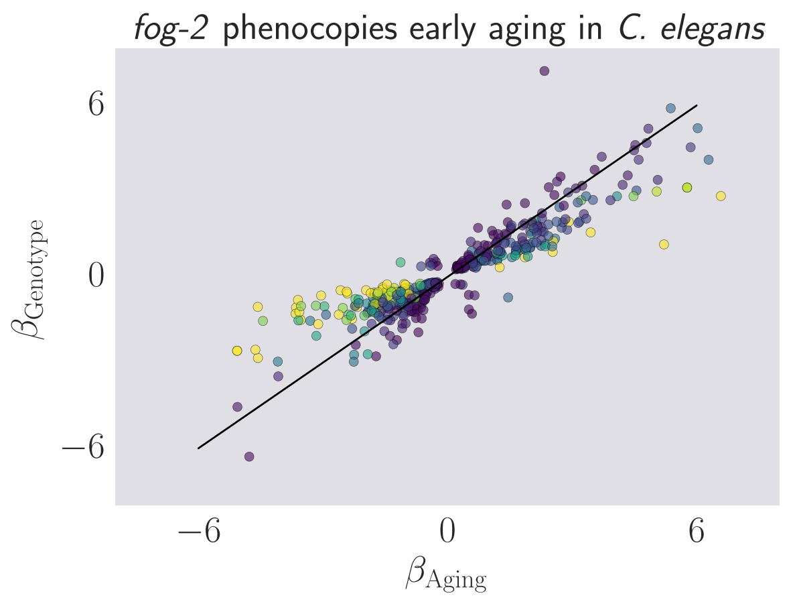


```python
title = r'$\beta_\mathrm{Aging::Genotype}$ = $\beta_\mathrm{Aging}$'

threshold = 20
transformed_q = -dfBetaA[sig].qval.apply(np.log)
transformed_q[transformed_q > threshold] = threshold

cols = [
        "#%02x%02x%02x" % (int(r),
        int(g), int(b)) for r, g, b, _ in
        255*mpl.cm.viridis(mpl.colors.Normalize()(
                           transformed_q))]

plt.scatter(dfBetaA[sig].b, dfBetaAG[sig].b,
            c=transformed_q, cmap='viridis', alpha=0.6, s=25)
x = np.linspace(-6, 6)
plt.plot(x, -x, 'k-', lw=1)
plt.xticks([-6, 0, 6], fontsize=20)
plt.ylim(-9, 9)
plt.yticks([-8, 0, 8], fontsize=20)
plt.xlabel(r'$\beta_\mathrm{Aging}$', fontsize=20).set_path_effects([path_effects.Normal()])
plt.ylabel(r'$\beta_\mathrm{Aging::Genotype}$',
           fontsize=20).set_path_effects([path_effects.Normal()])
plt.title(title).set_path_effects([path_effects.Normal()])

ax = plt.gca()
for i, label in enumerate(ax.get_xticklabels()):
    ax.get_xticklabels()[i].set_path_effects([path_effects.Normal()])
for i, label in enumerate(ax.get_yticklabels()):
    ax.get_yticklabels()[i].set_path_effects([path_effects.Normal()])

plt.savefig('../output/aginggenotype_vs_aging.pdf', bbox_inches='tight')
```


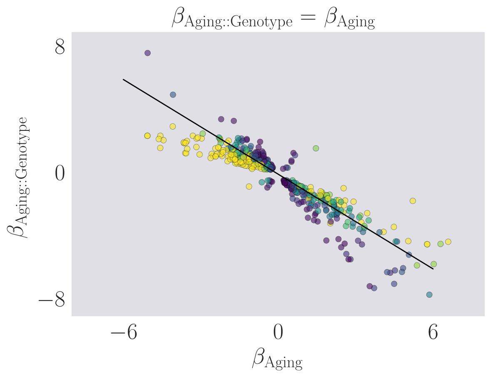


```python
transformed_q = -dfBetaA[sig].qval.apply(np.log)
transformed_q[transformed_q > threshold] = threshold

plt.scatter(dfBetaA[sig].b, dfBetaAG[sig].b,
            c=transformed_q, cmap='viridis', alpha=0.6, s=25)
x = np.linspace(-6, 6)
plt.plot(x, -x, 'k-', lw=1)
plt.xticks([-6, 0, 6], fontsize=20)
plt.ylim(-9, 9)
plt.yticks([-8, 0, 8], fontsize=20)
plt.xlabel(r'$\beta_\mathrm{Genotype}$', fontsize=20)
plt.ylabel(r'$\beta_\mathrm{Aging::Genotype}$', fontsize=20)
plt.title(r'\emph{fog-2} is a molecular phenocopy of early aging in \emph{C. elegans}')
plt.savefig('../output/aginggenotype_vs_genotype.pdf', bbox_inches='tight')
```


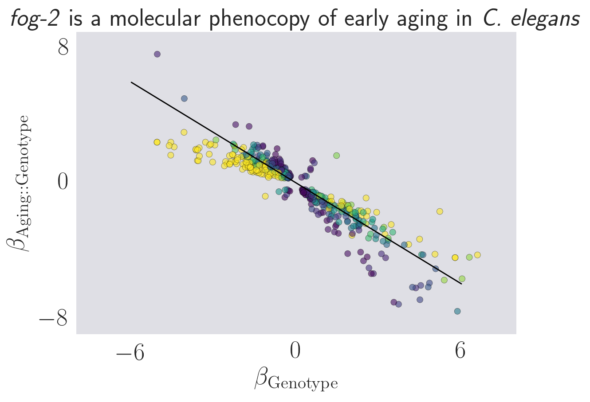


```python

```
